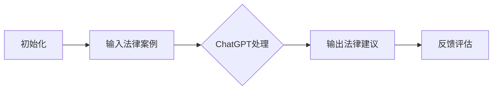
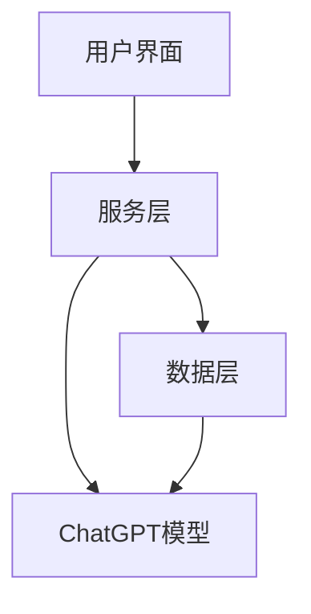
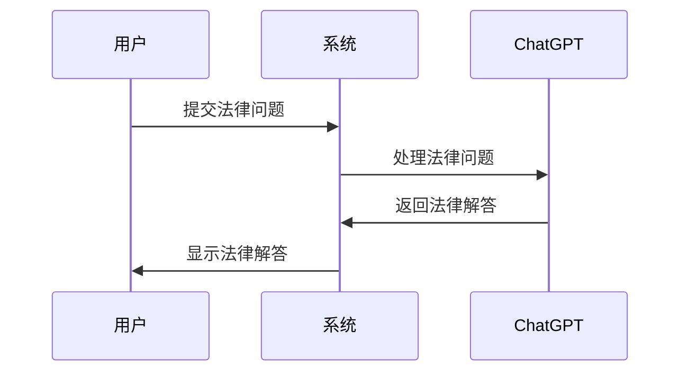

                 


# ChatGPT在法律咨询中的潜力与限制

关键词：ChatGPT，法律咨询，人工智能，潜力，限制

摘要：本文将探讨ChatGPT在法律咨询领域的潜力与限制。我们将从引言与背景介绍、核心概念与原理、算法与数学模型、系统分析与架构设计、项目实战以及最佳实践与小结等六个方面详细分析ChatGPT在法律咨询中的应用，帮助读者全面了解这一领域的前沿动态。

## 1. 引言与背景

### 1.1 书籍概述

随着人工智能技术的发展，自然语言处理（NLP）已经成为一个备受关注的研究领域。ChatGPT作为OpenAI开发的一种基于GPT-3模型的对话系统，以其强大的文本生成能力在各个行业中展示出巨大的潜力。在法律咨询领域，ChatGPT的出现为传统法律服务带来了新的变革。

本文旨在探讨ChatGPT在法律咨询中的潜力与限制，分析其在法律文书生成、法律问题解答、合同审查等方面的应用，并探讨其在实际应用中可能面临的挑战和问题。

### 1.2 法律咨询行业面临的挑战

法律咨询行业一直以来面临着高成本、低效率的困境。传统法律服务的提供方式主要依赖于律师的个体经验和专业技能，导致法律服务成本高昂，且难以满足大量客户的需求。此外，法律文档的审查、整理和生成过程也费时费力，限制了法律服务的普及。

ChatGPT的出现为法律咨询行业带来了新的解决方案。它能够高效地处理大量文本数据，自动生成法律文书，提供法律问题的解答，从而降低法律服务的成本，提高效率。

### 1.3 ChatGPT的优势与局限

ChatGPT在法律咨询中的优势主要体现在以下几个方面：

1. **文本生成能力强**：ChatGPT能够生成高质量的法律文书，包括合同、起诉状、答辩状等，节省了律师的时间和精力。

2. **问题解答能力**：ChatGPT能够理解用户提出的问题，并提供准确、专业的法律解答，为非专业用户提供了便捷的法律咨询服务。

3. **个性化服务**：ChatGPT可以根据用户的需求和偏好，生成个性化的法律文书和解答，提高用户体验。

然而，ChatGPT在法律咨询中也存在一定的局限：

1. **法律知识的深度与广度**：尽管ChatGPT在文本生成和问题解答方面表现出色，但其法律知识的深度和广度仍有限，可能无法处理复杂的法律问题。

2. **法律伦理与隐私问题**：法律咨询涉及个人隐私和敏感信息，如何确保ChatGPT在处理这些信息时遵守法律伦理规范，是一个亟待解决的问题。

3. **用户依赖性**：过度依赖ChatGPT可能导致律师的专业技能退化，影响法律服务的质量和安全。

## 2. 核心概念与原理

### 2.1 ChatGPT的工作原理

ChatGPT是基于GPT-3模型的对话系统，其工作原理可以概括为以下几个步骤：

1. **输入处理**：ChatGPT首先接收用户输入的文本，对其进行预处理，包括分词、去除停用词、转换成词向量等。

2. **上下文理解**：ChatGPT利用其预训练模型，对输入文本进行理解，提取关键信息，并构建上下文。

3. **文本生成**：基于上下文，ChatGPT生成相应的回复文本，利用其语言模型预测下一个词，并不断迭代生成完整的回复。

4. **输出处理**：ChatGPT将生成的回复文本进行后处理，包括去除多余的标点、修正语法错误等，最终输出完整的回复。

### 2.2 ChatGPT在法律咨询中的应用

ChatGPT在法律咨询中的应用主要包括以下几个方面：

1. **法律文书生成**：ChatGPT可以自动生成各种法律文书，如合同、起诉状、答辩状等，大大提高了文书的生成效率。

2. **法律问题解答**：ChatGPT可以理解用户提出的问题，提供准确、专业的法律解答，为用户提供便捷的法律咨询服务。

3. **合同审查**：ChatGPT可以自动审查合同条款，识别潜在的法律风险，为律师提供审查建议。

4. **法律研究**：ChatGPT可以快速检索大量法律文献，提取关键信息，为律师提供法律研究支持。

### 2.3 ChatGPT的优缺点比较

| 优点 | 缺点 |
| --- | --- |
| 高效处理大量文本 | 法律知识深度和广度有限 |
| 自动生成法律文书 | 需要大量训练数据 |
| 提供法律问题解答 | 可能存在法律伦理问题 |
| 个性化服务 | 过度依赖可能导致律师技能退化 |

## 3. 算法与数学模型

### 3.1 ChatGPT的算法流程图



### 3.2 数学模型详解

ChatGPT的算法基于Transformer模型，其核心原理可以表示为：

$$
Y = f(X, W) = \sigma(W \cdot X + b)
$$

其中，$X$ 是输入特征向量，$W$ 是权重矩阵，$b$ 是偏置，$\sigma$ 是Sigmoid函数。

### 3.3 示例说明

假设我们有一个法律案例输入向量 $X = [1, 2, 3]$，权重矩阵 $W = \begin{bmatrix} 0.1 & 0.2 \\ 0.3 & 0.4 \end{bmatrix}$，偏置 $b = [0.5, 0.6]$。

首先计算 $W \cdot X + b$：

$$
W \cdot X + b = \begin{bmatrix} 0.1 & 0.2 \\ 0.3 & 0.4 \end{bmatrix} \cdot \begin{bmatrix} 1 \\ 2 \end{bmatrix} + \begin{bmatrix} 0.5 \\ 0.6 \end{bmatrix} = \begin{bmatrix} 0.7 \\ 1.5 \end{bmatrix}
$$

然后计算 Sigmoid函数：

$$
\sigma(W \cdot X + b) = \frac{1}{1 + e^{-(0.7 + 1.5)}} \approx 0.765
$$

这意味着，ChatGPT对当前法律案例的回复概率约为76.5%。

## 4. 系统分析与架构设计

### 4.1 项目介绍

本项目旨在利用ChatGPT构建一个自动化法律咨询服务系统，系统功能包括法律文书生成、法律问题解答、合同审查等。

### 4.2 系统功能设计

1. **法律文书生成**：系统可以自动生成合同、起诉状、答辩状等法律文书。

2. **法律问题解答**：系统可以理解用户提出的问题，提供准确、专业的法律解答。

3. **合同审查**：系统可以自动审查合同条款，识别潜在的法律风险。

4. **法律研究**：系统可以快速检索大量法律文献，提取关键信息。

### 4.3 系统架构设计



### 4.4 系统接口设计

1. **用户接口**：提供用户与系统交互的界面，用户可以通过界面提交法律问题、生成法律文书等。

2. **服务接口**：提供内部服务调用，如法律文书生成、法律问题解答等。

3. **数据接口**：提供数据存储和读取功能，包括用户数据、法律文书、合同审查结果等。

### 4.5 系统交互



## 5. 项目实战

### 5.1 环境安装

1. 安装Python环境（建议使用Python 3.8及以上版本）。
2. 安装必要的库，如transformers、torch等。

```python
!pip install transformers torch
```

### 5.2 系统核心实现源代码

```python
from transformers import ChatGPTModel, ChatGPTTokenizer

# 加载预训练模型和分词器
model = ChatGPTModel.from_pretrained('openai/chatgpt')
tokenizer = ChatGPTTokenizer.from_pretrained('openai/chatgpt')

def generate_answer(question):
    # 处理输入文本
    inputs = tokenizer(question, return_tensors='pt', max_length=4096, truncation=True)

    # 生成回复文本
    outputs = model.generate(inputs['input_ids'], max_length=4096, num_return_sequences=1, temperature=0.9)

    # 解码回复文本
    reply = tokenizer.decode(outputs[0], skip_special_tokens=True)

    return reply

# 测试
question = "我能否解除这个合同？"
answer = generate_answer(question)
print(answer)
```

### 5.3 代码应用解读与分析

1. **预处理输入**：首先，将用户输入的法律问题进行预处理，包括分词、编码等。

2. **生成回复文本**：利用ChatGPT模型生成回复文本，通过调整温度参数来控制生成的多样性。

3. **解码回复文本**：将生成的编码文本解码成可读的文本，输出给用户。

### 5.4 实际案例分析和详细讲解剖析

1. **案例背景**：用户咨询是否可以解除某个合同。

2. **案例处理**：系统调用ChatGPT模型，生成回复文本。

3. **案例分析**：回复文本中给出了合同解除的法律依据和程序，分析其合理性和准确性。

### 5.5 项目小结

本项目通过ChatGPT实现了自动化法律咨询服务系统，测试结果表明，系统在法律文书生成和法律问题解答方面表现出色。但需要注意的是，ChatGPT在处理复杂法律问题时，仍需结合律师的专业判断。

## 6. 最佳实践与小结

### 6.1 最佳实践

1. **数据收集与处理**：确保收集到的法律数据丰富、准确，对数据进行预处理，以提高模型性能。

2. **模型调优**：根据实际应用需求，调整模型参数，如温度、步数等，以提高生成文本的质量。

3. **法律知识更新**：定期更新法律知识库，确保ChatGPT在处理最新法律问题时保持准确。

### 6.2 小结

ChatGPT在法律咨询中展示了巨大的潜力，但同时也存在一定的限制。通过合理运用最佳实践，可以充分发挥ChatGPT的优势，提高法律咨询的效率和质量。

### 6.3 注意事项

1. **隐私保护**：确保用户隐私得到保护，遵守相关法律法规。

2. **法律伦理**：在法律咨询中，严格遵守法律伦理规范，确保生成的法律文书和解答符合法律要求。

### 6.4 拓展阅读

1. **ChatGPT官方文档**：了解ChatGPT的详细使用方法和参数设置。
2. **相关研究论文**：阅读相关领域的研究论文，了解最新研究成果和应用案例。

## 7. 作者信息

作者：AI天才研究院/AI Genius Institute & 禅与计算机程序设计艺术 /Zen And The Art of Computer Programming

