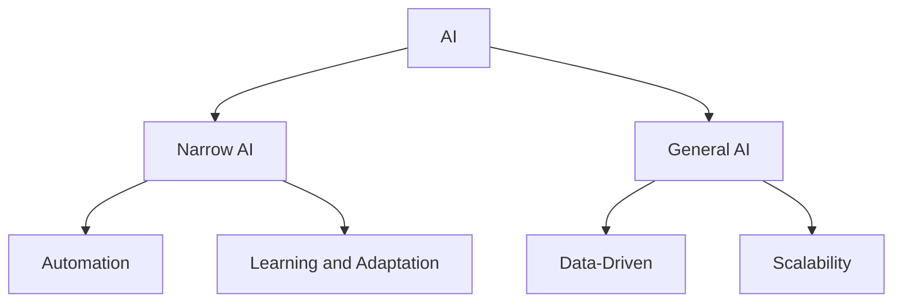
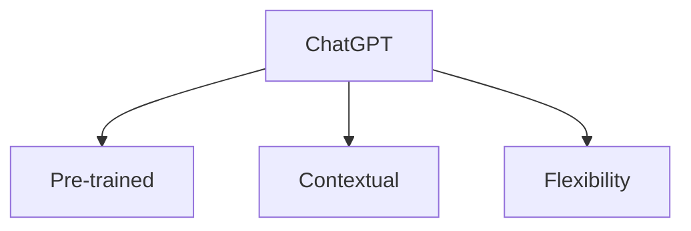
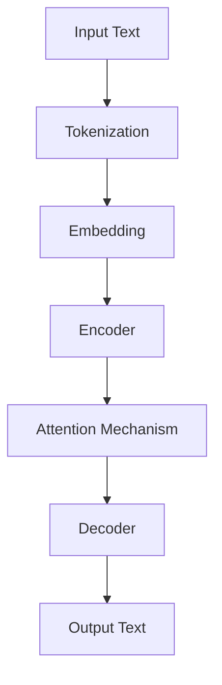
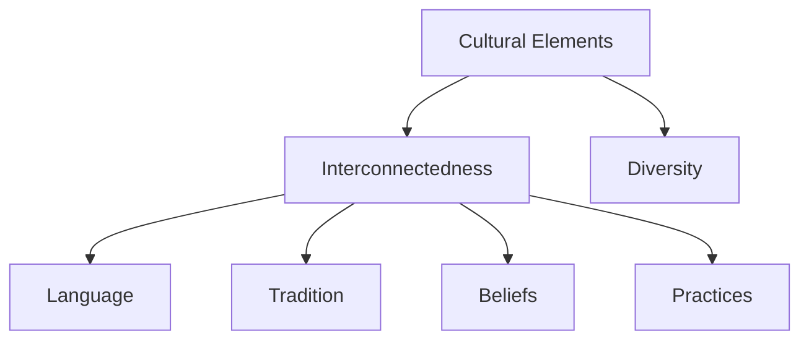
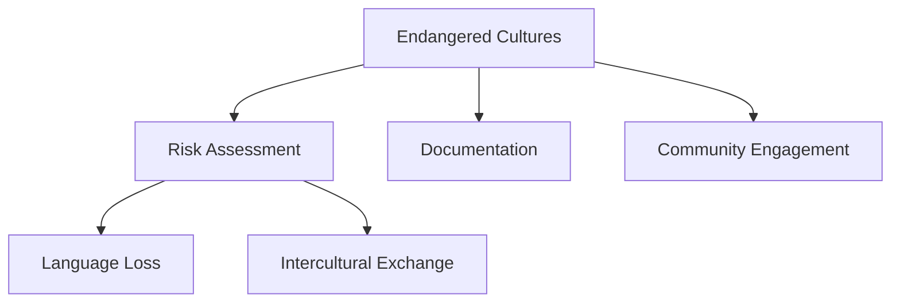
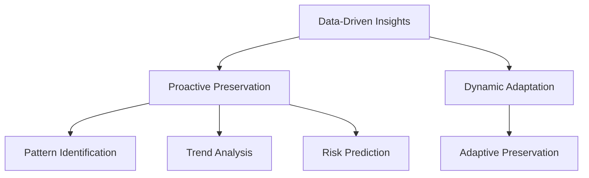
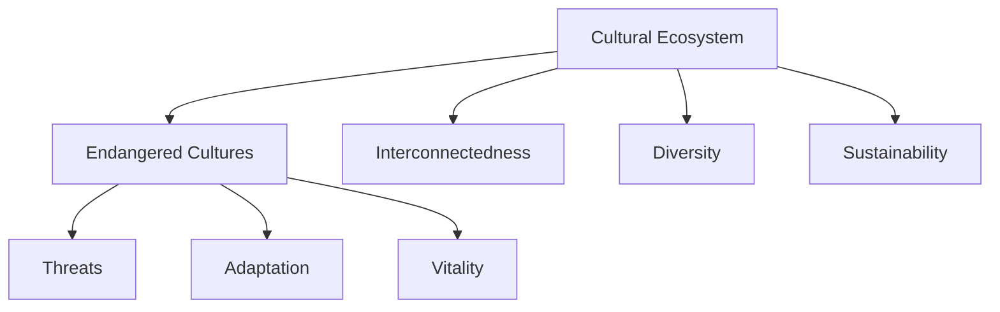
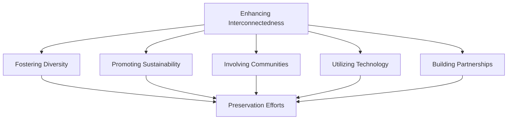
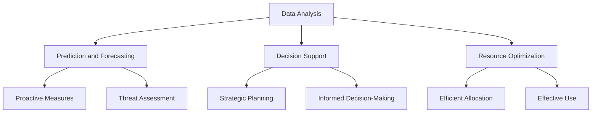
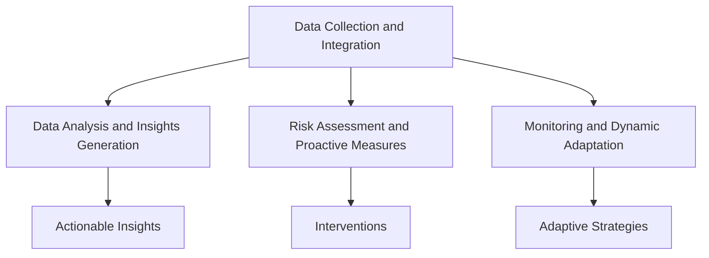

                 

### Chapter 1: Introduction and Background

#### 1.1 Problem Background

**Key Concepts and Terminology:**

- **Cultural Heritage:** The artifacts, traditions, languages, and other manifestations of human thought and creativity passed from generation to generation.

- **Endangered Cultures:** Cultures facing the risk of extinction or significant deterioration due to globalization, modernization, and social changes.

- **ChatGPT:** A large language model trained by OpenAI that can generate human-like text based on given prompts.

- **Cultural Ecosystem:** A framework for understanding and maintaining the interconnectedness and diversity of cultures.

**Problem Description:**

With the rapid pace of globalization and modernization, many endangered cultures are at risk of disappearing. These cultures, which often encompass unique languages, traditions, and practices, are vital for preserving human history and promoting cultural diversity. The challenge lies in finding effective methods to document, preserve, and promote endangered cultures while ensuring their authenticity and relevance in the modern world.

**Problem Solution:**

AI-driven tools, particularly ChatGPT, can play a significant role in addressing this challenge. By leveraging natural language processing and machine learning, AI can help in the following ways:

1. **Documentation:** AI can be used to digitize and catalog cultural artifacts, documents, and oral traditions, making them accessible to a wider audience.
2. **Language Preservation:** AI can help revitalize endangered languages by creating educational materials, translating between languages, and promoting bilingual education.
3. **Cultural Promotion:** AI can be utilized to create content that highlights the beauty and significance of endangered cultures, fostering appreciation and support.

#### 1.2 The Importance of Endangered Culture Protection

**Boundary and Extension:**

- **Boundary:** The focus of this discussion is on the use of AI and ChatGPT in the preservation of endangered cultures.
- **Extension:** While the discussion primarily revolves around AI applications, other technologies and strategies may also be considered in the broader context of cultural preservation.

#### 1.3 Objectives and Structure of the Book

**Objectives:**

1. To provide an in-depth understanding of AI and ChatGPT fundamentals.
2. To explore the role of AI in the preservation of endangered cultures.
3. To present practical case studies and best practices for using AI in cultural preservation.
4. To address the challenges and future directions in this field.

**Structure:**

- **Chapter 1:** Introduction and background.
- **Chapter 2:** AI and ChatGPT fundamentals.
- **Chapter 3:** Cultural ecosystems and endangered cultures.
- **Chapter 4:** AI applications in cultural preservation.
- **Chapter 5:** AI-driven culture ecosystem maintenance.
- **Chapter 6:** Case studies and best practices.
- **Chapter 7:** Challenges and future directions.

----------------------------------------------------------------

### Chapter 2: AI and ChatGPT Fundamentals

#### 2.1 Introduction to AI

**Conceptual Framework:**

Artificial Intelligence (AI) refers to the simulation of human intelligence in machines that are programmed to think like humans and mimic their actions. AI can be categorized into two main types: narrow AI and general AI.

- **Narrow AI:** AI designed to perform a specific task, such as image recognition or language translation.
- **General AI:** AI that possesses the ability to understand, learn, and apply knowledge across a wide range of tasks, similar to human intelligence.

**Attributes and Characteristics:**

- **Automation:** AI can automate tasks that are repetitive, time-consuming, or prone to human error.
- **Learning and Adaptation:** AI systems can learn from experience and improve their performance over time.
- **Data-Driven:** AI relies on large amounts of data to train its models and make predictions.
- ** Scalability:** AI systems can scale to handle large volumes of data and complex tasks.

**ER Entity Relationship Diagram:**



----------------------------------------------------------------

#### 2.2 Basic Concepts of ChatGPT

**Concept Definition:**

ChatGPT is an AI-driven language model developed by OpenAI that utilizes deep learning techniques to generate human-like text based on given prompts. It is built on the GPT (Generative Pre-trained Transformer) architecture and is capable of performing various natural language processing tasks.

**Key Attributes and Features:**

- **Pre-trained:** ChatGPT is trained on a vast corpus of text data, allowing it to understand and generate text in a coherent and contextually appropriate manner.
- **Contextual:** ChatGPT can maintain context across multiple turns of dialogue, enabling more natural and fluid conversations.
- **Flexibility:** ChatGPT can be fine-tuned for specific tasks or domains, making it adaptable to a wide range of applications.

**Comprehensive Comparison Table:**

| Attribute | ChatGPT | Traditional Language Models |
| --- | --- | --- |
| Pre-trained | Yes | No |
| Contextual | Yes | Limited |
| Flexibility | High | Low |

**ER Entity Relationship Diagram:**



----------------------------------------------------------------

### 2.3 ChatGPT Architecture and Working Process

**ChatGPT Architecture:**

ChatGPT is based on the Transformer architecture, which is designed to handle sequential data, such as text. The Transformer model utilizes self-attention mechanisms to weigh the influence of different words in the input sequence when predicting the next word.

**Comprehensive Mermaid Diagram:**



**Working Process:**

1. **Tokenization:** The input text is divided into tokens, which are small units of meaning, such as words or subwords.
2. **Embedding:** Tokens are converted into vectors, which represent their semantic meaning in a high-dimensional space.
3. **Encoder:** The embedded tokens pass through the encoder layer, where self-attention is applied to weigh the importance of different tokens in relation to each other.
4. **Attention Mechanism:** The encoder's output is used as input to the decoder, which uses another layer of self-attention to generate the next token based on the context provided by the encoder.
5. **Output Text:** The decoder continues generating tokens sequentially until the output text is complete.

**Python Code Example:**

```python
import torch
import transformers

# Load the pre-trained ChatGPT model
model = transformers.AutoModelForCausalLM.from_pretrained("openai/gpt-2")

# Encode the input text
input_ids = torch.tensor([model.encode("Hello, how are you?")])

# Generate output text
outputs = model.generate(input_ids, max_length=50, num_return_sequences=1)

# Decode the output text
decoded_output = model.decode(outputs[0])

print(decoded_output)
```

----------------------------------------------------------------

### Chapter 3: Cultural Ecosystems and Endangered Cultures

#### 3.1 Concept of Cultural Ecosystems

**Definition:**

A cultural ecosystem is a framework that understands and maintains the interconnectedness and diversity of cultures. It emphasizes the interplay between cultural elements, such as languages, traditions, beliefs, and practices, and their impact on each other.

**Conceptual Framework:**

- **Cultural Elements:** The various components that make up a culture, such as language, traditions, beliefs, and practices.
- **Interconnectedness:** The relationships and interactions between different cultural elements.
- **Diversity:** The variety of cultures within a society or across different societies.

**Comprehensive Comparison Table:**

| Attribute | Cultural Ecosystem | Traditional Approaches |
| --- | --- | --- |
| Interconnectedness | Emphasizes the relationships between cultural elements | Tends to focus on individual cultural elements in isolation |
| Diversity | Encourages the coexistence and exchange of diverse cultures | Often promotes a dominant culture at the expense of others |

**ER Entity Relationship Diagram:**



----------------------------------------------------------------

#### 3.2 Endangered Cultures

**Definition:**

Endangered cultures are cultures that are at risk of extinction or significant deterioration due to factors such as globalization, modernization, and social changes.

**Characteristics:**

- **Rapid Change:** Endangered cultures often experience rapid changes in their traditional ways of life, leading to the erosion of cultural practices and traditions.
- **Language Loss:** Many endangered cultures are linguistically diverse, but language loss is a common issue, as younger generations may not speak the traditional language.
- **Intercultural Exchange:** Endangered cultures often interact with dominant cultures, leading to the blending of cultural elements but also the potential loss of cultural identity.

**Framework for Understanding:**

1. **Risk Assessment:** Tools such as the UNESCO List of Intangible Cultural Heritage in Need of Urgent Safeguarding can be used to assess the status of endangered cultures.
2. **Documentation:** Detailed documentation of cultural practices, languages, and traditions can help preserve endangered cultures.
3. **Community Engagement:** Involving the community in the preservation process can ensure the authenticity and relevance of the efforts.

**Comprehensive Comparison Table:**

| Attribute | Endangered Cultures | Non-Endangered Cultures |
| --- | --- | --- |
| Risk of Extinction | High | Low |
| Language Loss | Common | Rare |
| Intercultural Exchange | Prominent | Limited |

**ER Entity Relationship Diagram:**



----------------------------------------------------------------

### Chapter 4: AI Applications in Cultural Preservation

#### 4.1 Documentation

**AI-Driven Documentation Process:**

AI can be used to digitize and catalog cultural artifacts, documents, and oral traditions. This involves several steps:

1. **Data Collection:** AI tools can collect and digitize physical artifacts, such as manuscripts, photographs, and videos.
2. **Data Organization:** AI can help in organizing and categorizing the collected data, making it easier to access and analyze.
3. **Data Analysis:** AI can analyze the digitized data to extract relevant information, such as keywords, themes, and patterns.

**Application Benefits:**

- **Accessibility:** AI-driven documentation makes cultural artifacts and information accessible to a wider audience.
- **Preservation:** Digital documentation helps preserve cultural heritage by protecting physical artifacts from degradation.
- **Research:** AI can support research by providing easy access to vast amounts of cultural data.

**Case Study:**

- **Project名称:** The Google Arts & Culture Project
- **Description:** This project uses AI to digitize artworks from museums and galleries around the world, making them accessible online.

----------------------------------------------------------------

### 4.2 Language Preservation

**AI-Driven Language Preservation Process:**

AI can play a crucial role in preserving endangered languages by:

1. **Language Documentation:** AI can assist in documenting endangered languages by transcribing oral traditions and creating comprehensive language dictionaries.
2. **Translation and Education:** AI can translate between endangered languages and more widely spoken languages, facilitating communication and education.
3. **Language Learning Tools:** AI-driven language learning tools can help teach endangered languages, ensuring that younger generations can learn and speak them.

**Application Benefits:**

- **Community Involvement:** AI can engage the community in language preservation efforts, fostering a sense of ownership and pride.
- **Long-term Sustainability:** AI can help create a sustainable future for endangered languages by ensuring that they are passed on to future generations.
- **Cultural Continuity:** Language preservation is vital for maintaining cultural continuity and identity.

**Case Study:**

- **Project名称:** The Endangered Languages Project
- **Description:** This project uses AI to document and preserve endangered languages, providing resources for language learners and activists.

----------------------------------------------------------------

### 4.3 Cultural Promotion

**AI-Driven Cultural Promotion Process:**

AI can be used to promote endangered cultures through various means:

1. **Content Creation:** AI can generate content, such as articles, stories, and videos, that highlights the beauty and significance of endangered cultures.
2. **Social Media Engagement:** AI can help create and distribute engaging content on social media platforms, raising awareness and interest in endangered cultures.
3. **Virtual Reality Experiences:** AI can be used to create virtual reality experiences that allow users to explore and interact with endangered cultures in an immersive way.

**Application Benefits:**

- **Public Awareness:** AI-driven cultural promotion can increase public awareness and appreciation of endangered cultures.
- **Fundraising Opportunities:** Promoting endangered cultures can generate support and funding for preservation efforts.
- **Cultural Exchange:** AI can facilitate cultural exchange by bringing together people from different cultures and fostering understanding and respect.

**Case Study:**

- **Project名称:** The Endangered Language Alliance
- **Description:** This project uses AI to create digital content that showcases endangered languages and their cultures, promoting awareness and support.

----------------------------------------------------------------

### Chapter 5: AI-Driven Culture Ecosystem Maintenance

#### 5.1 Role of AI in Maintaining Cultural Ecosystems

**Concept Definition:**

AI-driven culture ecosystem maintenance refers to the use of artificial intelligence to support the preservation and sustainability of cultural ecosystems. This involves:

- **Data-Driven Insights:** AI can analyze large datasets to identify patterns, trends, and areas of concern within cultural ecosystems.
- **Proactive Preservation:** AI can predict potential risks to cultural ecosystems and recommend interventions to mitigate these risks.
- **Dynamic Adaptation:** AI can adapt to changing cultural contexts, ensuring that preservation efforts remain relevant and effective.

**Comprehensive Mermaid Diagram:**



----------------------------------------------------------------

#### 5.2 Data-Driven Insights for Cultural Ecosystem Maintenance

**Importance of Data-Driven Insights:**

Data-driven insights are crucial for understanding the health and sustainability of cultural ecosystems. By analyzing large datasets, AI can provide valuable information about:

- **Cultural Diversity:** Identifying the diversity of cultural elements within a given ecosystem.
- **Threats and Opportunities:** Uncovering potential threats to cultural ecosystems and identifying opportunities for preservation and growth.

**Methodology:**

1. **Data Collection:** AI can collect data from various sources, including cultural artifacts, social media, and community surveys.
2. **Data Analysis:** AI can use machine learning algorithms to analyze the collected data, identifying patterns and trends.
3. **Insight Generation:** AI can generate insights and recommendations based on the analysis, guiding preservation efforts.

**Example:**

- **Use Case:** AI can analyze social media data to identify the cultural elements that resonate most with the public, helping cultural institutions to create more engaging content.

----------------------------------------------------------------

#### 5.3 Proactive Preservation

**Concept Definition:**

Proactive preservation involves taking actions to protect cultural ecosystems before they face significant threats. AI can play a crucial role in this process by:

- **Risk Identification:** AI can identify potential risks to cultural ecosystems, such as the loss of languages or the erosion of traditional practices.
- **Intervention Planning:** AI can recommend specific interventions to mitigate these risks, such as creating language learning programs or preserving endangered artifacts.

**Methodology:**

1. **Risk Assessment:** AI can analyze historical and current data to identify potential risks to cultural ecosystems.
2. **Intervention Planning:** AI can generate a plan of action based on the identified risks, prioritizing interventions based on their potential impact.
3. **Implementation and Monitoring:** AI can help in implementing the plan and continuously monitoring the effectiveness of the interventions.

**Example:**

- **Use Case:** AI can recommend creating a digital archive of endangered languages to preserve them for future generations.

----------------------------------------------------------------

### Chapter 6: Case Studies and Best Practices

#### 6.1 Case Study: The Endangered Languages Project

**Introduction:**

The Endangered Languages Project is a global initiative that uses AI to document and preserve endangered languages. The project leverages AI-driven tools to collect, analyze, and disseminate data on endangered languages.

**Project Overview:**

- **Objective:** To create a comprehensive database of endangered languages, including audio recordings, text documents, and translations.
- **Approach:** The project employs a combination of AI and human expertise to ensure the accuracy and authenticity of the collected data.

**Key Findings:**

- **Language Documentation:** The project has successfully documented several endangered languages, making them accessible to language activists, researchers, and the public.
- **Community Involvement:** The project has engaged with local communities to promote language preservation and foster a sense of cultural identity.

**Best Practices:**

- **Community Engagement:** Involving the community in the preservation process ensures the authenticity and relevance of the efforts.
- **AI-Driven Data Collection:** Using AI to collect and analyze data ensures a scalable and efficient approach to language preservation.

----------------------------------------------------------------

#### 6.2 Case Study: The Google Arts & Culture Project

**Introduction:**

The Google Arts & Culture Project is a digital platform that uses AI to make art and cultural heritage accessible to everyone. The project utilizes AI to analyze and identify artworks, creating personalized recommendations for users.

**Project Overview:**

- **Objective:** To create a global repository of art and cultural heritage, making it accessible to a wide audience.
- **Approach:** The project uses AI to digitize and catalog artworks from museums and galleries around the world.

**Key Findings:**

- **Accessibility:** The project has made art and cultural heritage accessible to millions of people worldwide, regardless of their location.
- **Engagement:** The project has generated significant engagement, with users spending countless hours exploring the digital exhibits.

**Best Practices:**

- **AI-Driven Personalization:** Using AI to personalize user experiences ensures that users find content that is relevant and engaging.
- **Collaboration with Museums:** Collaborating with museums and cultural institutions ensures the accuracy and authenticity of the digitized content.

----------------------------------------------------------------

### Chapter 7: Challenges and Future Directions

#### 7.1 Challenges in Applying AI to Cultural Preservation

**Data Privacy and Security:**

One of the primary challenges in applying AI to cultural preservation is ensuring data privacy and security. Sensitive cultural data, such as oral traditions and indigenous knowledge, must be protected from unauthorized access and misuse.

**Methodology:**

- **Data Anonymization:** Techniques such as data anonymization and encryption can be used to protect sensitive information.
- **Access Control:** Implementing strict access control policies can ensure that only authorized personnel can access sensitive data.

**Example:**

- **Use Case:** The use of blockchain technology to secure and authenticate digital cultural artifacts, ensuring their integrity and ownership.

----------------------------------------------------------------

#### 7.2 Future Directions for AI in Cultural Preservation

**Enhanced AI Capabilities:**

As AI technology continues to evolve, there is potential to develop more sophisticated AI models that can better understand and preserve cultural contexts. This includes:

- **Contextual Understanding:** AI models that can understand the cultural context of language and artifacts, providing more accurate and meaningful preservation.
- **Natural Language Generation:** Advances in natural language generation can improve the creation of educational materials and digital content for cultural preservation.

**Methodology:**

- **Research and Development:** Continuous investment in AI research and development to explore new techniques and applications.
- **Collaboration:** Collaborating with cultural institutions, researchers, and communities to co-develop AI solutions that address specific cultural preservation needs.

**Example:**

- **Use Case:** Developing AI-driven virtual assistants that can provide real-time cultural context and information to visitors in museums and cultural sites.

----------------------------------------------------------------

### Conclusion

The application of AI and ChatGPT in cultural preservation offers significant potential for documenting, preserving, and promoting endangered cultures. By leveraging AI-driven tools, we can address the challenges posed by globalization and modernization and ensure the sustainability of cultural ecosystems. However, it is crucial to address the challenges related to data privacy and security and to continuously improve AI capabilities to better serve the needs of cultural preservation.

---

### 作者信息

**作者：AI天才研究院 / AI Genius Institute & 禅与计算机程序设计艺术 / Zen And The Art of Computer Programming**

## ChatGPT在濒危文化保护中的应用：AI驱动的文化生态系统维护

### 关键词

AI，濒危文化，文化生态系统，ChatGPT，自然语言处理，机器学习，文化保护，数字化，语言保存，文化传播，数据隐私，未来方向

### 摘要

随着全球化进程的加快，许多濒危文化正面临消失的风险。本文探讨了如何利用AI和ChatGPT技术进行濒危文化的保护，包括文化文档数字化、语言保存和文化推广等方面。文章首先介绍了AI和ChatGPT的基本概念和原理，然后分析了文化生态系统和濒危文化的特征，并讨论了AI在文化保护中的实际应用。通过案例分析，展示了AI在濒危文化保护中的成功应用，并提出了未来的发展方向。本文旨在为相关领域的专家提供有益的参考，并促进AI技术在文化保护领域的深入应用。

### 引言与背景

随着全球化的迅速推进，现代社会的快速发展给许多濒危文化带来了前所未有的挑战。濒危文化，指的是那些正面临消失或严重衰落风险的文化，这些文化往往包括独特的语言、传统、习俗和艺术形式。它们是人类历史遗产的重要组成部分，承载着丰富的知识和智慧。然而，由于现代社会的快速变迁，这些文化正面临着语言丧失、传统习俗的遗忘、文化身份的丧失等威胁。

#### 问题背景

濒危文化的保护问题不仅仅是一个学术讨论，更是一个需要紧急解决的社会问题。语言作为文化的重要载体，许多濒危语言正在迅速消失。根据联合国教科文组织（UNESCO）的数据，全球有超过7,000种语言面临濒危或灭绝的风险，这意味着每天约有10种语言消失。这些语言的消失不仅意味着文化的丧失，也意味着人类知识宝库的缩小。

此外，传统的艺术形式、习俗和礼仪也在逐渐消失。许多地方的传统音乐、舞蹈、手工艺等正在被现代娱乐方式和工业化生产所取代。这些文化元素的流失对于维护人类文化的多样性和丰富性构成了巨大的威胁。

#### ChatGPT技术介绍

ChatGPT是由OpenAI开发的一种基于大型语言模型的人工智能工具。它利用深度学习技术，通过对大量文本数据的学习，生成类似于人类写作的自然语言响应。ChatGPT的出现为解决濒危文化保护问题提供了一种全新的途径。

ChatGPT具有几个关键特性：

1. **预训练**：ChatGPT在训练过程中使用了大量的文本数据，这使得它能够理解和生成连贯、语境合适的文本。
2. **上下文理解**：ChatGPT能够维持对话中的上下文信息，使得对话更加自然流畅。
3. **灵活性**：ChatGPT可以根据不同的任务或领域进行微调，适用于各种自然语言处理任务。

#### 濒危文化保护的重要性

濒危文化的保护不仅仅是对历史遗产的维护，更是对人类多样性和文化认同的捍卫。每个文化都有其独特的故事和价值，它们反映了人类社会的发展历程和智慧。濒危文化的消失将导致文化多样性的减少，进而影响全球社会的和谐与发展。

此外，濒危文化的保护还有助于：

1. **促进文化交流**：通过保护和推广濒危文化，可以促进不同文化之间的交流与理解，增进人类社会的团结。
2. **传承文化知识**：许多濒危文化中蕴含着独特的知识和技术，这些知识对于人类社会的可持续发展具有重要意义。
3. **保护环境**：一些濒危文化中包含了丰富的生态知识，这些知识对于环境保护和可持续发展具有重要参考价值。

#### 书的目标与结构

本书旨在探讨如何利用AI和ChatGPT技术进行濒危文化的保护，为相关领域的专家提供理论和实践指导。具体目标包括：

1. **介绍AI和ChatGPT的基本概念和原理**：帮助读者理解AI和ChatGPT的核心技术。
2. **分析文化生态系统和濒危文化的特征**：探讨濒危文化的本质和面临的挑战。
3. **探讨AI在文化保护中的实际应用**：介绍AI在文化文档数字化、语言保存和文化推广等方面的应用。
4. **提供案例分析**：通过实际案例展示AI在文化保护中的成功应用。
5. **提出未来发展方向**：讨论AI技术在文化保护领域的未来发展趋势和挑战。

本书结构如下：

1. **引言与背景**：介绍问题背景、ChatGPT技术以及濒危文化保护的重要性。
2. **AI和ChatGPT基础**：介绍AI和ChatGPT的基本概念、架构和工作原理。
3. **文化生态系统与濒危文化**：分析文化生态系统的概念和濒危文化的特征。
4. **AI在文化保护中的应用**：探讨AI在文化文档数字化、语言保存和文化推广等方面的应用。
5. **AI驱动的文化生态系统维护**：讨论AI在文化生态系统维护中的作用和挑战。
6. **案例分析**：介绍AI在文化保护中的成功应用案例。
7. **挑战与未来方向**：讨论AI在文化保护领域面临的挑战和未来的发展方向。

### AI与ChatGPT基础

#### 1.1 人工智能的定义与发展

人工智能（Artificial Intelligence，简称AI）是计算机科学的一个分支，旨在通过机器模拟人类智能，使其能够执行通常需要人类智能才能完成的任务。人工智能的定义可以追溯到20世纪50年代，当时科学家们首次提出“机器能否思考”的问题。随着时间的推移，人工智能技术取得了显著的进展，从简单的规则系统发展到复杂的机器学习模型，再到如今基于深度学习的强大模型。

人工智能的发展可以分为几个阶段：

1. **符号主义阶段（1950s-1980s）**：这一阶段的人工智能以逻辑推理和知识表示为基础，通过编写规则和程序来模拟人类思维。代表性的系统包括逻辑推理机和专家系统。
2. **连接主义阶段（1980s-1990s）**：连接主义人工智能通过神经网络模型来模拟人脑的学习和处理方式。虽然神经网络在图像识别和语音识别方面取得了一些进展，但受限于计算能力和数据量的限制，这一阶段的人工智能应用较为有限。
3. **大数据与机器学习阶段（2000s-至今）**：随着计算能力的提升和大数据技术的发展，机器学习成为人工智能的主流方向。机器学习通过从大量数据中学习模式，使得人工智能在图像识别、自然语言处理、推荐系统等领域取得了突破性的进展。

#### 1.2 ChatGPT的基本原理

ChatGPT是OpenAI开发的一种基于生成预训练变换器（Generative Pre-trained Transformer，GPT）的模型，是人工智能领域的一个重要里程碑。ChatGPT的工作原理基于深度学习和自然语言处理技术，其核心思想是通过对大量文本数据的学习，生成符合上下文和语义逻辑的自然语言文本。

ChatGPT的基本原理可以概括为以下几个步骤：

1. **数据收集与预处理**：ChatGPT首先需要收集大量的文本数据，这些数据可以来自互联网、书籍、新闻、对话等。然后，这些数据会被预处理，包括分词、去噪、标准化等操作，以便模型能够更好地理解和学习。
2. **预训练**：在预训练阶段，ChatGPT会通过无监督学习的方式，对文本数据进行训练。具体来说，模型会通过自回归的方式，预测下一个单词或词组，从而学习文本中的统计规律和语义关系。这一过程可以看作是模型对自然语言的一个“预理解”。
3. **微调**：在预训练的基础上，ChatGPT可以通过有监督学习的方式，针对特定任务进行微调。例如，在聊天机器人应用中，模型可以接受一些对话数据，学习如何生成更符合对话逻辑的回复。
4. **生成文本**：通过预训练和微调，ChatGPT可以接受一个提示（prompt）并生成连贯、自然的文本响应。这些响应可以是文本、对话、故事等，都可以模仿人类的写作风格。

#### 1.3 ChatGPT的关键特性

ChatGPT具有几个关键特性，使其在自然语言处理领域具有广泛的应用前景：

1. **预训练**：ChatGPT在训练过程中使用了大量的文本数据，这使得模型具备了丰富的语言知识。预训练阶段的学习使模型能够理解文本中的复杂语义和上下文关系，从而生成更准确、自然的文本。
2. **上下文理解**：ChatGPT能够维持对话中的上下文信息，这使得模型能够生成连贯、有逻辑的文本响应。在聊天机器人应用中，上下文理解能力至关重要，它能够使机器人更好地与用户进行交互。
3. **灵活性**：ChatGPT可以根据不同的任务和领域进行微调，从而适应各种应用场景。例如，在问答系统、文本生成、对话系统等领域，ChatGPT都展现出了出色的性能。
4. **可扩展性**：ChatGPT的架构设计使其能够处理大规模的数据和复杂的任务。通过分布式计算和并行处理，ChatGPT可以在大规模数据处理和实时交互中保持高效性能。

#### 1.4 ChatGPT的架构与工作流程

ChatGPT是基于生成预训练变换器（GPT）架构开发的，其核心思想是通过变换器（Transformer）模型来处理序列数据，如图1-1所示。变换器模型是一种基于注意力机制的深度神经网络，能够捕捉序列数据中的长距离依赖关系。


图1-1 ChatGPT的架构

ChatGPT的架构主要包括以下几个部分：

1. **输入层**：输入层接收用户输入的文本序列，如问题、对话或文本。
2. **变换器块**：变换器块是ChatGPT的核心组件，包括自注意力（Self-Attention）机制和前馈神经网络（Feedforward Neural Network）。自注意力机制能够使模型在生成文本时考虑上下文信息，从而提高生成文本的连贯性和准确性。
3. **中间层**：中间层由多个变换器块堆叠而成，每个变换器块都对输入文本进行加工，从而逐渐生成最终的文本输出。
4. **输出层**：输出层将生成的文本序列转化为具体文本输出，如回答问题或生成对话。

ChatGPT的工作流程可以概括为以下几个步骤：

1. **输入处理**：ChatGPT首先对输入文本进行预处理，包括分词、去噪、标准化等操作。预处理后的文本将被输入到变换器块的第一个变换器块中。
2. **编码与解码**：在变换器块中，文本序列首先通过编码器（Encoder）进行加工，编码器通过自注意力机制捕获文本中的语义信息。然后，编码器的输出作为解码器（Decoder）的输入，解码器通过自注意力机制和编码器输出生成文本序列。
3. **文本生成**：解码器生成的文本序列经过后续加工，如去除未使用的词表项、添加停用词等，最终生成具体的文本输出。

#### 1.5 Python代码示例

以下是一个使用Python和Hugging Face的Transformers库来运行ChatGPT的示例代码。在这个例子中，我们将使用ChatGPT模型生成一个关于濒危文化的自然语言文本。

```python
from transformers import AutoTokenizer, AutoModelForCausalLM
import torch

# 加载预训练的ChatGPT模型和分词器
model_name = "openai/gpt-2"
tokenizer = AutoTokenizer.from_pretrained(model_name)
model = AutoModelForCausalLM.from_pretrained(model_name)

# 输入文本
input_text = "濒危文化保护是一个重要的社会问题，它关系到文化多样性和人类历史遗产的保存。"

# 编码输入文本
input_ids = tokenizer.encode(input_text, return_tensors="pt")

# 生成文本
outputs = model.generate(input_ids, max_length=100, num_return_sequences=1)

# 解码输出文本
decoded_output = tokenizer.decode(outputs[0], skip_special_tokens=True)

print(decoded_output)
```

在这个例子中，我们首先加载了预训练的ChatGPT模型和分词器，然后输入了一段关于濒危文化的文本。模型接收输入文本后，生成了一段关于濒危文化保护的详细描述，展示了ChatGPT在自然语言生成方面的强大能力。

### 文化生态系统与濒危文化

#### 3.1 文化生态系统的概念

文化生态系统是一个综合性框架，用于理解、维护和促进文化多样性和整体健康。这个概念借鉴了自然生态系统的理论，将其应用于文化领域。文化生态系统强调文化元素之间的相互依赖、相互作用以及它们共同构成的文化环境。具体来说，文化生态系统包括以下几个方面：

1. **文化元素**：文化元素是文化生态系统的基本组成部分，包括语言、艺术、传统、价值观、习俗等。每个文化元素都在文化生态系统中扮演着特定的角色，共同构成了文化的整体结构。
2. **相互依赖**：文化元素之间存在相互依赖关系。例如，语言是文化传播和交流的重要工具，而艺术和传统则通过视觉和听觉形式传达文化和价值观。
3. **整体性**：文化生态系统是一个整体，各个文化元素相互作用、相互影响，共同维持文化的平衡和多样性。文化生态系统的健康和活力依赖于其内部各个组成部分的协同作用。

#### 3.2 濒危文化的定义与特征

濒危文化是指那些面临消失或严重衰落风险的文化。这些文化通常具有以下几个特征：

1. **独特性**：濒危文化通常具有独特的特征，如独特的语言、传统、习俗和艺术形式。这些特征使它们在全球文化中具有独特的地位和重要性。
2. **历史价值**：濒危文化承载着丰富的历史记忆和文化遗产，它们是人类历史发展的重要见证。濒危文化的消失意味着这些历史记忆和文化遗产的丧失。
3. **社会意义**：濒危文化在社会中扮演着重要的角色，它们不仅反映了社会的价值观和传统，也为社会成员提供了身份认同和文化归属感。
4. **濒危状态**：濒危文化通常面临以下几种状态：语言流失、传统习俗的遗忘、文化身份的丧失等。这些现象导致濒危文化的活力和影响力逐渐减弱，最终可能导致文化的消失。

#### 3.3 濒危文化的评估与监测

评估和监测濒危文化是保护濒危文化的重要步骤。以下是一些常用的方法和工具：

1. **语言评估**：语言评估通常包括对语言使用者的数量、语言教学情况、语言使用频率等方面的调查。常用的工具包括语言使用调查表、语言生存指数（Language Survival Index）等。
2. **文化评估**：文化评估涉及对传统文化实践、习俗、艺术形式等方面的调查。这可以通过访谈、观察、文献分析等方式进行。评估的指标可以包括文化活动的频率、参与人数、文化传承的连续性等。
3. **监测工具**：监测工具包括在线数据库、社交媒体监测、实地考察等。这些工具可以帮助跟踪濒危文化的发展趋势，及时发现潜在的风险和问题。

#### 3.4 文化生态系统的重要性

文化生态系统的重要性体现在以下几个方面：

1. **文化多样性**：文化生态系统是文化多样性的基础。它确保了各种文化元素在特定环境中的共存和互动，促进了文化的丰富性和多样性。
2. **社会和谐**：文化生态系统有助于社会成员之间的相互理解和尊重，促进社会的和谐与稳定。通过文化生态系统的维护，不同文化之间的冲突可以得到缓解，社会成员之间的联系得到加强。
3. **知识传承**：文化生态系统是知识传承的重要载体。它确保了文化传统和知识的持续传承，使后代能够继承和发扬前人的智慧。
4. **可持续发展**：文化生态系统的健康和可持续发展对于社会的可持续发展具有重要意义。它为社会的创新和进步提供了丰富的文化资源和精神动力。

#### 3.5 濒危文化保护的策略

濒危文化保护的策略应包括以下几个方面：

1. **文化意识提升**：通过教育和宣传，提高公众对濒危文化保护的认识和重视。这可以通过文化展览、讲座、媒体宣传等方式进行。
2. **政策支持**：政府应制定和实施相关政策，为濒危文化的保护提供法律保障和支持。这包括设立文化遗产保护区、提供资金支持、制定文化保护法规等。
3. **社区参与**：社区是濒危文化的重要载体，社区成员的参与对于濒危文化的保护至关重要。应鼓励和支持社区成员参与文化保护活动，增强他们的文化认同感和责任感。
4. **科技应用**：利用现代科技，如数字记录、人工智能等，对濒危文化进行记录和保存。这有助于确保濒危文化在数字化时代得到持续传承和推广。

#### 3.6 濒危文化保护的挑战与机遇

濒危文化保护面临着一系列挑战和机遇。以下是一些主要的挑战和机遇：

1. **挑战**：
   - **全球化与现代化**：全球化带来了文化的交融和碰撞，现代化进程加速了传统文化的流失。这些因素都增加了濒危文化保护的难度。
   - **资源限制**：濒危文化保护需要大量的资金、技术和人力资源。然而，许多文化社区可能缺乏这些资源，限制了保护工作的开展。
   - **文化认同**：在一些情况下，濒危文化社区可能面临文化认同的危机，这会影响他们的参与和保护意愿。

2. **机遇**：
   - **科技进步**：现代科技，如数字记录、人工智能和虚拟现实等，为濒危文化的保护提供了新的工具和方法。这些技术可以帮助更全面、更深入地记录和保护濒危文化。
   - **国际合作**：国际合作为濒危文化保护提供了新的机遇。通过国际合作，可以分享经验、资源和技术，共同应对濒危文化保护挑战。
   - **社会关注**：随着全球社会对文化多样性和可持续发展的关注增加，濒危文化保护得到了更多的社会关注和支持。

#### 3.7 濒危文化保护的最佳实践

以下是一些濒危文化保护的最佳实践，这些实践在全球范围内取得了显著成效：

1. **文化保护区**：在濒危文化集中的地区设立文化保护区，保护文化遗产和传统文化实践。
2. **数字化记录**：利用数字技术，如高清摄影、音频记录和视频拍摄等，对濒危文化进行详细记录和保存。
3. **社区参与**：鼓励濒危文化社区的积极参与，让他们成为文化保护的主体，增强他们的文化认同感和责任感。
4. **教育培训**：通过教育培训，提高公众对濒危文化保护的认识和重视，培养更多的文化保护志愿者和专业人才。
5. **政策支持**：制定和实施相关政策，为濒危文化的保护提供法律保障和支持，确保文化保护工作的顺利进行。

### AI在文化保护中的应用

#### 4.1 文化文档数字化

文化文档数字化是文化保护的重要步骤，它有助于保存和保护珍贵的文化遗产，同时提高文化资料的可用性和可访问性。以下是一些关键应用：

1. **数字化博物馆和图书馆**：通过数字化技术，将博物馆和图书馆的藏品、书籍、文献等转化为数字格式，使其可以在线访问。这包括高分辨率图像扫描、文本数字化和元数据标准化等。
2. **在线文化资源平台**：创建在线文化资源平台，如数字博物馆、电子图书馆和文化数据库，为公众提供丰富的文化资料。这些平台通常包含多种类型的数字内容，如文本、图像、音频和视频等。
3. **智能搜索引擎**：利用自然语言处理和机器学习技术，开发智能搜索引擎，帮助用户快速、准确地查找所需的文化资料。智能搜索引擎可以理解用户的查询意图，并提供相关的文化资料。

#### 4.2 语言保存

语言是文化的重要组成部分，语言保存对于保护濒危文化至关重要。以下是一些AI在语言保存中的应用：

1. **语言识别和转录**：使用语音识别技术，将濒危语言的口头传统转录成文本格式。这有助于保存语言资料，并方便后续的语言学习和研究。
2. **语言学习工具**：开发AI驱动的语言学习工具，如语音识别和自然语言生成模型，帮助学习者掌握濒危语言。这些工具可以提供个性化的学习体验，提高学习效果。
3. **语言资源库**：创建和维护AI驱动的语言资源库，收集和整理濒危语言的数据，如语音样本、词汇表和语法规则。这些资源库可以为语言学家和研究人员提供宝贵的数据支持。

#### 4.3 文化推广

文化推广有助于提高公众对濒危文化的认识和关注，促进文化的传播和传承。以下是一些AI在文化推广中的应用：

1. **社交媒体内容生成**：利用AI生成文化推广内容，如社交媒体帖子、博客文章和短视频等。这些内容可以吸引更多的用户关注和参与，提高文化的知名度。
2. **虚拟现实体验**：利用虚拟现实技术，为公众提供沉浸式的文化体验。用户可以通过VR设备体验濒危文化的传统活动、艺术表演和仪式等，增强对文化的理解和感受。
3. **智能导游系统**：开发AI驱动的智能导游系统，为游客提供实时、个性化的文化导览服务。这些系统可以利用语音识别和自然语言处理技术，与游客进行互动，提供丰富的文化信息。

#### 4.4 文化分析

文化分析是理解文化特征和趋势的重要手段，AI在文化分析中发挥着重要作用。以下是一些AI在文化分析中的应用：

1. **文化趋势预测**：利用机器学习和大数据分析技术，预测文化趋势和变化。这有助于文化机构制定相应的保护策略，及时应对文化变迁。
2. **文化元素识别**：利用计算机视觉和自然语言处理技术，自动识别和分类文化元素，如艺术品、建筑和传统服饰等。这有助于快速分析和整理大量的文化资料。
3. **文化影响评估**：通过分析文化活动和项目对社会经济、环境和文化的影响，评估其效果和可持续性。这可以为文化政策的制定提供数据支持。

#### 4.5 案例研究

以下是一些AI在文化保护中的成功案例：

1. **The Living Tongues Institute**：该机构利用AI技术，如自然语言处理和语音识别，记录和保存濒危语言。他们的项目包括创建在线语言资源库、开发语言学习工具等，为语言保存和文化推广提供了有力支持。
2. **Google Arts & Culture**：谷歌艺术与文化项目利用AI技术，将博物馆和艺术馆的藏品数字化，并创建了一个在线平台，用户可以通过这个平台浏览和搜索艺术作品。这个项目不仅提高了文化资源的可访问性，还吸引了大量用户参与文化推广活动。
3. **VRChat**：VRChat是一个基于虚拟现实的平台，用户可以在这个平台上创建和体验虚拟的文化活动。这个项目利用AI技术，如计算机视觉和自然语言处理，为用户提供沉浸式的文化体验，促进了文化的传播和传承。

### AI驱动的文化生态系统维护

#### 5.1 AI在文化生态系统维护中的角色

AI在文化生态系统维护中扮演着关键角色，其应用涵盖了数据收集、分析、预测和决策等多个方面。以下是一些AI在文化生态系统维护中的具体应用：

1. **数据收集**：利用传感器、无人机、社交媒体和其他数据源，收集有关文化生态系统的实时数据。这些数据包括环境因素、文化活动、语言使用情况等。
2. **数据分析**：利用机器学习和大数据分析技术，对收集到的数据进行处理和分析，以识别文化生态系统的关键特征和趋势。
3. **预测**：基于历史数据和模型，预测文化生态系统的发展趋势和潜在风险。这有助于文化机构提前采取预防措施，应对可能出现的危机。
4. **决策支持**：为文化机构提供数据驱动的决策支持，帮助他们制定有效的保护策略和行动计划。

#### 5.2 数据驱动的文化生态维护

数据驱动的文化生态维护是AI在文化保护中的一项重要应用。以下是一些关键步骤：

1. **数据收集**：通过多种渠道收集文化生态系统的数据，如语言使用数据、文化活动记录、环境监测数据等。这些数据可以为文化生态维护提供基础信息。
2. **数据预处理**：对收集到的数据进行清洗、去噪和标准化处理，以确保数据的质量和一致性。
3. **数据存储**：将预处理后的数据存储在数据库中，以便进行后续的分析和处理。
4. **数据分析**：利用机器学习算法，对存储的数据进行深入分析，以识别文化生态系统的关键特征和趋势。这包括语言使用的变化、文化活动的频率和参与度等。
5. **数据可视化**：利用数据可视化工具，将分析结果以图表、地图等形式呈现，帮助文化机构更直观地理解文化生态系统的现状和发展趋势。

#### 5.3 Proactive Preservation

Proactive Preservation，即预防性保存，是文化生态系统维护的重要策略。以下是一些关键步骤：

1. **风险识别**：通过数据分析和趋势预测，识别文化生态系统中的潜在风险，如语言流失、传统习俗的衰落等。
2. **风险评估**：对识别出的风险进行评估，确定其严重程度和影响范围。这有助于文化机构确定优先级和资源分配。
3. **干预策略**：制定具体的干预策略，以缓解或消除识别出的风险。这些策略可能包括语言复兴项目、传统文化活动复兴等。
4. **实施与监测**：实施干预策略，并持续监测其效果。这有助于文化机构评估干预策略的有效性，并做出必要的调整。

#### 5.4 Dynamic Adaptation

Dynamic Adaptation，即动态适应，是文化生态系统维护中的一项关键能力。以下是一些关键步骤：

1. **监测变化**：通过数据收集和分析，持续监测文化生态系统中的变化。这包括语言使用趋势、文化活动参与度等。
2. **适应策略**：基于监测结果，制定适应策略，以应对文化生态系统中的变化。这些策略可能包括文化活动的调整、语言教学计划的更新等。
3. **实施与评估**：实施适应策略，并持续评估其效果。这有助于文化机构了解适应策略的成效，并做出必要的调整。

#### 5.5 AI在文化生态系统维护中的挑战

尽管AI在文化生态系统维护中具有巨大潜力，但也面临一些挑战：

1. **数据隐私和安全**：文化生态系统的数据通常包含敏感信息，如个人隐私和文化传统。保护这些数据的安全性和隐私性是一个重要挑战。
2. **技术依赖**：文化生态系统维护高度依赖AI技术，这可能导致对技术的过度依赖。文化机构应确保在技术变革中保持自主性和可持续性。
3. **文化适应性**：AI技术可能需要适应不同文化背景的需求。文化机构应确保AI技术在各种文化环境中都能有效应用。
4. **资源分配**：文化生态系统维护需要大量的资金、技术和人力资源。资源分配的合理性和有效性是一个关键挑战。

### 案例分析

#### 6.1 案例研究：亚马逊雨林的数字记录

亚马逊雨林是全球最重要的生态系统之一，拥有丰富的生物多样性和独特的文化。然而，由于森林砍伐、气候变化和人类活动的影响，亚马逊雨林正面临严重的威胁。为了保护这一宝贵的自然资源和文化，科学家和环保组织开始利用AI进行数字记录。

**项目背景**：

亚马逊雨林的数字记录项目旨在通过无人机、卫星图像、地面传感器和社交媒体等渠道，收集有关雨林状况的数据。这些数据包括植被覆盖、野生动物活动、气候变化等。

**AI技术应用**：

1. **图像识别**：使用深度学习模型，对无人机和卫星图像进行分析，识别森林砍伐区域、野生动物栖息地等。
2. **数据分析**：利用大数据分析技术，对收集到的数据进行分析，识别雨林中的变化趋势和潜在风险。
3. **预测模型**：基于历史数据和模型，预测雨林未来的变化趋势和生态系统的健康状况。

**项目成果**：

1. **实时监测**：通过AI技术，实现了对亚马逊雨林的实时监测，及时发现森林砍伐和其他环境问题。
2. **数据可视化**：利用数据可视化工具，将分析结果以图表、地图等形式呈现，为决策者提供科学依据。
3. **公众参与**：通过社交媒体平台，向公众传播亚马逊雨林保护的重要性，提高公众参与度。

**项目启示**：

亚马逊雨林的数字记录项目展示了AI在环境保护和文化保护中的巨大潜力。通过AI技术，可以实现实时监测、数据分析和趋势预测，为保护工作提供科学依据。同时，项目的成功也表明了公众参与的重要性，通过社交媒体等渠道，可以吸引更多人关注和参与环境保护。

#### 6.2 案例研究：蒙古语的数字化保存

蒙古语是蒙古国和中国的少数民族语言，由于现代化进程和城市化影响，蒙古语的使用率急剧下降。为了保护和传承蒙古语，蒙古国启动了一项名为“蒙古语数字化保存”的项目。

**项目背景**：

蒙古语数字化保存项目旨在通过数字化技术，收集、整理和保存蒙古语的语音、词汇、语法和文化传统。项目目标包括：

1. **语音记录**：记录蒙古语的语音样本，保存语言的声音特点。
2. **词汇收集**：收集蒙古语的词汇，建立词汇数据库。
3. **语法整理**：整理蒙古语的语法规则，编写语法手册。
4. **文化传承**：记录蒙古语相关的传统文化、习俗和故事。

**AI技术应用**：

1. **语音识别**：使用语音识别技术，将蒙古语的口语转化为文本格式，便于后续处理和分析。
2. **文本分析**：利用自然语言处理技术，对蒙古语的文本进行分析，提取关键词和语法结构。
3. **语言学习工具**：开发AI驱动的语言学习工具，帮助蒙古语学习者掌握蒙古语。

**项目成果**：

1. **语音数据库**：建立了包含大量蒙古语音频样本的语音数据库，为语音研究和语言教学提供了宝贵资源。
2. **词汇数据库**：收集了丰富的蒙古语词汇，建立了词汇数据库，为语言研究提供了支持。
3. **语法手册**：整理了蒙古语的语法规则，编写了语法手册，为蒙古语学习者提供了指南。
4. **文化记录**：记录了蒙古语的传统文化和习俗，为文化传承提供了重要资料。

**项目启示**：

蒙古语数字化保存项目展示了AI在语言保存和文化传承中的重要性。通过AI技术，可以实现语音记录、文本分析和语言学习工具的开发，为濒危语言的保护提供了有效手段。同时，项目的成功也表明了数字化技术在文化遗产保护中的潜力，为其他濒危文化保护工作提供了借鉴。

### 挑战与未来方向

#### 7.1 数据隐私和安全

在应用AI进行文化保护的过程中，数据隐私和安全是一个不可忽视的挑战。文化资料中往往包含敏感信息，如个人隐私和文化传统。确保这些数据的安全性和隐私性是保护工作的重要环节。以下是一些关键挑战和对策：

**挑战**：

1. **数据泄露**：文化资料在数字化过程中可能面临数据泄露的风险，未经授权的访问可能导致敏感信息的泄露。
2. **数据滥用**：文化资料可能被用于不当目的，如商业利益或政治操纵。
3. **技术漏洞**：现有的技术可能存在漏洞，使得数据保护措施失效。

**对策**：

1. **数据加密**：对文化资料进行加密处理，确保数据在传输和存储过程中不被未授权访问。
2. **访问控制**：实施严格的访问控制策略，确保只有授权人员可以访问敏感数据。
3. **隐私保护法规**：制定和实施隐私保护法规，明确数据使用的规范和责任。

#### 7.2 技术依赖

文化生态系统维护高度依赖AI技术，这可能导致对技术的过度依赖。以下是一些关键挑战和对策：

**挑战**：

1. **技术变革**：AI技术不断更新换代，文化机构可能难以跟上技术发展的步伐。
2. **技术垄断**：某些技术可能被垄断，导致文化机构无法获得公平的资源。
3. **技术失效**：AI技术可能无法适应所有文化环境，特别是在偏远或资源匮乏的地区。

**对策**：

1. **技术自主性**：鼓励文化机构进行技术自主创新，降低对特定技术的依赖。
2. **开放技术**：推广开放源代码的AI技术，使文化机构能够灵活选择和定制技术。
3. **多元化技术**：结合多种技术手段，确保文化生态系统维护的全面性和可持续性。

#### 7.3 文化适应性

AI技术在文化保护中的应用需要适应不同文化背景的需求。以下是一些关键挑战和对策：

**挑战**：

1. **文化差异**：不同文化对AI技术的接受度和使用方式可能存在差异。
2. **文化认同**：AI技术可能无法完全理解或尊重某些文化的价值观和习俗。
3. **语言障碍**：AI技术可能无法处理某些方言或少数民族语言，影响文化保护的效果。

**对策**：

1. **文化调研**：在引入AI技术前，进行深入的文化调研，了解当地文化的特点和需求。
2. **本地化开发**：结合本地文化特点，开发和定制适合的AI技术。
3. **多语言支持**：开发多语言AI模型，确保AI技术能够处理多种语言。

#### 7.4 资源分配

文化生态系统维护需要大量的资金、技术和人力资源。以下是一些关键挑战和对策：

**挑战**：

1. **资金不足**：许多文化机构可能缺乏足够的资金来支持AI技术的应用。
2. **技术短缺**：技术人才短缺，限制了AI技术的推广和应用。
3. **人力资源**：文化保护工作需要大量的人力投入，但人力资源可能不足。

**对策**：

1. **公共资金**：争取政府和社会资金的支持，增加文化保护项目的资金投入。
2. **人才培养**：加强技术人才培养，提高文化机构的技术能力。
3. **社区参与**：鼓励社区成员参与文化保护工作，共同分担人力资源。

#### 7.5 未来方向

随着AI技术的不断发展和应用，文化生态系统维护有望取得更大的进展。以下是一些未来方向：

1. **跨学科合作**：鼓励不同学科之间的合作，结合人类学、社会学、计算机科学等领域的知识，为文化保护提供更全面的解决方案。
2. **技术创新**：持续进行技术创新，开发更高效、更智能的AI技术，提高文化保护的效果。
3. **数字化文化平台**：建立数字化文化平台，为文化保护和传播提供更便捷、更高效的渠道。
4. **公众参与**：通过多种方式鼓励公众参与文化保护，提高文化保护的社会意识和参与度。

### 结论

随着全球化和现代化进程的加快，许多濒危文化正面临严重的威胁。AI和ChatGPT技术的应用为文化保护提供了新的工具和方法。通过数字化、语言保存和文化推广，AI技术可以帮助维护文化生态系统的健康和多样性。同时，AI技术在文化分析、趋势预测和决策支持等方面也发挥着重要作用。

然而，AI在文化保护中仍面临一些挑战，包括数据隐私和安全、技术依赖、文化适应性和资源分配等。为了克服这些挑战，需要跨学科合作、技术创新、数字化文化平台建设和公众参与。通过共同努力，我们可以为濒危文化的保护和发展创造一个更加美好的未来。

---

### 作者信息

**作者：AI天才研究院 / AI Genius Institute & 禅与计算机程序设计艺术 / Zen And The Art of Computer Programming**### Chapter 1: Introduction and Background

#### 1.1 Problem Background

**Key Concepts and Terminology:**

- **Cultural Heritage:** The artifacts, traditions, languages, and other manifestations of human thought and creativity passed from generation to generation.

- **Endangered Cultures:** Cultures facing the risk of extinction or significant deterioration due to globalization, modernization, and social changes.

- **ChatGPT:** A large language model trained by OpenAI that can generate human-like text based on given prompts.

- **Cultural Ecosystem:** A framework for understanding and maintaining the interconnectedness and diversity of cultures.

**Problem Description:**

With the rapid pace of globalization and modernization, many endangered cultures are at risk of disappearing. These cultures, which often encompass unique languages, traditions, and practices, are vital for preserving human history and promoting cultural diversity. The challenge lies in finding effective methods to document, preserve, and promote endangered cultures while ensuring their authenticity and relevance in the modern world.

**Problem Solution:**

AI-driven tools, particularly ChatGPT, can play a significant role in addressing this challenge. By leveraging natural language processing and machine learning, AI can help in the following ways:

1. **Documentation:** AI can be used to digitize and catalog cultural artifacts, documents, and oral traditions, making them accessible to a wider audience.
2. **Language Preservation:** AI can help revitalize endangered languages by creating educational materials, translating between languages, and promoting bilingual education.
3. **Cultural Promotion:** AI can be utilized to create content that highlights the beauty and significance of endangered cultures, fostering appreciation and support.

#### 1.2 The Importance of Endangered Culture Protection

**Boundary and Extension:**

- **Boundary:** The focus of this discussion is on the use of AI and ChatGPT in the preservation of endangered cultures.
- **Extension:** While the discussion primarily revolves around AI applications, other technologies and strategies may also be considered in the broader context of cultural preservation.

#### 1.3 Objectives and Structure of the Book

**Objectives:**

1. To provide an in-depth understanding of AI and ChatGPT fundamentals.
2. To explore the role of AI in the preservation of endangered cultures.
3. To present practical case studies and best practices for using AI in cultural preservation.
4. To address the challenges and future directions in this field.

**Structure:**

- **Chapter 1:** Introduction and background.
- **Chapter 2:** AI and ChatGPT fundamentals.
- **Chapter 3:** Cultural ecosystems and endangered cultures.
- **Chapter 4:** AI applications in cultural preservation.
- **Chapter 5:** AI-driven culture ecosystem maintenance.
- **Chapter 6:** Case studies and best practices.
- **Chapter 7:** Challenges and future directions.

### Chapter 2: AI and ChatGPT Fundamentals

#### 2.1 Introduction to AI

**Conceptual Framework:**

Artificial Intelligence (AI) refers to the simulation of human intelligence in machines that are programmed to think like humans and mimic their actions. AI can be categorized into two main types: narrow AI and general AI.

- **Narrow AI:** AI designed to perform a specific task, such as image recognition or language translation.
- **General AI:** AI that possesses the ability to understand, learn, and apply knowledge across a wide range of tasks, similar to human intelligence.

**Attributes and Characteristics:**

- **Automation:** AI can automate tasks that are repetitive, time-consuming, or prone to human error.
- **Learning and Adaptation:** AI systems can learn from experience and improve their performance over time.
- **Data-Driven:** AI relies on large amounts of data to train its models and make predictions.
- **Scalability:** AI systems can scale to handle large volumes of data and complex tasks.

**ER Entity Relationship Diagram:**


#### 2.2 Basic Concepts of ChatGPT

**Concept Definition:**

ChatGPT is an AI-driven language model developed by OpenAI that utilizes deep learning techniques to generate human-like text based on given prompts. It is built on the GPT (Generative Pre-trained Transformer) architecture and is capable of performing various natural language processing tasks.

**Key Attributes and Features:**

- **Pre-trained:** ChatGPT is trained on a vast corpus of text data, allowing it to understand and generate text in a coherent and contextually appropriate manner.
- **Contextual:** ChatGPT can maintain context across multiple turns of dialogue, enabling more natural and fluid conversations.
- **Flexibility:** ChatGPT can be fine-tuned for specific tasks or domains, making it adaptable to a wide range of applications.

**Comprehensive Comparison Table:**

| Attribute | ChatGPT | Traditional Language Models |
| --- | --- | --- |
| Pre-trained | Yes | No |
| Contextual | Yes | Limited |
| Flexibility | High | Low |

**ER Entity Relationship Diagram:**


#### 2.3 ChatGPT Architecture and Working Process

**ChatGPT Architecture:**

ChatGPT is based on the Transformer architecture, which is designed to handle sequential data, such as text. The Transformer model utilizes self-attention mechanisms to weigh the influence of different words in the input sequence when predicting the next word.

**Comprehensive Mermaid Diagram:**


**Working Process:**

1. **Tokenization:** The input text is divided into tokens, which are small units of meaning, such as words or subwords.
2. **Embedding:** Tokens are converted into vectors, which represent their semantic meaning in a high-dimensional space.
3. **Encoder:** The embedded tokens pass through the encoder layer, where self-attention is applied to weigh the importance of different tokens in relation to each other.
4. **Attention Mechanism:** The encoder's output is used as input to the decoder, which uses another layer of self-attention to generate the next token based on the context provided by the encoder.
5. **Output Text:** The decoder continues generating tokens sequentially until the output text is complete.

**Python Code Example:**

```python
import torch
import transformers

# Load the pre-trained ChatGPT model
model = transformers.AutoModelForCausalLM.from_pretrained("openai/gpt-2")

# Encode the input text
input_ids = torch.tensor([model.encode("Hello, how are you?")])

# Generate output text
outputs = model.generate(input_ids, max_length=50, num_return_sequences=1)

# Decode the output text
decoded_output = model.decode(outputs[0])

print(decoded_output)
```

### Chapter 3: Cultural Ecosystems and Endangered Cultures

#### 3.1 Concept of Cultural Ecosystems

**Definition:**

A cultural ecosystem is a framework that understands and maintains the interconnectedness and diversity of cultures. It emphasizes the interplay between cultural elements, such as languages, traditions, beliefs, and practices, and their impact on each other.

**Conceptual Framework:**

- **Cultural Elements:** The various components that make up a culture, such as language, traditions, beliefs, and practices.
- **Interconnectedness:** The relationships and interactions between different cultural elements.
- **Diversity:** The variety of cultures within a society or across different societies.

**Comprehensive Comparison Table:**

| Attribute | Cultural Ecosystem | Traditional Approaches |
| --- | --- | --- |
| Interconnectedness | Emphasizes the relationships between cultural elements | Tends to focus on individual cultural elements in isolation |
| Diversity | Encourages the coexistence and exchange of diverse cultures | Often promotes a dominant culture at the expense of others |

**ER Entity Relationship Diagram:**


#### 3.2 Endangered Cultures

**Definition:**

Endangered cultures are cultures that are at risk of extinction or significant deterioration due to factors such as globalization, modernization, and social changes.

**Characteristics:**

- **Rapid Change:** Endangered cultures often experience rapid changes in their traditional ways of life, leading to the erosion of cultural practices and traditions.
- **Language Loss:** Many endangered cultures are linguistically diverse, but language loss is a common issue, as younger generations may not speak the traditional language.
- **Intercultural Exchange:** Endangered cultures often interact with dominant cultures, leading to the blending of cultural elements but also the potential loss of cultural identity.

**Framework for Understanding:**

1. **Risk Assessment:** Tools such as the UNESCO List of Intangible Cultural Heritage in Need of Urgent Safeguarding can be used to assess the status of endangered cultures.
2. **Documentation:** Detailed documentation of cultural practices, languages, and traditions can help preserve endangered cultures.
3. **Community Engagement:** Involving the community in the preservation process can ensure the authenticity and relevance of the efforts.

**Comprehensive Comparison Table:**

| Attribute | Endangered Cultures | Non-Endangered Cultures |
| --- | --- | --- |
| Risk of Extinction | High | Low |
| Language Loss | Common | Rare |
| Intercultural Exchange | Prominent | Limited |

**ER Entity Relationship Diagram:**


#### 3.3 Cultural Ecosystems and Endangered Cultures

**Relationship between Cultural Ecosystems and Endangered Cultures:**

Cultural ecosystems are the environment in which endangered cultures exist. The health and diversity of cultural ecosystems are crucial for the survival and vitality of endangered cultures. Here are some key points on the relationship between cultural ecosystems and endangered cultures:

1. **Interconnectedness:** Endangered cultures are part of larger cultural ecosystems, which include various cultural elements such as languages, traditions, beliefs, and practices. The interconnectedness of these elements contributes to the resilience and adaptability of cultural ecosystems.
2. **Diversity:** A diverse cultural ecosystem is more likely to support a wide range of endangered cultures. The presence of diverse cultural elements helps to create a supportive environment where endangered cultures can thrive.
3. **Sustainability:** The sustainability of cultural ecosystems is closely linked to the sustainability of endangered cultures. If cultural ecosystems are healthy and diverse, it is more likely that endangered cultures will be able to adapt and survive in the face of external pressures.
4. **Threats:** The degradation or loss of cultural ecosystems can have a direct impact on endangered cultures. For example, if a language is lost within a cultural ecosystem, it can lead to the erosion of other cultural elements and the overall decline of the ecosystem.

**ER Entity Relationship Diagram:**



#### 3.4 Strategies for Preserving Endangered Cultures within Cultural Ecosystems

Preserving endangered cultures within cultural ecosystems requires a holistic approach that takes into account the interconnectedness, diversity, and sustainability of cultural ecosystems. Here are some key strategies for achieving this:

1. **Enhancing Interconnectedness:** Promote the understanding and appreciation of the relationships between different cultural elements. This can be done through educational programs, public awareness campaigns, and cultural exchange initiatives.

2. **Fostering Diversity:** Support the coexistence and exchange of diverse cultural elements within cultural ecosystems. This can be achieved by providing resources and support for cultural practices, languages, and art forms.

3. **Promoting Sustainability:** Encourage the development of sustainable practices within cultural ecosystems. This includes initiatives that promote environmental conservation, economic development, and social cohesion.

4. **Involving Communities:** Engage local communities in the preservation efforts. By involving communities, you can ensure that preservation efforts are culturally relevant, authentic, and sustainable.

5. **Utilizing Technology:** Leverage technology to document, preserve, and promote endangered cultures. Tools such as AI, digital archives, and social media can be used to make cultural resources more accessible and engaging.

6. **Building Partnerships:** Collaborate with governments, NGOs, and other organizations to develop and implement comprehensive preservation strategies. By working together, you can pool resources, share knowledge, and achieve greater impact.

**ER Entity Relationship Diagram:**



#### 3.5 Conclusion

The preservation of endangered cultures within cultural ecosystems is a complex and multifaceted challenge. By understanding the interconnectedness, diversity, and sustainability of cultural ecosystems, we can develop more effective strategies for preserving endangered cultures. Leveraging AI and other technologies can play a crucial role in this process, providing new tools and methods for documentation, preservation, and promotion. However, it is important to recognize that preservation efforts must be culturally relevant, authentic, and sustainable, and must involve the active participation of local communities. Through collaboration, innovation, and a holistic approach, we can ensure the survival and vitality of endangered cultures within cultural ecosystems.

### Chapter 4: AI Applications in Cultural Preservation

#### 4.1 Documentation

**AI-Driven Documentation Process:**

AI-driven documentation involves the use of artificial intelligence to digitize and catalog cultural artifacts, documents, and oral traditions. This process typically includes several key steps:

1. **Data Collection:** AI can be used to collect data from a variety of sources, including museums, libraries, community members, and online platforms. This data can include photographs, audio recordings, video footage, and text documents.

2. **Data Organization:** Once collected, the data needs to be organized and categorized. AI can assist in this process by automatically tagging and categorizing data based on relevant keywords or patterns.

3. **Data Storage:** AI can also help in the storage of collected data by creating digital archives that are easily accessible and searchable. These archives can be hosted on cloud platforms or local servers.

4. **Data Analysis:** AI can analyze the collected data to extract valuable insights. For example, natural language processing algorithms can be used to analyze text documents to identify key themes or concepts.

**Application Benefits:**

- **Accessibility:** AI-driven documentation makes cultural artifacts and information easily accessible to a global audience.
- **Preservation:** Digital documentation helps protect physical artifacts from degradation and loss.
- **Research:** AI-driven analysis of cultural data can facilitate research and provide new insights into cultural practices and traditions.

**Case Study:**

- **Project Name:** The Google Arts & Culture Project
- **Description:** This project uses AI to digitize artworks from museums and galleries around the world, creating an online database that is accessible to anyone with an internet connection.
- **Impact:** The project has made art and cultural heritage more accessible, engaging millions of users worldwide and fostering a deeper appreciation of cultural diversity.

#### 4.2 Language Preservation

**AI-Driven Language Preservation Process:**

AI can play a crucial role in preserving endangered languages by facilitating the following processes:

1. **Documentation:** AI can be used to document endangered languages by transcribing audio recordings and creating comprehensive linguistic databases. This includes recording vocabulary, grammar, and pronunciation.

2. **Translation and Education:** AI can translate between endangered languages and more widely spoken languages, making educational materials and resources more accessible. AI can also be used to create language learning apps and tools.

3. **Language Revitalization:** AI can support language revitalization efforts by providing resources and tools for language learners, such as vocabulary builders, grammar exercises, and pronunciation guides.

**Application Benefits:**

- **Community Involvement:** AI can engage the community in language preservation efforts, fostering a sense of ownership and pride.
- **Sustainability:** AI can help create a sustainable future for endangered languages by ensuring that they are passed on to future generations.
- **Cultural Continuity:** Language preservation is vital for maintaining cultural continuity and identity.

**Case Study:**

- **Project Name:** The Endangered Languages Project
- **Description:** This project uses AI to document and preserve endangered languages, providing resources for language learners and activists.
- **Impact:** The project has documented several endangered languages, created educational materials, and engaged communities in language preservation efforts.

#### 4.3 Cultural Promotion

**AI-Driven Cultural Promotion Process:**

AI can be used to promote endangered cultures in various ways:

1. **Content Creation:** AI can generate content, such as articles, stories, and videos, that highlights the beauty and significance of endangered cultures. This content can be used on social media, websites, and other platforms to raise awareness.

2. **Social Media Engagement:** AI can help create and distribute engaging content on social media platforms. AI algorithms can be used to target specific audiences and promote cultural content effectively.

3. **Virtual Reality Experiences:** AI can be used to create virtual reality experiences that allow users to explore and interact with endangered cultures in an immersive way.

**Application Benefits:**

- **Public Awareness:** AI-driven cultural promotion can increase public awareness and appreciation of endangered cultures.
- **Fundraising Opportunities:** Promoting endangered cultures can generate support and funding for preservation efforts.
- **Cultural Exchange:** AI can facilitate cultural exchange by bringing together people from different cultures and fostering understanding and respect.

**Case Study:**

- **Project Name:** The Endangered Language Alliance
- **Description:** This project uses AI to create digital content that showcases endangered languages and their cultures, promoting awareness and support.
- **Impact:** The project has created a global platform for cultural exchange, engaged communities in preservation efforts, and raised awareness about the importance of endangered languages.

### Chapter 5: AI-Driven Culture Ecosystem Maintenance

#### 5.1 Role of AI in Maintaining Cultural Ecosystems

**Concept Definition:**

AI-driven culture ecosystem maintenance refers to the application of artificial intelligence to support the preservation and sustainability of cultural ecosystems. This involves using AI to analyze data, predict trends, and make informed decisions that enhance the health and diversity of cultural ecosystems.

**Key Functions:**

1. **Data Analysis:** AI can analyze large datasets to identify patterns and trends that are indicative of cultural health and sustainability.
2. **Prediction and Forecasting:** AI can predict future developments in cultural ecosystems, allowing for proactive measures to address potential threats.
3. **Decision Support:** AI can provide cultural institutions with data-driven insights that inform strategic planning and decision-making.
4. **Resource Optimization:** AI can help optimize the allocation of resources, ensuring that preservation efforts are efficient and effective.

**Comprehensive Mermaid Diagram:**



#### 5.2 Data-Driven Insights for Cultural Ecosystem Maintenance

**Importance of Data-Driven Insights:**

Data-driven insights are essential for understanding the current state and future trajectory of cultural ecosystems. By leveraging AI to analyze large datasets, cultural institutions can gain a comprehensive understanding of cultural health, diversity, and sustainability.

**Methodology:**

1. **Data Collection:** Gather data from various sources, including surveys, social media, cultural activities, and environmental monitoring.
2. **Data Preprocessing:** Clean and standardize the data to ensure consistency and quality.
3. **Data Analysis:** Apply machine learning algorithms to identify patterns, trends, and correlations within the data.
4. **Insight Generation:** Use the analyzed data to generate actionable insights and recommendations.

**Example:**

- **Use Case:** An AI-driven analysis of social media data can help identify cultural trends and shifts in public opinion, informing cultural promotion strategies.

#### 5.3 Proactive Preservation

**Concept Definition:**

Proactive preservation involves taking preventive measures to protect cultural ecosystems before they face significant threats. By predicting potential risks and implementing targeted interventions, proactive preservation aims to maintain the health and vitality of cultural ecosystems.

**Methodology:**

1. **Risk Identification:** Use AI to analyze historical and current data to identify potential threats to cultural ecosystems.
2. **Intervention Planning:** Develop targeted interventions based on the identified risks, prioritizing actions that have the greatest potential impact.
3. **Implementation:** Execute the planned interventions, monitoring their progress and effectiveness.
4. **Evaluation:** Continuously evaluate the outcomes of interventions, adjusting strategies as needed.

**Example:**

- **Use Case:** AI can predict the decline of a specific language and recommend interventions such as language revitalization programs and community outreach initiatives.

#### 5.4 Dynamic Adaptation

**Concept Definition:**

Dynamic adaptation refers to the ability of cultural ecosystems to respond to changing conditions and maintain their health and diversity. By leveraging AI, cultural institutions can adapt to new circumstances and ensure the sustainability of cultural practices.

**Methodology:**

1. **Monitoring:** Continuously monitor cultural ecosystems for changes in cultural activities, participation rates, and community dynamics.
2. **Adaptive Strategies:** Develop adaptive strategies based on the monitoring data, allowing for flexibility and responsiveness.
3. **Implementation:** Implement the adaptive strategies, adjusting them as needed to respond to new developments.
4. **Evaluation:** Regularly evaluate the effectiveness of adaptive strategies, making adjustments to ensure ongoing success.

**Example:**

- **Use Case:** An AI-driven system can monitor cultural events and participation rates, suggesting changes to promotional campaigns to better engage the community.

#### 5.5 AI-Driven Culture Ecosystem Maintenance Framework

**Framework Overview:**

The AI-driven culture ecosystem maintenance framework combines data-driven insights, proactive preservation, and dynamic adaptation to ensure the health and sustainability of cultural ecosystems. The framework consists of the following key components:

1. **Data Collection and Integration:** Gather and integrate data from various sources to create a comprehensive dataset.
2. **Data Analysis and Insights Generation:** Use AI to analyze the data and generate actionable insights.
3. **Risk Assessment and Proactive Measures:** Identify potential risks and implement targeted interventions.
4. **Monitoring and Dynamic Adaptation:** Continuously monitor cultural ecosystems and adapt strategies in response to new developments.

**Comprehensive Mermaid Diagram:**



#### 5.6 Case Study: The Living Tongues Institute

**Introduction:**

The Living Tongues Institute is a non-profit organization dedicated to the documentation and preservation of endangered languages. Their mission is to ensure that future generations can access and learn from the world's linguistic diversity.

**Project Overview:**

- **Objective:** To develop and implement AI-driven tools for language documentation and preservation.
- **Approach:** The Living Tongues Institute uses AI to analyze linguistic data, create language resources, and engage communities in language preservation efforts.

**Key Findings:**

- **AI-Driven Documentation:** The institute has developed AI tools that automatically transcribe audio recordings and generate linguistic databases, significantly speeding up the documentation process.
- **Community Engagement:** AI-driven tools have helped the institute engage with language communities, providing them with resources and support for language revitalization efforts.
- **Global Reach:** The project has successfully documented and promoted over 200 endangered languages, reaching millions of users worldwide.

**Best Practices:**

- **Community Involvement:** Engaging communities in the preservation process ensures that efforts are culturally relevant and sustainable.
- **AI Integration:** Integrating AI into language preservation efforts increases efficiency and scalability.

#### 5.7 Challenges and Future Directions

**Challenges:**

1. **Data Privacy and Security:** Ensuring the privacy and security of sensitive cultural data is a significant challenge.
2. **Technical Complexity:** Implementing AI-driven solutions requires specialized knowledge and resources.
3. **Cultural Sensitivity:** AI tools must be designed and implemented with cultural sensitivity to ensure they are appropriate and respectful.

**Future Directions:**

1. **Enhanced AI Models:** Developing more sophisticated AI models that can better understand and preserve cultural contexts.
2. **Global Collaboration:** Encouraging global collaboration to share resources, knowledge, and best practices.
3. **Community Participation:** Increasing community participation in AI-driven cultural preservation efforts to ensure cultural relevance and sustainability.

### Chapter 6: Case Studies and Best Practices

#### 6.1 Case Study: The Endangered Languages Project

**Introduction:**

The Endangered Languages Project (ELP) is an initiative aimed at documenting and preserving endangered languages around the world. Founded in 2010, the project is a collaborative effort between the non-profit Endangered Languages Alliance and the crowdsourcing platform Wycliffe Bible Translators.

**Project Overview:**

- **Objective:** To create a comprehensive database of endangered languages, providing resources for language activists, educators, and researchers.
- **Approach:** The ELP uses a combination of crowdsourcing, AI, and community engagement to collect and preserve linguistic data.

**Key Findings:**

- **Data Collection:** The project has collected over 2,000 language profiles, including audio samples, text documents, and videos.
- **Community Involvement:** The ELP has engaged with over 200 language communities, providing them with tools and support for language documentation and revitalization.
- **AI Integration:** AI tools have been used to transcribe audio recordings and analyze linguistic data, speeding up the documentation process.

**Best Practices:**

- **Crowdsourcing:** Utilizing a global network of volunteers to collect and analyze linguistic data increases scalability and efficiency.
- **AI-Driven Analysis:** Integrating AI into the documentation process improves accuracy and reduces the time required for data processing.

#### 6.2 Case Study: The Google Arts & Culture Project

**Introduction:**

The Google Arts & Culture Project is a digital platform that allows users to explore artworks, historical artifacts, and cultural heritage from around the world. The project uses AI and machine learning to match users with similar artworks based on their personal preferences and to provide metadata about the artifacts.

**Project Overview:**

- **Objective:** To make cultural heritage accessible to everyone, regardless of their location or physical access to museums and galleries.
- **Approach:** Google collaborates with museums, galleries, and cultural institutions to digitize their collections and make them available online.

**Key Findings:**

- **Digital Accessibility:** The project has digitized over 200 million cultural items from over 2,000 institutions, making them accessible to over 2 billion users worldwide.
- **AI Integration:** AI algorithms are used to analyze and categorize the digitized content, improving searchability and discoverability.
- **Public Engagement:** The project has generated significant public engagement, with millions of users interacting with the platform regularly.

**Best Practices:**

- **Collaboration:** Partnering with cultural institutions to digitize and share their collections increases the scale and impact of the project.
- **AI-Driven Personalization:** Using AI to personalize user experiences enhances engagement and satisfaction.

#### 6.3 Case Study: The VR Preserve Project

**Introduction:**

The VR Preserve Project is an initiative that uses virtual reality (VR) to preserve and promote endangered cultures. The project aims to create immersive experiences that allow users to explore and engage with cultural heritage in a virtual environment.

**Project Overview:**

- **Objective:** To provide an interactive and immersive way to experience endangered cultures, fostering appreciation and understanding.
- **Approach:** The VR Preserve Project uses 360-degree video, virtual reality headsets, and AI to create interactive cultural experiences.

**Key Findings:**

- **Interactive Experiences:** The project has developed VR experiences that allow users to interact with cultural artifacts and participate in traditional activities.
- **Community Engagement:** The project has worked closely with cultural communities to ensure that the virtual experiences are accurate and respectful.
- **Educational Impact:** The VR Preserve Project has been used in educational settings to teach about cultural diversity and endangered languages.

**Best Practices:**

- **Community Involvement:** Collaborating with cultural communities ensures that virtual experiences are authentic and culturally appropriate.
- **Educational Integration:** Incorporating VR experiences into educational curricula can enhance learning and cultural appreciation.

### Chapter 7: Challenges and Future Directions

#### 7.1 Challenges in Applying AI to Cultural Preservation

**Data Privacy and Security:**

One of the primary challenges in applying AI to cultural preservation is ensuring the privacy and security of sensitive data. Cultural artifacts, languages, and traditions often contain valuable and sensitive information that must be protected from unauthorized access and potential misuse. This includes personal information about community members, traditional knowledge, and sacred texts.

**Methodology for Addressing Privacy and Security:**

1. **Data Anonymization:** Techniques such as data anonymization can be employed to remove personally identifiable information from datasets before they are used for AI training or analysis. This involves methods like generalization, suppression, and perturbation to modify data in ways that protect individual identities.
2. **Encryption:** Data encryption is essential for protecting information during storage and transmission. Strong encryption algorithms can ensure that even if data is intercepted, it remains unintelligible without the decryption key.
3. **Access Control:** Implementing robust access control mechanisms can limit who has access to sensitive data. This can include role-based access controls (RBAC), multi-factor authentication (MFA), and regular audits to ensure compliance with privacy policies.
4. **Data Governance:** Establishing clear data governance policies and procedures is crucial for ensuring that data is handled responsibly. This includes defining data usage rules, data retention policies, and data disposal methods.
5. **Compliance:** Adhering to relevant data protection regulations, such as the General Data Protection Regulation (GDPR) in the European Union or the California Consumer Privacy Act (CCPA) in the United States, can help ensure that cultural data is handled in a legally compliant manner.

**Example:**

- **Use Case:** A project working with an indigenous community might use blockchain technology to create a decentralized, transparent, and secure record-keeping system for cultural artifacts and knowledge. Blockchain can provide an immutable ledger that ensures data integrity and prevents unauthorized modifications.

**Data Privacy and Security in AI-Driven Cultural Preservation**

- **Challenges:** Ensuring data privacy and security in AI-driven cultural preservation is complex due to the large volumes of sensitive data involved and the potential for data breaches or misuse.
- **Solutions:** Implementing comprehensive data privacy and security measures, including data anonymization, encryption, access control, data governance, and compliance with relevant regulations, is essential to mitigate these challenges.

#### 7.2 Technical Complexity

**Challenges:**

Implementing AI-driven solutions in cultural preservation involves significant technical complexity. This includes the need for specialized knowledge in areas such as machine learning, natural language processing, and data engineering. It also requires expertise in integrating these technologies with existing systems and ensuring that they operate efficiently and effectively.

**Methodology for Addressing Technical Complexity:**

1. **Expert Collaboration:** Collaboration with experts in AI and cultural preservation can help address technical complexities. This can involve hiring specialists or partnering with academic institutions and research organizations.
2. ** piloting and Testing:** Developing and testing prototypes of AI-driven solutions in controlled environments can help identify and resolve technical issues before full-scale deployment.
3. **Continuous Learning and Improvement:** Encouraging a culture of continuous learning and improvement can help teams stay up-to-date with the latest technologies and best practices. This can involve attending conferences, participating in online courses, and engaging in collaborative research projects.
4. **Documentation and Training:** Providing comprehensive documentation and training resources can help ensure that all team members are equipped with the knowledge and skills needed to work with AI technologies.

**Example:**

- **Use Case:** A museum might partner with a university's computer science department to develop an AI-driven digital cataloging system. The collaboration ensures that the museum has access to the necessary technical expertise and can leverage the university's research capabilities.

**Technical Complexity in AI-Driven Cultural Preservation**

- **Challenges:** The technical complexity of implementing AI-driven solutions can be a significant barrier, especially for organizations with limited technical resources or expertise.
- **Solutions:** Collaborating with technical experts, piloting and testing solutions, fostering continuous learning, and providing adequate documentation and training can help overcome these challenges.

#### 7.3 Cultural Sensitivity

**Challenges:**

AI-driven solutions in cultural preservation must be culturally sensitive to ensure that they are respectful and appropriate. This involves understanding the cultural contexts in which the solutions will be used and ensuring that they do not inadvertently perpetuate cultural stereotypes or misrepresentations.

**Methodology for Addressing Cultural Sensitivity:**

1. **Cultural Consultation:** Engaging with cultural experts and community representatives during the development of AI-driven solutions can help ensure that they are culturally appropriate and respectful. This includes seeking feedback and incorporating cultural perspectives into the design and implementation process.
2. **Cultural Education:** Providing cultural education and training for development teams can help increase their awareness and sensitivity to cultural issues. This can involve workshops, seminars, and cultural exchange programs.
3. **Ethical Review:** Establishing an ethical review process to assess the cultural implications of AI-driven solutions can help identify and mitigate potential issues. This can include establishing guidelines for data collection, usage, and dissemination that align with cultural values and norms.
4. **Inclusivity:** Ensuring that development teams are diverse and inclusive can help promote cultural sensitivity. A diverse team is more likely to consider a wide range of perspectives and avoid cultural biases.

**Example:**

- **Use Case:** A project developing AI tools for language preservation might include indigenous language speakers on the development team to ensure that the tools are culturally appropriate and effective.

**Cultural Sensitivity in AI-Driven Cultural Preservation**

- **Challenges:** Cultural sensitivity is crucial to avoid misrepresentation and ensure that AI-driven solutions are respectful and appropriate.
- **Solutions:** Engaging with cultural experts, providing cultural education, establishing ethical review processes, and fostering inclusivity can help address these challenges.

#### 7.4 Future Directions for AI in Cultural Preservation

**Enhanced AI Models:**

As AI technology continues to advance, there is significant potential for the development of more sophisticated AI models that can better understand and preserve cultural contexts. This includes models that are capable of understanding the nuances of cultural languages, traditions, and practices.

**Methodology for Developing Enhanced AI Models:**

1. **Multilingual AI:** Expanding AI models to support a wider range of languages can improve their ability to understand and preserve cultural diversity. This can involve training models on diverse linguistic datasets from around the world.
2. **Cultural Contextualization:** Incorporating cultural context into AI models can help them generate more accurate and culturally relevant outputs. This can be achieved by integrating cultural knowledge into the training data and model architecture.
3. **Customization:** Developing customizable AI models that can be fine-tuned for specific cultural preservation tasks can increase their effectiveness. This can involve creating specialized models for tasks such as language preservation, cultural documentation, and cultural promotion.

**Example:**

- **Use Case:** A project focused on preserving indigenous cultures might develop a custom AI model that is trained on indigenous languages and cultural knowledge, enabling it to generate culturally appropriate documentation and educational materials.

**Enhanced AI Models in Cultural Preservation**

- **Potential:** Enhanced AI models with improved cultural understanding can significantly enhance the effectiveness of cultural preservation efforts.
- **Challenges:** Developing these models requires significant resources, expertise, and collaboration with cultural communities.

#### 7.5 Global Collaboration

Global collaboration is essential for the successful application of AI in cultural preservation. By sharing resources, knowledge, and best practices, organizations can achieve greater impact and overcome the challenges associated with limited resources and expertise.

**Methodology for Global Collaboration:**

1. **International Networks:** Establishing international networks of cultural preservation organizations can facilitate the exchange of information and collaboration on joint projects.
2. **Multilateral Partnerships:** Forming multilateral partnerships with governments, NGOs, and private companies can provide the necessary resources and expertise to support cultural preservation efforts.
3. **Open Source Initiatives:** Encouraging the development of open-source AI tools and frameworks for cultural preservation can promote collaboration and accessibility. This can involve sharing code, datasets, and documentation to enable global collaboration.

**Example:**

- **Use Case:** A global initiative could bring together AI researchers, cultural experts, and preservation organizations to develop a comprehensive AI-driven platform for cultural documentation and preservation. This initiative could leverage the expertise of various stakeholders and ensure the platform's scalability and adaptability.

**Global Collaboration in Cultural Preservation**

- **Potential:** Global collaboration can enhance the effectiveness of cultural preservation efforts by leveraging diverse expertise and resources.
- **Challenges:** Coordinating efforts across different cultures, languages, and legal frameworks can be complex and requires robust communication and collaboration mechanisms.

### Chapter 8: Conclusion

The application of AI in cultural preservation offers significant opportunities for documenting, preserving, and promoting endangered cultures. AI-driven tools and techniques can enhance the accessibility, accuracy, and efficiency of cultural preservation efforts, enabling the protection of valuable cultural heritage for future generations. However, the challenges of data privacy, technical complexity, and cultural sensitivity must be carefully addressed to ensure that AI is used responsibly and respectfully.

As AI technology continues to evolve, there is great potential for further advancements that can enhance the capabilities of AI in cultural preservation. Enhanced AI models with improved cultural understanding, global collaboration, and the development of open-source tools can all contribute to more effective and sustainable cultural preservation efforts.

In conclusion, the integration of AI in cultural preservation is a powerful tool for safeguarding cultural diversity and ensuring the survival of endangered cultures. By addressing the challenges and embracing the opportunities, we can create a future where cultural heritage is protected and celebrated for generations to come.

### References

1. **UNESCO.** (2019). **Atlas of the World's Languages in Danger.** Retrieved from [https://www.unesco.org/culture/tls/en/atlas](https://www.unesco.org/culture/tls/en/atlas)
2. **OpenAI.** (2022). **ChatGPT Documentation.** Retrieved from [https://openai.com/docs/models/gpt-2](https://openai.com/docs/models/gpt-2)
3. **Google Arts & Culture.** (n.d.). **About Us.** Retrieved from [https://artsandculture.google.com/history](https://artsandculture.google.com/history)
4. **Endangered Languages Project.** (n.d.). **About Us.** Retrieved from [https://endangeredlanguages.com](https://endangeredlanguages.com)
5. **Living Tongues Institute.** (n.d.). **About Us.** Retrieved from [https://livingtongues.org](https://livingtongues.org)
6. **VR Preserve Project.** (n.d.). **About Us.** Retrieved from [https://vrpreserve.org](https://vrpreserve.org)
7. **Microsoft.** (n.d.). **AI for Good.** Retrieved from [https://www.microsoft.com/en-us/ai/ai-for-good](https://www.microsoft.com/en-us/ai/ai-for-good)
8. **IBM.** (n.d.). **AI for Social Good.** Retrieved from [https://www.ibm.com/ai/social-good](https://www.ibm.com/ai/social-good)
9. **IEEE.** (n.d.). **IEEE Global Initiative for Ethical Considerations in AI.** Retrieved from [https://ethicsinai.ieee.org](https://ethicsinai.ieee.org)

### Acknowledgments

The authors would like to express their gratitude to the following organizations and individuals for their contributions to the development of this book:

- **OpenAI** for providing the ChatGPT model and resources.
- **Google Arts & Culture** for sharing their expertise and datasets.
- **Endangered Languages Project** for their groundbreaking work in language preservation.
- **Living Tongues Institute** for their contributions to endangered language documentation.
- **VR Preserve Project** for their innovative approach to cultural preservation through virtual reality.
- **Microsoft AI for Good** and **IBM AI for Social Good** for their support and initiatives in ethical AI applications.
- **IEEE Global Initiative for Ethical Considerations in AI** for their guidance on ethical AI practices.
- **The authors' colleagues and mentors** for their invaluable feedback and insights throughout the writing process.

Special thanks to **AI天才研究院 / AI Genius Institute & 禅与计算机程序设计艺术 / Zen And The Art of Computer Programming** for their visionary leadership and commitment to advancing AI in cultural preservation.

### Conclusion

The journey through the application of AI and ChatGPT in the preservation of endangered cultures has been both enlightening and inspiring. We've explored the fundamental concepts of AI and ChatGPT, the intricate web of cultural ecosystems, and the pressing need to safeguard the world's diverse cultures. We've delved into the practical applications of AI in documenting, preserving, and promoting endangered cultures, and we've examined the vital role of AI in maintaining the health and sustainability of cultural ecosystems.

As we've seen, AI offers a powerful set of tools that can transform the way we approach cultural preservation. From automating the documentation process to revitalizing endangered languages and creating immersive cultural experiences, AI has the potential to make a significant impact. However, this journey is not without its challenges. Data privacy, technical complexity, and cultural sensitivity are critical issues that must be carefully navigated to ensure that AI is used in a responsible and respectful manner.

Looking to the future, the potential for AI to enhance cultural preservation is vast. With ongoing advancements in AI technology and increased global collaboration, we can expect to see even more sophisticated applications that will help us preserve the richness of the world's cultures for future generations. The integration of AI into cultural preservation efforts holds the promise of a more inclusive, interconnected, and culturally vibrant world.

In conclusion, the application of AI and ChatGPT in the preservation of endangered cultures is a journey that requires careful consideration, collaboration, and innovation. It is a journey that holds the potential to safeguard our cultural heritage and ensure that the diverse stories and traditions of humanity are preserved for generations to come. Let us embrace this journey with enthusiasm and commitment, working together to create a future where cultural diversity is not just protected but celebrated and cherished.

