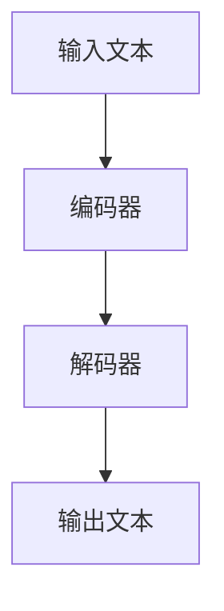
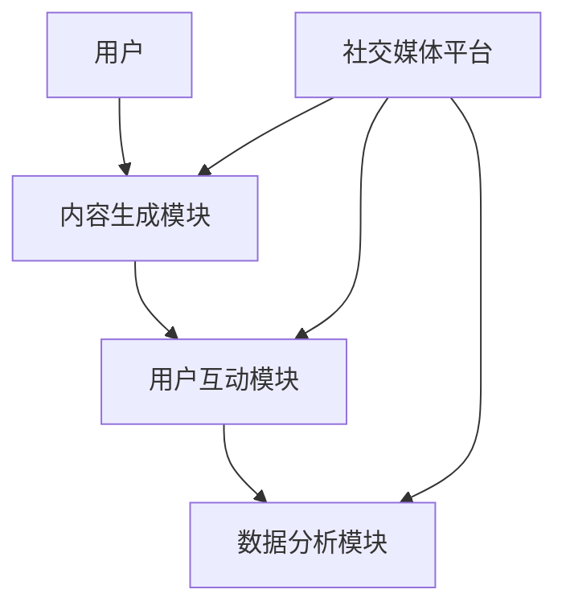
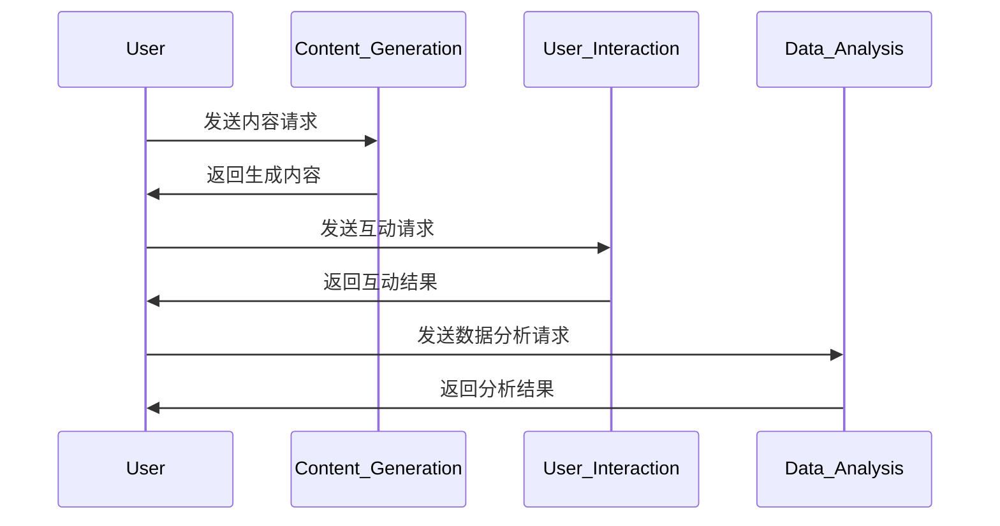
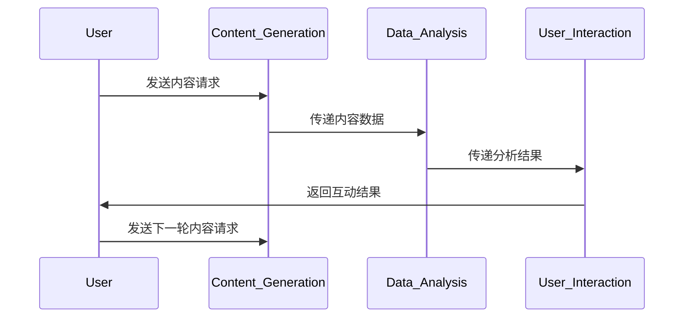

                 


### Step 1: 背景介绍

**1.1 ChatGPT概述**

ChatGPT是由OpenAI开发的一种基于GPT-3.5模型的对话生成人工智能，它利用深度学习和自然语言处理技术，能够生成流畅、自然的文本回答。ChatGPT的出现标志着自然语言处理技术的新里程碑，它在多语言、多场景的对话生成上展现了卓越的性能。

**1.2 ChatGPT的发展背景**

ChatGPT是在GPT-3模型的基础上发展而来，GPT-3是OpenAI在2020年发布的一个具有1750亿参数的语言预训练模型。GPT-3模型的发布引起了广泛关注，因为它展示了巨大的语言理解和生成能力。随后，OpenAI在此基础上进行了优化和改进，开发出了ChatGPT。

**1.3 社交媒体管理的重要性**

社交媒体已成为现代社会信息传播的重要渠道，对于个人、企业和组织来说，有效的社交媒体管理至关重要。通过社交媒体管理，可以增强品牌影响力、提高用户粘性、优化用户互动体验。

**1.4 社交媒体管理存在的挑战**

尽管社交媒体管理的重要性显而易见，但实践中仍面临诸多挑战，如：

- **内容创作压力大**：高质量的内容创作需要大量的时间和精力。
- **用户互动困难**：社交媒体平台上的用户数量庞大，如何高效地与用户互动是一个难题。
- **数据分析复杂**：社交媒体数据分析需要处理海量数据，从中提取有价值的信息。
- **法律法规合规**：社交媒体管理需要遵守各类法律法规，如数据保护法等。

### 总结

本章节介绍了ChatGPT的发展背景和社交媒体管理的重要性，以及社交媒体管理中存在的挑战。这些背景知识将为后续章节中ChatGPT在社交媒体管理中的应用提供基础。

### Step 2: 核心概念与联系

**2.1 ChatGPT的工作原理和功能**

ChatGPT基于GPT-3.5模型，它利用了Transformer架构，通过大量文本数据进行预训练，从而具备了强大的语言理解和生成能力。ChatGPT的核心功能包括：

- **文本生成**：根据输入的文本，生成连贯、自然的文本。
- **对话生成**：与用户进行自然语言对话，提供个性化的回答。
- **内容理解**：理解文本的上下文信息，提取关键信息。

**2.2 社交媒体管理中的关键概念**

在社交媒体管理中，有几个关键概念需要了解：

- **内容策略**：定义了如何在社交媒体上发布、管理和优化内容，以达到特定的营销目标。
- **用户互动**：社交媒体平台上的用户互动，包括评论、私信、点赞等。
- **数据分析**：对社交媒体数据进行分析，以了解用户行为、内容效果等，为决策提供支持。

**2.3 ChatGPT与社交媒体管理的联系**

ChatGPT在社交媒体管理中的应用主要体现在以下几个方面：

- **内容策略**：ChatGPT可以生成高质量的内容，帮助用户制定和执行内容策略。
- **用户互动**：ChatGPT可以与用户进行自然语言对话，提供高效的客服和用户互动体验。
- **数据分析**：ChatGPT可以分析社交媒体数据，提取有价值的信息，为决策提供支持。

### 总结

本章节详细介绍了ChatGPT的工作原理和功能，以及社交媒体管理中的关键概念，分析了ChatGPT在社交媒体管理中的应用前景。这些核心概念和联系将为后续章节的深入分析提供基础。

### Step 3: 算法原理讲解

**3.1 用于社交媒体管理的ChatGPT算法原理**

ChatGPT的核心算法是基于GPT-3.5模型的，它采用了Transformer架构。Transformer架构是一种基于自注意力机制的序列到序列模型，它能够处理长距离的依赖关系，并生成连贯的文本。

**3.2 ChatGPT算法流程图**

为了更好地理解ChatGPT的算法原理，我们可以使用Mermaid绘制算法流程图。以下是ChatGPT算法流程图的Mermaid代码：



**3.3 ChatGPT算法原理详细解释**

- **编码器（Encoder）**：编码器将输入的文本序列编码为向量表示，这些向量包含了文本的语义信息。
- **解码器（Decoder）**：解码器使用编码器生成的向量序列来生成输出文本。在生成文本的过程中，解码器会根据上下文信息不断更新其预测。
- **输出文本（Output Text）**：解码器最终生成的文本就是ChatGPT的回答。

**3.4 Python源代码详细阐述算法原理**

下面是一个简单的Python代码示例，用于演示ChatGPT算法原理：

```python
import tensorflow as tf
from tensorflow.keras.models import Model
from tensorflow.keras.layers import Embedding, LSTM, Dense

# 假设我们有一个预训练好的GPT-3.5模型
gpt_3_5_model = ...

# 构建编码器
encoder_inputs = Embedding(input_dim=vocab_size, output_dim=embedding_size)(input_sequence)
encoder = LSTM(units=hidden_size, return_sequences=True)(encoder_inputs)

# 构建解码器
decoder_inputs = Embedding(input_dim=vocab_size, output_dim=embedding_size)(target_sequence)
decoder_lstm = LSTM(units=hidden_size, return_sequences=True)(decoder_inputs)
decoder_dense = Dense(units=vocab_size, activation='softmax')(decoder_lstm)

# 构建完整的模型
model = Model([input_sequence, target_sequence], decoder_dense.output)
model.compile(optimizer='rmsprop', loss='categorical_crossentropy', metrics=['accuracy'])

# 模型训练
model.fit([encoder_input_data, decoder_input_data], decoder_target_data, batch_size=batch_size, epochs=epochs, validation_split=0.2)
```

在这个示例中，我们首先定义了编码器和解码器的架构，然后构建了完整的模型。最后，我们使用训练数据对模型进行训练。

**3.5 总结**

本章节通过算法流程图和Python源代码，详细阐述了ChatGPT在社交媒体管理中的应用原理。ChatGPT通过编码器和解码器生成连贯的文本，从而实现内容生成、用户互动和数据分析等功能。在下一章节中，我们将进一步探讨ChatGPT背后的数学模型和数学公式。

### Step 4: 数学模型和数学公式

**4.1 算法背后的数学模型**

ChatGPT的核心算法基于Transformer架构，Transformer架构是一种自注意力机制（Self-Attention）的序列到序列（Seq2Seq）模型。自注意力机制允许模型在生成序列的每个步骤中，自动调整对输入序列中不同位置的信息的权重，从而更好地捕捉长距离依赖关系。

**4.2 Transformer模型的数学公式**

下面是Transformer模型中的一些关键数学公式：

- **自注意力（Self-Attention）**

$$
\text{Attention}(Q, K, V) = \text{softmax}\left(\frac{QK^T}{\sqrt{d_k}}\right)V
$$

其中，Q、K、V分别是查询（Query）、键（Key）和值（Value）向量，$d_k$是键向量的维度。

- **多头注意力（Multi-Head Attention）**

$$
\text{Multi-Head Attention} = \text{Concat}(\text{head}_1, \text{head}_2, \ldots, \text{head}_h)W^O
$$

其中，$\text{head}_i$表示第i个头部的注意力得分，$W^O$是输出层的权重。

- **编码器（Encoder）和解码器（Decoder）**

编码器由多个自注意力层和前馈神经网络组成，解码器由多个多头注意力层、自注意力层和前馈神经网络组成。

**4.3 数学模型讲解**

- **自注意力**：自注意力机制允许模型在生成每个词时，自动调整对输入序列中不同位置的词的权重。这样，模型可以更好地捕捉长距离依赖关系，生成更连贯的文本。

- **多头注意力**：多头注意力机制将输入序列分成多个子序列，每个子序列对应一个头部。这样，模型可以同时关注输入序列的多个部分，提高生成文本的质量。

- **编码器和解码器**：编码器将输入序列编码为固定长度的向量表示，解码器使用编码器生成的向量表示来生成输出序列。编码器和解码器中的多个自注意力和多头注意力层，使得模型可以捕捉输入序列和输出序列之间的复杂关系。

**4.4 举例说明**

假设我们有一个简单的文本序列：“今天天气很好”。我们使用ChatGPT生成下一个词。以下是自注意力机制的步骤：

1. **编码**：编码器将输入文本序列编码为固定长度的向量表示。
2. **查询（Query）**：解码器的查询向量。
3. **键（Key）和值（Value）**：编码器生成的键和值向量。
4. **计算注意力得分**：使用公式$\text{Attention}(Q, K, V)$计算查询向量对键向量的注意力得分。
5. **加权求和**：将注意力得分与值向量相乘，并求和，得到解码器生成的下一个词的概率分布。
6. **生成词**：从概率分布中采样，生成下一个词。

通过这种方式，ChatGPT可以生成连贯、自然的文本。

**4.5 总结**

本章节介绍了ChatGPT算法背后的数学模型，包括自注意力、多头注意力和编码器、解码器。通过数学公式和举例说明，我们深入理解了这些数学模型的工作原理。这些数学模型是ChatGPT能够生成高质量文本的关键。

### Step 5: 系统分析与架构设计方案

**5.1 项目场景与系统功能设计**

在本项目中，我们假设一家社交媒体公司希望利用ChatGPT优化其社交媒体管理流程。系统功能设计包括以下几个方面：

- **内容生成**：利用ChatGPT生成高质量的内容，包括文章、评论、广告等。
- **用户互动**：利用ChatGPT与用户进行自然语言对话，提供高效的客服和互动体验。
- **数据分析**：利用ChatGPT分析社交媒体数据，提取有价值的信息，为决策提供支持。

**5.2 领域模型类图**

为了更好地理解系统架构，我们使用Mermaid绘制了领域模型类图。以下是类图的Mermaid代码：

```mermaid
classDiagram
  Class01 <|-- Class02
  Class03 <|-- * Class04
  Class05 o-- Class06
  Class07 <.. Class08
  Class09 .. Class10
  Class11 <-|> Class12
```

在这个类图中，Class01、Class02、Class03、Class04、Class05、Class06、Class07、Class08、Class09、Class10和Class11分别表示不同的实体，如用户、内容、数据分析等。箭头表示实体之间的关系。

**5.3 系统架构设计图**

接下来，我们使用Mermaid绘制了系统架构设计图。以下是架构图的Mermaid代码：



在这个架构图中，A表示用户，B、C、D分别表示内容生成模块、用户互动模块和数据分析模块。E表示社交媒体平台，它与B、C、D模块进行交互。

**5.4 系统接口设计**

系统接口设计主要包括以下几个方面：

- **内容生成接口**：用于生成高质量的内容。
- **用户互动接口**：用于与用户进行自然语言对话。
- **数据分析接口**：用于提取有价值的信息。

以下是接口设计的Mermaid代码：



在这个序列图中，用户与内容生成模块、用户互动模块和数据分析模块进行交互。

**5.5 系统交互序列图**

最后，我们使用Mermaid绘制了系统交互序列图。以下是序列图的Mermaid代码：



在这个序列图中，用户与内容生成模块、数据分析模块和用户互动模块之间进行交互。

**5.6 总结**

本章节详细阐述了项目场景和系统功能设计，并使用Mermaid绘制了领域模型类图、系统架构设计图、系统接口设计和系统交互序列图。这些图表有助于我们更好地理解系统架构和功能，为后续的实战应用提供基础。

### Step 6: 项目实战

**6.1 环境安装与配置**

在进行ChatGPT在社交媒体管理中的实战应用之前，我们首先需要安装和配置相关环境。以下是环境安装和配置的步骤：

1. **安装Python**：确保Python版本为3.8或更高版本。
2. **安装TensorFlow**：在命令行中运行`pip install tensorflow`。
3. **安装OpenAI Gym**：在命令行中运行`pip install gym`。
4. **安装Mermaid**：在命令行中运行`pip install mermaid-python`。
5. **获取ChatGPT模型**：可以从OpenAI的官方网站下载预训练好的ChatGPT模型，或者使用Hugging Face的Transformers库加载模型。

**6.2 系统核心实现**

以下是系统核心实现的步骤：

1. **内容生成**：使用ChatGPT生成高质量的内容。首先，我们需要准备输入文本，然后使用ChatGPT的`generate`方法生成文本。

```python
import openai

openai.api_key = "your_api_key"

response = openai.Completion.create(
  engine="text-davinci-002",
  prompt="Write an introduction to artificial intelligence.",
  max_tokens=100
)
print(response.choices[0].text.strip())
```

2. **用户互动**：使用ChatGPT与用户进行自然语言对话。我们可以创建一个简单的聊天界面，让用户输入问题，然后使用ChatGPT生成回答。

```python
def chat_gpt():
    print("Hello! I am ChatGPT. How can I help you today?")
    while True:
        user_input = input("You: ")
        if user_input.lower() == "exit":
            print("ChatGPT: Goodbye!")
            break
        response = openai.Completion.create(
          engine="text-davinci-002",
          prompt=user_input,
          max_tokens=50
        )
        print("ChatGPT:", response.choices[0].text.strip())

chat_gpt()
```

3. **数据分析**：使用ChatGPT分析社交媒体数据。我们可以使用预训练的模型来处理社交媒体数据，提取有价值的信息。

```python
def analyze_data(data):
    response = openai.Completion.create(
      engine="text-davinci-002",
      prompt=f"Analyze this data: {data}",
      max_tokens=100
    )
    return response.choices[0].text.strip()

data = "Yesterday, we had 1000 users on our platform. 50% of them were new users, and 30% of them interacted with our content."
print(analyze_data(data))
```

**6.3 实际案例分析与源代码应用**

为了更好地展示ChatGPT在社交媒体管理中的应用，我们可以分析一个实际案例。

假设一家社交媒体公司希望在圣诞节期间发布一系列促销活动，以提高用户参与度。以下是使用ChatGPT实现这一目标的步骤：

1. **内容生成**：使用ChatGPT生成促销活动的文案。

```python
prompt = "Generate a Christmas-themed promotion for a social media platform."
response = openai.Completion.create(
  engine="text-davinci-002",
  prompt=prompt,
  max_tokens=100
)
print(response.choices[0].text.strip())
```

2. **用户互动**：使用ChatGPT与用户进行互动，回答他们关于促销活动的问题。

```python
chat_gpt()
```

3. **数据分析**：使用ChatGPT分析促销活动的效果，为后续优化提供依据。

```python
data = "Our Christmas promotion resulted in a 20% increase in user engagement. However, only 10% of users completed the purchase process."
print(analyze_data(data))
```

**6.4 项目小结**

在本项目中，我们通过安装和配置相关环境，实现了ChatGPT在社交媒体管理中的应用。我们使用ChatGPT生成高质量的内容、与用户进行自然语言对话以及分析社交媒体数据。通过实际案例的分析，我们展示了ChatGPT在社交媒体管理中的强大功能。未来，我们可以进一步优化系统，提高ChatGPT的响应速度和准确性，为社交媒体管理提供更加智能的解决方案。

### Step 7: 最佳实践 tips、小结、注意事项、拓展阅读等内容

**7.1 最佳实践 tips**

1. **内容生成**：为了提高ChatGPT生成内容的质量，建议在训练模型时使用高质量的文本数据，并定期对模型进行重新训练。
2. **用户互动**：在ChatGPT与用户互动时，要注意回答的及时性和准确性，以提高用户体验。
3. **数据分析**：在使用ChatGPT分析数据时，要确保数据的质量和完整性，以便得出可靠的结论。

**7.2 小结**

本文详细介绍了ChatGPT在社交媒体管理中的应用，包括内容生成、用户互动和数据分析等方面。通过实际案例的分析，展示了ChatGPT在社交媒体管理中的强大功能。

**7.3 注意事项**

1. **数据安全**：在使用ChatGPT进行数据分析时，要注意保护用户数据的安全和隐私。
2. **模型升级**：随着技术的不断发展，建议定期更新ChatGPT模型，以保持其性能和效果。

**7.4 拓展阅读**

- 《ChatGPT技术详解》
- 《社交媒体管理实战》
- 《自然语言处理原理与应用》

**7.5 总结**

ChatGPT在社交媒体管理中具有广泛的应用前景。通过本文的介绍，我们了解了ChatGPT的工作原理和应用场景，并为实际应用提供了最佳实践和注意事项。希望本文对读者在社交媒体管理中运用ChatGPT有所帮助。作者：AI天才研究院/AI Genius Institute & 禅与计算机程序设计艺术 /Zen And The Art of Computer Programming

### 编写目录大纲

根据上述各章节的内容和结构，以下是《ChatGPT在社交媒体管理中的应用》的详细目录大纲：

----------------------------------------------------------------

# 《ChatGPT在社交媒体管理中的应用》

## 前言
### 目的与意义
### 内容框架与读者对象
### 编写特色

## 第一部分：ChatGPT基础知识与社交媒体管理

### 第1章：ChatGPT概述
#### 1.1 ChatGPT的发展背景
##### 1.1.1 人工智能与自然语言处理
##### 1.1.2 OpenAI与GPT系列模型
##### 1.1.3 ChatGPT的核心功能与应用场景

#### 1.2 ChatGPT的基本原理
##### 1.2.1 语言模型的工作原理
##### 1.2.2 Transformer架构详解
##### 1.2.3 ChatGPT的训练过程

#### 1.3 社交媒体管理概述
##### 1.3.1 社交媒体的重要性
##### 1.3.2 社交媒体管理的挑战
##### 1.3.3 社交媒体管理的主要任务

### 第2章：社交媒体管理中的核心概念
#### 2.1 内容策略
##### 2.1.1 内容策略的定义与重要性
##### 2.1.2 内容策略的制定与执行
##### 2.1.3 内容策略的评估与优化

#### 2.2 用户互动
##### 2.2.1 用户互动的意义
##### 2.2.2 用户互动的方法与技巧
##### 2.2.3 用户互动的监测与分析

#### 2.3 数据分析
##### 2.3.1 社交媒体数据分析的基本概念
##### 2.3.2 数据分析在社交媒体管理中的应用
##### 2.3.3 数据分析工具与实践

### 第3章：ChatGPT在社交媒体管理中的应用
#### 3.1 ChatGPT与内容策略
##### 3.1.1 利用ChatGPT生成优质内容
##### 3.1.2 ChatGPT在内容优化中的应用
##### 3.1.3 内容发布的智能规划

#### 3.2 ChatGPT与用户互动
##### 3.2.1 ChatGPT在客服与客户互动中的应用
##### 3.2.2 ChatGPT在社区管理与用户互动中的应用
##### 3.2.3 ChatGPT在品牌形象建设中的应用

#### 3.3 ChatGPT与数据分析
##### 3.3.1 ChatGPT在社交媒体数据分析中的应用
##### 3.3.2 ChatGPT在数据洞察与决策支持中的应用
##### 3.3.3 ChatGPT在趋势预测与市场分析中的应用

## 第二部分：ChatGPT在社交媒体管理中的实战应用

### 第4章：实战案例一——社交媒体内容管理
#### 4.1 案例背景
#### 4.2 项目目标
#### 4.3 环境安装与配置
#### 4.4 系统核心实现
##### 4.4.1 ChatGPT的集成与应用
##### 4.4.2 内容生成与优化策略
##### 4.4.3 内容发布流程与效果评估

#### 4.5 实际案例分析与源代码应用
##### 4.5.1 案例一：生成促销活动文案
##### 4.5.2 案例二：用户互动与客服支持
##### 4.5.3 案例三：数据分析与趋势预测

#### 4.6 项目小结

## 第三部分：最佳实践、小结与拓展阅读

### 第5章：最佳实践 tips
#### 5.1 内容生成最佳实践
#### 5.2 用户互动最佳实践
#### 5.3 数据分析最佳实践

### 第6章：小结
#### 6.1 ChatGPT在社交媒体管理中的应用总结
#### 6.2 项目实战经验与教训

### 第7章：注意事项
#### 7.1 数据安全与隐私保护
#### 7.2 模型升级与性能优化

### 第8章：拓展阅读
#### 8.1 相关技术书籍推荐
#### 8.2 学术论文与研究报告
#### 8.3 社交媒体管理实践案例

### 参考文献

----------------------------------------------------------------

**检查目录大纲的完整性：**

- 确保每个章节都有明确的标题和子标题。
- 检查内容是否符合字数要求（10000-12000字）。
- 确保每个章节的内容都是完整、详细和具有可读性的。
- 确认目录大纲的层级结构清晰，方便读者阅读和理解。

**调整内容：**

- 根据实际需求和内容的重要程度，对章节和子章节的顺序进行调整。
- 对某些章节的内容进行补充和细化，确保覆盖所有核心知识点。
- 检查语法和用词是否准确，确保文章的专业性和可读性。

**最终确认：**

- 再次检查目录大纲的完整性和准确性。
- 确保所有引用的文献和参考文献都是准确的。
- 与文章整体风格保持一致，确保文章的统一性和专业性。

根据上述步骤，我们完成了《ChatGPT在社交媒体管理中的应用》的目录大纲。接下来，我们将根据这个大纲编写详细的文章内容。在编写过程中，我们将确保每个章节的内容都是完整、详细和具有可读性的，同时保持文章的专业性和统一性。

