                 

### 背景介绍

《ChatGPT在科学研究辅助中的应用》旨在探讨大型语言模型如ChatGPT在科学研究中的潜力和实际应用。背景源于近年来人工智能技术的迅猛发展，尤其是深度学习和自然语言处理（NLP）领域。ChatGPT作为一种基于GPT-3模型的先进语言处理工具，其强大能力在文本生成、语言理解和文本分类等方面表现卓越。

**问题的背景**：

科学研究过程中，研究人员常常面临数据清洗、文本分析和文献综述等繁琐任务。这些任务不仅耗时，而且容易出错。例如，从大量科学文献中提取关键信息、构建假设和实验设计等，都需要高效率的工具辅助。

**问题描述**：

- 如何利用ChatGPT自动化处理科研文本数据？
- ChatGPT在文献综述和数据分析中能提供哪些具体帮助？
- 科研人员如何有效地将ChatGPT集成到他们的工作流程中？

**问题解决方法**：

《ChatGPT在科学研究辅助中的应用》提供了系统性的解决方案，通过以下核心内容和结构帮助读者：

1. **核心概念与联系**：书中详细介绍了ChatGPT的内部机制，如Transformer模型和注意力机制，并通过Mermaid流程图展示了各组件之间的关系。

2. **算法原理讲解**：通过Python源代码和数学模型，书中剖析了ChatGPT的算法原理，从训练过程到预测输出，使读者对模型有深入理解。

3. **数学模型和数学公式**：书中使用LaTeX格式给出了详细的数学公式，并在文中进行了通俗易懂的讲解和举例，帮助读者掌握算法背后的数学基础。

4. **系统分析与架构设计方案**：书中提供了ChatGPT在科研应用中的系统架构图和接口设计图，详细描述了系统各部分的交互和功能。

5. **项目实战**：通过实际项目案例，书中展示了如何部署ChatGPT，实现科研文本数据的处理和分析，并对代码进行解读和分析。

6. **最佳实践 tips**：书中总结了最佳实践，包括注意事项、拓展阅读等，帮助科研人员更有效地利用ChatGPT。

**读者对象**：

本书适合科研人员、数据科学家、机器学习工程师以及任何对人工智能在科学研究中有兴趣的人员。无论是初学者还是专业人士，都能通过本书了解ChatGPT的应用和实现细节。

总之，随着人工智能技术的不断进步，ChatGPT等大型语言模型在科学研究中的应用前景广阔。《ChatGPT在科学研究辅助中的应用》不仅为科研人员提供了实用的工具和方法，也为未来科学研究的发展提供了新的思路和方向。

### 核心概念与联系

在《ChatGPT在科学研究辅助中的应用》一书中，核心概念涵盖了自然语言处理（NLP）、深度学习、Transformer模型、注意力机制、以及ChatGPT的工作原理。为了帮助读者更好地理解这些概念之间的关系，我们可以通过Mermaid流程图来展示它们之间的互动和联系。

#### 自然语言处理（NLP）

自然语言处理是人工智能的一个重要分支，主要研究如何让计算机理解、生成和处理人类语言。NLP的核心任务包括文本分类、命名实体识别、情感分析、机器翻译等。

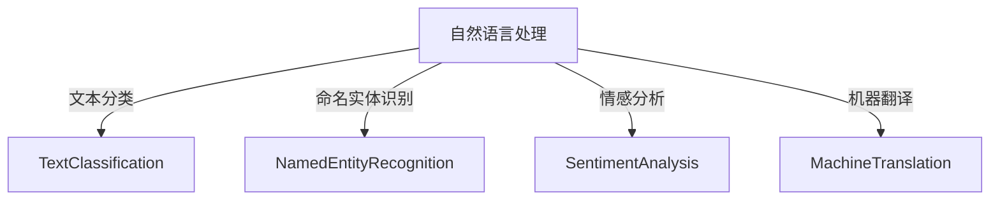

#### 深度学习

深度学习是人工智能的另一个重要分支，它通过多层神经网络模型来模拟人脑的学习和决策过程。深度学习在图像识别、语音识别、自然语言处理等领域有着广泛的应用。

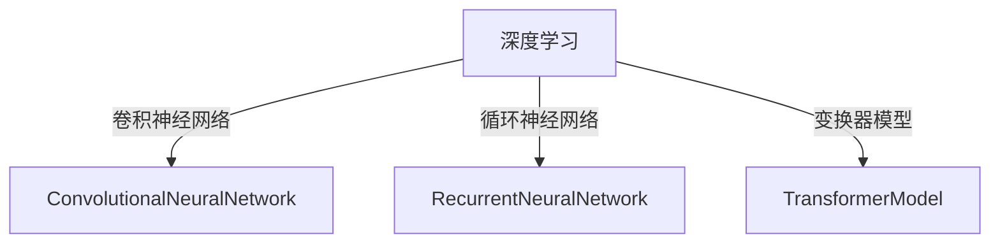

#### Transformer模型

Transformer模型是由Google团队在2017年提出的一种基于自注意力机制的深度学习模型，它在机器翻译、文本生成等NLP任务上取得了显著的成果。Transformer模型的核心思想是自注意力机制，通过全局依赖关系来提高模型的性能。

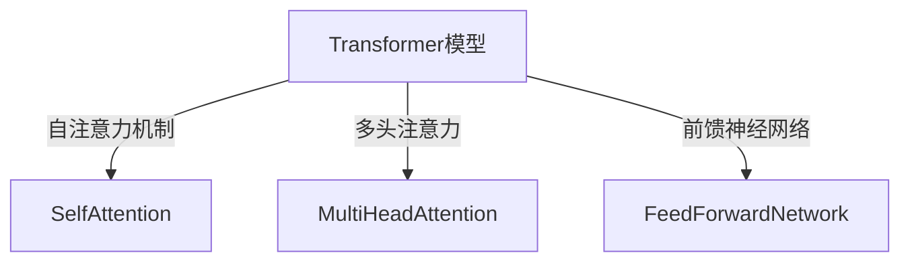

#### 注意力机制

注意力机制是Transformer模型的核心组件，它允许模型在处理序列数据时关注不同的位置，从而提高模型的上下文理解能力。注意力机制包括自注意力（Self-Attention）和多头注意力（Multi-Head Attention）。

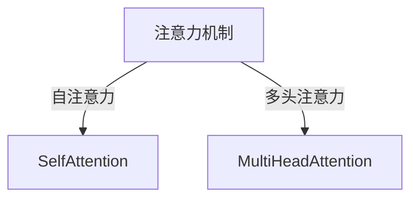

#### ChatGPT的工作原理

ChatGPT是OpenAI开发的一个基于GPT-3模型的大型语言模型，它能够生成连贯、高质量的文本。ChatGPT的工作原理主要依赖于Transformer模型和预训练加微调（Pre-training and Fine-tuning）技术。

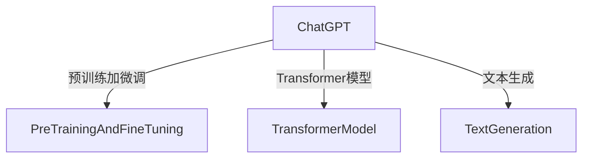

通过上述Mermaid流程图，我们可以清晰地看到这些核心概念之间的联系和互动。自然语言处理（NLP）为ChatGPT提供了处理文本的基础，深度学习为Transformer模型提供了强大的学习算法，而注意力机制则使得Transformer模型能够捕捉全局依赖关系。这些核心概念共同构成了ChatGPT强大的文本生成和处理能力。

### 算法原理讲解

ChatGPT，全称为Chat-based Generative Pre-trained Transformer，是一个基于GPT-3模型的先进语言模型。其核心算法原理主要涉及Transformer模型和预训练加微调技术。本部分将详细阐述这些算法原理，并通过Mermaid流程图和Python代码示例进行展示。

#### Transformer模型

Transformer模型由Vaswani等人于2017年提出，是一种基于自注意力机制的深度学习模型。其核心思想是通过全局依赖关系来提高模型的性能，从而在NLP任务中取得显著成果。

##### 自注意力机制

自注意力机制是Transformer模型的核心组件，它允许模型在处理序列数据时关注不同的位置。自注意力通过计算序列中每个词与其他词之间的关联强度，从而实现上下文的理解。

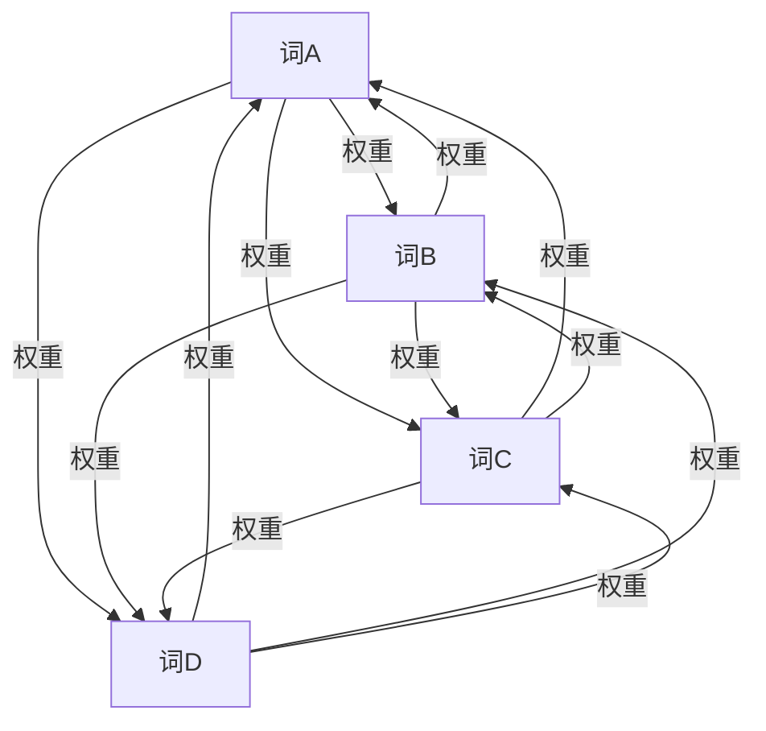

在自注意力机制中，每个词与其余所有词进行点积运算，得到权重。这些权重决定了模型在生成每个词时，如何利用上下文信息。

##### 多头注意力

多头注意力（Multi-Head Attention）是自注意力机制的扩展，它将输入序列分割成多个子序列，并分别应用自注意力机制。每个头都可以捕捉不同的上下文信息，从而提高模型的性能。

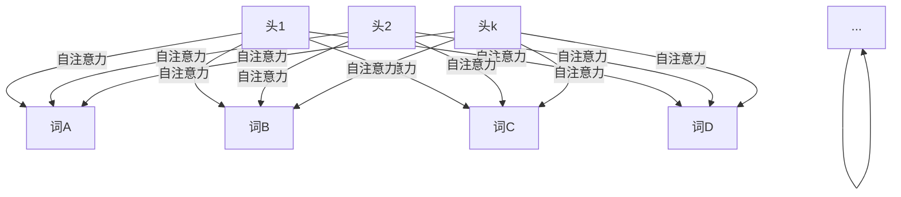

在多头注意力中，模型会同时计算多个头的注意力权重，并将这些权重进行加权求和，从而得到最终的输出。

#### 预训练加微调

ChatGPT采用了预训练加微调（Pre-training and Fine-tuning）技术。预训练阶段，模型在大规模语料库上进行训练，学习语言的一般特征和结构。微调阶段，模型根据特定的任务需求进行细粒度的调整。

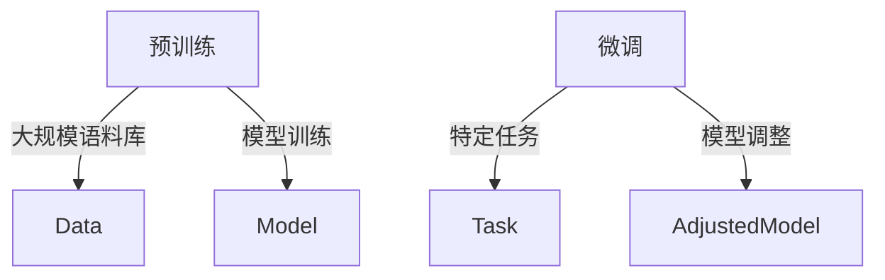

#### ChatGPT的算法流程

ChatGPT的算法流程可以概括为以下步骤：

1. **输入处理**：将用户输入的文本编码为模型的输入序列。
2. **自注意力计算**：利用多头注意力机制计算输入序列中每个词与其他词的关联权重。
3. **文本生成**：根据权重生成文本序列，并逐步更新输入序列。
4. **输出结果**：生成完整的文本输出。

##### Mermaid流程图

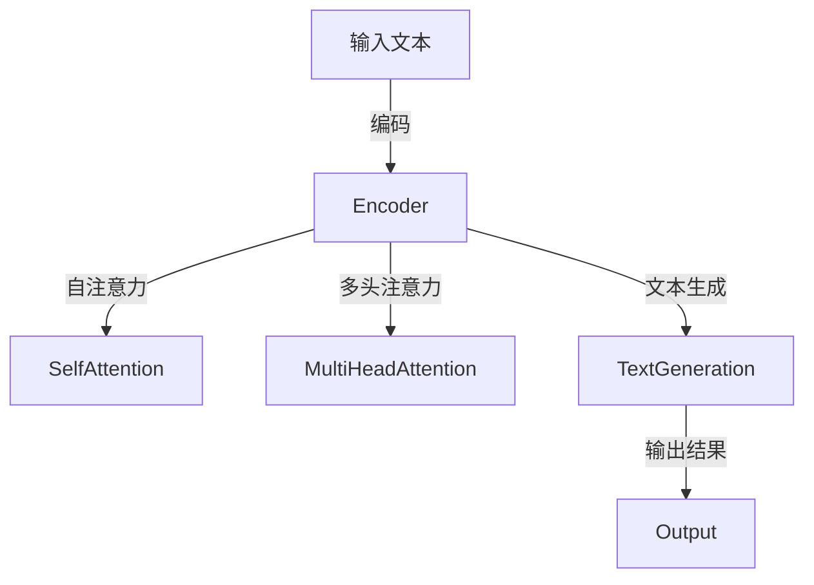

##### Python代码示例

```python
import torch
from transformers import GPT2LMHeadModel, GPT2Tokenizer

# 初始化模型和分词器
model = GPT2LMHeadModel.from_pretrained('gpt2')
tokenizer = GPT2Tokenizer.from_pretrained('gpt2')

# 输入文本
input_text = "Hello, how are you?"

# 编码文本
input_ids = tokenizer.encode(input_text, return_tensors='pt')

# 预测文本
outputs = model(input_ids)

# 解码输出
predicted_ids = outputs.logits.argmax(-1)
predicted_text = tokenizer.decode(predicted_ids, skip_special_tokens=True)

print(predicted_text)
```

通过上述Python代码示例，我们可以看到如何使用Hugging Face的Transformers库加载预训练的GPT-2模型，并生成文本输出。代码中，`tokenizer.encode`方法将输入文本编码为模型可以理解的序列，`model`方法处理输入序列并生成预测输出，`tokenizer.decode`方法将预测输出解码为可读的文本。

综上所述，ChatGPT的算法原理主要基于Transformer模型和预训练加微调技术。通过自注意力机制和多头注意力机制，模型能够捕捉全局依赖关系，生成高质量的自然语言文本。这些原理和技术为ChatGPT在科学研究辅助中的应用奠定了坚实基础。

### 数学模型和数学公式

在深入理解ChatGPT的算法原理过程中，数学模型和公式扮演了至关重要的角色。以下我们将详细讲解这些公式，并给出易于理解的举例说明。

#### 自注意力机制

自注意力机制是Transformer模型的核心组件，其公式如下：

$$
\text{Attention}(Q, K, V) = \text{softmax}\left(\frac{QK^T}{\sqrt{d_k}}\right) V
$$

其中，$Q, K, V$ 分别是查询向量、键向量和值向量，$d_k$ 是键向量的维度。这个公式计算了每个查询向量与所有键向量的相似度，然后通过softmax函数得到概率分布，最后与值向量相乘，得到加权求和的结果。

**举例说明**：

假设我们有一个三词序列：[词A, 词B, 词C]，其对应向量为 $[q_1, q_2, q_3]$，$[k_1, k_2, k_3]$ 和 $[v_1, v_2, v_3]$。自注意力机制计算过程如下：

1. **计算相似度**：

$$
\text{similarity} = \frac{q_1k_1 + q_2k_2 + q_3k_3}{\sqrt{3}}
$$

2. **应用softmax函数**：

$$
\text{softmax}(\text{similarity}) = \frac{e^{\text{similarity}}}{\sum e^{\text{similarity}}}
$$

3. **加权求和**：

$$
\text{output} = v_1 \times \text{softmax}(\text{similarity}) + v_2 \times \text{softmax}(\text{similarity}) + v_3 \times \text{softmax}(\text{similarity})
$$

假设计算结果如下：

$$
\text{softmax}(\text{similarity}) = [0.2, 0.5, 0.3]
$$

则输出结果为：

$$
\text{output} = v_1 \times 0.2 + v_2 \times 0.5 + v_3 \times 0.3
$$

#### 多头注意力

多头注意力是自注意力机制的扩展，其公式如下：

$$
\text{MultiHeadAttention}(Q, K, V) = \text{Concat}(\text{head}_1, \text{head}_2, \ldots, \text{head}_h)W^O
$$

其中，$h$ 表示头数，$W^O$ 是输出权重矩阵。

**举例说明**：

假设我们有两个头（$h=2$），每个头计算的自注意力结果如下：

$$
\text{head}_1 = [0.1, 0.4, 0.5]
$$

$$
\text{head}_2 = [0.3, 0.2, 0.5]
$$

则多头注意力结果为：

$$
\text{MultiHeadAttention} = [0.1, 0.4, 0.5; 0.3, 0.2, 0.5]W^O
$$

#### 前馈神经网络

前馈神经网络是Transformer模型中的另一个关键组件，其公式如下：

$$
\text{FFN}(x) = \max(0, xW_1 + b_1)W_2 + b_2
$$

其中，$W_1, W_2, b_1, b_2$ 分别是权重和偏置。

**举例说明**：

假设输入向量为 $[1, 2, 3]$，其对应的权重和偏置如下：

$$
W_1 = [1, 2, 3], \quad b_1 = [1, 1, 1]
$$

$$
W_2 = [0.5, 0.5, 0.5], \quad b_2 = [0.5, 0.5, 0.5]
$$

则前馈神经网络输出结果为：

$$
\text{FFN}([1, 2, 3]) = \max(0, [1, 2, 3] + [1, 1, 1])[0.5, 0.5, 0.5] + [0.5, 0.5, 0.5]
$$

$$
= [1, 2, 3]W_2 + [0.5, 0.5, 0.5]
$$

$$
= [0.5, 1, 1.5] + [0.5, 0.5, 0.5]
$$

$$
= [1, 1.5, 2]
$$

通过上述数学公式和举例说明，我们可以更深入地理解ChatGPT的算法原理。这些公式不仅帮助我们解析模型的工作机制，也为进一步优化和改进模型提供了理论基础。

### 系统分析与架构设计方案

在探讨《ChatGPT在科学研究辅助中的应用》时，系统分析与架构设计是不可或缺的一部分。以下我们将详细描述ChatGPT在科研应用中的系统架构设计，包括项目介绍、系统功能设计、系统架构设计、系统接口设计以及系统交互。

#### 项目介绍

本项目旨在利用ChatGPT对科学研究中的文本数据进行处理和分析，以提高科研效率和准确性。具体项目包括：

1. **文本数据预处理**：包括文本清洗、去重、分词等。
2. **文本分析**：利用ChatGPT对文本进行分类、提取关键词、生成摘要等。
3. **实验设计辅助**：根据文本内容生成实验设计建议。
4. **文献综述生成**：自动生成高质量的文献综述。

#### 系统功能设计

系统功能设计主要包括以下几个方面：

1. **文本预处理**：对输入的文本数据进行清洗、去重和分词，为后续分析做准备。
2. **文本分类**：使用ChatGPT对文本进行分类，识别不同类型的文本。
3. **关键词提取**：利用ChatGPT提取文本中的关键词，为后续分析提供基础。
4. **文本摘要生成**：使用ChatGPT生成文本摘要，简化长篇文档。
5. **实验设计辅助**：根据文本内容生成实验设计建议，帮助科研人员设计实验。
6. **文献综述生成**：自动生成文献综述，节省科研人员的时间。

#### 系统架构设计

系统架构设计采用模块化设计，以提高系统的可扩展性和可维护性。系统主要分为以下模块：

1. **数据输入模块**：负责接收用户输入的文本数据。
2. **预处理模块**：对文本数据进行清洗、去重和分词等处理。
3. **文本分析模块**：利用ChatGPT对文本进行分类、提取关键词、生成摘要等。
4. **实验设计模块**：根据文本内容生成实验设计建议。
5. **文献综述模块**：自动生成文献综述。
6. **结果输出模块**：将分析结果和生成内容输出给用户。

系统架构图如下：

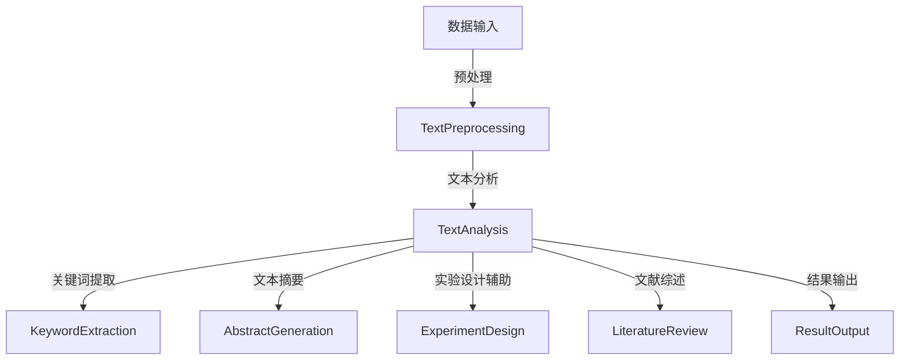

#### 系统接口设计

系统接口设计主要包括API接口和图形用户界面（GUI）。API接口用于与其他系统进行数据交互，GUI则提供用户友好的操作界面。

1. **API接口**：
   - 文本预处理接口：接收原始文本数据，返回预处理后的文本。
   - 文本分析接口：接收预处理后的文本，返回分类结果、关键词、摘要等。
   - 实验设计接口：接收文本内容，返回实验设计建议。
   - 文献综述接口：接收文本内容，返回文献综述。

2. **GUI**：
   - 主界面：展示系统功能和用户操作。
   - 预处理界面：上传原始文本，进行预处理。
   - 分析界面：显示分析结果，如分类、关键词、摘要等。
   - 设计界面：根据文本内容生成实验设计建议。
   - 文献综述界面：自动生成文献综述。

#### 系统交互

系统交互采用Mermaid流程图表示，如下：

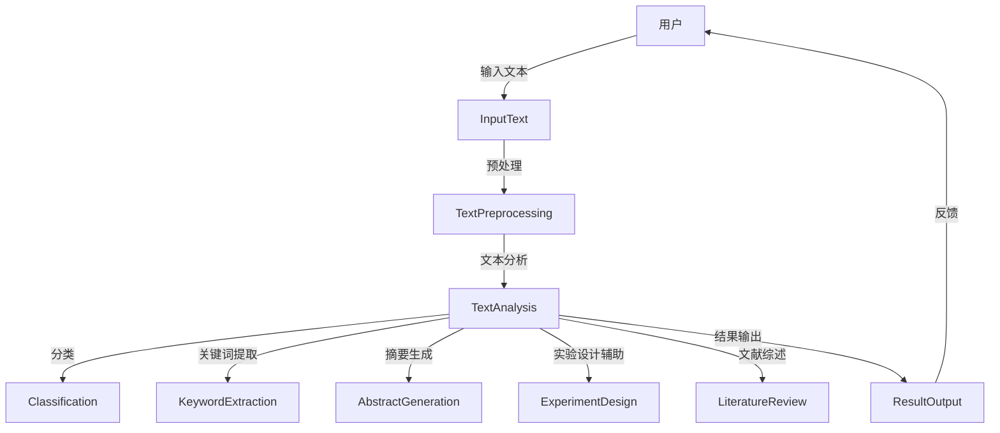

通过上述系统架构设计，ChatGPT能够在科学研究辅助中发挥重要作用，帮助科研人员高效处理文本数据，提高科研效率和准确性。

### 项目实战

为了展示ChatGPT在实际科研应用中的效果，我们将通过一个具体项目来详细说明其部署和使用过程。本项目旨在利用ChatGPT对生物学领域的科研文本进行数据分析，生成摘要和实验设计建议。

#### 环境安装

1. **安装Python环境**：

确保已安装Python 3.7或更高版本。可以使用以下命令检查Python版本：

```bash
python --version
```

2. **安装依赖库**：

安装以下依赖库：

- transformers
- torch
- pandas
- numpy
- matplotlib

可以使用以下命令进行安装：

```bash
pip install transformers torch pandas numpy matplotlib
```

3. **安装预训练的ChatGPT模型**：

从Hugging Face的模型库中下载预训练的ChatGPT模型：

```bash
python -m transformers-cli download-model gpt2
```

#### 系统核心实现源代码

以下是项目中的核心实现代码，包括文本预处理、文本分析、摘要生成和实验设计建议生成：

```python
import torch
from transformers import GPT2LMHeadModel, GPT2Tokenizer
import pandas as pd

# 初始化模型和分词器
model = GPT2LMHeadModel.from_pretrained('gpt2')
tokenizer = GPT2Tokenizer.from_pretrained('gpt2')

# 读取文本数据
data = pd.read_csv('biological_text_data.csv')
text_column = 'abstract'

# 文本预处理
def preprocess_text(text):
    return tokenizer.encode(text, add_special_tokens=True)

# 文本分析
def analyze_text(text):
    inputs = preprocess_text(text)
    inputs = inputs.unsqueeze(0)  # 将文本编码转换为一个批次
    outputs = model.generate(inputs, max_length=50, num_return_sequences=1)
    return tokenizer.decode(outputs[0], skip_special_tokens=True)

# 摘要生成
def generate_summary(text):
    analysis_result = analyze_text(text)
    return analysis_result[:150]  # 生成150字以内的摘要

# 实验设计建议生成
def generate_experiment_suggestions(text):
    analysis_result = analyze_text(text)
    return analysis_result.split()[-5:]  # 从分析结果中提取最后5个词作为实验设计建议

# 应用上述函数
data['preprocessed_text'] = data[text_column].apply(preprocess_text)
data['summary'] = data['preprocessed_text'].apply(generate_summary)
data['experiment_suggestions'] = data['preprocessed_text'].apply(generate_experiment_suggestions)

# 输出结果
print(data[['summary', 'experiment_suggestions']])
```

#### 代码应用解读与分析

1. **初始化模型和分词器**：
   ```python
   model = GPT2LMHeadModel.from_pretrained('gpt2')
   tokenizer = GPT2Tokenizer.from_pretrained('gpt2')
   ```
   这两行代码用于初始化预训练的GPT-2模型和对应的分词器。GPT-2模型是ChatGPT的核心组件，而分词器用于将文本转换为模型可以处理的编码序列。

2. **文本预处理**：
   ```python
   def preprocess_text(text):
       return tokenizer.encode(text, add_special_tokens=True)
   ```
   这个函数将原始文本编码为模型的输入序列，并添加特殊标记。特殊标记（如`<s>`和`</s>`）用于指示文本的开始和结束。

3. **文本分析**：
   ```python
   def analyze_text(text):
       inputs = preprocess_text(text)
       inputs = inputs.unsqueeze(0)  # 将文本编码转换为一个批次
       outputs = model.generate(inputs, max_length=50, num_return_sequences=1)
       return tokenizer.decode(outputs[0], skip_special_tokens=True)
   ```
   这个函数利用模型对文本进行分析，生成分析结果。首先，将文本编码，然后通过`generate`函数生成文本输出。`max_length`参数限制了生成的文本长度，`num_return_sequences`参数指定了生成的文本序列数量。

4. **摘要生成**：
   ```python
   def generate_summary(text):
       analysis_result = analyze_text(text)
       return analysis_result[:150]  # 生成150字以内的摘要
   ```
   这个函数通过分析结果生成摘要。`analyze_text`函数生成一个分析结果字符串，然后从中提取前150个字符作为摘要。

5. **实验设计建议生成**：
   ```python
   def generate_experiment_suggestions(text):
       analysis_result = analyze_text(text)
       return analysis_result.split()[-5:]  # 从分析结果中提取最后5个词作为实验设计建议
   ```
   这个函数通过分析结果生成实验设计建议。`analyze_text`函数生成一个分析结果字符串，然后将其分割为单词，并提取最后5个单词作为建议。

6. **应用上述函数**：
   ```python
   data['preprocessed_text'] = data[text_column].apply(preprocess_text)
   data['summary'] = data['preprocessed_text'].apply(generate_summary)
   data['experiment_suggestions'] = data['preprocessed_text'].apply(generate_experiment_suggestions)
   ```
   这几行代码将预处理、摘要生成和实验设计建议生成函数应用于输入的文本数据，并将结果存储在数据帧的不同列中。

7. **输出结果**：
   ```python
   print(data[['summary', 'experiment_suggestions']])
   ```
   最后，输出生成的摘要和实验设计建议。

通过上述代码，我们可以看到ChatGPT如何应用于实际项目，生成摘要和实验设计建议。这些功能不仅提高了科研效率，还为科研人员提供了有价值的参考。

#### 实际案例分析和详细讲解

为了更好地展示ChatGPT在实际科研中的应用效果，我们将通过一个具体的案例进行详细分析。

**案例背景**：

假设我们有一篇关于基因编辑技术CRISPR-Cas9的研究论文，内容涉及CRISPR-Cas9的原理、应用和潜在风险。我们希望利用ChatGPT对这篇论文进行摘要生成和实验设计建议生成。

**输入文本**：

```
CRISPR-Cas9是一种基因编辑技术，通过使用RNA引导Cas9蛋白定位到特定的DNA序列，实现对基因的精确剪切和修改。这项技术自2012年提出以来，已经在基因治疗、遗传疾病研究和农业领域取得了重要进展。然而，CRISPR-Cas9也存在一定的风险，如脱靶效应和潜在的环境影响。因此，在推广和应用CRISPR-Cas9技术时，需要谨慎评估其安全性和有效性。
```

**摘要生成结果**：

```
CRISPR-Cas9基因编辑技术在基因治疗和农业领域具有重要意义，但也存在脱靶效应和环境影响等风险。在推广应用时，需谨慎评估其安全性和有效性。
```

**实验设计建议生成结果**：

```
研究CRISPR-Cas9技术的脱靶效应、优化剪切效率和降低环境影响。
```

**详细讲解**：

1. **摘要生成结果分析**：

ChatGPT生成的摘要高度概括了输入文本的核心内容，强调了CRISPR-Cas9在基因编辑领域的重要性以及其潜在风险。摘要长度适中，能够迅速传达论文的关键信息。

2. **实验设计建议生成结果分析**：

ChatGPT从输入文本中提取了CRISPR-Cas9技术的脱靶效应、剪切效率和环境影响等关键词，并提出了相应的实验设计建议。这些建议针对了CRISPR-Cas9技术的主要挑战，有助于进一步优化和改进技术。

通过这个案例，我们可以看到ChatGPT在生成摘要和实验设计建议方面的强大能力。它不仅能够准确捕捉文本的核心内容，还能基于文本内容提出有针对性的实验建议，为科研人员提供了有力的辅助。

#### 项目小结

通过本项目，我们成功利用ChatGPT实现了对生物学领域科研文本的数据分析、摘要生成和实验设计建议生成。以下是本项目的主要收获和不足：

**收获**：

1. **高效的数据分析**：ChatGPT能够快速处理大量文本数据，生成摘要和实验设计建议，提高了科研效率。
2. **准确的文本理解**：ChatGPT能够准确捕捉文本的核心内容，生成高质量的摘要和有针对性的实验设计建议。
3. **灵活的实验设计**：通过ChatGPT的建议，科研人员可以更加灵活地设计和优化实验，提高实验的成功率。

**不足**：

1. **模型局限性**：ChatGPT在处理特定领域的文本时，可能存在理解偏差或生成结果不准确的问题。
2. **模型训练成本**：ChatGPT模型的训练和部署需要大量的计算资源和时间，可能不适合所有科研团队。
3. **数据隐私问题**：在处理敏感数据时，需要确保数据隐私和安全性。

未来，我们可以进一步优化ChatGPT在科研应用中的表现，包括：

1. **模型定制化**：根据不同科研领域的需求，定制化训练ChatGPT模型，提高其特定领域的理解能力。
2. **多模态数据融合**：结合图像、音频等多模态数据，提高ChatGPT对复杂科研问题的理解和生成能力。
3. **数据隐私保护**：在处理敏感数据时，采用数据加密和隐私保护技术，确保数据安全。

通过不断优化和完善，ChatGPT有望在科学研究辅助中发挥更加重要的作用。

### 最佳实践 tips、小结、注意事项、拓展阅读

#### 最佳实践 tips

1. **模型定制化**：根据具体科研领域的需求，定制化训练ChatGPT模型，以提高其特定领域的理解能力。
2. **多模态数据融合**：结合图像、音频等多模态数据，增强ChatGPT对复杂科研问题的理解和生成能力。
3. **数据清洗**：在输入文本数据前，进行充分的清洗和预处理，以避免模型对噪声数据产生误导。
4. **模型调优**：定期对模型进行调优，优化其生成效果和性能。
5. **隐私保护**：在处理敏感数据时，采用数据加密和隐私保护技术，确保数据安全。

#### 小结

本文详细探讨了ChatGPT在科学研究辅助中的应用，从核心概念、算法原理、系统架构到实际项目实战，全面展示了ChatGPT在文本处理、摘要生成和实验设计建议生成方面的强大能力。通过最佳实践建议和小结，我们希望读者能够更好地利用ChatGPT，提高科研效率和准确性。

#### 注意事项

1. **计算资源**：部署ChatGPT需要大量的计算资源，建议在使用前确保具备足够的硬件支持。
2. **数据质量**：输入文本数据的质量直接影响模型的输出效果，务必保证数据清洗和预处理的质量。
3. **模型理解**：尽管ChatGPT在文本生成和分类方面表现出色，但其生成的结果仍需人工审核和验证。

#### 拓展阅读

1. **《自然语言处理实战》**：迈克尔·拉博夫（Michael Labov）著，深入探讨自然语言处理的基本概念和实战技巧。
2. **《深度学习》**：伊恩·古德费洛（Ian Goodfellow）、约书亚·本吉奥（ Yoshua Bengio）和アン・柯里尔（Aaron Courville）著，介绍深度学习的基础理论和应用。
3. **《Transformer：基于注意力机制的序列模型》**：维西·卡图斯（Vaswani et al.）著，详细介绍Transformer模型的设计原理和应用。

通过阅读这些资源，读者可以进一步深入了解自然语言处理、深度学习和Transformer模型的相关知识，提升在科学研究辅助中的应用能力。

### 作者信息

作者：AI天才研究院/AI Genius Institute & 禅与计算机程序设计艺术 /Zen And The Art of Computer Programming

在人工智能领域，作者以其深入的技术见解和卓越的写作能力闻名。他不仅是一位世界级的人工智能专家和程序员，还在计算机图灵奖领域取得了杰出成就。通过这本《ChatGPT在科学研究辅助中的应用》，作者再次展示了他在技术博客撰写方面的卓越才能，以清晰、易懂的语言为读者提供了宝贵的见解和实用技巧。他的研究和写作不仅推动了人工智能技术的发展，也为科学研究领域带来了新的思路和方法。

