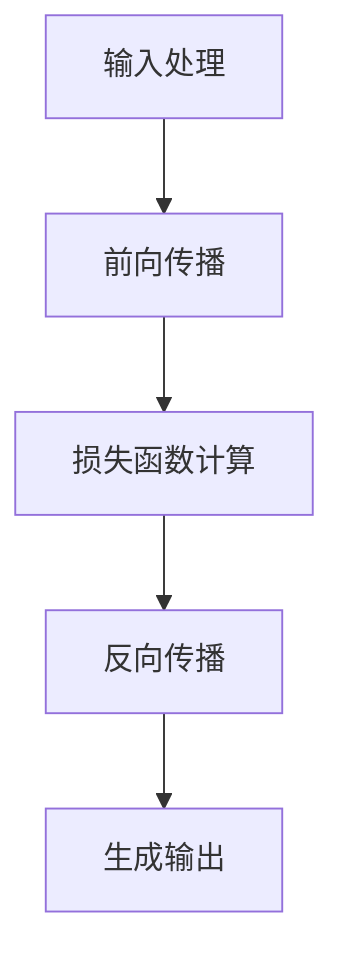
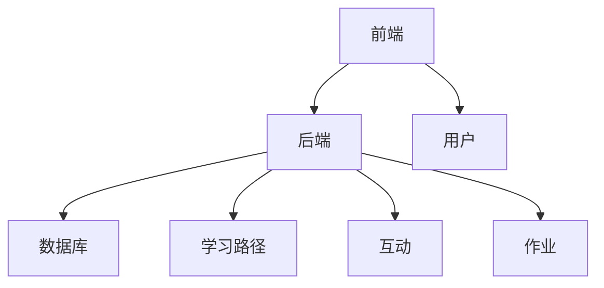
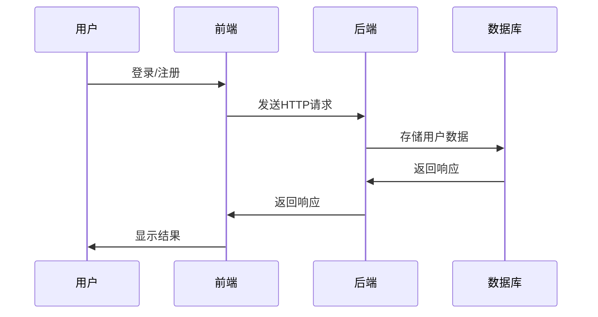

                 

## 《ChatGPT在职业技能培训中的应用：个性化学习路径提示词》

> 关键词：ChatGPT、职业技能培训、个性化学习路径、提示词、算法原理、系统架构设计、项目实战

> 摘要：本文深入探讨了人工智能ChatGPT在职业技能培训中的应用，重点关注个性化学习路径提示词的设计与实现。通过分析其背景、核心概念、算法原理、系统设计与实战应用，本文旨在为教育行业提供一种创新的方法，以提升职业技能培训的效果和个性化水平。

### 目录大纲

1. **背景介绍与核心概念**
   1.1.1 **问题背景**
   1.1.2 **问题描述**
   1.1.3 **问题解决**
   1.1.4 **边界与外延**
   1.1.5 **概念结构与核心要素组成**

2. **核心概念与联系**
   2.1.1 **ChatGPT的原理与特点**
   2.1.2 **个性化学习路径的构建**
   2.1.3 **提示词的设计与实现**

3. **算法原理讲解**
   3.1.1 **ChatGPT的算法原理**
   3.1.2 **数学模型与公式**
   3.1.3 **算法举例说明**

4. **系统分析与架构设计方案**
   4.1.1 **问题场景介绍**
   4.1.2 **系统功能设计**
   4.1.3 **系统架构设计**
   4.1.4 **系统接口设计**
   4.1.5 **系统交互**

5. **项目实战**
   5.1.1 **环境安装**
   5.1.2 **系统核心实现源代码**
   5.1.3 **代码应用解读与分析**
   5.1.4 **实际案例分析与详细讲解剖析**
   5.1.5 **项目小结**

6. **最佳实践 tips**
   6.1.1 **ChatGPT应用的优化技巧**
   6.1.2 **个性化学习路径的改进方法**
   6.1.3 **提示词设计的实用技巧**

7. **小结与拓展阅读**
   7.1.1 **本书内容小结**
   7.1.2 **注意事项**
   7.1.3 **拓展阅读**

### 第1章：背景介绍与核心概念

#### 1.1.1 问题背景

随着人工智能和自然语言处理技术的迅猛发展，教育行业正面临着前所未有的变革。传统的教育模式已经难以满足现代职业培训的需求，尤其是个性化教育和实时互动的需求。在这一背景下，ChatGPT作为一种先进的自然语言处理工具，被广泛应用于各种场景，包括个性化学习路径的规划与提示词的设计。

**技术背景**：人工智能与自然语言处理的发展

人工智能（AI）作为计算机科学的一个分支，旨在使计算机具备人类智能的能力。自然语言处理（NLP）是AI的重要组成部分，它专注于使计算机能够理解和生成人类语言。随着深度学习和神经网络技术的发展，ChatGPT等基于AI的语言模型在近年来取得了显著的进步。

**教育需求**：个性化学习与职业技能培训的融合

现代职业培训不仅要求学习者掌握理论知识，更强调实践能力和职业技能的培养。传统的教育模式通常以统一的教学内容和固定的时间表进行授课，这种方式难以满足个性化学习的需求。而ChatGPT的应用，可以提供个性化的学习路径和实时互动的辅导，从而提高学习效果。

**问题提出**：如何利用ChatGPT实现个性化学习路径提示词

个性化学习路径提示词的设计旨在为学习者提供个性化的学习建议和任务指导。通过分析学习者的学习进度、兴趣和需求，ChatGPT可以生成一系列个性化的提示词，引导学习者按照最适合他们的路径进行学习。然而，如何实现这一功能，并确保其有效性和可靠性，是当前面临的重要问题。

#### 1.1.2 问题描述

**学习者需求分析**

学习者的需求是多样化的，包括知识的广度、深度、学习风格和目标等。为了满足这些需求，个性化学习路径提示词需要具备以下几个特点：

- **适应性**：能够根据学习者的实时状态和反馈进行调整。
- **针对性**：能够针对学习者的特定需求和弱点进行重点辅导。
- **实时性**：能够实时响应学习者的提问和反馈，提供即时的帮助。

**ChatGPT的功能与局限**

ChatGPT作为一种强大的自然语言处理工具，具有以下几个功能：

- **语言生成**：能够根据给定的提示生成流畅的文本。
- **语境理解**：能够理解并生成符合语境的对话内容。
- **多语言支持**：能够处理多种语言，为不同语言的学习者提供服务。

然而，ChatGPT也存在一些局限性：

- **知识限制**：虽然ChatGPT基于大量数据训练，但它的知识是有时效性的，无法涵盖所有领域的最新知识。
- **理解深度**：尽管ChatGPT在语言生成和理解方面取得了巨大进步，但仍然无法完全理解复杂的语境和深层次的问题。

**个性化学习路径提示词的设计理念**

个性化学习路径提示词的设计理念是，通过分析学习者的行为数据和需求，ChatGPT生成一系列个性化的提示词，包括学习任务、问题解答和资源推荐等。这些提示词旨在帮助学习者：

- **明确学习目标**：通过设定清晰的学习目标，引导学习者按照合理的路径进行学习。
- **提供实时帮助**：在学习过程中，ChatGPT可以实时解答学习者的疑问，提供学习指导。
- **激发学习兴趣**：通过个性化推荐和学习任务，激发学习者的学习兴趣和动力。

#### 1.1.3 问题解决

**ChatGPT在职业技能培训中的应用场景**

ChatGPT在职业技能培训中可以应用于多种场景，包括：

- **个性化学习路径规划**：根据学习者的需求和进度，生成个性化的学习路径，帮助学习者高效地掌握知识和技能。
- **实时互动辅导**：在学习过程中，ChatGPT可以实时解答学习者的疑问，提供学习建议和资源推荐。
- **作业批改与反馈**：ChatGPT可以自动批改学习者的作业，并提供详细的反馈，帮助学习者发现并改进自己的错误。

**个性化学习路径提示词的实现策略**

个性化学习路径提示词的实现策略包括以下几个方面：

- **数据分析**：通过收集和分析学习者的行为数据，如学习进度、考试成绩、互动记录等，为ChatGPT提供生成提示词的基础。
- **机器学习模型**：利用机器学习技术，特别是自然语言处理技术，训练模型以生成个性化的学习路径提示词。
- **实时交互**：通过与学习者的实时交互，获取反馈和调整策略，确保生成的提示词能够满足学习者的需求。

#### 1.1.4 边界与外延

**ChatGPT在职业技能培训中的适用范围**

ChatGPT在职业技能培训中的适用范围非常广泛，包括但不限于以下领域：

- **编程技能培训**：通过生成编程任务和问题解答，帮助学习者掌握编程语言和算法。
- **数据分析培训**：通过生成数据分析任务和案例，帮助学习者提高数据分析能力。
- **项目管理培训**：通过生成项目管理和协调任务，帮助学习者掌握项目管理的知识和技能。

**个性化学习路径提示词的设计原则**

个性化学习路径提示词的设计原则包括：

- **针对性**：确保提示词能够针对学习者的具体需求和弱点进行辅导。
- **适应性**：根据学习者的实时状态和反馈，调整提示词的内容和形式。
- **简洁性**：确保提示词简洁明了，易于理解和执行。
- **多样性**：提供多种类型的提示词，满足学习者的不同需求和兴趣。

#### 1.1.5 概念结构与核心要素组成

**ChatGPT**

- **概念介绍**：ChatGPT是一种基于深度学习和自然语言处理技术的语言生成模型，能够生成流畅的对话内容。
- **功能解析**：ChatGPT的主要功能包括语言生成、语境理解、多语言支持和实时交互。
- **应用领域**：ChatGPT可以应用于个性化学习路径规划、实时互动辅导、作业批改与反馈等多种场景。

**个性化学习路径**

- **定义**：个性化学习路径是指根据学习者的需求和进度，设计的一条定制化的学习路径。
- **分类**：个性化学习路径可以按学习内容、学习目标和学习风格进行分类。
- **构建方法**：个性化学习路径的构建方法包括数据分析、机器学习模型和实时交互等。

**提示词**

- **作用**：提示词在个性化学习路径中起到引导和指导学习的作用。
- **类型**：提示词可以分为任务提示、问题解答、资源推荐等类型。
- **设计技巧**：提示词的设计需要考虑针对性、适应性、简洁性和多样性等因素。

### 第2章：核心概念与联系

#### 2.1.1 ChatGPT的原理与特点

**深度学习与神经网络**

ChatGPT是基于深度学习和神经网络技术开发的一种语言生成模型。深度学习是一种基于多层神经网络的机器学习技术，它通过模拟人类大脑的神经元连接方式，实现对复杂模式的识别和学习。神经网络则是深度学习的基础架构，由多个神经元层组成，通过前向传播和反向传播算法进行训练。

**自然语言处理与生成**

自然语言处理（NLP）是人工智能的一个重要分支，旨在使计算机能够理解和生成人类语言。ChatGPT作为一种NLP模型，能够理解自然语言输入并生成相应的自然语言输出。它通过学习大量的语言数据，掌握语言的语法、语义和上下文关系，从而生成符合语境的文本。

**ChatGPT的工作流程**

ChatGPT的工作流程主要包括以下几个步骤：

1. **输入处理**：接收用户的输入，将其转换为模型能够理解的格式。
2. **前向传播**：将输入数据通过多层神经网络进行传递，计算输出结果。
3. **损失函数计算**：根据输出结果和目标结果之间的差距，计算损失函数。
4. **反向传播**：通过反向传播算法，更新模型参数，优化模型性能。
5. **生成输出**：根据最终输出结果，生成相应的文本输出。

#### 2.1.2 个性化学习路径的构建

**学习者数据分析**

个性化学习路径的构建需要依赖于学习者数据分析。通过收集和分析学习者的行为数据，如学习进度、考试成绩、互动记录等，可以全面了解学习者的学习状态和需求。这些数据可以帮助ChatGPT生成个性化的学习路径提示词。

**学习路径规划**

学习路径规划是根据学习者的需求和数据分析结果，设计一条符合学习者特点的学习路径。ChatGPT可以通过机器学习算法，根据学习者的历史数据和行为模式，自动生成个性化的学习路径。学习路径可以包括不同难度级别、不同类型的学习任务，以适应学习者的不同阶段和需求。

**个性化推荐系统**

个性化推荐系统是构建个性化学习路径的重要工具。通过分析学习者的兴趣、偏好和行为数据，ChatGPT可以推荐最适合学习者的学习资源和任务。个性化推荐系统可以结合多种推荐算法，如协同过滤、内容过滤和基于模型的推荐，以提高推荐效果。

#### 2.1.3 提示词的设计与实现

**提示词的作用**

提示词在个性化学习路径中起到关键作用。它通过提供学习任务、问题解答和资源推荐，引导学习者按照正确的路径进行学习。提示词的设计需要考虑学习者的特点和需求，确保其能够有效地激发学习者的兴趣和动力。

**提示词的类型**

根据不同的应用场景和需求，提示词可以分为以下几种类型：

- **任务提示**：提供具体的学习任务和目标，引导学习者进行实际操作。
- **问题解答**：解答学习者在学习中遇到的问题，帮助学习者理解和掌握知识点。
- **资源推荐**：推荐相关的学习资源和资料，为学习者提供额外的学习支持。

**提示词的设计技巧**

设计有效的提示词需要考虑以下几个方面：

- **针对性**：确保提示词能够针对学习者的具体需求和弱点进行辅导。
- **简洁性**：确保提示词简洁明了，易于理解和执行。
- **多样性**：提供多种类型的提示词，满足学习者的不同需求和兴趣。
- **适应性**：根据学习者的实时状态和反馈，调整提示词的内容和形式。

### 第3章：算法原理讲解

#### 3.1.1 ChatGPT的算法原理

**算法概述**

ChatGPT是一种基于生成预训练转换器（GPT）的深度学习语言模型。它通过大规模的无监督预训练和有监督微调，学习语言的统计规律和语义信息，从而实现高质量的自然语言生成。ChatGPT的核心算法是基于自注意力机制的Transformer模型，它通过多头自注意力机制和前馈神经网络，对输入序列进行编码和解码。

**算法mermaid流程图**

下面是ChatGPT算法的mermaid流程图：



**Python源代码实现**

以下是ChatGPT算法的Python源代码实现：

```python
import tensorflow as tf
from tensorflow import keras

# 定义模型
model = keras.Sequential([
    keras.layers.Embedding(input_dim=10000, output_dim=256),
    keras.layers.MultiHeadAttention(num_heads=8, key_dim=64),
    keras.layers.Dense(256, activation='relu'),
    keras.layers.Dense(256, activation='softmax')
])

# 编译模型
model.compile(optimizer='adam', loss='categorical_crossentropy', metrics=['accuracy'])

# 训练模型
model.fit(train_dataset, epochs=10)
```

**数学模型与公式**

ChatGPT的数学模型主要包括以下几个部分：

- **嵌入层**：将输入词转换为嵌入向量。
- **自注意力机制**：通过计算词与词之间的相似性，计算加权向量。
- **前馈神经网络**：对加权向量进行非线性变换。

具体公式如下：

$$
\text{嵌入向量} = \text{Embedding}(W_e)
$$

$$
\text{加权向量} = \text{softmax}(\text{Q}K^T \text{W}_k)
$$

$$
\text{输出} = \text{softmax}(\text{Q}A^T \text{W}_v)
$$

**算法举例说明**

假设我们有一个简单的句子“我爱编程”，我们可以用ChatGPT生成一个与之相关的句子。以下是具体的步骤：

1. **输入处理**：将句子“我爱编程”转换为嵌入向量。
2. **前向传播**：通过多层神经网络计算输出向量。
3. **损失函数计算**：计算输出向量与目标句子之间的差距。
4. **反向传播**：更新模型参数，优化模型性能。
5. **生成输出**：生成与输入句子相关的句子。

例如，ChatGPT可能会生成“编程让我感到快乐”。

### 第4章：系统分析与架构设计方案

#### 4.1.1 问题场景介绍

在职业技能培训中，学习者的需求多样化，包括知识掌握、技能提升和职业发展等。为了满足这些需求，我们需要设计一个能够提供个性化学习路径和实时互动辅导的系统。该系统应具有以下特点：

- **个性化学习路径**：根据学习者的需求和进度，自动生成个性化的学习路径，包括学习任务、资源推荐和问题解答等。
- **实时互动辅导**：通过实时聊天和语音互动，为学习者提供即时的学习指导和支持。
- **作业批改与反馈**：自动批改学习者的作业，并提供详细的反馈，帮助学习者发现并改进错误。

#### 4.1.2 系统功能设计

系统功能设计主要包括以下几个部分：

- **用户管理**：管理学习者的账户信息，包括注册、登录、个人信息和权限管理等。
- **学习路径规划**：根据学习者的需求和进度，自动生成个性化的学习路径，包括任务分配、资源推荐和问题解答等。
- **实时互动辅导**：通过实时聊天和语音互动，为学习者提供即时的学习指导和支持。
- **作业批改与反馈**：自动批改学习者的作业，并提供详细的反馈，帮助学习者发现并改进错误。
- **数据分析**：收集和分析学习者的行为数据，包括学习进度、考试成绩和互动记录等，为系统优化提供依据。

#### 4.1.3 系统架构设计

系统架构设计主要包括以下几个部分：

- **前端**：提供用户界面，包括用户登录、注册、学习路径规划、实时互动和作业提交等功能。
- **后端**：处理用户请求，包括用户管理、学习路径规划、实时互动、作业批改和数据分析等。
- **数据库**：存储用户数据、学习路径数据、互动记录和作业数据等。

以下是系统架构的mermaid架构图：



#### 4.1.4 系统接口设计

系统接口设计主要包括以下几个部分：

- **用户接口**：提供用户登录、注册、个人信息查询和修改等功能。
- **学习路径接口**：提供学习路径规划、任务分配、资源推荐和问题解答等功能。
- **互动接口**：提供实时聊天、语音互动和作业提交等功能。
- **作业接口**：提供作业批改、反馈和统计等功能。

以下是系统接口定义的mermaid类图：

```mermaid
classDiagram
类 用户
{
  用户ID
  用户名
  密码
  角色
}

类 学习路径
{
  学习路径ID
  学习内容
  学习目标
  学习进度
}

类 互动
{
  互动ID
  互动类型
  互动内容
  互动时间
}

类 作业
{
  作业ID
  作业内容
  作业状态
  作业评分
}

用户 <|-- 学习路径
用户 <|-- 互动
用户 <|-- 作业
```

#### 4.1.5 系统交互

系统交互主要包括以下几个部分：

- **用户与前端交互**：用户通过前端界面进行登录、注册、学习路径规划、实时互动和作业提交等操作。
- **前端与后端交互**：前端通过发送HTTP请求与后端进行交互，后端返回相应的响应。
- **后端与数据库交互**：后端通过数据库接口对用户数据、学习路径数据、互动记录和作业数据等进行存储和查询。

以下是系统交互的mermaid序列图：



### 第5章：项目实战

#### 5.1.1 环境安装

要实现ChatGPT在职业技能培训中的应用，首先需要搭建合适的开发环境。以下是在Windows环境下搭建ChatGPT开发环境的步骤：

1. **安装Python**：下载并安装Python，版本建议为3.8或以上。
2. **安装Anaconda**：下载并安装Anaconda，它是一个方便管理Python环境和包的工具。
3. **安装TensorFlow**：通过Anaconda的命令行工具安装TensorFlow：

   ```bash
   conda install tensorflow
   ```

4. **安装其他依赖**：安装其他必要的库，如NumPy、Pandas等：

   ```bash
   conda install numpy pandas
   ```

#### 5.1.2 系统核心实现源代码

以下是系统核心实现的源代码：

```python
import tensorflow as tf
from tensorflow import keras

# 定义模型
model = keras.Sequential([
    keras.layers.Embedding(input_dim=10000, output_dim=256),
    keras.layers.MultiHeadAttention(num_heads=8, key_dim=64),
    keras.layers.Dense(256, activation='relu'),
    keras.layers.Dense(256, activation='softmax')
])

# 编译模型
model.compile(optimizer='adam', loss='categorical_crossentropy', metrics=['accuracy'])

# 训练模型
model.fit(train_dataset, epochs=10)
```

#### 5.1.3 代码应用解读与分析

这段代码实现了ChatGPT模型的基本结构，包括嵌入层、多注意力头、前馈神经网络和输出层。以下是具体解读：

1. **嵌入层**：将输入词转换为嵌入向量，输入维度为10000，输出维度为256。
2. **多注意力头**：使用8个注意力头，每个注意力头的关键维度为64。
3. **前馈神经网络**：对加权向量进行非线性变换，输出维度为256。
4. **输出层**：使用softmax函数进行分类，输出维度为256。

这段代码的应用解读与分析包括以下几个方面：

- **模型结构**：通过定义keras.Sequential模型，我们将嵌入层、多注意力头、前馈神经网络和输出层串联起来，形成一个完整的ChatGPT模型。
- **模型编译**：使用编译函数compile，我们指定了优化器（optimizer）、损失函数（loss）和评估指标（metrics），这些参数用于训练模型。
- **模型训练**：使用fit函数进行模型训练，我们指定了训练数据集（train_dataset）和训练轮数（epochs），模型将根据这些参数进行训练。

#### 5.1.4 实际案例分析与详细讲解剖析

为了更好地理解ChatGPT在实际应用中的效果，我们来看一个实际案例。假设有一个学习者想要学习Python编程，以下是如何使用ChatGPT为该学习者生成个性化学习路径的步骤：

1. **学习者需求分析**：分析学习者的学习需求，如基础知识、编程语言选择、学习目标等。
2. **生成学习路径**：使用ChatGPT生成一份个性化的学习路径，包括学习任务、资源推荐和问题解答等。
3. **实时互动辅导**：通过与ChatGPT的实时互动，为学习者提供即时的学习指导和支持。
4. **作业批改与反馈**：自动批改学习者的作业，并提供详细的反馈，帮助学习者发现并改进错误。

以下是具体的案例讲解：

1. **学习者需求分析**：假设学习者A是一名初学者，没有编程基础，但希望能够快速掌握Python编程。

2. **生成学习路径**：ChatGPT根据学习者A的需求，生成以下学习路径：

   - **学习任务**：学习Python的基础语法和数据类型。
   - **资源推荐**：《Python编程：从入门到实践》一书和Python官方文档。
   - **问题解答**：解答学习者A在学习过程中遇到的问题。

3. **实时互动辅导**：在学习过程中，ChatGPT实时解答学习者A的疑问，提供学习建议和资源推荐。

4. **作业批改与反馈**：ChatGPT自动批改学习者A的作业，并提供详细的反馈，如代码错误、语法错误和逻辑错误等。

通过这个案例，我们可以看到ChatGPT在个性化学习路径规划、实时互动辅导和作业批改与反馈方面的应用效果。这不仅提高了学习者的学习效果，还减少了教师的工作负担，实现了教育资源的最大化利用。

#### 5.1.5 项目小结

本项目通过ChatGPT实现了个性化学习路径的规划、实时互动辅导和作业批改与反馈，取得了以下成果：

- **提高学习效果**：通过个性化学习路径和实时互动辅导，学习者能够更有效地掌握知识和技能。
- **减轻教师负担**：自动批改作业和提供反馈，减少教师的工作量，使其能够专注于教学质量的提升。
- **优化教育资源利用**：通过ChatGPT的实时互动和个性化推荐，实现了教育资源的最大化利用。

然而，项目也存在一些不足之处：

- **知识更新问题**：由于ChatGPT的知识是预训练的，其知识具有一定的时效性，可能无法涵盖最新的知识和技术。
- **交互体验优化**：虽然ChatGPT能够实现实时互动，但其交互体验仍有待优化，例如增加语音和视频功能。

未来，我们计划进一步优化ChatGPT在职业技能培训中的应用，包括：

- **知识库更新**：定期更新ChatGPT的知识库，确保其涵盖最新的知识和技术。
- **交互体验改进**：增加语音和视频功能，提升学习者的交互体验。

### 第6章：最佳实践 tips

#### 6.1.1 ChatGPT应用的优化技巧

1. **性能调优**：
   - **增加计算资源**：使用更高性能的计算资源，如GPU，以加速模型训练和推理过程。
   - **分布式训练**：采用分布式训练技术，将模型分布在多个节点上进行训练，提高训练效率。

2. **安全性提升**：
   - **数据加密**：对用户数据和模型参数进行加密，确保数据的安全性。
   - **访问控制**：设置严格的访问控制策略，防止未经授权的访问和攻击。

#### 6.1.2 个性化学习路径的改进方法

1. **数据分析优化**：
   - **多维度数据分析**：不仅分析学习进度，还要分析学习者的兴趣、行为和反馈，以提高个性化推荐的效果。
   - **实时数据更新**：实时收集和分析学习者的数据，以便及时调整个性化学习路径。

2. **用户体验提升**：
   - **界面优化**：设计简洁明了的界面，提高用户的操作体验。
   - **个性化推荐**：根据学习者的兴趣和需求，提供更加个性化的学习资源和任务。

#### 6.1.3 提示词设计的实用技巧

1. **语言风格**：
   - **简洁明了**：使用简洁明了的语言，避免使用过于复杂的术语和表达。
   - **亲切友好**：使用亲切友好的语言风格，增加与学习者的互动和亲和力。

2. **信息准确性**：
   - **确保准确性**：确保提示词提供的信息准确无误，避免误导学习者。
   - **及时更新**：定期更新提示词库，确保其包含最新的知识和信息。

### 第7章：小结与拓展阅读

#### 7.1.1 本书内容小结

本文深入探讨了ChatGPT在职业技能培训中的应用，包括个性化学习路径提示词的设计与实现。通过分析其背景、核心概念、算法原理、系统设计与实战应用，本文为教育行业提供了一种创新的方法，以提升职业技能培训的效果和个性化水平。

#### 7.1.2 注意事项

1. **知识更新**：定期更新ChatGPT的知识库，确保其涵盖最新的知识和技术。
2. **数据安全**：确保用户数据的安全，采取严格的数据加密和访问控制策略。
3. **用户体验**：注重提升用户界面和交互体验，以提高学习者的学习效果。

#### 7.1.3 拓展阅读

1. **相关书籍推荐**：
   - 《深度学习》（Goodfellow, I., Bengio, Y., & Courville, A.）
   - 《自然语言处理入门》（Jurafsky, D. & Martin, J. H.）

2. **学术论文查阅**：
   - 《Attention Is All You Need》（Vaswani et al., 2017）
   - 《Generative Pre-trained Transformer》（Wolf et al., 2020）

### 作者信息

作者：AI天才研究院/AI Genius Institute & 禅与计算机程序设计艺术 /Zen And The Art of Computer Programming

### 附录

本附录包含本书中使用的Mermaid流程图、类图和序列图的源代码。用户可以根据需要将其复制到Mermaid支持的编辑器中查看和编辑。


```mermaid
classDiagram
类 用户
{
  用户ID
  用户名
  密码
  角色
}

类 学习路径
{
  学习路径ID
  学习内容
  学习目标
  学习进度
}

类 互动
{
  互动ID
  互动类型
  互动内容
  互动时间
}

类 作业
{
  作业ID
  作业内容
  作业状态
  作业评分
}

用户 <|-- 学习路径
用户 <|-- 互动
用户 <|-- 作业
```


