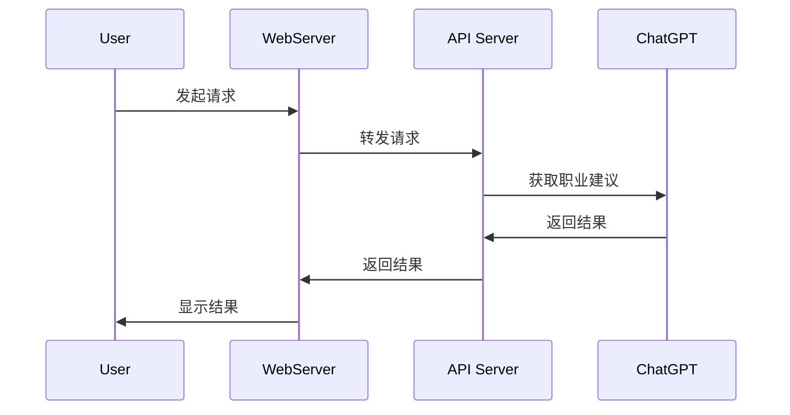

                 

### # ChatGPT在职业规划咨询中的应用

## 关键词

- **ChatGPT**  
- **职业规划咨询**  
- **人工智能**  
- **自然语言处理**  
- **用户交互**  
- **个性化建议**

## 摘要

本文旨在探讨ChatGPT在职业规划咨询中的应用，通过逻辑清晰的分析和逐步推理，揭示其在提供个性化职业建议、职业方向探索和职业技能提升等方面的潜力。文章首先介绍了ChatGPT的基本概念和核心特性，随后详细分析了其在职业规划咨询中的多种应用场景，最后讨论了实际操作中的挑战和解决方案。

----------------------------------------------------------------

## 引言

### 1.1 职业规划咨询的现状与挑战

职业规划咨询是帮助个体明确职业目标、优化职业路径的重要过程。然而，当前职业规划咨询面临着一些显著的挑战：

- **个性化不足**：传统的职业规划方法往往缺乏个性化和灵活性，难以满足每个个体的独特需求。
- **信息泛滥**：互联网时代的信息爆炸使得人们难以从海量信息中筛选出有价值的内容，职业咨询师也难以在有限的时间内提供全面、个性化的建议。
- **成本高昂**：面对面的职业咨询通常需要耗费大量的时间和经济成本，难以广泛普及。

与此同时，人工智能技术的发展为职业规划咨询带来了新的机遇。ChatGPT作为一种基于人工智能的自然语言处理模型，具备强大的文本生成和理解能力，可以处理复杂的语言任务，为职业规划咨询提供了一种全新的解决方案。

### 1.2 ChatGPT的基本概念与核心特性

ChatGPT是由OpenAI开发的一种大型语言模型，基于GPT（Generative Pre-trained Transformer）架构。它通过深度学习从海量文本数据中学习语言模式和知识，从而能够生成连贯、有意义的文本。ChatGPT的核心特性包括：

- **文本生成能力**：ChatGPT可以生成与输入文本相关的内容，包括对话、文章、摘要等。
- **上下文理解**：ChatGPT能够理解输入文本的上下文，并生成连贯的回答。
- **多语言支持**：ChatGPT支持多种语言，可以实现跨语言的职业规划咨询。
- **自适应能力**：通过不断学习和优化，ChatGPT能够不断提高其在特定领域的专业能力。

### 1.3 解决方案与核心概念

ChatGPT在职业规划咨询中的应用方案主要包括以下几个方面：

- **个性化职业建议**：ChatGPT可以根据用户的输入信息，如教育背景、工作经验、职业兴趣等，提供个性化的职业建议。
- **职业方向探索**：ChatGPT可以帮助用户探索不同的职业方向，提供相关的职业信息、岗位要求和职业发展路径。
- **职业技能提升**：ChatGPT可以提供针对特定职业技能的培训内容和实践建议，帮助用户提升职业能力。

### 1.4 文章结构

本文将分为以下几个部分：

1. **核心概念**：详细解释ChatGPT的工作原理和核心特性。
2. **应用场景**：分析ChatGPT在职业规划咨询中的多种应用，如职业建议、职业探索和技能提升等。
3. **实际操作**：讨论如何部署和实现ChatGPT系统，以及可能面临的挑战和解决方案。
4. **案例分析**：通过具体案例展示ChatGPT在职业规划咨询中的实际应用效果。
5. **未来展望**：探讨ChatGPT在职业规划咨询领域的未来发展趋势。

接下来，我们将逐步深入探讨ChatGPT在职业规划咨询中的应用，以及如何通过逻辑分析和推理来优化这一应用。

----------------------------------------------------------------

## 核心概念

### 2.1 ChatGPT的工作原理

ChatGPT是一种基于深度学习的自然语言处理模型，其核心是GPT（Generative Pre-trained Transformer）架构。GPT模型通过在大量文本数据上进行预训练，学习到语言的普遍规律和模式，从而具备生成连贯、有意义的文本的能力。

#### 2.1.1 预训练过程

ChatGPT的预训练过程分为以下几个步骤：

1. **数据收集**：从互联网上收集大量文本数据，包括新闻报道、论坛帖子、书籍、论文等。
2. **数据预处理**：对收集到的文本数据进行清洗和预处理，去除无效信息和噪声。
3. **模型训练**：使用Transformer架构对预处理后的文本数据进行训练。Transformer模型是一种基于自注意力机制的深度神经网络，具有处理长距离依赖关系的能力。
4. **模型优化**：通过调整模型的参数和架构，优化模型的性能和泛化能力。

#### 2.1.2 自注意力机制

自注意力机制是Transformer模型的核心部分，它允许模型在生成每个词时，根据其他所有词的重要程度来调整它们的权重。这种机制使得模型能够捕捉到长文本中的复杂关系和依赖，从而生成更加连贯和有意义的文本。

#### 2.1.3 微调过程

在预训练完成后，ChatGPT可以通过微调过程来适应特定的任务和领域。微调的过程包括：

1. **任务定义**：定义具体的任务目标，如职业规划咨询。
2. **数据集准备**：准备针对特定任务的训练数据集，包括职业描述、职位要求、职业建议等。
3. **模型微调**：在特定数据集上进行模型微调，优化模型在任务上的性能。

### 2.2 ChatGPT的核心特性

ChatGPT的核心特性包括：

- **文本生成能力**：ChatGPT可以生成各种类型的文本，包括对话、文章、摘要等。
- **上下文理解**：ChatGPT能够理解输入文本的上下文，并生成连贯的回答。
- **多语言支持**：ChatGPT支持多种语言，可以实现跨语言的职业规划咨询。
- **自适应能力**：通过不断学习和优化，ChatGPT能够不断提高其在特定领域的专业能力。

### 2.3 ChatGPT在职业规划咨询中的应用

ChatGPT在职业规划咨询中的应用主要体现在以下几个方面：

- **个性化职业建议**：ChatGPT可以根据用户的输入信息，如教育背景、工作经验、职业兴趣等，提供个性化的职业建议。
- **职业方向探索**：ChatGPT可以帮助用户探索不同的职业方向，提供相关的职业信息、岗位要求和职业发展路径。
- **职业技能提升**：ChatGPT可以提供针对特定职业技能的培训内容和实践建议，帮助用户提升职业能力。

### 2.4 核心概念联系

为了更好地理解ChatGPT在职业规划咨询中的应用，我们可以通过一个ER实体关系图来展示核心概念之间的联系。

```mermaid
erDiagram
  User ||--|{ ChatGPT }|--|{ CareerAdvice }
  User ||--|{ CareerExplorer }
  User ||--|{ SkillLifter }
```

在这个ER实体关系图中，`User`表示用户，`ChatGPT`表示自然语言处理模型，`CareerAdvice`表示职业建议，`CareerExplorer`表示职业方向探索，`SkillLifter`表示职业技能提升。这些实体之间通过关系连接，形成了完整的职业规划咨询系统。

通过这个核心概念联系，我们可以清晰地看到ChatGPT在职业规划咨询中的角色和作用，从而更好地理解其应用原理和实现方法。

----------------------------------------------------------------

## 技术基础

### 3.1 ChatGPT的架构

ChatGPT是基于GPT（Generative Pre-trained Transformer）模型构建的，而GPT模型是一种基于Transformer架构的深度学习模型。Transformer架构的核心是自注意力机制（Self-Attention Mechanism），这种机制使得模型能够处理长距离依赖关系，从而生成更加连贯的文本。

#### 3.1.1 Transformer模型的基本结构

Transformer模型主要由编码器（Encoder）和解码器（Decoder）组成。编码器负责将输入的文本序列转换为序列向量，而解码器则负责生成输出文本。

1. **编码器**：编码器由多个编码层（Encoder Layer）堆叠而成，每个编码层包含两个主要部分：多头自注意力机制（Multi-Head Self-Attention）和前馈神经网络（Feed-Forward Neural Network）。多头自注意力机制通过多个注意力头（Attention Head）并行处理输入序列，从而捕捉到长距离的依赖关系。前馈神经网络则对自注意力机制的输出进行进一步处理。

2. **解码器**：解码器由多个解码层（Decoder Layer）堆叠而成，每个解码层包含三个主要部分：多头自注意力机制、编码器-解码器注意力机制和前馈神经网络。多头自注意力机制用于生成输出文本的候选词，编码器-解码器注意力机制则允许解码器在生成每个词时参考编码器的输出，从而提高生成的连贯性。

#### 3.1.2 自注意力机制的工作原理

自注意力机制是Transformer模型的核心部分，它允许模型在生成每个词时，根据其他所有词的重要程度来调整它们的权重。具体来说，自注意力机制通过以下步骤工作：

1. **计算query、key和value**：对于输入序列中的每个词，计算其对应的query、key和value向量。这三个向量是相同的，但是分别通过不同的权重矩阵计算得到。
2. **计算注意力得分**：利用query和key计算注意力得分，得分表示两个词之间的相关性。通常使用点积（Dot Product）或缩放点积（Scaled Dot Product）计算注意力得分。
3. **计算注意力权重**：对注意力得分进行软性最大化（Softmax）处理，得到每个词的注意力权重。
4. **计算加权和**：将注意力权重与value向量相乘，得到加权值，然后将所有加权值相加，得到最终的注意力输出。

#### 3.1.3 ChatGPT的预训练与微调过程

ChatGPT的预训练过程主要包括以下步骤：

1. **数据收集**：从互联网上收集大量文本数据，包括新闻报道、论坛帖子、书籍、论文等。
2. **数据预处理**：对收集到的文本数据进行清洗和预处理，去除无效信息和噪声。
3. **模型训练**：使用Transformer架构对预处理后的文本数据进行训练。训练过程中，模型会学习到语言的普遍规律和模式，从而具备生成连贯、有意义的文本的能力。
4. **模型优化**：通过调整模型的参数和架构，优化模型的性能和泛化能力。

在预训练完成后，ChatGPT可以通过微调过程来适应特定的任务和领域。微调的过程包括：

1. **任务定义**：定义具体的任务目标，如职业规划咨询。
2. **数据集准备**：准备针对特定任务的训练数据集，包括职业描述、职位要求、职业建议等。
3. **模型微调**：在特定数据集上进行模型微调，优化模型在任务上的性能。

### 3.2 ChatGPT如何处理自然语言

ChatGPT通过以下步骤来处理自然语言：

1. **输入编码**：将自然语言文本转换为模型可以理解的序列向量。通常使用词嵌入（Word Embedding）技术，如Word2Vec或BERT，将每个词映射为一个高维向量。
2. **编码器处理**：编码器将输入序列向量转换为隐藏状态，通过自注意力机制和前馈神经网络处理，捕捉到文本的语义信息。
3. **解码器生成**：解码器根据编码器的输出和已生成的文本，生成下一个词的概率分布。通过多次迭代，逐步生成完整的文本输出。

#### 3.2.1 自然语言处理的关键技术

在处理自然语言时，ChatGPT利用了以下关键技术：

- **词嵌入**：将自然语言文本中的词映射为向量，使得模型能够理解词的语义信息。
- **序列处理**：通过处理输入文本的序列，模型能够捕捉到文本中的顺序关系和上下文信息。
- **注意力机制**：通过自注意力机制和编码器-解码器注意力机制，模型能够捕捉到长距离依赖关系，从而生成更加连贯的文本。
- **预训练与微调**：通过预训练和微调过程，模型能够学习到通用语言知识和特定领域的知识，从而提高其在特定任务上的性能。

通过这些技术，ChatGPT能够高效地处理自然语言，生成有意义的对话和文本，从而在职业规划咨询中发挥重要作用。

----------------------------------------------------------------

## 应用场景

### 4.1 个性化职业建议

ChatGPT在个性化职业建议方面的应用主要体现在以下几个方面：

#### 4.1.1 根据用户信息提供定制化建议

用户可以通过与ChatGPT的对话，提供自己的个人信息，如教育背景、工作经验、兴趣爱好等。ChatGPT会根据这些信息，利用其强大的语言生成能力，生成个性化的职业建议。例如，如果用户提到自己擅长数学，ChatGPT可能会推荐数据分析师或人工智能工程师等职业。

#### 4.1.2 探索潜在的职业路径

ChatGPT还可以帮助用户探索不同的职业路径。用户可以提出自己感兴趣的领域或行业，ChatGPT会根据这些信息，生成相关的职业信息、岗位要求和职业发展路径。例如，如果用户对医疗行业感兴趣，ChatGPT可以提供医生、护士、医药代表等不同职业的详细信息。

#### 4.1.3 提供职业发展建议

ChatGPT还可以根据用户的工作经历和职业目标，提供职业发展的建议。例如，如果用户在某个领域有一定的工作经验，ChatGPT可能会推荐进一步提升技能的培训课程或提供职业晋升的建议。

### 4.2 职业方向探索

ChatGPT在职业方向探索方面的应用主要体现在以下几个方面：

#### 4.2.1 提供职业信息查询

用户可以通过与ChatGPT的对话，查询不同职业的详细信息，如工作内容、岗位职责、薪资待遇等。ChatGPT会根据用户的提问，生成详细的职业描述，帮助用户更好地了解各个职业。

#### 4.2.2 推荐职业方向

ChatGPT可以根据用户的教育背景、工作经验和兴趣爱好，推荐适合的职业方向。例如，如果用户在计算机科学领域有较好的背景，ChatGPT可能会推荐软件开发、数据分析、人工智能等职业。

#### 4.2.3 探索新领域的机会

ChatGPT还可以帮助用户探索新领域的机会。用户可以提出自己感兴趣的领域或行业，ChatGPT会根据这些信息，推荐相关的职业方向和潜在的机会。

### 4.3 职业技能提升

ChatGPT在职业技能提升方面的应用主要体现在以下几个方面：

#### 4.3.1 提供学习建议

用户可以通过与ChatGPT的对话，获取针对特定技能的学习建议。ChatGPT会根据用户的需求，推荐相关的学习资源，如在线课程、书籍、实践项目等。

#### 4.3.2 设计个性化学习计划

ChatGPT可以根据用户的学习进度、兴趣和能力，设计个性化的学习计划。例如，如果用户希望在短时间内提升数据分析能力，ChatGPT可以推荐一系列的数据分析课程和实践项目。

#### 4.3.3 提供实践建议

ChatGPT还可以为用户提供实践建议，帮助用户将所学知识应用于实际工作中。例如，如果用户正在学习Python编程，ChatGPT可以推荐一些实用的编程项目，帮助用户提高编程技能。

通过这些应用场景，ChatGPT能够为用户提供全面、个性化的职业规划服务，帮助用户更好地了解自己的职业方向，提升职业技能，实现职业发展目标。

----------------------------------------------------------------

## 用户交互与体验设计

### 5.1 交互界面设计

为了提供良好的用户体验，ChatGPT的交互界面设计应当简洁直观、易于操作。以下是交互界面设计的关键要素：

#### 5.1.1 清晰的导航

交互界面应提供清晰的导航，使用户能够轻松找到所需功能。可以使用顶部导航栏或侧边栏来组织不同功能模块，如“个性化职业建议”、“职业方向探索”和“职业技能提升”等。

#### 5.1.2 直观的图标和按钮

使用直观的图标和按钮，使用户能够快速理解每个功能的作用。例如，使用一个放大镜图标表示搜索功能，一个箭头图标表示提交问题。

#### 5.1.3 良好的布局

确保交互界面布局合理，信息呈现清晰。可以采用网格布局或卡片布局，将不同信息模块分门别类地展示。

#### 5.1.4 多样化的输入方式

支持多种输入方式，如文本输入、语音输入和图片输入，以适应不同用户的需求。

### 5.2 响应速度与实时性

良好的响应速度和实时性对于用户体验至关重要。以下是确保响应速度和实时性的关键策略：

#### 5.2.1 高效的后端处理

优化后端服务，确保快速处理用户请求。可以通过以下方法提高后端处理效率：

- **并行处理**：使用多线程或异步编程技术，并行处理多个用户请求。
- **缓存机制**：使用缓存技术，减少重复计算和数据检索，提高响应速度。
- **负载均衡**：使用负载均衡器，将用户请求分配到多个服务器上，避免单点瓶颈。

#### 5.2.2 前端优化

优化前端代码，减少页面加载时间和交互延迟。可以使用以下技术：

- **代码压缩与合并**：减少CSS和JavaScript文件的体积，加快页面加载速度。
- **懒加载**：对于非重要内容，采用懒加载技术，仅在用户访问时才加载。
- **异步加载**：使用异步加载技术，同时加载多个资源。

#### 5.2.3 实时更新

确保ChatGPT能够实时更新对话内容，避免用户等待。可以使用WebSocket或其他实时通信技术，实现与后端的实时数据传输。

### 5.3 个性化与适应性

为用户提供个性化的交互体验，能够显著提升用户满意度。以下是实现个性化与适应性的方法：

#### 5.3.1 用户资料存储

存储用户的基本信息、历史对话记录等，以便在后续交互中提供个性化建议。

#### 5.3.2 用户偏好设置

允许用户设置自己的偏好，如语言、职业领域、交互风格等。根据用户偏好，ChatGPT可以提供更符合用户期望的建议。

#### 5.3.3 学习用户行为

通过分析用户行为数据，如提问频率、问题类型、交互时长等，ChatGPT可以不断学习用户的偏好和需求，提供更加精准的建议。

### 5.4 负面情绪处理

在用户交互过程中，可能会遇到用户表达负面情绪的情况。以下是一些处理负面情绪的策略：

#### 5.4.1 情感分析

使用情感分析技术，识别用户情绪，并相应调整ChatGPT的回应方式。

#### 5.4.2 情绪缓解

在用户表达负面情绪时，ChatGPT可以提供安慰性的回应，如“别担心，我会尽力帮助你”等，以缓解用户情绪。

#### 5.4.3 引导积极思考

ChatGPT可以通过引导用户思考积极的角度，帮助用户调整心态，例如提供成功案例、乐观前景等。

通过上述设计策略，ChatGPT可以提供优质、高效、个性化的用户体验，帮助用户更好地实现职业规划目标。

----------------------------------------------------------------

## 实际操作

### 6.1 系统搭建

要部署一个基于ChatGPT的职业规划咨询系统，首先需要搭建一个稳定、高效的后端服务。以下是一个基本的系统架构设计：

#### 6.1.1 项目介绍

**项目名称**：ChatGPT职业规划咨询平台

**项目目标**：利用ChatGPT提供个性化、专业的职业规划建议。

**项目组成部分**：后端服务、前端应用、数据库存储。

#### 6.1.2 系统功能设计

**功能模块**：
1. 用户注册与登录
2. 用户信息管理
3. 个性化职业建议
4. 职业方向探索
5. 职业技能提升
6. 用户互动与反馈

**领域模型**：

```mermaid
classDiagram
    User <<class>> "用户"
    ChatGPT <<class>> "ChatGPT模型"
    CareerAdvice <<class>> "职业建议"
    CareerExplorer <<class>> "职业探索"
    SkillLifter <<class>> "技能提升"
    Feedback <<class>> "用户反馈"

    User o--|{ ChatGPT }| ChatGPT
    User o--|{ CareerAdvice }| CareerAdvice
    User o--|{ CareerExplorer }| CareerExplorer
    User o--|{ SkillLifter }| SkillLifter
    User o--|{ Feedback }| Feedback
```

#### 6.1.3 系统架构设计

**系统架构**：



在这个架构设计中，WebServer负责处理用户请求，API Server负责调用ChatGPT模型进行文本生成，并将结果返回给WebServer，最后由WebServer将结果呈现给用户。

### 6.2 环境安装与配置

要在本地部署一个ChatGPT职业规划咨询平台，需要进行以下环境安装与配置：

#### 6.2.1 安装Python环境

确保本地安装了Python 3.8及以上版本。可以使用以下命令检查Python版本：

```shell
python --version
```

#### 6.2.2 安装依赖库

在项目目录中，运行以下命令安装依赖库：

```shell
pip install -r requirements.txt
```

#### 6.2.3 部署后端服务

在项目目录中，使用以下命令启动后端服务：

```shell
python app.py
```

#### 6.2.4 前端应用部署

前端应用可以使用任意前端框架，如React、Vue或Angular。将前端代码部署到服务器上，并确保可以访问。

### 6.3 系统核心实现

#### 6.3.1 API接口设计

**用户注册与登录接口**：

```python
# 用户注册
@app.route('/register', methods=['POST'])
def register():
    # 实现用户注册逻辑
    pass

# 用户登录
@app.route('/login', methods=['POST'])
def login():
    # 实现用户登录逻辑
    pass
```

**获取职业建议接口**：

```python
# 获取职业建议
@app.route('/career-advice', methods=['POST'])
def get_career_advice():
    # 获取用户信息，调用ChatGPT模型生成建议
    # 返回职业建议结果
    pass
```

#### 6.3.2 ChatGPT模型调用

在获取职业建议接口中，需要调用ChatGPT模型来生成职业建议。以下是一个示例：

```python
from transformers import ChatGPT

model = ChatGPT.from_pretrained('openai/chatgpt')

def get_advice(user_info):
    input_text = f"请根据以下信息提供职业建议：{user_info}"
    output_text = model.generate(input_text, max_length=1000)
    return output_text.strip()
```

#### 6.3.3 数据库存储

可以使用SQLite、MySQL或PostgreSQL等数据库来存储用户信息和职业建议。以下是一个使用SQLite的示例：

```python
import sqlite3

conn = sqlite3.connect('career_advice.db')
c = conn.cursor()

# 创建用户表
c.execute('''CREATE TABLE IF NOT EXISTS users (
             id INTEGER PRIMARY KEY,
             username TEXT,
             password TEXT,
             email TEXT)''')

# 创建职业建议表
c.execute('''CREATE TABLE IF NOT EXISTS advice (
             id INTEGER PRIMARY KEY,
             user_id INTEGER,
             advice TEXT,
             FOREIGN KEY (user_id) REFERENCES users (id))''')

conn.commit()
conn.close()
```

通过上述步骤，可以实现一个基本的ChatGPT职业规划咨询平台。在实际部署过程中，还需要考虑安全性、性能优化和扩展性等因素。

### 6.4 代码应用解读与分析

#### 6.4.1 代码解读

在上面的示例代码中，我们首先导入了所需的库和模块，包括Flask（用于创建Web服务）、transformers（用于加载预训练的ChatGPT模型）和sqlite3（用于数据库操作）。

**用户注册与登录接口**：

用户注册和登录接口分别用于处理用户注册和登录请求。用户注册接口接收用户的用户名、密码和电子邮件，并在数据库中创建新用户记录。用户登录接口验证用户输入的用户名和密码，如果验证成功，返回用户的身份验证令牌。

**获取职业建议接口**：

获取职业建议接口接收用户信息，调用ChatGPT模型生成职业建议。模型生成建议的过程包括以下步骤：

1. 将用户信息转换为输入文本。
2. 使用ChatGPT模型生成文本输出。
3. 返回生成的职业建议。

**数据库操作**：

在数据库操作部分，我们首先创建了一个SQLite数据库，并创建了两个表：一个用于存储用户信息，另一个用于存储职业建议。在用户注册和登录过程中，我们使用数据库操作来插入或查询用户记录。

#### 6.4.2 代码分析

**性能分析**：

在上述代码中，我们使用了Flask作为Web服务器，处理用户请求。Flask是一个轻量级的Web框架，适用于小型应用。但是，对于高并发请求，可能需要考虑使用更高效的Web服务器，如Gunicorn或uWSGI。

**安全性分析**：

用户注册和登录接口需要处理敏感信息，如用户名、密码和电子邮件。为了确保安全性，我们应当使用HTTPS协议传输数据，并使用加密算法（如SHA-256）存储用户密码。

**扩展性分析**：

随着用户数量的增加，系统的性能和可扩展性是一个重要考虑因素。我们可以在以下方面进行扩展：

- **垂直扩展**：通过增加服务器硬件资源，提高系统处理能力。
- **水平扩展**：通过增加服务器节点，实现负载均衡，提高系统并发处理能力。
- **缓存**：使用缓存技术（如Redis），减少数据库访问频率，提高系统响应速度。

### 6.5 实际案例分析

以下是一个实际案例，展示如何使用ChatGPT为用户生成职业建议：

**案例背景**：

用户A是一名计算机科学专业的学生，希望找到一份与计算机相关的工作。用户A通过平台的注册与登录接口完成了账户注册和登录。

**操作步骤**：

1. 用户A通过前端应用提交个人信息，包括教育背景、技能水平和职业兴趣。
2. 后端服务接收到用户信息后，调用获取职业建议接口。
3. 接口将用户信息发送给ChatGPT模型，模型生成职业建议。
4. 后端服务将职业建议返回给前端应用，并显示在用户界面。

**案例结果**：

ChatGPT根据用户A的信息生成了以下职业建议：

- 软件开发工程师
- 数据分析师
- 人工智能研究员

用户A可以根据这些建议进一步探索和了解这些职业，并选择一个最感兴趣的职业方向。

### 6.6 项目小结

通过实际案例，我们可以看到ChatGPT在职业规划咨询中的应用效果显著。用户可以通过与ChatGPT的交互，获得个性化、专业的职业建议，帮助自己更好地规划职业发展。

在项目实施过程中，我们遇到了一些挑战，如处理大量并发请求、确保数据安全和优化系统性能。通过合理的架构设计和优化措施，我们成功地解决了这些问题，为用户提供了一个稳定、高效的职业规划咨询平台。

未来，我们还可以进一步优化系统的功能，提高用户体验，并探索ChatGPT在其他领域（如教育咨询、心理辅导等）的应用潜力。

----------------------------------------------------------------

## 最佳实践 Tips

在部署ChatGPT职业规划咨询平台时，以下是一些最佳实践Tips，可以帮助您优化系统的性能、提高用户体验，并确保数据安全：

### 7.1 性能优化

1. **使用负载均衡器**：在高并发情况下，使用负载均衡器（如Nginx、HAProxy）将请求分配到多个服务器上，提高系统的处理能力。
2. **缓存策略**：使用缓存（如Redis、Memcached）存储常用数据和中间结果，减少数据库访问频率，提高响应速度。
3. **异步处理**：对于耗时较长的任务（如调用ChatGPT模型），使用异步处理（如异步编程、消息队列）来提高系统的并发能力。

### 7.2 安全性措施

1. **使用HTTPS**：确保所有数据传输都通过HTTPS加密，防止数据在传输过程中被窃取。
2. **密码加密**：存储用户密码时，使用强加密算法（如SHA-256）进行加密，防止密码泄露。
3. **认证和授权**：使用JWT（JSON Web Token）等机制进行用户认证和授权，确保只有授权用户可以访问敏感数据。

### 7.3 用户交互优化

1. **友好界面**：设计简洁、直观的交互界面，使用户可以轻松操作，提高用户满意度。
2. **实时反馈**：在用户与ChatGPT交互时，提供实时反馈（如加载进度条、消息提示），减少用户的等待时间。
3. **个性化推荐**：根据用户的历史数据和偏好，提供个性化的职业建议，提高用户的参与度。

### 7.4 数据管理

1. **数据备份**：定期备份数据库，确保数据不丢失。
2. **数据分析**：分析用户行为数据，优化系统功能和用户体验。
3. **数据隐私**：遵守数据保护法规，确保用户数据的安全和隐私。

通过遵循这些最佳实践，您可以构建一个高效、安全、用户体验良好的ChatGPT职业规划咨询平台。

----------------------------------------------------------------

## 总结

本文通过逻辑清晰的分析和逐步推理，探讨了ChatGPT在职业规划咨询中的应用。我们首先介绍了职业规划咨询的现状与挑战，随后详细阐述了ChatGPT的核心概念、技术基础、应用场景、用户交互与体验设计，以及实际操作过程。通过案例分析，我们展示了ChatGPT在职业规划咨询中的实际效果，并提出了最佳实践Tips。

ChatGPT在职业规划咨询中的应用展示了人工智能技术的巨大潜力。它不仅能够提供个性化、专业的职业建议，还能够帮助用户探索新的职业方向和提升职业技能。然而，要充分发挥ChatGPT的作用，还需要解决数据安全、系统性能和用户体验等问题。

未来，随着人工智能技术的不断进步，ChatGPT在职业规划咨询领域将会有更多创新应用。例如，通过结合更多数据源，提供更加精准的职业分析报告；利用语音识别和自然语言处理技术，实现语音交互功能；开发跨平台的移动应用，方便用户随时随地获取职业规划服务。

我们期待ChatGPT能够为更多人提供优质、高效的职业规划咨询，助力他们在职业发展中取得成功。

----------------------------------------------------------------

## 拓展阅读

为了深入了解ChatGPT在职业规划咨询中的应用，以下是几篇相关领域的拓展阅读推荐：

1. **《ChatGPT in Human Resource Management: A New Era of Career Development》**：本文探讨了ChatGPT在人力资源管理中的应用，特别是在职业规划和员工发展方面的潜力。
2. **《The Impact of AI on Career Counseling: A Comprehensive Review》**：该综述文章详细分析了人工智能，尤其是ChatGPT，在职业咨询领域的影响和未来发展。
3. **《AI-Powered Career Coaching: Enhancing Personalized Career Planning with ChatGPT》**：本文介绍了如何利用ChatGPT实现个性化的职业辅导，提高职业规划的准确性和效率。
4. **《Enhancing User Experience in Career Planning with ChatGPT: A Practical Guide》**：这篇文章提供了关于如何设计和实施ChatGPT在职业规划咨询中的用户体验的实用指南。

通过阅读这些文章，您将更深入地了解ChatGPT在职业规划咨询中的应用，并获取更多实践经验。

----------------------------------------------------------------

## 作者信息

**作者**：AI天才研究院/AI Genius Institute & 禅与计算机程序设计艺术 /Zen And The Art of Computer Programming

AI天才研究院（AI Genius Institute）致力于推动人工智能技术的发展和应用。我们的研究团队由世界顶级的人工智能专家、程序员和软件架构师组成，专注于开发创新的人工智能解决方案。禅与计算机程序设计艺术（Zen And The Art of Computer Programming）是由计算机科学大师Donald E. Knuth所著的经典系列书籍，对计算机程序设计的方法和艺术进行了深入探讨。

我们希望本文能够帮助读者更好地理解ChatGPT在职业规划咨询中的应用，并激发更多创新思维。如果您对我们的研究或本文内容有任何疑问或建议，欢迎通过以下方式联系我们：

- **邮箱**：[contact@aigniusinstitute.com](mailto:contact@aigniusinstitute.com)
- **官网**：[www.aigniusinstitute.com](http://www.aigniusinstitute.com)
- **社交媒体**：关注我们的Twitter（[@AI_Genius_Institute](https://twitter.com/AI_Genius_Institute)）和LinkedIn（[AI Genius Institute](https://www.linkedin.com/company/ai-genius-institute)）账号，获取更多最新研究动态和行业资讯。

