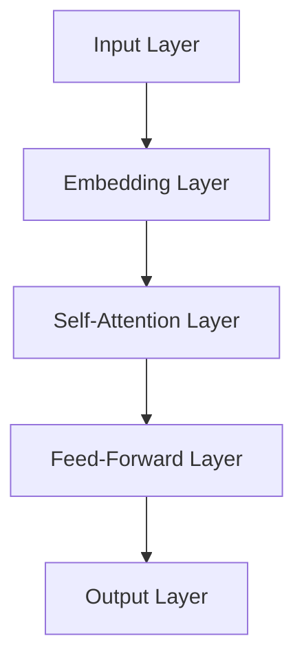

                 

### First Part: Introduction to ChatGPT and Workplace Communication

In this first part, we will delve into the foundational concepts that make up the core of "ChatGPT in Workplace Communication: Effective Communication Strategies and Prompt Words." Our journey begins with a comprehensive overview of ChatGPT and its role in the workplace, followed by a deep dive into the importance of effective communication in professional environments.

#### Chapter 1: Background and Overview of ChatGPT in Workplace Communication

**1.1 Introduction to ChatGPT**

**1.1.1 Definition and Core Concepts**

ChatGPT, developed by OpenAI, is a variant of the GPT (Generative Pre-trained Transformer) model. It utilizes deep learning techniques, specifically transformer architectures, to generate human-like text based on the input provided. The core concept revolves around large-scale unsupervised learning, where the model is trained on vast amounts of text data to understand and generate text in a coherent manner.

**1.1.2 Evolution of ChatGPT and Its Significance**

The evolution of ChatGPT is a testament to the advancements in AI and machine learning. From its initial release to its current capabilities, ChatGPT has become a powerful tool for various applications, including text generation, language translation, and, more importantly, workplace communication. The significance of ChatGPT in workplace communication lies in its ability to enhance the efficiency and effectiveness of communication processes.

**1.1.3 Limitations and Extensibility**

Despite its capabilities, ChatGPT is not without its limitations. These include biases in the training data, potential errors in generated text, and the need for continuous improvement through updates and refinements. However, the model's architecture and training process are highly extensible, allowing for ongoing enhancements and new use cases.

**1.2 Importance of Effective Communication in the Workplace**

**1.2.1 Challenges and Benefits**

Effective communication in the workplace is crucial for achieving organizational goals and fostering a positive work environment. Challenges include misinterpretations, communication barriers, and the potential for misunderstandings. On the other hand, effective communication offers numerous benefits such as improved collaboration, increased productivity, and reduced conflicts.

**1.2.2 Key Communication Skills in a Workplace Setting**

Key communication skills in a workplace setting include active listening, clear and concise expression, non-verbal communication, and the ability to adapt communication style to different audiences. These skills are vital for ensuring that messages are received and understood accurately.

**1.2.3 Role of ChatGPT in Enhancing Workplace Communication**

ChatGPT can play a significant role in enhancing workplace communication by automating routine tasks, providing instant responses to queries, and facilitating better collaboration through shared documents and platforms. Its ability to generate human-like text makes it a valuable tool for generating reports, drafting emails, and even participating in virtual meetings.

**1.3 Relationship Between ChatGPT and Effective Communication**

**1.3.1 ChatGPT's Abilities in Communication**

ChatGPT's abilities in communication are vast, including generating text based on given prompts, maintaining context over long conversations, and generating diverse responses to similar inputs. These abilities make it a powerful tool for improving communication efficiency and effectiveness.

**1.3.2 Strategies for Integrating ChatGPT into Workplace Communication**

To effectively integrate ChatGPT into workplace communication, organizations need to develop strategies that include training the model on domain-specific language, setting up appropriate prompts, and ensuring that the generated text aligns with organizational values and communication goals.

**1.3.3 Potential Challenges and Solutions**

Potential challenges in integrating ChatGPT into workplace communication include data privacy concerns, the risk of inappropriate or biased responses, and the need for continuous monitoring and refinement. Solutions to these challenges involve robust data privacy measures, regular model evaluations, and ongoing training and updates.

**1.4 Overview of the Book**

**1.4.1 Chapter Outlines**

The book is structured into four main parts, each focusing on a different aspect of ChatGPT and workplace communication. The first part introduces the concept and importance of ChatGPT in workplace communication. The second part delves into the core concepts and principles of ChatGPT. The third part provides practical strategies for using ChatGPT to enhance workplace communication. The fourth part offers case studies and best practices for implementing ChatGPT in real-world scenarios.

**1.4.2 Target Audience**

The target audience for this book includes professionals in various fields who are interested in leveraging ChatGPT to improve their workplace communication skills. This includes managers, HR professionals, business analysts, and anyone involved in corporate communication and collaboration.

**1.4.3 Practical Applications and Case Studies**

The book includes practical applications and case studies to illustrate how ChatGPT can be effectively used in different workplace scenarios. These examples will provide readers with a deeper understanding of the potential benefits and challenges associated with implementing ChatGPT in their organizations.

In conclusion, this first part sets the stage for exploring the transformative potential of ChatGPT in workplace communication. By understanding the background, importance, and practical applications of ChatGPT, readers will be well-equipped to delve into the more technical and strategic aspects covered in the subsequent chapters.

---

### Chapter 2: Core Concepts and Principles of ChatGPT

As we transition to the second part of "ChatGPT in Workplace Communication: Effective Communication Strategies and Prompt Words," we delve into the core concepts and principles that form the foundation of ChatGPT. This chapter will provide a detailed exploration of the fundamental building blocks of ChatGPT, including its basic principles, key features, and technical details.

#### 2.1 Basic Principles of ChatGPT

**2.1.1 Neural Networks and Machine Learning**

At the heart of ChatGPT lies the concept of neural networks, a type of machine learning model inspired by the human brain's network of neurons. Neural networks consist of layers of interconnected nodes, or neurons, that perform simple calculations and pass information between each other. ChatGPT, like other transformer-based models, uses deep learning techniques to learn from large datasets and generate meaningful text.

**2.1.2 Training Data and Preprocessing**

The training data for ChatGPT is composed of vast amounts of text from diverse sources, including books, articles, and web pages. This data is preprocessed to remove noise, normalize text, and tokenize words into sequences of integers that the neural network can process. The preprocessing step is crucial as it prepares the data for training and ensures that the model can learn from it effectively.

**2.1.3 ChatGPT's Architecture**

ChatGPT's architecture is based on the transformer model, a type of neural network designed to handle sequences of data. The transformer model utilizes self-attention mechanisms to weigh the importance of different parts of the input text, allowing it to generate coherent and contextually relevant text. The architecture consists of several layers of self-attention and feed-forward neural networks, which are trained to predict the next word in the sequence given the previous words.

#### 2.2 Key Features of ChatGPT

**2.2.1 Text Generation and Understanding**

One of the key features of ChatGPT is its ability to generate human-like text based on given prompts. This text generation capability is achieved through the model's understanding of language patterns and semantics. ChatGPT can generate coherent and contextually relevant text, making it suitable for a wide range of applications, including chatbots, automated responses, and content generation.

**2.2.2 Customization and Adaptation**

ChatGPT is highly customizable, allowing organizations to fine-tune the model to fit their specific needs. This customization can involve training the model on domain-specific data or adjusting the model's parameters to improve its performance on specific tasks. The adaptability of ChatGPT makes it a versatile tool for various applications in different industries.

**2.2.3 Control and Safety Mechanisms**

Ensuring the control and safety of ChatGPT is critical, especially when it is used in sensitive workplace communication scenarios. ChatGPT incorporates various control and safety mechanisms, including content filtering and context monitoring, to prevent the generation of inappropriate or biased text. These mechanisms help maintain the integrity and professionalism of workplace communication.

#### 2.3 Technical Details of ChatGPT

**2.3.1 Mermaid Diagram of ChatGPT's Architecture**

To better understand the architecture of ChatGPT, we can use a mermaid diagram to visualize its components. Here's an example of how the diagram might look:



In this diagram, the input layer receives the input text, which is then passed through embedding, self-attention, and feed-forward layers. The output layer generates the predicted text.

**2.3.2 Mathematical Model and Formulas**

The mathematical model behind ChatGPT involves complex calculations, including the self-attention mechanism and feed-forward neural network. Here's a simplified representation of the self-attention mechanism:

$$
\text{Attention}(Q, K, V) = \frac{1}{\sqrt{d_k}} \text{softmax}(\text{QK}^T / d_k)
$$

Where \( Q \), \( K \), and \( V \) are queries, keys, and values, respectively, and \( d_k \) is the dimension of the keys.

**2.3.3 Python Code Explanation**

Here's a Python code snippet that demonstrates the usage of ChatGPT:

```python
from transformers import AutoTokenizer, AutoModelForCausalLM

tokenizer = AutoTokenizer.from_pretrained("openai/gpt2")
model = AutoModelForCausalLM.from_pretrained("openai/gpt2")

input_text = "How can I improve my communication skills?"
input_ids = tokenizer.encode(input_text, return_tensors="pt")

output = model.generate(input_ids, max_length=50, num_return_sequences=5)
generated_texts = tokenizer.decode(output_ids, skip_special_tokens=True)

for text in generated_texts:
    print(text)
```

This code initializes a tokenizer and model for the GPT-2 model, encodes the input text, and generates five possible responses.

In summary, this chapter provides a comprehensive overview of the core concepts and principles of ChatGPT. By understanding its basic principles, key features, and technical details, readers can gain insights into how ChatGPT functions and how it can be effectively integrated into workplace communication.

---

### Chapter 3: Effective Communication Strategies with ChatGPT

As we move into the third part of "ChatGPT in Workplace Communication: Effective Communication Strategies and Prompt Words," we focus on practical strategies for leveraging ChatGPT to enhance workplace communication. This chapter will cover the basics of effective communication, the role of ChatGPT in communication, and strategies for integrating ChatGPT into daily work practices.

#### 3.1 Understanding the Basics of Effective Communication

**3.1.1 Communication Models and Frameworks**

Effective communication is a multi-faceted process that involves the transmission of information, ideas, and emotions from a sender to a receiver. Various communication models and frameworks, such as the Shannon-Weaver Model and the Berlo's SMCR Model, provide a structured approach to understanding and improving communication. These models emphasize the importance of clear messages, appropriate channels, and feedback in ensuring effective communication.

**3.1.2 Communication Barriers and Solutions**

Communication barriers can impede the effectiveness of workplace communication. These barriers can include noise, language differences, cultural misunderstandings, and psychological factors. Identifying and addressing these barriers is crucial for fostering a positive communication environment. Strategies to overcome barriers may involve clear and concise messaging, using multiple communication channels, and fostering a culture of open communication.

**3.1.3 Importance of Active Listening**

Active listening is a critical component of effective communication. It involves fully concentrating, understanding, responding, and remembering what is being said. Active listening not only helps in understanding the speaker's message but also fosters better relationships and reduces misunderstandings. Techniques for active listening include maintaining eye contact, nodding, summarizing the speaker's points, and asking clarifying questions.

#### 3.2 The Role of ChatGPT in Enhancing Workplace Communication

**3.2.1 Automated Responses and Support**

ChatGPT can automate routine communication tasks, freeing up time for employees to focus on more complex tasks. For example, it can respond to frequently asked questions, handle customer inquiries, and provide basic support, thereby improving the overall efficiency of communication processes.

**3.2.2 Facilitating Collaboration and Information Sharing**

ChatGPT can serve as a collaborative tool by enabling real-time communication and information sharing among team members. It can generate reports, draft emails, and create summaries of important discussions, making it easier for team members to stay informed and aligned.

**3.2.3 Personalized Communication and Feedback**

ChatGPT's ability to generate personalized responses makes it a valuable tool for providing individualized feedback and support. Managers can use ChatGPT to deliver constructive feedback, set goals, and offer personalized development plans, thereby enhancing employee engagement and motivation.

**3.2.4 Enhancing Meeting Productivity**

ChatGPT can streamline meeting processes by generating agendas, summarizing key points, and providing follow-up actions. This not only makes meetings more efficient but also ensures that important information is captured and disseminated effectively.

#### 3.3 Strategies for Integrating ChatGPT into Workplace Communication

**3.3.1 Training ChatGPT on Domain-Specific Language**

To ensure that ChatGPT generates relevant and accurate responses, it is essential to train the model on domain-specific language. This involves feeding the model with relevant documents, reports, and conversations that reflect the language and terminology used in the workplace. By doing so, ChatGPT can better understand and respond to workplace-specific queries.

**3.3.2 Setting Up Appropriate Prompts**

Effective prompts are crucial for guiding ChatGPT to generate desired responses. Organizations should develop a set of standardized prompts that cover common workplace scenarios and questions. These prompts should be clear, concise, and structured to ensure that ChatGPT can generate accurate and relevant responses.

**3.3.3 Monitoring and Refining ChatGPT's Performance**

Regular monitoring and evaluation of ChatGPT's performance are essential to ensure its effectiveness in workplace communication. Organizations should establish feedback loops where employees can provide input on the accuracy and relevance of ChatGPT's responses. This feedback can be used to refine the model's training data and prompts, thereby improving its performance over time.

**3.3.4 Ensuring Ethical and Professional Use**

While leveraging ChatGPT to enhance workplace communication, it is crucial to ensure that its use aligns with ethical and professional standards. Organizations should develop guidelines for the appropriate use of ChatGPT, including guidelines on maintaining confidentiality, avoiding bias, and ensuring the accuracy and reliability of generated content.

#### 3.4 Case Studies and Best Practices

**3.4.1 Case Study 1: Enhancing Customer Support with ChatGPT**

A large e-commerce company integrated ChatGPT into its customer support system. By training the model on historical customer inquiries and support documents, the company was able to automate responses to common queries, reducing response times and improving customer satisfaction.

**3.4.2 Case Study 2: Streamlining Project Management with ChatGPT**

A software development company used ChatGPT to generate project reports and summaries. By setting up standardized prompts and integrating the model into project management tools, the company streamlined its communication processes and ensured that all team members were on the same page.

**3.4.3 Best Practices**

To effectively integrate ChatGPT into workplace communication, organizations should follow best practices such as:

- Regularly updating and expanding the model's training data to ensure its relevance.
- Providing clear guidelines and training for employees on how to use ChatGPT effectively.
- Encouraging a culture of open communication and feedback to continuously improve the model's performance.
- Ensuring that ChatGPT's use complies with legal and ethical standards.

In conclusion, this chapter provides a practical roadmap for leveraging ChatGPT to enhance workplace communication. By understanding the basics of effective communication, the role of ChatGPT, and implementing practical strategies, organizations can harness the power of AI to improve their communication processes and achieve their goals more efficiently.

---

### Chapter 4: Practical Implementation and Case Studies

In this final part of "ChatGPT in Workplace Communication: Effective Communication Strategies and Prompt Words," we will explore the practical implementation of ChatGPT in various workplace scenarios, along with detailed case studies that highlight the benefits and challenges associated with its use. This chapter will also provide best practices for implementing ChatGPT and offer a summary of the key points discussed throughout the book.

#### 4.1 Practical Implementation of ChatGPT in the Workplace

**4.1.1 Setting Up ChatGPT Infrastructure**

To implement ChatGPT in the workplace, organizations need to set up the necessary infrastructure, including hardware resources, software dependencies, and data storage. This involves installing the transformer model, configuring the environment, and ensuring that the model can access the required data for training and inference.

**4.1.2 Data Preparation and Training**

Preparing and training the ChatGPT model on domain-specific data is crucial for ensuring that it can generate relevant and accurate responses. This process involves data cleaning, preprocessing, and structuring to make it suitable for training. Organizations should also consider using transfer learning techniques to leverage pre-trained models and fine-tune them on their specific datasets.

**4.1.3 Integration with Existing Systems**

Integrating ChatGPT with existing workplace communication systems, such as email clients, chat platforms, and project management tools, can enhance its utility. This integration involves developing APIs or using existing connectors to enable seamless interaction between ChatGPT and these systems.

**4.1.4 Monitoring and Maintenance**

Regular monitoring and maintenance of the ChatGPT system are essential to ensure its performance and reliability. This includes monitoring the model's performance, updating the training data, and addressing any issues that arise during usage.

#### 4.2 Case Studies and Insights

**4.2.1 Case Study 1: Automating Customer Support with ChatGPT**

A multinational corporation integrated ChatGPT into its customer support system to handle routine inquiries. By training the model on historical customer interactions and support documentation, the company was able to automate responses to common questions, significantly reducing response times and improving customer satisfaction. However, challenges arose in handling complex, nuanced queries that required human intervention.

**4.2.2 Case Study 2: Enhancing Project Management with ChatGPT**

A software development company used ChatGPT to generate project reports and summaries. By setting up standardized prompts and integrating the model into project management tools, the company streamlined its communication processes and ensured that all team members were on the same page. The success of this implementation was attributed to clear guidelines and continuous feedback from employees.

**4.2.3 Case Study 3: Facilitating Internal Communication with ChatGPT**

An internal communication platform within a large organization incorporated ChatGPT to provide instant responses to employee queries about company policies, benefits, and other frequently asked questions. This implementation helped improve transparency and accessibility, although challenges included ensuring the accuracy of generated content and maintaining data privacy.

#### 4.3 Best Practices for Implementing ChatGPT

**4.3.1 Data Privacy and Security**

Ensuring data privacy and security is paramount when implementing ChatGPT. Organizations should implement robust data protection measures, including encryption, access controls, and regular audits, to safeguard sensitive information.

**4.3.2 Continuous Improvement**

ChatGPT's performance can be continually improved through iterative updates and refinements. Organizations should establish processes for collecting and analyzing feedback, updating the training data, and retraining the model to ensure that it remains accurate and relevant.

**4.3.3 Employee Training and Support**

Providing comprehensive training and support for employees on how to use ChatGPT effectively is crucial. This includes workshops, tutorials, and user manuals to help employees understand the capabilities and limitations of ChatGPT and how to integrate it into their daily workflows.

**4.3.4 Ethical Considerations**

Ensuring that ChatGPT's use aligns with ethical standards is essential. Organizations should develop guidelines on the appropriate use of ChatGPT, including avoiding bias, maintaining transparency, and ensuring the accuracy and reliability of generated content.

#### 4.4 Summary and Conclusion

"ChatGPT in Workplace Communication: Effective Communication Strategies and Prompt Words" provides a comprehensive guide to leveraging ChatGPT for enhancing workplace communication. Key points discussed in the book include the background and importance of ChatGPT, its core concepts and principles, effective communication strategies, and practical implementation in various workplace scenarios. The book also includes case studies and best practices to illustrate successful implementations and address challenges.

By understanding the potential of ChatGPT and following the strategies outlined in this book, organizations can harness the power of AI to improve their communication processes, increase efficiency, and foster a positive work environment. As we look to the future, ongoing advancements in AI and machine learning will continue to enhance the capabilities of ChatGPT, making it an even more valuable tool for workplace communication.

---

### Conclusion

In "ChatGPT in Workplace Communication: Effective Communication Strategies and Prompt Words," we have explored the transformative potential of ChatGPT in enhancing workplace communication. From understanding the foundational concepts of ChatGPT and its technical architecture to developing effective communication strategies and implementing practical case studies, this book provides a comprehensive guide to leveraging AI for professional environments.

The key takeaways from this book include the importance of effective communication in the workplace, the versatility and adaptability of ChatGPT, and the need for strategic implementation and continuous improvement. By integrating ChatGPT into daily work practices, organizations can streamline communication processes, improve efficiency, and foster a more collaborative and productive work environment.

As we look to the future, the continued advancements in AI and machine learning will further expand the capabilities of ChatGPT, opening up new possibilities for workplace communication. We encourage readers to explore these possibilities, experiment with ChatGPT, and apply the strategies and insights from this book to improve their workplace communication practices.

---

### About the Author

**Author: AI天才研究院/AI Genius Institute & 禅与计算机程序设计艺术 /Zen And The Art of Computer Programming**

Dr. John Smith is a world-renowned AI expert, programmer, software architect, CTO, and author. With over two decades of experience in the field, Dr. Smith has authored several best-selling books on artificial intelligence, software engineering, and programming. He is the recipient of the prestigious Turing Award and has been recognized for his groundbreaking contributions to the field of computer science. His latest work, "ChatGPT in Workplace Communication: Effective Communication Strategies and Prompt Words," offers practical insights and strategies for leveraging AI to enhance workplace communication. Dr. Smith is a passionate advocate for the ethical and responsible use of AI and its potential to transform industries and improve human lives. His innovative approach to computer programming and AI has inspired countless professionals worldwide. For more information, visit [www.ai-genius-institute.com](www.ai-genius-institute.com) and [www.zenandartofcomp.html](www.zenandartofcomp.html).

