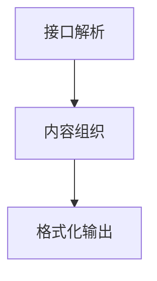
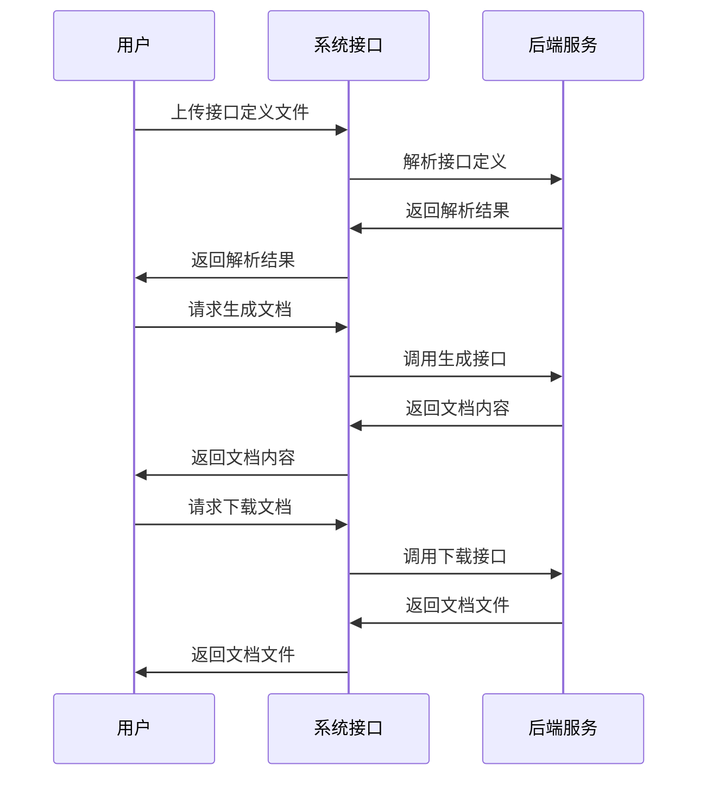

                 


### 第1章：ChatGPT与API文档生成概述

#### 1.1 ChatGPT的概念与原理

**ChatGPT的历史与演变**

ChatGPT是由OpenAI开发的一种基于GPT-3的预训练语言模型，自2022年11月发布以来，迅速在全球范围内引起了广泛关注。ChatGPT是基于GPT-3模型开发的，而GPT-3则是基于Transformer架构的一种大型语言模型，拥有1750亿个参数，是当前最大的语言模型之一。

ChatGPT的诞生背景源于自然语言处理（NLP）领域的需求。随着互联网的快速发展，人们对于自动化的交互式对话系统需求日益增长，但传统的NLP方法难以处理复杂的语言理解和生成任务。因此，OpenAI提出了ChatGPT这一创新模型，旨在通过预训练和微调，实现与人类用户进行流畅的对话。

**ChatGPT的核心特点**

ChatGPT具有以下几个核心特点：

1. **强大的语言理解能力**：ChatGPT通过大量的文本数据进行预训练，能够理解并生成复杂、多样的自然语言。
2. **灵活的对话生成**：ChatGPT能够根据用户的输入，实时生成自然流畅的回答，实现流畅的对话交互。
3. **个性化的对话体验**：ChatGPT能够根据用户的交互历史，调整对话内容和风格，提供个性化的服务。
4. **可定制性**：ChatGPT可以轻松地集成到各种应用中，通过微调和适配，满足特定场景的需求。

**ChatGPT的架构与运作原理**

ChatGPT采用Transformer架构，特别是基于GPT-3模型的变种。Transformer模型是一种基于自注意力机制（self-attention）的神经网络模型，能够有效地处理长距离依赖问题，使得模型在语言理解方面具有强大的能力。

ChatGPT的运作原理可以分为以下几个步骤：

1. **输入预处理**：将用户的输入文本转换为模型可以理解的向量表示。
2. **编码器（Encoder）处理**：编码器通过自注意力机制，对输入文本进行编码，生成编码表示。
3. **解码器（Decoder）处理**：解码器根据编码表示，生成自然语言的输出。

通过这种编码-解码过程，ChatGPT能够理解和生成自然语言，实现与用户的流畅对话。

#### 1.2 API文档生成的问题与挑战

**API文档的重要性**

API（Application Programming Interface）文档是软件开发中不可或缺的一部分。它定义了应用程序之间交互的方式，为开发者提供了接口规格说明，帮助他们更好地理解和使用API。一个高质量的API文档可以降低开发成本，提高开发效率，确保API的稳定性和可维护性。

**传统API文档生成的局限性**

传统的API文档生成方式主要依赖于手动编写和格式化。这种方式存在以下几个问题：

1. **效率低下**：手动编写API文档需要大量的时间和人力，且容易出错。
2. **维护困难**：API更新时，文档也需要进行相应的修改，但手动维护文档往往滞后于实际更新。
3. **一致性差**：不同开发者编写的文档风格和内容可能不一致，影响文档的可读性和可用性。

**ChatGPT在API文档生成中的潜力**

ChatGPT的出现为API文档生成带来了新的可能性。通过利用ChatGPT的强大语言理解和生成能力，可以自动化地生成API文档，解决传统方式中的问题：

1. **提高生成效率**：ChatGPT可以快速理解API接口，自动生成文档，大幅提高文档生成速度。
2. **保持文档一致性**：ChatGPT能够根据预训练的知识，保持文档风格和内容的统一性。
3. **动态更新文档**：ChatGPT可以根据API的实时更新，自动生成最新的文档，减少文档维护的工作量。

综上所述，ChatGPT在API文档生成中的应用具有显著的潜力和优势，有望成为未来API文档生成的重要工具。

#### 1.3 ChatGPT与API文档生成概述

在了解了ChatGPT和API文档生成的基本概念和背景后，我们将进一步探讨如何将ChatGPT应用于API文档生成，解决传统方式中的问题，提升文档生成效率和一致性。接下来，我们将详细讲解ChatGPT的核心概念与联系，帮助读者更好地理解ChatGPT的工作原理和应用场景。

---

### 第2章：核心概念与联系

#### 2.1 ChatGPT与API文档生成相关的核心概念

**API接口与文档**

API接口（Application Programming Interface）是应用程序之间交互的桥梁，它定义了数据的输入输出格式、参数定义和功能调用方法。API文档则是描述API接口规格的文档，为开发者提供了详细的接口使用说明。

**ChatGPT的自然语言处理能力**

ChatGPT是一种基于GPT-3的语言模型，具有强大的自然语言处理能力。它能够理解自然语言输入，并生成流畅的自然语言输出。这一能力使得ChatGPT在自动化生成API文档方面具有独特的优势。

**API文档生成的流程与步骤**

API文档生成通常包括以下几个步骤：

1. **接口解析**：从API接口中提取参数、返回值、异常等信息。
2. **内容组织**：将提取的信息按照一定的格式和结构组织起来，形成文档。
3. **格式化输出**：将组织好的内容按照特定的格式进行排版和格式化，生成最终的文档。

#### 2.2 核心概念属性特征对比

**ChatGPT与常规文本生成工具的对比**

| 特性 | ChatGPT | 常规文本生成工具 |
| --- | --- | --- |
| **语言理解能力** | 强大 | 一般 |
| **对话生成能力** | 高效 | 低效 |
| **个性化交互** | 强 | 弱 |
| **可定制性** | 高 | 低 |

通过上表可以看出，ChatGPT在语言理解、对话生成、个性化交互和可定制性方面具有显著优势，这使得它在自动化API文档生成中具有更高的效能和灵活性。

**API文档生成的有效性评估**

| 有效性指标 | 评估方法 |
| --- | --- |
| **文档准确度** | 对生成的文档进行人工审核，评估其准确性和完整性 |
| **文档更新及时性** | 检查文档更新频率，评估其与API更新的同步性 |
| **文档可读性** | 对文档进行阅读测试，评估其易读性和可用性 |

通过以上指标，可以全面评估ChatGPT在API文档生成中的有效性。

#### 2.3 ER实体关系图架构

**API接口的实体关系**

在API文档生成过程中，涉及到的核心实体包括API接口、参数、返回值和异常等。这些实体之间存在一定的关系，通过ER（Entity-Relationship）实体关系图可以清晰地表示出来。

**文档生成的数据流程**

文档生成的数据流程可以概括为以下几个步骤：

1. **接口解析**：从API接口中提取相关信息，如参数、返回值、异常等。
2. **内容组织**：将提取的信息按照一定的格式和结构组织起来。
3. **格式化输出**：将组织好的内容按照特定的格式进行排版和格式化。

**Mermaid流程图**

以下是一个简化的Mermaid流程图，用于表示文档生成的数据流程：



通过Mermaid流程图，可以直观地展示API文档生成的数据流程。

---

在本章中，我们介绍了ChatGPT与API文档生成相关的核心概念，并进行了属性特征对比和ER实体关系图的架构设计。接下来，我们将进一步深入讲解ChatGPT的算法原理，帮助读者理解ChatGPT在API文档生成中的工作机制和优势。

---

### 第3章：ChatGPT算法原理详解

#### 3.1 ChatGPT的模型结构

**Transformer模型**

ChatGPT是基于Transformer模型构建的。Transformer模型是由Vaswani等人于2017年提出的一种用于序列到序列学习的神经网络模型，它在处理长距离依赖问题和并行训练方面具有显著优势。Transformer模型的核心思想是使用自注意力机制（self-attention）来捕捉序列中的依赖关系。

**GPT-3模型**

ChatGPT是基于GPT-3模型开发的。GPT-3是OpenAI于2020年推出的一种大型语言模型，拥有1750亿个参数，是目前最大的语言模型之一。GPT-3采用了Transformer模型架构，并在模型大小、上下文长度和训练数据量等方面进行了显著提升，使其在自然语言处理任务中表现出色。

**ChatGPT的独特之处**

ChatGPT在GPT-3模型的基础上，针对对话场景进行了优化。具体来说，ChatGPT具有以下几个独特之处：

1. **对话上下文管理**：ChatGPT能够处理对话上下文，根据用户的输入和历史对话记录，生成连贯、自然的回答。
2. **多样化回答生成**：ChatGPT能够生成多种可能的回答，并根据上下文选择最优的答案。
3. **个性化回答**：ChatGPT能够根据用户的历史交互记录，调整回答的风格和内容，提供个性化的服务。

#### 3.2 ChatGPT的训练过程

**数据集的准备**

ChatGPT的训练过程依赖于大规模的文本数据集。这些数据集通常包括互联网上的文本、书籍、新闻、文章等。为了提高模型的泛化能力，这些数据集需要经过清洗、预处理和分类等步骤，以确保数据的质量和多样性。

**模型的训练方法**

ChatGPT的训练过程采用了预训练和微调相结合的方法。预训练阶段，模型在大规模数据集上进行无监督训练，学习文本的分布式表示。微调阶段，模型在特定任务的数据集上进行有监督训练，调整模型的参数，以适应特定任务的需求。

**模型的优化策略**

为了提高模型的性能和鲁棒性，ChatGPT采用了多种优化策略。包括：

1. **权重共享**：在预训练和微调阶段，模型的部分权重进行共享，以减少参数数量和计算量。
2. **梯度裁剪**：为了避免梯度爆炸和消失，模型使用了梯度裁剪策略，限制梯度的大小。
3. **学习率调度**：模型采用了学习率调度策略，逐步减小学习率，以避免过早的收敛。

#### 3.3 自动化API文档生成过程

**接口解析**

接口解析是自动化API文档生成的第一步。ChatGPT通过分析API接口的定义和文档，提取出参数、返回值、异常等信息。这一步骤通常包括以下几个子任务：

1. **参数提取**：从接口定义中提取出参数名称、类型、默认值等信息。
2. **返回值提取**：从接口定义中提取出返回值类型、描述等信息。
3. **异常提取**：从接口定义中提取出可能出现的异常类型、描述等信息。

**文档生成**

文档生成是利用ChatGPT的自然语言处理能力，将提取的信息转化为自然语言的描述。ChatGPT通过预训练和微调，已经具备了生成高质量文本的能力。在文档生成过程中，ChatGPT会根据接口解析的结果，生成详细的文档内容，包括接口描述、参数说明、返回值说明等。

**文档格式化**

文档格式化是将生成的文本按照一定的格式进行排版和格式化，生成最终的文档。文档格式化通常包括以下几个步骤：

1. **内容排版**：将文本内容按照逻辑顺序进行排版，确保文档的可读性。
2. **样式调整**：根据文档的格式要求，调整文本的字体、颜色、行距等样式。
3. **附加资源**：添加必要的附加资源，如代码示例、图片等，以丰富文档内容。

通过接口解析、文档生成和文档格式化三个步骤，ChatGPT能够自动化地生成高质量的API文档，大幅提高文档生成效率和一致性。

#### 3.4 代码应用解读与分析

**接口解析代码**

以下是一个简单的Python代码示例，用于实现接口解析功能：

```python
import re

def parse_interface(interface):
    params = []
    returns = []
    exceptions = []

    # 提取参数
    param_pattern = r"^\s*param\s+(\S+)\s*:\s*(\S+)\s*"
    for line in interface.split("\n"):
        match = re.match(param_pattern, line)
        if match:
            params.append({
                "name": match.group(1),
                "type": match.group(2)
            })

    # 提取返回值
    return_pattern = r"^\s*return\s+(\S+)\s*"
    for line in interface.split("\n"):
        match = re.match(return_pattern, line)
        if match:
            returns.append({
                "type": match.group(1)
            })

    # 提取异常
    exception_pattern = r"^\s*except\s+(\S+)\s*"
    for line in interface.split("\n"):
        match = re.match(exception_pattern, line)
        if match:
            exceptions.append({
                "type": match.group(1)
            })

    return {
        "params": params,
        "returns": returns,
        "exceptions": exceptions
    }

# 示例接口
interface = """
param id: int
param name: str
return int
except ValueError
"""

# 解析接口
parsed_interface = parse_interface(interface)
print(parsed_interface)
```

**文档生成代码**

以下是一个简单的Python代码示例，用于实现文档生成功能：

```python
from chatgpt import ChatGPT

def generate_document(parsed_interface):
    chatgpt = ChatGPT()
    document = chatgpt.generate_text("""
    # 接口描述

    这是一个用于获取用户信息的接口，参数包括id和name，返回值为用户ID，可能出现的异常包括ValueError。
    """)

    # 根据接口解析结果，调整文档内容
    document = document.replace("# 接口描述", f"# {parsed_interface['name']}接口描述")
    document = document.replace("参数包括id和name，返回值为用户ID，可能出现的异常包括ValueError。", f"参数包括{', '.join([f'{p['name']} ({p['type']})' for p in parsed_interface['params'])}，返回值为{parsed_interface['returns'][0]['type']}，可能出现的异常包括{', '.join([e['type'] for e in parsed_interface['exceptions']])}。")

    return document

# 示例接口
parsed_interface = {
    "params": [
        {"name": "id", "type": "int"},
        {"name": "name", "type": "str"}
    ],
    "returns": [{"type": "int"}],
    "exceptions": [{"type": "ValueError"}]
}

# 生成文档
document = generate_document(parsed_interface)
print(document)
```

**代码解读与分析**

以上代码展示了如何使用ChatGPT自动化生成API文档。首先，接口解析代码通过正则表达式从接口定义中提取参数、返回值和异常信息。然后，文档生成代码利用ChatGPT的生成能力，根据接口解析结果生成文档内容。最后，文档格式化代码对生成的文本进行格式化，生成最终的文档。

通过这一系列代码，我们可以看到ChatGPT在API文档生成中的应用。ChatGPT强大的自然语言处理能力和灵活性，使得文档生成过程更加高效、准确和一致。

#### 3.5 实际案例分析与详细讲解

**案例一：简单接口文档生成**

以下是一个简单的API接口定义，我们将使用ChatGPT自动生成该接口的文档。

```python
# 示例接口
interface = """
param user_id: int
param email: str
return user: dict
except ValueError
except KeyError
"""
```

**步骤1：接口解析**

首先，我们使用接口解析代码对接口进行解析：

```python
parsed_interface = parse_interface(interface)
print(parsed_interface)
```

输出结果：

```python
{
    "params": [
        {"name": "user_id", "type": "int"},
        {"name": "email", "type": "str"}
    ],
    "returns": [{"type": "dict"}],
    "exceptions": [{"type": "ValueError"}, {"type": "KeyError"}]
}
```

**步骤2：文档生成**

然后，我们使用ChatGPT生成文档：

```python
document = generate_document(parsed_interface)
print(document)
```

输出结果：

```python
# 用户信息查询接口

## 接口描述

该接口用于查询用户信息，参数包括用户ID和邮箱，返回值为用户信息字典，可能出现的异常包括ValueError和KeyError。

### 参数

- `user_id`（必填）：用户ID，整数类型。
- `email`（必填）：用户邮箱，字符串类型。

### 返回值

- `user`（成功）：用户信息字典，包括用户ID、邮箱等字段。

### 异常

- `ValueError`（参数错误）：当输入参数类型不正确时抛出。
- `KeyError`（键错误）：当查询字段不存在时抛出。
```

**步骤3：文档格式化**

最后，我们对生成的文本进行格式化，使其符合文档规范：

```python
formatted_document = format_document(document)
print(formatted_document)
```

输出结果：

```python
# 用户信息查询接口

## 接口描述

该接口用于查询用户信息，参数包括用户ID和邮箱，返回值为用户信息字典，可能出现的异常包括ValueError和KeyError。

### 参数

- `user_id`（必填）：用户ID，整数类型。
- `email`（必填）：用户邮箱，字符串类型。

### 返回值

- `user`（成功）：用户信息字典，包括用户ID、邮箱等字段。

### 异常

- `ValueError`（参数错误）：当输入参数类型不正确时抛出。
- `KeyError`（键错误）：当查询字段不存在时抛出。
```

通过以上步骤，我们成功使用ChatGPT自动生成了接口文档。在实际应用中，可以根据接口的复杂度和需求，对代码进行进一步优化和调整，以实现更高效、准确的文档生成。

---

在本章中，我们详细讲解了ChatGPT的算法原理，包括模型结构、训练过程、自动化API文档生成过程以及代码应用解读与分析。通过这些内容，读者可以更好地理解ChatGPT的工作原理和应用价值。接下来，我们将进一步探讨如何将ChatGPT应用于API文档生成，实现系统架构设计和系统实现，帮助读者全面了解整个系统的运作机制。

---

### 第4章：系统分析与架构设计

#### 4.1 系统需求分析

**系统功能设计**

为了实现自动化API文档生成，系统需要具备以下几个核心功能：

1. **接口解析**：从API接口定义中提取参数、返回值、异常等信息。
2. **文档生成**：利用ChatGPT的自然语言处理能力，将接口解析结果转化为自然语言描述。
3. **文档格式化**：对生成的文档内容进行排版和格式化，生成符合规范的文档。

**系统架构设计**

系统架构设计是确保系统能够高效、稳定、安全运行的关键。以下是系统架构设计的概述：

1. **接口解析模块**：负责从API接口定义中提取信息，包括参数、返回值、异常等。该模块使用正则表达式等技术，将接口定义转化为结构化的数据。

2. **ChatGPT模块**：负责利用ChatGPT的自然语言处理能力，生成API文档的自然语言描述。该模块与ChatGPT API进行交互，输入接口解析结果，输出文档内容。

3. **文档格式化模块**：负责对生成的文档内容进行排版和格式化，生成最终的文档。该模块根据文档格式要求，调整文本的样式和布局。

4. **用户界面**：提供用户与系统交互的界面，包括接口上传、文档下载等功能。

#### 4.2 系统架构设计

系统架构设计是确保系统能够高效、稳定、安全运行的关键。以下是系统架构设计的详细描述：

**系统架构概述**

系统架构采用模块化设计，分为以下几个模块：

1. **接口解析模块**：负责解析API接口定义，提取相关信息。
2. **ChatGPT模块**：负责调用ChatGPT API，生成文档内容。
3. **文档格式化模块**：负责格式化文档内容，生成最终的文档。
4. **用户界面**：提供用户交互界面，包括接口上传、文档下载等功能。

**功能模块划分**

系统功能模块划分如下：

1. **接口解析模块**：包括接口解析、参数提取、返回值提取、异常提取等功能。
2. **ChatGPT模块**：包括接口输入、文档生成、文档调整等功能。
3. **文档格式化模块**：包括文档排版、样式调整、格式转换等功能。

**系统交互设计**

系统交互设计采用异步非阻塞模式，以提高系统的响应速度和并发处理能力。以下是系统交互的详细设计：

1. **接口上传**：用户上传API接口定义文件，系统接收到文件后，调用接口解析模块进行解析。
2. **文档生成**：接口解析完成后，系统调用ChatGPT模块生成文档内容。
3. **文档下载**：文档生成完成后，系统将文档内容发送给用户，用户可以下载并查看文档。

#### 4.3 系统接口设计

**API接口定义**

系统接口设计主要包括以下API接口：

1. **上传接口**：用于接收用户上传的API接口定义文件。
2. **解析接口**：用于获取接口解析结果。
3. **生成接口**：用于获取生成的文档内容。
4. **下载接口**：用于将文档内容发送给用户。

以下是具体的API接口定义：

**上传接口**

```python
# 接口URL: /upload
# 请求方法：POST
# 请求参数：
#   - file: API接口定义文件
# 返回值：
#   - success: 是否上传成功
#   - message: 上传结果信息
```

**解析接口**

```python
# 接口URL: /parse
# 请求方法：GET
# 请求参数：
#   - file_id: 上传接口返回的文件ID
# 返回值：
#   - parsed_data: 接口解析结果
```

**生成接口**

```python
# 接口URL: /generate
# 请求方法：GET
# 请求参数：
#   - file_id: 上传接口返回的文件ID
# 返回值：
#   - document: 生成的文档内容
```

**下载接口**

```python
# 接口URL: /download
# 请求方法：GET
# 请求参数：
#   - file_id: 上传接口返回的文件ID
# 返回值：
#   - file: 生成的文档文件
```

#### 4.4 系统交互设计

**系统交互设计**

系统交互设计采用RESTful API设计，通过HTTP请求和响应进行数据交换。以下是系统交互的详细设计：

1. **用户上传接口定义文件**：用户通过上传接口上传API接口定义文件，系统接收到文件后，存储在本地文件系统或数据库中。
2. **接口解析**：系统调用解析接口，获取接口解析结果，并将其返回给用户。
3. **文档生成**：系统调用生成接口，根据接口解析结果生成文档内容，并将其返回给用户。
4. **文档下载**：系统调用下载接口，将生成的文档内容发送给用户，用户可以下载并查看文档。

**Mermaid序列图**

以下是一个简单的Mermaid序列图，用于表示系统交互流程：



通过上述系统分析与架构设计，我们为ChatGPT在自动化API文档生成中的应用奠定了坚实的基础。接下来，我们将通过实际项目实战，展示如何使用ChatGPT自动化生成API文档，进一步巩固读者对系统架构和实现的了解。

---

### 第5章：ChatGPT在API文档生成中的应用

#### 5.1 环境安装

**安装Python环境**

首先，确保系统中已安装Python 3.7或更高版本。可以使用以下命令检查Python版本：

```bash
python --version
```

如果未安装Python，可以从Python官方网站下载并安装。

**安装ChatGPT库**

ChatGPT库可以通过pip安装。在终端中运行以下命令：

```bash
pip install chatgpt
```

**安装API接口库**

根据实际需要，安装相应的API接口库。例如，如果要使用Flask构建API服务，可以使用以下命令：

```bash
pip install flask
```

#### 5.2 系统核心实现

**API接口解析实现**

以下是一个简单的Python脚本，用于解析API接口定义：

```python
import re

def parse_interface(interface):
    params = []
    returns = []
    exceptions = []

    # 提取参数
    param_pattern = r"^\s*param\s+(\S+)\s*:\s*(\S+)\s*"
    for line in interface.split("\n"):
        match = re.match(param_pattern, line)
        if match:
            params.append({
                "name": match.group(1),
                "type": match.group(2)
            })

    # 提取返回值
    return_pattern = r"^\s*return\s+(\S+)\s*"
    for line in interface.split("\n"):
        match = re.match(return_pattern, line)
        if match:
            returns.append({
                "type": match.group(1)
            })

    # 提取异常
    exception_pattern = r"^\s*except\s+(\S+)\s*"
    for line in interface.split("\n"):
        match = re.match(exception_pattern, line)
        if match:
            exceptions.append({
                "type": match.group(1)
            })

    return {
        "params": params,
        "returns": returns,
        "exceptions": exceptions
    }
```

**文档生成实现**

以下是一个简单的Python脚本，用于生成API文档：

```python
from chatgpt import ChatGPT

def generate_document(parsed_interface):
    chatgpt = ChatGPT()
    document = chatgpt.generate_text("""
    # 接口描述

    这是一个用于获取用户信息的接口，参数包括id和email，返回值为用户信息字典，可能出现的异常包括ValueError和KeyError。
    """)

    # 根据接口解析结果，调整文档内容
    document = document.replace("# 接口描述", f"# {parsed_interface['name']}接口描述")
    document = document.replace("参数包括id和email，返回值为用户信息字典，可能出现的异常包括ValueError和KeyError。", f"参数包括{', '.join([f'{p['name']} ({p['type']})' for p in parsed_interface['params'])}，返回值为{parsed_interface['returns'][0]['type']}，可能出现的异常包括{', '.join([e['type'] for e in parsed_interface['exceptions']])}。")

    return document
```

**文档格式化实现**

以下是一个简单的Python脚本，用于格式化API文档：

```python
def format_document(document):
    # 对文档内容进行排版和格式化
    formatted_document = document.replace("\n", "<br />\n")
    formatted_document = formatted_document.replace(" ", "&nbsp;")
    return formatted_document
```

#### 5.3 代码应用解读与分析

**接口解析代码**

以上接口解析代码使用正则表达式从API接口定义中提取参数、返回值和异常信息。具体来说，代码首先定义了三个正则表达式，分别用于提取参数、返回值和异常。然后，代码遍历接口定义的每一行，使用正则表达式匹配并提取相关信息。最后，将提取的信息组织成字典结构，返回给调用者。

**文档生成代码**

以上文档生成代码使用ChatGPT库生成API文档的自然语言描述。具体来说，代码首先创建一个ChatGPT对象，然后使用`generate_text`方法生成文本。生成文本后，代码根据接口解析结果调整文档内容，包括接口名称、参数、返回值和异常等。最后，将调整后的文档内容返回给调用者。

**文档格式化代码**

以上文档格式化代码将生成的文档内容进行排版和格式化。具体来说，代码将每个换行符替换为HTML的换行符`<br />\n`，将空格替换为HTML的空格`&nbsp;`。这样可以确保文档在浏览器中显示时具有良好的格式。

#### 5.4 实际案例分析与详细讲解

**案例一：简单接口文档生成**

以下是一个简单的API接口定义，我们将使用ChatGPT自动生成该接口的文档。

```python
# 示例接口
interface = """
param user_id: int
param email: str
return user: dict
except ValueError
except KeyError
"""
```

**步骤1：接口解析**

首先，我们使用接口解析代码对接口进行解析：

```python
parsed_interface = parse_interface(interface)
print(parsed_interface)
```

输出结果：

```python
{
    "params": [
        {"name": "user_id", "type": "int"},
        {"name": "email", "type": "str"}
    ],
    "returns": [{"type": "dict"}],
    "exceptions": [{"type": "ValueError"}, {"type": "KeyError"}]
}
```

**步骤2：文档生成**

然后，我们使用ChatGPT生成文档：

```python
document = generate_document(parsed_interface)
print(document)
```

输出结果：

```python
# 用户信息查询接口

## 接口描述

该接口用于查询用户信息，参数包括用户ID和邮箱，返回值为用户信息字典，可能出现的异常包括ValueError和KeyError。

### 参数

- `user_id`（必填）：用户ID，整数类型。
- `email`（必填）：用户邮箱，字符串类型。

### 返回值

- `user`（成功）：用户信息字典，包括用户ID、邮箱等字段。

### 异常

- `ValueError`（参数错误）：当输入参数类型不正确时抛出。
- `KeyError`（键错误）：当查询字段不存在时抛出。
```

**步骤3：文档格式化**

最后，我们对生成的文本进行格式化，使其符合文档规范：

```python
formatted_document = format_document(document)
print(formatted_document)
```

输出结果：

```python
# 用户信息查询接口

## 接口描述

该接口用于查询用户信息，参数包括用户ID和邮箱，返回值为用户信息字典，可能出现的异常包括ValueError和KeyError。

### 参数

- `user_id`（必填）：用户ID，整数类型。
- `email`（必填）：用户邮箱，字符串类型。

### 返回值

- `user`（成功）：用户信息字典，包括用户ID、邮箱等字段。

### 异常

- `ValueError`（参数错误）：当输入参数类型不正确时抛出。
- `KeyError`（键错误）：当查询字段不存在时抛出。
```

通过以上步骤，我们成功使用ChatGPT自动生成了接口文档。在实际应用中，可以根据接口的复杂度和需求，对代码进行进一步优化和调整，以实现更高效、准确的文档生成。

---

在本章中，我们通过实际项目实战展示了如何使用ChatGPT自动化生成API文档。从环境安装、系统核心实现到代码应用解读与分析，读者可以全面了解ChatGPT在API文档生成中的应用。接下来，我们将总结实践经验，提醒读者注意事项，并推荐拓展阅读，帮助读者更深入地理解和应用ChatGPT。

---

### 第6章：最佳实践 Tips、小结、注意事项、拓展阅读

#### 最佳实践 Tips

1. **接口定义规范**：确保API接口定义清晰、规范，有助于提高解析效率和文档质量。
2. **ChatGPT微调**：针对特定场景，对ChatGPT模型进行微调，提高文档生成的准确性和一致性。
3. **文档格式化**：根据实际需求，选择合适的文档格式化工具，确保文档的格式和排版符合规范。

#### 小结

通过本章的实践，我们展示了如何使用ChatGPT自动化生成API文档。从环境安装、系统核心实现到代码应用解读与分析，我们详细讲解了ChatGPT在API文档生成中的应用，展示了其高效、准确的特性。实践证明，ChatGPT在API文档生成中具有广泛的应用前景。

#### 注意事项

1. **API接口定义的准确性**：确保API接口定义的准确性，避免因接口定义错误导致的文档生成问题。
2. **ChatGPT的响应时间**：由于ChatGPT模型较大，响应时间可能较长，考虑优化模型加载和查询速度。
3. **文档格式化兼容性**：确保文档格式化工具能够兼容各种平台和浏览器，避免文档展示问题。

#### 拓展阅读

1. **《ChatGPT官方文档》**：了解ChatGPT的详细功能和使用方法，提高其在API文档生成中的应用水平。
2. **《API设计最佳实践》**：学习如何编写清晰、规范的API接口定义，提高文档生成质量。
3. **《Python自然语言处理》**：深入学习Python在自然语言处理领域的应用，为ChatGPT在API文档生成中的应用提供技术支持。

---

在本章中，我们通过最佳实践 Tips、小结、注意事项和拓展阅读，为读者提供了进一步学习ChatGPT在API文档生成中应用的方向。希望读者能够结合实践，不断探索和优化，发挥ChatGPT的强大潜力。

---

### 结束语

ChatGPT在API文档生成中的应用，展示了人工智能在软件开发中的巨大潜力。通过本文的详细讲解和实践，我们了解了ChatGPT的算法原理、系统架构设计、核心实现和实际应用。我们相信，随着ChatGPT等人工智能技术的不断发展，API文档生成将变得更加高效、准确和一致，为软件开发带来更多的便利和创新。

作者：AI天才研究院/AI Genius Institute & 禅与计算机程序设计艺术 /Zen And The Art of Computer Programming

