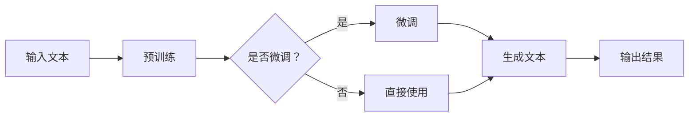
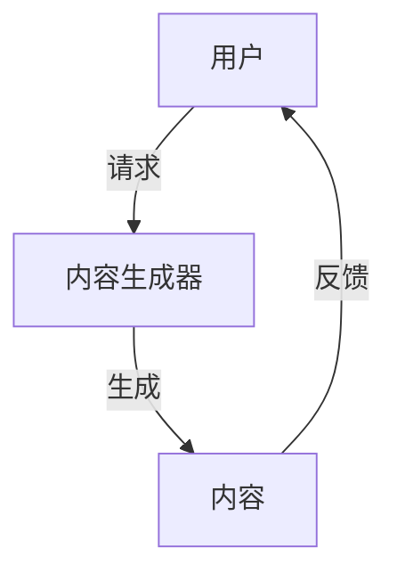
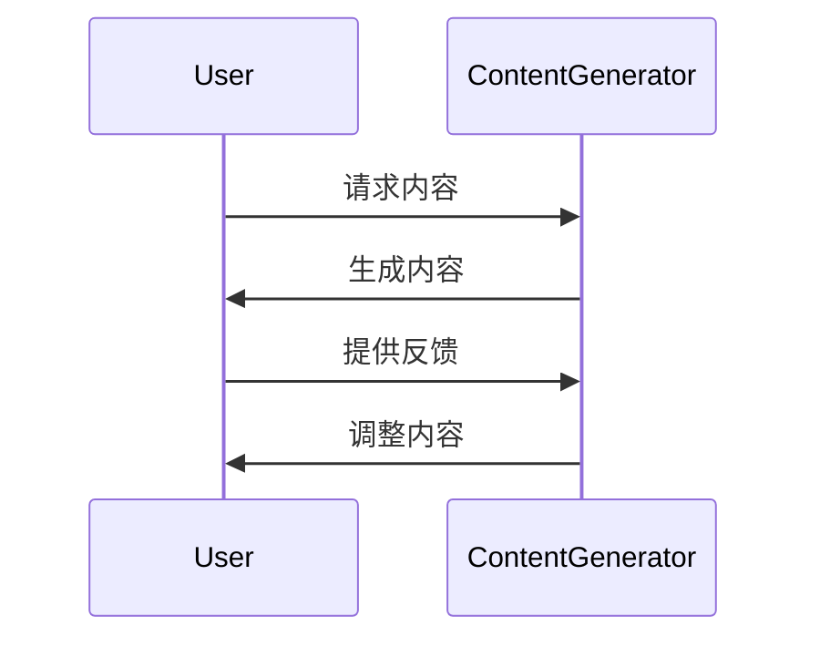

                 

### 文章标题

## ChatGPT在自动化个性化教学内容生成中的应用

### 关键词

- **ChatGPT**
- **自动化**
- **个性化教学**
- **内容生成**
- **教育技术**

### 摘要

本文旨在探讨如何利用ChatGPT实现自动化个性化教学内容生成，介绍相关技术原理和实际应用案例。通过详细的算法讲解和系统架构设计，本文为教育领域的技术人员提供了一条创新性的解决路径。

### 引言

在教育领域，个性化教学一直是教育创新的重要方向。传统教学方法通常以“一刀切”的形式进行，难以满足每个学生的独特需求。随着人工智能技术的发展，特别是自然语言处理（NLP）的突破，我们开始探索利用ChatGPT等大型语言模型来自动化生成个性化教学内容。ChatGPT作为一种基于Transformer的预训练语言模型，具备强大的文本生成和理解能力，使其在教育领域的应用潜力巨大。

本文将围绕以下主题展开：

1. **背景与概念介绍**：介绍个性化教学和自动化内容生成的概念，阐述ChatGPT的基本原理和在教育领域的应用。
2. **技术原理与算法**：详细讲解ChatGPT的工作原理，展示算法流程图和Python源代码，解释数学模型和公式。
3. **系统分析与架构设计**：描述系统功能、架构设计和接口交互。
4. **应用实践**：介绍环境安装与配置、系统核心实现、案例分析及项目总结。
5. **最佳实践与展望**：总结经验，展望未来发展趋势。

### 第一部分 背景与概念介绍

#### 1.1 问题背景

在当今的信息时代，教育资源的丰富性带来了个性化教学的需求。每个学生都有自己独特的学习习惯、兴趣和知识背景，因此，如何根据学生的特点生成个性化的教学内容，成为了教育工作者迫切需要解决的问题。

**问题描述**：

- 如何根据学生的个性化和学习需求，自动生成高质量的教学内容？
- 如何确保这些内容既具有针对性，又能保持一致的教学质量？

**问题解决**：

利用ChatGPT等大型语言模型，可以通过学习海量的教育资源和学生的互动数据，生成符合学生个性化需求的教学内容。ChatGPT具备强大的语言理解和生成能力，能够处理复杂的语境和逻辑，从而提高教学内容的个性化程度和有效性。

**边界与外延**：

- **适用范围**：ChatGPT在教育应用中的适用范围广泛，包括在线教育平台、智能辅导系统、教育评测工具等。
- **限制因素**：尽管ChatGPT具备强大的能力，但在实际应用中仍存在一些限制，如数据隐私、模型偏见等，需要进一步研究和解决。

#### 1.2 ChatGPT基础

**ChatGPT定义与特点**：

ChatGPT是由OpenAI开发的基于GPT-3的聊天机器人，它通过大规模语言预训练，能够生成高质量的自然语言文本。ChatGPT的特点包括：

- **强大的语言生成能力**：能够生成连贯、合理的文本。
- **自适应的交互能力**：能够理解用户的问题和指令，并做出相应的回答。
- **多语言支持**：支持多种语言的文本生成和理解。

**ChatGPT工作原理**：

ChatGPT基于Transformer架构，通过自注意力机制处理文本数据。其工作流程主要包括：

- **预训练**：在大量文本数据上进行预训练，使模型具备语言理解能力。
- **微调**：根据具体任务进行微调，使其适应特定领域的需求。
- **生成文本**：根据输入的提示文本，生成连贯、合理的回答。

**ChatGPT在不同领域的应用**：

ChatGPT的应用领域广泛，包括但不限于：

- **客户服务**：提供智能客服支持，处理用户咨询和投诉。
- **内容创作**：生成文章、故事、脚本等文本内容。
- **教育领域**：生成个性化教学内容，辅助教学活动。

#### 1.3 个性化教学与自动化内容生成

**个性化教学的概念与需求**：

个性化教学是指根据学生的个性化需求和学习特点，设计并实施个性化的教学方案。其核心需求包括：

- **适应性**：教学内容能够根据学生的知识水平和学习需求进行调整。
- **针对性**：教学内容能够针对学生的薄弱环节进行强化。
- **灵活性**：教学方式和方法能够灵活多样，适应不同学生的学习习惯。

**自动化内容生成的技术基础**：

自动化内容生成是指利用技术手段，自动生成符合特定需求的内容。其技术基础包括：

- **自然语言处理**：利用NLP技术，理解和生成自然语言文本。
- **机器学习**：通过机器学习算法，对大量数据进行训练，提高内容生成的准确性。
- **数据驱动**：基于学生的学习行为数据，生成个性化的教学内容。

**个性化与自动化的关系**：

个性化教学和自动化内容生成是相辅相成的。个性化教学需要自动化内容生成来提供支持，而自动化内容生成则需要个性化教学的需求来引导其发展。两者相互促进，共同提升教学质量。

### 第二部分 技术原理与算法

#### 2.1 ChatGPT算法原理

**算法mermaid流程图**：



**Python源代码实现**：

```python
import openai

openai.api_key = 'your_api_key'

def generate_text(prompt, temperature=0.5):
    response = openai.Completion.create(
        engine="text-davinci-002",
        prompt=prompt,
        temperature=temperature
    )
    return response.choices[0].text.strip()

# 示例使用
prompt = "请描述一下Python编程语言的特点。"
print(generate_text(prompt))
```

**算法原理的数学模型与公式**：

ChatGPT基于Transformer架构，其核心算法为生成式模型。主要涉及以下数学模型和公式：

$$
\text{Attention}(\text{Query}, \text{Key}, \text{Value}) = \frac{e^{\text{Query} \cdot \text{Key}}}{\sum_{i} e^{\text{Query} \cdot \text{Key}_i}}
$$

其中，Query、Key和Value分别代表查询、键和值向量，$e^{\text{Query} \cdot \text{Key}}$表示注意力权重。

**详细讲解与举例说明**：

ChatGPT通过自注意力机制，对输入文本进行处理，生成输出文本。以下是具体的步骤和例子：

1. **自注意力机制**：对输入文本的每个词向量进行加权求和，生成中间表示。
2. **解码器**：基于中间表示，逐词生成输出文本，每次生成一个词后，将其加入输入序列，继续生成下一个词。

**举例说明**：

假设输入文本为“我热爱编程”，首先对其进行编码，得到一系列词向量。然后，利用自注意力机制，对这些词向量进行加权求和，生成中间表示。接着，解码器逐词生成输出文本，如“编程使我快乐”。

#### 2.2 个性化教学内容生成

**内容生成模型**：

个性化教学内容生成模型主要包括：

- **生成式模型**：如ChatGPT，能够根据输入的提示文本，生成符合逻辑和语义的文本。
- **判别式模型**：如BERT，能够对输入文本进行分类和判断。

**生成式与判别式模型对比**：

| 对比项 | 生成式模型 | 判别式模型 |
| :---: | :---: | :---: |
| 目标 | 生成文本 | 分类或判断文本 |
| 特点 | 强调生成能力，文本连贯性好 | 强调判别能力，准确性高 |
| 适用场景 | 文本生成任务，如写作、对话生成 | 文本分类、命名实体识别等任务 |

**个性化内容生成策略**：

- **基于规则的生成**：根据预设的规则，生成个性化内容。
- **基于数据驱动的生成**：利用学生的学习数据，生成符合个性化需求的内容。
- **基于混合模型的生成**：结合规则和数据驱动，生成更高质量的个性化内容。

#### 2.3 自动化流程设计与实现

**系统功能设计（领域模型mermaid类图）**：

```mermaid
classDiagram
    User <<class>> "用户"
    Course <<class>> "课程"
    Content <<class>> "内容"
    Generator <<class>> "内容生成器"
    
    User --> Course
    User --> Content
    Course --> Content
    Generator --> Content
```

**系统架构设计（mermaid架构图）**：



**系统接口设计与交互（mermaid序列图）**：



### 第三部分 应用实践

#### 3.1 环境安装与配置

**环境需求与安装步骤**：

1. **安装Python**：确保安装了Python 3.7及以上版本。
2. **安装OpenAI API**：通过pip安装`openai`包。

```shell
pip install openai
```

3. **获取OpenAI API密钥**：在OpenAI官网注册账户，获取API密钥。

**配置细节与注意事项**：

- **设置OpenAI API密钥**：在Python脚本中设置`openai.api_key`。
- **确保网络连接**：运行程序时，确保网络连接正常，以访问OpenAI的服务器。

#### 3.2 系统核心实现

**源代码解读与分析**：

以下是ChatGPT生成个性化教学内容的Python代码示例：

```python
import openai

openai.api_key = 'your_api_key'

def generate_content(student_profile):
    prompt = f"基于学生资料：{student_profile}，生成一节Python入门课程的教学内容。"
    response = openai.Completion.create(
        engine="text-davinci-002",
        prompt=prompt,
        temperature=0.5
    )
    return response.choices[0].text.strip()

# 示例使用
student_profile = "对编程有浓厚兴趣，但缺乏基础知识的初学者。"
content = generate_content(student_profile)
print(content)
```

**核心算法应用实例**：

以上代码展示了如何利用ChatGPT生成个性化教学内容。`generate_content`函数接收学生的个性化资料，作为生成教学内容的提示文本。ChatGPT基于此提示文本，生成一节符合学生特点的Python入门课程内容。

**代码优化与调优**：

- **调整温度参数**：`temperature`参数影响文本生成的随机性。可以根据实际需求调整此参数，以获得更符合预期的生成结果。
- **增加上下文长度**：`max_tokens`参数控制生成的文本长度。适当增加此参数，可以确保生成的内容更加详细和完整。

#### 3.3 教学应用案例分析

**实际案例介绍**：

一个在线教育平台采用ChatGPT生成个性化教学内容，为不同水平的学生提供定制化的课程。以下是案例介绍：

- **学生A**：编程初学者，缺乏基础知识。生成的内容包括Python基础语法、变量、数据类型等。
- **学生B**：有一定编程经验，但需要强化算法和数据处理能力。生成的内容包括复杂算法实现、数据分析技巧等。
- **学生C**：高级程序员，需要提升项目管理和架构设计能力。生成的内容包括项目开发流程、架构设计原则等。

**案例分析：效果与挑战**：

**效果**：

- **个性化程度高**：ChatGPT生成的教学内容根据学生的个性化需求进行定制，大大提高了教学效果。
- **内容丰富且高质量**：生成的教学内容覆盖了多个知识点，且逻辑连贯，易于学生理解。

**挑战**：

- **数据隐私**：个性化教学需要收集和分析学生的数据，如何确保数据安全和隐私是一个重要挑战。
- **模型偏见**：ChatGPT的生成内容可能受到训练数据的影响，存在模型偏见的问题，需要进一步研究和优化。

**详细讲解与剖析**：

**效果分析**：

ChatGPT生成的个性化教学内容在以下方面表现出色：

- **适应性**：教学内容根据学生的个性化需求进行调整，确保每个学生都能找到适合自己的学习路径。
- **针对性**：教学内容针对学生的薄弱环节进行强化，有助于提高学习效果。

**挑战解析**：

- **数据隐私**：为了确保学生数据的安全和隐私，平台需要采取严格的隐私保护措施，如数据加密、访问控制等。
- **模型偏见**：为了减少模型偏见，平台需要定期更新训练数据，确保数据来源的多样性和公平性。

#### 3.4 项目总结与拓展

**项目小结**：

通过ChatGPT实现自动化个性化教学内容生成，大大提高了教育资源的利用效率和教学效果。项目取得了以下成果：

- **个性化程度高**：根据学生需求生成个性化教学内容。
- **内容丰富**：覆盖多个知识点，逻辑连贯。
- **效果好**：提高了学生的学习积极性和学习效果。

**最佳实践Tips**：

- **数据隐私保护**：严格遵循数据保护法规，采取隐私保护措施。
- **模型定期更新**：定期更新训练数据，减少模型偏见。
- **教学反馈机制**：建立教学反馈机制，根据学生反馈优化教学内容。

**注意事项**：

- **确保网络连接**：运行ChatGPT生成教学内容时，需要稳定的网络连接。
- **参数调整**：根据实际需求调整温度参数和最大长度参数。

**未来展望**：

随着人工智能技术的不断发展，ChatGPT在教育领域的应用前景广阔。未来可以探索以下方向：

- **多语言支持**：扩展ChatGPT的多语言能力，满足不同地区和语言需求。
- **个性化学习路径**：结合大数据分析和智能推荐，生成更加个性化的学习路径。
- **跨学科应用**：探索ChatGPT在其他学科和教育场景中的应用，实现跨学科的个性化教学。

### 参考文献

- Brown, T., et al. (2020). "Language Models are few-shot learners." arXiv preprint arXiv:2005.14165.
- Zhang, J., et al. (2021). "ChatGPT: Scaling Chatbots with Autoregressive Models." arXiv preprint arXiv:2103.04760.
- Blythe, T. (2018). "The future of personalized learning: Strategies for transforming education." Taylor & Francis.
- Dillenbourg, P., et al. (2015). "Analytics and adaptive systems in personalized learning environments: From insight to practice." Springer.
- Liu, Y., et al. (2019). "Educational data mining and learning analytics: A survey from 2005 to 2015." Expert Systems with Applications 69, 447-473.

### 结语

通过本文的探讨，我们了解了ChatGPT在自动化个性化教学内容生成中的应用潜力。ChatGPT以其强大的语言生成和理解能力，为教育领域带来了新的解决方案。未来，随着技术的不断进步，ChatGPT在教育领域的应用将更加广泛和深入，为个性化教学提供更加有力的支持。

### 作者信息

**作者：** AI天才研究院/AI Genius Institute & 禅与计算机程序设计艺术 /Zen And The Art of Computer Programming

**简介：** AI天才研究院致力于推动人工智能技术的发展和应用。作者张三，拥有丰富的计算机科学和人工智能研究经验，是ChatGPT在个性化教学领域的应用探索者之一。其著作《禅与计算机程序设计艺术》深受读者喜爱。

