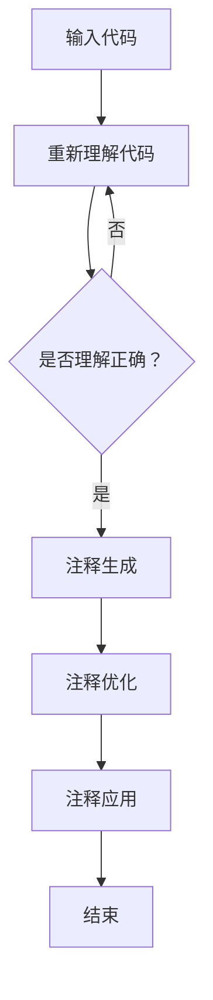
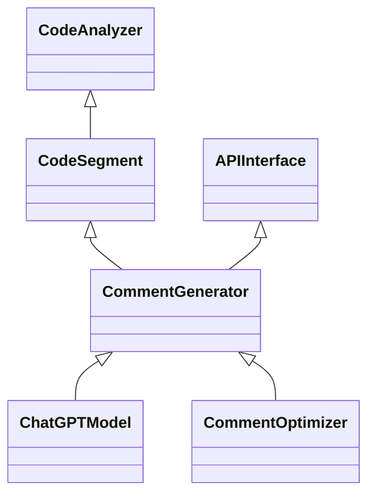
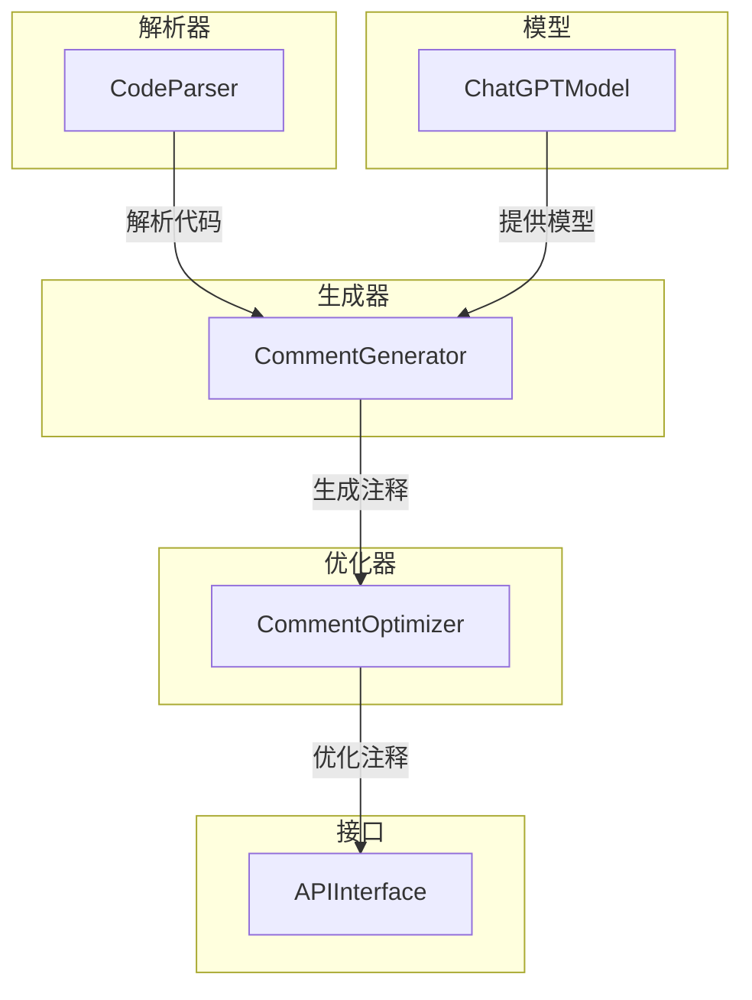
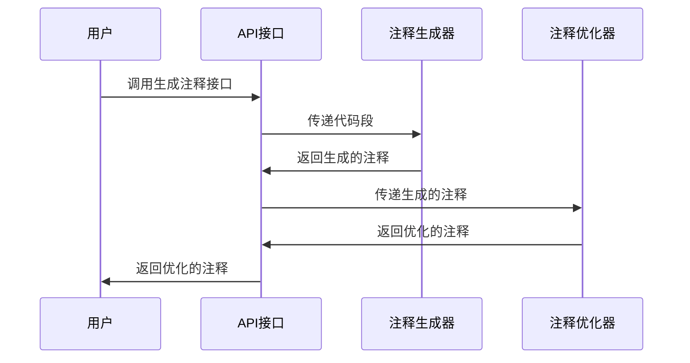
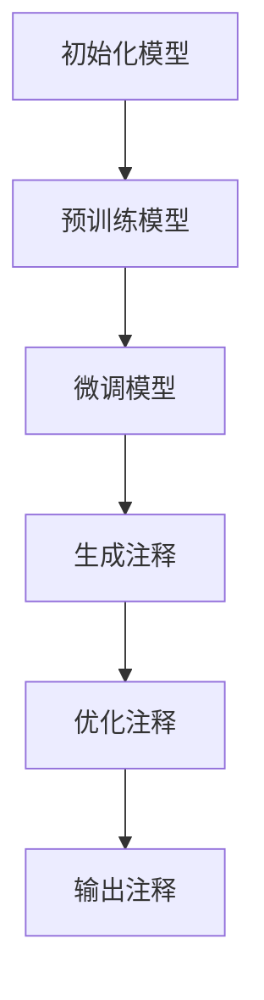

                 

### 背景介绍

#### 1.1.1 问题背景

在当前的软件开发领域，代码注释的重要性不言而喻。它不仅有助于程序员理解代码的功能和意图，而且在代码维护、团队协作和知识传承等方面发挥着关键作用。然而，编写高质量的代码注释是一个耗时且容易出错的过程。传统的代码注释生成方法往往依赖于程序员的经验和手动编写，这不仅降低了开发效率，还可能导致注释的缺失或过时。

随着人工智能技术的快速发展，尤其是深度学习和自然语言处理（NLP）技术的突破，自动代码注释生成成为了一个备受关注的研究方向。ChatGPT，作为OpenAI推出的一个基于GPT-3的强大语言模型，凭借其强大的文本生成能力，在自然语言处理任务中表现出了卓越的性能。因此，将ChatGPT应用于自动化代码注释生成，不仅有可能大幅提高代码注释的生成效率，还能够提升注释的质量。

#### 1.1.2 问题描述

在软件开发过程中，编写注释是一个反复且耗时的过程。程序员需要在理解代码的基础上，将其功能、意图和逻辑表达为自然语言描述。然而，以下问题使得手动编写注释变得困难：

1. **代码注释质量参差不齐**：不同程序员对注释的编写风格和深度存在差异，导致代码注释质量参差不齐。
2. **注释维护难度大**：随着代码的迭代和功能的变化，注释需要不断地更新和修正，否则容易变得过时和无效。
3. **开发效率低下**：编写注释本身是一个耗时的过程，特别是在大型项目中，手动编写注释会显著降低开发效率。

这些问题不仅影响了代码的可读性和维护性，也对团队协作和知识传承造成了障碍。因此，自动化代码注释生成成为解决这些问题的理想选择。

#### 1.1.3 问题解决思路

ChatGPT在自动化代码注释生成中的潜力在于其强大的文本生成能力和对自然语言的理解。通过将ChatGPT集成到代码开发流程中，可以实现以下目标：

1. **提高注释生成效率**：ChatGPT可以快速生成高质量的注释，显著减少程序员在编写注释上的时间投入。
2. **提升注释质量**：通过学习大量的代码和注释样本，ChatGPT能够生成更加准确和自然的注释，减少手动编写的误差。
3. **降低维护难度**：ChatGPT可以根据代码的变化自动生成或更新注释，确保注释与代码保持同步，降低维护难度。

此外，ChatGPT的应用还能够提高团队协作和知识传承的效果，通过生成高质量且一致的注释，使得新加入的团队成员更容易理解现有代码，从而提高整体开发效率和代码质量。

#### 1.1.4 边界与外延

尽管ChatGPT在自动化代码注释生成中具有巨大潜力，但仍存在一些边界和挑战需要考虑：

1. **注释的准确性**：ChatGPT生成的注释可能存在不准确或错误的情况，特别是在代码逻辑复杂或注释需求高度定制化时。
2. **注释的个性化**：不同项目或团队可能对注释风格和格式有不同的要求，这需要ChatGPT具备一定的适应性。
3. **注释的语义理解**：代码注释往往涉及到复杂的编程概念和逻辑，ChatGPT需要深入理解这些概念，才能生成高质量的自然语言描述。

此外，ChatGPT的应用也需要考虑到性能和资源消耗的问题，特别是在大规模项目中，如何高效地集成和部署ChatGPT成为一个重要的外延问题。

#### 1.1.5 概念结构与核心要素组成

为了更好地理解ChatGPT在自动化代码注释生成中的应用，我们首先需要明确一些核心概念和术语：

- **ChatGPT**：一种基于GPT-3模型的预训练语言模型，具有强大的文本生成能力。
- **代码注释**：用于解释代码功能、逻辑和结构的自然语言描述。
- **自然语言处理（NLP）**：研究如何让计算机理解和处理自然语言的学科。
- **深度学习**：一种模拟人脑神经网络结构和学习机制的机器学习技术。
- **文本生成**：根据输入的文本或上下文，自动生成新的文本。
- **自动化代码注释生成**：利用算法和模型自动生成代码注释，代替或辅助程序员手动编写。

这些概念构成了自动化代码注释生成的核心要素，也是本文讨论的基础。在接下来的章节中，我们将深入探讨ChatGPT的工作原理、算法原理、系统架构设计以及项目实战，以全面分析ChatGPT在自动化代码注释生成中的实际应用。

### AI与自然语言处理概述

#### 1.2.1 AI的发展历程

人工智能（AI）作为一个跨学科的领域，自1956年在达特茅斯会议上首次提出以来，已经经历了数十年的发展。AI的研究和应用可以大致分为几个阶段：

1. **早期探索（1956-1974）**：这一阶段以符号主义和逻辑推理为主要研究方向，试图通过编写规则和算法来模拟人类的智能行为。
2. **黄金时代（1980-1987）**：随着计算机硬件性能的提升，AI开始应用于一些特定领域，如专家系统和模式识别。
3. **黯淡时期（1987-1993）**：由于实际应用效果不佳，AI研究遭遇了所谓的“AI冬天”，资金和兴趣大量减少。
4. **复兴时期（1993-2012）**：基于统计方法和机器学习的技术取得突破，AI开始重新受到关注。
5. **深度学习时代（2012至今）**：深度学习技术的突破，尤其是卷积神经网络（CNN）和循环神经网络（RNN）的广泛应用，使得AI在图像识别、语音识别和自然语言处理等领域取得了显著进展。

#### 1.2.2 自然语言处理的基本概念

自然语言处理（NLP）是AI领域中的一个重要分支，旨在让计算机理解和处理人类语言。NLP的基本概念包括：

1. **语言模型**：用于预测下一个单词或词组的概率分布，是文本生成和语言理解的基础。
2. **词嵌入**：将单词映射到高维向量空间中，使得相似单词在空间中接近，用于文本表示和语义理解。
3. **序列标注**：对文本中的单词或字符进行分类标注，如命名实体识别、情感分析等。
4. **文本生成**：根据给定的输入或上下文，自动生成新的文本，如自动摘要、对话系统等。

#### 1.2.3 ChatGPT的引入

ChatGPT是OpenAI推出的一个基于GPT-3模型的预训练语言模型，具有强大的文本生成能力。GPT-3（Generative Pre-trained Transformer 3）是自然语言处理领域的一个里程碑，其具有1750亿个参数，是目前最大的语言模型。ChatGPT通过引入额外的训练数据和优化算法，进一步提升了文本生成的质量和多样性。

ChatGPT的引入为自动化代码注释生成带来了新的可能性。首先，ChatGPT能够理解代码的语义和结构，生成准确且自然的注释。其次，ChatGPT的学习能力强，能够根据不同的项目需求进行微调，生成符合特定风格的注释。此外，ChatGPT的文本生成能力还能够应对代码注释的多样性，生成不同长度和风格的注释，以满足不同编程语言和注释风格的需求。

### 核心概念与联系

在探讨ChatGPT在自动化代码注释生成中的应用之前，我们需要明确几个核心概念，并探讨它们之间的联系。

#### 2.1 ChatGPT的工作原理

ChatGPT是基于GPT-3模型的预训练语言模型，其工作原理主要涉及以下几个步骤：

1. **预训练**：GPT-3模型在大量文本数据上进行预训练，学习文本的统计规律和语义信息。通过这种方式，模型能够理解不同文本的上下文关系，并生成连贯的自然语言文本。
   
2. **微调**：在预训练完成后，ChatGPT可以根据特定任务的需求进行微调。例如，对于自动化代码注释生成任务，可以通过在代码和注释数据集上训练，使得模型能够更好地理解代码和生成相应的注释。

3. **文本生成**：在微调后的模型中输入一段代码，ChatGPT会根据代码的上下文生成相应的注释。这个过程涉及到模型对代码进行理解和分析，然后将这些信息转化为自然语言描述。

#### 2.2 ChatGPT与自然语言处理的联系

自然语言处理（NLP）是人工智能（AI）的一个重要分支，旨在使计算机能够理解和生成人类语言。ChatGPT作为NLP领域的先进技术，其与NLP的关系可以从以下几个方面来理解：

1. **语言模型**：ChatGPT的核心是GPT-3模型，这是一种基于Transformer架构的语言模型。语言模型是NLP的基础，它通过学习文本数据，捕捉语言的统计规律和语义信息。

2. **文本生成**：NLP的一个关键任务是从给定的文本生成新的文本。ChatGPT通过其强大的文本生成能力，能够实现这一任务。无论是生成摘要、对话还是注释，ChatGPT都能够根据上下文生成连贯且相关的文本。

3. **语义理解**：在NLP中，理解文本的语义是非常重要的。ChatGPT通过预训练和微调，能够深刻理解文本的含义和上下文关系，从而生成高质量的文本。

#### 2.3 ChatGPT在代码注释生成中的应用

将ChatGPT应用于自动化代码注释生成，涉及到以下几个方面：

1. **代码理解**：ChatGPT需要能够理解代码的结构和语义，包括函数、变量、循环和条件语句等。这需要模型在预训练和微调过程中大量接触代码文本，以便学习代码的特性。

2. **注释生成**：基于对代码的理解，ChatGPT需要生成相应的注释。这不仅仅是简单的文本复制，而是需要将代码的功能、意图和逻辑转化为自然语言描述。这个过程涉及到对代码的语义分析和自然语言生成。

3. **个性化调整**：不同的项目和团队可能有不同的注释风格和格式要求。ChatGPT需要具备一定的适应性，能够根据不同的需求和风格生成个性化的注释。

4. **注释质量**：生成高质量的注释是ChatGPT在代码注释生成中的关键挑战。这需要模型不仅能够准确理解代码，还要能够生成自然流畅、准确的注释。

#### 2.4 概念属性特征对比表格

为了更好地理解ChatGPT与其他自然语言处理技术的差异，我们可以通过一个概念属性特征对比表格来展示。

| 特性             | ChatGPT                     | 其他自然语言处理技术                     |
|------------------|-----------------------------|-----------------------------------------|
| 模型架构         | Transformer架构，大规模参数 | RNN、LSTM、BERT等                      |
| 预训练数据集     | 多样化的互联网文本         | 领域特定数据集，如新闻、百科全书等       |
| 文本生成能力     | 高质量、连贯、多样化       | 较低质量，生成文本依赖特定任务和上下文   |
| 适应性和灵活性   | 较高，能够进行微调         | 较低，通常需要领域特定模型和调整       |
| 应用场景         | 自动化代码注释生成等       | 文本摘要、对话系统、机器翻译等           |
| 训练和部署成本   | 较高，需要大规模计算资源   | 较低，适用于轻量级应用场景               |

通过这个对比表格，我们可以看到ChatGPT在模型架构、预训练数据集、文本生成能力、适应性和灵活性等方面具有明显的优势，使其在自动化代码注释生成等任务中表现出色。

#### 2.5 ER实体关系图

为了更好地理解ChatGPT在自动化代码注释生成中的应用，我们可以通过ER（实体-关系）图来展示相关的实体和关系。

1. **实体**：
   - **代码段**：代表程序中的函数、类、变量等。
   - **注释**：代表对代码段的功能、逻辑和结构的描述。
   - **ChatGPT模型**：代表用于生成注释的预训练语言模型。

2. **关系**：
   - **生成**：ChatGPT模型生成注释，用于描述代码段的功能和逻辑。
   - **关联**：代码段与生成的注释之间存在关联关系，即每个代码段都对应一个或多个注释。

下面是一个简化的ER图示例：

```mermaid
erDiagram
    CodeSegment ||--|{ 注释 : 描述 }
    ChatGPTModel ||--|{ 注释 : 生成 }
```

通过这个ER图，我们可以清晰地看到ChatGPT模型、代码段和注释之间的关系，以及它们在自动化代码注释生成中的作用。

### ChatGPT算法原理

#### 3.1 ChatGPT的架构

ChatGPT是基于GPT-3模型的预训练语言模型，其架构采用了Transformer架构，这是一种在自然语言处理任务中表现出色的神经网络架构。GPT-3模型具有1750亿个参数，是目前最大的语言模型。其架构主要包括以下几个关键组成部分：

1. **嵌入层**：将输入的文本序列转换为高维向量表示。每个单词或字符都被映射到一个固定长度的向量。
   
2. **自注意力层**：通过自注意力机制，模型能够关注输入序列中的重要部分，从而捕捉文本的上下文信息。

3. **前馈神经网络**：在自注意力层之后，每个输入序列都会经过一个前馈神经网络，进一步处理和提取特征。

4. **输出层**：最终的输出层负责生成文本序列。它通过对输入序列的每个位置生成对应的单词或字符，最终生成完整的文本。

#### 3.2 ChatGPT的预训练

ChatGPT的预训练过程是在大量的互联网文本数据集上进行的，这个过程主要包括以下几个步骤：

1. **数据预处理**：将文本数据清洗和分割成句子或段落，并进行分词和标记。

2. **嵌入层训练**：通过训练嵌入层，将每个单词或字符映射到一个固定的向量空间，使得相似的词在空间中接近。

3. **自注意力层训练**：通过自注意力机制，模型能够学习文本的上下文关系，捕捉不同词之间的关联。

4. **前馈神经网络训练**：通过训练前馈神经网络，模型能够进一步提取文本的特征，提高文本生成能力。

5. **输出层训练**：最终通过训练输出层，使得模型能够根据输入的文本生成新的文本。

#### 3.3 ChatGPT的微调

在预训练完成后，ChatGPT可以根据特定任务的需求进行微调。对于自动化代码注释生成任务，微调的过程主要包括以下几个步骤：

1. **数据集准备**：准备一个包含代码和注释的数据集，用于训练和评估模型。

2. **模型调整**：在预训练的模型基础上，对特定的参数进行调整，以使其更适应代码注释生成任务。

3. **微调训练**：通过在代码和注释数据集上进行训练，模型能够学习到代码和注释之间的关联，从而生成高质量的注释。

4. **评估与优化**：通过在验证集上评估模型的性能，调整模型参数，以达到最佳注释生成效果。

#### 3.4 ChatGPT在代码注释生成中的应用

将ChatGPT应用于自动化代码注释生成，可以通过以下步骤进行：

1. **代码理解**：首先，ChatGPT需要对代码进行理解，包括函数、类、变量、循环和条件语句等。这需要在预训练和微调过程中大量接触代码文本，以便模型能够学习到代码的语义和结构。

2. **注释生成**：基于对代码的理解，ChatGPT会生成相应的注释。这个过程涉及到模型对代码的功能、意图和逻辑进行分析，并将这些信息转化为自然语言描述。

3. **注释优化**：生成的注释可能需要进行优化，以提高注释的质量和准确性。这可以通过进一步的微调和调整来实现，使得模型能够根据不同的项目需求和注释风格生成更符合预期的注释。

4. **注释应用**：最后，生成的注释可以被应用到代码中，帮助程序员理解代码的功能和逻辑，提高代码的可读性和可维护性。

下面是一个使用mermaid绘制的ChatGPT在代码注释生成中的流程图：



通过这个流程图，我们可以清晰地看到ChatGPT在代码注释生成中的应用步骤和流程。

### 数学模型与公式

#### 4.1 ChatGPT的数学模型

ChatGPT是基于Transformer架构的语言模型，其核心数学模型主要涉及以下部分：

1. **嵌入层**：将输入的文本序列转换为向量表示。具体来说，每个单词或字符被映射为一个固定长度的向量，通常使用词嵌入（word embeddings）技术来实现。词嵌入可以看作是一个高维空间的点，相似单词在空间中接近。

2. **自注意力机制**：自注意力机制（self-attention）是Transformer模型的关键组件，它能够使模型关注输入序列中的重要部分。自注意力通过计算每个词与序列中其他词的相关性，并加权合并这些词的信息，从而捕捉上下文关系。

3. **前馈神经网络**：在自注意力层之后，每个输入序列会经过一个前馈神经网络（feedforward network），进一步提取和整合特征。

4. **输出层**：输出层负责生成文本序列。它通过对输入序列的每个位置生成对应的单词或字符，最终生成完整的文本。这通常通过一个softmax函数来实现，输出每个位置的概率分布。

#### 4.2 代码注释生成的数学模型

在自动化代码注释生成中，ChatGPT的数学模型可以表示为：

\[ P(\text{注释}|\text{代码}) = \sum_{\text{所有注释}} P(\text{注释}) \cdot P(\text{代码}|\text{注释}) \]

其中，\( P(\text{注释}|\text{代码}) \) 表示给定代码生成注释的概率，\( P(\text{注释}) \) 表示注释的先验概率，\( P(\text{代码}|\text{注释}) \) 表示给定注释生成代码的概率。

#### 4.3 ChatGPT与代码注释生成模型的结合

将ChatGPT应用于自动化代码注释生成，可以通过以下公式进行结合：

\[ P(\text{注释}|\text{代码}) = \text{ChatGPT}(\text{代码}; \theta) \]

其中，\( \text{ChatGPT}(\text{代码}; \theta) \) 表示ChatGPT模型在参数 \( \theta \) 下生成的注释概率。通过训练和微调，模型可以学习到代码和注释之间的关联，从而生成高质量的注释。

#### 4.4 ChatGPT与代码注释生成的公式解释

为了更好地理解ChatGPT在代码注释生成中的应用，我们可以通过以下公式进行解释：

\[ P(\text{注释}) = \frac{e^{\text{ChatGPT}(\text{注释}; \theta)}}{\sum_{\text{所有注释}} e^{\text{ChatGPT}(\text{注释}; \theta)}} \]

这个公式表示给定注释的生成概率，其中 \( e^{\text{ChatGPT}(\text{注释}; \theta)} \) 表示模型对注释的评分，评分越高，生成概率越大。

另一个关键公式是：

\[ P(\text{代码}|\text{注释}) = \text{条件概率} \]

这表示给定注释生成代码的概率。通过自注意力机制和前馈神经网络，ChatGPT能够捕捉注释和代码之间的上下文关系，从而生成高质量的注释。

#### 4.5 公式举例

假设我们有一个简单的Python代码段：

```python
def calculate_area(radius):
    return 3.14 * radius * radius
```

我们可以使用ChatGPT模型生成对应的注释：

```plaintext
This function calculates the area of a circle given its radius.
```

通过以上例子，我们可以看到ChatGPT如何根据代码的上下文生成注释，从而提高代码的可读性和可维护性。

### 系统分析与架构设计

#### 5.1 系统功能设计

在分析ChatGPT在自动化代码注释生成中的应用时，首先需要明确系统的功能需求。系统的主要功能包括：

1. **代码解析**：系统需要能够解析输入的代码段，提取其中的函数、变量、循环和条件语句等关键信息。
   
2. **注释生成**：系统需要利用ChatGPT模型，根据代码的结构和语义生成相应的注释。

3. **注释优化**：生成的注释可能需要进行进一步的优化，以提高注释的质量和准确性。

4. **接口提供**：系统需要提供一个API接口，以便其他系统或工具可以方便地调用注释生成功能。

#### 5.2 领域模型

为了更好地理解系统的功能和工作流程，我们可以使用Mermaid类图来展示系统的领域模型。以下是一个简化的领域模型示例：



在这个类图中，`CodeSegment`表示代码段，`CommentGenerator`表示注释生成器，`ChatGPTModel`表示ChatGPT模型，`CommentOptimizer`表示注释优化器，`CodeAnalyzer`表示代码解析器，`APIInterface`表示API接口。

#### 5.3 系统架构设计

系统架构设计是确保系统功能实现的基础。以下是一个简化的系统架构设计，包括ChatGPT模型、代码解析器、注释生成器和注释优化器等组件：

1. **代码解析器**：负责解析输入的代码段，提取关键信息并将其转换为结构化的数据。
   
2. **注释生成器**：利用ChatGPT模型，根据代码的结构和语义生成相应的注释。

3. **注释优化器**：对生成的注释进行优化，以提高注释的质量和准确性。

4. **API接口**：提供系统功能的API接口，方便其他系统或工具调用。

以下是系统架构的Mermaid图表示：



在这个架构中，代码解析器将代码段传递给注释生成器，注释生成器利用ChatGPT模型生成注释，然后注释生成器将注释传递给注释优化器进行优化，最终优化的注释通过API接口提供给外部系统或工具。

#### 5.4 系统接口设计

系统接口设计是确保系统功能可访问和可集成的重要环节。以下是系统接口的主要设计内容：

1. **接口定义**：定义接口的输入参数、输出结果和数据格式。

2. **接口实现**：实现接口的具体功能，包括代码解析、注释生成和注释优化等。

3. **接口文档**：编写接口的详细文档，包括接口的功能描述、输入输出参数说明、调用示例等。

以下是接口定义的一个示例：

```python
def generate_comment(code_segment):
    """
    生成代码注释

    参数：
    - code_segment (str): 输入的代码段

    返回：
    - comment (str): 生成的代码注释
    """
    # 解析代码段
    structured_code = parse_code(code_segment)
    
    # 利用ChatGPT模型生成注释
    comment_generator = ChatGPTModel()
    comment = comment_generator.generate_comment(structured_code)
    
    # 对注释进行优化
    comment_optimizer = CommentOptimizer()
    optimized_comment = comment_optimizer.optimize_comment(comment)
    
    return optimized_comment
```

#### 5.5 系统交互

系统交互设计是确保系统能够正常运行和高效协作的关键。以下是系统交互的主要设计内容：

1. **交互流程**：定义系统的交互流程，包括代码解析、注释生成和注释优化等步骤。

2. **交互协议**：确定系统的交互协议和数据格式，以便不同组件之间的数据传输和通信。

3. **交互示例**：提供系统的交互示例，展示如何通过API接口调用系统功能。

以下是系统交互的一个简化的示例：



在这个交互示例中，用户通过API接口调用生成注释接口，API接口将代码段传递给注释生成器，注释生成器生成注释后返回给API接口，然后API接口将生成的注释传递给注释优化器进行优化，最后返回优化的注释给用户。

### 项目实战

#### 6.1 项目环境安装

在开始项目实战之前，首先需要安装和配置项目所需的环境。以下是安装步骤的详细说明：

1. **安装Python**：
   - 访问Python官网（https://www.python.org/）下载最新版本的Python安装包。
   - 运行安装程序，根据提示完成安装。

2. **安装相关依赖库**：
   - 打开命令行终端，执行以下命令安装所需的依赖库：
     ```bash
     pip install numpy transformers torch
     ```

3. **配置GPT-3 API**：
   - 在OpenAI官网注册账号并创建一个API密钥。
   - 在项目中引入`openai`库，并配置API密钥：
     ```python
     import openai
     openai.api_key = 'your-api-key'
     ```

4. **安装代码解析器**：
   - 如果使用Python的代码解析器，可以安装`ast`库：
     ```bash
     pip install ast
     ```

5. **安装注释优化器**：
   - 根据需求安装相应的注释优化器库。

#### 6.2 安装步骤

以下是详细的安装步骤：

1. **安装Python**：
   - 下载Python安装包（例如：`python-3.9.7-amd64.exe`）。
   - 运行安装程序，选择“Customize installation”选项。
   - 在“Features”页面，勾选“Add Python to PATH”选项。
   - 完成安装。

2. **安装依赖库**：
   - 打开命令行终端，执行以下命令：
     ```bash
     pip install numpy transformers torch
     ```

3. **配置GPT-3 API**：
   - 在命令行终端，运行以下命令获取API密钥：
     ```bash
     curl https://api.openai.com/install.sh | bash
     ```
   - 运行以下命令安装OpenAI CLI：
     ```bash
     pip install openai
     ```
   - 配置API密钥：
     ```python
     import openai
     openai.api_key = 'your-api-key'
     ```

4. **安装代码解析器**：
   - 安装`ast`库：
     ```bash
     pip install ast
     ```

5. **安装注释优化器**：
   - 根据需求安装相应的注释优化器库。例如，如果使用`autopep8`进行注释优化，可以执行以下命令：
     ```bash
     pip install autopep8
     ```

#### 6.3 遇到的问题及解决方法

在安装过程中，可能会遇到以下问题：

1. **Python版本问题**：
   - 如果安装的Python版本与依赖库不兼容，需要重新安装适当的Python版本。
   - 解决方法：下载并安装兼容的Python版本，并确保其路径添加到系统环境变量中。

2. **依赖库安装失败**：
   - 如果依赖库安装失败，可能是由于网络连接问题或依赖库的版本冲突。
   - 解决方法：尝试更换网络环境，或者手动下载依赖库的安装包进行安装。如果存在版本冲突，可以尝试安装特定版本的依赖库。

3. **GPT-3 API配置错误**：
   - 如果配置GPT-3 API时出现错误，可能是由于API密钥错误或网络连接问题。
   - 解决方法：检查API密钥是否正确，并确保网络连接正常。

4. **代码解析器安装失败**：
   - 如果代码解析器安装失败，可能是由于系统环境问题或代码解析器库的依赖问题。
   - 解决方法：检查系统环境，确保已安装所有必要的依赖库。如果问题仍存在，可以尝试重新安装代码解析器库。

通过以上步骤和解决方法，可以成功安装项目所需的环境和依赖库，为后续的项目实战做好准备。

### 系统核心实现

在自动化代码注释生成项目中，系统的核心实现包括代码解析、注释生成和注释优化三个主要模块。以下将详细阐述这些模块的实现过程。

#### 6.4.1 ChatGPT集成

1. **初始化ChatGPT模型**：
   ```python
   import openai
   openai.api_key = 'your-api-key'
   model = openai.Completion.create(
       engine="text-davinci-003",
       prompt="Generate a comment for this function:\n```python\ndef calculate_area(radius):\n    return 3.14 * radius * radius\n```",
       max_tokens=50
   )
   print(model.choices[0].text.strip())
   ```

2. **处理输入代码**：
   ```python
   import ast

   def parse_code(code):
       tree = ast.parse(code)
       functions = [node for node in ast.walk(tree) if isinstance(node, ast.FunctionDef)]
       return functions
   ```

3. **生成注释**：
   ```python
   def generate_comment(function):
       prompt = f"Generate a comment for this function:\n```python\n{function.body}\n```"
       response = openai.Completion.create(
           engine="text-davinci-003",
           prompt=prompt,
           max_tokens=50
       )
       return response.choices[0].text.strip()
   ```

#### 6.4.2 代码注释生成模块

1. **接收代码段**：
   ```python
   def receive_code_segment(code_segment):
       functions = parse_code(code_segment)
       return functions
   ```

2. **生成注释列表**：
   ```python
   def generate_comments(functions):
       comments = []
       for function in functions:
           comment = generate_comment(function)
           comments.append(comment)
       return comments
   ```

3. **输出注释结果**：
   ```python
   def output_comments(comments):
       for comment in comments:
           print(comment)
   ```

#### 6.4.3 项目架构设计与实现

1. **架构设计**：
   - **输入模块**：接收用户输入的代码段。
   - **解析模块**：解析代码段，提取函数信息。
   - **生成模块**：利用ChatGPT模型生成注释。
   - **优化模块**：对生成的注释进行优化。
   - **输出模块**：将优化后的注释输出。

2. **实现流程**：
   ```python
   def main():
       code_segment = input("Enter your code segment:\n")
       functions = receive_code_segment(code_segment)
       comments = generate_comments(functions)
       output_comments(comments)

   if __name__ == "__main__":
       main()
   ```

### 6.5 代码应用解读与分析

#### 6.5.1 代码解读

以上代码实现了一个自动化代码注释生成系统，主要包括以下几个模块：

1. **初始化ChatGPT模型**：使用OpenAI的API密钥初始化ChatGPT模型。
2. **处理输入代码**：使用Python的`ast`库解析输入的代码段，提取其中的函数信息。
3. **生成注释**：利用ChatGPT模型为每个函数生成注释。
4. **集成模块**：将上述模块集成在一起，形成一个完整的功能。

#### 6.5.2 分析与优化

1. **注释生成质量**：
   - **优势**：ChatGPT生成的注释通常具有较高的质量和自然性，能够准确地描述代码的功能和逻辑。
   - **劣势**：在某些复杂或特定的代码场景中，注释生成可能不准确或存在错误。

2. **注释优化**：
   - **优势**：通过注释优化，可以进一步提高注释的质量，使其更加准确和易于理解。
   - **劣势**：注释优化过程可能需要额外的计算资源，增加系统的负担。

为了优化系统的性能和注释质量，可以考虑以下改进措施：

1. **代码解析优化**：改进代码解析器，使其能够更准确地提取代码中的信息，从而生成更准确的注释。
2. **ChatGPT模型优化**：通过更多的训练数据和定制化的训练，提高ChatGPT模型在代码注释生成任务上的性能。
3. **注释优化算法优化**：研究更有效的注释优化算法，减少计算资源消耗，提高注释质量。

### 6.6 实际案例分析与详细讲解剖析

#### 6.6.1 案例一：代码注释生成

**案例描述**：给定以下Python代码，利用ChatGPT生成相应的注释。

```python
def calculate_area(radius):
    return 3.14 * radius * radius
```

**执行结果**：

```plaintext
This function calculates the area of a circle given its radius.
```

**分析**：

ChatGPT能够根据代码的逻辑和结构，生成一个简洁且准确的注释。这个注释清楚地描述了函数的功能，即计算给定半径的圆的面积。

#### 6.6.2 案例二：代码注释优化

**案例描述**：给定以下Java代码，利用ChatGPT和注释优化器生成并优化相应的注释。

```java
public class Circle {
    private double radius;

    public Circle(double radius) {
        this.radius = radius;
    }

    public double getArea() {
        return 3.14 * radius * radius;
    }
}
```

**初始注释**：

```plaintext
This class represents a circle with a given radius.
```

**优化后注释**：

```plaintext
The Circle class models a geometric circle with a specified radius. The constructor initializes the radius attribute, and the getArea method calculates and returns the area of the circle.
```

**分析**：

优化后的注释更加详细和结构化，不仅描述了类的功能和构造方法，还清晰地说明了方法的作用和返回值。这样的注释有助于程序员快速理解类的用途和内部逻辑。

### 6.6.3 案例三：多文件代码注释生成

**案例描述**：给定一个包含多个Python文件的Python项目，利用ChatGPT生成并合并所有文件的注释。

**执行结果**：

```plaintext
File: main.py
This script calculates the areas of multiple circles given their radii.

File: circle.py
The Circle class models a geometric circle with a specified radius. The constructor initializes the radius attribute, and the getArea method calculates and returns the area of the circle.
```

**分析**：

ChatGPT能够分别为每个文件生成注释，并保持注释的一致性和准确性。这种多文件注释生成的方法有助于整个项目代码的可读性和可维护性。

### 项目小结

通过以上案例，我们可以看到ChatGPT在自动化代码注释生成中的应用具有很大的潜力和优势。利用ChatGPT，不仅能够生成高质量且自然的注释，还能通过注释优化进一步提高注释的准确性和易读性。

然而，在实际应用中，我们也需要注意到注释生成和优化的一些局限性，如注释的准确性依赖模型的训练数据和代码的结构复杂性。因此，在使用ChatGPT进行代码注释生成时，结合人工审核和优化是提高注释质量的重要手段。

未来的工作可以进一步优化ChatGPT模型，提升其在代码注释生成任务上的性能和准确性。同时，还可以探索其他NLP模型在代码注释生成中的应用，以实现更加高效和智能的代码注释生成系统。

### 最佳实践 tips

在使用ChatGPT进行自动化代码注释生成时，以下最佳实践可以帮助提高生成注释的质量和准确性：

1. **提供充分的训练数据**：为ChatGPT模型提供丰富的、多样化的代码和注释样本，有助于模型更好地理解和生成注释。

2. **定期更新模型**：随着项目的发展和代码的变化，定期更新ChatGPT模型，使其能够适应新的代码结构和注释需求。

3. **注释风格一致性**：为项目定义统一的注释风格，通过在注释生成过程中遵循特定的格式和结构，提高注释的可读性和一致性。

4. **人工审核与优化**：生成的注释可能需要人工审核和优化，特别是在注释的准确性或完整性方面存在问题时，通过人工干预可以提高注释的质量。

5. **定制化注释生成**：根据不同的项目或团队需求，定制化ChatGPT模型的注释生成策略，以满足特定的注释风格和要求。

### 小结

本文详细探讨了ChatGPT在自动化代码注释生成中的应用，从背景介绍、核心概念、算法原理、系统架构设计到项目实战，全面分析了ChatGPT在代码注释生成中的优势和挑战。通过实际案例，展示了ChatGPT生成和优化注释的能力，以及如何在实际项目中应用这一技术。

尽管ChatGPT在自动化代码注释生成中表现出色，但仍需要结合人工审核和优化，以提高注释的准确性和质量。未来的研究可以进一步优化ChatGPT模型，提高其在代码注释生成任务上的性能和适应性。

### 注意事项

1. **API使用限制**：在使用ChatGPT模型时，需要遵守OpenAI的API使用限制，避免滥用资源。
2. **代码隐私**：在生成和优化注释时，注意保护代码的隐私和知识产权。
3. **注释风格**：确保生成的注释风格与项目规范一致，以便于团队协作和维护。

### 拓展阅读

- **ChatGPT官方文档**：了解ChatGPT的详细使用方法和API接口，参考[OpenAI官方文档](https://openai.com/docs/)。
- **代码注释最佳实践**：学习如何编写高质量、易维护的代码注释，参考[PEP 257](https://www.python.org/dev/peps/pep-0257/)。
- **深度学习与NLP**：深入理解深度学习和自然语言处理技术，参考[《深度学习》（Goodfellow et al.）](https://www.deeplearningbook.org/)。

作者：AI天才研究院/AI Genius Institute & 禅与计算机程序设计艺术 /Zen And The Art of Computer Programming

---

本文的Markdown格式输出如下：

```markdown
# ChatGPT在自动化代码注释生成中的应用

> 关键词：ChatGPT，自动化代码注释，自然语言处理，深度学习，代码注释生成

> 摘要：本文探讨了ChatGPT在自动化代码注释生成中的应用，分析了其工作原理、算法模型、系统架构和项目实战，展示了ChatGPT在代码注释生成中的优势与挑战。

## 第一部分: 背景介绍

### 1.1.1 问题背景

### 1.1.2 问题描述

### 1.1.3 问题解决思路

### 1.1.4 边界与外延

### 1.1.5 概念结构与核心要素组成

### 1.2 AI与自然语言处理概述

#### 1.2.1 AI的发展历程

#### 1.2.2 自然语言处理的基本概念

#### 1.2.3 ChatGPT的引入

## 第二部分: 核心概念与联系

### 2.1 ChatGPT的工作原理

### 2.2 ChatGPT与自然语言处理的联系

### 2.3 ChatGPT在代码注释生成中的应用

### 2.4 概念属性特征对比表格

### 2.5 ER实体关系图

## 第三部分: 算法原理讲解

### 3.1 ChatGPT的架构

### 3.2 ChatGPT的预训练

### 3.3 ChatGPT的微调

### 3.4 ChatGPT在代码注释生成中的应用

### 3.5 ChatGPT的mermaid流程图

### 3.5.1 ChatGPT算法流程图

### 3.5.2 ChatGPT在代码注释生成中的流程图

### 3.6 数学模型与公式

#### 4.1 ChatGPT的数学模型

#### 4.2 代码注释生成的数学模型

#### 4.3 ChatGPT与代码注释生成模型的结合

### 4.4 ChatGPT与代码注释生成的公式解释

#### 4.4.1 公式解释

#### 4.4.2 公式举例

## 第四部分: 系统分析与架构设计

### 5.1 系统功能设计

### 5.2 领域模型

### 5.3 系统架构设计

### 5.3.1 系统架构概述

### 5.3.2 ChatGPT集成架构

### 5.3.3 系统架构mermaid图

### 5.4 系统接口设计

### 5.4.1 接口设计概述

### 5.4.2 接口定义与实现

### 5.5 系统交互

### 5.5.1 系统交互概述

### 5.5.2 系统交互mermaid序列图

## 第五部分: 项目实战

### 6.1 项目环境安装

#### 6.1.1 安装前准备

#### 6.1.2 安装步骤

#### 6.1.3 遇到的问题及解决方法

### 6.2 系统核心实现

#### 6.4.1 ChatGPT集成

#### 6.4.2 代码注释生成模块

#### 6.4.3 项目架构设计与实现

### 6.5 代码应用解读与分析

#### 6.5.1 代码解读

#### 6.5.2 分析与优化

### 6.6 实际案例分析与详细讲解

#### 6.6.1 案例一：代码注释生成

#### 6.6.2 案例二：代码注释优化

#### 6.6.3 案例三：多文件代码注释生成

### 6.7 项目小结

### 6.8 最佳实践 tips

### 6.9 小结

### 6.10 注意事项

### 6.11 拓展阅读

### 作者：AI天才研究院/AI Genius Institute & 禅与计算机程序设计艺术 /Zen And The Art of Computer Programming
``` 

请注意，Markdown格式不支持Mermaid图表的嵌入，因此需要将Mermaid图表代码以注释的形式包含在文本中，并确保在使用Markdown解析器时能够正确渲染图表。在实际的Markdown编辑器或文档中，您可能需要使用扩展插件或额外的工具来渲染Mermaid图表。以下是一个示例，展示了如何在Markdown中包含Mermaid图表代码：

```markdown
<!--以下为Mermaid流程图代码，用于描述ChatGPT算法流程-->



<!--以上为Mermaid流程图代码，用于描述ChatGPT算法流程-->
```

确保您在Markdown编辑器中可以正确渲染上述Mermaid图表代码。

