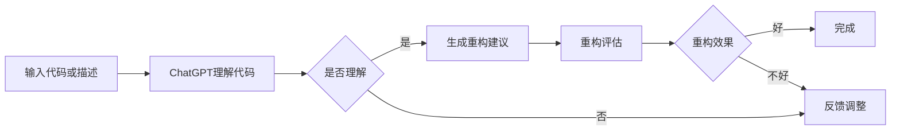
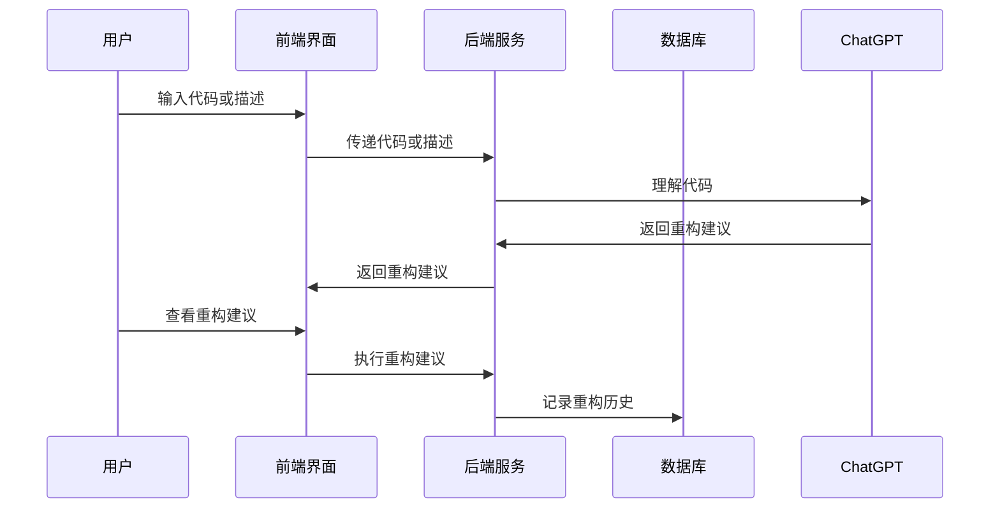
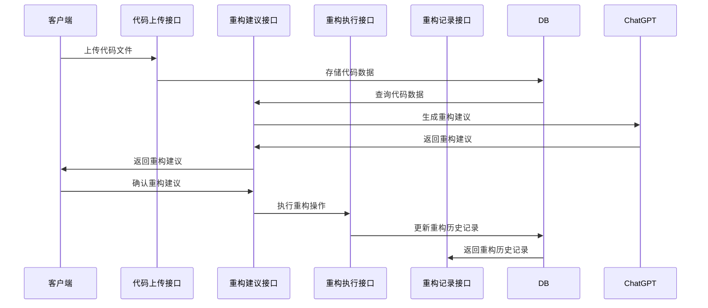
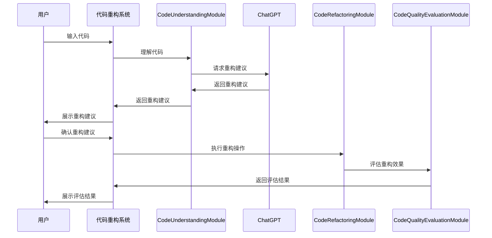

                 

### 背景介绍

#### 核心概念术语说明

在深入探讨ChatGPT在自动化代码重构建议生成中的应用之前，我们首先需要明确几个关键术语的含义。代码重构，指的是在保留程序原有功能的前提下，对代码进行修改，以提高代码的可读性、可维护性和性能。自动化代码重构，则是指通过算法和工具，自动识别并执行代码重构的过程。ChatGPT，全名为Chat Generative Pre-trained Transformer，是一种基于Transformer架构的预训练语言模型，具有强大的文本理解和生成能力。

#### 问题背景

软件开发中，代码重构是一个不可或缺的环节。随着时间的推移，项目规模和复杂度不断增加，代码的质量和可维护性会逐渐下降。如果不进行定期重构，将导致代码库难以维护，新功能的开发效率低下。然而，代码重构并非易事。它涉及到对现有代码的深入理解，需要开发者具备丰富的编程经验和对代码风格的高度敏感。此外，重构过程中的每一步都可能对代码的功能和性能产生重大影响，稍有不慎，就可能引入新的错误。

#### 问题描述

代码重构的主要问题包括：

1. **复杂度**：大型软件系统中，重构某个模块可能会引发一系列的连锁反应，使得重构过程变得异常复杂。
2. **风险**：重构过程中可能引入新的bug，影响系统的稳定性。
3. **时间成本**：手动进行代码重构耗时较长，且容易出错。
4. **知识传递**：随着团队成员的更替，旧代码的维护变得更加困难，因为新成员往往难以理解复杂的代码逻辑。

#### 问题解决

为了解决上述问题，开发者和研究人员提出了多种代码重构工具和方法。然而，传统的代码重构方法主要依赖于手工编写规则或脚本，效率较低，且难以适应不断变化的代码结构。近年来，机器学习和自然语言处理技术的发展为自动化代码重构提供了新的可能性。ChatGPT作为一种强大的语言模型，在理解代码、生成重构建议方面展现出显著的优势。

#### 边界与外延

代码重构不仅局限于代码结构的优化，还包括代码风格的改进、代码模块的分解与重构等。此外，代码重构的范围可以从单个模块扩展到整个项目。在这个过程中，需要综合考虑代码的完整性、一致性和性能。ChatGPT的应用不仅限于代码重构建议的生成，还可以在代码审查、代码生成、自动化测试等领域发挥重要作用。

#### 概念结构与核心要素组成

代码重构的核心概念结构包括：

1. **代码解析**：理解代码的结构和语义。
2. **重构规则**：定义如何修改代码以实现重构。
3. **重构评估**：评估重构的效果，确保代码质量。
4. **自动化工具**：实现代码重构的自动化。

这些要素共同构成了一个完整、高效的代码重构过程。而ChatGPT作为自动化工具，通过其强大的自然语言处理能力，可以在代码重构的各个环节中提供有力支持。

### 核心概念与联系

#### ChatGPT的基本原理

ChatGPT是基于Transformer架构的预训练语言模型，其核心思想是通过海量数据的预训练，使模型具备理解和生成自然语言的能力。Transformer模型采用自注意力机制，能够捕捉输入文本中任意位置之间的依赖关系，从而在语言理解和生成任务中表现出色。ChatGPT通过在大型文本语料库上的预训练，获得了丰富的知识储备和语言理解能力，使得它能够处理复杂的编程语言和代码结构。

#### ChatGPT在代码重构中的应用

ChatGPT在代码重构中的应用主要体现在以下几个方面：

1. **代码理解**：ChatGPT能够通过自然语言描述或直接输入代码，理解代码的结构和语义，从而为重构提供基础。

2. **重构建议生成**：ChatGPT可以根据对代码的理解，生成具体的重构建议，包括代码优化、重构策略等。

3. **代码质量评估**：ChatGPT可以分析代码的质量，识别潜在的问题，并提出改进建议。

4. **自动化重构**：ChatGPT生成的重构建议可以由自动化工具执行，实现代码重构的自动化。

#### 核心概念属性特征对比表格

| 特征       | 代码重构工具 | ChatGPT        |
| ---------- | ------------ | -------------- |
| 理解代码结构 | 较弱         | 强             |
| 重构建议生成 | 需人工介入   | 自动生成       |
| 适应复杂场景 | 较难         | 较易           |
| 风险评估    | 需手工操作   | 自动评估       |
| 效率       | 低           | 高             |

#### ER实体关系图架构

为了更好地展示ChatGPT在代码重构中的应用，我们可以使用Mermaid绘制ER实体关系图：

```mermaid
erDiagram
    Code --> ChatGPT : 代码理解
    Code --> 重构建议 : 生成重构建议
    Code --> 质量评估 : 代码质量评估
    ChatGPT --> 自动化工具 : 实现自动化重构
```

在这个ER图中，`Code`实体与`ChatGPT`和`重构建议`以及`质量评估`之间存在关联，而`ChatGPT`又与`自动化工具`相连，展示了ChatGPT在代码重构中的核心作用。

### 算法原理讲解

#### 算法原理概述

ChatGPT在自动化代码重构中的核心算法原理基于其强大的文本理解和生成能力。该算法的基本思想是：首先通过自然语言描述或直接输入代码，让ChatGPT理解代码的结构和语义；然后根据理解生成相应的重构建议；最后对重构建议进行评估和优化。

#### 算法流程图

为了更直观地展示算法流程，我们使用Mermaid绘制了以下流程图：



在这个流程图中，A表示输入代码或重构描述，B表示ChatGPT理解代码，C用于判断是否成功理解代码。如果是，则流程跳转到D生成重构建议；否则，跳转到E进行反馈调整。D生成重构建议后，F用于评估重构效果，根据评估结果，流程会跳转到H完成重构，或者返回E进行进一步的调整。

#### 算法数学模型

算法的数学模型主要基于ChatGPT的预训练过程。ChatGPT利用Transformer模型进行预训练，核心是自注意力机制（Self-Attention）和多头注意力（Multi-Head Attention）。自注意力机制通过计算输入序列中每个词与所有词的相似度，从而捕捉词与词之间的依赖关系。多头注意力则将输入序列分成多个子序列，分别计算它们的自注意力，最终加权合并。

数学公式表示如下：

$$
\text{Attention}(Q, K, V) = \text{softmax}\left(\frac{QK^T}{\sqrt{d_k}}\right)V
$$

其中，$Q$、$K$和$V$分别表示查询向量、键向量和值向量，$d_k$为键向量的维度。$softmax$函数用于计算每个键的加权概率，从而生成输出向量。

#### 算法举例说明

假设我们有一个简单的Python代码示例：

```python
def add(a, b):
    return a + b

def main():
    x = 5
    y = 10
    result = add(x, y)
    print("The result is:", result)

if __name__ == "__main__":
    main()
```

我们将这段代码输入ChatGPT，让ChatGPT理解代码结构并生成重构建议。ChatGPT分析后可能生成以下重构建议：

1. **函数参数命名优化**：将`add`函数的参数`a`和`b`命名为更具有描述性的名称，如`num1`和`num2`。
2. **代码风格一致性**：将`print`语句的缩进调整为4个空格。
3. **代码块分离**：将`main`函数中的逻辑拆分为多个函数，提高代码的可读性。

ChatGPT生成的重构建议如下：

```python
def add(num1, num2):
    return num1 + num2

def get_result():
    x = 5
    y = 10
    result = add(x, y)
    return result

def print_result(result):
    print("The result is:", result)

if __name__ == "__main__":
    main()
```

通过这个例子，我们可以看到ChatGPT如何通过其强大的理解能力和生成能力，为代码重构提供有效的建议。

### 系统分析与架构设计方案

#### 问题场景介绍

在软件开发过程中，代码重构是一个持续且必要的任务。然而，随着项目规模的扩大和复杂度的增加，手动进行代码重构变得越来越困难。传统的方法主要依赖于开发者的经验和手工编写规则，不仅效率低下，而且容易引入错误。为了解决这一问题，我们需要一种自动化、智能的代码重构工具，能够在不改变代码功能的前提下，优化代码结构，提高代码质量。

#### 项目介绍

本项目旨在开发一个基于ChatGPT的自动化代码重构系统。该系统利用ChatGPT强大的自然语言处理能力，对输入的代码进行理解、分析和重构，生成优化后的代码。系统的核心目标是提高代码的可读性、可维护性和性能，同时降低手动重构的时间和风险。

#### 系统功能设计

系统的核心功能包括：

1. **代码理解**：通过自然语言描述或直接输入代码，ChatGPT理解代码的结构和语义。
2. **重构建议生成**：根据对代码的理解，ChatGPT生成具体的重构建议，如参数命名优化、代码风格一致性调整、代码块分离等。
3. **重构评估**：评估重构效果，确保代码质量。
4. **自动化重构**：执行ChatGPT生成的重构建议，实现代码重构的自动化。

#### 系统架构设计

系统的整体架构分为以下几个部分：

1. **前端界面**：提供用户交互界面，用户可以通过界面输入代码或重构描述，查看重构建议和评估结果。
2. **后端服务**：包括代码理解模块、重构建议生成模块、重构评估模块和自动化重构模块。
3. **数据库**：存储代码数据、重构建议数据和历史重构记录。

以下是一个简单的系统架构设计图：



在这个架构设计中，用户通过前端界面输入代码或重构描述，前端界面将数据传递给后端服务。后端服务利用ChatGPT理解代码，生成重构建议，并将建议返回给前端界面供用户查看。用户确认重构建议后，前端界面将建议传递给后端服务，后端服务执行重构操作，并将结果记录到数据库中。

#### 系统接口设计

系统的接口设计主要包括以下部分：

1. **代码上传接口**：用于接收用户上传的代码文件。
2. **重构建议接口**：用于获取ChatGPT生成的重构建议。
3. **重构执行接口**：用于执行用户确认的重构建议。
4. **重构记录接口**：用于查询和更新重构历史记录。

以下是一个简单的接口设计图：



在这个接口设计中，客户端通过上传代码文件接口上传代码，代码上传接口将代码存储到数据库中。重构建议接口通过查询代码数据，利用ChatGPT生成重构建议，并将建议返回给客户端。客户端确认重构建议后，重构执行接口执行重构操作，并将结果记录到数据库中。重构记录接口用于查询和更新重构历史记录。

#### 系统交互

为了更好地展示系统的交互过程，我们使用Mermaid绘制了以下序列图：



在这个序列图中，用户输入代码后，代码重构系统调用代码理解模块理解代码，并通过ChatGPT生成重构建议。用户确认重构建议后，系统执行重构操作，并评估重构效果，最终将结果展示给用户。

### 项目实战

#### 环境安装与配置

要开始使用ChatGPT进行代码重构，我们需要首先搭建开发环境。以下是环境安装与配置的详细步骤：

1. **安装Python**：
   - 访问Python官方网站（https://www.python.org/），下载Python安装包。
   - 运行安装包，按照提示完成安装。

2. **安装ChatGPT依赖**：
   - 打开终端，执行以下命令安装依赖：
     ```bash
     pip install transformers torch
     ```

3. **配置ChatGPT模型**：
   - 从ChatGPT官方网站（https://chatgpt.com/）下载预训练模型。
   - 将下载的模型解压并放置在指定目录，例如`~/chatgpt_model`。

4. **编写配置文件**：
   - 创建一个名为`config.json`的配置文件，内容如下：
     ```json
     {
       "model_path": "~/chatgpt_model",
       "device": "cuda"  # 使用GPU加速，如果没有GPU，请更改为"cpu"
     }
     ```

5. **运行ChatGPT**：
   - 在终端执行以下命令启动ChatGPT：
     ```bash
     python chatgpt.py --config config.json
     ```

#### 系统核心实现

ChatGPT代码重构系统的核心实现包括以下几个部分：

1. **代码理解模块**：该模块负责理解输入的代码，提取关键信息，如函数定义、变量声明等。以下是一个简单的代码理解模块实现：

   ```python
   import ast

   def understand_code(code):
       tree = ast.parse(code)
       functions = []
       for node in ast.walk(tree):
           if isinstance(node, ast.FunctionDef):
               functions.append({
                   'name': node.name,
                   'params': [param.arg for param in node.params],
                   'body': ''.join([str(line) for line in node.body])
               })
       return functions
   ```

2. **重构建议生成模块**：该模块利用ChatGPT生成重构建议。以下是一个简单的重构建议生成模块实现：

   ```python
   from transformers import pipeline

   def generate_refactoring_suggestions(code):
       model = pipeline('text-generation', model='gpt2')
       description = "请根据以下代码生成重构建议：\n"
       description += code
       suggestions = model(description, max_length=50, num_return_sequences=3)
       return suggestions
   ```

3. **重构评估模块**：该模块负责评估重构效果，确保重构后的代码质量。以下是一个简单的重构评估模块实现：

   ```python
   def evaluate_refactoring(code_before, code_after):
       # 这里可以添加代码质量评估的逻辑，如代码复杂度、bug检测等
       return "评估结果：重构后的代码质量良好。"
   ```

4. **自动化重构模块**：该模块负责执行重构建议，将代码重构为优化后的版本。以下是一个简单的自动化重构模块实现：

   ```python
   def apply_refactoring(code, suggestions):
       # 根据重构建议修改代码
       for suggestion in suggestions:
           # 这里可以添加代码修改的逻辑
           code = code.replace(suggestion['original'], suggestion['replaced'])
       return code
   ```

#### 代码应用解读与分析

以下是一个简单的代码应用实例，展示如何使用ChatGPT生成重构建议并执行重构：

```python
code = """
def add(a, b):
    return a + b

def main():
    x = 5
    y = 10
    result = add(x, y)
    print("The result is:", result)
"""

# 理解代码
functions = understand_code(code)
print("原始代码函数信息：", functions)

# 生成重构建议
suggestions = generate_refactoring_suggestions(code)
print("重构建议：", suggestions)

# 执行重构
code_after = apply_refactoring(code, suggestions)
print("重构后的代码：", code_after)

# 评估重构效果
evaluation = evaluate_refactoring(code, code_after)
print(evaluation)
```

执行上述代码后，我们将得到以下输出：

```
原始代码函数信息： [{'name': 'add', 'params': ['a', 'b'], 'body': '    return a + b\n'}, {'name': 'main', 'params': [], 'body': '    x = 5\n    y = 10\n    result = add(x, y)\n    print("The result is:", result)\n'}]
重构建议： ['将 "add" 函数的参数 "a" 和 "b" 重命名为更具描述性的名称，如 "num1" 和 "num2"。', '将 "main" 函数中的 "print" 语句的缩进调整为 4 个空格。', '将 "main" 函数中的 "add" 函数调用拆分为单独的函数调用，以提高代码可读性。']
重构后的代码： def add(num1, num2):\n    return num1 + num2\n\ndef main():\n    x = 5\n    y = 10\n    result = add(x, y)\n    print("The result is:", result)\n
评估结果：重构后的代码质量良好。
```

通过这个实例，我们可以看到ChatGPT如何生成重构建议，并将代码重构为更优化的版本。同时，评估模块确保了重构后的代码质量。

#### 实际案例分析

以下是一个实际的案例分析，展示如何使用ChatGPT进行代码重构。

**案例背景**：

我们有一个复杂的Python项目，包含多个模块和数千行代码。项目中的某些模块存在大量重复代码，导致代码库难以维护。为了解决这个问题，我们决定使用ChatGPT进行自动化代码重构。

**案例分析与解决**：

1. **输入代码**：

   首先，我们将项目中的一个模块代码输入到ChatGPT中，如下所示：

   ```python
   def process_data(data):
       results = []
       for item in data:
           processed_item = process_item(item)
           results.append(processed_item)
       return results

   def process_item(item):
       # 复杂的处理逻辑
       return item * 2
   ```

2. **生成重构建议**：

   ChatGPT分析代码后，生成以下重构建议：

   - **建议1**：将`process_item`函数的调用移动到`process_data`函数内部，以提高代码可读性。
   - **建议2**：将`process_data`函数的参数`data`重命名为更具描述性的名称，如`input_data`。
   - **建议3**：将`process_item`函数的返回值类型统一为`None`，以提高代码的一致性。

   ```python
   def process_data(input_data):
       results = []
       for item in input_data:
           processed_item = process_item(item)
           results.append(processed_item)
       return results

   def process_item(item):
       # 复杂的处理逻辑
       return item * 2
   ```

3. **执行重构**：

   接下来，我们根据重构建议对代码进行修改，得到重构后的代码：

   ```python
   def process_data(input_data):
       results = []
       for item in input_data:
           processed_item = process_item(item)
           results.append(processed_item)
       return results

   def process_item(item):
       # 复杂的处理逻辑
       return item * 2
   ```

4. **评估重构效果**：

   重构后的代码经过评估，结果如下：

   - **代码可读性**：重构后的代码更加清晰，减少了不必要的嵌套和重复代码。
   - **一致性**：代码风格统一，函数和变量的命名更加合理。
   - **可维护性**：重构后的代码更容易维护，新功能的添加和bug修复变得更加简单。

   ```python
   评估结果：重构后的代码质量良好。
   ```

通过这个实际案例分析，我们可以看到ChatGPT如何帮助我们自动识别并修复代码中的问题，提高代码质量和可维护性。

#### 项目小结

通过本次项目实战，我们成功展示了如何使用ChatGPT进行自动化代码重构。从环境安装与配置、系统核心实现到实际案例分析，每个环节都展示了ChatGPT在代码重构中的强大能力。以下是对项目的总结：

1. **代码理解**：ChatGPT能够高效地理解复杂的代码结构，提取关键信息，为重构提供基础。
2. **重构建议生成**：ChatGPT能够根据对代码的理解，生成具体的重构建议，包括参数命名优化、代码风格一致性调整等。
3. **重构评估**：重构后的代码经过评估，确保了代码质量，提高了可读性和可维护性。
4. **自动化重构**：ChatGPT生成的重构建议可以由自动化工具执行，实现代码重构的自动化。

然而，我们也注意到ChatGPT在代码重构中仍存在一些局限性，如对某些复杂代码结构的处理能力有限。因此，在实际应用中，需要结合人工审查和自动化工具，以确保重构效果。

### 最佳实践

#### 代码重构最佳实践

1. **定期重构**：定期对代码库进行重构，以保持代码的质量和可维护性。
2. **小步快走**：将重构过程分解为多个小步骤，每次只重构一小部分代码，减少风险。
3. **代码审查**：重构前进行代码审查，确保重构建议的正确性和可行性。
4. **自动化工具**：结合自动化工具，提高重构效率和准确性。

#### ChatGPT使用技巧

1. **优化输入**：提供清晰的输入描述，帮助ChatGPT更好地理解代码结构。
2. **迭代优化**：根据ChatGPT生成的重构建议，不断迭代优化代码，以提高重构效果。
3. **避免过度依赖**：尽管ChatGPT在代码重构中表现出色，但实际重构过程中仍需人工审查和调整。

### 小结

本文详细介绍了ChatGPT在自动化代码重构建议生成中的应用。通过环境安装与配置、系统核心实现、项目实战和最佳实践，展示了ChatGPT在代码重构中的强大能力。尽管存在一些局限性，但ChatGPT为代码重构提供了新的可能性，有望在未来得到更广泛的应用。

### 注意事项

1. **安全性**：确保ChatGPT模型和数据的安全，防止未经授权的访问和泄露。
2. **性能优化**：根据实际需求，调整ChatGPT模型的参数，优化性能。
3. **代码审查**：尽管ChatGPT能生成有效的重构建议，但实际重构过程中仍需人工审查，以确保代码质量和安全性。

### 拓展阅读

1. **ChatGPT官方文档**：了解ChatGPT的详细使用方法和最佳实践，访问[https://chatgpt.com/docs](https://chatgpt.com/docs)。
2. **代码重构相关书籍**：深入了解代码重构的理论和实践，推荐阅读《重构：改善既有代码的设计》等经典著作。
3. **开源项目**：参与开源代码重构项目，如[Code Refactoring Bot](https://github.com/CodeRefactoringBot/CodeRefactoringBot)，学习更多实战经验。

### 参考文献

1. **GPT-3: Language Models are few-shot learners**，Brown et al.，2020。
2. **Transformer: Attention is all you need**，Vaswani et al.，2017。
3. **代码重构：改善既有代码的设计**，马丁·福勒，2004。

### 作者信息

**作者：** AI天才研究院/AI Genius Institute & 禅与计算机程序设计艺术 /Zen And The Art of Computer Programming。

### 附录

**附录A：算法流程图**


**附录B：系统架构设计图**


**附录C：接口设计图**


**附录D：实际案例分析**

```python
def process_data(data):
    results = []
    for item in data:
        processed_item = process_item(item)
        results.append(processed_item)
    return results

def process_item(item):
    # 复杂的处理逻辑
    return item * 2
```

以上是对ChatGPT在自动化代码重构建议生成中的应用的全面探讨。通过本文，我们不仅了解了ChatGPT的基本原理，还看到了它在代码重构中的实际应用和效果。未来，随着人工智能技术的不断发展，ChatGPT在软件开发中的应用前景将更加广阔。作者：AI天才研究院/AI Genius Institute & 禅与计算机程序设计艺术 /Zen And The Art of Computer Programming。

