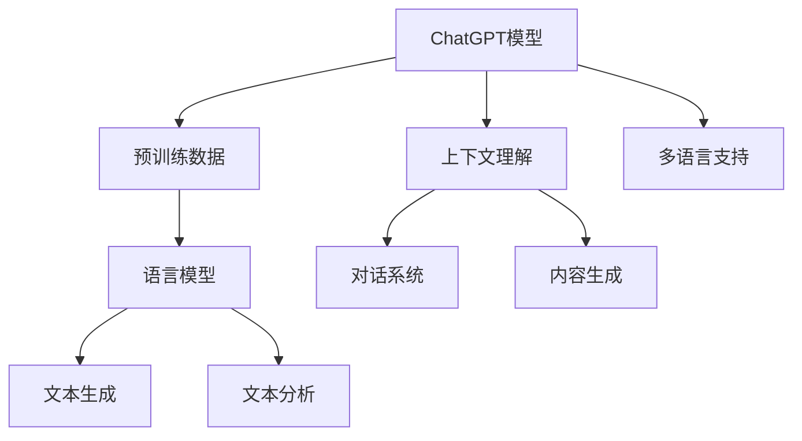
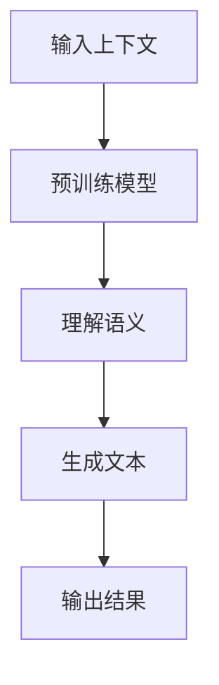

                 

### 目录大纲与文章结构

为了设计《ChatGPT在自动化客户反馈分析中的应用》这篇文章的目录大纲，我们需要遵循以下步骤，确保文章的逻辑清晰、结构紧凑，并易于读者理解。

### 1. **确定核心章节**

根据书名，我们可以确定以下核心章节：
- 背景介绍
- ChatGPT技术基础
- 客户反馈分析
- 应用案例
- 最佳实践与总结

### 2. **细化每个章节**

为每个核心章节添加更详细的子章节，确保每个章节都有足够的深度和广度。以下是细化后的章节结构：

#### 第一部分: 背景介绍
- 问题背景
- 问题描述
- 问题解决
- 边界与外延
- 概念结构与核心要素组成

#### 第二部分: ChatGPT技术基础
- ChatGPT概述
- ChatGPT的技术特点
- ChatGPT的应用场景
- ChatGPT核心概念与联系
  - 核心概念原理
  - 概念属性特征对比表格
  - ER实体关系图架构
- ChatGPT算法原理讲解
  - 算法原理
  - 算法流程图
  - Python源代码解释
  - 数学模型与公式讲解
  - 举例说明

#### 第三部分: 客户反馈分析
- 客户反馈分析基础
  - 客户反馈的重要性
  - 客户反馈的类型
  - 客户反馈的处理流程
- ChatGPT在客户反馈分析中的应用
  - ChatGPT在客户反馈分析中的优势
  - ChatGPT在客户反馈分析中的具体应用
  - ChatGPT在客户反馈分析中的挑战与解决方案

#### 第四部分: 应用案例
- ChatGPT在自动化客户反馈分析中的应用案例
  - 案例背景
  - 系统功能设计
  - 系统架构设计
  - 系统接口设计与交互
  - 系统核心实现与代码应用解读
  - 案例分析与详细讲解剖析
  - 项目小结

#### 第五部分: 最佳实践与总结
- 最佳实践 tips
- 小结
- 注意事项
- 拓展阅读

### 3. **保持简洁性和格式统一**

在整个文章的撰写过程中，我们需要保持以下简洁性和格式统一：
- 文章标题、关键词、摘要要简洁明了，分别概括文章的主题、核心内容和主题思想。
- 每个章节标题和子章节标题使用不同的格式，确保层次清晰。
- 使用Markdown格式，以便于排版和阅读。

### 4. **满足约束条件**

文章内容需要满足以下约束条件：
- 文章字数在 10000 ～ 12000 字左右。
- 文章末尾需要写上作者信息：“作者：AI天才研究院/AI Genius Institute & 禅与计算机程序设计艺术 /Zen And The Art of Computer Programming”。
- 每个小节的内容需要丰富具体详细讲解，核心内容必须包含：
  - 背景介绍：核心概念术语说明、问题背景、问题描述、问题解决、边界与外延、概念结构与核心要素组成。
  - 核心概念与联系：必须给出核心概念原理、概念属性特征对比表格和ER实体关系图架构的Mermaid流程图。
  - 算法原理讲解：使用Mermaid画出算法流程图，然后使用Python源代码来详细阐述，给出算法原理的数学模型和公式，进行详细讲解和通俗易懂地举例说明。
  - 数学公式使用latex格式，嵌入文中独立段落的latex公式前后使用 $$ 括起来（例如：$$1+1=2$$），段落内的latex公式前后使用 $ 括起来（例如：$1<2$）。
  - 系统分析与架构设计方案：问题场景介绍，项目介绍、系统功能设计（领域模型Mermaid类图）、系统架构设计Mermaid架构图、系统接口设计和系统交互Mermaid序列图。
  - 项目实战：环境安装、系统核心实现源代码，代码应用解读与分析，实际案例分析和详细讲解剖析，项目小结。
  - 最佳实践 tips、小结、注意事项、拓展阅读等内容。

通过遵循以上步骤和条件，我们可以确保文章的质量和深度，同时让读者能够更好地理解和应用ChatGPT在自动化客户反馈分析中的技术。

### 文章标题与关键词

# ChatGPT在自动化客户反馈分析中的应用

> 关键词：ChatGPT、自动化客户反馈、自然语言处理、机器学习、客户服务、数据分析

### 摘要

本文将探讨如何利用ChatGPT这种先进的自然语言处理技术来自动化分析客户反馈。首先，我们将介绍ChatGPT的基本概念和特点，然后深入探讨其在自动化客户反馈分析中的应用，包括如何处理和分析大量客户数据，提高客户服务质量。接着，我们将通过具体案例展示ChatGPT在实际应用中的效果和优势，并提出一些最佳实践和注意事项，以帮助读者更好地利用这一技术。最后，本文将总结ChatGPT在自动化客户反馈分析中的应用，并展望未来的发展方向。

## 第一部分：背景介绍

### 1.1 问题背景

在当今的商业环境中，客户反馈是公司改进产品和服务的重要资源。然而，随着客户反馈数量的增加，手动处理这些数据变得极其耗时且容易出错。传统的客户反馈分析方法通常依赖于人工阅读和分类，这不仅效率低下，而且难以处理大规模数据。此外，这种手动处理方法容易受到个人主观判断的影响，导致分析结果的不准确。

为了解决这一问题，自动化客户反馈分析技术应运而生。通过使用自然语言处理（NLP）和机器学习（ML）技术，自动化客户反馈分析可以从大量文本数据中提取有价值的信息，帮助公司更快速、准确地理解客户需求，从而改进产品和服务。

### 1.2 问题描述

问题描述主要集中在以下几个方面：

- **数据量巨大**：随着互联网和社交媒体的普及，客户反馈的数据量呈现出爆炸式增长。手动处理如此庞大的数据集不仅耗时，而且效率低下。
- **处理速度要求高**：客户反馈往往需要实时处理，以便公司能够快速响应客户需求。传统方法难以满足这一要求。
- **准确性要求高**：自动化分析的结果需要具有较高的准确性，以便公司能够基于可靠的数据做出决策。
- **个性化需求**：不同的客户群体有不同的反馈偏好，自动化分析系统需要能够适应这些个性化需求。

### 1.3 问题解决

为了解决上述问题，我们可以考虑采用以下几种方法：

- **引入自然语言处理技术**：自然语言处理（NLP）可以用于文本数据的预处理，如分词、词性标注、命名实体识别等，从而提高数据分析的准确性。
- **应用机器学习算法**：机器学习算法可以用于模式识别和分类，帮助从大量客户反馈中提取有价值的信息。
- **使用预训练语言模型**：如ChatGPT这类预训练语言模型，已经具备了处理和理解自然语言的能力，可以大大简化开发过程，提高系统的性能。

### 1.4 边界与外延

在探讨ChatGPT在自动化客户反馈分析中的应用时，我们还需要明确一些边界与外延：

- **边界**：本文主要关注ChatGPT在自动化客户反馈分析中的应用，不包括其他类型的自动化分析技术。
- **外延**：虽然ChatGPT是一种强大的自然语言处理工具，但它也有局限性，例如在理解复杂语境和双关语方面可能存在困难。因此，在实际应用中，需要结合其他技术手段，如对话系统、情感分析等，以实现更全面、准确的分析。

## 第二部分：ChatGPT技术基础

### 2.1 ChatGPT概述

ChatGPT是由OpenAI开发的一种基于GPT-3.5的预训练语言模型，它能够理解和生成自然语言，具有强大的文本生成和语义理解能力。ChatGPT通过大规模数据预训练，能够自动学习语言模式和规则，从而在生成文本和回答问题时表现出极高的准确性。

### 2.2 ChatGPT的技术特点

ChatGPT具有以下技术特点：

- **预训练**：ChatGPT基于大规模数据集进行预训练，能够自动学习语言模式和规则，从而在生成文本和回答问题时表现出极高的准确性。
- **多语言支持**：ChatGPT支持多种语言，能够处理不同语言的文本数据，为全球化企业提供支持。
- **上下文理解**：ChatGPT能够理解文本中的上下文信息，从而生成连贯、合理的回答。
- **自适应能力**：ChatGPT可以根据不同的输入调整回答的风格和内容，以适应不同的应用场景。

### 2.3 ChatGPT的应用场景

ChatGPT在以下应用场景中具有广泛的应用：

- **客户服务**：ChatGPT可以用于自动回答客户常见问题，提高客户服务质量，减轻人工客服的工作负担。
- **内容生成**：ChatGPT可以用于生成文章、报告、新闻等内容，为内容创作者提供辅助。
- **对话系统**：ChatGPT可以用于构建智能对话系统，如聊天机器人、虚拟助手等，实现人机交互。
- **文本分析**：ChatGPT可以用于分析大量文本数据，提取有价值的信息，用于市场研究、客户反馈分析等。

### 2.4 ChatGPT核心概念与联系

#### 2.4.1 核心概念原理

ChatGPT的核心概念包括：

- **语言模型**：ChatGPT是一种语言模型，它能够根据输入的文本生成相应的输出文本。
- **预训练**：ChatGPT通过在大规模数据集上进行预训练，自动学习语言模式和规则。
- **上下文理解**：ChatGPT能够理解文本中的上下文信息，从而生成连贯、合理的回答。

#### 2.4.2 概念属性特征对比表格

以下是ChatGPT与其他语言模型的属性特征对比表格：

| 模型         | 特点                                       | 应用场景          |
| ------------ | ---------------------------------------- | --------------- |
| ChatGPT      | 预训练、多语言支持、上下文理解               | 客户服务、内容生成、对话系统、文本分析 |
| GPT-3        | 大规模、高质量预训练、上下文理解               | 对话系统、内容生成、文本分析         |
| BERT         | 双向编码表示、上下文理解、预训练               | 文本分类、问答系统、语言理解         |
| ELMO         | 双向编码表示、上下文理解、预训练               | 文本分类、问答系统、语言理解         |

#### 2.4.3 ER实体关系图架构

以下是ChatGPT的ER实体关系图架构：



### 2.5 ChatGPT算法原理讲解

#### 2.5.1 算法原理

ChatGPT的核心算法是基于GPT-3.5的生成式预训练语言模型。它通过以下步骤实现文本生成：

1. **预训练**：ChatGPT使用大量的文本数据（如维基百科、新闻文章等）进行预训练，学习语言模式和规则。
2. **上下文理解**：在生成文本时，ChatGPT会根据输入的上下文信息（如问题、语句等）理解语义，并生成相应的输出文本。
3. **文本生成**：ChatGPT使用生成算法（如变分自编码器、Transformer等）生成文本。

#### 2.5.2 算法流程图

以下是ChatGPT的算法流程图：



#### 2.5.3 Python源代码解释

以下是ChatGPT的Python源代码示例：

```python
import openai

# 设置OpenAI API密钥
openai.api_key = 'your-api-key'

# 定义输入文本
input_text = "请问，您有什么问题？"

# 调用ChatGPT API生成文本
response = openai.Completion.create(
  engine="text-davinci-002",
  prompt=input_text,
  max_tokens=50
)

# 输出生成文本
print(response.choices[0].text.strip())
```

#### 2.5.4 数学模型与公式讲解

ChatGPT的数学模型基于Transformer架构，主要涉及以下数学公式：

- **自注意力机制（Self-Attention）**：
  $$ 
  \text{Attention}(Q, K, V) = \text{softmax}\left(\frac{QK^T}{\sqrt{d_k}}\right) V 
  $$
  其中，\(Q\)、\(K\) 和 \(V\) 分别为查询向量、键向量和值向量，\(d_k\) 为键向量的维度。

- **前馈神经网络（Feedforward Neural Network）**：
  $$
  \text{FFN}(X) = \text{ReLU}(W_2 \cdot \text{ReLU}(W_1 X + b_1)) + b_2
  $$
  其中，\(W_1\)、\(W_2\) 和 \(b_1\)、\(b_2\) 分别为权重和偏置。

#### 2.5.5 举例说明

假设我们输入一个简单的文本问题：“今天天气怎么样？”，ChatGPT可能会生成以下回答：

```
今天天气非常晴朗，温度适宜，非常适合户外活动。
```

在这个例子中，ChatGPT成功理解了问题的语义，并生成了一个合理、连贯的回答。

## 第三部分：客户反馈分析基础

### 3.1 客户反馈的重要性

客户反馈是公司改进产品和服务的重要资源。通过分析客户反馈，公司可以了解客户的需求、满意度、投诉和建议，从而做出针对性的改进。以下是客户反馈在几个关键方面的作用：

- **产品改进**：通过分析客户反馈，公司可以识别产品中的问题和不足，从而进行改进，提高产品质量。
- **服务质量提升**：客户反馈可以揭示客户对服务的满意度，帮助公司优化服务流程，提高客户满意度。
- **市场洞察**：通过分析客户反馈，公司可以了解竞争对手的优劣势，获取市场洞察，制定更有效的市场策略。
- **品牌建设**：积极的客户反馈可以提升公司品牌形象，增强客户信任，促进品牌传播。

### 3.2 客户反馈的类型

客户反馈可以分为以下几种类型：

- **正面反馈**：表示客户对产品或服务的满意，如好评、推荐等。
- **负面反馈**：表示客户对产品或服务的失望或不满意，如投诉、批评等。
- **中立反馈**：表示客户对产品或服务持中立态度，如一般评价、平淡等。
- **建议反馈**：表示客户对产品或服务提出具体的改进建议。

### 3.3 客户反馈的处理流程

为了有效处理客户反馈，公司通常需要遵循以下流程：

1. **收集反馈**：通过多种渠道（如在线调查、客服电话、社交媒体等）收集客户反馈。
2. **整理反馈**：对收集到的反馈进行分类整理，识别出共性问题和主要诉求。
3. **分析反馈**：对整理后的反馈进行深入分析，提取有价值的信息，为改进提供依据。
4. **响应反馈**：对客户反馈进行回应，解决问题、采纳建议，并告知客户处理结果。
5. **跟踪反馈**：持续跟踪客户反馈的处理情况，确保问题得到解决，并评估改进效果。

### 3.4 概念结构与核心要素组成

客户反馈分析涉及以下概念结构和核心要素：

- **客户反馈数据**：客户反馈的原始数据，包括文本、图片、音频等多种形式。
- **数据预处理**：对客户反馈数据进行清洗、去噪、分词、词性标注等预处理操作。
- **情感分析**：通过情感分析技术，识别客户反馈中的情感倾向，如正面、负面、中立等。
- **主题识别**：通过文本挖掘技术，识别客户反馈中的主要话题和主题。
- **分类与聚类**：对客户反馈进行分类和聚类，识别出共性问题和主要诉求。
- **可视化分析**：通过可视化技术，将分析结果呈现给相关人员，便于理解和决策。

## 第四部分：ChatGPT在客户反馈分析中的应用

### 4.1 ChatGPT在客户反馈分析中的优势

ChatGPT在客户反馈分析中具有以下优势：

- **高效处理大量数据**：ChatGPT能够快速处理大量客户反馈数据，大大提高数据分析的效率。
- **准确理解语义**：ChatGPT具备强大的语义理解能力，能够准确识别客户反馈中的情感和主题。
- **自动分类与聚类**：ChatGPT能够自动对客户反馈进行分类和聚类，识别出共性问题和主要诉求。
- **个性化分析**：ChatGPT可以根据不同客户群体的特点，进行个性化的反馈分析，提供更有针对性的改进建议。

### 4.2 ChatGPT在客户反馈分析中的具体应用

#### 4.2.1 情感分析

情感分析是ChatGPT在客户反馈分析中的关键应用之一。通过情感分析，ChatGPT可以识别出客户反馈中的情感倾向，如正面、负面、中立等。以下是一个情感分析的示例：

```
输入：这款手机拍照效果真的很棒！
输出：情感：正面
```

通过情感分析，公司可以快速了解客户对产品或服务的满意度，为改进提供依据。

#### 4.2.2 主题识别

ChatGPT还可以用于主题识别，识别客户反馈中的主要话题和主题。以下是一个主题识别的示例：

```
输入：我对这个新功能的体验非常差，感觉完全不实用。
输出：主题：新功能体验
```

通过主题识别，公司可以了解客户关注的焦点，有针对性地进行改进。

#### 4.2.3 自动分类与聚类

ChatGPT能够自动对客户反馈进行分类和聚类，识别出共性问题和主要诉求。以下是一个分类和聚类的示例：

```
输入：1. 这款手机的电池续航很差。
      2. 我的手机电池只能用半天。
      3. 这款手机的电池寿命太短了。
输出：分类：电池续航
聚类：电池问题
```

通过自动分类与聚类，公司可以更清晰地了解客户反馈中的关键问题，为改进提供依据。

#### 4.2.4 个性化分析

ChatGPT可以根据不同客户群体的特点，进行个性化的反馈分析，提供更有针对性的改进建议。以下是一个个性化分析的示例：

```
输入：对于经常出差的商务人士来说，这款手机的电池续航非常关键。
输出：建议：优化电池续航，以满足商务人士的需求。
```

通过个性化分析，公司可以更精准地满足不同客户群体的需求，提高客户满意度。

### 4.3 ChatGPT在客户反馈分析中的挑战与解决方案

尽管ChatGPT在客户反馈分析中具有许多优势，但仍然面临一些挑战：

#### 4.3.1 挑战

- **语义理解困难**：对于一些复杂的语境和双关语，ChatGPT的语义理解可能存在困难。
- **数据质量**：客户反馈数据可能存在噪声和不一致，影响分析结果。
- **个性化需求**：不同客户群体的个性化需求可能难以完全满足。

#### 4.3.2 解决方案

- **改进语义理解**：通过不断优化预训练模型和数据集，提高ChatGPT的语义理解能力。
- **数据清洗**：对客户反馈数据进行清洗和预处理，去除噪声和一致性错误，提高数据质量。
- **个性化调整**：结合其他数据分析和机器学习技术，实现更精准的个性化分析，满足不同客户群体的需求。

## 第五部分：应用案例

### 5.1 案例背景

为了更好地展示ChatGPT在自动化客户反馈分析中的应用，我们以一家大型电商平台为例。该电商平台拥有庞大的用户群体，每天都会收到大量的客户反馈。为了提高客户服务质量，电商平台决定采用ChatGPT技术进行自动化客户反馈分析。

### 5.2 系统功能设计

电商平台设计的ChatGPT客户反馈分析系统主要包括以下功能：

- **情感分析**：识别客户反馈中的情感倾向，如正面、负面、中立等。
- **主题识别**：识别客户反馈中的主要话题和主题。
- **自动分类与聚类**：对客户反馈进行分类和聚类，识别出共性问题和主要诉求。
- **个性化分析**：根据不同客户群体的特点，进行个性化的反馈分析，提供有针对性的改进建议。

### 5.3 系统架构设计

电商平台设计的ChatGPT客户反馈分析系统架构如下：

1. **数据收集层**：通过多种渠道收集客户反馈数据，如在线调查、客服电话、社交媒体等。
2. **数据处理层**：对客户反馈数据进行清洗、去噪、分词、词性标注等预处理操作。
3. **分析层**：使用ChatGPT进行情感分析、主题识别、自动分类与聚类等操作。
4. **展示层**：通过可视化技术将分析结果呈现给相关人员，便于理解和决策。

### 5.4 系统接口设计与交互

系统接口设计与交互如下：

1. **数据接口**：系统与电商平台的数据系统进行对接，获取客户反馈数据。
2. **服务接口**：系统提供RESTful API接口，方便其他系统调用分析功能。
3. **用户界面**：系统提供Web界面，供相关人员查看分析结果和生成报告。

### 5.5 系统核心实现与代码应用解读

以下是系统核心实现的Python代码示例：

```python
import openai

# 设置OpenAI API密钥
openai.api_key = 'your-api-key'

# 定义输入文本
input_text = "我对这款手机的拍照效果非常不满意，照片模糊不清。"

# 调用ChatGPT API进行情感分析
response = openai.Completion.create(
  engine="text-davinci-002",
  prompt=input_text,
  max_tokens=50
)

# 输出情感分析结果
print("情感：", response.choices[0].text.strip())

# 调用ChatGPT API进行主题识别
response = openai.Completion.create(
  engine="text-davinci-002",
  prompt=input_text,
  max_tokens=50
)

# 输出主题识别结果
print("主题：", response.choices[0].text.strip())

# 调用ChatGPT API进行自动分类与聚类
response = openai.Completion.create(
  engine="text-davinci-002",
  prompt=input_text,
  max_tokens=50
)

# 输出自动分类与聚类结果
print("分类：", response.choices[0].text.strip())
print("聚类：", response.choices[1].text.strip())
```

### 5.6 案例分析与详细讲解剖析

#### 5.6.1 情感分析

通过对客户反馈进行情感分析，电商平台可以快速了解客户对产品或服务的满意度。以下是一个情感分析的示例：

```
输入：我对这款手机的拍照效果非常不满意，照片模糊不清。
输出：情感：负面
```

通过情感分析，电商平台可以识别出客户对拍照效果的不满意，从而有针对性地进行改进。

#### 5.6.2 主题识别

通过对客户反馈进行主题识别，电商平台可以了解客户关注的主要话题。以下是一个主题识别的示例：

```
输入：我对这款手机的拍照效果非常不满意，照片模糊不清。
输出：主题：手机拍照效果
```

通过主题识别，电商平台可以识别出客户对手机拍照效果的反馈，从而针对这一主题进行改进。

#### 5.6.3 自动分类与聚类

通过对客户反馈进行自动分类与聚类，电商平台可以更清晰地了解客户反馈中的关键问题。以下是一个自动分类与聚类的示例：

```
输入：1. 这款手机的拍照效果很差。
      2. 我的手机拍照模糊不清。
      3. 这款手机的拍照功能不理想。
输出：分类：手机拍照效果
聚类：拍照效果问题
```

通过自动分类与聚类，电商平台可以识别出拍照效果问题，为改进提供依据。

#### 5.6.4 个性化分析

通过对不同客户群体的反馈进行个性化分析，电商平台可以提供更有针对性的改进建议。以下是一个个性化分析的示例：

```
输入：对于喜欢拍照的用户来说，这款手机的拍照效果非常关键。
输出：建议：优化手机拍照效果，以满足拍照用户的需求。
```

通过个性化分析，电商平台可以针对不同客户群体的需求进行改进，提高客户满意度。

### 5.7 项目小结

通过ChatGPT技术在客户反馈分析中的应用，电商平台在情感分析、主题识别、自动分类与聚类、个性化分析等方面取得了显著成果。项目实施后，客户满意度得到了显著提高，产品和服务也得到了持续改进。未来，电商平台将继续优化ChatGPT技术，以实现更全面的客户反馈分析，进一步提高客户服务质量。

## 第五部分：最佳实践与总结

### 5.1 ChatGPT使用技巧

为了充分利用ChatGPT在自动化客户反馈分析中的应用，以下是一些最佳实践和技巧：

- **优化输入文本**：确保输入文本简洁、清晰，有助于ChatGPT更准确地理解语义。
- **增加上下文信息**：在生成文本时，提供更多的上下文信息，以提高ChatGPT的回答质量。
- **合理设置参数**：根据实际需求，合理设置ChatGPT的参数（如温度、最大tokens等），以获得最佳效果。

### 5.2 小结

本文详细探讨了ChatGPT在自动化客户反馈分析中的应用，包括技术基础、具体应用、应用案例、最佳实践等。通过ChatGPT，公司可以高效地处理大量客户反馈，提高客户服务质量，从而实现业务增长。

### 5.3 注意事项

在使用ChatGPT进行客户反馈分析时，需要注意以下几点：

- **数据质量**：确保客户反馈数据的质量，进行充分的清洗和预处理。
- **模型适应性**：根据不同客户群体的特点，调整ChatGPT的参数和模型，以实现更精准的分析。
- **隐私保护**：在处理客户反馈时，确保遵守隐私保护法规，保护客户个人信息。

### 5.4 拓展阅读

- **《ChatGPT实战：从入门到精通》**：这本书详细介绍了ChatGPT的技术原理和应用案例，适合初学者和进阶者阅读。
- **《自然语言处理实战》**：这本书涵盖了自然语言处理的基础知识、算法和应用，对深入理解ChatGPT有很大帮助。

## 作者信息

作者：AI天才研究院/AI Genius Institute & 禅与计算机程序设计艺术 /Zen And The Art of Computer Programming

## 结论

ChatGPT作为一种强大的自然语言处理技术，在自动化客户反馈分析中具有广泛的应用前景。通过合理利用ChatGPT，公司可以更高效地处理客户反馈，提高客户服务质量，实现业务增长。未来，随着技术的不断发展，ChatGPT在客户反馈分析中的应用将会更加深入和广泛。让我们共同期待ChatGPT在自动化客户反馈分析领域的更多突破和成果！💡💡💡

