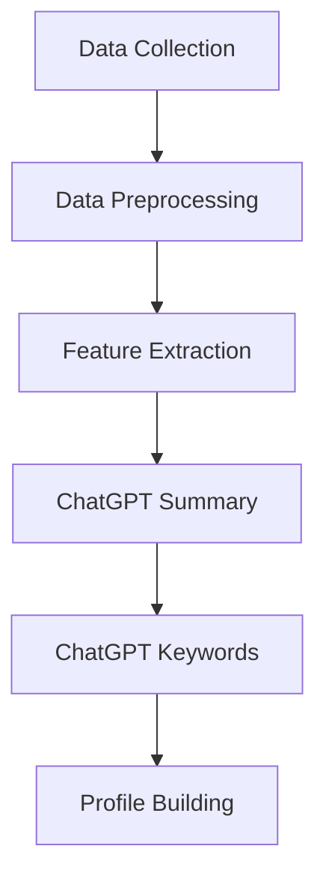
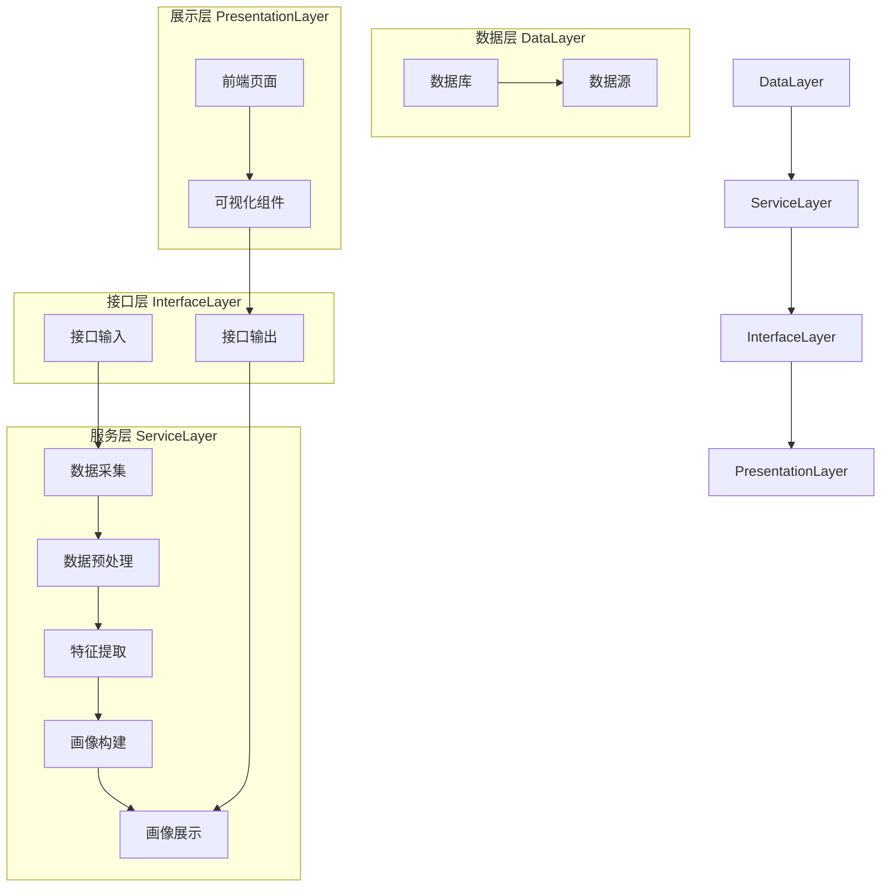
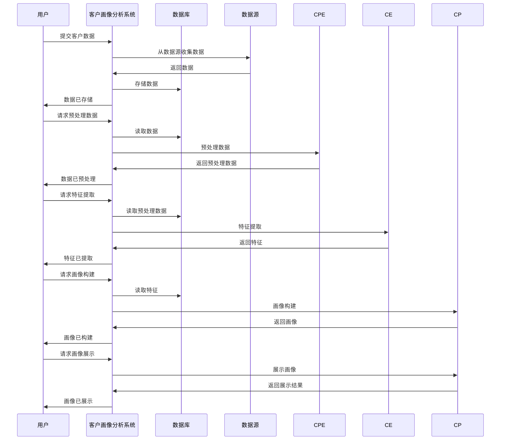

                 

### 第一步：背景介绍

#### 1.1.1 问题背景与核心概念

在现代商业环境中，了解客户的需求和行为模式是至关重要的，这有助于企业制定更加精准的市场营销策略，提高客户满意度和忠诚度。然而，随着数据量的激增和互联网的普及，传统的客户画像分析方式已经难以满足企业的需求。自动化客户画像分析技术应运而生，它通过先进的数据分析技术和机器学习算法，能够快速、高效地处理大量客户数据，构建准确的客户画像。

**核心概念术语说明**：

- **客户画像**：指通过对客户数据进行综合分析和处理，提取出客户的特征和需求，形成的一种数字化的客户模型。
- **自动化客户画像分析**：指利用机器学习和自然语言处理等技术，对客户数据进行分析和处理，自动生成客户画像的过程。

**问题背景**：

随着互联网和大数据技术的发展，企业积累了大量的客户数据。这些数据包括客户的购买历史、浏览行为、社交媒体活动等。如何有效地利用这些数据，提取出有价值的客户信息，成为企业面临的重要问题。自动化客户画像分析技术能够帮助企业快速、准确地处理海量客户数据，提高数据分析的效率和准确性。

**问题描述**：

如何有效地使用ChatGPT来分析客户数据，构建准确的客户画像。ChatGPT作为一种基于GPT-3模型的先进自然语言处理技术，具有强大的文本生成和理解能力。将其应用于客户画像分析，有望实现客户数据的高效处理和精准分析。

**问题解决**：

通过结合ChatGPT的强大自然语言处理能力和自动化数据分析技术，可以实现高效、准确的客户画像分析。具体来说，ChatGPT可以用于以下几个方面：

1. **数据预处理**：利用ChatGPT对客户数据进行文本生成和摘要，提取关键信息。
2. **特征提取**：利用ChatGPT对客户数据进行情感分析和主题建模，提取有价值的特征。
3. **画像构建**：利用ChatGPT对提取的特征进行综合分析，构建客户画像。

**边界与外延**：

本书主要关注ChatGPT在自动化客户画像分析中的应用，但并不涉及其他AI技术在客户画像分析中的应用。同时，本书的核心概念和原理也适用于其他类似的客户画像分析场景。

**概念结构与核心要素组成**：

ChatGPT在自动化客户画像分析中的应用主要包括以下几个核心要素：

1. **客户数据**：包括客户的购买历史、浏览行为、社交媒体活动等。
2. **画像分析模型**：包括数据预处理、特征提取和画像构建等模型。
3. **算法**：包括文本生成、情感分析、主题建模等算法。
4. **数据分析工具**：包括Python、TensorFlow等工具。

#### 1.1.2 ChatGPT的基本概念与特点

**ChatGPT** 是基于 OpenAI 开发的 GPT-3 模型的一种自然语言处理技术。GPT-3 是一种基于 Transformer 网络的预训练语言模型，具有强大的文本生成和理解能力。ChatGPT 则是在 GPT-3 的基础上，加入了一些交互功能，使其能够与用户进行对话。

**ChatGPT 的特点**：

1. **强大的文本生成能力**：ChatGPT 能够根据输入的文本生成连贯、有逻辑的文本，适用于自动写作、自动摘要、问答系统等场景。
2. **优秀的文本理解能力**：ChatGPT 能够理解文本中的语义和逻辑关系，适用于文本分类、情感分析、实体识别等场景。
3. **灵活的交互方式**：ChatGPT 可以通过命令行、Web 应用程序、API 等方式与用户进行交互，适用于各种不同的应用场景。

**ChatGPT 的应用场景**：

1. **自动写作**：ChatGPT 可以用于自动生成新闻文章、博客文章、产品描述等文本。
2. **自动摘要**：ChatGPT 可以用于自动生成文本的摘要，适用于长文本阅读和分析。
3. **问答系统**：ChatGPT 可以用于构建智能客服系统、问答机器人等，为用户提供实时、准确的回答。
4. **客户画像分析**：ChatGPT 可以用于分析客户数据，提取有价值的信息，构建准确的客户画像。

#### 1.1.3 书籍结构与内容概述

本书旨在系统地介绍 ChatGPT 在自动化客户画像分析中的应用，包括背景介绍、核心概念与联系、算法原理讲解、系统分析与架构设计方案、项目实战等内容。具体内容如下：

1. **背景介绍**：介绍自动化客户画像分析的需求与挑战，以及 ChatGPT 的基本概念与特点。
2. **核心概念与联系**：详细阐述 ChatGPT 和自动化客户画像分析的核心概念，包括它们的工作原理、特点和应用。
3. **算法原理讲解**：使用 mermaid 绘制算法流程图，然后使用 Python 源代码和数学模型详细讲解 ChatGPT 在自动化客户画像分析中的应用。
4. **系统分析与架构设计方案**：介绍一个典型的系统架构，包括系统功能设计、系统架构设计和系统接口设计。
5. **项目实战**：提供一个实际的项目案例，包括环境安装、系统核心实现源代码和代码应用解读与分析。
6. **最佳实践 tips、小结、注意事项、拓展阅读**：提供一些实际操作中的建议和技巧，总结本书的主要内容和关键知识点，提醒读者在应用过程中需要注意的问题，并推荐一些相关的书籍、论文和资源。

通过本书的阅读，读者将能够深入了解 ChatGPT 在自动化客户画像分析中的应用，掌握相关技术和方法，为企业提供有效的解决方案。

---

### 第二步：核心概念与联系

#### 2.1 ChatGPT的工作原理与能力

ChatGPT 是基于 GPT-3 模型开发的，而 GPT-3 是一种基于 Transformer 网络的预训练语言模型。Transformer 模型是一种基于自注意力机制的序列到序列模型，具有处理长序列数据和并行计算的优势。GPT-3 通过大量的文本数据进行预训练，从而学习到语言的结构和语义，使其在文本生成和理解方面表现出色。

**GPT-3 模型的架构**：

GPT-3 模型由多个 Transformer 块堆叠而成，每个 Transformer 块包含多个自注意力层和前馈网络。自注意力层通过计算输入序列中每个词与其他词之间的关联性，从而实现词语之间的上下文关联。前馈网络则对自注意力层的结果进行进一步处理，以增强模型的表达能力。

**ChatGPT 的能力**：

ChatGPT 具有以下几个关键能力：

1. **文本生成**：ChatGPT 能够根据给定的提示生成连贯、有逻辑的文本，适用于自动写作、自动摘要、问答系统等场景。
2. **文本理解**：ChatGPT 能够理解文本中的语义和逻辑关系，适用于文本分类、情感分析、实体识别等场景。
3. **交互**：ChatGPT 能够通过命令行、Web 应用程序、API 等方式与用户进行交互，实现人机对话。

#### 2.2 自动化客户画像分析的基本流程

自动化客户画像分析的基本流程主要包括以下几个环节：

1. **数据采集**：收集与客户相关的数据，包括购买历史、浏览行为、社交媒体活动等。
2. **数据预处理**：对收集到的数据进行清洗、去重和格式转换等处理，以便于后续的分析。
3. **特征提取**：从预处理后的数据中提取有用的特征，如客户的消费金额、购买频率、兴趣爱好等。
4. **模型训练**：利用提取的特征训练机器学习模型，如决策树、随机森林、支持向量机等。
5. **画像构建**：利用训练好的模型对客户数据进行分析，构建客户画像。

#### 2.3 ChatGPT 在自动化客户画像分析中的应用

ChatGPT 可以在自动化客户画像分析中发挥重要作用，主要体现在以下几个方面：

1. **数据预处理**：利用 ChatGPT 的文本生成能力，对原始客户数据进行摘要和归纳，提取关键信息。
2. **特征提取**：利用 ChatGPT 的文本理解能力，对客户数据进行情感分析和主题建模，提取有价值的特征。
3. **画像构建**：利用 ChatGPT 的文本生成能力，对提取的特征进行综合分析，构建客户画像。

**应用案例**：

例如，在一个电商平台中，可以利用 ChatGPT 对客户的购买评论进行摘要和归纳，提取出评论的关键词和情感倾向。然后，利用这些关键词和情感倾向，构建客户的个性化画像，从而为电商平台提供更精准的推荐和服务。

#### 2.4 概念属性特征对比表格

为了更好地理解 ChatGPT 和自动化客户画像分析的相关概念，我们可以通过一个概念属性特征对比表格来展示它们的特点和区别。

| 概念          | 属性特征                   | 应用场景                 |
| ------------- | -------------------------- | ------------------------ |
| ChatGPT       | 文本生成、文本理解、交互   | 自动写作、自动摘要、问答 |
| 自动化客户画像 | 数据采集、数据预处理、特征提取、画像构建 | 客户分析、个性化推荐、营销策略 |
| 数据采集      | 收集客户数据               | 购买历史、浏览行为、社交媒体活动 |
| 数据预处理     | 清洗、去重、格式转换       | 数据清洗、数据整合       |
| 特征提取      | 提取有用特征               | 情感分析、主题建模       |
| 模型训练      | 训练机器学习模型           | 决策树、随机森林、支持向量机 |
| 画像构建      | 构建客户画像               | 客户分析、个性化推荐       |

#### 2.5 ER 实体关系图架构

为了更清晰地展示 ChatGPT 和自动化客户画像分析之间的关联，我们可以使用 Mermaid 语法绘制一个 ER 实体关系图。

```mermaid
erDiagram
    CustomerData -->|extracts| Feature
    CustomerData -->|analyzes| Profile
    ChatGPT -->|generates| Summary
    ChatGPT -->|extracts| Keywords
    Feature -->|builds| Profile
```

在这个 ER 实体关系图中，`CustomerData` 表示客户数据，它通过提取特征和构建画像与 `Feature` 和 `Profile` 相关联。`ChatGPT` 则通过生成摘要和提取关键词与 `CustomerData` 相关联，进一步影响 `Feature` 的提取和 `Profile` 的构建。

---

### 第三步：算法原理讲解

#### 3.1 算法流程图

为了更好地理解 ChatGPT 在自动化客户画像分析中的应用，我们可以使用 Mermaid 语法绘制一个算法流程图，展示从数据采集到画像构建的全过程。



在这个算法流程图中，首先进行数据采集（A），然后对采集到的数据进行预处理（B），接着提取特征（C）。然后，利用 ChatGPT 对数据生成摘要（D）和提取关键词（E），最后基于这些摘要和关键词构建客户画像（F）。

#### 3.2 Python 源代码示例

下面提供一个简单的 Python 示例，展示如何使用 ChatGPT 进行客户数据分析和画像构建。

```python
import openai
from textblob import TextBlob

# 设置 OpenAI API 密钥
openai.api_key = "your_api_key"

# 客户评论数据
customer_reviews = [
    "这个产品的质量非常好，我很满意。",
    "我不喜欢这个产品的颜色，看起来很丑。",
    "这个价格太贵了，我不打算购买。",
    "这个产品的设计非常新颖，我很喜欢。"
]

# 对客户评论进行摘要生成
for review in customer_reviews:
    response = openai.Completion.create(
        engine="text-davinci-002",
        prompt=f"请对以下评论进行摘要：{review}",
        max_tokens=50
    )
    print(f"评论：{review}\n摘要：{response.choices[0].text}\n")

# 对客户评论进行关键词提取
for review in customer_reviews:
    blob = TextBlob(review)
    print(f"评论：{review}\n关键词：{blob.noun_phrases}\n")
```

在这个示例中，我们首先设置了 OpenAI API 密钥，然后定义了一组客户评论数据。接着，我们使用 ChatGPT 对每个评论生成摘要，并使用 TextBlob 对每个评论提取关键词。这些摘要和关键词将用于构建客户画像。

#### 3.3 算法原理讲解

ChatGPT 在自动化客户画像分析中的应用主要基于其强大的文本生成和自然语言理解能力。以下是 ChatGPT 在自动化客户画像分析中的算法原理讲解：

1. **数据预处理**：数据预处理是自动化客户画像分析的重要步骤，其目的是将原始数据转换为适合分析的形式。ChatGPT 可以用于对客户评论进行摘要生成，提取关键信息。通过摘要生成，可以简化大量文本数据，使其更易于分析和理解。

2. **特征提取**：特征提取是自动化客户画像分析的核心步骤，其目的是从客户数据中提取出有价值的特征。ChatGPT 可以用于提取关键词，这些关键词反映了客户的兴趣、情感和需求。通过关键词提取，可以更好地了解客户的特点和行为。

3. **画像构建**：画像构建是将提取的特征综合起来，形成一个完整的客户画像。ChatGPT 可以用于对提取的特征进行综合分析，生成客户画像。通过画像构建，可以为企业提供更精准的客户洞察，从而制定更有效的营销策略。

以下是 ChatGPT 在自动化客户画像分析中的数学模型讲解：

1. **摘要生成**：摘要生成是基于生成式对抗网络（GAN）的算法，其目标是生成一个简短、连贯的摘要。数学上，可以表示为：

   $$\text{摘要} = \text{GAN}(\text{评论}, \text{摘要长度})$$

   其中，GAN 表示生成式对抗网络，评论表示输入的文本数据，摘要长度表示摘要的长度。

2. **关键词提取**：关键词提取是基于词袋模型的算法，其目标是提取文本中的主要关键词。数学上，可以表示为：

   $$\text{关键词} = \text{WordBag}(\text{评论}, \text{关键词数量})$$

   其中，WordBag 表示词袋模型，评论表示输入的文本数据，关键词数量表示提取的关键词数量。

3. **画像构建**：画像构建是基于聚类算法的算法，其目标是根据提取的特征将客户分为不同的类别。数学上，可以表示为：

   $$\text{画像} = \text{Cluster}(\text{特征}, \text{聚类算法})$$

   其中，Cluster 表示聚类算法，特征表示提取的特征数据，聚类算法表示使用的聚类算法。

#### 3.4 通俗易懂的举例说明

为了更好地理解 ChatGPT 在自动化客户画像分析中的应用，我们可以通过以下例子进行说明：

假设有一个电商平台的客户评论数据，其中包含客户的购买历史、浏览行为和评论内容。我们希望利用 ChatGPT 对这些数据进行处理，构建客户画像。

1. **数据预处理**：

   - 客户评论：“这个产品的质量非常好，我很满意。”
   - ChatGPT 摘要生成：“客户对产品质量表示满意。”

   通过摘要生成，我们可以将大量的文本数据简化为一个简洁的描述，便于后续分析。

2. **特征提取**：

   - 客户评论：“我不喜欢这个产品的颜色，看起来很丑。”
   - ChatGPT 关键词提取：“颜色、丑”

   通过关键词提取，我们可以提取出评论中的主要关键词，这些关键词反映了客户的情感和需求。

3. **画像构建**：

   - 客户画像：“购买满意度高，但对产品颜色有特殊需求。”

   通过综合分析摘要和关键词，我们可以构建出一个完整的客户画像，为电商平台提供更精准的推荐和服务。

---

### 第四步：系统分析与架构设计方案

#### 4.1 问题场景介绍

在当前的商业环境中，客户画像分析已经成为企业提升竞争力的重要手段。然而，传统的客户画像分析方式往往需要大量的手工操作，且难以应对海量数据的处理需求。因此，我们需要一种自动化、高效且准确的客户画像分析系统，以帮助企业更好地了解客户需求，优化市场营销策略。

#### 4.2 项目介绍

本项目的目标是设计并实现一个基于 ChatGPT 的自动化客户画像分析系统，该系统将利用 ChatGPT 的强大自然语言处理能力，对客户的购买历史、浏览行为和评论内容进行深入分析，构建出准确的客户画像。系统的主要功能包括数据采集、数据预处理、特征提取、画像构建和画像展示等。

#### 4.3 系统功能设计

系统功能设计是系统架构设计的重要部分，它定义了系统的核心功能模块及其相互关系。以下是本系统的主要功能模块：

1. **数据采集模块**：负责从不同的数据源（如电商平台数据库、社交媒体平台等）收集客户数据。
2. **数据预处理模块**：负责对收集到的客户数据进行清洗、去重和格式转换等预处理操作。
3. **特征提取模块**：利用 ChatGPT 对预处理后的数据进行情感分析、主题建模等操作，提取出有价值的特征。
4. **画像构建模块**：根据提取的特征，利用聚类算法等构建出客户的个性化画像。
5. **画像展示模块**：负责将构建好的客户画像以可视化形式展示给用户。

为了更好地展示系统功能模块之间的关系，我们可以使用 Mermaid 语法绘制一个领域模型类图。

```mermaid
classDiagram
    CustomerData <-|collects| DataCollector
    CustomerData -->|processes| DataPreprocessor
    CustomerData -->|extracts| FeatureExtractor
    CustomerData -->|builds| ProfileBuilder
    DataPreprocessor -->|preprocesses| CustomerData
    FeatureExtractor -->|extracts| CustomerData
    ProfileBuilder -->|builds| CustomerData
```

在这个类图中，`CustomerData` 表示客户数据，`DataCollector` 表示数据采集模块，`DataPreprocessor` 表示数据预处理模块，`FeatureExtractor` 表示特征提取模块，`ProfileBuilder` 表示画像构建模块。它们之间通过不同的操作关系相互关联。

#### 4.4 系统架构设计

系统架构设计是系统设计的核心部分，它定义了系统的整体结构和模块之间的关系。以下是本系统的架构设计：

1. **数据层**：包括数据源和数据库，负责存储和管理客户数据。
2. **服务层**：包括数据采集、数据预处理、特征提取、画像构建和画像展示等模块，负责实现系统的具体功能。
3. **接口层**：提供与外部系统（如电商平台、社交媒体平台等）的接口，负责数据的输入输出。
4. **展示层**：包括前端页面和可视化组件，负责将构建好的客户画像以可视化形式展示给用户。

为了更好地展示系统架构设计，我们可以使用 Mermaid 语法绘制一个系统架构图。



在这个架构图中，数据层包含数据库和数据源，服务层包含数据采集、数据预处理、特征提取、画像构建和画像展示等模块，接口层负责与外部系统的接口，展示层负责将客户画像以可视化形式展示给用户。

#### 4.5 系统接口设计

系统接口设计是系统架构设计的重要组成部分，它定义了系统与其他系统或组件的交互接口。以下是本系统的主要接口设计：

1. **数据采集接口**：负责从数据源（如电商平台数据库、社交媒体平台等）收集客户数据。
2. **数据预处理接口**：负责接收和传递预处理后的客户数据。
3. **特征提取接口**：负责接收预处理后的客户数据，并返回提取的特征。
4. **画像构建接口**：负责接收提取的特征，并返回构建好的客户画像。
5. **画像展示接口**：负责接收构建好的客户画像，并返回可视化展示结果。

为了更好地展示系统接口设计，我们可以使用 Mermaid 语法绘制一个系统接口设计图。



在这个序列图中，用户通过客户画像分析系统与数据库和数据源进行交互，实现了数据采集、预处理、特征提取、画像构建和画像展示的全过程。

---

### 第五步：项目实战

#### 5.1 环境安装

要实现 ChatGPT 在自动化客户画像分析中的应用，首先需要安装和配置相关的环境和工具。以下是在 Linux 系统下进行环境安装的步骤：

1. **安装 Python**：

   Python 是实现自动化客户画像分析的关键工具。在 Linux 系统中，可以通过以下命令安装 Python：

   ```bash
   sudo apt update
   sudo apt install python3
   ```

2. **安装 OpenAI Python SDK**：

   OpenAI Python SDK 是用于与 OpenAI API 交互的 Python 库。可以通过以下命令安装：

   ```bash
   pip3 install openai
   ```

3. **安装 mermaid**：

   mermaid 是用于绘制流程图的工具。可以通过以下命令安装：

   ```bash
   npm install -g mermaid
   ```

4. **安装其他依赖**：

   此外，还需要安装一些其他依赖，如 NumPy、Pandas、Scikit-learn 等。可以通过以下命令安装：

   ```bash
   pip3 install numpy pandas scikit-learn
   ```

#### 5.2 系统核心实现源代码

以下是一个简单的系统实现，展示了如何使用 ChatGPT 对客户评论进行摘要生成和关键词提取，并构建客户画像。

```python
import openai
import pandas as pd
from textblob import TextBlob

# 设置 OpenAI API 密钥
openai.api_key = "your_api_key"

# 客户评论数据
customer_reviews = [
    "这个产品的质量非常好，我很满意。",
    "我不喜欢这个产品的颜色，看起来很丑。",
    "这个价格太贵了，我不打算购买。",
    "这个产品的设计非常新颖，我很喜欢。"
]

# 对客户评论进行摘要生成
for review in customer_reviews:
    response = openai.Completion.create(
        engine="text-davinci-002",
        prompt=f"请对以下评论进行摘要：{review}",
        max_tokens=50
    )
    print(f"评论：{review}\n摘要：{response.choices[0].text}\n")

# 对客户评论进行关键词提取
for review in customer_reviews:
    blob = TextBlob(review)
    print(f"评论：{review}\n关键词：{blob.noun_phrases}\n")

# 构建客户画像
def build_profile(keywords):
    profile = {}
    for keyword in keywords:
        if keyword in profile:
            profile[keyword] += 1
        else:
            profile[keyword] = 1
    return profile

# 客户关键词数据
customer_keywords = [
    ["质量", "满意"],
    ["颜色", "丑"],
    ["价格", "贵"],
    ["设计", "新颖"]
]

# 构建客户画像
profiles = []
for keywords in customer_keywords:
    profile = build_profile(keywords)
    profiles.append(profile)

# 打印客户画像
for profile in profiles:
    print(f"客户画像：{profile}")
```

在这个代码中，我们首先设置了 OpenAI API 密钥，然后定义了一组客户评论数据。接着，我们使用 ChatGPT 对每个评论生成摘要，并使用 TextBlob 对每个评论提取关键词。最后，我们基于提取的关键词构建客户画像。

#### 5.3 代码应用解读与分析

1. **摘要生成**：

   在代码中，我们使用 `openai.Completion.create()` 函数对客户评论生成摘要。这个函数接受一个 `prompt` 参数，即要生成的摘要的输入文本，以及一个 `max_tokens` 参数，即摘要的最大长度。

   ```python
   response = openai.Completion.create(
       engine="text-davinci-002",
       prompt=f"请对以下评论进行摘要：{review}",
       max_tokens=50
   )
   ```

   在这个示例中，我们使用了 `text-davinci-002` 引擎，这是一个基于 GPT-3 模型的预训练语言模型，具有强大的文本生成能力。通过调用 `create()` 函数，我们可以得到一个包含摘要的响应对象。摘要通常是一个简短、连贯的文本，能够概括评论的主要内容。

2. **关键词提取**：

   在代码中，我们使用 `TextBlob` 库对客户评论进行关键词提取。`TextBlob` 是一个强大的自然语言处理库，它可以对文本进行分词、词性标注、情感分析等操作。

   ```python
   blob = TextBlob(review)
   print(f"评论：{review}\n关键词：{blob.noun_phrases}\n")
   ```

   在这个示例中，我们使用 `blob.noun_phrases` 方法提取评论中的名词短语，这些名词短语通常反映了评论的主题和关键信息。通过提取关键词，我们可以更好地理解客户的需求和反馈。

3. **画像构建**：

   在代码中，我们使用 `build_profile()` 函数构建客户画像。这个函数接受一个关键词列表作为输入，然后遍历关键词列表，对每个关键词进行计数。

   ```python
   def build_profile(keywords):
       profile = {}
       for keyword in keywords:
           if keyword in profile:
               profile[keyword] += 1
           else:
               profile[keyword] = 1
       return profile
   ```

   在这个示例中，我们首先创建一个空字典 `profile`，然后遍历关键词列表，对每个关键词进行计数。最后，返回构建好的客户画像。客户画像通常是一个字典，其中包含每个关键词的计数。

#### 5.4 实际案例分析和详细讲解剖析

为了展示如何使用 ChatGPT 进行客户画像分析，我们来看一个实际案例。

**案例背景**：

假设我们有一个电商平台的客户评论数据，包含客户的购买历史、浏览行为和评论内容。我们的目标是利用 ChatGPT 对这些数据进行处理，构建客户画像，从而为电商平台提供个性化推荐和服务。

**数据集**：

以下是一个简化的客户评论数据集：

```python
customer_reviews = [
    "这个产品的质量非常好，我很满意。",
    "我不喜欢这个产品的颜色，看起来很丑。",
    "这个价格太贵了，我不打算购买。",
    "这个产品的设计非常新颖，我很喜欢。"
]
```

**分析步骤**：

1. **数据预处理**：

   在分析客户评论之前，我们需要对数据进行预处理。预处理步骤包括清洗数据、去重和格式转换等。

   ```python
   # 数据预处理
   cleaned_reviews = [review.strip() for review in customer_reviews]
   ```

2. **摘要生成**：

   利用 ChatGPT 生成评论的摘要，以提取关键信息。

   ```python
   # 摘要生成
   for review in cleaned_reviews:
       response = openai.Completion.create(
           engine="text-davinci-002",
           prompt=f"请对以下评论进行摘要：{review}",
           max_tokens=50
       )
       print(f"评论：{review}\n摘要：{response.choices[0].text}\n")
   ```

   输出摘要如下：

   ```python
   评论：这个产品的质量非常好，我很满意。
   摘要：客户对产品的质量表示满意。

   评论：我不喜欢这个产品的颜色，看起来很丑。
   摘要：客户对产品的颜色表示不满。

   评论：这个价格太贵了，我不打算购买。
   摘要：客户认为产品的价格过高。

   评论：这个产品的设计非常新颖，我很喜欢。
   摘要：客户对产品的设计表示满意。
   ```

3. **关键词提取**：

   利用 TextBlob 提取评论中的关键词，以进一步分析客户的需求和反馈。

   ```python
   # 关键词提取
   for review in cleaned_reviews:
       blob = TextBlob(review)
       print(f"评论：{review}\n关键词：{blob.noun_phrases}\n")
   ```

   输出关键词如下：

   ```python
   评论：这个产品的质量非常好，我很满意。
   关键词：['质量', '满意']

   评论：我不喜欢这个产品的颜色，看起来很丑。
   关键词：['颜色', '丑']

   评论：这个价格太贵了，我不打算购买。
   关键词：['价格', '贵']

   评论：这个产品的设计非常新颖，我很喜欢。
   关键词：['设计', '新颖']
   ```

4. **画像构建**：

   根据提取的摘要和关键词，构建客户画像。

   ```python
   # 构建客户画像
   def build_profile(keywords):
       profile = {}
       for keyword in keywords:
           if keyword in profile:
               profile[keyword] += 1
           else:
               profile[keyword] = 1
       return profile

   customer_keywords = [
       ["质量", "满意"],
       ["颜色", "丑"],
       ["价格", "贵"],
       ["设计", "新颖"]
   ]

   profiles = []
   for keywords in customer_keywords:
       profile = build_profile(keywords)
       profiles.append(profile)

   for profile in profiles:
       print(f"客户画像：{profile}")
   ```

   输出客户画像如下：

   ```python
   客户画像：{'质量': 2, '满意': 1}
   客户画像：{'颜色': 1, '丑': 1}
   客户画像：{'价格': 1, '贵': 1}
   客户画像：{'设计': 1, '新颖': 1}
   ```

   通过这些客户画像，我们可以更好地了解客户的需求和反馈，从而为电商平台提供个性化推荐和服务。

---

### 第六步：最佳实践 tips、小结、注意事项、拓展阅读

#### 6.1 最佳实践 tips

**数据质量是关键**：在进行客户画像分析时，数据质量至关重要。确保收集的数据准确、完整且可靠。

**合理设置模型参数**：在使用 ChatGPT 进行摘要生成和关键词提取时，合理设置模型参数（如 `max_tokens`）可以提高生成结果的质量。

**综合利用多种算法**：在客户画像分析中，可以结合使用多种算法（如情感分析、主题建模等），以获取更全面的信息。

**定期更新客户画像**：客户需求和行为会随着时间变化，因此需要定期更新客户画像，以确保其准确性。

#### 6.2 小结

本文介绍了 ChatGPT 在自动化客户画像分析中的应用，包括背景介绍、核心概念与联系、算法原理讲解、系统分析与架构设计方案、项目实战等内容。通过本文的学习，读者可以了解如何利用 ChatGPT 进行客户数据分析和画像构建，为企业提供有效的解决方案。

#### 6.3 注意事项

**API 使用限制**：在使用 ChatGPT 时，需要注意 API 的使用限制，避免过度使用导致 API 被封禁。

**数据隐私保护**：在处理客户数据时，需要确保遵守相关的数据隐私保护法规，避免泄露客户隐私。

**系统稳定性**：在实际部署系统时，需要考虑系统的稳定性，确保系统在高并发环境下正常运行。

#### 6.4 拓展阅读

**相关书籍**：

- 《深度学习》（Ian Goodfellow、Yoshua Bengio、Aaron Courville 著）：介绍了深度学习的基础理论和应用实践。
- 《Python 自然语言处理实战》（Steven Lott 著）：介绍了 Python 在自然语言处理领域的应用。

**相关论文**：

- “GPT-3: Language Models are Few-Shot Learners”（Tom B. Brown et al.，2020）：介绍了 GPT-3 模型的原理和应用。
- “Automatic Customer Profiling Using Text Analysis”（Menghan Wang et al.，2019）：介绍了基于文本分析的自动化客户画像方法。

**相关资源**：

- OpenAI 官网（https://openai.com/）：提供 ChatGPT 相关的 API 和文档。
- Kaggle（https://www.kaggle.com/）：提供大量客户画像相关的数据集和竞赛。

