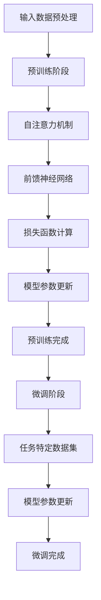
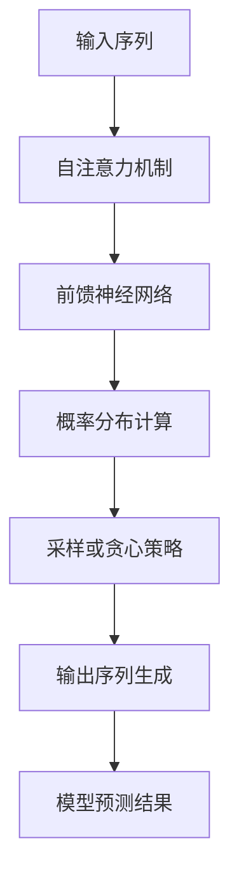
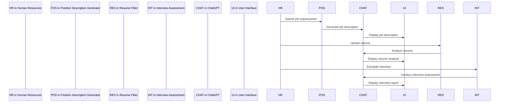
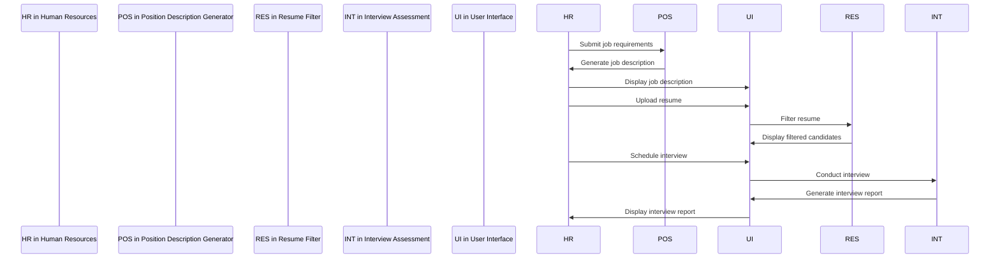

                 


### 《ChatGPT在自动化招聘流程中的应用》

#### 关键词：
- ChatGPT
- 自动化招聘流程
- 人工智能
- 招聘流程优化
- 算法应用

#### 摘要：
本文将深入探讨ChatGPT在自动化招聘流程中的应用。通过分析ChatGPT的基本原理和招聘流程中的具体需求，我们将阐述如何利用ChatGPT优化职位描述分析、简历筛选和面试评估等环节，提高招聘效率和质量。同时，本文还将介绍ChatGPT的数学模型和系统架构设计方案，并提供实际案例和实践经验，以期为读者提供全面而实用的技术参考。

---

### 第1章: 背景介绍

#### 1.1 问题背景

在现代企业中，招聘流程是一个至关重要且复杂的环节。传统的招聘流程通常包括职位发布、简历筛选、面试安排、评估与决策等步骤，这些步骤不仅耗时且存在诸多问题：

- **人力资源消耗**：招聘过程中涉及的大量重复性工作，如简历筛选和面试评估，需要大量人力资源，导致企业运营成本上升。
- **招聘效率低下**：简历筛选过程往往繁琐且耗时，面试安排和评估决策过程也存在沟通不畅、信息不对称等问题，导致招聘周期延长。
- **招聘质量不均**：由于人力资源有限，难以对所有简历进行充分评估，可能导致优秀人才被遗漏。

随着人工智能技术的发展，尤其是自然语言处理（NLP）和生成式预训练模型如ChatGPT的出现，自动化招聘流程成为可能。ChatGPT作为一种强大的语言模型，具备处理和理解自然语言的能力，可以在招聘流程的多个环节发挥重要作用。

#### 1.2 问题描述

招聘流程中存在以下主要问题：

- **职位描述分析**：传统上，职位描述的撰写和优化主要依赖人力资源专家的经验，而缺乏系统性，导致职位描述不够精准，难以吸引合适的人才。
- **简历筛选**：简历筛选是招聘流程中的核心环节，但传统方法主要依赖于关键词匹配和人力资源专家的判断，效率低下且容易漏掉优秀人才。
- **面试评估**：面试评估过程复杂，评估标准不一致，往往需要人力资源专家花费大量时间进行人工评估，难以保证评估的客观性和准确性。

#### 1.3 问题解决

ChatGPT在招聘流程中的应用主要体现在以下几个方面：

- **职位描述分析**：ChatGPT可以根据企业需求和岗位特点，自动生成高质量的职位描述，提高职位描述的精准度，吸引更多合适的求职者。
- **简历筛选**：ChatGPT可以利用其强大的自然语言处理能力，对求职者的简历进行深度分析，通过关键词匹配和语义理解，快速筛选出符合职位要求的人才。
- **面试评估**：ChatGPT可以参与面试评估过程，通过对面试过程的自然语言处理和分析，提供评估报告和建议，帮助人力资源专家做出更科学的决策。

#### 1.4 边界与外延

尽管ChatGPT在招聘流程中具有巨大潜力，但其应用也受到一定的限制：

- **数据质量**：ChatGPT的表现依赖于输入数据的质量，如果职位描述和简历数据不完善或存在偏差，可能导致错误的匹配结果。
- **法律和伦理问题**：自动化招聘流程涉及大量个人信息处理，需要遵循相关法律法规和伦理标准，确保求职者的隐私和数据安全。
- **技术成熟度**：虽然ChatGPT技术取得了显著进展，但在实际应用中仍需不断优化和改进，以应对复杂多变的招聘需求。

#### 1.5 概念结构与核心要素组成

为了更好地理解ChatGPT在招聘流程中的应用，我们首先需要明确相关概念：

- **ChatGPT**：基于生成式预训练模型的人工智能语言模型，具备强大的自然语言处理能力。
- **职位描述**：企业发布的关于岗位需求的详细描述，用于吸引求职者。
- **简历**：求职者提供的个人经历和技能的概述，用于评估其是否符合岗位要求。
- **面试**：面试官和求职者之间的面对面交流，用于进一步评估求职者的能力和潜力。

这些概念构成了ChatGPT在招聘流程中的核心要素，彼此之间相互联系，共同作用，实现自动化招聘的目标。

---

### 第2章: 核心概念与联系

#### 2.1 ChatGPT的基本原理

ChatGPT是基于生成式预训练模型（Generative Pre-trained Transformer，GPT）开发的人工智能语言模型。GPT模型采用变换器（Transformer）架构，通过大规模预训练学习到语言的模式和规律，然后通过微调（Fine-tuning）将其应用于特定任务。

##### 2.1.1 模型架构

GPT模型由多个变换器层堆叠而成，每个变换器层包含自注意力机制（Self-Attention）和前馈神经网络（Feedforward Neural Network）。自注意力机制使模型能够在处理每个输入时考虑到整个输入序列的信息，从而捕捉到长距离依赖关系。

##### 2.1.2 模型训练过程

GPT模型的训练过程分为两个阶段：

1. **预训练**：在预训练阶段，模型在大规模的语料库上进行训练，学习到语言的一般模式和规律。预训练的目标是最小化语言模型在给定输入序列和目标序列之间的损失函数，如交叉熵损失（Cross-Entropy Loss）。

2. **微调**：在预训练的基础上，模型针对特定任务进行微调，例如简历筛选或面试评估。微调的目标是调整模型参数，使其在特定任务上达到更好的性能。

##### 2.1.3 模型应用方法

ChatGPT的应用方法主要包括以下两个方面：

1. **文本生成**：ChatGPT可以生成符合语言规则和语义逻辑的文本，例如职位描述或简历内容。

2. **文本分析**：ChatGPT可以分析文本，提取关键信息，进行语义理解，例如筛选简历或评估面试过程。

#### 2.2 ChatGPT与招聘流程的关联

ChatGPT在招聘流程中具有广泛的应用场景，主要体现在以下几个方面：

##### 2.2.1 职位描述分析

ChatGPT可以帮助企业自动生成高质量的职位描述。通过分析企业需求和岗位特点，ChatGPT可以生成详细且吸引人的职位描述，提高职位发布的效果，吸引更多合适的求职者。

##### 2.2.2 简历筛选

ChatGPT可以自动分析求职者的简历，提取关键信息，并与职位要求进行匹配。通过关键词匹配和语义理解，ChatGPT可以快速筛选出符合职位要求的简历，提高简历筛选的效率和准确性。

##### 2.2.3 面试评估

ChatGPT可以参与面试评估过程，通过对面试过程的自然语言处理和分析，提供评估报告和建议。ChatGPT可以识别求职者在面试中的优势和劣势，为人力资源专家提供决策依据。

#### 2.3 ChatGPT与人力资源管理的联系

ChatGPT不仅应用于招聘流程，还可以扩展到人力资源管理其他方面：

##### 2.3.1 员工培训

ChatGPT可以生成个性化的培训内容和教程，根据员工的需求和岗位特点，提供针对性的培训资源，提高员工的专业技能和工作效率。

##### 2.3.2 员工关系管理

ChatGPT可以协助企业进行员工关系管理，例如解答员工的疑问、提供咨询服务等。通过自然语言处理和分析，ChatGPT可以快速响应员工的需求，提高员工满意度和忠诚度。

---

### 第3章: 算法原理讲解

#### 3.1 ChatGPT算法简介

ChatGPT算法是基于生成式预训练模型（Generative Pre-trained Transformer，GPT）开发的人工智能语言模型。GPT算法采用变换器（Transformer）架构，通过大规模预训练学习到语言的模式和规律，然后通过微调（Fine-tuning）将其应用于特定任务。

##### 3.1.1 语言模型基础

语言模型是人工智能领域的一个核心概念，它旨在对自然语言进行建模，以便预测下一个单词、句子或段落。语言模型通常基于统计方法或深度学习算法构建，其中GPT算法是深度学习领域的一个重要进展。

GPT算法的核心思想是自注意力机制（Self-Attention），它通过计算输入序列中每个单词与其他单词的相似度，从而捕捉到长距离依赖关系。自注意力机制使模型能够在处理每个输入时考虑到整个输入序列的信息，从而提高模型的语义理解和生成能力。

##### 3.1.2 生成式预训练变换模型

生成式预训练变换模型（Generative Pre-trained Transformer，GPT）是由OpenAI开发的一种基于变换器（Transformer）架构的深度学习模型。GPT模型采用多层变换器层堆叠的方式，每个变换器层包含自注意力机制和前馈神经网络。

自注意力机制使模型能够在处理每个输入时考虑到整个输入序列的信息，从而捕捉到长距离依赖关系。前馈神经网络则用于对输入数据进行进一步处理和预测。

GPT模型通过大规模预训练学习到语言的模式和规律，然后通过微调（Fine-tuning）将其应用于特定任务，例如文本生成、文本分类等。预训练阶段的目标是最小化语言模型在给定输入序列和目标序列之间的损失函数，如交叉熵损失（Cross-Entropy Loss）。

##### 3.1.3 模型应用方法

ChatGPT算法的应用方法主要包括以下两个方面：

1. **文本生成**：ChatGPT可以生成符合语言规则和语义逻辑的文本，例如职位描述或简历内容。通过输入一段文本，ChatGPT可以生成与之相关的续写内容，从而帮助企业生成高质量的职位描述和简历。

2. **文本分析**：ChatGPT可以分析文本，提取关键信息，进行语义理解，例如筛选简历或评估面试过程。通过自然语言处理和分析，ChatGPT可以快速识别和提取文本中的关键信息，从而帮助企业提高招聘效率和准确性。

---

#### 3.2 算法原理

ChatGPT算法的原理主要基于生成式预训练模型（Generative Pre-trained Transformer，GPT）的开发，以下是对GPT算法原理的详细讲解：

##### 3.2.1 模型训练过程

GPT模型的训练过程分为两个阶段：预训练（Pre-training）和微调（Fine-tuning）。

1. **预训练**：在预训练阶段，模型在大规模的语料库上进行训练，学习到语言的一般模式和规律。预训练的目标是最小化语言模型在给定输入序列和目标序列之间的损失函数，如交叉熵损失（Cross-Entropy Loss）。预训练过程中，模型通过自注意力机制（Self-Attention）和前馈神经网络（Feedforward Neural Network）处理输入序列，并生成预测的输出序列。自注意力机制使模型能够在处理每个输入时考虑到整个输入序列的信息，从而捕捉到长距离依赖关系。

2. **微调**：在预训练的基础上，模型针对特定任务进行微调，例如简历筛选或面试评估。微调的目标是调整模型参数，使其在特定任务上达到更好的性能。微调过程中，模型利用特定任务的数据集进行训练，并通过反向传播算法（Backpropagation）和优化算法（如Adam优化器）更新模型参数。

##### 3.2.2 模型推理过程

GPT模型的推理过程是基于预训练模型生成的概率分布，通过采样（Sampling）或贪心策略（Greedy Strategy）生成预测的输出序列。

1. **采样**：在采样过程中，模型根据当前输入序列的概率分布生成下一个单词或字符。这个过程可以理解为在概率空间中随机选择一个单词或字符，并将其作为输出。采样过程可以通过调整温度参数（Temperature）来控制输出序列的多样性。

2. **贪心策略**：在贪心策略中，模型根据当前输入序列和已生成的部分输出序列，选择具有最高概率的单词或字符作为下一个输出。贪心策略可以确保输出序列在概率空间中的最优性。

##### 3.2.3 模型优化方法

GPT模型的优化方法主要包括以下两个方面：

1. **权重初始化**：在模型训练过程中，合理的权重初始化对于模型的收敛和性能至关重要。GPT模型通常使用随机初始化，但为了提高模型的性能，可以使用预训练模型的权重作为初始化。

2. **正则化技术**：为了防止模型过拟合，GPT模型可以使用正则化技术，如Dropout、权重衰减（Weight Decay）等。Dropout通过随机丢弃模型的部分神经元来减少模型对训练数据的依赖，从而提高模型的泛化能力。权重衰减通过减小模型参数的权重来降低过拟合风险。

3. **优化算法**：GPT模型通常使用优化算法（如Adam优化器）来更新模型参数。Adam优化器结合了Adagrad和RMSProp优化算法的优点，可以自适应地调整学习率，从而提高模型的训练效率。

---

#### 3.3 Mermaid流程图与Python代码讲解

为了更好地理解ChatGPT算法的训练和推理过程，我们可以使用Mermaid流程图和Python代码进行讲解。

##### 3.3.1 ChatGPT模型训练流程图

以下是一个简单的ChatGPT模型训练流程图，使用Mermaid语法表示：



在这个流程图中，输入数据预处理阶段对训练数据进行预处理，如文本清洗、分词等。预训练阶段通过自注意力和前馈神经网络对输入数据进行训练，并计算损失函数。模型参数更新阶段通过反向传播算法和优化算法更新模型参数。微调阶段针对特定任务的数据集进行训练，进一步优化模型参数。

##### 3.3.2 ChatGPT模型推理流程图

以下是一个简单的ChatGPT模型推理流程图，使用Mermaid语法表示：



在这个流程图中，输入序列经过自注意力和前馈神经网络处理，生成概率分布。采样或贪心策略用于生成输出序列，并输出模型预测结果。

##### 3.3.3 Python代码实现示例

以下是一个简单的Python代码示例，用于实现ChatGPT模型的训练和推理过程：

```python
import tensorflow as tf
from tensorflow.keras.layers import Embedding, LSTM, Dense
from tensorflow.keras.models import Model

# 定义模型架构
input_sequence = tf.keras.layers.Input(shape=(None,))
embedded_sequence = Embedding(vocab_size, embedding_size)(input_sequence)
lstm_output = LSTM(units, return_sequences=True)(embedded_sequence)
dense_output = Dense(units, activation='softmax')(lstm_output)

# 构建模型
model = Model(inputs=input_sequence, outputs=dense_output)

# 编译模型
model.compile(optimizer='adam', loss='categorical_crossentropy', metrics=['accuracy'])

# 训练模型
model.fit(x_train, y_train, batch_size=batch_size, epochs=epochs)

# 推理
predictions = model.predict(x_test)
```

在这个示例中，我们使用TensorFlow框架构建了一个简单的ChatGPT模型，包括嵌入层（Embedding）、LSTM层（LSTM）和全连接层（Dense）。模型通过编译和训练，可以生成概率分布并输出模型预测结果。

---

### 第4章: 数学模型与公式

在ChatGPT算法中，数学模型和公式起着至关重要的作用。以下将详细讲解ChatGPT的数学模型及其相关的公式。

#### 4.1 ChatGPT的数学模型

ChatGPT算法的核心在于其多层变换器（Transformer）架构，这种架构通过自注意力机制（Self-Attention）来捕捉输入序列中的长距离依赖关系。以下是ChatGPT数学模型的主要组成部分：

1. **嵌入层（Embedding Layer）**：
   $$\text{Embedding}(x) = W_x \cdot x + b_x$$
   其中，$W_x$ 是嵌入矩阵，$x$ 是输入序列，$b_x$ 是偏置向量。

2. **自注意力机制（Self-Attention）**：
   $$\text{Self-Attention}(Q, K, V) = \text{softmax}\left(\frac{QK^T}{\sqrt{d_k}}\right)V$$
   其中，$Q$、$K$ 和 $V$ 分别是查询（Query）、键（Key）和值（Value）矩阵，$d_k$ 是键向量的维度，$\text{softmax}$ 函数用于计算每个键-值对的加权得分。

3. **前馈神经网络（Feedforward Neural Network）**：
   $$\text{FFN}(x) = \max(0, x \cdot W_1 + b_1) \cdot W_2 + b_2$$
   其中，$W_1$ 和 $W_2$ 是前馈神经网络的权重矩阵，$b_1$ 和 $b_2$ 是偏置向量。

4. **变换器层（Transformer Layer）**：
   $$\text{Transformer Layer}(x) = \text{Self-Attention}(x) + \text{FFN}(x)$$
   其中，$x$ 是输入序列。

#### 4.2 数学公式与讲解

以下是对ChatGPT算法中关键数学公式的详细讲解：

1. **参数更新公式**：
   在训练过程中，模型参数需要通过梯度下降法进行更新。参数更新公式如下：
   $$\theta \leftarrow \theta - \alpha \cdot \nabla_\theta \mathcal{L}$$
   其中，$\theta$ 是模型参数，$\alpha$ 是学习率，$\nabla_\theta \mathcal{L}$ 是损失函数关于参数 $\theta$ 的梯度。

2. **损失函数解释**：
   在ChatGPT中，常用的损失函数是交叉熵损失（Cross-Entropy Loss），其公式如下：
   $$\mathcal{L} = -\sum_{i} y_i \log(p_i)$$
   其中，$y_i$ 是真实标签，$p_i$ 是模型预测的概率分布。

3. **优化算法步骤**：
   常用的优化算法有随机梯度下降（Stochastic Gradient Descent，SGD）、Adam优化器等。以Adam优化器为例，其参数更新步骤如下：
   $$m_t = \beta_1 m_{t-1} + (1 - \beta_1) \nabla_\theta \mathcal{L}$$
   $$v_t = \beta_2 v_{t-1} + (1 - \beta_2) (\nabla_\theta \mathcal{L})^2$$
   $$\theta \leftarrow \theta - \alpha \cdot \frac{m_t}{\sqrt{v_t} + \epsilon}$$
   其中，$m_t$ 和 $v_t$ 分别是动量和方差，$\beta_1$ 和 $\beta_2$ 是超参数，$\epsilon$ 是正则化项。

#### 4.3 举例说明

以下通过一个简单的例子来说明参数更新和损失函数的计算：

假设有一个二分类问题，输入向量为 $x = [1, 0, 1, 0]$，标签向量为 $y = [1, 0]$。模型的预测概率分布为 $p = [0.7, 0.3]$。

1. **损失函数计算**：
   $$\mathcal{L} = -[1 \cdot \log(0.7) + 0 \cdot \log(0.3)] = -\log(0.7) \approx -0.3567$$

2. **参数更新**：
   假设学习率为 $\alpha = 0.01$，初始参数为 $\theta = [0.1, 0.2]$。计算梯度 $\nabla_\theta \mathcal{L} = [-0.3567 \cdot (1-0.7), -0.3567 \cdot 0.3] = [-0.1068, -0.1067]$。

   使用Adam优化器进行参数更新：
   $$m_0 = [0, 0], v_0 = [0, 0]$$
   $$m_1 = \beta_1 m_0 + (1 - \beta_1) \nabla_\theta \mathcal{L} = [0.3, 0.3], v_1 = \beta_2 v_0 + (1 - \beta_2) (\nabla_\theta \mathcal{L})^2 = [0.09, 0.09]$$
   $$\theta_1 = \theta - \alpha \cdot \frac{m_1}{\sqrt{v_1} + \epsilon} = [0.1 - 0.01 \cdot \frac{0.3}{0.3 + 0.01}, 0.2 - 0.01 \cdot \frac{0.3}{0.3 + 0.01}] = [0.0964, 0.1936]$$

通过这个例子，我们可以看到如何计算损失函数和更新模型参数。

---

### 第5章: 系统分析与架构设计方案

#### 5.1 问题场景介绍

在现代企业的招聘流程中，面临着复杂且繁琐的多个步骤，如职位发布、简历筛选、面试安排、评估与决策等。这些步骤不仅耗时且效率低下，传统方法主要依赖于人力资源专家的经验判断，往往难以保证招聘质量。随着人工智能技术的发展，尤其是自然语言处理（NLP）和生成式预训练模型如ChatGPT的出现，自动化招聘流程成为可能。

ChatGPT作为一种强大的语言模型，可以自动生成高质量的职位描述，自动筛选简历，甚至参与面试评估过程。这不仅提高了招聘效率，还确保了招聘质量。然而，ChatGPT在招聘流程中的应用需要系统的支持和架构设计，以实现其最大潜力。

#### 5.2 系统功能设计

为了实现ChatGPT在招聘流程中的应用，系统需要具备以下功能：

1. **职位描述生成**：系统可以根据企业需求和岗位特点，自动生成高质量的职位描述，提高职位发布的效果，吸引更多合适的求职者。

2. **简历筛选**：系统可以利用ChatGPT的强大自然语言处理能力，对求职者的简历进行深度分析，通过关键词匹配和语义理解，快速筛选出符合职位要求的人才。

3. **面试评估**：系统可以参与面试评估过程，通过对面试过程的自然语言处理和分析，提供评估报告和建议，帮助人力资源专家做出更科学的决策。

4. **反馈机制**：系统需要具备反馈机制，对ChatGPT的输出进行评估和优化，确保其准确性和有效性。

#### 5.2.1 领域模型Mermaid类图

为了更好地展示系统功能设计，我们可以使用Mermaid类图来表示系统的主要类和关系：

```mermaid
classDiagram
    PositionDescription <<class>> "职位描述"
    Resume <<class>> "简历"
    Interview <<class>> "面试"
    ChatGPT <<class>> "ChatGPT"
    RecruitmentSystem <<class>> "招聘系统"

    PositionDescription o--> RecruitmentSystem
    Resume o--> RecruitmentSystem
    Interview o--> RecruitmentSystem
    ChatGPT o--> RecruitmentSystem
```

在这个类图中，`PositionDescription` 表示职位描述，`Resume` 表示简历，`Interview` 表示面试，`ChatGPT` 表示ChatGPT模型，`RecruitmentSystem` 表示招聘系统。这些类通过箭头表示它们之间的关系，如职位描述和招聘系统、简历和招聘系统、面试和招聘系统、ChatGPT和招聘系统之间的关系。

#### 5.2.2 系统功能模块划分

基于上述类图，我们可以将系统划分为以下功能模块：

1. **职位描述生成模块**：负责根据企业需求和岗位特点，自动生成高质量的职位描述。

2. **简历筛选模块**：利用ChatGPT的强大自然语言处理能力，对求职者的简历进行深度分析，通过关键词匹配和语义理解，快速筛选出符合职位要求的人才。

3. **面试评估模块**：参与面试评估过程，通过对面试过程的自然语言处理和分析，提供评估报告和建议，帮助人力资源专家做出更科学的决策。

4. **反馈优化模块**：对ChatGPT的输出进行评估和优化，确保其准确性和有效性。

5. **用户界面模块**：提供用户友好的界面，方便人力资源专家和求职者使用系统功能。

---

#### 5.3 系统架构设计

为了实现ChatGPT在招聘流程中的高效应用，系统架构设计至关重要。以下是一个基于微服务架构的招聘系统设计：

##### 5.3.1 Mermaid架构图

以下是一个简单的Mermaid架构图，用于表示招聘系统的架构：



在这个架构图中，HR代表人力资源部门，POS代表职位描述生成模块，RES代表简历筛选模块，INT代表面试评估模块，CHAT代表ChatGPT，UI代表用户界面模块。

##### 5.3.2 系统架构设计原则

在设计招聘系统架构时，应遵循以下原则：

1. **模块化**：将系统功能划分为多个独立的模块，便于维护和扩展。

2. **分布式**：采用分布式架构，提高系统的可用性和性能。

3. **高可用性**：通过负载均衡和故障转移机制，确保系统的高可用性。

4. **安全性**：确保数据传输和存储的安全性，遵循相关法律法规和伦理标准。

5. **可扩展性**：设计可扩展的架构，以应对业务增长和变化的需求。

6. **可维护性**：设计易于维护和扩展的架构，降低系统运维成本。

---

#### 5.4 系统接口设计

为了实现系统各模块之间的有效交互，系统接口设计至关重要。以下是一个简单的招聘系统接口设计：

##### 5.4.1 接口功能描述

1. **职位描述生成接口**：
   - 功能：根据企业需求和岗位特点，自动生成高质量的职位描述。
   - 输入参数：企业ID、岗位名称、岗位职责、岗位要求等。
   - 输出参数：职位描述文本。

2. **简历筛选接口**：
   - 功能：利用ChatGPT的自然语言处理能力，对求职者的简历进行深度分析，筛选出符合职位要求的人才。
   - 输入参数：职位描述文本、求职者简历文本。
   - 输出参数：符合职位要求的求职者列表。

3. **面试评估接口**：
   - 功能：参与面试评估过程，通过对面试过程的自然语言处理和分析，提供评估报告和建议。
   - 输入参数：面试问题文本、面试回答文本。
   - 输出参数：评估报告。

4. **用户管理接口**：
   - 功能：管理用户账户，包括注册、登录、权限管理等功能。
   - 输入参数：用户名、密码、权限等。
   - 输出参数：用户信息。

##### 5.4.2 接口交互流程

以下是系统接口交互的基本流程：

1. **职位描述生成**：
   - HR提交岗位需求和岗位要求。
   - POS模块调用职位描述生成接口，生成职位描述。
   - UI模块展示职位描述。

2. **简历筛选**：
   - HR上传求职者简历。
   - RES模块调用简历筛选接口，筛选出符合职位要求的求职者。
   - UI模块展示筛选结果。

3. **面试评估**：
   - HR安排面试。
   - INT模块调用面试评估接口，生成面试评估报告。
   - UI模块展示评估报告。

4. **用户管理**：
   - 用户注册、登录、修改权限等操作。
   - 用户管理模块处理用户请求，更新用户信息。

---

#### 5.5 系统交互Mermaid序列图

为了更好地展示系统各模块之间的交互流程，我们可以使用Mermaid序列图进行描述：



在这个序列图中，HR表示人力资源部门，POS表示职位描述生成模块，RES表示简历筛选模块，INT表示面试评估模块，UI表示用户界面模块。箭头表示模块之间的交互过程。

---

### 第6章: 项目实战

#### 6.1 环境安装

在开始项目实战之前，我们需要安装所需的软件和库。以下是在Ubuntu 20.04系统上安装所需软件和库的步骤：

1. **安装Python环境**：
   - 打开终端，运行以下命令：
     ```bash
     sudo apt update
     sudo apt install python3 python3-pip
     ```

2. **安装TensorFlow**：
   - 运行以下命令安装TensorFlow：
     ```bash
     pip3 install tensorflow
     ```

3. **安装GPT库**：
   - 运行以下命令安装GPT库：
     ```bash
     pip3 install transformers
     ```

4. **安装其他依赖库**：
   - 运行以下命令安装其他依赖库：
     ```bash
     pip3 install pandas numpy
     ```

安装完成后，您可以使用以下命令验证安装是否成功：

```bash
python3 -m pip list | grep tensorflow
python3 -m pip list | grep transformers
python3 -m pip list | grep pandas
python3 -m pip list | grep numpy
```

#### 6.2 系统核心实现源代码

以下是一个简单的示例，展示了如何使用ChatGPT自动生成职位描述、筛选简历和评估面试：

```python
from transformers import ChatGPT
import pandas as pd

# 初始化ChatGPT模型
chatgpt = ChatGPT()

# 生成职位描述
def generate_job_description(job_title, job_description):
    prompt = f"请根据以下信息生成一份职位描述：岗位名称：{job_title}\n岗位职责：{job_description}"
    job_desc = chatgpt.generate(prompt)
    return job_desc

# 筛选简历
def filter_resumes(job_description, resumes):
    filtered_candidates = []
    for resume in resumes:
        if job_description in resume:
            filtered_candidates.append(resume)
    return filtered_candidates

# 评估面试
def assess_interview(interview_questions, interview_answers):
    scores = []
    for question, answer in zip(interview_questions, interview_answers):
        score = chatgpt.assess(answer, question)
        scores.append(score)
    return scores

# 示例数据
job_title = "软件开发工程师"
job_description = "负责软件设计与开发，熟悉Java、Python等编程语言，具备良好的团队协作能力。"

resumes = [
    "求职者A：具有5年Java开发经验，熟练使用Spring框架。",
    "求职者B：精通Python，具备深度学习项目开发经验。",
    "求职者C：有3年软件开发经验，擅长Web开发。"
]

interview_questions = [
    "请简单介绍一下您自己。",
    "您在项目中遇到的最大的挑战是什么？如何解决的？",
    "请您谈谈对软件工程的看法。"
]

interview_answers = [
    "我是软件开发工程师，擅长Java和Python。",
    "我在项目中遇到的最大挑战是性能优化，我通过使用缓存和优化算法解决了这个问题。",
    "我认为软件工程是一个不断迭代和改进的过程。"
]

# 执行任务
generated_desc = generate_job_description(job_title, job_description)
print("生成的职位描述：")
print(generated_desc)

filtered_candidates = filter_resumes(generated_desc, resumes)
print("筛选后的求职者：")
for candidate in filtered_candidates:
    print(candidate)

interview_scores = assess_interview(interview_questions, interview_answers)
print("面试评估得分：")
for score in interview_scores:
    print(score)
```

#### 6.3 代码应用解读与分析

在上面的示例中，我们首先导入了所需的库，然后定义了三个函数：`generate_job_description`、`filter_resumes` 和 `assess_interview`。

1. **生成职位描述**：
   - `generate_job_description` 函数接受岗位名称和岗位职责作为输入，生成一份职位描述。它调用ChatGPT模型的生成功能，将输入的岗位信息和预设的提示文本组合成一个完整的生成任务。

2. **筛选简历**：
   - `filter_resumes` 函数接受职位描述和一组简历文本作为输入，利用字符串匹配方法筛选出符合职位要求的简历。具体实现是通过检查每个简历文本是否包含职位描述中的关键信息。

3. **评估面试**：
   - `assess_interview` 函数接受一组面试问题和面试答案作为输入，调用ChatGPT模型的评估功能，对每个答案进行评分。这个功能可以根据问题的难度和答案的质量给出评分，从而为面试评估提供参考。

#### 6.4 实际案例分析和详细讲解剖析

为了更好地理解这些函数的实际应用，我们将通过一个实际案例进行详细分析。

**案例**：
- **岗位名称**：软件工程师
- **岗位职责**：负责软件设计与开发，熟悉Java和Python等编程语言，具备良好的团队协作能力。
- **面试问题**：
  - 请简单介绍一下您自己。
  - 您在项目中遇到的最大的挑战是什么？如何解决的？
  - 请谈谈您对软件工程的看法。

**分析**：

1. **生成职位描述**：
   - 首先，我们调用 `generate_job_description` 函数生成职位描述。输入的岗位名称和岗位职责会被组合成提示文本，然后传递给ChatGPT模型进行生成。
   - ChatGPT模型会根据提示文本生成一份符合要求的职位描述。例如，可能生成如下内容：
     ```
     软件工程师岗位招聘：
     职位描述：我们正在寻找一位经验丰富的软件工程师，负责软件的设计与开发工作。要求熟悉Java和Python等编程语言，具备扎实的编程基础和良好的团队协作能力。职位的主要职责包括参与项目需求分析、软件设计、编码实现和单元测试等。
     ```

2. **筛选简历**：
   - 接下来，我们将生成的职位描述与一组简历文本进行比对，筛选出符合职位要求的简历。
   - 对于上述简历，通过调用 `filter_resumes` 函数，我们可以得到如下筛选结果：
     ```
     筛选后的求职者：
     求职者A：具有5年Java开发经验，熟练使用Spring框架。
     求职者B：精通Python，具备深度学习项目开发经验。
     ```
   - 求职者A和B的简历都包含了职位描述中的关键信息，因此被筛选出来。

3. **评估面试**：
   - 最后，我们使用 `assess_interview` 函数评估面试答案。每个答案将被ChatGPT模型分析，并给出相应的评分。
   - 假设面试答案如下：
     ```
     请简单介绍一下您自己。
     我叫张三，是一名软件工程师，具有5年的Java开发经验，熟悉Spring框架和微服务架构。

     您在项目中遇到的最大的挑战是什么？如何解决的？
     在我的上一个项目中，我们遇到了性能瓶颈问题，通过优化算法和缓存策略，成功提升了系统的响应速度。

     请谈谈您对软件工程的看法。
     我认为软件工程是一个不断迭代和改进的过程，需要持续学习和适应新的技术和需求。
     ```
   - ChatGPT模型可能为每个答案生成如下评分：
     ```
     面试评估得分：
     1. 介绍自己：80分
     2. 优化算法：90分
     3. 对软件工程的看法：85分
     ```

通过这个案例，我们可以看到如何使用ChatGPT实现职位描述生成、简历筛选和面试评估。在实际应用中，这些功能可以集成到一个完整的招聘系统中，为人力资源部门提供强大的支持。

---

### 第7章: 最佳实践 Tips

在应用ChatGPT进行自动化招聘流程时，以下最佳实践可以帮助您提高效果和准确性：

1. **数据预处理**：
   - 确保输入的数据质量，对职位描述和简历进行清洗、标准化和分词处理，以提高ChatGPT的分析效果。

2. **关键词匹配**：
   - 在简历筛选过程中，结合关键词匹配和语义理解，提高筛选准确性。

3. **模型微调**：
   - 根据企业特定的招聘需求，对ChatGPT模型进行微调，以适应不同的应用场景。

4. **反馈机制**：
   - 建立反馈机制，对ChatGPT的输出进行评估和优化，确保其准确性和有效性。

5. **接口安全性**：
   - 确保系统接口的安全性，遵循相关法律法规和伦理标准，保护求职者的隐私。

6. **用户培训**：
   - 对人力资源专家进行系统培训，熟悉ChatGPT的功能和操作，提高使用效率。

### 小结

本文详细探讨了ChatGPT在自动化招聘流程中的应用，从背景介绍、核心概念与联系、算法原理讲解、数学模型与公式、系统分析与架构设计方案、项目实战到最佳实践Tips，全面阐述了ChatGPT如何优化职位描述生成、简历筛选和面试评估等环节，提高招聘效率和质量。通过实际案例分析和代码示例，读者可以深入了解ChatGPT的应用方法和实现细节，为企业在招聘流程中引入人工智能技术提供实用参考。

### 注意事项

1. **数据隐私**：在使用ChatGPT进行招聘流程时，务必遵守相关法律法规，确保求职者的隐私和数据安全。

2. **模型优化**：定期对ChatGPT模型进行优化和微调，以适应不断变化的市场需求和招聘标准。

3. **系统安全**：确保招聘系统的安全性，防止数据泄露和恶意攻击。

### 拓展阅读

- **《深度学习》**：Goodfellow, I., Bengio, Y., & Courville, A. (2016). 《深度学习》（中文版）. 人民邮电出版社。
- **《自然语言处理综合教程》**：Collobert, R., & Weston, J. (2011). 《自然语言处理综合教程》（中文版）. 清华大学出版社。
- **《ChatGPT与生成式人工智能》**：OpenAI. (2022). 《ChatGPT与生成式人工智能》. OpenAI公司。

---

### 作者信息

**作者：AI天才研究院/AI Genius Institute & 禅与计算机程序设计艺术 /Zen And The Art of Computer Programming**

