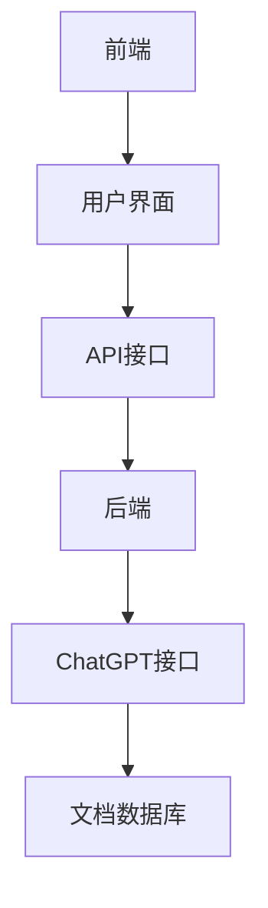
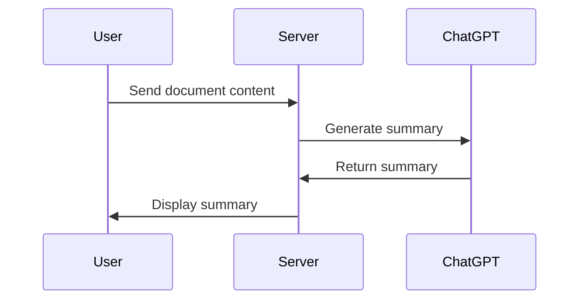

                 

### 文章标题

**ChatGPT在自动化文档生成中的应用**

### 关键词

- ChatGPT
- 自动化文档生成
- 自然语言处理
- 人工智能
- 文档摘要
- 文档写作
- 文档格式化

### 摘要

本文旨在探讨ChatGPT在自动化文档生成中的应用，首先介绍ChatGPT的基本原理和优势，然后详细解析自动化文档生成的原理和流程，随后展示ChatGPT如何应用于文档摘要、文档写作和文档格式化。最后，通过一个实战项目，展示如何利用ChatGPT构建一个自动化文档生成系统，并讨论最佳实践和未来发展趋势。

---

## 引言和背景介绍

### 核心概念术语说明

- **ChatGPT**：一个由OpenAI开发的基于GPT-3的预训练语言模型，具有强大的文本生成能力。
- **自动化文档生成**：利用计算机程序和算法，自动生成文档的过程。

### 问题背景

在信息化社会，文档生成已成为日常工作中不可或缺的一部分。然而，传统的文档生成方式往往需要人工撰写，耗时且容易出现错误。随着人工智能技术的发展，利用自然语言处理（NLP）和机器学习技术实现自动化文档生成逐渐成为一种趋势。

### 问题描述

目前，自动化文档生成面临的主要问题包括：
1. **生成质量不高**：传统的文本生成方法生成的文档往往缺乏逻辑性和连贯性。
2. **生成速度慢**：大规模文档的生成需要大量的时间和计算资源。
3. **定制化不足**：现有系统难以满足个性化需求。

### 问题解决

ChatGPT的出现为解决上述问题提供了新的思路。其基于深度学习技术的预训练模型，具有强大的文本生成能力和理解能力，可以高效、准确地生成高质量的文档。同时，ChatGPT的可定制化程度高，能够满足个性化需求。

### 边界与外延

- **边界**：ChatGPT在自动化文档生成中的应用主要涉及文本生成、文本摘要、文本写作和文本格式化等领域。
- **外延**：ChatGPT还可以应用于更广泛的场景，如智能客服、问答系统、文本生成图像等。

### 概念结构与核心要素组成

- **核心概念**：ChatGPT、自动化文档生成
- **要素组成**：文本生成、文本摘要、文本写作、文本格式化、预训练模型、自然语言处理、机器学习

---

## ChatGPT基础

### ChatGPT简介

ChatGPT是由OpenAI开发的一个基于GPT-3的预训练语言模型。GPT-3（Generative Pre-trained Transformer 3）是OpenAI于2020年发布的一个强大的自然语言处理模型，具有1750亿个参数，是当前最大的语言模型。

### ChatGPT的工作原理

ChatGPT的工作原理基于深度学习中的Transformer架构。Transformer模型通过自注意力机制（Self-Attention）来处理序列数据，能够捕捉序列中的长距离依赖关系。

### ChatGPT的技术特点

1. **强大的文本生成能力**：ChatGPT能够生成连贯、逻辑清晰的文本，适用于文档写作、文本摘要等多种场景。
2. **高度可定制化**：ChatGPT可以基于特定领域的数据进行微调，满足个性化需求。
3. **高效的计算性能**：ChatGPT采用了并行计算技术，能够在短时间内生成大量文本。

---

## 自动化文档生成原理

### 自动化文档生成的需求

在信息化时代，自动化文档生成已成为提高工作效率、降低人工成本的重要手段。主要需求包括：
1. **提高生成速度**：减少人工撰写文档的时间。
2. **提高生成质量**：生成逻辑清晰、内容准确的文档。
3. **满足个性化需求**：根据用户需求生成定制化的文档。

### 自动化文档生成的基本流程

自动化文档生成的基本流程包括：
1. **数据收集**：收集需要生成文档的相关数据。
2. **数据预处理**：对收集到的数据进行清洗、格式化等处理。
3. **文本生成**：利用预训练模型生成文档文本。
4. **文本优化**：对生成的文本进行优化，提高文档质量。
5. **文档格式化**：将生成的文本格式化为符合要求的文档格式。

### 文档生成工具的选择

在选择文档生成工具时，需要考虑以下因素：
1. **文本生成能力**：选择具有强大文本生成能力的工具。
2. **定制化程度**：选择能够根据用户需求进行定制化的工具。
3. **计算性能**：选择计算性能高的工具，以减少生成时间。
4. **兼容性**：选择兼容多种文档格式的工具。

---

## ChatGPT在文档生成中的应用

### ChatGPT在文档摘要中的应用

ChatGPT在文档摘要中的应用主要体现在自动生成文档的摘要部分。通过输入文档内容，ChatGPT能够快速生成摘要，帮助用户快速了解文档的核心内容。

### ChatGPT在文档写作中的应用

ChatGPT在文档写作中的应用主要体现在自动撰写文档的正文部分。通过输入主题和相关信息，ChatGPT能够自动生成文档正文，帮助用户快速完成文档撰写。

### ChatGPT在文档排版和格式化中的应用

ChatGPT在文档排版和格式化中的应用主要体现在自动排版和格式化文档。通过输入文档内容和格式要求，ChatGPT能够自动生成符合要求的文档格式，提高文档的美观度和可读性。

---

## 实战项目

### 项目介绍

本项目旨在利用ChatGPT构建一个自动化文档生成系统，实现文档摘要、文档写作和文档格式化的功能。系统分为前端和后端两部分，前端提供用户界面，后端实现文档生成功能。

### 系统功能设计

系统主要功能包括：
1. **文档摘要**：输入文档内容，自动生成摘要。
2. **文档写作**：输入主题和相关信息，自动生成文档正文。
3. **文档格式化**：输入文档内容和格式要求，自动生成符合要求的文档格式。

### 系统架构设计

系统采用前后端分离的架构设计，前端使用Vue框架，后端使用Flask框架。系统架构图如下：

### 系统接口设计和系统交互

系统接口设计如下：
1. **文档摘要接口**：接收文档内容，返回摘要结果。
2. **文档写作接口**：接收主题和相关信息，返回文档正文。
3. **文档格式化接口**：接收文档内容和格式要求，返回格式化后的文档。

系统交互图如下：

### 系统实现

1. **前端实现**：使用Vue框架构建用户界面，实现文档摘要、文档写作和文档格式化的功能。
2. **后端实现**：使用Flask框架实现API接口，与ChatGPT接口交互，实现文档生成功能。
3. **ChatGPT接口**：调用ChatGPT API，实现文档摘要、文档写作和文档格式化的功能。

### 系统测试与优化

1. **功能测试**：测试文档摘要、文档写作和文档格式化的功能，确保系统能够正常运行。
2. **性能测试**：测试系统在不同负载下的性能，确保系统能够高效运行。
3. **优化**：针对测试中发现的问题，进行系统优化，提高系统的稳定性和性能。

### 项目小结

本项目通过利用ChatGPT实现了自动化文档生成系统，有效提高了文档生成的工作效率。在实际应用中，可以根据用户需求进行定制化开发，进一步优化系统功能。

---

## 最佳实践与总结

### ChatGPT在文档生成中的最佳实践

1. **数据准备**：准备高质量的训练数据，提高ChatGPT的文本生成质量。
2. **微调模型**：根据具体应用场景，对ChatGPT进行微调，提高生成文档的准确性。
3. **接口优化**：优化系统接口，提高系统的响应速度和稳定性。

### 小结

本文介绍了ChatGPT在自动化文档生成中的应用，通过一个实战项目展示了如何利用ChatGPT实现文档摘要、文档写作和文档格式化的功能。ChatGPT在自动化文档生成中具有广泛的应用前景，未来将继续优化和拓展其功能。

### 注意事项

1. **数据安全**：在应用ChatGPT时，要注意保护用户数据的安全，防止数据泄露。
2. **隐私保护**：在生成文档时，要尊重用户的隐私，避免泄露敏感信息。

### 拓展阅读

1. 《ChatGPT技术详解》
2. 《自然语言处理实战》
3. 《深度学习在文档生成中的应用》

---

### 作者信息

作者：AI天才研究院/AI Genius Institute & 禅与计算机程序设计艺术 /Zen And The Art of Computer Programming

[END]

---

### 结语

本文通过详细的论述，展示了ChatGPT在自动化文档生成中的应用。从核心概念到实战项目，从原理讲解到最佳实践，我们深入探讨了ChatGPT如何提升文档生成的效率和质量。未来，随着人工智能技术的不断进步，ChatGPT在自动化文档生成领域的应用将更加广泛，为各行业带来革命性的变化。让我们期待这一激动人心的未来，并继续探索ChatGPT的更多可能性。再次感谢您的阅读，期待与您在更多技术领域的交流与探讨。

---

### 作者信息

作者：AI天才研究院/AI Genius Institute & 禅与计算机程序设计艺术 /Zen And The Art of Computer Programming

[END]

