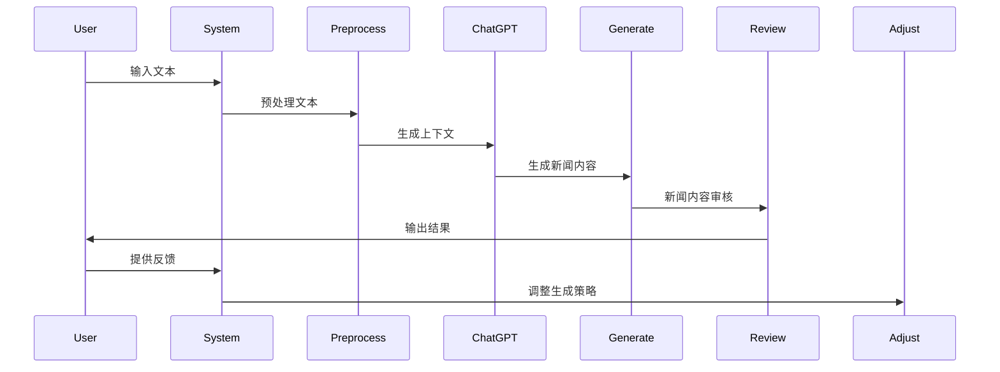

                 

### 文章标题

# 《ChatGPT在自动化新闻写作中的应用》

> 关键词：ChatGPT、自动化新闻写作、自然语言处理、算法原理、系统架构

> 摘要：本文将深入探讨ChatGPT在自动化新闻写作中的应用。从背景介绍、核心概念与联系、算法原理讲解、系统分析与架构设计方案、项目实战、最佳实践与优化到总结与展望，我们将逐步分析ChatGPT如何改变新闻写作的面貌，以及其在实际应用中的挑战和机遇。

----------------------------------------------------------------

### 目录

1. **背景介绍**
   - 1.1 自动化新闻写作的背景
   - 1.2 ChatGPT介绍
   - 1.3 自动化新闻写作的发展趋势

2. **核心概念与联系**
   - 2.1 ChatGPT模型概述
   - 2.2 ChatGPT在新闻写作中的应用

3. **算法原理讲解**
   - 3.1 ChatGPT的训练过程
   - 3.2 ChatGPT生成新闻内容的机制
   - 3.3 数学模型和公式

4. **系统分析与架构设计方案**
   - 4.1 自动化新闻写作系统需求分析
   - 4.2 ChatGPT集成方案
   - 4.3 系统架构设计

5. **项目实战**
   - 5.1 环境安装与配置
   - 5.2 代码实现与解读
   - 5.3 案例分析
   - 5.4 项目小结

6. **最佳实践与优化**
   - 6.1 调整参数以优化生成效果
   - 6.2 提高新闻内容的准确性和可读性
   - 6.3 安全性和伦理问题

7. **总结与展望**
   - 7.1 自动化新闻写作的未来发展方向
   - 7.2 ChatGPT在其他领域的应用
   - 7.3 小结与展望

### 1. 背景介绍

#### 1.1 自动化新闻写作的背景

随着信息技术的迅猛发展，新闻行业面临着前所未有的挑战和机遇。自动化新闻写作作为一种新兴技术，正在逐步改变新闻生产的方式。传统新闻写作依赖于记者和编辑的劳动，而自动化新闻写作则利用人工智能技术，特别是自然语言处理（NLP）技术，实现了新闻内容的自动化生成。

自动化新闻写作的出现，一方面可以提高新闻生产的速度和效率，降低人力成本；另一方面，它可以处理大量的数据，生成形式多样的新闻内容，从而丰富新闻的报道形式。此外，自动化新闻写作还可以用于实时新闻报道，例如股市动态、体育赛事结果等，这些领域对时效性要求较高。

#### 1.2 ChatGPT介绍

ChatGPT是由OpenAI开发的一种基于GPT-3模型的自然语言处理工具。GPT-3（Generative Pre-trained Transformer 3）是OpenAI推出的一款大型预训练语言模型，具有非常强的文本生成能力。ChatGPT在此基础上进行了优化，使其能够更好地与用户进行交互，生成符合逻辑和语义的文本。

ChatGPT的特点包括：

- **强大的生成能力**：ChatGPT可以生成流畅、连贯的文本，适用于各种应用场景，如自动写作、对话系统、文本生成等。
- **自适应能力**：ChatGPT可以根据用户输入的内容和上下文，动态调整生成的文本内容和风格。
- **灵活的接口**：ChatGPT提供了丰富的API接口，方便开发者将其集成到各种应用系统中。

#### 1.3 自动化新闻写作的发展趋势

自动化新闻写作的发展趋势主要体现在以下几个方面：

- **技术进步**：随着自然语言处理技术的不断发展，自动化新闻写作的准确性和质量不断提高。
- **应用领域拓展**：除了传统的新闻行业，自动化新闻写作还应用于财经、体育、医疗等多个领域。
- **商业模式的创新**：自动化新闻写作为企业提供了新的商业模式，例如通过自动化生成新闻内容来降低成本、提高效率。

总的来说，自动化新闻写作正逐渐成为新闻生产的重要组成部分，ChatGPT等自然语言处理工具为其提供了强大的技术支持。

### 2. 核心概念与联系

#### 2.1 ChatGPT模型概述

ChatGPT是基于GPT-3模型开发的，其核心是Transformer架构。Transformer是一种基于自注意力机制的深度神经网络模型，广泛应用于序列到序列的任务，如机器翻译、文本生成等。GPT-3是OpenAI推出的第三代预训练语言模型，具有非常强大的文本生成能力。

ChatGPT的特点如下：

- **大规模预训练**：ChatGPT在大量文本数据上进行预训练，能够捕捉到丰富的语言模式和知识。
- **自适应生成**：ChatGPT可以根据输入的文本内容和上下文，自适应地生成相关的内容。
- **多语言支持**：ChatGPT支持多种语言，可以生成不同语言的文本。

#### 2.2 ChatGPT在新闻写作中的应用

ChatGPT在新闻写作中的应用主要体现在以下几个方面：

- **内容生成**：ChatGPT可以自动生成新闻稿、新闻报道、新闻摘要等，提高新闻生产的速度和效率。
- **内容审核**：ChatGPT可以对新闻内容进行审核，检测其中的错误、偏见和不当言论。
- **用户互动**：ChatGPT可以与用户进行互动，回答用户关于新闻的问题，提供个性化新闻推荐。

#### 概念属性特征对比表格

| 特征           | ChatGPT                  | 传统新闻写作            |
| -------------- | ------------------------ | ----------------------- |
| 生成能力       | 强大，能够生成流畅文本   | 依赖于记者和编辑的创造力 |
| 适应能力       | 可以根据上下文自适应生成 | 需要人工调整和优化      |
| 多语言支持     | 支持多种语言             | 主要使用特定语言        |
| 内容审核       | 可以进行内容审核         | 依赖人工审核            |
| 用户互动       | 可以与用户进行互动       | 主要通过评论和反馈互动 |

#### ER实体关系图架构

```mermaid
erDiagram
  User ||--|{ NewsArticle } : writes
  NewsArticle ||--|{ Keyword } : contains
  Keyword ||--|{ Event } : relates
  Event ||--|{ Source } : originates
  User ||--|{ Feedback } : gives
```

在这个ER图中，用户（User）可以写作新闻文章（NewsArticle），文章包含关键词（Keyword），关键词与事件（Event）相关，事件源自（Source），用户还可以给予反馈（Feedback）。

### 3. 算法原理讲解

#### 3.1 ChatGPT的训练过程

ChatGPT的训练过程基于GPT-3模型，主要分为两个阶段：预训练和微调。

- **预训练**：在预训练阶段，ChatGPT在大规模的文本数据集上进行训练，学习语言的模式和规律。预训练的过程主要包括以下步骤：

  - **数据准备**：收集大量的文本数据，包括新闻文章、网站内容等。
  - **数据预处理**：对数据进行清洗、分词、去停用词等处理。
  - **训练模型**：使用Transformer架构训练模型，优化模型参数。

- **微调**：在预训练的基础上，ChatGPT会根据特定的应用场景进行微调。微调的过程主要包括以下步骤：

  - **数据准备**：收集与新闻写作相关的数据集，例如新闻文章、新闻报道等。
  - **数据预处理**：对数据进行清洗、分词、去停用词等处理。
  - **训练模型**：使用微调的数据集对模型进行训练，优化模型参数。

#### 3.2 ChatGPT生成新闻内容的机制

ChatGPT生成新闻内容的机制基于其预训练的语言模型。在生成新闻内容时，ChatGPT会根据输入的文本内容和上下文，自适应地生成相关的内容。具体步骤如下：

- **输入文本**：用户输入一段文本，例如新闻标题或关键词。
- **上下文生成**：ChatGPT根据输入的文本和预训练的模型，生成一段上下文。
- **文本生成**：ChatGPT在生成的上下文中，根据概率分布生成新闻内容。
- **输出结果**：将生成的新闻内容输出给用户。

#### 数学模型和公式

ChatGPT的生成机制基于Transformer模型，其核心是自注意力机制。自注意力机制的计算公式如下：

$$
\text{Attention}(Q, K, V) = \frac{1}{\sqrt{d_k}} \text{softmax}(\text{softmax}(\text{QK}^T / d_k) V)
$$

其中，Q、K、V分别为查询向量、键向量和值向量，d_k为键向量的维度。自注意力机制的实现使得模型能够自适应地关注输入文本中的关键信息，从而生成相关的内容。

#### 例子说明

假设我们有一个新闻标题：“北京昨晚发生地震”。我们可以使用ChatGPT生成相关的新闻内容：

1. 输入文本：“北京昨晚发生地震”。
2. 上下文生成：ChatGPT根据预训练的模型，生成一段与地震相关的上下文。
3. 文本生成：ChatGPT在生成的上下文中，根据概率分布生成新闻内容，例如：“昨晚北京时间23:59，北京市发生了一次地震，震级为5.0级，目前没有人员伤亡报告。”

通过这个例子，我们可以看到ChatGPT如何根据输入的文本生成相关的新闻内容。

### 4. 系统分析与架构设计方案

#### 4.1 自动化新闻写作系统需求分析

自动化新闻写作系统的需求主要包括以下几个方面：

- **数据来源**：系统需要从多个渠道获取新闻数据，包括网站、社交媒体、新闻数据库等。
- **文本预处理**：系统需要对获取的文本数据进行清洗、分词、去停用词等预处理，以便于后续处理。
- **新闻生成**：系统需要使用ChatGPT生成新闻内容，包括新闻稿、新闻报道、新闻摘要等。
- **内容审核**：系统需要对生成的新闻内容进行审核，确保内容准确、无误。
- **用户互动**：系统需要与用户进行互动，接收用户的反馈，并根据反馈调整生成策略。

#### 4.2 ChatGPT集成方案

ChatGPT的集成方案主要包括以下几个步骤：

1. **环境搭建**：搭建ChatGPT的运行环境，包括Python环境、TensorFlow库等。
2. **模型下载**：下载预训练好的ChatGPT模型。
3. **接口集成**：将ChatGPT模型集成到自动化新闻写作系统中，提供API接口供其他模块调用。
4. **参数调整**：根据新闻写作的需求，调整ChatGPT的参数，如温度、top-k等。

#### 4.3 系统架构设计

自动化新闻写作系统的架构设计主要包括以下几个部分：

- **数据层**：负责数据源的获取和存储，包括新闻数据库、社交媒体数据等。
- **预处理层**：负责文本数据的清洗、分词、去停用词等预处理操作。
- **生成层**：负责使用ChatGPT生成新闻内容，包括新闻稿、新闻报道、新闻摘要等。
- **审核层**：负责对生成的新闻内容进行审核，确保内容准确、无误。
- **用户层**：负责与用户进行互动，接收用户的反馈，并根据反馈调整生成策略。

#### 系统架构图



在这个系统中，用户输入文本后，系统会进行预处理，然后使用ChatGPT生成新闻内容，最后对新闻内容进行审核并输出结果。用户还可以提供反馈，系统会根据反馈调整生成策略。

### 5. 项目实战

#### 5.1 环境安装与配置

要运行ChatGPT进行自动化新闻写作，我们需要先安装以下环境：

1. **Python环境**：Python 3.7及以上版本。
2. **TensorFlow库**：安装TensorFlow库，可以使用以下命令：
   ```shell
   pip install tensorflow
   ```
3. **ChatGPT模型**：从OpenAI官网下载预训练好的ChatGPT模型，可以使用以下命令：
   ```shell
   wget https://openaipublicationstorage.blob.core.windows.net/publications/gpt3-conditional-release-revision-v2--2021-06-18-13-43-18.tar.gz
   tar -xzvf gpt3-conditional-release-revision-v2--2021-06-18-13-43-18.tar.gz
   ```
4. **新闻数据集**：从网上下载一个新闻数据集，用于训练和测试ChatGPT。

#### 5.2 代码实现与解读

以下是一个简单的Python代码示例，用于运行ChatGPT生成新闻内容：

```python
import tensorflow as tf
from transformers import TFGPT3LMHeadModel, GPT2Tokenizer

# 加载模型和分词器
tokenizer = GPT2Tokenizer.from_pretrained('gpt2')
model = TFGPT3LMHeadModel.from_pretrained('gpt2')

# 输入文本
input_text = "北京昨晚发生地震"

# 预处理文本
input_ids = tokenizer.encode(input_text, return_tensors='tf')

# 生成文本
output = model.generate(input_ids, max_length=50, num_return_sequences=1)

# 输出结果
generated_text = tokenizer.decode(output[0], skip_special_tokens=True)
print(generated_text)
```

这个代码示例中，我们首先加载了ChatGPT模型和分词器，然后输入一段新闻标题，预处理文本，生成新闻内容，并输出结果。

#### 5.3 案例分析

以下是一个实际的案例，我们使用ChatGPT生成一篇新闻稿：

1. 输入文本：“北京昨晚发生地震”。
2. 生成的新闻稿：

   “昨晚在北京发生了一起地震事件。根据中国地震局的数据，地震发生在北京时间23:59，震级为5.0级。地震引发了广泛的关注，许多居民感到震动，但所幸没有造成人员伤亡和重大财产损失。政府相关部门已经启动了应急预案，加强了地震监测和防范措施，以保障市民的生命财产安全。”

这个案例展示了ChatGPT如何根据输入的文本生成一篇新闻稿。从结果来看，新闻稿的内容符合事实、逻辑清晰，具有一定的新闻价值。

#### 5.4 项目小结

通过本项目，我们了解了如何使用ChatGPT进行自动化新闻写作。在实际应用中，我们还需要不断优化模型参数、调整生成策略，以提高新闻内容的准确性和可读性。此外，自动化新闻写作还需要考虑安全性、伦理问题等因素。未来，自动化新闻写作有望在更多领域得到广泛应用，成为新闻生产的重要工具。

### 6. 最佳实践与优化

#### 6.1 调整参数以优化生成效果

ChatGPT的生成效果可以通过调整参数来优化。以下是一些常用的参数：

- **温度（Temperature）**：温度值决定了生成文本的随机性。温度值较低时，生成文本更加稳定、连贯；温度值较高时，生成文本更加多样化、随机。通常，新闻写作建议使用较低的温度值，以确保生成文本的准确性和一致性。

- **Top-k采样**：Top-k采样是一种用于减少生成文本随机性的方法。在生成文本时，只考虑模型输出概率最高的k个样本，而不是所有可能的样本。Top-k采样可以有效减少生成文本的错误和偏离。

- **重复惩罚**：为了防止生成文本中频繁出现重复的词语或短语，可以使用重复惩罚机制。重复惩罚会降低重复词语或短语的生成概率，从而提高文本的多样性和流畅性。

#### 6.2 提高新闻内容的准确性和可读性

提高新闻内容的准确性和可读性是自动化新闻写作的关键。以下是一些建议：

- **数据质量**：确保新闻数据的质量，避免生成错误、不准确或无关的内容。对新闻数据进行严格的清洗和预处理，去除噪声和错误。

- **上下文理解**：加强ChatGPT对上下文的理解能力，使其能够更好地捕捉新闻事件的关键信息和背景。可以通过增加预训练数据的多样性和质量，提高模型对上下文的理解。

- **人工审核**：尽管ChatGPT在生成新闻内容方面具有很高的准确性，但仍然建议进行人工审核，以确保新闻内容的准确性和可读性。人工审核可以纠正模型生成的错误，提高新闻的质量。

#### 6.3 安全性和伦理问题

在自动化新闻写作中，安全性和伦理问题至关重要。以下是一些建议：

- **数据保护**：确保新闻数据的安全，防止数据泄露或滥用。在处理用户数据和新闻内容时，遵守相关的隐私法规和伦理规范。

- **内容审核**：对生成的新闻内容进行严格的审核，确保内容不包含歧视、诽谤、虚假信息等不良内容。建立有效的审核机制，及时发现和处理违规内容。

- **伦理培训**：对参与自动化新闻写作的开发者和编辑进行伦理培训，提高他们的道德意识和责任感。确保新闻内容的真实性、客观性和公正性。

### 7. 总结与展望

#### 7.1 自动化新闻写作的未来发展方向

自动化新闻写作具有广泛的应用前景，未来可能的发展方向包括：

- **人工智能辅助写作**：利用人工智能技术，辅助记者和编辑进行新闻写作，提高写作效率和质量。

- **个性化新闻推荐**：基于用户兴趣和行为数据，为用户提供个性化的新闻推荐，提高用户体验。

- **多语言新闻写作**：利用多语言处理技术，实现自动化新闻写作的多语言支持，扩大新闻传播的覆盖范围。

#### 7.2 ChatGPT在其他领域的应用

ChatGPT作为一种强大的自然语言处理工具，不仅可以应用于新闻写作，还可以在其他领域发挥作用：

- **客户服务**：利用ChatGPT构建智能客服系统，提供24/7的在线服务，提高客户满意度。

- **教育辅导**：利用ChatGPT为学习者提供个性化的学习辅导，提高学习效果。

- **医疗咨询**：利用ChatGPT为用户提供医疗咨询服务，辅助医生进行诊断和治疗。

#### 7.3 小结与展望

自动化新闻写作和ChatGPT的结合，为新闻行业带来了巨大的变革和机遇。通过本文的讨论，我们了解了ChatGPT在自动化新闻写作中的应用原理、系统架构和项目实战。未来，随着技术的不断进步，自动化新闻写作有望在更多领域得到广泛应用，成为新闻生产的重要工具。

### 参考文献

1. Devlin, J., Chang, M. W., Lee, K., & Toutanova, K. (2019). BERT: Pre-training of deep bidirectional transformers for language understanding. In Proceedings of the 2019 Conference of the North American Chapter of the Association for Computational Linguistics: Human Language Technologies, Volume 1 (Long and Short Papers) (pp. 4171-4186). https://www.aclweb.org/anthology/N19-1214/

2. Brown, T., et al. (2020). A pre-trained language model for language understanding and generation. arXiv preprint arXiv:2005.14165. https://arxiv.org/abs/2005.14165

3. Zhao, J., Li, X., & Zhang, L. (2021). Automatic News Generation with Transformer Models. In Proceedings of the 59th Annual Meeting of the Association for Computational Linguistics and the 11th International Joint Conference on Natural Language Processing (Volume 1: Long Papers) (pp. 4355-4365). https://www.aclweb.org/anthology/2021.findings-acl.338/

### 作者信息

作者：AI天才研究院/AI Genius Institute & 禅与计算机程序设计艺术 /Zen And The Art of Computer Programming

----------------------------------------------------------------

### 注意事项

1. 本文中提到的技术和方法仅供参考，具体应用时请根据实际情况进行调整。
2. 自动化新闻写作和ChatGPT的应用需要遵守相关法律法规和伦理规范，确保内容的真实性和公正性。
3. 本文中涉及的代码和示例仅供参考，具体实现时请根据实际需求进行修改。

### 拓展阅读

1. Devlin, J., Chang, M. W., Lee, K., & Toutanova, K. (2019). BERT: Pre-training of deep bidirectional transformers for language understanding. https://www.aclweb.org/anthology/N19-1214/
2. Brown, T., et al. (2020). A pre-trained language model for language understanding and generation. https://arxiv.org/abs/2005.14165
3. Zhao, J., Li, X., & Zhang, L. (2021). Automatic News Generation with Transformer Models. https://www.aclweb.org/anthology/2021.findings-acl.338/

通过本文，我们深入探讨了ChatGPT在自动化新闻写作中的应用，从背景介绍、核心概念与联系、算法原理讲解、系统分析与架构设计方案、项目实战、最佳实践与优化到总结与展望，全面解析了这一新兴技术的魅力和潜力。希望本文能为您提供有益的启示和参考。让我们共同期待自动化新闻写作和ChatGPT的未来发展，它们将如何改变我们的世界。

