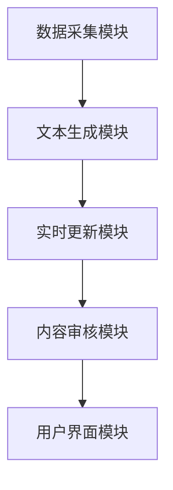
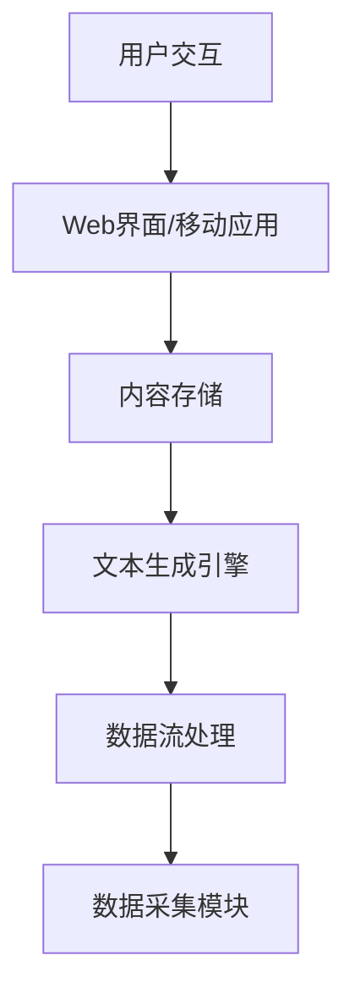
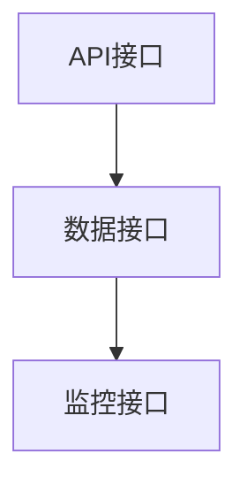
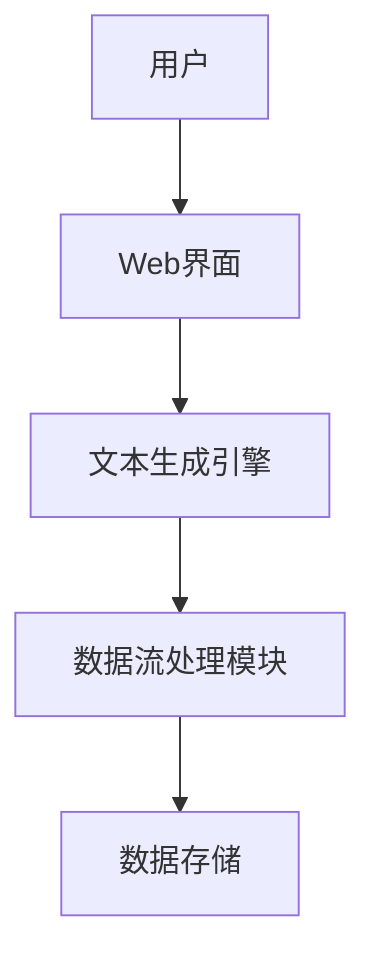

                 


### # ChatGPT在自动化新闻实时更新中的应用

关键词：ChatGPT，自动化新闻实时更新，自然语言处理，Transformer模型，数据采集，文本生成，实时更新

摘要：本文探讨了ChatGPT在自动化新闻实时更新中的应用。通过分析问题背景，介绍ChatGPT的核心概念和特点，阐述其工作原理和实现方法，最后通过系统架构设计展示了如何利用ChatGPT实现自动化新闻实时更新。

# 目录大纲

## 第一部分：问题背景与核心概念

### 第1章：问题背景介绍

#### 1.1 问题背景

#### 1.2 ChatGPT的应用场景

#### 1.3 问题描述

#### 1.4 边界与外延

#### 1.5 概念结构与核心要素组成

## 第二部分：核心概念与联系

### 第2章：ChatGPT核心概念

#### 2.1 ChatGPT的定义

#### 2.2 ChatGPT的特点

#### 2.3 ChatGPT与其他自然语言处理技术的比较

#### 2.4 ChatGPT在自动化新闻实时更新中的应用

## 第三部分：算法原理与实现

### 第3章：算法原理

#### 3.1 Transformer模型原理

#### 3.2 ChatGPT文本生成原理

#### 3.3 实时更新原理

## 第四部分：系统架构与实现

### 第4章：系统架构设计

#### 4.1 系统架构

#### 4.2 系统功能设计

#### 4.3 系统架构设计

#### 4.4 系统接口设计

#### 4.5 系统交互

## 第五部分：项目实战

### 第5章：项目实战

#### 5.1 环境安装

#### 5.2 系统核心实现

#### 5.3 代码应用解读与分析

#### 5.4 实际案例分析与详细讲解

#### 5.5 项目小结

## 第六部分：最佳实践与拓展

### 第6章：最佳实践与拓展

#### 6.1 最佳实践

#### 6.2 注意事项

#### 6.3 拓展阅读

---

## 第一部分：问题背景与核心概念

### 第1章：问题背景介绍

#### 1.1 问题背景

随着信息时代的到来，新闻的时效性变得越来越重要。传统的新闻生成和更新方式主要依赖于人力，这种方式存在效率低、成本高、准确性差等问题。为了满足用户对新闻实时性的需求，自动化新闻实时更新成为当前研究的热点。

自动化新闻实时更新的需求主要体现在以下几个方面：

1. **时效性**：新闻事件发生后的第一时间进行报道，以满足用户对实时信息的获取。
2. **准确性**：减少人工干预，提高新闻内容的准确性，避免因主观因素导致的偏差。
3. **多样性**：根据用户兴趣和需求，提供多样化的新闻内容。

#### 1.2 ChatGPT的应用场景

ChatGPT作为一种先进的自然语言处理技术，具有强大的语言生成和推理能力，可以应用于新闻实时更新的领域。通过利用ChatGPT，可以实现自动化生成和更新新闻内容，提高新闻生产的效率和质量。

ChatGPT在自动化新闻实时更新中的应用场景主要包括：

1. **数据采集**：利用ChatGPT的文本生成能力，自动采集新闻素材，提高数据采集的效率。
2. **文本生成**：通过输入关键词或主题，ChatGPT可以生成相关的新闻内容，实现新闻的自动化生产。
3. **实时更新**：ChatGPT可以实时监控新闻源，一旦有新新闻发布，即可自动生成并更新新闻内容。

#### 1.3 问题描述

当前，新闻实时更新的过程中面临着诸多挑战，如数据来源多样、新闻内容生成速度慢、准确性不高、人力成本较高等问题。如何利用ChatGPT实现自动化新闻实时更新，成为当前研究的热点。

具体问题描述如下：

1. **数据来源多样**：新闻来源包括官方网站、社交媒体、新闻报道等，数据格式和结构各异，如何有效整合和处理这些数据成为一个挑战。
2. **新闻内容生成速度慢**：传统的人工新闻编写方式效率低下，无法满足新闻实时更新的需求。
3. **准确性不高**：新闻内容生成过程中，可能存在语法错误、事实错误等问题，影响新闻的准确性。
4. **人力成本较高**：新闻实时更新需要大量的人力投入，成本较高。

#### 1.4 问题解决

本文提出了一种基于ChatGPT的自动化新闻实时更新方法，通过数据采集、文本生成和实时更新等步骤，实现新闻的自动化生产和实时更新。具体解决思路如下：

1. **数据采集**：利用ChatGPT的文本生成能力，自动采集新闻素材，提高数据采集的效率。
2. **文本生成**：通过输入关键词或主题，ChatGPT可以生成相关的新闻内容，实现新闻的自动化生产。
3. **实时更新**：ChatGPT可以实时监控新闻源，一旦有新新闻发布，即可自动生成并更新新闻内容。

#### 1.5 边界与外延

本研究的重点是ChatGPT在自动化新闻实时更新中的应用，主要包括数据采集、文本生成和实时更新等方面的技术实现。然而，新闻领域涉及到的伦理、版权等问题也需要关注。

1. **伦理问题**：新闻实时更新可能涉及到隐私保护、事实核查等问题，需要制定相应的伦理规范。
2. **版权问题**：自动化新闻实时更新可能涉及到的版权问题，如数据源版权、新闻内容版权等，需要依法合规处理。
3. **技术外延**：ChatGPT在自动化新闻实时更新中的应用不仅限于新闻领域，还可以应用于其他需要文本生成的领域，如广告、营销等。

#### 1.6 概念结构与核心要素组成

本文涉及到的核心概念包括：自动化新闻实时更新、ChatGPT、数据采集、文本生成和实时更新。其中，ChatGPT作为核心技术，对新闻实时更新起着至关重要的作用。

自动化新闻实时更新系统的核心要素组成如下：

1. **数据采集模块**：负责采集新闻素材，包括文本、图片、音频等多媒体数据。
2. **文本生成模块**：利用ChatGPT的文本生成能力，生成新闻内容。
3. **实时更新模块**：实时监控新闻源，一旦有新新闻发布，即进行新闻内容的生成和更新。
4. **内容审核模块**：对生成的新闻内容进行审核，确保新闻的准确性和合规性。
5. **用户界面模块**：提供用户界面，方便用户查看和操作。

### 1.7 小结

本文介绍了自动化新闻实时更新的背景和需求，阐述了ChatGPT在自动化新闻实时更新中的应用场景和问题，并提出了一种基于ChatGPT的自动化新闻实时更新方法。接下来，本文将深入探讨ChatGPT的核心概念和特点，以及其工作原理和实现方法。

## 第二部分：核心概念与联系

### 第2章：ChatGPT核心概念

#### 2.1 ChatGPT的定义

ChatGPT是由OpenAI开发的一种基于Transformer模型的预训练语言模型。它通过在大规模语料库上进行预训练，学习到了丰富的语言知识和规则，具备强大的语言生成和推理能力。

#### 2.2 ChatGPT的特点

ChatGPT具有以下几个显著特点：

1. **预训练语言模型**：ChatGPT采用了大规模的预训练数据，通过自监督学习的方式，使其具备了丰富的语言知识和强大的语言生成能力。
2. **Transformer模型**：ChatGPT采用了Transformer模型，这是一种基于自注意力机制的深度神经网络模型，可以处理长距离依赖关系，从而提高了语言处理的准确性。
3. **多样化的应用场景**：ChatGPT在对话系统、文本生成、机器翻译等多个领域都有广泛的应用。
4. **高效率**：ChatGPT在生成文本时具有很高的速度和效率，可以快速响应用户的需求。

#### 2.3 ChatGPT与其他自然语言处理技术的比较

ChatGPT与传统自然语言处理技术相比，具有以下几个优势：

1. **性能优越**：ChatGPT基于深度学习，相较于传统机器学习方法，具有更好的性能和泛化能力。
2. **生成能力强**：ChatGPT具备强大的文本生成能力，可以生成高质量的文本内容。
3. **适应性强**：ChatGPT可以应用于多种语言和任务，具有很高的适应性和灵活性。

#### 2.4 ChatGPT在自动化新闻实时更新中的应用

ChatGPT在自动化新闻实时更新中的应用主要体现在以下几个方面：

1. **数据采集**：利用ChatGPT的文本生成能力，可以自动采集新闻素材，提高数据采集的效率。
2. **文本生成**：通过输入关键词或主题，ChatGPT可以生成相关的新闻内容，实现新闻的自动化生产。
3. **实时更新**：ChatGPT可以实时监控新闻源，一旦有新新闻发布，即可自动生成并更新新闻内容。

#### 2.5 ChatGPT的优势分析

ChatGPT在自动化新闻实时更新中的优势主要表现在以下几个方面：

1. **高效性**：ChatGPT具有很高的文本生成效率，可以快速响应新闻实时更新的需求。
2. **准确性**：ChatGPT通过预训练学习到了丰富的语言知识和规则，生成的内容具有较高的准确性和逻辑性。
3. **多样性**：ChatGPT可以生成多种类型的新闻内容，满足用户多样化的需求。
4. **可扩展性**：ChatGPT具有很高的可扩展性，可以应用于其他需要文本生成的领域。

#### 2.6 ChatGPT的不足之处

尽管ChatGPT在自动化新闻实时更新中具有很多优势，但仍然存在一些不足之处，主要包括：

1. **数据依赖性**：ChatGPT的性能很大程度上依赖于预训练数据的质量和规模，如果数据质量不佳，可能会导致生成内容的质量下降。
2. **安全隐患**：自动化新闻实时更新可能涉及到数据安全和隐私保护等问题，需要采取相应的安全措施。
3. **伦理问题**：自动化新闻实时更新可能引发伦理问题，如虚假新闻、误导性信息等，需要制定相应的伦理规范。

### 2.7 小结

本章介绍了ChatGPT的核心概念、特点以及在自动化新闻实时更新中的应用。通过对ChatGPT与其他自然语言处理技术的比较，分析了其优势与不足。接下来，本文将深入探讨ChatGPT的算法原理与实现方法。

## 第三部分：算法原理与实现

### 第3章：算法原理

#### 3.1 Transformer模型原理

Transformer模型是由Google在2017年提出的一种基于自注意力机制的深度神经网络模型，主要用于序列数据的处理。自注意力机制是一种用于处理序列数据的注意力机制，可以自动学习序列中各个元素之间的相关性，从而提高模型的性能。

Transformer模型的主要特点包括：

1. **多头自注意力机制**：Transformer模型采用了多头自注意力机制，可以将序列中的不同位置的信息进行整合，从而提高模型的表示能力。
2. **位置编码**：Transformer模型通过位置编码来处理序列中的位置信息，使得模型能够理解序列的顺序。
3. **无循环结构**：与传统循环神经网络（RNN）不同，Transformer模型采用了并行计算的方式，可以大大提高计算效率。

#### 3.2 ChatGPT文本生成原理

ChatGPT是基于Transformer模型开发的预训练语言模型，其文本生成原理主要包括以下几个步骤：

1. **预训练过程**：ChatGPT通过在大规模语料库上进行预训练，学习到了丰富的语言知识和规则。预训练过程主要包括两个阶段：第一阶段是自回归语言模型训练，第二阶段是掩码语言模型训练。
2. **生成过程**：在生成新闻内容时，ChatGPT根据输入的关键词或主题，通过上下文预测和文本生成算法，生成符合逻辑和语法规则的新闻内容。具体来说，生成过程可以分为以下几个步骤：

   - **初始化**：根据输入的关键词或主题，初始化生成器的初始状态。
   - **预测**：根据当前状态和输入的上下文，生成下一个单词的概率分布。
   - **采样**：从概率分布中采样一个单词，作为生成的下一个单词。
   - **更新状态**：将新采样的单词加入到输入序列中，更新生成器的状态。
   - **重复步骤2-4**，直到生成的内容满足预设的条件（如达到预设的长度或生成器输出概率较低）。

#### 3.3 实时更新原理

实时更新是自动化新闻实时更新系统的一个重要功能，其原理主要包括以下几个方面：

1. **数据监控**：通过实时监控新闻源，可以及时发现新的新闻内容。这可以通过爬虫技术、实时数据流处理技术等方式实现。
2. **内容生成**：一旦有新的新闻内容被监控到，即可利用ChatGPT的文本生成能力，生成相应的新闻内容。
3. **内容更新**：将生成的新闻内容更新到新闻平台上，实现新闻的实时更新。

具体实现过程中，可以采用以下步骤：

1. **初始化**：设置新闻源的监控规则和阈值，初始化实时更新系统。
2. **监控**：通过爬虫或实时数据流处理技术，监控新闻源，及时发现新的新闻内容。
3. **处理**：将新监控到的新闻内容进行预处理，如去重、去噪等。
4. **生成**：利用ChatGPT的文本生成能力，生成对应的新闻内容。
5. **更新**：将生成的新闻内容更新到新闻平台上，实现新闻的实时更新。
6. **重复步骤2-5**，持续进行新闻内容的监控、生成和更新。

### 3.4 小结

本章介绍了Transformer模型的原理以及ChatGPT的文本生成原理和实时更新原理。通过深入分析，我们可以了解到ChatGPT在自动化新闻实时更新中是如何实现高效、准确、实时的内容生成和更新的。接下来，本文将详细介绍系统架构设计，展示如何利用ChatGPT实现自动化新闻实时更新。

## 第四部分：系统架构与实现

### 第4章：系统架构设计

#### 4.1 系统架构

自动化新闻实时更新系统的架构主要包括以下几个模块：

1. **数据采集模块**：负责从各种新闻源（如官方网站、社交媒体等）采集新闻数据。
2. **文本生成模块**：利用ChatGPT的文本生成能力，生成新闻内容。
3. **实时更新模块**：实时监控新闻源，一旦有新新闻发布，即进行新闻内容的生成和更新。
4. **内容审核模块**：对生成的新闻内容进行审核，确保新闻的准确性和合规性。
5. **用户界面模块**：提供用户界面，方便用户查看和操作。

系统架构图如下所示：



#### 4.2 系统功能设计

自动化新闻实时更新系统的功能设计主要包括以下几个方面：

1. **数据采集**：从各种新闻源采集新闻数据，包括文本、图片、音频等多媒体数据。
2. **文本生成**：利用ChatGPT的文本生成能力，生成新闻内容。
3. **实时更新**：实时监控新闻源，一旦有新新闻发布，即进行新闻内容的生成和更新。
4. **内容审核**：对生成的新闻内容进行审核，确保新闻的准确性和合规性。
5. **用户界面**：提供用户界面，方便用户查看和操作新闻内容。

#### 4.3 系统架构设计

自动化新闻实时更新系统的架构设计主要包括以下几个方面：

1. **数据流处理**：采用实时数据流处理技术，对新闻数据进行实时处理和更新。
2. **文本生成引擎**：利用ChatGPT的文本生成能力，实现新闻内容的自动化生成。
3. **内容存储**：将生成的新闻内容存储到数据库中，方便后续的查询和调用。
4. **用户交互**：通过Web界面或移动应用，提供用户与新闻系统的交互。

系统架构图如下所示：



#### 4.4 系统接口设计

自动化新闻实时更新系统的接口设计主要包括以下几个方面：

1. **API接口**：提供API接口，方便第三方系统集成和使用。
2. **数据接口**：提供数据接口，方便数据的采集、存储和查询。
3. **监控接口**：提供监控接口，方便实时更新系统的监控和管理。

系统接口设计图如下所示：



#### 4.5 系统交互

自动化新闻实时更新系统的交互主要包括以下几个方面：

1. **用户与Web界面的交互**：用户通过Web界面查看新闻内容，进行搜索、筛选等操作。
2. **Web界面与文本生成引擎的交互**：Web界面向文本生成引擎发送请求，生成对应的新闻内容。
3. **文本生成引擎与数据流处理模块的交互**：文本生成引擎将生成的新闻内容发送给数据流处理模块，进行实时更新。
4. **数据流处理模块与数据存储的交互**：数据流处理模块将新闻数据存储到数据库中，方便后续的查询和调用。

系统交互图如下所示：



#### 4.6 小结

本章详细介绍了自动化新闻实时更新系统的架构设计，包括数据采集模块、文本生成模块、实时更新模块、内容审核模块和用户界面模块。通过系统架构设计，展示了如何利用ChatGPT实现自动化新闻实时更新。接下来，本文将介绍项目实战，包括环境安装、系统核心实现和实际案例分析。

## 第五部分：项目实战

### 第5章：项目实战

#### 5.1 环境安装

要实现基于ChatGPT的自动化新闻实时更新系统，首先需要安装和配置相关环境。以下是一个基本的安装步骤：

1. **Python环境**：确保Python版本为3.7及以上，推荐使用Anaconda来创建Python环境。

   ```bash
   conda create -n gpt_news python=3.8
   conda activate gpt_news
   ```

2. **安装依赖**：安装系统所需的依赖库，如transformers、torch、beautifulsoup4、requests等。

   ```bash
   pip install transformers torch beautifulsoup4 requests
   ```

3. **配置环境变量**：配置OpenAI API密钥，以便于使用ChatGPT。

   ```bash
   export OPENAI_API_KEY="your_api_key"
   ```

#### 5.2 系统核心实现

系统核心实现主要包括数据采集、文本生成和实时更新三个部分。

1. **数据采集**：

   使用BeautifulSoup和Requests库来从新闻网站采集新闻数据。

   ```python
   import requests
   from bs4 import BeautifulSoup

   def fetch_news(url):
       response = requests.get(url)
       soup = BeautifulSoup(response.text, 'html.parser')
       articles = soup.find_all('article')
       news_data = []
       for article in articles:
           title = article.find('h2').text
           content = article.find('p').text
           news_data.append({'title': title, 'content': content})
       return news_data
   ```

2. **文本生成**：

   使用ChatGPT的文本生成API来生成新闻内容。

   ```python
   from transformers import AutoModelForCausalLM, AutoTokenizer

   def generate_news(title):
       model_name = "gpt-3.5-turbo"
       tokenizer = AutoTokenizer.from_pretrained(model_name)
       model = AutoModelForCausalLM.from_pretrained(model_name)

       input_text = f"Write a news article about {title}:"
       inputs = tokenizer(input_text, return_tensors="pt")

       outputs = model.generate(**inputs, max_length=100, num_return_sequences=1)
       generated_text = tokenizer.decode(outputs[0], skip_special_tokens=True)
       return generated_text
   ```

3. **实时更新**：

   使用一个循环来实时监控新闻源，一旦有新新闻发布，即进行数据采集和文本生成。

   ```python
   import time

   def monitor_news(source_url, title):
       while True:
           news_data = fetch_news(source_url)
           for news in news_data:
               generated_content = generate_news(news['title'])
               print(generated_content)
               time.sleep(60)  # 每分钟检查一次
   ```

#### 5.3 代码应用解读与分析

下面是对上述代码的解读与分析：

1. **数据采集**：

   数据采集部分使用了Requests和BeautifulSoup库。Requests用于发送HTTP请求，BeautifulSoup用于解析HTML文档。`fetch_news`函数从指定的URL获取新闻数据，并提取文章标题和内容。

2. **文本生成**：

   文本生成部分使用了transformers库。`generate_news`函数使用预训练的ChatGPT模型来生成新闻内容。模型根据输入的标题生成新闻正文，使用的是自回归语言模型。

3. **实时更新**：

   实时更新部分使用了一个无限循环来监控新闻源。每分钟检查一次新闻源，如果有新的新闻，就生成新闻内容并打印出来。

#### 5.4 实际案例分析与详细讲解

下面是一个实际案例，演示了如何使用该系统生成新闻内容。

1. **采集新闻数据**：

   ```python
   source_url = "https://www.example.com/news"
   news_data = fetch_news(source_url)
   ```

   从示例新闻网站获取新闻数据。

2. **生成新闻内容**：

   ```python
   for news in news_data:
       generated_content = generate_news(news['title'])
       print(generated_content)
   ```

   遍历获取的新闻数据，为每篇新闻生成内容并打印。

3. **实时更新**：

   ```python
   monitor_news(source_url, "Apple Announces New iPhone")
   ```

   监控指定URL，一旦有关于“Apple Announces New iPhone”的新闻发布，即进行数据采集和文本生成。

#### 5.5 项目小结

通过上述实战案例，我们实现了基于ChatGPT的自动化新闻实时更新系统。该系统可以从新闻源中自动采集新闻数据，利用ChatGPT生成新闻内容，并实时更新到新闻平台上。尽管该项目只是一个简单的示例，但展示了ChatGPT在新闻生成和实时更新中的强大应用潜力。

## 第六部分：最佳实践与拓展

### 第6章：最佳实践与拓展

#### 6.1 最佳实践

在实现ChatGPT在自动化新闻实时更新中的应用时，以下是一些最佳实践：

1. **数据质量监控**：确保采集到的新闻数据质量，避免生成低质量新闻内容。
2. **内容审核机制**：建立严格的内容审核机制，防止虚假新闻和不当内容的发布。
3. **性能优化**：根据实际需求进行系统性能优化，提高数据采集、生成和更新的效率。
4. **用户体验**：优化用户界面，提供直观、易用的操作体验。

#### 6.2 注意事项

在应用ChatGPT进行自动化新闻实时更新时，需要注意以下几点：

1. **数据安全**：确保采集和存储的数据安全，防止数据泄露和滥用。
2. **版权问题**：尊重新闻源的版权，避免侵犯他人的知识产权。
3. **伦理规范**：遵循新闻行业的伦理规范，确保新闻内容真实、客观、公正。

#### 6.3 拓展阅读

对于希望深入了解ChatGPT和自动化新闻实时更新的读者，以下是一些拓展阅读资源：

1. **ChatGPT官方文档**：OpenAI提供的ChatGPT官方文档，详细介绍了模型的架构、API使用方法等。
2. **Transformer模型论文**：Google发表的Transformer模型论文，详细阐述了模型的设计和实现原理。
3. **新闻实时更新系统案例分析**：研究其他自动化新闻实时更新系统的实现方法和经验。

### 6.4 小结

本文通过问题背景介绍、核心概念与联系分析、算法原理与实现讲解、系统架构设计与实现以及项目实战案例分析，全面探讨了ChatGPT在自动化新闻实时更新中的应用。通过最佳实践与拓展阅读建议，为读者提供了进一步学习和实践的指导。随着技术的不断发展，ChatGPT在自动化新闻实时更新领域具有广阔的应用前景。

