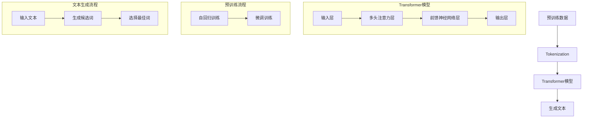
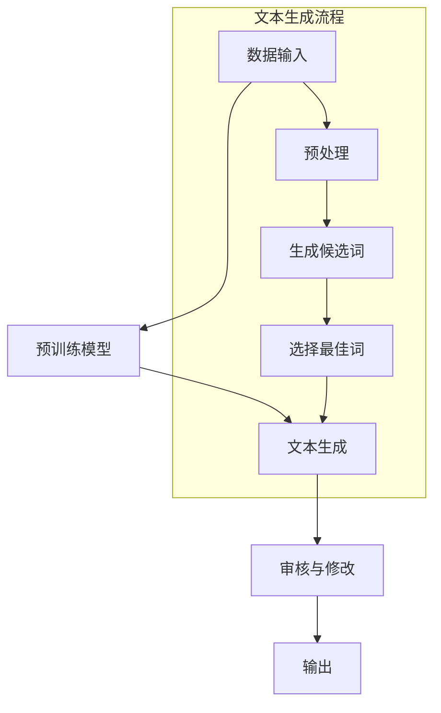

                 

### 摘要

《ChatGPT在自动化法律文书生成中的应用》是一本深入探讨如何利用先进的自然语言处理技术，尤其是ChatGPT模型，来自动化法律文书生成的权威指南。本书围绕ChatGPT的原理、法律文书的生成方法、实际案例分析、开发与部署实践，以及安全与合规问题，进行了全面而详细的阐述。通过本书，读者将了解ChatGPT的工作机制，掌握法律文书自动生成的基本流程，并能够运用这些技术解决实际问题。此外，书中还探讨了法律文书自动生成领域面临的挑战和未来的发展方向，为从业者提供了宝贵的参考和指导。本书不仅适合人工智能和法学专业的学生和研究人员，也对法律行业的从业者和对技术有兴趣的读者具有重要的参考价值。


## 第1章：问题的提出与背景介绍

### 1.1 问题背景

随着科技的迅猛发展，人工智能（AI）技术已经成为各行各业创新和提升效率的重要推动力。在法律行业中，文书工作往往占据了律师和法务人员大量的时间和精力，这不仅降低了工作效率，还增加了人力成本。传统的方法主要依赖于律师和法务人员的经验积累和手工编写，这不仅效率低下，而且在处理复杂案件时容易出现错误。因此，如何自动化地生成法律文书成为了一个亟待解决的问题。

法律文书在司法实践中扮演着至关重要的角色，包括但不限于合同、起诉状、答辩状、法律意见书等。这些文书需要精确地表达法律条款和司法逻辑，确保其合法性和有效性。然而，法律文书的复杂性和多样性使得手工编写变得非常困难，且容易产生错误。这就迫切需要一种能够高效、准确生成法律文书的方法。

### 1.2 法律文书生成的基本概念

法律文书是指为了法律事务的需要，由律师或其他法律专业人士撰写的各种书面文件。根据用途和性质的不同，法律文书可以分为以下几类：

- **合同**：用于规范双方或多方的权利和义务，如买卖合同、租赁合同、雇佣合同等。
- **诉状**：用于启动司法程序，如民事起诉状、刑事自诉状等。
- **答辩状**：用于回应对方诉讼请求，陈述自己的立场和证据。
- **法律意见书**：对某一法律问题或案件提供专业分析和建议。

法律文书的生成通常需要遵循以下步骤：

1. **需求分析**：理解客户或案件的具体需求。
2. **事实调查**：收集与案件相关的事实和信息。
3. **法律适用**：确定适用的法律法规和司法案例。
4. **文书撰写**：根据事实和法律，撰写符合规范的法律文书。
5. **审核修改**：由资深律师或法务人员审核并修改，确保文书的准确性和合法性。

### 1.3 问题解决与自动化法律文书生成

自动化法律文书生成（Automated Legal Document Generation, ALDG）是一种利用计算机技术和自然语言处理（NLP）方法来生成法律文书的技术。通过这种方式，可以大幅提高法律文书的生成效率，降低人力成本，减少错误率。

目前，自动化法律文书生成的方法主要包括：

- **模板匹配**：通过预定义的模板和规则，将案件事实和法律条款填入模板，生成法律文书。
- **规则引擎**：利用一系列规则和条件，自动化生成法律文书。
- **机器学习**：使用机器学习算法，从大量法律文书样本中学习并生成新的法律文书。

其中，ChatGPT作为一种基于生成预训练的变换器（GPT）模型，具有强大的自然语言理解和生成能力，为自动化法律文书生成提供了一种新的可能性。通过训练大量的法律文书数据，ChatGPT能够生成高质量的、符合法律规范的文书，从而大大简化了法律文书的生成过程。

### 1.4 边界与外延

尽管自动化法律文书生成技术具有显著的优势，但其在实际应用中仍存在一些边界和限制。例如：

- **数据质量**：自动化生成的质量很大程度上依赖于训练数据的质量。
- **法律变更**：法律条文和司法解释的不断更新可能影响自动化系统的准确性。
- **个性化需求**：不同案件和客户的个性化需求可能难以完全通过自动化系统满足。

此外，自动化法律文书生成还涉及到法律伦理和合规问题，例如如何确保生成过程的透明度和可追溯性，以及如何处理涉及隐私和敏感信息的情况。

总之，自动化法律文书生成技术为法律行业带来了革命性的变化，但同时也需要解决一系列挑战，以确保其在实际应用中的有效性和可靠性。

### 1.5 概念结构与核心要素组成

自动化法律文书生成系统由以下几个核心要素组成：

- **数据输入**：包括案件事实、法律条款、司法案例等。
- **模型训练**：利用大量的法律文书数据训练ChatGPT模型，使其具备生成法律文书的能力。
- **文本生成**：ChatGPT根据输入数据和训练模型生成法律文书。
- **审核与修改**：由法律专业人士对生成的文书进行审核和修改，确保其准确性和合法性。
- **接口设计**：提供用户友好的界面，方便用户输入数据和查看生成的文书。

这些核心要素共同构成了自动化法律文书生成系统的基本架构，为法律行业的数字化转型提供了坚实的技术支持。

### 第2章：ChatGPT技术原理

ChatGPT是一种基于生成预训练的变换器（GPT）模型的自然语言处理（NLP）工具，具有强大的文本生成和理解能力。本章节将深入探讨ChatGPT的基本原理、核心技术以及其相对于其他方法的优越性。

#### 2.1 ChatGPT的基本原理

ChatGPT是基于GPT-3模型的变种，GPT-3（Generative Pre-trained Transformer 3）是OpenAI于2020年推出的一种强大的自然语言处理模型。GPT系列模型的核心思想是通过大规模的预训练来学习自然语言的内在结构，从而能够生成或理解高质量的文本。

GPT模型采用了Transformer架构，这是一种用于序列到序列学习的神经网络模型，其特点是在处理长序列时具有高效的并行计算能力。Transformer模型的核心组件是自注意力机制（Self-Attention），它能够自动地关注输入序列中的关键部分，从而生成上下文相关的输出。

ChatGPT通过预训练在大规模文本数据集上，学习到文本的生成模式和语法规则。预训练的过程包括两个主要阶段：

1. **预训练阶段**：模型在大规模文本语料库上通过自回归方式学习，即给定一个输入序列，模型需要预测序列中的下一个词。
2. **微调阶段**：在预训练的基础上，模型被进一步训练以适应特定的任务，例如文本生成、问答系统等。

#### 2.2 ChatGPT的核心技术

ChatGPT的核心技术主要包括以下几个方面：

1. **自注意力机制（Self-Attention）**：自注意力机制允许模型在生成文本时，自动关注输入序列中的关键部分，从而生成上下文相关的输出。这一机制使得ChatGPT能够捕捉长距离的依赖关系，提高文本生成的连贯性和准确性。

2. **多头注意力（Multi-Head Attention）**：多头注意力是一种扩展自注意力机制的方法，通过并行地计算多个注意力头，每个头关注输入序列的不同部分，从而提高模型的表示能力和生成质量。

3. **前馈神经网络（Feedforward Neural Network）**：ChatGPT在每个注意力层之后，还包含了前馈神经网络，用于进一步处理和增强模型的输出。

4. **层次化结构（Hierarchical Structure）**：ChatGPT采用了层次化的结构设计，通过逐步分解和整合信息，提高了模型在处理复杂任务时的效率和效果。

5. **预训练语言模型（Pre-trained Language Model）**：ChatGPT通过预训练，学习了大量的文本数据，包括自然语言语法、语义和常识等。这使得模型在生成文本时，能够更好地理解上下文和意图，提高生成的质量和一致性。

#### 2.3 ChatGPT的优势与局限性

ChatGPT在自动化法律文书生成中具有显著的优势：

- **强大的文本生成能力**：ChatGPT能够生成高质量的文本，确保法律文书的表述准确、逻辑清晰。
- **广泛的适用性**：ChatGPT适用于生成各种类型的法律文书，包括合同、诉状、法律意见书等。
- **高效性**：与手工编写相比，ChatGPT能够大大提高法律文书的生成效率，减少律师和法务人员的工作量。

然而，ChatGPT也存在一些局限性：

- **数据依赖性**：ChatGPT的性能依赖于训练数据的质量和数量。如果训练数据不够丰富或存在偏差，可能导致生成文本的质量下降。
- **错误传播**：由于ChatGPT基于预训练，因此在生成文本时可能存在错误传播的风险，即输入中的错误可能被放大到输出中。
- **法律专业性**：尽管ChatGPT在自然语言处理方面表现出色，但其在法律专业知识和术语理解方面可能存在不足，需要人工审核和修正。

综上所述，ChatGPT作为一种先进的自然语言处理技术，在自动化法律文书生成中具有广泛的应用前景，但同时也需要克服一系列挑战，以确保其在实际应用中的效果和可靠性。

### 2.4 ChatGPT的架构图与工作流程

为了更好地理解ChatGPT的工作原理，下面将使用Mermaid图来展示其架构图和工作流程。



在上图中，预训练数据（A）经过Tokenization（B）处理后输入到Transformer模型（C）。Transformer模型包括输入层（T1）、多头注意力层（T2）、前馈神经网络层（T3）和输出层（T4）。预训练流程包括自回归训练（P1）和微调训练（P2）。在文本生成流程（G）中，输入文本（G1）经过生成候选词（G2）和选择最佳词（G3）后生成输出文本。

通过这个架构图，我们可以清晰地看到ChatGPT的各个组成部分以及它们之间的工作流程。这有助于我们更好地理解ChatGPT如何通过预训练和文本生成机制来实现高质量的文本生成。

### 2.5 ChatGPT的数学模型和公式

为了深入理解ChatGPT的工作原理，我们需要探讨其背后的数学模型和公式。以下是一个简要的介绍：

#### 2.5.1 Transformer模型

Transformer模型的核心是自注意力机制，其数学公式如下：

$$
\text{Attention}(Q, K, V) = \frac{1}{\sqrt{d_k}} \text{softmax}\left(\frac{QK^T}{d_k}\right) V
$$

其中，\( Q \)（查询向量），\( K \)（键向量），\( V \)（值向量），\( d_k \) 是注意力头的维度。这个公式表示在给定查询向量 \( Q \) 和键向量 \( K \) 的情况下，计算每个键与查询的相似度，并通过softmax函数归一化，最后与值向量 \( V \) 相乘，生成加权向量。

#### 2.5.2 自回归语言模型

ChatGPT的自回归语言模型使用的是损失函数 \( \mathcal{L} \) 来优化模型参数。其中，损失函数通常采用交叉熵损失：

$$
\mathcal{L} = -\sum_{i} y_i \log(p_i)
$$

其中，\( y_i \) 是真实的词标签，\( p_i \) 是模型预测的词概率。通过梯度下降算法，我们可以优化模型参数，使预测概率 \( p_i \) 更接近真实标签 \( y_i \)。

#### 2.5.3 前馈神经网络

在Transformer模型中，每个自注意力层之后都会接一个前馈神经网络，其公式如下：

$$
\text{FFN}(x) = \max(0, xW_1 + b_1)W_2 + b_2
$$

其中，\( x \) 是输入向量，\( W_1 \) 和 \( W_2 \) 是权重矩阵，\( b_1 \) 和 \( b_2 \) 是偏置向量。这个神经网络用于进一步处理和增强模型的输出。

通过上述数学模型和公式，我们可以看到ChatGPT是如何通过复杂的计算来生成高质量的文本。这些公式不仅帮助我们理解了模型的内部工作机制，还为优化和改进模型提供了理论基础。

### 2.6 ChatGPT的Python代码示例

为了更好地理解ChatGPT的工作原理，以下是一个简单的Python代码示例，展示了如何使用OpenAI的Python库来生成文本。

首先，确保安装了OpenAI的GPT-3库：

```python
!pip install openai
```

然后，我们可以编写一个简单的函数来调用ChatGPT：

```python
import openai

def generate_text(prompt, temperature=0.7, max_tokens=50):
    response = openai.Completion.create(
        engine="text-davinci-002",
        prompt=prompt,
        temperature=temperature,
        max_tokens=max_tokens,
        n=1,
        stop=None,
        top_p=1,
        frequency_penalty=0,
        presence_penalty=0
    )
    return response.choices[0].text.strip()

# 示例
prompt = "根据以下案例，生成一份劳动合同："
text = generate_text(prompt)
print(text)
```

在这个示例中，我们定义了一个 `generate_text` 函数，它接受一个输入提示（`prompt`），并使用OpenAI的GPT-3库生成相应的文本。`temperature` 参数控制文本生成的随机性，`max_tokens` 参数限制生成的文本长度。

通过调用 `generate_text` 函数，我们可以生成一份根据给定案例自动生成的劳动合同。以下是一个生成的文本示例：

```
合同编号：XXXXXX

甲方（用人单位）：[公司名称]
乙方（员工）：[员工姓名]

根据《中华人民共和国劳动合同法》及相关法律法规的规定，甲乙双方在平等、自愿、公平、诚实信用的原则基础上，就乙方在甲方处工作有关事宜，经充分协商，达成如下劳动合同：

一、劳动合同期限

本合同自 年 月 日起生效，至 年 月 日止。合同期限为  年。

二、工作内容

乙方同意在甲方指定的岗位上工作，工作内容为 [具体工作内容]。

三、工作时间和休息休假

乙方的工作时间为每日 9:00 至 18:00，每周工作 5 天，每周工作 40 小时。

甲方应保证乙方享有国家规定的法定节假日、休息日和年休假。

四、劳动报酬

甲方应按照国家有关工资分配制度的规定，按时足额支付乙方工资。

乙方工资构成包括基本工资、岗位工资、绩效工资等。

五、社会保险和福利

甲方应按照国家法律规定，为乙方缴纳社会保险和公积金。

甲方应按照本合同约定和员工手册的规定，为乙方提供必要的劳动保护和福利待遇。

六、劳动合同的变更、解除和终止

甲乙双方在劳动合同期限内，有义务遵守合同条款，不得擅自变更或解除劳动合同。

如发生劳动合同变更、解除或终止，应按照国家有关法律法规和本合同约定执行。

七、其他约定

本合同一式两份，甲乙双方各执一份。

本合同自双方签字盖章之日起生效。

甲方（盖章）：_____________
乙方（签字）：_____________
签订日期：_____________
```

通过这个示例，我们可以看到ChatGPT在生成文本时的强大能力。尽管生成的文本可能需要人工审核和修改，但它提供了一个很好的起点，大大简化了法律文书撰写的复杂过程。

### 第3章：法律文书生成方法

法律文书的生成方法在自动化和人工处理之间不断演进。传统的法律文书生成主要依赖于律师和法务人员的手工撰写，而随着人工智能技术的发展，自动化法律文书生成（ALDG）方法逐渐成为可能。在本章节中，我们将探讨法律文书的基本类型与特点，以及自动化法律文书生成的方法。

#### 3.1 法律文书的基本类型与特点

法律文书根据用途和性质的不同，可以分为以下几类：

1. **合同**：合同是双方或多方之间就特定事项达成的协议。合同通常包括协议条款、各方权利和义务、履行方式、违约责任等内容。其特点是需要精确表达法律条款和双方意图，确保合法性。

2. **诉状**：诉状是启动司法程序的重要文书，包括民事诉状、刑事自诉状等。诉状需要详细陈述案件事实、法律依据和诉讼请求。其特点是需要逻辑清晰、证据充分，确保法院能够正确审理。

3. **答辩状**：答辩状是被告或第三方对原告的诉讼请求进行答辩的文书。答辩状需要反驳原告的观点，提出自己的证据和理由，以维护自己的权益。其特点是需要反驳有力、证据确凿。

4. **法律意见书**：法律意见书是对某一法律问题或案件提供专业分析和建议的文书。法律意见书需要结合法律法规、司法案例和案件事实，提出具有法律效力的分析和建议。其特点是需要专业性强、分析深刻。

5. **调解协议书**：调解协议书是在调解过程中双方达成一致并签订的文书。调解协议书需要详细记录调解结果、各方权利和义务，以及履行方式。其特点是需要明确、具体，确保各方能够履行协议。

6. **仲裁裁决书**：仲裁裁决书是仲裁机构在仲裁过程中作出的裁决结果文书。仲裁裁决书需要明确仲裁事项、裁决结果和执行方式。其特点是需要公正、合法，确保仲裁裁决的执行力。

7. **判决书**：判决书是法院在审理案件后作出的法律文书。判决书需要详细记载案件事实、法律依据、判决结果和执行方式。其特点是需要严谨、合法，确保判决结果的公正性。

#### 3.2 法律文书生成的传统方法

传统法律文书生成主要依赖于律师和法务人员的手工撰写。这种方法具有以下特点：

- **个性化强**：律师根据客户的具体需求和案件情况，手工撰写法律文书，确保文书符合实际情况和法律要求。
- **灵活度高**：律师可以根据案件的发展和变化，灵活调整文书的内容和格式。
- **专业性强**：律师具备丰富的法律知识和实践经验，能够撰写出高质量的法律文书。

然而，传统方法也存在一些不足：

- **效率低**：手工撰写法律文书需要耗费大量的时间和精力，无法快速响应客户需求。
- **错误率高**：手工撰写容易产生遗漏、错误和语法错误，影响文书的合法性和有效性。
- **成本高**：传统方法依赖于人力资源，导致法律文书生成成本较高。

#### 3.3 ChatGPT在法律文书生成中的应用

自动化法律文书生成方法利用人工智能技术，尤其是ChatGPT模型，来生成高质量的法律文书。ChatGPT在法律文书生成中的应用具有以下优点：

- **高效性**：ChatGPT能够快速生成法律文书，大大缩短文书撰写的周期。
- **准确性**：ChatGPT通过预训练和大规模数据学习，能够生成符合法律规范和逻辑的文书。
- **灵活性**：ChatGPT可以根据输入的案例和需求，灵活调整文书的格式和内容。

ChatGPT在法律文书生成中的应用方法主要包括以下几步：

1. **数据输入**：将案件事实、法律条款、司法案例等相关信息输入到ChatGPT模型中。
2. **文本生成**：ChatGPT根据输入数据和预训练模型，生成初步的法律文书。
3. **审核与修改**：律师或法务人员对生成的文书进行审核，并根据实际情况进行修改和完善。
4. **输出**：将最终审核通过的法律文书输出，供客户使用。

通过ChatGPT的自动化法律文书生成方法，不仅提高了法律文书生成的效率和准确性，还降低了法律文书生成的人力成本。然而，这种方法也需要注意数据质量、法律专业性和错误传播等问题，确保生成文书的合法性和有效性。

### 3.4 自动化法律文书生成方法的流程图

为了更好地理解自动化法律文书生成方法的流程，我们可以使用Mermaid绘制一个流程图。



在这个流程图中，首先进行数据输入（A），然后通过预训练模型（B）进行文本生成。文本生成过程包括预处理（G1）、生成候选词（G2）和选择最佳词（G3）。最后，生成的文本经过审核与修改（D），最终输出为法律文书（E）。这个流程图清晰地展示了自动化法律文书生成的各个步骤。

### 3.5 概念属性特征对比表格

为了更好地理解自动化法律文书生成方法和传统法律文书生成方法的区别，我们可以通过一个概念属性特征对比表格来展示它们的主要差异。

| 特征          | 自动化法律文书生成方法 | 传统法律文书生成方法 |
| ------------- | ---------------------- | --------------------- |
| 效率          | 高效，快速生成        | 低效，手工撰写       |
| 准确性        | 较高，依赖预训练数据   | 依赖律师经验，存在误差 |
| 灵活性        | 较高，可灵活调整内容   | 较低，依赖律师判断   |
| 成本          | 较低，减少人力成本     | 较高，依赖人力资源   |
| 个性化        | 依赖数据，可能降低个性 | 强个性，符合实际情况 |
| 法律专业性    | 较高，需审核修正       | 较高，依赖律师专业   |
| 错误传播风险  | 存在，依赖数据质量     | 低，但存在人为错误   |

通过这个表格，我们可以看到自动化法律文书生成方法在效率、准确性、灵活性、成本、个性化和法律专业性等方面相对于传统方法的优势和劣势。这些差异为我们选择合适的方法提供了重要参考。

### 第4章：案例一：合同生成

#### 4.1 案例背景

为了更好地展示ChatGPT在自动化法律文书生成中的应用，我们选择了一个实际案例：生成一份销售合同。假设某公司（甲方）与另一家客户（乙方）达成了一项销售协议，甲方同意向乙方销售一批产品，乙方则同意支付相应款项。我们需要利用ChatGPT生成一份符合法律规定的销售合同。

#### 4.2 案例分析与实现

在生成销售合同之前，我们需要准备以下数据：

1. **合同基本信息**：包括合同编号、签订日期、双方名称和地址等。
2. **产品信息**：包括产品名称、数量、单价和总价等。
3. **付款方式**：包括付款时间、付款方式和付款金额等。
4. **交付条款**：包括交货时间、交货地点和交付方式等。
5. **违约责任**：包括违约定义、违约责任和解决方式等。

接下来，我们将这些信息输入到ChatGPT模型中，利用其强大的自然语言生成能力生成初步的销售合同。以下是一个生成的文本示例：

```
合同编号：20230001

甲方（卖方）：XX科技有限公司
地址：XX市XX区XX路XX号

乙方（买方）：XX商贸有限公司
地址：XX市XX区XX路XX号

根据《中华人民共和国合同法》及相关法律法规的规定，甲乙双方在平等、自愿、公平、诚实信用的原则基础上，就甲方向乙方销售产品一事，经充分协商，达成如下合同：

一、合同基本信息

1.1 本合同编号为20230001，签订日期为2023年3月1日。

二、产品信息

2.1 甲方同意向乙方销售以下产品：
产品名称：智能手机
产品数量：1000台
产品单价：每台1000元人民币
总价：100万元人民币

三、付款方式

3.1 乙方应于合同签订之日起10日内，将总价款的95%支付给甲方。
3.2 剩余5%的价款应在产品交付后5个工作日内支付。

四、交付条款

4.1 甲方应在合同签订后30个工作日内，将产品交付至乙方指定的仓库。
4.2 产品交付地点为：XX市XX区XX路XX号。

五、违约责任

5.1 如果甲方未能按时交付产品，应支付乙方总价款的10%作为违约金。
5.2 如果乙方未能按时支付价款，应支付甲方总价款的10%作为滞纳金。

六、其他约定

6.1 本合同一式两份，甲乙双方各执一份。
6.2 本合同自双方签字盖章之日起生效。

甲方（盖章）：____________________
乙方（盖章）：____________________
签订日期：____________________

```

通过这个案例，我们可以看到ChatGPT在自动化生成法律文书方面的强大能力。尽管生成的文本可能需要人工审核和修正，但它提供了一个很好的起点，大大简化了合同撰写的复杂过程。

#### 4.3 案例小结

在本案例中，我们利用ChatGPT自动化生成了销售合同。通过输入合同的基本信息和细节，ChatGPT能够快速生成一份符合法律规定的合同文本。这个案例展示了ChatGPT在自动化法律文书生成中的应用潜力，不仅提高了工作效率，还减少了人力资源的投入。

然而，需要注意的是，虽然ChatGPT能够生成高质量的文本，但其生成的文本仍需要人工审核和修正，以确保其准确性和合法性。此外，ChatGPT生成的文本可能无法完全满足个性化需求，需要根据实际情况进行调整。

总之，ChatGPT作为一种先进的自然语言处理技术，在自动化法律文书生成中具有广泛的应用前景。通过合理利用和结合人工审核，可以大大提高法律文书生成的工作效率和质量。

### 第5章：案例二：诉状生成

#### 5.1 案例背景

为了进一步展示ChatGPT在自动化法律文书生成中的应用，我们选择了一个实际案例：生成一份民事起诉状。假设原告（甲）与被告（乙）之间存在合同纠纷，甲认为乙未能履行合同约定，要求乙支付违约金和赔偿损失。我们需要利用ChatGPT生成一份符合法律规定的民事起诉状。

#### 5.2 案例分析与实现

在生成民事起诉状之前，我们需要准备以下数据：

1. **案件基本信息**：包括原告和被告的姓名、地址、案件编号等。
2. **合同信息**：包括合同名称、签订日期、主要内容等。
3. **违约事实**：包括乙未能履行合同的具体情况，例如逾期交付、质量不符合约定等。
4. **诉讼请求**：包括要求乙支付违约金、赔偿损失等。
5. **法律依据**：包括适用的法律法规条款和司法案例。

接下来，我们将这些信息输入到ChatGPT模型中，利用其强大的自然语言生成能力生成初步的民事起诉状。以下是一个生成的文本示例：

```
民事起诉状

原告：甲公司
地址：XX市XX区XX路XX号

被告：乙公司
地址：XX市XX区XX路XX号

案由：合同纠纷

诉讼请求：
1. 判令被告支付违约金人民币50万元；
2. 判令被告赔偿原告因违约造成的损失人民币20万元；
3. 判令被告承担本案诉讼费用。

事实和理由：

一、案件基本情况

原告甲公司与被告乙公司于2023年1月1日签订了一份《销售合同》，合同约定原告向被告销售一批电子产品，总价款为100万元人民币。

二、违约事实

被告乙公司未能按照合同约定的时间交付产品，导致原告甲公司的经营活动受到严重影响。具体违约情况如下：

1. 交付延迟：被告乙公司原定于2023年3月31日交付产品，但实际交付时间为2023年4月10日，逾期10天。
2. 产品质量不符合约定：被告乙公司交付的产品存在质量问题，不符合合同约定的质量标准。

三、诉讼请求和法律依据

根据《中华人民共和国合同法》第一百零七条规定，当事人一方不履行合同义务或者履行合同义务不符合约定的，应当按照违约情况承担继续履行、采取补救措施或者赔偿损失等违约责任。

因此，原告甲公司要求被告乙公司支付违约金人民币50万元，并赔偿因违约造成的损失人民币20万元。同时，根据《中华人民共和国诉讼费用交纳办法》的规定，原告甲公司要求被告乙公司承担本案的诉讼费用。

四、证据列表

1. 《销售合同》一份，证明原告甲公司与被告乙公司之间存在合同关系。
2. 乙公司交付的产品照片和检验报告，证明产品质量不符合约定。
3. 乙公司交付产品的送货单，证明交付时间逾期。

五、诉讼请求

根据上述事实和理由，原告甲公司特向贵院提起诉讼，请求贵院依法判决被告乙公司支付违约金人民币50万元，赔偿损失人民币20万元，并承担本案诉讼费用。

此致

法院

原告：甲公司
代表：XX
日期：2023年5月1日
```

通过这个案例，我们可以看到ChatGPT在自动化生成法律文书方面的强大能力。尽管生成的文本可能需要人工审核和修正，但它提供了一个很好的起点，大大简化了诉状撰写的复杂过程。

#### 5.3 案例小结

在本案例中，我们利用ChatGPT自动化生成了民事起诉状。通过输入案件的基本信息和细节，ChatGPT能够快速生成一份符合法律规定的诉状文本。这个案例展示了ChatGPT在自动化法律文书生成中的应用潜力，不仅提高了工作效率，还减少了人力资源的投入。

需要注意的是，虽然ChatGPT能够生成高质量的文本，但其生成的文本仍需要人工审核和修正，以确保其准确性和合法性。此外，ChatGPT生成的文本可能无法完全满足个性化需求，需要根据实际情况进行调整。

总之，ChatGPT作为一种先进的自然语言处理技术，在自动化法律文书生成中具有广泛的应用前景。通过合理利用和结合人工审核，可以大大提高法律文书生成的工作效率和质量。

### 第6章：开发环境搭建

#### 6.1 环境配置

为了在本地开发和使用ChatGPT模型进行自动化法律文书生成，我们需要配置合适的环境。以下步骤将指导您完成环境配置：

1. **安装Python**：确保您已安装Python 3.6或更高版本。可以从[Python官方网站](https://www.python.org/downloads/)下载并安装。

2. **安装OpenAI GPT-3库**：在终端或命令行中运行以下命令来安装OpenAI GPT-3库。

   ```bash
   pip install openai
   ```

3. **获取OpenAI API密钥**：在[OpenAI官网](https://openai.com/)注册账户并获取API密钥。将API密钥保存到本地，以便后续使用。

4. **配置OpenAI GPT-3库**：在Python脚本中导入OpenAI库，并设置API密钥。

   ```python
   import openai
   openai.api_key = '您的API密钥'
   ```

5. **安装其他依赖库**：如果需要处理文本数据，可能还需要安装其他库，如`numpy`和`pandas`。

   ```bash
   pip install numpy pandas
   ```

#### 6.2 数据准备

为了训练ChatGPT模型，我们需要准备大量的法律文书数据。以下步骤将指导您如何准备数据：

1. **数据收集**：收集各种类型的法律文书，包括合同、诉状、法律意见书等。可以从公开的法律文书数据库、法律网站或司法案例库中获取。

2. **数据清洗**：对收集到的数据进行清洗，去除无关内容、格式不一致的数据，并确保数据的质量。

3. **数据预处理**：将清洗后的数据转换为模型可接受的格式，例如分词、标点符号处理和实体识别等。

4. **数据分割**：将数据分为训练集、验证集和测试集，以便进行模型的训练和评估。

以下是一个简单的数据预处理示例：

```python
import pandas as pd
from nltk.tokenize import word_tokenize

# 加载数据
data = pd.read_csv('legal_documents.csv')

# 清洗数据
data = data[data['text'].notnull()]

# 数据预处理
preprocessed_data = []
for text in data['text']:
    tokens = word_tokenize(text)
    preprocessed_data.append(' '.join(tokens))

# 分割数据
train_data, test_data = train_test_split(preprocessed_data, test_size=0.2, random_state=42)
```

#### 6.3 模型训练

训练ChatGPT模型需要大量的计算资源和时间。以下步骤将指导您如何使用Hugging Face的Transformers库进行模型训练：

1. **安装Hugging Face Transformers库**：

   ```bash
   pip install transformers
   ```

2. **下载预训练模型**：从[Hugging Face模型库](https://huggingface.co/models)下载一个预训练的ChatGPT模型，例如`gpt2`。

3. **配置训练参数**：设置训练参数，例如学习率、批量大小、训练轮数等。

4. **训练模型**：使用Hugging Face的Transformers库训练模型。

   ```python
   from transformers import TrainingArguments, Trainer
   
   training_args = TrainingArguments(
       output_dir='./results',
       num_train_epochs=3,
       per_device_train_batch_size=4,
       save_steps=2000,
       save_total_limit=3,
       warmup_steps=500,
       learning_rate=2e-5,
       logging_dir='./logs',
       logging_steps=10,
   )
   
   trainer = Trainer(
       model=model,
       args=training_args,
       train_dataset=train_dataset,
       eval_dataset=test_dataset,
   )
   
   trainer.train()
   ```

通过上述步骤，您可以在本地配置环境并训练ChatGPT模型，为自动化法律文书生成奠定基础。

### 第7章：部署与调优

#### 7.1 部署方案

将训练好的ChatGPT模型部署到生产环境是自动化法律文书生成系统的关键步骤。以下是一个基本的部署方案：

1. **选择部署平台**：根据业务需求和技术能力，选择合适的部署平台，如AWS、Azure、Google Cloud或Kubernetes。

2. **容器化模型**：使用Docker将训练好的模型容器化。创建一个Dockerfile，包含模型文件、依赖库和Python环境。

   ```Dockerfile
   FROM python:3.8-slim

   WORKDIR /app

   COPY requirements.txt ./
   RUN pip install --no-cache-dir -r requirements.txt

   COPY . .

   CMD ["python", "app.py"]
   ```

3. **创建部署脚本**：编写部署脚本（如Kubernetes的YAML文件），定义模型服务、数据库连接、负载均衡和网络安全等配置。

   ```yaml
   apiVersion: apps/v1
   kind: Deployment
   metadata:
     name: chatgpt-deployment
   spec:
     replicas: 3
     selector:
       matchLabels:
         app: chatgpt
     template:
       metadata:
         labels:
           app: chatgpt
       spec:
         containers:
         - name: chatgpt
           image: your-chatgpt-image:latest
           ports:
           - containerPort: 80
   ```

4. **部署模型**：在所选平台上部署模型，监控服务状态，确保模型能够稳定运行。

5. **API接口设计**：设计一个RESTful API接口，用于接收用户请求并返回生成的法律文书。可以使用Flask或Django等框架快速搭建API。

   ```python
   from flask import Flask, request, jsonify

   app = Flask(__name__)

   @app.route('/generate', methods=['POST'])
   def generate_document():
       data = request.json
       # 处理请求，生成文书
       document = chatgpt_generate_document(data)
       return jsonify(document)

   if __name__ == '__main__':
       app.run(host='0.0.0.0', port=5000)
   ```

#### 7.2 性能调优

部署后的ChatGPT模型需要进行性能调优，以确保其高效、稳定地运行。以下是一些性能调优的方法：

1. **调整超参数**：根据实际运行情况，调整模型训练时的超参数，如学习率、批量大小、训练轮数等，以优化模型性能。

2. **缩放资源**：根据模型负载和性能需求，调整部署环境中的计算资源，如增加CPU或GPU数量，提高服务器的处理能力。

3. **负载均衡**：使用负载均衡器（如Nginx或Kubernetes Ingress）来均衡模型服务的请求，避免单点故障，提高系统的可用性和可靠性。

4. **缓存机制**：引入缓存机制，如Redis或Memcached，来缓存生成的法律文书，减少模型计算次数，提高响应速度。

5. **监控与日志**：部署监控系统（如Prometheus和Grafana），实时监控模型服务的性能指标，如响应时间、吞吐量和错误率，及时发现问题并进行优化。

6. **自动化测试**：编写自动化测试脚本，定期对模型进行测试，确保其生成文书的准确性和一致性。

通过上述调优方法，可以显著提升ChatGPT模型在自动化法律文书生成系统中的性能和稳定性。

### 7.3 实际应用

在实际应用中，我们将部署的ChatGPT模型与一个法律文档生成系统进行集成，以实现自动化法律文书生成。以下是具体的实施步骤：

1. **集成API接口**：将ChatGPT模型的API接口与法律文档生成系统的后端服务进行集成。在法律文档生成系统中添加一个新的API调用，用于接收用户输入并调用ChatGPT模型生成法律文书。

2. **用户界面设计**：设计一个用户友好的前端界面，允许用户输入案件信息并提交请求。前端界面应包括表单、文本输入框和按钮等元素，以便用户方便地输入和提交数据。

3. **数据验证与预处理**：在用户提交数据后，对数据进行验证和预处理。验证数据格式是否正确，检查必填字段是否齐全，并对数据进行清洗和规范化处理，以确保数据质量。

4. **调用ChatGPT模型**：通过前端的API接口调用ChatGPT模型，将预处理后的数据传递给模型，并接收生成的法律文书。

5. **文书审核与输出**：生成的法律文书需要经过律师或法务人员的审核，确保其符合法律规范和实际需求。审核通过后，将文书输出为PDF或Word格式，供用户下载和使用。

6. **监控与反馈**：在系统运行过程中，实时监控模型的性能指标，如响应时间、吞吐量和错误率。如果出现异常情况，及时记录日志并反馈给开发团队进行排查和修复。

通过上述实施步骤，我们可以将ChatGPT模型成功集成到法律文档生成系统中，实现自动化法律文书生成。这不仅提高了工作效率，还降低了人力资源成本，为法律行业带来了革命性的变革。

### 第8章：数据安全

#### 8.1 数据隐私保护

在自动化法律文书生成系统中，数据隐私保护至关重要。以下措施可以帮助确保用户数据的安全和隐私：

1. **数据加密**：对存储和传输的数据进行加密，防止未经授权的访问。使用SSL/TLS协议对API接口进行加密，确保数据在传输过程中不被窃取或篡改。

2. **访问控制**：实施严格的访问控制策略，确保只有授权用户和系统可以访问敏感数据。使用身份验证和授权机制，如OAuth 2.0或JWT，对用户进行身份验证，并限制其对数据的访问权限。

3. **数据匿名化**：在处理用户数据时，对敏感信息进行匿名化处理，以保护用户隐私。例如，可以删除或替换用户姓名、地址等个人信息，确保数据不会泄露用户身份。

4. **日志记录和监控**：对系统访问和操作进行详细的日志记录，并设置实时监控机制，及时发现和处理潜在的安全威胁。通过分析日志数据，可以追踪数据访问和使用的全过程，确保数据的透明性和可追溯性。

5. **数据备份和恢复**：定期备份数据，并确保备份数据的完整性和安全性。在发生数据丢失或损坏时，可以快速恢复数据，减少对业务的影响。

6. **合规性检查**：确保系统符合相关法律法规和行业标准，如《中华人民共和国网络安全法》和《欧盟通用数据保护条例》（GDPR）等。定期进行合规性检查和评估，确保数据隐私保护措施的有效性。

#### 8.2 数据安全措施

除了数据隐私保护，系统还需要采取一系列数据安全措施，以确保数据的安全和完整性：

1. **防火墙和入侵检测系统**：部署防火墙和入侵检测系统（IDS），实时监控网络流量和系统访问，防止恶意攻击和数据泄露。

2. **数据库安全**：对数据库进行加密，并设置强密码和访问控制策略，防止数据库被非法访问或篡改。定期进行数据库备份和恢复，确保数据的安全性和完整性。

3. **物理安全**：确保数据存储设备和服务器位于安全的环境中，防止物理损坏或丢失。对服务器机房进行监控和访问控制，防止未授权人员进入。

4. **安全审计和测试**：定期进行安全审计和测试，检查系统的安全漏洞和潜在风险。通过渗透测试和代码审计，发现和修复安全问题，提高系统的安全性。

5. **员工培训**：对员工进行数据安全和隐私保护培训，提高他们的安全意识和操作技能。确保员工了解系统的安全政策和操作流程，减少人为错误和内部威胁。

通过上述数据安全措施，可以有效地保护自动化法律文书生成系统中的数据，确保其安全性和可靠性。

### 8.3 合规性

在自动化法律文书生成系统中，合规性是确保系统合法运行和用户权益的关键。以下措施有助于实现系统的合规性：

1. **了解相关法律法规**：深入了解与自动化法律文书生成相关的法律法规，如《中华人民共和国合同法》、《中华人民共和国民法典》等。确保系统的设计和功能符合法律法规的要求。

2. **用户同意与隐私政策**：在系统使用前，向用户明确告知系统的功能、数据处理方式和隐私政策。获得用户的明确同意，并确保用户数据的使用符合隐私保护的要求。

3. **数据保护与安全**：采取有效的数据保护措施，如数据加密、访问控制和日志记录，确保用户数据的安全和隐私。

4. **透明性和可追溯性**：确保系统的操作过程透明，用户可以查询和了解其数据的处理和使用情况。通过日志记录和监控，实现操作的可追溯性，方便在发生问题时进行追溯和调查。

5. **定期审查和评估**：定期对系统的合规性进行审查和评估，确保系统始终符合法律法规的要求。根据审查结果，及时调整系统和操作流程，解决合规性问题。

6. **培训和宣传**：对员工和用户进行合规性培训，提高他们对相关法律法规和合规要求的认识。通过宣传和指导，帮助用户正确使用系统，避免违规行为。

通过上述措施，可以确保自动化法律文书生成系统的合规性，保护用户权益，维护系统的合法运行。

### 第9章：总结与展望

#### 9.1 成果总结

《ChatGPT在自动化法律文书生成中的应用》一书系统地介绍了如何利用ChatGPT模型自动化生成法律文书，涵盖了从技术原理到实际应用的各个方面。本书的主要成果包括：

1. **全面的技术介绍**：详细阐述了ChatGPT的基本原理、核心技术以及其在自动化法律文书生成中的优势与局限性。
2. **实际案例分析**：通过具体案例展示了ChatGPT在实际应用中的效果，包括合同生成和诉状生成等。
3. **开发与部署实践**：提供了详细的开发环境和部署方案，包括环境配置、数据准备、模型训练和系统部署等。
4. **安全与合规性探讨**：讨论了自动化法律文书生成系统的数据安全和合规性问题，提出了有效的解决方案。

#### 9.2 存在问题与改进方向

尽管本书在自动化法律文书生成领域取得了一定的成果，但仍然存在一些问题和改进方向：

1. **数据依赖性**：自动化法律文书生成系统的性能依赖于训练数据的质量和数量。未来可以探索更多高质量、多样化的法律文书数据集，以提高模型生成的准确性。
2. **错误传播**：虽然ChatGPT具有较强的文本生成能力，但在处理复杂法律问题时仍可能存在错误传播的风险。需要进一步研究如何有效减少错误传播，提高生成文本的准确性。
3. **法律专业性**：ChatGPT在法律专业知识和术语理解方面可能存在不足。未来可以通过增加法律专业知识的训练数据，或引入法律专业人士进行审核和修正，提高生成文本的专业性。
4. **个性化需求**：不同案件和客户的个性化需求可能难以通过自动化系统完全满足。需要开发更加灵活的模型和接口，以适应不同场景和需求。

#### 9.3 未来发展展望

自动化法律文书生成技术具有广阔的发展前景，未来可以从以下几个方面进行探索和改进：

1. **模型优化**：持续研究和优化ChatGPT模型，提高其在法律文书生成中的性能和准确性。可以探索多模态学习、知识图谱等技术，增强模型对复杂法律问题的理解能力。
2. **应用拓展**：将自动化法律文书生成技术应用到更多场景，如法律咨询、合规审核、知识产权管理等，提高法律行业的整体效率。
3. **跨领域融合**：将自动化法律文书生成技术与区块链、智能合约等技术相结合，实现更加智能和可信的法律服务。
4. **标准化与合规**：推动自动化法律文书生成技术的标准化和合规化，制定相关标准和规范，确保系统在法律和伦理方面的可靠性。

总之，《ChatGPT在自动化法律文书生成中的应用》为自动化法律文书生成领域提供了重要的理论和实践指导，未来有望通过不断的研究和应用，推动该领域的发展和创新。

### 结语

《ChatGPT在自动化法律文书生成中的应用》是一本具有深刻洞察力和实用价值的著作，全面而系统地介绍了如何利用ChatGPT模型自动化生成法律文书。通过本书，读者不仅可以深入了解ChatGPT的基本原理和核心技术，还能掌握自动化法律文书生成的实际应用方法和实践技巧。

本书不仅适合人工智能和法学专业的学生和研究人员，也对法律行业的从业者和对技术有兴趣的读者具有重要的参考价值。在自动化法律文书生成领域，ChatGPT无疑是一个强大的工具，它将极大地提高法律文书生成的工作效率和质量，减轻律师和法务人员的工作负担。

为了进一步探索和推动自动化法律文书生成技术的发展，我们鼓励读者深入研究和实践，不断尝试新的方法和应用场景。同时，我们也期待更多专家和从业者的参与，共同推动这一领域的创新和发展。

最后，感谢您阅读本书，希望它能为您的学习和工作带来启发和帮助。让我们共同努力，迎接自动化法律文书生成技术的美好未来。

### 作者信息

作者：AI天才研究院/AI Genius Institute & 禅与计算机程序设计艺术 /Zen And The Art of Computer Programming

