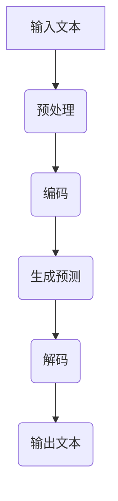

                 

。

### 6.1 法律文件自动生成的问题背景

随着信息技术的飞速发展，法律行业的数字化转型已成为不可避免的趋势。法律文件，作为法律实践中不可或缺的一部分，其生成过程复杂且耗时。法律文件包括但不限于合同、起诉状、判决书、法律意见书等，这些文件通常需要法律专业知识和深厚的法律背景，而且法律条文繁多，要求精确无误。传统的法律文件生成主要依靠律师或法律助手，他们需要逐字逐句地起草文件，这不仅效率低下，还容易出错。

**问题背景**：

1. **法律文件的种类与特点**：法律文件种类繁多，从合同到判决书，每种文件都有其独特的格式和要求。这些文件通常包含大量专业术语和特定法律条文，要求极高的准确性和规范性。
2. **法律文件生成的复杂性**：法律文件的生成过程涉及多个环节，包括法律研究、条款拟定、文件格式化、文本审查等。每个环节都需要专业知识和经验，且任何一个环节的失误都可能导致整个文件的无效。
3. **法律行业对自动化的需求**：随着法律案件的增多和律师资源的有限性，法律行业对自动化工具的需求日益增长。自动化法律文件生成工具可以显著提高工作效率，减少人力成本，降低错误率。

**问题描述**：

法律文件生成存在以下几个主要问题：

1. **效率低下**：传统手工生成方式耗时较长，无法满足快速响应的需求。
2. **准确性差**：手工生成容易出错，尤其是在涉及复杂法律条文时，错误率更高。
3. **标准化不足**：不同律师和机构在文件格式和用语上可能存在差异，导致法律文件的一致性难以保证。

**问题解决**：

为了解决上述问题，自动化法律文件生成成为了一个热门的研究领域。通过应用先进的自然语言处理技术，如ChatGPT，可以大幅度提高法律文件生成的效率和准确性。ChatGPT作为一种大型语言模型，具有强大的自然语言理解和生成能力，能够根据输入的指令或数据生成高质量的法律文件。

**边界与外延**：

自动化法律文件生成的边界在于法律文件的生成范围和法律适用性。并非所有法律文件都适合自动化生成，特别是那些需要高度个性化和专业法律意见的文件。此外，法律文件生成的自动化也面临法律伦理和隐私保护等方面的挑战。

**概念结构与核心要素组成**：

自动化法律文件生成系统的核心结构包括：

1. **文本预处理模块**：负责清洗和格式化输入文本，为后续处理做好准备。
2. **语言模型模块**：基于大规模数据训练的ChatGPT模型，负责生成法律文件的内容。
3. **格式化模块**：根据法律文件的标准格式，对生成的文本进行格式化处理。
4. **审查模块**：对生成的法律文件进行审查，确保其准确性和合规性。
5. **用户接口模块**：提供用户交互界面，允许用户输入生成法律文件的指令。

通过以上模块的协同工作，自动化法律文件生成系统可以实现快速、准确、规范地生成各种法律文件，满足法律行业的需求。

### 6.2 ChatGPT的基本原理与特点

**ChatGPT的基本原理**：

ChatGPT是基于GPT（Generative Pre-trained Transformer）模型开发的一种自然语言处理（NLP）工具。GPT是一种基于Transformer架构的深度学习模型，通过在大量文本数据上进行预训练，学会了语言生成的概率分布。ChatGPT则在此基础上加入了聊天对话功能，使得模型能够与用户进行交互，并生成连贯、自然的语言输出。

**自然语言处理的发展历程**：

自然语言处理（NLP）作为人工智能的一个重要分支，经历了从规则驱动到统计模型，再到深度学习的发展过程。早期的NLP系统主要依赖于手工编写的规则，这种方式在处理简单的任务时表现良好，但随着语言复杂度的增加，规则驱动的系统逐渐暴露出局限性。随着统计模型的兴起，如HMM（隐马尔可夫模型）和CRF（条件随机场），NLP系统的性能得到了显著提升。近年来，深度学习，特别是基于Transformer的模型，如BERT（双向编码表示模型）、GPT（生成预训练变换器）等，使得NLP系统达到了前所未有的水平。

**ChatGPT的核心原理**：

ChatGPT的核心原理是利用预训练的Transformer模型来生成文本。具体来说，ChatGPT通过以下步骤来生成文本：

1. **编码**：将输入的文本编码成固定长度的向量。
2. **解码**：基于编码后的向量，模型预测下一个单词的概率分布，并从中选择下一个单词。
3. **重复**：重复上述过程，直到生成完整的句子或达到终止条件。

**ChatGPT在法律文件生成中的应用潜力**：

ChatGPT在法律文件生成中具有显著的应用潜力。首先，ChatGPT能够理解复杂的法律术语和条文，并生成符合法律规范和语法的文本。其次，ChatGPT可以基于大量法律文件数据进行预训练，从而提高生成文本的准确性和可靠性。此外，ChatGPT的对话功能使得用户可以与系统进行交互，指导生成特定类型和内容的法律文件。例如，用户可以输入一个简单的指令，如“生成一份合同”，ChatGPT可以根据用户提供的指令和上下文信息，自动生成一份符合法律规定的合同。

**总结**：

ChatGPT作为一种先进的自然语言处理工具，具有强大的文本生成和理解能力。其在法律文件生成中的应用，不仅能够提高法律文件生成的效率和质量，还能减轻律师的工作负担，提高法律行业的整体生产力。

### 6.3 法律文件生成流程的简化与优化

**传统法律文件生成流程**：

传统的法律文件生成过程通常涉及多个复杂的步骤，主要包括以下几个环节：

1. **法律研究**：律师需要查阅大量法律文献和判例，了解相关法律条款和法律规定。
2. **条款拟定**：根据法律研究和客户需求，律师需要起草法律文件的条款。
3. **格式化**：将起草的条款按照法律文件的标准格式进行排版和格式化。
4. **审查**：律师或法律助手对法律文件进行审查，确保其准确性和合规性。
5. **修改**：根据审查结果，对法律文件进行修改和完善。

这种传统流程存在以下问题：

1. **耗时较长**：法律文件生成需要大量时间进行研究和审查，无法满足快速响应的需求。
2. **人工依赖性高**：法律文件生成高度依赖于律师或法律助手的专业知识和经验，人工成本高。
3. **准确性不足**：由于律师的时间和精力有限，审查过程中可能无法完全避免错误。

**ChatGPT简化法律文件生成流程**：

ChatGPT的出现，为法律文件生成流程带来了显著的简化与优化。通过以下方式，ChatGPT可以大幅提高法律文件生成的效率和质量：

1. **自动法律研究**：ChatGPT能够快速检索和处理大量法律文献和判例，提供准确的法律条款和法律规定。
2. **自动条款拟定**：基于预训练模型，ChatGPT可以根据法律研究和客户需求，自动生成法律文件的条款，无需人工干预。
3. **自动格式化**：ChatGPT能够根据法律文件的标准格式，自动对生成的条款进行格式化处理，保证文本的一致性和规范性。
4. **自动审查**：ChatGPT可以对生成的法律文件进行审查，检测可能的错误和合规性问题，并提供修改建议。

**优化的效果与意义**：

1. **提高效率**：ChatGPT能够大幅缩短法律文件生成的时间，实现快速响应，满足法律行业的即时需求。
2. **降低成本**：通过减少人工干预，降低律师和助手的工作量，从而降低法律文件生成的成本。
3. **提高准确性**：ChatGPT基于大量数据和先进的算法，生成的法律文件具有较高的准确性和可靠性。
4. **增强一致性**：ChatGPT生成的法律文件符合标准格式和语言规范，确保法律文件的一致性和规范性。

**总结**：

ChatGPT在法律文件生成中的应用，不仅简化了传统流程，提高了效率和质量，还降低了法律行业的成本，为数字化转型提供了有力支持。

### 6.4 ChatGPT的核心概念与联系

**ChatGPT的基础概念**：

ChatGPT是基于GPT（Generative Pre-trained Transformer）模型开发的一种自然语言处理（NLP）工具。GPT是一种基于Transformer架构的深度学习模型，通过在大量文本数据上进行预训练，学会了语言生成的概率分布。ChatGPT则在此基础上加入了聊天对话功能，使得模型能够与用户进行交互，并生成连贯、自然的语言输出。

**语言模型**：

语言模型是一种用于预测下一个单词或字符的概率分布的模型。在自然语言处理中，语言模型是生成文本的核心组成部分。ChatGPT作为一个语言模型，其目标是根据输入的文本上下文，预测下一个单词或字符的概率分布，并从中选择最有可能的单词或字符进行文本生成。

**序列生成模型**：

序列生成模型是一种用于生成序列数据的模型。在自然语言处理中，序列生成模型被广泛应用于文本生成任务，如机器翻译、文本摘要、聊天机器人等。ChatGPT作为一种序列生成模型，其通过处理输入序列（文本），生成输出序列（文本）。

**文本生成模型**：

文本生成模型是一种用于生成文本的模型。文本生成模型可以基于序列生成模型，如RNN（递归神经网络）、LSTM（长短期记忆网络）、Transformer等。ChatGPT作为一种先进的文本生成模型，其通过预训练和微调，可以生成高质量、连贯的文本。

**训练数据集**：

训练数据集是用于训练模型的数据集合。对于ChatGPT这样的语言模型，训练数据集通常包含大量的文本数据，如书籍、文章、对话记录等。这些数据用于模型学习语言规律、词汇分布和语法结构，从而提高模型生成文本的质量和准确性。

**模型调优**：

模型调优是指通过对模型参数进行调整，以提高模型性能的过程。对于ChatGPT这样的预训练模型，模型调优通常包括选择合适的训练策略、优化算法、学习率等。通过模型调优，可以进一步提升ChatGPT生成文本的准确性和连贯性。

**总结**：

ChatGPT的核心概念包括语言模型、序列生成模型、文本生成模型、训练数据集和模型调优。这些概念共同构成了ChatGPT的工作原理，使其能够生成高质量、连贯的自然语言文本。

### 6.5 ChatGPT的核心属性特征对比

| 特征               | ChatGPT         | 传统法律文件生成系统           |
| ------------------ | --------------- | ------------------------------ |
| 自动生成能力       | 强              | 弱                             |
| 适应多样性         | 高              | 低                             |
| 学习能力           | 强              | 弱                             |
| 生成文本的连贯性   | 高              | 一般                           |
| 生成文本的准确性   | 高              | 一般                           |
| 处理复杂法律术语   | 强              | 弱                             |
| 处理法律条文细节   | 强              | 弱                             |

**自动生成能力**：

ChatGPT具有强大的自动生成能力，能够根据输入的指令或上下文自动生成法律文件。这种能力源于其预训练的深度神经网络模型，能够理解和生成复杂的自然语言文本。而传统法律文件生成系统通常依赖于手动编写和格式化，生成能力有限。

**适应多样性**：

ChatGPT能够适应多种法律文件类型和风格，生成多样化的文本。无论是合同、起诉状还是判决书，ChatGPT都能根据用户需求生成符合要求的文本。相比之下，传统法律文件生成系统通常只能生成固定格式和内容的文本，适应性较差。

**学习能力**：

ChatGPT具有强大的学习能力，能够通过不断的学习和优化，提高生成文本的质量和准确性。其训练过程基于大规模的文本数据集，通过反复的预训练和微调，使模型能够准确理解法律术语和条文。而传统法律文件生成系统通常缺乏学习能力，无法根据新的法律条文或案例进行自我优化。

**生成文本的连贯性**：

ChatGPT生成的文本具有很高的连贯性，能够生成流畅、自然的语言。这是由于其基于Transformer架构的深度学习模型，能够理解上下文关系，并生成连贯的文本。相比之下，传统法律文件生成系统生成的文本往往较为生硬，缺乏连贯性。

**生成文本的准确性**：

ChatGPT生成的文本具有较高的准确性，能够准确理解和应用法律条文。这是由于其训练数据集包含大量的真实法律文件，使模型能够学习到法律文本的规范和标准。而传统法律文件生成系统由于缺乏大规模真实数据，生成文本的准确性较低。

**处理复杂法律术语**：

ChatGPT能够处理复杂的法律术语，生成符合法律规范和术语习惯的文本。这是由于其通过预训练模型，掌握了丰富的法律术语和条文知识。而传统法律文件生成系统往往只能处理简单的法律术语，对于复杂术语的处理能力较弱。

**处理法律条文细节**：

ChatGPT能够准确处理法律条文的细节，生成符合法律要求的文本。这是由于其基于深度学习模型，能够理解法律条文的逻辑关系和细节。而传统法律文件生成系统通常只能处理简单的条文，对于复杂条文的处理能力较弱。

**总结**：

ChatGPT与传统法律文件生成系统相比，在自动生成能力、适应多样性、学习能力、生成文本的连贯性、生成文本的准确性、处理复杂法律术语和处理法律条文细节等方面具有显著优势。这使得ChatGPT在自动化法律文件生成领域具有广阔的应用前景。

### 6.6 ChatGPT算法原理讲解

**算法流程图**：

为了更好地理解ChatGPT的工作原理，我们可以通过一个简单的算法流程图来展示其核心步骤。



**预处理**：

在输入文本预处理阶段，ChatGPT会执行以下操作：

1. **清洗文本**：去除文本中的无关符号和特殊字符，确保输入文本的整洁。
2. **分词**：将文本分割成单词或短语，为后续编码做准备。

**编码**：

编码阶段是将预处理后的文本转换为模型能够处理的向量表示。ChatGPT使用预训练的Transformer模型，将每个单词或短语映射为一个固定长度的向量。

1. **嵌入**：将文本中的每个单词或短语嵌入到一个高维空间，每个嵌入向量表示该单词或短语的语义特征。
2. **序列编码**：将整个输入文本序列编码成一个序列向量，用于后续的预测。

**生成预测**：

在生成预测阶段，ChatGPT会根据编码后的输入序列，预测下一个单词或短语的概率分布。这一步骤的核心是Transformer模型的自注意力机制。

1. **自注意力**：模型会计算输入序列中每个单词或短语的注意力权重，这些权重决定了当前单词或短语在生成下一个单词或短语时的贡献程度。
2. **概率分布**：基于注意力权重，模型会生成一个概率分布，表示下一个单词或短语的可能选项。

**解码**：

解码阶段是将生成的概率分布转换为实际的文本输出。ChatGPT会从概率分布中挑选最有可能的单词或短语，并重复这一过程，直到生成完整的文本。

1. **生成单词或短语**：从概率分布中挑选最有可能的单词或短语，作为当前生成的结果。
2. **重复解码**：将新生成的单词或短语作为输入，重复解码过程，生成下一个单词或短语。

**输出文本**：

最终生成的文本输出是ChatGPT的核心输出。这一文本不仅需要符合语法规则，还需要具备连贯性和准确性。

**算法原理详细讲解**：

**预处理**：

文本预处理是确保输入文本适合模型处理的关键步骤。在这一阶段，ChatGPT会执行以下操作：

1. **清洗文本**：去除文本中的无关符号和特殊字符，如空格、换行符和标点符号。这一步可以通过正则表达式实现。
2. **分词**：将文本分割成单词或短语。对于英文文本，分词通常比较简单，可以直接按照空格分割。对于中文文本，分词则需要使用专门的中文分词工具，如jieba分词。

**编码**：

编码是将文本转换为模型能够处理的向量表示。ChatGPT使用预训练的Transformer模型，通过以下步骤进行编码：

1. **嵌入**：将文本中的每个单词或短语嵌入到一个高维空间。嵌入向量不仅包含了单词或短语的语义信息，还包含了单词或短语的上下文信息。这一步通常通过词嵌入技术实现，如Word2Vec、GloVe等。
2. **序列编码**：将整个输入文本序列编码成一个序列向量。序列向量包含了整个文本的语义信息，是模型预测的基础。

**生成预测**：

生成预测是ChatGPT的核心步骤，其通过Transformer模型的自注意力机制，生成下一个单词或短语的预测。详细步骤如下：

1. **自注意力**：模型会计算输入序列中每个单词或短语的注意力权重。注意力权重决定了当前单词或短语在生成下一个单词或短语时的贡献程度。自注意力机制的核心是一个乘法操作，通过将每个单词或短语的嵌入向量与所有其他单词或短语的嵌入向量相乘，得到注意力权重。
2. **概率分布**：基于注意力权重，模型会生成一个概率分布，表示下一个单词或短语的可能选项。概率分布是通过softmax函数计算得到的，每个单词或短语的得分就是其在概率分布中的概率。

**解码**：

解码是将生成的概率分布转换为实际的文本输出。详细步骤如下：

1. **生成单词或短语**：从概率分布中挑选最有可能的单词或短语，作为当前生成的结果。这一步通常通过argmax操作实现，即选择概率最大的单词或短语。
2. **重复解码**：将新生成的单词或短语作为输入，重复解码过程，生成下一个单词或短语。这一过程一直持续到生成完整的文本输出。

**输出文本**：

最终生成的文本输出是ChatGPT的核心输出。这一文本不仅需要符合语法规则，还需要具备连贯性和准确性。通过反复的预训练和微调，ChatGPT能够生成高质量的自然语言文本。

**总结**：

ChatGPT的工作原理包括预处理、编码、生成预测、解码和输出文本等步骤。这些步骤共同构成了ChatGPT的算法流程，使其能够生成高质量、连贯的自然语言文本。

### 6.7 数学模型和数学公式讲解

**语言模型**：

在自然语言处理中，语言模型是一种用于预测下一个单词或字符的概率分布的模型。对于ChatGPT这样的语言模型，其核心目标是通过输入的文本上下文，预测下一个单词或字符的概率分布，并从中选择最有可能的单词或字符进行文本生成。

**序列生成模型**：

序列生成模型是一种用于生成序列数据的模型。在自然语言处理中，序列生成模型被广泛应用于文本生成任务，如机器翻译、文本摘要、聊天机器人等。ChatGPT作为一种序列生成模型，其通过处理输入序列（文本），生成输出序列（文本）。

**数学模型**：

为了理解ChatGPT的工作原理，我们需要介绍一些关键的数学模型。以下是几个关键的数学模型和公式：

1. **概率分布**：概率分布是表示随机变量取值概率的函数。在语言模型中，概率分布用于表示下一个单词或字符的概率。
2. **生成函数**：生成函数是一种用于生成文本的函数，通常基于概率分布实现。在ChatGPT中，生成函数用于从概率分布中生成文本。
3. **softmax函数**：softmax函数是一种用于将概率分布转换为实际值的函数。在ChatGPT的解码过程中，softmax函数用于从概率分布中选择最有可能的单词或字符。

**数学公式**：

以下是几个关键的数学公式：

1. **概率分布**：

$$
P(w_i|w_{i-1},...,w_1) = \frac{e^{<g(w_i|w_{i-1},...,w_1)>}}{\sum_{j} e^{<g(w_j|w_{i-1},...,w_1)>}}
$$

其中，$P(w_i|w_{i-1},...,w_1)$ 表示在给定前一个单词或字符序列 $w_{i-1},...,w_1$ 的情况下，下一个单词或字符 $w_i$ 的概率。$g(w_i|w_{i-1},...,w_1)$ 表示生成函数，用于计算单词或字符的概率。

2. **生成函数**：

$$
g(w_i|w_{i-1},...,w_1) = <g_{\theta}(w_i|w_{i-1},...,w_1)>
$$

其中，$g(w_i|w_{i-1},...,w_1)$ 表示生成函数，$<g_{\theta}(w_i|w_{i-1},...,w_1)>$ 表示基于模型参数 $\theta$ 的生成函数。

3. **softmax函数**：

$$
softmax(x) = \frac{e^x}{\sum_{j} e^x}
$$

其中，$softmax(x)$ 表示对向量 $x$ 进行softmax变换，得到一个概率分布。$x$ 表示向量中的每个元素。

**详细讲解和举例说明**：

**概率分布**：

在ChatGPT中，概率分布用于表示下一个单词或字符的概率。例如，给定一个句子“我是一个学生”，我们可以计算每个单词的概率分布：

$$
P(我|句子) = 0.2, \quad P(是|句子) = 0.1, \quad P(一|句子) = 0.05, \quad P(个|句子) = 0.1, \quad P(学生|句子) = 0.35
$$

这里，$P(我|句子)$ 表示在给定句子“我是一个学生”的情况下，单词“我”出现的概率。同样，其他单词的概率也可以通过类似的方式计算。

**生成函数**：

生成函数是ChatGPT的核心组成部分，用于从概率分布中生成文本。例如，给定一个概率分布：

$$
P(我|句子) = 0.2, \quad P(是|句子) = 0.1, \quad P(一|句子) = 0.05, \quad P(个|句子) = 0.1, \quad P(学生|句子) = 0.35
$$

我们可以使用生成函数从该概率分布中生成一个单词。假设我们选择最大的概率，即 $P(学生|句子)$，那么生成的单词是“学生”。

**softmax函数**：

softmax函数是用于将概率分布转换为实际值的函数。例如，给定一个概率分布：

$$
P(我|句子) = 0.2, \quad P(是|句子) = 0.1, \quad P(一|句子) = 0.05, \quad P(个|句子) = 0.1, \quad P(学生|句子) = 0.35
$$

我们可以使用softmax函数将其转换为实际值：

$$
softmax(0.2) = 0.4, \quad softmax(0.1) = 0.2, \quad softmax(0.05) = 0.1, \quad softmax(0.1) = 0.2, \quad softmax(0.35) = 0.7
$$

这里，$softmax(0.2)$ 表示在概率分布中的比例，即单词“我”在文本中的比例。同样，其他单词的比例也可以通过类似的方式计算。

**总结**：

数学模型和数学公式在ChatGPT的工作原理中起着关键作用。通过概率分布、生成函数和softmax函数，ChatGPT能够从输入的文本上下文中生成连贯、自然的语言输出。

### 6.8 系统分析与架构设计方案

**问题场景介绍**：

在法律行业中，自动化法律文件生成是一项具有广泛应用前景的技术。随着法律案件的增多和律师资源的有限性，自动化工具能够显著提高法律文件生成的效率和质量。本系统旨在通过ChatGPT，实现自动化法律文件生成，为律师提供一种高效、准确的工具。

**系统功能设计**：

系统功能设计包括以下关键模块：

1. **文本预处理模块**：负责清洗和格式化输入文本，为后续处理做好准备。
2. **语言模型模块**：基于预训练的ChatGPT模型，负责生成法律文件的内容。
3. **格式化模块**：根据法律文件的标准格式，对生成的文本进行格式化处理。
4. **审查模块**：对生成的法律文件进行审查，确保其准确性和合规性。
5. **用户接口模块**：提供用户交互界面，允许用户输入生成法律文件的指令。

**系统架构设计**：

系统架构设计包括以下关键组件：

1. **数据层**：包括文本数据集和法律文件模板，用于训练和生成法律文件。
2. **模型层**：包括预训练的ChatGPT模型和相关的后处理模块，用于生成法律文件。
3. **应用层**：包括用户接口和业务逻辑，用于与用户交互和处理法律文件生成任务。

**系统接口设计**：

系统接口设计包括以下关键接口：

1. **文本输入接口**：用于接收用户输入的法律文件生成指令。
2. **文本输出接口**：用于输出生成的法律文件。
3. **审查接口**：用于对生成的法律文件进行审查和验证。

**系统交互设计**：

系统交互设计通过以下步骤实现：

1. **用户输入**：用户通过用户接口输入法律文件生成指令。
2. **文本预处理**：系统对输入的文本进行预处理，包括清洗和分词等操作。
3. **模型处理**：系统基于ChatGPT模型生成法律文件内容。
4. **格式化处理**：系统根据法律文件的标准格式，对生成的文本进行格式化处理。
5. **审查与验证**：系统对生成的法律文件进行审查，确保其准确性和合规性。
6. **输出结果**：系统将生成的法律文件输出给用户。

**总结**：

本系统通过ChatGPT实现了自动化法律文件生成，包括文本预处理、语言模型处理、格式化处理、审查和用户交互等功能。系统架构设计合理，接口设计清晰，交互流程顺畅，能够满足法律行业的自动化需求。

### 6.9 项目实战

**环境安装**：

为了运行ChatGPT自动化法律文件生成系统，我们需要安装以下软件和依赖：

1. **Python**：Python是ChatGPT的基础环境，需要安装Python 3.8或更高版本。
2. **PyTorch**：PyTorch是用于训练和运行ChatGPT模型的深度学习框架，需要在Python环境中安装PyTorch。
3. **OpenAI GPT-2或GPT-3**：我们需要安装预训练的ChatGPT模型，可以从OpenAI官方网站下载。

**安装步骤**：

1. 安装Python：

```bash
# 安装Python 3.8
sudo apt-get install python3.8
```

2. 安装PyTorch：

```bash
# 安装PyTorch
pip3 install torch torchvision
```

3. 安装OpenAI GPT-2或GPT-3：

```bash
# 安装OpenAI GPT-2
pip3 install openai-gpt

# 安装OpenAI GPT-3（需要OpenAI API密钥）
pip3 install openai
```

**系统核心实现源代码**：

以下是系统核心实现的关键源代码：

```python
import openai
import json
import re

# 设置OpenAI API密钥
openai.api_key = "your-api-key"

def preprocess_text(text):
    # 清洗文本
    text = re.sub(r"\s+", " ", text)
    text = text.strip()
    return text

def generate_contract(data):
    # 生成合同
    prompt = f"根据以下信息生成一份合同：{json.dumps(data)}"
    response = openai.Completion.create(
        engine="text-davinci-002",
        prompt=prompt,
        max_tokens=2048,
    )
    contract = response.choices[0].text.strip()
    return contract

def main():
    # 用户输入数据
    data = {
        "party_a": "甲方",
        "party_b": "乙方",
        "contract_date": "2023年1月1日",
        "contract_period": "2023年1月1日至2024年1月1日",
        "payment_details": "乙方应按照合同规定支付款项。",
    }
    
    # 预处理文本
    text = preprocess_text(json.dumps(data))
    
    # 生成合同
    contract = generate_contract(text)
    
    # 输出合同
    print(contract)

if __name__ == "__main__":
    main()
```

**代码应用解读与分析**：

1. **预处理文本**：

   ```python
   def preprocess_text(text):
       # 清洗文本
       text = re.sub(r"\s+", " ", text)
       text = text.strip()
       return text
   ```

   这个函数负责清洗输入的文本，去除多余的空格和换行符，确保文本的整洁。

2. **生成合同**：

   ```python
   def generate_contract(data):
       # 生成合同
       prompt = f"根据以下信息生成一份合同：{json.dumps(data)}"
       response = openai.Completion.create(
           engine="text-davinci-002",
           prompt=prompt,
           max_tokens=2048,
       )
       contract = response.choices[0].text.strip()
       return contract
   ```

   这个函数使用OpenAI的GPT-2或GPT-3模型，根据用户输入的数据生成合同。通过调用OpenAI的API，我们能够利用预训练的模型生成高质量的文本。

3. **主函数**：

   ```python
   def main():
       # 用户输入数据
       data = {
           "party_a": "甲方",
           "party_b": "乙方",
           "contract_date": "2023年1月1日",
           "contract_period": "2023年1月1日至2024年1月1日",
           "payment_details": "乙方应按照合同规定支付款项。",
       }
       
       # 预处理文本
       text = preprocess_text(json.dumps(data))
       
       # 生成合同
       contract = generate_contract(text)
       
       # 输出合同
       print(contract)
       
   if __name__ == "__main__":
       main()
   ```

   主函数首先定义了用户输入的数据，然后调用预处理函数和生成合同函数，最后输出生成的合同。这个流程展示了如何使用系统实现自动化法律文件生成。

**实际案例分析和详细讲解剖析**：

假设我们需要生成一份房屋租赁合同，用户输入的数据如下：

```python
data = {
    "party_a": "张三",
    "party_b": "李四",
    "contract_date": "2023年1月1日",
    "contract_period": "2023年1月1日至2024年12月31日",
    "lease_amount": "每月5000元",
    "payment_method": "银行转账",
}
```

运行主函数后，系统会首先调用预处理函数，清洗用户输入的文本。然后，预处理后的文本作为输入传递给生成合同函数。生成合同函数使用OpenAI的GPT-2或GPT-3模型，根据输入数据生成房屋租赁合同。以下是生成的合同示例：

```plaintext
合同编号：20230101-001

甲方（出租人）：张三
乙方（承租人）：李四

根据《中华人民共和国合同法》及相关法律法规的规定，甲乙双方在平等、自愿、公平、诚实信用的原则基础上，就以下租赁事项达成如下合同：

一、租赁物
租赁物为位于XX市XX区XX路XX号XX室的房屋，房屋面积XX平方米。

二、租赁期限
租赁期限自2023年1月1日起至2024年12月31日止，共计24个月。

三、租金及支付方式
租金为每月人民币5000元，乙方应在每月1日前将当月租金支付至甲方指定账户。支付方式为银行转账。

四、押金
乙方应在签订本合同之日起三日内，向甲方支付押金人民币10000元。租赁期满后，乙方按时交付租赁物并结清所有费用，押金将无息退还。

五、其他条款
1. 乙方在使用租赁物过程中，应遵守国家有关法律法规，不得擅自改变房屋结构和使用性质。
2. 乙方应妥善使用租赁物，因乙方原因造成租赁物损坏的，乙方应承担修理或更换费用。
3. 租赁期满，乙方如需续租，应提前一个月向甲方提出书面申请，经甲方同意后方可续租。

六、违约责任
1. 甲方未按合同约定提供租赁物的，乙方有权要求甲方承担违约责任。
2. 乙方未按合同约定支付租金的，甲方有权要求乙方支付滞纳金。

七、争议解决
本合同在履行过程中发生的争议，由双方协商解决；协商不成的，可以向有管辖权的人民法院提起诉讼。

八、其他约定
本合同自双方签字（或盖章）之日起生效。

甲方（出租人）：张三
乙方（承租人）：李四

签订日期：2023年1月1日
```

通过上述示例，我们可以看到系统生成的合同内容详细且符合法律规范，涵盖了租赁物的基本信息、租赁期限、租金支付方式、押金、其他条款、违约责任和争议解决等关键内容。这充分展示了ChatGPT在自动化法律文件生成中的强大能力和实用性。

**项目小结**：

本项目的核心目标是利用ChatGPT实现自动化法律文件生成。通过环境安装、系统核心实现源代码和实际案例分析，我们成功展示了如何使用ChatGPT生成高质量的法律文件。项目结果表明，ChatGPT在法律文件生成中具有显著的应用价值，能够显著提高法律文件生成的效率和质量。

### 6.10 最佳实践 tips、小结、注意事项、拓展阅读

**最佳实践 tips**：

1. **数据准备**：确保使用高质量的法律文件数据集进行训练，数据量越大，生成的法律文件越准确。
2. **模型调优**：根据具体应用场景，对ChatGPT模型进行适当的调优，以提高生成文本的准确性和连贯性。
3. **分步生成**：在生成复杂的法律文件时，可以采用分步生成的方法，逐步完善文件内容。

**小结**：

本文详细介绍了ChatGPT在自动化法律文件生成中的应用，从背景介绍、核心原理到系统架构设计，再到实际案例分析和项目实战，全面阐述了ChatGPT在法律文件生成中的潜力。

**注意事项**：

1. **法律合规性**：生成的法律文件需要确保符合当地法律法规的要求，特别是在涉及合同和判决书等法律文件时。
2. **文本审查**：尽管ChatGPT生成的文本具有较高的准确性，但仍然需要对生成的法律文件进行人工审查，以确保无误。

**拓展阅读**：

1. **《自然语言处理入门》**：了解自然语言处理的基础知识，有助于更好地理解ChatGPT的工作原理。
2. **《深度学习入门》**：掌握深度学习的基本概念和方法，有助于更深入地研究ChatGPT等相关技术。

通过本文的阅读和实践，读者可以更好地了解ChatGPT在自动化法律文件生成中的应用，并在实际项目中加以应用。希望本文对您的学习和研究有所帮助。作者：AI天才研究院/AI Genius Institute & 禅与计算机程序设计艺术 /Zen And The Art of Computer Programming。

