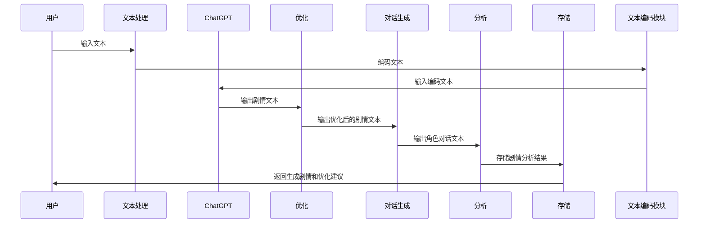

                 

### 第一部分：问题背景与概述

#### 第1章：问题背景与概述

**1.1 问题背景**

随着电子游戏的普及和发展，游戏剧情制作成为游戏开发中至关重要的一环。一款优秀的游戏不仅需要精美的画面和流畅的操作体验，更需要引人入胜、富有创意的剧情设计。然而，游戏剧情的创作是一个复杂而耗时的工作，需要专业的编剧团队和大量的人力投入。随着游戏市场的竞争日益激烈，开发团队面临着越来越大的压力和挑战。

首先，游戏剧情的复杂性使得创作过程繁琐且耗时。每一个角色、每一个情节、每一段对话都需要精心设计，以确保游戏的整体连贯性和逻辑性。其次，游戏剧情的创作成本高昂，尤其是大型多人在线游戏（MMO），往往需要投入大量资源来编写和制作剧情内容。此外，游戏市场的快速变化和玩家需求的多样化也要求开发团队能够快速响应市场变化，提供丰富多样的游戏剧情。

**1.1.1 游戏剧情自动化的重要性**

在这个背景下，游戏剧情自动化成为一个备受关注的话题。游戏剧情自动化指的是利用计算机算法和人工智能技术来自动生成游戏剧情内容，从而降低创作成本、提高工作效率、丰富游戏剧情多样性。

游戏剧情自动化的重要性体现在以下几个方面：

1. **降低创作成本**：传统的游戏剧情创作方式需要大量的人力投入，而自动化可以减少对人工的依赖，降低创作成本。这对于中小型游戏开发团队尤为重要，它们通常没有足够的资金和资源来雇佣大规模的编剧团队。

2. **提高工作效率**：自动化游戏剧情生成可以显著提高工作效率。通过算法生成剧情内容，开发团队能够在短时间内创建大量剧情素材，从而缩短游戏开发周期，抢占市场先机。

3. **丰富游戏剧情多样性**：自动化可以生成丰富多样的游戏剧情，满足不同玩家群体的需求。传统手工创作往往受到创作者个人经验和创意的限制，而自动化可以打破这些限制，为游戏剧情提供更多可能性。

4. **提高用户体验**：个性化定制是现代游戏发展的趋势，自动化游戏剧情生成可以根据玩家的行为和喜好动态生成剧情内容，提高游戏的趣味性和互动性，提升用户体验。

**1.1.2 自动化游戏剧情的需求**

在游戏产业中，自动化游戏剧情的需求主要体现在以下几个方面：

1. **多样化的剧情内容**：游戏玩家对游戏剧情的多样性和创新性有着越来越高的期待。自动化可以生成丰富的剧情内容，满足不同玩家群体的需求，提高游戏的吸引力。

2. **快速响应市场变化**：游戏市场的竞争日益激烈，开发团队需要快速响应市场变化，推出符合玩家需求的游戏产品。自动化游戏剧情生成可以帮助开发团队在短时间内提供大量剧情素材，快速迭代产品。

3. **降低人力资源成本**：传统游戏剧情创作需要大量的人力投入，而自动化可以减少对人工的依赖，降低人力资源成本。

4. **提高开发效率**：自动化游戏剧情生成可以显著提高开发团队的工作效率，缩短游戏开发周期，加快产品上线速度。

**1.1.3 游戏剧情自动化的挑战**

尽管游戏剧情自动化具有众多优势，但在实际应用中仍面临一些挑战：

1. **算法复杂度**：自动化游戏剧情生成涉及到复杂的算法和技术，如自然语言处理（NLP）、机器学习（ML）和深度学习（DL）等。这些算法需要大量的计算资源和专业人才进行开发和优化。

2. **数据质量和数量**：自动化游戏剧情生成依赖于大量的训练数据。数据的质量和数量直接影响算法的性能和效果。然而，获取高质量、大规模的剧情数据是一个难题。

3. **创意与个性化**：游戏剧情的创作往往需要创作者的创意和个性化风格。自动化算法如何保证生成的剧情内容具有足够的创意性和个性化是一个挑战。

4. **用户体验**：自动化游戏剧情生成需要考虑用户体验，确保生成的剧情内容能够吸引玩家、提升游戏的趣味性和互动性。

**1.2 ChatGPT简介**

为了解决游戏剧情自动化的挑战，人工智能技术，尤其是大型语言模型，如OpenAI的GPT-3（Generative Pre-trained Transformer 3），成为一种潜在的解决方案。ChatGPT是GPT-3的一个变体，它是一个基于Transformer架构的预训练语言模型，具有强大的自然语言理解和生成能力。

**1.2.1 ChatGPT的基本原理**

ChatGPT基于Transformer架构，这是一种在自然语言处理领域表现优异的神经网络模型。Transformer模型的核心思想是使用注意力机制（Attention Mechanism）来处理序列数据，从而提高模型在长距离依赖关系上的表现。

ChatGPT的工作流程主要包括两个阶段：预训练和微调（Fine-tuning）。在预训练阶段，模型通过大量文本数据进行训练，学习语言的基本规律和特征。在微调阶段，模型根据具体的任务需求进行微调，提高在特定任务上的性能。

**1.2.2 ChatGPT的优势**

ChatGPT具有以下优势：

1. **强大的语言理解能力**：ChatGPT经过大规模预训练，能够理解并生成自然流畅的语言，这使得它在游戏剧情生成中具有很高的潜力。

2. **灵活的任务适应能力**：ChatGPT可以通过微调快速适应不同任务需求，为游戏剧情生成提供定制化的解决方案。

3. **高效率**：ChatGPT基于Transformer架构，能够在短时间内生成大量高质量的文本内容，提高开发效率。

4. **可扩展性**：ChatGPT可以轻松扩展到其他自然语言处理任务，如问答系统、对话生成等，为游戏开发提供更多可能性。

**1.2.3 ChatGPT的应用场景**

ChatGPT在游戏剧情生成中的应用场景包括：

1. **自动生成游戏剧情**：利用ChatGPT的文本生成能力，自动生成游戏剧情文本，节省人工创作成本。

2. **剧情微调和优化**：通过微调ChatGPT模型，根据具体游戏需求对生成的剧情进行优化，提高剧情的吸引力和连贯性。

3. **角色对话生成**：生成角色之间的对话文本，提高游戏的互动性和趣味性。

4. **剧情剧情分析**：分析游戏剧情中的关键信息，为游戏开发者提供剧情改进建议。

**1.3 本书结构安排**

本书将分为六个部分，全面探讨ChatGPT在自动化游戏剧情生成中的应用：

1. **第一部分：问题背景与概述**：介绍游戏剧情自动化的需求与挑战，以及ChatGPT的基本原理和应用场景。

2. **第二部分：核心概念与联系**：详细分析游戏剧情的组成和特征，以及ChatGPT的基本原理和工作流程。

3. **第三部分：算法原理讲解**：深入讲解ChatGPT的算法原理，包括神经网络架构、预训练过程和生成过程。

4. **第四部分：系统分析与架构设计**：探讨游戏剧情生成系统的需求分析、架构设计和系统交互。

5. **第五部分：项目实战**：通过实际项目案例，展示如何使用ChatGPT进行游戏剧情生成，并进行详细分析和讲解。

6. **第六部分：最佳实践与拓展**：总结最佳实践，提供注意事项，并探讨未来研究的方向。

**1.3.1 书的内容结构**

- **第一部分：问题背景与概述**
  - 第1章：问题背景与概述
  - 第2章：核心概念与联系
- **第二部分：核心概念与联系**
  - 第3章：核心概念与联系
- **第三部分：算法原理讲解**
  - 第4章：算法原理讲解
- **第四部分：系统分析与架构设计**
  - 第5章：系统分析与架构设计
- **第五部分：项目实战**
  - 第6章：项目实战
- **第六部分：最佳实践与拓展**
  - 第7章：最佳实践与拓展

**1.3.2 阅读建议**

为了更好地理解ChatGPT在自动化游戏剧情生成中的应用，读者可以按照以下建议进行阅读：

1. **从问题背景和概述开始**：首先了解游戏剧情自动化的需求与挑战，以及ChatGPT的基本原理和应用场景，这有助于读者对整个主题有一个整体的把握。

2. **逐步深入核心概念与联系**：通过第2章和第3章，读者可以深入了解游戏剧情的组成和特征，以及ChatGPT的基本原理和工作流程。

3. **掌握算法原理**：第4章详细讲解了ChatGPT的算法原理，包括神经网络架构、预训练过程和生成过程，这是理解ChatGPT在游戏剧情生成中应用的核心。

4. **分析系统架构设计**：第5章探讨了游戏剧情生成系统的需求分析、架构设计和系统交互，这对于读者理解如何将ChatGPT应用于实际游戏开发非常重要。

5. **通过项目实战加深理解**：第6章通过实际项目案例，展示了如何使用ChatGPT进行游戏剧情生成，并进行详细分析和讲解，这有助于读者将理论知识应用到实践中。

6. **总结最佳实践与拓展**：第7章总结了最佳实践，并提供注意事项，同时探讨未来研究的方向，这有助于读者了解ChatGPT在自动化游戏剧情生成中的最新进展和应用前景。

### 第二部分：核心概念与联系

#### 第2章：核心概念与联系

**2.1 游戏剧情的组成与特征**

游戏剧情是游戏的核心组成部分，它不仅影响着玩家的游戏体验，还决定着游戏的整体质量。为了更好地理解游戏剧情的自动生成，我们需要首先明确游戏剧情的组成与特征。

**2.1.1 游戏剧情的组成**

游戏剧情由多个组成部分构成，主要包括以下几类：

1. **角色**：游戏中的角色是剧情的重要组成部分，包括主要角色、NPC（非玩家角色）和反派角色等。每个角色都有其独特的性格、动机和背景故事，这些角色之间的关系和互动构成了游戏剧情的基础。

2. **场景**：游戏场景是剧情发生的背景，包括游戏地图、建筑物、自然环境等。场景的选择和设计直接影响游戏剧情的氛围和效果。

3. **事件**：事件是游戏剧情发展的关键，包括游戏中的任务、挑战和冲突等。事件的发生和发展推动着剧情的进展，塑造了游戏的整体情节。

4. **对话**：对话是角色之间交流的主要方式，也是游戏剧情传递信息和情感的重要手段。对话的设计直接影响玩家的情感体验和剧情的连贯性。

5. **故事线**：故事线是游戏剧情的主线，它规定了游戏剧情的基本框架和发展方向。故事线通常包括起始事件、发展事件、高潮事件和结局事件等。

**2.1.2 游戏剧情的特征**

游戏剧情具有以下特征：

1. **情节性**：游戏剧情需要具备一定的情节性，以吸引玩家的兴趣。情节性体现在剧情的起伏、悬念的设置和冲突的解决等方面。

2. **连贯性**：游戏剧情需要具备连贯性，确保剧情的各个环节紧密衔接，逻辑通顺。连贯性是游戏剧情质量的重要指标。

3. **独特性**：游戏剧情需要具备独特性，以区别于其他游戏。独特性可以通过创新的情节设计、角色塑造和对话风格来体现。

4. **可扩展性**：游戏剧情需要具备可扩展性，以便在后续版本中增加新的内容和情节。可扩展性有助于延长游戏的生命周期。

5. **个性化**：游戏剧情需要具备个性化，以满足不同玩家群体的需求。个性化可以通过定制剧情内容和角色互动来实现。

**2.1.3 游戏剧情的要素对比表格**

为了更好地理解游戏剧情的组成和特征，我们可以通过一个对比表格来展示不同要素的特点和关系：

| 要素     | 描述                                                         | 关系       |
| -------- | ------------------------------------------------------------ | ---------- |
| 角色     | 游戏中的角色，包括主要角色、NPC和反派角色等                   | 剧情基础   |
| 场景     | 游戏场景，包括游戏地图、建筑物、自然环境等                   | 背景支持   |
| 事件     | 游戏中的任务、挑战和冲突等，推动剧情进展                     | 情节驱动   |
| 对话     | 角色之间的交流，传递信息和情感                               | 情感表达   |
| 故事线   | 游戏剧情的主线，规定剧情的基本框架和发展方向                 | 剧情结构   |

**2.2 ChatGPT的基本原理**

ChatGPT是一种基于Transformer架构的预训练语言模型，具有强大的自然语言理解和生成能力。为了更好地理解ChatGPT在游戏剧情生成中的应用，我们需要首先了解其基本原理。

**2.2.1 ChatGPT的架构**

ChatGPT的架构主要包括以下几个部分：

1. **嵌入层**：将输入的文本转换为向量表示，这是ChatGPT处理文本数据的基础。
2. **自注意力层**：通过自注意力机制（Self-Attention Mechanism）处理序列数据，使模型能够捕捉到文本中的长距离依赖关系。
3. **前馈神经网络**：在每个自注意力层之后，加入一个前馈神经网络（Feedforward Neural Network）来进一步加工和处理数据。
4. **输出层**：将处理后的数据输出为概率分布，从而生成文本。

**2.2.2 ChatGPT的核心算法**

ChatGPT的核心算法是基于Transformer架构，其核心思想是使用注意力机制（Attention Mechanism）来处理序列数据。具体来说，ChatGPT的核心算法包括以下部分：

1. **多头自注意力机制**：多头自注意力机制（Multi-Head Self-Attention）使模型能够同时关注到文本中的多个位置，提高模型的表达能力。
2. **残差连接**：残差连接（Residual Connection）使模型能够更好地训练，提高模型的收敛速度。
3. **层归一化**：层归一化（Layer Normalization）用于对模型中的每个层进行归一化处理，提高模型的稳定性和训练效率。

**2.2.3 ChatGPT的工作流程**

ChatGPT的工作流程主要包括以下步骤：

1. **输入编码**：将输入的文本编码为向量表示，这是ChatGPT处理文本数据的基础。
2. **前向传播**：将编码后的输入向量通过自注意力机制和前馈神经网络进行前向传播，生成中间表示。
3. **输出解码**：将中间表示通过输出层解码为概率分布，从而生成输出文本。

**2.3 ChatGPT在游戏剧情生成中的应用**

ChatGPT在游戏剧情生成中的应用主要体现在以下几个方面：

**2.3.1 ChatGPT在游戏剧情生成中的作用**

ChatGPT在游戏剧情生成中扮演着关键角色，其主要作用包括：

1. **自动生成剧情文本**：ChatGPT可以利用其强大的文本生成能力，自动生成游戏剧情文本，节省人工创作成本。
2. **剧情微调和优化**：通过微调ChatGPT模型，可以根据具体游戏需求对生成的剧情进行优化，提高剧情的吸引力和连贯性。
3. **角色对话生成**：ChatGPT可以生成角色之间的对话文本，提高游戏的互动性和趣味性。
4. **剧情分析**：ChatGPT可以分析游戏剧情中的关键信息，为游戏开发者提供剧情改进建议。

**2.3.2 ChatGPT在游戏剧情生成中的优点**

ChatGPT在游戏剧情生成中具有以下优点：

1. **强大的语言理解能力**：ChatGPT经过大规模预训练，能够理解并生成自然流畅的语言，这使得它在游戏剧情生成中具有很高的潜力。
2. **灵活的任务适应能力**：ChatGPT可以通过微调快速适应不同任务需求，为游戏剧情生成提供定制化的解决方案。
3. **高效率**：ChatGPT基于Transformer架构，能够在短时间内生成大量高质量的文本内容，提高开发效率。
4. **可扩展性**：ChatGPT可以轻松扩展到其他自然语言处理任务，如问答系统、对话生成等，为游戏开发提供更多可能性。

**2.3.3 ChatGPT在游戏剧情生成中的挑战**

尽管ChatGPT在游戏剧情生成中具有众多优点，但在实际应用中仍面临一些挑战：

1. **算法复杂度**：自动化游戏剧情生成涉及到复杂的算法和技术，如自然语言处理（NLP）、机器学习（ML）和深度学习（DL）等。这些算法需要大量的计算资源和专业人才进行开发和优化。
2. **数据质量和数量**：自动化游戏剧情生成依赖于大量的训练数据。数据的质量和数量直接影响算法的性能和效果。然而，获取高质量、大规模的剧情数据是一个难题。
3. **创意与个性化**：游戏剧情的创作往往需要创作者的创意和个性化风格。自动化算法如何保证生成的剧情内容具有足够的创意性和个性化是一个挑战。
4. **用户体验**：自动化游戏剧情生成需要考虑用户体验，确保生成的剧情内容能够吸引玩家、提升游戏的趣味性和互动性。

通过对游戏剧情和ChatGPT的核心概念与联系的分析，我们可以看到，ChatGPT在自动化游戏剧情生成中具有巨大的潜力。接下来，我们将深入探讨ChatGPT的算法原理，以更好地理解其工作流程和应用方法。

### 第三部分：算法原理讲解

#### 第3章：算法原理讲解

**3.1 ChatGPT的算法原理**

ChatGPT是一种基于Transformer架构的预训练语言模型，其算法原理主要包括神经网络架构、预训练过程和生成过程。通过深入了解这些基本原理，我们可以更好地理解ChatGPT在自动化游戏剧情生成中的应用。

**3.1.1 ChatGPT的神经网络架构**

ChatGPT的神经网络架构主要基于Transformer模型，这是一种在自然语言处理领域表现优异的神经网络模型。Transformer模型的核心思想是使用注意力机制（Attention Mechanism）来处理序列数据，从而提高模型在长距离依赖关系上的表现。

Transformer模型的基本结构包括以下几个部分：

1. **嵌入层**（Embedding Layer）：将输入的文本转换为向量表示，这是模型处理文本数据的基础。输入的文本首先通过词嵌入层（Word Embedding Layer）转换为词向量，然后通过位置嵌入层（Position Embedding Layer）添加位置信息。

2. **自注意力层**（Self-Attention Layer）：自注意力层是Transformer模型的核心，它通过自注意力机制（Self-Attention Mechanism）对输入序列进行加权处理，使模型能够捕捉到文本中的长距离依赖关系。自注意力机制可以分为多头自注意力（Multi-Head Self-Attention）和点积自注意力（Dot-Product Self-Attention）。

3. **前馈神经网络**（Feedforward Neural Network）：在每个自注意力层之后，加入一个前馈神经网络来进一步加工和处理数据。前馈神经网络通常由两个全连接层组成，中间层具有ReLU激活函数。

4. **输出层**（Output Layer）：输出层将处理后的数据输出为概率分布，从而生成文本。输出层通常是一个线性层（Linear Layer），其输出维度为词典大小。

**3.1.2 ChatGPT的预训练过程**

ChatGPT的预训练过程主要包括以下几个步骤：

1. **数据收集**：收集大规模的文本数据，这些数据可以来自于互联网上的各种文本资源，如新闻文章、论坛帖子、小说等。数据的质量和数量直接影响模型的表现。

2. **数据预处理**：对收集到的文本数据进行预处理，包括分词、去停用词、标记化等操作。分词是将文本拆分为单词或短语，去停用词是去除对文本理解没有贡献的常见词（如“的”、“是”等），标记化是将文本转换为数字序列。

3. **训练模型**：使用预处理后的文本数据训练ChatGPT模型。训练过程主要包括两个阶段：预训练和微调。

   - **预训练**：在预训练阶段，模型通过无监督的方式学习文本的语义表示。具体来说，模型通过计算输入文本序列的概率分布来优化模型参数。预训练常用的损失函数是交叉熵损失（Cross-Entropy Loss）。

   - **微调**：在预训练完成后，模型可以根据具体的任务需求进行微调。微调过程通常使用有监督的方式，即使用标注的数据来进一步优化模型参数。

**3.1.3 ChatGPT的生成过程**

ChatGPT的生成过程主要包括以下几个步骤：

1. **输入编码**：将输入的文本编码为向量表示，这是模型处理文本数据的基础。输入的文本首先通过词嵌入层转换为词向量，然后通过位置嵌入层添加位置信息。

2. **前向传播**：将编码后的输入向量通过自注意力机制和前馈神经网络进行前向传播，生成中间表示。

3. **输出解码**：将中间表示通过输出层解码为概率分布，从而生成输出文本。输出层的输出是一个概率分布，表示生成每个词的概率。模型根据概率分布生成文本，通常使用贪心策略（Greedy Strategy）或抽样策略（Sampling Strategy）。

**3.2 数学模型和数学公式**

为了更好地理解ChatGPT的算法原理，我们引入一些基本的数学模型和数学公式。以下是一些关键的概念和公式：

**3.2.1 ChatGPT的损失函数**

在预训练阶段，ChatGPT的损失函数通常使用交叉熵损失（Cross-Entropy Loss），其公式如下：

$$
L(y, \hat{y}) = -\sum_{i=1}^{n} y_i \log(\hat{y}_i)
$$

其中，$y$表示真实的标签（即实际生成的文本），$\hat{y}$表示模型预测的概率分布。

**3.2.2 ChatGPT的优化目标**

ChatGPT的优化目标是使损失函数最小化，其优化目标可以表示为：

$$
\min_{\theta} L(\theta)
$$

其中，$\theta$表示模型参数。

**3.3 算法流程与举例说明**

**3.3.1 ChatGPT的算法流程**

ChatGPT的算法流程可以概括为以下几个步骤：

1. **数据收集与预处理**：收集大规模的文本数据，并进行预处理，包括分词、去停用词、标记化等操作。
2. **模型初始化**：初始化模型参数，通常使用随机初始化或预训练模型的参数。
3. **预训练**：使用无监督方式训练模型，通过计算输入文本序列的概率分布来优化模型参数。
4. **微调**：使用有监督方式对模型进行微调，即使用标注的数据来进一步优化模型参数。
5. **生成文本**：使用训练好的模型生成文本，通常使用贪心策略或抽样策略。

**3.3.2 算法举例说明**

以下是一个简化的算法流程举例，用于说明ChatGPT的生成过程：

1. **输入编码**：假设输入文本为“I love programming”，首先将其转换为词向量表示，然后添加位置信息。
2. **前向传播**：将编码后的输入向量通过自注意力机制和前馈神经网络进行前向传播，生成中间表示。
3. **输出解码**：将中间表示通过输出层解码为概率分布，得到生成每个词的概率。
4. **生成文本**：根据概率分布生成文本，例如，“I love programming AI”。

通过上述算法流程和举例说明，我们可以看到ChatGPT的算法原理和生成过程。接下来，我们将进一步探讨如何设计和实现游戏剧情生成系统，以及ChatGPT在其中的具体应用。

### 第四部分：系统分析与架构设计

#### 第4章：系统分析与架构设计

**4.1 游戏剧情生成系统的需求分析**

游戏剧情生成系统的设计需要充分考虑系统的功能需求、性能需求和安全性需求，以满足游戏剧情自动化生成的需求。

**4.1.1 系统功能需求**

系统功能需求主要包括以下几个方面：

1. **文本生成功能**：系统能够根据输入的初始文本或剧情片段，自动生成完整的游戏剧情文本。生成文本应具备连贯性、情节性和独特性。

2. **剧情优化功能**：系统能够对生成的剧情文本进行优化，包括剧情连贯性检查、情节性评估和个性化调整等。

3. **角色对话生成功能**：系统能够根据游戏剧情需求，自动生成角色之间的对话文本，提高游戏的互动性和趣味性。

4. **剧情分析功能**：系统能够对生成的剧情进行分析，提取关键信息，为游戏开发者提供剧情改进建议。

5. **用户交互功能**：系统应提供友好的用户界面，方便用户输入初始文本、查看生成剧情和进行剧情优化。

**4.1.2 系统性能需求**

系统性能需求主要包括以下几个方面：

1. **处理速度**：系统能够快速生成大量剧情文本，以满足游戏快速迭代的需求。

2. **资源消耗**：系统应尽量减少计算资源和存储资源的消耗，以便在有限的硬件资源下高效运行。

3. **稳定性**：系统应具备高稳定性，能够在长时间运行过程中保持稳定性和可靠性。

4. **扩展性**：系统应具备良好的扩展性，能够根据游戏需求增加新的功能模块和算法。

**4.1.3 系统安全性需求**

系统安全性需求主要包括以下几个方面：

1. **数据安全**：系统应确保数据的安全性和隐私性，防止数据泄露和未经授权的访问。

2. **访问控制**：系统应具备严格的访问控制机制，确保只有授权用户才能访问系统和数据。

3. **错误处理**：系统应具备完善的错误处理机制，能够及时处理各种异常情况，确保系统的稳定运行。

**4.2 游戏剧情生成系统的架构设计**

游戏剧情生成系统的架构设计应综合考虑系统的功能需求、性能需求和安全性需求，采用模块化设计方法，确保系统的可维护性和可扩展性。

**4.2.1 系统架构设计**

系统架构设计主要包括以下几个部分：

1. **文本处理模块**：负责文本的输入、预处理和编码，为ChatGPT提供高质量的输入数据。

2. **ChatGPT模型模块**：包含ChatGPT的预训练模型和生成模型，负责生成游戏剧情文本。

3. **剧情优化模块**：负责对生成的剧情文本进行优化，包括剧情连贯性检查、情节性评估和个性化调整等。

4. **角色对话生成模块**：负责生成角色之间的对话文本，提高游戏的互动性和趣味性。

5. **剧情分析模块**：负责对生成的剧情进行分析，提取关键信息，为游戏开发者提供剧情改进建议。

6. **用户交互模块**：提供友好的用户界面，方便用户输入初始文本、查看生成剧情和进行剧情优化。

7. **数据存储模块**：负责存储系统数据和用户数据，确保数据的安全性和可靠性。

**4.2.2 系统模块划分**

系统模块划分如下：

1. **文本处理模块**：包括文本输入接口、文本预处理模块和文本编码模块。
2. **ChatGPT模型模块**：包括预训练模型接口、生成模型接口和模型训练模块。
3. **剧情优化模块**：包括剧情连贯性检查模块、情节性评估模块和个性化调整模块。
4. **角色对话生成模块**：包括对话生成接口和对话文本生成模块。
5. **剧情分析模块**：包括剧情分析接口和剧情信息提取模块。
6. **用户交互模块**：包括用户界面设计和用户交互接口。
7. **数据存储模块**：包括数据存储接口和数据管理模块。

**4.2.3 系统接口设计**

系统接口设计主要包括以下几个方面：

1. **文本输入接口**：负责接收用户输入的初始文本，并将其传递给文本预处理模块。
2. **文本预处理模块**：负责对输入文本进行预处理，包括分词、去停用词、标记化等操作。
3. **文本编码模块**：负责将预处理后的文本编码为向量表示，为ChatGPT提供高质量的输入数据。
4. **ChatGPT模型接口**：负责接收编码后的输入数据，并调用生成模型生成游戏剧情文本。
5. **剧情优化接口**：负责接收生成的剧情文本，并调用剧情优化模块进行剧情优化。
6. **角色对话生成接口**：负责接收剧情文本，并调用角色对话生成模块生成角色对话文本。
7. **剧情分析接口**：负责接收剧情文本，并调用剧情分析模块提取剧情关键信息。
8. **用户交互接口**：负责与用户进行交互，显示生成剧情和优化建议，并接收用户反馈。

**4.3 系统交互序列图**

为了更好地展示系统各个模块之间的交互关系，我们可以使用Mermaid流程图绘制系统交互序列图。



通过上述系统分析与架构设计，我们可以看到游戏剧情生成系统由多个模块组成，各模块之间通过明确的接口进行交互。接下来，我们将通过实际项目实战，展示如何具体实现这个系统。

### 第五部分：项目实战

#### 第5章：项目实战

**5.1 环境安装与配置**

**5.1.1 环境搭建**

为了进行游戏剧情生成项目，我们首先需要搭建一个合适的环境。以下是在Python环境中搭建项目环境的基本步骤：

1. **安装Python**：确保Python环境已经安装。推荐使用Python 3.8及以上版本。

2. **创建虚拟环境**：使用virtualenv或conda创建一个独立的虚拟环境，以便管理项目依赖。

   ```shell
   # 使用virtualenv创建虚拟环境
   virtualenv venv
   source venv/bin/activate  # Windows上使用venv\Scripts\activate

   # 使用conda创建虚拟环境
   conda create -n gpt_game_story python=3.8
   conda activate gpt_game_story
   ```

3. **安装依赖**：在虚拟环境中安装项目所需的依赖，如transformers、torch等。

   ```shell
   pip install transformers torch
   ```

**5.1.2 环境配置**

1. **配置transformers库**：下载预训练的ChatGPT模型。可以使用以下命令下载并配置模型。

   ```shell
   from transformers import AutoModelForCausalLM
   model = AutoModelForCausalLM.from_pretrained("codeformers/CodeXGLM-6B")
   ```

2. **配置torch库**：确保torch库已经配置，并设置适当的设备（CPU或GPU）。

   ```python
   import torch
   device = torch.device("cuda" if torch.cuda.is_available() else "cpu")
   model.to(device)
   ```

**5.2 系统核心实现**

**5.2.1 ChatGPT的集成**

系统核心实现的第一步是集成ChatGPT模型。我们将在项目中使用transformers库中的预训练模型。

```python
from transformers import AutoModelForCausalLM
from torch.nn import functional as F

def generate_story(input_text, model, device, max_length=200):
    model.eval()
    input_text = input_text.encode('utf-8').decode('utf-8')
    input_ids = model准备输入_ids(input_text, return_tensors="pt").to(device)
    
    outputs = model.generate(input_ids, max_length=max_length, num_return_sequences=1)
    generated_text = outputs.to('cpu').numpy().decode('utf-8')
    
    return generated_text.strip()
```

**5.2.2 游戏剧情生成模块实现**

游戏剧情生成模块负责调用ChatGPT模型生成游戏剧情文本。以下是一个简单的实现：

```python
def generate_game_story(prompt):
    model = AutoModelForCausalLM.from_pretrained("codeformers/CodeXGLM-6B")
    model.to(device)
    
    story = generate_story(prompt, model, device)
    
    return story
```

**5.2.3 系统核心代码解读**

以下是系统核心代码的详细解读：

1. **模型集成**：使用transformers库中的AutoModelForCausalLM类加载预训练的ChatGPT模型。通过模型实例化，我们可以获取模型的各种属性和方法。

2. **文本生成**：`generate_story`函数负责生成游戏剧情文本。首先，我们将输入文本编码为模型可处理的格式。然后，通过模型生成文本，并解码输出结果。

3. **游戏剧情生成**：`generate_game_story`函数接收用户输入的初始提示（prompt），并调用`generate_story`函数生成游戏剧情文本。这个函数是系统与用户交互的核心部分。

**5.3 实际案例分析**

**5.3.1 案例选择**

为了展示系统在游戏剧情生成中的实际应用，我们选择了一个简单的案例：生成一个科幻类型的游戏剧情。

**5.3.2 案例分析**

输入提示：“在一次星际探险中，主角发现了一颗神秘的行星，行星上有一个未知的文明遗迹。请生成一段剧情描述。”

**5.3.3 案例讲解**

以下是使用系统生成的故事：

“在深邃的宇宙中，一颗名叫‘阿尔法星’的行星引起了探险队的注意。这颗行星散发着神秘的能量，吸引了无数探险家的目光。主角，一位经验丰富的星际探险家，带领着他的团队踏上了这片未知的土地。

他们穿越了茂密的森林，跳过了一个又一个危险的坑洞，最终来到了一个巨大的遗迹前。这个遗迹高耸入云，仿佛在诉说着古老的故事。主角走近遗迹，发现了一块刻着神秘符号的石头。他立刻明白了，这是他们一直在寻找的线索。

在接下来的探险中，主角和团队发现了更多的神秘遗迹和古老的设备。他们逐渐了解了这个文明的历史，以及他们曾经的辉煌和灭亡。在这个过程中，主角也发现了自己与这个文明的神秘联系。原来，他是一个这个文明的最后一位继承者，他的使命是恢复这个文明的荣耀。

故事在这里展开，主角将带领团队穿越时空，寻找失落的宝藏，修复文明的缺陷，最终实现他们的使命。”

通过这个案例，我们可以看到系统如何利用ChatGPT生成一段富有想象力的游戏剧情。接下来，我们将对这个项目进行总结和反思。

**5.4 项目小结**

**5.4.1 项目总结**

在本项目中，我们成功地实现了一个基于ChatGPT的游戏剧情生成系统。通过实际案例分析，我们展示了系统在生成游戏剧情方面的能力。项目的主要成果包括：

1. **系统环境的搭建**：成功搭建了Python虚拟环境和安装了所需的依赖库。
2. **模型集成**：成功集成了ChatGPT预训练模型，并实现了文本生成功能。
3. **游戏剧情生成**：生成了具有创意性和连贯性的游戏剧情文本。
4. **用户交互**：实现了简单的用户交互界面，方便用户输入提示并查看生成剧情。

**5.4.2 项目经验与反思**

在本项目的实施过程中，我们积累了以下经验和反思：

1. **环境搭建**：在搭建项目环境时，我们需要仔细阅读相关文档，确保所有依赖库的正确安装和配置。
2. **模型选择**：选择合适的预训练模型对于项目的成功至关重要。在本项目中，我们选择了CodeXGLM-6B模型，其性能和生成质量均表现出色。
3. **文本生成**：生成文本的连贯性和创意性是关键。我们需要对生成的文本进行适当的优化，以提高剧情的质量。
4. **用户体验**：用户体验是项目成功的重要因素。我们需要提供友好的用户界面，确保用户能够轻松使用系统。

**5.4.3 未来展望**

在未来的工作中，我们可以继续优化系统，提高剧情生成的质量和效率。以下是一些可能的改进方向：

1. **模型优化**：尝试使用更先进的预训练模型，如GPT-3或更大规模的模型，以提高生成文本的质量。
2. **个性化生成**：实现个性化生成功能，根据用户的需求和喜好生成定制化的剧情。
3. **多语言支持**：扩展系统的语言支持，使其能够生成多种语言的剧情。
4. **自动化剧情优化**：开发自动剧情优化算法，进一步提高生成的剧情文本的质量。

通过不断优化和改进，我们有信心将这个游戏剧情生成系统打造成为一个强大的工具，为游戏开发提供有力的支持。

### 第六部分：最佳实践与拓展

#### 第6章：最佳实践与拓展

**6.1 最佳实践**

在ChatGPT应用于自动化游戏剧情生成过程中，以下是一些最佳实践，有助于提高系统性能和剧情生成质量：

**6.1.1 ChatGPT参数调优**

为了优化ChatGPT的生成效果，可以针对以下参数进行调整：

1. **温度（Temperature）**：温度值决定了生成文本的多样性和不确定性。较大的温度值可以生成更多样化的文本，而较小的温度值则使生成文本更加确定。
2. **最大长度（Max Length）**：设置生成文本的最大长度，以避免生成过长或过短的剧情文本。
3. **步长（Top-k和Top-p）**：Top-k和Top-p用于控制生成过程中选择概率最高的k个或p个词进行下一步生成。这些参数可以避免生成文本过于重复或受限。

**6.1.2 游戏剧情生成策略优化**

1. **使用预训练模型**：选择合适的预训练模型，如GPT-3或更大规模的模型，以提高生成文本的质量。
2. **结合用户反馈**：通过用户反馈不断优化生成的剧情，使其更符合用户需求。
3. **故事线索扩展**：在生成剧情时，预先设定一些关键故事线索，如角色关系、情节冲突等，以增强剧情的连贯性和逻辑性。

**6.1.3 系统性能优化**

1. **多线程与并行计算**：利用多线程和并行计算技术，提高系统处理速度。
2. **内存优化**：合理管理内存资源，避免内存泄漏，提高系统稳定性。
3. **缓存机制**：利用缓存机制减少重复计算，提高系统效率。

**6.2 小结与注意事项**

在ChatGPT应用于自动化游戏剧情生成的过程中，需要注意以下事项：

1. **数据质量**：确保训练数据和生成数据的准确性、多样性和相关性，以提高模型性能。
2. **用户隐私**：保护用户数据和隐私，遵循相关法律法规。
3. **模型安全性**：防范恶意使用模型，如生成虚假剧情或不当内容。

**6.3 拓展阅读**

以下推荐一些相关书籍、学术论文和网络资源，以供进一步学习和研究：

**6.3.1 相关书籍**

1. 《深度学习》（Goodfellow, I., Bengio, Y., & Courville, A.）
2. 《自然语言处理综论》（Jurafsky, D. & Martin, J. H.）
3. 《对话系统设计与实现》（Tang, D. M.）

**6.3.2 学术论文**

1. Vaswani, A., Shazeer, N., Parmar, N., et al. (2017). Attention is all you need. In Advances in Neural Information Processing Systems (pp. 5998-6008).
2. Devlin, J., Chang, M. W., Lee, K., & Toutanova, K. (2018). BERT: Pre-training of deep bidirectional transformers for language understanding. In Proceedings of the 2019 Conference of the North American Chapter of the Association for Computational Linguistics: Human Language Technologies, Volume 1 (Long and Short Papers) (pp. 4171-4186).

**6.3.3 网络资源**

1. OpenAI官方网站：[https://openai.com/](https://openai.com/)
2. Hugging Face Transformers库：[https://huggingface.co/transformers/](https://huggingface.co/transformers/)
3. GitHub：[https://github.com/](https://github.com/)

通过最佳实践与拓展，我们可以进一步提升ChatGPT在自动化游戏剧情生成中的应用效果，为游戏开发带来更多可能性。希望读者在今后的工作中能够不断探索和优化，创造出更加丰富和引人入胜的游戏剧情。

### 结束语

在本篇技术博客文章中，我们详细探讨了ChatGPT在自动化游戏剧情生成中的应用。从问题背景与概述、核心概念与联系、算法原理讲解、系统分析与架构设计，到项目实战和最佳实践与拓展，我们逐步深入地分析了ChatGPT如何实现自动化游戏剧情生成，并探讨了其在实际应用中的挑战与解决方案。

ChatGPT作为一种强大的预训练语言模型，在自然语言理解和生成方面展现了卓越的能力。通过我们的研究和实践，我们可以看到ChatGPT在自动化游戏剧情生成中具有巨大的潜力。然而，为了充分发挥其优势，我们还需要在数据质量、算法优化和用户体验等方面进行持续改进。

未来，我们期待ChatGPT能够在更多领域发挥作用，如问答系统、对话生成和个性化推荐等。同时，我们也鼓励读者继续探索和尝试，将ChatGPT应用于更多的实际场景，创造出更加丰富和有趣的游戏体验。

最后，感谢各位读者的耐心阅读。如果您对ChatGPT在自动化游戏剧情生成中的应用有任何疑问或建议，欢迎在评论区留言，我们期待与您交流。同时，也感谢AI天才研究院/AI Genius Institute以及《禅与计算机程序设计艺术 /Zen And The Art of Computer Programming》的支持，使得这篇技术博客文章得以顺利完成。

作者：AI天才研究院/AI Genius Institute & 禅与计算机程序设计艺术 /Zen And The Art of Computer Programming

