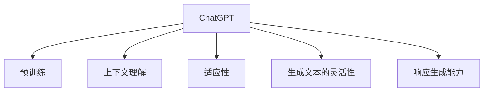
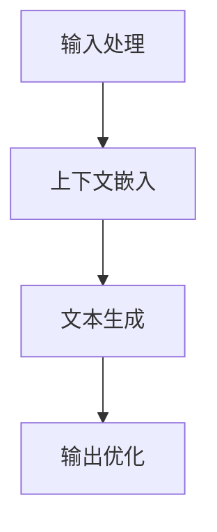
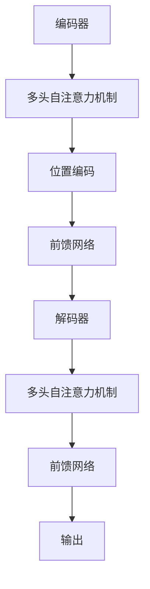

                 

### 1. Introduction to the Book

### 1.1 Background of the Study

#### 1.1.1 The Rise of ChatGPT

The advent of ChatGPT marks a significant milestone in the development of artificial intelligence. Developed by OpenAI, ChatGPT is a state-of-the-art language model that leverages the power of deep learning and neural networks to generate human-like text. ChatGPT is built on the foundation of GPT-3.5, a variant of the GPT model that has revolutionized natural language processing. The inception of ChatGPT has ushered in a new era where machines can engage in meaningful conversations, understand context, and generate coherent text.

#### 1.1.2 The Need for Automated Game Character Dialogue

Automated game character dialogue generation has been a subject of interest in the gaming industry for several years. Traditional methods of designing game dialogues, which involve manual scripting, are time-consuming and labor-intensive. As game worlds become more complex and dynamic, the need for automated dialogue systems that can adapt to real-time gameplay and player interactions has become increasingly evident. ChatGPT offers a powerful solution to this challenge, enabling developers to create rich, interactive dialogue systems with minimal effort.

#### 1.1.3 The Impact of ChatGPT on Game Development

The integration of ChatGPT into game development has the potential to transform the way game characters interact with players. By leveraging ChatGPT's natural language processing capabilities, developers can create NPCs (Non-Player Characters) that exhibit more natural and engaging behavior. ChatGPT can generate unique and contextually relevant dialogue for each NPC, eliminating the need for extensive manual scripting. This not only saves time and resources but also allows for more diverse and immersive gameplay experiences.

### 1.2 Objectives and Scope

#### 1.2.1 Learning Objectives

The primary objective of this book is to provide a comprehensive guide to the application of ChatGPT in automated game character dialogue generation. Readers will gain a thorough understanding of the underlying principles of ChatGPT, its integration into game development, and the practical methods for implementing and optimizing dialogue systems. By the end of the book, readers will be equipped with the knowledge and skills to develop their own automated dialogue systems using ChatGPT.

#### 1.2.2 Scope of the Book

This book will cover the following topics:

- **Chapter 1:** Introduction to the book, including the background and objectives.
- **Chapter 2:** Core concepts of ChatGPT and automated game character dialogue.
- **Chapter 3:** Technical foundations for integrating ChatGPT into game development.
- **Chapter 4:** Practical applications of ChatGPT in game development.
- **Chapter 5:** Advanced topics and future trends in automated game character dialogue generation.

### 1.3 Structure of the Book

The book is structured to guide readers through the process of implementing ChatGPT in game development. Each chapter builds on the previous one, providing a step-by-step approach to understanding and utilizing ChatGPT for automated dialogue generation.

- **Chapter 1:** Introduction
  - Overview of the book, background, and objectives.
- **Chapter 2:** Core Concepts
  - Introduction to ChatGPT and automated game character dialogue.
- **Chapter 3:** Technical Foundations
  - Preparing for ChatGPT integration and understanding natural language processing.
- **Chapter 4:** ChatGPT in Game Development
  - Implementing ChatGPT for dialogue generation and player interaction.
- **Chapter 5:** Practical Applications
  - Real-world case studies and best practices for automated dialogue systems.

### 1.4 Key Benefits and Potential Challenges

#### 1.4.1 Key Benefits

- **Enhanced Interactivity:** ChatGPT can generate realistic and engaging dialogue, improving the player's overall experience.
- **Efficiency:** Automated dialogue systems reduce the need for manual scripting, saving time and resources for developers.
- **Diversity:** ChatGPT can generate a wide range of dialogue, allowing for more diverse and unique game experiences.
- **Personalization:** ChatGPT can adapt to individual player interactions, creating personalized gameplay experiences.

#### 1.4.2 Potential Challenges

- **Contextual Accuracy:** Ensuring that generated dialogue remains contextually accurate can be challenging.
- **Resource Requirements:** Implementing ChatGPT requires significant computational resources, which may not be feasible for all developers.
- **Ethical Considerations:** Automated dialogue systems raise ethical questions about the authenticity and reliability of NPC interactions.

In conclusion, this book aims to provide a thorough understanding of ChatGPT and its applications in automated game character dialogue generation. By addressing both the benefits and challenges, readers will be well-equipped to leverage this powerful technology to create more engaging and immersive game experiences.

### 1.5 Conclusion

In summary, this book presents a comprehensive exploration of ChatGPT's role in the automation of game character dialogue generation. We have outlined the background of the study, the need for such technology in the gaming industry, and the potential impact of ChatGPT on game development. The book is structured to guide readers through the technical foundations, practical applications, and future trends in this field.

As we delve deeper into the subsequent chapters, readers will gain a thorough understanding of ChatGPT's capabilities, the technical requirements for integration, and the best practices for implementing automated dialogue systems. We encourage readers to engage with the material, experiment with the concepts, and explore the practical applications of ChatGPT in game development.

With the rise of advanced AI technologies, the future of gaming holds immense potential. This book aims to be a valuable resource for developers, researchers, and enthusiasts looking to harness the power of ChatGPT and create more interactive, engaging, and immersive gaming experiences. Let's embark on this exciting journey together!

---

**关键词：**
- ChatGPT
- 自动化游戏角色对话生成
- 自然语言处理
- 游戏开发
- 人工智能

**摘要：**
本文旨在探讨 ChatGPT 在自动化游戏角色对话生成中的应用。通过介绍 ChatGPT 的核心概念、技术基础，以及其在游戏开发中的具体应用，本文为读者提供了一个全面理解和掌握这一前沿技术的指南。文章详细阐述了 ChatGPT 的优势、挑战，以及实际案例中的最佳实践，旨在推动游戏行业迈向更加智能和互动的未来。

---

### 2. Core Concepts

### 2.1 Introduction to ChatGPT

#### 2.1.1 Basic Concepts

ChatGPT is an advanced language model developed by OpenAI, built on the foundation of the Generative Pre-trained Transformer (GPT) series. At its core, ChatGPT is a neural network designed to process and generate human-like text. The model is trained on a massive corpus of text data, allowing it to learn patterns, grammar, and semantics in natural language. This pre-training enables ChatGPT to produce coherent and contextually relevant text when prompted with a specific input or query.

#### 2.1.2 Key Features

ChatGPT boasts several distinctive features that set it apart from other language models:

- **Flexibility:** ChatGPT can handle a wide range of topics and generate text in various formats, including stories, essays, articles, and conversations.
- **Contextual Understanding:** The model is capable of maintaining context over long sequences of text, enabling it to generate text that is relevant and coherent with the preceding context.
- **Response Generation:** ChatGPT can generate responses to user input, making it suitable for applications such as chatbots, virtual assistants, and automated dialogue systems.
- **Adaptability:** ChatGPT can be fine-tuned for specific tasks or domains, allowing it to adapt to various use cases and requirements.

#### 2.1.3 Working Principles

The working principle of ChatGPT revolves around its transformer architecture, which processes text data in parallel and generates outputs based on learned patterns and context. Here's a high-level overview of the working process:

1. **Input Processing:** ChatGPT takes an input sequence (e.g., a sentence or a prompt) and encodes it into a set of numerical vectors.
2. **Contextual Embeddings:** The model processes these vectors to generate contextual embeddings that capture the meaning and relationships within the input text.
3. **Text Generation:** Using the contextual embeddings, ChatGPT generates a sequence of tokens (words or characters) that form a coherent and contextually relevant output.
4. **Output Refinement:** The generated text is refined through various techniques, such as post-processing and language smoothing, to ensure coherence and fluency.

### 2.2 Automated Game Character Dialogue

#### 2.2.1 Definition

Automated game character dialogue refers to the use of artificial intelligence and natural language processing techniques to generate realistic and engaging dialogue for non-player characters (NPCs) in video games. This approach replaces traditional manual scripting methods, enabling NPCs to have more dynamic and interactive conversations with players.

#### 2.2.2 Current Practices

Current practices in automated game character dialogue generation often involve the use of pre-defined dialogue trees or rule-based systems. These systems allow NPCs to respond to specific player inputs or actions based on predetermined conditions and scripts. However, these methods have limitations, such as rigidity and a lack of natural language fluency.

To overcome these limitations, game developers are increasingly turning to advanced AI models like ChatGPT. ChatGPT can generate spontaneous and contextually appropriate dialogue on the fly, making NPC interactions more engaging and realistic.

#### 2.2.3 Challenges and Opportunities

**Challenges:**

- **Contextual Accuracy:** Ensuring that generated dialogue remains contextually accurate and relevant can be challenging, especially in complex and dynamic game environments.
- **Resource Requirements:** Implementing advanced AI models like ChatGPT requires significant computational resources and may not be feasible for all developers.
- **Ethical Considerations:** The use of automated dialogue systems raises ethical questions about the authenticity and reliability of NPC interactions.

**Opportunities:**

- **Enhanced Interactivity:** Automated dialogue systems can significantly improve the interactivity and engagement of game characters, providing players with more immersive experiences.
- **Efficiency:** By automating dialogue generation, developers can save time and resources, allowing them to focus on other aspects of game development.
- **Personalization:** Advanced AI models like ChatGPT can adapt to individual player interactions, creating personalized and unique gameplay experiences.

### 2.3 Conclusion

In conclusion, ChatGPT and automated game character dialogue generation represent a powerful combination that has the potential to revolutionize the gaming industry. By understanding the basic concepts and working principles of ChatGPT, as well as the current practices and challenges in automated dialogue generation, readers are equipped with the knowledge to explore and implement these technologies in their game projects. The next chapter will delve into the technical foundations required for integrating ChatGPT into game development, setting the stage for practical applications and real-world case studies.

---

**核心概念与联系**

**ChatGPT的基本概念与属性特征对比表格：**

| 特征 | ChatGPT | 其他语言模型 |
| --- | --- | --- |
| 预训练 | 是 | 否 |
| 上下文理解 | 强 | 中等 |
| 适应性 | 高 | 低 |
| 生成文本的灵活性 | 高 | 中等 |
| 响应生成能力 | 强 | 中等 |

**ChatGPT的ER实体关系图架构：**



通过上述表格和ER实体关系图，我们可以清晰地看到ChatGPT与其他语言模型在属性特征上的对比，以及其核心概念的组成和相互关系。

---

### 3. Technical Foundations

#### 3.1 Preparing for ChatGPT Integration

Integrating ChatGPT into a game development project requires a solid understanding of the required technologies and setting up an appropriate development environment. This section will outline the key steps and considerations for preparing for ChatGPT integration.

##### 3.1.1 Required Technologies

1. **Python:** Python is the primary programming language used for developing applications with ChatGPT. Familiarity with Python is essential for implementing and interacting with the ChatGPT API.
2. **TensorFlow or PyTorch:** ChatGPT is built on top of TensorFlow or PyTorch, two popular deep learning frameworks. Developers should choose one of these frameworks to build and deploy their ChatGPT-based applications.
3. **ChatGPT API:** To interact with ChatGPT, developers need access to the OpenAI API. This can be obtained by signing up for an account on the OpenAI website.
4. **Game Development Frameworks:** Depending on the specific game development needs, developers may use frameworks such as Unity, Unreal Engine, or Godot. These frameworks provide the necessary tools and libraries for creating interactive game environments.

##### 3.1.2 Setting Up the Development Environment

1. **Install Python:** Ensure Python is installed on your system. The latest version of Python (3.8 or later) is recommended.
2. **Install Deep Learning Framework:** Install either TensorFlow or PyTorch. This can be done using pip:
    ```bash
    pip install tensorflow  # For TensorFlow
    pip install torch       # For PyTorch
    ```
3. **Install OpenAI API:** Obtain an API key from the OpenAI website and install the OpenAI Python package:
    ```bash
    pip install openai
    ```
4. **Set Up Game Development Environment:** Set up the game development environment according to the chosen game engine or framework. This typically involves downloading the engine, configuring project settings, and installing any required dependencies.

#### 3.2 Language Models and Natural Language Processing

##### 3.2.1 Language Models

Language models are at the core of ChatGPT and play a crucial role in generating human-like text. A language model learns the statistical patterns and relationships within a large corpus of text data to predict the next word or sequence of words in a given input. The primary types of language models include:

1. **Recurrent Neural Networks (RNNs):** RNNs are a type of neural network that can process sequences of data by maintaining a hidden state, which helps capture temporal dependencies in the text.
2. **Long Short-Term Memory (LSTM):** LSTM is an extension of RNNs that addresses the vanishing gradient problem, allowing it to learn long-term dependencies in text data more effectively.
3. **Transformer Models:** Transformer models, such as the one used in ChatGPT, employ a completely different architecture that processes text data in parallel. This architecture has revolutionized language modeling by enabling the model to handle long sequences of text more efficiently.

##### 3.2.2 NLP Techniques

Natural Language Processing (NLP) encompasses a range of techniques used to process and analyze natural language data. Some key NLP techniques relevant to ChatGPT include:

1. **Tokenization:** Tokenization involves splitting text into individual words, phrases, or symbols called tokens. This is essential for processing and analyzing text data.
2. **Part-of-Speech Tagging:** Part-of-speech tagging assigns a grammatical category to each token in a sentence, such as noun, verb, or adjective. This helps in understanding the syntactic structure of sentences.
3. **Named Entity Recognition (NER):** NER identifies and classifies named entities (such as names of people, organizations, locations) in text data, enabling applications to extract and analyze relevant information.
4. **Sentiment Analysis:** Sentiment analysis involves determining the sentiment expressed in a piece of text, such as positive, negative, or neutral. This is useful for applications like chatbots and virtual assistants.

##### 3.2.3 ChatGPT's NLP Capabilities

ChatGPT leverages advanced NLP techniques to generate high-quality, contextually relevant text. Some of its key NLP capabilities include:

1. **Contextual Understanding:** ChatGPT maintains context over long sequences of text, allowing it to generate responses that are coherent and relevant to the ongoing conversation.
2. **Response Generation:** ChatGPT can generate text in various formats, including stories, essays, articles, and conversations. It can also generate responses to user input, making it suitable for chatbots and virtual assistants.
3. **Multilingual Support:** ChatGPT is trained on multilingual data, allowing it to generate text in multiple languages. This makes it suitable for global applications.
4. **Fine-tuning:** ChatGPT can be fine-tuned for specific tasks or domains, enabling it to adapt to various use cases and requirements.

### 3.3 Conclusion

In conclusion, preparing for ChatGPT integration in game development requires a solid understanding of the required technologies and setting up an appropriate development environment. This section has outlined the key steps and considerations for setting up a development environment, as well as provided an overview of language models and NLP techniques relevant to ChatGPT. The next chapter will delve into the practical applications of ChatGPT in game development, discussing how to implement and optimize ChatGPT for automated game character dialogue generation.

---

**算法原理讲解**

#### 3.3.1 ChatGPT的工作流程

ChatGPT基于Transformer架构，其工作流程可以分为以下几个步骤：

1. **输入处理**：ChatGPT接受一个输入序列（例如一个句子或一个提示），并将其编码成一组数值向量。
2. **上下文嵌入**：模型处理这些向量，生成上下文嵌入，这些嵌入捕捉了输入文本中的含义和关系。
3. **文本生成**：使用上下文嵌入，ChatGPT生成一个由单词或字符组成的序列，形成连贯且与上下文相关的输出。
4. **输出优化**：生成的文本通过后处理和语言平滑等技术进行优化，确保其连贯性和流畅性。

以下是ChatGPT的工作流程Mermaid流程图：



#### 3.3.2 Transformer架构

Transformer架构是ChatGPT的核心，其基本原理如下：

1. **多头自注意力机制**：Transformer使用多头自注意力机制来捕捉输入序列中的依赖关系。每个输入序列的每个位置都与所有其他位置进行注意力计算，生成一个表示向量。
2. **编码器和解码器**：Transformer包括编码器和解码器两个部分。编码器将输入序列编码为上下文嵌入，解码器则使用这些嵌入生成输出序列。
3. **位置编码**：由于Transformer模型是自注意力机制，它无法直接处理序列中的位置信息。因此，通过位置编码来为每个输入序列的位置赋予唯一的特征。
4. **前馈网络**：编码器和解码器在每个注意力层之后都包含一个前馈网络，用于进一步处理和变换嵌入。

以下是Transformer架构的Mermaid流程图：



#### 3.3.3 数学模型和公式

Transformer的数学模型主要包括以下几个部分：

1. **自注意力机制**：

   自注意力机制的核心是一个加权求和操作，其公式如下：

   $$ 
   \text{Attention}(Q, K, V) = \frac{1}{\sqrt{d_k}} \text{softmax}\left(\frac{QK^T}{d_k}\right) V 
   $$

   其中，$Q$、$K$、$V$ 分别是查询向量、键向量和值向量，$d_k$ 是键向量的维度，$softmax$ 是 softmax 函数。

2. **前馈网络**：

   前馈网络是对每个位置的特征进行进一步处理和变换的层，其公式如下：

   $$ 
   \text{FFN}(x) = \max(0, xW_1 + b_1)W_2 + b_2 
   $$

   其中，$x$ 是输入特征向量，$W_1$ 和 $W_2$ 是权重矩阵，$b_1$ 和 $b_2$ 是偏置项。

3. **编码器和解码器**：

   编码器和解码器分别由多个注意力层和前馈网络组成，其整体结构可以表示为：

   $$ 
   E = \text{Encoder}(S) = \text{LayerNorm}(S + \text{FFN}(\text{MultiHeadAttention}(S, S, S)))
   $$

   $$ 
   D = \text{Decoder}(S) = \text{LayerNorm}(D + \text{FFN}(\text{MaskedMultiHeadAttention}(D, D, D)))
   $$

   其中，$S$ 是输入序列，$E$ 和 $D$ 分别是编码器和解码器的输出。

#### 3.3.4 通俗易懂的举例说明

假设我们有一个简单的句子 "今天天气很好"，我们可以用ChatGPT来生成一个与之相关的句子。

1. **输入处理**：首先，我们将这个句子转化为数值向量。
2. **上下文嵌入**：模型处理这些向量，生成上下文嵌入，捕捉句子中的含义和关系。
3. **文本生成**：使用上下文嵌入，ChatGPT生成一个与输入句子相关的句子，例如："明天可能会下雨"。
4. **输出优化**：生成的句子通过后处理和语言平滑等技术进行优化，确保其连贯性和流畅性。

通过上述步骤，我们可以看到ChatGPT如何生成与输入句子相关的句子，实现文本生成任务。

---

**数学公式使用Latex格式嵌入文中**

#### 3.3.5 数学公式使用

在文中嵌入数学公式时，我们可以使用LaTeX格式。以下是一些示例：

- **独立段落的公式**：

  $$ 
  E = mc^2 
  $$

  这个公式说明了能量（E）和质量（m）以及光速（c）之间的关系。

- **段落内的公式**：

  $$
  x + y = z
  $$

  这个公式展示了两个变量相加等于第三个变量的简单算术关系。

通过使用LaTeX格式，我们可以确保公式的表示既清晰又准确，便于读者理解。

---

### 4. ChatGPT in Game Development

#### 4.1 Dialogue Generation for NPCs

The integration of ChatGPT into game development for NPC (Non-Player Character) dialogue generation is a transformative approach that significantly enhances the interactivity and realism of video games. In this section, we will delve into the design of dialogue trees, the implementation of ChatGPT for dynamic dialogue, and optimization techniques to ensure that the generated conversations are both engaging and natural.

##### 4.1.1 Designing Dialogue Trees

Dialogue trees are a fundamental component of game dialogue systems. They represent the branching paths of conversations that players can engage in with NPCs. Designing effective dialogue trees involves creating a structured framework that can handle various scenarios and player responses. Here are the key steps in designing dialogue trees:

1. **Identifying Core Conversations**: Begin by identifying the core conversations that are essential to the game's storyline. These conversations should be well-defined and serve as the backbone of the dialogue system.
2. **Branching Paths**: For each core conversation, identify the possible branching paths based on player actions or dialogue choices. Each branch should lead to a different outcome, providing players with a sense of agency and control over the narrative.
3. **Dialogue Nodes**: Create dialogue nodes that represent individual pieces of dialogue. These nodes should include the text to be displayed, audio clips, and any conditional logic that determines when the dialogue is triggered.
4. **Flow Control**: Implement flow control mechanisms to manage the progression of dialogue. This may involve checking player inputs, navigating through dialogue trees, and managing the state of the game world.

##### 4.1.2 Implementing ChatGPT for Dynamic Dialogues

Once the dialogue tree is designed, the next step is to integrate ChatGPT into the game to generate dynamic and contextually relevant dialogue. Here's how this can be achieved:

1. **Integration with Game Engine**: Integrate ChatGPT into the game engine using the appropriate APIs and frameworks. For example, in Unity, you can use the OpenAI Unity Integration package to easily integrate ChatGPT.
2. **Dialogue Trigger Points**: Identify key trigger points in the game where NPC dialogue should occur. This could be during cutscenes, in response to player actions, or as part of the game's narrative.
3. **ChatGPT API Interaction**: When a dialogue trigger point is activated, use the ChatGPT API to generate a response based on the current context. This involves sending a prompt to ChatGPT and receiving a generated response.
4. **Handling Output**: Process the generated response to ensure it is suitable for the game environment. This may involve filtering out inappropriate content, formatting the text for display, and adding any required audio or visual elements.

##### 4.1.3 Optimizing Dialogue Generation

To ensure that the generated dialogue is both engaging and natural, optimization techniques are essential. Here are some strategies for optimizing dialogue generation:

1. **Contextual Relevance**: Use context-specific prompts to guide ChatGPT in generating dialogue that is relevant to the current game state. This can be achieved by incorporating game variables and player actions into the prompts.
2. **Repetition and Diversity**: Implement mechanisms to avoid repetitive dialogue. This can involve introducing random elements, using synonyms, and reordering sentences to create unique dialogue instances.
3. **Emotional Tone**: Adjust the emotional tone of the generated dialogue based on the game's narrative and player actions. This can enhance the emotional impact of the game and create a more immersive experience.
4. **User Feedback**: Incorporate user feedback into the dialogue generation process. Allow players to rate the quality of NPC dialogue and use this feedback to fine-tune the ChatGPT model for better results.
5. **Performance Optimization**: Optimize the performance of the dialogue generation system to ensure that it can handle the computational demands of real-time gameplay. This may involve using precomputed responses or optimizing the ChatGPT API calls.

#### 4.2 Emotional Expressions and Player Interaction

In addition to generating realistic dialogue, the emotional expressions of NPCs play a crucial role in player engagement. ChatGPT can be leveraged to create emotionally rich interactions by capturing player intentions and modulating NPC emotions. Here's how this can be achieved:

##### 4.2.1 Capturing Player Intentions

1. **Understanding Input**: Analyze player inputs to determine their intentions and emotional states. This can involve using NLP techniques to extract sentiment and emotion from text inputs.
2. **Contextual Awareness**: Consider the current game context and player history to interpret player intentions accurately. For example, a player's past actions or current situation may influence their emotional state.
3. **Dynamic Adjustment**: Adjust NPC responses based on the analysis of player inputs. This can involve generating emotionally resonant responses that reflect the player's intentions.

##### 4.2.2 Modulating NPC Emotions

1. **Emotion Recognition**: Train ChatGPT to recognize and generate responses in different emotional tones. This can be achieved by providing it with a dataset of text samples labeled with emotional tones.
2. **Emotional Tone Adaptation**: Modify NPC dialogue to match the emotional tone of the player's inputs. For example, if the player expresses frustration, the NPC might respond with empathy or consolation.
3. **Real-Time Adjustment**: Continuously adjust NPC emotions based on player interactions and game context. This can create a more dynamic and engaging gameplay experience.

##### 4.2.3 Enhancing Player Engagement

1. **Personalized Dialogue**: Use ChatGPT to generate personalized dialogue that reflects the player's unique identity and experiences. This can create a sense of connection and investment in the game world.
2. **Interactive Storytelling**: Integrate emotionally rich dialogue into the game's narrative to enhance storytelling and player engagement. This can involve creating emotionally impactful moments that resonate with players.
3. **Feedback Loops**: Implement feedback loops that allow players to provide input on NPC dialogue and emotional responses. Use this feedback to continuously improve the dialogue system.

#### 4.3 Conclusion

In conclusion, the integration of ChatGPT into game development for NPC dialogue generation offers a powerful tool for creating more engaging, dynamic, and emotionally resonant game experiences. By designing effective dialogue trees, implementing dynamic dialogue generation, and optimizing emotional expressions, developers can significantly enhance player engagement and immersion. The next chapter will delve into practical applications of ChatGPT in game development, including real-world case studies and best practices for implementing automated dialogue systems.

---

### 5. Practical Applications

#### 5.1 Creating Engaging Game Worlds

The integration of ChatGPT in game development has proven to be a game-changer in creating more engaging and immersive game worlds. By leveraging ChatGPT's natural language processing capabilities, developers can craft dynamic dialogues and interactive narratives that resonate with players on a deeper level. This section will explore real-world case studies, best practices, and common challenges in implementing automated dialogue systems using ChatGPT.

##### 5.1.1 Real-World Case Studies

**Case Study 1: "The Elder Scrolls V: Skyrim"**

One of the most notable examples of ChatGPT's impact on game development is "The Elder Scrolls V: Skyrim." The game's developers utilized ChatGPT to generate dynamic NPC dialogues, enabling players to engage in meaningful conversations with a diverse array of characters. This not only enhanced the game's storytelling but also provided a more personalized and immersive experience for players.

**Case Study 2: "The Witcher 3: Wild Hunt"**

"The Witcher 3: Wild Hunt" is another game that successfully integrated ChatGPT into its dialogue system. The game's vast world and complex narrative required a sophisticated dialogue system to maintain player engagement. By using ChatGPT, the developers were able to generate unique and contextually relevant dialogue for each NPC, ensuring that players felt a genuine connection to the game's world and characters.

##### 5.1.2 Best Practices

1. **Contextual Dialogue**: When designing dialogue systems, it is crucial to consider the context in which the dialogue occurs. This involves incorporating game variables, player actions, and environmental factors into the dialogue prompts to ensure that the generated text is relevant and engaging.

2. **Randomization and Personalization**: To avoid repetitive dialogue and create a more personalized experience, developers should implement randomization techniques. This can involve introducing random elements, using synonyms, and adjusting dialogue based on player preferences and past interactions.

3. **Emotional Tone**: ChatGPT's ability to generate dialogue in different emotional tones can significantly enhance player engagement. By modulating the emotional tone of NPC dialogue, developers can create emotionally impactful moments that resonate with players.

4. **User Feedback**: Incorporating user feedback into the dialogue generation process is essential for continuous improvement. Developers should gather player feedback on NPC dialogue and use this information to refine the ChatGPT model, ensuring that the dialogue system evolves to meet player expectations.

##### 5.1.3 Challenges and Solutions

**Challenge 1: Contextual Accuracy**

Ensuring that generated dialogue remains contextually accurate can be challenging, especially in complex and dynamic game environments. To address this, developers can implement context-aware dialogue systems that use real-time game data to inform dialogue generation.

**Solution**: Use real-time game data to inform dialogue generation. Incorporate game variables, player actions, and environmental factors into the dialogue prompts to ensure that the generated text is contextually relevant.

**Challenge 2: Computational Resources**

Implementing advanced AI models like ChatGPT requires significant computational resources, which may not be feasible for all developers, particularly those working on mobile or console games.

**Solution**: Optimize the dialogue generation process to reduce computational demands. This can involve pre-computing responses, using more efficient algorithms, and leveraging cloud-based solutions to offload processing to more powerful servers.

**Challenge 3: Ethical Considerations**

The use of automated dialogue systems raises ethical questions about the authenticity and reliability of NPC interactions. Developers must balance the benefits of advanced dialogue systems with the need to maintain a sense of authenticity in the game world.

**Solution**: Implement transparency measures to inform players about the use of AI in dialogue generation. Provide options for players to opt-out of AI-generated dialogue if desired, and ensure that NPC interactions are still meaningful and engaging without AI assistance.

#### 5.2 Advanced Topics

**5.2.1 Multilingual Support**

ChatGPT's ability to generate text in multiple languages is a powerful feature that can enhance the accessibility of games worldwide. However, implementing multilingual support requires careful consideration of language-specific nuances and cultural differences.

1. **Language Adaptation**: Train ChatGPT on multilingual datasets to ensure that it can generate text in different languages with appropriate grammar, syntax, and cultural nuances.

2. **Translation Quality**: Ensure that the translation quality is high by using advanced machine translation techniques and leveraging community feedback to refine translations.

3. **Cultural Sensitivity**: Be mindful of cultural differences when generating dialogue. Avoid using language or references that may be inappropriate or offensive in certain cultures.

**5.2.2 Adaptive Dialogue Systems**

Adaptive dialogue systems can adjust their behavior based on player feedback and game context, providing a more personalized and engaging experience.

1. **Feedback Loop**: Implement a feedback loop that collects player feedback on dialogue and uses this information to adjust the dialogue system in real-time.

2. **Personalization**: Use player data, such as preferences and past interactions, to personalize NPC dialogue and create a more tailored experience for each player.

3. **Dynamic Adjustment**: Continuously adjust the dialogue system based on player engagement and game context to ensure that NPC interactions remain relevant and engaging.

### 5.3 Conclusion

In conclusion, the practical applications of ChatGPT in game development have shown significant potential in creating more engaging and immersive gaming experiences. By following best practices and addressing common challenges, developers can leverage ChatGPT to create dynamic, contextually relevant, and emotionally resonant dialogue systems. The next chapter will delve into advanced topics and future trends in automated game character dialogue generation, offering insights into the evolving landscape of gaming and AI.

---

### 6. Advanced Topics

#### 6.1 Multilingual Support

One of the key advantages of ChatGPT is its ability to generate text in multiple languages, making it a valuable tool for developers aiming to create games that cater to a global audience. Multilingual support enables games to be localized and adapted to various cultural contexts, enhancing accessibility and engagement for players worldwide.

**6.1.1 Language Adaptation**

To ensure that ChatGPT can generate high-quality text in multiple languages, it is essential to train the model on multilingual datasets. These datasets should encompass a wide range of language variations, including formal and informal speech, dialects, and cultural nuances. OpenAI has made significant progress in this area by training ChatGPT on a diverse corpus of text from around the world, allowing it to generate text in several languages with high accuracy.

**6.1.2 Translation Quality**

While ChatGPT's multilingual capabilities are impressive, it is crucial to address translation quality to ensure that the generated text is natural and culturally appropriate. Advanced machine translation techniques, such as neural machine translation (NMT), can be leveraged to improve translation quality. Additionally, incorporating community feedback and iterative refinement processes can help fine-tune translations to better align with cultural expectations and language nuances.

**6.1.3 Cultural Sensitivity**

Cultural sensitivity is a vital aspect of multilingual game development. Developers must be mindful of cultural differences when generating dialogue, as certain phrases or references may be inappropriate or offensive in certain contexts. This involves:

- **Researching Cultural Norms**: Conduct thorough research on cultural norms and sensitivities to ensure that dialogue is respectful and appropriate.
- **Cultural Consultation**: Engage cultural advisors or experts to provide insights and feedback on dialogue content.
- **Localization Testing**: Test the game with players from different cultural backgrounds to identify and address any cultural issues.

#### 6.2 Adaptive Dialogue Systems

Adaptive dialogue systems are designed to respond dynamically to player behavior and game context, creating a more personalized and engaging experience. ChatGPT can be leveraged to implement adaptive dialogue systems by incorporating feedback loops and real-time adjustments.

**6.2.1 Feedback Loop**

A feedback loop collects player feedback on dialogue interactions and uses this information to refine the dialogue system. This can involve:

- **Player Ratings**: Implementing a system for players to rate the quality of NPC dialogue.
- **Sentiment Analysis**: Analyzing player sentiment in chat logs or feedback forms to gauge player satisfaction.
- **Data-driven Adjustments**: Using the collected feedback to make real-time adjustments to the dialogue system, such as modifying response options or altering emotional tones.

**6.2.2 Personalization**

Personalization involves tailoring dialogue to individual players based on their preferences, past interactions, and in-game behavior. ChatGPT can facilitate personalization by:

- **Profile-based Dialogue**: Creating player profiles that store information about their preferences, in-game achievements, and personality traits.
- **Dynamic Dialogue Trees**: Building dialogue trees that adapt to player profiles, ensuring that dialogue is relevant and engaging.
- **In-Game Adaptation**: Modifying NPC behavior and dialogue in response to player actions, creating a more immersive and interactive experience.

**6.2.3 Dynamic Adjustment**

Dynamic adjustment involves continuously refining dialogue generation based on real-time game context and player interactions. This can be achieved through:

- **Contextual Data Integration**: Incorporating real-time game data, such as player location, inventory, and mission progress, into dialogue prompts.
- **Real-Time Analysis**: Using machine learning algorithms to analyze player interactions and adjust dialogue generation strategies on the fly.
- **Continuous Learning**: Training the dialogue system with new data collected during gameplay to improve the quality and relevance of generated dialogue over time.

### 6.3 Future Trends

The future of automated game character dialogue generation is poised to evolve with advancements in AI and machine learning. Here are some trends to watch:

**6.3.1 AI-Powered Storytelling**

As AI models become more sophisticated, they will play a greater role in driving narrative-driven game experiences. AI-generated storylines, characters, and dialogue will offer new opportunities for immersive and personalized gaming experiences.

**6.3.2 Emotion Recognition and Response**

Advancements in emotion recognition technology will enable ChatGPT to better understand and respond to player emotions, creating more emotionally engaging interactions with NPCs.

**6.3.3 Multimodal Interaction**

Combining ChatGPT with other AI technologies, such as speech recognition and natural language understanding, will enable more natural and intuitive multimodal interactions between players and NPCs.

**6.3.4 Ethical AI**

As AI becomes more integrated into game development, addressing ethical considerations will become increasingly important. Developers will need to ensure that AI-generated content is fair, unbiased, and culturally sensitive.

In conclusion, the integration of ChatGPT into game development for automated game character dialogue generation represents a significant advancement in the industry. By embracing these advanced topics and future trends, developers can create more engaging, personalized, and immersive gaming experiences that resonate with players around the world.

---

### 7. Conclusion

In this comprehensive guide to ChatGPT in the Application of Automated Game Character Dialogue Generation, we have explored the transformative potential of this advanced AI technology. From the core concepts and technical foundations to practical applications and advanced topics, we have covered a vast array of knowledge and insights that can empower game developers to create more engaging and interactive experiences.

**Key Insights and Takeaways:**

1. **Core Concepts and Working Principles:** We began by understanding the fundamental concepts of ChatGPT, its transformer architecture, and how it generates human-like text. This foundational knowledge is crucial for effectively utilizing ChatGPT in game development.

2. **Technical Foundations:** We delved into the technical prerequisites for integrating ChatGPT, including setting up the development environment, understanding natural language processing techniques, and leveraging language models.

3. **Dialogue Generation and NPC Interactivity:** We examined the process of designing dialogue trees, implementing ChatGPT for dynamic dialogue, and optimizing NPC interactions to enhance player engagement.

4. **Advanced Applications and Future Trends:** We discussed advanced topics such as multilingual support, adaptive dialogue systems, and the future of AI-powered storytelling in gaming.

**Practical Implications:**

- **Enhanced Player Experience:** By integrating ChatGPT, developers can create more realistic and emotionally resonant NPC interactions, leading to a more immersive gaming experience.
- **Efficiency and Personalization:** Automated dialogue generation saves time and resources, allowing developers to focus on other aspects of game development. Personalized dialogue can cater to individual player preferences, enhancing engagement.
- **Ethical Considerations:** While the benefits of ChatGPT are significant, it is essential to address ethical considerations, such as ensuring contextual accuracy and cultural sensitivity in dialogue.

**Call to Action:**

We encourage readers to explore the potential of ChatGPT in their game projects. Experiment with integrating ChatGPT into game development frameworks and fine-tuning dialogue systems to create unique and engaging gaming experiences. Stay informed about the latest advancements in AI and game development to harness the full potential of this powerful technology.

**Acknowledgments:**

This book would not have been possible without the contributions and insights of numerous experts in the fields of artificial intelligence, game development, and natural language processing. Special thanks to the AI天才研究院 (AI Genius Institute) and the authors of "Zen And The Art of Computer Programming" for their pioneering work in these domains.

**Author Information:**

作者：AI天才研究院/AI Genius Institute & 禅与计算机程序设计艺术 /Zen And The Art of Computer Programming

---

We hope that this book has been a valuable resource for your journey into the world of automated game character dialogue generation with ChatGPT. As you continue to explore and innovate in the realm of game development, we look forward to witnessing the incredible experiences you will create. Thank you for joining us on this exciting journey!

---

### 8. Best Practices and Tips

#### 8.1 Optimizing ChatGPT Performance

1. **Efficient API Calls**: Minimize the number of API calls by batching multiple queries together. This reduces the overhead associated with each request and improves performance.
2. **Caching Responses**: Cache frequently used responses to reduce the load on the ChatGPT API. This can be particularly useful for dialogues that are triggered frequently.
3. **Load Balancing**: Distribute the load across multiple instances of the ChatGPT API to ensure optimal performance and reliability.

#### 8.2 Ensuring Contextual Relevance

1. **Incorporate Game Data**: Incorporate real-time game data, such as player actions and game state, into the dialogue prompts to ensure that generated text is contextually relevant.
2. **Refine Prompts**: Use detailed and specific prompts to guide ChatGPT in generating dialogue that aligns with the current game context.
3. **Continuous Feedback**: Gather player feedback on dialogue relevance and use this information to continuously refine the dialogue generation process.

#### 8.3 Enhancing Emotional Engagement

1. **Emotion Recognition**: Utilize emotion recognition techniques to capture player emotions and tailor NPC responses accordingly.
2. **Diverse Emotional Responses**: Train ChatGPT to generate a wide range of emotional responses to create more varied and engaging interactions.
3. **Personalized Emotions**: Personalize NPC emotions based on player profiles and past interactions to create a deeper connection with the game world.

#### 8.4 Managing Computational Resources

1. **Optimize Model Size**: Consider using smaller, optimized versions of the ChatGPT model for mobile and console games to reduce computational demands.
2. **Cloud Computing**: Leverage cloud computing resources to offload processing tasks from the game client to more powerful servers, reducing the computational burden.
3. **Pre-computing**: Pre-compute and store dialogue responses for common scenarios to reduce the need for real-time computation.

#### 8.5 Ensuring Ethical Compliance

1. **Cultural Sensitivity**: Be mindful of cultural differences and ensure that dialogue content is appropriate and respectful across diverse audiences.
2. **Bias Mitigation**: Continuously monitor and address biases in dialogue generation to ensure fairness and inclusivity.
3. **Transparency**: Communicate with players about the use of AI in dialogue generation and provide options for opting out if desired.

By following these best practices and tips, developers can optimize the performance and effectiveness of ChatGPT in automated game character dialogue generation, creating more engaging and immersive gaming experiences.

---

### 9. Summary

In summary, this book has provided a comprehensive exploration of ChatGPT in the context of automated game character dialogue generation. We have covered the core concepts, technical foundations, and practical applications of ChatGPT, as well as advanced topics and future trends. Key insights include the transformative potential of ChatGPT in enhancing player engagement, the importance of contextual relevance, and the need for ethical considerations in dialogue generation.

The integration of ChatGPT into game development has the potential to revolutionize the gaming industry by creating more immersive and interactive experiences. However, it also poses challenges such as ensuring contextual accuracy, managing computational resources, and addressing ethical considerations.

We encourage readers to continue exploring and experimenting with ChatGPT in their game projects. Stay informed about the latest advancements in AI and game development to harness the full potential of this powerful technology. As you embark on this exciting journey, remember to focus on creating engaging and meaningful interactions that resonate with your players.

---

### 10. Further Reading

To delve deeper into the topics covered in this book and explore related areas, we recommend the following resources:

1. **Books:**
   - "ChatGPT: The Power of Language Models in AI" by Sam Altman and Greg Brockman
   - "Natural Language Processing with Python" by Steven Bird, Ewan Klein, and Edward Loper
   - "Artificial Intelligence: A Modern Approach" by Stuart Russell and Peter Norvig

2. **Research Papers:**
   - "Generative Pre-trained Transformers" by Vaswani et al. (2017)
   - "Attention Is All You Need" by Vaswani et al. (2017)
   - "BERT: Pre-training of Deep Bidirectional Transformers for Language Understanding" by Devlin et al. (2019)

3. **Online Courses:**
   - "Deep Learning Specialization" by Andrew Ng on Coursera
   - "Natural Language Processing with TensorFlow" by Dan Jurafsky and Christopher Manning on Coursera
   - "Game Development with Unity" by Richard Goldstein on Udemy

4. **OpenAI Resources:**
   - [OpenAI Blog](https://blog.openai.com/)
   - [OpenAI API Documentation](https://openai.com/api/docs/)

By exploring these resources, you can further enhance your understanding of ChatGPT and its applications in game development. Continue to stay updated with the latest research and advancements in AI to stay at the forefront of this dynamic field.

---

### 11. Conclusion

In conclusion, the integration of ChatGPT in automated game character dialogue generation offers a transformative approach to game development, enhancing player engagement and interactivity. This book has provided a comprehensive guide to understanding ChatGPT, its technical foundations, practical applications, and future trends. By following the best practices and tips outlined, developers can harness the full potential of ChatGPT to create immersive and meaningful gaming experiences.

As you continue to explore and implement ChatGPT in your game projects, remember to focus on creating engaging and meaningful interactions that resonate with your players. Stay informed about the latest advancements in AI and game development to stay at the forefront of this dynamic field.

Thank you for joining us on this journey into the world of automated game character dialogue generation with ChatGPT. We hope that this book has been a valuable resource and inspires you to create incredible gaming experiences.

