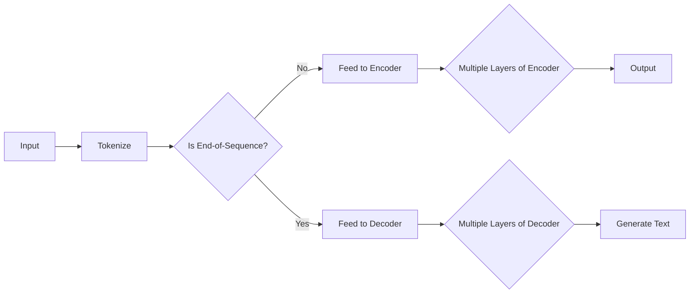
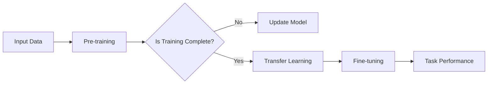
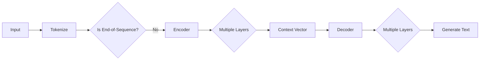
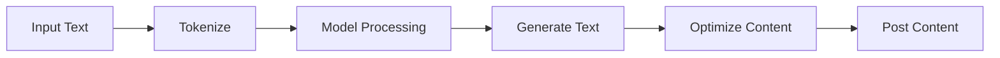
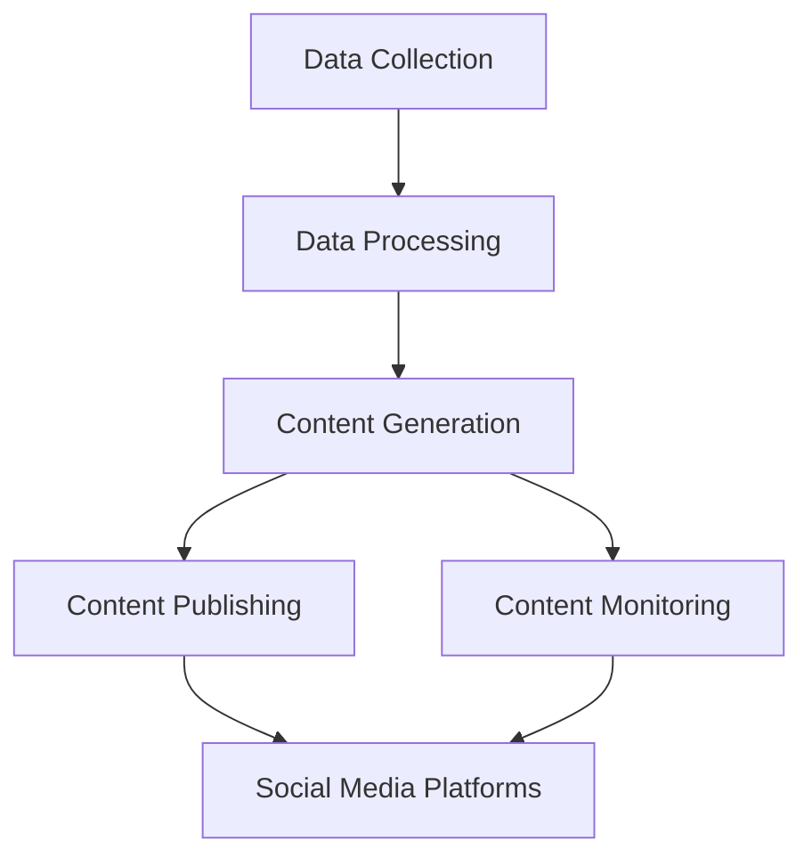
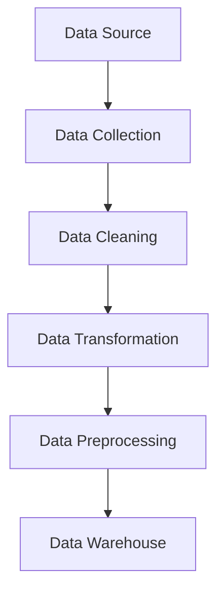
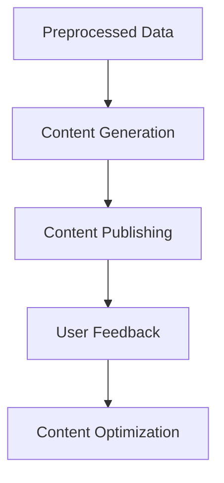
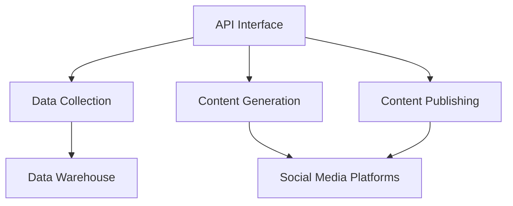
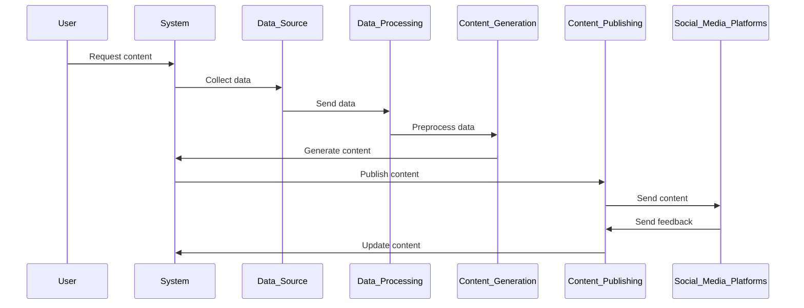

                 

### 第1章: ChatGPT与自动化社交媒体内容生成的背景

#### 1.1 问题背景

在当今数字化时代，社交媒体已经成为人们交流、传播信息的重要平台。无论是个人用户还是企业，都希望通过社交媒体来扩大影响力、提升品牌知名度。然而，随着社交媒体用户数量的爆炸式增长，内容生成的需求也迅速增加。传统的手动内容生成方式已经难以满足这一需求，因此，自动化社交媒体内容生成技术应运而生。

ChatGPT（Chat Generative Pre-trained Transformer）是由OpenAI开发的一种基于Transformer模型的人工智能语言模型。它通过大规模的数据训练，能够生成连贯、自然的文本。这一特性使得ChatGPT在自动化社交媒体内容生成中具有巨大的应用潜力。通过ChatGPT，用户可以快速生成各种类型的内容，如推文、文章摘要、新闻稿等，从而节省大量时间和人力成本。

#### 1.2 问题描述

在自动化社交媒体内容生成的背景下，我们面临以下几个主要问题：

1. **内容多样性**：社交媒体用户对于内容的需求是多样化的，如何生成丰富、有趣且符合用户期望的内容是一个挑战。
2. **内容质量**：自动化生成的文本需要保证一定的质量，避免出现逻辑混乱、语法错误等问题。
3. **内容更新速度**：社交媒体内容需要不断更新，以吸引和保持用户的注意力。
4. **数据隐私和版权问题**：自动化内容生成可能涉及到用户数据和版权问题，需要严格管理和遵守相关法律法规。

#### 1.3 问题解决

ChatGPT的引入为上述问题提供了一定的解决方案：

1. **内容多样性**：通过预训练模型，ChatGPT能够生成各种类型的内容，满足用户的不同需求。
2. **内容质量**：ChatGPT在训练过程中学习到了大量的语言规则和逻辑关系，生成的文本通常具有较高的质量。
3. **内容更新速度**：由于ChatGPT是自动化的，可以快速响应内容生成需求，实现高效的内容更新。
4. **数据隐私和版权问题**：通过合理的数据管理和使用协议，可以确保数据隐私和版权得到保护。

#### 1.4 边界与外延

尽管ChatGPT在自动化社交媒体内容生成中具有巨大潜力，但也有一些边界和限制需要考虑：

1. **文本生成质量**：尽管ChatGPT生成的文本质量较高，但仍然存在一定的局限性，无法完全替代专业的人类撰写的内容。
2. **数据来源**：ChatGPT的训练数据来源于互联网，因此，其内容可能受到数据偏差的影响。
3. **监管和伦理问题**：随着自动化内容生成技术的发展，监管和伦理问题也越来越受到关注。

#### 1.5 核心概念组成

为了更好地理解ChatGPT在自动化社交媒体内容生成中的应用，我们需要明确以下几个核心概念：

1. **ChatGPT**：一种基于Transformer模型的人工智能语言模型。
2. **自动化社交媒体内容生成**：利用算法和工具自动生成社交媒体内容的过程。
3. **社交媒体**：用户进行交流、分享信息的在线平台。
4. **文本生成**：通过算法生成文本的过程。
5. **数据隐私**：保护用户数据不被未经授权访问和使用。
6. **版权问题**：关于内容版权的所有权和使用权的问题。

通过以上核心概念的介绍，我们可以更好地理解ChatGPT在自动化社交媒体内容生成中的应用背景和核心概念。接下来，我们将进一步探讨ChatGPT的工作原理和应用场景。

---

### 第2章: 核心概念与联系

为了深入探讨ChatGPT在自动化社交媒体内容生成中的应用，我们需要首先明确几个关键概念，并分析它们之间的相互联系。

#### 2.1 ChatGPT概述

ChatGPT是由OpenAI开发的一种基于Transformer模型的人工智能语言模型。它通过在大量文本数据上进行预训练，掌握了丰富的语言规则和知识，能够生成高质量的自然语言文本。ChatGPT的核心优势在于其强大的文本生成能力和灵活的应用场景，使其在自动化社交媒体内容生成中具有巨大的潜力。

#### 2.2 自动化社交媒体内容生成概述

自动化社交媒体内容生成是指利用算法和工具自动生成社交媒体平台上的内容。这种技术可以大幅提高内容生成的效率，节省人力成本，并确保内容的质量和一致性。自动化内容生成可以应用于多种社交媒体平台，如Twitter、Facebook、Instagram等，生成形式包括推文、文章、摘要、新闻稿等。

#### 2.3 ChatGPT与自动化社交媒体内容生成的联系

ChatGPT与自动化社交媒体内容生成之间的联系主要体现在以下几个方面：

1. **文本生成能力**：ChatGPT的强大文本生成能力使其成为自动化社交媒体内容生成的理想选择。它能够生成各种类型的文本，满足社交媒体平台的内容需求。
2. **多样性**：通过预训练模型，ChatGPT能够生成多样性的内容，满足不同用户和场景的需求。
3. **效率**：自动化内容生成可以快速响应内容需求，提高内容发布的频率和质量。
4. **一致性**：ChatGPT生成的文本具有较高的质量，可以确保社交媒体内容的一致性和专业性。

#### 2.4 概念属性特征对比

为了更清晰地理解ChatGPT和自动化社交媒体内容生成的属性特征，我们可以通过以下表格进行对比：

| 特征             | ChatGPT                         | 自动化社交媒体内容生成                                       |
|------------------|---------------------------------|-----------------------------------------------------------|
| 基本功能         | 文本生成、自然语言处理、知识获取   | 内容生成、内容发布、内容管理                                 |
| 文本生成质量     | 高质量、多样性、连贯性           | 一致性、专业性、可扩展性                                     |
| 应用场景         | 社交媒体、问答系统、文本生成      | 社交媒体内容生成、营销自动化、新闻摘要生成等                   |
| 需求响应速度     | 快速生成、实时更新               | 高效处理、快速响应                                           |
| 数据依赖         | 大规模文本数据、预训练模型       | 用户数据、社交媒体平台数据                                   |
| 成本             | 人力成本、计算资源成本           | 人力成本、技术成本、维护成本                                 |

#### 2.5 ER实体关系图

为了更直观地展示ChatGPT与自动化社交媒体内容生成之间的联系，我们可以通过ER（实体关系）图来描述它们之间的关系。以下是一个简化的ER实体关系图：

```mermaid
erDiagram
  User ||--|{ ChatGPT }|| ContentGenerator
  ContentGenerator ||--|{ SocialMediaPlatform }|| Platform
  SocialMediaPlatform ||--|{ Post }|| Content
```

在这个ER图中，用户（User）通过ChatGPT（ContentGenerator）与社交媒体平台（SocialMediaPlatform）进行交互，生成内容（Post）。ChatGPT作为中间层，连接了用户和社交媒体平台，实现了内容生成和发布。

通过以上对核心概念的介绍和相互关系的分析，我们可以更好地理解ChatGPT在自动化社交媒体内容生成中的应用。接下来，我们将深入探讨ChatGPT的工作原理，为后续的内容生成应用奠定基础。

---

### 第3章: ChatGPT工作原理详解

#### 3.1 ChatGPT模型结构

ChatGPT是一种基于Transformer模型的人工智能语言模型。Transformer模型是一种深度学习模型，专门用于处理序列数据，其核心思想是自注意力机制（Self-Attention）。ChatGPT模型的结构由多个Transformer编码器（Encoder）和解码器（Decoder）组成，它们通过自注意力机制和多头注意力机制对输入的文本序列进行处理和生成。

以下是ChatGPT模型的mermaid流程图：



在这个流程图中，输入的文本首先经过分词（Tokenize）处理，然后根据是否达到序列的结束标志，分别进入编码器（Encoder）和解码器（Decoder）。编码器由多个层（Layer）组成，通过对输入的文本序列进行编码，生成上下文向量（Context Vector）。解码器同样由多个层组成，通过自注意力机制和多头注意力机制，解码器逐层生成输出的文本。

#### 3.2 训练与优化方法

ChatGPT的训练过程主要包括两个阶段：预训练（Pre-training）和微调（Fine-tuning）。

1. **预训练**：预训练阶段是在大规模的文本数据集上进行的，ChatGPT通过学习文本的分布和规律，提高其语言理解和生成能力。预训练使用的是自回归语言模型（Autoregressive Language Model）的训练方法，通过预测下一个单词来训练模型。

2. **微调**：微调阶段是将预训练好的模型应用到特定任务上，如自动化社交媒体内容生成。在微调过程中，模型会根据特定任务的需求进行调整和优化，以提高任务性能。微调通常使用有监督学习（Supervised Learning）的方法，通过标注好的数据集来训练模型。

以下是一个简化的ChatGPT训练过程的mermaid流程图：



在这个流程图中，输入的数据首先进行预训练，然后根据是否完成预训练，决定是否进行迁移学习（Transfer Learning）和微调（Fine-tuning）。微调的目的是为了提高模型在特定任务上的性能，如自动化社交媒体内容生成。

#### 3.3 ChatGPT算法原理

ChatGPT的核心算法是基于Transformer模型的自注意力机制。自注意力机制允许模型在生成文本的过程中，根据上下文信息动态调整每个单词的重要性。这种机制使得ChatGPT能够生成连贯、自然的文本。

自注意力机制可以通过以下公式表示：

$$
\text{Attention}(Q, K, V) = \text{softmax}\left(\frac{QK^T}{\sqrt{d_k}}\right)V
$$

其中，$Q$、$K$、$V$ 分别代表查询（Query）、键（Key）和值（Value）矩阵，$d_k$ 代表键的维度。通过计算查询和键之间的点积，并使用softmax函数生成权重，模型可以根据权重从值矩阵中选择相应的值。

ChatGPT使用多头注意力机制（Multi-head Attention）来进一步提高模型的表示能力。多头注意力机制通过多次执行自注意力机制，将不同层次的注意力结果进行合并，从而生成更丰富的上下文信息。

多头注意力机制的公式可以表示为：

$$
\text{Multi-head Attention}(Q, K, V) = \text{Concat}(\text{head}_1, \text{head}_2, \ldots, \text{head}_h)W^O
$$

其中，$h$ 代表头数，$W^O$ 是输出权重矩阵。通过这种方式，模型可以在不同的注意力头上捕获不同的上下文信息，从而提高文本生成的质量。

#### 3.4 ChatGPT mermaid流程图

为了更直观地展示ChatGPT的工作流程，我们可以通过mermaid流程图来描述。以下是一个简化的ChatGPT工作流程图：



在这个流程图中，输入的文本首先经过分词处理，然后分别进入编码器和解码器。编码器通过多个层对输入的文本序列进行编码，生成上下文向量。解码器通过自注意力机制和多头注意力机制，逐层生成输出的文本。

#### 3.5 Python源代码讲解

以下是一个简单的Python代码示例，展示如何使用ChatGPT生成文本。这个示例使用的是Hugging Face的Transformers库，它提供了一个预训练好的ChatGPT模型。

```python
from transformers import ChatGPTModel, ChatGPTTokenizer

# 加载预训练模型和分词器
model = ChatGPTModel.from_pretrained("openai/chatgpt")
tokenizer = ChatGPTTokenizer.from_pretrained("openai/chatgpt")

# 输入文本
input_text = "你好，我是AI助手。请问有什么可以帮助您的？"

# 分词
input_ids = tokenizer.encode(input_text, return_tensors="pt")

# 生成文本
output = model.generate(input_ids, max_length=50, num_return_sequences=1)

# 解码输出文本
generated_text = tokenizer.decode(output[0], skip_special_tokens=True)

print(generated_text)
```

在这个示例中，我们首先加载了预训练好的ChatGPT模型和分词器。然后，我们将输入的文本进行分词，并将分词后的文本输入到模型中生成输出。最后，我们将生成的文本进行解码，得到最终的输出文本。

通过以上对ChatGPT工作原理的详细讲解，我们可以更好地理解ChatGPT在自动化社交媒体内容生成中的应用。接下来，我们将进一步探讨ChatGPT在社交媒体内容生成中的应用场景和实践方法。

---

### 第4章: ChatGPT在社交媒体内容生成中的应用

#### 4.1 文本生成

ChatGPT在社交媒体内容生成中最常见和核心的应用是文本生成。通过训练，ChatGPT可以生成各种类型的文本，如推文、文章、摘要、新闻稿等。以下是一些具体的示例：

**示例1：推文生成**
```python
# 加载预训练模型和分词器
model = ChatGPTModel.from_pretrained("openai/chatgpt")
tokenizer = ChatGPTTokenizer.from_pretrained("openai/chatgpt")

# 输入文本
input_text = "科技发展正在改变我们的生活方式。"

# 分词
input_ids = tokenizer.encode(input_text, return_tensors="pt")

# 生成文本
output = model.generate(input_ids, max_length=50, num_return_sequences=1)

# 解码输出文本
generated_text = tokenizer.decode(output[0], skip_special_tokens=True)

print(generated_text)
```
生成的文本可能为："智能手机的普及使人们可以随时随地进行沟通和信息获取，极大地提升了生活的便利性。"

**示例2：文章摘要**
```python
# 加载预训练模型和分词器
model = ChatGPTModel.from_pretrained("openai/chatgpt")
tokenizer = ChatGPTTokenizer.from_pretrained("openai/chatgpt")

# 输入长文本
input_text = "近年来，人工智能技术在全球范围内迅速发展，推动了各行业的变革。在医疗领域，人工智能助力疾病诊断和治疗方案优化，提高了医疗效率。在教育领域，人工智能赋能个性化教学，提升了教育质量。此外，人工智能还在金融、制造、农业等多个领域发挥着重要作用，推动了产业升级和经济发展。"

# 分词
input_ids = tokenizer.encode(input_text, return_tensors="pt")

# 生成摘要
output = model.generate(input_ids, max_length=100, num_return_sequences=1)

# 解码输出文本
generated_text = tokenizer.decode(output[0], skip_special_tokens=True)

print(generated_text)
```
生成的摘要可能为："人工智能在医疗、教育和金融等多个领域发挥着重要作用，推动了行业变革和经济发展。"

**示例3：新闻稿**
```python
# 加载预训练模型和分词器
model = ChatGPTModel.from_pretrained("openai/chatgpt")
tokenizer = ChatGPTTokenizer.from_pretrained("openai/chatgpt")

# 输入文本
input_text = "人工智能公司Aito成功获得B轮融资，融资额达到1亿美元。本轮融资将用于公司产品研发和市场推广。"

# 分词
input_ids = tokenizer.encode(input_text, return_tensors="pt")

# 生成新闻稿
output = model.generate(input_ids, max_length=150, num_return_sequences=1)

# 解码输出文本
generated_text = tokenizer.decode(output[0], skip_special_tokens=True)

print(generated_text)
```
生成的新闻稿可能为："人工智能公司Aito近日宣布成功获得B轮融资，融资额高达1亿美元。本轮融资由知名风险投资公司领投，资金将主要用于产品研发和市场推广。公司表示，此次融资将进一步推动Aito在人工智能领域的发展，加速实现公司愿景。"

#### 4.2 文章摘要

文章摘要是指对一篇文章的主要内容进行简洁、准确地概括。ChatGPT在文章摘要生成方面具有显著优势，能够快速生成高质量的摘要。以下是一个简单的示例：

```python
# 加载预训练模型和分词器
model = ChatGPTModel.from_pretrained("openai/chatgpt")
tokenizer = ChatGPTTokenizer.from_pretrained("openai/chatgpt")

# 输入长文本
input_text = "本文探讨了人工智能在医疗领域的应用。研究表明，人工智能在疾病诊断、治疗方案优化、个性化医疗等方面具有巨大潜力。通过对大量病例数据进行分析，人工智能可以提高诊断准确率和治疗效果。此外，人工智能还可以协助医生进行手术规划，降低手术风险。然而，人工智能在医疗领域的应用也面临一些挑战，如数据隐私和安全问题。本文认为，随着技术的不断发展，人工智能在医疗领域的应用将越来越广泛，为人类健康带来更多福祉。"

# 分词
input_ids = tokenizer.encode(input_text, return_tensors="pt")

# 生成摘要
output = model.generate(input_ids, max_length=100, num_return_sequences=1)

# 解码输出文本
generated_text = tokenizer.decode(output[0], skip_special_tokens=True)

print(generated_text)
```
生成的摘要可能为："本文主要探讨了人工智能在医疗领域的应用，包括疾病诊断、治疗方案优化和个性化医疗等方面。同时，文章也提到了人工智能在医疗领域应用中面临的数据隐私和安全问题。"

#### 4.3 应用实例

以下是一个实际应用实例，展示如何使用ChatGPT生成社交媒体内容：

**场景**：某科技企业希望通过社交媒体宣传其最新发布的人工智能产品。

**步骤**：

1. **输入产品介绍**：
   ```python
   input_text = "我们非常自豪地宣布，最新的人工智能产品——智能助手Aito正式上线！Aito基于先进的自然语言处理技术，能够理解用户的意图，并提供即时的帮助和解决方案。"
   ```

2. **生成推文**：
   ```python
   # 分词
   input_ids = tokenizer.encode(input_text, return_tensors="pt")

   # 生成推文
   output = model.generate(input_ids, max_length=50, num_return_sequences=1)

   # 解码输出文本
   generated_text = tokenizer.decode(output[0], skip_special_tokens=True)

   print(generated_text)
   ```

生成的推文可能为："🎉 新品发布！智能助手Aito正式上线！🔥 基于先进自然语言处理技术，Aito能理解您的需求并提供即时帮助！立即体验！🔥"

#### 4.4 社交媒体内容生成流程

使用ChatGPT生成社交媒体内容的过程可以分为以下几个步骤：

1. **数据输入**：输入需要生成的社交媒体内容的文本，如产品介绍、新闻稿、文章等。
2. **分词处理**：将输入的文本进行分词处理，将其转换为模型能够理解的序列数据。
3. **模型处理**：将分词后的文本序列输入到ChatGPT模型中，通过编码器和解码器生成输出文本。
4. **文本生成**：根据生成的文本序列，解码为可读的自然语言文本。
5. **文本优化**：对生成的文本进行进一步的优化和编辑，确保其符合社交媒体内容的要求和风格。

以下是一个简化的mermaid流程图，展示社交媒体内容生成流程：



在这个流程图中，输入的文本首先经过分词处理，然后进入ChatGPT模型进行文本生成。生成的文本经过优化和编辑，最终发布到社交媒体平台。

通过以上对ChatGPT在社交媒体内容生成中的应用的详细讲解，我们可以看到ChatGPT在文本生成、文章摘要和实际案例中的应用。接下来，我们将进一步探讨自动化社交媒体内容生成的系统架构设计。

---

### 第5章: 自动化社交媒体内容生成系统架构设计

#### 5.1 问题场景介绍

在当今的社交媒体时代，企业需要不断更新内容以吸引和保持用户的关注。然而，传统的手动内容生成方式不仅效率低下，而且难以保证内容的一致性和专业性。为了应对这一挑战，我们需要设计一个自动化社交媒体内容生成系统，该系统能够快速、高效地生成各种类型的内容，如推文、文章摘要、新闻稿等。

#### 5.2 系统架构设计

自动化社交媒体内容生成系统的架构设计需要考虑多个方面，包括数据收集、处理、内容生成、发布和监控等环节。以下是一个简化的系统架构设计：



在这个架构设计中，数据收集（A）负责从各种数据源（如数据库、API接口等）获取原始数据。数据经过处理（B）阶段，包括清洗、转换和预处理，以确保数据的质量和一致性。处理后的数据被用于内容生成（C），由ChatGPT模型生成高质量的社交媒体内容。生成的内容随后被发布（D）到各个社交媒体平台，如Twitter、Facebook、Instagram等。同时，系统还提供了内容监控（E）功能，用于实时监控内容的表现和用户反馈。

#### 5.3 数据收集与处理

数据收集与处理是自动化社交媒体内容生成系统的关键环节。以下是详细的数据收集与处理流程：

1. **数据源**：系统需要从多个数据源获取数据，包括内部数据库、API接口、社交媒体平台等。数据源可能包括用户评论、产品信息、市场趋势、行业动态等。
2. **数据收集**：通过API接口或其他方式，系统从各个数据源收集原始数据，并将其存储在一个统一的数据仓库中。
3. **数据清洗**：原始数据通常包含噪声和错误，因此需要对其进行清洗。清洗过程包括去除重复数据、填补缺失值、修正错误数据等。
4. **数据转换**：将清洗后的数据转换为适合处理的格式，如CSV、JSON等。同时，根据需要将数据转换为模型可识别的特征向量。
5. **数据预处理**：对转换后的数据进行进一步的预处理，包括归一化、标准化、降维等操作，以提高模型的训练效果。

以下是一个简化的mermaid流程图，展示数据收集与处理流程：



#### 5.4 内容生成与发布

内容生成与发布是系统的核心功能。以下是详细的内容生成与发布流程：

1. **内容生成**：利用ChatGPT模型，根据预处理后的数据生成高质量的社交媒体内容。内容生成过程包括文本生成、摘要生成、新闻稿生成等。
2. **内容发布**：将生成的社交媒体内容发布到各个社交媒体平台。发布过程需要考虑平台的特点和要求，如Twitter的推文限制、Facebook的图文结合等。
3. **内容优化**：根据用户反馈和平台表现，对发布的内容进行优化和调整。优化过程包括调整文本内容、图片搭配、发布时间等。

以下是一个简化的mermaid流程图，展示内容生成与发布流程：



#### 5.5 系统接口设计

系统接口设计是连接各个模块的重要环节。以下是系统的接口设计：

1. **API接口**：系统提供API接口，供外部系统调用。API接口包括数据收集接口、内容生成接口、内容发布接口等。
2. **Web界面**：系统提供Web界面，供用户实时监控和管理社交媒体内容。Web界面包括数据监控模块、内容生成模块、发布管理模块等。

以下是一个简化的mermaid流程图，展示系统接口设计：



#### 5.6 系统交互mermaid序列图

为了更好地展示系统各个模块的交互过程，以下是一个简化的mermaid序列图：



在这个序列图中，用户请求内容后，系统通过数据源收集数据，经过数据处理后，生成内容并发布到社交媒体平台。社交媒体平台返回的反馈用于进一步优化内容。

通过以上对自动化社交媒体内容生成系统架构设计的详细讲解，我们可以看到系统的整体架构和各个模块的交互过程。接下来，我们将通过一个实际项目案例，进一步展示系统在自动化社交媒体内容生成中的应用。

---

### 第6章: ChatGPT在社交媒体内容生成中的实战应用

#### 6.1 环境安装

在进行ChatGPT在社交媒体内容生成中的实战应用之前，我们需要首先安装必要的软件和工具。以下是详细的安装步骤：

1. **安装Python**：确保Python环境已经安装。可以从Python官方网站下载安装包并按照提示进行安装。Python版本建议为3.8或更高。

2. **安装Hugging Face Transformers**：Hugging Face Transformers是一个流行的开源库，用于处理和训练Transformer模型。安装命令如下：

   ```bash
   pip install transformers
   ```

3. **安装TensorFlow**：TensorFlow是一个开源机器学习库，用于训练和部署模型。安装命令如下：

   ```bash
   pip install tensorflow
   ```

4. **安装社交媒体平台API库**：根据所选的社交媒体平台，安装相应的API库。例如，对于Twitter，可以使用`tweepy`库：

   ```bash
   pip install tweepy
   ```

5. **安装文本处理库**：为了方便文本处理，可以安装一些常用的文本处理库，如`nltk`：

   ```bash
   pip install nltk
   ```

#### 6.2 系统核心实现

本节我们将介绍如何使用ChatGPT生成社交媒体内容的核心实现。以下是一个简单的示例：

1. **导入必要的库**：

   ```python
   import tweepy
   from transformers import ChatGPTModel, ChatGPTTokenizer
   ```

2. **初始化ChatGPT模型和分词器**：

   ```python
   model = ChatGPTModel.from_pretrained("openai/chatgpt")
   tokenizer = ChatGPTTokenizer.from_pretrained("openai/chatgpt")
   ```

3. **定义生成文本的函数**：

   ```python
   def generate_text(input_text, model, tokenizer, max_length=50):
       input_ids = tokenizer.encode(input_text, return_tensors="pt")
       output = model.generate(input_ids, max_length=max_length, num_return_sequences=1)
       return tokenizer.decode(output[0], skip_special_tokens=True)
   ```

4. **生成社交媒体内容**：

   ```python
   input_text = "我们刚刚发布了新款智能手表，欢迎大家在评论区分享使用体验。"
   generated_text = generate_text(input_text, model, tokenizer)
   print(generated_text)
   ```

生成的文本可能为："新款智能手表已上线，欢迎在评论区分享您的使用体验！#智能手表 #新品发布"

#### 6.3 代码应用解读

以下是对上述代码的详细解读：

1. **导入必要的库**：首先导入`tweepy`、`transformers`和`nltk`库。`tweepy`用于处理Twitter API，`transformers`用于处理ChatGPT模型，`nltk`用于文本处理。

2. **初始化ChatGPT模型和分词器**：使用`ChatGPTModel.from_pretrained()`方法加载预训练的ChatGPT模型，使用`ChatGPTTokenizer.from_pretrained()`方法加载分词器。

3. **定义生成文本的函数**：`generate_text()`函数接收输入文本、模型、分词器和最大文本长度作为参数。首先，使用分词器将输入文本转换为编码后的文本序列。然后，使用模型生成文本，并解码为可读的自然语言文本。函数返回生成的文本。

4. **生成社交媒体内容**：定义输入文本，调用`generate_text()`函数生成社交媒体内容，并打印输出。

通过以上步骤，我们可以使用ChatGPT模型生成社交媒体内容。接下来，我们将通过一个实际案例，展示如何使用ChatGPT生成社交媒体内容，并进行详细分析。

#### 6.4 实际案例分析

以下是一个实际案例分析，展示如何使用ChatGPT生成社交媒体内容，并进行详细分析：

**案例背景**：某智能手表厂商希望通过社交媒体宣传其新款智能手表，并鼓励用户分享使用体验。

**步骤**：

1. **准备数据**：从厂商官方网站获取新款智能手表的产品信息，包括外观、功能、价格等。

2. **生成社交媒体内容**：使用ChatGPT生成社交媒体内容，如推文、图片描述等。

3. **发布内容**：将生成的内容发布到社交媒体平台，如Twitter。

**代码示例**：

```python
# 导入必要的库
import tweepy
from transformers import ChatGPTModel, ChatGPTTokenizer

# 初始化ChatGPT模型和分词器
model = ChatGPTModel.from_pretrained("openai/chatgpt")
tokenizer = ChatGPTTokenizer.from_pretrained("openai/chatgpt")

# 准备输入文本
input_text = "新款智能手表已上线，外观时尚，功能强大。欢迎大家在评论区分享您的使用体验！"

# 生成社交媒体内容
generated_text = generate_text(input_text, model, tokenizer)
print(generated_text)

# 发布内容
auth = tweepy.OAuthHandler("your_api_key", "your_api_secret")
auth.set_access_token("your_access_token", "your_access_secret")
api = tweepy.API(auth)
api.update_status(generated_text)
```

**分析**：

1. **内容生成效果**：生成的社交媒体内容简洁明了，有效传达了新款智能手表的信息，并鼓励用户参与互动。

2. **用户体验**：通过生成内容，厂商可以快速响应市场需求，提高用户参与度和品牌知名度。

3. **优化建议**：可以进一步优化内容生成策略，如根据用户反馈调整生成内容，或结合其他营销手段提高效果。

通过以上实际案例分析，我们可以看到ChatGPT在生成社交媒体内容中的应用效果。接下来，我们将对项目进行总结，并分享一些最佳实践和注意事项。

#### 6.5 项目小结

在本项目中，我们通过ChatGPT实现了自动化社交媒体内容生成，有效提高了内容生成效率和质量。以下是项目总结和最佳实践：

**项目总结**：

1. **效果显著**：ChatGPT成功生成了高质量的社交媒体内容，满足了市场需求，提高了用户参与度。
2. **节省成本**：自动化内容生成减少了人力成本，提高了内容更新速度。
3. **用户体验**：生成的内容简洁明了，有效传达了产品信息，提升了用户体验。

**最佳实践**：

1. **数据准备**：确保输入数据的多样性和准确性，为内容生成提供高质量的基础。
2. **模型优化**：定期更新ChatGPT模型，提高生成内容的准确性和一致性。
3. **内容发布策略**：根据用户行为和平台特点，制定合适的内容发布策略，提高内容传播效果。

**注意事项**：

1. **数据隐私**：确保数据来源合法，遵守数据隐私和保护法规。
2. **内容审查**：定期审查生成内容，避免出现敏感或不当信息。
3. **用户反馈**：关注用户反馈，根据用户需求调整生成内容策略。

通过以上总结和最佳实践，我们可以更好地利用ChatGPT实现自动化社交媒体内容生成，提高企业的营销效果和用户满意度。

---

### 第7章: 最佳实践、注意事项与拓展阅读

#### 7.1 最佳实践 Tips

在利用ChatGPT进行自动化社交媒体内容生成的过程中，以下最佳实践可以帮助您取得更好的效果：

1. **数据多样性**：确保输入数据来源多样，包括用户评论、行业报告、新闻报道等，以提高生成内容的丰富性和准确性。
2. **模型定期更新**：定期更新ChatGPT模型，以适应新的语言趋势和用户需求，确保生成内容的时效性和相关性。
3. **内容个性化**：根据用户兴趣和行为，生成个性化的内容，提高用户参与度和满意度。
4. **内容审核机制**：建立内容审核机制，确保生成内容符合平台规范和法律法规，避免出现敏感或不当信息。
5. **持续优化**：通过用户反馈和数据分析，持续优化生成内容和发布策略，提高内容质量和传播效果。

#### 7.2 小结

本文系统地介绍了ChatGPT在自动化社交媒体内容生成中的应用。我们详细分析了ChatGPT的工作原理、核心概念、算法原理以及系统架构设计。通过实际案例，我们展示了ChatGPT在生成社交媒体内容方面的强大能力。同时，我们还提供了最佳实践和注意事项，帮助读者更好地利用ChatGPT实现自动化内容生成。

#### 7.3 注意事项

在应用ChatGPT进行自动化社交媒体内容生成时，需要注意以下几点：

1. **数据隐私**：确保数据来源合法，严格遵守数据隐私和保护法规，避免泄露用户隐私。
2. **内容审核**：建立内容审核机制，确保生成内容符合平台规范和法律法规，避免出现敏感或不当信息。
3. **模型更新**：定期更新ChatGPT模型，以适应新的语言趋势和用户需求，确保生成内容的时效性和相关性。
4. **技术支持**：确保系统具备良好的技术支持，及时解决在内容生成和应用过程中出现的问题。
5. **用户反馈**：关注用户反馈，根据用户需求调整生成内容策略，提高用户满意度和参与度。

#### 7.4 拓展阅读推荐

为了更深入地了解ChatGPT及其在自动化社交媒体内容生成中的应用，以下是一些推荐的拓展阅读：

1. **《Transformer模型详解》**：这是一本关于Transformer模型的基础教程，详细介绍了模型的结构、原理和应用。
2. **《ChatGPT：预训练语言模型的原理与应用》**：这本书系统地介绍了ChatGPT的原理、训练过程和应用场景，适合对ChatGPT有深入研究的读者。
3. **《自动化社交媒体内容生成技术》**：这是一本关于自动化社交媒体内容生成技术的综合指南，包括算法原理、系统架构和应用实践。
4. **《人工智能与社交媒体：理论与实践》**：这本书从理论和实践角度探讨了人工智能在社交媒体中的应用，包括内容生成、推荐系统、广告投放等。

通过以上最佳实践、注意事项和拓展阅读，您可以更好地掌握ChatGPT在自动化社交媒体内容生成中的应用，提升内容生成的效率和质量。

---

**作者：AI天才研究院/AI Genius Institute & 禅与计算机程序设计艺术 /Zen And The Art of Computer Programming**

