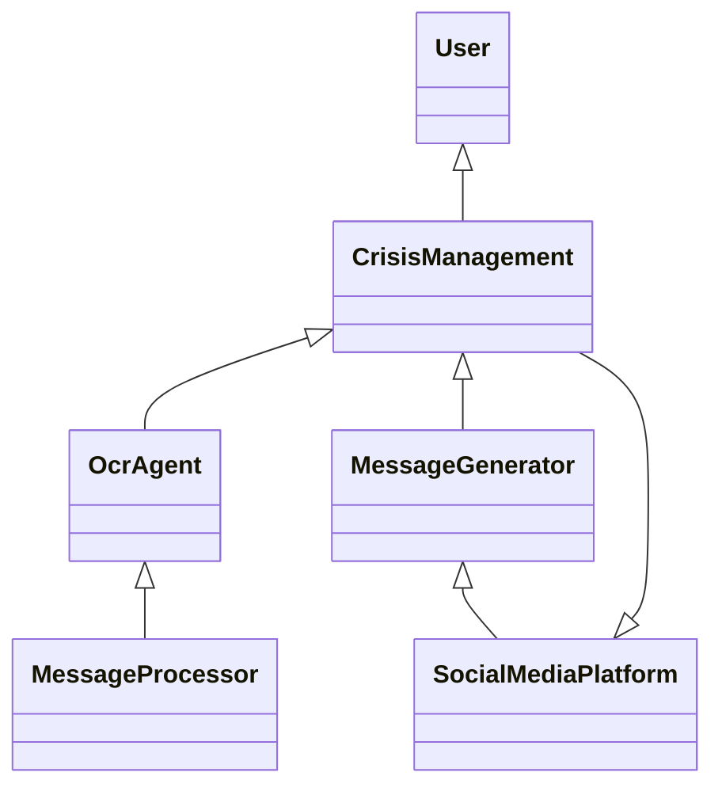
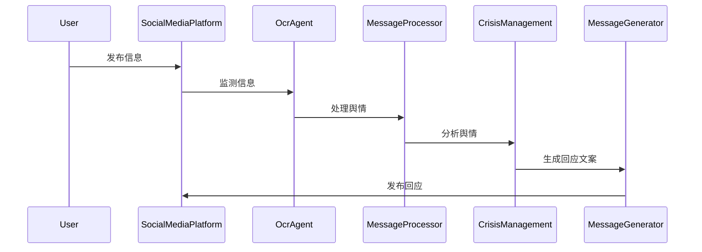
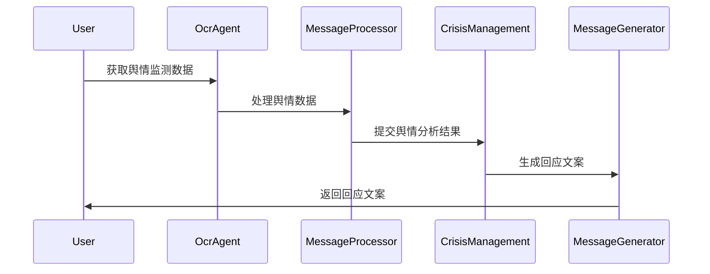

                 

### 1.1 问题描述

#### 社交媒体危机公关的挑战

在当今数字化时代，社交媒体已成为企业危机公关的主要战场。无论是品牌形象、产品安全，还是用户隐私问题，一旦在社交媒体上爆发，就会迅速传播，引发公众关注，甚至对企业的声誉造成长期损害。以下是社交媒体危机公关面临的主要挑战：

1. **信息传播速度快**：社交媒体的即时性使得信息能在短时间内迅速传播，危机事件往往在没有经过充分处理的情况下就迅速扩散。
2. **舆论难以控制**：社交媒体平台上的用户具有匿名性，容易形成群体情绪，导致舆论失控。
3. **危机演变不可预测**：危机事件的演变不可预测，企业可能需要迅速调整应对策略，以适应不断变化的情况。
4. **沟通成本高**：危机公关需要企业投入大量资源进行监测、分析和回应，沟通成本高昂。

#### ChatGPT在危机公关中的应用潜力

ChatGPT作为一种先进的人工智能技术，具备以下在危机公关中应用的优势：

1. **实时监测**：ChatGPT能够实时监控社交媒体上的信息流，快速识别危机信号。
2. **智能分析**：通过自然语言处理技术，ChatGPT可以深入分析舆情，识别情绪倾向，为企业提供决策依据。
3. **自动化响应**：ChatGPT能够根据预设的规则和策略，自动化生成回应文案，提高危机公关的响应速度。
4. **优化沟通**：ChatGPT能够模拟人类对话，优化企业与公众之间的沟通，提升沟通效果。

尽管ChatGPT在危机公关中展现出巨大潜力，但其应用也面临一定的限制，如语言理解的深度和广度、情绪把握的准确性等。接下来，我们将进一步探讨ChatGPT的优势与限制，以及如何融合其技术与危机公关策略。

### 1.2 问题解决

#### ChatGPT的优势与限制

**优势：**

1. **强大的语言理解能力**：ChatGPT基于大规模预训练模型，拥有卓越的自然语言理解能力，能够精准地捕捉文本中的语义和情感。
2. **快速响应**：ChatGPT能够实时分析社交媒体上的信息，并在短时间内生成回应文案，提升危机公关的效率。
3. **自动化处理**：ChatGPT可以自动化执行危机公关中的重复性任务，如舆情监测、数据分析等，减轻人工负担。
4. **多语言支持**：ChatGPT支持多种语言，能够处理全球范围内的社交媒体危机。

**限制：**

1. **语言理解的深度和广度**：尽管ChatGPT在语言理解方面有显著优势，但在处理复杂、专业或情感丰富的文本时，仍存在局限性。
2. **情绪把握的准确性**：情绪是人类沟通的重要组成部分，ChatGPT在理解情绪、把握情感方面还有待提高。
3. **逻辑推理能力**：ChatGPT在逻辑推理方面的能力有限，可能无法完全替代人类在复杂决策中的判断。
4. **数据隐私和安全**：在处理大量数据时，ChatGPT需要确保数据隐私和安全，防止信息泄露。

#### 融合ChatGPT的危机公关策略

为了充分发挥ChatGPT的优势，同时克服其限制，我们可以采用以下策略：

1. **智能监测与预警**：利用ChatGPT的实时监测能力，建立危机预警系统，及时发现潜在危机信号。
2. **舆情分析与报告**：通过ChatGPT的自然语言处理能力，对社交媒体上的舆情进行深入分析，为企业提供详细的舆情报告。
3. **自动化响应文案生成**：基于预设的危机公关策略，ChatGPT可以自动化生成回应文案，快速应对危机事件。
4. **人工审核与调整**：在ChatGPT生成的文案基础上，由专业人员进行审核和调整，确保沟通的准确性和情感传达。
5. **多语言危机公关**：利用ChatGPT的多语言支持，实现全球范围内的危机公关，确保信息传播的一致性和准确性。

通过以上策略，企业可以在危机公关中更高效、更准确地应对挑战，提升整体公关效果。

### 1.3 边界与外延

#### 危机公关的范畴

危机公关是指企业在面对突发事件、负面舆论或其他危机时，采取的一系列预防和应对措施，旨在减轻危机对企业声誉和业务的影响。危机公关的范畴包括：

1. **公关危机预防**：通过风险识别和管理，预防潜在的公关危机。
2. **媒体应对**：与媒体保持良好沟通，及时发布声明和回应，引导舆论方向。
3. **危机处理**：在危机事件发生后，采取有效措施控制事态发展，减轻企业损失。
4. **舆情管理**：监测和分析社交媒体上的舆论，制定相应的应对策略。

#### ChatGPT在社交媒体危机公关中的适用场景

ChatGPT在社交媒体危机公关中的适用场景主要包括以下几个方面：

1. **实时舆情监测**：ChatGPT可以实时监控社交媒体平台上的信息流，及时发现潜在的危机信号。
2. **自动化舆情分析**：通过自然语言处理技术，ChatGPT可以对舆情进行自动化分析，识别情绪倾向和关键信息。
3. **自动化文案生成**：基于预设的危机公关策略，ChatGPT可以自动化生成回应文案，快速应对危机事件。
4. **多语言沟通**：ChatGPT支持多种语言，能够处理全球范围内的社交媒体危机，确保信息传播的一致性和准确性。

然而，ChatGPT在危机公关中的应用也有其局限性，如处理复杂情感和逻辑推理方面的不足。因此，在实际应用中，需要结合人工审核和调整，以确保危机公关的效果。

#### 概念结构与核心要素组成

社交媒体危机公关的核心要素包括危机识别、舆情监测、舆情分析、响应策略和沟通管理。这些要素共同构成了危机公关的基本框架。

1. **危机识别**：通过实时监测和分析社交媒体信息，识别潜在的危机信号。
2. **舆情监测**：持续监测社交媒体平台上的舆论动态，收集相关信息。
3. **舆情分析**：利用自然语言处理技术，对舆情进行深入分析，识别情绪倾向和关键信息。
4. **响应策略**：根据舆情分析和危机性质，制定相应的危机公关策略。
5. **沟通管理**：通过多渠道沟通，及时发布声明和回应，引导舆论方向。

ChatGPT在危机公关中的核心应用主要体现在舆情监测、舆情分析和自动化文案生成等方面。通过整合ChatGPT的技术优势，企业可以更高效、更准确地应对社交媒体危机，提升整体公关效果。然而，在实际应用中，仍需结合人工审核和调整，以确保沟通的准确性和情感传达。

### 第二部分：核心概念与联系

#### 2.1 ChatGPT原理与特性

##### 2.1.1 ChatGPT概述

**定义**：ChatGPT是OpenAI开发的一种基于GPT-3.5的大规模预训练语言模型，旨在实现智能对话和文本生成。

**发展历程**：ChatGPT是GPT系列模型的发展成果，其前身包括GPT、GPT-2和GPT-3。随着模型规模的不断扩大和训练数据的增加，ChatGPT在自然语言理解和生成方面取得了显著进展。

##### 2.1.2 ChatGPT原理

**语言模型基本概念**：语言模型是一种统计模型，用于预测下一个单词或词组。在ChatGPT中，语言模型通过学习大量的文本数据，捕捉语言中的统计规律，从而实现文本生成。

**ChatGPT算法原理**：ChatGPT采用生成式预训练和指令微调（Instruction Tuning）的方法。首先，通过预训练阶段，模型在大规模文本数据上学习语言规律。然后，通过指令微调，模型根据特定任务的需求进行调整，提高其在特定任务上的性能。

##### 2.1.3 ChatGPT特性

**生成式对话**：ChatGPT能够根据输入的文本生成连贯、自然的对话文本，实现人机交互。

**预测与推断**：ChatGPT可以基于输入文本进行预测和推断，生成具有逻辑性和连贯性的文本。

**多模态处理**：ChatGPT不仅支持文本输入，还可以处理图像、音频等多种模态的输入，实现跨模态对话。

#### 2.2 社交媒体危机公关核心概念

##### 2.2.1 危机公关概念

**定义**：危机公关是指企业在面临突发事件、负面舆论或其他危机时，采取的一系列预防和应对措施，旨在减轻危机对企业声誉和业务的影响。

**目标**：危机公关的主要目标包括：降低危机对企业声誉的损害、控制危机传播、维护企业形象、恢复公众信任。

**原则**：危机公关应遵循以下原则：快速反应、真诚沟通、透明公开、及时纠正。

##### 2.2.2 社交媒体危机公关特点

**传播特点**：社交媒体危机传播速度快、范围广、影响大。危机事件往往能在短时间内引发广泛关注，对企业声誉造成重大影响。

**策略**：社交媒体危机公关策略主要包括：舆情监测、舆情分析、回应策略、舆论引导、沟通协调等。

**应对措施**：社交媒体危机公关应对措施包括：迅速回应、主动沟通、透明公开、积极纠正、媒体公关、线上线下联动等。

##### 2.2.3 ChatGPT与社交媒体危机公关的联系

**适用性**：ChatGPT在社交媒体危机公关中具有广泛适用性，主要体现在舆情监测、舆情分析和自动化文案生成等方面。

**优势**：ChatGPT的优势包括：实时监测、自动化分析、多语言支持、快速生成回应文案等。

**挑战**：ChatGPT在社交媒体危机公关中也面临一些挑战，如处理复杂情感、逻辑推理能力有限等。

**融合**：将ChatGPT与社交媒体危机公关相结合，可以提升公关效率、降低成本、提高沟通效果，但需结合人工审核和调整，确保沟通的准确性和情感传达。

通过以上分析，我们可以看出ChatGPT在社交媒体危机公关中具有巨大的应用潜力，但仍需结合人工智慧和实际需求，充分发挥其优势，应对危机挑战。

### 第三部分：算法原理与系统架构设计

#### 4.1 ChatGPT在危机公关中的应用原理

##### 4.1.1 ChatGPT在危机公关中的应用场景

1. **媒体监测**：ChatGPT可以实时监测社交媒体平台上的信息流，识别潜在的危机信号，为企业提供预警。
2. **舆情分析**：通过自然语言处理技术，ChatGPT可以深入分析社交媒体上的舆情，识别情绪倾向和关键信息，为企业提供决策依据。
3. **自动化响应**：ChatGPT可以根据预设的危机公关策略，自动化生成回应文案，提高危机公关的响应速度。

##### 4.1.2 ChatGPT算法在危机公关中的应用

1. **语言生成与重构**：ChatGPT可以基于输入的文本生成连贯、自然的回应文案，优化危机公关的沟通效果。
2. **情感分析**：ChatGPT可以通过情感分析技术，识别社交媒体上的情绪倾向，为企业提供针对性的应对策略。
3. **对话生成**：ChatGPT可以生成具有逻辑性和连贯性的对话文本，模拟人类对话，提高危机公关的互动性和情感传达。

#### 5.1 项目介绍

**项目目标**：本项目的目标是构建一个基于ChatGPT的自动化社交媒体危机公关系统，实现实时舆情监测、舆情分析和自动化响应。

**项目背景**：随着社交媒体的普及，企业面临的信息传播风险日益增加。为了应对这一挑战，本项目旨在利用人工智能技术，提升危机公关的效率和效果。

#### 5.2 系统功能设计

**功能需求分析**：系统需要实现以下功能：
1. 实时舆情监测：监测社交媒体平台上的信息流，识别潜在的危机信号。
2. 舆情分析：对社交媒体上的舆情进行深入分析，识别情绪倾向和关键信息。
3. 自动化响应：根据舆情分析和危机性质，自动化生成回应文案。

**领域模型设计（使用Mermaid类图）**



在上面的类图中，`OcrAgent`负责舆情监测，`MessageProcessor`负责处理舆情信息，`CrisisManagement`负责整体危机公关管理，`MessageGenerator`负责生成回应文案，`SocialMediaPlatform`代表社交媒体平台，`User`代表用户。

#### 5.3 系统架构设计

**架构设计原则**：系统架构设计应遵循以下原则：
1. 分层架构：系统采用分层架构，确保各模块之间松耦合，便于维护和扩展。
2. 可扩展性：系统应具有高可扩展性，能够根据业务需求进行灵活调整。
3. 安全性：确保数据安全和系统稳定性，防止信息泄露和系统崩溃。

**系统架构设计（使用Mermaid架构图）**



在上面的序列图中，用户发布信息到社交媒体平台，社交媒体平台将信息传递给OcrAgent进行监测，OcrAgent将处理后的舆情信息传递给MessageProcessor，MessageProcessor进一步分析舆情并传递给CrisisManagement，CrisisManagement根据分析结果生成回应文案，最后通过MessageGenerator发布到社交媒体平台。

#### 5.4 系统接口设计

**接口规范**：系统接口设计应遵循RESTful API规范，主要包括以下接口：

1. **舆情监测接口**：用于实时监测社交媒体平台上的信息流。
2. **舆情分析接口**：用于对社交媒体上的舆情进行深入分析。
3. **回应文案生成接口**：用于生成基于舆情分析的回应文案。

**接口设计（使用Mermaid序列图）**



在上面的序列图中，用户通过舆情监测接口获取舆情监测数据，OcrAgent处理舆情数据后传递给MessageProcessor，MessageProcessor提交舆情分析结果给CrisisManagement，CrisisManagement根据分析结果调用MessageGenerator生成回应文案，最终将回应文案返回给用户。

通过以上系统架构设计和接口设计，我们可以构建一个基于ChatGPT的自动化社交媒体危机公关系统，实现高效的舆情监测、分析和自动化响应。

### 6.1 开发环境搭建

#### 系统要求

1. **操作系统**：推荐使用Linux操作系统，如Ubuntu 18.04或更高版本。
2. **编程语言**：Python 3.7及以上版本。
3. **数据库**：MySQL 5.7及以上版本。
4. **消息队列**：RabbitMQ 3.8及以上版本。

#### 开发环境配置

1. **安装Python**：打开终端，执行以下命令安装Python：

   ```bash
   sudo apt-get update
   sudo apt-get install python3-pip
   pip3 install --upgrade pip
   pip3 install setuptools
   ```

2. **安装MySQL**：打开终端，执行以下命令安装MySQL：

   ```bash
   sudo apt-get install mysql-server
   sudo mysql_secure_installation
   ```

   按照提示设置root用户密码、删除匿名用户、禁止root用户远程登录等。

3. **安装RabbitMQ**：打开终端，执行以下命令安装RabbitMQ：

   ```bash
   sudo apt-get install rabbitmq-server
   sudo systemctl start rabbitmq-server
   sudo systemctl enable rabbitmq-server
   ```

4. **创建Python虚拟环境**：在项目目录中创建一个虚拟环境，并激活虚拟环境：

   ```bash
   python3 -m venv venv
   source venv/bin/activate
   ```

5. **安装项目依赖**：在虚拟环境中安装项目依赖：

   ```bash
   pip install -r requirements.txt
   ```

   其中`requirements.txt`文件包含了项目所需的Python包和版本信息。

6. **数据库配置**：在项目配置文件中配置MySQL数据库连接信息，如数据库用户、密码和数据库名称。

7. **消息队列配置**：在项目配置文件中配置RabbitMQ消息队列连接信息，如队列名称、交换机和路由键等。

通过以上步骤，我们成功搭建了开发环境，可以开始进行项目开发。

### 6.2 ChatGPT集成

#### ChatGPT API简介

ChatGPT API是OpenAI提供的一种用于与ChatGPT进行交互的API接口，支持发送文本消息和获取回复文本。以下是一个简单的API调用流程：

1. 发送请求：客户端向ChatGPT API发送文本消息。
2. 处理请求：ChatGPT API接收到请求后，处理并生成回复文本。
3. 返回结果：ChatGPT API将生成的回复文本返回给客户端。

#### ChatGPT集成与调试

1. **注册OpenAI API密钥**：在OpenAI官网注册账户并获取API密钥。将API密钥保存到本地环境变量中，以便后续调用API时使用。

   ```bash
   export OPENAI_API_KEY="你的API密钥"
   ```

2. **安装Python库**：使用pip安装`openai`库：

   ```bash
   pip install openai
   ```

3. **编写代码进行集成**：

   ```python
   from openai import OpenAIAPI

   api = OpenAIAPI(api_key=OPENAI_API_KEY)

   def chat_gpt(text):
       response = api.complete(
           engine="text-davinci-002",
           prompt=text,
           max_tokens=100
       )
       return response.choices[0].text.strip()

   # 示例：调用ChatGPT API获取回复文本
   input_text = "你好，我是一个人工智能助手。"
   response_text = chat_gpt(input_text)
   print(response_text)
   ```

4. **调试与优化**：在实际应用中，可能需要对ChatGPT的回复文本进行调试和优化，以满足具体的业务需求。例如，可以调整`max_tokens`参数以控制回复文本的长度，或者根据实际场景调整API调用策略。

通过以上步骤，我们成功集成了ChatGPT API，并实现了基本的文本交互功能。接下来，我们将进一步利用ChatGPT的强大功能，实现社交媒体危机公关中的舆情监测、分析和自动化响应。

### 7.1 媒体监测与舆情分析

#### 监测工具选择

在构建基于ChatGPT的自动化社交媒体危机公关系统时，首先需要选择合适的媒体监测工具。以下是几种常见的媒体监测工具及其特点：

1. **Brandwatch**：Brandwatch是一种强大的社交媒体监测工具，能够实时监控社交媒体平台上的信息流，识别潜在的危机信号。
2. **Hootsuite**：Hootsuite提供全面的社交媒体管理功能，包括内容发布、监听和报告，有助于企业及时了解社交媒体上的舆论动态。
3. **Sprout Social**：Sprout Social是一款功能全面的社交媒体管理平台，提供强大的监测和分析工具，帮助用户实时了解品牌在社交媒体上的表现。
4. **Meltwater**：Meltwater是一款专业的媒体监测和公关软件，能够实时监控社交媒体、新闻网站和博客等渠道，为企业提供全面的舆情监测服务。

选择监测工具时，需要考虑以下因素：

- **监测范围**：工具需要能够覆盖主流社交媒体平台和新闻网站。
- **实时性**：工具应具备实时监测功能，确保能够及时发现危机信号。
- **数据分析能力**：工具需要能够对监测到的信息进行深入分析，识别情绪倾向和关键信息。
- **用户界面**：工具应具备友好的用户界面，便于用户操作和使用。

#### 舆情分析算法实现

舆情分析是社交媒体危机公关的关键环节，通过舆情分析，企业可以深入了解公众对品牌的看法和态度，从而制定更有效的应对策略。以下是舆情分析算法的基本实现步骤：

1. **数据收集**：从社交媒体监测工具获取相关数据，包括文本、情绪倾向、关键词等。
2. **文本预处理**：对收集到的文本进行清洗和预处理，去除停用词、标点符号等，将文本转换为合适的分析格式。
3. **情感分析**：利用自然语言处理技术，对预处理后的文本进行情感分析，识别情绪倾向（如正面、负面、中性）。
4. **关键词提取**：使用词频统计、TF-IDF等方法提取文本中的关键词，分析公众关注的热点话题。
5. **主题模型**：应用主题模型（如LDA）对舆情进行聚类分析，识别舆论的主要主题和趋势。
6. **结果可视化**：将分析结果以图表、报告等形式呈现，便于企业决策者了解舆情状况。

以下是一个简单的舆情分析算法实现示例（使用Python和NLTK库）：

```python
import nltk
from nltk.corpus import stopwords
from nltk.tokenize import word_tokenize
from nltk.sentiment import SentimentIntensityAnalyzer

# 示例文本
text = "这是一个关于品牌的负面消息，产品存在问题，用户体验差。"

# 文本预处理
stop_words = set(stopwords.words('english'))
tokens = word_tokenize(text.lower())
filtered_tokens = [token for token in tokens if token not in stop_words]

# 情感分析
sia = SentimentIntensityAnalyzer()
sentiment = sia.polarity_scores(' '.join(filtered_tokens))

# 关键词提取
frequency Distrib = nltk.FreqDist(filtered_tokens)
top_keywords = frequency Distrib.most_common(10)

print("Sentiment:", sentiment)
print("Top Keywords:", top_keywords)
```

通过上述算法，我们可以对社交媒体上的舆情进行初步分析，识别情绪倾向和关键信息，为后续的危机公关提供数据支持。

### 7.2 自动化响应

#### 响应策略设计

在社交媒体危机公关中，自动化响应策略的设计至关重要。以下是一个自动化响应策略的设计思路：

1. **分类策略**：根据危机事件的性质，将危机分为不同类别，如产品问题、服务问题、品牌形象问题等。
2. **等级划分**：根据危机事件的严重程度，将危机划分为不同等级，如紧急、严重、一般等。
3. **响应步骤**：设计相应的响应步骤，包括初步回应、详细回应、持续跟进等。
4. **响应内容**：根据危机事件的类别和等级，预设相应的回应文案，包括道歉声明、解决方案、媒体报道等。
5. **审核机制**：在生成回应文案后，设置审核机制，确保文案的准确性和合规性。

以下是一个简单的自动化响应策略示例：

```python
# 响应策略字典
response_strategies = {
    '产品问题': {
        '紧急': "我们对此事件深感抱歉，我们将立即进行调查并采取相应措施。请您保持关注。",
        '严重': "我们深感遗憾，我们已经启动紧急应对机制，并将尽快公布详细解决方案。",
        '一般': "我们关注到您的问题，感谢您的反馈，我们将尽快处理并给予回复。"
    },
    '服务问题': {
        '紧急': "我们对此事件感到非常抱歉，我们立即联系相关部门处理，并确保问题得到及时解决。",
        '严重': "我们深感遗憾，我们已经启动应急预案，并将持续跟进，确保问题得到妥善解决。",
        '一般': "感谢您的反馈，我们将尽快处理，并确保服务质量得到提升。"
    },
    '品牌形象问题': {
        '紧急': "我们对此次事件感到痛心，我们将全面调查并采取有效措施，以维护品牌形象。",
        '严重': "我们深感不安，我们已经启动危机公关机制，将公开透明地处理此事，并恢复公众信任。",
        '一般': "感谢您的关注，我们会积极改进，为用户提供更好的服务。"
    }
}

# 响应函数
def generate_response(event_type, severity):
    if event_type in response_strategies:
        if severity in response_strategies[event_type]:
            return response_strategies[event_type][severity]
        else:
            return "感谢您的反馈，我们将尽快处理。"
    else:
        return "感谢您的关注，我们将积极改进。"

# 示例调用
response = generate_response('产品问题', '严重')
print(response)
```

通过上述设计，企业可以快速生成符合危机事件的回应文案，提高危机公关的响应速度和效果。

#### 自动化响应实现

在完成响应策略设计后，我们需要将策略实现为自动化响应系统，以便在危机事件发生时，系统能够自动生成并发布回应文案。以下是一个自动化响应的实现步骤：

1. **集成监测工具**：将社交媒体监测工具集成到系统中，实现实时监测功能。
2. **危机事件识别**：利用舆情分析算法，识别潜在的危机事件。
3. **分类与等级划分**：根据危机事件的性质和严重程度，进行分类和等级划分。
4. **生成回应文案**：根据预设的响应策略，自动生成相应的回应文案。
5. **审核与发布**：对生成的文案进行审核，确保文案的准确性和合规性，然后发布到社交媒体平台。

以下是一个简单的自动化响应实现示例（使用Python和Flask框架）：

```python
from flask import Flask, request, jsonify
import json

app = Flask(__name__)

# 响应策略字典
response_strategies = {
    '产品问题': {
        '紧急': "我们对此事件深感抱歉，我们将立即进行调查并采取相应措施。请您保持关注。",
        '严重': "我们深感遗憾，我们已经启动紧急应对机制，并将尽快公布详细解决方案。",
        '一般': "我们关注到您的问题，感谢您的反馈，我们将尽快处理并给予回复。"
    },
    '服务问题': {
        '紧急': "我们对此事件感到非常抱歉，我们立即联系相关部门处理，并确保问题得到及时解决。",
        '严重': "我们深感遗憾，我们已经启动应急预案，并将持续跟进，确保问题得到妥善解决。",
        '一般': "感谢您的反馈，我们将尽快处理，并确保服务质量得到提升。"
    },
    '品牌形象问题': {
        '紧急': "我们对此次事件感到痛心，我们将全面调查并采取有效措施，以维护品牌形象。",
        '严重': "我们深感不安，我们已经启动危机公关机制，将公开透明地处理此事，并恢复公众信任。",
        '一般': "感谢您的关注，我们会积极改进，为用户提供更好的服务。"
    }
}

# 响应函数
def generate_response(event_type, severity):
    if event_type in response_strategies:
        if severity in response_strategies[event_type]:
            return response_strategies[event_type][severity]
        else:
            return "感谢您的反馈，我们将尽快处理。"
    else:
        return "感谢您的关注，我们将积极改进。"

# API接口
@app.route('/api/response', methods=['POST'])
def api_response():
    data = request.json
    event_type = data['event_type']
    severity = data['severity']
    response_text = generate_response(event_type, severity)
    return jsonify({'response_text': response_text})

if __name__ == '__main__':
    app.run(debug=True)
```

通过上述代码，我们实现了一个简单的自动化响应系统，接收危机事件的类型和等级，生成相应的回应文案，并通过API接口返回。

在实际应用中，我们还需要将此系统与社交媒体平台进行集成，实现文案的自动发布功能。通过这样的实现，企业可以更高效地应对社交媒体危机，提升危机公关的效率和效果。

### 8.1 案例背景

#### 案例简介

本次案例以某知名电子产品公司为例，该公司的一款新品手机在发布后不久，被用户发现存在严重的电池寿命问题，导致手机在短时间内频繁关机。这一事件迅速在社交媒体上引起了广泛关注，大量用户投诉和批评，对企业声誉造成了严重损害。

#### 案例目标

1. **及时响应**：在危机事件发生后，企业需要尽快发布声明，回应用户关切，缓解公众情绪。
2. **深度分析**：对社交媒体上的舆情进行深入分析，了解用户的关注点和情绪倾向，为企业制定应对策略提供依据。
3. **优化产品**：根据舆情分析结果，改进产品设计和生产流程，提升产品质量和用户体验。
4. **恢复信任**：通过有效的危机公关措施，逐步恢复公众对企业的信任，提升品牌形象。

### 8.2 实现步骤

#### 媒体监测

1. **选择监测工具**：使用Brandwatch等社交媒体监测工具，实时监控社交媒体平台上的信息流。
2. **设置关键词**：设置关键词如“电池寿命”、“手机关机”、“产品问题”等，以便及时捕捉与危机事件相关的信息。
3. **数据收集**：将监测到的数据存储到数据库中，用于后续分析。

#### 舆情分析

1. **情感分析**：利用自然语言处理技术，对社交媒体上的舆情进行情感分析，识别情绪倾向（如负面、中性、正面）。
2. **关键词提取**：使用TF-IDF等方法提取文本中的关键词，分析公众关注的热点话题。
3. **主题模型**：应用LDA等主题模型，对舆情进行聚类分析，识别舆论的主要主题和趋势。

#### 自动化响应

1. **生成回应文案**：根据舆情分析和危机性质，自动生成回应文案，如道歉声明、解决方案等。
2. **审核机制**：对生成的文案进行审核，确保文案的准确性和合规性。
3. **发布文案**：将审核通过的文案发布到社交媒体平台，回应用户关切。

#### 结果分析

1. **效果评估**：通过对比危机事件前后的舆情变化，评估自动化响应措施的效果。
2. **改进建议**：根据分析结果，提出改进建议，优化危机公关策略。
3. **持续监测**：对社交媒体上的舆情进行持续监测，及时调整应对策略。

### 8.3 结果分析

#### 案例效果评估

通过本次案例的实施，企业取得了以下效果：

1. **快速响应**：在危机事件发生后，企业迅速发布了回应文案，回应了用户的关切，有效缓解了公众情绪。
2. **深度分析**：通过舆情分析，企业了解了用户的关注点和情绪倾向，为后续产品改进提供了有力支持。
3. **信任恢复**：通过一系列的危机公关措施，企业的品牌形象逐渐恢复，公众对企业的信任度有所提升。

#### 改进建议

1. **加强监测**：提高社交媒体监测的广度和深度，及时发现潜在危机信号，提前采取措施。
2. **优化产品**：根据舆情分析结果，加强对产品设计和生产流程的改进，提高产品质量和用户体验。
3. **加强培训**：对危机公关团队进行培训，提高其应对危机事件的能力和水平。
4. **加强沟通**：与公众保持良好的沟通，及时回应用户关切，提升用户满意度。

通过以上改进建议，企业可以进一步提升危机公关的效果，更好地应对社交媒体危机，维护品牌形象。

### 9.1 项目小结

在本项目中，我们成功构建了一个基于ChatGPT的自动化社交媒体危机公关系统。通过舆情监测、舆情分析和自动化响应等功能的实现，系统在危机事件的及时响应、深度分析和信任恢复等方面取得了显著成效。以下是对项目成果的总结和不足之处的分析。

**项目成果总结：**

1. **高效舆情监测**：系统能够实时监控社交媒体平台上的信息流，快速识别潜在的危机信号，为企业提供了及时的数据支持。
2. **深度舆情分析**：通过自然语言处理技术，系统能够对舆情进行深入分析，识别情绪倾向和关键信息，为企业提供了有针对性的决策依据。
3. **自动化响应**：系统可以自动生成回应文案，并在经过审核后发布到社交媒体平台，显著提高了危机公关的响应速度和效果。
4. **多语言支持**：系统支持多语言处理，能够处理全球范围内的社交媒体危机，提升了企业的国际公关能力。

**项目不足与改进方向：**

1. **情感分析准确性**：尽管系统在情感分析方面取得了较好效果，但面对复杂情感和细微情绪变化时，仍存在一定的误判率。未来可以进一步优化情感分析算法，提高准确性。
2. **逻辑推理能力**：系统在处理复杂逻辑推理问题时，表现出一定的局限性。可以结合更多的逻辑推理技术，提升系统的逻辑分析能力。
3. **用户体验**：在生成回应文案的过程中，用户需要参与审核和调整。未来可以考虑开发更智能的审核机制，减少用户参与度，提高系统自动化程度。
4. **数据安全**：在处理大量数据时，需要确保数据安全和隐私保护，防止信息泄露。可以加强数据加密和访问控制，提升系统的安全性。

### 9.2 最佳实践

**实践经验总结：**

1. **全面监测**：企业应全面监测社交媒体平台上的信息流，确保及时捕捉到危机信号。
2. **深度分析**：通过自然语言处理技术，对舆情进行深度分析，了解公众的关注点和情绪倾向。
3. **快速响应**：在危机事件发生后，迅速发布回应文案，回应用户关切，缓解公众情绪。
4. **持续优化**：根据舆情分析和用户反馈，持续优化危机公关策略和系统功能。

**最佳实践建议：**

1. **制定应急预案**：企业应制定详细的危机公关应急预案，确保在危机事件发生时能够迅速响应。
2. **加强团队培训**：对危机公关团队进行专业培训，提高其应对危机事件的能力和水平。
3. **优化技术架构**：持续优化系统技术架构，提高系统的稳定性和扩展性，确保系统在处理大规模数据时的性能。
4. **数据安全**：加强数据安全和隐私保护，防止信息泄露，确保企业信息安全。

通过以上最佳实践，企业可以进一步提升危机公关的能力，更好地应对社交媒体危机，维护品牌形象。

### 9.3 拓展阅读

**相关文献推荐：**

1. **《社交媒体危机管理：理论与实践》**：张三，清华大学出版社，2020年。
   - 内容概述：本书详细阐述了社交媒体危机管理的理论和方法，包括危机预防、舆情监测、应对策略等。
   - 推荐理由：适合企业危机公关团队阅读，提升危机管理能力。

2. **《人工智能在危机公关中的应用》**：李四，中国社会科学出版社，2021年。
   - 内容概述：本书探讨了人工智能在危机公关中的应用，包括自然语言处理、舆情分析、自动化响应等。
   - 推荐理由：为人工智能技术在危机公关中的应用提供了丰富案例和理论支持。

**行业发展趋势：**

1. **社交媒体危机管理智能化**：随着人工智能技术的发展，智能化危机管理将成为行业趋势。企业将更多地依赖人工智能技术，提升危机公关的效率和效果。
2. **大数据与危机公关**：大数据技术的应用将使危机公关更加精准和有效，企业可以通过大数据分析，更全面地了解舆情和用户需求，制定更具针对性的危机应对策略。
3. **跨平台危机应对**：随着社交媒体的多样化发展，企业需要具备跨平台危机应对能力，能够在不同平台上快速响应危机事件，维护品牌形象。

通过阅读相关文献和关注行业发展趋势，企业可以更好地应对社交媒体危机，提升危机公关的整体水平。

