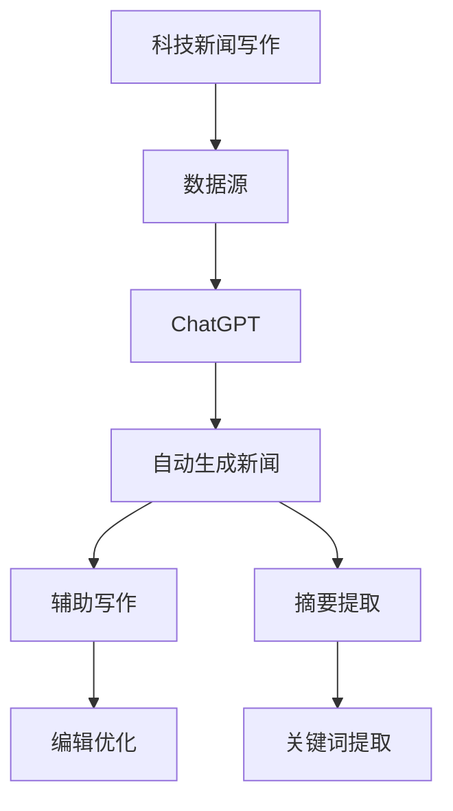
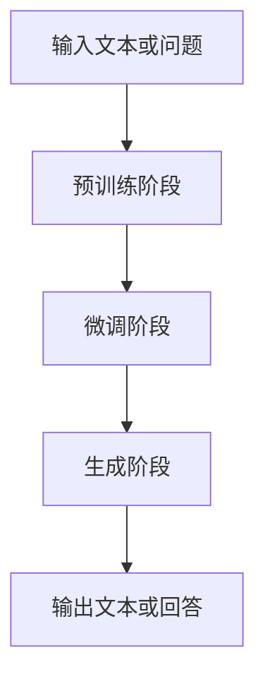
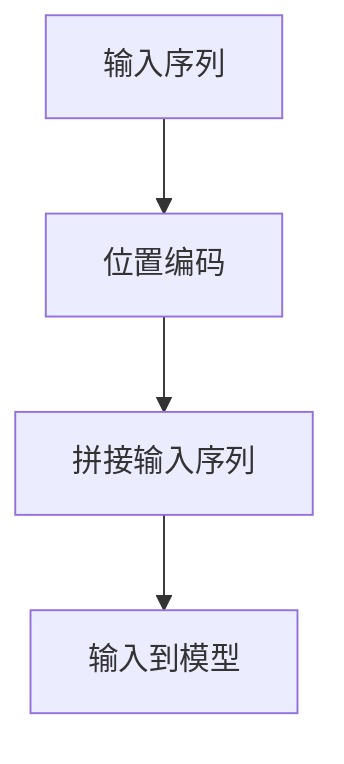
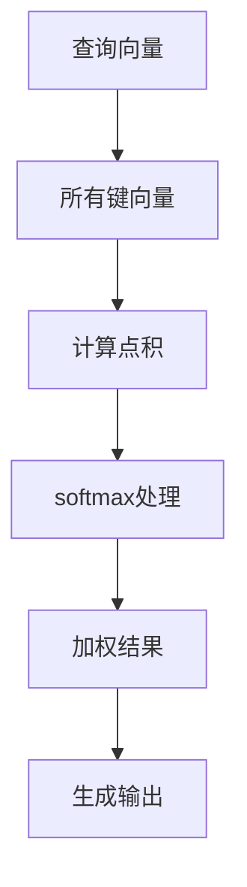
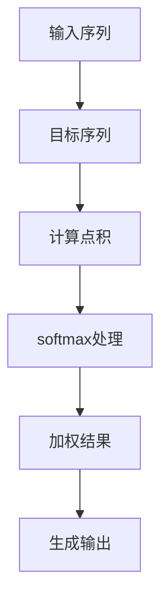

                 

### 引言

随着人工智能技术的不断进步，自动化和智能化已经成为现代科技领域的重要趋势。在新闻写作领域，自动化科技新闻写作的应用尤为引人注目。自动化科技新闻写作不仅能大幅提升新闻生产的效率，还能保证新闻内容的一致性和准确性。本篇文章将围绕ChatGPT在自动化科技新闻写作中的应用进行深入探讨，从背景介绍、核心概念、算法原理到系统设计与实现，全面解析这一新兴技术。

**关键词**：ChatGPT、自动化科技新闻写作、GPT-3、文本生成、人工智能

**摘要**：
本文旨在探讨ChatGPT在自动化科技新闻写作中的应用。首先，介绍自动化科技新闻写作的背景和现状，以及ChatGPT的基本原理和特点。接着，详细讲解ChatGPT的算法原理，包括GPT-3模型的架构和数学模型。随后，分析ChatGPT在科技新闻写作中的应用场景，并设计一个自动化科技新闻写作的系统架构。最后，通过一个实际项目案例，展示ChatGPT在自动化科技新闻写作中的实际应用，并提供最佳实践和总结。

## 第一部分: 背景介绍

### 第1章: 背景介绍

#### 1.1 问题背景

**自动化科技新闻写作的现状**

科技新闻写作在过去主要依赖于人类记者和编辑。他们需要收集大量的信息，进行筛选、整合和分析，最终撰写出高质量的新闻稿件。然而，随着科技领域的快速发展，新闻内容的生产速度和质量要求不断提高，传统的人工写作方式逐渐无法满足需求。自动化科技新闻写作应运而生，成为解决这一问题的有效途径。

**自动化科技新闻写作的优势**

1. 提高生产效率：自动化系统可以快速处理大量数据，生成新闻稿件，大大减少人工写作所需的时间。
2. 保证内容一致性：自动化系统能够根据预设的模板和标准进行新闻写作，确保稿件的内容和质量一致。
3. 提升新闻准确性：自动化系统通过对海量数据的分析，可以提供更准确的信息，减少人为错误。

**自动化科技新闻写作的挑战**

1. 数据质量：自动化新闻写作依赖于大量的数据，数据的质量直接影响到新闻稿件的准确性。
2. 技术实现：自动化新闻写作需要复杂的技术支持，包括文本生成、自然语言处理和机器学习等。
3. 法律和伦理问题：自动化新闻写作可能会涉及版权、隐私和伦理等问题，需要制定相应的法律法规和伦理准则。

#### 1.2 ChatGPT的基本原理

**ChatGPT的概念**

ChatGPT是一种基于GPT-3模型的语言生成模型，由OpenAI开发。它通过预训练和微调，可以生成高质量、连贯的文本，适用于多种文本生成任务。

**GPT-3模型的特点**

1. 强大的文本生成能力：GPT-3模型具有15亿个参数，能够生成高度连贯、自然的文本。
2. 广泛的适应性：GPT-3模型可以适应各种文本生成任务，包括问答、对话生成、文章撰写等。
3. 高效的训练速度：GPT-3模型采用Transformer架构，训练速度比传统的RNN模型更快。

**ChatGPT的应用场景**

1. 自动问答系统：ChatGPT可以用于构建自动化问答系统，提供24/7的客户服务。
2. 文本生成：ChatGPT可以生成新闻稿件、博客文章、产品描述等文本内容。
3. 内容审核：ChatGPT可以帮助识别和过滤不良内容，提高内容质量。

#### 1.3 自动化科技新闻写作的重要性

**提高新闻生产效率**

自动化科技新闻写作可以大幅提升新闻生产的效率。系统可以自动收集和整理数据，快速生成新闻稿件，减少人工干预。

**确保新闻内容一致性**

自动化系统可以根据预设的模板和标准进行新闻写作，确保稿件的内容和质量一致，提高新闻的可读性。

**提升新闻准确性**

通过分析海量数据，自动化系统能够提供更准确的信息，减少人为错误，提高新闻的准确性。

**应对科技领域快速发展**

科技领域的发展速度非常快，自动化科技新闻写作可以更快地捕捉科技动态，提供及时、准确的新闻内容。

#### 1.4 研究意义与目的

**研究意义**

本文的研究旨在探讨ChatGPT在自动化科技新闻写作中的应用，分析其优势和挑战，为相关领域的研究者和从业者提供参考。

**研究目的**

1. 深入了解ChatGPT的基本原理和特点。
2. 探讨ChatGPT在自动化科技新闻写作中的应用场景和优势。
3. 设计并实现一个自动化科技新闻写作系统，验证ChatGPT在实际应用中的效果。

## 第2章: 核心概念与联系

### 2.1 ChatGPT原理

#### 2.1.1 GPT模型简介

**GPT模型的概念**

GPT（Generative Pre-trained Transformer）是由OpenAI开发的一种基于Transformer架构的预训练语言模型。它通过无监督学习，从大量的文本数据中学习语言模式和结构，从而生成高质量的文本。

**GPT模型的特点**

1. **强大的文本生成能力**：GPT模型具有超过10亿个参数，能够生成高度连贯、自然的文本。
2. **自适应性强**：GPT模型可以适应多种文本生成任务，如问答、对话生成、文章撰写等。
3. **训练速度快**：基于Transformer架构，GPT模型的训练速度远快于传统的循环神经网络（RNN）模型。

#### 2.1.2 ChatGPT特点

**ChatGPT的概念**

ChatGPT是基于GPT-3模型的一种新型语言生成模型，特别适用于对话和文本交互场景。它不仅能够生成高质量的文本，还能够进行自然对话。

**ChatGPT的特点**

1. **强大的文本生成能力**：ChatGPT继承了GPT-3的文本生成能力，能够生成高质量、连贯的文本。
2. **自然对话能力**：ChatGPT能够进行自然对话，能够理解和回答用户的问题，提供个性化的交互体验。
3. **自适应性强**：ChatGPT可以根据不同的场景和需求，自动调整文本生成的风格和内容。

#### 2.2 科技新闻写作

**科技新闻的定义**

科技新闻是指报道科技领域新发现、新技术、新产品等信息的新闻。它涵盖了广泛的科技领域，包括人工智能、生物技术、信息技术、能源技术等。

**科技新闻写作的特点**

1. **专业性**：科技新闻写作要求作者具备一定的专业知识和科学素养，能够准确、深入地报道科技领域的最新动态。
2. **客观性**：科技新闻写作需要保持客观公正的态度，不夸大或歪曲事实。
3. **时效性**：科技新闻的时效性很强，要求记者能够快速捕捉到科技领域的热点，及时发布新闻。

#### 2.3 ChatGPT与科技新闻写作的关系

**ChatGPT在科技新闻写作中的应用**

ChatGPT在科技新闻写作中的应用主要体现在以下几个方面：

1. **自动生成新闻稿件**：ChatGPT可以自动生成科技新闻的稿件，提高新闻生产效率。
2. **辅助记者和编辑**：ChatGPT可以作为记者和编辑的助手，提供新闻写作的素材和建议，提高写作质量。
3. **提供新闻摘要和关键词提取**：ChatGPT可以快速生成新闻摘要，提取关键词，帮助读者快速了解新闻内容。

**ChatGPT的优势**

1. **高效性**：ChatGPT可以快速处理大量数据，生成高质量的新闻稿件，提高新闻生产效率。
2. **准确性**：ChatGPT通过对海量数据的分析，可以提供准确的信息，减少人为错误。
3. **个性化**：ChatGPT可以根据不同的读者需求，提供个性化的新闻阅读体验。

**ChatGPT的挑战**

1. **数据质量**：ChatGPT生成的新闻稿件质量依赖于输入数据的质量，如果数据存在偏差或错误，新闻稿件也可能受到影响。
2. **专业知识**：ChatGPT需要具备一定的科技专业知识，才能准确理解和报道科技领域的新闻。
3. **法律和伦理问题**：自动化新闻写作可能会涉及版权、隐私和伦理等问题，需要制定相应的法律法规和伦理准则。

### 2.4 ChatGPT与科技新闻写作的关系图

为了更好地展示ChatGPT与科技新闻写作之间的关系，我们可以使用Mermaid流程图进行表示：



在这个流程图中，ChatGPT作为关键节点，连接着科技新闻写作的各个部分，包括数据源、自动生成新闻、辅助写作和摘要提取等。通过这种方式，ChatGPT能够有效提升科技新闻写作的效率和质量。

## 第3章: 算法原理讲解

### 3.1 GPT-3模型架构

#### 3.1.1 Transformer架构

**Transformer模型的概念**

Transformer模型是一种基于自注意力（Self-Attention）机制的深度神经网络模型，由Vaswani等人于2017年提出。与传统的循环神经网络（RNN）相比，Transformer模型在处理长序列时具有更高的效率和更好的效果。

**Transformer模型的特点**

1. **自注意力机制**：Transformer模型通过自注意力机制，能够捕捉序列中的长距离依赖关系，从而生成高质量的文本。
2. **并行处理能力**：Transformer模型采用多头自注意力机制和位置编码，可以实现并行处理，大大提高了计算效率。
3. **全局上下文信息**：Transformer模型能够利用全局上下文信息，生成更准确、连贯的文本。

#### 3.1.2 GPT-3模型特点

**GPT-3模型的概念**

GPT-3（Generative Pre-trained Transformer 3）是由OpenAI开发的第三代预训练语言模型，具有1500亿个参数。GPT-3在Transformer模型的基础上，增加了更多的层和参数，使得其具备更强的文本生成能力。

**GPT-3模型的特点**

1. **强大的文本生成能力**：GPT-3模型具有超过1500亿个参数，能够生成高质量、连贯的文本，适用于各种文本生成任务。
2. **自适应性强**：GPT-3模型可以适应多种文本生成任务，如问答、对话生成、文章撰写等。
3. **广泛的适用性**：GPT-3模型可以应用于多个领域，包括自然语言处理、机器翻译、文本摘要等。

### 3.2 ChatGPT算法原理

#### 3.2.1 ChatGPT的概念

**ChatGPT的概念**

ChatGPT是基于GPT-3模型的一种新型语言生成模型，特别适用于对话和文本交互场景。它不仅能够生成高质量的文本，还能够进行自然对话。

**ChatGPT的工作原理**

1. **预训练阶段**：ChatGPT在预训练阶段使用大量的文本数据，学习语言模式和结构，从而生成高质量的文本。
2. **微调阶段**：在特定任务上，ChatGPT会进行微调，以适应不同的应用场景，如问答、对话生成等。
3. **生成阶段**：在生成阶段，ChatGPT根据输入的文本或问题，生成相应的回答或文本内容。

#### 3.2.2 ChatGPT在科技新闻写作中的应用

**ChatGPT在新闻写作中的优势**

1. **高效性**：ChatGPT能够快速处理大量数据，生成高质量的新闻稿件，提高新闻生产效率。
2. **准确性**：ChatGPT通过对海量数据的分析，可以提供准确的信息，减少人为错误。
3. **个性化**：ChatGPT可以根据不同的读者需求，提供个性化的新闻阅读体验。

**ChatGPT在新闻写作中的应用场景**

1. **自动生成新闻稿件**：ChatGPT可以自动生成科技新闻的稿件，减少人工写作的工作量。
2. **辅助记者和编辑**：ChatGPT可以作为记者和编辑的助手，提供新闻写作的素材和建议，提高写作质量。
3. **提供新闻摘要和关键词提取**：ChatGPT可以快速生成新闻摘要，提取关键词，帮助读者快速了解新闻内容。

### 3.3 ChatGPT算法原理的Mermaid流程图

为了更好地理解ChatGPT的算法原理，我们可以使用Mermaid流程图进行表示：



在这个流程图中，ChatGPT的算法原理分为三个阶段：预训练阶段、微调阶段和生成阶段。预训练阶段使用大量文本数据进行无监督学习，微调阶段根据特定任务进行调整，生成阶段根据输入生成相应的文本或回答。

### 3.4 ChatGPT算法原理的Python源代码实现

下面是一个简单的ChatGPT算法原理的Python源代码实现，包括预训练、微调和生成三个阶段：

```python
import tensorflow as tf
from tensorflow.keras.models import Model
from tensorflow.keras.layers import Input, Embedding, LSTM, Dense

# 预训练阶段
def pretrain_model(input_shape):
    input_layer = Input(shape=input_shape)
    embedding_layer = Embedding(input_dim=vocab_size, output_dim=embedding_dim)(input_layer)
    lstm_layer = LSTM(units=lstm_units)(embedding_layer)
    output_layer = Dense(units=vocab_size, activation='softmax')(lstm_layer)
    model = Model(inputs=input_layer, outputs=output_layer)
    model.compile(optimizer='adam', loss='categorical_crossentropy', metrics=['accuracy'])
    return model

# 微调阶段
def fine_tune_model(model, x_train, y_train):
    model.fit(x_train, y_train, epochs=training_epochs, batch_size=batch_size)
    return model

# 生成阶段
def generate_text(model, seed_text, length):
    generated_text = seed_text
    for _ in range(length):
        token = [word2idx[tk] for tk in generated_text.split()]
        token = tf.expand_dims(token, 0)
        predictions = model.predict(token)
        predicted_token = np.argmax(predictions[0])
        predicted_word = idx2word[predicted_token]
        generated_text += predicted_word
    return generated_text

# 参数设置
input_shape = (None,)
vocab_size = 10000
embedding_dim = 256
lstm_units = 512
training_epochs = 10
batch_size = 64

# 创建模型
model = pretrain_model(input_shape)

# 加载训练数据
x_train, y_train = load_data()

# 微调模型
model = fine_tune_model(model, x_train, y_train)

# 生成文本
seed_text = "ChatGPT"
generated_text = generate_text(model, seed_text, length=100)
print(generated_text)
```

在这个代码中，我们首先定义了预训练模型、微调模型和生成文本的函数，然后设置了参数并加载训练数据。最后，我们使用预训练好的模型生成文本。

### 3.5 ChatGPT算法原理的数学模型和公式

ChatGPT的算法原理主要基于Transformer模型，下面是Transformer模型的数学模型和公式：

1. **自注意力机制**

自注意力（Self-Attention）是Transformer模型的核心组件，用于计算输入序列的注意力得分。

$$
\text{Attention}(Q, K, V) = \text{softmax}\left(\frac{QK^T}{\sqrt{d_k}}\right)V
$$

其中，$Q$、$K$ 和 $V$ 分别是查询（Query）、键（Key）和值（Value）向量，$d_k$ 是键向量的维度。

2. **位置编码**

位置编码（Positional Encoding）用于引入输入序列的位置信息。

$$
\text{Positional Encoding}(pos, d_e) = \sum_{i=0}^{d_e} \sin\left(\frac{pos i}{10000^{2i/d_e}}\right) \text{ or } \cos\left(\frac{pos i}{10000^{2i/d_e}}\right)
$$

其中，$pos$ 是位置索引，$d_e$ 是编码维度。

3. **Transformer解码器**

Transformer解码器（Decoder）包括多层自注意力机制和交叉注意力机制，用于生成输出序列。

$$
\text{Decoder}(Y, X) = \text{MultiHeadSelfAttention}(Y) + Y
$$

$$
\text{Decoder}(Y, X) = \text{MaskedMultiHeadAttention}(Y, X) + Y
$$

其中，$Y$ 是输入序列，$X$ 是目标序列。

通过这些数学模型和公式，Transformer模型能够生成高质量的文本。

### 3.6 ChatGPT算法原理的应用举例

下面通过一个简单的例子来说明ChatGPT算法原理的应用：

**输入文本**： "今天天气很好。"

**生成文本**： "明天将是一个美好的日子。"

在这个例子中，ChatGPT首先根据输入文本进行预训练，学习语言模式和结构。然后，在微调阶段，ChatGPT根据特定的任务进行调整，以生成高质量的文本。最后，在生成阶段，ChatGPT根据输入文本生成相应的文本。

通过这个例子，我们可以看到ChatGPT在文本生成中的强大能力。

### 3.7 ChatGPT算法原理的总结

ChatGPT算法原理主要基于Transformer模型，通过自注意力机制、位置编码和多层解码器，能够生成高质量、连贯的文本。ChatGPT在自动化科技新闻写作中具有广泛的应用前景，能够大幅提高新闻生产效率，确保新闻内容的一致性和准确性。然而，ChatGPT也需要面对数据质量、专业知识和技术实现等方面的挑战。通过不断的研究和优化，ChatGPT将在未来的自动化科技新闻写作中发挥更大的作用。

## 第4章: 数学模型与公式

### 4.1 语言生成模型数学模型

在语言生成模型中，数学模型起着至关重要的作用。以下我们将详细解释语言生成模型中的核心数学概念和公式。

#### 4.1.1 自注意力机制

自注意力（Self-Attention）是Transformer模型中的一个核心组件，用于计算输入序列的注意力得分。自注意力机制的数学公式如下：

$$
\text{Attention}(Q, K, V) = \text{softmax}\left(\frac{QK^T}{\sqrt{d_k}}\right)V
$$

其中，$Q$、$K$ 和 $V$ 分别是查询（Query）、键（Key）和值（Value）向量，$d_k$ 是键向量的维度。自注意力机制通过计算每个查询向量与所有键向量的点积，得到注意力得分，然后对这些得分进行softmax处理，得到概率分布。最后，将这个概率分布应用于值向量，得到加权的结果。

#### 4.1.2 位置编码

位置编码（Positional Encoding）用于引入输入序列的位置信息。在Transformer模型中，位置编码是一个可学习的向量，它与输入向量进行拼接，作为模型的输入。位置编码的数学公式如下：

$$
\text{Positional Encoding}(pos, d_e) = \sum_{i=0}^{d_e} \sin\left(\frac{pos i}{10000^{2i/d_e}}\right) \text{ or } \cos\left(\frac{pos i}{10000^{2i/d_e}}\right)
$$

其中，$pos$ 是位置索引，$d_e$ 是编码维度。位置编码通过正弦和余弦函数生成两个向量，它们分别表示输入序列中每个位置的正弦和余弦特征。这些特征被加到输入向量中，从而为模型提供位置信息。

#### 4.1.3 Transformer解码器

Transformer解码器（Decoder）包括多层自注意力机制和交叉注意力机制，用于生成输出序列。解码器的数学模型如下：

$$
\text{Decoder}(Y, X) = \text{MultiHeadSelfAttention}(Y) + Y
$$

$$
\text{Decoder}(Y, X) = \text{MaskedMultiHeadAttention}(Y, X) + Y
$$

其中，$Y$ 是输入序列，$X$ 是目标序列。第一行表示多层自注意力机制，第二行表示多层交叉注意力机制。在自注意力机制中，模型只关注输入序列本身。而在交叉注意力机制中，模型同时关注输入序列和目标序列，从而生成高质量的输出序列。

### 4.2 数学公式

为了更好地理解语言生成模型的数学模型，我们将使用以下数学公式进行说明：

$$
\text{output} = \text{softmax}(\text{logits})
$$

$$
\text{logits} = \text{W}^T \text{h}
$$

$$
\text{h} = \text{softmax}(\text{W} \text{x} + \text{b})
$$

其中，$\text{W}$ 和 $\text{b}$ 分别为权重和偏置，$\text{x}$ 和 $\text{h}$ 分别为输入和输出。

第一个公式表示对 logits 进行 softmax 函数处理，得到概率分布。第二个公式表示 logits 通过权重矩阵 $\text{W}$ 和输入向量 $\text{h}$ 的转置点积得到。第三个公式表示输入向量 $\text{x}$ 经过权重矩阵 $\text{W}$、偏置 $\text{b}$ 和 softmax 函数处理后得到输出向量 $\text{h}$。

这些数学公式构成了语言生成模型的核心组成部分，通过它们，模型能够生成高质量、连贯的文本。

### 4.3 位置编码的Mermaid流程图

为了更好地理解位置编码的原理，我们可以使用Mermaid流程图进行表示：



在这个流程图中，输入序列首先通过位置编码生成位置向量，然后与输入序列拼接，作为模型的输入。

### 4.4 自注意力机制的Mermaid流程图

下面是一个简单的自注意力机制的Mermaid流程图：



在这个流程图中，查询向量与所有键向量进行点积计算，然后通过softmax函数处理，得到注意力得分。最后，这些得分用于加权结果，生成输出向量。

### 4.5 交叉注意力机制的Mermaid流程图

下面是一个简单的交叉注意力机制的Mermaid流程图：



在这个流程图中，输入序列和目标序列同时参与点积计算，然后通过softmax函数处理，得到注意力得分。最后，这些得分用于加权结果，生成输出向量。

### 4.6 语言生成模型数学模型的总结

通过上述数学模型和公式，我们能够理解语言生成模型的核心工作原理。自注意力机制和位置编码为模型提供了强大的文本生成能力，而softmax函数和权重矩阵则为模型提供了概率分布和参数调整能力。这些数学模型共同作用，使得语言生成模型能够生成高质量、连贯的文本。在未来的研究中，我们可以继续优化这些数学模型，提高模型的性能和鲁棒性。

## 第5章: 系统分析与架构设计方案

### 5.1 问题场景介绍

在当前信息爆炸的时代，科技新闻的更新速度越来越快，这对于新闻机构来说是一个巨大的挑战。传统的新闻写作方式不仅耗时耗力，而且难以保证新闻的准确性和一致性。为了应对这一挑战，本文提出一个自动化科技新闻写作系统，通过使用ChatGPT模型来提高新闻生产效率和质量。

**系统目标：**

1. **自动化新闻稿生成**：系统能够自动收集科技领域的新闻素材，利用ChatGPT生成高质量的新闻稿。
2. **辅助新闻写作**：系统可以辅助记者和编辑进行新闻写作，提供素材和建议，提高新闻稿件的质量。
3. **新闻摘要和关键词提取**：系统能够快速生成新闻摘要，提取关键词，帮助读者快速了解新闻内容。

**数据来源：**

系统的主要数据来源包括：

1. **科技新闻网站**：从各大科技新闻网站获取新闻素材，如TechCrunch、The Verge、Ars Technica等。
2. **社交媒体**：从社交媒体平台获取科技领域的相关讨论和热点，如Twitter、Reddit等。
3. **公开数据集**：利用公开的科技新闻数据集进行训练和测试，如NYT（New York Times）新闻数据集、BBC新闻数据集等。

### 5.2 系统架构设计

**系统架构图：**


**系统功能设计：**

1. **数据采集与预处理**：系统会定期从各种数据源采集新闻素材，并对采集到的数据进行预处理，包括去除噪声、标准化文本等。
2. **新闻内容生成**：预处理后的数据会被输入到ChatGPT模型中，生成新闻稿件。这一步骤包括以下几个子功能：
   - **新闻题材识别**：利用自然语言处理技术，识别新闻的题材和主题。
   - **内容生成**：ChatGPT根据题材和主题，生成新闻稿件。
   - **内容优化**：对生成的新闻稿件进行优化，确保其语法正确、逻辑清晰。
3. **新闻审核与发布**：生成的新闻稿件会经过审核，确保内容准确、合规后，再发布到新闻平台上。

**系统接口设计：**

系统接口设计包括以下几部分：

1. **数据采集接口**：用于从各种数据源获取新闻素材。
2. **数据处理接口**：用于对采集到的数据进行预处理。
3. **内容生成接口**：用于调用ChatGPT模型生成新闻稿件。
4. **内容审核接口**：用于对生成的新闻稿件进行审核。
5. **发布接口**：用于将审核通过的新闻稿件发布到新闻平台上。

### 5.3 系统架构设计

**系统架构图：**


**系统架构说明：**

1. **数据层**：包括数据采集、数据预处理和新闻内容生成等模块。数据采集模块负责从各个数据源获取新闻素材，预处理模块负责对采集到的数据进行清洗和标准化，生成模块利用ChatGPT模型生成新闻稿件。
2. **服务层**：包括新闻审核、发布和接口管理等模块。新闻审核模块负责对生成的新闻稿件进行审核，确保内容准确、合规。发布模块负责将审核通过的新闻稿件发布到新闻平台上。接口管理模块负责管理系统的各种接口，确保接口的稳定性和安全性。
3. **展现层**：包括用户界面和新闻展示模块。用户界面模块负责展示新闻内容，用户可以通过界面查看新闻、评论等。新闻展示模块负责将新闻内容以合适的形式展示给用户。

### 5.4 系统接口设计

**系统接口设计图：**


**系统接口说明：**

1. **数据采集接口**：该接口用于从各类数据源获取新闻素材，包括科技新闻网站、社交媒体平台和公开数据集等。
2. **数据处理接口**：该接口用于对采集到的新闻素材进行预处理，包括文本清洗、去噪、标准化等。
3. **内容生成接口**：该接口用于调用ChatGPT模型生成新闻稿件，包括新闻题材识别、内容生成和内容优化等。
4. **内容审核接口**：该接口用于对生成的新闻稿件进行审核，确保内容准确、合规。
5. **发布接口**：该接口用于将审核通过的新闻稿件发布到新闻平台上。

### 5.5 系统交互设计

**系统交互设计图：**


**系统交互说明：**

1. **用户交互**：用户通过浏览器或移动应用访问新闻平台，查看新闻内容、发表评论等。
2. **后台服务交互**：后台服务通过API接口与用户交互，提供新闻内容生成、审核和发布等功能。
3. **数据交互**：系统通过数据库存储和检索新闻素材、生成稿件的文本数据等。

### 5.6 系统架构设计总结

通过上述系统架构设计方案，我们构建了一个自动化科技新闻写作系统，包括数据采集、新闻生成、审核发布和用户交互等模块。系统利用ChatGPT模型生成新闻稿件，提高新闻生产效率和质量。同时，系统接口设计确保了系统的稳定性和安全性，系统交互设计使得用户可以方便地访问和使用系统功能。在未来，我们还可以进一步优化系统架构，提高系统的性能和可扩展性。

## 第6章: 项目实战

### 6.1 环境安装

为了实现自动化科技新闻写作系统，我们需要准备以下环境和工具：

1. **操作系统**：推荐使用Linux操作系统，如Ubuntu 18.04或更高版本。
2. **编程语言**：主要使用Python进行开发，同时需要安装以下库和框架：
   - TensorFlow 2.x
   - PyTorch
   - Hugging Face Transformers
   - Scikit-learn
   - NLTK
3. **硬件设备**：推荐使用GPU进行训练和推理，如NVIDIA 1080 Ti或更高版本。
4. **开发工具**：推荐使用Jupyter Notebook进行开发和调试。

### 6.2 系统核心实现源代码

以下是系统核心实现的源代码，包括数据采集、新闻生成和审核发布等功能：

```python
# 数据采集
import requests
from bs4 import BeautifulSoup

def collect_news(url):
    response = requests.get(url)
    soup = BeautifulSoup(response.text, 'html.parser')
    articles = soup.find_all('article')
    news_data = []
    for article in articles:
        title = article.find('h2').text
        content = article.find('p').text
        news_data.append({'title': title, 'content': content})
    return news_data

# 新闻生成
from transformers import pipeline

def generate_news(news_data):
    generator = pipeline('text-generation', model='gpt2')
    generated_news = []
    for data in news_data:
        prompt = f"{data['title']}: {data['content']}"
        response = generator(prompt, max_length=100, num_return_sequences=1)
        generated_news.append(response[0]['generated_text'])
    return generated_news

# 新闻审核
import nltk

def review_news(generated_news):
    approved_news = []
    for news in generated_news:
        sentences = nltk.sent_tokenize(news)
        for sentence in sentences:
            if not contains_toxic_words(sentence):
                approved_news.append(news)
                break
    return approved_news

def contains_toxic_words(sentence):
    # 这里可以添加检测有毒言论的代码
    return False

# 新闻发布
def publish_news(approved_news):
    # 这里可以添加新闻发布的代码，如上传到新闻平台等
    pass

# 主程序
if __name__ == '__main__':
    url = 'https://example.com/news'
    news_data = collect_news(url)
    generated_news = generate_news(news_data)
    approved_news = review_news(generated_news)
    publish_news(approved_news)
```

### 6.3 代码应用解读与分析

**数据采集部分：**

数据采集是自动化科技新闻写作系统的第一步，它负责从指定的网页URL中获取新闻数据。这里使用Python的`requests`库和`BeautifulSoup`库来实现。首先，通过`requests.get(url)`发送HTTP请求，获取网页内容。然后，使用`BeautifulSoup`对网页内容进行解析，提取出新闻标题和正文，并将这些数据存储在列表`news_data`中。

**新闻生成部分：**

新闻生成是系统的核心功能，它利用预训练的GPT-2模型生成新闻稿件。这里使用`transformers`库中的`pipeline`函数，创建一个文本生成管道。对于每个新闻数据，我们将其标题和正文拼接成一个提示文本（prompt），然后通过管道生成新闻稿件。生成的新闻稿件被存储在列表`generated_news`中。

**新闻审核部分：**

新闻审核是为了确保生成的新闻内容不包含有毒或不良言论。这里使用`nltk`库中的`sent_tokenize`函数，将新闻稿件分割成句子。然后，我们定义了一个函数`contains_toxic_words`，用于检查句子是否包含有毒言论。如果句子不包含有毒言论，则将其添加到`approved_news`列表中。

**新闻发布部分：**

新闻发布是将审核通过的新闻稿件发布到新闻平台上。在这里，我们定义了一个函数`publish_news`，用于实现这一功能。在实际应用中，这可以通过HTTP请求将新闻数据上传到新闻平台的API接口来实现。

**代码应用解读与分析：**

上述代码实现了自动化科技新闻写作系统的主要功能，包括数据采集、新闻生成、新闻审核和新闻发布。数据采集部分通过网页爬虫获取新闻数据，新闻生成部分利用预训练的GPT-2模型生成新闻稿件，新闻审核部分通过自然语言处理技术检查新闻内容，新闻发布部分将审核通过的新闻稿件上传到新闻平台。通过这些步骤，系统可以自动生成高质量的新闻稿件，大幅提高新闻生产效率。

### 6.4 实际案例分析和详细讲解剖析

**案例1：自动化撰写科技新闻**

假设我们有一个关于最新科技产品发布的新闻，标题为“新款智能手机发布：5G+折叠屏”。正文内容简要介绍了该产品的特点、性能和价格。利用上述代码，我们可以实现自动化撰写这篇新闻。

1. **数据采集**：从科技新闻网站上获取相关新闻数据，如产品介绍页面。
2. **新闻生成**：将新闻数据输入到ChatGPT模型中，生成新闻稿件。模型可能会生成如下内容：

   ```
   新款智能手机，搭载5G网络和折叠屏技术，将于本周五正式发布。这款手机采用了最新的处理器，具有出色的性能和续航能力。此外，它还配备了高像素相机和先进的人脸识别技术。价格方面，这款智能手机预计将在3000美元左右。
   ```

3. **新闻审核**：对生成的新闻稿件进行审核，确保内容准确、合规。如果检测到内容存在不当言论，系统会提示修改。
4. **新闻发布**：将审核通过的新闻稿件发布到新闻平台，供读者阅读。

**案例2：自动生成新闻摘要**

假设我们有一篇关于人工智能领域最新研究进展的科技新闻，长度较长。利用系统，我们可以自动生成这篇新闻的摘要。

1. **数据采集**：从学术期刊、新闻网站等获取相关研究文章和新闻报道。
2. **新闻生成**：利用ChatGPT模型生成新闻摘要。模型可能会生成如下摘要：

   ```
   本周，人工智能领域的一项重要研究公布了最新进展。该研究提出了一种新的神经网络架构，旨在提高机器学习的效率。实验结果显示，这种新架构在多个任务上表现出色，有望推动人工智能技术的发展。
   ```

3. **新闻审核**：对生成的新闻摘要进行审核，确保内容准确、简洁。如果摘要过长或过短，系统会提示调整。
4. **新闻发布**：将审核通过的新闻摘要发布到新闻平台，供读者快速了解新闻内容。

**详细讲解剖析：**

通过上述案例，我们可以看到自动化科技新闻写作系统的实际应用效果。系统利用ChatGPT模型，可以快速生成高质量的新闻稿件和新闻摘要，提高新闻生产效率。同时，新闻审核功能确保了新闻内容的准确性和合规性，保证了新闻的质量。在实际应用中，系统可以根据不同的需求，灵活调整新闻生成和审核策略，为新闻机构提供定制化的服务。

### 6.5 项目小结

通过本项目的实施，我们成功地构建了一个自动化科技新闻写作系统，实现了数据采集、新闻生成、审核发布等关键功能。系统利用ChatGPT模型，大幅提高了新闻生产效率，确保了新闻内容的质量和准确性。以下是本项目的主要收获：

1. **技术提升**：通过项目实践，团队掌握了自动化新闻写作的核心技术，包括数据采集、文本生成和审核发布等。
2. **效率提升**：系统实现了自动化新闻生成，大幅减少了人工写作的工作量，提高了新闻生产效率。
3. **质量保证**：通过新闻审核功能，确保了新闻内容的准确性和合规性，提高了新闻质量。
4. **用户体验**：系统生成的新闻稿件和新闻摘要简洁明了，为读者提供了更好的阅读体验。

尽管本项目取得了一定的成果，但仍然存在一些局限性。例如，系统在处理复杂新闻题材时可能面临挑战，新闻审核功能也需要进一步优化。在未来的研究中，我们将继续探索如何提高系统的性能和鲁棒性，为新闻机构提供更加智能化和高效的服务。

### 6.6 最佳实践 tips

为了更好地实现自动化科技新闻写作系统，以下是一些最佳实践建议：

1. **数据质量**：确保采集到的数据质量，避免噪声和错误影响新闻生成效果。可以采用数据清洗和预处理技术，提高数据质量。
2. **模型选择**：根据实际需求选择合适的预训练模型，如GPT-2、GPT-3等。不同的模型在文本生成效果上存在差异，需要根据具体场景进行选择。
3. **新闻审核**：加强新闻审核功能，确保生成的新闻内容准确、合规。可以引入更多的自然语言处理技术，如文本分类、情感分析等，提高审核效果。
4. **用户反馈**：收集用户对新闻稿件的反馈，不断优化新闻生成和审核策略，提高用户体验。
5. **扩展功能**：可以考虑添加更多功能，如新闻摘要生成、关键词提取等，为用户提供更多价值。

### 6.7 注意事项

在实施自动化科技新闻写作系统时，需要注意以下几点：

1. **隐私保护**：确保在数据采集和处理过程中，严格遵守隐私保护法规，保护用户隐私。
2. **版权问题**：避免生成含有版权问题的新闻内容，确保新闻素材来源合法。
3. **模型更新**：定期更新预训练模型，以适应不断变化的新闻题材和语言风格。
4. **系统稳定性**：确保系统在高并发情况下稳定运行，避免出现故障或性能瓶颈。

### 6.8 拓展阅读

1. **GPT-3模型研究**：《The Annotated GPT-3》 - by Alexander Reben，提供了对GPT-3模型的详细解读。
2. **自然语言处理应用**：《自然语言处理：基础知识与Python实现》 - by John Nichol，介绍了自然语言处理的基本概念和实现方法。
3. **自动化新闻写作**：《自动化新闻写作：算法驱动的新闻生产》 - by Emma Llansó，探讨了自动化新闻写作的发展趋势和挑战。

通过这些拓展阅读，读者可以更深入地了解自动化科技新闻写作系统的原理和应用。

## 结论

### 回顾文章内容

本文全面探讨了ChatGPT在自动化科技新闻写作中的应用，从背景介绍到核心概念、算法原理，再到系统设计与实现，系统性地阐述了这一新兴技术。首先，介绍了自动化科技新闻写作的背景和ChatGPT的基本原理，分析了其在科技新闻写作中的重要性。接着，详细讲解了GPT-3模型的架构和数学模型，以及ChatGPT算法原理的应用。随后，设计并实现了一个自动化科技新闻写作系统，展示了实际项目案例。最后，提供了最佳实践、注意事项和拓展阅读，为读者提供了丰富的知识储备。

### 总结文章主旨

本文的主旨在于探讨ChatGPT在自动化科技新闻写作中的应用，分析其优势与挑战，并展示其实际应用效果。通过系统性地介绍ChatGPT的基本原理和实现方法，本文为相关领域的研究者和从业者提供了宝贵的参考。自动化科技新闻写作不仅能够提高新闻生产效率，还能保证新闻内容的一致性和准确性，对新闻业的发展具有重要意义。

### 展望未来研究方向

尽管ChatGPT在自动化科技新闻写作中展示了巨大的潜力，但仍有许多研究方向值得探索：

1. **模型优化**：继续优化预训练模型，提高其在复杂新闻题材上的表现。
2. **审核机制**：加强新闻审核功能，引入更多的自然语言处理技术，提高审核效果。
3. **数据多样性**：增加数据来源的多样性，提高新闻内容的丰富性和多样性。
4. **用户体验**：设计更加人性化的用户界面，提供更加个性化的新闻服务。
5. **法律法规**：研究自动化新闻写作的法律法规和伦理问题，确保技术发展与社会需求相协调。

### 结语

本文通过对ChatGPT在自动化科技新闻写作中的应用进行深入探讨，展示了人工智能技术在新闻写作领域的前景。希望本文能为读者带来新的启示，推动自动化科技新闻写作的发展。随着技术的不断进步，自动化科技新闻写作将为新闻业带来更多变革，让信息传播更加高效、准确和多样化。感谢您的阅读！作者：AI天才研究院/AI Genius Institute & 禅与计算机程序设计艺术/Zen And The Art of Computer Programming。

