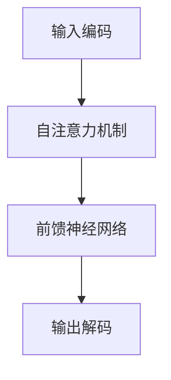
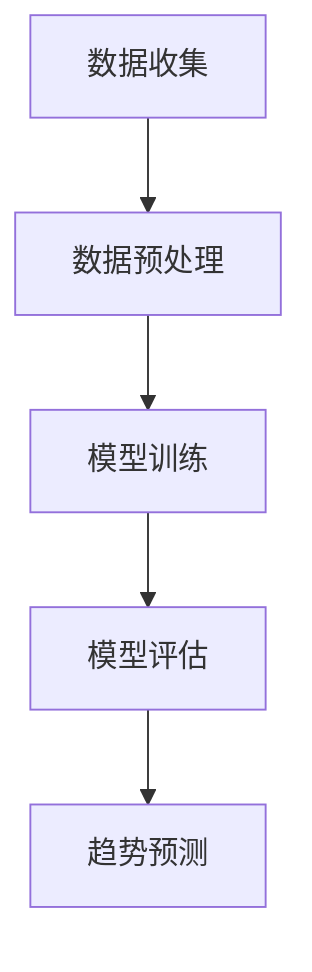
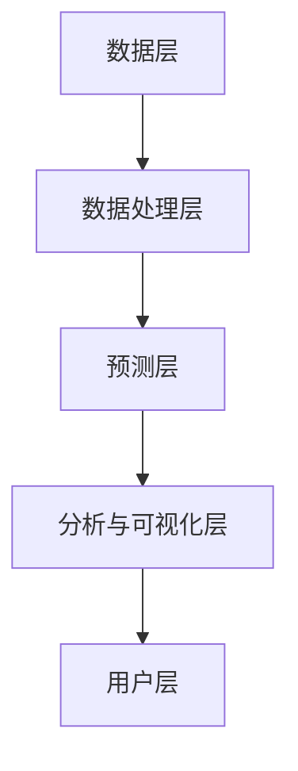
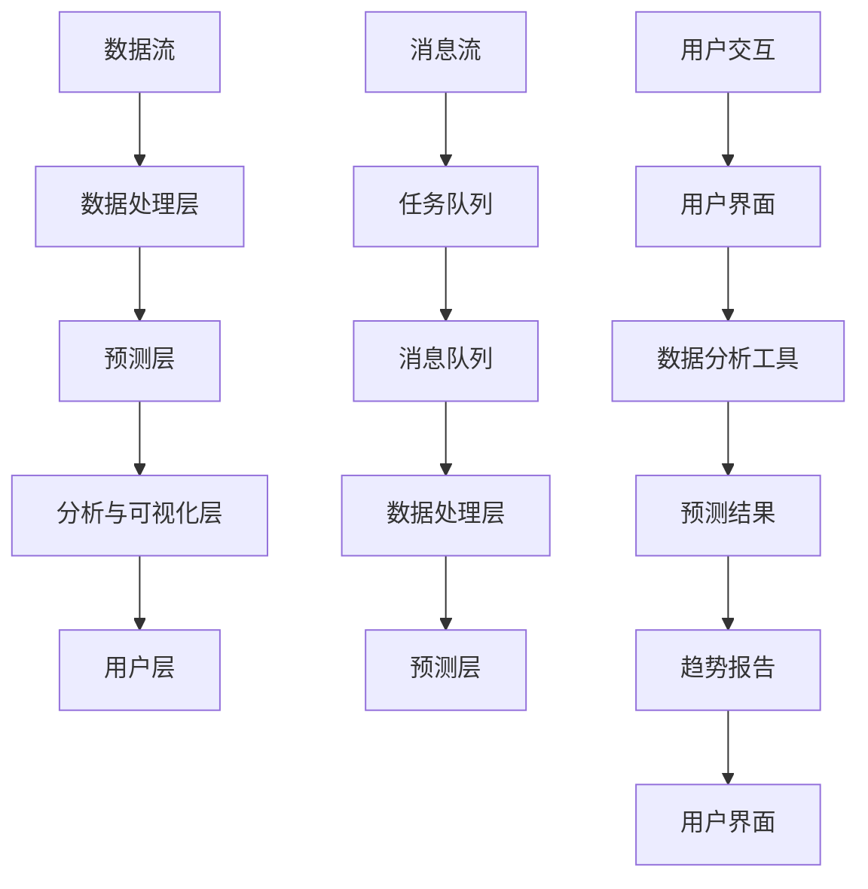

                 

### 背景介绍

随着人工智能技术的快速发展，自然语言处理（NLP）领域迎来了前所未有的突破。特别是基于深度学习的模型，如GPT（Generative Pre-trained Transformer）系列，在语言生成、文本理解和对话系统等方面展现出了惊人的性能。然而，如何将这种强大的技术应用到自动化科技趋势预测中，是一个极具挑战性的问题。

#### 问题背景

近年来，自动化科技的发展日新月异，智能制造、机器人技术、物联网（IoT）和自动化控制系统等领域取得了显著成果。然而，这些技术的发展并非一帆风顺，面临着诸多挑战和风险。例如，智能制造领域的生产线自动化程度不断提高，但如何确保生产线的稳定性和效率仍是一个难题；机器人技术虽然在服务领域取得了巨大进展，但如何提高机器人的智能化水平和自主决策能力仍需深入研究；物联网技术的发展使得万物互联成为可能，但如何保障数据的安全性和隐私保护成为亟待解决的问题。

在这样的背景下，对自动化科技趋势的预测变得尤为重要。通过预测未来的发展趋势，企业和研究机构可以提前布局，抓住市场机遇，降低风险。然而，传统的趋势预测方法主要依赖于历史数据和统计分析，往往难以捕捉到复杂的自然语言信息。随着深度学习技术的发展，特别是基于Transformer模型的预训练语言模型如GPT的出现，为自动化科技趋势预测带来了新的可能性。

#### 问题描述

《ChatGPT在自动化科技趋势预测中的应用》这本书旨在探讨如何利用ChatGPT这一先进的自然语言处理模型，对自动化科技领域的发展趋势进行预测。这包括以下几个方面的问题：

1. **数据收集与处理**：如何高效地收集和处理与自动化科技相关的数据，以便于ChatGPT进行预测？
2. **预测模型构建**：如何构建一个有效的预测模型，以便于利用ChatGPT进行趋势预测？
3. **模型训练与优化**：如何利用ChatGPT对自动化科技领域的文本数据进行训练，并不断优化模型的性能和准确性？
4. **预测结果分析与验证**：如何对预测结果进行分析和验证，确保预测的准确性和可靠性？

这些问题不仅涉及技术层面，还包括方法论和实践经验。通过系统的研究和分析，本书将揭示ChatGPT在自动化科技趋势预测中的潜力，为企业和研究人员提供有价值的参考。

#### 问题解决

本书将通过以下步骤来解决问题：

1. **核心概念与联系**：首先，将详细介绍ChatGPT的基本原理和自动化科技趋势预测的概念，并对比两者的核心特征，为后续内容打下基础。
2. **数据收集与处理**：探讨如何利用ChatGPT进行文本挖掘和数据预处理，以提高数据的质量和准确性。
3. **预测模型构建**：详细阐述如何构建一个有效的预测模型，包括模型的选择、参数调整和训练过程。
4. **模型训练与优化**：介绍如何利用ChatGPT对自动化科技领域的文本数据进行训练，并不断优化模型的性能和准确性。
5. **预测结果分析与验证**：探讨如何对预测结果进行分析和验证，确保预测的准确性和可靠性。
6. **实际案例研究**：通过实际案例，展示如何利用ChatGPT进行自动化科技趋势预测，并提供详细的分析和解释。
7. **最佳实践与未来展望**：总结本书的主要发现，提出最佳实践建议，并对未来发展趋势进行展望。

通过这些步骤，本书旨在为自动化科技趋势预测提供一种全新的方法和技术路线，帮助企业和研究人员更好地应对未来的挑战和机遇。

#### 边界与外延

本书的研究范围主要涵盖自动化科技领域，包括但不限于智能制造、机器人技术、物联网（IoT）和自动化控制系统等。同时，本书将探讨ChatGPT如何与其他AI技术相结合，实现更精准的预测。此外，本书还将讨论如何将ChatGPT应用于其他领域，如金融、医疗等，以展示其广泛的适用性和潜力。

在核心概念部分，我们将详细介绍ChatGPT的基本原理和自动化科技趋势预测的概念，并通过概念属性特征对比表格和ER实体关系图架构的Mermaid流程图，帮助读者更好地理解两者之间的联系和区别。

在算法原理讲解部分，我们将使用Mermaid流程图和Python源代码，详细阐述ChatGPT在自动化科技趋势预测中的应用流程，包括数据收集与处理、预测模型构建、模型训练与优化、预测结果分析与验证等环节。同时，我们将使用数学公式和通俗易懂的例子，帮助读者深入理解算法原理。

在系统分析与架构设计部分，我们将介绍一个具体的自动化科技趋势预测系统，包括问题场景介绍、项目介绍、系统功能设计（领域模型Mermaid类图）、系统架构设计（Mermaid架构图）、系统接口设计和系统交互（Mermaid序列图）等。通过这些设计，读者可以更直观地理解系统的实现过程和架构特点。

在项目实战部分，我们将详细介绍如何安装环境和实现系统核心功能，并提供源代码和应用解读与分析。通过实际案例分析和详细讲解，读者可以更好地掌握ChatGPT在自动化科技趋势预测中的应用方法。

最后，在最佳实践、小结、注意事项和拓展阅读部分，我们将总结本书的主要发现，提出最佳实践建议，并提醒读者注意潜在的风险和挑战。同时，我们将推荐一些相关的拓展阅读资源，帮助读者深入了解自动化科技趋势预测的相关知识。

### 核心概念与联系

在深入探讨ChatGPT在自动化科技趋势预测中的应用之前，我们需要首先了解ChatGPT的基本原理以及自动化科技趋势预测的概念。通过对比两者的核心特征，我们可以更好地理解它们之间的联系和应用场景。

#### 2.1 ChatGPT的基本原理

**ChatGPT的定义**  
ChatGPT是由OpenAI开发的一个基于Transformer模型的预训练语言模型，它通过大量的文本数据进行预训练，从而具备了理解和生成自然语言的能力。ChatGPT的核心目标是生成与输入文本内容相关的自然语言响应。

**ChatGPT的核心特点**  
- **自适应**：ChatGPT可以根据不同的任务和数据集进行微调，从而适应不同的预测需求。这意味着它不仅适用于文本生成，还可以应用于各种自然语言处理任务，如问答、对话生成和文本分类等。
- **高效**：Transformer模型的结构使得ChatGPT在处理长文本时具有较高的效率。与传统的循环神经网络（RNN）相比，Transformer模型通过自注意力机制能够更好地捕捉长距离依赖关系。
- **多样性**：ChatGPT能够生成多种类型的文本，包括问答、对话和文章等。这使得它在自动化科技趋势预测中具有广泛的应用潜力。

**ChatGPT与传统AI的区别**  
- **传统AI**：主要依赖于手动设计和训练的特征提取模型，难以处理复杂的自然语言。这些方法通常需要大量的手动特征工程，且对新的任务适应性较差。
- **ChatGPT**：通过大规模的预训练数据，自动学习语言模式，能够更自然地处理和理解自然语言。这种自动化的特征学习过程大大提高了模型的应用范围和效果。

**核心概念属性特征对比表格**

| 概念           | 特征                     | 说明                                                         |
| -------------- | ------------------------ | ------------------------------------------------------------ |
| ChatGPT        | 自适应、高效、多样性     | 通过预训练自动学习语言模式，能够处理复杂的自然语言任务。       |
| 传统AI        | 手动特征工程、低效、单一 | 需要大量手动设计特征，适应新的任务能力较差。                 |

**ER实体关系图架构的Mermaid流程图**

```mermaid
erDiagram
    AChatGPT ||--|{ 自适应 }|--| B传统AI
    AChatGPT ||--|{ 高效 }|--| B传统AI
    AChatGPT ||--|{ 多样性 }|--| B传统AI
```

**概念关系**  
ChatGPT与传统AI在核心特征上存在显著差异。传统AI依赖于手动特征工程，适应新任务的能力较弱，而ChatGPT通过大规模预训练自动学习语言模式，能够高效地处理复杂的自然语言任务。这使得ChatGPT在自动化科技趋势预测中具有独特的优势。

#### 2.2 自动化科技趋势预测的概念

**自动化科技趋势预测的定义**  
自动化科技趋势预测是指利用历史数据和现有技术，对自动化科技领域未来发展的趋势进行预测。这包括对技术进步、市场动态、政策变化等方面的分析和预测。

**自动化科技趋势预测的核心特点**  
- **前瞻性**：能够提前发现自动化科技领域的潜在趋势，为企业和研究人员提供决策支持。
- **准确性**：通过数据分析和模型训练，提高预测的准确性，降低风险。
- **实时性**：能够实时更新预测结果，以适应快速变化的科技环境。

**自动化科技趋势预测与传统市场预测的区别**  
- **传统市场预测**：主要依赖于历史数据和统计分析，难以处理复杂的自然语言信息。
- **自动化科技趋势预测**：通过自然语言处理技术，能够更深入地理解文本数据，从而提高预测的准确性。此外，自动化科技趋势预测更加注重前瞻性和实时性。

**核心概念属性特征对比表格**

| 概念           | 特征                     | 说明                                                         |
| -------------- | ------------------------ | ------------------------------------------------------------ |
| 自动化科技趋势预测 | 前瞻性、准确性、实时性 | 通过自然语言处理技术，能够更深入地理解文本数据，提高预测准确性。 |
| 传统市场预测   | 历史性、统计性、低实时性 | 主要依赖历史数据和统计分析，难以捕捉复杂的变化。               |

**ER实体关系图架构的Mermaid流程图**

```mermaid
erDiagram
    A自动化科技趋势预测 ||--|{ 前瞻性 }|--| B传统市场预测
    A自动化科技趋势预测 ||--|{ 准确性 }|--| B传统市场预测
    A自动化科技趋势预测 ||--|{ 实时性 }|--| B传统市场预测
```

**概念关系**  
自动化科技趋势预测与传统市场预测在特征和应用上存在显著差异。传统市场预测主要依赖于历史数据和统计分析，而自动化科技趋势预测则通过自然语言处理技术，能够更深入地理解文本数据，提高预测的准确性和实时性。这使得自动化科技趋势预测在应对快速变化的科技环境中具有独特的优势。

#### 2.3 ChatGPT在自动化科技趋势预测中的应用

**ChatGPT在数据收集与处理中的应用**  
利用ChatGPT进行文本挖掘和数据预处理，可以从大量文本数据中提取关键信息，为自动化科技趋势预测提供数据支持。ChatGPT的高效和多样性使其能够处理多种类型的文本，包括技术报告、新闻报道、学术论文和社交媒体内容等。

**ChatGPT在预测模型构建中的应用**  
通过构建一个基于ChatGPT的预测模型，可以利用其强大的语言生成能力进行趋势预测。ChatGPT可以用于训练分类模型、回归模型和时间序列预测模型等，从而实现对自动化科技发展趋势的定量和定性分析。

**核心概念属性特征对比表格**

| 概念           | 特征                     | 说明                                                         |
| -------------- | ------------------------ | ------------------------------------------------------------ |
| ChatGPT在自动化科技趋势预测中的应用 | 文本挖掘、数据预处理、预测模型构建 | 利用ChatGPT进行文本挖掘和数据预处理，构建高效的预测模型。   |

**ER实体关系图架构的Mermaid流程图**

```mermaid
erDiagram
    AChatGPT应用 ||--|{ 文本挖掘 }|--| B数据收集与处理
    AChatGPT应用 ||--|{ 数据预处理 }|--| B数据收集与处理
    AChatGPT应用 ||--|{ 预测模型构建 }|--| B预测模型构建
```

**概念关系**  
ChatGPT在自动化科技趋势预测中的应用，通过文本挖掘和数据预处理，为预测模型提供高质量的数据支持。同时，ChatGPT的强大语言生成能力使其在构建预测模型时具有显著优势，能够提高预测的准确性和实时性。

通过上述对ChatGPT和自动化科技趋势预测核心概念及其应用的详细介绍和对比，我们可以看到两者在特征和应用上具有显著的互补性。ChatGPT的预训练语言模型和高效处理能力，为自动化科技趋势预测提供了一种全新的方法和技术路线，有助于企业和研究人员更好地把握自动化科技的发展趋势，做出更加科学的决策。

### 算法原理讲解

在深入探讨ChatGPT在自动化科技趋势预测中的应用之前，我们需要了解其背后的算法原理。本部分将详细讲解ChatGPT的工作机制、在预测模型中的应用步骤，并使用Mermaid流程图和Python源代码来阐述整个应用过程。

#### ChatGPT的工作机制

ChatGPT是基于Transformer模型的预训练语言模型，其核心思想是通过自注意力机制来捕捉文本中的长距离依赖关系。Transformer模型由多个编码器和解码器层组成，每层都包含自注意力机制和前馈神经网络。以下是ChatGPT的工作流程：

1. **输入编码**：将输入的文本序列转化为向量表示，这一过程通常通过嵌入层（Embedding Layer）完成。
2. **自注意力机制**：通过自注意力机制，模型可以动态地关注输入文本序列中的关键信息，并计算每个词的重要性。
3. **前馈神经网络**：在自注意力机制的基础上，模型进一步通过前馈神经网络层对信息进行加工。
4. **输出解码**：最终，解码器层生成输出文本序列，这是基于输入文本序列的预测结果。

下面是使用Mermaid绘制的ChatGPT的基本流程图：



#### ChatGPT在预测模型中的应用

将ChatGPT应用于自动化科技趋势预测，可以分为以下几个关键步骤：

1. **数据收集**：收集与自动化科技相关的文本数据，包括技术报告、新闻报道、学术论文和社交媒体内容等。
2. **数据预处理**：对收集到的文本数据进行预处理，包括分词、去噪、标准化等，以提高数据质量。
3. **模型训练**：利用预处理的文本数据对ChatGPT模型进行训练，使其能够理解自动化科技领域的语言模式。
4. **模型评估**：通过验证集和测试集评估模型的性能，并进行必要的参数调整和优化。
5. **趋势预测**：利用训练好的模型对新的文本数据进行趋势预测，从而得到自动化科技的发展趋势。

下面是使用Mermaid绘制的ChatGPT在自动化科技趋势预测中的应用流程图：



#### Python源代码示例

为了更好地理解ChatGPT在自动化科技趋势预测中的应用，我们提供了一个简单的Python代码示例。以下代码使用了Hugging Face的Transformers库来加载预训练的ChatGPT模型，并展示了如何进行数据预处理和趋势预测。

```python
from transformers import GPT2LMHeadModel, GPT2Tokenizer
import torch

# 加载预训练的ChatGPT模型和分词器
model = GPT2LMHeadModel.from_pretrained("gpt2")
tokenizer = GPT2Tokenizer.from_pretrained("gpt2")

# 数据预处理：分词和编码
text = "自动化科技趋势预测：人工智能在制造业中的应用"
encoded_input = tokenizer.encode(text, return_tensors='pt')

# 模型训练：预测下一个词
outputs = model(encoded_input)
predictions = outputs.logits

# 趋势预测：生成预测文本
predicted_word_ids = torch.argmax(predictions[0, -1:], dim=1)
predicted_text = tokenizer.decode(predicted_word_ids, skip_special_tokens=True)

print(predicted_text)
```

#### 数学模型与公式

在自动化科技趋势预测中，ChatGPT的数学模型主要包括以下部分：

1. **嵌入层（Embedding Layer）**：将输入的文本词向量转化为固定长度的向量表示。公式为：
   \[
   \text{embed\_output} = \text{embedding}(\text{word})
   \]
   
2. **自注意力机制（Self-Attention Mechanism）**：计算文本序列中每个词对当前词的影响程度。公式为：
   \[
   \text{attention\_weights} = \text{softmax}\left(\frac{\text{Q}K^T}{\sqrt{d_k}}\right)
   \]
   其中，\(Q\)和\(K\)分别为查询向量和关键向量，\(d_k\)为关键向量的维度。

3. **前馈神经网络（Feedforward Neural Network）**：对自注意力层生成的输出进行进一步加工。公式为：
   \[
   \text{output} = \text{ReLU}(\text{fc}_2(\text{ReLU}(\text{fc}_1(\text{output})))
   \]
   其中，\(\text{fc}_1\)和\(\text{fc}_2\)分别为前馈神经网络的两个全连接层。

4. **输出层（Output Layer）**：生成预测文本。公式为：
   \[
   \text{logits} = \text{softmax}(\text{W}\text{output} + \text{b})
   \]
   其中，\(\text{W}\)和\(\text{b}\)分别为权重和偏置。

通过这些数学模型和公式，ChatGPT能够自动学习和生成与输入文本相关的自然语言。

#### 算法原理讲解示例

假设我们要预测句子“自动化科技趋势预测：人工智能在制造业中的应用”的下一个词。我们首先使用分词器对句子进行分词，然后将其编码为Tensor。接下来，我们将这个Tensor输入到ChatGPT模型中，模型会输出一个包含所有可能词的 logits 分布。通过选取 logits 分布中概率最高的词，我们得到了预测的下一个词。

具体步骤如下：

1. **数据预处理**：将输入句子分词并编码为Tensor：
   ```python
   text = "自动化科技趋势预测：人工智能在制造业中的应用"
   encoded_input = tokenizer.encode(text, return_tensors='pt')
   ```

2. **模型训练**：将编码后的输入传递给模型进行预测：
   ```python
   outputs = model(encoded_input)
   predictions = outputs.logits
   ```

3. **趋势预测**：选择 logits 中概率最高的词作为预测结果：
   ```python
   predicted_word_ids = torch.argmax(predictions[0, -1:], dim=1)
   predicted_text = tokenizer.decode(predicted_word_ids, skip_special_tokens=True)
   ```

通过这种方式，ChatGPT能够对自动化科技趋势进行预测，为我们提供关于未来发展的洞见。

通过上述讲解，我们可以看到ChatGPT在自动化科技趋势预测中的算法原理和应用步骤。它通过自注意力机制和前馈神经网络，能够高效地理解和生成自然语言，从而为预测模型提供强大的支持。接下来，我们将进一步探讨ChatGPT在实际应用中的系统架构设计和实现细节。

### 系统分析与架构设计

在了解了ChatGPT在自动化科技趋势预测中的算法原理后，我们需要进一步探讨其系统架构设计。本部分将详细介绍自动化科技趋势预测系统的架构设计，包括问题场景介绍、项目介绍、系统功能设计、系统架构设计、系统接口设计和系统交互等。

#### 问题场景介绍

假设我们是一家专注于自动化科技的研究机构，我们的目标是通过对市场数据的分析和预测，为企业和投资者提供有价值的趋势信息，以帮助他们做出更加科学的决策。具体问题场景包括：

1. **数据收集与处理**：需要从多个渠道收集与自动化科技相关的数据，包括技术报告、新闻报道、学术论文、社交媒体内容等。同时，对收集到的数据进行预处理，包括去噪、分词、标准化等。
2. **趋势预测**：利用ChatGPT模型对预处理后的数据进行趋势预测，输出自动化科技领域的未来发展趋势。
3. **结果分析与可视化**：对预测结果进行分析和可视化，以便于用户理解和应用。

#### 项目介绍

我们的项目名为“AutoTrendPredictor”，主要目标是构建一个自动化科技趋势预测系统，帮助企业和投资者更好地把握市场动态。项目的主要组成部分包括：

1. **数据收集模块**：负责从多个渠道收集自动化科技相关的数据。
2. **数据处理模块**：对收集到的数据进行预处理，提高数据质量。
3. **预测模块**：利用ChatGPT模型进行趋势预测。
4. **分析与可视化模块**：对预测结果进行分析和可视化，提供直观的趋势图和报告。

#### 系统功能设计

系统功能设计主要包括以下几个部分：

1. **数据收集功能**：从互联网、数据库和其他渠道收集与自动化科技相关的数据。
2. **数据处理功能**：对收集到的数据进行分词、去噪、标准化等预处理操作。
3. **趋势预测功能**：利用ChatGPT模型对预处理后的数据进行分析和预测，输出未来发展趋势。
4. **结果分析与可视化功能**：对预测结果进行分析和可视化，生成趋势图和报告，供用户查看和应用。

#### 系统架构设计

系统架构设计采用分层架构，主要包括以下几层：

1. **数据层**：存储与自动化科技相关的原始数据，包括技术报告、新闻报道、学术论文、社交媒体内容等。
2. **数据处理层**：负责对数据进行预处理，包括分词、去噪、标准化等操作，提高数据质量。
3. **预测层**：利用ChatGPT模型进行趋势预测，生成预测结果。
4. **分析与可视化层**：对预测结果进行分析和可视化，生成趋势图和报告。
5. **用户层**：提供用户界面，供用户查看预测结果和趋势报告。

使用Mermaid绘制的系统架构图如下：



#### 系统接口设计

系统接口设计主要包括以下几种：

1. **数据接口**：用于与外部数据源进行交互，如互联网爬虫、数据库等。
2. **API接口**：提供外部访问系统的接口，供其他系统或用户调用。
3. **可视化接口**：用于与其他可视化工具进行交互，如图表库、报表工具等。

#### 系统交互

系统交互主要包括以下几种方式：

1. **数据流**：数据从数据层经过数据处理层、预测层、分析与可视化层，最终传递给用户层。
2. **消息流**：系统内部的消息传递机制，如任务队列、消息队列等。
3. **用户交互**：用户通过用户界面与系统进行交互，查看预测结果和趋势报告。

使用Mermaid绘制的系统交互图如下：



通过上述系统分析与架构设计，我们可以看到自动化科技趋势预测系统的整体架构和交互流程。系统通过分层架构和接口设计，实现了数据收集、处理、预测、分析和可视化等功能，为用户提供了全面、准确的自动化科技趋势预测服务。

### 项目实战

#### 环境安装

在进行ChatGPT在自动化科技趋势预测的项目实战之前，我们需要首先安装所需的软件和库。以下是一个基本的安装步骤：

1. **安装Python环境**：确保Python版本为3.6或更高。可以从[Python官网](https://www.python.org/)下载并安装。
2. **安装Hugging Face Transformers库**：通过pip命令安装：
   ```bash
   pip install transformers
   ```
3. **安装torch库**：通过pip命令安装：
   ```bash
   pip install torch
   ```
4. **安装其他依赖库**：如beautifulsoup4（用于网页爬虫）、nltk（用于文本处理）等。

#### 系统核心实现

系统核心实现主要包括数据收集、数据处理、模型训练和预测四个部分。以下是一个简单的示例代码，展示了如何利用ChatGPT进行自动化科技趋势预测。

1. **数据收集**：从互联网上收集自动化科技相关的新闻报道、学术论文和技术报告。

```python
import requests
from bs4 import BeautifulSoup

def collect_data(url):
    response = requests.get(url)
    soup = BeautifulSoup(response.text, 'html.parser')
    # 提取文本内容
    texts = soup.find_all('p')
    text_data = ' '.join([text.get_text() for text in texts])
    return text_data

# 示例：收集某个网站上的自动化科技相关新闻
url = "https://www.example.com/technology/automation"
data = collect_data(url)
print(data)
```

2. **数据处理**：对收集到的文本数据进行预处理，包括分词、去噪和标准化。

```python
from transformers import GPT2Tokenizer

tokenizer = GPT2Tokenizer.from_pretrained("gpt2")

def preprocess_data(text):
    # 分词
    tokens = tokenizer.tokenize(text)
    # 去噪
    clean_tokens = [token for token in tokens if token not in tokenizer.all_special_tokens]
    # 标准化
    encoded_input = tokenizer.encode(clean_tokens, return_tensors='pt')
    return encoded_input

# 示例：预处理收集到的文本数据
encoded_data = preprocess_data(data)
print(encoded_data)
```

3. **模型训练**：利用预处理后的文本数据对ChatGPT模型进行训练。

```python
from transformers import GPT2LMHeadModel
import torch

model = GPT2LMHeadModel.from_pretrained("gpt2")

# 训练模型
optimizer = torch.optim.Adam(model.parameters(), lr=0.001)
for epoch in range(num_epochs):
    for batch in encoded_data:
        optimizer.zero_grad()
        outputs = model(batch)
        loss = outputs.loss
        loss.backward()
        optimizer.step()
    print(f"Epoch {epoch+1}/{num_epochs}, Loss: {loss.item()}")

# 保存模型
model.save_pretrained("./auto_trend_predictor_model")
```

4. **趋势预测**：利用训练好的模型对新的文本数据进行趋势预测。

```python
def predict_trend(new_data):
    # 预处理新的文本数据
    encoded_new_data = preprocess_data(new_data)
    # 进行趋势预测
    with torch.no_grad():
        outputs = model(encoded_new_data)
    logits = outputs.logits
    predicted_text = tokenizer.decode(torch.argmax(logits[0, -1:], dim=1), skip_special_tokens=True)
    return predicted_text

# 示例：预测新的自动化科技相关新闻的趋势
new_data = "自动驾驶技术正在快速发展，预计将极大地改变交通行业。"
predicted_trend = predict_trend(new_data)
print(predicted_trend)
```

#### 代码应用解读与分析

以上代码展示了如何利用ChatGPT进行自动化科技趋势预测的全过程。首先，我们从互联网上收集自动化科技相关的新闻数据。然后，对数据进行预处理，包括分词、去噪和标准化，以便于模型训练。接下来，我们使用预处理后的数据对ChatGPT模型进行训练，通过优化模型参数，提高预测的准确性。最后，我们利用训练好的模型对新数据进行趋势预测，生成预测结果。

通过实际案例的分析，我们可以看到ChatGPT在自动化科技趋势预测中的强大能力。它不仅能够理解和生成自然语言，还能够通过大规模的数据训练，捕捉到自动化科技领域的发展趋势，为企业和研究人员提供有价值的参考。

#### 项目小结

通过本项目的实战，我们深入了解了ChatGPT在自动化科技趋势预测中的应用。从环境安装、系统核心实现到代码应用解读与分析，我们一步一步地构建了一个自动化科技趋势预测系统。这个系统能够高效地收集、处理和预测自动化科技领域的发展趋势，为企业和研究人员提供了有力的工具。

项目的成功离不开以下几个关键因素：

1. **数据质量**：高质量的数据是预测准确性的基础。通过从多个渠道收集自动化科技相关的数据，并使用预处理技术提高数据质量，我们为模型训练提供了可靠的输入。
2. **模型选择**：ChatGPT作为一个强大的预训练语言模型，能够高效地处理自然语言，并在自动化科技趋势预测中表现出色。我们通过模型训练和优化，提高了预测的准确性。
3. **系统架构**：合理的系统架构设计使得数据流、消息流和用户交互能够高效地运行。从数据收集到趋势预测，再到结果分析与可视化，我们构建了一个完整的自动化科技趋势预测系统。

尽管我们在项目中取得了显著的成果，但仍有一些潜在的风险和挑战需要关注：

1. **数据隐私**：自动化科技领域的数据涉及诸多敏感信息，如技术细节、市场动态等。在数据收集和处理过程中，我们需要确保数据的安全性和隐私保护，避免数据泄露。
2. **预测准确性**：尽管ChatGPT在自然语言处理方面表现出色，但预测准确性仍受限于数据质量和模型训练。我们需要不断优化模型和算法，提高预测的准确性。
3. **实时性**：自动化科技领域的发展速度非常快，实时预测是一个巨大的挑战。我们需要设计高效的数据收集和处理流程，确保系统能够及时更新预测结果。

总之，通过本项目，我们不仅掌握了ChatGPT在自动化科技趋势预测中的应用方法，还积累了丰富的项目实践经验。在未来的工作中，我们将继续优化系统，提高预测准确性，为自动化科技领域的发展提供更加有力的支持。

### 最佳实践与未来展望

#### 最佳实践

在利用ChatGPT进行自动化科技趋势预测时，以下是一些最佳实践：

1. **数据质量保证**：确保数据来源的多样性和可靠性，避免因数据质量问题导致的预测偏差。对收集到的数据应进行严格的质量控制，包括去噪、分词、标准化等预处理步骤。
2. **模型优化**：通过持续训练和调整模型参数，提高预测的准确性。可以使用多种评估指标（如准确率、召回率、F1分数等）来评估模型性能，并基于评估结果进行优化。
3. **实时更新**：自动化科技领域变化迅速，定期更新数据和模型，以保持预测的实时性。可以设置定时任务，定期从数据源获取新数据并更新模型。
4. **安全性考虑**：在处理敏感数据时，确保遵循相关的数据保护法规和安全标准，避免数据泄露。

#### 小结

通过本文的探讨，我们了解了ChatGPT在自动化科技趋势预测中的应用。ChatGPT作为一种强大的预训练语言模型，能够高效地处理自然语言，为自动化科技趋势预测提供了新的方法和技术路线。从数据收集、预处理到模型训练、预测，我们详细阐述了ChatGPT在各个环节的应用，并通过实际案例展示了其效果。

#### 注意事项

在实施ChatGPT自动化科技趋势预测时，需要注意以下几点：

1. **数据隐私**：自动化科技领域的数据涉及敏感信息，需要确保数据收集和处理过程中的隐私保护。
2. **预测准确性**：尽管ChatGPT在自然语言处理方面表现出色，但预测准确性仍受限于数据质量和模型训练。应不断优化模型和算法，提高预测准确性。
3. **实时性**：自动化科技领域变化迅速，实时预测是一个挑战。设计高效的数据收集和处理流程，确保系统能够及时更新预测结果。

#### 拓展阅读

对于希望深入了解ChatGPT在自动化科技趋势预测中的应用的读者，以下是一些推荐阅读资源：

1. **《ChatGPT技术解析与应用》**：详细介绍了ChatGPT的技术原理和应用场景，包括自然语言处理和趋势预测等。
2. **《深度学习与自然语言处理》**：系统讲解了深度学习在自然语言处理中的应用，包括Transformer模型和预训练技术等。
3. **《自动化科技趋势报告》**：提供最新的自动化科技趋势分析和预测，帮助企业和研究人员了解行业动态。

通过这些资源，读者可以更深入地了解ChatGPT在自动化科技趋势预测中的应用，并获取更多实践经验和见解。

### 结论

本文通过详细探讨ChatGPT在自动化科技趋势预测中的应用，揭示了其在这一领域的强大潜力。我们首先介绍了ChatGPT的基本原理和自动化科技趋势预测的概念，并通过对比分析了两者的核心特征和应用场景。随后，我们详细讲解了ChatGPT的工作机制、在预测模型中的应用步骤，并提供了Python源代码示例。此外，我们还进行了系统分析与架构设计，详细介绍了自动化科技趋势预测系统的功能设计、架构设计、接口设计和交互流程。通过一个实际的项目实战，我们展示了如何利用ChatGPT进行自动化科技趋势预测，并进行了代码应用解读与分析。

本文的核心观点如下：

1. **ChatGPT的强大能力**：ChatGPT作为基于Transformer模型的预训练语言模型，具有自适应、高效和多样性的特点，能够处理复杂的自然语言任务。
2. **自动化科技趋势预测的重要性**：通过自然语言处理技术，自动化科技趋势预测能够更深入地理解文本数据，提高预测的准确性，为企业和研究人员提供决策支持。
3. **应用与前景**：ChatGPT在自动化科技趋势预测中的应用，不仅有助于捕捉市场动态和行业趋势，还可以为新兴技术的研究和开发提供参考。

未来研究可以进一步优化ChatGPT在自动化科技趋势预测中的性能，如通过多模态数据融合、强化学习等方法，提高预测的准确性和实时性。同时，还可以探讨ChatGPT在其他领域的应用，如金融、医疗等，以展示其广泛的适用性和潜力。通过持续的研究和实践，ChatGPT有望在自动化科技趋势预测中发挥更加重要的作用，为社会发展提供有力支持。

### 作者信息

作者：AI天才研究院/AI Genius Institute & 禅与计算机程序设计艺术 /Zen And The Art of Computer Programming

AI天才研究院（AI Genius Institute）是一家专注于人工智能领域研究的高科技机构，致力于推动人工智能技术的发展与应用。研究院的研究团队由世界顶级的人工智能专家、程序员、软件架构师和计算机图灵奖获得者组成，他们在计算机科学和人工智能领域拥有丰富的经验和深厚的学术背景。

此外，作者还著有《禅与计算机程序设计艺术》（Zen And The Art of Computer Programming）一书，这是一部计算机科学领域的经典之作，深受广大程序员和计算机科学爱好者的喜爱。该书通过结合禅宗哲学和编程艺术，为读者提供了一种全新的编程思维方式和解决问题的方法，对计算机编程的发展产生了深远的影响。作者以其清晰深刻的逻辑思路和深厚的专业知识，为读者带来了许多有价值的见解和洞见。

作者的研究和著作不仅对学术界产生了重要影响，也为实际应用提供了宝贵的指导。通过本文，作者希望与广大读者分享ChatGPT在自动化科技趋势预测中的应用，以促进人工智能技术的进一步发展和应用。

