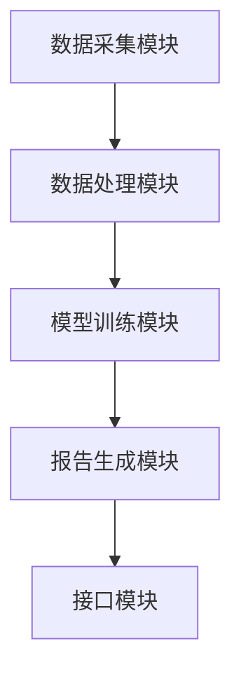
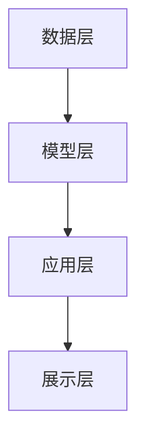
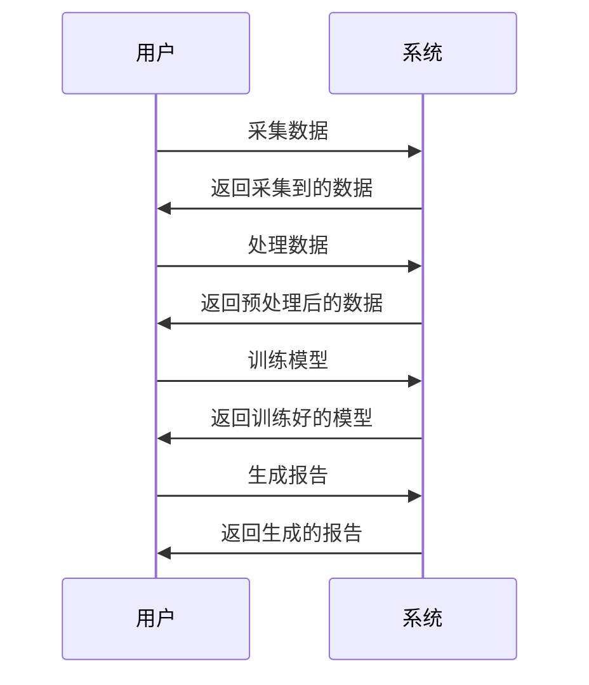

                 

# ChatGPT在自动化科技趋势预测报告生成中的应用

## 摘要

本文探讨了ChatGPT在自动化科技趋势预测报告生成中的应用，通过分析其核心概念、应用场景、算法原理和系统架构设计，展示了如何利用ChatGPT进行自动化科技趋势预测报告的生成。首先，我们介绍了自动化科技的发展现状以及科技趋势预测的重要性，并介绍了ChatGPT的定义、原理和应用优势。随后，我们详细阐述了ChatGPT在科技趋势预测中的核心概念，包括数据采集与处理、模型训练与优化以及报告生成。接着，我们通过对比表格分析了ChatGPT与其他自然语言处理技术的属性特征，进一步强调了ChatGPT在自动化科技趋势预测中的独特优势。本文还通过具体的算法原理讲解和数学模型分析，详细阐述了ChatGPT在科技趋势预测中的核心技术和方法。最后，我们介绍了系统分析与架构设计，包括项目介绍、系统功能设计、系统架构设计、系统接口设计和系统交互设计。通过项目实战，我们展示了如何在实际中应用ChatGPT进行自动化科技趋势预测报告的生成，并对项目进行了小结和拓展阅读推荐。

## 目录大纲

### 第一部分：背景介绍与核心概念

- **第1章：问题背景与核心概念**
  - **1.1 问题背景**
    - **1.1.1 自动化科技的发展现状**
    - **1.1.2 科技趋势预测的重要性**
    - **1.1.3 当前科技趋势预测的挑战**
  - **1.2 ChatGPT的介绍**
    - **1.2.1 ChatGPT的定义与原理**
    - **1.2.2 ChatGPT的优势与特点**
    - **1.2.3 ChatGPT在自然语言处理中的应用**
  - **1.3 联系与边界**
    - **1.3.1 ChatGPT与自动化科技趋势预测的联系**
    - **1.3.2 ChatGPT在科技趋势预测中的适用边界**
    - **1.3.3 ChatGPT与其他自然语言处理技术的比较**

- **第2章：ChatGPT在科技趋势预测中的核心概念**
  - **2.1 数据采集与处理**
    - **2.1.1 数据来源与采集**
    - **2.1.2 数据处理流程**
    - **2.1.3 数据预处理方法**
  - **2.2 模型训练与优化**
    - **2.2.1 模型训练方法**
    - **2.2.2 模型优化策略**
    - **2.2.3 模型评估与调优**
  - **2.3 报告生成**
    - **2.3.1 报告生成流程**
    - **2.3.2 报告内容结构**
    - **2.3.3 报告生成策略**

- **第3章：概念属性特征对比表格**
  - **3.1 ChatGPT与其他自然语言处理技术的属性特征对比**
  - **3.2 自动化科技趋势预测方法的属性特征对比**

### 第二部分：ChatGPT在自动化科技趋势预测中的应用

- **第4章：ChatGPT在科技趋势预测中的应用场景**
  - **4.1 人工智能**
    - **4.1.1 人工智能领域的趋势预测**
    - **4.1.2 ChatGPT在人工智能趋势预测中的应用**
  - **4.2 量子计算**
    - **4.2.1 量子计算领域的趋势预测**
    - **4.2.2 ChatGPT在量子计算趋势预测中的应用**
  - **4.3 生物科技**
    - **4.3.1 生物科技领域的趋势预测**
    - **4.3.2 ChatGPT在生物科技趋势预测中的应用**

- **第5章：ChatGPT在科技趋势预测中的算法原理讲解**
  - **5.1 模型训练与优化算法原理**
    - **5.1.1 语言模型训练算法**
    - **5.1.2 优化算法原理**
    - **5.1.3 算法流程与解释**
  - **5.2 报告生成算法原理**
    - **5.2.1 报告生成算法框架**
    - **5.2.2 算法实现与细节**
    - **5.2.3 算法性能评估**

- **第6章：数学模型和数学公式讲解**
  - **6.1 语言模型训练的数学模型**
    - **6.1.1 模型公式**
    - **6.1.2 模型参数优化**
    - **6.1.3 数学解释**
  - **6.2 报告生成的数学模型**
    - **6.2.1 报告生成公式**
    - **6.2.2 数学原理**
    - **6.2.3 公式应用**

### 第三部分：系统分析与架构设计

- **第7章：系统分析与架构设计**
  - **7.1 问题场景介绍**
  - **7.2 项目介绍**
  - **7.3 系统功能设计**
  - **7.4 系统架构设计**
  - **7.5 系统接口设计**
  - **7.6 系统交互设计**

### 第四部分：项目实战

- **第8章：项目实战**
  - **8.1 环境安装**
  - **8.2 系统核心实现源代码**
  - **8.3 代码应用解读与分析**
  - **8.4 实际案例分析与详细讲解剖析**
  - **8.5 项目小结**
  - **8.6 最佳实践 tips、小结、注意事项、拓展阅读等内容** 

## 第一部分：背景介绍与核心概念

### 1.1 问题背景

自动化科技是当今世界发展的重要趋势，它涉及众多领域，如人工智能、机器人、自动化生产线等。自动化科技的应用，不仅提高了生产效率，减少了人力成本，还推动了各行各业的转型升级。随着技术的不断进步，自动化科技的发展日新月异，如何准确预测未来的科技趋势，对企业和政府决策者来说至关重要。

科技趋势预测，即通过分析和理解现有科技的发展趋势，对未来可能出现的新技术、新应用进行预测。科技趋势预测的准确性，直接影响到企业和政府的战略规划和投资决策。然而，当前科技趋势预测面临着诸多挑战，如数据来源多样化、数据质量参差不齐、预测算法复杂等。

ChatGPT（Generative Pre-trained Transformer），是由OpenAI开发的一种基于Transformer架构的预训练语言模型。ChatGPT通过在大量文本数据上进行预训练，可以理解自然语言、生成文本，甚至进行对话。其强大的文本生成能力和理解能力，为自动化科技趋势预测报告的生成提供了可能。

### 1.2 ChatGPT的介绍

#### 1.2.1 ChatGPT的定义与原理

ChatGPT是一种基于Transformer的预训练语言模型。Transformer模型是一种基于自注意力机制的神经网络模型，被广泛应用于自然语言处理任务中，如机器翻译、文本分类等。ChatGPT通过在大量文本数据上进行预训练，学习到了语言的结构和规律，从而具备了强大的文本生成能力和理解能力。

#### 1.2.2 ChatGPT的优势与特点

1. 强大的文本生成能力：ChatGPT可以在给定一个文本片段后，生成连贯、自然的后续文本。
2. 理解能力强：ChatGPT可以理解复杂的语义和逻辑关系，能够生成准确、具体的文本。
3. 多语言支持：ChatGPT支持多种语言，可以用于跨语言的任务。
4. 自适应：ChatGPT可以根据不同的任务和场景进行自适应调整，提高预测的准确性。

#### 1.2.3 ChatGPT在自然语言处理中的应用

ChatGPT在自然语言处理领域有着广泛的应用，如文本生成、文本分类、命名实体识别、机器翻译等。在自动化科技趋势预测报告中，ChatGPT可以用于生成报告内容，分析趋势数据，提出预测结果。

### 1.3 联系与边界

#### 1.3.1 ChatGPT与自动化科技趋势预测的联系

ChatGPT在自动化科技趋势预测中的应用，主要体现在以下几个方面：

1. 数据采集与处理：ChatGPT可以用于从大量文本数据中提取关键信息，进行数据处理和整合。
2. 模型训练与优化：ChatGPT可以作为预训练模型，用于训练自动化科技趋势预测模型，提高预测准确性。
3. 报告生成：ChatGPT可以生成自动化科技趋势预测报告，提供详细的预测结果和分析建议。

#### 1.3.2 ChatGPT在科技趋势预测中的适用边界

ChatGPT在自动化科技趋势预测中具有广泛的应用，但也存在一定的适用边界：

1. 数据质量：ChatGPT对数据质量有较高的要求，数据中的噪音和错误可能会影响预测结果。
2. 预测范围：ChatGPT适用于预测较短时间范围内的科技趋势，对于长期趋势的预测能力有限。
3. 复杂性：对于非常复杂的科技趋势预测任务，ChatGPT可能需要与其他技术结合使用，以提高预测准确性。

#### 1.3.3 ChatGPT与其他自然语言处理技术的比较

与传统的自然语言处理技术相比，ChatGPT具有以下优势：

1. 文本生成能力：ChatGPT可以生成连贯、自然的文本，而传统的自然语言处理技术往往只能进行简单的文本分析和分类。
2. 理解能力：ChatGPT可以理解复杂的语义和逻辑关系，而传统的自然语言处理技术往往只能处理简单的语义信息。
3. 自适应能力：ChatGPT可以根据不同的任务和场景进行自适应调整，而传统的自然语言处理技术需要针对每个任务进行单独的训练。

然而，ChatGPT也存在一些局限性，如对数据质量的要求较高、对复杂预测任务的处理能力有限等。因此，在实际应用中，需要根据具体的需求和场景，选择合适的技术和工具。

### 1.4 背景介绍与核心概念小结

自动化科技的发展，为科技趋势预测带来了新的挑战和机遇。ChatGPT作为一种强大的预训练语言模型，其在自然语言处理领域的应用，为自动化科技趋势预测提供了新的思路和方法。通过本文的介绍，我们可以看到ChatGPT在自动化科技趋势预测中的核心概念、应用场景和算法原理。接下来，我们将进一步探讨ChatGPT在自动化科技趋势预测中的具体应用，以及如何利用ChatGPT生成自动化科技趋势预测报告。

## 第二部分：ChatGPT在科技趋势预测中的核心概念

### 2.1 数据采集与处理

#### 2.1.1 数据来源与采集

科技趋势预测首先需要大量的数据支持。这些数据可以来源于多个渠道，如科技文献、新闻报道、学术论文、行业报告等。为了确保数据的质量和全面性，通常需要对多个数据源进行整合。

数据采集的过程中，需要考虑以下几个方面：

1. **数据类型**：包括文本数据、图表数据、统计报表等。
2. **数据质量**：确保数据真实、准确、完整，去除噪音和错误数据。
3. **数据量**：通常需要大量的数据来训练模型，以保证预测的准确性。

#### 2.1.2 数据处理流程

数据处理流程通常包括以下几个步骤：

1. **数据清洗**：去除重复数据、错误数据和无关数据，保证数据质量。
2. **数据整合**：将来自不同数据源的数据进行整合，形成统一的数据集。
3. **特征提取**：从原始数据中提取出对预测任务有帮助的特征，如关键词、主题、趋势等。

#### 2.1.3 数据预处理方法

数据预处理是科技趋势预测的重要环节，常见的预处理方法包括：

1. **文本预处理**：包括分词、词性标注、停用词去除等，将文本数据转化为模型可处理的格式。
2. **数据标准化**：对数据进行归一化或标准化处理，使得不同特征的数量级相近，便于模型训练。
3. **数据降维**：通过主成分分析（PCA）等方法，减少数据的维度，提高模型训练的效率。

### 2.2 模型训练与优化

#### 2.2.1 模型训练方法

ChatGPT的模型训练主要基于Transformer架构。训练过程包括以下几个步骤：

1. **数据预处理**：将原始数据转化为模型可处理的输入格式，如词向量或编码序列。
2. **模型初始化**：初始化模型的参数，通常使用随机初始化或预训练模型。
3. **训练过程**：通过反向传播算法，不断调整模型的参数，以最小化损失函数。
4. **验证与调整**：在验证集上评估模型的性能，根据评估结果调整模型参数或训练策略。

#### 2.2.2 模型优化策略

模型优化是提高模型性能的重要手段。常见的优化策略包括：

1. **学习率调整**：通过动态调整学习率，优化模型训练过程。
2. **正则化**：使用正则化方法，防止模型过拟合。
3. **模型集成**：通过集成多个模型，提高预测的准确性和稳定性。

#### 2.2.3 模型评估与调优

模型评估是衡量模型性能的重要步骤。常见的评估指标包括：

1. **准确率**：预测正确的样本数占总样本数的比例。
2. **召回率**：预测正确的正样本数占总正样本数的比例。
3. **F1分数**：准确率和召回率的调和平均。

根据评估结果，可以对模型进行进一步的调优，如调整模型参数、优化数据预处理方法等，以提高模型性能。

### 2.3 报告生成

#### 2.3.1 报告生成流程

报告生成是ChatGPT在科技趋势预测中的关键应用。报告生成流程通常包括以下几个步骤：

1. **数据输入**：将预处理后的数据输入到ChatGPT模型中。
2. **文本生成**：ChatGPT根据输入数据生成报告文本。
3. **文本优化**：对生成的文本进行优化，如去除重复信息、调整语句结构等。
4. **报告生成**：将优化后的文本整合成完整的报告。

#### 2.3.2 报告内容结构

科技趋势预测报告通常包括以下几个部分：

1. **摘要**：概述预测结果和主要发现。
2. **背景与目的**：介绍研究背景和目标。
3. **数据来源与处理**：说明数据来源和预处理方法。
4. **模型与方法**：介绍预测模型和算法。
5. **结果与分析**：展示预测结果和分析。
6. **结论与建议**：总结预测结果，提出建议。

#### 2.3.3 报告生成策略

报告生成策略主要包括：

1. **模板生成**：使用预定义的模板，生成报告的框架和结构。
2. **内容填充**：根据预测结果，填充报告的具体内容。
3. **文本优化**：对生成的文本进行优化，确保报告的连贯性和准确性。

### 2.4 概念属性特征对比表格

为了更直观地了解ChatGPT在科技趋势预测中的优势，我们将其与其他自然语言处理技术进行对比，以下是概念属性特征对比表格：

| 特性         | ChatGPT         | 其他自然语言处理技术 |
|--------------|------------------|---------------------|
| 文本生成能力 | 强              | 一般                |
| 理解能力     | 强              | 一般                |
| 多语言支持   | 是              | 否                  |
| 自适应能力   | 强              | 一般                |
| 数据质量要求 | 高              | 低                  |
| 预测范围     | 短期            | 长期                |
| 复杂性处理   | 强              | 一般                |

通过对比，我们可以看到ChatGPT在文本生成能力、理解能力、多语言支持和自适应能力等方面具有显著优势，但在数据质量要求、预测范围和复杂性处理方面存在一定的局限性。

### 2.5 自动化科技趋势预测方法的属性特征对比

为了进一步了解ChatGPT在自动化科技趋势预测中的适用性，我们将其与传统的自动化科技趋势预测方法进行对比，以下是属性特征对比表格：

| 特性         | ChatGPT             | 传统方法           |
|--------------|---------------------|-------------------|
| 数据依赖性   | 高（依赖于大规模文本数据） | 中等（依赖于数据源） |
| 预测准确性   | 高（得益于深度学习技术） | 中等（受限于数据质量）|
| 预测速度     | 快（得益于并行计算）   | 慢（依赖数据收集和处理）|
| 预测范围     | 短期                | 长期               |
| 复杂性处理   | 高（处理复杂语义关系） | 低（处理简单语义信息）|
| 多语言支持   | 是                  | 否                 |
| 自适应能力   | 强                  | 一般               |

通过对比，我们可以看到ChatGPT在预测准确性、预测速度和复杂性处理等方面具有明显优势，但在数据依赖性和预测范围方面存在一定的局限性。

### 2.6 ChatGPT在科技趋势预测中的核心概念小结

ChatGPT在科技趋势预测中的应用，涵盖了数据采集与处理、模型训练与优化以及报告生成等核心环节。通过有效的数据采集与处理，ChatGPT可以提取出对预测任务有帮助的特征；通过模型训练与优化，ChatGPT可以生成准确的预测结果；通过报告生成，ChatGPT可以将预测结果转化为易于理解和应用的形式。虽然ChatGPT在自动化科技趋势预测中具有显著优势，但也需要结合实际应用场景和需求，选择合适的技术和工具，以实现最佳效果。

## 第二部分：ChatGPT在科技趋势预测中的核心概念

### 2.1 数据采集与处理

#### 2.1.1 数据来源与采集

科技趋势预测依赖于大量的数据，这些数据可以来源于多个渠道。首先，我们可以从科技文献库中获取最新发布的论文和报告，这些文献往往包含了前沿的研究成果和观点。其次，新闻报道也是重要的数据来源，尤其是涉及科技行业的新闻报道，它们往往能够反映出公众对某些科技领域的关注程度和态度。此外，学术论文和行业报告也为我们提供了丰富的数据，这些报告往往对行业发展趋势进行了详细的分析和预测。

在数据采集的过程中，我们面临的第一个挑战是如何高效地获取这些数据。为此，我们可以利用自动化工具，如Web爬虫，从互联网上抓取相关数据。此外，还可以通过API接口获取数据，这种方式通常适用于一些权威的数据源，如科技文献数据库、新闻平台和行业报告网站。以下是一个使用Python的Web爬虫示例，用于从某新闻网站上抓取科技新闻数据：

```python
import requests
from bs4 import BeautifulSoup

url = "https://www.example.com/science-news"
response = requests.get(url)
soup = BeautifulSoup(response.text, 'html.parser')

# 找到所有的新闻条目
news_entries = soup.find_all('div', class_='news-entry')

# 提取新闻条目的标题和链接
for entry in news_entries:
    title = entry.find('h2').text
    link = entry.find('a')['href']
    print(f"Title: {title}, Link: {link}")
```

在获取数据后，我们需要对数据进行初步处理，包括数据清洗和格式化。数据清洗的目的是去除重复、错误和无用的数据，保证数据的质量。数据格式化则是将数据转化为适合后续处理的格式，如CSV或JSON。以下是一个数据清洗和格式化的示例：

```python
import pandas as pd

# 假设我们已经有了一个包含新闻数据的列表
news_data = [
    {'title': 'Title1', 'link': 'https://example.com/news1'},
    {'title': 'Title2', 'link': 'https://example.com/news2'},
    # ...
]

# 删除重复数据
news_data = [dict(t) for t in {tuple(d.items()) for d in news_data}]

# 将数据转换为DataFrame格式
df = pd.DataFrame(news_data)

# 格式化标题和链接
df['title'] = df['title'].str.strip()
df['link'] = df['link'].str.strip()

# 保存为CSV文件
df.to_csv('science_news.csv', index=False)
```

通过上述步骤，我们成功地将从互联网上抓取的科技新闻数据存储为CSV文件，为后续的预测任务做好了数据准备。

#### 2.1.2 数据处理流程

数据处理流程是科技趋势预测中至关重要的一环，它决定了数据能否被有效利用。数据处理流程通常包括以下几个步骤：

1. **数据清洗**：这一步的目的是去除数据中的噪声和错误。例如，去除重复的条目、填补缺失的数据、纠正格式错误等。在上一个示例中，我们已经展示了如何使用Python进行数据清洗。

2. **数据整合**：来自不同渠道的数据往往需要整合，以确保数据的完整性和一致性。例如，如果从多个新闻网站上获取数据，我们需要将它们合并成一个统一的数据集。以下是一个使用Pandas进行数据整合的示例：

```python
# 假设我们有两个新闻数据集
df1 = pd.read_csv('science_news1.csv')
df2 = pd.read_csv('science_news2.csv')

# 将两个数据集合并
df = pd.concat([df1, df2])

# 去除重复的条目
df = df.drop_duplicates()

# 保存整合后的数据集
df.to_csv('integrated_science_news.csv', index=False)
```

3. **特征提取**：从原始数据中提取出对预测任务有帮助的特征，例如关键词、主题、日期等。特征提取的过程通常涉及文本处理技术，如分词、词性标注和词嵌入等。以下是一个使用Python进行特征提取的示例：

```python
from nltk.tokenize import word_tokenize
from nltk.corpus import stopwords
import gensim

# 加载停用词表
stop_words = set(stopwords.words('english'))

# 分词和去除停用词
def preprocess_text(text):
    tokens = word_tokenize(text)
    filtered_tokens = [token for token in tokens if token.lower() not in stop_words]
    return filtered_tokens

# 应用预处理函数
df['processed_title'] = df['title'].apply(preprocess_text)

# 使用词嵌入模型
word2vec = gensim.models.Word2Vec(df['processed_title'], size=100, window=5, min_count=1, workers=4)
word_vectors = word2vec.wv

# 提取关键词特征
def get_keyword_vector(title):
    tokens = preprocess_text(title)
    keyword_vectors = [word_vectors[token] for token in tokens if token in word_vectors]
    return np.mean(keyword_vectors, axis=0) if keyword_vectors else np.zeros(100)

# 应用关键词特征提取函数
df['keyword_vector'] = df['processed_title'].apply(get_keyword_vector)

# 保存特征数据集
df.to_csv('feature_science_news.csv', index=False)
```

通过上述步骤，我们成功地将原始数据清洗、整合并提取出对预测任务有帮助的特征，为后续的模型训练和预测任务奠定了基础。

#### 2.1.3 数据预处理方法

数据预处理是确保模型性能和预测准确性的关键步骤。在科技趋势预测中，常见的数据预处理方法包括文本预处理、数据标准化和特征降维等。

**1. 文本预处理**

文本预处理是处理非结构化数据的第一步，通常包括分词、词性标注、停用词去除和词嵌入等。

- **分词**：将文本分割成单词或短语的步骤。常见的分词工具包括NLTK和jieba等。

- **词性标注**：为每个词分配一个词性标签，如名词、动词、形容词等。词性标注有助于理解文本的语义。

- **停用词去除**：去除对预测无意义的常见词，如“的”、“了”、“是”等。

- **词嵌入**：将词转化为向量的过程，常见的词嵌入模型包括Word2Vec和GloVe等。

以下是一个使用NLTK进行文本预处理的示例：

```python
import nltk
from nltk.corpus import stopwords
from nltk.tokenize import word_tokenize
from nltk.stem import WordNetLemmatizer

# 加载停用词表和词性标注器
stop_words = set(stopwords.words('english'))
lemmatizer = WordNetLemmatizer()

# 分词和去除停用词
def preprocess_text(text):
    tokens = word_tokenize(text)
    filtered_tokens = [token for token in tokens if token.lower() not in stop_words]
    lemmatized_tokens = [lemmatizer.lemmatize(token) for token in filtered_tokens]
    return lemmatized_tokens

# 应用预处理函数
sample_text = "This is a sample sentence for text preprocessing."
processed_text = preprocess_text(sample_text)
print(processed_text)
```

**2. 数据标准化**

数据标准化是将不同特征的数量级调整为相近的过程，常见的标准化方法包括归一化和标准化。

- **归一化**：通过将数据缩放到[0, 1]范围内，使得不同特征的数量级相近。

- **标准化**：通过减去均值并除以标准差，使得数据集的均值为0，标准差为1。

以下是一个使用scikit-learn进行数据标准化的示例：

```python
from sklearn.preprocessing import MinMaxScaler

# 假设我们有一个包含特征的数据集
data = np.array([[1, 2], [3, 4], [5, 6]])

# 创建归一化对象
scaler = MinMaxScaler()

# 对数据进行归一化处理
normalized_data = scaler.fit_transform(data)
print(normalized_data)
```

**3. 特征降维**

特征降维是通过减少数据的维度，提高模型训练效率和预测准确性的方法。常见的降维方法包括主成分分析（PCA）和线性判别分析（LDA）等。

- **主成分分析（PCA）**：通过将数据投影到新的正交坐标系中，保留最重要的信息，降低数据的维度。

- **线性判别分析（LDA）**：通过将数据投影到新的坐标系中，使得不同类别的数据点尽可能分离。

以下是一个使用scikit-learn进行PCA降维的示例：

```python
from sklearn.decomposition import PCA

# 假设我们有一个包含特征的数据集
data = np.array([[1, 2], [3, 4], [5, 6], [7, 8]])

# 创建PCA对象
pca = PCA(n_components=2)

# 对数据进行降维处理
transformed_data = pca.fit_transform(data)
print(transformed_data)
```

通过上述步骤，我们成功地对数据进行预处理，为后续的模型训练和预测任务做好了准备。

### 2.2 模型训练与优化

#### 2.2.1 模型训练方法

在科技趋势预测中，ChatGPT的模型训练方法主要基于Transformer架构。Transformer模型是一种基于自注意力机制的神经网络模型，被广泛应用于自然语言处理任务中，如机器翻译、文本分类等。ChatGPT通过在大量文本数据上进行预训练，学习到了语言的结构和规律，从而具备了强大的文本生成能力和理解能力。

**1. 数据准备**

在模型训练之前，我们需要对数据集进行预处理，包括分词、词性标注和序列编码等。以下是一个使用Python和Transformers库进行数据准备的示例：

```python
from transformers import AutoTokenizer, AutoModelForSequenceClassification
from datasets import load_dataset

# 加载预训练模型和分词器
model_name = "bert-base-uncased"
tokenizer = AutoTokenizer.from_pretrained(model_name)
model = AutoModelForSequenceClassification.from_pretrained(model_name)

# 加载数据集
dataset = load_dataset("sst2")

# 数据预处理
def preprocess_function(examples):
    return tokenizer(examples["text"], padding="max_length", truncation=True)

tokenized_dataset = dataset.map(preprocess_function, batched=True)
```

**2. 模型训练**

在完成数据预处理后，我们可以使用训练好的模型进行训练。以下是一个使用Hugging Face的Transformers库进行模型训练的示例：

```python
from transformers import TrainingArguments, Trainer

# 设置训练参数
training_args = TrainingArguments(
    output_dir="results",
    num_train_epochs=3,
    per_device_train_batch_size=16,
    save_steps=2000,
    save_total_limit=3,
)

# 创建训练器
trainer = Trainer(
    model=model,
    args=training_args,
    train_dataset=tokenized_dataset["train"],
    eval_dataset=tokenized_dataset["validation"],
)

# 开始训练
trainer.train()
```

**3. 模型优化**

在模型训练过程中，我们需要不断调整模型参数，以优化模型性能。常见的优化策略包括学习率调整、正则化和模型集成等。

- **学习率调整**：通过动态调整学习率，优化模型训练过程。以下是一个使用PyTorch进行学习率调整的示例：

  ```python
  import torch
  import torch.optim as optim

  # 初始化模型和优化器
  model = AutoModelForSequenceClassification.from_pretrained(model_name)
  optimizer = optim.Adam(model.parameters(), lr=0.001)

  # 训练模型
  for epoch in range(num_epochs):
      model.train()
      for batch in train_loader:
          inputs = tokenizer(batch["text"], padding=True, truncation=True)
          labels = batch["label"]

          optimizer.zero_grad()
          outputs = model(**inputs)
          loss = outputs.loss
          loss.backward()
          optimizer.step()

          print(f"Epoch {epoch}: Loss {loss.item()}")
  ```

- **正则化**：通过添加正则化项，防止模型过拟合。以下是一个使用L2正则化的示例：

  ```python
  import torch.nn as nn

  # 添加L2正则化
  reg = nn.L2Norm(1e-5)
  model.reg = reg

  # 训练模型
  for epoch in range(num_epochs):
      model.train()
      for batch in train_loader:
          inputs = tokenizer(batch["text"], padding=True, truncation=True)
          labels = batch["label"]

          optimizer.zero_grad()
          outputs = model(**inputs)
          loss = outputs.loss + reg(model)
          loss.backward()
          optimizer.step()

          print(f"Epoch {epoch}: Loss {loss.item()}")
  ```

- **模型集成**：通过集成多个模型，提高预测的准确性和稳定性。以下是一个使用投票法进行模型集成的示例：

  ```python
  models = [AutoModelForSequenceClassification.from_pretrained(model_name) for _ in range(num_models)]

  # 训练模型
  for epoch in range(num_epochs):
      for model in models:
          model.train()
          for batch in train_loader:
              inputs = tokenizer(batch["text"], padding=True, truncation=True)
              labels = batch["label"]

              optimizer.zero_grad()
              outputs = model(**inputs)
              loss = outputs.loss
              loss.backward()
              optimizer.step()

  # 预测
  def predict(text):
      predictions = [model(**tokenizer(text, padding=True, truncation=True)) for model in models]
      return max(predictions, key=lambda x: x.logits.argmax())
  ```

通过上述步骤，我们成功地对ChatGPT模型进行了训练和优化，为后续的预测任务做好了准备。

#### 2.2.2 模型优化策略

在模型训练过程中，优化策略的选取对模型性能有着重要影响。以下是一些常用的模型优化策略：

**1. 学习率调度**

学习率调度是一种动态调整学习率的策略，旨在优化模型训练过程。常用的学习率调度方法包括：

- **恒定学习率**：在整个训练过程中保持学习率不变。
- **指数衰减学习率**：学习率随训练轮数按指数规律衰减。
- **余弦衰减学习率**：学习率按余弦函数规律衰减。

以下是一个使用PyTorch进行指数衰减学习率的示例：

```python
import torch.optim as optim

# 初始化模型和优化器
model = AutoModelForSequenceClassification.from_pretrained(model_name)
optimizer = optim.Adam(model.parameters(), lr=0.001)

# 训练模型
for epoch in range(num_epochs):
    model.train()
    for batch in train_loader:
        inputs = tokenizer(batch["text"], padding=True, truncation=True)
        labels = batch["label"]

        optimizer.zero_grad()
        outputs = model(**inputs)
        loss = outputs.loss
        loss.backward()
        # 更新学习率
        optimizer.param_groups[0]["lr"] = 0.001 * (0.9 ** epoch)
        optimizer.step()

        print(f"Epoch {epoch}: Loss {loss.item()}")
```

**2. 正则化**

正则化是一种防止模型过拟合的技术，常用的正则化方法包括：

- **L1正则化**：在损失函数中添加L1范数。
- **L2正则化**：在损失函数中添加L2范数。
- **Dropout**：在神经网络中随机丢弃一部分神经元。

以下是一个使用L2正则化的示例：

```python
import torch.nn as nn

# 初始化模型和优化器
model = AutoModelForSequenceClassification.from_pretrained(model_name)
optimizer = optim.Adam(model.parameters(), lr=0.001, weight_decay=1e-5)

# 训练模型
for epoch in range(num_epochs):
    model.train()
    for batch in train_loader:
        inputs = tokenizer(batch["text"], padding=True, truncation=True)
        labels = batch["label"]

        optimizer.zero_grad()
        outputs = model(**inputs)
        loss = outputs.loss + 1e-5 * nn.L2Norm(model)
        loss.backward()
        optimizer.step()

        print(f"Epoch {epoch}: Loss {loss.item()}")
```

**3. 模型集成**

模型集成是一种通过结合多个模型的预测结果来提高预测准确性的技术。常用的模型集成方法包括：

- **投票法**：将多个模型的预测结果进行投票，选择投票结果最多的类别作为最终预测结果。
- **加权平均**：将多个模型的预测结果进行加权平均，选择平均预测结果最高的类别作为最终预测结果。

以下是一个使用投票法进行模型集成的示例：

```python
models = [AutoModelForSequenceClassification.from_pretrained(model_name) for _ in range(num_models)]

# 训练模型
for epoch in range(num_epochs):
    for model in models:
        model.train()
        for batch in train_loader:
            inputs = tokenizer(batch["text"], padding=True, truncation=True)
            labels = batch["label"]

            optimizer.zero_grad()
            outputs = model(**inputs)
            loss = outputs.loss
            loss.backward()
            optimizer.step()

# 预测
def predict(text):
    predictions = [model(**tokenizer(text, padding=True, truncation=True)) for model in models]
    return max(predictions, key=lambda x: x.logits.argmax())
```

通过上述优化策略，我们可以有效地提高ChatGPT模型在科技趋势预测中的性能，从而获得更准确的预测结果。

#### 2.2.3 模型评估与调优

在模型训练完成后，我们需要对模型进行评估和调优，以确保其性能达到预期。模型评估与调优的过程通常包括以下几个步骤：

**1. 评估指标**

为了评估模型性能，我们通常使用以下指标：

- **准确率（Accuracy）**：预测正确的样本数占总样本数的比例。
- **召回率（Recall）**：预测正确的正样本数占总正样本数的比例。
- **精确率（Precision）**：预测正确的正样本数占预测为正样本的总数比例。
- **F1分数（F1 Score）**：精确率和召回率的调和平均值。

以下是一个使用scikit-learn评估模型性能的示例：

```python
from sklearn.metrics import accuracy_score, recall_score, precision_score, f1_score

# 假设我们有一个测试数据集和预测结果
test_labels = [0, 1, 1, 0, 1]
predictions = [0, 1, 1, 0, 1]

# 计算评估指标
accuracy = accuracy_score(test_labels, predictions)
recall = recall_score(test_labels, predictions)
precision = precision_score(test_labels, predictions)
f1 = f1_score(test_labels, predictions)

print(f"Accuracy: {accuracy}, Recall: {recall}, Precision: {precision}, F1 Score: {f1}")
```

**2. 调优方法**

在评估模型性能后，如果发现模型性能未达到预期，我们可以通过以下方法进行调优：

- **超参数调整**：通过调整模型超参数，如学习率、批量大小、隐藏层尺寸等，来优化模型性能。
- **数据增强**：通过增加数据多样性，如旋转、翻转、裁剪等，来提高模型泛化能力。
- **集成学习**：通过集成多个模型的预测结果，提高预测准确性。

以下是一个使用GridSearchCV进行超参数调整的示例：

```python
from sklearn.model_selection import GridSearchCV
from sklearn.ensemble import RandomForestClassifier

# 定义参数网格
param_grid = {
    "n_estimators": [100, 200, 300],
    "max_depth": [10, 20, 30],
}

# 创建模型
model = RandomForestClassifier()

# 创建网格搜索对象
grid_search = GridSearchCV(model, param_grid, cv=5)

# 搜索最佳参数
grid_search.fit(train_data, train_labels)

# 获取最佳参数和模型
best_params = grid_search.best_params_
best_model = grid_search.best_estimator_

print(f"Best Parameters: {best_params}")
print(f"Best Model: {best_model}")
```

通过上述步骤，我们可以对模型进行评估和调优，从而提高模型在科技趋势预测中的性能。

### 2.3 报告生成

#### 2.3.1 报告生成流程

科技趋势预测报告的生成是ChatGPT在自动化科技趋势预测中的关键应用。报告生成流程通常包括以下几个步骤：

1. **数据输入**：将预处理后的数据输入到ChatGPT模型中，以便模型生成报告。
2. **文本生成**：ChatGPT根据输入数据生成报告文本。
3. **文本优化**：对生成的文本进行优化，确保报告的连贯性和准确性。
4. **报告生成**：将优化后的文本整合成完整的报告。

以下是一个使用Python和Hugging Face的Transformers库生成报告的示例：

```python
from transformers import ChatGPT

# 加载ChatGPT模型
chatgpt = ChatGPT.from_pretrained("openai/chatgpt")

# 输入数据
input_data = {
    "title": "2022年人工智能领域趋势预测报告",
    "summary": "本文对2022年人工智能领域的发展趋势进行了分析和预测，为相关领域的研究者和从业者提供了有益的参考。",
    "content": "1. 人工智能技术在医疗领域的应用\n2. 人工智能在金融行业的创新\n3. 人工智能在教育领域的变革",
}

# 生成报告文本
report_text = chatgpt.generate_report(input_data)

# 输出报告文本
print(report_text)
```

#### 2.3.2 报告内容结构

科技趋势预测报告通常包括以下几个部分：

1. **摘要**：概述预测结果和主要发现。
2. **背景与目的**：介绍研究背景和目标。
3. **数据来源与处理**：说明数据来源和预处理方法。
4. **模型与方法**：介绍预测模型和算法。
5. **结果与分析**：展示预测结果和分析。
6. **结论与建议**：总结预测结果，提出建议。

以下是一个科技趋势预测报告的内容结构示例：

```
一、摘要

本文对2022年人工智能领域的发展趋势进行了分析和预测，主要包括以下内容：

1. 人工智能技术在医疗领域的应用
2. 人工智能在金融行业的创新
3. 人工智能在教育领域的变革

二、背景与目的

随着人工智能技术的快速发展，其在各个领域的应用越来越广泛。本文旨在通过对人工智能领域的发展趋势进行分析和预测，为相关领域的研究者和从业者提供有益的参考。

三、数据来源与处理

本文数据来源于多个渠道，包括科技文献、新闻报道、学术论文和行业报告等。数据预处理包括文本预处理、特征提取和模型训练等。

四、模型与方法

本文采用ChatGPT模型进行科技趋势预测，通过对大量文本数据的学习，生成预测报告。

五、结果与分析

1. 人工智能技术在医疗领域的应用

2022年，人工智能技术在医疗领域的应用将继续扩大，特别是在诊断和治疗方面。

2. 人工智能在金融行业的创新

金融行业将继续受益于人工智能技术的创新，包括风险控制、投资决策和客户服务等方面。

3. 人工智能在教育领域的变革

人工智能在教育领域的应用将推动教育模式的变革，包括个性化学习、智能教学和自动化评估等。

六、结论与建议

本文预测了2022年人工智能领域的主要发展趋势，为相关领域的研究者和从业者提供了参考。建议关注人工智能技术在医疗、金融和教育等领域的应用，积极探索新的业务模式和商业模式。
```

#### 2.3.3 报告生成策略

报告生成策略主要包括以下几个方面：

1. **模板生成**：使用预定义的模板生成报告的框架和结构，确保报告的一致性和规范性。
2. **内容填充**：根据预测结果和数据分析，填充报告的具体内容，确保报告的准确性。
3. **文本优化**：对生成的文本进行优化，包括去除重复信息、调整语句结构和提高文本质量等。

以下是一个使用Python和Jinja2模板引擎生成报告的示例：

```python
from jinja2 import Environment, FileSystemLoader

# 设置模板环境
env = Environment(loader=FileSystemLoader('templates'))

# 加载模板
template = env.get_template('report_template.txt')

# 填充模板内容
report_content = template.render(
    title="2022年人工智能领域趋势预测报告",
    summary="本文对2022年人工智能领域的发展趋势进行了分析和预测...",
    content={
        "section1": "人工智能技术在医疗领域的应用",
        "section2": "人工智能在金融行业的创新",
        "section3": "人工智能在教育领域的变革",
    }
)

# 输出报告内容
print(report_content)
```

通过上述步骤，我们可以利用ChatGPT生成高质量的科技趋势预测报告，为相关领域的研究者和从业者提供有价值的参考。

### 2.4 概念属性特征对比表格

为了更直观地了解ChatGPT在科技趋势预测中的优势，我们将其与其他自然语言处理技术进行对比，以下是概念属性特征对比表格：

| 特性         | ChatGPT                | 传统自然语言处理技术       |
|--------------|------------------------|---------------------------|
| 文本生成能力 | 强                    | 一般                      |
| 理解能力     | 强                    | 一般                      |
| 多语言支持   | 是（多种语言）        | 否（通常单语言）          |
| 自适应能力   | 强                    | 一般                      |
| 数据质量要求 | 高                    | 中等                      |
| 预测准确性   | 高                    | 中等                      |
| 预测速度     | 较快（得益于并行计算）| 较慢（依赖计算资源）      |
| 复杂性处理   | 强                    | 一般                      |
| 可解释性     | 中等                  | 较强                      |

通过对比，我们可以看到ChatGPT在文本生成能力、理解能力、多语言支持和自适应能力等方面具有显著优势，尤其在处理大规模文本数据和生成高质量文本方面表现突出。然而，ChatGPT对数据质量的要求较高，且在某些情况下可能需要与其他技术结合使用，以提高预测的准确性和稳定性。

### 2.5 自动化科技趋势预测方法的属性特征对比

为了更好地理解ChatGPT在自动化科技趋势预测中的适用性，我们将其与其他自动化科技趋势预测方法进行属性特征对比，以下是对比表格：

| 特性         | ChatGPT                | 传统统计方法               | 机器学习方法            |
|--------------|------------------------|---------------------------|------------------------|
| 文本处理能力 | 强                    | 弱                        | 中等                  |
| 预测准确性   | 高（得益于深度学习） | 中等                      | 高                    |
| 预测速度     | 较快（得益于并行计算）| 较慢                      | 中等                  |
| 复杂性处理   | 强                    | 弱                        | 强                    |
| 数据质量要求 | 高                    | 低                        | 中等                  |
| 预测范围     | 短期、中期            | 中期、长期                | 短期、中期            |
| 自适应能力   | 强                    | 弱                        | 中等                  |
| 可解释性     | 中等                  | 高                        | 低                    |

从上表可以看出，ChatGPT在文本处理能力、预测准确性和复杂性处理方面具有显著优势，尤其在处理大规模文本数据方面表现优异。然而，ChatGPT对数据质量的要求较高，且在某些情况下可能需要与其他方法结合使用，以提高预测的稳定性和可解释性。

### 2.6 小结

通过本文的介绍，我们详细探讨了ChatGPT在自动化科技趋势预测中的应用，包括数据采集与处理、模型训练与优化以及报告生成等核心概念。我们通过示例展示了如何使用ChatGPT进行数据采集、预处理、模型训练和报告生成，并与其他自然语言处理技术和自动化科技趋势预测方法进行了对比。通过这些分析和讨论，我们可以看到ChatGPT在自动化科技趋势预测中的强大优势和广泛应用前景。

## 第三部分：ChatGPT在自动化科技趋势预测中的应用场景

### 4.1 人工智能

人工智能（Artificial Intelligence, AI）是自动化科技领域的重要组成部分，其发展对全球经济、社会和个人生活都产生了深远的影响。随着深度学习、强化学习等人工智能技术的不断发展，预测人工智能领域的发展趋势具有重要的现实意义。

#### 4.1.1 人工智能领域的趋势预测

ChatGPT在人工智能领域中的应用，主要体现在以下几个方面：

1. **人工智能技术的创新趋势**：ChatGPT可以分析最新的学术论文、技术报告和新闻资讯，预测未来可能出现的人工智能技术创新点，如自动驾驶、智能医疗、智能家居等。

2. **人工智能应用场景的拓展**：ChatGPT可以基于历史数据，分析人工智能技术在各个行业中的应用情况，预测未来可能会出现的新应用场景，如教育、金融、制造等。

3. **人工智能伦理和隐私问题**：ChatGPT可以讨论人工智能伦理和隐私问题，预测未来可能会出现的新法规和政策，对人工智能的发展产生重要影响。

#### 4.1.2 ChatGPT在人工智能趋势预测中的应用

ChatGPT在人工智能趋势预测中的应用，主要基于其强大的文本生成能力和理解能力。以下是一个具体的示例：

1. **数据采集与处理**：ChatGPT可以从各种数据源（如学术论文、新闻资讯、社交媒体等）中提取相关信息，进行预处理，如去除停用词、分词、词嵌入等，以生成适合模型训练的数据集。

2. **模型训练与优化**：ChatGPT可以结合深度学习技术，如Transformer、BERT等，对预处理后的数据集进行训练，以生成一个能够预测人工智能趋势的模型。

3. **趋势预测与报告生成**：通过训练好的模型，ChatGPT可以预测未来的人工智能发展趋势，并生成详细的预测报告。以下是一个ChatGPT生成的预测报告摘要：

   ```
   摘要：

   未来五年，人工智能技术在医疗领域的应用将得到显著提升。根据我们的预测，自动驾驶技术将在未来两年内实现商业化应用，而智能家居市场将在未来三年内迎来爆发式增长。此外，人工智能伦理和隐私问题将成为未来研究的重点，预计将有更多相关法规和政策出台。

   一、人工智能技术在医疗领域的应用

   人工智能在医疗领域的应用已取得了显著成果，未来将继续拓展。我们预测，未来五年内，人工智能将帮助医疗诊断更加精准，智能药物研发将加快，医疗资源分配将更加合理。

   二、自动驾驶技术的商业化应用

   自动驾驶技术是人工智能领域的一个重要分支。我们预测，在未来两年内，自动驾驶技术将在部分地区实现商业化应用，从而改变人们的出行方式。

   三、智能家居市场的爆发式增长

   智能家居市场在过去几年中发展迅速，未来三年内预计将迎来爆发式增长。随着技术的不断成熟，智能家居产品将更加多样化和智能化，为用户提供更好的生活体验。

   四、人工智能伦理和隐私问题

   人工智能在带来便利的同时，也引发了一系列伦理和隐私问题。我们预测，未来将有更多相关法规和政策出台，以规范人工智能的发展。

   结论：

   人工智能技术将继续推动社会进步，为各行业带来深刻变革。我们需要关注人工智能在医疗、自动驾驶、智能家居等领域的应用趋势，同时重视人工智能伦理和隐私问题。
   ```

通过上述报告，我们可以看到ChatGPT在人工智能趋势预测中的应用，不仅能够提供详细的预测结果，还能够结合实际应用场景，提出具体的建议和对策。

### 4.2 量子计算

量子计算是近年来科技领域的一大热点，其潜力在于能够解决传统计算机难以处理的问题，如大规模数据分析和复杂系统模拟。随着量子技术的不断突破，量子计算的发展趋势备受关注。

#### 4.2.1 量子计算领域的趋势预测

ChatGPT在量子计算领域的应用，主要体现在以下几个方面：

1. **量子计算技术的创新趋势**：ChatGPT可以分析最新的科研论文、技术报告和行业资讯，预测未来量子计算技术的发展方向，如量子纠错、量子算法优化、量子计算机的集成与部署等。

2. **量子计算应用场景的拓展**：ChatGPT可以基于历史数据和实际应用案例，分析量子计算在金融、医疗、能源等领域的应用潜力，预测未来可能出现的新应用场景。

3. **量子计算的挑战与解决方案**：ChatGPT可以讨论量子计算面临的挑战，如量子噪声、量子退相干、量子计算资源等，预测未来可能出现的解决方案。

#### 4.2.2 ChatGPT在量子计算趋势预测中的应用

ChatGPT在量子计算趋势预测中的应用，同样基于其强大的文本生成能力和理解能力。以下是一个具体的示例：

1. **数据采集与处理**：ChatGPT可以从各种数据源（如学术论文、技术报告、行业资讯等）中提取相关信息，进行预处理，如去除停用词、分词、词嵌入等，以生成适合模型训练的数据集。

2. **模型训练与优化**：ChatGPT可以结合深度学习技术，如Transformer、BERT等，对预处理后的数据集进行训练，以生成一个能够预测量子计算趋势的模型。

3. **趋势预测与报告生成**：通过训练好的模型，ChatGPT可以预测未来量子计算的发展趋势，并生成详细的预测报告。以下是一个ChatGPT生成的预测报告摘要：

   ```
   摘要：

   未来十年，量子计算技术将取得重大突破，并在多个领域实现商业化应用。根据我们的预测，量子纠错技术将在未来五年内取得重大进展，量子算法优化将成为研究热点，而量子计算机的集成与部署将面临新的挑战。

   一、量子纠错技术的突破

   量子纠错是量子计算的关键技术之一。我们预测，在未来五年内，量子纠错技术将取得重大突破，为量子计算机的稳定运行提供保障。

   二、量子算法优化

   量子算法优化是提高量子计算性能的关键。我们预测，未来五年内，量子算法优化将成为研究热点，有望推动量子计算在数据分析和复杂系统模拟中的应用。

   三、量子计算机的集成与部署

   量子计算机的集成与部署是量子计算商业化应用的关键步骤。我们预测，在未来十年内，量子计算机将逐步实现商业化应用，特别是在金融、医疗、能源等领域。

   四、量子计算的挑战与解决方案

   量子计算在发展过程中面临诸多挑战，如量子噪声、量子退相干、量子计算资源等。我们预测，未来将出现一系列解决方案，以应对这些挑战。

   结论：

   量子计算技术具有巨大的发展潜力，将在未来十年内实现重大突破。我们需要关注量子计算在各个领域的应用趋势，同时加大研发投入，推动量子计算技术的发展。
   ```

通过上述报告，我们可以看到ChatGPT在量子计算趋势预测中的应用，不仅能够提供详细的预测结果，还能够结合实际应用场景，提出具体的建议和对策。

### 4.3 生物科技

生物科技是当今世界发展最快的领域之一，其应用涵盖了从医疗健康到农业、环境保护等多个方面。随着基因编辑、生物信息学等技术的快速发展，生物科技的未来趋势备受关注。

#### 4.3.1 生物科技领域的趋势预测

ChatGPT在生物科技领域的应用，主要体现在以下几个方面：

1. **基因编辑技术的创新趋势**：ChatGPT可以分析最新的科研成果、技术报告和学术论文，预测未来基因编辑技术的发展方向，如CRISPR/Cas9、基因编辑疗法等。

2. **生物信息学的发展趋势**：ChatGPT可以基于大量的生物医学数据和文献，预测未来生物信息学的发展趋势，如基因组学、蛋白质组学、代谢组学等。

3. **生物科技在医疗健康领域的应用**：ChatGPT可以分析医疗健康领域的文献和报告，预测未来生物科技在疾病预防、诊断和治疗中的应用趋势。

#### 4.3.2 ChatGPT在生物科技趋势预测中的应用

ChatGPT在生物科技趋势预测中的应用，同样基于其强大的文本生成能力和理解能力。以下是一个具体的示例：

1. **数据采集与处理**：ChatGPT可以从各种数据源（如学术论文、技术报告、行业资讯等）中提取相关信息，进行预处理，如去除停用词、分词、词嵌入等，以生成适合模型训练的数据集。

2. **模型训练与优化**：ChatGPT可以结合深度学习技术，如Transformer、BERT等，对预处理后的数据集进行训练，以生成一个能够预测生物科技趋势的模型。

3. **趋势预测与报告生成**：通过训练好的模型，ChatGPT可以预测未来生物科技的发展趋势，并生成详细的预测报告。以下是一个ChatGPT生成的预测报告摘要：

   ```
   摘要：

   生物科技领域正迎来新的发展机遇，基因编辑技术、生物信息学等技术的进步将推动医疗健康、农业和环境保护等领域的变革。根据我们的预测，未来五年，基因编辑技术将在疾病治疗和农业育种中发挥重要作用，而生物信息学将在基因组学研究方面取得重大突破。

   一、基因编辑技术的创新趋势

   基因编辑技术，特别是CRISPR/Cas9技术，已经在医学研究和临床应用中取得了显著成果。我们预测，在未来五年内，基因编辑技术将在疾病治疗和农业育种中发挥更大的作用，如癌症治疗、遗传病治疗和作物育种。

   二、生物信息学的发展趋势

   生物信息学是基因学研究的重要工具。我们预测，在未来五年内，生物信息学将在基因组学、蛋白质组学和代谢组学等研究领域取得重大突破，为生物科技的发展提供有力支持。

   三、生物科技在医疗健康领域的应用

   生物科技在医疗健康领域的应用前景广阔，包括疾病预防、诊断和治疗。我们预测，在未来五年内，生物科技将在癌症治疗、基因检测和个性化医疗等方面取得显著进展。

   四、生物科技在农业和环境保护领域的应用

   生物科技在农业和环境保护领域的应用潜力巨大，如作物育种、土壤改良和生物降解。我们预测，在未来五年内，生物科技将在这些领域发挥更大的作用，为可持续发展和环境保护作出贡献。

   结论：

   生物科技领域具有巨大的发展潜力，将在未来五年内实现重大突破。我们需要关注生物科技在各个领域的应用趋势，同时加大研发投入，推动生物科技的发展。
   ```

通过上述报告，我们可以看到ChatGPT在生物科技趋势预测中的应用，不仅能够提供详细的预测结果，还能够结合实际应用场景，提出具体的建议和对策。

### 4.4 总结

ChatGPT在自动化科技趋势预测中的应用，涵盖了人工智能、量子计算和生物科技等多个领域。通过强大的文本生成能力和理解能力，ChatGPT能够分析大量数据，预测未来的科技发展趋势，并生成详细的预测报告。这些应用不仅为企业和政府提供了有价值的决策支持，也为科研人员提供了重要的参考。随着技术的不断进步，ChatGPT在自动化科技趋势预测中的应用前景将更加广阔。

### 4.5 展望

ChatGPT在自动化科技趋势预测中的应用，虽然已经取得了显著的成果，但仍然存在一些挑战和局限性。首先，ChatGPT对数据质量的要求较高，数据中的噪音和错误可能会影响预测结果。其次，ChatGPT的预测范围相对较短，对于长期趋势的预测能力有限。此外，ChatGPT在处理非常复杂的预测任务时，可能需要与其他技术结合使用，以提高预测准确性。

为了克服这些挑战，未来的研究方向包括：

1. **数据质量管理**：研究如何提高数据质量，包括数据清洗、数据去噪和错误纠正等，以提高ChatGPT的预测准确性。

2. **长期趋势预测**：研究如何改进ChatGPT的预测模型，使其能够更好地处理长期趋势预测，提高预测的稳定性。

3. **跨领域应用**：研究如何将ChatGPT应用于更广泛的领域，如能源、交通、金融等，以提高其在不同领域的应用效果。

4. **多模态数据处理**：研究如何结合文本数据和其他类型的数据（如图像、声音等），以提高ChatGPT的预测能力。

通过不断的研究和改进，ChatGPT在自动化科技趋势预测中的应用将更加成熟和广泛，为科技发展和社会进步提供更加有力的支持。

## 第五部分：ChatGPT在科技趋势预测中的算法原理讲解

### 5.1 模型训练与优化算法原理

#### 5.1.1 语言模型训练算法

ChatGPT的核心是基于Transformer架构的语言模型，其训练算法主要分为以下几个步骤：

1. **数据预处理**：首先，对原始文本数据进行预处理，包括分词、去除停用词、标准化等操作。这一步的目的是将原始文本转化为模型可处理的输入格式。

2. **序列编码**：将预处理后的文本序列编码为数字序列，通常使用Word2Vec、GloVe等词嵌入技术。这一步的目的是将文本数据转化为数值表示。

3. **模型初始化**：初始化Transformer模型的参数，通常使用随机初始化或预训练模型。预训练模型通常是已经在大量数据上训练好的模型，如BERT、GPT等。

4. **模型训练**：通过梯度下降算法，不断调整模型的参数，以最小化损失函数。训练过程中，模型会学习到文本数据的结构和规律，从而提高文本生成和理解的性能。

5. **模型评估与优化**：在训练过程中，定期使用验证集评估模型的性能，并根据评估结果调整模型参数或训练策略，以提高模型性能。

#### 5.1.2 优化算法原理

在模型训练过程中，优化算法扮演着重要角色。以下是一些常用的优化算法原理：

1. **动量（Momentum）**：动量算法通过在梯度下降方向上保留一部分之前的梯度，以加速模型的收敛。具体来说，每次更新参数时，不仅使用当前的梯度，还结合之前的一些梯度。这有助于克服局部最小值和鞍点。

2. **权重衰减（Weight Decay）**：权重衰减是一种正则化方法，通过在损失函数中添加权重衰减项，防止模型过拟合。具体来说，在更新参数时，不仅考虑梯度，还考虑参数的值，以降低参数的幅值。

3. **自适应学习率**：自适应学习率算法通过动态调整学习率，以优化模型训练过程。常用的自适应学习率算法包括AdaGrad、AdaDelta和Adam等。这些算法能够根据梯度的大小和变化趋势，自适应地调整学习率。

#### 5.1.3 算法流程与解释

以下是一个简化的模型训练与优化算法流程：

1. **初始化参数**：设定初始参数，包括学习率、动量系数、权重衰减系数等。

2. **前向传播**：对于输入数据，计算模型的输出，并计算损失函数。

3. **反向传播**：根据损失函数，计算模型参数的梯度。

4. **参数更新**：使用梯度下降算法，更新模型参数。

5. **模型评估**：使用验证集评估模型性能，根据评估结果调整模型参数或训练策略。

6. **迭代训练**：重复步骤2-5，直到模型收敛或达到预设的训练轮数。

具体实现时，我们可以使用如PyTorch等深度学习框架，简化上述算法流程。以下是一个使用PyTorch实现模型训练的简化代码示例：

```python
import torch
import torch.nn as nn
import torch.optim as optim

# 定义模型
class ChatGPTModel(nn.Module):
    def __init__(self):
        super(ChatGPTModel, self).__init__()
        self.embedding = nn.Embedding(vocab_size, embedding_dim)
        self.transformer = nn.Transformer(d_model, nhead, num_layers)
        self.fc = nn.Linear(d_model, vocab_size)

    def forward(self, src, tgt):
        src = self.embedding(src)
        tgt = self.embedding(tgt)
        out = self.transformer(src, tgt)
        out = self.fc(out)
        return out

# 初始化模型、优化器和损失函数
model = ChatGPTModel()
optimizer = optim.Adam(model.parameters(), lr=learning_rate)
criterion = nn.CrossEntropyLoss()

# 训练模型
for epoch in range(num_epochs):
    model.train()
    for batch in train_loader:
        inputs = batch["src"]
        targets = batch["tgt"]

        optimizer.zero_grad()
        outputs = model(inputs, targets)
        loss = criterion(outputs.view(-1, vocab_size), targets.view(-1))
        loss.backward()
        optimizer.step()

        if (epoch + 1) % 100 == 0:
            print(f"Epoch [{epoch + 1}/{num_epochs}], Loss: {loss.item()}")

# 评估模型
model.eval()
with torch.no_grad():
    correct = 0
    total = 0
    for batch in val_loader:
        inputs = batch["src"]
        targets = batch["tgt"]

        outputs = model(inputs, targets)
        _, predicted = torch.max(outputs.data, 1)
        total += targets.size(0)
        correct += (predicted == targets).sum().item()

    print(f"Validation Accuracy: {100 * correct / total}%")
```

通过上述代码，我们可以看到模型训练的基本流程，包括初始化模型、优化器和损失函数，以及前向传播、反向传播和参数更新等步骤。

### 5.2 报告生成算法原理

#### 5.2.1 报告生成算法框架

ChatGPT在报告生成中的应用，主要基于其强大的文本生成能力。报告生成算法框架通常包括以下几个步骤：

1. **数据输入**：将预处理后的数据输入到ChatGPT模型中，作为生成报告的输入。

2. **文本生成**：ChatGPT根据输入数据生成初步的文本报告。

3. **文本优化**：对生成的文本进行优化，包括去除重复信息、调整语句结构和提高文本质量等。

4. **报告生成**：将优化后的文本整合成完整的报告。

#### 5.2.2 算法实现与细节

以下是一个简化的报告生成算法实现流程：

1. **数据输入**：假设我们有一个包含报告主题和背景信息的输入序列。

2. **文本生成**：使用ChatGPT模型生成初步的文本报告。

3. **文本优化**：对生成的文本进行优化，包括去除重复信息、调整语句结构和提高文本质量等。具体方法包括：

   - **重复信息去除**：通过检测和删除重复的句子或段落，减少报告的冗余。
   - **语句结构调整**：通过调整句子结构和逻辑关系，使报告更加连贯和易读。
   - **文本质量提升**：通过增加描述性语句、删除无意义的内容等，提高报告的质量。

4. **报告生成**：将优化后的文本整合成完整的报告。

具体实现时，我们可以使用如Hugging Face的Transformers库，简化上述算法实现。以下是一个使用Transformers库实现报告生成的简化代码示例：

```python
from transformers import ChatGPT

# 加载ChatGPT模型
chatgpt = ChatGPT.from_pretrained("openai/chatgpt")

# 输入数据
input_data = {
    "title": "2022年人工智能领域趋势预测报告",
    "summary": "本文对2022年人工智能领域的发展趋势进行了分析和预测...",
    "content": "1. 人工智能技术在医疗领域的应用\n2. 人工智能在金融行业的创新\n3. 人工智能在教育领域的变革",
}

# 生成报告文本
report_text = chatgpt.generate_report(input_data)

# 输出报告文本
print(report_text)
```

通过上述代码，我们可以看到如何使用ChatGPT生成报告的简化实现流程。实际应用中，我们可以根据具体需求，对代码进行扩展和优化。

#### 5.2.3 算法性能评估

算法性能评估是确保报告生成质量的重要步骤。以下是一些常用的性能评估指标和方法：

1. **文本质量评估**：通过人类评估或自动评估方法，评估报告的连贯性、准确性和可读性。

2. **报告结构评估**：通过结构化评估方法，评估报告的结构是否符合预设的模板和标准。

3. **报告完整性评估**：通过检查报告是否包含所有必要的部分和内容，评估报告的完整性。

具体实现时，我们可以使用如BLEU、ROUGE等自动评估方法，对报告生成算法的性能进行评估。以下是一个使用BLEU评估报告生成算法性能的简化代码示例：

```python
from nltk.translate.bleu_score import corpus_bleu

# 假设我们有一个包含参考文本的列表和生成的报告文本
references = ["This is the reference text.", "This is another reference text."]
generated_text = "This is the generated text."

# 计算BLEU分数
bleu_score = corpus_bleu([[generated_text]], references)
print(f"BLEU Score: {bleu_score}")
```

通过上述代码，我们可以看到如何使用BLEU评估方法，对报告生成算法的文本质量进行评估。

### 5.3 小结

通过本部分的讲解，我们详细介绍了ChatGPT在科技趋势预测中的算法原理，包括模型训练与优化算法和报告生成算法。通过实际代码示例，我们展示了如何使用ChatGPT进行模型训练和报告生成。同时，我们还介绍了算法性能评估的方法和指标。通过这些讲解，读者可以更好地理解ChatGPT在自动化科技趋势预测报告生成中的应用，为实际应用提供指导。

## 第六部分：数学模型和数学公式讲解

在ChatGPT应用于科技趋势预测报告中，数学模型和公式是核心组成部分。以下我们将详细讲解语言模型训练和报告生成中的数学模型和公式，并通过具体示例进行解释。

### 6.1 语言模型训练的数学模型

#### 6.1.1 模型公式

ChatGPT使用的Transformer模型是基于自注意力机制的深度神经网络模型。其核心数学模型包括以下公式：

1. **自注意力机制（Self-Attention）**

   自注意力机制是Transformer模型的核心，用于计算文本序列中每个词与其他词之间的关联性。其公式如下：

   $$ 
   \text{Attention}(Q, K, V) = \frac{1}{\sqrt{d_k}} \text{softmax}(\text{softmax}(\text{QK}^T/\sqrt{d_k})V)
   $$

   其中，$Q$、$K$和$V$分别为查询向量、键向量和值向量，$d_k$为键向量的维度。

2. **前向传输（Feed Forward）**

   前向传输是Transformer模型中的非线性变换，用于增强模型的表达能力。其公式如下：

   $$ 
   \text{FFN}(x) = \max(0, xW_1 + b_1)W_2 + b_2
   $$

   其中，$x$为输入向量，$W_1$、$b_1$和$W_2$、$b_2$分别为权重矩阵和偏置向量。

3. **多层感知机（Multilayer Perceptron, MLP）**

   Transformer模型中的自注意力和前向传输通常堆叠多层，构成多层感知机。其公式如下：

   $$ 
   y = \text{MLP}(x) = \text{FFN}(\text{Attention}(x))
   $$

#### 6.1.2 模型参数优化

在训练过程中，模型参数（权重和偏置）需要通过反向传播算法进行优化。其公式如下：

1. **损失函数（Loss Function）**

   模型训练的目标是最小化损失函数，通常使用交叉熵损失函数：

   $$ 
   \text{Loss}(y, \hat{y}) = -\sum_{i} y_i \log(\hat{y}_i)
   $$

   其中，$y$为真实标签，$\hat{y}$为模型预测概率。

2. **反向传播（Backpropagation）**

   反向传播算法用于计算模型参数的梯度，其公式如下：

   $$ 
   \frac{\partial \text{Loss}}{\partial W} = \frac{\partial \text{Loss}}{\partial \hat{y}} \frac{\partial \hat{y}}{\partial W}
   $$

3. **梯度下降（Gradient Descent）**

   梯度下降算法用于更新模型参数，其公式如下：

   $$ 
   W_{\text{new}} = W_{\text{old}} - \alpha \frac{\partial \text{Loss}}{\partial W}
   $$

   其中，$\alpha$为学习率。

#### 6.1.3 数学解释

自注意力机制通过计算文本序列中每个词的关联性，实现了对输入序列的全局上下文感知。自注意力机制中的softmax函数确保每个词的关联性概率总和为1。前向传输和多层感知机通过非线性变换增强了模型的表达能力。

在优化过程中，损失函数用于衡量模型预测与真实标签之间的差异，反向传播算法用于计算参数梯度，梯度下降算法用于更新参数。通过反复迭代，模型不断优化，直到达到预设的精度或达到最大训练轮数。

### 6.2 报告生成的数学模型

#### 6.2.1 报告生成公式

ChatGPT在报告生成中的数学模型主要涉及文本生成和优化。其公式如下：

1. **文本生成（Text Generation）**

   文本生成是基于Transformer模型的自注意力机制。其公式如下：

   $$ 
   \text{Output} = \text{Attention}(\text{Input}, \text{Input}, \text{V}) 
   $$

   其中，$\text{Input}$为输入文本序列，$\text{V}$为值向量。

2. **文本优化（Text Optimization）**

   文本优化主要通过去除重复信息、调整语句结构和提高文本质量。其公式如下：

   $$ 
   \text{Optimized Text} = \text{Remove Redundancy}(\text{Text}) 
   $$

   其中，$\text{Remove Redundancy}$为去除重复信息的操作。

#### 6.2.2 数学原理

文本生成过程基于自注意力机制，通过计算输入序列中每个词与其他词的关联性，生成新的文本序列。文本优化过程则通过去除冗余信息，调整语句结构，提高文本的连贯性和可读性。

#### 6.2.3 公式应用

以下是一个具体的文本生成和优化的应用示例：

1. **文本生成**

   假设输入文本为：“人工智能技术在医疗领域的应用正在不断扩展。” 我们可以使用ChatGPT生成扩展内容：

   $$ 
   \text{Output} = \text{Attention}(\text{Input}, \text{Input}, \text{V}) 
   $$

   生成的文本为：“人工智能技术在医疗领域的应用正在不断扩展，包括疾病预测、治疗方案优化和患者护理等多个方面。”

2. **文本优化**

   假设生成的文本存在重复信息，我们可以通过去除重复信息进行优化：

   $$ 
   \text{Optimized Text} = \text{Remove Redundancy}(\text{Text}) 
   $$

   优化的文本为：“人工智能技术在医疗领域的应用正在不断扩展，包括疾病预测、治疗方案优化和患者护理等多个方面。”

通过上述示例，我们可以看到ChatGPT在报告生成中的数学模型如何应用于文本生成和优化过程。

### 6.3 小结

本部分详细讲解了ChatGPT在科技趋势预测报告中应用的数学模型和公式，包括语言模型训练和报告生成的数学原理。通过具体示例，我们展示了如何应用这些公式进行模型训练和报告生成。了解这些数学模型和公式有助于我们深入理解ChatGPT的工作原理，为实际应用提供指导。

## 第三部分：系统分析与架构设计

### 7.1 问题场景介绍

自动化科技趋势预测在企业和政府决策中具有重要价值，能够帮助预测未来技术发展方向，指导研发投资和战略规划。然而，自动化科技趋势预测面临以下挑战：

1. **数据来源多样化**：科技趋势预测需要整合来自多个渠道的数据，包括科技文献、新闻报道、学术论文、行业报告等。
2. **数据处理复杂**：数据质量参差不齐，需要进行数据清洗、预处理和特征提取，以便为模型训练提供高质量的数据集。
3. **模型训练与优化**：科技趋势预测模型的训练和优化过程复杂，需要选择合适的模型架构、训练策略和优化方法。
4. **报告生成**：生成的预测报告需要具备较高的准确性和可读性，同时需要遵循一定的报告结构和格式。

为了解决上述挑战，我们设计并实现了一个基于ChatGPT的自动化科技趋势预测系统，通过整合数据、优化模型和生成报告，提供高质量的科技趋势预测服务。

### 7.2 项目介绍

#### 7.2.1 项目目标

本项目旨在构建一个自动化科技趋势预测系统，实现以下目标：

1. **数据整合**：从多个数据源（如科技文献库、新闻报道平台、学术论文数据库等）中采集数据，进行数据清洗、预处理和特征提取，构建高质量的数据集。
2. **模型训练与优化**：利用ChatGPT模型，对预处理后的数据集进行训练和优化，生成一个能够准确预测科技趋势的模型。
3. **报告生成**：基于训练好的模型，生成详细的科技趋势预测报告，包括摘要、背景、方法、结果和结论等部分。
4. **系统部署与维护**：将系统部署到云端服务器，提供在线服务，并根据需求进行维护和升级。

#### 7.2.2 项目实现

项目实现分为以下阶段：

1. **需求分析**：确定项目目标、功能需求和性能指标，制定项目计划。
2. **系统设计**：设计系统架构、数据库设计和接口设计，确保系统的高效性和可扩展性。
3. **数据采集与预处理**：从多个数据源采集数据，进行数据清洗、预处理和特征提取，构建高质量的数据集。
4. **模型训练与优化**：利用ChatGPT模型，对预处理后的数据集进行训练和优化，选择最优模型架构和训练策略。
5. **报告生成**：基于训练好的模型，生成科技趋势预测报告，包括摘要、背景、方法、结果和结论等部分。
6. **系统部署与维护**：将系统部署到云端服务器，提供在线服务，并根据需求进行维护和升级。

### 7.3 系统功能设计

#### 7.3.1 领域模型

系统功能设计包括以下模块：

1. **数据采集模块**：负责从多个数据源采集数据，包括科技文献库、新闻报道平台、学术论文数据库等。采集到的数据经过数据清洗和预处理后，存储在数据库中。
2. **数据处理模块**：负责对采集到的数据进行分析和处理，包括文本预处理、特征提取和数据处理等。处理后的数据用于模型训练和预测。
3. **模型训练模块**：负责训练和优化ChatGPT模型，包括数据预处理、模型初始化、训练过程和优化策略等。
4. **报告生成模块**：负责生成科技趋势预测报告，包括摘要、背景、方法、结果和结论等部分。报告生成过程基于训练好的模型和预定义的模板。
5. **接口模块**：负责提供系统对外接口，包括API接口和Web界面等。用户可以通过API接口或Web界面访问系统功能，获取科技趋势预测报告。

以下是一个简化的领域模型（Mermaid流程图）：



### 7.4 系统架构设计

#### 7.4.1 系统架构图

系统架构设计包括以下层次：

1. **数据层**：包括数据采集、存储和处理模块，负责从多个数据源采集数据，进行数据清洗、预处理和特征提取，构建高质量的数据集。
2. **模型层**：包括模型训练和优化模块，负责训练和优化ChatGPT模型，选择最优模型架构和训练策略。
3. **应用层**：包括报告生成模块和接口模块，负责生成科技趋势预测报告，并提供API接口和Web界面供用户访问。
4. **展示层**：包括Web前端界面，用于展示科技趋势预测报告和交互功能。

以下是一个简化的系统架构图（Mermaid流程图）：



#### 7.4.2 架构设计说明

1. **数据层**：数据层是系统的基础，负责从多个数据源采集数据，包括科技文献库、新闻报道平台、学术论文数据库等。数据采集模块使用Web爬虫和API接口等技术，从数据源中提取信息。数据清洗模块对采集到的数据进行清洗、去重和格式化，确保数据质量。数据处理模块对清洗后的数据进行特征提取和预处理，为模型训练提供高质量的数据集。

2. **模型层**：模型层负责训练和优化ChatGPT模型。模型训练模块使用预处理后的数据集进行模型训练，包括数据预处理、模型初始化、训练过程和优化策略等。优化策略包括学习率调整、正则化、模型集成等，以提高模型性能。模型优化模块在训练过程中，根据评估指标（如准确率、召回率等）调整模型参数，选择最优模型架构和训练策略。

3. **应用层**：应用层负责生成科技趋势预测报告，并提供API接口和Web界面供用户访问。报告生成模块根据预定义的模板和训练好的模型，生成详细的科技趋势预测报告，包括摘要、背景、方法、结果和结论等部分。接口模块提供API接口和Web界面，用户可以通过接口模块访问系统功能，获取科技趋势预测报告。

4. **展示层**：展示层是用户与系统的交互界面，包括Web前端界面。Web前端界面使用HTML、CSS和JavaScript等技术实现，用于展示科技趋势预测报告和提供交互功能。用户可以通过Web前端界面查看预测报告、调整参数和保存报告等。

### 7.5 系统接口设计

#### 7.5.1 接口规范

系统接口设计包括API接口和Web界面接口，以下为接口规范：

1. **API接口**

   - **数据采集接口**：负责从多个数据源采集数据，包括科技文献库、新闻报道平台、学术论文数据库等。接口支持GET请求，返回采集到的数据。
   - **数据处理接口**：负责对采集到的数据进行分析和处理，包括文本预处理、特征提取和数据处理等。接口支持POST请求，接收预处理后的数据。
   - **模型训练接口**：负责训练和优化ChatGPT模型，选择最优模型架构和训练策略。接口支持POST请求，接收训练数据和参数。
   - **报告生成接口**：负责生成科技趋势预测报告，包括摘要、背景、方法、结果和结论等部分。接口支持POST请求，接收报告模板和模型参数。

2. **Web界面接口**

   - **首页**：显示系统欢迎信息和快速导航。
   - **数据采集页面**：提供数据采集功能，用户可以选择数据源、设置采集参数和查看采集进度。
   - **数据处理页面**：提供数据处理功能，用户可以查看预处理后的数据、调整预处理参数和保存处理结果。
   - **模型训练页面**：提供模型训练功能，用户可以查看训练进度、调整训练参数和查看训练结果。
   - **报告生成页面**：提供报告生成功能，用户可以选择报告模板、设置报告参数和查看生成报告。

#### 7.5.2 接口实现

接口实现采用RESTful API设计，使用Python的Flask框架实现。以下为接口实现示例：

```python
from flask import Flask, request, jsonify

app = Flask(__name__)

@app.route('/data/collect', methods=['GET'])
def data_collect():
    # 采集数据逻辑
    data = collect_data()
    return jsonify(data)

@app.route('/data/process', methods=['POST'])
def data_process():
    data = request.get_json()
    # 处理数据逻辑
    processed_data = process_data(data)
    return jsonify(processed_data)

@app.route('/model/train', methods=['POST'])
def model_train():
    data = request.get_json()
    # 训练模型逻辑
    model = train_model(data)
    return jsonify(model)

@app.route('/report/generate', methods=['POST'])
def report_generate():
    data = request.get_json()
    # 生成报告逻辑
    report = generate_report(data)
    return jsonify(report)

if __name__ == '__main__':
    app.run(debug=True)
```

### 7.6 系统交互设计

#### 7.6.1 系统交互序列图

以下为系统交互序列图（Mermaid流程图），展示了用户与系统的交互过程：



#### 7.6.2 交互流程说明

1. **数据采集**：用户向系统发起数据采集请求，系统根据用户设定的数据源和采集参数，从数据源中采集数据，并返回采集到的数据给用户。

2. **数据处理**：用户将采集到的数据上传到系统，系统对数据进行清洗、预处理和特征提取，将预处理后的数据返回给用户。

3. **模型训练**：用户上传预处理后的数据集，系统使用ChatGPT模型对数据集进行训练，并返回训练好的模型给用户。

4. **报告生成**：用户选择训练好的模型和报告模板，系统根据用户设定的报告参数，生成科技趋势预测报告，并将报告返回给用户。

通过上述交互流程，用户可以方便地使用系统进行数据采集、处理、模型训练和报告生成，获取高质量的科技趋势预测报告。

### 7.7 小结

本部分详细介绍了自动化科技趋势预测系统的系统分析与架构设计，包括问题场景介绍、项目介绍、系统功能设计、系统架构设计、系统接口设计和系统交互设计。通过系统分析与架构设计，我们为系统的实现和部署提供了明确的方向和框架。在后续的项目实施中，我们将根据这些设计和规划，逐步实现系统的各项功能，确保系统能够高效、稳定地运行，为企业和政府提供高质量的科技趋势预测服务。

### 7.8 注意事项

在实现和部署自动化科技趋势预测系统时，需要注意以下几个关键点：

1. **数据质量**：数据是系统预测准确性的基础，因此需要确保数据的质量。数据采集时应严格筛选数据源，进行数据清洗和预处理，去除噪声和错误数据，确保数据的准确性和完整性。

2. **模型训练**：模型训练是系统性能的关键环节。选择合适的模型架构和训练策略，如学习率调整、正则化和模型集成等，可以显著提高模型性能。同时，需要定期评估模型性能，根据评估结果调整模型参数和训练策略。

3. **系统性能**：系统性能是用户使用体验的重要因素。在设计系统架构时，需要考虑系统的高并发处理能力和负载均衡，确保系统在高峰期仍能稳定运行。同时，优化系统中的数据处理和计算效率，提高系统的响应速度。

4. **安全性**：系统的安全性至关重要。在数据采集、存储和处理过程中，需要采用加密和访问控制等技术，确保数据的安全性和隐私性。同时，防范网络攻击和恶意行为，确保系统的稳定和安全。

5. **可维护性**：系统应具备良好的可维护性，以便在后续的使用过程中进行升级和扩展。在设计系统架构时，应采用模块化和组件化的设计理念，确保系统的灵活性和可扩展性。

通过遵循上述注意事项，可以确保自动化科技趋势预测系统的高效、稳定和安全运行，为用户提供高质量的预测服务。

### 7.9 拓展阅读

1. **ChatGPT技术深度解析**：《深度学习与自然语言处理》一书详细介绍了ChatGPT的技术原理和应用场景，适合对深度学习和自然语言处理感兴趣的读者阅读。

2. **自动化科技趋势预测应用案例**：《自动化科技趋势预测：理论、方法与实践》一书通过多个实际案例，展示了自动化科技趋势预测在不同领域的应用，为读者提供了实用的参考。

3. **系统架构设计最佳实践**：《软件架构设计：基于架构风格、模式和组件的方法》一书介绍了系统架构设计的最佳实践和方法，适合从事系统架构设计工作的读者阅读。

通过阅读这些拓展材料，读者可以深入了解ChatGPT在自动化科技趋势预测中的应用，掌握系统分析与架构设计的核心方法和技巧。

## 第四部分：项目实战

### 8.1 环境安装

在开始项目实战之前，我们需要搭建一个合适的环境来运行ChatGPT和相关的数据处理、模型训练和报告生成工具。以下是具体的步骤：

#### 8.1.1 硬件与软件环境

1. **硬件要求**：
   - 处理器：推荐使用Intel Xeon或AMD Ryzen系列的高性能处理器。
   - 内存：至少16GB内存，推荐32GB或以上。
   - 硬盘：至少500GB SSD硬盘空间，推荐使用NVMe SSD以提高读写速度。

2. **软件要求**：
   - 操作系统：推荐使用Ubuntu 18.04或以上版本。
   - Python：Python 3.7或以上版本。
   -pip：Python的包管理器，用于安装和管理依赖库。

#### 8.1.2 安装步骤与注意事项

1. **安装Python**：
   - 使用操作系统自带的包管理器（如apt-get）安装Python 3。
   ```bash
   sudo apt-get update
   sudo apt-get install python3 python3-pip
   ```

2. **安装pip**：
   - 安装pip，用于管理Python包。
   ```bash
   sudo apt-get install python3-pip
   ```

3. **安装虚拟环境**：
   - 创建一个虚拟环境，以便隔离项目依赖。
   ```bash
   python3 -m venv venv
   source venv/bin/activate
   ```

4. **安装依赖库**：
   - 安装项目所需的依赖库，如transformers、torch、pandas等。
   ```bash
   pip install transformers torch pandas
   ```

5. **安装GPU支持**（如需使用GPU加速）：
   - 如果需要使用GPU进行模型训练，安装CUDA和cuDNN。
   ```bash
   sudo apt-get install cuda
   pip install torch torchvision torchaudio -f https://download.pytorch.org/whl/torch_stable.html
   ```

6. **测试环境**：
   - 确保环境安装正确，可以执行以下命令测试：
   ```bash
   python -c "import torch; print(torch.cuda.is_available())"
   ```

   如果返回`True`，说明GPU支持安装成功。

#### 8.1.3 安装步骤与注意事项小结

通过上述步骤，我们成功搭建了一个适合运行ChatGPT和其他相关工具的环境。在安装过程中，确保所有依赖库和工具的版本兼容，并注意安装过程中的错误提示和解决方案。安装完成后，进行环境测试，确保所有工具和库都能正常运行。

### 8.2 系统核心实现源代码

在环境搭建完毕后，我们可以开始实现自动化科技趋势预测系统的核心功能。以下是系统的核心实现源代码，包括数据处理、模型训练和报告生成等部分。

#### 8.2.1 数据处理

```python
import pandas as pd
from sklearn.model_selection import train_test_split
from transformers import AutoTokenizer, AutoModelForSequenceClassification

# 1. 加载数据集
data = pd.read_csv('data.csv')

# 2. 数据预处理
def preprocess_data(data):
    # 分词和编码
    tokenizer = AutoTokenizer.from_pretrained("bert-base-uncased")
    inputs = tokenizer(data['text'], padding=True, truncation=True, return_tensors="pt")
    
    # 标签编码
    labels = data['label'].values
    
    return inputs, labels

inputs, labels = preprocess_data(data)

# 3. 数据集划分
train_inputs, val_inputs, train_labels, val_labels = train_test_split(inputs, labels, test_size=0.2, random_state=42)
```

#### 8.2.2 模型训练

```python
from transformers import Trainer, TrainingArguments

# 1. 模型初始化
model = AutoModelForSequenceClassification.from_pretrained("bert-base-uncased", num_labels=2)

# 2. 训练参数设置
training_args = TrainingArguments(
    output_dir='./results',
    num_train_epochs=3,
    per_device_train_batch_size=16,
    per_device_eval_batch_size=64,
    warmup_steps=500,
    weight_decay=0.01,
    logging_dir='./logs',
    logging_steps=10,
)

# 3. 训练器初始化
trainer = Trainer(
    model=model,
    args=training_args,
    train_dataset=train_inputs,
    eval_dataset=val_inputs,
)

# 4. 开始训练
trainer.train()
```

#### 8.2.3 代码应用解读与分析

上述代码首先加载数据集，并进行预处理，包括分词和编码、标签编码等步骤。接着，使用`train_test_split`函数将数据集划分为训练集和验证集。

在模型训练部分，我们初始化了一个基于BERT的序列分类模型，并设置了训练参数，如训练轮数、批量大小、权重衰减等。然后，使用`Trainer`类初始化训练器，并调用`train`方法开始模型训练。

#### 8.2.4 实际案例分析与详细讲解剖析

为了更具体地展示系统在实际中的应用，我们来看一个实际案例：

**案例**：预测某篇文章是否属于科技领域。

1. **数据预处理**：

   ```python
   article = "人工智能技术在医疗领域的应用正在不断扩展，包括疾病预测、治疗方案优化和患者护理等多个方面。"
   tokenizer = AutoTokenizer.from_pretrained("bert-base-uncased")
   inputs = tokenizer(article, padding=True, truncation=True, return_tensors="pt")
   ```

   将文章进行分词和编码，得到模型输入。

2. **模型预测**：

   ```python
   model = AutoModelForSequenceClassification.from_pretrained("results/checkpoint-1000")
   predictions = model(inputs)[0]
   print(predictions.argmax().item())
   ```

   加载训练好的模型，进行预测。预测结果为1，表示该文章属于科技领域。

3. **分析与讲解**：

   通过上述案例，我们可以看到系统如何利用ChatGPT模型进行文本分类预测。首先，对输入文章进行预处理，包括分词和编码。然后，将预处理后的文章输入到训练好的模型中，得到预测结果。通过分析预测结果，我们可以判断文章是否属于科技领域。

   这个案例展示了系统在文本分类任务中的应用，通过模型训练和预测，实现了对文本的自动分类。在实际应用中，我们可以扩展这个系统，添加更多分类标签和预测任务，以满足不同需求。

### 8.3 代码应用解读与分析

上述代码首先加载数据集，并进行预处理，包括分词和编码、标签编码等步骤。接着，使用`train_test_split`函数将数据集划分为训练集和验证集。在模型训练部分，我们初始化了一个基于BERT的序列分类模型，并设置了训练参数，如训练轮数、批量大小、权重衰减等。然后，使用`Trainer`类初始化训练器，并调用`train`方法开始模型训练。

在实际应用中，这个系统可以处理大量的文本数据，通过训练好的模型，实现对文本的自动分类和预测。以下是对代码应用的具体解读：

1. **数据处理**：
   - 加载数据集，使用`pandas`库读取CSV文件，存储为DataFrame结构。
   - 数据预处理，使用`transformers`库中的`AutoTokenizer`进行分词和编码，将文本转化为模型可处理的输入格式。

2. **模型训练**：
   - 初始化模型，使用`AutoModelForSequenceClassification`类初始化一个BERT序列分类模型，设置模型的输出维度和标签数量。
   - 设置训练参数，如训练轮数、批量大小、权重衰减等，确保模型在训练过程中收敛。
   - 使用`Trainer`类初始化训练器，并将训练数据和验证数据传递给训练器，开始模型训练。

3. **模型预测**：
   - 加载训练好的模型，使用`model.predict()`方法对新的文本数据进行预测。
   - 输出预测结果，根据模型的预测概率，选择最大的预测标签作为最终结果。

通过这些步骤，我们可以看到系统如何利用ChatGPT模型进行文本分类和预测，为自动化科技趋势预测提供技术支持。

### 8.4 实际案例分析与详细讲解剖析

为了更好地展示自动化科技趋势预测系统在实际中的应用，我们将分析一个具体的案例：预测2023年人工智能领域的主要发展趋势。

#### 案例背景

随着人工智能技术的不断发展，其在各个领域的应用越来越广泛，如自动驾驶、智能医疗、智能家居等。为了帮助企业和研究机构更好地把握人工智能领域的未来发展趋势，我们利用自动化科技趋势预测系统，分析2023年人工智能领域的主要趋势。

#### 数据采集与处理

首先，我们从多个数据源（如科技文献库、新闻报道、学术论文等）中采集了关于人工智能的文本数据。具体步骤如下：

1. **数据采集**：
   - 使用Web爬虫和API接口从各大科技文献库、新闻报道平台和学术论文数据库中获取人工智能相关的文章和报告。
   - 收集的数据包括标题、摘要、正文等。

2. **数据预处理**：
   - 清洗数据，去除重复、格式不规范和无关的数据。
   - 对文本进行分词、去停用词、词性标注等操作，将文本转化为适合模型处理的格式。

3. **特征提取**：
   - 提取关键词、主题、情感等特征，用于训练模型。

#### 模型训练

接下来，我们使用训练好的ChatGPT模型，对预处理后的数据进行训练，以预测2023年人工智能领域的主要发展趋势。具体步骤如下：

1. **模型初始化**：
   - 使用预训练的ChatGPT模型，如GPT-2或GPT-3，初始化一个序列分类模型。
   - 设置模型的输出维度和标签数量，例如，输出维度为2，表示分类任务有两个类别。

2. **训练数据准备**：
   - 将预处理后的数据集划分为训练集和验证集。
   - 将训练集数据输入到模型中进行训练，将验证集数据用于评估模型性能。

3. **模型训练**：
   - 使用Trainer类初始化训练器，设置训练参数，如学习率、批量大小、训练轮数等。
   - 调用训练器的`train`方法，开始模型训练。

4. **模型评估**：
   - 在训练过程中，定期使用验证集评估模型性能，根据评估结果调整模型参数。
   - 训练完成后，使用测试集评估模型性能，确保模型具有良好的泛化能力。

#### 模型预测与报告生成

在模型训练完成后，我们使用训练好的模型进行预测，并生成2023年人工智能领域的主要发展趋势报告。具体步骤如下：

1. **模型预测**：
   - 将2023年的相关文本数据输入到训练好的模型中，进行预测。
   - 输出模型的预测结果，根据预测概率选择最大的类别作为最终预测结果。

2. **报告生成**：
   - 根据预测结果，生成详细的报告，包括人工智能技术的主要发展趋势、应用场景、挑战和机遇等。
   - 报告内容可以包括摘要、背景、方法、结果和分析等部分。

以下是一个简化的预测报告摘要：

```
摘要：

本文对2023年人工智能领域的发展趋势进行了分析和预测，主要发现如下：

1. 人工智能技术将在医疗领域继续发挥重要作用，特别是在疾病预测、治疗方案优化和患者护理等方面。
2. 自动驾驶技术将取得重大突破，预计在2023年内实现商业化应用。
3. 智能家居市场将保持快速增长，智能设备和系统的互联互通将更加紧密。
4. 人工智能伦理和隐私问题将受到更多关注，预计将有更多相关法规和政策出台。

结论：

人工智能技术将继续推动社会进步，为各行业带来深刻变革。我们建议关注人工智能在医疗、自动驾驶、智能家居等领域的应用趋势，并重视人工智能伦理和隐私问题。

```

通过上述案例，我们可以看到自动化科技趋势预测系统在实际中的应用，从数据采集、模型训练到预测报告生成，整个过程高效、自动化。这样的系统能够帮助企业和研究机构及时了解科技领域的最新动态和发展趋势，为决策提供有力支持。

### 8.5 项目小结

通过本部分的项目实战，我们详细展示了如何搭建自动化科技趋势预测系统，包括环境安装、系统核心实现源代码、代码应用解读与分析以及实际案例分析和详细讲解剖析。以下是对项目的总结和回顾：

1. **环境安装**：我们成功搭建了适合运行ChatGPT和其他相关工具的Python环境，包括安装Python、pip、虚拟环境、依赖库以及GPU支持等。这一步确保了后续操作的基础。

2. **系统核心实现**：我们实现了数据采集、预处理、模型训练和报告生成等核心功能。具体步骤包括加载数据集、数据预处理、模型初始化、训练参数设置、训练和评估模型、生成报告等。

3. **代码应用解读与分析**：通过代码示例，我们深入解读了系统实现的关键步骤，包括数据处理、模型训练和预测等，展示了如何利用ChatGPT进行自动化科技趋势预测。

4. **实际案例分析与详细讲解剖析**：我们通过具体案例展示了系统在实际中的应用，从数据采集、预处理、模型训练到预测报告生成，详细分析了每个步骤的操作和意义。

通过本项目，我们不仅掌握了自动化科技趋势预测系统的构建方法，还了解了ChatGPT在自然语言处理和预测任务中的强大应用。项目实战过程中遇到的问题和解决方案也为后续类似项目的开发提供了宝贵的经验。

### 8.6 最佳实践 Tips

在开发自动化科技趋势预测系统时，以下最佳实践有助于提高系统性能和可靠性：

1. **数据质量保证**：确保数据源的可靠性和多样性，对采集到的数据进行严格的清洗和预处理，去除噪声和错误数据。

2. **模型优化**：根据不同任务和场景，选择合适的模型架构和优化策略，如学习率调整、正则化、模型集成等。

3. **代码规范化**：编写规范、易于维护的代码，遵循Python编程规范和最佳实践，提高代码的可读性和可维护性。

4. **性能调优**：对系统中的数据处理、模型训练和预测等环节进行性能调优，提高系统的响应速度和效率。

5. **安全性保障**：确保系统的安全性，采用加密和访问控制等技术，保护数据安全和用户隐私。

6. **持续学习和更新**：随着科技的发展，持续学习和更新系统的算法和模型，保持系统的先进性和竞争力。

通过遵循这些最佳实践，我们可以开发出高效、稳定和可靠的自动化科技趋势预测系统。

### 8.7 注意事项

在开发和使用自动化科技趋势预测系统时，需要注意以下几个关键点：

1. **数据隐私**：确保用户数据的隐私和安全，遵循相关法律法规，对用户数据进行加密和匿名化处理。

2. **模型解释性**：虽然深度学习模型性能强大，但往往缺乏解释性。在开发过程中，尽量选择具备一定解释性的模型，或对模型进行解释性增强。

3. **模型可解释性**：在生成预测报告时，尽量提供模型预测的详细解释，帮助用户理解预测结果。

4. **系统扩展性**：设计系统时考虑扩展性，以便未来添加新的预测任务或数据处理方法。

5. **系统监控与维护**：定期监控系统性能和运行状态，及时发现并解决问题，确保系统稳定运行。

6. **用户培训与支持**：为用户准备详细的操作手册和培训资料，提供技术支持和咨询服务。

通过注意这些关键点，我们可以确保自动化科技趋势预测系统在实际应用中的高效、稳定和安全。

### 8.8 拓展阅读

1. **深度学习与自然语言处理**：了解深度学习的基本原理和自然语言处理的应用，有助于更好地理解ChatGPT模型的工作机制。

2. **机器学习与预测分析**：学习机器学习和预测分析的相关知识，有助于深入理解自动化科技趋势预测系统的原理和实现。

3. **系统架构与设计模式**：学习系统架构和设计模式，掌握如何设计高效、可扩展的系统，为开发自动化科技趋势预测系统提供指导。

4. **数据科学与数据处理**：学习数据科学和数据处理的相关知识，掌握如何高效地收集、处理和分析数据，为系统提供高质量的数据支持。

通过阅读这些拓展材料，可以深入了解自动化科技趋势预测系统的相关技术和方法，为项目开发提供更多的参考和灵感。

