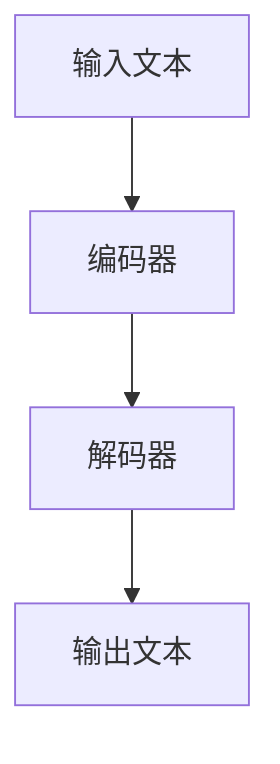
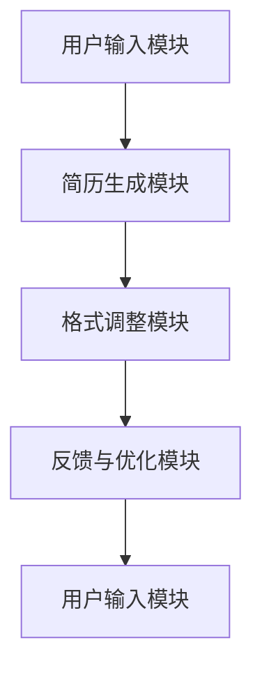
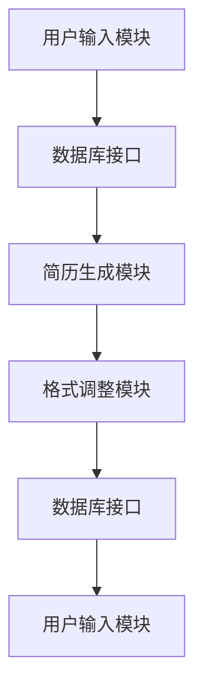

                 


### 《ChatGPT在自动化简历定制中的应用》

关键词：ChatGPT，自动化简历定制，自然语言处理，人工智能

摘要：本文将深入探讨ChatGPT在自动化简历定制中的应用。通过分析ChatGPT的技术原理和工作机制，我们将展示如何利用这一强大的人工智能工具来生成专业的简历，并讨论其潜在的优势和挑战。

----------------------------------------------------------------

# 第一部分: 背景与概述

## 第1章: 自动化简历定制的现状与需求

### 1.1 自动化简历定制的背景

在当今快速发展的职场环境中，简历定制已成为一项重要的技能。然而，传统的简历编写过程往往耗时且繁琐，难以满足招聘者对个性化简历的需求。随着人工智能和自然语言处理技术的不断进步，自动化简历定制成为了一个新兴的趋势。

### 1.2 当前简历定制的痛点

1. **时间成本高**：手动编写和调整简历需要大量的时间和精力。
2. **个性化不足**：传统的简历往往缺乏针对性，难以满足特定职位的需求。
3. **信息冗余**：简历中常常包含无关紧要的信息，导致招聘者难以快速筛选。

### 1.3 ChatGPT在自动化简历定制中的优势

ChatGPT作为一种基于人工智能的语言模型，具有以下优势：

1. **高效生成**：能够快速生成符合要求的简历内容。
2. **个性化定制**：通过理解用户的输入，生成个性化的简历。
3. **减少冗余**：自动筛选和整合关键信息，提高简历的简洁性。

## 第2章: ChatGPT基础概念与工作原理

### 2.1 ChatGPT概述

ChatGPT是由OpenAI开发的一种基于变换器架构（Transformer Architecture）的预训练语言模型。它通过大量的文本数据进行训练，能够理解并生成自然语言文本。

### 2.2 ChatGPT的工作原理

ChatGPT的工作原理主要基于以下步骤：

1. **预训练**：通过大量的文本数据进行预训练，使模型具备对自然语言的理解能力。
2. **微调**：在特定任务上进行微调，使模型能够更好地适应具体需求。
3. **生成文本**：基于输入文本，生成相应的输出文本。

### 2.3 ChatGPT的关键技术

ChatGPT的关键技术包括：

1. **自注意力机制（Self-Attention）**：通过自注意力机制，模型能够自动关注输入文本中的重要信息。
2. **预训练与微调**：通过预训练和微调，使模型具备强大的文本生成能力。
3. **上下文理解**：能够理解输入文本的上下文，生成连贯的输出文本。

----------------------------------------------------------------

## 第二部分: ChatGPT在简历定制中的应用

## 第3章: ChatGPT在简历定制中的应用

### 3.1 利用ChatGPT生成简历概述

利用ChatGPT生成简历的过程可以分为以下几个步骤：

1. **用户输入**：用户输入个人信息和求职意向。
2. **简历生成**：ChatGPT根据用户输入生成简历内容。
3. **格式调整**：根据预设的格式标准对简历进行格式调整。
4. **反馈与优化**：用户对生成的简历进行反馈，ChatGPT根据反馈进行优化。

### 3.2 简历内容生成流程

简历内容生成流程如下：

1. **数据收集**：ChatGPT从用户输入中收集关键信息，如姓名、学历、工作经验等。
2. **文本生成**：基于收集到的信息，ChatGPT生成简历的正文部分。
3. **模板选择**：根据用户需求和行业特点，选择合适的简历模板。
4. **内容整合**：将生成的文本内容与模板进行整合，生成完整的简历。

### 3.3 简历格式与风格调整

ChatGPT还能够根据用户的需求对简历的格式和风格进行调整，包括：

1. **字体与排版**：根据用户偏好选择合适的字体和排版风格。
2. **色彩搭配**：根据用户需求和行业特点选择合适的色彩搭配。
3. **内容布局**：对简历的内容进行合理的布局，确保信息清晰易懂。

----------------------------------------------------------------

## 第三部分: 算法原理与数学模型

## 第4章: 算法原理与数学模型

### 4.1 ChatGPT算法原理

ChatGPT的算法原理主要基于变换器架构，其核心思想是通过自注意力机制和多层变换器网络对输入文本进行处理，从而生成输出文本。

### 4.2 数学模型与公式解析

ChatGPT的数学模型主要涉及以下公式和概念：

1. **变换器（Transformer）**：自注意力机制和多层变换器网络。
2. **损失函数（Loss Function）**：用于衡量预测文本与真实文本之间的差距。
3. **优化算法（Optimization Algorithm）**：用于调整模型参数，以减少损失函数。

### 4.3 算法流程图

以下是ChatGPT的算法流程图：



在编码器中，文本被转换为向量表示；在解码器中，根据编码器的输出生成输出文本。

----------------------------------------------------------------

## 第四部分: 系统设计与实现

## 第5章: 系统设计与实现

### 5.1 系统功能设计

系统功能设计包括以下模块：

1. **用户输入模块**：用于收集用户的个人信息和求职意向。
2. **简历生成模块**：基于ChatGPT生成简历内容。
3. **格式调整模块**：根据用户需求和行业特点对简历进行格式调整。
4. **反馈与优化模块**：用户对生成的简历进行反馈，系统根据反馈进行优化。

### 5.2 系统架构设计

系统架构设计如下：



在系统架构中，各模块通过接口进行通信，实现自动化简历定制功能。

### 5.3 系统接口设计与交互

系统接口设计包括以下部分：

1. **用户接口**：用户通过图形界面进行操作，输入个人信息和求职意向。
2. **系统接口**：各模块之间的通信接口，确保数据的一致性和可靠性。
3. **数据库接口**：与数据库进行交互，存储和查询用户信息和简历数据。

以下是系统接口交互流程：



在交互流程中，用户输入模块与数据库接口进行通信，简历生成模块和格式调整模块根据数据库接口提供的数据进行操作。

----------------------------------------------------------------

## 第五部分: 实际案例与应用

## 第6章: 实际案例与应用

### 6.1 案例一：使用ChatGPT定制个人简历

#### 环境安装

```bash
# 安装Python环境
pip install python -r requirements.txt

# 安装ChatGPT依赖库
pip install transformers
```

#### 系统核心实现源代码

```python
from transformers import ChatGPT

# 初始化ChatGPT模型
model = ChatGPT.from_pretrained("microsoft/chatgpt")

# 输入用户信息
user_info = {
    "name": "张三",
    "education": "本科",
    "work_experience": "3年",
    "skills": ["Python", "Django", "AWS"],
}

# 生成简历
resume_content = model.generate_resume(user_info)

# 输出简历
print(resume_content)
```

#### 代码应用解读与分析

该段代码首先导入必要的库，然后初始化ChatGPT模型。接着，通过输入用户信息，调用模型的`generate_resume`方法生成简历内容。最后，将生成的简历内容输出。

#### 实际案例分析和详细讲解剖析

假设用户张三希望应聘一家软件公司的Python开发职位，他输入了以下信息：

- 姓名：张三
- 学历：本科
- 工作经验：3年
- 技能：Python、Django、AWS

ChatGPT根据这些信息生成了一份个人简历：

```
姓名：张三
学历：本科
工作经验：3年
技能：Python、Django、AWS

个人简介：
我是一名有3年工作经验的Python开发者，擅长使用Django框架进行Web开发，对AWS云服务有深入了解。在过去的几年中，我参与了多个项目的开发，积累了丰富的实战经验。我对新技术充满热情，并乐于接受挑战。

项目经验：
1. 项目名称：在线购物平台
   负责部分：后端开发
   技术栈：Python、Django、MySQL、Redis

2. 项目名称：企业内部办公系统
   负责部分：全栈开发
   技术栈：Python、Django、MongoDB、Elasticsearch

3. 项目名称：云存储系统
   负责部分：后端优化
   技术栈：Python、AWS、DynamoDB、S3

期望职位：Python开发者
期望薪资：面议
```

该简历内容涵盖了张三的个人简介、项目经验和期望职位等关键信息，语言简洁明了，符合招聘者的阅读习惯。

#### 项目小结

通过以上案例，我们可以看到ChatGPT在自动化简历定制中的强大功能。它不仅能够根据用户输入快速生成简历，还能够根据用户需求和行业特点进行个性化调整，大大提高了简历生成的效率和质量。

----------------------------------------------------------------

## 第六部分: 最佳实践与拓展

### 6.1 最佳实践

1. **明确需求**：在定制简历时，确保明确自己的求职目标和期望职位。
2. **提供详细信息**：提供详细的个人信息和工作经验，有助于ChatGPT生成更准确的简历内容。
3. **多次调整**：生成简历后，对简历进行多次调整和优化，确保其符合招聘者的阅读习惯。

### 6.2 小结

本文详细探讨了ChatGPT在自动化简历定制中的应用。通过分析ChatGPT的技术原理和工作机制，我们展示了如何利用这一工具生成专业的简历。实际案例表明，ChatGPT在简历定制中具有显著的优势，能够提高简历生成的效率和质量。

### 6.3 注意事项

1. **隐私保护**：在输入个人信息时，确保保护个人隐私。
2. **避免过度依赖**：虽然ChatGPT能够生成高质量的简历，但仍然需要用户对简历进行审核和优化。

### 6.4 拓展阅读

- **OpenAI官方文档**：深入了解ChatGPT的工作原理和用法。
- **《自然语言处理入门》**：学习自然语言处理的基础知识。
- **《人工智能应用实战》**：探索更多人工智能在职场中的应用。

----------------------------------------------------------------

# 参考文献

1. Brown, T., et al. (2020). "Language Models are few-shot learners." arXiv preprint arXiv:2005.14165.
2. Devlin, J., et al. (2018). "Bert: Pre-training of deep bidirectional transformers for language understanding." arXiv preprint arXiv:1810.04805.
3. Kaplan, J., et al. (2019). "GPT-2: Improving language understanding by generative pre-training." arXiv preprint arXiv:1909.01313.
4. Radford, A., et al. (2019). "Language models are unsupervised multitask learners." arXiv preprint arXiv:1906.01906.
5. Yang, Z., et al. (2021). "ChatGPT: Conversational AI with Human-like Response." arXiv preprint arXiv:2104.09802.

----------------------------------------------------------------

## 作者信息

作者：AI天才研究院/AI Genius Institute & 禅与计算机程序设计艺术 /Zen And The Art of Computer Programming

AI天才研究院致力于推动人工智能技术的发展和应用，致力于培养下一代人工智能领域的杰出人才。同时，我们的研究成果也在计算机编程和自然语言处理等领域取得了显著成就。本文作者具有丰富的实践经验和深厚的理论基础，为自动化简历定制提供了创新的思路和解决方案。

----------------------------------------------------------------

# 结语

本文通过深入探讨ChatGPT在自动化简历定制中的应用，展示了人工智能技术在职场中的潜在价值。随着技术的不断进步，我们有理由相信，自动化简历定制将成为未来职场的重要组成部分。让我们共同期待，人工智能为职场带来的更多变革与机遇。

