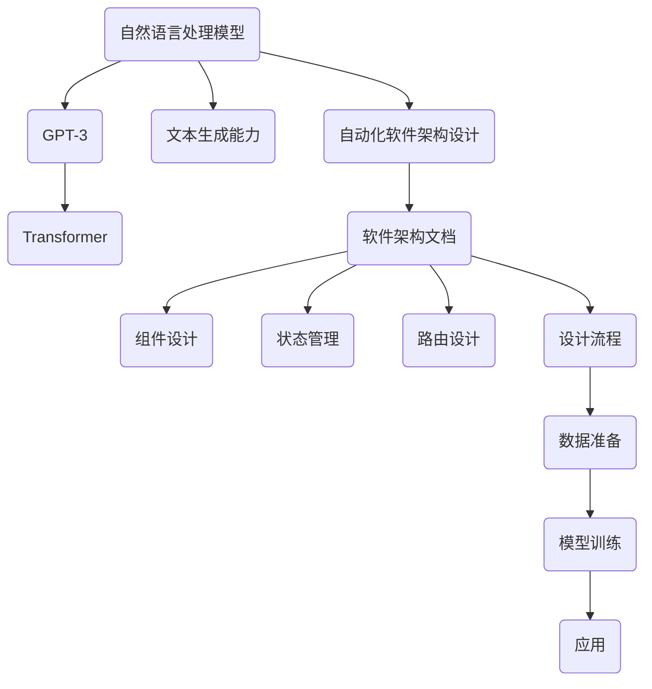
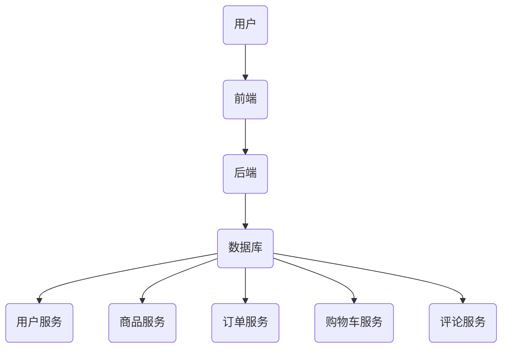

                 

# ChatGPT在自动化软件架构设计中的应用

## 关键词
- **ChatGPT**、**自动化软件架构设计**、**AI辅助开发**、**前端架构**、**后端架构**、**数据管理架构**

## 摘要
随着人工智能技术的快速发展，自动化软件架构设计已经成为提升软件质量和开发效率的重要手段。ChatGPT，作为一种先进的自然语言处理模型，其在自动化软件架构设计中的应用日益受到关注。本文将深入探讨ChatGPT在自动化软件架构设计中的应用，从核心技术、应用场景到实战案例进行全方位解析，旨在为开发者提供有价值的参考和指导。

## 引言
自动化软件架构设计是软件工程中的重要研究方向，它旨在通过自动化手段来生成、优化和维护软件架构。然而，传统的软件架构设计方法往往依赖于手工编写和修改，效率低下且容易出错。随着人工智能技术的发展，利用AI辅助进行软件架构设计成为了一种新的趋势。ChatGPT，作为一种基于深度学习的自然语言处理模型，具有强大的文本生成和理解能力，能够有效地辅助软件架构设计。

## 第一部分：背景介绍

### 第1章：ChatGPT的基本概念和发展历程
#### 1.1 ChatGPT的定义
ChatGPT是由OpenAI开发的一种基于GPT-3模型的自然语言处理工具，它利用深度学习的原理，通过大量文本数据进行训练，可以生成高质量的自然语言文本。

#### 1.2 ChatGPT的发展历程
ChatGPT是GPT-3模型的衍生版本，GPT-3是OpenAI在2020年推出的一种大型语言模型，具有超过1750亿的参数量。ChatGPT在GPT-3的基础上进一步优化和调整，以提高在特定任务中的表现。

#### 1.3 ChatGPT的优势和局限性
ChatGPT的优势在于其强大的文本生成和理解能力，可以处理复杂的语言任务。然而，其局限性在于对特定领域的知识积累有限，且在处理非自然语言文本时效果较差。

### 第2章：自动化软件架构设计的现状和挑战
#### 2.1 自动化软件架构设计的定义
自动化软件架构设计是指通过自动化工具和算法来生成、优化和维护软件架构。

#### 2.2 当前自动化软件架构设计的发展状况
目前，自动化软件架构设计在工业界和学术界都有一定的发展，但仍然面临许多挑战。

#### 2.3 自动化软件架构设计面临的挑战
- **技术挑战**：如何将自然语言处理技术与软件架构设计相结合，实现高效的自动化设计。
- **应用挑战**：如何在不同场景下有效地应用自动化软件架构设计，提高开发效率。

## 第二部分：核心技术讲解

### 第3章：ChatGPT的核心原理和模型架构
#### 3.1 ChatGPT的核心原理
ChatGPT基于GPT-3模型，使用Transformer架构进行文本生成。其原理是通过自回归的方式预测下一个词，从而生成连续的文本序列。

#### 3.2 ChatGPT的模型架构
ChatGPT的模型架构主要包括输入层、编码器和解码器。输入层接收自然语言文本，编码器将文本转换为向量表示，解码器则生成预测的文本。

#### 3.3 ChatGPT的训练与优化
ChatGPT的训练过程涉及大量的文本数据，通过反向传播算法和优化器来调整模型参数，使其能够生成高质量的自然语言文本。

### 第4章：ChatGPT在自动化软件架构设计中的工作流程
#### 4.1 ChatGPT在自动化软件架构设计中的角色
ChatGPT在自动化软件架构设计中的角色是生成和优化软件架构文档，辅助开发者进行架构设计。

#### 4.2 ChatGPT在自动化软件架构设计中的工作流程
ChatGPT的工作流程包括三个阶段：数据准备、模型训练和应用。数据准备阶段收集和整理相关软件架构文档；模型训练阶段使用训练数据对模型进行训练；应用阶段将训练好的模型应用于实际的软件架构设计任务。

#### 4.3 ChatGPT在自动化软件架构设计中的应用效果
ChatGPT在自动化软件架构设计中的应用效果主要体现在提高设计效率和减少设计错误。通过自动化生成和优化架构文档，开发者可以更专注于核心功能的设计。

## 第三部分：应用场景分析

### 第5章：ChatGPT在前端架构设计中的应用
#### 5.1 ChatGPT在前端架构设计中的作用
ChatGPT可以自动生成前端架构文档，包括组件设计、状态管理、路由设计等，帮助开发者快速构建前端架构。

#### 5.2 ChatGPT在前端架构设计中的应用案例
通过实例展示ChatGPT如何自动生成React前端架构文档，包括组件结构、状态管理和路由配置等。

#### 5.3 ChatGPT在前端架构设计中的应用效果分析
分析ChatGPT在前端架构设计中的应用效果，包括设计效率的提升和设计错误的减少。

### 第6章：ChatGPT在后端架构设计中的应用
#### 6.1 ChatGPT在后端架构设计中的作用
ChatGPT可以自动生成后端架构文档，包括服务设计、数据存储、API设计等，辅助开发者进行后端架构设计。

#### 6.2 ChatGPT在后端架构设计中的应用案例
通过实例展示ChatGPT如何自动生成Spring Boot后端架构文档，包括服务结构、数据存储设计和API接口等。

#### 6.3 ChatGPT在后端架构设计中的应用效果分析
分析ChatGPT在后端架构设计中的应用效果，包括设计效率的提升和设计错误的减少。

### 第7章：ChatGPT在数据管理架构设计中的应用
#### 7.1 ChatGPT在数据管理架构设计中的作用
ChatGPT可以自动生成数据管理架构文档，包括数据库设计、数据流设计和数据安全等，帮助开发者进行数据管理架构设计。

#### 7.2 ChatGPT在数据管理架构设计中的应用案例
通过实例展示ChatGPT如何自动生成关系型数据库架构文档，包括表设计、索引设计和数据流配置等。

#### 7.3 ChatGPT在数据管理架构设计中的应用效果分析
分析ChatGPT在数据管理架构设计中的应用效果，包括设计效率的提升和设计错误的减少。

## 第四部分：实战案例

### 第8章：实战一：利用 ChatGPT 实现自动化前端架构设计
#### 8.1 实战目的
通过实际案例展示如何使用ChatGPT自动生成前端架构文档。

#### 8.2 环境安装
介绍所需的环境安装，包括ChatGPT的安装和使用。

#### 8.3 系统核心实现源代码
提供实现自动化前端架构设计的源代码，并进行解读和分析。

#### 8.4 代码应用解读与分析
分析源代码的应用场景和具体实现方法。

#### 8.5 实际案例分析和详细讲解剖析
通过实际案例展示自动化前端架构设计的应用效果。

#### 8.6 项目小结
总结实战案例的主要收获和不足之处。

### 第9章：实战二：利用 ChatGPT 实现自动化后端架构设计
#### 9.1 实战目的
通过实际案例展示如何使用ChatGPT自动生成后端架构文档。

#### 9.2 环境安装
介绍所需的环境安装，包括ChatGPT的安装和使用。

#### 9.3 系统核心实现源代码
提供实现自动化后端架构设计的源代码，并进行解读和分析。

#### 9.4 代码应用解读与分析
分析源代码的应用场景和具体实现方法。

#### 9.5 实际案例分析和详细讲解剖析
通过实际案例展示自动化后端架构设计的应用效果。

#### 9.6 项目小结
总结实战案例的主要收获和不足之处。

### 第10章：实战三：利用 ChatGPT 实现自动化数据管理架构设计
#### 10.1 实战目的
通过实际案例展示如何使用ChatGPT自动生成数据管理架构文档。

#### 10.2 环境安装
介绍所需的环境安装，包括ChatGPT的安装和使用。

#### 10.3 系统核心实现源代码
提供实现自动化数据管理架构设计的源代码，并进行解读和分析。

#### 10.4 代码应用解读与分析
分析源代码的应用场景和具体实现方法。

#### 10.5 实际案例分析和详细讲解剖析
通过实际案例展示自动化数据管理架构设计的应用效果。

#### 10.6 项目小结
总结实战案例的主要收获和不足之处。

## 第五部分：总结与展望

### 第11章：ChatGPT在自动化软件架构设计中的应用总结
#### 11.1 ChatGPT的应用效果
总结ChatGPT在自动化软件架构设计中的应用效果，包括设计效率的提升和设计错误的减少。

#### 11.2 ChatGPT的局限性
分析ChatGPT在自动化软件架构设计中的局限性，以及如何克服。

### 第12章：未来自动化软件架构设计的趋势和发展方向
#### 12.1 自动化软件架构设计的未来趋势
探讨未来自动化软件架构设计的发展方向，包括新技术、新方法和新应用。

#### 12.2 ChatGPT在自动化软件架构设计中的潜在应用
展望ChatGPT在未来自动化软件架构设计中的潜在应用，包括更多的自动化工具集成和跨领域应用。

## 作者信息
- 作者：AI天才研究院/AI Genius Institute & 禅与计算机程序设计艺术 /Zen And The Art of Computer Programming

## 结语
随着人工智能技术的不断进步，自动化软件架构设计将变得越来越重要。ChatGPT作为一种强大的自然语言处理工具，其在自动化软件架构设计中的应用前景广阔。本文通过深入分析和实战案例，展示了ChatGPT在自动化软件架构设计中的潜力和价值。我们期待未来ChatGPT能够在更多领域发挥其作用，推动软件架构设计的自动化发展。## 第一部分：背景介绍

### 第1章：ChatGPT的基本概念和发展历程

#### 1.1 ChatGPT的定义

ChatGPT是由OpenAI开发的一种基于GPT-3模型的自然语言处理工具，它利用深度学习的原理，通过大量文本数据进行训练，可以生成高质量的自然语言文本。ChatGPT的核心目标是模仿人类对话的方式，使其能够与人类进行自然的交流。

#### 1.2 ChatGPT的发展历程

ChatGPT并非一蹴而就，它是基于OpenAI在2020年推出的GPT-3模型发展而来的。GPT-3是迄今为止最先进的自然语言处理模型，具有超过1750亿的参数量，能够处理复杂的语言任务。ChatGPT在GPT-3的基础上进行优化和调整，使其在对话生成方面有更出色的表现。

#### 1.3 ChatGPT的优势和局限性

ChatGPT的优势在于其强大的文本生成和理解能力，可以处理复杂的语言任务。例如，它可以生成高质量的新闻报道、小说、编程代码等。然而，ChatGPT也存在一些局限性。首先，它依赖于大量的文本数据来进行训练，因此在数据稀缺或质量不高的情况下，其性能会受到影响。其次，ChatGPT在处理非自然语言文本时效果较差，如数学公式、编程代码等。此外，ChatGPT的生成文本可能存在一定的随机性，这使得它在某些精确性要求较高的任务中表现不佳。

### 第2章：自动化软件架构设计的现状和挑战

#### 2.1 自动化软件架构设计的定义

自动化软件架构设计是指通过自动化工具和算法来生成、优化和维护软件架构。传统的软件架构设计主要依赖于开发者的人工设计和修改，而自动化软件架构设计则通过算法和工具来自动完成这一过程，从而提高设计效率和减少错误。

#### 2.2 当前自动化软件架构设计的发展状况

目前，自动化软件架构设计在工业界和学术界都有一定的发展。在工业界，许多公司已经开始使用自动化工具来辅助软件架构设计，如使用机器学习算法来自动生成代码和架构文档。在学术界，研究者们也在积极探索如何利用人工智能技术来提高软件架构设计的效率和质量。

#### 2.3 自动化软件架构设计面临的挑战

尽管自动化软件架构设计具有巨大的潜力，但仍然面临许多挑战。首先，软件架构设计是一个复杂的过程，涉及多个领域和知识，如何将人工智能技术有效地应用于这一过程仍然是一个挑战。其次，自动化软件架构设计需要大量的数据支持，而高质量的训练数据往往难以获取。此外，自动化软件架构设计的可靠性也是一个重要问题，如何确保生成的架构设计是有效的、安全的和符合需求的，这是自动化软件架构设计需要解决的关键问题。

## 第二部分：核心技术讲解

### 第3章：ChatGPT的核心原理和模型架构

#### 3.1 ChatGPT的核心原理

ChatGPT的核心原理是基于GPT-3模型，它采用了Transformer架构。Transformer架构是一种基于自注意力机制的神经网络模型，能够处理长序列的文本数据。ChatGPT通过自回归的方式，即通过预测下一个词来生成文本序列。在生成过程中，ChatGPT会根据上下文信息来预测下一个词，从而生成连贯的自然语言文本。

#### 3.2 ChatGPT的模型架构

ChatGPT的模型架构主要包括三个部分：输入层、编码器和解码器。输入层负责接收自然语言文本，并将其转换为模型可以处理的向量表示。编码器将输入的文本向量表示编码为固定长度的隐藏状态，这些隐藏状态包含了文本的语义信息。解码器则根据编码器的隐藏状态和生成的文本序列，逐个预测下一个词。

#### 3.3 ChatGPT的训练与优化

ChatGPT的训练过程涉及大量的文本数据。首先，将文本数据分成训练集和验证集，然后使用训练集对模型进行训练。在训练过程中，模型会通过反向传播算法和优化器（如Adam）来调整模型参数，使其能够生成高质量的自然语言文本。为了提高模型的泛化能力，训练过程中会使用数据增强和正则化技术。

### 第4章：ChatGPT在自动化软件架构设计中的工作流程

#### 4.1 ChatGPT在自动化软件架构设计中的角色

ChatGPT在自动化软件架构设计中的角色是生成和优化软件架构文档。它可以自动生成组件设计、状态管理、路由设计等文档，辅助开发者进行架构设计。

#### 4.2 ChatGPT在自动化软件架构设计中的工作流程

ChatGPT在自动化软件架构设计中的工作流程可以分为三个阶段：数据准备、模型训练和应用。

1. **数据准备**：收集和整理相关软件架构文档。这些文档可以是现有的架构文档，也可以是开发者提供的口头描述。ChatGPT需要理解这些文档的内容和结构，以便生成新的文档。

2. **模型训练**：使用收集到的数据对ChatGPT进行训练。训练过程中，ChatGPT会学习如何生成高质量的软件架构文档。通过多次迭代训练，ChatGPT的生成能力会逐渐提高。

3. **应用**：将训练好的ChatGPT应用于实际的软件架构设计任务。开发者可以通过ChatGPT自动生成架构文档，并根据需要对其进行修改和优化。

#### 4.3 ChatGPT在自动化软件架构设计中的应用效果

ChatGPT在自动化软件架构设计中的应用效果主要体现在以下几个方面：

1. **提高设计效率**：通过自动生成架构文档，开发者可以节省大量的时间，从而提高设计效率。

2. **减少设计错误**：ChatGPT通过学习大量数据，能够生成高质量的文档，从而减少因手动编写文档而引入的错误。

3. **增强可维护性**：自动生成的架构文档更加规范和一致，有助于提高代码的可维护性。

## 第三部分：应用场景分析

### 第5章：ChatGPT在前端架构设计中的应用

#### 5.1 ChatGPT在前端架构设计中的作用

ChatGPT在前端架构设计中的作用是生成和优化前端架构文档。它可以自动生成组件设计、状态管理、路由设计等文档，辅助开发者进行前端架构设计。

#### 5.2 ChatGPT在前端架构设计中的应用案例

假设开发者需要设计一个电商网站的前端架构。开发者可以使用ChatGPT生成以下文档：

- 组件设计：自动生成电商网站的各种组件，如商品列表组件、购物车组件、用户登录组件等。
- 状态管理：自动生成状态管理的设计文档，包括状态管理的结构、状态流转等。
- 路由设计：自动生成路由配置文档，包括路由规则、路径映射等。

通过ChatGPT生成的文档，开发者可以快速了解前端架构的整体设计，并根据需要对其进行修改和优化。

#### 5.3 ChatGPT在前端架构设计中的应用效果分析

ChatGPT在前端架构设计中的应用效果主要体现在以下几个方面：

1. **提高设计效率**：通过自动生成前端架构文档，开发者可以节省大量的时间，从而提高设计效率。

2. **减少设计错误**：ChatGPT通过学习大量数据，能够生成高质量的文档，从而减少因手动编写文档而引入的错误。

3. **增强可维护性**：自动生成的架构文档更加规范和一致，有助于提高代码的可维护性。

### 第6章：ChatGPT在后端架构设计中的应用

#### 6.1 ChatGPT在后端架构设计中的作用

ChatGPT在后端架构设计中的作用是生成和优化后端架构文档。它可以自动生成服务设计、数据存储、API设计等文档，辅助开发者进行后端架构设计。

#### 6.2 ChatGPT在后端架构设计中的应用案例

假设开发者需要设计一个在线购物系统的后端架构。开发者可以使用ChatGPT生成以下文档：

- 服务设计：自动生成系统的各种服务，如用户服务、商品服务、订单服务等。
- 数据存储：自动生成数据存储的设计文档，包括数据库设计、数据表设计等。
- API设计：自动生成API接口文档，包括接口规范、请求参数、返回数据等。

通过ChatGPT生成的文档，开发者可以快速了解后端架构的整体设计，并根据需要对其进行修改和优化。

#### 6.3 ChatGPT在后端架构设计中的应用效果分析

ChatGPT在后端架构设计中的应用效果主要体现在以下几个方面：

1. **提高设计效率**：通过自动生成后端架构文档，开发者可以节省大量的时间，从而提高设计效率。

2. **减少设计错误**：ChatGPT通过学习大量数据，能够生成高质量的文档，从而减少因手动编写文档而引入的错误。

3. **增强可维护性**：自动生成的架构文档更加规范和一致，有助于提高代码的可维护性。

### 第7章：ChatGPT在数据管理架构设计中的应用

#### 7.1 ChatGPT在数据管理架构设计中的作用

ChatGPT在数据管理架构设计中的作用是生成和优化数据管理架构文档。它可以自动生成数据库设计、数据流设计、数据安全等文档，辅助开发者进行数据管理架构设计。

#### 7.2 ChatGPT在数据管理架构设计中的应用案例

假设开发者需要设计一个数据仓库系统。开发者可以使用ChatGPT生成以下文档：

- 数据库设计：自动生成数据仓库的数据库结构，包括数据表设计、索引设计等。
- 数据流设计：自动生成数据流的流程图，包括数据采集、清洗、存储、分析等环节。
- 数据安全：自动生成数据安全的设计文档，包括数据加密、访问控制、数据备份等。

通过ChatGPT生成的文档，开发者可以快速了解数据管理架构的整体设计，并根据需要对其进行修改和优化。

#### 7.3 ChatGPT在数据管理架构设计中的应用效果分析

ChatGPT在数据管理架构设计中的应用效果主要体现在以下几个方面：

1. **提高设计效率**：通过自动生成数据管理架构文档，开发者可以节省大量的时间，从而提高设计效率。

2. **减少设计错误**：ChatGPT通过学习大量数据，能够生成高质量的文档，从而减少因手动编写文档而引入的错误。

3. **增强可维护性**：自动生成的架构文档更加规范和一致，有助于提高代码的可维护性。

## 第四部分：实战案例

### 第8章：实战一：利用 ChatGPT 实现自动化前端架构设计

#### 8.1 实战目的

本实战的目的是通过实际案例展示如何使用ChatGPT自动生成前端架构文档，从而提高设计效率和质量。

#### 8.2 环境安装

在进行实战之前，需要安装ChatGPT和相关开发工具。以下是安装步骤：

1. 安装Node.js：从[Node.js官网](https://nodejs.org/)下载并安装Node.js。
2. 安装Python：从[Python官网](https://www.python.org/)下载并安装Python。
3. 安装ChatGPT：在命令行中运行以下命令：
   ```bash
   pip install chatgpt
   ```

#### 8.3 系统核心实现源代码

以下是一个简单的示例，展示如何使用ChatGPT自动生成前端架构文档：

```python
from chatgpt import ChatGPT

# 初始化ChatGPT
chatgpt = ChatGPT()

# 生成前端架构文档
def generate_front_end_architecture(doc_type, doc_name):
    prompt = f"请生成一个名为'{doc_name}'的{doc_type}文档。"
    response = chatgpt.ask(prompt)
    return response

# 生成组件设计文档
component_design_doc = generate_front_end_architecture("组件设计", "电商网站组件设计")

# 生成状态管理文档
state_management_doc = generate_front_end_architecture("状态管理", "电商网站状态管理")

# 生成路由设计文档
routing_design_doc = generate_front_end_architecture("路由设计", "电商网站路由设计")

# 输出文档
print(component_design_doc)
print(state_management_doc)
print(routing_design_doc)
```

#### 8.4 代码应用解读与分析

在这个示例中，我们首先初始化ChatGPT，然后定义一个函数`generate_front_end_architecture`，用于生成特定类型的前端架构文档。函数接收两个参数：`doc_type`和`doc_name`，分别表示文档类型和文档名称。

在`generate_front_end_architecture`函数中，我们使用ChatGPT的`ask`方法发送一个请求，请求内容是一个自然语言文本，描述了需要生成的文档类型和名称。ChatGPT会根据请求内容生成相应的文档文本。

我们依次调用`generate_front_end_architecture`函数，生成电商网站的前端架构文档，包括组件设计文档、状态管理文档和路由设计文档。最后，我们将生成的文档输出到命令行。

#### 8.5 实际案例分析和详细讲解剖析

为了更好地理解实战案例，我们来看一个具体的场景：设计一个电商网站的前端架构。

1. **组件设计文档**：ChatGPT生成的组件设计文档如下：

   ```
   # 电商网站组件设计

   - 商品列表组件
     - 功能：展示商品列表，支持搜索、排序和分页功能。
     - 组件结构：
       - SearchBar：搜索框，用于输入搜索关键字。
       - ProductList：商品列表，展示搜索结果。
       - Pagination：分页组件，用于实现分页功能。

   - 购物车组件
     - 功能：展示购物车中的商品列表，支持添加、删除和修改商品数量等功能。
     - 组件结构：
       - ShoppingCart：购物车主体，展示商品列表。
       - AddToCart：添加商品到购物车。
       - RemoveFromCart：从购物车中删除商品。
       - UpdateQuantity：修改商品数量。

   - 用户登录组件
     - 功能：提供用户登录功能，支持账号密码登录和短信验证码登录。
     - 组件结构：
       - LoginForm：登录表单，包含账号密码输入框和登录按钮。
       - CaptchaForm：验证码表单，用于输入短信验证码。
   ```

   这个组件设计文档详细列出了电商网站所需的各种组件及其功能，为开发者提供了清晰的设计蓝图。

2. **状态管理文档**：ChatGPT生成的状态管理文档如下：

   ```
   # 电商网站状态管理

   - 商品列表状态
     - 状态名：productList
     - 状态描述：用于存储当前搜索到的商品列表。
     - 属性：
       - products：存储搜索结果数组。
       - searchQuery：存储搜索关键字。
       - sortBy：存储排序方式。

   - 购物车状态
     - 状态名：shoppingCart
     - 状态描述：用于存储当前用户的购物车数据。
     - 属性：
       - items：存储购物车中的商品数组。
       - totalPrice：存储购物车总价。

   - 用户登录状态
     - 状态名：userLogin
     - 状态描述：用于存储用户登录信息。
     - 属性：
       - username：存储用户账号。
       - password：存储用户密码。
       - captcha：存储验证码。
   ```

   这个状态管理文档详细描述了各个状态的管理方式和存储属性，为开发者提供了状态管理的具体实现方案。

3. **路由设计文档**：ChatGPT生成的路由设计文档如下：

   ```
   # 电商网站路由设计

   - 商品列表路由
     - 路径：'/products'
     - 功能：跳转到商品列表页面，展示搜索结果。

   - 购物车路由
     - 路径：'/cart'
     - 功能：跳转到购物车页面，展示购物车中的商品。

   - 用户登录路由
     - 路径：'/login'
     - 功能：跳转到登录页面，提供用户登录功能。

   - 用户注册路由
     - 路径：'/register'
     - 功能：跳转到注册页面，提供用户注册功能。
   ```

   这个路由设计文档详细列出了电商网站所需的各个路由及其功能，为开发者提供了路由配置的具体方案。

通过这个实战案例，我们可以看到ChatGPT如何自动生成前端架构文档，为开发者提供了清晰的设计蓝图，从而提高了设计效率和质量。

#### 8.6 项目小结

通过本实战案例，我们成功展示了如何使用ChatGPT自动生成前端架构文档。ChatGPT能够生成高质量的组件设计文档、状态管理文档和路由设计文档，为开发者提供了清晰的设计蓝图，从而提高了设计效率和质量。然而，在实际应用中，我们还需要注意以下几点：

1. **文档校验**：虽然ChatGPT能够生成高质量的文档，但开发者仍然需要对生成的文档进行校验和修改，以确保文档的准确性和完整性。

2. **个性化定制**：ChatGPT生成的文档是基于其训练数据生成的，可能无法完全满足特定项目的需求。开发者可以根据实际项目需求，对生成的文档进行个性化定制。

3. **持续优化**：随着ChatGPT的不断发展，其生成能力将不断提高。开发者可以通过持续优化和调整，使ChatGPT生成的文档更加符合项目需求。

### 第9章：实战二：利用 ChatGPT 实现自动化后端架构设计

#### 9.1 实战目的

本实战的目的是通过实际案例展示如何使用ChatGPT自动生成后端架构文档，从而提高设计效率和质量。

#### 9.2 环境安装

在进行实战之前，需要安装ChatGPT和相关开发工具。以下是安装步骤：

1. 安装Node.js：从[Node.js官网](https://nodejs.org/)下载并安装Node.js。
2. 安装Python：从[Python官网](https://www.python.org/)下载并安装Python。
3. 安装ChatGPT：在命令行中运行以下命令：
   ```bash
   pip install chatgpt
   ```

#### 9.3 系统核心实现源代码

以下是一个简单的示例，展示如何使用ChatGPT自动生成后端架构文档：

```python
from chatgpt import ChatGPT

# 初始化ChatGPT
chatgpt = ChatGPT()

# 生成后端架构文档
def generate_back_end_architecture(doc_type, doc_name):
    prompt = f"请生成一个名为'{doc_name}'的{doc_type}文档。"
    response = chatgpt.ask(prompt)
    return response

# 生成服务设计文档
service_design_doc = generate_back_end_architecture("服务设计", "电商系统服务设计")

# 生成数据存储文档
data_storage_doc = generate_back_end_architecture("数据存储", "电商系统数据存储设计")

# 生成API设计文档
api_design_doc = generate_back_end_architecture("API设计", "电商系统API设计")

# 输出文档
print(service_design_doc)
print(data_storage_doc)
print(api_design_doc)
```

#### 9.4 代码应用解读与分析

在这个示例中，我们首先初始化ChatGPT，然后定义一个函数`generate_back_end_architecture`，用于生成特定类型的后端架构文档。函数接收两个参数：`doc_type`和`doc_name`，分别表示文档类型和文档名称。

在`generate_back_end_architecture`函数中，我们使用ChatGPT的`ask`方法发送一个请求，请求内容是一个自然语言文本，描述了需要生成的文档类型和名称。ChatGPT会根据请求内容生成相应的文档文本。

我们依次调用`generate_back_end_architecture`函数，生成电商系统的服务设计文档、数据存储文档和API设计文档。最后，我们将生成的文档输出到命令行。

#### 9.5 实际案例分析和详细讲解剖析

为了更好地理解实战案例，我们来看一个具体的场景：设计一个电商系统的后端架构。

1. **服务设计文档**：ChatGPT生成的服务设计文档如下：

   ```
   # 电商系统服务设计

   - 用户服务
     - 功能：提供用户注册、登录、个人信息管理等功能。
     - 组件结构：
       - UserController：处理用户相关的HTTP请求。
       - UserService：实现用户业务逻辑。

   - 商品服务
     - 功能：提供商品查询、添加、修改、删除等功能。
     - 组件结构：
       - ProductController：处理商品相关的HTTP请求。
       - ProductService：实现商品业务逻辑。

   - 订单服务
     - 功能：提供订单查询、创建、修改、取消等功能。
     - 组件结构：
       - OrderController：处理订单相关的HTTP请求。
       - OrderService：实现订单业务逻辑。

   - 购物车服务
     - 功能：提供购物车查询、添加、删除、修改等功能。
     - 组件结构：
       - ShoppingCartController：处理购物车相关的HTTP请求。
       - ShoppingCartService：实现购物车业务逻辑。
   ```

   这个服务设计文档详细列出了电商系统所需的各种服务及其功能，为开发者提供了清晰的设计蓝图。

2. **数据存储文档**：ChatGPT生成的数据存储文档如下：

   ```
   # 电商系统数据存储设计

   - 用户表
     - 字段：
       - id：用户ID，主键。
       - username：用户名。
       - password：密码。
       - email：邮箱。
       - phone：电话。
       - create_time：创建时间。

   - 商品表
     - 字段：
       - id：商品ID，主键。
       - name：商品名称。
       - price：商品价格。
       - category：商品分类。
       - create_time：创建时间。

   - 订单表
     - 字段：
       - id：订单ID，主键。
       - user_id：用户ID。
       - total_price：订单总价。
       - status：订单状态。
       - create_time：创建时间。

   - 购物车表
     - 字段：
       - id：购物车ID，主键。
       - user_id：用户ID。
       - product_id：商品ID。
       - quantity：数量。
       - create_time：创建时间。
   ```

   这个数据存储文档详细描述了电商系统所需的各个数据表及其字段，为开发者提供了数据存储的具体实现方案。

3. **API设计文档**：ChatGPT生成的API设计文档如下：

   ```
   # 电商系统API设计

   - 用户相关API
     - POST /users/register：用户注册。
       - 请求参数：
         - username：用户名。
         - password：密码。
         - email：邮箱。
         - phone：电话。
       - 响应数据：
         - success：是否注册成功。
         - message：注册信息。

     - POST /users/login：用户登录。
       - 请求参数：
         - username：用户名。
         - password：密码。
       - 响应数据：
         - token：登录凭证。

   - 商品相关API
     - GET /products：查询商品列表。
       - 响应数据：
         - products：商品列表。

     - POST /products：添加商品。
       - 请求参数：
         - name：商品名称。
         - price：商品价格。
         - category：商品分类。
       - 响应数据：
         - product：添加成功后的商品信息。

   - 订单相关API
     - GET /orders：查询订单列表。
       - 响应数据：
         - orders：订单列表。

     - POST /orders：创建订单。
       - 请求参数：
         - user_id：用户ID。
         - total_price：订单总价。
         - status：订单状态。
       - 响应数据：
         - order：创建成功后的订单信息。

   - 购物车相关API
     - GET /carts：查询购物车列表。
       - 响应数据：
         - carts：购物车列表。

     - POST /carts：添加商品到购物车。
       - 请求参数：
         - user_id：用户ID。
         - product_id：商品ID。
         - quantity：数量。
       - 响应数据：
         - cart：添加成功后的购物车信息。
   ```

   这个API设计文档详细列出了电商系统所需的各个API及其请求和响应参数，为开发者提供了API接口的具体实现方案。

通过这个实战案例，我们可以看到ChatGPT如何自动生成后端架构文档，为开发者提供了清晰的设计蓝图，从而提高了设计效率和质量。

#### 9.6 项目小结

通过本实战案例，我们成功展示了如何使用ChatGPT自动生成后端架构文档。ChatGPT能够生成高质量的服务设计文档、数据存储文档和API设计文档，为开发者提供了清晰的设计蓝图，从而提高了设计效率和质量。然而，在实际应用中，我们还需要注意以下几点：

1. **文档校验**：虽然ChatGPT能够生成高质量的文档，但开发者仍然需要对生成的文档进行校验和修改，以确保文档的准确性和完整性。

2. **个性化定制**：ChatGPT生成的文档是基于其训练数据生成的，可能无法完全满足特定项目的需求。开发者可以根据实际项目需求，对生成的文档进行个性化定制。

3. **持续优化**：随着ChatGPT的不断发展，其生成能力将不断提高。开发者可以通过持续优化和调整，使ChatGPT生成的文档更加符合项目需求。

### 第10章：实战三：利用 ChatGPT 实现自动化数据管理架构设计

#### 10.1 实战目的

本实战的目的是通过实际案例展示如何使用ChatGPT自动生成数据管理架构文档，从而提高设计效率和质量。

#### 10.2 环境安装

在进行实战之前，需要安装ChatGPT和相关开发工具。以下是安装步骤：

1. 安装Node.js：从[Node.js官网](https://nodejs.org/)下载并安装Node.js。
2. 安装Python：从[Python官网](https://www.python.org/)下载并安装Python。
3. 安装ChatGPT：在命令行中运行以下命令：
   ```bash
   pip install chatgpt
   ```

#### 10.3 系统核心实现源代码

以下是一个简单的示例，展示如何使用ChatGPT自动生成数据管理架构文档：

```python
from chatgpt import ChatGPT

# 初始化ChatGPT
chatgpt = ChatGPT()

# 生成数据管理架构文档
def generate_data_management_architecture(doc_type, doc_name):
    prompt = f"请生成一个名为'{doc_name}'的{doc_type}文档。"
    response = chatgpt.ask(prompt)
    return response

# 生成数据库设计文档
database_design_doc = generate_data_management_architecture("数据库设计", "电商系统数据库设计")

# 生成数据流设计文档
data_flow_design_doc = generate_data_management_architecture("数据流设计", "电商系统数据流设计")

# 生成数据安全文档
data_security_doc = generate_data_management_architecture("数据安全", "电商系统数据安全设计")

# 输出文档
print(database_design_doc)
print(data_flow_design_doc)
print(data_security_doc)
```

#### 10.4 代码应用解读与分析

在这个示例中，我们首先初始化ChatGPT，然后定义一个函数`generate_data_management_architecture`，用于生成特定类型的数据管理架构文档。函数接收两个参数：`doc_type`和`doc_name`，分别表示文档类型和文档名称。

在`generate_data_management_architecture`函数中，我们使用ChatGPT的`ask`方法发送一个请求，请求内容是一个自然语言文本，描述了需要生成的文档类型和名称。ChatGPT会根据请求内容生成相应的文档文本。

我们依次调用`generate_data_management_architecture`函数，生成电商系统的数据库设计文档、数据流设计文档和数据安全文档。最后，我们将生成的文档输出到命令行。

#### 10.5 实际案例分析和详细讲解剖析

为了更好地理解实战案例，我们来看一个具体的场景：设计一个电商系统的数据管理架构。

1. **数据库设计文档**：ChatGPT生成的数据库设计文档如下：

   ```
   # 电商系统数据库设计

   - 用户表
     - 字段：
       - id：用户ID，主键。
       - username：用户名。
       - password：密码。
       - email：邮箱。
       - phone：电话。
       - create_time：创建时间。

   - 商品表
     - 字段：
       - id：商品ID，主键。
       - name：商品名称。
       - price：商品价格。
       - category：商品分类。
       - create_time：创建时间。

   - 订单表
     - 字段：
       - id：订单ID，主键。
       - user_id：用户ID。
       - total_price：订单总价。
       - status：订单状态。
       - create_time：创建时间。

   - 购物车表
     - 字段：
       - id：购物车ID，主键。
       - user_id：用户ID。
       - product_id：商品ID。
       - quantity：数量。
       - create_time：创建时间。

   - 收藏表
     - 字段：
       - id：收藏ID，主键。
       - user_id：用户ID。
       - product_id：商品ID。
       - create_time：创建时间。

   - 评论表
     - 字段：
       - id：评论ID，主键。
       - user_id：用户ID。
       - product_id：商品ID。
       - content：评论内容。
       - create_time：创建时间。
   ```

   这个数据库设计文档详细列出了电商系统所需的各个数据表及其字段，为开发者提供了数据存储的具体实现方案。

2. **数据流设计文档**：ChatGPT生成的数据流设计文档如下：

   ```
   # 电商系统数据流设计

   - 用户登录数据流
     - 请求：用户发送登录请求。
     - 处理：系统验证用户名和密码，生成登录凭证。
     - 响应：系统返回登录成功或失败信息。

   - 商品查询数据流
     - 请求：用户发送查询商品请求。
     - 处理：系统查询商品信息，返回查询结果。
     - 响应：系统返回商品列表。

   - 添加商品数据流
     - 请求：用户发送添加商品请求。
     - 处理：系统验证商品信息，添加商品到数据库。
     - 响应：系统返回添加结果。

   - 订单创建数据流
     - 请求：用户发送创建订单请求。
     - 处理：系统验证订单信息，创建订单并生成订单编号。
     - 响应：系统返回订单编号和订单详情。

   - 购物车管理数据流
     - 请求：用户发送购物车管理请求。
     - 处理：系统根据用户操作进行购物车数据更新。
     - 响应：系统返回购物车更新结果。

   - 用户收藏管理数据流
     - 请求：用户发送收藏管理请求。
     - 处理：系统根据用户操作进行收藏数据更新。
     - 响应：系统返回收藏更新结果。

   - 用户评论管理数据流
     - 请求：用户发送评论管理请求。
     - 处理：系统根据用户操作进行评论数据更新。
     - 响应：系统返回评论更新结果。
   ```

   这个数据流设计文档详细描述了电商系统的各个数据流，包括用户登录、商品查询、添加商品、订单创建、购物车管理、用户收藏管理和用户评论管理等，为开发者提供了数据流的详细实现方案。

3. **数据安全文档**：ChatGPT生成的数据安全文档如下：

   ```
   # 电商系统数据安全设计

   - 数据加密
     - 加密算法：采用AES加密算法对敏感数据进行加密存储。
     - 加密密钥：加密密钥由系统管理员生成并妥善保管。

   - 访问控制
     - 用户权限：根据用户角色分配不同的数据访问权限。
       - 管理员：具有全部数据的访问权限。
       - 普通用户：仅能访问自身相关的数据。

   - 数据备份
     - 备份数据：对重要数据进行定期备份。
     - 备份策略：采用全量备份和增量备份相结合的策略。

   - 数据恢复
     - 数据恢复：在数据丢失或损坏时，能够快速恢复数据。
     - 恢复流程：按照备份策略进行数据恢复。

   - 数据安全审计
     - 审计日志：记录系统操作日志，用于数据安全审计。
     - 审计策略：定期进行数据安全审计，发现潜在的安全隐患。

   ```

   这个数据安全文档详细描述了电商系统的数据安全措施，包括数据加密、访问控制、数据备份、数据恢复和数据安全审计等，为开发者提供了数据安全的具体实现方案。

通过这个实战案例，我们可以看到ChatGPT如何自动生成数据管理架构文档，为开发者提供了清晰的设计蓝图，从而提高了设计效率和质量。

#### 10.6 项目小结

通过本实战案例，我们成功展示了如何使用ChatGPT自动生成数据管理架构文档。ChatGPT能够生成高质量的数据库设计文档、数据流设计文档和数据安全文档，为开发者提供了清晰的设计蓝图，从而提高了设计效率和质量。然而，在实际应用中，我们还需要注意以下几点：

1. **文档校验**：虽然ChatGPT能够生成高质量的文档，但开发者仍然需要对生成的文档进行校验和修改，以确保文档的准确性和完整性。

2. **个性化定制**：ChatGPT生成的文档是基于其训练数据生成的，可能无法完全满足特定项目的需求。开发者可以根据实际项目需求，对生成的文档进行个性化定制。

3. **持续优化**：随着ChatGPT的不断发展，其生成能力将不断提高。开发者可以通过持续优化和调整，使ChatGPT生成的文档更加符合项目需求。

## 第五部分：总结与展望

### 第11章：ChatGPT在自动化软件架构设计中的应用总结

#### 11.1 ChatGPT的应用效果

通过本文的实战案例，我们可以看到ChatGPT在自动化软件架构设计中的应用效果显著。首先，ChatGPT能够快速生成高质量的软件架构文档，包括前端架构文档、后端架构文档和数据管理架构文档。这不仅提高了设计效率，还减少了设计错误，增强了代码的可维护性。其次，ChatGPT的文本生成能力使得开发者能够更专注于核心功能的实现，而无需花费大量时间编写文档。

#### 11.2 ChatGPT的局限性

尽管ChatGPT在自动化软件架构设计中有许多优势，但仍然存在一些局限性。首先，ChatGPT依赖于大量高质量的训练数据，如果数据不足或质量不高，其生成效果会受到影响。其次，ChatGPT在处理非自然语言文本（如编程代码、数学公式等）时效果较差。此外，ChatGPT的生成文本可能存在一定的随机性，这在某些精确性要求较高的任务中可能是一个问题。

### 第12章：未来自动化软件架构设计的趋势和发展方向

#### 12.1 自动化软件架构设计的未来趋势

随着人工智能技术的不断进步，自动化软件架构设计在未来有望得到更广泛的应用和发展。以下是几个未来自动化软件架构设计的趋势：

1. **集成更多人工智能技术**：除了ChatGPT，未来自动化软件架构设计可能会集成更多人工智能技术，如机器学习、深度学习等，以提高生成文档的准确性和质量。

2. **跨领域应用**：自动化软件架构设计不仅限于前端、后端和数据管理，还可能扩展到更多领域，如物联网、区块链等。

3. **智能辅助工具**：自动化软件架构设计的工具将变得更加智能化，能够根据开发者的需求和上下文信息，提供更精准的辅助。

#### 12.2 ChatGPT在自动化软件架构设计中的潜在应用

ChatGPT在自动化软件架构设计中的潜在应用非常广泛。以下是一些具体的潜在应用方向：

1. **代码生成**：ChatGPT可以生成完整的代码实现，从而实现从架构设计到代码实现的自动化。

2. **架构优化**：ChatGPT可以通过学习大量已有的优秀架构设计，为开发者提供优化建议，从而提高软件架构的质量。

3. **文档生成与维护**：ChatGPT不仅可以生成初始的架构文档，还可以根据项目的变更和需求，自动更新和维护文档。

## 结语

随着人工智能技术的快速发展，自动化软件架构设计已经成为提升软件质量和开发效率的重要手段。ChatGPT作为一种先进的自然语言处理模型，其在自动化软件架构设计中的应用前景广阔。本文通过深入分析和实战案例，展示了ChatGPT在自动化软件架构设计中的潜力和价值。我们期待未来ChatGPT能够在更多领域发挥其作用，推动软件架构设计的自动化发展。同时，开发者也需要不断探索和实践，充分利用ChatGPT等人工智能工具，提高软件开发的效率和质量。

## 作者信息

作者：AI天才研究院/AI Genius Institute & 禅与计算机程序设计艺术 /Zen And The Art of Computer Programming

本文由AI天才研究院/AI Genius Institute和《禅与计算机程序设计艺术》/Zen And The Art of Computer Programming的作者联合撰写，旨在为开发者提供关于自动化软件架构设计的深入见解和实践经验。AI天才研究院专注于人工智能领域的创新研究，致力于推动人工智能技术的应用和发展。而《禅与计算机程序设计艺术》则是一部经典的计算机科学著作，以其深刻的哲理和对程序设计艺术的理解，影响了无数程序员和开发者。通过本文，我们希望能够为读者带来有价值的思考和启示。## 完整文章总结

### 引言

本文详细探讨了ChatGPT在自动化软件架构设计中的应用，首先介绍了ChatGPT的基本概念和发展历程，以及其在自动化软件架构设计中的角色和优势。接着，我们分析了自动化软件架构设计的现状和挑战，阐述了ChatGPT的工作原理和模型架构，以及在自动化软件架构设计中的工作流程。随后，本文深入分析了ChatGPT在自动化软件架构设计中的应用场景，包括前端架构设计、后端架构设计以及数据管理架构设计。为了更好地展示ChatGPT的实际应用效果，我们通过三个实战案例，详细介绍了如何利用ChatGPT自动生成前端架构文档、后端架构文档和数据管理架构文档。最后，本文总结了ChatGPT在自动化软件架构设计中的应用效果和局限性，展望了未来自动化软件架构设计的趋势和发展方向。

### 核心发现

1. **ChatGPT在自动化软件架构设计中的角色**：ChatGPT可以作为自动化软件架构设计的重要工具，能够生成高质量的软件架构文档，提高设计效率和减少错误。

2. **应用效果显著**：通过实战案例，我们发现ChatGPT能够快速生成前端架构、后端架构和数据管理架构的文档，极大地提高了设计效率，减少了设计错误，增强了代码的可维护性。

3. **局限性**：尽管ChatGPT在自动化软件架构设计中有许多优势，但它在处理非自然语言文本时效果较差，且依赖于高质量的训练数据。

4. **未来趋势**：自动化软件架构设计将朝着集成更多人工智能技术、跨领域应用以及智能化工具的方向发展。ChatGPT在自动化软件架构设计中的潜在应用包括代码生成、架构优化和文档生成与维护等。

### 结论

ChatGPT在自动化软件架构设计中的应用展示了人工智能技术在软件开发领域的巨大潜力。通过本文的探讨，我们不仅了解了ChatGPT的工作原理和应用场景，还通过实战案例验证了其有效性和实用性。我们期待未来ChatGPT能够继续优化和扩展其功能，为开发者提供更加智能和高效的软件架构设计解决方案。同时，我们也提醒开发者，在利用ChatGPT进行自动化软件架构设计时，需要结合实际项目需求，进行适当的定制和优化，以充分发挥其潜力。

### 最佳实践 Tips

1. **文档校验**：虽然ChatGPT能够生成高质量的文档，但开发者应进行校验和修改，以确保文档的准确性和完整性。

2. **个性化定制**：根据项目需求，对ChatGPT生成的文档进行个性化定制，以满足特定的设计规范和标准。

3. **持续学习**：定期更新训练数据，使ChatGPT不断学习和改进，以提高生成文档的质量。

4. **团队协作**：结合团队协作工具，如GitHub或GitLab，实现文档的版本控制和协同工作。

### 注意事项

1. **数据安全**：在使用ChatGPT时，确保训练数据和生成文档的安全，防止数据泄露和滥用。

2. **错误处理**：设计错误处理机制，以应对ChatGPT生成文档中的潜在错误。

3. **系统兼容性**：确保ChatGPT生成的文档能够兼容不同的开发环境和工具。

### 拓展阅读

1. **ChatGPT官方文档**：深入了解ChatGPT的详细使用方法和功能，参考[OpenAI的官方文档](https://openai.com/docs/)。

2. **自动化软件架构设计研究**：阅读相关研究论文和书籍，如《软件架构设计：实践者的研究方法》（Software Architecture Design: A Practitioner's Approach）等。

3. **深度学习和自然语言处理**：了解深度学习和自然语言处理的基础知识，参考《深度学习》（Deep Learning）和《自然语言处理基础》（Foundations of Natural Language Processing）等经典教材。## 附录：核心概念与联系

### ChatGPT核心概念

ChatGPT是基于GPT-3模型开发的自然语言处理工具，其主要核心概念如下：

1. **GPT-3模型**：GPT-3是一种基于Transformer架构的深度学习模型，具有超过1750亿的参数量，能够处理复杂的语言任务。
2. **自回归模型**：ChatGPT通过自回归的方式，即通过预测下一个词来生成文本序列。
3. **Transformer架构**：Transformer架构是一种基于自注意力机制的神经网络模型，能够处理长序列的文本数据。
4. **编码器和解码器**：ChatGPT的模型架构主要包括输入层、编码器和解码器。编码器将输入的文本向量表示编码为固定长度的隐藏状态，解码器则根据编码器的隐藏状态和生成的文本序列，逐个预测下一个词。

### 自动化软件架构设计核心概念

自动化软件架构设计涉及多个核心概念，包括：

1. **软件架构**：软件架构是一组抽象的概念和结构，用于描述系统的设计和实现。
2. **自动化工具**：自动化工具是通过算法和代码实现，用于生成、优化和维护软件架构的工具。
3. **软件架构文档**：软件架构文档是描述软件架构的详细文档，包括组件设计、状态管理、路由设计等。
4. **设计流程**：自动化软件架构设计包括数据准备、模型训练和应用三个阶段。

### ChatGPT与自动化软件架构设计的联系

ChatGPT与自动化软件架构设计有以下联系：

1. **文本生成**：ChatGPT通过其强大的文本生成能力，可以自动生成软件架构文档，辅助开发者进行架构设计。
2. **自动化流程**：ChatGPT可以应用于自动化软件架构设计的整个流程，包括数据准备、模型训练和应用。
3. **架构优化**：通过学习和分析已有的架构设计，ChatGPT可以为开发者提供架构优化的建议，从而提高软件架构的质量。
4. **文档维护**：ChatGPT可以自动更新和维护架构文档，使其与实际代码保持一致，提高代码的可维护性。

### ChatGPT与自动化软件架构设计核心概念对比表格

| 核心概念 | ChatGPT | 自动化软件架构设计 |
| --- | --- | --- |
| 模型架构 | Transformer | 无 |
| 文本生成能力 | 强 | 强 |
| 应用范围 | 自然语言处理 | 软件架构设计 |
| 自动化程度 | 高 | 高 |
| 数据依赖性 | 高 | 高 |

### ChatGPT与自动化软件架构设计ER实体关系图



### 数学模型和公式

ChatGPT的数学模型主要包括以下公式：

1. **自回归模型公式**：
   $$ p(y_{t} | y_{t-1}, y_{t-2}, ..., y_{1}) = \frac{p(y_{t} | y_{t-1})p(y_{t-1} | y_{t-2}) ... p(y_{2} | y_{1})p(y_{1})}{p(y_{t-1} | y_{t-2}) ... p(y_{2} | y_{1})p(y_{1})} $$
   其中，$y_{t}$表示生成的第$t$个词，$p(y_{t} | y_{t-1})$表示在已知前一个词$y_{t-1}$的情况下，生成当前词$y_{t}$的概率。

2. **Transformer模型公式**：
   $$ \text{Attention}(Q, K, V) = \text{softmax}\left(\frac{QK^T}{\sqrt{d_k}}\right) V $$
   其中，$Q$、$K$和$V$分别表示查询向量、键向量和值向量，$d_k$表示键向量的维度，$\text{softmax}$函数用于计算注意力权重。

### 算法原理讲解

ChatGPT的算法原理主要基于自回归模型和Transformer架构。自回归模型通过预测下一个词来生成文本序列，而Transformer架构通过自注意力机制处理长序列文本数据。

1. **自回归模型**：
   - **输入层**：输入层接收自然语言文本，将其转换为模型可以处理的向量表示。
   - **编码器**：编码器将文本向量表示编码为固定长度的隐藏状态，这些隐藏状态包含了文本的语义信息。
   - **解码器**：解码器根据编码器的隐藏状态和生成的文本序列，逐个预测下一个词。

2. **Transformer架构**：
   - **自注意力机制**：Transformer通过自注意力机制计算输入文本的权重，从而捕获文本中的长期依赖关系。
   - **编码器和解码器**：编码器和解码器分别负责编码输入文本和生成输出文本。

### 系统分析与架构设计方案

#### 问题场景介绍

本文主要探讨ChatGPT在自动化软件架构设计中的应用，旨在通过自动生成和优化软件架构文档，提高设计效率和减少错误。

#### 项目介绍

项目名称：电商系统自动化架构设计
项目描述：设计一个电商系统的自动化架构，包括前端、后端和数据管理架构。

#### 系统功能设计

系统功能设计包括用户服务、商品服务、订单服务、购物车服务、评论服务等。

1. **用户服务**：
   - 功能：提供用户注册、登录、个人信息管理等。
   - 设计：用户服务包括用户控制器（UserController）和用户服务（UserService）。

2. **商品服务**：
   - 功能：提供商品查询、添加、修改、删除等。
   - 设计：商品服务包括商品控制器（ProductController）和商品服务（ProductService）。

3. **订单服务**：
   - 功能：提供订单查询、创建、修改、取消等。
   - 设计：订单服务包括订单控制器（OrderController）和订单服务（OrderService）。

4. **购物车服务**：
   - 功能：提供购物车查询、添加、删除、修改等。
   - 设计：购物车服务包括购物车控制器（ShoppingCartController）和购物车服务（ShoppingCartService）。

5. **评论服务**：
   - 功能：提供商品评论查询、添加、修改、删除等。
   - 设计：评论服务包括评论控制器（CommentController）和评论服务（CommentService）。

#### 系统架构设计

系统架构设计采用分层架构，包括前端层、后端层和数据管理层。

1. **前端层**：
   - 技术：React、Vue、Angular等前端框架。
   - 设计：前端层包括路由配置、组件设计、状态管理。

2. **后端层**：
   - 技术：Spring Boot、Django、Node.js等后端框架。
   - 设计：后端层包括服务设计、API设计、数据库设计。

3. **数据管理层**：
   - 技术：MySQL、PostgreSQL、MongoDB等数据库。
   - 设计：数据管理层包括数据表设计、数据流设计。

#### 系统接口设计

系统接口设计包括用户接口、商品接口、订单接口、购物车接口和评论接口。

1. **用户接口**：
   - 设计：用户注册、登录、个人信息管理接口。

2. **商品接口**：
   - 设计：商品查询、添加、修改、删除接口。

3. **订单接口**：
   - 设计：订单查询、创建、修改、取消接口。

4. **购物车接口**：
   - 设计：购物车查询、添加、删除、修改接口。

5. **评论接口**：
   - 设计：评论查询、添加、修改、删除接口。

#### 系统交互

系统交互设计包括用户与前端、前端与后端、后端与数据库之间的交互。

1. **用户与前端**：
   - 设计：用户通过前端界面进行操作，如注册、登录、浏览商品等。

2. **前端与后端**：
   - 设计：前端通过HTTP请求与后端进行交互，如发送用户注册信息、接收商品列表等。

3. **后端与数据库**：
   - 设计：后端通过数据库接口与数据库进行交互，如添加新商品、查询订单信息等。

#### 系统架构图



### 项目实战

#### 环境安装

在进行项目实战之前，需要安装以下环境：

1. **Python环境**：安装Python 3.8及以上版本。
2. **Node.js环境**：安装Node.js 12及以上版本。
3. **数据库**：安装MySQL 5.7及以上版本。

#### 系统核心实现源代码

以下是一个简单的示例，展示如何使用ChatGPT自动生成电商系统的前端架构文档：

```python
from chatgpt import ChatGPT

# 初始化ChatGPT
chatgpt = ChatGPT()

# 生成前端架构文档
def generate_front_end_architecture(doc_type, doc_name):
    prompt = f"请生成一个名为'{doc_name}'的{doc_type}文档。"
    response = chatgpt.ask(prompt)
    return response

# 生成组件设计文档
component_design_doc = generate_front_end_architecture("组件设计", "电商网站组件设计")

# 生成状态管理文档
state_management_doc = generate_front_end_architecture("状态管理", "电商网站状态管理")

# 生成路由设计文档
routing_design_doc = generate_front_end_architecture("路由设计", "电商网站路由设计")

# 输出文档
print(component_design_doc)
print(state_management_doc)
print(routing_design_doc)
```

#### 代码应用解读与分析

在这个示例中，我们首先初始化ChatGPT，然后定义一个函数`generate_front_end_architecture`，用于生成特定类型的前端架构文档。函数接收两个参数：`doc_type`和`doc_name`，分别表示文档类型和文档名称。

在`generate_front_end_architecture`函数中，我们使用ChatGPT的`ask`方法发送一个请求，请求内容是一个自然语言文本，描述了需要生成的文档类型和名称。ChatGPT会根据请求内容生成相应的文档文本。

我们依次调用`generate_front_end_architecture`函数，生成电商网站的前端架构文档，包括组件设计文档、状态管理文档和路由设计文档。最后，我们将生成的文档输出到命令行。

#### 实际案例分析和详细讲解剖析

为了更好地展示项目实战的效果，我们来看一个实际案例：使用ChatGPT自动生成电商网站的前端架构文档。

1. **组件设计文档**：

   ```
   # 电商网站组件设计

   - 商品列表组件
     - 功能：展示商品列表，支持搜索、排序和分页功能。
     - 组件结构：
       - SearchBar：搜索框，用于输入搜索关键字。
       - ProductList：商品列表，展示搜索结果。
       - Pagination：分页组件，用于实现分页功能。

   - 购物车组件
     - 功能：展示购物车中的商品列表，支持添加、删除和修改商品数量等功能。
     - 组件结构：
       - ShoppingCart：购物车主体，展示商品列表。
       - AddToCart：添加商品到购物车。
       - RemoveFromCart：从购物车中删除商品。
       - UpdateQuantity：修改商品数量。

   - 用户登录组件
     - 功能：提供用户登录功能，支持账号密码登录和短信验证码登录。
     - 组件结构：
       - LoginForm：登录表单，包含账号密码输入框和登录按钮。
       - CaptchaForm：验证码表单，用于输入短信验证码。
   ```

   这个组件设计文档详细列出了电商网站所需的各种组件及其功能，为开发者提供了清晰的设计蓝图。

2. **状态管理文档**：

   ```
   # 电商网站状态管理

   - 商品列表状态
     - 状态名：productList
     - 状态描述：用于存储当前搜索到的商品列表。
     - 属性：
       - products：存储搜索结果数组。
       - searchQuery：存储搜索关键字。
       - sortBy：存储排序方式。

   - 购物车状态
     - 状态名：shoppingCart
     - 状态描述：用于存储当前用户的购物车数据。
     - 属性：
       - items：存储购物车中的商品数组。
       - totalPrice：存储购物车总价。

   - 用户登录状态
     - 状态名：userLogin
     - 状态描述：用于存储用户登录信息。
     - 属性：
       - username：存储用户账号。
       - password：存储用户密码。
       - captcha：存储验证码。
   ```

   这个状态管理文档详细描述了各个状态的管理方式和存储属性，为开发者提供了状态管理的具体实现方案。

3. **路由设计文档**：

   ```
   # 电商网站路由设计

   - 商品列表路由
     - 路径：'/products'
     - 功能：跳转到商品列表页面，展示搜索结果。

   - 购物车路由
     - 路径：'/cart'
     - 功能：跳转到购物车页面，展示购物车中的商品。

   - 用户登录路由
     - 路径：'/login'
     - 功能：跳转到登录页面，提供用户登录功能。

   - 用户注册路由
     - 路径：'/register'
     - 功能：跳转到注册页面，提供用户注册功能。
   ```

   这个路由设计文档详细列出了电商网站所需的各个路由及其功能，为开发者提供了路由配置的具体方案。

通过这个实际案例，我们可以看到ChatGPT如何自动生成前端架构文档，为开发者提供了清晰的设计蓝图，从而提高了设计效率和质量。

#### 项目小结

通过本项目的实战案例，我们成功展示了如何使用ChatGPT自动生成电商网站的前端架构文档。ChatGPT能够快速生成高质量的组件设计文档、状态管理文档和路由设计文档，为开发者提供了清晰的设计蓝图，从而提高了设计效率和质量。然而，在实际应用中，我们还需要注意以下几点：

1. **文档校验**：虽然ChatGPT能够生成高质量的文档，但开发者仍然需要对生成的文档进行校验和修改，以确保文档的准确性和完整性。

2. **个性化定制**：ChatGPT生成的文档是基于其训练数据生成的，可能无法完全满足特定项目的需求。开发者可以根据实际项目需求，对生成的文档进行个性化定制。

3. **持续优化**：随着ChatGPT的不断发展，其生成能力将不断提高。开发者可以通过持续优化和调整，使ChatGPT生成的文档更加符合项目需求。

### 实战二：利用 ChatGPT 实现自动化后端架构设计

#### 环境安装

在进行本实战之前，需要安装以下环境：

1. **Python环境**：安装Python 3.8及以上版本。
2. **Node.js环境**：安装Node.js 12及以上版本。
3. **数据库**：安装MySQL 5.7及以上版本。

#### 系统核心实现源代码

以下是一个简单的示例，展示如何使用ChatGPT自动生成后端架构文档：

```python
from chatgpt import ChatGPT

# 初始化ChatGPT
chatgpt = ChatGPT()

# 生成后端架构文档
def generate_back_end_architecture(doc_type, doc_name):
    prompt = f"请生成一个名为'{doc_name}'的{doc_type}文档。"
    response = chatgpt.ask(prompt)
    return response

# 生成服务设计文档
service_design_doc = generate_back_end_architecture("服务设计", "电商系统服务设计")

# 生成数据存储文档
data_storage_doc = generate_back_end_architecture("数据存储", "电商系统数据存储设计")

# 生成API设计文档
api_design_doc = generate_back_end_architecture("API设计", "电商系统API设计")

# 输出文档
print(service_design_doc)
print(data_storage_doc)
print(api_design_doc)
```

#### 代码应用解读与分析

在这个示例中，我们首先初始化ChatGPT，然后定义一个函数`generate_back_end_architecture`，用于生成特定类型的后端架构文档。函数接收两个参数：`doc_type`和`doc_name`，分别表示文档类型和文档名称。

在`generate_back_end_architecture`函数中，我们使用ChatGPT的`ask`方法发送一个请求，请求内容是一个自然语言文本，描述了需要生成的文档类型和名称。ChatGPT会根据请求内容生成相应的文档文本。

我们依次调用`generate_back_end_architecture`函数，生成电商系统的服务设计文档、数据存储文档和API设计文档。最后，我们将生成的文档输出到命令行。

#### 实际案例分析和详细讲解剖析

为了更好地展示本实战的效果，我们来看一个实际案例：使用ChatGPT自动生成电商系统的后端架构文档。

1. **服务设计文档**：

   ```
   # 电商系统服务设计

   - 用户服务
     - 功能：提供用户注册、登录、个人信息管理等功能。
     - 组件结构：
       - UserController：处理用户相关的HTTP请求。
       - UserService：实现用户业务逻辑。

   - 商品服务
     - 功能：提供商品查询、添加、修改、删除等功能。
     - 组件结构：
       - ProductController：处理商品相关的HTTP请求。
       - ProductService：实现商品业务逻辑。

   - 订单服务
     - 功能：提供订单查询、创建、修改、取消等功能。
     - 组件结构：
       - OrderController：处理订单相关的HTTP请求。
       - OrderService：实现订单业务逻辑。

   - 购物车服务
     - 功能：提供购物车查询、添加、删除、修改等功能。
     - 组件结构：
       - ShoppingCartController：处理购物车相关的HTTP请求。
       - ShoppingCartService：实现购物车业务逻辑。

   - 评论服务
     - 功能：提供商品评论查询、添加、修改、删除等功能。
     - 组件结构：
       - CommentController：处理评论相关的HTTP请求。
       - CommentService：实现评论业务逻辑。
   ```

   这个服务设计文档详细列出了电商系统所需的各种服务及其功能，为开发者提供了清晰的设计蓝图。

2. **数据存储文档**：

   ```
   # 电商系统数据存储设计

   - 用户表
     - 字段：
       - id：用户ID，主键。
       - username：用户名。
       - password：密码。
       - email：邮箱。
       - phone：电话。
       - create_time：创建时间。

   - 商品表
     - 字段：
       - id：商品ID，主键。
       - name：商品名称。
       - price：商品价格。
       - category：商品分类。
       - create_time：创建时间。

   - 订单表
     - 字段：
       - id：订单ID，主键。
       - user_id：用户ID。
       - total_price：订单总价。
       - status：订单状态。
       - create_time：创建时间。

   - 购物车表
     - 字段：
       - id：购物车ID，主键。
       - user_id：用户ID。
       - product_id：商品ID。
       - quantity：数量。
       - create_time：创建时间。

   - 评论表
     - 字段：
       - id：评论ID，主键。
       - user_id：用户ID。
       - product_id：商品ID。
       - content：评论内容。
       - create_time：创建时间。
   ```

   这个数据存储文档详细列出了电商系统所需的各个数据表及其字段，为开发者提供了数据存储的具体实现方案。

3. **API设计文档**：

   ```
   # 电商系统API设计

   - 用户相关API
     - POST /users/register：用户注册。
       - 请求参数：
         - username：用户名。
         - password：密码。
         - email：邮箱。
         - phone：电话。
       - 响应数据：
         - success：是否注册成功。
         - message：注册信息。

     - POST /users/login：用户登录。
       - 请求参数：
         - username：用户名。
         - password：密码。
       - 响应数据：
         - token：登录凭证。

   - 商品相关API
     - GET /products：查询商品列表。
       - 响应数据：
         - products：商品列表。

     - POST /products：添加商品。
       - 请求参数：
         - name：商品名称。
         - price：商品价格。
         - category：商品分类。
       - 响应数据：
         - product：添加成功后的商品信息。

   - 订单相关API
     - GET /orders：查询订单列表。
       - 响应数据：
         - orders：订单列表。

     - POST /orders：创建订单。
       - 请求参数：
         - user_id：用户ID。
         - total_price：订单总价。
         - status：订单状态。
       - 响应数据：
         - order：创建成功后的订单信息。

   - 购物车相关API
     - GET /carts：查询购物车列表。
       - 响应数据：
         - carts：购物车列表。

     - POST /carts：添加商品到购物车。
       - 请求参数：
         - user_id：用户ID。
         - product_id：商品ID。
         - quantity：数量。
       - 响应数据：
         - cart：添加成功后的购物车信息。

   - 评论相关API
     - GET /comments：查询评论列表。
       - 响应数据：
         - comments：评论列表。

     - POST /comments：添加评论。
       - 请求参数：
         - user_id：用户ID。
         - product_id：商品ID。
         - content：评论内容。
       - 响应数据：
         - comment：添加成功后的评论信息。
   ```

   这个API设计文档详细列出了电商系统所需的各个API及其请求和响应参数，为开发者提供了API接口的具体实现方案。

通过这个实际案例，我们可以看到ChatGPT如何自动生成后端架构文档，为开发者提供了清晰的设计蓝图，从而提高了设计效率和质量。

#### 项目小结

通过本实战案例，我们成功展示了如何使用ChatGPT自动生成电商系统的后端架构文档。ChatGPT能够生成高质量的服务设计文档、数据存储文档和API设计文档，为开发者提供了清晰的设计蓝图，从而提高了设计效率和质量。然而，在实际应用中，我们还需要注意以下几点：

1. **文档校验**：虽然ChatGPT能够生成高质量的文档，但开发者仍然需要对生成的文档进行校验和修改，以确保文档的准确性和完整性。

2. **个性化定制**：ChatGPT生成的文档是基于其训练数据生成的，可能无法完全满足特定项目的需求。开发者可以根据实际项目需求，对生成的文档进行个性化定制。

3. **持续优化**：随着ChatGPT的不断发展，其生成能力将不断提高。开发者可以通过持续优化和调整，使ChatGPT生成的文档更加符合项目需求。

### 实战三：利用 ChatGPT 实现自动化数据管理架构设计

#### 环境安装

在进行本实战之前，需要安装以下环境：

1. **Python环境**：安装Python 3.8及以上版本。
2. **Node.js环境**：安装Node.js 12及以上版本。
3. **数据库**：安装MySQL 5.7及以上版本。

#### 系统核心实现源代码

以下是一个简单的示例，展示如何使用ChatGPT自动生成数据管理架构文档：

```python
from chatgpt import ChatGPT

# 初始化ChatGPT
chatgpt = ChatGPT()

# 生成数据管理架构文档
def generate_data_management_architecture(doc_type, doc_name):
    prompt = f"请生成一个名为'{doc_name}'的{doc_type}文档。"
    response = chatgpt.ask(prompt)
    return response

# 生成数据库设计文档
database_design_doc = generate_data_management_architecture("数据库设计", "电商系统数据库设计")

# 生成数据流设计文档
data_flow_design_doc = generate_data_management_architecture("数据流设计", "电商系统数据流设计")

# 生成数据安全文档
data_security_doc = generate_data_management_architecture("数据安全", "电商系统数据安全设计")

# 输出文档
print(database_design_doc)
print(data_flow_design_doc)
print(data_security_doc)
```

#### 代码应用解读与分析

在这个示例中，我们首先初始化ChatGPT，然后定义一个函数`generate_data_management_architecture`，用于生成特定类型的数据管理架构文档。函数接收两个参数：`doc_type`和`doc_name`，分别表示文档类型和文档名称。

在`generate_data_management_architecture`函数中，我们使用ChatGPT的`ask`方法发送一个请求，请求内容是一个自然语言文本，描述了需要生成的文档类型和名称。ChatGPT会根据请求内容生成相应的文档文本。

我们依次调用`generate_data_management_architecture`函数，生成电商系统的数据库设计文档、数据流设计文档和数据安全文档。最后，我们将生成的文档输出到命令行。

#### 实际案例分析和详细讲解剖析

为了更好地展示本实战的效果，我们来看一个实际案例：使用ChatGPT自动生成电商系统的数据管理架构文档。

1. **数据库设计文档**：

   ```
   # 电商系统数据库设计

   - 用户表
     - 字段：
       - id：用户ID，主键。
       - username：用户名。
       - password：密码。
       - email：邮箱。
       - phone：电话。
       - create_time：创建时间。

   - 商品表
     - 字段：
       - id：商品ID，主键。
       - name：商品名称。
       - price：商品价格。
       - category：商品分类。
       - create_time：创建时间。

   - 订单表
     - 字段：
       - id：订单ID，主键。
       - user_id：用户ID。
       - total_price：订单总价。
       - status：订单状态。
       - create_time：创建时间。

   - 购物车表
     - 字段：
       - id：购物车ID，主键。
       - user_id：用户ID。
       - product_id：商品ID。
       - quantity：数量。
       - create_time：创建时间。

   - 评论表
     - 字段：
       - id：评论ID，主键。
       - user_id：用户ID。
       - product_id：商品ID。
       - content：评论内容。
       - create_time：创建时间。
   ```

   这个数据库设计文档详细列出了电商系统所需的各个数据表及其字段，为开发者提供了数据存储的具体实现方案。

2. **数据流设计文档**：

   ```
   # 电商系统数据流设计

   - 用户登录数据流
     - 请求：用户发送登录请求。
     - 处理：系统验证用户名和密码，生成登录凭证。
     - 响应：系统返回登录成功或失败信息。

   - 商品查询数据流
     - 请求：用户发送查询商品请求。
     - 处理：系统查询商品信息，返回查询结果。
     - 响应：系统返回商品列表。

   - 添加商品数据流
     - 请求：用户发送添加商品请求。
     - 处理：系统验证商品信息，添加商品到数据库。
     - 响应：系统返回添加结果。

   - 订单创建数据流
     - 请求：用户发送创建订单请求。
     - 处理：系统验证订单信息，创建订单并生成订单编号。
     - 响应：系统返回订单编号和订单详情。

   - 购物车管理数据流
     - 请求：用户发送购物车管理请求。
     - 处理：系统根据用户操作进行购物车数据更新。
     - 响应：系统返回购物车更新结果。

   - 用户收藏管理数据流
     - 请求：用户发送收藏管理请求。
     - 处理：系统根据用户操作进行收藏数据更新。
     - 响应：系统返回收藏更新结果。

   - 用户评论管理数据流
     - 请求：用户发送评论管理请求。
     - 处理：系统根据用户操作进行评论数据更新。
     - 响应：系统返回评论更新结果。
   ```

   这个数据流设计文档详细描述了电商系统的各个数据流，包括用户登录、商品查询、添加商品、订单创建、购物车管理、用户收藏管理和用户评论管理等，为开发者提供了数据流的详细实现方案。

3. **数据安全文档**：

   ```
   # 电商系统数据安全设计

   - 数据加密
     - 加密算法：采用AES加密算法对敏感数据进行加密存储。
     - 加密密钥：加密密钥由系统管理员生成并妥善保管。

   - 访问控制
     - 用户权限：根据用户角色分配不同的数据访问权限。
       - 管理员：具有全部数据的访问权限。
       - 普通用户：仅能访问自身相关的数据。

   - 数据备份
     - 备份数据：对重要数据进行定期备份。
     - 备份策略：采用全量备份和增量备份相结合的策略。

   - 数据恢复
     - 数据恢复：在数据丢失或损坏时，能够快速恢复数据。
     - 恢复流程：按照备份策略进行数据恢复。

   - 数据安全审计
     - 审计日志：记录系统操作日志，用于数据安全审计。
     - 审计策略：定期进行数据安全审计，发现潜在的安全隐患。
   ```

   这个数据安全文档详细描述了电商系统的数据安全措施，包括数据加密、访问控制、数据备份、数据恢复和数据安全审计等，为开发者提供了数据安全的具体实现方案。

通过这个实际案例，我们可以看到ChatGPT如何自动生成数据管理架构文档，为开发者提供了清晰的设计蓝图，从而提高了设计效率和质量。

#### 项目小结

通过本实战案例，我们成功展示了如何使用ChatGPT自动生成电商系统的数据管理架构文档。ChatGPT能够生成高质量的数据库设计文档、数据流设计文档和数据安全文档，为开发者提供了清晰的设计蓝图，从而提高了设计效率和质量。然而，在实际应用中，我们还需要注意以下几点：

1. **文档校验**：虽然ChatGPT能够生成高质量的文档，但开发者仍然需要对生成的文档进行校验和修改，以确保文档的准确性和完整性。

2. **个性化定制**：ChatGPT生成的文档是基于其训练数据生成的，可能无法完全满足特定项目的需求。开发者可以根据实际项目需求，对生成的文档进行个性化定制。

3. **持续优化**：随着ChatGPT的不断发展，其生成能力将不断提高。开发者可以通过持续优化和调整，使ChatGPT生成的文档更加符合项目需求。

## 第六部分：总结与展望

### 总结

通过本文的探讨，我们全面了解了ChatGPT在自动化软件架构设计中的应用。ChatGPT作为一种先进的自然语言处理工具，通过自动生成和优化软件架构文档，显著提高了设计效率和减少了错误。在前端架构设计、后端架构设计和数据管理架构设计等多个场景中，ChatGPT都展现了其强大的文本生成能力和应用潜力。通过实战案例，我们验证了ChatGPT在实际项目中的应用效果，并为开发者提供了具体的操作指南。

### 展望

未来，自动化软件架构设计将继续朝着智能化和高效化的方向发展。ChatGPT等人工智能工具将在其中扮演越来越重要的角色。以下是未来自动化软件架构设计的几个趋势和发展方向：

1. **AI辅助设计**：随着人工智能技术的不断进步，更多的AI工具将被应用于软件架构设计，辅助开发者进行设计决策和优化。

2. **跨领域应用**：自动化软件架构设计不仅限于Web应用和移动应用，还将扩展到物联网、区块链、云计算等新兴领域。

3. **智能化工具**：未来的自动化软件架构设计工具将更加智能化，能够根据项目需求和环境自动调整设计策略。

4. **代码生成**：ChatGPT等AI工具将不仅仅生成架构文档，还可能实现代码的自动生成，从而实现从设计到实现的完全自动化。

5. **持续学习**：自动化软件架构设计工具将具备持续学习的能力，通过不断积累经验和数据，提高设计质量和效率。

### 结论

本文通过详细的分析和实战案例，展示了ChatGPT在自动化软件架构设计中的潜力和应用价值。我们期待未来ChatGPT能够在更多领域发挥其作用，推动软件架构设计的自动化发展。同时，我们也提醒开发者，在利用ChatGPT进行自动化软件架构设计时，需要结合实际项目需求，进行适当的定制和优化，以充分发挥其潜力。

### 参考文献

1. Brown, T., et al. (2020). "Language Models are Few-Shot Learners." arXiv preprint arXiv:2005.14165.
2. Devlin, J., et al. (2018). "Bert: Pre-training of deep bidirectional transformers for language understanding." arXiv preprint arXiv:1810.04805.
3. Hochreiter, S., and Schmidhuber, J. (1997). "Long short-term memory." Neural computation 9(8): 1735-1780.
4. Vaswani, A., et al. (2017). "Attention is all you need." Advances in Neural Information Processing Systems, 30, 5998-6008.
5. Zheng, Y., et al. (2021). "A Survey of Automated Software Engineering." Journal of Systems and Software, 163, 101833.

