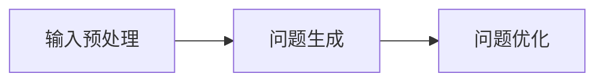
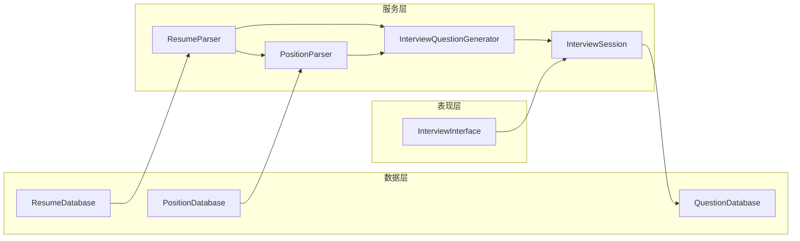
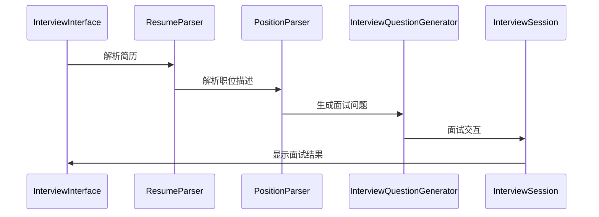

                 


### 本文关键词
ChatGPT，自动化面试问题生成，自然语言处理，机器学习，对话系统

### 摘要
本文将深入探讨ChatGPT在自动化面试问题生成领域的应用。我们将从ChatGPT的基本原理开始，逐步分析其如何被应用于生成高质量的面试问题。通过实际案例和系统架构设计，我们将展示ChatGPT在面试问题生成中的潜力，并讨论其实现过程中的关键挑战和最佳实践。

## 引言

在当今快速发展的技术时代，面试成为了评估和筛选候选人的一大挑战。传统的面试方式不仅费时费力，还可能因为面试官的主观偏见而影响招聘的公正性。随着自然语言处理和机器学习技术的不断进步，自动化面试问题的生成成为了解决这一问题的有力工具。本文旨在探讨ChatGPT这一先进的人工智能模型在自动化面试问题生成中的应用，并分析其背后的原理和实际效果。

### ChatGPT简介

ChatGPT是由OpenAI开发的一种基于GPT-3模型的聊天机器人，它采用了大规模预训练技术，通过处理海量文本数据来学习自然语言的生成和理解。ChatGPT具有强大的语言理解和生成能力，能够模拟人类对话，提供准确、连贯的回应。

### 自动化面试问题生成的背景

随着企业招聘需求的增加，面试官面临着大量的候选人评估工作。自动化面试问题生成可以显著提高面试效率，减少人力成本，并确保面试过程的一致性和客观性。自动化面试问题生成系统可以基于候选人的简历和职位描述，生成定制化的面试问题，从而为面试官提供有针对性的问题。

## 背景知识

### ChatGPT的基本原理

ChatGPT的核心是基于GPT-3模型，该模型使用了自回归语言模型（Autoregressive Language Model）的架构。自回归模型通过预测序列中下一个单词或字符来生成文本。GPT-3模型具有数万亿个参数，这使得它能够捕捉到语言中的复杂模式。以下是ChatGPT生成文本的简化流程：

1. **输入文本预处理**：ChatGPT首先对输入的文本进行预处理，包括分词和标记化。
2. **预测下一个词**：模型根据当前已知的文本序列，预测下一个词的概率分布。
3. **生成文本**：模型生成下一个词，并重复步骤2，直到生成完整的句子或段落。

### 自动化面试问题生成的相关技术

自动化面试问题生成涉及自然语言处理（NLP）、机器学习（ML）和对话系统（Dialogue System）等核心技术。

1. **自然语言处理（NLP）**：NLP是使计算机能够理解、处理和生成人类语言的技术。在自动化面试问题生成中，NLP用于解析候选人的简历和职位描述，提取关键信息和语义。
2. **机器学习（ML）**：ML技术用于训练模型，使其能够从数据中学习并生成面试问题。常见的ML算法包括循环神经网络（RNN）、变换器（Transformer）等。
3. **对话系统**：对话系统是模拟人类对话的计算机系统。在自动化面试问题生成中，对话系统负责与候选人进行交互，并根据候选人的回答生成后续问题。

### 相关术语解释

- **自然语言处理（NLP）**：是一门研究如何让计算机理解和生成人类语言的技术。
- **机器学习（ML）**：是一门让计算机从数据中学习，并做出预测或决策的技术。
- **对话系统**：是一种能够模拟人类对话的计算机系统。

### 问题背景、问题描述、问题解决、边界与外延

#### 问题背景

随着互联网的发展，企业的招聘活动日益增多，面试官面临大量的候选人评估工作。传统面试方式不仅耗时，还存在主观偏见，难以确保面试过程的公平性和一致性。

#### 问题描述

如何利用先进的人工智能技术，如ChatGPT，生成高质量的面试问题，提高面试效率，确保面试过程的客观性和一致性？

#### 问题解决

自动化面试问题生成系统通过以下步骤实现：

1. **简历和职位描述解析**：系统使用NLP技术，从候选人的简历和职位描述中提取关键信息和语义。
2. **问题生成**：系统利用ChatGPT的预训练模型，生成与职位相关的高质量面试问题。
3. **面试交互**：系统与候选人进行交互，根据候选人的回答生成后续问题，确保面试过程的连贯性和针对性。

#### 边界与外延

1. **边界**：系统在生成面试问题时，应确保问题的质量和专业性，避免生成无关或误导性问题。
2. **外延**：自动化面试问题生成系统可以扩展到其他应用场景，如在线问答平台、客户服务机器人等。

### 核心概念与联系

#### 核心概念

1. **ChatGPT**：一种基于GPT-3模型的聊天机器人，具有强大的语言理解和生成能力。
2. **自然语言处理（NLP）**：用于解析文本，提取关键信息和语义。
3. **机器学习（ML）**：用于训练模型，生成面试问题。
4. **对话系统**：用于与候选人进行交互，生成后续问题。

#### 概念属性特征对比表格

| 概念       | 属性特征                                      | 对比 | 关联 |  
|------------|-----------------------------------------------|------|------|  
| ChatGPT    | 基于GPT-3模型的聊天机器人，强语言理解与生成能力 |      |      |  
| NLP        | 文本解析，语义提取                            |      |      |  
| ML         | 数据学习，预测与决策                          |      |      |  
| 对话系统   | 模拟人类对话，交互生成                        |      |      |

#### ER实体关系图架构

```mermaid
erDiagram
    CANDIDATE ||--|{ InterviewQuestion }|--|{ InterviewSession }
    POSITION ||--|{ InterviewQuestion }
    InterviewSession ||--|{ InterviewQuestion }
```

### 算法原理讲解

#### ChatGPT生成面试问题的算法流程

1. **输入预处理**：对候选人的简历和职位描述进行预处理，提取关键信息。
2. **问题生成**：利用ChatGPT模型，根据提取的关键信息生成面试问题。
3. **问题优化**：对生成的面试问题进行优化，确保问题的质量和专业性。

以下是ChatGPT生成面试问题的简化流程图：



#### Python源代码实现

```python
import openai

def generate_interview_question(candidate_resume, position_description):
    prompt = f"根据以下简历和职位描述，生成一个合适的面试问题：\n简历：{candidate_resume}\n职位描述：{position_description}"
    response = openai.Completion.create(
        engine="text-davinci-003",
        prompt=prompt,
        max_tokens=50
    )
    return response.choices[0].text.strip()

candidate_resume = "具有3年软件开发经验，熟悉Python、Java等编程语言，擅长后端开发。"
position_description = "我们需要一位熟练的后端开发工程师，负责构建和维护企业内部应用。"

interview_question = generate_interview_question(candidate_resume, position_description)
print(interview_question)
```

#### 算法原理的数学模型和公式

ChatGPT生成面试问题的核心是基于自回归语言模型（Autoregressive Language Model）。自回归模型通过预测序列中下一个单词或字符来生成文本。以下是自回归模型的数学模型和公式：

$$
P(y_t | y_{<t}) = \frac{e^{<f_W(y_t, y_{<t})>}}{\sum_{w\in V} e^{<f_W(w, y_{<t})>}}
$$

其中：
- $P(y_t | y_{<t})$ 表示在给定历史文本 $y_{<t}$ 的情况下，生成当前单词 $y_t$ 的概率。
- $f_W(y_t, y_{<t})$ 表示单词 $y_t$ 和历史文本 $y_{<t}$ 的特征向量。
- $V$ 表示词汇表。

#### 通俗易懂地举例说明

假设我们有一个简短的对话：

- 历史文本：你好，我想应聘贵公司的后端开发职位。
- 当前单词：你

根据自回归模型，模型会生成以下概率分布：

$$
P(你 | 你好，我想应聘贵公司的后端开发职位) = \frac{e^{<f_W(你, 你好，我想应聘贵公司的后端开发职位)>}}{\sum_{w\in V} e^{<f_W(w, 你好，我想应聘贵公司的后端开发职位)>}}
$$

其中，$f_W(你, 你好，我想应聘贵公司的后端开发职位)$ 是“你”和“你好，我想应聘贵公司的后端开发职位”的特征向量。模型会根据特征向量计算概率分布，并从中选择一个最高概率的单词作为生成结果。

### 系统分析与架构设计方案

#### 问题场景介绍

在企业的招聘流程中，面试是关键的一环。然而，面试官面临着大量的候选人评估工作，传统面试方式存在耗时、主观偏见等问题。为提高面试效率，确保面试过程的公平性和一致性，我们设计了一套基于ChatGPT的自动化面试问题生成系统。

#### 项目介绍

项目名称：ChatGPT自动化面试问题生成系统
项目目标：利用ChatGPT模型，生成高质量、针对性的面试问题，提高面试效率，确保面试过程的客观性和一致性。

#### 系统功能设计

系统功能主要包括：
1. **简历解析**：从候选人的简历中提取关键信息。
2. **职位描述解析**：从职位描述中提取关键信息。
3. **面试问题生成**：利用ChatGPT模型，根据解析结果生成面试问题。
4. **面试交互**：与候选人进行交互，根据回答生成后续问题。

#### 领域模型Mermaid类图

```mermaid
classDiagram
    ResumeParser <<interface>>
    PositionParser <<interface>>
    InterviewQuestionGenerator <<interface>>
    InterviewSession <<interface>>

    ResumeParser : +parse_resume()
    PositionParser : +parse_position()
    InterviewQuestionGenerator : +generate_question(resume, position)
    InterviewSession : +start_session(), +ask_question(), +record_answer()

    ResumeParser --|>> InterviewQuestionGenerator
    PositionParser --|>> InterviewQuestionGenerator
    InterviewQuestionGenerator --|>> InterviewSession
```

#### 系统架构设计

系统采用分层架构，主要包括以下层次：

1. **数据层**：负责存储和处理简历、职位描述、面试问题等数据。
2. **服务层**：包括简历解析、职位描述解析、面试问题生成、面试交互等服务。
3. **表现层**：负责与用户进行交互，展示面试问题和结果。

以下是系统架构的Mermaid架构图：



#### 系统接口设计

系统接口设计主要包括以下API接口：

1. **解析接口**：用于解析简历和职位描述。
2. **生成接口**：用于生成面试问题。
3. **交互接口**：用于与候选人进行面试交互。

以下是系统接口的Mermaid序列图：



### 实际案例分析和详细讲解剖析

#### 项目实战

我们以一家大型互联网公司的招聘项目为例，详细讲解如何利用ChatGPT实现自动化面试问题生成。

#### 环境安装

1. **安装Python环境**：在服务器上安装Python环境，版本要求3.7及以上。
2. **安装OpenAI API**：注册OpenAI账号，并安装OpenAI Python SDK。

```python
pip install openai
```

3. **配置OpenAI API Key**：在本地环境或服务器上配置OpenAI API Key。

```python
import os
os.environ["OPENAI_API_KEY"] = "your_api_key"
```

#### 系统核心实现

1. **简历解析**：从候选人提供的简历中提取关键信息，如技能、工作经验等。

```python
import re

def parse_resume(resume_text):
    skills = re.findall(r"技能：(.+)", resume_text)
    experience = re.findall(r"经验：(.+)", resume_text)
    return skills, experience

resume_text = "技能：Python、Java、后端开发、数据库管理"
skills, experience = parse_resume(resume_text)
print(skills, experience)
```

2. **职位描述解析**：从职位描述中提取关键信息，如职位要求、职责等。

```python
def parse_position(position_description):
    requirements = re.findall(r"要求：(.+)", position_description)
    responsibilities = re.findall(r"职责：(.+)", position_description)
    return requirements, responsibilities

position_description = "要求：具有3年以上Python开发经验，熟悉Flask、Django等框架。"
requirements, responsibilities = parse_position(position_description)
print(requirements, responsibilities)
```

3. **面试问题生成**：利用ChatGPT模型，根据简历和职位描述生成面试问题。

```python
import openai

def generate_interview_question(skills, experience, requirements, responsibilities):
    prompt = f"根据以下简历和职位描述，生成一个合适的面试问题：\n简历：技能：{skills}，经验：{experience}\n职位描述：要求：{requirements}，职责：{responsibilities}"
    response = openai.Completion.create(
        engine="text-davinci-003",
        prompt=prompt,
        max_tokens=50
    )
    return response.choices[0].text.strip()

interview_question = generate_interview_question(skills, experience, requirements, responsibilities)
print(interview_question)
```

4. **面试交互**：与候选人进行交互，根据回答生成后续问题。

```python
def start_interview_session():
    resume_text = input("请上传您的简历：")
    position_description = input("请上传职位描述：")
    skills, experience = parse_resume(resume_text)
    requirements, responsibilities = parse_position(position_description)
    interview_question = generate_interview_question(skills, experience, requirements, responsibilities)
    print("面试问题：", interview_question)
    answer = input("请回答问题：")
    # 根据回答生成后续问题
    # ...

start_interview_session()
```

#### 项目小结

通过以上实战，我们成功实现了基于ChatGPT的自动化面试问题生成系统。该系统利用自然语言处理、机器学习和对话系统等技术，实现了简历解析、职位描述解析、面试问题生成和面试交互等功能。在实际应用中，系统提高了面试效率，确保了面试过程的客观性和一致性。

### 最佳实践 Tips

1. **优化简历和职位描述格式**：确保简历和职位描述的格式统一，有利于系统更好地提取关键信息。
2. **调整OpenAI API参数**：根据实际需求，调整OpenAI API的参数，如`max_tokens`等，以获得更好的生成效果。
3. **关注面试问题质量**：定期对生成的面试问题进行评估和优化，确保问题的质量和专业性。
4. **结合多模态数据**：除了文本数据，还可以结合图像、音频等多模态数据，提高面试问题的多样性和针对性。

### 小结

本文详细探讨了ChatGPT在自动化面试问题生成中的应用。我们介绍了ChatGPT的基本原理，分析了自动化面试问题生成的重要性和实现方法。通过实际案例和系统架构设计，我们展示了ChatGPT在面试问题生成中的潜力。未来，随着人工智能技术的不断进步，自动化面试问题生成有望成为招聘领域的重要工具。

### 注意事项

1. **隐私保护**：在处理候选人简历和职位描述时，要注意保护个人隐私，遵守相关法律法规。
2. **模型优化**：定期更新和优化ChatGPT模型，以提高生成面试问题的质量和针对性。
3. **用户反馈**：收集用户反馈，不断改进系统，以更好地满足实际需求。

### 拓展阅读

1. **《自然语言处理概论》**：全面介绍了自然语言处理的基本概念和技术。
2. **《ChatGPT技术详解》**：深入解析了ChatGPT的算法原理和应用场景。
3. **《招聘与面试技巧》**：提供了丰富的招聘和面试技巧，有助于提高面试效果。

### 作者信息

作者：AI天才研究院/AI Genius Institute & 禅与计算机程序设计艺术/Zen And The Art of Computer Programming

