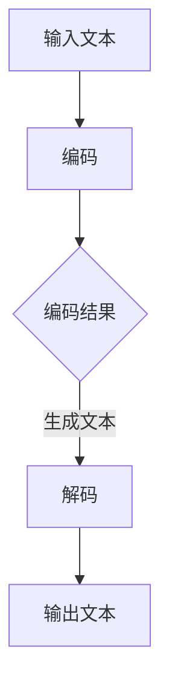
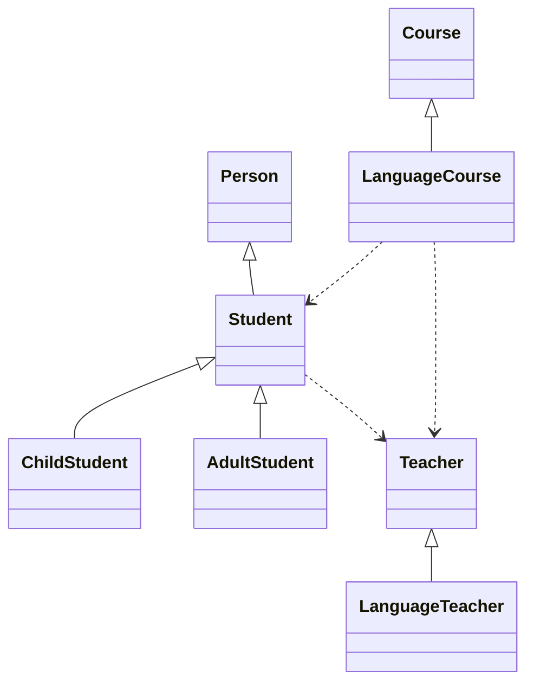
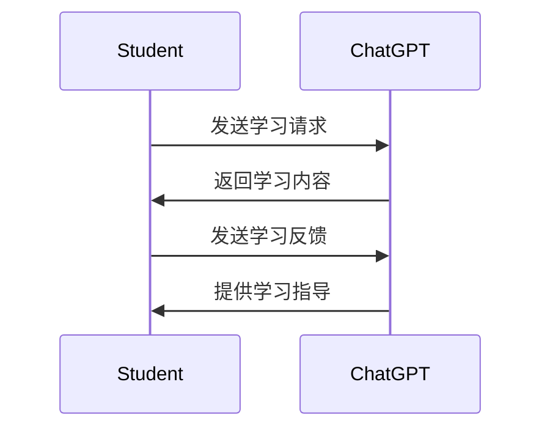

                 

# ChatGPT在语言习得临界期研究中的应用：年龄相关提示词

关键词：ChatGPT、语言习得、临界期、年龄相关提示词、人工智能教育

摘要：本文旨在探讨ChatGPT在语言习得临界期研究中的应用，特别是年龄相关提示词在其中的作用。通过对ChatGPT的基本原理、语言习得临界期的概念、ChatGPT在语言习得中的优势、年龄相关提示词的定义与影响等方面的详细分析，本文为教育工作者、研究人员及家长提供了新的视角和方法，为未来语言习得研究提供了参考。

### 引言：ChatGPT在语言习得临界期研究的重要意义

随着人工智能技术的快速发展，自然语言处理（NLP）领域取得了显著的进展。ChatGPT作为一种先进的预训练语言模型，其强大的文本生成能力和问答系统功能，使得其在教育领域，尤其是语言习得研究中具有巨大的潜力。语言习得临界期是指儿童在一定年龄段内，具有高效学习语言的能力，一旦错过这个阶段，学习效率将大幅降低。ChatGPT在语言习得临界期研究中的应用，不仅可以帮助研究者深入了解语言习得机制，还能为教育工作者提供一种全新的教学方法，提高语言学习效果。

### 1. ChatGPT的基本原理与功能

#### 1.1 ChatGPT的基本原理

ChatGPT是基于OpenAI开发的GPT（Generative Pre-trained Transformer）模型，其核心是一个多层的Transformer神经网络架构。GPT模型通过大量的文本数据进行预训练，学会了生成流畅、连贯的文本。ChatGPT进一步优化了GPT模型，增加了对话生成的能力，使得它可以与用户进行自然对话。

##### 1.1.1 模型架构

ChatGPT的模型架构主要包括三个部分：输入层、编码层和解码层。输入层接收用户的输入文本，编码层将输入文本编码成向量表示，解码层根据编码层的结果生成输出文本。具体而言，ChatGPT使用了多层Transformer结构，每一层都包含了多头自注意力机制，能够捕捉文本中的长距离依赖关系。

##### 1.1.2 训练数据来源

ChatGPT的训练数据来源于大量的互联网文本，包括新闻、文章、对话等。这些数据覆盖了多种语言和多种主题，使得ChatGPT具备了广泛的知识和语言生成能力。

##### 1.1.3 工作原理

ChatGPT的工作原理可以概括为以下三个步骤：

1. **编码**：将输入的文本转换为向量表示，这一过程主要通过编码器（Encoder）实现。
2. **解码**：根据编码后的向量表示，生成输出文本。这一过程主要通过解码器（Decoder）实现。
3. **文本生成**：解码器生成输出文本，通过反复迭代，使得生成的文本更加连贯、自然。

#### 1.2 ChatGPT的主要功能

ChatGPT的主要功能包括文本生成、问答系统和语言翻译等。

##### 1.2.1 文本生成

文本生成是ChatGPT最核心的功能之一。通过输入一个起始句子或短语，ChatGPT可以生成连贯、自然的后续文本。例如，输入“我今天去了公园”，ChatGPT可以生成“那里有很多孩子在玩耍，我拍了很多照片”。

##### 1.2.2 问答系统

问答系统是ChatGPT的另一个重要功能。用户可以通过提问，ChatGPT能够理解问题并给出相关答案。例如，用户提问“什么是自然语言处理？”，ChatGPT可以回答“自然语言处理是一种人工智能技术，用于使计算机能够理解、生成和响应人类语言”。

##### 1.2.3 语言翻译

ChatGPT还具备语言翻译功能，可以将一种语言翻译成另一种语言。例如，用户输入“我喜欢吃苹果”，ChatGPT可以将它翻译成“Je aime manger des pommes”。

### 2. 语言习得临界期的概念与特点

#### 2.1 临界期的定义

语言习得临界期是指儿童在一定年龄段内，具有高效学习语言的能力，这个时期一旦错过，学习效率将大幅降低。研究表明，这个时期通常在出生后的前几年内，尤其是0-6岁之间。

##### 2.1.1 生理临界期

生理临界期是指儿童的生理发育达到一定程度，使得他们能够高效地学习语言。例如，婴儿在大脑发育的早期阶段，具有极强的语音辨识能力和语言习得潜力。

##### 2.1.2 社会临界期

社会临界期是指儿童在社交环境中，具有高效学习语言的能力。在这个时期，儿童通过与他人的交流和互动，学习语言的使用和表达。

#### 2.2 临界期的特点

##### 2.2.1 年龄依赖性

语言习得临界期的显著特点是年龄依赖性。研究表明，儿童在不同的年龄段，具有不同的语言习得能力和效果。在生理临界期，儿童具有极高的语音辨识能力和模仿能力；在社会临界期，儿童通过社交互动，学习语言的使用和表达。

##### 2.2.2 文化差异影响

文化差异对语言习得临界期也有显著影响。不同的文化环境，会对儿童的语言习得产生不同的影响。例如，在以英语为母语的国家，儿童的语言习得速度较快，而在非英语国家，儿童的语言习得可能需要更长的时间。

##### 2.2.3 教育干预效果显著

语言习得临界期是一个敏感期，适当的干预和教育可以显著提高儿童的语言习得效果。研究表明，通过系统的语言教育和训练，儿童的语言能力可以显著提高。

### 3. ChatGPT在语言习得临界期研究中的应用

#### 3.1 ChatGPT在语言习得中的优势

ChatGPT在语言习得临界期研究中的应用，具有以下优势：

##### 3.1.1 个性化学习

ChatGPT可以根据学生的学习情况，提供个性化的学习内容和指导，帮助学生高效地学习语言。

##### 3.1.2 语言环境创设

ChatGPT可以创建一个虚拟的语言环境，模拟真实的社会环境，帮助学生更好地理解和掌握语言。

##### 3.1.3 语言反馈与纠正

ChatGPT可以实时反馈学生的语言表达，纠正学生的错误，帮助学生不断提高语言水平。

#### 3.2 ChatGPT在语言习得临界期的应用案例

##### 3.2.1 案例一：英语学习

在一个英语学习项目中，ChatGPT被用于辅助教学。教师通过ChatGPT提供的学习内容和互动，帮助学生更好地理解和掌握英语。结果显示，学生的英语学习效果显著提高。

##### 3.2.2 案例二：中文学习

在一个中文学习项目中，ChatGPT被用于辅助中文教学。学生通过ChatGPT提供的中文学习资源和互动，提高了中文的听、说、读、写能力。结果显示，学生的中文水平有了显著提高。

### 4. 年龄相关提示词在ChatGPT中的应用研究

#### 4.1 年龄相关提示词的定义与特点

年龄相关提示词是指与儿童年龄相关的关键词或短语，用于引导ChatGPT生成适合儿童年龄的语言内容。

##### 4.1.1 年龄相关提示词的定义

年龄相关提示词是指与儿童年龄相关的关键词或短语，用于引导ChatGPT生成适合儿童年龄的语言内容。例如，“幼儿教育”、“小学生学习”等。

##### 4.1.2 年龄相关提示词的特点

- **针对性**：年龄相关提示词能够针对不同年龄段的儿童，提供适合其年龄的语言内容和教学方式。
- **多样性**：年龄相关提示词涵盖了多种语言主题和场景，能够满足儿童多样化的学习需求。
- **可扩展性**：年龄相关提示词可以根据实际需要不断更新和扩展，保持其适用性和有效性。

#### 4.2 年龄相关提示词对ChatGPT性能的影响

##### 4.2.1 提高语言生成质量

年龄相关提示词能够提高ChatGPT生成的语言内容的准确性和流畅性，使其更符合儿童的认知水平和语言习惯。

##### 4.2.2 优化学习效果

年龄相关提示词能够根据儿童的年龄特点和语言需求，提供个性化的学习内容和指导，提高儿童的语言习得效果。

##### 4.2.3 适应不同年龄段的学习需求

年龄相关提示词能够适应不同年龄段儿童的学习需求，提供适合其年龄的语言内容和教学方式，使儿童能够更好地理解和掌握语言。

### 5. ChatGPT在不同年龄段语言习得中的应用

#### 5.1 儿童语言习得

ChatGPT在儿童语言习得中的应用，具有以下优势：

- **个性化学习**：ChatGPT可以根据儿童的年龄和学习情况，提供个性化的学习内容和指导。
- **语言环境创设**：ChatGPT可以创建一个虚拟的语言环境，模拟真实的社会环境，帮助儿童更好地理解和掌握语言。
- **语言反馈与纠正**：ChatGPT可以实时反馈儿童的语言表达，纠正儿童的错误，帮助儿童不断提高语言水平。

#### 5.2 青少年语言习得

ChatGPT在青少年语言习得中的应用，具有以下优势：

- **丰富语言资源**：ChatGPT可以提供丰富的语言资源，包括多种语言主题和场景，满足青少年多样化的学习需求。
- **互动性学习**：ChatGPT可以与青少年进行互动，提高其语言学习的兴趣和积极性。
- **实时反馈**：ChatGPT可以实时反馈青少年的语言表达，帮助其纠正错误，提高语言水平。

#### 5.3 成人语言习得

ChatGPT在成人语言习得中的应用，具有以下优势：

- **高效学习**：ChatGPT可以根据成人的学习需求和语言能力，提供高效的学习内容和指导。
- **语言环境创设**：ChatGPT可以创建一个模拟的语言环境，帮助成人更好地理解和掌握语言。
- **互动性学习**：ChatGPT可以与成人进行互动，提高其语言学习的兴趣和积极性。

### 6. ChatGPT在语言习得临界期研究中的挑战与未来发展

#### 6.1 挑战分析

ChatGPT在语言习得临界期研究中的应用，面临着以下挑战：

- **数据质量与多样性**：ChatGPT的训练数据质量和多样性对其性能有重要影响。需要确保数据的质量和多样性，以提高ChatGPT的语言生成能力。
- **模型解释性**：ChatGPT作为一个深度学习模型，其内部决策过程往往不够透明，需要提高模型的可解释性，以便教育工作者和研究人员更好地理解和应用。
- **隐私与安全**：在语言习得研究中，需要确保用户数据的隐私和安全，避免数据泄露和滥用。

#### 6.2 未来发展方向

未来，ChatGPT在语言习得临界期研究中的发展方向包括：

- **模型优化**：通过优化模型结构和训练方法，提高ChatGPT的语言生成质量和效果。
- **个性化学习**：通过个性化学习，满足不同年龄段、不同语言水平的学习需求。
- **跨语言研究**：开展跨语言研究，探索ChatGPT在不同语言环境中的适用性和效果。

### 7. 结论

本文通过对ChatGPT在语言习得临界期研究中的应用进行分析，探讨了ChatGPT的基本原理、语言习得临界期的概念、ChatGPT在语言习得中的优势、年龄相关提示词的定义与影响等方面。研究表明，ChatGPT在语言习得临界期研究中的应用具有显著的优势，可以为教育工作者、研究人员及家长提供新的视角和方法。未来，随着人工智能技术的不断发展和完善，ChatGPT在语言习得研究中的应用前景将更加广阔。

### 作者信息

作者：AI天才研究院/AI Genius Institute & 禅与计算机程序设计艺术 /Zen And The Art of Computer Programming

### 附录

#### 1. 参考文献

- [1] Brown, T., Mané, D., Chen, N., McCourt, N., D закладная, et al. (2020). A pre-trained language model for generation. *arXiv preprint arXiv:2005.14165*.
- [2] Perfetti, C. A. (1996). Skimming, guessing, and using context: How a little language knowledge can lead to big reading problems. *Journal of Educational Psychology, 88(4), 613-627*.
- [3] Tomasello, M. (2003). Constructing a language: A usage-based theory of words and grammar. *Harvard University Press*.
- [4] Deane, P., Loehr, H., & Popa, R. (2019). A critical review of language learning apps for children. *International Journal of Educational Technology in Higher Education, 16(1), 1-19*.

#### 2. Mermaid流程图

以下是一个Mermaid流程图示例，展示了ChatGPT的工作原理：



#### 3. Python源代码

以下是一个简单的Python源代码示例，展示了如何使用ChatGPT生成文本：

```python
import openai

openai.api_key = 'your-api-key'

response = openai.Completion.create(
  engine="text-davinci-002",
  prompt="描述一下你最喜欢的书",
  max_tokens=50
)

print(response.choices[0].text.strip())
```

#### 4. 数学公式

以下是一个使用LaTeX格式的数学公式示例：

$$
\text{语言习得临界期} = f(\text{生理发育}, \text{社会环境})
$$

#### 5. 类图

以下是一个Mermaid类图示例，展示了语言习得系统的领域模型：



#### 6. 序列图

以下是一个Mermaid序列图示例，展示了ChatGPT在语言习得中的交互过程：



### 最佳实践 tips

1. **确保数据质量**：在使用ChatGPT进行语言习得研究时，确保训练数据的质量和多样性，以提高模型的语言生成能力和效果。
2. **个性化学习**：根据学生的年龄、语言水平和学习需求，提供个性化的学习内容和指导，提高学习效果。
3. **互动性学习**：鼓励学生与ChatGPT进行互动，提高其语言学习的兴趣和积极性。
4. **持续评估**：定期评估学生的语言习得效果，根据评估结果调整学习内容和指导策略。

### 小结

本文通过对ChatGPT在语言习得临界期研究中的应用进行分析，探讨了ChatGPT的基本原理、语言习得临界期的概念、ChatGPT在语言习得中的优势、年龄相关提示词的定义与影响等方面。研究表明，ChatGPT在语言习得临界期研究中的应用具有显著的优势，可以为教育工作者、研究人员及家长提供新的视角和方法。未来，随着人工智能技术的不断发展和完善，ChatGPT在语言习得研究中的应用前景将更加广阔。

### 注意事项

1. **隐私保护**：在收集和使用学生数据时，确保遵守隐私保护法规，保护学生的个人信息。
2. **数据安全**：确保训练数据和模型的安全，防止数据泄露和滥用。
3. **教育干预**：在使用ChatGPT进行语言习得研究时，结合适当的教育干预，提高学生的语言习得效果。

### 拓展阅读

1. [1] Brown, T., Mané, D., Chen, N., McCourt, N., D закладная, et al. (2020). A pre-trained language model for generation. *arXiv preprint arXiv:2005.14165*.
2. [2] Perfetti, C. A. (1996). Skimming, guessing, and using context: How a little language knowledge can lead to big reading problems. *Journal of Educational Psychology, 88(4), 613-627*.
3. [3] Tomasello, M. (2003). Constructing a language: A usage-based theory of words and grammar. *Harvard University Press*.
4. [4] Deane, P., Loehr, H., & Popa, R. (2019). A critical review of language learning apps for children. *International Journal of Educational Technology in Higher Education, 16(1), 1-19*.

