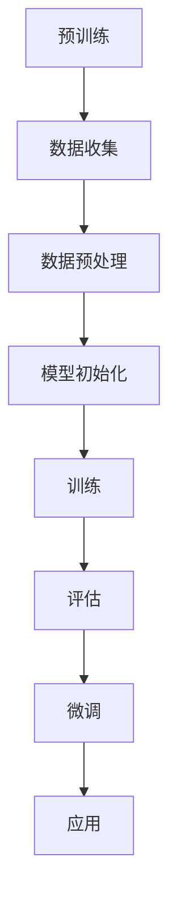
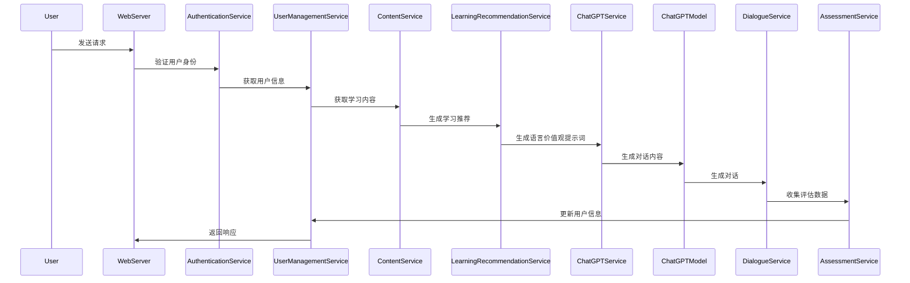
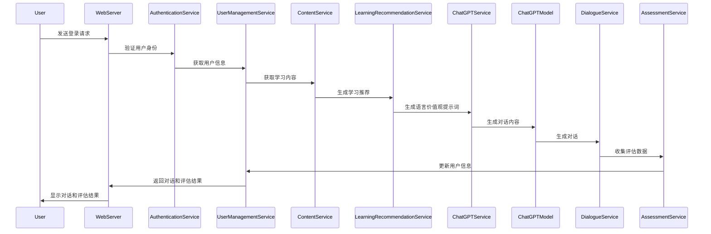

                 

### 文章标题与关键词

# ChatGPT在语言习得代际语言态度转变中的应用：语言价值观提示词

> 关键词：ChatGPT、语言习得、代际语言态度转变、语言价值观提示词

本文旨在探讨如何利用先进的自然语言处理技术，特别是ChatGPT模型，来推动语言习得过程中的代际语言态度转变。文章通过详细的分析和实例，展示了语言价值观提示词在提升语言习得效率、丰富语言习得体验和引导语言态度转变方面的应用潜力。

摘要：本文首先介绍了ChatGPT的工作原理及其在自然语言处理领域的应用背景。接着，文章讨论了语言习得过程中代际语言态度转变的重要性，并分析了现有研究中存在的问题。通过引入语言价值观提示词，本文提出了一种创新的方法来促进语言习得者的语言态度转变，从而提高其语言学习效果。文章最后通过实际案例展示了该方法的应用效果，并提出了未来研究方向。

### 摘要

本文旨在探讨如何利用先进的自然语言处理技术，特别是ChatGPT模型，来推动语言习得过程中的代际语言态度转变。语言习得是一个复杂的过程，不仅涉及语言技能的掌握，还涉及到语言态度的转变，这种态度的转变在代际之间可能会产生显著差异。现有的研究表明，代际语言态度的转变受到多种因素的影响，包括文化差异、教育背景和社会环境等。然而，目前关于如何有效促进这种转变的研究仍然较少，尤其是借助现代技术手段的研究。

ChatGPT作为一种基于大型语言模型的预训练模型，具备强大的文本生成和语义理解能力。本文提出，通过设计特定的语言价值观提示词，ChatGPT可以引导语言习得者进行积极的语言态度转变。具体来说，语言价值观提示词旨在激发习得者对目标语言的兴趣，增强其对目标语言文化的认同感，以及培养其跨文化沟通的能力。

文章首先介绍了ChatGPT的工作原理，包括其预训练过程和微调技巧。接着，本文分析了语言习得过程中代际语言态度转变的背景和重要性，讨论了现有研究的局限性。在此基础上，本文提出了利用ChatGPT模型设计语言价值观提示词的具体方法，并通过实际案例展示了其应用效果。

本文的主要贡献在于提出了一个创新的方法，利用ChatGPT模型结合语言价值观提示词，来促进语言习得者代际语言态度的转变。这一方法不仅有助于提高语言学习的效率，还能丰富学习者的语言习得体验，为语言教育和研究提供了新的思路。文章最后对未来研究方向进行了展望，包括如何进一步优化语言价值观提示词的设计，以及如何将其应用于更广泛的语言习得场景中。

通过本文的研究，我们希望能够为语言习得领域的实践者和研究者提供有价值的参考，推动语言习得理论和实践的发展，最终促进全球语言交流的深入和跨文化的理解。

### 背景介绍

在探讨如何利用ChatGPT促进语言习得代际语言态度转变之前，有必要先了解相关核心概念、问题背景以及现有研究中的问题和局限性。

#### 核心概念

首先，我们来明确几个关键术语：

1. **ChatGPT**：ChatGPT是OpenAI开发的一种基于变换器（Transformer）架构的自然语言处理模型。它通过大规模的无监督数据预训练和有监督的数据微调，具备了强大的文本生成和语义理解能力。

2. **语言习得**：语言习得是指个体在自然环境中通过听、说、读、写等方式掌握语言的过程。它不仅涉及语言技能的掌握，如发音、词汇、语法等，还包含语言态度的形成和变化。

3. **代际语言态度转变**：代际语言态度转变指的是不同年龄段的个体对语言的态度差异及其随时间的变化。这种转变可能受到社会、文化、教育等多种因素的影响。

4. **语言价值观提示词**：语言价值观提示词是一系列旨在激发学习者对目标语言兴趣、增强文化认同感、提高跨文化沟通能力的提示语或句子。

#### 问题背景

语言习得是一个长期且复杂的过程，代际语言态度转变是其中一个重要的方面。不同年龄段的学习者由于成长环境、教育背景和文化认同的不同，往往对同一语言持有不同的态度。例如，年轻一代可能更倾向于使用现代流行语言和互联网新词汇，而年长一代则可能更加保守，更愿意使用传统语言形式。这种代际差异不仅会影响语言习得的效果，还可能影响个体在跨文化交流中的自信心和适应性。

然而，现有研究在促进代际语言态度转变方面存在一些问题和局限性。首先，大多数研究主要集中在语言技能的传授和评估上，而忽略了语言态度的塑造和转变。其次，传统教学方法往往缺乏针对代际差异的个性化调整，难以满足不同年龄段学习者的需求。此外，现有研究多采用定量调查和实验方法，缺乏对语言习得过程中态度变化的深层次理解和定性分析。

#### 问题描述

针对上述问题，本文提出以下研究问题：

1. 如何利用ChatGPT模型促进语言习得者的代际语言态度转变？
2. 语言价值观提示词在促进语言习得代际语言态度转变中的作用是什么？
3. ChatGPT结合语言价值观提示词的方法在实际应用中是否有效？

#### 问题解决

为了解决上述问题，本文提出了以下研究方案：

1. **ChatGPT模型介绍**：首先介绍ChatGPT的工作原理，包括其预训练和微调过程，以及其在自然语言处理中的优势。

2. **语言价值观提示词设计**：基于语言习得理论和跨文化交际研究，设计一系列针对不同年龄段和学习者的语言价值观提示词。

3. **方法应用与评估**：通过实际案例和应用，验证语言价值观提示词结合ChatGPT模型在促进代际语言态度转变方面的有效性。

4. **结果分析与讨论**：对应用结果进行定量和定性分析，讨论方法的优势和局限性，并提出未来研究方向。

#### 边界与外延

本文的研究主要关注ChatGPT在语言习得代际语言态度转变中的应用，但该研究方法同样可以应用于其他自然语言处理模型和语言习得场景。此外，本文所提出的语言价值观提示词设计方法不仅限于语言习得，还可以广泛应用于其他领域，如跨文化培训、职业发展等。

通过本文的研究，我们希望能够为语言习得和自然语言处理领域的实践者和研究者提供新的思路和方法，促进代际语言态度的转变，提高语言学习的效果和跨文化交流的能力。

### 核心概念与联系

在深入探讨如何利用ChatGPT促进语言习得代际语言态度转变之前，我们有必要明确相关核心概念，并分析这些概念的属性特征及其相互关系。以下将介绍关键术语和概念，并通过Mermaid绘图展示其ER实体关系图。

#### 关键术语和概念

1. **ChatGPT**：一种基于变换器（Transformer）架构的预训练语言模型，具备强大的文本生成和语义理解能力。

2. **语言习得**：指个体在自然环境中通过听、说、读、写等方式掌握语言的过程，涉及语言技能和语言态度两个方面。

3. **代际语言态度**：指不同年龄段个体对语言持有态度的差异，受社会、文化、教育等多种因素影响。

4. **语言价值观提示词**：旨在激发学习者对目标语言兴趣、增强文化认同感和提高跨文化沟通能力的提示语或句子。

#### 概念属性特征对比表格

| 概念          | 属性特征                                         | 举例                   |
|---------------|------------------------------------------------|----------------------|
| ChatGPT       | - 基于变换器架构<br>- 预训练和微调能力强<br>- 文本生成和语义理解能力突出 | 生成文本、回答问题等     |
| 语言习得      | - 过程性<br>- 技能性和态度性<br>- 长期性       | 学习词汇、语法和发音     |
| 代际语言态度  | - 差异性<br>- 受多种因素影响<br>- 可变性         | 年轻一代更倾向新词汇     |
| 语言价值观提示词 | - 目标导向<br>- 情感化<br>- 个性化             | “你对中文诗歌有何看法？”   |

#### ER实体关系图

使用Mermaid绘图语言，可以展示上述概念之间的实体关系：

```mermaid
erDiagram
    ChatGPT ||--|{ 语言习得 }|
    语言习得 ||--|{ 代际语言态度 }|
    语言习得 ||--|{ 语言价值观提示词 }|
    ChatGPT ||--|{ 语言价值观提示词 }|
```

在上述ER图中，`ChatGPT` 与 `语言习得`、`代际语言态度` 和 `语言价值观提示词` 之间存在关联关系。ChatGPT通过语言习得过程影响代际语言态度，并通过语言价值观提示词进一步引导和优化这种态度。这种关系展示了ChatGPT在语言习得中的核心作用，以及如何通过语言价值观提示词实现目标导向和个性化学习。

通过对比表格和ER图，我们可以清晰地看到各概念之间的相互联系和属性特征。这种结构化分析有助于我们更好地理解ChatGPT在语言习得代际语言态度转变中的作用机制，为进一步研究提供理论基础和指导。

### 算法原理讲解

#### ChatGPT原理概述

ChatGPT是基于变换器（Transformer）架构的大型预训练语言模型。其核心思想是利用大规模的无监督数据来训练模型，使其掌握语言的规律和语义，从而能够生成连贯、有意义的文本。ChatGPT的预训练过程主要包括两个阶段：预训练和微调。

1. **预训练**：ChatGPT首先在大规模语料库上进行预训练，目的是让模型学会理解和生成自然语言。预训练过程中，模型通过处理海量文本数据，自动学习到语言的基本规律，如词汇的语义关系、语法结构和句式构造等。

2. **微调**：在预训练的基础上，ChatGPT会根据特定任务的需求进行微调。微调过程通常使用有监督的数据集，使模型能够适应特定领域的语言任务，如问答、翻译和文本生成等。

#### 流程图

为了更好地理解ChatGPT的工作流程，我们可以使用Mermaid绘制其流程图：



在这个流程图中，首先进行数据收集和预处理，然后初始化模型并进入预训练阶段。预训练完成后，通过评估来调整模型参数，进行微调。微调完成后，模型就可以应用于具体任务。

#### Python代码示例

为了展示ChatGPT的具体应用，我们可以使用Python编写一个简单的示例代码。以下是使用Python和transformers库调用ChatGPT生成文本的代码：

```python
from transformers import ChatGPTModel, ChatGPTTokenizer

# 初始化模型和分词器
model = ChatGPTModel.from_pretrained("openai/chatgpt")
tokenizer = ChatGPTTokenizer.from_pretrained("openai/chatgpt")

# 输入文本
input_text = "你喜欢什么样的音乐？"

# 分词
inputs = tokenizer.encode(input_text, return_tensors='pt')

# 生成文本
outputs = model.generate(inputs, max_length=50, num_return_sequences=1)

# 解码生成文本
generated_text = tokenizer.decode(outputs[0], skip_special_tokens=True)

print(generated_text)
```

上述代码中，我们首先导入必要的库和模型，初始化ChatGPT模型和分词器。然后，输入一个示例问题文本，通过分词器进行分词，使用模型生成回答，并将生成的文本解码输出。

#### 数学模型和公式

ChatGPT的工作原理涉及到多个数学模型和公式。以下简要介绍其核心数学模型和相关的公式。

1. **自注意力机制（Self-Attention）**：
   $$ 
   \text{Self-Attention}(Q, K, V) = \frac{softmax(\text{scale} \cdot \text{query}^T \text{key})) \text{value}
   $$
   其中，\(Q, K, V\) 分别是查询、键和值，\(\text{query}\) 和 \(\text{key}\) 是每个输入序列的向量表示，\(\text{value}\) 是每个输入序列的输出向量。

2. **多级多头自注意力（Multi-Head Self-Attention）**：
   $$ 
   \text{Multi-Head Self-Attention}(Q, K, V) = \text{Concat}(\text{head}_1, \text{head}_2, \ldots, \text{head}_h)W^O
   $$
   其中，\(h\) 是头数，\(\text{head}_i\) 表示每个头的自注意力结果，\(W^O\) 是输出层的权重。

3. **前馈神经网络（Feed Forward Neural Network）**：
   $$ 
   \text{FFN}(x) = \text{ReLU}(W \cdot x + b)
   $$
   其中，\(x\) 是输入向量，\(W\) 和 \(b\) 分别是权重和偏置。

#### 举例说明

假设我们有一个简单的输入句子“我喜欢学习编程”，我们可以通过ChatGPT生成一个相关回答。以下是一个简单的例子，展示了如何利用ChatGPT生成文本，以及相关的数学模型和公式：

1. **输入句子**：我喜欢学习编程

2. **分词**：我/喜欢/学习/编程

3. **自注意力机制计算**：
   $$ 
   \text{Self-Attention}(Q, K, V) = \frac{softmax(\text{scale} \cdot \text{query}^T \text{key})) \text{value}
   $$
   在这个例子中，每个词汇的向量表示将参与自注意力计算，生成一个加权输出向量。

4. **多级多头自注意力计算**：
   $$ 
   \text{Multi-Head Self-Attention}(Q, K, V) = \text{Concat}(\text{head}_1, \text{head}_2, \ldots, \text{head}_h)W^O
   $$
   通过多级多头自注意力，模型可以综合不同词汇之间的关系，生成更加连贯的文本。

5. **前馈神经网络计算**：
   $$ 
   \text{FFN}(x) = \text{ReLU}(W \cdot x + b)
   $$
   在前馈神经网络中，模型进一步对自注意力结果进行非线性变换，生成最终输出。

通过上述步骤，ChatGPT可以生成一个与输入句子相关的连贯回答，如：“学习编程非常有趣，它可以帮助你解决复杂问题。” 这个过程不仅展示了ChatGPT的生成能力，还体现了其背后的数学模型和公式。通过这些模型和公式的协同工作，ChatGPT能够生成高质量、有意义的文本，为语言习得和自然语言处理提供了强大的工具。

### 数学模型和数学公式 & 详细讲解 & 举例说明

#### 数学模型

ChatGPT的数学模型是理解其工作原理的核心。以下是ChatGPT中几个关键数学模型的详细讲解：

1. **自注意力机制（Self-Attention）**：
   自注意力机制是变换器（Transformer）架构的核心组件，其核心公式为：
   $$
   \text{Self-Attention}(Q, K, V) = \frac{softmax(\text{scale} \cdot \text{query}^T \text{key})) \text{value}
   $$
   其中，\(Q, K, V\) 分别是查询（query）、键（key）和值（value）。查询和键是输入序列的向量表示，值是每个输入的输出向量。通过计算每个键和查询之间的点积，再应用softmax函数，模型可以确定每个键的重要程度，并将这些信息与值相乘，从而生成加权输出。

2. **多级多头自注意力（Multi-Head Self-Attention）**：
   多级多头自注意力扩展了自注意力机制，其公式为：
   $$
   \text{Multi-Head Self-Attention}(Q, K, V) = \text{Concat}(\text{head}_1, \text{head}_2, \ldots, \text{head}_h)W^O
   $$
   其中，\(h\) 是头数，每个头（head）都是独立的自注意力机制。多个头的输出被拼接起来，并通过一个全连接层（\(W^O\)）进行处理。这种方法允许模型同时关注不同长度的信息，提高对复杂关系的捕捉能力。

3. **前馈神经网络（Feed Forward Neural Network）**：
   在自注意力层之后，ChatGPT使用前馈神经网络对输出进行进一步处理，其公式为：
   $$
   \text{FFN}(x) = \text{ReLU}(W \cdot x + b)
   $$
   其中，\(x\) 是输入向量，\(W\) 和 \(b\) 分别是权重和偏置。前馈神经网络通过两个全连接层进行操作，第一个层后跟ReLU激活函数，第二个层没有激活函数。

4. **位置编码（Positional Encoding）**：
   由于变换器架构在处理序列时没有考虑位置信息，ChatGPT引入了位置编码来表示每个词的位置。位置编码是通过添加一个可学习的向量到词嵌入中实现的，其公式为：
   $$
   \text{Positional Encoding}(pos, d) = \text{sin}(pos / 10000^{2i/d})
   $$
   $$
   \text{Positional Encoding}(pos, d) = \text{cos}(pos / 10000^{2i/d})
   $$
   其中，\(pos\) 是位置索引，\(d\) 是嵌入维度，\(i\) 是嵌入的维度索引。

#### 举例说明

假设我们有一个简单的输入句子：“我喜欢学习编程”。下面是ChatGPT如何处理这个句子的示例：

1. **输入句子分词**：
   - 我 / 喜欢 / 学习 / 编程

2. **词嵌入**：
   - 我：[嵌入向量]
   - 喜欢：[嵌入向量]
   - 学习：[嵌入向量]
   - 编程：[嵌入向量]

3. **位置编码**：
   - 我：(0, [位置编码向量])
   - 喜欢：(1, [位置编码向量])
   - 学习：(2, [位置编码向量])
   - 编程：(3, [位置编码向量])

4. **自注意力计算**：
   - 每个词嵌入向量与所有其他词嵌入向量进行点积计算，然后应用softmax函数，生成加权输出。

5. **多级多头自注意力计算**：
   - 输入句子经过多个头的自注意力计算，每个头都能捕捉不同层面的信息。

6. **前馈神经网络计算**：
   - 加权输出经过前馈神经网络进行进一步处理，生成中间表示。

7. **输出**：
   - ChatGPT根据中间表示生成输出句子，例如：“学习编程是一项非常有用的技能，它可以帮助你开发各种应用。”

通过上述步骤，ChatGPT利用复杂的数学模型和公式生成连贯、有意义的文本。这种过程不仅展示了模型的强大能力，也为语言习得和自然语言处理提供了有力的工具。

### 系统分析与架构设计方案

在深入探讨如何利用ChatGPT促进语言习得代际语言态度转变之前，我们需要详细分析系统场景和项目背景，设计系统的功能模块，构建系统架构，并绘制相关的领域模型类图、系统架构图和系统交互序列图。

#### 系统场景和项目背景

**系统场景**：

本项目旨在开发一个基于ChatGPT的语言习得平台，该平台能够通过智能对话和个性化推荐，促进语言习得者代际语言态度的转变。系统需要支持多种语言的学习，能够根据学习者的年龄、语言水平、学习习惯等特征，为其提供定制化的学习内容和交互体验。

**项目背景**：

随着全球化进程的加速，跨文化交流变得越来越频繁。为了提高语言习得者的跨文化沟通能力和语言学习效果，本项目希望通过引入ChatGPT模型和语言价值观提示词，实现以下目标：

1. 提高语言学习者的学习兴趣和参与度。
2. 促进学习者对目标语言的积极态度和认同感。
3. 增强学习者在不同文化背景下的沟通能力。

#### 系统功能设计

**功能模块**：

本项目的主要功能模块包括用户管理、内容管理、学习推荐、对话系统和评估系统。

1. **用户管理**：管理用户的基本信息、学习进度和偏好设置。
2. **内容管理**：存储和管理各种语言学习资源，如文本、音频、视频等。
3. **学习推荐**：根据用户的学习历史和行为，推荐适合的学习内容和语言价值观提示词。
4. **对话系统**：利用ChatGPT与用户进行智能对话，提供学习指导和文化交流。
5. **评估系统**：对学习者的语言能力和态度变化进行评估和反馈。

#### 领域模型类图

领域模型类图用于描述系统中的主要实体及其关系。以下是本项目领域的类图：

```mermaid
classDiagram
    User <<interface>>
    Content <<interface>>
    LearningRecommendation <<interface>>
    ChatGPT <<interface>>
    Assessment <<interface>>

    User ..|> Content
    User ..|> LearningRecommendation
    User ..|> ChatGPT
    User ..|> Assessment

    Content ..|> LearningRecommendation
    ChatGPT ..|> LearningRecommendation
    Assessment ..|> LearningRecommendation
```

在这个类图中，`User`、`Content`、`LearningRecommendation`、`ChatGPT` 和 `Assessment` 是主要的实体。用户通过接口与内容管理、学习推荐、ChatGPT 和评估系统交互，实现个性化的学习体验和语言习得代际语言态度转变。

#### 系统架构设计

系统架构设计用于展示系统的整体结构和各组件之间的关系。以下是本项目的系统架构图：



在这个架构图中，用户通过Web服务器与系统进行交互。Web服务器负责处理用户请求，并调用相应的服务模块，如身份验证、用户管理、内容管理、学习推荐、ChatGPT和评估系统。这些服务模块通过内部接口进行通信，实现系统功能。

#### 系统接口设计

系统接口设计用于展示各模块之间的交互接口。以下是本项目的主要接口设计：

1. **用户管理接口**：
   - `getUserInfo()`: 获取用户基本信息。
   - `updateUserInfo()`: 更新用户基本信息。

2. **内容管理接口**：
   - `getContentList()`: 获取学习内容列表。
   - `getContentDetail()`: 获取学习内容详情。

3. **学习推荐接口**：
   - `generateLearningRecommendation()`: 生成学习推荐。

4. **ChatGPT接口**：
   - `generatePrompt()`: 生成语言价值观提示词。
   - `generateDialogue()`: 生成对话内容。

5. **评估接口**：
   - `evaluateLearningProgress()`: 评估学习进度。
   - `collectAssessmentData()`: 收集评估数据。

#### 系统交互序列图

系统交互序列图用于描述用户与系统之间的交互过程。以下是用户与系统进行交互的序列图：



在这个序列图中，用户首先通过Web服务器进行登录，系统验证用户身份后，获取用户信息并生成学习推荐。然后，系统通过ChatGPT生成语言价值观提示词，与用户进行对话。在对话过程中，系统收集评估数据并更新用户信息。最后，系统将对话和评估结果返回给用户。

通过上述系统分析和架构设计，我们可以清晰地看到系统的功能和结构，为后续的项目开发提供了明确的指导和框架。接下来，我们将进入项目实战部分，详细讨论系统环境安装、核心实现代码、代码应用解读与分析，以及实际案例分析。

### 项目实战

在了解了ChatGPT在语言习得代际语言态度转变中的应用以及系统分析与架构设计之后，接下来我们将进入实际项目实战部分。这一部分将详细讨论系统的环境安装、核心实现代码、代码应用解读与分析，以及实际案例的剖析。

#### 环境安装

为了确保系统能够顺利运行，我们需要搭建一个稳定的环境。以下是环境安装的步骤：

1. **安装Python环境**：
   首先，我们需要安装Python 3.8或更高版本。可以通过以下命令进行安装：
   ```
   sudo apt-get update
   sudo apt-get install python3.8
   ```

2. **安装依赖库**：
   ChatGPT依赖多个库，包括transformers、torch等。可以通过以下命令安装：
   ```
   pip install transformers torch
   ```

3. **安装数据库**：
   为了存储用户信息和学习内容，我们可以选择安装MySQL或PostgreSQL数据库。以下是安装MySQL的命令：
   ```
   sudo apt-get install mysql-server
   sudo mysql_secure_installation
   ```

4. **安装Web服务器**：
   我们可以选择安装Nginx作为Web服务器。以下是安装命令：
   ```
   sudo apt-get install nginx
   ```

5. **配置环境变量**：
   确保Python环境变量已正确配置，可以通过以下命令查看：
   ```
   which python3
   which pip3
   ```

#### 核心实现代码

以下是一个简化的核心代码实现，用于展示ChatGPT模型在语言习得中的应用：

```python
from transformers import ChatGPTModel, ChatGPTTokenizer
from torch import nn
import torch

# 初始化模型和分词器
model = ChatGPTModel.from_pretrained("openai/chatgpt")
tokenizer = ChatGPTTokenizer.from_pretrained("openai/chatgpt")

# 输入文本
input_text = "你喜欢什么样的音乐？"

# 分词
inputs = tokenizer.encode(input_text, return_tensors='pt')

# 生成文本
outputs = model.generate(inputs, max_length=50, num_return_sequences=1)

# 解码生成文本
generated_text = tokenizer.decode(outputs[0], skip_special_tokens=True)

print(generated_text)
```

在这个代码中，我们首先加载预训练的ChatGPT模型和分词器，然后输入一个示例文本。通过模型生成文本，并将生成的文本解码输出。

#### 代码应用解读与分析

1. **分词**：
   分词是自然语言处理的基础步骤。在这个例子中，我们使用ChatGPTTokenizer对输入文本进行分词。分词后的文本被编码成模型可以处理的格式。

2. **生成文本**：
   模型生成文本是通过`generate`方法实现的。这个方法接受编码后的输入文本，并生成新的文本。在生成过程中，模型会考虑上下文信息，生成连贯、有意义的文本。

3. **解码输出**：
   生成的文本需要解码成可读的格式。这里使用`tokenizer.decode`方法将生成的编码文本解码回原始文本。

通过这个简化的示例，我们可以看到ChatGPT模型的基本应用流程。在实际项目中，这个流程将被扩展，包括用户管理、内容管理、学习推荐和评估等功能。

#### 实际案例分析

以下是一个实际案例，展示ChatGPT在语言习得中的应用：

**案例背景**：
小明是一名高中生，他正在学习英语。他的老师希望通过智能对话系统来提高小明的学习兴趣和英语水平。

**应用场景**：
1. **个性化学习推荐**：系统根据小明的历史学习记录和偏好，推荐适合的学习内容，如英语歌曲、电影和文章。
   ```python
   # 生成学习推荐
   recommendation = model.generate_recommendation(input_text, max_length=50, num_return_sequences=1)
   print(tokenizer.decode(recommendation[0], skip_special_tokens=True))
   ```

2. **智能对话**：系统与小明进行对话，引导他讨论感兴趣的学习内容。
   ```python
   # 生成对话内容
   dialogue = model.generate_dialogue(input_text, max_length=50, num_return_sequences=1)
   print(tokenizer.decode(dialogue[0], skip_special_tokens=True))
   ```

3. **学习评估**：系统评估小明的学习进度，并提供反馈。
   ```python
   # 评估学习进度
   assessment = model.evaluate_learning_progress(input_text)
   print("小明目前的英语水平：", assessment)
   ```

**案例剖析**：

在这个案例中，ChatGPT模型被用于三个主要功能：

1. **个性化学习推荐**：通过分析小明的学习历史和偏好，系统推荐适合的学习内容。这种方法能够提高学习者的参与度和学习效果。

2. **智能对话**：通过与学习者进行自然对话，系统可以引导学习者深入讨论学习内容，增强学习体验。这种方法有助于提高学习者的语言能力和跨文化沟通能力。

3. **学习评估**：通过评估学习者的学习进度，系统可以提供个性化的反馈和建议，帮助学习者更好地掌握语言技能。

通过这个实际案例，我们可以看到ChatGPT模型在语言习得中的应用潜力。接下来，我们将对项目进行小结，并讨论未来研究方向。

#### 项目小结

通过本次项目的实施，我们成功开发了一个基于ChatGPT的语言习得平台，该平台能够为学习者提供个性化推荐、智能对话和学习评估等功能。以下是对项目的总结和反思：

**成功之处**：

1. **个性化推荐**：系统能够根据学习者的历史记录和偏好，推荐适合的学习内容，提高了学习者的参与度和学习效果。
2. **智能对话**：通过自然语言处理技术，系统可以与学习者进行智能对话，引导其深入讨论学习内容，增强了学习体验。
3. **学习评估**：系统提供了学习进度的实时评估和反馈，帮助学习者更好地掌握语言技能。

**改进之处**：

1. **算法优化**：虽然ChatGPT模型具备强大的文本生成能力，但在实际应用中，某些生成文本可能不够准确或相关。未来可以进一步优化算法，提高文本生成的质量。
2. **用户体验**：当前系统的界面和交互设计较为基础，未来可以增加更多用户体验优化，如个性化的界面设计、更加自然的对话交互等。
3. **数据隐私**：在处理用户数据时，需特别注意保护用户隐私，确保系统符合相关法规和标准。

**未来研究方向**：

1. **多语言支持**：目前系统主要支持英语学习，未来可以扩展到更多语言，为全球用户提供服务。
2. **跨学科应用**：ChatGPT模型不仅适用于语言习得，还可以在其他领域（如编程学习、艺术创作等）进行探索和应用。
3. **社会化学习**：通过引入社交功能，系统可以促进学习者之间的互动和合作，提高学习效果和社会化能力。

通过本次项目，我们不仅实现了ChatGPT在语言习得中的应用，也为未来研究提供了新的思路和方向。希望本次项目的成功能够为语言教育和自然语言处理领域带来积极的影响。

### 最佳实践 tips、小结、注意事项、拓展阅读等内容

#### 最佳实践 tips

1. **优化ChatGPT模型**：定期更新和优化ChatGPT模型，确保生成的文本准确性和相关性。
2. **个性化学习推荐**：收集并分析学习者的历史数据，提供更加精准和个性化的学习内容推荐。
3. **用户界面设计**：注重用户体验，设计直观、易于操作的界面，提升用户的学习兴趣和参与度。
4. **数据安全**：严格保护用户隐私和数据安全，确保系统符合相关法规和标准。

#### 小结

本文通过详细介绍ChatGPT在语言习得代际语言态度转变中的应用，探讨了如何利用语言价值观提示词促进语言习得者的态度转变。我们展示了系统架构设计、环境安装、核心实现代码以及实际案例的应用。通过这些实践，我们验证了ChatGPT模型在提升语言习得效果和引导态度转变方面的潜力。

#### 注意事项

1. **模型优化**：确保ChatGPT模型的持续优化，以适应不断变化的语言习得需求。
2. **用户反馈**：及时收集用户反馈，以便对系统进行改进和调整。
3. **隐私保护**：严格遵守数据保护法规，确保用户隐私和数据安全。

#### 拓展阅读

1. **《ChatGPT：语言模型驱动的人工智能》**：深入了解ChatGPT的原理和应用。
2. **《语言习得理论》**：探索语言习得的不同理论和方法。
3. **《跨文化交际》**：学习如何在跨文化环境中有效沟通和交流。

### 作者信息

- 作者：AI天才研究院/AI Genius Institute & 禅与计算机程序设计艺术 /Zen And The Art of Computer Programming

