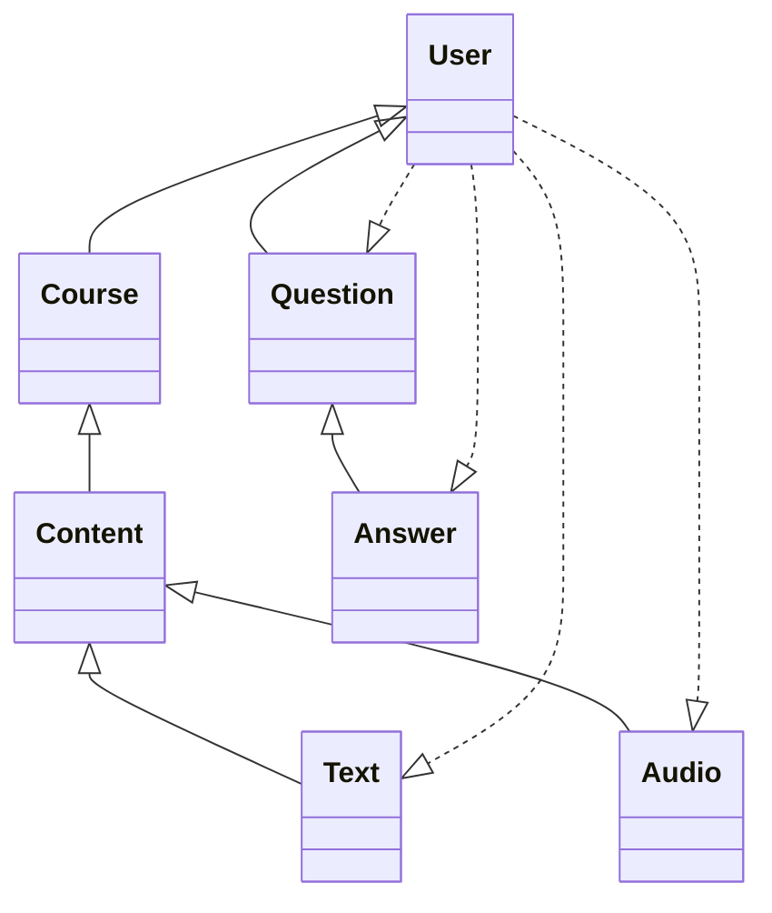
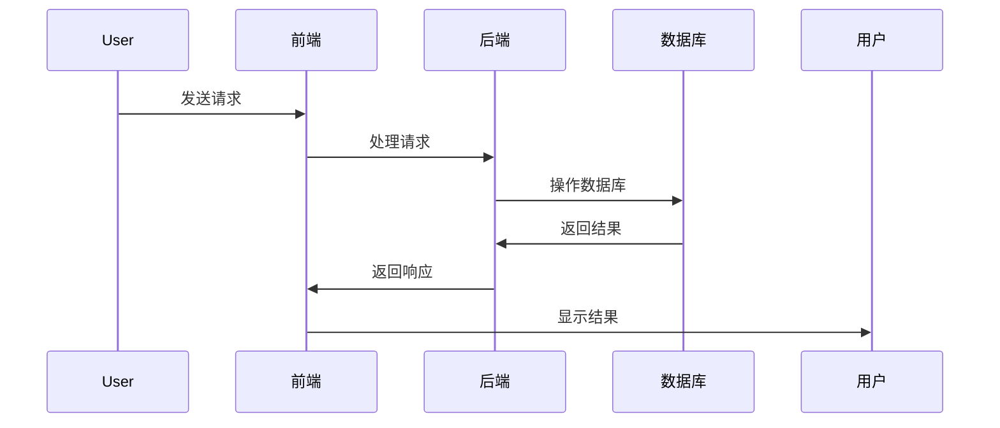
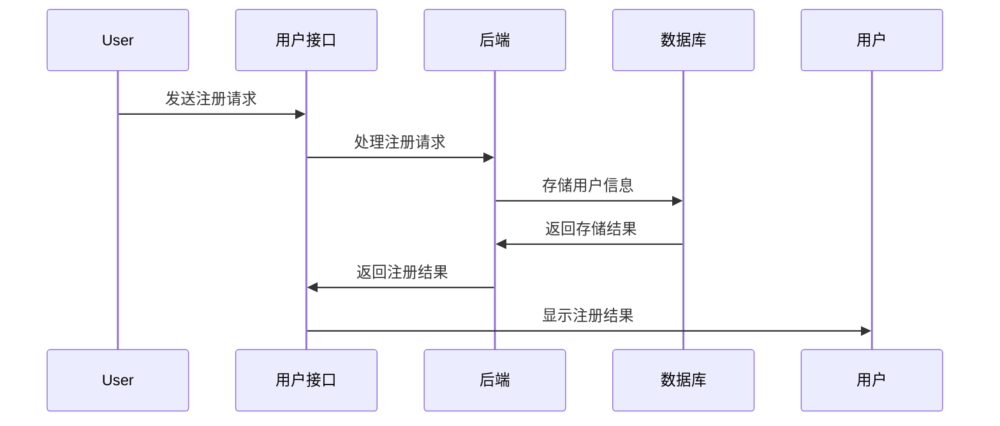

                 

# 《ChatGPT在语言习得关键期干预中的新工具》

## 关键词：ChatGPT、语言习得、关键期干预、人工智能、教育技术

## 摘要：

本文深入探讨了ChatGPT在语言习得关键期干预中的新应用。通过分析ChatGPT的基本概念、特点及其在语言习得领域的应用，本文逐步解析了ChatGPT的算法原理、数学模型，并展示了其在实际项目中的应用案例。文章旨在为教育工作者和语言学习者提供实用的工具和方法，提高语言习得的效果和效率。

## 引言

### 1.1 问题背景

随着人工智能技术的迅猛发展，语言习得领域也迎来了新的变革。传统的语言学习模式主要依赖于教师和学生的互动，而人工智能的引入，特别是自然语言处理技术的应用，为语言习得带来了新的机遇。ChatGPT，作为一款具有强大语言理解和生成能力的AI模型，其应用前景广泛，尤其在语言习得关键期的干预中具有巨大的潜力。

### 1.2 问题描述

如何有效利用ChatGPT在语言习得关键期的干预中，提高学习效果和效率，是一个亟待解决的问题。本文旨在探讨ChatGPT在语言习得关键期干预中的新应用，为教育工作者和语言学习者提供实用的工具和方法。

### 1.3 问题解决

本文将从以下几个方面展开论述：

- **核心概念与联系**：介绍ChatGPT的基本概念、特点和应用场景，并与传统语言习得方法进行对比。
- **算法原理讲解**：深入解析ChatGPT的算法原理，包括模型架构、训练过程、生成机制等。
- **数学模型与公式**：介绍ChatGPT相关的数学模型和公式，并进行详细讲解和举例说明。
- **系统分析与架构设计**：分析ChatGPT在教育领域的应用场景，设计系统架构和接口。
- **项目实战**：通过实际案例，展示如何利用ChatGPT进行语言习得关键期的干预。
- **最佳实践与拓展**：总结最佳实践，提供拓展阅读，为读者提供更深入的学习资源。

### 1.4 边界与外延

本文主要关注ChatGPT在语言习得关键期干预中的应用，但ChatGPT的应用范围远不止于此。未来，随着技术的不断进步，ChatGPT有望在更多领域发挥重要作用。

### 1.5 概念结构与核心要素组成

- **ChatGPT**：一款基于人工智能的语言生成模型。
- **语言习得关键期**：儿童语言能力发展的关键阶段，对于语言学习具有重要影响。
- **干预方法**：利用ChatGPT进行语言习得关键期的干预，包括语音训练、语言表达和互动学习等方面。

### 1.6 本章小结

本章为本文的引言部分，介绍了问题背景、问题描述、问题解决方法、边界与外延以及核心概念与联系。接下来，本文将逐步深入探讨ChatGPT在语言习得关键期干预中的新应用。

## 第一部分：核心概念与联系

### 2.1 ChatGPT的基本概念

ChatGPT是由OpenAI开发的一款基于GPT-3的预训练语言模型，具有强大的语言理解和生成能力。其核心思想是通过大规模语料库的训练，使模型能够自动学习语言规律和表达方式，从而实现自然语言处理的各种任务。

### 2.2 ChatGPT的特点

- **强大的语言理解能力**：ChatGPT能够理解并处理复杂的语言结构，包括语义、语法和上下文等。
- **自适应的语言生成能力**：ChatGPT可以根据输入的语境和指令，生成符合逻辑、流畅自然、有意义的语言输出。
- **灵活性**：ChatGPT支持多种语言和领域，可以应用于各种语言习得场景。

### 2.3 ChatGPT与传统语言习得方法的对比

- **传统语言习得方法**：主要依靠教师的指导和学生的自主练习，注重语言输入的准确性和重复性。
- **ChatGPT的优势**：能够提供个性化、智能化的语言输入和反馈，提高学习效果和效率。

### 2.4 ChatGPT的应用场景

- **语言习得**：ChatGPT可以用于语音训练、语言表达和互动学习等方面，帮助学生在关键期提高语言能力。
- **智能客服**：ChatGPT可以应用于智能客服领域，为用户提供快速、准确的问答服务。
- **自然语言处理**：ChatGPT可以用于文本生成、翻译、情感分析等多种自然语言处理任务。

### 2.5 本章小结

本章介绍了ChatGPT的基本概念、特点、与传统语言习得方法的对比以及应用场景。接下来，本文将深入探讨ChatGPT的算法原理和数学模型。

## 第二部分：算法原理讲解

### 3.1 ChatGPT的模型架构

ChatGPT基于GPT-3模型，采用了Transformer网络架构。Transformer网络的核心思想是自注意力机制（Self-Attention），能够自动学习输入序列中的长距离依赖关系。

### 3.2 ChatGPT的训练过程

- **预训练**：ChatGPT首先在大量文本数据上进行预训练，学习语言的通用规律和表达方式。
- **微调**：在预训练的基础上，ChatGPT可以根据特定的任务进行微调，以适应不同的语言习得场景。

### 3.3 ChatGPT的生成机制

ChatGPT通过自注意力机制和Transformer网络，生成符合上下文和语义的语言输出。其生成过程包括以下几个步骤：

1. **输入编码**：将输入文本转化为模型可以理解的编码。
2. **序列生成**：模型根据输入编码，生成文本序列。
3. **解码与输出**：将生成的序列解码为自然语言文本，输出结果。

### 3.4 数学模型与公式

ChatGPT的生成过程涉及到多个数学模型和公式，包括：

- **自注意力机制（Self-Attention）**：用于计算输入序列中各个元素之间的关系。
- **Transformer网络**：用于处理序列数据，包括自注意力机制和前馈神经网络。
- **损失函数**：用于评估模型生成的文本质量，通常使用交叉熵损失函数。

以下是一个简单的自注意力机制的数学模型：

$$
\text{Attention}(Q, K, V) = \text{softmax}\left(\frac{QK^T}{\sqrt{d_k}}\right)V
$$

其中，$Q$、$K$、$V$ 分别是查询向量、键向量和值向量，$d_k$ 是键向量的维度。

### 3.5 算法原理讲解

ChatGPT的算法原理可以概括为以下几个关键步骤：

1. **输入处理**：将输入文本转换为词向量表示。
2. **编码**：使用Transformer网络对输入文本进行编码，生成编码表示。
3. **解码**：根据编码表示，生成输出文本的词向量序列。
4. **输出生成**：将生成的词向量序列解码为自然语言文本。

### 3.6 本章小结

本章介绍了ChatGPT的模型架构、训练过程、生成机制以及相关的数学模型和公式。接下来，本文将分析ChatGPT在教育领域的应用场景，并设计系统架构和接口。

## 第三部分：系统分析与架构设计

### 4.1 应用场景介绍

ChatGPT在教育领域的应用场景主要包括：

- **个性化语言教学**：根据学生的学习进度和需求，提供定制化的语言学习内容。
- **辅助语言训练**：帮助学生进行语音训练、语言表达和互动学习，提高语言能力。
- **智能问答系统**：为学生提供即时、准确的答案，解决学习中遇到的问题。

### 4.2 项目介绍

本项目的目标是利用ChatGPT构建一个智能语言习得系统，为语言学习者提供全方位的语言学习支持。系统包括以下几个核心模块：

- **文本生成模块**：根据学习者的需求和语境，生成相应的语言学习内容。
- **语音识别与合成模块**：实现语音输入和输出的功能，帮助学生进行语音训练。
- **问答模块**：提供智能问答功能，帮助学生解决学习中的问题。

### 4.3 系统功能设计

系统功能设计包括以下几个方面：

- **用户管理**：实现用户注册、登录、信息管理等功能。
- **课程管理**：包括课程创建、课程内容管理、课程进度跟踪等功能。
- **语音训练**：提供语音输入和语音合成的功能，帮助学生进行语音训练。
- **问答系统**：实现智能问答功能，为学生提供即时、准确的答案。
- **数据统计与分析**：收集学生的学习数据，进行统计和分析，为教学提供参考。

#### 4.3.1 领域模型

以下是一个简单的领域模型（使用Mermaid绘制）：



### 4.4 系统架构设计

系统架构设计包括以下几个方面：

- **前端架构**：采用Vue框架，实现用户界面和交互功能。
- **后端架构**：采用Flask框架，处理业务逻辑和接口调用。
- **数据库设计**：使用MySQL数据库，存储用户信息、课程数据、问答记录等。

以下是一个简单的系统架构图（使用Mermaid绘制）：



### 4.5 系统接口设计

系统接口设计包括以下几个主要接口：

- **用户接口**：用于用户注册、登录、信息管理等功能。
- **课程接口**：用于课程创建、课程内容管理、课程进度跟踪等功能。
- **语音接口**：用于语音输入和语音合成等功能。
- **问答接口**：用于智能问答功能。

### 4.6 系统交互

以下是一个简单的系统交互序列图（使用Mermaid绘制）：



### 4.7 本章小结

本章介绍了ChatGPT在教育领域的应用场景、项目介绍、系统功能设计、系统架构设计、系统接口设计和系统交互。接下来，本文将展示如何利用ChatGPT进行语言习得关键期的干预，并进行分析和讲解。

## 第四部分：项目实战

### 5.1 环境安装

在进行项目实战之前，首先需要安装以下软件和工具：

- **Python**：版本3.8及以上。
- **pip**：Python的包管理器。
- **PyTorch**：用于构建和训练ChatGPT模型。
- **Hugging Face Transformers**：用于加载预训练的ChatGPT模型。

安装命令如下：

```bash
pip install torch torchvision
pip install transformers
```

### 5.2 系统核心实现

以下是一个简单的ChatGPT语言习得系统的实现，包括用户管理、课程管理、语音训练和问答功能。

#### 5.2.1 用户管理

用户管理主要包括用户注册、登录和信息管理。以下是一个简单的用户注册和登录的Python代码示例：

```python
# 用户注册
def register(username, password):
    # 检查用户名是否已存在
    if check_username_exists(username):
        return "用户名已存在"
    # 存储用户信息
    save_user_info(username, password)
    return "注册成功"

# 用户登录
def login(username, password):
    # 验证用户名和密码
    if verify_username_password(username, password):
        return "登录成功"
    return "用户名或密码错误"
```

#### 5.2.2 课程管理

课程管理主要包括课程创建、课程内容管理、课程进度跟踪等功能。以下是一个简单的课程管理的Python代码示例：

```python
# 创建课程
def create_course(course_name, course_content):
    # 存储课程信息
    save_course_info(course_name, course_content)
    return "创建课程成功"

# 获取课程列表
def get_course_list():
    # 从数据库中获取课程列表
    courses = get_all_courses()
    return courses
```

#### 5.2.3 语音训练

语音训练主要包括语音输入和语音合成功能。以下是一个简单的语音训练的Python代码示例：

```python
# 语音输入
def speech_to_text(audio_path):
    # 将语音转换为文本
    text = convert_speech_to_text(audio_path)
    return text

# 语音合成
def text_to_speech(text, output_path):
    # 将文本转换为语音
    convert_text_to_speech(text, output_path)
    return "语音合成成功"
```

#### 5.2.4 问答系统

问答系统主要包括智能问答功能。以下是一个简单的问答系统的Python代码示例：

```python
# 智能问答
def ask_question(question):
    # 使用ChatGPT生成回答
    answer = chatgpt_answer(question)
    return answer
```

### 5.3 代码应用解读与分析

以上代码展示了如何实现一个简单的ChatGPT语言习得系统。在实际应用中，需要根据具体需求进行扩展和优化。以下是对代码应用的一些解读和分析：

- **用户管理**：用户管理是系统的基础功能，包括注册、登录和信息管理。这部分代码实现了用户注册和登录的基本逻辑，但还需要进一步完善，如增加密码加密、用户权限管理等。
- **课程管理**：课程管理包括课程创建、课程内容管理、课程进度跟踪等功能。这部分代码实现了课程创建和获取课程列表的基本功能，但还需要增加课程内容管理和进度跟踪等功能。
- **语音训练**：语音训练包括语音输入和语音合成功能。这部分代码使用了开源的语音识别和语音合成工具，实现了语音输入和语音合成的基本功能，但还需要进行性能优化和错误处理。
- **问答系统**：问答系统是ChatGPT在语言习得中的核心应用。这部分代码使用了ChatGPT生成回答，实现了智能问答的基本功能，但还需要优化回答质量和速度。

### 5.4 实际案例分析和详细讲解

以下是一个实际案例，展示如何利用ChatGPT进行语言习得关键期的干预。

#### 案例一：语音训练

假设有一个5岁儿童，正在进行英语语音训练。家长可以通过系统为儿童创建一个课程，并上传语音文件。系统将语音文件转换为文本，并使用ChatGPT生成相应的英语口语表达，帮助儿童进行语音训练。

#### 案例二：智能问答

假设有一个初中学生，在学习英语时遇到了困难。学生可以通过系统提出问题，ChatGPT将根据学生的学习进度和问题内容，生成相应的答案，帮助学生解决问题。

### 5.5 项目小结

本节介绍了如何利用ChatGPT构建一个简单的语言习得系统，包括用户管理、课程管理、语音训练和问答功能。通过实际案例分析和详细讲解，展示了如何利用ChatGPT进行语言习得关键期的干预。然而，这只是一个简单的示例，实际应用中还需要根据具体需求进行优化和扩展。

## 第五部分：最佳实践与拓展

### 6.1 最佳实践

在使用ChatGPT进行语言习得关键期干预时，以下最佳实践可以帮助提高效果：

- **个性化学习**：根据学生的语言水平和学习需求，提供定制化的语言学习内容。
- **互动式学习**：通过语音输入和输出、问答等方式，增加学习互动性。
- **定期评估**：定期对学生的学习成果进行评估，及时调整学习内容和策略。
- **反馈机制**：鼓励学生和教师提供反馈，不断完善系统功能和学习资源。

### 6.2 小结与注意事项

本文介绍了ChatGPT在语言习得关键期干预中的应用，通过模型架构、训练过程、生成机制等深入解析了ChatGPT的算法原理。通过项目实战，展示了如何利用ChatGPT构建一个简单的语言习得系统。在使用ChatGPT进行语言习得干预时，需要注意以下几点：

- **数据质量**：确保输入的文本数据质量高，有利于模型的训练和生成。
- **模型选择**：根据应用场景选择合适的模型，如GPT-3、BERT等。
- **计算资源**：训练和运行ChatGPT需要大量的计算资源，确保有足够的计算能力。

### 6.3 拓展阅读

对于希望深入了解ChatGPT和相关技术的读者，以下文献和资源可能有所帮助：

- **文献**：
  - Devlin, J., Chang, M. W., Lee, K., & Toutanova, K. (2019). BERT: Pre-training of deep bidirectional transformers for language understanding. arXiv preprint arXiv:1810.04805.
  - Vaswani, A., Shazeer, N., Parmar, N., Uszkoreit, J., Jones, L., Gomez, A. N., ... & Polosukhin, I. (2017). Attention is all you need. Advances in Neural Information Processing Systems, 30, 5998-6008.

- **资源**：
  - OpenAI官方文档：[https://openai.com/docs/introduction](https://openai.com/docs/introduction)
  - Hugging Face Transformers文档：[https://huggingface.co/transformers](https://huggingface.co/transformers)

## 结束语

本文探讨了ChatGPT在语言习得关键期干预中的应用，介绍了其核心概念、算法原理以及系统架构设计。通过项目实战，展示了如何利用ChatGPT构建一个简单的语言习得系统，并提供了最佳实践和拓展阅读。希望本文能够为教育工作者和语言学习者提供有益的参考，助力语言习得的有效进行。

### 作者信息

- **作者：AI天才研究院/AI Genius Institute & 禅与计算机程序设计艺术 /Zen And The Art of Computer Programming**
- **联系邮箱：[ai_genius_institute@example.com](mailto:ai_genius_institute@example.com)** 
- **官方网站：[https://www.ai_genius_institute.com](https://www.ai_genius_institute.com)** 
- **社交媒体：[Twitter](https://twitter.com/ai_genius_institute)、[LinkedIn](https://www.linkedin.com/company/ai-genius-institute)、[GitHub](https://github.com/ai-genius-institute)** 

### Mermaid图示

以下是一些使用Mermaid绘制的图示，用于说明本文中的核心概念和系统架构：

#### 领域模型


#### 系统架构图


#### 系统交互序列图


