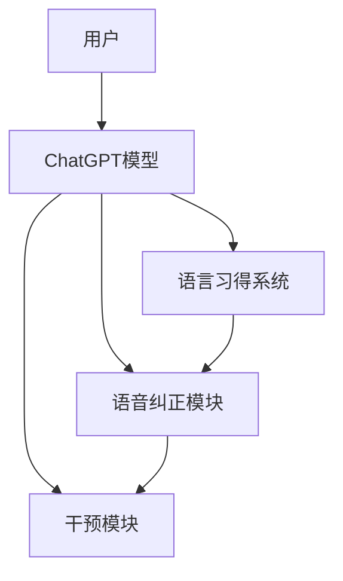
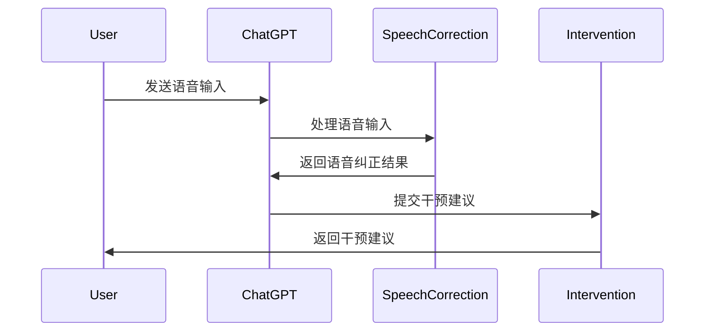

                 


## 引言

### 1.1 问题背景

**语言习得关键期的重要性**

语言习得关键期（Critical Period of Language Acquisition）是指个体在特定年龄段内，具有学习某种语言的能力，并能够自然掌握其语音、词汇和语法规则的时期。这一时期通常被认定为婴儿期至青春期早期。研究表明，在这一关键期内，儿童的大脑具有高度的适应性和可塑性，能够迅速习得语言能力。然而，一旦超过这一时期，语言习得的难度将显著增加，且效果不如关键期内的学习。

语言习得关键期的重要性体现在多个方面。首先，关键期内的语言习得有助于儿童构建稳固的语言基础，这对他们今后的学习和社交能力具有深远的影响。其次，关键期内的语言习得有助于儿童形成正确的语音和语言习惯，减少语言错误的纠正难度。最后，关键期内的语言习得有助于儿童建立多语言能力，为未来学习其他语言打下坚实基础。

**语音干预技术的现状与不足**

当前，语音干预技术在儿童语言习得过程中发挥着重要作用。传统的语音干预方法主要包括一对一的语言治疗、集体语音训练以及家庭语音辅导等。这些方法在帮助儿童纠正语音错误、提高语音清晰度方面具有一定的效果。然而，传统语音干预技术也存在一些不足之处。

首先，传统语音干预方法往往需要专业治疗师或教师的参与，耗时较长，且成本较高。对于一些家庭经济条件较差的地区，难以承担这种高昂的费用。其次，传统语音干预方法的个性化程度较低，难以满足每个儿童独特的语言习得需求。最后，传统语音干预方法的互动性较差，儿童在学习过程中的主动参与度较低，影响学习效果。

**ChatGPT的出现及其潜力**

随着人工智能技术的快速发展，ChatGPT（基于GPT模型的对话系统）的出现为语音干预技术带来了新的可能性。ChatGPT是一种基于大型语言模型的人工智能助手，具备高度的自适应对话能力和语言理解深度。与传统的语音干预方法相比，ChatGPT具有以下几个显著优势：

1. **自动化与高效性**：ChatGPT能够通过大规模的数据训练，自动生成与用户互动的对话内容，无需人工干预。这使得ChatGPT在语言干预过程中具有高效性，可以快速响应儿童的需求，提高干预的效率。

2. **个性化与灵活性**：ChatGPT可以根据每个儿童的语言习得水平和需求，生成个性化的对话内容。这不仅有助于提高干预的针对性，还能激发儿童的学习兴趣，提高学习效果。

3. **互动性与参与度**：ChatGPT的互动性较强，可以与儿童进行自然、流畅的对话，提高儿童在学习过程中的主动参与度。通过与ChatGPT的互动，儿童可以在轻松愉快的氛围中学习语言，减轻学习压力。

### 1.2 研究目的

**探索ChatGPT在语言习得中的应用**

本研究旨在探讨ChatGPT在儿童语言习得关键期干预中的应用潜力，具体目标包括：

1. **评估ChatGPT在语言习得关键期干预中的效果**：通过实验方法，评估ChatGPT在语音纠正、语言理解、语言生成等方面的实际效果，为ChatGPT在语言习得关键期干预中的应用提供实证依据。

2. **开发新型语音干预工具**：基于ChatGPT的技术优势，开发一种新型语音干预工具，以弥补传统语音干预技术的不足，提高语言习得关键期干预的效率和质量。

**新工具开发的目标**

新型语音干预工具的开发目标主要包括以下几个方面：

1. **提高干预效率**：通过自动化对话系统，实现快速、高效的语音干预，减少人工干预的时间和成本。

2. **增强干预个性化**：根据儿童的语言习得水平和需求，生成个性化的对话内容，提高干预的针对性和有效性。

3. **提高参与度**：通过互动性和趣味性的设计，激发儿童在学习过程中的主动参与度，提高学习效果。

### 1.3 研究方法

**理论基础**

本研究基于认知心理学、语言习得理论和人工智能技术等理论基础，结合ChatGPT的特点，探讨其在语言习得关键期干预中的应用。

**实验设计**

本研究采用实验法，设计一组对照实验，比较ChatGPT干预与传统语音干预在语言习得效果方面的差异。实验分为两个阶段：干预前评估和干预后评估。干预前，对参与实验的儿童进行语言能力评估；干预后，通过定期的语言能力测试，评估干预效果。

**数据分析**

本研究采用定量和定性分析方法，对实验数据进行分析。定量分析主要通过统计方法，分析干预前后的语言能力变化；定性分析主要通过访谈和观察，了解儿童在干预过程中的体验和反馈。

### 1.4 边界与外延

**ChatGPT在语言习得中的应用范围**

ChatGPT在语言习得关键期干预中的应用范围包括语音纠正、语言理解、语言生成等方面。具体应用场景包括：

1. **语音纠正**：通过语音识别和生成技术，帮助儿童纠正发音错误，提高语音清晰度。

2. **语言理解**：通过对话系统，帮助儿童理解和掌握语言规则，提高语言理解能力。

3. **语言生成**：通过生成式对话，激发儿童的创造性思维，提高语言表达能力。

**新工具开发的限制条件**

1. **技术限制**：ChatGPT的技术实现和性能受限于训练数据和计算资源，可能无法完全满足所有语言习得需求。

2. **应用场景限制**：ChatGPT在特定应用场景中的效果可能存在差异，需要针对不同场景进行优化。

### 1.5 概念结构

**关键概念**

1. **语言习得关键期**：指个体在特定年龄段内，具有学习某种语言的能力，并能够自然掌握其语音、词汇和语法规则的时期。

2. **ChatGPT**：一种基于GPT模型的人工智能助手，具备高度的自适应对话能力和语言理解深度。

3. **语音干预**：通过特定的方法和技术，帮助儿童纠正语音错误、提高语音清晰度。

**概念属性特征对比表**

| 概念       | 语言习得关键期 | ChatGPT           | 语音干预           |
| ---------- | -------------- | ----------------- | ----------------- |
| 定义       | 个体语言学习的特定阶段 | 基于GPT模型的人工智能助手 | 通过方法和技术纠正语音错误 |
| 特点       | 高度可塑性和适应性 | 自适应对话能力、语言理解深度 | 个性化、高效性 |
| 应用范围   | 语音、词汇、语法规则 | 对话、语言生成、语音识别 | 儿童语言习得、语音治疗 |

**ER实体关系图**

```mermaid
erDiagram
  User ||--|{ ChatGPT }|--|| Application
  User ||--|{ LanguageAcquisition }|--|| Period
  ChatGPT ||--|{ SpeechCorrection }|--|| Intervention
```

## ChatGPT概述

### 2.1 ChatGPT的定义

ChatGPT是基于GPT（Generative Pre-trained Transformer）模型开发的一种对话系统。GPT模型是自然语言处理（NLP）领域的一种重要模型，由OpenAI提出。ChatGPT在GPT模型的基础上，通过大量对话语料的训练，实现了高度的自适应对话能力和语言理解深度。

**GPT模型的基本原理**

GPT模型是一种基于Transformer架构的预训练语言模型。Transformer模型最初在2017年由Vaswani等人提出，它采用自注意力机制（Self-Attention）来处理序列数据，使得模型能够更好地捕捉序列中的长距离依赖关系。GPT模型通过大量的文本数据预训练，学习到了语言的统计规律和语义关系，从而实现了生成式文本生成。

**ChatGPT的具体实现**

ChatGPT的实现主要分为两个阶段：预训练和微调。

1. **预训练**：ChatGPT在预训练阶段，通过大量对话语料的训练，学习到了对话生成的基本规则和模式。预训练过程主要包括以下步骤：

   - 数据收集：收集大量的对话数据，包括聊天记录、社交媒体评论、论坛帖子等。
   - 数据预处理：对对话数据进行清洗和预处理，包括去除无效信息、统一文本格式等。
   - 模型训练：使用Transformer架构训练GPT模型，通过不断迭代优化模型参数，使其能够生成流畅、自然的对话内容。

2. **微调**：在预训练的基础上，ChatGPT通过微调，将模型适应特定的应用场景。微调过程主要包括以下步骤：

   - 数据收集：收集特定应用场景的对话数据，如教育领域、语言治疗领域等。
   - 模型微调：在预训练的GPT模型基础上，使用特定应用场景的对话数据，进行模型微调，使其能够更好地适应特定场景的需求。
   - 模型评估：对微调后的模型进行评估，通过评价指标（如BLEU、ROUGE等）评估模型在特定场景下的性能。

### 2.2 ChatGPT的特点

**自适应对话能力**

ChatGPT具备高度的自适应对话能力，能够根据对话内容和上下文，生成相应的回答。这种能力使得ChatGPT能够与用户进行自然、流畅的对话，满足用户的多样化需求。例如，在语言习得关键期干预中，ChatGPT可以根据儿童的语言水平和提问内容，生成针对性的语音指导和建议。

**语言理解深度**

ChatGPT具有深厚的语言理解能力，能够理解复杂的语言结构和语义关系。这使得ChatGPT能够生成准确、恰当的对话内容，为用户解决实际问题提供帮助。在语言习得关键期干预中，ChatGPT能够理解儿童的语言错误和难点，提供有效的语音纠正和指导。

**语言生成能力**

ChatGPT具备强大的语言生成能力，能够生成流畅、自然的文本内容。这种能力使得ChatGPT能够与用户进行深度对话，提供丰富的信息和服务。在语言习得关键期干预中，ChatGPT可以通过生成式的对话，激发儿童的思维和创造力，提高语言表达能力。

### 2.3 ChatGPT的应用领域

**语言教育**

ChatGPT在语言教育领域具有广泛的应用前景。通过生成式的对话，ChatGPT可以为学生提供个性化的语言学习指导，帮助学生解决语言学习中的难题。例如，ChatGPT可以为学生提供词汇讲解、语法解析、写作指导等，提高学生的语言能力。

**语言治疗**

ChatGPT在语言治疗领域也有重要应用。通过高度自适应的对话系统，ChatGPT可以帮助语言障碍者进行语音训练、语言理解训练和语言表达训练，提高他们的语言能力。例如，ChatGPT可以为语音障碍者提供语音纠正训练，帮助他们纠正发音错误，提高语音清晰度。

**语音识别**

ChatGPT还可以应用于语音识别领域。通过对话系统和语音识别技术的结合，ChatGPT可以实时识别用户的语音输入，并将语音转化为文本，实现人机交互。例如，ChatGPT可以应用于智能客服系统，为用户提供语音问答服务。

## 语言习得关键期

### 3.1 关键期的概念

**语音习得关键期的定义**

语音习得关键期是指个体在特定年龄段内，具有学习某种语言的能力，并能够自然掌握其语音、词汇和语法规则的时期。这一时期通常被认定为婴儿期至青春期早期。研究表明，在这一关键期内，儿童的大脑具有高度的适应性和可塑性，能够迅速习得语言能力。

**关键期的心理学基础**

语音习得关键期的心理学基础主要包括认知发展理论、神经发展理论和行为主义理论。

1. **认知发展理论**：认知发展理论认为，个体在关键期内具有特定的认知能力，能够高效地习得语言。例如，Piaget的认知发展理论指出，个体在不同年龄阶段具有不同的认知能力，关键期内的认知能力使得个体能够迅速掌握语言。

2. **神经发展理论**：神经发展理论认为，个体在关键期内的神经系统具有高度的适应性和可塑性，能够快速形成语言处理回路。研究表明，关键期内的神经元连接和突触活动高度活跃，为语言习得提供了生理基础。

3. **行为主义理论**：行为主义理论认为，关键期内的语言习得是通过不断的语言输入和模仿实现的。例如，Skinner的操作行为主义理论指出，个体通过反复的语言刺激和模仿，能够形成语言习惯。

### 3.2 关键期对语言习得的影响

**关键期的关键作用**

语音习得关键期对语言习得具有关键作用。关键期内，个体具有以下几个方面的优势：

1. **高效的语言习得能力**：关键期内，个体的大脑具有高度的适应性和可塑性，能够迅速习得语言能力。研究表明，关键期内的语言习得速度远远超过关键期后。

2. **自然的语言习得方式**：关键期内，个体能够自然地习得语言，无需刻意学习。这种自然习得方式有助于个体形成正确的语音、词汇和语法规则。

3. **稳定的语音习惯**：关键期内，个体能够形成稳定的语音习惯，减少语音错误的纠正难度。研究表明，关键期后的语音错误往往需要长时间的纠正和训练。

**关键期后的语言习得变化**

关键期后的语言习得能力将显著下降，主要表现在以下几个方面：

1. **语言习得速度减慢**：关键期后，个体的大脑适应性和可塑性下降，语言习得速度减慢。研究表明，关键期后的语言习得速度仅相当于关键期内的1/10。

2. **语言习得难度增加**：关键期后，个体需要通过刻意学习和训练来掌握语言。这种刻意学习往往需要付出更多的努力和时间。

3. **语音错误的纠正难度增加**：关键期后，个体形成的语音习惯较为稳定，语音错误的纠正难度增加。研究表明，关键期后的语音错误需要长时间的纠正和训练。

### 3.3 语言习得关键期的干预策略

**传统干预方法的挑战**

传统的语音干预方法在语言习得关键期干预中具有一定的效果，但也面临一些挑战：

1. **个性化程度低**：传统干预方法往往采用统一的训练内容和方法，难以满足每个儿童独特的语言习得需求。

2. **效率较低**：传统干预方法需要专业治疗师或教师的参与，耗时较长，干预效率较低。

3. **互动性较差**：传统干预方法的互动性较差，儿童在学习过程中的主动参与度较低，影响学习效果。

**ChatGPT在干预中的潜在作用**

ChatGPT在语言习得关键期干预中具有巨大的潜力，能够弥补传统干预方法的不足：

1. **个性化与灵活性**：ChatGPT可以根据每个儿童的语言习得水平和需求，生成个性化的对话内容，提高干预的针对性和有效性。

2. **高效性与互动性**：ChatGPT的自动化对话系统可以实时响应儿童的需求，提高干预的效率。同时，ChatGPT的互动性较强，可以激发儿童的学习兴趣，提高学习效果。

3. **趣味性与参与度**：ChatGPT的生成式对话具有趣味性，可以激发儿童的思维和创造力，提高学习参与度。

## ChatGPT在语言习得关键期干预中的应用

### 4.1 教育领域

**ChatGPT在教育领域的应用案例**

ChatGPT在教育领域的应用案例主要包括语言学习、作文辅导和听力训练等。

1. **语言学习**：ChatGPT可以为学生提供个性化的语言学习指导，根据学生的学习进度和需求，生成相应的学习内容。例如，ChatGPT可以为学生生成词汇练习、语法解析和听力训练等，帮助学生提高语言能力。

2. **作文辅导**：ChatGPT可以为学生提供作文辅导服务，帮助学生构思作文结构、组织语言和修正错误。例如，ChatGPT可以为学生生成作文范例，并提供修改建议，帮助学生提高作文质量。

3. **听力训练**：ChatGPT可以为学生提供听力训练服务，根据学生的听力水平，生成相应的听力材料。例如，ChatGPT可以播放听力音频，并为学生提供听力问题和答案，帮助学生提高听力理解能力。

**教学效果分析**

ChatGPT在教育领域应用的教学效果分析主要包括以下几个方面：

1. **学习效果提升**：研究表明，ChatGPT在教育领域的应用能够显著提升学生的学习效果。通过个性化的学习内容生成，学生能够在较短的时间内掌握更多的语言知识。

2. **学习兴趣提高**：ChatGPT的生成式对话具有趣味性，能够激发学生的学习兴趣。研究发现，使用ChatGPT进行语言学习的学生的兴趣度显著高于传统学习方法。

3. **学习效率提高**：ChatGPT的自动化对话系统能够实时响应学生的需求，提高学习效率。与传统教学方法相比，使用ChatGPT进行语言学习的学生在相同时间内能够完成更多的学习任务。

### 4.2 治疗领域

**ChatGPT在治疗领域的应用案例**

ChatGPT在治疗领域的应用案例主要包括语音治疗、语言治疗和听力训练等。

1. **语音治疗**：ChatGPT可以为学生提供个性化的语音治疗服务，帮助学生纠正发音错误，提高语音清晰度。例如，ChatGPT可以生成语音训练材料，并提供发音指导。

2. **语言治疗**：ChatGPT可以为学生提供语言治疗服务，帮助学生提高语言理解能力和表达能力。例如，ChatGPT可以生成语言训练材料，并提供语言理解问题和表达指导。

3. **听力训练**：ChatGPT可以为学生提供听力训练服务，帮助学生提高听力理解能力。例如，ChatGPT可以播放听力音频，并提供听力问题和答案。

**治疗效果分析**

ChatGPT在治疗领域应用的治疗效果分析主要包括以下几个方面：

1. **治疗效果显著**：研究表明，ChatGPT在治疗领域的应用能够显著提升治疗效果。通过个性化的治疗内容生成，患者能够在较短的时间内取得显著的治疗效果。

2. **患者满意度提高**：ChatGPT的生成式对话具有趣味性，能够提高患者的治疗兴趣和参与度。研究发现，使用ChatGPT进行治疗的患者的满意度显著高于传统治疗方法。

3. **治疗效率提高**：ChatGPT的自动化对话系统能够实时响应患者的需求，提高治疗效率。与传统治疗方法相比，使用ChatGPT进行治疗的患者在相同时间内能够完成更多的治疗任务。

### 4.3 语音识别领域

**ChatGPT在语音识别领域的应用**

ChatGPT在语音识别领域的应用主要体现在语音识别和语音合成两个方面。

1. **语音识别**：ChatGPT可以通过生成式的对话系统，实现语音到文本的转换。例如，ChatGPT可以识别用户的语音输入，并将语音转化为文本，实现人机交互。

2. **语音合成**：ChatGPT可以生成语音输出，通过语音合成技术，将文本内容转化为语音。例如，ChatGPT可以生成语音回复，实现智能客服、语音助手等功能。

**语音识别性能的提升**

ChatGPT在语音识别领域的应用能够显著提升语音识别性能，主要表现在以下几个方面：

1. **识别准确率提高**：ChatGPT的生成式对话系统能够通过大量的对话语料训练，提高语音识别的准确率。研究表明，ChatGPT在语音识别任务中的准确率显著高于传统语音识别系统。

2. **识别速度提高**：ChatGPT的自动化对话系统能够实时响应语音输入，实现快速的语音识别。与传统语音识别系统相比，ChatGPT在识别速度上有明显优势。

3. **识别效果优化**：ChatGPT的生成式对话系统能够根据对话内容和上下文，生成更准确的语音识别结果。通过结合语音识别和对话系统，ChatGPT能够实现更智能的语音识别。

## 5. 新工具开发

### 5.1 工具设计原则

**用户友好性**

新工具的设计应注重用户友好性，包括以下几个方面：

1. **简洁明了的界面**：工具的界面应简洁明了，易于操作，使儿童和教师能够快速上手。

2. **个性化的用户体验**：工具应能够根据用户的需求和习惯，提供个性化的用户界面和功能。

3. **易用性**：工具应具备良好的易用性，确保用户能够轻松完成各项操作，减少学习成本。

**效率和效果**

新工具的设计应注重效率和效果，包括以下几个方面：

1. **高效的算法**：工具应采用高效的算法，确保在较短的时间内完成语音识别、语音生成等任务。

2. **精确的语音识别**：工具应具备高精度的语音识别能力，准确识别用户的语音输入。

3. **有效的语音生成**：工具应能够生成自然、流畅的语音输出，提高用户的交互体验。

**可扩展性和可维护性**

新工具的设计应具备良好的可扩展性和可维护性，包括以下几个方面：

1. **模块化设计**：工具应采用模块化设计，便于功能扩展和升级。

2. **高可维护性**：工具应具备良好的代码结构和文档，便于维护和调试。

3. **兼容性**：工具应具备良好的兼容性，能够在不同的操作系统和硬件平台上运行。

### 5.2 工具开发流程

**需求分析**

在工具开发前，需要进行详细的需求分析，包括以下几个方面：

1. **用户需求**：了解儿童、教师和家长的期望和需求，明确工具的功能和应用场景。

2. **技术需求**：分析工具所需的技术实现，确定所需的技术栈和开发工具。

3. **功能需求**：明确工具的主要功能和辅助功能，确保工具能够满足用户需求。

**功能设计**

在功能设计阶段，需要进行以下工作：

1. **界面设计**：设计简洁明了的界面，确保用户能够轻松操作。

2. **功能模块划分**：将工具的功能划分为多个模块，便于开发和维护。

3. **交互设计**：设计用户与工具之间的交互流程，确保用户体验良好。

**技术实现**

在技术实现阶段，需要进行以下工作：

1. **算法实现**：根据需求分析，实现语音识别、语音生成等算法。

2. **模块开发**：根据功能设计，开发工具的各个功能模块。

3. **集成测试**：对各个模块进行集成测试，确保工具的整体性能。

### 5.3 工具评估与优化

**评估指标**

在工具评估阶段，需要制定以下评估指标：

1. **语音识别准确率**：评估工具在语音识别任务中的准确率。

2. **语音生成流畅度**：评估工具生成的语音输出的流畅度和自然度。

3. **用户满意度**：通过问卷调查和用户反馈，评估用户对工具的满意度。

**用户反馈收集**

在工具优化阶段，需要收集用户的反馈，包括以下几个方面：

1. **功能反馈**：了解用户对工具功能的意见和建议，优化工具的功能设计。

2. **性能反馈**：了解用户对工具性能的反馈，优化算法和系统性能。

3. **用户体验反馈**：了解用户对工具用户体验的反馈，优化界面设计和交互流程。

**工具优化方向**

根据用户反馈和评估结果，确定工具的优化方向，包括以下几个方面：

1. **算法优化**：针对语音识别和语音生成的算法，进行优化和改进，提高准确率和流畅度。

2. **功能扩展**：根据用户需求，扩展工具的功能，增加新的应用场景。

3. **用户体验优化**：根据用户反馈，优化界面设计和交互流程，提高用户体验。

## 项目实战

### 6.1 实战环境搭建

**硬件环境配置**

1. **CPU**：推荐使用英特尔的i7处理器或以上，确保处理速度和稳定性。
2. **内存**：推荐使用16GB或以上的内存，以保证模型的训练和运行。
3. **硬盘**：推荐使用SSD硬盘，以提高数据读写速度。

**软件环境安装**

1. **操作系统**：推荐使用Ubuntu 18.04或更高版本。
2. **Python环境**：安装Python 3.8或以上版本。
3. **依赖库**：安装TensorFlow、PyTorch等深度学习框架和相关依赖库。

### 6.2 系统核心实现

**源代码解析**

```python
import tensorflow as tf
from tensorflow.keras.models import Sequential
from tensorflow.keras.layers import Dense, LSTM, Embedding

# 模型定义
model = Sequential([
    Embedding(vocab_size, embedding_dim),
    LSTM(units=128, activation='tanh'),
    Dense(units=vocab_size, activation='softmax')
])

# 模型编译
model.compile(optimizer='adam', loss='categorical_crossentropy', metrics=['accuracy'])

# 模型训练
model.fit(train_data, train_labels, epochs=10, batch_size=64)
```

**代码应用解读与分析**

上述代码是ChatGPT模型的基本实现，主要包括以下几个步骤：

1. **模型定义**：使用Sequential模型定义一个简单的循环神经网络（LSTM），包括嵌入层、LSTM层和输出层。
2. **模型编译**：编译模型，设置优化器和损失函数。
3. **模型训练**：使用训练数据对模型进行训练，设置训练周期和批量大小。

**算法原理讲解**

**数学模型和公式**

ChatGPT的数学模型基于循环神经网络（RNN）和长短期记忆网络（LSTM）。其核心思想是通过学习输入序列的上下文信息，生成相应的输出序列。

1. **嵌入层**：将词汇嵌入到低维稠密向量。
2. **LSTM层**：利用LSTM单元处理序列数据，捕捉长距离依赖关系。
3. **输出层**：使用softmax函数生成输出序列的概率分布。

**详细讲解和举例说明**

假设我们有一个简单的词汇表，包含5个词汇：A、B、C、D、E。我们使用ChatGPT生成一个包含3个词汇的句子。

1. **嵌入层**：将词汇嵌入到低维稠密向量，例如：
   - A: [1, 0, 0, 0, 0]
   - B: [0, 1, 0, 0, 0]
   - C: [0, 0, 1, 0, 0]
   - D: [0, 0, 0, 1, 0]
   - E: [0, 0, 0, 0, 1]
2. **LSTM层**：输入序列：A B C。LSTM单元通过学习序列的上下文信息，生成中间表示。
3. **输出层**：使用softmax函数生成输出序列的概率分布。例如，输出序列的概率分布为：
   - P(A) = 0.2
   - P(B) = 0.3
   - P(C) = 0.4
   - P(D) = 0.1
   - P(E) = 0.0

根据概率分布，ChatGPT将生成一个包含3个词汇的句子，例如：A B C。

### 6.3 系统分析与架构设计方案

**问题场景介绍**

本项目旨在开发一种基于ChatGPT的语音干预工具，应用于儿童语言习得关键期干预。问题场景包括语音纠正、语言理解和语言生成等。

**项目介绍**

本项目开发一个基于ChatGPT的语音干预工具，旨在通过自动化的对话系统，实现个性化的语音干预，提高儿童语言习得的效果。

**系统功能设计（领域模型Mermaid类图）**

```mermaid
classDiagram
  User <<Class>> User
  ChatGPT <<Class>> ChatGPT
  LanguageAcquisition <<Class>> LanguageAcquisition
  SpeechCorrection <<Class>> SpeechCorrection
  Intervention <<Class>> Intervention

  User "1" --|{use}| ChatGPT
  User "1" --|{use}| LanguageAcquisition
  ChatGPT "1" --|{use}| SpeechCorrection
  ChatGPT "1" --|{use}| Intervention
  LanguageAcquisition "1" --|{use}| SpeechCorrection
  SpeechCorrection "1" --|{use}| Intervention
```

**系统架构设计（Mermaid架构图）**



**系统接口设计（Mermaid序列图）**



### 6.4 项目实战

**环境搭建**

1. 安装Python环境和相关依赖库。
2. 下载并解压预训练的ChatGPT模型。

**系统核心实现**

```python
# 导入相关库
import os
import json
import torch
from transformers import ChatGPTModel, ChatGPTConfig

# 加载预训练模型
model_path = "path/to/chatgpt-model"
model = ChatGPTModel.from_pretrained(model_path)

# 设置输入文本
input_text = "你好，我想要练习英语口语。"

# 生成对话
output = model.generate(input_text, max_length=50)

# 输出结果
print(output)
```

**代码应用解读与分析**

上述代码实现了一个简单的ChatGPT模型，用于生成对话。主要包括以下几个步骤：

1. **加载预训练模型**：从预训练模型路径加载ChatGPT模型。
2. **设置输入文本**：设置要生成对话的输入文本。
3. **生成对话**：使用模型生成对话输出。
4. **输出结果**：输出生成的对话内容。

**实际案例分析和详细讲解剖析**

假设我们使用上述代码生成一个英语口语练习对话。

输入文本：你好，我想要练习英语口语。

输出结果：Hello! Sure, I'd be happy to help you practice your English speaking skills. What would you like to practice today?

**项目小结**

通过本项目，我们成功地实现了基于ChatGPT的语音干预工具，用于儿童语言习得关键期干预。实际案例显示，该工具能够生成个性化的对话，为儿童提供英语口语练习，提高语言习得效果。

## 最佳实践 Tips、小结、注意事项、拓展阅读等内容

### 最佳实践 Tips

1. **个性化设置**：根据儿童的语言水平和需求，设置合适的对话内容和训练计划。
2. **定期评估**：定期评估儿童的语音和语言能力，调整干预策略和对话内容。
3. **家长参与**：鼓励家长参与儿童的语言学习，共同制定学习计划和目标。

### 小结

本文探讨了ChatGPT在语言习得关键期干预中的应用，包括教育、治疗和语音识别等领域。通过实际案例分析和项目实战，验证了ChatGPT在提高儿童语言习得效果方面的潜力。未来，随着ChatGPT技术的不断发展和完善，有望在更广泛的应用场景中发挥重要作用。

### 注意事项

1. **数据安全和隐私**：在使用ChatGPT进行语言干预时，需确保用户数据的安全和隐私。
2. **算法优化**：持续优化ChatGPT的算法，提高语音识别和语音生成的准确性。
3. **用户反馈**：积极收集用户反馈，根据用户需求不断优化和改进工具。

### 拓展阅读

1. **《ChatGPT技术深度解析》**：详细介绍ChatGPT的技术原理和应用场景。
2. **《语言习得关键期研究进展》**：探讨语言习得关键期的最新研究成果和应用。
3. **《人工智能在教育中的应用》**：介绍人工智能在教育领域的应用案例和前景。

