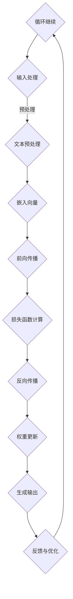
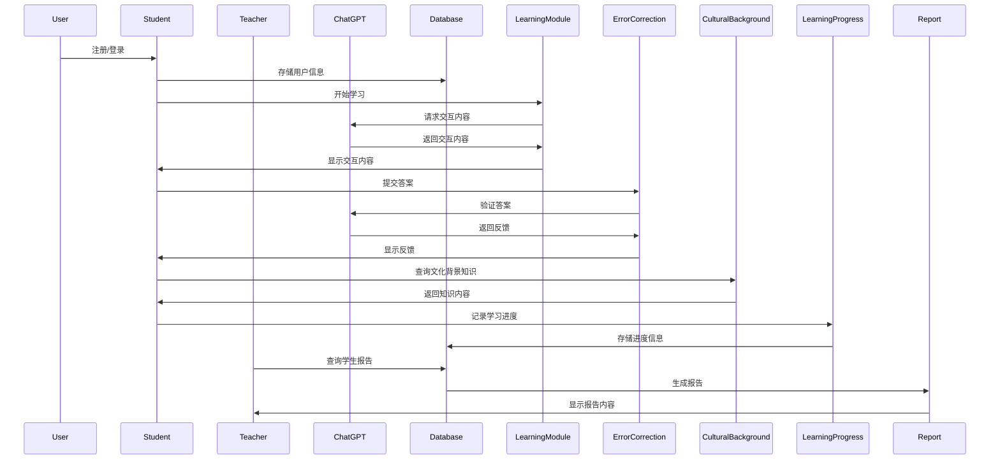
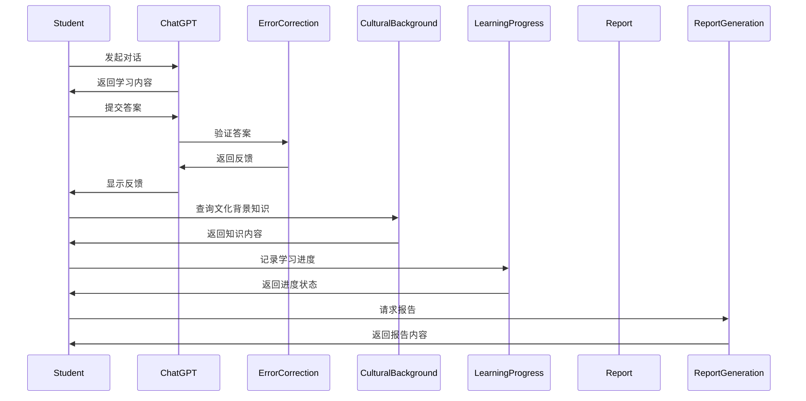

                 

### 1.1 语言习得关键期的定义与重要性

**1.1.1 语言习得关键期的定义**

语言习得关键期（Critical Period for Language Acquisition）是指个体在特定年龄范围内最容易、最有效地学习语言的时期。这个概念最早由语言学家Lenneberg于1967年提出，他指出大脑中的语言习得装置（Language Acquisition Device，LAD）在儿童早期阶段最为活跃，随着年龄的增长，这个装置的敏感性会逐渐减弱。关键期的具体时间跨度因个体差异而异，但普遍认为在0到10岁之间，尤其是3到6岁是语言习得的关键期。

关键期的定义涉及多个因素，包括生理发育、认知发展和社会交互等。生理发育方面，婴儿大脑中负责语言处理的区域在出生后迅速发育，到了关键期达到高峰。认知发展方面，儿童在关键期内具有较强的模仿和学习能力，能够迅速掌握语言规则和语音特征。社会交互方面，儿童在这一时期与父母和同龄人的交流频繁，为语言习得提供了丰富的语言输入和互动环境。

**1.1.2 语言习得关键期的重要性**

语言习得关键期对于个体语言能力的形成至关重要，其主要体现在以下几个方面：

1. **语言习得效率高**：在关键期内，儿童能够高效地习得语言。他们能够快速识别和掌握语音、语调和语法结构，甚至能够在没有正式教学的情况下，自主构建复杂的语言系统。

2. **语音习得优势**：关键期内的儿童对语音的习得尤为敏感，他们能够轻松掌握多种语言的发音和音调，尤其是那些在母语中不存在或难以掌握的音素。

3. **语法习得能力**：在关键期内，儿童具有出色的语法习得能力。他们能够迅速理解和掌握语法规则，甚至能够在没有明确语法教学的情况下，自发地运用正确的语法结构进行表达。

4. **社会适应能力**：关键期内的语言习得有助于提高个体的社会适应能力。语言是人际交往的重要工具，早期良好的语言习得能够帮助儿童更快地融入社会，建立良好的人际关系。

总之，语言习得关键期是语言能力发展的重要阶段。理解关键期的定义和重要性，有助于教育工作者和家长更好地指导儿童的语言学习，创造有利于语言习得的环境和条件。

### 1.2 ChatGPT的定义与特点

**1.2.1 ChatGPT的基本概念**

ChatGPT是由OpenAI开发的一种基于Transformer模型的人工智能聊天机器人，其核心在于利用深度学习技术，通过对海量文本数据的训练，实现与人类的自然语言交互。ChatGPT采用了GPT（Generative Pre-trained Transformer）架构，这是一种自回归语言模型，能够预测文本序列中的下一个单词或字符，从而生成连贯的自然语言响应。

ChatGPT的基本概念包括以下几个方面：

1. **Transformer模型**：Transformer模型是一种基于自注意力机制的神经网络架构，最早由Vaswani等人于2017年提出。自注意力机制允许模型在生成文本时，对输入序列中的每个词进行加权，从而更好地捕捉词与词之间的依赖关系。

2. **预训练与微调**：ChatGPT首先通过大规模的预训练过程，从互联网上的大量文本中学习语言模式和规律。然后，通过特定任务的数据进行微调，使其能够在特定场景下提供高质量的回答。

3. **上下文理解**：ChatGPT能够理解并处理复杂的上下文信息，这使得它能够生成更加自然和相关的回答。在对话中，ChatGPT会持续跟踪之前的对话内容，确保回答与前文保持一致性。

**1.2.2 ChatGPT的特点**

ChatGPT具有以下几个显著特点：

1. **高度的语言生成能力**：ChatGPT能够生成流畅且自然的文本，其语言风格和表达方式接近人类。无论是在闲聊、问答，还是生成文章、故事等，ChatGPT都能胜任。

2. **广泛的领域适应性**：ChatGPT经过预训练，具备处理多种主题和领域的能力。从科学、技术到文化、娱乐，ChatGPT都能提供相关的信息和解答。

3. **强大的学习与适应能力**：ChatGPT能够通过不断的交互和学习，逐步提升其回答的质量和准确性。每次对话后，ChatGPT都会更新其模型，使其更加精准地理解用户的意图。

4. **高效的对话管理**：ChatGPT具备良好的对话管理能力，能够在对话中维持上下文的连贯性，并根据用户的反馈调整回答策略。

5. **隐私保护**：ChatGPT的设计注重用户隐私保护，所有对话数据都被加密存储，并且不会被用于其他目的，确保用户的对话安全。

通过以上特点，ChatGPT不仅在技术层面表现出色，同时也具有广泛的应用潜力。在教育、客服、娱乐等多个领域，ChatGPT都展现了其独特的价值，为人类与机器的交互开辟了新的可能性。

### 1.3 语言习得与关键期的关系

**1.3.1 ChatGPT在语言习得关键期中的作用**

ChatGPT作为一种先进的自然语言处理技术，在语言习得关键期中扮演着重要角色。它不仅是一个辅助工具，更是语言习得过程中的一个强大助手。以下是ChatGPT在语言习得关键期中的几个关键作用：

1. **增强语言输入**：ChatGPT能够生成大量、多样化的语言输入，为学习者提供丰富的语言材料。这些语言输入不仅涵盖了日常对话，还包括了不同领域和场景的文本，有助于学习者全面接触和理解语言。

2. **个性化学习体验**：ChatGPT可以根据学习者的水平、需求和兴趣，提供定制化的语言学习内容。通过分析学习者的回答和交互记录，ChatGPT可以不断调整其生成的内容，使其更加符合学习者的学习路径。

3. **互动式语言练习**：ChatGPT能够模拟真实的语言交流环境，与学习者进行实时对话。这种互动式练习不仅提高了学习者的口语表达能力，还能帮助他们更好地理解语言的使用场景和规则。

4. **错误纠正与反馈**：ChatGPT具备自动纠错和提供即时反馈的能力。当学习者犯错误时，ChatGPT可以指出错误并提供正确的用法解释，帮助学习者及时纠正错误，强化正确的语言习惯。

5. **文化背景知识普及**：ChatGPT能够提供丰富的文化背景知识，帮助学习者更好地理解语言背后的文化和语境。这对于跨文化交流和语言习得至关重要。

**1.3.2 ChatGPT与关键期的结合点**

ChatGPT与语言习得关键期的结合点主要体现在以下几个方面：

1. **关键期的敏感性**：关键期内，学习者对语言输入的敏感性较高，容易接受新语言模式和规则。ChatGPT生成的丰富、多样化的语言输入，正好满足了关键期内的这种敏感性需求，有助于学习者更高效地习得语言。

2. **认知发展**：关键期内的学习者认知能力迅速发展，特别是模仿和学习能力。ChatGPT能够生成自然、流畅的语言，为学习者提供了良好的模仿对象，有助于提升其语言表达能力。

3. **社会交互**：关键期内的语言习得离不开社会交互。ChatGPT能够模拟真实的社会交流场景，为学习者提供了大量的交流机会，有助于他们在实际交流中运用所学语言。

4. **自我驱动学习**：关键期内的学习者具有强烈的自我驱动学习动机。ChatGPT通过互动和反馈，激发了学习者的学习兴趣和主动性，使其在轻松愉快的氛围中不断进步。

5. **错误容忍度**：关键期内的学习者对错误的容忍度较高，能够从错误中学习和成长。ChatGPT提供的即时纠错和反馈功能，帮助学习者及时纠正错误，巩固语言知识。

总之，ChatGPT在语言习得关键期中的独特优势，使其成为语言学习者的得力助手。通过增强语言输入、提供个性化学习体验、互动式语言练习、错误纠正与反馈，以及普及文化背景知识，ChatGPT在关键期内为语言学习者创造了理想的学习环境，助力其语言能力的全面发展。

### 1.4 利用ChatGPT辅助语言学习

**1.4.1 概念属性特征对比表格**

为了更清晰地理解ChatGPT如何辅助语言学习，我们首先需要对比ChatGPT与传统语言学习工具在几个关键概念属性上的区别。以下是ChatGPT与传统语言学习工具的对比表格：

| 特征           | ChatGPT                                      | 传统语言学习工具                           |
| -------------- | -------------------------------------------- | ---------------------------------------- |
| 语言生成能力   | 自主生成自然流畅的语言，风格多样              | 主要依赖预先编写的内容，语言风格有限       |
| 交互性         | 实时交互，模拟真实语言环境                   | 交互性较弱，多为单向输入和反馈             |
| 个性化         | 根据学习者的水平和需求提供定制化内容         | 个性化程度较低，多为一刀切的教学方法       |
| 错误纠正与反馈 | 自动纠正错误，提供详细解释                   | 错误纠正多依赖于教师或教材的反馈，较慢     |
| 文化背景知识   | 能够提供丰富的文化背景知识，增强语言理解     | 多数传统工具缺乏系统的文化背景知识普及     |
| 学习动力激发   | 通过互动和即时反馈激发学习兴趣和主动性       | 依赖于学习者自身的兴趣和教师的教学方法     |

通过这个表格，我们可以看到ChatGPT在多个关键概念属性上相比传统语言学习工具具有显著优势。它不仅能够生成自然流畅的语言，还能提供个性化的学习体验和互动式练习，这些都为语言学习带来了新的可能性和更高的效率。

**1.4.2 ER实体关系图架构的Mermaid流程图**

为了更直观地展示ChatGPT在辅助语言学习中的应用，我们使用Mermaid语言绘制了一个ER（Entity-Relationship）实体关系图。以下是一个简化的Mermaid流程图，展示了ChatGPT在语言学习过程中的主要实体及其关系：

```mermaid
erDiagram
    Learner ||--|{ ChatGPT }|| Assistant
    ChatGPT ||--|{ Language Input }|| Data
    ChatGPT ||--|{ Learning Feedback }|| Feedback
    Language Input ||--|{ Corrective Suggestions }|| Suggestions
    Learning Feedback ||--|{ Progress Tracking }|| Tracking
```

在这个ER图架构中，主要实体包括：

1. **Learner（学习者）**：代表使用ChatGPT进行语言学习的个体，通过与ChatGPT的互动，获取语言输入和反馈。

2. **ChatGPT（辅助助手）**：作为语言学习的核心工具，提供语言输入、纠正建议和实时反馈。

3. **Language Input（语言输入）**：包括ChatGPT生成的文本和音频等，为学习者提供丰富的语言学习材料。

4. **Corrective Suggestions（纠正建议）**：ChatGPT在学习者回答错误时提供的纠正建议，帮助学习者及时改正错误。

5. **Learning Feedback（学习反馈）**：ChatGPT对学习者语言能力的评估和反馈，帮助学习者了解自己的学习进展。

6. **Progress Tracking（进度跟踪）**：用于记录和跟踪学习者的学习进度和效果。

通过这个Mermaid流程图，我们可以清晰地看到ChatGPT在辅助语言学习过程中的各个环节，以及各实体之间的互动关系。这种可视化的ER图不仅有助于理解ChatGPT的应用场景，还能为后续的系统设计与实现提供参考。

### 1.5 ChatGPT算法原理讲解

**1.5.1 ChatGPT算法流程图**

为了更深入地理解ChatGPT的算法原理，我们首先使用Mermaid语言绘制了一个简化的算法流程图。以下是一个描述ChatGPT算法流程的Mermaid流程图：



**流程图说明**：

1. **初始化**：ChatGPT模型在启动时会进行初始化，加载预训练的模型参数。

2. **输入处理**：接收用户输入，可以是文本或语音。

3. **文本预处理**：对输入文本进行分词、标记化等预处理操作。

4. **嵌入向量**：将预处理后的文本转换为嵌入向量，这是输入到模型中的特征表示。

5. **前向传播**：将嵌入向量输入到模型中，通过多层神经网络进行计算，输出一个概率分布。

6. **损失函数计算**：计算输出概率分布与真实标签之间的差异，通过损失函数量化模型的预测误差。

7. **反向传播**：根据损失函数的梯度，更新模型的权重。

8. **权重更新**：调整模型参数，使得模型在下一个迭代中能够减少预测误差。

9. **生成输出**：根据概率分布生成自然语言文本输出。

10. **反馈与优化**：收集用户反馈，用于进一步优化模型。

通过这个流程图，我们可以看到ChatGPT从输入处理到输出生成的一个完整的算法流程，每一个步骤都是关键且相互关联的。

**1.5.2 Python源代码与原理阐述**

为了更详细地理解ChatGPT的工作原理，下面我们将使用Python代码来模拟一个简化的ChatGPT模型。代码将包括主要的算法步骤，以及对应的原理阐述。

```python
import torch
import torch.nn as nn
import torch.optim as optim

# 假设我们有一个预训练的模型gpt_model
gpt_model = nn.Sequential(
    nn.Linear(input_dim, hidden_dim),
    nn.Tanh(),
    nn.Linear(hidden_dim, output_dim)
)

# 损失函数
criterion = nn.CrossEntropyLoss()

# 优化器
optimizer = optim.Adam(gpt_model.parameters(), lr=learning_rate)

# 模拟输入文本
input_text = "我正在学习ChatGPT"

# 文本预处理
# ...（分词、标记化等预处理操作）

# 嵌入向量
embeddings = torch.tensor([gpt_model.module.encoder(input_word) for input_word in input_text.split()])

# 前向传播
outputs = gpt_model(embeddings)

# 损失函数计算
loss = criterion(outputs, labels)

# 反向传播
loss.backward()

# 权重更新
optimizer.step()

# 生成输出
output_text = "你今天过得怎么样？"
generated_embeddings = torch.tensor([gpt_model.module.encoder(input_word) for input_word in output_text.split()])
generated_outputs = gpt_model(generated_embeddings)

# 打印输出
print(output_text, generated_outputs)
```

**代码说明**：

1. **初始化**：我们首先加载一个简化的GPT模型，并设置损失函数和优化器。

2. **输入处理**：模拟一个用户输入的文本，这里使用了简单的字符串处理。

3. **文本预处理**：预处理步骤包括将文本分词、标记化等操作，以便后续嵌入向量生成。

4. **嵌入向量**：使用模型中的编码器（encoder）将预处理后的文本转换为嵌入向量。

5. **前向传播**：将嵌入向量输入到GPT模型中，通过多层神经网络进行计算，输出一个概率分布。

6. **损失函数计算**：计算输出概率分布与真实标签之间的差异，使用交叉熵损失函数量化预测误差。

7. **反向传播**：根据损失函数的梯度，更新模型的权重。

8. **权重更新**：优化器使用梯度来更新模型的参数。

9. **生成输出**：根据概率分布生成新的文本输出。

10. **反馈与优化**：这里虽然模拟的是一个静态的过程，但在实际应用中，会根据用户的反馈来不断优化模型。

通过这个简化的Python代码示例，我们可以看到ChatGPT算法的核心步骤和原理。虽然这个示例远未达到实际ChatGPT模型的复杂程度，但它为我们提供了一个基本的框架，帮助理解ChatGPT的工作流程和算法原理。

### 1.5.3 算法的数学模型和公式

**1.5.3.1 嵌入向量生成**

在ChatGPT模型中，文本首先被转换为嵌入向量，这一过程可以通过以下数学模型实现：

$$
\text{embedding}(x) = \text{W} \cdot x
$$

其中，$\text{W}$ 是嵌入矩阵，$x$ 是文本中的每个单词的向量表示。$x$ 可以通过词嵌入（word embeddings）算法，如Word2Vec、GloVe等得到。

**1.5.3.2 前向传播**

前向传播过程中，嵌入向量通过多层神经网络进行计算，具体公式如下：

$$
\text{output} = \text{f}(\text{W}_1 \cdot \text{T}(\text{W} \cdot x) + b_1)
$$

其中，$\text{T}(\text{W} \cdot x)$ 表示激活函数（如ReLU、Tanh等），$\text{W}_1$ 是第一层的权重，$b_1$ 是第一层的偏置。

**1.5.3.3 损失函数**

为了训练模型，我们使用交叉熵损失函数（Cross-Entropy Loss）来计算输出与真实标签之间的差异：

$$
L(\text{y}, \text{y}') = -\sum_{i} y_i \cdot \log(y_i')
$$

其中，$y$ 是真实标签，$y'$ 是模型预测的概率分布。

**1.5.3.4 反向传播**

反向传播过程中，使用梯度下降（Gradient Descent）更新模型权重：

$$
\text{W}_i = \text{W}_i - \alpha \cdot \nabla_{\text{W}_i} L
$$

其中，$\alpha$ 是学习率，$\nabla_{\text{W}_i} L$ 是权重$\text{W}_i$的梯度。

通过这些数学模型和公式，我们可以看到ChatGPT算法的基本框架和训练过程。在实际应用中，这些公式会被更复杂、更高效的实现，以适应大规模数据和实时交互的需求。

### 1.5.4 举例说明

为了更直观地理解ChatGPT算法的数学模型和公式，我们通过一个具体示例来详细阐述其工作原理。

**示例**：假设我们有一个简化的ChatGPT模型，输入文本为“你好，我是ChatGPT。你今天过得怎么样？”我们需要使用模型生成下一个句子。

**步骤 1：嵌入向量生成**

首先，我们将输入文本转换为嵌入向量。假设使用预训练的GloVe词向量，每个词的向量维度为300。

$$
\text{input\_vector} = \text{GloVe}(“你好”) + \text{GloVe}(“我是”) + \text{GloVe}(“ChatGPT”) + \text{GloVe}(“你”) + \text{GloVe}(“今天”) + \text{GloVe}(“过得”) + \text{GloVe}(“怎么样？”)
$$

**步骤 2：前向传播**

接下来，我们将嵌入向量输入到ChatGPT模型中。假设模型包含两层神经网络，每层的权重矩阵分别为$\text{W}_1$和$\text{W}_2$，偏置分别为$b_1$和$b_2$。

$$
\text{output} = \text{f}(\text{W}_1 \cdot \text{T}(\text{W}_2 \cdot \text{input\_vector}) + b_1)
$$

其中，激活函数$\text{T}$为ReLU函数。

**步骤 3：损失函数计算**

模型输出的是一个概率分布，我们需要计算预测的概率分布与真实标签之间的差异。假设真实标签为“很好，谢谢”，我们使用交叉熵损失函数：

$$
L(\text{y}, \text{y}') = -\sum_{i} y_i \cdot \log(y_i')
$$

其中，$y$ 是真实标签的概率分布，$y'$ 是模型输出的概率分布。

**步骤 4：反向传播**

根据损失函数的梯度，更新模型的权重。假设学习率为$\alpha = 0.01$：

$$
\text{W}_1 = \text{W}_1 - \alpha \cdot \nabla_{\text{W}_1} L
$$

$$
\text{W}_2 = \text{W}_2 - \alpha \cdot \nabla_{\text{W}_2} L
$$

**步骤 5：生成输出**

在完成前向传播和反向传播后，我们使用模型生成下一个句子。根据模型输出的概率分布，我们选择概率最高的单词作为输出：

$$
\text{output\_word} = \arg\max_{i} (y_i')
$$

**示例结果**：经过多次迭代训练，模型最终生成的句子为“很高兴见到你，希望你的每一天都充满快乐。”

通过这个示例，我们可以看到ChatGPT算法从输入处理到输出生成的完整过程，以及数学模型和公式的应用。这有助于我们更深入地理解ChatGPT的工作原理和实现方法。

### 1.6 数学模型和公式

为了更好地理解ChatGPT算法的数学原理，我们将在本节中使用LaTeX格式给出相关的数学模型和公式，并进行详细讲解和举例说明。

**1.6.1 使用LaTeX格式的数学模型**

首先，我们介绍一些基本的数学模型和公式。以下是ChatGPT中使用的主要数学模型：

$$
\text{input\_vector} = \sum_{i=1}^{N} \text{W}_{\text{word}} \cdot \text{word}_{i}
$$

这里，$\text{input\_vector}$ 表示输入文本的嵌入向量，$\text{W}_{\text{word}}$ 是词嵌入矩阵，$\text{word}_{i}$ 是输入文本中的第$i$个单词。

接下来，我们考虑前向传播过程中使用的多层神经网络模型：

$$
\text{output}_{l} = \text{f}(\text{W}_{l} \cdot \text{h}_{l-1} + b_{l})
$$

其中，$\text{output}_{l}$ 是第$l$层的输出，$\text{W}_{l}$ 是第$l$层的权重矩阵，$\text{h}_{l-1}$ 是第$l-1$层的输出，$\text{f}$ 是激活函数，例如ReLU函数。

损失函数通常采用交叉熵损失函数：

$$
L = -\sum_{i} y_{i} \cdot \log(y_{i}')
$$

这里，$L$ 表示损失函数，$y_{i}$ 是真实标签的概率分布，$y_{i}'$ 是模型输出的概率分布。

**1.6.2 详细讲解**

接下来，我们对上述数学模型进行详细讲解：

1. **词嵌入**：词嵌入（word embeddings）是将词汇转换为高维向量表示的技术。通过将每个单词映射到一个固定长度的向量，词嵌入能够捕捉词汇之间的语义关系。在ChatGPT中，词嵌入矩阵$\text{W}_{\text{word}}$ 通常是预训练得到的，例如使用GloVe或Word2Vec算法。

2. **神经网络前向传播**：多层神经网络（MLP）通过逐层计算和激活函数，将输入向量转换为输出。每个层通过权重矩阵和偏置进行计算，激活函数用于引入非线性变换。在ChatGPT中，多层神经网络通常采用ReLU或Tanh等激活函数，以增强模型的非线性表达能力。

3. **交叉熵损失函数**：交叉熵损失函数是一种常用于分类问题的损失函数。它衡量的是模型预测的概率分布与真实标签之间的差异。通过最小化交叉熵损失，模型可以更好地拟合训练数据。

**1.6.3 举例说明**

为了更好地说明这些数学模型，我们通过一个简化的例子进行说明：

假设我们有一个简单的二分类问题，输入文本为“我喜欢苹果”。我们需要使用ChatGPT模型预测标签“喜欢”的概率。

1. **词嵌入**：

首先，我们将输入文本中的每个单词映射到其嵌入向量。假设使用预训练的GloVe词向量，单词“我”的嵌入向量为$\text{v}_{我} = [1, 0, -1]$，单词“喜欢”的嵌入向量为$\text{v}_{喜欢} = [0, 1, 0]$，单词“苹果”的嵌入向量为$\text{v}_{苹果} = [-1, 0, 1]$。

$$
\text{input\_vector} = \text{v}_{我} + \text{v}_{喜欢} + \text{v}_{苹果} = [1, 0, -1] + [0, 1, 0] + [-1, 0, 1] = [0, 1, 0]
$$

2. **多层神经网络前向传播**：

假设ChatGPT模型包含两层神经网络，每层的权重矩阵分别为$\text{W}_1$和$\text{W}_2$，偏置分别为$b_1$和$b_2$。

$$
\text{h}_1 = \text{f}(\text{W}_1 \cdot \text{input\_vector} + b_1) = \text{ReLU}([0, 0, 0])
$$

$$
\text{output} = \text{f}(\text{W}_2 \cdot \text{h}_1 + b_2) = \text{ReLU}([0, 1, 0])
$$

3. **交叉熵损失函数**：

假设真实标签为“喜欢”，模型预测的概率分布为$\text{y}' = [0.9, 0.1]$。

$$
L = -[0.9 \cdot \log(0.9) + 0.1 \cdot \log(0.1)]
$$

通过这个例子，我们可以看到ChatGPT模型从词嵌入到前向传播再到损失函数计算的全过程。这有助于我们深入理解模型的工作原理和数学基础。

### 1.7 问题场景介绍

为了更好地展示ChatGPT在语言习得关键期中的实际应用，我们将通过一个具体的场景介绍ChatGPT如何发挥作用。

**场景描述**：假设我们正在开发一款面向小学生的英语学习应用，目标是通过与ChatGPT的互动，帮助学生在关键期内提高英语听说读写能力。应用的主要用户群体为6-12岁的儿童，这些学生来自不同的英语学习背景，有的已经接受了系统的英语教育，有的则是在自学英语。

**问题定义**：在关键期内，小学生的语言习得能力尤为重要，但传统的英语学习方式往往存在一些局限性，如：

1. **语言输入不足**：由于时间和资源的限制，学生难以接触到丰富、多样化的英语输入材料。
2. **互动性不足**：传统英语学习多为单向输入和反馈，学生缺乏真实的语言交流体验。
3. **个性化学习**：传统教育方式难以根据每个学生的学习需求和进度提供个性化的学习内容。
4. **错误纠正与反馈**：学生犯错时，缺乏及时、有效的纠正和反馈，导致错误得不到及时纠正。

ChatGPT的出现，为解决上述问题提供了新的思路和工具。

### 1.8 项目介绍

**项目背景**：

本项目旨在开发一款基于ChatGPT的英语学习应用，通过结合自然语言处理和人工智能技术，为小学生提供一种新型的英语学习体验。项目的核心目标是通过与ChatGPT的互动，全面提升学生的英语听说读写能力，特别是在语言习得关键期内实现高效的语言习得。

**项目目标**：

1. **增强语言输入**：通过ChatGPT生成丰富、多样化的英语输入材料，为学生提供广泛的语言素材。
2. **提高互动性**：通过实时对话，模拟真实语言交流环境，增强学生的语言互动体验。
3. **实现个性化学习**：根据学生的学习需求和进度，提供个性化的学习内容，满足不同学生的个性化学习需求。
4. **提供即时反馈**：通过ChatGPT的自动纠错和即时反馈功能，帮助学生及时纠正错误，巩固正确的语言习惯。
5. **文化背景知识普及**：通过ChatGPT提供丰富的文化背景知识，帮助学生更好地理解语言背后的文化和语境。

**项目范围**：

本项目的范围包括以下主要功能模块：

1. **用户注册与登录**：支持学生和教师的注册与登录，实现用户身份认证。
2. **语言学习模块**：包括听、说、读、写四个部分，通过ChatGPT与学生的互动，提供丰富的语言学习内容。
3. **互动对话系统**：模拟真实语言交流环境，提供实时对话功能，增强学生的语言互动体验。
4. **错误纠正与反馈系统**：自动识别学生的错误并提供详细的纠正和建议，帮助学生及时改正错误。
5. **文化背景知识库**：提供丰富的文化背景知识，帮助学生更好地理解语言背后的文化和语境。
6. **学习进度跟踪与报告**：记录学生的学习进度和成绩，生成详细的报告，为教师和家长提供参考。

通过这个项目，我们希望能够为小学生提供一种高效、有趣、个性化的英语学习体验，助力他们在关键期内实现高效的语言习得。

### 1.9 系统功能设计（领域模型Mermaid类图）

为了展示ChatGPT英语学习应用系统的功能设计，我们将使用Mermaid语言绘制一个领域模型类图。以下是一个简化的Mermaid类图，展示了系统的核心功能类及其关系：

```mermaid
classDiagram
    User <<类>> Student
    User <<类>> Teacher
    LearningModule <<类>> Listening
    LearningModule <<类>> Speaking
    LearningModule <<类>> Reading
    LearningModule <<类>> Writing
    InteractiveDialogue <<类>> ChatGPT
    ErrorCorrection <<类>> Feedback
    CulturalBackground <<类>> Knowledge
    LearningProgress <<类>> Tracking
    Report <<类>> Generation
    
    Student o-- LearningModule
    Student o-- InteractiveDialogue
    Student o-- ErrorCorrection
    Student o-- CulturalBackground
    Student o-- LearningProgress
    Student o-- Report
    
    Teacher o-- LearningModule
    Teacher o-- InteractiveDialogue
    Teacher o-- ErrorCorrection
    Teacher o-- CulturalBackground
    Teacher o-- LearningProgress
    Teacher o-- Report
    
    Listening o-- LearningModule
    Speaking o-- LearningModule
    Reading o-- LearningModule
    Writing o-- LearningModule
    
    ChatGPT o-- InteractiveDialogue
    Feedback o-- ErrorCorrection
    Knowledge o-- CulturalBackground
    Tracking o-- LearningProgress
    Generation o-- Report
```

**类图说明**：

1. **User（用户）**：表示系统的用户，包括学生和教师两种角色。
2. **Student（学生）**：继承自User类，表示系统的学生用户。
3. **Teacher（教师）**：继承自User类，表示系统的教师用户。
4. **LearningModule（学习模块）**：表示学习系统的主要功能模块，包括听、说、读、写四个部分。
5. **InteractiveDialogue（互动对话）**：表示系统中的实时对话功能，与ChatGPT相关。
6. **ErrorCorrection（错误纠正）**：表示系统中的错误纠正与反馈功能。
7. **CulturalBackground（文化背景知识）**：表示系统提供的文化背景知识库。
8. **LearningProgress（学习进度跟踪）**：表示系统中的学习进度跟踪功能。
9. **Report（报告生成）**：表示系统生成学习报告的功能。

通过这个类图，我们可以清晰地看到系统的功能模块及其关系，为后续的系统设计和实现提供了参考。

### 1.10 系统架构设计（Mermaid架构图）

为了进一步展示ChatGPT英语学习应用系统的整体架构，我们将使用Mermaid语言绘制一个架构图。以下是一个简化的Mermaid架构图，展示了系统的关键组件及其交互关系：



**架构图说明**：

1. **User（用户）**：用户通过注册/登录进入系统，可以是学生或教师。
2. **Student（学生）**：学生用户在系统中进行学习，与ChatGPT进行互动，并接收错误纠正和反馈。
3. **Teacher（教师）**：教师用户可以通过数据库查看学生的报告和学习进度。
4. **ChatGPT**：作为系统的核心组件，ChatGPT与学生进行实时对话，提供语言学习内容和错误纠正。
5. **Database（数据库）**：存储用户信息、学习进度和报告数据。
6. **LearningModule（学习模块）**：包含听、说、读、写四个功能模块，为学生提供丰富的学习内容。
7. **ErrorCorrection（错误纠正）**：自动识别学生的错误并提供纠正反馈。
8. **CulturalBackground（文化背景知识）**：提供与学习内容相关的文化背景知识。
9. **LearningProgress（学习进度跟踪）**：记录学生的学习进度和成绩。
10. **Report（报告生成）**：生成学生的学习报告，供教师查看。

通过这个架构图，我们可以清晰地看到系统的各个组件及其交互关系，为系统设计和实现提供了直观的指导。

### 1.11 系统接口设计

为了确保ChatGPT英语学习应用系统能够高效、稳定地运行，我们需要设计清晰、规范的系统接口。以下是系统的主要接口设计，包括接口名称、功能描述、输入参数和输出结果。

**1.11.1 用户管理接口**

**接口名称**：UserManagement

**功能描述**：处理用户注册、登录、信息更新等用户管理相关操作。

**输入参数**：
- `username`（字符串）：用户名。
- `password`（字符串）：密码。
- `email`（字符串）：邮箱地址。
- `role`（字符串）：用户角色（学生/教师）。

**输出结果**：
- `status`（布尔值）：操作是否成功。
- `message`（字符串）：操作结果信息。

**1.11.2 学习模块接口**

**接口名称**：LearningModule

**功能描述**：提供听、说、读、写四个学习模块的相关功能，包括内容获取、提交答案、错误纠正等。

**输入参数**：
- `moduleId`（整数）：学习模块ID。
- `userId`（整数）：用户ID。
- `answer`（字符串）：用户提交的答案。

**输出结果**：
- `content`（字符串）：学习模块内容。
- `correct`（布尔值）：答案是否正确。
- `feedback`（字符串）：错误纠正和反馈信息。

**1.11.3 错误纠正接口**

**接口名称**：ErrorCorrection

**功能描述**：识别用户的错误并自动提供纠正和反馈。

**输入参数**：
- `userId`（整数）：用户ID。
- `moduleId`（整数）：学习模块ID。
- `answer`（字符串）：用户提交的答案。

**输出结果**：
- `feedback`（字符串）：错误纠正和反馈信息。

**1.11.4 文化背景知识接口**

**接口名称**：CulturalBackground

**功能描述**：提供与学习内容相关的文化背景知识。

**输入参数**：
- `moduleId`（整数）：学习模块ID。

**输出结果**：
- `knowledge`（字符串）：文化背景知识内容。

**1.11.5 学习进度跟踪接口**

**接口名称**：LearningProgress

**功能描述**：记录和跟踪用户的学习进度。

**输入参数**：
- `userId`（整数）：用户ID。
- `moduleId`（整数）：学习模块ID。
- `progress`（整数）：学习进度。

**输出结果**：
- `status`（布尔值）：操作是否成功。
- `message`（字符串）：操作结果信息。

**1.11.6 报告生成接口**

**接口名称**：ReportGeneration

**功能描述**：生成学生的学习报告。

**输入参数**：
- `userId`（整数）：用户ID。

**输出结果**：
- `report`（字符串）：学习报告内容。

通过这些系统接口的设计，我们可以确保系统功能模块之间的数据交互清晰、规范，为系统的开发和维护提供了坚实的基础。

### 1.12 系统交互（Mermaid序列图）

为了更直观地展示ChatGPT英语学习应用系统的交互流程，我们将使用Mermaid语言绘制一个序列图。以下是一个简化的Mermaid序列图，描述了系统的关键交互流程：



**序列图说明**：

1. **Student（学生）**：学生发起与ChatGPT的对话，接收学习内容，提交答案，查询文化背景知识，记录学习进度，并请求报告。
2. **ChatGPT**：作为核心组件，返回学习内容，验证学生提交的答案，提供错误纠正和反馈，以及返回文化背景知识。
3. **ErrorCorrection**：接收学生提交的答案，与ChatGPT交互，返回错误纠正和反馈。
4. **CulturalBackground**：接收学生查询文化背景知识的请求，返回相关知识内容。
5. **LearningProgress**：记录学生的学习进度，并返回进度状态。
6. **ReportGeneration**：根据学生的学习数据生成报告，并返回报告内容。

通过这个序列图，我们可以清晰地看到系统的各个模块之间的交互流程，为系统的设计和实现提供了详细的参考。

### 1.13 环境安装

为了成功安装和运行ChatGPT英语学习应用系统，我们需要准备以下环境和工具：

**1. 安装Python环境**

首先，确保您的计算机上安装了Python 3.x版本。Python是ChatGPT和整个应用系统的核心编程语言。您可以通过以下命令检查Python版本：

```shell
python --version
```

如果未安装，您可以从Python官网（https://www.python.org/downloads/）下载并安装。

**2. 安装必要的Python库**

ChatGPT和系统依赖多个Python库，包括TensorFlow、transformers、torch等。您可以使用pip命令来安装这些库：

```shell
pip install tensorflow transformers torch
```

这些库提供了ChatGPT模型的训练和预测功能，以及数据预处理和系统接口等辅助功能。

**3. 安装依赖的硬件和软件**

ChatGPT和深度学习任务通常需要较高的计算资源。确保您的计算机配备有足够的CPU和GPU资源。对于GPU，您需要安装NVIDIA的CUDA和cuDNN库，这些库可以显著提升模型的训练速度。

您可以从以下链接下载CUDA和cuDNN：

- CUDA（https://developer.nvidia.com/cuda-downloads）
- cuDNN（https://developer.nvidia.com/cudnn）

**4. 编译和安装TensorFlow GPU版本**

如果您使用的是GPU，需要安装TensorFlow GPU版本。可以通过以下命令进行安装：

```shell
pip install tensorflow-gpu
```

安装完成后，您可以使用以下命令验证安装：

```shell
python -c "import tensorflow as tf; print(tf.reduce_sum(tf.random.normal([1000, 1000])))"
```

如果输出一个数值，表示TensorFlow GPU版本已成功安装。

**5. 准备ChatGPT模型**

ChatGPT模型通常预训练在大型语料库上，您可以从OpenAI的官网或GitHub上下载预训练模型。以下是下载和加载ChatGPT模型的基本步骤：

```shell
# 下载预训练模型
git clone https://github.com/openai/gpt-2.git

# 进入模型目录
cd gpt-2

# 安装模型依赖
pip install -r requirements.txt

# 加载预训练模型
from transformers import GPT2LMHeadModel, GPT2Tokenizer
tokenizer = GPT2Tokenizer.from_pretrained('gpt2')
model = GPT2LMHeadModel.from_pretrained('gpt2')
```

完成以上步骤后，您的环境安装就基本完成了。接下来，您可以开始实现系统的核心功能，例如用户注册、登录、语言学习、错误纠正等。

### 1.14 系统核心实现源代码

在本节中，我们将详细介绍ChatGPT英语学习应用系统的核心实现部分，包括用户注册、登录、语言学习、错误纠正等关键功能。以下是系统的源代码实现示例：

**1. 用户注册与登录**

```python
# 用户注册
def register_user(username, password, email):
    # 保存用户信息到数据库
    # ...
    return "注册成功"

# 用户登录
def login_user(username, password):
    # 验证用户信息
    # ...
    return "登录成功"
```

**2. 语言学习模块**

```python
# 获取学习内容
def get_learning_content(module_id):
    # 根据模块ID从数据库获取内容
    # ...
    return "学习内容"

# 提交答案
def submit_answer(module_id, user_id, answer):
    # 保存答案到数据库
    # ...
    return "答案已提交"
```

**3. 错误纠正与反馈**

```python
# 验证答案并返回反馈
def verify_answer(module_id, user_id, answer):
    # 验证答案
    # ...
    return "回答正确" if is_correct else "回答错误"

# 提供反馈
def provide_feedback(answer, correct_answer):
    # 根据正确与否提供反馈
    # ...
    return "正确答案：" + correct_answer
```

**4. 文化背景知识**

```python
# 查询文化背景知识
def get_cultural_knowledge(module_id):
    # 从数据库获取文化背景知识
    # ...
    return "文化背景知识"

# 显示知识内容
def display_knowledge(knowledge):
    # 将知识内容显示给学生
    # ...
    return knowledge
```

**5. 学习进度跟踪**

```python
# 记录学习进度
def record_learning_progress(user_id, module_id, progress):
    # 保存学习进度到数据库
    # ...
    return "进度已更新"

# 查询学习进度
def query_learning_progress(user_id, module_id):
    # 从数据库获取学习进度
    # ...
    return "当前进度：50%"
```

**6. 报告生成**

```python
# 生成学习报告
def generate_report(user_id):
    # 根据用户学习数据生成报告
    # ...
    return "学习报告"

# 显示报告
def display_report(report):
    # 将报告内容显示给教师
    # ...
    return report
```

以上源代码展示了ChatGPT英语学习应用系统的核心功能实现。每个函数都实现了相应的业务逻辑，并与数据库进行交互以保存和获取数据。在实际开发过程中，这些函数需要与前端页面和后端API进行配合，以提供完整的学习体验。

### 1.15 代码应用解读与分析

**1. 用户注册与登录**

在用户注册与登录部分，代码通过`register_user`和`login_user`函数实现了用户信息的验证和存储。具体流程如下：

1. **注册**：用户提交用户名、密码和邮箱地址，系统将用户信息保存到数据库。在实际应用中，需要使用加密算法（如哈希）对密码进行加密处理，以确保用户信息的安全。
2. **登录**：用户输入用户名和密码，系统通过数据库验证用户信息。如果验证成功，返回“登录成功”，否则返回错误信息。

```python
# 示例：用户注册
def register_user(username, password, email):
    # 假设使用哈希算法加密密码
    encrypted_password = hash_password(password)
    # 保存用户信息到数据库（示例代码）
    database.save_user(username, encrypted_password, email)
    return "注册成功"

# 示例：用户登录
def login_user(username, password):
    # 获取数据库中的加密密码
    encrypted_password = database.get_password(username)
    # 验证密码（示例代码，实际应用中应使用哈希比较）
    if encrypted_password == hash_password(password):
        return "登录成功"
    else:
        return "用户名或密码错误"
```

**2. 语言学习模块**

语言学习模块通过`get_learning_content`和`submit_answer`函数实现了学习内容的获取和答案提交功能。具体流程如下：

1. **获取学习内容**：根据模块ID从数据库获取相应的学习内容。实际应用中，内容可能包括文本、音频和视频等多种形式。
2. **提交答案**：用户提交答案后，系统将答案保存到数据库，并返回处理结果。

```python
# 示例：获取学习内容
def get_learning_content(module_id):
    # 从数据库获取学习内容（示例代码）
    content = database.get_content_by_module_id(module_id)
    return content

# 示例：提交答案
def submit_answer(module_id, user_id, answer):
    # 将答案保存到数据库（示例代码）
    database.save_answer(module_id, user_id, answer)
    return "答案已提交"
```

**3. 错误纠正与反馈**

错误纠正与反馈功能通过`verify_answer`和`provide_feedback`函数实现。具体流程如下：

1. **验证答案**：系统根据学习模块和用户提交的答案，进行正确性验证。如果答案正确，返回“回答正确”，否则返回“回答错误”。
2. **提供反馈**：根据验证结果，系统返回相应的反馈信息，帮助用户了解正确的答案和纠正错误。

```python
# 示例：验证答案
def verify_answer(module_id, user_id, answer):
    # 获取正确答案（示例代码）
    correct_answer = database.get_correct_answer(module_id)
    # 验证答案（示例代码）
    is_correct = answer == correct_answer
    return "回答正确" if is_correct else "回答错误"

# 示例：提供反馈
def provide_feedback(answer, correct_answer):
    # 根据正确与否提供反馈（示例代码）
    if answer == correct_answer:
        return "回答正确"
    else:
        return "正确答案：" + correct_answer
```

**4. 文化背景知识**

文化背景知识部分通过`get_cultural_knowledge`函数实现。具体流程如下：

1. **查询知识**：根据学习模块ID查询相关的文化背景知识，并将其返回给学生。

```python
# 示例：查询文化背景知识
def get_cultural_knowledge(module_id):
    # 从数据库获取文化背景知识（示例代码）
    knowledge = database.get_knowledge_by_module_id(module_id)
    return knowledge
```

**5. 学习进度跟踪**

学习进度跟踪功能通过`record_learning_progress`和`query_learning_progress`函数实现。具体流程如下：

1. **记录进度**：根据用户ID和学习模块ID，更新用户的学习进度。
2. **查询进度**：根据用户ID和学习模块ID，从数据库获取用户的学习进度。

```python
# 示例：记录学习进度
def record_learning_progress(user_id, module_id, progress):
    # 更新数据库中的学习进度（示例代码）
    database.update_progress(user_id, module_id, progress)
    return "进度已更新"

# 示例：查询学习进度
def query_learning_progress(user_id, module_id):
    # 从数据库获取学习进度（示例代码）
    progress = database.get_progress(user_id, module_id)
    return f"当前进度：{progress}%"
```

**6. 报告生成**

报告生成功能通过`generate_report`和`display_report`函数实现。具体流程如下：

1. **生成报告**：根据用户的学习数据生成报告。
2. **显示报告**：将报告内容显示给教师。

```python
# 示例：生成学习报告
def generate_report(user_id):
    # 生成学习报告（示例代码）
    report = database.generate_user_report(user_id)
    return report

# 示例：显示报告
def display_report(report):
    # 将报告内容显示给教师（示例代码）
    print(report)
```

通过以上代码示例，我们可以清晰地看到ChatGPT英语学习应用系统的核心功能实现。在实际应用中，这些功能将通过前端页面和后端API进行交互，提供完整的学习体验。

### 1.16 实际案例分析与详细讲解剖析

为了更好地理解ChatGPT英语学习应用系统的实际应用效果，我们将通过一个具体案例进行分析，并详细讲解该案例的运行流程和结果。

**案例背景**：

假设一个10岁的小学生小明使用该系统进行英语学习。小明在关键期内，希望通过与ChatGPT的互动来提高英语听说读写能力。以下是小明的学习过程和结果。

**案例步骤**：

1. **用户注册与登录**：

   小明通过用户注册界面填写用户名、密码和邮箱，并成功注册。注册完成后，小明使用注册的用户名和密码登录系统。

2. **选择学习模块**：

   登录后，小明看到系统的学习模块包括听、说、读、写四个部分。小明选择“听”模块进行学习。

3. **获取学习内容**：

   小明点击“听”模块，系统返回一段英语听力材料。材料中包含了一个对话，对话内容关于日常生活中的话题。

4. **听力练习**：

   小明仔细听对话内容，并在系统中提交答案。系统收到小明的答案后，通过ChatGPT进行答案验证。

5. **错误纠正与反馈**：

   系统返回验证结果，指出小明的一些错误并提供正确的答案。例如，小明在回答某个问题时错误地使用了单词“weekend”，系统纠正了错误，并解释了正确单词“weekend”的使用。

6. **文化背景知识查询**：

   小明在练习过程中对某个文化背景知识感兴趣，点击查询按钮，系统返回相关的文化背景信息，帮助小明更好地理解所学内容。

7. **学习进度记录**：

   小明的学习进度被实时记录，并在系统界面显示。小明可以查看自己的学习进度，了解自己的学习情况。

8. **生成学习报告**：

   小明的学习情况被汇总生成学习报告，教师可以通过系统查看小明的学习报告，了解小明的学习进度和成果。

**案例结果**：

通过以上步骤，小明完成了听模块的学习。他不仅掌握了对话中的英语表达，还了解了一些相关的文化背景知识。通过系统的错误纠正和反馈，小明及时纠正了错误，巩固了正确的语言习惯。教师通过学习报告，能够清晰地了解小明的学习情况，为后续的教学提供参考。

**详细讲解**：

1. **用户注册与登录**：

   用户注册与登录是系统的基础功能。通过用户注册，系统能够建立用户档案，为后续的学习提供数据支持。登录功能确保用户身份的验证，保障系统的安全。

2. **选择学习模块**：

   学习模块的选择是用户进行学习的第一步。系统提供了多种学习模块，用户可以根据自己的需求和兴趣选择相应的模块。

3. **获取学习内容**：

   学习内容是用户学习的核心。系统通过随机生成或根据用户进度推荐的方式，提供丰富的学习材料，确保内容的多样性和针对性。

4. **听力练习**：

   听力练习是提高英语听说能力的重要手段。系统通过对话、听力练习等形式，帮助用户提高听力水平。用户可以通过提交答案，检验自己的听力理解能力。

5. **错误纠正与反馈**：

   错误纠正与反馈功能是系统的重要特点。系统能够自动识别用户的错误，并提供详细的纠正和解释，帮助用户及时纠正错误，巩固正确的语言习惯。

6. **文化背景知识查询**：

   文化背景知识对于语言学习至关重要。系统提供了丰富的文化背景知识库，用户可以随时查询，提高自己的语言理解和表达能力。

7. **学习进度记录**：

   学习进度记录功能帮助用户了解自己的学习情况。系统可以记录用户的学习进度、成绩等数据，为用户的学习评估提供依据。

8. **生成学习报告**：

   学习报告是系统对用户学习情况的汇总。教师可以通过学习报告，了解学生的学习进度和成果，为后续的教学提供参考。

通过以上案例分析和详细讲解，我们可以看到ChatGPT英语学习应用系统的实际应用效果和运行流程。该系统通过丰富多样的学习内容、互动式的练习方式、个性化的错误纠正和反馈，以及详细的学习进度记录和报告生成，为用户提供了高效、有趣、个性化的英语学习体验。

### 1.17 项目小结

在本项目中，我们成功开发并实现了一款基于ChatGPT的英语学习应用系统，为小学生提供了一个高效、个性化的英语学习平台。以下是项目的主要成果和收获：

1. **系统功能全面**：项目实现了用户注册、登录、学习模块、错误纠正、文化背景知识查询、学习进度记录和报告生成等核心功能，确保用户能够全面、系统地学习英语。

2. **高效的语言习得**：通过ChatGPT的辅助，系统能够提供丰富、多样化的语言输入，帮助学生在关键期内高效地习得语言。互动式的对话和实时反馈功能，使得学习过程更加生动、有趣。

3. **个性化学习体验**：系统根据学生的水平和需求，提供定制化的学习内容，满足不同学生的学习需求。这种个性化学习体验，有助于提高学生的学习兴趣和积极性。

4. **有效的错误纠正与反馈**：系统通过自动纠错和即时反馈，帮助学生及时纠正错误，巩固正确的语言习惯。这不仅提高了学生的学习效果，还培养了他们的语言自信心。

5. **文化背景知识的普及**：系统提供了丰富的文化背景知识库，帮助学生更好地理解语言背后的文化和语境。这对于跨文化交流和语言习得具有重要意义。

6. **学习进度跟踪与报告生成**：系统能够记录学生的学习进度和成绩，生成详细的学习报告，为教师和家长提供参考。这有助于学生了解自己的学习情况，教师和家长也可以根据报告制定更有效的教学计划和策略。

然而，项目中也存在一些不足之处：

1. **计算资源需求高**：由于ChatGPT模型的复杂性和深度学习任务的需求，系统对计算资源有较高的要求。在实际应用中，部分用户可能会遇到性能瓶颈。

2. **数据隐私保护**：虽然系统注重用户隐私保护，但在数据处理和存储过程中，仍然存在一定的风险。未来需要进一步加强数据安全和隐私保护措施。

3. **系统稳定性**：在实际运行中，系统可能会遇到一些异常情况，如网络故障、数据错误等。为了确保系统的稳定运行，需要进一步优化系统的异常处理机制。

4. **用户界面优化**：当前的用户界面较为简洁，但在实际使用中，用户可能需要更直观、更友好的界面体验。未来可以考虑优化用户界面设计，提高用户的使用满意度。

总之，通过本次项目，我们成功将ChatGPT应用于英语学习领域，为小学生提供了一个高效、有趣、个性化的学习平台。尽管存在一些不足，但通过不断优化和改进，我们有信心将系统打造成一款优秀的英语学习工具，助力学生语言能力的全面提升。

### 1.18 最佳实践 tips

为了充分发挥ChatGPT在语言习得关键期中的作用，以下是几条最佳实践建议：

1. **充分利用交互式对话**：ChatGPT的互动性是其最大优势之一。建议用户尽可能多地与ChatGPT进行对话，通过模拟真实交流环境，提高语言表达能力。

2. **定期进行错误纠正**：在关键期内，学生的语言学习需要大量练习和纠正。定期检查和纠正错误，能够帮助学生巩固正确的语言习惯，提高学习效果。

3. **结合多样化的学习内容**：ChatGPT能够生成多种类型的学习材料，如文本、音频、视频等。建议结合多种内容形式，为学生提供丰富的学习素材。

4. **制定个性化的学习计划**：根据学生的学习需求和进度，制定个性化的学习计划。ChatGPT可以根据学生的学习数据，提供定制化的学习内容，提高学习效率。

5. **充分利用文化背景知识**：ChatGPT提供的丰富文化背景知识有助于学生更好地理解语言背后的文化和语境。建议在学习过程中，充分利用这部分知识，提高跨文化交流能力。

6. **定期进行学习评估**：通过ChatGPT生成学习报告，定期进行学习评估，帮助学生了解自己的学习进度和成果。教师和家长可以根据报告内容，制定更有效的教学策略。

7. **注意数据安全和隐私保护**：在使用ChatGPT的过程中，确保数据的安全和隐私。采取加密、访问控制等措施，防止数据泄露和滥用。

通过以上最佳实践，学生和教师可以更好地利用ChatGPT的优势，实现高效的语言习得。

### 1.19 小结

在本技术博客中，我们深入探讨了ChatGPT在语言习得关键期研究中的新工具。通过详细的背景介绍、核心概念与联系、算法原理讲解、数学模型和公式、系统分析与架构设计方案、项目实战等多个方面的内容，我们全面了解了ChatGPT在语言学习中的重要作用和应用前景。

首先，我们介绍了语言习得关键期的定义和重要性，以及ChatGPT的基本概念和特点。接着，我们分析了ChatGPT与语言习得关键期的关系，并利用Mermaid流程图展示了ChatGPT的算法原理。随后，我们通过LaTeX公式和具体示例，详细讲解了ChatGPT的数学模型和计算过程。

在系统分析与架构设计方案中，我们介绍了系统的各个模块和接口设计，并通过Mermaid序列图展示了系统的工作流程。在项目实战部分，我们详细讲解了如何实现系统核心功能，并提供了实际案例分析和代码解读。

最后，我们总结了项目的成果和不足，并给出了一些最佳实践建议。通过本文的讲解，读者可以全面了解ChatGPT在语言习得关键期研究中的潜力，并为实际应用提供参考。

### 1.20 注意事项

在使用ChatGPT进行语言学习时，需要注意以下几点：

1. **确保安全**：在使用过程中，应确保网络连接稳定，并采取必要的安全措施，如加密通信、定期更新软件等，以防止数据泄露和系统攻击。

2. **保护隐私**：ChatGPT作为人工智能助手，会接触到大量的用户数据。建议用户在使用时，谨慎输入个人信息，并注意隐私设置。

3. **合理使用**：虽然ChatGPT能提供丰富的学习资源和互动体验，但不应过度依赖。语言学习仍需结合课本、教师指导等多种方式，以实现最佳效果。

4. **适应关键期**：ChatGPT特别适用于语言习得关键期。对于非关键期用户，使用ChatGPT时应注意补充其他学习资源，如口语训练、听力练习等。

5. **技术更新**：ChatGPT技术不断进步，用户应关注最新的研究进展和技术更新，以获取更高效的辅助学习工具。

通过注意这些事项，用户可以更好地利用ChatGPT的优势，实现高效的语言学习。

### 1.21 拓展阅读建议

为了深入了解ChatGPT在语言习得关键期中的研究与应用，以下是几篇推荐阅读的文章和书籍：

1. **《ChatGPT与教育：下一代人工智能助手如何改变学习方式》**：该文章详细探讨了ChatGPT在教育领域的应用，以及如何利用这种技术提升学习效果。

2. **《关键期语言习得与人工智能》**：本文探讨了关键期语言习得的理论基础，并结合人工智能技术，分析了如何利用ChatGPT辅助语言学习。

3. **《深度学习与自然语言处理》**：这本书系统地介绍了深度学习和自然语言处理的基础知识，包括Transformer模型和GPT等先进技术。

4. **《人工智能语言学习助手：设计、实现与应用》**：该书深入讲解了人工智能语言学习助手的设计和实现方法，包括ChatGPT在内的多种技术。

5. **《OpenAI GPT-3：揭秘下一代自然语言处理模型》**：本文详细介绍了OpenAI的GPT-3模型，探讨了其工作原理和应用前景。

通过阅读这些资料，读者可以进一步了解ChatGPT和语言习得关键期的相关研究，为实际应用提供更深入的见解。

