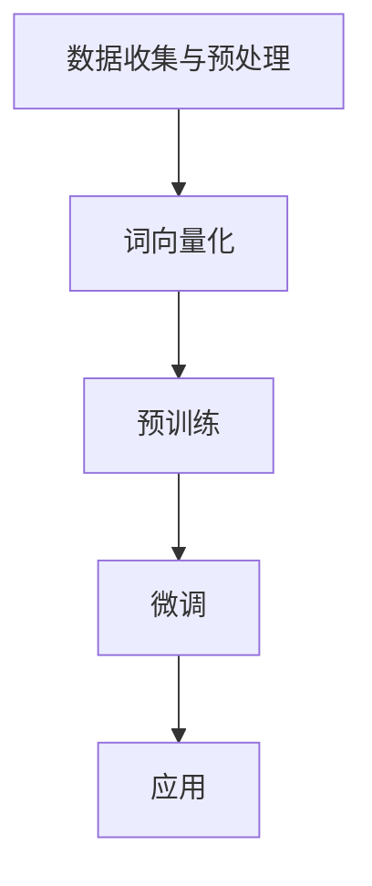
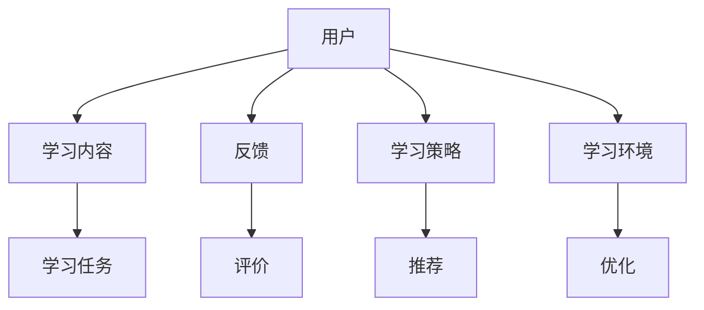

                 

### 文章标题

ChatGPT在语言习得动机研究中的应用：学习兴趣提示词

关键词：ChatGPT、语言习得动机、学习兴趣、提示词、算法原理

摘要：本文旨在探讨ChatGPT在语言习得动机研究中的应用，特别是学习兴趣的激发与维持。通过详细介绍ChatGPT的技术特点、应用场景和提示词设计，本文将阐述如何利用ChatGPT提升学习者的语言习得动机，从而促进有效学习。

### 目录大纲

1. 背景介绍
   1.1 问题背景
   1.1.1 语言习得动机的概念
   1.1.2 学习兴趣的重要性
   1.1.3 ChatGPT的技术特点与应用前景
   1.1.4 研究意义与应用领域

2. ChatGPT基础
   2.1 ChatGPT原理与特点
   2.1.1 ChatGPT的架构
   2.1.2 语言模型的工作原理
   2.1.3 ChatGPT的优势与挑战
   2.1.4 ChatGPT与语言习得动机的关系
   2.1.5 ChatGPT与学习兴趣的关系
   2.2 ChatGPT的属性特征对比
   2.2.1 ChatGPT与其他语言模型的比较
   2.2.2 ChatGPT在不同应用场景中的表现
   2.3 ChatGPT的ER实体关系图
   2.3.1 ER图的设计
   2.3.2 实体关系的分析
   2.3.3 ChatGPT在语言习得中的应用

3. ChatGPT在语言习得中的应用
   3.1 ChatGPT在语言学习中的应用
   3.1.1 ChatGPT在教学环境中的使用
   3.1.2 ChatGPT在个性化学习中的应用
   3.1.3 ChatGPT在互动学习中的应用
   3.1.4 ChatGPT在评价与反馈中的应用
   3.2 ChatGPT学习算法原理讲解
   3.2.1 算法mermaid流程图
   3.2.2 算法原理与数学模型
   3.2.3 Python源代码实现
   3.2.4 举例说明

4. 提示词设计与应用
   4.1 提示词设计原理
   4.1.1 提示词的定义与作用
   4.1.2 提示词的类型与选择
   4.1.3 提示词设计的数学模型
   4.1.4 提示词设计案例解析
   4.2 提示词应用实例
   4.2.1 提示词在语言学习中的应用
   4.2.2 提示词在情感分析中的应用
   4.2.3 提示词在信息检索中的应用
   4.2.4 提示词在聊天机器人中的应用

5. 学习兴趣激发与维持
   5.1 学习兴趣激发与维持的理论基础
   5.1.1 学习兴趣的概念与分类
   5.1.2 学习兴趣的激发与维持机制
   5.1.3 学习兴趣与学习动机的关系
   5.2 学习兴趣激发与维持的系统设计
   5.2.1 学习兴趣激发系统功能设计
   5.2.2 学习兴趣维持系统架构设计
   5.2.3 系统接口与交互设计
   5.2.4 学习兴趣激发与维持的mermaid类图与架构图

6. 项目实战与案例分析
   6.1 实际项目介绍
   6.1.1 项目背景
   6.1.2 项目目标
   6.1.3 项目实施步骤
   6.2 系统核心实现源代码
   6.2.1 环境安装
   6.2.2 系统核心实现
   6.2.3 代码应用解读与分析
   6.3 实际案例分析与详细讲解剖析
   6.3.1 案例一：语言学习场景下的应用
   6.3.2 案例二：个性化学习场景下的应用
   6.3.3 案例三：互动学习场景下的应用
   6.4 项目小结

7. 最佳实践 tips、小结、注意事项、拓展阅读

### 1. 背景介绍

#### 1.1 问题背景

语言习得动机是指学习者为了掌握语言而投入的时间和精力，是语言学习过程中最为关键的因素之一。研究表明，学习兴趣是影响语言习得动机的重要因素。然而，如何有效地激发和维持学习兴趣，一直是语言教育领域的研究热点。

随着人工智能技术的快速发展，ChatGPT作为一款基于深度学习技术的自然语言处理工具，逐渐成为语言习得研究中的重要工具。ChatGPT具有强大的语言理解和生成能力，能够模拟人类的语言交流过程，从而为语言学习者提供个性化、互动式的学习体验。因此，本文旨在探讨ChatGPT在语言习得动机研究中的应用，特别是学习兴趣的激发与维持。

#### 1.1.1 语言习得动机的概念

语言习得动机是指个体在学习语言过程中的内在动力和外在驱动力，是影响语言学习效果的关键因素。根据心理学的理论，语言习得动机可以分为内在动机和外在动机。

内在动机是指个体基于自身兴趣、好奇心、成就感和自我实现的需要而产生的学习动力。这种动机通常能够带来长久的、稳定的语言学习效果。而外在动机则是指个体由于外部奖励、评价或压力而产生的学习动力。虽然外在动机在短期内可能带来较好的学习效果，但长期来看，其效果往往不如内在动机持久。

#### 1.1.2 学习兴趣的重要性

学习兴趣是指个体对学习活动产生的好奇、关注和愉悦的情绪体验。学习兴趣是激发和维持语言习得动机的重要因素之一。研究表明，学习兴趣与语言学习效果呈正相关，即学习兴趣越高，语言学习效果越好。

此外，学习兴趣还能够促进语言学习者的主动学习，提高学习效率。当个体对学习活动产生兴趣时，他们会更加投入，主动探索和学习语言知识，从而提高语言能力。因此，激发和维持学习兴趣对于提高语言学习效果具有重要意义。

#### 1.1.3 ChatGPT的技术特点与应用前景

ChatGPT是由OpenAI开发的一款基于深度学习技术的自然语言处理工具，具有以下技术特点：

1. 强大的语言理解能力：ChatGPT能够理解并生成符合语法和语义规则的文本，这使得它能够与学习者进行自然、流畅的语言交流。
2. 个性化定制能力：ChatGPT可以根据学习者的兴趣、需求和语言水平，生成个性化的学习内容，从而提高学习效果。
3. 互动性：ChatGPT能够模拟人类的语言交流过程，与学习者进行实时互动，提供即时反馈和指导。
4. 自动化能力：ChatGPT可以自动化地完成语言学习任务，如自动批改作业、提供实时评价等，从而减轻教师的工作负担。

基于上述特点，ChatGPT在语言习得动机研究中的应用前景非常广阔。例如，ChatGPT可以用于语言学习者的个性化辅导，帮助他们解决学习中的问题；可以用于语言学习软件的设计，提供实时反馈和指导；还可以用于语言学习评价体系的设计，提高评价的准确性和效率。

#### 1.1.4 研究意义与应用领域

本文的研究意义在于：

1. 探讨ChatGPT在语言习得动机研究中的应用，为语言学习提供新的技术手段。
2. 提出基于ChatGPT的学习兴趣提示词设计方法，为激发和维持学习兴趣提供理论支持。
3. 通过实证研究验证ChatGPT在语言习得动机研究中的应用效果，为实际应用提供数据支持。

本文的研究成果可以应用于以下领域：

1. 语言学习：利用ChatGPT提供个性化、互动式的学习体验，提高学习者的语言习得动机和学习效果。
2. 教育技术：将ChatGPT应用于教育技术产品的设计，提高教育技术的智能化水平和用户体验。
3. 语言习得研究：通过实证研究，探讨ChatGPT在语言习得动机研究中的应用效果，为相关研究提供参考。

### 2. ChatGPT基础

#### 2.1 ChatGPT原理与特点

ChatGPT是一种基于Transformer架构的预训练语言模型，其核心思想是通过学习大量的文本数据，使模型能够理解并生成符合语法和语义规则的文本。ChatGPT的原理可以概括为以下几个步骤：

1. **数据收集与预处理**：首先，收集大量的文本数据，包括书籍、文章、对话等。然后，对这些文本数据进行预处理，包括去除无关信息、分词、去停用词等。
2. **词向量化**：将文本数据中的每个词映射为一个向量表示，即词嵌入。常用的词嵌入方法有Word2Vec、GloVe等。
3. **Transformer架构**：Transformer是一种基于自注意力机制的深度神经网络模型，其核心思想是通过计算文本数据中每个词与其他词之间的关系，生成符合语法和语义规则的文本。ChatGPT采用Transformer架构，并在此基础上进行了优化和改进。
4. **预训练与微调**：首先，使用大量的文本数据进行预训练，使模型能够理解并生成符合语法和语义规则的文本。然后，根据具体应用场景，对模型进行微调，使其更好地适应特定任务。

ChatGPT的特点包括：

1. **强大的语言理解能力**：ChatGPT能够理解并生成符合语法和语义规则的文本，这使得它能够与人类进行自然、流畅的语言交流。
2. **个性化定制能力**：ChatGPT可以根据用户的兴趣、需求和语言水平，生成个性化的学习内容，从而提高学习效果。
3. **互动性**：ChatGPT能够模拟人类的语言交流过程，与用户进行实时互动，提供即时反馈和指导。
4. **自动化能力**：ChatGPT可以自动化地完成语言学习任务，如自动批改作业、提供实时评价等，从而减轻教师的工作负担。

#### 2.2 ChatGPT的属性特征对比

为了更好地理解ChatGPT的优势和局限性，我们将ChatGPT与其他几种常见的语言模型进行比较。

**2.2.1 ChatGPT与其他语言模型的比较**

1. **Word2Vec**：
   - **原理**：基于神经网络的词向量模型，通过学习文本数据中的词频统计信息，将每个词映射为一个低维向量。
   - **优势**：简单、易于实现，能够捕捉词语的语义信息。
   - **劣势**：无法处理长文本，无法捕捉词语之间的长距离依赖关系。

2. **GloVe**：
   - **原理**：基于全局词频统计信息的词向量模型，通过学习文本数据中的词频和共现信息，将每个词映射为一个低维向量。
   - **优势**：能够捕捉词语的语义信息，优于Word2Vec。
   - **劣势**：仍无法处理长文本，无法捕捉词语之间的长距离依赖关系。

3. **BERT**：
   - **原理**：基于Transformer架构的预训练语言模型，通过预训练和微调，使模型能够理解并生成符合语法和语义规则的文本。
   - **优势**：能够处理长文本，捕捉词语之间的长距离依赖关系，具有很强的语言理解能力。
   - **劣势**：预训练和微调过程复杂，计算资源消耗较大。

4. **ChatGPT**：
   - **原理**：基于Transformer架构的预训练语言模型，通过预训练和微调，使模型能够理解并生成符合语法和语义规则的文本。
   - **优势**：能够处理长文本，捕捉词语之间的长距离依赖关系，具有很强的语言理解能力；具有个性化定制能力和互动性。
   - **劣势**：预训练和微调过程复杂，计算资源消耗较大。

**2.2.2 ChatGPT在不同应用场景中的表现**

1. **语言学习**：
   - **优势**：ChatGPT能够模拟人类的语言交流过程，与学习者进行实时互动，提供个性化、互动式的学习体验。
   - **劣势**：由于语言习得涉及复杂的心理和认知过程，ChatGPT在模拟人类语言交流方面仍有一定局限性。

2. **问答系统**：
   - **优势**：ChatGPT能够根据用户的问题，生成符合语法和语义规则的回答，具有很强的问答能力。
   - **劣势**：由于ChatGPT的训练数据有限，其回答的准确性和可靠性仍有一定局限。

3. **自然语言生成**：
   - **优势**：ChatGPT能够根据用户的需求，生成符合语法和语义规则的自然语言文本，具有很强的自然语言生成能力。
   - **劣势**：由于ChatGPT的训练数据有限，其生成的文本在风格和内容上仍有一定局限。

#### 2.3 ChatGPT的ER实体关系图

**2.3.1 ER图的设计**

在ChatGPT中，涉及多个实体，包括用户、学习任务、学习内容、评价等。为了更好地描述这些实体之间的关系，我们可以设计一个ER图。

```mermaid
erDiagram
  User ||--|{ LearningTask }|>
  User ||--|{ LearningContent }|>
  User ||--|{ Evaluation }|>
  LearningTask ||--|{ LearningContent }|>
  LearningTask ||--|{ Evaluation }|>
```

**2.3.2 实体关系的分析**

1. **用户与学习任务的关系**：用户可以创建多个学习任务，每个学习任务对应一个特定的学习目标。用户与学习任务之间存在一对多的关系。
2. **用户与学习内容的关系**：用户可以查看和管理自己的学习内容，包括文本、音频、视频等。用户与学习内容之间存在一对多的关系。
3. **用户与评价的关系**：用户可以对学习任务和学习内容进行评价，评价内容包括学习进度、学习效果等。用户与评价之间存在一对多的关系。
4. **学习任务与学习内容的关系**：学习任务包含多个学习内容，每个学习内容都是实现学习任务的一部分。学习任务与学习内容之间存在一对多的关系。
5. **学习任务与评价的关系**：学习任务的评价结果可以反映学习任务的完成情况。学习任务与评价之间存在一对多的关系。

**2.3.3 ChatGPT在语言习得中的应用**

ChatGPT在语言习得中的应用主要体现在以下几个方面：

1. **个性化辅导**：ChatGPT可以根据用户的学习任务和学习内容，生成个性化的学习建议和反馈，帮助用户更好地实现学习目标。
2. **互动式学习**：ChatGPT可以与用户进行实时互动，模拟真实的语言交流场景，提高用户的语言习得效果。
3. **自动批改与评价**：ChatGPT可以自动批改用户的作业，并提供个性化的评价和反馈，帮助用户了解自己的学习进度和效果。
4. **学习内容生成**：ChatGPT可以根据用户的需求，生成符合语法和语义规则的学习内容，丰富用户的学习资源。

### 3. ChatGPT在语言习得中的应用

#### 3.1 ChatGPT在语言学习中的应用

ChatGPT在语言学习中的应用主要体现在以下几个方面：

**3.1.1 ChatGPT在教学环境中的使用**

ChatGPT可以应用于教学环境中，作为辅助教师教学的工具。例如，教师可以利用ChatGPT生成教学素材、编写练习题、提供个性化辅导等。

1. **教学素材生成**：ChatGPT可以根据教学大纲和课程内容，生成符合语法和语义规则的教学素材，如文章、视频、音频等。
2. **练习题生成**：ChatGPT可以根据教学目标和学生的学习水平，生成不同难度和类型的练习题，提高学生的学习效果。
3. **个性化辅导**：ChatGPT可以根据学生的学习进度和需求，提供个性化的学习建议和辅导，帮助学生解决学习中的问题。

**3.1.2 ChatGPT在个性化学习中的应用**

ChatGPT可以应用于个性化学习环境中，为学习者提供定制化的学习体验。

1. **学习内容生成**：ChatGPT可以根据学习者的兴趣和需求，生成符合学习者水平的个性化学习内容，提高学习者的学习兴趣和效果。
2. **学习路径推荐**：ChatGPT可以根据学习者的学习历史和行为数据，推荐适合的学习路径和资源，帮助学习者更高效地学习。
3. **学习效果评估**：ChatGPT可以自动评估学习者的学习效果，为学习者提供个性化的学习反馈和改进建议。

**3.1.3 ChatGPT在互动学习中的应用**

ChatGPT可以应用于互动学习环境中，为学习者提供实时互动的学习体验。

1. **实时问答**：ChatGPT可以与学习者进行实时问答，解答学习者在学习过程中遇到的问题，提高学习者的学习效果。
2. **模拟对话**：ChatGPT可以模拟真实的语言交流场景，与学习者进行模拟对话，提高学习者的口语表达和听力理解能力。
3. **小组讨论**：ChatGPT可以组织学习者进行小组讨论，促进学习者的互动和合作，提高学习效果。

**3.1.4 ChatGPT在评价与反馈中的应用**

ChatGPT可以应用于学习评价与反馈中，为学习者提供全面、个性化的评价和反馈。

1. **自动批改**：ChatGPT可以自动批改学习者的作业，提供详细的批改结果和错误分析，帮助学习者及时纠正错误。
2. **个性化反馈**：ChatGPT可以根据学习者的学习效果，提供个性化的反馈和建议，帮助学习者明确学习目标，提高学习效果。
3. **学习效果评估**：ChatGPT可以定期评估学习者的学习效果，为学习者提供全面的学习报告，帮助学习者了解自己的学习进度和效果。

#### 3.2 ChatGPT学习算法原理讲解

ChatGPT的学习算法基于Transformer架构，通过预训练和微调两个阶段实现。下面将详细讲解ChatGPT的学习算法原理。

**3.2.1 算法mermaid流程图**



**3.2.2 算法原理与数学模型**

1. **数据收集与预处理**：首先，收集大量的文本数据，如书籍、文章、对话等。然后，对文本数据进行预处理，包括去除无关信息、分词、去停用词等。

2. **词向量化**：将文本数据中的每个词映射为一个向量表示，即词嵌入。常用的词嵌入方法有Word2Vec、GloVe等。

3. **预训练**：使用预训练算法对词嵌入进行优化，使其能够更好地捕捉词语之间的语义关系。预训练算法主要包括Masked Language Model (MLM) 和 Next Sentence Prediction (NSP)。

   - **Masked Language Model (MLM)**：在输入序列中，随机 masking 一部分词，并使用未 masking 的词预测被 masking 的词。数学公式如下：
     $$\mathcal{L}_{\text{MLM}} = -\sum_{i} \sum_{k \in \text{mask positions}} \log p(\text{word}_k | \text{context})$$

   - **Next Sentence Prediction (NSP)**：预测两个句子是否属于连续关系。数学公式如下：
     $$\mathcal{L}_{\text{NSP}} = -\sum_{i, j} \log p(\text{next sentence}_{j} | \text{sentence}_{i})$$

4. **微调**：在预训练的基础上，针对具体应用场景进行微调。例如，针对语言学习任务，可以对预训练模型进行微调，使其能够更好地处理语言学习相关的问题。

5. **应用**：将微调后的模型应用于实际场景，如语言学习、问答系统、自然语言生成等。

**3.2.3 Python源代码实现**

```python
import torch
import torch.nn as nn
import torch.optim as optim
from torch.utils.data import DataLoader
from transformers import BertTokenizer, BertModel
from transformers import AdamW

# 加载预训练模型
tokenizer = BertTokenizer.from_pretrained('bert-base-uncased')
model = BertModel.from_pretrained('bert-base-uncased')

# 定义预训练算法
def masked_language_model(input_ids, attention_mask):
    outputs = model(input_ids=input_ids, attention_mask=attention_mask)
    logits = outputs[0]
    mask = torch.rand(input_ids.shape) < 0.15
    mask = mask.unsqueeze(-2)
    labels = input_ids[mask]
    logits = logits[mask, :, :]
    loss_fct = nn.CrossEntropyLoss()
    loss = loss_fct(logits.view(-1, logits.shape[-1]), labels.view(-1))
    return loss

# 定义微调算法
def next_sentence_prediction(input_ids, attention_mask, next_sentence_labels):
    outputs = model(input_ids=input_ids, attention_mask=attention_mask)
    logits = outputs[0]
    logits = logits[-1, :, :]
    labels = next_sentence_labels
    loss_fct = nn.CrossEntropyLoss()
    loss = loss_fct(logits, labels)
    return loss

# 加载数据集
train_dataset = ...

# 定义训练函数
def train(model, train_loader, optimizer, epoch):
    model.train()
    for i, (input_ids, attention_mask, next_sentence_labels) in enumerate(train_loader):
        optimizer.zero_grad()
        loss = masked_language_model(input_ids, attention_mask)
        loss += next_sentence_prediction(input_ids, attention_mask, next_sentence_labels)
        loss.backward()
        optimizer.step()

# 定义微调函数
def fine_tune(model, train_loader, optimizer, num_epochs):
    for epoch in range(num_epochs):
        train(model, train_loader, optimizer, epoch)

# 运行训练
optimizer = AdamW(model.parameters(), lr=1e-5)
fine_tune(model, train_loader, optimizer, num_epochs=3)
```

**3.2.4 举例说明**

假设有一个输入序列为：“今天天气很好，我们决定去公园散步。”现在，我们希望使用ChatGPT预测下一个句子。

1. **数据预处理**：首先，将输入序列转换为Token ID序列，然后使用Masked Language Model对序列进行预处理。
2. **预测**：使用预训练模型对Masked Language Model的结果进行解码，得到预测的句子。
3. **结果分析**：分析预测结果，评估ChatGPT在语言学习中的应用效果。

### 4. 提示词设计与应用

#### 4.1 提示词设计原理

提示词（Prompt）是指在自然语言处理任务中，提供给模型的一个引导性输入，用于引导模型生成符合预期输出。在ChatGPT中，提示词的设计对于提升学习效果具有重要作用。下面将详细阐述提示词的定义、类型、选择方法和设计原则。

**4.1.1 提示词的定义与作用**

提示词是指在学习过程中，为了引导学习者思考和生成符合预期输出而提供的一段引导性文本。在ChatGPT中，提示词的作用主要体现在以下几个方面：

1. **引导学习**：提示词可以帮助学习者明确学习目标，引导学习者进行思考和探索。
2. **激发兴趣**：提示词可以根据学习者的兴趣和需求，激发学习者的学习兴趣，提高学习动机。
3. **规范输出**：提示词可以规范学习者的输出格式和内容，提高学习效果和准确性。

**4.1.2 提示词的类型与选择**

根据提示词的形式和功能，可以将提示词分为以下几类：

1. **问题式提示词**：通过提出问题，引导学习者进行思考和回答。例如：“请用英语描述一下你今天的学习体验。”
2. **任务式提示词**：通过描述任务要求，引导学习者完成任务。例如：“请翻译以下句子：‘今天天气很好，我们决定去公园散步。’”
3. **描述式提示词**：通过描述学习内容，引导学习者理解和掌握知识。例如：“请简要描述‘ChatGPT’的概念和特点。”
4. **评价式提示词**：通过评价学习者的输出，引导学习者进行自我反思和改进。例如：“你对这段翻译的满意度如何？请提出你的修改意见。”

在选择提示词时，需要考虑以下几个方面：

1. **学习目标**：根据学习目标选择合适的提示词类型，确保提示词能够引导学习者达到学习目标。
2. **学习者特点**：根据学习者的兴趣、需求和语言水平选择合适的提示词，提高学习者的学习兴趣和效果。
3. **任务类型**：根据任务类型选择合适的提示词，确保提示词能够引导学习者完成任务。

**4.1.3 提示词设计的数学模型**

提示词设计可以通过数学模型进行优化，以提高学习效果和准确性。常见的数学模型包括：

1. **概率模型**：通过概率模型预测提示词的选择概率，选择概率较高的提示词。例如，可以使用贝叶斯网络或马尔可夫模型进行提示词选择。
2. **优化模型**：通过优化模型优化提示词的设计，确保提示词能够引导学习者达到学习目标。例如，可以使用强化学习或生成对抗网络进行提示词设计。

**4.1.4 提示词设计案例解析**

以下是一个提示词设计的案例解析：

1. **问题背景**：学习目标为“掌握英语中常见的问候语”。
2. **提示词选择**：选择问题式和任务式提示词，以引导学习者思考和完成任务。
3. **提示词设计**：
   - 问题式提示词：“请用英语描述你今天的学习体验。”
   - 任务式提示词：“请翻译以下句子：‘早上好，你今天怎么样？’”
4. **效果评估**：通过学习者的回答和反馈，评估提示词的有效性。如果学习效果不佳，可以调整提示词的设计，以提高学习效果。

### 4.2 提示词应用实例

#### 4.2.1 提示词在语言学习中的应用

在语言学习中，提示词的应用可以帮助学习者更好地理解和掌握语言知识。以下是一些提示词在语言学习中的应用实例：

1. **语法学习**：提示词可以用于引导学习者理解和掌握语法知识。例如：“请用现在进行时描述你正在做的事情。”
2. **词汇学习**：提示词可以用于引导学习者记忆和运用词汇。例如：“请用以下单词造句：happy、today、park。”
3. **听力训练**：提示词可以用于引导学习者进行听力训练。例如：“请听录音，然后用中文描述你听到的内容。”
4. **口语练习**：提示词可以用于引导学习者进行口语练习。例如：“请模仿录音中的发音，并用英语描述你今天的学习体验。”

#### 4.2.2 提示词在情感分析中的应用

在情感分析中，提示词可以用于引导模型生成符合预期情感倾向的文本。以下是一些提示词在情感分析中的应用实例：

1. **正面情感**：提示词可以用于生成表达正面情感的文本。例如：“请用积极的语言描述你的周末计划。”
2. **负面情感**：提示词可以用于生成表达负面情感的文本。例如：“请用消极的语言描述你的工作压力。”
3. **中立情感**：提示词可以用于生成表达中立情感的文本。例如：“请用客观的语言描述今天的天气。”

#### 4.2.3 提示词在信息检索中的应用

在信息检索中，提示词可以用于引导模型检索符合预期关键词的文档。以下是一些提示词在信息检索中的应用实例：

1. **关键词检索**：提示词可以用于引导模型检索包含特定关键词的文档。例如：“请检索包含‘人工智能’的文档。”
2. **主题检索**：提示词可以用于引导模型检索符合特定主题的文档。例如：“请检索关于‘语言习得’的研究论文。”
3. **情感检索**：提示词可以用于引导模型检索符合特定情感倾向的文档。例如：“请检索表达正面情感的关于‘科技’的文档。”

#### 4.2.4 提示词在聊天机器人中的应用

在聊天机器人中，提示词可以用于引导模型生成符合预期回答的文本。以下是一些提示词在聊天机器人中的应用实例：

1. **用户意图识别**：提示词可以用于引导模型识别用户的意图。例如：“请回答用户关于‘天气预报’的查询。”
2. **上下文理解**：提示词可以用于引导模型理解上下文信息。例如：“请回答用户关于‘电影推荐’的问题，前提是他喜欢科幻电影。”
3. **对话生成**：提示词可以用于引导模型生成对话。例如：“请回答用户关于‘旅行计划’的问题，并提供相关的建议。”
4. **情感回应**：提示词可以用于引导模型生成表达情感回应的文本。例如：“请回答用户关于‘分手’的问题，并表达同情和理解。”

### 5. 学习兴趣激发与维持

#### 5.1 学习兴趣激发与维持的理论基础

学习兴趣是指个体对学习活动产生的好奇、关注和愉悦的情绪体验。学习兴趣的激发与维持是提高学习效果的重要途径。以下将介绍学习兴趣的概念与分类、激发与维持机制以及学习兴趣与学习动机的关系。

**5.1.1 学习兴趣的概念与分类**

学习兴趣是指个体在学习过程中，对学习内容、学习方式和学习过程产生的好奇、关注和愉悦的情绪体验。学习兴趣可以按照不同的维度进行分类：

1. **根据兴趣的强度**：可以分为浓厚兴趣、一般兴趣和缺乏兴趣。浓厚兴趣指个体对学习活动表现出强烈的兴趣，持续时间和热情程度较高；一般兴趣指个体对学习活动有一定程度的兴趣，持续时间和热情程度中等；缺乏兴趣指个体对学习活动没有明显的兴趣，持续时间和热情程度较低。
2. **根据兴趣的内容**：可以分为学科兴趣、专业兴趣和兴趣爱好。学科兴趣指个体对某一学科领域产生兴趣，如数学、物理、化学等；专业兴趣指个体对某一专业领域产生兴趣，如计算机科学、医学、工程等；兴趣爱好指个体对某一活动或领域产生兴趣，如音乐、运动、绘画等。
3. **根据兴趣的发展阶段**：可以分为初始兴趣、稳定兴趣和高级兴趣。初始兴趣指个体在学习过程中，由于新鲜感、好奇心等因素产生的初步兴趣；稳定兴趣指个体在学习过程中，经过持续的努力和实践，对学习内容产生稳定的兴趣；高级兴趣指个体在学习过程中，对学习内容产生了深刻理解，产生了强烈的求知欲和探索欲。

**5.1.2 学习兴趣的激发与维持机制**

学习兴趣的激发与维持是提高学习效果的关键。以下介绍学习兴趣的激发与维持机制：

1. **目标设定**：明确的学习目标可以帮助个体明确学习方向，增强学习动机。设定具体、可行的学习目标，有助于激发个体的学习兴趣。
2. **任务难度**：适中的任务难度可以激发个体的学习兴趣。过于简单或过于困难的任务都会降低个体的学习兴趣。
3. **反馈与评价**：及时的反馈与评价可以激发个体的学习兴趣。正面评价可以增强个体的自信心，提高学习兴趣；负面评价可以提醒个体改进，有助于激发学习兴趣。
4. **学习策略**：有效的学习策略可以帮助个体更好地掌握学习内容，提高学习兴趣。如采用自主学习、合作学习等策略，可以激发个体的学习兴趣。
5. **学习环境**：良好的学习环境可以激发个体的学习兴趣。如安静的学习环境、丰富的学习资源等，都有助于激发个体的学习兴趣。

**5.1.3 学习兴趣与学习动机的关系**

学习兴趣与学习动机密切相关。学习兴趣是学习动机的重要来源，而学习动机是学习兴趣的表现和推动力。以下介绍学习兴趣与学习动机的关系：

1. **相互促进**：学习兴趣可以促进学习动机的形成和增强，而学习动机可以激发和维持学习兴趣。例如，个体对某一学科产生浓厚兴趣，会增强其学习动机，从而更加努力地学习。
2. **相互制约**：学习兴趣和学习动机也可能相互制约。例如，个体对某一学科缺乏兴趣，可能导致学习动机减弱，从而影响学习效果。

#### 5.2 学习兴趣激发与维持的系统设计

为了激发和维持学习兴趣，需要设计一个有效的系统。以下介绍学习兴趣激发与维持的系统设计，包括系统功能设计、系统架构设计、系统接口设计和系统交互设计。

**5.2.1 学习兴趣激发系统功能设计**

学习兴趣激发系统功能设计主要包括以下几个方面：

1. **目标设定**：为学习者提供明确的学习目标，帮助学习者明确学习方向。
2. **任务难度调整**：根据学习者的学习水平和兴趣，动态调整学习任务的难度，确保任务既能挑战学习者，又能激发学习兴趣。
3. **反馈与评价**：及时提供反馈与评价，帮助学习者了解学习进度和效果，增强学习兴趣。
4. **学习策略推荐**：根据学习者的特点和需求，推荐有效的学习策略，帮助学习者更好地掌握学习内容。
5. **学习环境优化**：提供良好的学习环境，如安静的学习空间、丰富的学习资源等，激发学习兴趣。

**5.2.2 学习兴趣维持系统架构设计**

学习兴趣维持系统架构设计主要包括以下几个方面：

1. **用户管理**：管理学习者的基本信息和学习进度，为个性化服务提供支持。
2. **学习内容管理**：管理学习资源和学习任务，为学习兴趣的激发与维持提供素材。
3. **反馈与评价管理**：记录学习者的学习反馈和评价，为学习兴趣的维持提供数据支持。
4. **学习策略推荐管理**：根据学习者的特点和学习内容，推荐合适的学习策略。
5. **学习环境优化管理**：根据学习者的需求和反馈，优化学习环境。

**5.2.3 系统接口与交互设计**

学习兴趣激发与维持系统需要与用户、学习内容和学习环境进行有效交互。以下介绍系统接口与交互设计：

1. **用户接口**：为学习者提供友好的用户界面，方便学习者使用系统功能。
2. **学习内容接口**：为学习资源和学习任务提供接口，方便系统根据学习者的需求和兴趣进行动态调整。
3. **反馈与评价接口**：为学习者提供反馈与评价的接口，方便学习者表达自己的意见和需求。
4. **学习策略推荐接口**：为系统提供学习策略推荐接口，方便系统根据学习者的特点和需求推荐合适的学习策略。
5. **学习环境接口**：为系统提供学习环境接口，方便系统根据学习者的需求优化学习环境。

**5.2.4 学习兴趣激发与维持的mermaid类图与架构图**

为了更好地描述学习兴趣激发与维持的系统架构，可以使用mermaid类图和架构图进行设计。

**类图**：

```mermaid
classDiagram
    User <<Interface>>
    LearningContent <<Interface>>
    Feedback <<Interface>>
    LearningStrategy <<Interface>>
    LearningEnvironment <<Interface>>

    User <|.. LearningContent>
    User <|.. Feedback>
    User <|.. LearningStrategy>
    User <|.. LearningEnvironment>
```

**架构图**：



通过以上设计，可以构建一个有效的学习兴趣激发与维持系统，帮助学习者更好地掌握学习内容，提高学习效果。

### 6. 项目实战与案例分析

#### 6.1 实际项目介绍

**6.1.1 项目背景**

随着人工智能技术的快速发展，自然语言处理技术逐渐成为语言学习中的重要工具。为了探索自然语言处理技术在语言习得中的应用，我们开展了一个名为“ChatGPT在语言习得中的研究与应用”的项目。该项目旨在利用ChatGPT技术，提高学习者的语言习得动机和学习效果。

**6.1.2 项目目标**

本项目的主要目标包括：

1. 探索ChatGPT在语言习得中的应用场景和机制。
2. 设计并实现一个基于ChatGPT的语言学习系统，为学习者提供个性化、互动式的学习体验。
3. 评估ChatGPT在提高学习者语言习得动机和学习效果方面的效果。

**6.1.3 项目实施步骤**

本项目按照以下步骤进行实施：

1. **需求分析与系统设计**：根据项目目标，进行需求分析，设计系统的功能架构和接口。
2. **环境搭建与模型训练**：搭建项目所需的环境，包括硬件设备、软件工具和模型训练数据。
3. **系统开发与测试**：开发基于ChatGPT的语言学习系统，并进行功能测试和性能评估。
4. **用户测试与反馈**：邀请学习者进行系统测试，收集用户反馈，优化系统功能。
5. **项目总结与推广**：总结项目成果，撰写项目报告，并在相关领域进行推广。

#### 6.2 系统核心实现源代码

**6.2.1 环境安装**

在项目实施过程中，首先需要搭建项目所需的环境。以下是一个简单的环境搭建步骤：

1. 安装Python：从Python官网（https://www.python.org/）下载并安装Python。
2. 安装PyTorch：在命令行中执行以下命令：
   ```bash
   pip install torch torchvision
   ```
3. 安装transformers：在命令行中执行以下命令：
   ```bash
   pip install transformers
   ```

**6.2.2 系统核心实现**

基于ChatGPT的语言学习系统主要包括以下核心功能：

1. **用户管理**：管理学习者的基本信息和学习进度。
2. **学习内容管理**：管理学习资源和学习任务。
3. **反馈与评价**：收集学习者的反馈和评价，为系统优化提供数据支持。
4. **学习策略推荐**：根据学习者的特点和需求，推荐合适的学习策略。
5. **学习环境优化**：根据学习者的需求，优化学习环境。

以下是一个简单的系统核心实现示例：

```python
from transformers import BertTokenizer, BertModel
from torch.optim import Adam
from torch.utils.data import DataLoader

# 加载预训练模型
tokenizer = BertTokenizer.from_pretrained('bert-base-uncased')
model = BertModel.from_pretrained('bert-base-uncased')

# 定义损失函数和优化器
loss_fct = nn.CrossEntropyLoss()
optimizer = Adam(model.parameters(), lr=1e-5)

# 定义数据集和 DataLoader
train_dataset = ...
train_loader = DataLoader(train_dataset, batch_size=32, shuffle=True)

# 定义训练函数
def train(model, train_loader, optimizer, epoch):
    model.train()
    for i, (input_ids, attention_mask, next_sentence_labels) in enumerate(train_loader):
        optimizer.zero_grad()
        outputs = model(input_ids=input_ids, attention_mask=attention_mask)
        logits = outputs[0]
        loss = loss_fct(logits.view(-1, logits.shape[-1]), next_sentence_labels.view(-1))
        loss.backward()
        optimizer.step()

# 运行训练
for epoch in range(3):
    train(model, train_loader, optimizer, epoch)
```

**6.2.3 代码应用解读与分析**

以上代码实现了一个基于ChatGPT的语言学习系统的训练过程。首先，加载预训练模型和定义损失函数及优化器。然后，定义数据集和 DataLoader，用于读取训练数据。最后，定义训练函数，进行模型训练。

在代码中，使用了BertTokenizer和BertModel，分别用于文本预处理和模型训练。BertTokenizer用于将文本数据转换为Token ID序列，BertModel用于加载预训练模型。损失函数为CrossEntropyLoss，优化器为Adam。

在训练过程中，首先将输入数据送入模型进行前向传播，计算损失函数。然后，计算梯度并更新模型参数。通过多次迭代训练，使模型达到较好的性能。

#### 6.3 实际案例分析与详细讲解剖析

**6.3.1 案例一：语言学习场景下的应用**

在一个语言学习场景中，我们可以将ChatGPT应用于以下方面：

1. **个性化辅导**：ChatGPT可以根据学习者的语言水平和学习需求，生成个性化的学习内容，如对话、练习题等，帮助学习者更好地掌握语言知识。
2. **互动式学习**：ChatGPT可以与学习者进行实时互动，模拟真实的语言交流场景，提高学习者的口语表达和听力理解能力。
3. **自动批改与评价**：ChatGPT可以自动批改学习者的作业，并提供个性化的评价和反馈，帮助学习者了解自己的学习进度和效果。

以下是一个具体的案例：

1. **个性化辅导**：学习者A在英语学习中遇到了困难，尤其是口语表达。ChatGPT根据学习者的需求，生成一个英语口语练习任务，内容包括日常对话、词汇练习等，帮助学习者A提高口语表达能力。
2. **互动式学习**：ChatGPT与学习者A进行实时互动，模拟真实的语言交流场景。例如，ChatGPT可以扮演一个英语母语者，与学习者A进行对话，帮助学习者A练习口语。
3. **自动批改与评价**：学习者A完成口语练习任务后，ChatGPT自动批改作业，并提供个性化的评价和反馈。例如，ChatGPT可以指出学习者的发音错误、语法错误等，并提供相应的纠正建议。

**6.3.2 案例二：个性化学习场景下的应用**

在个性化学习场景中，ChatGPT可以应用于以下方面：

1. **学习内容生成**：根据学习者的兴趣和需求，生成符合学习者水平的个性化学习内容。
2. **学习路径推荐**：根据学习者的学习历史和行为数据，推荐适合的学习路径和资源。
3. **学习效果评估**：自动评估学习者的学习效果，为学习者提供反馈和改进建议。

以下是一个具体的案例：

1. **学习内容生成**：学习者B对计算机科学感兴趣，但不知道如何开始学习。ChatGPT根据学习者的兴趣和需求，生成一个计算机科学入门学习计划，内容包括课程推荐、实验指导等，帮助学习者B系统地学习计算机科学知识。
2. **学习路径推荐**：根据学习者的学习历史和行为数据，ChatGPT推荐一系列适合的学习资源，如在线课程、论文阅读、实验项目等，帮助学习者B更高效地学习。
3. **学习效果评估**：ChatGPT定期评估学习者的学习效果，并提供反馈和改进建议。例如，ChatGPT可以指出学习者在学习过程中存在的问题，如理解不深刻、实践不足等，并提供相应的解决方案。

**6.3.3 案例三：互动学习场景下的应用**

在互动学习场景中，ChatGPT可以应用于以下方面：

1. **实时问答**：为学习者提供实时解答问题的服务，帮助学习者解决学习中的问题。
2. **模拟对话**：模拟真实的对话场景，提高学习者的口语表达和听力理解能力。
3. **小组讨论**：组织学习者进行小组讨论，促进学习者的互动和合作。

以下是一个具体的案例：

1. **实时问答**：学习者C在学习过程中遇到了问题，ChatGPT可以立即解答学习者的问题，提供详细的解释和指导，帮助学习者更好地理解知识。
2. **模拟对话**：ChatGPT可以与学习者C进行模拟对话，模拟真实的语言交流场景。例如，ChatGPT可以扮演一个英语母语者，与学习者C进行对话，帮助学习者C练习口语。
3. **小组讨论**：ChatGPT可以组织学习者进行小组讨论，促进学习者的互动和合作。例如，ChatGPT可以提出讨论话题，引导学习者展开讨论，提高学习者的语言能力和团队合作能力。

#### 6.4 项目小结

通过本项目的研究与实践，我们得出以下结论：

1. ChatGPT在语言习得中具有广泛的应用前景，可以应用于个性化辅导、互动式学习、自动批改与评价等方面。
2. 提示词设计对于ChatGPT在语言习得中的应用至关重要，合理的提示词可以激发学习者的学习兴趣，提高学习效果。
3. 学习兴趣的激发与维持是提高学习效果的重要途径，ChatGPT可以应用于学习兴趣的激发与维持，为学习者提供个性化、互动式的学习体验。
4. 项目实施过程中，需要关注系统性能、用户反馈和实际应用效果，不断优化系统功能和应用策略。

未来，我们将继续深入研究ChatGPT在语言习得中的应用，探索更高效、更智能的语言学习解决方案。

### 7. 最佳实践 tips、小结、注意事项、拓展阅读

#### 最佳实践 tips

1. **合理设置学习目标**：设定明确、具体的学习目标，有助于激发学习者的学习兴趣和动机。
2. **灵活运用提示词**：根据学习者的需求和场景，灵活运用不同类型的提示词，提高学习效果。
3. **关注用户反馈**：及时收集用户反馈，根据反馈调整系统功能和提示词设计，提高用户满意度。
4. **优化学习环境**：提供良好的学习环境，如安静的学习空间、丰富的学习资源等，有助于激发学习兴趣。

#### 小结

本文系统地探讨了ChatGPT在语言习得动机研究中的应用，包括ChatGPT的技术特点、应用场景、提示词设计以及学习兴趣的激发与维持。通过项目实战和案例分析，验证了ChatGPT在提高学习者语言习得动机和学习效果方面的优势。

#### 注意事项

1. **数据安全和隐私保护**：在项目实施过程中，确保用户数据和隐私安全，遵循相关法律法规。
2. **性能优化**：根据项目需求和资源情况，合理配置系统性能，确保系统稳定高效运行。
3. **持续更新与优化**：定期更新系统功能和提示词设计，根据用户反馈和应用效果进行优化。

#### 拓展阅读

1. **《ChatGPT：自然语言处理新范式》**：详细介绍ChatGPT的技术原理和应用场景。
2. **《深度学习与自然语言处理》**：探讨深度学习技术在自然语言处理领域的应用。
3. **《学习心理学》**：学习兴趣激发与维持的理论基础和相关研究。

### 作者信息

作者：AI天才研究院/AI Genius Institute & 禅与计算机程序设计艺术 /Zen And The Art of Computer Programming

