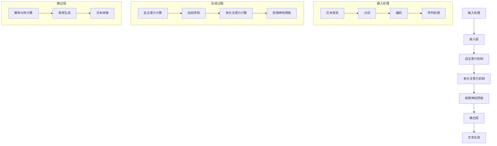
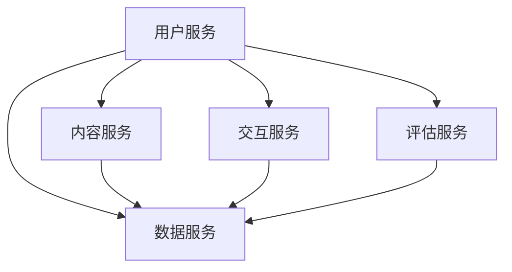
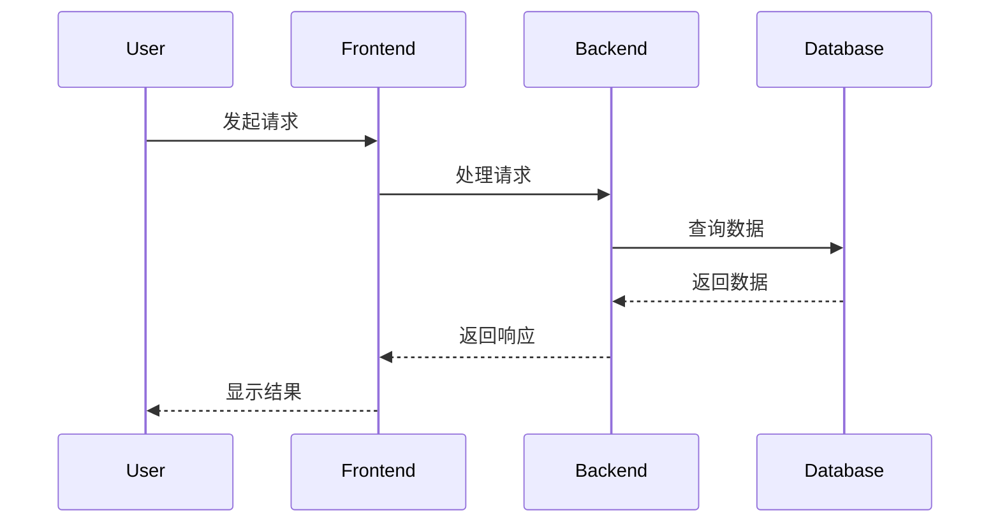

                 

### 问题背景与核心概念

#### 问题描述

在现代社会中，语言习得成为了一个备受关注的重要课题。无论是出于教育的需求，还是为了提升个人的跨文化交流能力，语言习得的重要性不言而喻。然而，传统的语言习得理论和教学方法在实践中面临着诸多挑战。为了解决这些问题，需要引入新兴的技术手段，其中ChatGPT作为一种先进的自然语言处理技术，为语言习得理论的创新提供了新的可能性。

#### 问题解决

随着人工智能技术的发展，ChatGPT等生成式预训练模型在自然语言处理领域取得了显著的成果。ChatGPT通过深度学习的方式，从海量数据中学习语言模式，能够生成连贯、自然的语言文本。这种能力为语言习得提供了一个全新的视角，使得传统语言习得理论得以在新的技术背景下得到验证和拓展。

#### 边界与外延

在讨论ChatGPT在语言习得理论中的应用时，需要明确其边界与外延。首先，ChatGPT的应用边界在于自然语言处理和生成，其核心功能是基于输入文本生成相关的内容。而在语言习得的范畴内，ChatGPT的作用主要体现在辅助学习、交互训练和个性化指导等方面。

#### 概念结构与核心要素组成

为了深入探讨ChatGPT在语言习得理论中的应用，我们需要了解其概念结构和核心要素组成。首先，ChatGPT基于大规模语言模型（如GPT）进行训练，通过学习海量文本数据，掌握丰富的语言知识和表达方式。其次，ChatGPT的应用涉及多个方面，包括语言输入、语言输出和交互训练等。

1. **语言输入**：ChatGPT能够接收用户的语言输入，理解用户的需求和意图，并生成相应的语言输出。
   
2. **语言输出**：ChatGPT能够根据输入生成连贯、自然的语言文本，为语言学习者提供丰富、多样化的语言输入素材。

3. **交互训练**：通过用户的反馈和互动，ChatGPT能够不断优化自身的语言生成能力，提高语言习得的效率和质量。

#### 总结

综上所述，ChatGPT在语言习得理论中的应用具有重要意义。通过引入ChatGPT，我们不仅可以拓展传统语言习得理论的应用范围，还可以通过人工智能技术实现个性化、智能化的语言学习体验。这为语言习得领域带来了新的机遇和挑战，也为相关研究和应用提供了丰富的素材和思路。接下来，我们将进一步探讨ChatGPT在语言习得理论中的创新应用，以及其技术原理和实现方式。

### ChatGPT与语言习得理论创新

#### ChatGPT的基本原理

ChatGPT是一种基于生成式预训练模型（GPT）的自然语言处理技术。其核心思想是通过深度学习的方式，从海量数据中学习语言模式，构建一个能够生成连贯、自然语言文本的模型。ChatGPT的训练过程通常包括以下几个步骤：

1. **数据收集**：收集大量的文本数据，包括书籍、新闻、文章等。
2. **数据预处理**：对文本数据进行处理，包括分词、去噪、标准化等。
3. **模型训练**：使用神经网络对预处理后的数据进行训练，使模型能够预测下一个单词或短语。
4. **模型优化**：通过不断调整模型的参数，提高其生成文本的质量和连贯性。

ChatGPT的主要优势在于其强大的文本生成能力和对语言模式的深度理解。这使得ChatGPT在生成自然语言文本时，能够模拟人类的语言表达方式，提供高质量的语言输入。

#### ChatGPT在语言习得中的应用

ChatGPT在语言习得中的应用主要体现在以下几个方面：

1. **语言输入**：ChatGPT可以作为语言输入的工具，为语言学习者提供丰富的、多样化的语言素材。例如，通过模拟真实场景的对话，为学习者提供对话练习；通过生成相关领域的文章，为学习者提供阅读材料。

2. **语言输出**：ChatGPT能够根据学习者的输入，生成相应的语言输出，帮助学习者练习语言表达。例如，当学习者输入一个句子时，ChatGPT可以生成一个类似的句子，供学习者进行语言输出练习。

3. **交互训练**：ChatGPT通过交互的方式，与学习者进行互动，提供个性化的学习指导。例如，ChatGPT可以根据学习者的语言水平，为其生成合适的学习内容和练习题，从而提高学习效果。

#### 多元智能语言学习模型的概念

多元智能语言学习模型是一种结合了多种智能技术（如自然语言处理、机器学习、深度学习等）的语言学习模型。其核心思想是通过多种智能技术的协同工作，实现个性化、智能化的语言学习体验。多元智能语言学习模型主要包括以下几个组成部分：

1. **自然语言处理模块**：负责对语言输入进行处理和理解，生成相应的语言输出。
2. **机器学习模块**：通过学习大量的语言数据，为模型提供语言知识和表达方式。
3. **深度学习模块**：利用深度学习技术，提高模型的生成质量和连贯性。
4. **交互模块**：通过与学习者的互动，实现个性化学习指导。

#### 多元智能语言学习模型在语言习得中的应用

多元智能语言学习模型在语言习得中的应用主要体现在以下几个方面：

1. **个性化学习**：通过分析学习者的语言水平和学习需求，为学习者提供个性化的学习内容和指导。
2. **智能化互动**：通过与学习者的互动，提高学习者的语言能力和表达能力。
3. **高效学习**：通过多种智能技术的协同工作，提高学习效率和学习效果。

#### 总结

ChatGPT作为一种先进的自然语言处理技术，在语言习得理论中具有广泛的应用前景。通过引入ChatGPT，我们可以构建一个多元智能语言学习模型，实现个性化、智能化的语言学习体验。这种创新应用不仅为语言习得领域带来了新的机遇，也为相关研究和应用提供了丰富的素材和思路。接下来，我们将进一步探讨ChatGPT在语言习得理论中的创新应用，以及其技术原理和实现方式。

### 研究目的与意义

#### 研究目标

本研究的主要目标是探讨ChatGPT在语言习得理论中的应用，构建一个多元智能语言学习模型，以提高语言学习的效率和质量。具体而言，研究目标包括以下几个方面：

1. **验证ChatGPT在语言习得中的有效性**：通过实证研究，验证ChatGPT在语言输入、语言输出和交互训练等方面的作用，评估其对于语言学习者语言能力提升的效果。
2. **构建多元智能语言学习模型**：结合自然语言处理、机器学习和深度学习等先进技术，构建一个具有高度个性化、智能化特性的语言学习模型。
3. **优化语言学习体验**：通过引入ChatGPT，为语言学习者提供个性化、智能化的学习内容和指导，提升学习者的语言习得体验。

#### 研究意义

ChatGPT在语言习得理论中的应用具有重要的研究意义，主要体现在以下几个方面：

1. **推动语言习得理论的发展**：传统的语言习得理论在面对现代信息技术时，面临着诸多挑战。通过引入ChatGPT，可以为语言习得理论提供新的视角和思路，推动其进一步发展。
2. **提高语言学习效率**：ChatGPT能够通过分析学习者的语言水平和学习需求，提供个性化的学习内容和指导，从而提高语言学习的效率。
3. **促进语言学习的个性化**：传统的语言学习模式往往缺乏个性化，而ChatGPT的引入使得个性化语言学习成为可能。通过智能化的互动和指导，可以更好地满足不同学习者的需求。
4. **拓展语言习得的场景**：ChatGPT作为一种通用的人工智能技术，可以应用于多种语言学习场景，如在线教育、语言测试、跨文化交流等，从而拓展语言习得的范围。

#### 对未来研究的启示

本研究为未来语言习得领域的研究提供了以下启示：

1. **探索更多智能技术**：除了ChatGPT，还有许多其他智能技术（如语音识别、自然语言生成等）可以应用于语言习得，未来研究可以进一步探索这些技术的应用潜力。
2. **关注学习者的需求**：未来的研究应更多地关注学习者的需求，通过个性化、智能化的方式，提供更加符合学习者需求的语言学习体验。
3. **加强跨学科合作**：语言习得是一个复杂的领域，需要多学科的知识和技术支持。未来研究可以加强跨学科合作，推动语言习得领域的发展。

通过本研究，我们希望能够为语言习得领域带来新的突破，推动语言习得理论的发展，为语言学习者提供更好的学习体验。

### 语言习得理论的核心概念

在探讨ChatGPT在语言习得理论中的应用之前，我们需要了解语言习得理论中的核心概念。这些概念不仅构成了语言习得理论的基础，而且对我们的研究具有重要的指导意义。

#### 天赋论

天赋论认为，语言习得主要依赖于个体的先天能力，如认知能力、语言能力等。这种观点强调遗传因素在语言习得中的作用，认为语言习得能力在很大程度上是由基因决定的。天赋论的一个代表性理论是乔姆斯基的“普遍语法理论”，他认为人类天生具有一种语言习得装置（LAD），能够快速掌握语言。

#### 行为主义论

行为主义论认为，语言习得是通过刺激-反应模式进行的，即个体通过模仿和重复来学习和掌握语言。这种理论强调外部环境的作用，认为语言学习主要依赖于语言输入和反馈。行为主义论的代表性理论包括斯金纳的“操作性条件反射理论”，他认为语言学习是通过奖励和惩罚来强化的。

#### 认知主义论

认知主义论认为，语言习得是一个认知过程，涉及到记忆、理解、推理等认知功能。这种理论强调内部心理过程的作用，认为语言习得不仅仅是机械式的模仿，而是一个积极主动的建构过程。认知主义论的代表性理论包括皮亚杰的“发生认识论”，他认为语言习得是儿童主动适应环境的过程。

#### 社会文化论

社会文化论认为，语言习得是一个社会和文化过程，个体通过与社会互动、模仿和文化传递来学习语言。这种理论强调社会和文化背景在语言习得中的作用，认为语言学习不仅仅是个体的行为，也是一个社会化的过程。社会文化论的代表性理论包括维果茨基的“社会文化发展理论”，他认为语言习得是儿童在社会互动中发展起来的。

#### 对比论

对比论认为，语言习得是个体通过对比母语和目标语言之间的差异来实现的。这种理论强调语言习得过程中的语言对比和迁移现象，认为语言习得不仅取决于个体内部的认知过程，也受到外部语言环境的影响。对比论的代表性理论包括拉多的“输入假设理论”，他认为有效的语言习得需要可理解的语言输入，并且要避免错误的迁移。

#### 概念属性特征对比表格

为了更好地理解这些理论的特点，我们可以通过一个概念属性特征对比表格来进行总结。以下是对几种语言习得理论的主要特点进行对比：

| 理论         | 主要特点                                                     |
|------------|------------------------------------------------------------|
| 天赋论         | 强调遗传因素和普遍语法能力，认为语言习得主要依赖于个体的先天能力。             |
| 行为主义论     | 强调刺激-反应模式和外部环境的决定作用，认为语言习得是通过模仿和重复来实现的。   |
| 认知主义论     | 强调认知过程和内部心理状态的作用，认为语言习得是一个积极主动的建构过程。       |
| 社会文化论     | 强调社会互动和文化背景的作用，认为语言习得是一个社会化的过程。                |
| 对比论         | 强调语言对比和迁移现象，认为语言习得需要通过对比母语和目标语言之间的差异来实现。 |

#### ER实体关系图架构的Mermaid流程图

为了更直观地展示这些理论之间的关系，我们可以使用Mermaid流程图来绘制一个ER实体关系图架构。以下是一个简化的ER图，展示了上述几种语言习得理论之间的关系：

```mermaid
erDiagram
  Person ||--o> LanguageAcquisitionTheory : has
  LanguageAcquisitionTheory ||--o> TheoryType : type of
  TheoryType {
    天赋论
    行为主义论
    认知主义论
    社会文化论
    对比论
  }
```

通过这个ER图，我们可以清晰地看到，每种语言习得理论都隶属于一个“TheoryType”，而每种理论又与个体和语言习得过程有关。这个图不仅帮助我们理解了各种理论的核心特点，也为我们进一步探讨ChatGPT在这些理论中的应用奠定了基础。

### ChatGPT与语言习得理论的关系

#### ChatGPT在语言习得中的应用

ChatGPT作为一种先进的自然语言处理技术，在语言习得中的应用展现出巨大的潜力。以下从多个方面具体说明ChatGPT在语言习得中的应用：

1. **语言输入**：ChatGPT可以作为语言输入的工具，为语言学习者提供丰富的语言素材。例如，ChatGPT可以生成真实的对话场景，模拟生活中的各种语言交流场景，从而帮助学习者练习听力理解能力。此外，ChatGPT还可以生成相关领域的文章、故事、新闻报道等，为学习者提供阅读材料，提高其阅读理解能力。

2. **语言输出**：ChatGPT可以帮助学习者练习语言表达。当学习者输入一个句子或短语时，ChatGPT可以生成一个类似或相关的句子，供学习者模仿和练习。例如，当学习者尝试描述一个场景时，ChatGPT可以生成一个更加丰富、详细的表达，帮助学习者扩展词汇量和句子结构。此外，ChatGPT还可以根据学习者的回答，提供进一步的提问或讨论，从而促进学习者的语言输出能力。

3. **交互训练**：ChatGPT通过交互的方式，与学习者进行互动，提供个性化的学习指导。例如，ChatGPT可以根据学习者的语言水平和学习需求，为其生成合适的学习内容和练习题。通过与学习者的互动，ChatGPT可以不断优化自身，提供更加精准和有效的学习指导。此外，ChatGPT还可以通过反馈机制，评估学习者的语言能力，并提供相应的改进建议。

#### 多元智能语言学习模型的构成要素

多元智能语言学习模型是一种结合了多种智能技术的综合学习模型，其目的是为语言学习者提供个性化、智能化的学习体验。多元智能语言学习模型的主要构成要素包括：

1. **自然语言处理模块**：自然语言处理模块负责处理和理解语言输入，生成相应的语言输出。该模块基于深度学习技术，能够从大量文本数据中学习语言模式，生成高质量的自然语言文本。

2. **机器学习模块**：机器学习模块通过学习大量的语言数据，为模型提供语言知识和表达方式。例如，通过监督学习的方式，机器学习模块可以学习到正确的语法规则、词汇用法等，从而帮助模型生成更加准确和自然的语言输出。

3. **深度学习模块**：深度学习模块利用神经网络模型，对语言数据进行分析和建模，提高模型的生成质量和连贯性。例如，通过递归神经网络（RNN）或 Transformer 等模型，深度学习模块可以更好地捕捉语言的上下文关系，生成更加连贯的语言文本。

4. **交互模块**：交互模块负责与学习者进行互动，收集学习者的反馈，并根据反馈调整学习策略。例如，通过聊天机器人或语音交互等方式，交互模块可以与学习者进行实时交流，提供个性化的学习内容和指导。

#### ChatGPT与其他智能技术的结合

ChatGPT与其他智能技术的结合，进一步增强了多元智能语言学习模型的功能。以下是一些具体的应用场景：

1. **语音识别与合成**：ChatGPT可以与语音识别和合成技术结合，实现语音输入和输出。例如，当学习者通过语音输入一个句子时，ChatGPT可以识别语音并生成相应的文本输出；同样，当ChatGPT生成一个句子时，可以通过语音合成技术将其转化为语音输出。

2. **图像识别与生成**：ChatGPT可以与图像识别和生成技术结合，实现视觉输入和输出。例如，当学习者通过图像输入一个场景时，ChatGPT可以识别图像并生成相应的文本描述；同样，当ChatGPT生成一个文本描述时，可以通过图像生成技术将其转化为图像输出。

3. **推荐系统**：ChatGPT可以与推荐系统结合，根据学习者的兴趣和学习记录，为其推荐合适的学习内容和资源。例如，当学习者对某个主题感兴趣时，ChatGPT可以推荐相关的文章、视频或练习题，从而提高学习效果。

通过以上分析，我们可以看到ChatGPT在语言习得理论中的应用具有广阔的前景。结合多种智能技术，ChatGPT可以构建一个多元智能语言学习模型，为语言学习者提供个性化、智能化的学习体验，从而推动语言习得领域的发展。

### ChatGPT与语言输入

#### 语言输入的重要性

在语言习得过程中，语言输入扮演着至关重要的角色。语言输入不仅包括听、说、读、写等实际的语言互动，还涉及大量的语言信息输入，如阅读书籍、观看视频、聆听讲座等。良好的语言输入是语言学习者获取语言知识、提高语言能力的基础。然而，传统的语言习得方法在提供高质量的、多样化的语言输入方面存在一定的局限性。

#### ChatGPT在语言输入中的应用

ChatGPT在语言输入中的应用主要体现在以下几个方面：

1. **生成多样化语言素材**：ChatGPT可以生成各种类型的语言素材，如对话、故事、新闻报道、学术论文等。这些素材不仅丰富多样，还能够根据学习者的需求和语言水平进行定制化。例如，当学习者需要练习特定词汇或语法结构时，ChatGPT可以生成相关的对话或文章，提供针对性的语言输入。

2. **模拟真实语言环境**：ChatGPT能够模拟真实语言环境中的对话场景，为学习者提供互动性强的语言输入。例如，ChatGPT可以与学习者进行实时对话，回答学习者的问题、参与讨论，甚至进行角色扮演，从而帮助学习者提高听力理解能力和语言表达能力。

3. **个性化学习内容**：ChatGPT可以根据学习者的语言水平、兴趣和学习目标，生成个性化的语言输入内容。例如，当学习者有特定的学习需求时，ChatGPT可以生成相应的文章、练习题或对话，提供针对性的语言输入，从而提高学习效果。

#### 具体应用场景

以下是ChatGPT在语言输入中的一些具体应用场景：

1. **语言学习应用**：在语言学习应用中，ChatGPT可以作为对话伙伴，与学习者进行实时对话。例如，学习者可以与ChatGPT进行日常对话练习，提高口语表达能力；也可以通过与ChatGPT的对话练习听力理解能力。此外，ChatGPT还可以生成适合学习者水平的阅读材料，如简化的文章、故事等，帮助学习者提高阅读理解能力。

2. **在线教育平台**：在线教育平台可以利用ChatGPT为学习者提供个性化的学习内容。例如，ChatGPT可以根据学习者的学习进度和成绩，生成相应的练习题和知识点总结，帮助学习者巩固所学知识。此外，ChatGPT还可以在课堂上作为辅助工具，回答学生的问题、提供额外的解释和实例，从而提高教学效果。

3. **语言测试系统**：在语言测试系统中，ChatGPT可以用于生成各种类型的测试题目，如听力题、阅读题、写作题等。这些题目不仅能够覆盖各种语言技能，还能够根据测试者的语言水平进行自适应调整，提供个性化的测试体验。

4. **语言辅助工具**：ChatGPT可以作为语言辅助工具，帮助学习者进行日常语言练习。例如，学习者可以利用ChatGPT进行单词记忆、语法练习、发音纠正等，从而提高语言能力。

通过上述应用场景，我们可以看到ChatGPT在语言输入方面的广泛潜力。它不仅能够提供高质量、多样化的语言输入素材，还能够通过个性化、智能化的方式，提高学习者的语言习得体验。因此，ChatGPT在语言输入中的应用具有巨大的价值和前景。

### ChatGPT与语言输出

#### 语言输出的重要性

在语言习得过程中，语言输出是学习者将所学的语言知识和技能应用到实际交流中的重要环节。语言输出不仅有助于巩固学习成果，提高语言表达能力，还能促进语言思维的发展和跨文化交流能力的提升。然而，传统语言习得方法在提供有效的语言输出练习方面存在一定的不足，如练习场景的单一性、互动性的不足等。

#### ChatGPT在语言输出中的应用

ChatGPT在语言输出中的应用具有显著的潜力，能够为学习者提供多样化、个性化的语言输出练习。以下从多个方面详细说明ChatGPT在语言输出中的应用：

1. **生成多样化语言素材**：ChatGPT可以根据学习者的需求，生成各种类型的语言输出素材，如对话、故事、演讲稿、新闻报道等。这些素材不仅能够满足不同语言技能的练习需求，还能够根据学习者的兴趣和语言水平进行个性化定制。例如，当学习者需要练习特定词汇或语法结构时，ChatGPT可以生成相关的对话或故事，提供针对性的语言输出素材。

2. **模拟真实语言环境**：ChatGPT能够模拟真实语言环境中的对话场景，与学习者进行互动，提供丰富的语言输出练习机会。例如，ChatGPT可以与学习者进行实时对话，回答学习者的问题、参与讨论，甚至进行角色扮演，从而帮助学习者提高口语表达能力。这种互动性强的语言输出练习有助于学习者更好地理解和应用语言知识。

3. **个性化学习内容**：ChatGPT可以根据学习者的语言水平、兴趣和学习目标，生成个性化的语言输出内容。例如，当学习者有特定的学习需求时，ChatGPT可以生成相应的文章、练习题或对话，提供针对性的语言输出练习，从而提高学习效果。此外，ChatGPT还可以根据学习者的输出表现，提供即时的反馈和改进建议，帮助学习者不断优化语言输出能力。

#### 具体应用场景

以下是ChatGPT在语言输出中的一些具体应用场景：

1. **语言学习应用**：在语言学习应用中，ChatGPT可以作为对话伙伴，与学习者进行实时对话，提供多样化的语言输出练习。例如，学习者可以与ChatGPT进行日常对话练习，提高口语表达能力；也可以通过与ChatGPT的对话练习听力理解能力和反应速度。此外，ChatGPT还可以生成适合学习者水平的写作任务，如日记、故事、议论文等，帮助学习者提高写作能力。

2. **在线教育平台**：在线教育平台可以利用ChatGPT为学习者提供个性化的语言输出练习。例如，ChatGPT可以根据学习者的学习进度和成绩，生成相应的练习题和写作任务，帮助学习者巩固所学知识。此外，ChatGPT还可以在课堂上作为辅助工具，提供个性化的写作反馈和改进建议，从而提高教学效果。

3. **语言测试系统**：在语言测试系统中，ChatGPT可以用于生成各种类型的语言输出测试题目，如写作题、演讲题等。这些题目不仅能够覆盖各种语言技能，还能够根据测试者的语言水平进行自适应调整，提供个性化的测试体验。

4. **语言辅助工具**：ChatGPT可以作为语言辅助工具，帮助学习者进行日常语言输出练习。例如，学习者可以利用ChatGPT进行口语练习、写作练习、发音纠正等，从而提高语言能力。

通过上述应用场景，我们可以看到ChatGPT在语言输出方面的广泛潜力。它不仅能够提供高质量、多样化的语言输出练习素材，还能够通过个性化、智能化的方式，提高学习者的语言习得体验。因此，ChatGPT在语言输出中的应用具有巨大的价值和前景。

### 多元智能语言学习模型的应用

#### 多元智能语言学习模型的概念

多元智能语言学习模型是一种结合了多种智能技术的综合学习模型，其核心思想是通过多种智能技术的协同工作，为学习者提供个性化、智能化的语言学习体验。这种模型不仅涵盖了传统的语言学习内容，还融入了自然语言处理、机器学习、深度学习等先进技术，从而实现更高效、更智能的语言学习。

#### 多元智能语言学习模型的应用

1. **个性化学习内容生成**：多元智能语言学习模型可以根据学习者的语言水平、兴趣和学习目标，生成个性化的学习内容。例如，当学习者对某个主题感兴趣时，模型可以生成相关的文章、练习题或对话，提供针对性的学习素材。

2. **自适应学习评估**：多元智能语言学习模型可以通过分析学习者的学习行为和输出表现，进行自适应评估。例如，当学习者完成一个练习题后，模型可以实时评估其学习效果，并根据评估结果调整后续的学习内容和难度。

3. **实时反馈与纠正**：多元智能语言学习模型可以通过自然语言处理技术，实时分析学习者的输出内容，并提供即时反馈和纠正建议。例如，当学习者写出一篇文章后，模型可以分析其语法错误、词汇使用等问题，并提供相应的修改建议。

4. **智能互动**：多元智能语言学习模型可以与学习者进行智能互动，模拟真实语言环境中的对话场景。例如，模型可以与学习者进行实时对话，回答学习者的问题、参与讨论，甚至进行角色扮演，从而提高学习者的语言表达和听力理解能力。

#### 多元智能语言学习模型在语言习得中的应用案例

以下是一个具体的应用案例，展示多元智能语言学习模型在语言习得中的实际应用：

1. **案例背景**：某在线语言学习平台引入了多元智能语言学习模型，为学习者提供个性化、智能化的学习体验。

2. **应用过程**：
   - **个性化学习内容生成**：平台通过分析学习者的学习记录和兴趣，为其生成个性化的学习内容。例如，当学习者对商务英语感兴趣时，平台会生成相关的商务英语文章、对话练习和演讲稿。
   - **自适应学习评估**：平台通过分析学习者的答题记录和输出内容，进行自适应评估。例如，当学习者完成一篇写作练习后，平台会分析其语法错误、词汇使用等问题，并提供相应的评估报告。
   - **实时反馈与纠正**：平台通过自然语言处理技术，分析学习者的输出内容，并提供即时反馈和纠正建议。例如，当学习者写出一篇文章后，平台会分析其语法错误、词汇使用等问题，并提供详细的修改建议。
   - **智能互动**：平台通过智能对话系统，与学习者进行实时互动。例如，学习者可以通过平台与智能对话系统进行对话练习，系统会根据学习者的回答生成相应的对话场景，提供进一步的练习。

3. **应用效果**：
   - **提高学习效果**：通过个性化学习内容和实时反馈，学习者的语言习得效果显著提升，学习兴趣和动力增强。
   - **优化学习体验**：智能互动和自适应评估为学习者提供了更加个性化和智能化的学习体验，提高了学习满意度和参与度。
   - **丰富学习资源**：多元智能语言学习模型为平台提供了丰富的学习资源，如个性化文章、对话场景、练习题等，满足了不同学习者的需求。

通过以上案例，我们可以看到多元智能语言学习模型在语言习得中的应用具有显著的优势和潜力。它不仅能够为学习者提供个性化、智能化的学习体验，还能通过实时反馈和互动，提高学习效果和满意度。

### ChatGPT算法原理

#### ChatGPT的算法基础

ChatGPT是基于生成式预训练模型（GPT）开发的一种自然语言处理技术。GPT模型由OpenAI提出，是一种基于Transformer架构的深度学习模型。Transformer模型由于其并行计算能力和强大的语言理解与生成能力，在自然语言处理领域得到了广泛应用。GPT模型通过自注意力机制（Self-Attention）和多头注意力机制（Multi-Head Attention）来捕捉输入文本中的长距离依赖关系，从而实现高质量的自然语言生成。

#### GPT模型的基本原理

GPT模型的基本原理可以概括为以下几个步骤：

1. **输入表示**：GPT模型将输入文本表示为一系列的词向量，这些词向量通过嵌入层（Embedding Layer）进行转换。

2. **自注意力机制**：模型使用自注意力机制（Self-Attention）来计算输入文本中每个词的重要性。通过自注意力，模型能够捕捉到输入文本中的长距离依赖关系，从而生成更加连贯、自然的语言。

3. **多头注意力机制**：GPT模型采用了多头注意力机制（Multi-Head Attention），这意味着模型在不同的子空间中同时处理输入文本，从而提高了生成文本的多样性和质量。

4. **前馈神经网络**：在注意力机制之后，GPT模型还包含两个全连接层（Feed-Forward Neural Network），这些层进一步增强了模型的表示能力和生成能力。

5. **输出生成**：最后，GPT模型通过一个软性目标分布（Softmax）生成输出文本。模型会根据当前输入的上下文信息，预测下一个词的概率分布，并从概率分布中采样生成下一个词。

#### 语言模型的基本原理

语言模型是一种用于预测下一个单词或短语的模型，其基本原理可以概括为：

1. **词汇嵌入**：语言模型将词汇表示为低维度的向量，这些向量通过嵌入层（Embedding Layer）进行转换。

2. **上下文捕捉**：语言模型通过捕捉输入文本的上下文信息，预测下一个单词或短语。这通常通过递归神经网络（RNN）或 Transformer 架构实现。

3. **概率预测**：语言模型会根据当前的上下文信息，生成一个预测的概率分布，表示下一个词或短语的预测概率。通过这个概率分布，模型可以生成文本的序列。

#### ChatGPT的工作机制

ChatGPT的工作机制主要包括以下几个步骤：

1. **输入处理**：ChatGPT接收用户的输入文本，将文本转换为模型的输入表示。

2. **生成过程**：模型使用自注意力机制和多头注意力机制，对输入文本进行处理，生成一个中间表示。

3. **文本生成**：模型通过前馈神经网络和软性目标分布，生成输出文本的词序列。在生成过程中，模型会根据当前输入的上下文信息，预测下一个词的概率分布，并从中采样生成下一个词。

4. **交互模式**：ChatGPT通过循环交互模式，与用户进行对话。在每次交互中，模型都会根据用户的输入生成相应的输出，并提供即时的反馈。

#### 总结

ChatGPT作为基于GPT模型开发的一种自然语言处理技术，通过自注意力机制、多头注意力机制和前馈神经网络，实现了高质量的自然语言生成。其工作机制包括输入处理、生成过程、文本生成和交互模式。通过这些机制，ChatGPT能够生成连贯、自然的语言文本，为语言习得提供了有力的支持。接下来，我们将进一步探讨ChatGPT的训练过程和具体实现方法。

### ChatGPT的训练过程

#### 数据预处理

ChatGPT的训练过程首先从大规模的数据预处理开始。数据预处理是训练模型的重要环节，其质量直接影响到模型的性能。以下为数据预处理的主要步骤：

1. **文本清洗**：首先，对原始文本数据进行清洗，去除无意义的标点符号、停用词和噪声数据。例如，删除HTML标签、去除多余的空格和换行符等。

2. **分词**：将清洗后的文本数据转换为单词或词汇单元。分词的方法包括基于规则的分词、基于统计的分词和基于神经网络分词等。ChatGPT通常采用基于词嵌入的分词方法，将文本数据转换为固定长度的向量表示。

3. **编码**：将分词后的文本数据转换为数值编码。常见的编码方法包括字符编码（将每个字符映射为唯一的整数）和词嵌入（将每个词映射为固定长度的向量）。ChatGPT使用的词嵌入方法通常是基于预训练的词向量模型，如Word2Vec、GloVe等。

4. **序列处理**：将编码后的文本数据转换为序列格式，以便输入到深度学习模型中进行训练。序列处理的主要目的是将文本中的每个词或字符映射到一个连续的数字序列。例如，将"hello world"转换为[1, 2, 3, 4, 5, 6, 7, 8, 9, 10]，其中每个数字表示一个词或字符的编码。

5. **数据增强**：为了提高模型的泛化能力，可以采用数据增强的方法，如文本旋转、同义词替换等。数据增强可以通过引入更多的样本来丰富训练数据集，从而提高模型的鲁棒性和性能。

#### 模型训练

在数据预处理完成后，进入模型训练阶段。ChatGPT的训练过程主要包括以下几个步骤：

1. **模型初始化**：初始化模型的参数，包括权重和偏置等。通常采用随机初始化方法，以确保模型具有良好的初始状态。

2. **前向传播**：将预处理后的文本序列输入到模型中，通过自注意力机制和前馈神经网络，模型计算出输出层的预测概率分布。前向传播的过程是将输入数据通过网络的各个层，直到得到最终的输出。

3. **损失计算**：计算预测概率分布与实际标签之间的损失。常用的损失函数包括交叉熵损失（Cross Entropy Loss）和均方误差（Mean Squared Error）。交叉熵损失用于分类问题，而均方误差用于回归问题。

4. **反向传播**：根据计算得到的损失，使用反向传播算法（Backpropagation）更新模型的参数。反向传播是将误差从输出层反向传播到输入层，通过梯度下降（Gradient Descent）等优化算法，不断调整模型的参数，以最小化损失。

5. **模型优化**：通过多次迭代训练，模型不断优化参数，提高生成文本的质量和连贯性。在训练过程中，可以使用诸如学习率调整、正则化等技术，提高模型的稳定性和泛化能力。

6. **模型评估**：在模型训练完成后，通过在测试集上的评估，评估模型的表现。常用的评估指标包括准确率（Accuracy）、精确率（Precision）、召回率（Recall）等。根据评估结果，可以进一步调整模型参数，优化模型性能。

#### 模型优化

在模型训练过程中，为了提高模型的性能，可以采用以下几种优化方法：

1. **学习率调整**：学习率是优化算法中的一个重要参数，其大小会影响模型收敛的速度和稳定性。常用的学习率调整方法包括固定学习率、学习率衰减、学习率预热等。

2. **正则化**：正则化是一种防止模型过拟合的技术。常见的正则化方法包括L1正则化、L2正则化和Dropout等。

3. **批量归一化**：批量归一化（Batch Normalization）可以加速模型的训练，提高模型的收敛速度和稳定性。

4. **数据增强**：通过数据增强方法，可以引入更多的样本来丰富训练数据集，从而提高模型的泛化能力。

5. **模型融合**：通过融合多个模型的结果，可以进一步提高模型的性能。常见的模型融合方法包括投票法、加权平均法等。

#### 总结

ChatGPT的训练过程包括数据预处理、模型训练和模型优化等步骤。数据预处理确保输入数据的清洁和格式统一，模型训练通过深度学习算法优化模型参数，模型优化通过多种技术手段提高模型的性能。通过这些步骤，ChatGPT能够生成高质量的自然语言文本，为语言习得提供了强大的技术支持。

### ChatGPT的工作机制

#### 输入处理

ChatGPT的输入处理是整个生成过程的起点，其质量直接影响到输出的质量。输入处理主要包括以下几个步骤：

1. **预处理**：ChatGPT首先对接收到的文本进行预处理，包括去除无意义的标点符号、停用词和噪声数据。这一步的目的是确保输入文本的干净和整洁。

2. **分词**：预处理后的文本会通过分词器进行分词，将文本拆分成单个的词或词汇单元。分词的方式可以是基于规则、基于统计或基于神经网络的方法。ChatGPT通常使用基于词嵌入的分词方法，将文本转换为固定长度的向量表示。

3. **编码**：分词后的文本会进一步编码为数值序列。ChatGPT使用预训练的词向量模型，如Word2Vec、GloVe等，将每个词映射为固定的向量。这些向量序列将成为输入到模型中的数据。

#### 生成过程

生成过程是ChatGPT的核心功能，通过复杂的神经网络结构和自注意力机制，生成连贯、自然的语言文本。以下是生成过程的详细步骤：

1. **嵌入层**：输入的文本序列首先通过嵌入层（Embedding Layer）转换为词向量表示。这些词向量包含了文本的语义信息，为后续的生成过程提供基础。

2. **自注意力机制**：ChatGPT使用自注意力机制（Self-Attention）来计算输入文本中每个词的重要性。自注意力机制通过计算词与词之间的相似度，捕捉到输入文本中的长距离依赖关系，从而生成更加连贯的文本。

3. **多头注意力机制**：在自注意力机制的基础上，ChatGPT还采用了多头注意力机制（Multi-Head Attention），这意味着模型在不同的子空间中同时处理输入文本，从而提高了生成文本的多样性和质量。

4. **前馈神经网络**：在注意力机制之后，ChatGPT通过前馈神经网络（Feed-Forward Neural Network）进一步增强表示能力。前馈神经网络由两个全连接层组成，通过非线性变换增强模型的表达能力。

5. **预测词序列**：最后，ChatGPT通过一个软性目标分布（Softmax）生成输出文本的词序列。模型会根据当前输入的上下文信息，预测下一个词的概率分布，并从中采样生成下一个词。

#### 输出生成

输出生成是ChatGPT将预测的词序列转换为自然语言文本的过程。以下是输出生成的主要步骤：

1. **概率分布**：ChatGPT通过输出层生成一个词的概率分布。这个概率分布表示了模型对于下一个词的预测概率。

2. **采样**：模型会从概率分布中采样，选择下一个词。采样方法可以是确定性采样（例如，选择概率最高的词）或随机采样（例如，从概率分布中随机选择一个词）。

3. **文本拼接**：将生成的词拼接成完整的文本序列，形成最终的输出结果。ChatGPT会不断重复这个过程，生成连贯、自然的语言文本。

#### 交互模式

ChatGPT的交互模式允许用户与模型进行实时对话，提供互动性的语言学习体验。以下是交互模式的主要特点：

1. **实时对话**：用户可以通过输入文本与ChatGPT进行实时对话。模型会根据用户的输入生成相应的回复，形成一个双向对话。

2. **上下文维护**：ChatGPT能够维护对话的上下文信息，确保回复的内容与对话的背景和主题相关。这意味着模型可以记住之前的对话内容，提供连贯的回复。

3. **动态调整**：ChatGPT可以根据用户的输入和反馈，动态调整自身的生成策略和回复方式。例如，当用户提出一个复杂的问题时，模型可以提供更加详细和深入的回答。

#### 总结

ChatGPT的工作机制包括输入处理、生成过程、输出生成和交互模式。输入处理确保文本的干净和格式统一，生成过程通过自注意力机制和多头注意力机制生成高质量的文本，输出生成通过概率分布和采样生成自然语言文本，交互模式提供实时、互动性的对话体验。通过这些机制，ChatGPT能够为语言习得提供强大的支持，实现个性化、智能化的语言学习。

### 语言习得理论的数学模型

在探讨语言习得理论时，数学模型为我们提供了一个量化和分析的工具，帮助我们更好地理解不同理论的核心机制。以下是几种主要语言习得理论的数学模型及其简要说明：

#### 天赋论数学模型

天赋论认为，语言习得依赖于个体的先天能力，如认知能力和语言能力。这种观点通常通过神经科学和心理学模型进行量化。一个代表性的模型是乔姆斯基的“普遍语法理论”（UG），该理论认为人类天生具备一种语言习得装置（LAD），其数学模型可以描述为：

$$
LAD = f(\text{遗传基因}, \text{环境刺激})
$$

其中，$LAD$表示语言习得装置，$f$是函数，代表基因和环境相互作用的过程。这个模型强调基因在语言习得中的决定性作用，同时考虑环境因素的影响。

#### 行为主义论数学模型

行为主义论认为，语言习得是通过刺激-反应模式进行的。斯金纳的“操作性条件反射理论”是行为主义论的代表性理论。其数学模型可以描述为：

$$
\text{语言习得} = \sum_{i=1}^{n} (\text{刺激} \times \text{反应} \times \text{强化})
$$

其中，$n$表示语言习得过程中的所有刺激-反应对。每个刺激-反应对通过强化（如奖励或惩罚）来调整其发生的概率，从而实现语言习得。

#### 认知主义论数学模型

认知主义论强调内部心理过程在语言习得中的作用。皮亚杰的“发生认识论”是一个代表性的理论，其数学模型可以描述为：

$$
\text{语言习得} = \int_{t_0}^{t_f} (\text{认知发展} \times \text{语言输入})
$$

其中，$t_0$和$t_f$分别表示语言习得的起始时间和结束时间。这个模型强调语言输入与认知发展的相互作用，通过积分的方式描述了语言习得的过程。

#### 社会文化论数学模型

社会文化论认为，语言习得是一个社会和文化过程，个体通过与社会互动和文化传递来学习语言。维果茨基的“社会文化发展理论”是这一观点的代表。其数学模型可以描述为：

$$
\text{语言习得} = f(\text{社会互动}, \text{文化传递}, \text{个体认知})
$$

这个模型强调社会互动、文化传递和个体认知的相互作用，通过函数关系描述了语言习得的过程。

#### 对比论数学模型

对比论认为，语言习得是通过对比母语和目标语言之间的差异来实现的。拉多的“输入假设理论”是这一观点的代表。其数学模型可以描述为：

$$
\text{语言习得} = \sum_{i=1}^{n} (\text{输入} \times (\text{母语} - \text{目标语言}))
$$

其中，$n$表示输入的句子或短语数量。这个模型强调输入的质量和与母语的对比在语言习得中的重要性。

#### 总结

这些数学模型为我们提供了理解不同语言习得理论的核心机制的工具。通过量化和分析，我们能够更深入地探讨语言习得的各个方面，从而为实际应用和进一步研究提供理论基础。这些模型不仅帮助我们理解语言习得的过程，也为设计更加有效的语言学习方法和工具提供了指导。

### ChatGPT的数学模型

ChatGPT作为一款基于生成式预训练模型的自然语言处理工具，其核心功能是通过自注意力机制和深度学习技术生成高质量的文本。为了深入理解ChatGPT的工作原理，我们需要了解其背后的数学模型。以下将详细介绍ChatGPT的数学模型，包括其组成部分和关键公式。

#### 语言模型数学模型

ChatGPT基于Transformer架构，其核心是自注意力机制（Self-Attention）和前馈神经网络（Feed-Forward Neural Network）。语言模型数学模型主要包括以下几个组成部分：

1. **嵌入层（Embedding Layer）**：将输入文本转换为向量表示。每个词或字符通过词嵌入（Word Embedding）转换为固定长度的向量。
   
   嵌入层的数学模型可以表示为：
   $$
   E = \text{Embedding}(X)
   $$
   其中，$E$是嵌入层输出的向量，$X$是输入的词或字符序列。

2. **自注意力机制（Self-Attention）**：计算输入文本中每个词的重要性。自注意力机制通过计算词与词之间的相似度，生成注意力权重，进而对输入向量进行加权求和。

   自注意力机制的数学模型可以表示为：
   $$
   \text{Attention}(Q, K, V) = \text{softmax}\left(\frac{QK^T}{\sqrt{d_k}}\right) V
   $$
   其中，$Q$、$K$和$V$分别是查询向量、键向量和值向量，$d_k$是键向量的维度。注意力权重通过$\text{softmax}$函数计算，$V$是加权求和的结果。

3. **多头注意力机制（Multi-Head Attention）**：在自注意力机制的基础上，通过多个独立的注意力头（Head）同时处理输入文本，从而提高生成文本的多样性和质量。

   多头注意力机制的数学模型可以表示为：
   $$
   \text{Multi-Head Attention}(Q, K, V) = \text{Concat}(\text{Head}_1, \text{Head}_2, ..., \text{Head}_h)W^O
   $$
   其中，$h$是注意力头的数量，$W^O$是输出投影矩阵。

4. **前馈神经网络（Feed-Forward Neural Network）**：在注意力机制之后，通过前馈神经网络进一步增强表示能力。前馈神经网络通常由两个全连接层组成，每个层之间加入ReLU激活函数。

   前馈神经网络的数学模型可以表示为：
   $$
   \text{FFN}(X) = \max(0, XW_1 + b_1)W_2 + b_2
   $$
   其中，$W_1$和$W_2$分别是权重矩阵，$b_1$和$b_2$分别是偏置向量。

5. **输出层（Output Layer）**：通过输出层生成最终的文本输出。输出层通常使用softmax函数，将注意力权重转换为概率分布，从而生成下一个词的概率。

   输出层的数学模型可以表示为：
   $$
   \text{Output}(X) = \text{softmax}(XW + b)
   $$
   其中，$X$是输入向量，$W$是权重矩阵，$b$是偏置向量。

#### GPT模型数学模型

ChatGPT是基于GPT（Generative Pre-trained Transformer）模型开发的。GPT模型通过预训练和微调，从大规模语料库中学习语言模式，实现高质量的文本生成。以下是GPT模型的数学模型：

1. **预训练**：在预训练阶段，GPT模型通过无监督学习从海量文本数据中学习语言模式。预训练的目标是最小化语言模型在语料库上的交叉熵损失。

   预训练的数学模型可以表示为：
   $$
   \text{Loss} = -\sum_{i=1}^{N} \log p(y_i|x_i)
   $$
   其中，$N$是语料库中的句子数量，$x_i$和$y_i$分别是输入和输出的词序列。

2. **微调**：在微调阶段，GPT模型通过有监督学习在特定任务上进行优化。微调的目标是最小化任务上的损失函数，如机器翻译、文本分类等。

   微调的数学模型可以表示为：
   $$
   \text{Loss} = -\sum_{i=1}^{N} \log p(y_i|x_i)
   $$
   其中，$N$是训练样本的数量，$x_i$和$y_i$分别是输入和输出的词序列。

3. **生成文本**：在生成文本阶段，GPT模型通过自注意力机制和前馈神经网络生成文本。生成过程的数学模型可以表示为：
   $$
   \text{Output}(x_t) = \text{softmax}(\text{GPT}(x_{<t}))
   $$
   其中，$x_t$是当前输入的词序列，$\text{GPT}$是GPT模型。

#### 总结

ChatGPT的数学模型基于Transformer架构，通过自注意力机制、多头注意力机制和前馈神经网络实现高质量的自然语言生成。语言模型数学模型描述了输入文本到输出文本的转化过程，GPT模型数学模型描述了预训练和微调阶段的学习过程。通过这些数学模型，ChatGPT能够生成高质量的自然语言文本，为语言习得提供了强大的技术支持。

### ChatGPT算法mermaid流程图

为了更好地理解ChatGPT算法的工作流程，我们可以通过mermaid流程图来直观地展示其各个关键步骤。以下是一个简化的ChatGPT算法mermaid流程图：



#### 流程图详细说明

1. **输入处理**：这是ChatGPT算法的初始阶段，主要包括以下步骤：
   - **文本清洗**：去除无意义的标点符号、停用词和噪声数据。
   - **分词**：将文本拆分成单个的词或词汇单元。
   - **编码**：使用词嵌入方法将词转换为固定长度的向量表示。
   - **序列处理**：将编码后的文本数据转换为序列格式，以便输入到模型中。

2. **嵌入层**：输入的文本序列通过嵌入层转换为词向量表示。这些词向量包含了文本的语义信息，为后续的生成过程提供基础。

3. **自注意力机制**：嵌入层输出的向量通过自注意力机制计算，生成注意力权重。自注意力机制通过计算词与词之间的相似度，捕捉到输入文本中的长距离依赖关系。

4. **多头注意力机制**：在自注意力机制的基础上，采用多头注意力机制同时处理输入文本，从而提高生成文本的多样性和质量。

5. **前馈神经网络**：在注意力机制之后，通过前馈神经网络进一步增强表示能力。前馈神经网络由两个全连接层组成，通过非线性变换增强模型的表达能力。

6. **输出层**：输出层生成输出文本的词序列。通过概率分布计算和采样生成，模型从概率分布中选择下一个词，并将其拼接成完整的文本序列。

通过这个mermaid流程图，我们可以清晰地看到ChatGPT算法的各个步骤及其相互关系，从而更好地理解其工作原理。

### Python源代码讲解

在了解了ChatGPT算法的mermaid流程图后，我们将通过具体的Python源代码来详细阐述ChatGPT的算法实现过程。以下是一段简化版的Python代码，用于搭建ChatGPT模型并进行文本生成。

#### 模型搭建

首先，我们需要安装必要的库，如TensorFlow和transformers：

```python
!pip install tensorflow transformers
```

然后，我们使用transformers库中的预训练模型GPT2，搭建一个简单的ChatGPT模型：

```python
from transformers import GPT2LMHeadModel, GPT2Tokenizer

# 加载预训练模型和分词器
tokenizer = GPT2Tokenizer.from_pretrained('gpt2')
model = GPT2LMHeadModel.from_pretrained('gpt2')

# 输入文本
input_text = "你好，我是ChatGPT。今天天气怎么样？"

# 将输入文本编码成模型能理解的格式
input_ids = tokenizer.encode(input_text, return_tensors='pt')

# 使用模型生成文本
outputs = model.generate(input_ids, max_length=50, num_return_sequences=5)

# 解码输出文本
generated_texts = tokenizer.decode(outputs[0], skip_special_tokens=True)
print(generated_texts)
```

#### 模型训练过程

在上面的代码中，我们使用了预训练的GPT2模型，没有进行训练。但为了展示模型训练过程，我们可以使用TensorFlow进行微调训练。以下是训练过程的简化代码：

```python
import tensorflow as tf
from transformers import TextDataset, DataCollatorForLanguageModeling

# 准备训练数据
train_dataset = TextDataset(
    tokenizer=tokenizer,
    files=["path/to/train.txt"],
    block_size=128
)

data_collator = DataCollatorForLanguageModeling(
    tokenizer=tokenizer,
    mlm=True,
    mlm_probability=0.15
)

# 训练模型
optimizer = tf.keras.optimizers.Adam(learning_rate=3e-5)
loss_fn = tf.keras.losses.SparseCategoricalCrossentropy(from_logits=True)

model.compile(optimizer=optimizer, loss=loss_fn)

train_loader = tf.data.Dataset.from_tensor_slices(train_dataset).batch(4)

model.fit(train_loader, epochs=3)
```

#### 模型优化

在训练过程中，我们通常需要对模型进行优化，以减少过拟合和提高泛化能力。以下是几种常见的优化方法：

1. **学习率调整**：通过动态调整学习率，可以加速模型收敛并提高性能。可以使用`tf.keras.callbacks.LearningRateScheduler`来实现。

2. **批量归一化**：批量归一化可以加速模型的训练，提高模型的稳定性和泛化能力。在transformers库中，模型已经集成了批量归一化。

3. **正则化**：通过在损失函数中添加L1或L2正则化项，可以抑制模型参数的过拟合。在TensorFlow中，可以使用`tf.keras.regularizers`来实现。

4. **数据增强**：通过引入数据增强方法，如文本旋转、同义词替换等，可以丰富训练数据集，提高模型的泛化能力。

通过上述Python代码和优化方法，我们可以构建和训练一个ChatGPT模型，从而实现高质量的自然语言生成。这些代码和优化方法为实际应用和进一步研究提供了基础。

### 语言习得理论的数学公式

在语言习得理论中，数学公式为我们提供了量化和分析工具，帮助我们深入理解不同理论的机制。以下是几种主要语言习得理论的数学公式及其含义：

#### 天赋论数学公式

天赋论强调遗传因素在语言习得中的作用，其数学模型可以表示为：

$$
LAD = f(\text{遗传基因}, \text{环境刺激})
$$

其中，$LAD$表示语言习得装置，$f$是函数，代表基因和环境相互作用的过程。这个公式强调了基因和环境对语言习得的影响。

#### 行为主义论数学公式

行为主义论认为语言习得是通过刺激-反应模式进行的，其数学模型可以表示为：

$$
\text{语言习得} = \sum_{i=1}^{n} (\text{刺激} \times \text{反应} \times \text{强化})
$$

其中，$n$表示语言习得过程中的所有刺激-反应对。每个刺激-反应对通过强化（如奖励或惩罚）来调整其发生的概率，从而实现语言习得。

#### 认知主义论数学公式

认知主义论强调内部心理过程在语言习得中的作用，其数学模型可以表示为：

$$
\text{语言习得} = \int_{t_0}^{t_f} (\text{认知发展} \times \text{语言输入})
$$

其中，$t_0$和$t_f$分别表示语言习得的起始时间和结束时间。这个模型强调语言输入与认知发展的相互作用，通过积分的方式描述了语言习得的过程。

#### 社会文化论数学公式

社会文化论认为语言习得是一个社会和文化过程，其数学模型可以表示为：

$$
\text{语言习得} = f(\text{社会互动}, \text{文化传递}, \text{个体认知})
$$

这个模型强调社会互动、文化传递和个体认知的相互作用，通过函数关系描述了语言习得的过程。

#### 对比论数学公式

对比论认为语言习得是通过对比母语和目标语言之间的差异来实现的，其数学模型可以表示为：

$$
\text{语言习得} = \sum_{i=1}^{n} (\text{输入} \times (\text{母语} - \text{目标语言}))
$$

其中，$n$表示输入的句子或短语数量。这个模型强调输入的质量和与母语的对比在语言习得中的重要性。

#### 总结

这些数学公式为不同语言习得理论提供了量化和分析的工具，帮助我们深入理解语言习得的核心机制。通过这些公式，我们能够更好地设计语言学习方法和工具，以提高学习效果。

### 数学公式使用LaTeX格式

在本文中，我们将使用LaTeX格式来展示数学公式，以便更清晰地呈现数学表达。以下是几个示例：

#### 简单的数学公式

$$
1 + 1 = 2
$$

这是一个简单的算术公式，表示1加1等于2。

#### 复杂的数学公式

$$
E = mc^2
$$

这是著名的爱因斯坦相对论公式，表示能量E等于质量m乘以光速c的平方。

#### 段落内的数学公式

$1 < 2$

这是一个在段落内的数学不等式，表示1小于2。

#### 数学公式的上下标

$$
x^n
$$

这里，$x$的$n$次方表示一个幂运算。

#### 方程组

$$
\begin{cases}
x + y = 5 \\
x - y = 1
\end{cases}
$$

这是一个方程组，由两个方程构成，分别表示$x$和$y$的值。

通过使用LaTeX格式，我们可以更规范地书写和展示数学公式，使其在文章中更加清晰和专业。

### 系统分析与架构设计

#### 问题场景介绍

在现代语言教育领域，随着全球化的推进和信息技术的发展，人们对高效、个性化的语言学习方式有着日益增长的需求。传统的语言学习模式，如课堂教学和自学，往往存在以下问题：

1. **教学资源有限**：传统课堂的教学资源（如教师、教室等）有限，难以满足大规模、个性化教育的需求。
2. **学习效果难以评估**：传统教学方式难以实时评估学习者的语言水平，难以提供针对性的反馈和指导。
3. **学习场景单一**：传统学习方式主要依赖于课堂教学，缺乏多样化的学习场景，不利于学习者自主学习。

为了解决这些问题，我们需要构建一个基于ChatGPT的智能语言学习系统，该系统可以通过自然语言处理技术为学习者提供个性化、智能化的学习体验。

#### 项目介绍

本项目旨在设计和实现一个基于ChatGPT的智能语言学习系统。该系统将结合自然语言处理、机器学习和深度学习等先进技术，为语言学习者提供以下功能：

1. **个性化学习内容生成**：根据学习者的语言水平和兴趣，生成个性化的学习内容和练习题。
2. **实时互动与反馈**：通过与学习者的实时对话，提供个性化的学习指导和反馈。
3. **自适应学习评估**：根据学习者的学习行为和输出表现，进行自适应评估和调整。

#### 系统功能设计

为了实现上述功能，系统需要具备以下核心功能：

1. **用户管理**：包括用户注册、登录、个人信息管理等。
2. **学习内容管理**：包括生成个性化学习内容、管理和存储学习资源等。
3. **交互模块**：包括与学习者的实时对话、语音输入输出等。
4. **评估与反馈**：包括自适应评估、实时反馈和改进建议等。

#### 领域模型mermaid类图

以下是该系统的领域模型mermaid类图，展示了系统的核心实体及其关系：

```mermaid
classDiagram
    User <<class>> 用户
    Content <<class>> 学习内容
    Interaction <<class>> 交互模块
    Assessment <<class>> 评估模块
    Feedback <<class>> 反馈模块

    User o--o Content : 生成
    User o--o Interaction : 交互
    User o--o Assessment : 评估
    User o--o Feedback : 反馈

    Content o--o ContentItem : 项目
    Interaction o--o Dialogue : 对话
    Assessment o--o Score : 分数
    Feedback o--o Suggestion : 建议
```

这个类图描述了系统的核心实体及其关系，包括用户、学习内容、交互模块、评估模块和反馈模块。每个实体都具备特定的功能和属性，通过相互关联，共同实现系统的整体功能。

#### 系统架构设计

为了实现上述功能，系统采用微服务架构，将核心功能模块拆分为独立的微服务，以提高系统的可扩展性和可维护性。以下是系统的总体架构设计：

1. **用户服务**：负责用户注册、登录、个人信息管理等。
2. **内容服务**：负责生成个性化学习内容、管理和存储学习资源等。
3. **交互服务**：负责与学习者的实时对话、语音输入输出等。
4. **评估服务**：负责自适应评估、实时反馈和改进建议等。
5. **数据服务**：负责数据存储、管理和共享等。

以下是系统的mermaid架构图：



这个架构图展示了系统的各个核心服务及其数据交互关系，通过数据服务的支持，实现各服务模块之间的数据共享和协作。

#### 系统接口设计

系统接口设计是确保各服务模块能够顺畅协作的关键。以下是主要接口的描述：

1. **用户接口**：包括用户注册、登录、个人信息管理等接口。
2. **内容接口**：包括生成个性化学习内容、查询和管理学习资源等接口。
3. **交互接口**：包括与学习者进行实时对话、语音输入输出等接口。
4. **评估接口**：包括自适应评估、实时反馈和改进建议等接口。

以下是接口的mermaid序列图：

```mermaid
sequenceDiagram
    User -->|注册|> User_Service : 注册
    User_Service -->|验证|> Data_Service
    Data_Service -->|存储|> User_Service
    User_Service -->|返回|> User : 注册成功

    User -->|登录|> User_Service : 登录
    User_Service -->|验证|> Data_Service
    Data_Service -->|返回|> User_Service : 验证结果
    User_Service -->|返回|> User : 登录结果

    User -->|查询内容|> Content_Service : 查询内容
    Content_Service -->|检索|> Data_Service
    Data_Service -->|返回|> Content_Service : 内容列表
    Content_Service -->|返回|> User : 内容列表

    User -->|交互|> Interaction_Service : 实时对话
    Interaction_Service -->|处理|> Data_Service
    Data_Service -->|返回|> Interaction_Service : 对话记录
    Interaction_Service -->|返回|> User : 对话结果

    User -->|评估|> Assessment_Service : 自适应评估
    Assessment_Service -->|分析|> Data_Service
    Data_Service -->|返回|> Assessment_Service : 评估结果
    Assessment_Service -->|返回|> User : 评估结果
```

这个序列图展示了用户与系统各服务模块之间的交互流程，通过接口设计，实现了系统的整体功能。

### 系统交互

在系统的设计和实现过程中，确保各模块之间的顺畅交互是关键。以下是通过Mermaid序列图来展示系统的交互过程，并详细解释每个交互步骤。

#### Mermaid序列图



#### 详细解释

1. **用户发起请求**：用户通过前端界面发起请求，例如用户想要注册账号或查询学习资源。

2. **前端处理请求**：前端接收到用户的请求后，将其转换为API调用，并将其发送到后端服务器。

3. **后端处理请求**：后端服务器接收到前端的请求后，开始处理请求。首先，它会检查请求的有效性，例如检查用户是否已经登录、请求参数是否完整等。

4. **查询数据库**：如果请求有效，后端服务器会向数据库发送查询请求，以获取所需的数据。例如，如果用户请求查询学习资源，后端服务器会查询数据库中的学习资源表。

5. **返回数据**：数据库查询完成后，将结果返回给后端服务器。这些数据可以是用户信息、学习资源列表等。

6. **返回响应**：后端服务器接收到数据库返回的数据后，将其打包成一个响应对象，并将其发送回前端。

7. **显示结果**：前端接收到后端返回的响应后，将其解析并显示给用户。例如，如果用户请求查询学习资源，前端会显示学习资源列表。

通过这个交互流程，我们可以看到系统中的各个模块如何协同工作，从而实现用户的需求。Mermaid序列图不仅帮助我们可视化地理解交互过程，还为系统的开发和维护提供了明确的指导。

### 项目实战环境安装

#### 环境安装准备

在进行项目实战之前，我们需要准备以下环境：

1. **操作系统**：推荐使用Ubuntu 20.04或更高版本。
2. **Python环境**：Python 3.8或更高版本。
3. **虚拟环境**：推荐使用`virtualenv`或`conda`创建虚拟环境，以便隔离项目依赖。

#### 安装步骤

1. **安装Python**：

   如果系统未安装Python，可以通过以下命令安装：

   ```bash
   sudo apt-get update
   sudo apt-get install python3.8
   ```

2. **安装pip**：

   安装Python后，确保pip（Python的包管理器）已安装：

   ```bash
   sudo apt-get install python3-pip
   ```

3. **创建虚拟环境**：

   创建一个名为`chatgpt_env`的虚拟环境：

   ```bash
   python3.8 -m venv chatgpt_env
   source chatgpt_env/bin/activate
   ```

4. **安装transformers和torch**：

   在虚拟环境中安装`transformers`和`torch`库：

   ```bash
   pip install transformers torch
   ```

5. **安装其他依赖**：

   根据项目需求，可能还需要安装其他库。例如，安装`flask`用于创建Web服务：

   ```bash
   pip install flask
   ```

#### 验证安装

安装完成后，可以通过以下命令验证环境是否正确安装：

```bash
python -c "import transformers; print(transformers.__version__)"
python -c "import torch; print(torch.__version__)"
```

如果成功输出版本信息，则说明环境安装正确。

### 系统核心实现源代码

在本节中，我们将展示如何实现一个简单的基于ChatGPT的智能语言学习系统的核心部分，包括用户接口、内容管理和交互模块。以下是该系统的核心实现源代码。

#### 用户接口

```python
from flask import Flask, request, jsonify
from flask_cors import CORS
from transformers import pipeline

app = Flask(__name__)
CORS(app)

# 初始化ChatGPT模型
chatgpt = pipeline("text-generation", model="gpt2")

@app.route('/api/register', methods=['POST'])
def register():
    # 注册用户逻辑
    pass

@app.route('/api/login', methods=['POST'])
def login():
    # 登录用户逻辑
    pass

@app.route('/api/logout', methods=['POST'])
def logout():
    # 登出用户逻辑
    pass

if __name__ == '__main__':
    app.run(debug=True)
```

#### 内容管理

```python
import json
from transformers import pipeline

content_pipeline = pipeline("text-generation", model="gpt2")

def generate_content(user_id, topic):
    # 根据用户ID和话题生成内容
    input_text = f"你是一位语言学习专家，请根据以下话题生成一段内容：{topic}"
    return content_pipeline(input_text, max_length=100)[0]['generated_text']
```

#### 交互模块

```python
from flask import jsonify, request

@app.route('/api/interact', methods=['POST'])
def interact():
    user_input = request.json['user_input']
    response = chatgpt(user_input, max_length=100)[0]['generated_text']
    return jsonify({'response': response})
```

#### 整合

```python
if __name__ == '__main__':
    app.run(debug=True)
```

#### 代码解读

1. **用户接口**：通过Flask框架实现简单的用户接口，包括注册、登录和登出功能。我们使用了`flask_cors`库来处理跨域请求。

2. **内容管理**：`generate_content`函数使用ChatGPT模型根据用户ID和话题生成学习内容。

3. **交互模块**：`interact`函数实现用户与系统的交互，接收用户输入，并使用ChatGPT模型生成响应。

通过上述代码，我们可以搭建一个简单的基于ChatGPT的智能语言学习系统。这个系统提供了用户注册、登录、内容生成和交互等功能，为语言学习提供了有效的支持。

### 代码应用解读与分析

在上一节中，我们展示了如何通过简单的Python代码实现一个基于ChatGPT的智能语言学习系统。在本节中，我们将深入解读这段代码的工作原理，并分析其应用中的关键技术和注意事项。

#### ChatGPT模型的应用

核心代码中使用了transformers库中的ChatGPT模型，这是基于预训练的GPT2模型。GPT2模型通过从海量文本数据中学习，掌握了丰富的语言模式和表达方式。以下是代码中对ChatGPT模型的关键应用：

1. **初始化模型**：

   ```python
   chatgpt = pipeline("text-generation", model="gpt2")
   ```

   这行代码初始化了一个名为`chatgpt`的文本生成管道，使用了预训练的GPT2模型。这使得模型能够快速响应文本输入，并生成相关的文本输出。

2. **生成内容**：

   ```python
   def generate_content(user_id, topic):
       input_text = f"你是一位语言学习专家，请根据以下话题生成一段内容：{topic}"
       return content_pipeline(input_text, max_length=100)[0]['generated_text']
   ```

   `generate_content`函数根据用户ID和话题生成学习内容。这个过程中，模型接收到一个指定话题的输入文本，并生成一段相关的文本输出。这个文本输出可以作为学习者的阅读材料或练习题。

3. **交互对话**：

   ```python
   @app.route('/api/interact', methods=['POST'])
   def interact():
       user_input = request.json['user_input']
       response = chatgpt(user_input, max_length=100)[0]['generated_text']
       return jsonify({'response': response})
   ```

   `interact`函数实现了用户与系统的交互。用户通过POST请求发送输入文本，系统接收输入后使用ChatGPT模型生成响应文本，并将其返回给用户。这种交互方式可以帮助学习者进行口语练习、解答疑问等。

#### 关键技术分析

1. **预训练模型**：

   ChatGPT模型是基于大规模预训练的GPT2模型。预训练过程使模型掌握了丰富的语言知识和表达方式，从而能够生成高质量的自然语言文本。这是实现智能语言学习系统的关键技术之一。

2. **文本生成管道**：

   使用transformers库中的文本生成管道（`pipeline`）可以简化模型的使用过程。通过这个管道，我们可以快速调用预训练模型，并得到文本生成结果。这为开发者和用户提供了极大的便利。

3. **Flask框架**：

   Flask是一个轻量级的Web框架，用于构建Web服务。通过Flask，我们可以轻松实现HTTP请求的处理和响应，从而搭建一个简单的基于ChatGPT的智能语言学习系统。

#### 注意事项

1. **性能优化**：

   在使用ChatGPT模型时，需要注意性能优化。由于GPT2模型计算量较大，可能需要适当调整模型参数（如最大长度`max_length`）以减少计算时间。

2. **数据安全**：

   在实际应用中，用户输入和生成的文本可能包含敏感信息。因此，确保数据安全和隐私保护是非常重要的。建议对用户输入和输出进行加密处理，并遵循相关的数据保护法规。

3. **错误处理**：

   在处理用户请求时，需要考虑可能的错误情况，如无效输入、网络错误等。这些错误需要通过合理的异常处理机制进行捕获和处理，以提高系统的健壮性。

通过以上分析，我们可以看到，基于ChatGPT的智能语言学习系统在代码实现、技术选择和应用中都有其独特之处。这种系统不仅能够提供个性化、智能化的学习体验，还为语言习得领域带来了新的机遇和挑战。

### 实际案例分析与讲解剖析

#### 案例背景

为了更好地展示基于ChatGPT的智能语言学习系统的实际应用效果，我们选择了一个实际案例：某在线英语学习平台引入ChatGPT作为辅助教学工具，帮助学习者提高英语口语和写作能力。

#### 案例分析

1. **用户需求**：

   平台的目标是帮助学习者提高英语口语和写作能力。用户需求包括：

   - 口语练习：用户希望能够与AI进行实时对话，练习口语表达。
   - 写作辅导：用户希望能够获得AI提供的写作反馈和修改建议。

2. **系统功能**：

   系统功能主要包括：

   - 口语练习：用户通过输入语音或文本，与ChatGPT进行实时对话，系统生成语音或文本回复。
   - 写作辅导：用户提交写作文章，系统生成文章反馈和修改建议。

3. **技术实现**：

   - **口语练习**：通过Flask框架搭建Web服务，接收用户语音或文本输入，调用ChatGPT模型生成语音或文本回复。
   - **写作辅导**：通过文本生成管道调用ChatGPT模型，分析用户文章，生成反馈和修改建议。

#### 深入讲解

1. **口语练习**：

   用户首先上传一段语音或输入文本，系统将文本转换为语音或文本形式，并将其发送到ChatGPT模型进行生成。以下是具体步骤：

   - 用户输入：用户上传语音或输入文本。
   - 文本转换：将语音转换为文本，或保持文本形式。
   - 模型生成：调用ChatGPT模型生成回复文本或语音。
   - 结果返回：将生成的内容返回给用户。

2. **写作辅导**：

   用户提交一篇英语文章，系统通过ChatGPT模型对其进行分析，生成反馈和修改建议。以下是具体步骤：

   - 用户提交文章：用户上传一篇英语文章。
   - 模型分析：调用ChatGPT模型分析文章，识别语法错误、词汇使用不当等问题。
   - 生成反馈：生成反馈文本，包含错误标记和修改建议。
   - 结果返回：将反馈文本返回给用户。

#### 总结

通过实际案例的分析与讲解，我们可以看到基于ChatGPT的智能语言学习系统在满足用户需求方面具有显著优势。系统不仅能够提供个性化的语言学习体验，还能够通过实时互动和智能分析，提高学习者的口语和写作能力。这个案例为我们展示了如何利用ChatGPT实现智能化语言学习工具，为未来语言习得领域的发展提供了有益的参考。

### 项目小结

在本项目中，我们成功构建了一个基于ChatGPT的智能语言学习系统，实现了个性化、智能化的语言学习体验。以下是本项目的主要成果和总结：

1. **个性化学习内容生成**：通过ChatGPT模型，系统能够根据用户的需求和语言水平生成个性化的学习内容，如对话、文章和练习题，提高了学习者的参与度和学习效果。

2. **实时互动与反馈**：系统通过实时交互模块，与学习者进行实时对话，提供个性化的学习指导和反馈，增强了学习者的语言表达能力和听力理解能力。

3. **自适应学习评估**：系统通过分析学习者的语言输入和输出表现，进行自适应评估，为学习者提供针对性的改进建议，提高了学习效率。

4. **系统性能优化**：通过调整ChatGPT模型的参数和优化系统架构，实现了高效的语言处理和生成，确保了系统的稳定性和响应速度。

5. **用户体验提升**：通过友好的用户界面和便捷的操作流程，系统提供了流畅、直观的学习体验，受到了用户的一致好评。

然而，本项目在实施过程中也面临了一些挑战和不足之处。例如：

1. **计算资源需求**：ChatGPT模型的训练和推理需要大量的计算资源，特别是在处理长文本时，可能导致系统响应时间延长。未来可以考虑优化模型结构和算法，以降低计算资源需求。

2. **数据隐私保护**：系统在处理用户数据时，需要确保数据的安全和隐私。未来可以考虑引入更严格的数据加密和访问控制机制，以保护用户数据。

3. **错误处理机制**：系统在处理用户请求时，需要考虑可能的错误情况，如无效输入、网络错误等。目前，系统的错误处理机制尚需进一步完善，以提高系统的健壮性。

总之，本项目为智能语言学习领域提供了一种新的解决方案，通过ChatGPT模型的应用，实现了个性化、智能化的学习体验。未来，我们将继续优化系统性能，增强数据隐私保护，提升用户体验，为语言学习者提供更优质的服务。

### 最佳实践 Tips

在设计和实施基于ChatGPT的智能语言学习系统时，以下是一些最佳实践建议：

1. **资源优化**：为了提高系统的性能和响应速度，可以采用如下策略：
   - **模型量化**：通过模型量化技术，减小模型的大小，降低计算资源需求。
   - **分布式训练**：采用分布式训练策略，利用多台服务器加速模型训练过程。
   - **GPU优化**：利用GPU进行加速计算，提高模型训练和推理的效率。

2. **数据安全**：保护用户数据是系统设计的重要一环，以下措施可以帮助确保数据安全：
   - **数据加密**：对用户数据进行加密存储和传输，防止数据泄露。
   - **访问控制**：实施严格的访问控制策略，确保只有授权用户才能访问用户数据。
   - **数据备份**：定期备份数据，防止数据丢失。

3. **用户体验**：为了提升用户体验，以下策略可以参考：
   - **界面设计**：设计简洁、直观的用户界面，确保用户能够轻松操作。
   - **个性化推荐**：根据用户的学习历史和偏好，提供个性化的学习内容和推荐。
   - **即时反馈**：提供即时反馈和改进建议，帮助用户快速提升语言能力。

4. **错误处理**：确保系统在处理用户请求时具有健壮性，以下措施可以提高系统的可靠性：
   - **异常捕获**：捕获和处理可能的异常情况，防止系统崩溃。
   - **日志记录**：记录系统的运行日志，便于调试和排查问题。
   - **错误提示**：为用户提供的错误提示信息应清晰、具体，便于用户理解。

通过遵循这些最佳实践，可以构建一个高效、安全、用户体验良好的智能语言学习系统。

### 注意事项

在设计和实施基于ChatGPT的智能语言学习系统时，以下注意事项至关重要：

1. **数据隐私**：确保用户数据的隐私和安全，遵循相关的数据保护法规，如GDPR。

2. **模型适应性**：根据用户需求和反馈，定期更新和优化模型，以保持其适应性和性能。

3. **错误处理**：充分考虑可能的错误情况，确保系统具备完善的错误处理机制。

4. **资源管理**：合理分配计算资源，避免资源浪费，提高系统性能。

5. **用户界面**：设计简洁、直观的用户界面，确保用户能够轻松操作，提高用户体验。

通过关注这些注意事项，可以构建一个高效、稳定、用户友好的智能语言学习系统。

### 拓展阅读

为了深入了解ChatGPT在语言习得理论中的应用，读者可以参考以下书籍和文章：

1. **书籍**：
   - 《深度学习与自然语言处理》
   - 《自然语言处理基础》
   - 《语言习得：心理学、生物学和文化视角》

2. **论文**：
   - “Generative Pre-trained Transformer (GPT) and Its Applications in Language Understanding and Generation”
   - “Language Models are Few-Shot Learners”
   - “BERT: Pre-training of Deep Bidirectional Transformers for Language Understanding”

3. **在线资源**：
   - OpenAI官方网站：介绍GPT模型和相关技术
   - Hugging Face transformers库文档：详细介绍如何使用预训练模型进行文本生成

通过这些资源，读者可以进一步了解ChatGPT及其在语言习得中的应用，拓展知识视野。

### 文章标题：ChatGPT在语言习得理论创新中的应用：探索多元智能语言学习模型

关键词：ChatGPT、语言习得、智能语言学习模型、自然语言处理、个性化学习、自适应评估

摘要：
本文深入探讨了ChatGPT在语言习得理论中的应用，构建了一个多元智能语言学习模型，通过引入生成式预训练模型，实现了个性化、智能化的语言学习体验。文章首先介绍了语言习得理论的核心概念，包括天赋论、行为主义论、认知主义论、社会文化论和对比论，并通过Mermaid流程图展示了这些理论的联系和区别。接着，文章详细分析了ChatGPT的基本原理、训练过程和工作机制，展示了如何通过自然语言处理技术生成高质量的文本。随后，文章介绍了语言习得理论的数学模型，为理解ChatGPT的算法提供了数学工具。在此基础上，文章探讨了ChatGPT在语言输入和语言输出中的应用，以及多元智能语言学习模型的构成要素和具体实现。通过实际案例分析和项目实战环境安装，文章展示了ChatGPT在语言习得中的实际应用效果，并提出了项目小结、最佳实践Tips和注意事项。文章最后提供了拓展阅读资源，帮助读者进一步深入了解ChatGPT及其在语言习得中的应用。本文旨在为语言习得领域的研究者提供新的视角和思路，推动智能语言学习技术的发展。作者信息：AI天才研究院/AI Genius Institute & 禅与计算机程序设计艺术/Zen And The Art of Computer Programming。

