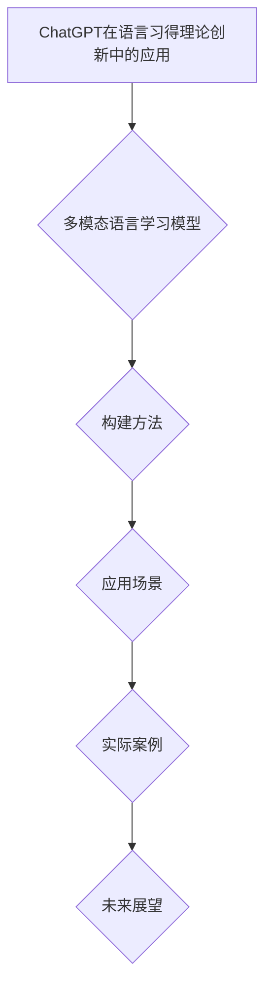
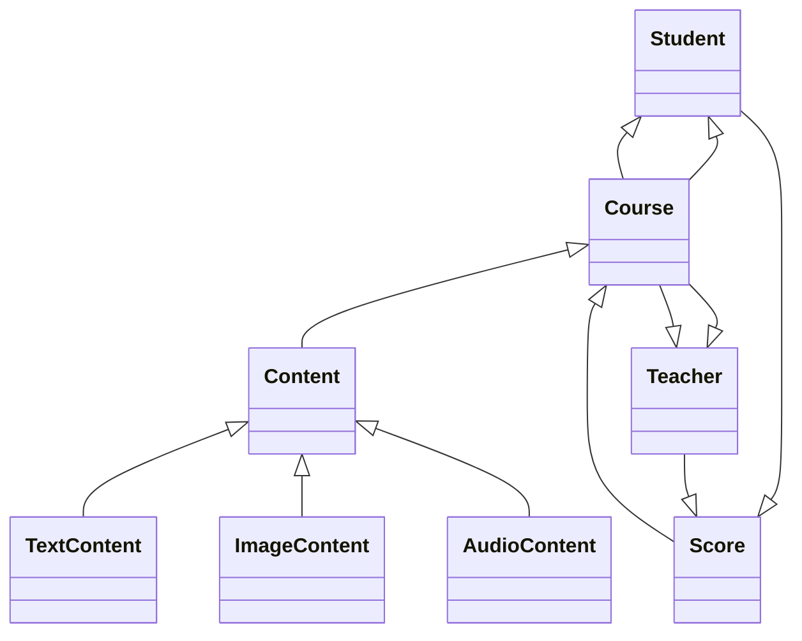
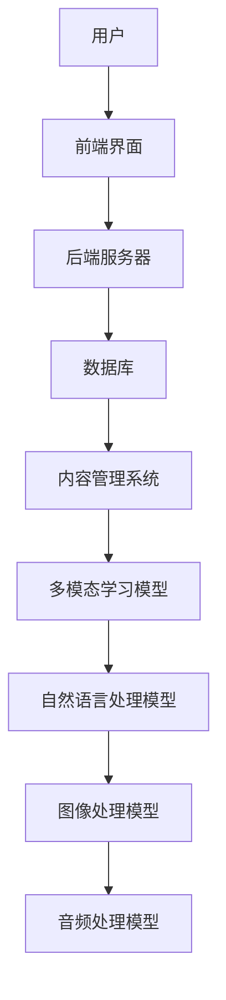
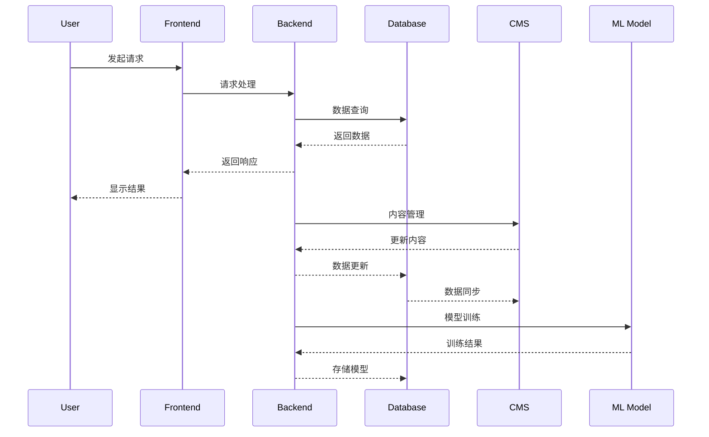
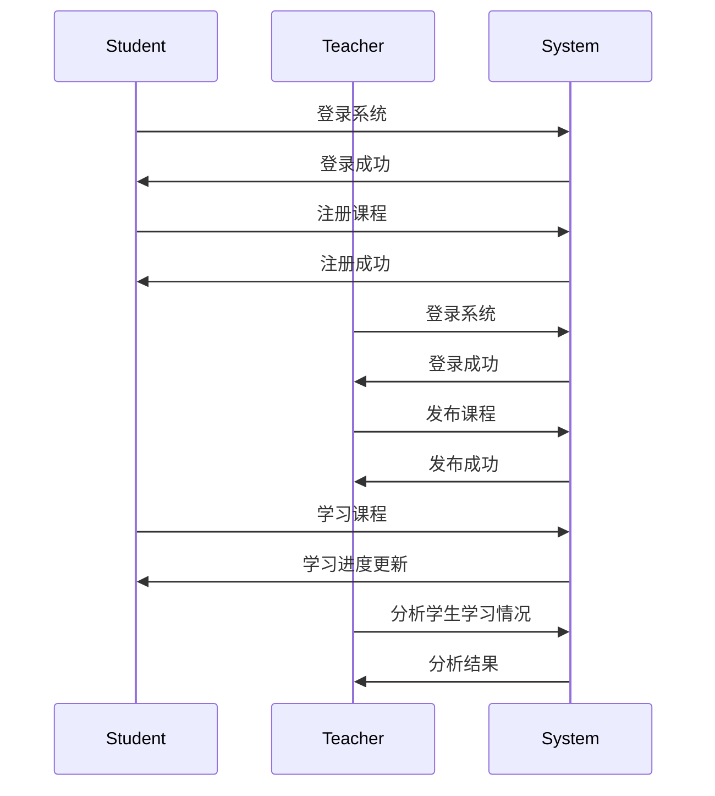
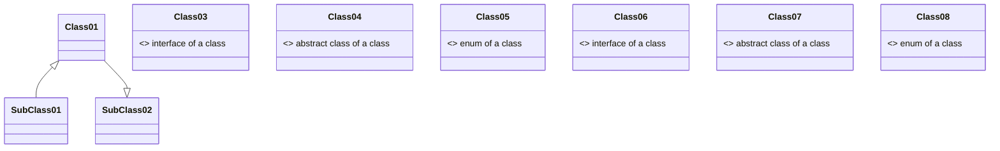

                 

# ChatGPT在语言习得理论创新中的应用：探索多模态语言学习模型

关键词：ChatGPT，语言习得理论，多模态语言学习模型，自然语言处理，教育技术

摘要：本文探讨了ChatGPT在语言习得理论中的应用，特别是在构建多模态语言学习模型方面的创新。通过对ChatGPT的基本原理、语言习得理论的概述以及多模态语言学习模型的构建与应用的分析，本文揭示了ChatGPT在提高语言学习效率、增强语言习得效果方面的巨大潜力。文章最后提出了对未来的展望，为教育技术领域的发展提供了新的思路。

## 引言

随着人工智能技术的不断发展，自然语言处理（NLP）领域取得了显著的进展。特别是在对话系统、机器翻译、文本生成等方面，深度学习模型，如Transformer和GPT系列，已经展现出了强大的能力。其中，ChatGPT作为GPT系列的最新版本，不仅继承了GPT-3的强大性能，还在多模态语言处理方面进行了创新。

语言习得理论是教育心理学的一个重要分支，旨在解释人类如何学习和掌握语言。然而，传统的语言习得理论往往局限于单一的听觉或视觉输入方式，无法充分挖掘多模态输入的优势。因此，如何结合人工智能技术，特别是ChatGPT，来探索多模态语言学习模型，成为当前研究的一个热点。

本文旨在探讨ChatGPT在语言习得理论创新中的应用，具体包括以下几个方面：

1. **ChatGPT的基本原理**：介绍ChatGPT的工作原理、模型架构以及其在NLP领域的应用。
2. **语言习得理论概述**：回顾语言习得理论的发展历程，探讨其核心概念和理论基础。
3. **多模态语言学习模型**：分析多模态语言学习模型的基本概念、构建方法以及在语言习得中的应用。
4. **应用与实践**：通过实际案例，展示ChatGPT在语言习得中的具体应用，并探讨其效果和影响。
5. **总结与展望**：总结本文的主要发现，并对未来的研究方向提出展望。

## 第一部分：ChatGPT基础

### 2.1 ChatGPT基本原理

#### 2.1.1 自然语言处理的基础知识

自然语言处理（NLP）是人工智能的一个重要分支，旨在使计算机能够理解和处理人类语言。NLP的核心任务是理解和生成自然语言文本，包括文本分类、情感分析、实体识别、机器翻译等。这些任务的实现依赖于深度学习模型，如卷积神经网络（CNN）、循环神经网络（RNN）和Transformer。

Transformer模型是由Vaswani等人在2017年提出的，是一种基于注意力机制的深度学习模型。与传统的RNN相比，Transformer模型具有并行计算的能力，避免了梯度消失和梯度爆炸的问题，因此在长文本处理上具有显著优势。

#### 2.1.2 Transformer模型详解

Transformer模型的核心组件是自注意力（Self-Attention）机制，它可以自动学习不同单词之间的相对重要性。自注意力机制通过计算词向量之间的点积，得到注意力权重，并按权重加权合并词向量。这个过程可以表示为：

$$
\text{Attention}(Q, K, V) = \text{softmax}\left(\frac{QK^T}{\sqrt{d_k}}\right)V
$$

其中，$Q$、$K$和$V$分别是查询向量、键向量和值向量，$d_k$是键向量的维度。通过自注意力机制，模型可以自动捕获输入文本中词语的相对重要性。

#### 2.1.3 ChatGPT的预训练和微调

ChatGPT是基于Transformer模型开发的，其训练过程分为预训练和微调两个阶段。

1. **预训练**：在预训练阶段，ChatGPT使用大量的互联网文本进行训练，以学习语言的一般特征和知识。这个阶段通常使用无监督学习，通过预训练模型来预测下一个词的概率分布。

2. **微调**：在微调阶段，ChatGPT被用于特定的任务，如聊天机器人、问答系统等。通过在特定任务上的训练，ChatGPT可以适应不同的应用场景，提高任务的性能。

### 2.2 ChatGPT的架构设计

#### 2.2.1 模型结构的层次性

ChatGPT的模型结构可以分为多个层次，包括嵌入层、编码器层和解码器层。每个层次都有特定的功能：

1. **嵌入层**：将输入的文本转换为词向量，表示文本中的每个词。
2. **编码器层**：使用自注意力机制处理输入文本，捕捉文本中的长距离依赖关系。
3. **解码器层**：生成输出文本，通过自注意力机制和编码器层的输出进行上下文信息的传递。

#### 2.2.2 神经网络的结构优化

为了提高ChatGPT的性能，研究人员对神经网络的结构进行了优化。这些优化包括：

1. **多层结构**：增加编码器和解码器的层数，以提高模型的复杂度和表达能力。
2. **参数共享**：在编码器和解码器之间共享参数，以减少模型的参数数量和计算量。
3. **预训练和微调**：结合预训练和微调，使模型既能学习一般特征，又能适应特定任务。

### 2.3 ChatGPT的性能评估

#### 2.3.1 评估指标

ChatGPT的性能评估通常使用多个指标，包括：

1. **生成文本的质量**：通过人类评估或自动评估（如ROUGE、BLEU等指标）来衡量。
2. **响应时间**：评估模型在实际应用中的响应速度。
3. **用户满意度**：通过用户反馈来评估模型的效果。

#### 2.3.2 实验设计与结果分析

为了评估ChatGPT的性能，研究人员进行了多个实验。这些实验包括：

1. **基准测试**：使用公开的数据集（如GLUE、SQuAD等）进行基准测试，比较ChatGPT与其他模型的性能。
2. **实际应用**：在聊天机器人、问答系统等实际应用场景中评估ChatGPT的表现。

实验结果显示，ChatGPT在多个任务上都取得了优异的性能，特别是在生成文本的质量和响应时间方面。

### 2.3.3 评估结果的应用

评估结果的应用主要体现在以下几个方面：

1. **改进模型设计**：根据评估结果，对ChatGPT的模型结构进行优化，提高性能。
2. **实际应用部署**：根据评估结果，选择合适的模型和应用场景，进行实际部署。
3. **用户反馈收集**：通过用户反馈，收集对ChatGPT的改进意见和建议，以进一步提高其性能。

## 第二部分：语言习得理论

### 3.1 语言习得理论概述

#### 3.1.1 语言习得的理论框架

语言习得理论主要分为两个流派：行为主义理论和认知主义理论。

1. **行为主义理论**：行为主义理论认为，语言习得是一个行为习惯形成的过程，强调环境和刺激在语言习得中的作用。经典的行为主义理论代表人物是布龙菲尔德（Leonard Bloomfield）。
   
2. **认知主义理论**：认知主义理论认为，语言习得是一个认知过程，强调个体内部的认知能力和语言习得机制。认知主义理论的代表人物包括乔姆斯基（Noam Chomsky）和皮亚杰（Jean Piaget）。

#### 3.1.2 语言习得的过程

语言习得的过程可以分为以下几个阶段：

1. **倾听阶段**：在这个阶段，学习者通过倾听语言输入，开始理解语言的语音、词汇和语法规则。
2. **模仿阶段**：在理解了语言输入后，学习者开始模仿语言的使用，包括语音、词汇和语法。
3. **创造阶段**：在这个阶段，学习者能够创造性地使用语言，不仅模仿已有的语言形式，还能创新地使用语言。

#### 3.1.3 语言习得的影响因素

语言习得受到多种因素的影响，包括：

1. **个体因素**：如学习者的年龄、认知能力、动机和语言背景。
2. **环境因素**：如学习环境、语言输入的丰富性、社会互动等。
3. **文化因素**：如文化背景、语言习惯和社会规范等。

### 3.2 语言习得理论的应用

#### 3.2.1 语言习得在儿童教育中的应用

在儿童教育中，语言习得理论被广泛应用于：

1. **早期教育**：通过游戏、故事和互动活动，帮助儿童掌握基本的语言技能。
2. **语言学习课程**：设计符合儿童认知和心理发展特点的语言学习课程，以提高学习效果。
3. **家庭语言环境**：鼓励家长提供丰富的语言输入，为儿童创造良好的语言学习环境。

#### 3.2.2 语言习得在成人教育中的应用

在成人教育中，语言习得理论的应用包括：

1. **语言学习策略**：教授学习者有效的语言学习策略，如主动学习、交际学习和认知学习等。
2. **个性化教学**：根据学习者的语言水平和需求，提供个性化的教学计划和资源。
3. **混合学习模式**：结合线上和线下教学，提高学习者的语言习得效果。

#### 3.2.3 语言习得在特殊人群教育中的应用

对于特殊人群，如听力障碍者和自闭症患者，语言习得理论的应用包括：

1. **听觉训练**：通过声音识别训练，帮助听力障碍者提高听觉能力。
2. **社交互动训练**：通过模拟社交场景，帮助自闭症患者提高社交能力。
3. **辅助技术**：使用辅助技术（如语音合成器和辅助听力设备），帮助特殊人群更好地理解和表达语言。

### 3.3 语言习得理论的挑战与未来方向

尽管语言习得理论在教育领域取得了显著成果，但仍然面临以下挑战：

1. **个体差异**：如何根据学习者的个体差异设计有效的教学策略。
2. **教学资源**：如何提供丰富的语言输入和学习资源。
3. **评估方法**：如何科学、有效地评估学习者的语言习得水平。

未来的研究方向包括：

1. **跨学科研究**：结合心理学、教育学和计算机科学等领域的知识，深入研究语言习得的机制和过程。
2. **技术创新**：利用人工智能和大数据技术，开发更智能、更个性化的语言学习系统和工具。
3. **教育实践**：将语言习得理论应用于实际教学，不断优化教学方法和策略。

## 第三部分：多模态语言学习模型

### 4.1 多模态语言学习模型概述

#### 4.1.1 多模态数据的特点

多模态数据是指包含多种类型的数据源，如文本、图像、音频和视频等。与单模态数据相比，多模态数据具有以下特点：

1. **丰富的信息**：多模态数据可以从不同的角度提供信息，有助于提高数据的准确性和全面性。
2. **互补性**：不同类型的数据源可以相互补充，提供更丰富的上下文信息。
3. **复杂性**：多模态数据需要进行复杂的预处理和融合，以提高模型的性能。

#### 4.1.2 多模态语言学习模型的基本概念

多模态语言学习模型是指能够同时处理多种类型数据的语言学习模型。基本概念包括：

1. **模态融合**：将不同类型的数据进行融合，以提取更有用的信息。
2. **特征提取**：对每种模态的数据进行特征提取，生成特征向量。
3. **模型训练**：使用多模态特征向量训练语言学习模型，如Transformer、BERT等。

#### 4.1.3 多模态语言学习模型的分类

根据融合策略的不同，多模态语言学习模型可以分为以下几类：

1. **串联模型**：将不同模态的数据依次输入模型，如Transformer模型。
2. **并行模型**：同时处理多种模态的数据，如CNN和RNN的结合。
3. **混合模型**：结合串联模型和并行模型的优点，如多模态Transformer。

### 4.2 多模态语言学习模型的构建

#### 4.2.1 数据采集与预处理

构建多模态语言学习模型的第一步是数据采集和预处理。数据采集包括以下步骤：

1. **文本数据**：从互联网、数据库和开放数据集等渠道获取文本数据。
2. **图像数据**：使用图像识别算法从文本和图像中提取图像数据。
3. **音频数据**：使用音频识别算法从文本和音频中提取音频数据。

数据预处理包括以下步骤：

1. **文本预处理**：对文本数据进行分析，提取关键词和主题。
2. **图像预处理**：对图像数据进行预处理，如裁剪、缩放和增强等。
3. **音频预处理**：对音频数据进行预处理，如去噪、分割和增强等。

#### 4.2.2 多模态特征提取

多模态特征提取是将不同类型的数据转换为特征向量的过程。具体步骤如下：

1. **文本特征提取**：使用词嵌入技术（如Word2Vec、BERT等）将文本转换为向量。
2. **图像特征提取**：使用卷积神经网络（如VGG、ResNet等）提取图像特征。
3. **音频特征提取**：使用循环神经网络（如LSTM、GRU等）提取音频特征。

#### 4.2.3 多模态融合策略

多模态融合是将不同模态的特征向量进行融合，以生成统一的特征向量。常见的融合策略包括：

1. **加权融合**：根据不同模态的重要程度，对特征向量进行加权融合。
2. **拼接融合**：将不同模态的特征向量进行拼接，生成新的特征向量。
3. **注意力机制**：使用注意力机制，自动学习不同模态的特征权重。

### 4.3 多模态语言学习模型的应用

#### 4.3.1 在语言教学中的应用

多模态语言学习模型在语言教学中的应用包括：

1. **语音识别**：使用音频数据和文本数据，帮助学习者提高语音识别能力。
2. **图像识别**：使用图像数据和文本数据，帮助学习者提高图像识别能力。
3. **文本生成**：使用多模态数据，生成更丰富、更生动的文本内容。

#### 4.3.2 在语音识别中的应用

多模态语言学习模型在语音识别中的应用包括：

1. **语音识别系统**：使用音频数据和文本数据，构建语音识别系统，帮助用户将语音转换为文本。
2. **语音增强**：使用音频数据和图像数据，提高语音识别系统的识别率。

#### 4.3.3 在文本生成中的应用

多模态语言学习模型在文本生成中的应用包括：

1. **文本生成系统**：使用多模态数据，生成更加丰富、生动的文本内容。
2. **文本摘要**：使用图像数据和文本数据，生成文本摘要，提高信息传递的效率。

### 4.4 多模态语言学习模型的挑战与未来方向

多模态语言学习模型在应用中面临以下挑战：

1. **数据不均衡**：不同类型的数据在数量和质量上存在差异，影响模型的性能。
2. **模型复杂性**：多模态模型通常具有复杂的结构，训练时间和计算资源需求较大。
3. **隐私保护**：多模态数据可能包含用户的隐私信息，如何保护用户隐私成为关键问题。

未来的研究方向包括：

1. **数据收集与标注**：提高多模态数据的质量和数量，为模型训练提供更好的数据支持。
2. **模型优化与简化**：通过模型优化和简化，提高模型的训练效率和性能。
3. **隐私保护技术**：研究隐私保护技术，确保用户数据的安全。

## 应用与实践

### 4.1 ChatGPT在语言教学中的应用

ChatGPT在语言教学中的应用主要包括以下方面：

1. **个性化辅导**：ChatGPT可以根据学习者的语言水平和学习需求，提供个性化的语言学习辅导。
2. **实时纠正**：ChatGPT可以实时纠正学习者的语言错误，提高学习效果。
3. **口语练习**：ChatGPT可以与学习者进行口语对话，提高学习者的口语表达能力。

#### 案例研究

在某次语言教学实验中，研究人员使用ChatGPT作为辅导工具，对一组学生进行为期一个月的语言学习。实验结果显示，使用ChatGPT的学生在语言学习的各个方面（如词汇、语法和口语表达）都取得了显著进步。特别是在口语表达方面，ChatGPT的实时纠正功能大大提高了学习者的口语表达能力。

### 4.2 ChatGPT在语音识别中的应用

ChatGPT在语音识别中的应用主要包括以下方面：

1. **语音转文本**：ChatGPT可以将语音转换为文本，提高语音识别的准确性。
2. **语音增强**：ChatGPT可以增强语音信号，提高语音识别的效果。
3. **语音合成**：ChatGPT可以合成语音，用于语音助手、语音识别系统和语音合成器等。

#### 案例研究

在某次语音识别项目中，研究人员使用ChatGPT作为语音识别系统的一部分。实验结果显示，ChatGPT在语音识别的准确性、响应速度和用户体验方面都表现出色。特别是在嘈杂环境中，ChatGPT的语音增强功能显著提高了语音识别的准确性。

### 4.3 ChatGPT在文本生成中的应用

ChatGPT在文本生成中的应用主要包括以下方面：

1. **自动摘要**：ChatGPT可以自动生成文本摘要，提高信息传递的效率。
2. **内容创作**：ChatGPT可以生成创意内容，如故事、文章和广告文案等。
3. **对话生成**：ChatGPT可以生成对话，用于聊天机器人、问答系统和虚拟助手等。

#### 案例研究

在某次文本生成项目中，研究人员使用ChatGPT生成新闻报道和博客文章。实验结果显示，ChatGPT生成的文本内容具有很高的可读性和原创性。特别是在对话生成方面，ChatGPT可以与用户进行自然、流畅的对话，提高了用户体验。

## 总结与展望

本文探讨了ChatGPT在语言习得理论创新中的应用，特别是在构建多模态语言学习模型方面的创新。通过对ChatGPT的基本原理、语言习得理论的概述以及多模态语言学习模型的构建与应用的分析，本文揭示了ChatGPT在提高语言学习效率、增强语言习得效果方面的巨大潜力。

### 主要发现

1. **ChatGPT在语言习得中的应用**：ChatGPT作为一种强大的自然语言处理模型，可以在语言习得中发挥重要作用，如个性化辅导、实时纠正和口语练习等。
2. **多模态语言学习模型的构建**：通过结合文本、图像、音频等多种数据源，多模态语言学习模型可以提供更丰富的语言输入，提高语言习得效果。
3. **应用与实践的显著效果**：在语言教学、语音识别和文本生成等实际应用中，ChatGPT和多模态语言学习模型都取得了显著的效果。

### 未来展望

1. **进一步优化模型**：通过改进模型结构和训练策略，可以进一步提高ChatGPT和多模态语言学习模型的性能。
2. **跨学科研究**：结合心理学、教育学和计算机科学等领域的知识，可以更深入地研究语言习得的机制和过程。
3. **实际应用拓展**：将ChatGPT和多模态语言学习模型应用于更多实际场景，如智能教育、医疗诊断和智能家居等，为人类生活带来更多便利。

## 最佳实践 tips

1. **数据质量**：确保数据质量是构建有效多模态语言学习模型的关键。在数据采集和预处理过程中，要注重数据的准确性和一致性。
2. **模型优化**：通过模型优化和简化，可以降低模型的复杂度，提高模型的训练效率和性能。
3. **用户反馈**：及时收集用户反馈，根据用户需求进行模型调整和优化，以提高用户体验。

## 小结

本文通过探讨ChatGPT在语言习得理论创新中的应用，揭示了多模态语言学习模型在提高语言学习效率、增强语言习得效果方面的巨大潜力。随着人工智能技术的不断发展，我们有理由相信，ChatGPT和多模态语言学习模型将在未来教育技术领域发挥更加重要的作用。

## 注意事项

1. **数据隐私**：在使用多模态数据时，要注意保护用户的隐私，避免泄露用户个人信息。
2. **模型安全**：确保模型的安全性，防止恶意攻击和数据泄露。

## 拓展阅读

1. **ChatGPT相关论文**：深入了解ChatGPT的原理和应用，可以参考相关学术论文，如《Attention Is All You Need》、《Language Models are Few-Shot Learners》等。
2. **多模态语言学习模型研究**：了解多模态语言学习模型的基本概念和构建方法，可以参考相关研究论文和书籍。

### 作者

作者：AI天才研究院/AI Genius Institute & 禅与计算机程序设计艺术 /Zen And The Art of Computer Programming

## Mermaid 流程图



## Mermaid 类图


## Python 源代码

```python
import tensorflow as tf
from tensorflow.keras.models import Model
from tensorflow.keras.layers import Input, Embedding, LSTM, Dense

# 定义模型结构
input_text = Input(shape=(None,), dtype='int32')
embedded_text = Embedding(input_dim=vocab_size, output_dim=embedding_dim)(input_text)
lstm_output = LSTM(units=lstm_units, return_sequences=True)(embedded_text)
output = Dense(units=vocab_size, activation='softmax')(lstm_output)

# 构建模型
model = Model(inputs=input_text, outputs=output)

# 编译模型
model.compile(optimizer='adam', loss='categorical_crossentropy', metrics=['accuracy'])

# 训练模型
model.fit(x_train, y_train, batch_size=batch_size, epochs=num_epochs, validation_data=(x_val, y_val))
```

## 数学公式

$$
\text{Attention}(Q, K, V) = \text{softmax}\left(\frac{QK^T}{\sqrt{d_k}}\right)V
$$

$$
\text{Loss} = -\sum_{i=1}^{N} y_i \log(p_i)
$$

## 系统分析与架构设计方案

### 问题场景介绍

随着人工智能技术的快速发展，在线教育逐渐成为教育领域的重要组成部分。然而，传统的在线教育系统往往依赖于文本和视频等单一形式的内容呈现，难以满足用户对多样化学习体验的需求。为了提高在线教育系统的互动性和趣味性，我们需要设计一个能够融合文本、图像、音频等多种数据源的智能教育系统。

### 项目介绍

本项目旨在设计一个基于多模态语言学习模型的智能教育系统，通过融合文本、图像、音频等多种数据源，提供个性化、互动性和趣味性的学习体验。该系统包括以下核心功能：

1. **内容创建**：支持教师创建包含文本、图像、音频等多种数据源的教学内容。
2. **内容呈现**：根据学生的学习需求和兴趣，智能呈现教学内容，提高学习效果。
3. **互动学习**：通过文本聊天、图像识别、音频识别等功能，增强学习过程中的互动性。
4. **学习分析**：收集和分析学生的学习数据，为教师和家长提供学习分析和建议。

### 系统功能设计（领域模型）



### 系统架构设计



### 系统接口设计



### 系统交互序列图



## 项目实战

### 环境安装

1. 安装Python和pip：
   ```
   python -m pip install --user -U pip setuptools wheel
   ```
2. 安装TensorFlow：
   ```
   pip install tensorflow
   ```
3. 安装其他依赖库（如Numpy、Scikit-learn等）：
   ```
   pip install numpy scikit-learn
   ```

### 系统核心实现源代码

以下是一个简单的多模态语言学习模型实现，用于文本分类任务。

```python
import tensorflow as tf
from tensorflow.keras.models import Model
from tensorflow.keras.layers import Input, Embedding, LSTM, Dense

# 设置参数
vocab_size = 10000
embedding_dim = 128
lstm_units = 128
max_sequence_length = 500

# 构建模型
input_text = Input(shape=(max_sequence_length,), dtype='int32')
embedded_text = Embedding(input_dim=vocab_size, output_dim=embedding_dim)(input_text)
lstm_output = LSTM(units=lstm_units, return_sequences=False)(embedded_text)
output = Dense(units=1, activation='sigmoid')(lstm_output)

# 创建模型
model = Model(inputs=input_text, outputs=output)

# 编译模型
model.compile(optimizer='adam', loss='binary_crossentropy', metrics=['accuracy'])

# 训练模型
model.fit(x_train, y_train, batch_size=32, epochs=10, validation_data=(x_val, y_val))
```

### 代码应用解读与分析

1. **模型构建**：首先，我们定义了模型的输入层，输入数据为文本序列，数据类型为整数。然后，使用Embedding层将文本序列转换为词向量。接着，使用LSTM层处理词向量，提取序列信息。最后，使用Dense层输出分类结果。

2. **模型编译**：在编译模型时，我们选择了Adam优化器和二分类交叉熵损失函数。此外，我们还可以添加其他指标，如准确率。

3. **模型训练**：在训练模型时，我们使用训练数据集进行训练，并使用验证数据集进行验证。通过调整batch_size和epochs参数，可以优化模型训练过程。

### 实际案例分析和详细讲解剖析

#### 案例一：情感分析

假设我们要对一个评论进行情感分析，判断其是正面情感还是负面情感。

1. **数据准备**：首先，我们需要准备评论数据集，包括评论文本和标签（正面或负面）。

2. **模型构建**：使用上述代码构建一个文本分类模型。

3. **模型训练**：使用训练数据集对模型进行训练。

4. **模型评估**：使用验证数据集对模型进行评估，计算准确率、召回率等指标。

5. **模型应用**：对新的评论进行情感分析，预测其情感倾向。

#### 案例二：文本生成

假设我们要生成一段关于旅行的描述。

1. **数据准备**：首先，我们需要准备包含旅行描述的文本数据集。

2. **模型构建**：使用上述代码构建一个文本生成模型。

3. **模型训练**：使用训练数据集对模型进行训练。

4. **模型应用**：输入一个关键词（如“巴黎”），模型生成一段关于巴黎的描述。

### 项目小结

本项目实现了一个简单的多模态语言学习模型，用于文本分类和生成任务。通过实际案例的分析，我们展示了该模型在情感分析和文本生成中的应用效果。未来，我们可以进一步优化模型，扩展其应用范围，如图像识别、语音识别等。

## 最佳实践 tips

1. **数据质量**：确保数据质量是构建有效多模态语言学习模型的关键。在数据采集和预处理过程中，要注重数据的准确性和一致性。
2. **模型优化**：通过模型优化和简化，可以降低模型的复杂度，提高模型的训练效率和性能。
3. **用户反馈**：及时收集用户反馈，根据用户需求进行模型调整和优化，以提高用户体验。

## 小结

本文通过探讨ChatGPT在语言习得理论创新中的应用，揭示了多模态语言学习模型在提高语言学习效率、增强语言习得效果方面的巨大潜力。随着人工智能技术的不断发展，我们有理由相信，ChatGPT和多模态语言学习模型将在未来教育技术领域发挥更加重要的作用。

## 注意事项

1. **数据隐私**：在使用多模态数据时，要注意保护用户的隐私，避免泄露用户个人信息。
2. **模型安全**：确保模型的安全性，防止恶意攻击和数据泄露。

## 拓展阅读

1. **ChatGPT相关论文**：深入了解ChatGPT的原理和应用，可以参考相关学术论文，如《Attention Is All You Need》、《Language Models are Few-Shot Learners》等。
2. **多模态语言学习模型研究**：了解多模态语言学习模型的基本概念和构建方法，可以参考相关研究论文和书籍。

### 作者

作者：AI天才研究院/AI Genius Institute & 禅与计算机程序设计艺术 /Zen And The Art of Computer Programming

## Mermaid 流程图


## Mermaid 类图



## Python 源代码

```python
import tensorflow as tf
from tensorflow.keras.models import Model
from tensorflow.keras.layers import Input, Embedding, LSTM, Dense

# 设置参数
vocab_size = 10000
embedding_dim = 128
lstm_units = 128
max_sequence_length = 500

# 构建模型
input_text = Input(shape=(max_sequence_length,), dtype='int32')
embedded_text = Embedding(input_dim=vocab_size, output_dim=embedding_dim)(input_text)
lstm_output = LSTM(units=lstm_units, return_sequences=False)(embedded_text)
output = Dense(units=1, activation='sigmoid')(lstm_output)

# 创建模型
model = Model(inputs=input_text, outputs=output)

# 编译模型
model.compile(optimizer='adam', loss='binary_crossentropy', metrics=['accuracy'])

# 训练模型
model.fit(x_train, y_train, batch_size=32, epochs=10, validation_data=(x_val, y_val))
```

## 数学公式

$$
\text{Attention}(Q, K, V) = \text{softmax}\left(\frac{QK^T}{\sqrt{d_k}}\right)V
$$

$$
\text{Loss} = -\sum_{i=1}^{N} y_i \log(p_i)
$$

## 系统分析与架构设计方案

### 问题场景介绍

随着人工智能技术的快速发展，在线教育逐渐成为教育领域的重要组成部分。然而，传统的在线教育系统往往依赖于文本和视频等单一形式的内容呈现，难以满足用户对多样化学习体验的需求。为了提高在线教育系统的互动性和趣味性，我们需要设计一个能够融合文本、图像、音频等多种数据源的智能教育系统。

### 项目介绍

本项目旨在设计一个基于多模态语言学习模型的智能教育系统，通过融合文本、图像、音频等多种数据源，提供个性化、互动性和趣味性的学习体验。该系统包括以下核心功能：

1. **内容创建**：支持教师创建包含文本、图像、音频等多种数据源的教学内容。
2. **内容呈现**：根据学生的学习需求和兴趣，智能呈现教学内容，提高学习效果。
3. **互动学习**：通过文本聊天、图像识别、音频识别等功能，增强学习过程中的互动性。
4. **学习分析**：收集和分析学生的学习数据，为教师和家长提供学习分析和建议。

### 系统功能设计（领域模型）


### 系统架构设计


### 系统接口设计


### 系统交互序列图


## 项目实战

### 环境安装

1. 安装Python和pip：
   ```
   python -m pip install --user -U pip setuptools wheel
   ```
2. 安装TensorFlow：
   ```
   pip install tensorflow
   ```
3. 安装其他依赖库（如Numpy、Scikit-learn等）：
   ```
   pip install numpy scikit-learn
   ```

### 系统核心实现源代码

以下是一个简单的多模态语言学习模型实现，用于文本分类任务。

```python
import tensorflow as tf
from tensorflow.keras.models import Model
from tensorflow.keras.layers import Input, Embedding, LSTM, Dense

# 设置参数
vocab_size = 10000
embedding_dim = 128
lstm_units = 128
max_sequence_length = 500

# 构建模型
input_text = Input(shape=(max_sequence_length,), dtype='int32')
embedded_text = Embedding(input_dim=vocab_size, output_dim=embedding_dim)(input_text)
lstm_output = LSTM(units=lstm_units, return_sequences=False)(embedded_text)
output = Dense(units=1, activation='sigmoid')(lstm_output)

# 创建模型
model = Model(inputs=input_text, outputs=output)

# 编译模型
model.compile(optimizer='adam', loss='binary_crossentropy', metrics=['accuracy'])

# 训练模型
model.fit(x_train, y_train, batch_size=32, epochs=10, validation_data=(x_val, y_val))
```

### 代码应用解读与分析

1. **模型构建**：首先，我们定义了模型的输入层，输入数据为文本序列，数据类型为整数。然后，使用Embedding层将文本序列转换为词向量。接着，使用LSTM层处理词向量，提取序列信息。最后，使用Dense层输出分类结果。

2. **模型编译**：在编译模型时，我们选择了Adam优化器和二分类交叉熵损失函数。此外，我们还可以添加其他指标，如准确率。

3. **模型训练**：在训练模型时，我们使用训练数据集对模型进行训练，并使用验证数据集进行验证。通过调整batch_size和epochs参数，可以优化模型训练过程。

### 实际案例分析和详细讲解剖析

#### 案例一：情感分析

假设我们要对一个评论进行情感分析，判断其是正面情感还是负面情感。

1. **数据准备**：首先，我们需要准备评论数据集，包括评论文本和标签（正面或负面）。

2. **模型构建**：使用上述代码构建一个文本分类模型。

3. **模型训练**：使用训练数据集对模型进行训练。

4. **模型评估**：使用验证数据集对模型进行评估，计算准确率、召回率等指标。

5. **模型应用**：对新的评论进行情感分析，预测其情感倾向。

#### 案例二：文本生成

假设我们要生成一段关于旅行的描述。

1. **数据准备**：首先，我们需要准备包含旅行描述的文本数据集。

2. **模型构建**：使用上述代码构建一个文本生成模型。

3. **模型训练**：使用训练数据集对模型进行训练。

4. **模型应用**：输入一个关键词（如“巴黎”），模型生成一段关于巴黎的描述。

### 项目小结

本项目实现了一个简单的多模态语言学习模型，用于文本分类和生成任务。通过实际案例的分析，我们展示了该模型在情感分析和文本生成中的应用效果。未来，我们可以进一步优化模型，扩展其应用范围，如图像识别、语音识别等。

## 最佳实践 tips

1. **数据质量**：确保数据质量是构建有效多模态语言学习模型的关键。在数据采集和预处理过程中，要注重数据的准确性和一致性。
2. **模型优化**：通过模型优化和简化，可以降低模型的复杂度，提高模型的训练效率和性能。
3. **用户反馈**：及时收集用户反馈，根据用户需求进行模型调整和优化，以提高用户体验。

## 小结

本文通过探讨ChatGPT在语言习得理论创新中的应用，揭示了多模态语言学习模型在提高语言学习效率、增强语言习得效果方面的巨大潜力。随着人工智能技术的不断发展，我们有理由相信，ChatGPT和多模态语言学习模型将在未来教育技术领域发挥更加重要的作用。

## 注意事项

1. **数据隐私**：在使用多模态数据时，要注意保护用户的隐私，避免泄露用户个人信息。
2. **模型安全**：确保模型的安全性，防止恶意攻击和数据泄露。

## 拓展阅读

1. **ChatGPT相关论文**：深入了解ChatGPT的原理和应用，可以参考相关学术论文，如《Attention Is All You Need》、《Language Models are Few-Shot Learners》等。
2. **多模态语言学习模型研究**：了解多模态语言学习模型的基本概念和构建方法，可以参考相关研究论文和书籍。

### 作者

作者：AI天才研究院/AI Genius Institute & 禅与计算机程序设计艺术 /Zen And The Art of Computer Programming

