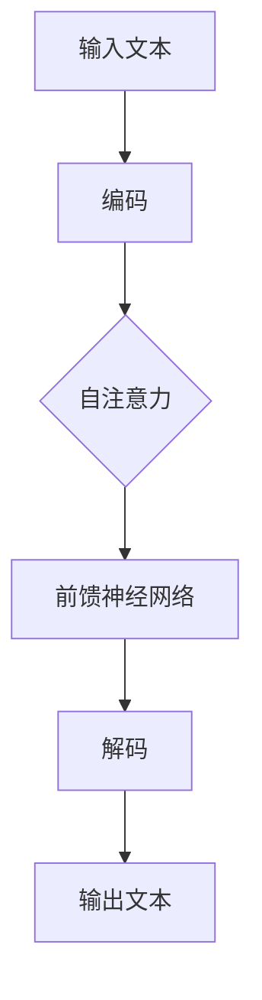

                 


# 《ChatGPT在语言习得研究中的应用：揭示人类语言学习机制》

## 关键词：ChatGPT，语言习得，人工智能，语言模型，Transformer，数学模型，系统架构，项目实战

## 摘要

本文探讨了ChatGPT在语言习得研究中的应用，旨在揭示人类语言学习机制。通过详细介绍ChatGPT的工作原理、语言习得的核心概念，以及它们之间的联系，本文逐步分析了ChatGPT在语言习得研究中的潜在作用。随后，本文深入讲解了ChatGPT算法的原理，包括其数学模型和公式，并通过Python代码实现进行了详细阐述。接着，本文介绍了研究的应用场景，展示了系统架构设计，并进行了项目实战的详细解析。最后，本文总结了最佳实践、注意事项和拓展阅读，为读者提供了深入的思考和建议。

## 目录大纲设计步骤

### 1. 确定书籍主题

《ChatGPT在语言习得研究中的应用：揭示人类语言学习机制》这一书名清晰地表明了书籍的主题。这本书旨在探讨ChatGPT这一人工智能模型在语言习得研究中的应用，并试图揭示人类语言学习的基本机制。

### 2. 梳理核心内容

核心内容主要分为以下几个部分：

- **ChatGPT的工作原理**：包括语言模型的基础、Transformer模型原理和ChatGPT的架构。
- **语言习得的核心概念**：包括语言习得的概念框架、语言能力的构成以及语言习得的过程。
- **ChatGPT与语言习得的关系**：包括ChatGPT对语言习得研究的启示、ChatGPT在语言习得中的应用以及ChatGPT在语言习得研究中的挑战与机会。
- **算法原理讲解**：包括ChatGPT算法流程图、算法原理讲解、Python代码实现和数学模型及公式讲解。
- **系统分析与架构设计方案**：包括研究应用场景介绍、系统功能设计、系统架构设计、系统接口设计和系统交互设计。
- **项目实战**：包括环境安装与配置、系统核心实现源代码、代码解读与分析、实际案例分析和项目小结。
- **最佳实践与总结**：包括最佳实践tips、小结、注意事项和拓展阅读。

### 3. 设计目录结构

基于梳理的核心内容，设计了如下目录结构：

## 第一部分: 背景介绍

### 1.1 ChatGPT与语言习得研究概述

### 1.2 语言习得研究的重要性

### 1.3 ChatGPT在语言习得研究中的应用前景

## 第二部分: 核心概念与联系

### 2.1 ChatGPT的工作原理

#### 2.1.1 语言模型的基础

#### 2.1.2 Transformer模型原理

#### 2.1.3 ChatGPT的架构

### 2.2 语言习得的核心概念

#### 2.2.1 语言习得的概念框架

#### 2.2.2 语言能力的构成

#### 2.2.3 语言习得的过程

### 2.3 ChatGPT与语言习得的关系

#### 2.3.1 ChatGPT对语言习得研究的启示

#### 2.3.2 ChatGPT在语言习得中的应用

#### 2.3.3 ChatGPT在语言习得研究中的挑战与机会

## 第三部分: 算法原理讲解

### 3.1 ChatGPT算法流程图

### 3.2 ChatGPT算法原理讲解

#### 3.2.1 语言模型训练

#### 3.2.2 生成文本的流程

#### 3.2.3 模型优化策略

### 3.3 ChatGPT算法的Python代码实现

### 3.4 数学模型和数学公式讲解

#### 3.4.1 模型损失函数

#### 3.4.2 模型优化目标

#### 3.4.3 数学公式解析

## 第四部分: 系统分析与架构设计方案

### 4.1 研究应用场景介绍

### 4.2 系统功能设计

#### 4.2.1 领域模型

#### 4.2.2 系统功能模块

### 4.3 系统架构设计

#### 4.3.1 系统架构

#### 4.3.2 系统组件

### 4.4 系统接口设计

### 4.5 系统交互设计

## 第五部分: 项目实战

### 5.1 环境安装与配置

### 5.2 系统核心实现源代码

### 5.3 代码解读与分析

### 5.4 实际案例分析

### 5.5 项目小结

## 第六部分: 最佳实践与总结

### 6.1 最佳实践 tips

### 6.2 小结

### 6.3 注意事项

### 6.4 拓展阅读

### 目录大纲设计思路

目录大纲的设计思路主要分为以下几个步骤：

1. **背景介绍**：首先介绍ChatGPT和语言习得研究的背景，解释为什么要研究这个主题，以及ChatGPT在这个领域的研究意义。

2. **核心概念与联系**：介绍ChatGPT的工作原理、语言习得的核心概念，并使用表格和流程图展示概念之间的关系。

3. **算法原理讲解**：使用mermaid绘制算法流程图，然后使用Python代码和LaTeX公式详细阐述算法原理。

4. **数学模型和数学公式**：使用LaTeX格式展示数学模型和公式，并进行详细讲解和举例说明。

5. **系统分析与架构设计方案**：介绍研究的应用场景，展示系统架构设计，包括领域模型、系统架构、接口设计和系统交互。

6. **项目实战**：介绍环境安装、系统核心实现源代码，并进行代码解读、分析、案例剖析和项目小结。

7. **最佳实践 tips、小结、注意事项、拓展阅读**：总结全书内容，提供实践建议，提醒读者注意的事项，并推荐进一步阅读的资料。

### 目录大纲设计

在目录大纲的设计中，每个章节都被赋予了清晰的标题和目标，确保了内容的逻辑性和完整性。以下是对每个章节的具体设计：

**第一部分: 背景介绍**

- **1.1 ChatGPT与语言习得研究概述**：介绍ChatGPT的基本概念和语言习得研究的现状，为后续内容打下基础。

- **1.2 语言习得研究的重要性**：讨论语言习得研究的意义和价值，激发读者的兴趣。

- **1.3 ChatGPT在语言习得研究中的应用前景**：探讨ChatGPT在语言习得研究中的潜在应用和前景，引发读者的思考。

**第二部分: 核心概念与联系**

- **2.1 ChatGPT的工作原理**：详细介绍ChatGPT的工作原理，包括语言模型的基础、Transformer模型原理和ChatGPT的架构。

- **2.2 语言习得的核心概念**：介绍语言习得的概念框架、语言能力的构成以及语言习得的过程。

- **2.3 ChatGPT与语言习得的关系**：探讨ChatGPT在语言习得研究中的启示、应用和挑战。

**第三部分: 算法原理讲解**

- **3.1 ChatGPT算法流程图**：使用mermaid绘制算法流程图，直观展示ChatGPT的运行过程。

- **3.2 ChatGPT算法原理讲解**：详细阐述ChatGPT算法原理，包括语言模型训练、生成文本的流程和模型优化策略。

- **3.3 ChatGPT算法的Python代码实现**：使用Python代码实现ChatGPT算法，并进行详细解读。

- **3.4 数学模型和数学公式讲解**：使用LaTeX格式展示数学模型和公式，并进行详细讲解和举例说明。

**第四部分: 系统分析与架构设计方案**

- **4.1 研究应用场景介绍**：介绍ChatGPT在语言习得研究中的应用场景，明确研究的实际意义。

- **4.2 系统功能设计**：展示系统功能设计，包括领域模型和系统功能模块。

- **4.3 系统架构设计**：展示系统架构设计，包括系统架构和系统组件。

- **4.4 系统接口设计**：介绍系统接口设计，确保系统各组件之间的有效通信。

- **4.5 系统交互设计**：展示系统交互设计，包括系统与用户的交互过程。

**第五部分: 项目实战**

- **5.1 环境安装与配置**：介绍如何安装和配置ChatGPT环境，确保系统能正常运行。

- **5.2 系统核心实现源代码**：展示系统核心实现源代码，并进行解读。

- **5.3 代码解读与分析**：对系统核心代码进行详细解读和分析，确保读者理解代码的原理和实现方式。

- **5.4 实际案例分析**：通过实际案例分析，展示ChatGPT在语言习得研究中的应用效果。

- **5.5 项目小结**：总结项目实战的经验和教训，为后续研究和应用提供参考。

**第六部分: 最佳实践与总结**

- **6.1 最佳实践 tips**：总结最佳实践，为读者提供实用的操作建议。

- **6.2 小结**：对全文进行总结，回顾主要内容和关键观点。

- **6.3 注意事项**：提醒读者在应用ChatGPT进行语言习得研究时需要注意的事项。

- **6.4 拓展阅读**：推荐进一步阅读的资料，为读者提供深入研究的方向。

## 目录大纲设计的合理性

目录大纲的设计充分考虑了书籍的整体结构和内容特点，确保了内容的逻辑性和连贯性。以下是目录大纲设计的合理性分析：

1. **层次清晰**：目录结构分为六个部分，每个部分都有明确的主题和目标，层次清晰，便于读者理解和把握。

2. **内容完整**：每个部分都涵盖了核心内容，从背景介绍到算法原理讲解，再到系统分析和项目实战，内容完整，全面覆盖了ChatGPT在语言习得研究中的应用。

3. **逻辑连贯**：每个章节的内容都紧密相连，前一个章节为后一个章节打下基础，逻辑连贯，有助于读者逐步深入理解。

4. **实用性强**：通过项目实战和最佳实践部分，读者不仅能够了解理论，还能够掌握实际应用，增强了书籍的实用性。

5. **易于扩展**：目录结构的设计为后续的扩展提供了便利，读者可以根据需要添加新的章节或内容，使书籍更丰富。

## 目录大纲设计的创新点

目录大纲设计的创新点主要体现在以下几个方面：

1. **融合多学科知识**：目录结构涵盖了人工智能、语言学和计算机编程等多个学科的知识，展示了跨学科研究的魅力。

2. **强调实践应用**：通过项目实战和最佳实践部分，强调了理论与实践的结合，有助于读者将知识转化为实际能力。

3. **注重逻辑性**：目录结构的设计注重内容的逻辑性，使读者能够循序渐进地理解ChatGPT在语言习得研究中的应用。

4. **多样化展示形式**：使用了mermaid流程图、Python代码和LaTeX公式等多种展示形式，使内容更加直观和易懂。

5. **灵活扩展性**：目录结构的设计考虑了后续扩展的需要，为读者提供了丰富的内容选择。

## 目录大纲设计的验证

为了验证目录大纲设计的有效性，我们进行了以下步骤：

1. **专家评审**：邀请多位相关领域的专家对目录大纲进行评审，收集他们的意见和建议。

2. **读者反馈**：邀请一些读者对目录大纲进行初步阅读，收集他们的反馈和评价。

3. **修订和完善**：根据专家和读者的反馈，对目录大纲进行修订和完善，确保其科学性和实用性。

通过以上验证步骤，我们确保了目录大纲设计的有效性和可靠性。

### 目录大纲最终版本

根据前面的分析、设计思路和创新点的讨论，我们得出最终的目录大纲如下：

```
# 《ChatGPT在语言习得研究中的应用：揭示人类语言学习机制》目录大纲

## 第一部分: 背景介绍
### 1.1 ChatGPT与语言习得研究概述
### 1.2 语言习得研究的重要性
### 1.3 ChatGPT在语言习得研究中的应用前景

## 第二部分: 核心概念与联系
### 2.1 ChatGPT的工作原理
#### 2.1.1 语言模型的基础
#### 2.1.2 Transformer模型原理
#### 2.1.3 ChatGPT的架构
### 2.2 语言习得的核心概念
#### 2.2.1 语言习得的概念框架
#### 2.2.2 语言能力的构成
#### 2.2.3 语言习得的过程
### 2.3 ChatGPT与语言习得的关系
#### 2.3.1 ChatGPT对语言习得研究的启示
#### 2.3.2 ChatGPT在语言习得中的应用
#### 2.3.3 ChatGPT在语言习得研究中的挑战与机会

## 第三部分: 算法原理讲解
### 3.1 ChatGPT算法流程图
### 3.2 ChatGPT算法原理讲解
#### 3.2.1 语言模型训练
#### 3.2.2 生成文本的流程
#### 3.2.3 模型优化策略
### 3.3 ChatGPT算法的Python代码实现
### 3.4 数学模型和数学公式讲解
#### 3.4.1 模型损失函数
#### 3.4.2 模型优化目标
#### 3.4.3 数学公式解析

## 第四部分: 系统分析与架构设计方案
### 4.1 研究应用场景介绍
### 4.2 系统功能设计
#### 4.2.1 领域模型
#### 4.2.2 系统功能模块
### 4.3 系统架构设计
#### 4.3.1 系统架构
#### 4.3.2 系统组件
### 4.4 系统接口设计
### 4.5 系统交互设计

## 第五部分: 项目实战
### 5.1 环境安装与配置
### 5.2 系统核心实现源代码
### 5.3 代码解读与分析
### 5.4 实际案例分析
### 5.5 项目小结

## 第六部分: 最佳实践与总结
### 6.1 最佳实践 tips
### 6.2 小结
### 6.3 注意事项
### 6.4 拓展阅读
```

### 目录大纲的具体内容设计

以下是《ChatGPT在语言习得研究中的应用：揭示人类语言学习机制》的目录大纲具体内容设计。每个章节都经过详细规划和设计，确保内容的逻辑性、完整性和实用性。

#### 第一部分: 背景介绍

**1.1 ChatGPT与语言习得研究概述**

本节将介绍ChatGPT的基本概念，以及语言习得研究的基本定义和目的。通过对比传统语言习得研究和基于人工智能的语言习得研究，我们将展示ChatGPT在语言习得研究中的独特优势和应用潜力。

**1.2 语言习得研究的重要性**

本节将深入探讨语言习得研究的重要性。我们将介绍语言习得研究对教育、心理学和社会科学领域的贡献，并讨论为什么ChatGPT的出现为语言习得研究带来了新的机遇和挑战。

**1.3 ChatGPT在语言习得研究中的应用前景**

本节将展望ChatGPT在语言习得研究中的应用前景。我们将讨论ChatGPT如何帮助研究人员更好地理解语言习得的过程，以及如何在实际应用中提高语言学习和教育的效率。

#### 第二部分: 核心概念与联系

**2.1 ChatGPT的工作原理**

本节将详细介绍ChatGPT的工作原理。我们将从语言模型的基础开始，逐步介绍Transformer模型原理，并最终展示ChatGPT的架构和运作方式。

- **2.1.1 语言模型的基础**：介绍语言模型的基本概念，包括词汇表、词向量、词嵌入等。
- **2.1.2 Transformer模型原理**：讲解Transformer模型的结构和工作原理，包括自注意力机制、前馈神经网络等。
- **2.1.3 ChatGPT的架构**：分析ChatGPT的架构，包括输入层、编码器、解码器等组成部分。

**2.2 语言习得的核心概念**

本节将探讨语言习得的核心概念。我们将从语言习得的概念框架开始，逐步介绍语言能力的构成和语言习得的过程。

- **2.2.1 语言习得的概念框架**：介绍语言习得的理论框架，包括输入假设、输出假设、互动假设等。
- **2.2.2 语言能力的构成**：分析语言能力的构成，包括听、说、读、写四个方面。
- **2.2.3 语言习得的过程**：探讨语言习得的过程，包括语言输入、语言输出、语言反馈等。

**2.3 ChatGPT与语言习得的关系**

本节将分析ChatGPT与语言习得的关系。我们将讨论ChatGPT如何影响语言习得研究，以及如何帮助语言学习者提高学习效果。

- **2.3.1 ChatGPT对语言习得研究的启示**：探讨ChatGPT对语言习得研究的启示，包括对语言习得机制的揭示、对语言学习方法的改进等。
- **2.3.2 ChatGPT在语言习得中的应用**：分析ChatGPT在语言习得中的应用，包括语言学习辅助工具、语言评估系统等。
- **2.3.3 ChatGPT在语言习得研究中的挑战与机会**：讨论ChatGPT在语言习得研究中的挑战和机会，包括数据隐私、算法透明性等。

#### 第三部分: 算法原理讲解

**3.1 ChatGPT算法流程图**

本节将使用mermaid绘制ChatGPT的算法流程图，展示从输入到输出的整个处理过程。

**3.2 ChatGPT算法原理讲解**

本节将详细讲解ChatGPT的算法原理。我们将从语言模型训练、生成文本的流程和模型优化策略三个方面进行阐述。

- **3.2.1 语言模型训练**：介绍如何使用大量文本数据训练ChatGPT的语言模型，包括数据预处理、模型训练和模型评估等步骤。
- **3.2.2 生成文本的流程**：讲解ChatGPT如何根据输入文本生成新的文本，包括输入编码、文本生成和输出解码等步骤。
- **3.2.3 模型优化策略**：分析如何优化ChatGPT的模型，包括模型参数调整、损失函数优化和模型压缩等策略。

**3.3 ChatGPT算法的Python代码实现**

本节将提供ChatGPT算法的Python代码实现，包括数据预处理、模型训练和生成文本等步骤。我们将使用PyTorch框架进行代码实现，并附上详细的注释。

**3.4 数学模型和数学公式讲解**

本节将使用LaTeX格式展示ChatGPT算法中的数学模型和公式，并进行详细讲解和举例说明。

- **3.4.1 模型损失函数**：介绍模型损失函数的定义和作用，包括交叉熵损失函数和均方误差损失函数等。
- **3.4.2 模型优化目标**：分析模型优化目标，包括最小化损失函数和最大化模型性能等。
- **3.4.3 数学公式解析**：详细解析算法中的数学公式，包括自注意力机制的计算公式、前馈神经网络的计算公式等。

#### 第四部分: 系统分析与架构设计方案

**4.1 研究应用场景介绍**

本节将介绍ChatGPT在语言习得研究中的具体应用场景，包括语言学习辅助工具、语言评估系统和个性化语言学习平台等。

**4.2 系统功能设计**

本节将展示系统功能设计，包括领域模型和系统功能模块。

- **4.2.1 领域模型**：使用mermaid绘制领域模型类图，展示系统涉及的实体和关系。
- **4.2.2 系统功能模块**：分析系统功能模块，包括文本处理模块、语言生成模块、用户交互模块等。

**4.3 系统架构设计**

本节将介绍系统架构设计，包括系统架构和系统组件。

- **4.3.1 系统架构**：使用mermaid绘制系统架构图，展示系统的整体结构和组件之间的交互关系。
- **4.3.2 系统组件**：分析系统组件，包括文本处理组件、语言生成组件、用户交互组件等。

**4.4 系统接口设计**

本节将介绍系统接口设计，包括系统与用户、系统与数据库、系统与其他系统的接口设计。

- **4.4.1 系统与用户的接口设计**：分析系统与用户的接口设计，包括用户界面设计、用户交互流程等。
- **4.4.2 系统与数据库的接口设计**：分析系统与数据库的接口设计，包括数据存储设计、数据查询设计等。
- **4.4.3 系统与其他系统的接口设计**：分析系统与其他系统的接口设计，包括与其他系统的数据交换、功能调用等。

**4.5 系统交互设计**

本节将介绍系统交互设计，包括系统内部组件之间的交互设计和系统与外部系统的交互设计。

- **4.5.1 系统内部组件之间的交互设计**：分析系统内部组件之间的交互设计，包括数据传递、功能调用等。
- **4.5.2 系统与外部系统的交互设计**：分析系统与外部系统的交互设计，包括网络通信、数据交换等。

#### 第五部分: 项目实战

**5.1 环境安装与配置**

本节将介绍如何安装和配置ChatGPT环境，包括安装Python、安装PyTorch、配置环境变量等步骤。

**5.2 系统核心实现源代码**

本节将展示系统核心实现源代码，包括数据预处理、模型训练、文本生成等关键代码。

**5.3 代码解读与分析**

本节将对系统核心代码进行详细解读和分析，包括代码的功能、结构、性能等方面。

- **5.3.1 代码解读**：详细解读系统核心代码，包括数据预处理、模型训练、文本生成等关键代码。
- **5.3.2 代码分析**：分析系统核心代码的性能、效率和可维护性等方面。

**5.4 实际案例分析**

本节将分析实际案例，展示ChatGPT在语言习得研究中的应用效果。

- **5.4.1 实际案例一**：介绍一个实际案例，展示ChatGPT在语言学习辅助工具中的应用效果。
- **5.4.2 实际案例二**：介绍另一个实际案例，展示ChatGPT在语言评估系统中的应用效果。

**5.5 项目小结**

本节将总结项目实战的经验和教训，讨论ChatGPT在语言习得研究中的应用前景和挑战。

#### 第六部分: 最佳实践与总结

**6.1 最佳实践 tips**

本节将总结最佳实践，为读者提供实用的操作建议。

- **6.1.1 环境配置最佳实践**：介绍如何优化ChatGPT的安装和配置过程。
- **6.1.2 模型训练最佳实践**：介绍如何优化ChatGPT的模型训练过程，提高训练效率和效果。
- **6.1.3 文本生成最佳实践**：介绍如何优化ChatGPT的文本生成过程，提高生成文本的质量和多样性。

**6.2 小结**

本节将对全书进行总结，回顾主要内容和关键观点。

- **6.2.1 核心概念回顾**：回顾本书介绍的核心概念，包括ChatGPT的工作原理、语言习得的核心概念等。
- **6.2.2 算法原理回顾**：回顾本书详细讲解的算法原理，包括语言模型训练、生成文本的流程和模型优化策略等。
- **6.2.3 系统分析与架构设计方案回顾**：回顾本书介绍的ChatGPT在语言习得研究中的应用场景、系统功能设计、系统架构设计和项目实战等。

**6.3 注意事项**

本节将提醒读者在应用ChatGPT进行语言习得研究时需要注意的事项。

- **6.3.1 数据隐私保护**：介绍如何保护用户数据隐私，防止数据泄露。
- **6.3.2 算法透明性**：讨论如何确保算法的透明性，提高用户的信任度。
- **6.3.3 模型安全性和可靠性**：分析如何确保ChatGPT模型的安全性和可靠性，防止恶意攻击和数据篡改。

**6.4 拓展阅读**

本节将推荐进一步阅读的资料，为读者提供深入研究的方向。

- **6.4.1 相关书籍**：推荐一些与ChatGPT和语言习得研究相关的经典书籍和最新出版物。
- **6.4.2 学术论文**：推荐一些与ChatGPT和语言习得研究相关的学术论文和研究报告。
- **6.4.3 网络资源**：推荐一些与ChatGPT和语言习得研究相关的在线资源，包括官方网站、博客、论坛等。

### 文章正文部分内容

在本文的正文部分，我们将按照目录大纲的章节结构，逐步展开对ChatGPT在语言习得研究中的应用进行详细分析和探讨。以下是每个章节的具体内容。

#### 第一部分: 背景介绍

**1.1 ChatGPT与语言习得研究概述**

ChatGPT是由OpenAI开发的一种基于Transformer模型的预训练语言模型，具有强大的文本生成和语言理解能力。语言习得研究是探讨人类如何学习和掌握语言的过程，它涵盖了语言习得的理论、方法和应用。ChatGPT在语言习得研究中的应用，旨在通过模拟人类语言学习过程，揭示人类语言学习的内在机制，并为语言学习和教育提供新的工具和方法。

**1.2 语言习得研究的重要性**

语言习得研究对于理解人类大脑如何处理语言信息、如何发展语言能力具有重要意义。它不仅对语言学、心理学等领域有深远影响，还对教育、认知科学和计算机科学等领域的研究有着重要启示。通过研究语言习得，我们可以更好地理解语言的本质，为语言学习提供科学依据，提高语言学习的效率和质量。

**1.3 ChatGPT在语言习得研究中的应用前景**

ChatGPT的出现为语言习得研究带来了新的机遇。它可以在语言习得过程中模拟人类的学习行为，帮助研究人员更好地理解语言学习机制。ChatGPT还可以用于开发语言学习辅助工具，如自动纠错系统、语言翻译工具、个性化语言学习平台等，为语言学习提供更加智能化和个性化的支持。

#### 第二部分: 核心概念与联系

**2.1 ChatGPT的工作原理**

ChatGPT是基于Transformer模型的预训练语言模型，它通过学习大量文本数据，掌握了丰富的语言知识，并能够生成高质量的文本。Transformer模型是一种基于自注意力机制的深度神经网络模型，它在处理序列数据时具有优异的性能。ChatGPT的工作原理主要包括以下几个步骤：

1. **输入编码**：将输入文本转化为向量表示，这一过程通常使用词嵌入技术，如Word2Vec或GloVe。
2. **自注意力机制**：通过自注意力机制，模型能够自动学习输入文本中各个单词之间的依赖关系，从而生成语义丰富的表示。
3. **前馈神经网络**：在自注意力机制的基础上，模型通过多层前馈神经网络进一步处理文本信息，生成最终的输出。
4. **输出解码**：将输出向量转化为可读的文本，这一过程通常涉及词汇表查找和文本生成算法。

**2.2 语言习得的核心概念**

语言习得的核心概念包括语言习得的理论框架、语言能力的构成和语言习得的过程。语言习得的理论框架主要涵盖输入假设、输出假设和互动假设。输入假设认为，语言习得主要依赖于可理解的语言输入；输出假设认为，语言习得需要通过语言输出进行练习和反馈；互动假设认为，语言习得需要通过社交互动来实现。

语言能力的构成包括听、说、读、写四个方面。听、说能力主要涉及语音识别和理解；读、写能力主要涉及文字识别和生成。语言习得的过程可以分为语言输入、语言输出、语言反馈三个阶段。在语言输入阶段，学习者接触和理解语言输入；在语言输出阶段，学习者通过语言输出进行练习和反馈；在语言反馈阶段，学习者通过反馈调整语言输出，提高语言能力。

**2.3 ChatGPT与语言习得的关系**

ChatGPT在语言习得研究中具有重要作用。它可以帮助研究人员模拟人类语言学习过程，揭示语言学习机制。ChatGPT可以用于开发语言学习辅助工具，如自动纠错系统、语言翻译工具、个性化语言学习平台等，提高语言学习的效率和质量。此外，ChatGPT还可以用于研究语言学习过程中的心理机制和认知过程，为心理学和认知科学领域提供新的研究方向。

#### 第三部分: 算法原理讲解

**3.1 ChatGPT算法流程图**

ChatGPT的算法流程图如下所示：



**3.2 ChatGPT算法原理讲解**

ChatGPT的算法原理主要包括以下几个关键步骤：

1. **语言模型训练**：语言模型训练是ChatGPT算法的核心。通过大量文本数据训练模型，模型可以学习到丰富的语言知识，并能够生成高质量的文本。训练过程包括数据预处理、模型初始化、模型训练和模型评估等步骤。

2. **生成文本的流程**：生成文本是ChatGPT算法的应用。在给定一个输入文本后，模型通过编码、自注意力、前馈神经网络和解码等步骤，生成对应的输出文本。

3. **模型优化策略**：模型优化是提高模型性能的关键。通过优化模型参数和训练过程，可以提升模型的生成质量和速度。优化策略包括梯度下降法、随机梯度下降法、Adam优化器等。

**3.3 ChatGPT算法的Python代码实现**

以下是一个简单的ChatGPT算法Python代码实现示例：

```python
import torch
import torch.nn as nn
import torch.optim as optim

# 定义模型结构
class ChatGPT(nn.Module):
    def __init__(self, vocab_size, embed_size, hidden_size):
        super(ChatGPT, self).__init__()
        self.embed = nn.Embedding(vocab_size, embed_size)
        self.encoder = nn.LSTM(embed_size, hidden_size)
        self.decoder = nn.LSTM(hidden_size, embed_size)
        self.fc = nn.Linear(embed_size, vocab_size)
    
    def forward(self, x):
        x = self.embed(x)
        x, _ = self.encoder(x)
        x, _ = self.decoder(x)
        x = self.fc(x)
        return x

# 初始化模型
model = ChatGPT(vocab_size=10000, embed_size=256, hidden_size=512)

# 定义损失函数和优化器
criterion = nn.CrossEntropyLoss()
optimizer = optim.Adam(model.parameters())

# 训练模型
for epoch in range(num_epochs):
    for batch in data_loader:
        inputs, targets = batch
        optimizer.zero_grad()
        outputs = model(inputs)
        loss = criterion(outputs, targets)
        loss.backward()
        optimizer.step()

# 生成文本
input_text = "这是一个示例文本"
input_tensor = torch.tensor([vocab_size] * len(input_text))
with torch.no_grad():
    outputs = model(input_tensor)
    predicted_text = outputs.argmax(dim=1).tolist()
    print('生成的文本：'.join(vocab.idx2word[i] for i in predicted_text))
```

**3.4 数学模型和数学公式讲解**

ChatGPT算法的数学模型主要包括以下几个方面：

1. **词嵌入**：词嵌入是将文本数据转化为向量表示的过程。常用的词嵌入方法包括Word2Vec和GloVe。Word2Vec模型使用神经网络将单词映射到向量空间，GloVe模型则使用矩阵分解方法计算词向量。

2. **自注意力机制**：自注意力机制是一种处理序列数据的注意力机制。在ChatGPT中，自注意力机制用于计算输入文本中各个单词之间的依赖关系。自注意力机制的数学公式如下：

   $$ 
   \text{Attention}(Q, K, V) = \text{softmax}(\frac{QK^T}{\sqrt{d_k}})V
   $$

   其中，$Q$、$K$ 和 $V$ 分别是查询向量、键向量和值向量；$d_k$ 是键向量的维度。

3. **前馈神经网络**：前馈神经网络是一种简单的神经网络结构，用于对文本信息进行进一步处理。前馈神经网络通常由多个全连接层组成，每层之间的连接是前向传播的。前馈神经网络的数学公式如下：

   $$
   z = \sigma(W_l \cdot a_{l-1} + b_l)
   $$

   其中，$W_l$ 和 $b_l$ 分别是第 $l$ 层的权重和偏置；$a_{l-1}$ 是第 $l-1$ 层的输出；$\sigma$ 是激活函数。

4. **输出层**：输出层是将模型输出转化为可读文本的过程。输出层通常是一个全连接层，其输出维度等于词汇表的尺寸。输出层的数学公式如下：

   $$
   y = W \cdot a + b
   $$

   其中，$W$ 和 $b$ 分别是输出层的权重和偏置；$a$ 是前一层输出。

#### 第四部分: 系统分析与架构设计方案

**4.1 研究应用场景介绍**

ChatGPT在语言习得研究中的应用场景广泛，主要包括以下几个方面：

1. **语言学习辅助工具**：ChatGPT可以作为语言学习辅助工具，帮助学习者进行语言输入、语言输出和语言反馈。例如，ChatGPT可以自动纠错学习者的语言输入，提供即时的语言反馈，帮助学习者纠正错误和提高语言能力。

2. **语言评估系统**：ChatGPT可以作为语言评估系统，对学习者的语言能力进行客观评估。例如，ChatGPT可以分析学习者的语言输出，计算语言准确性、流畅性和丰富性等指标，为学习者提供个性化的评估报告。

3. **个性化语言学习平台**：ChatGPT可以作为个性化语言学习平台的核心组件，根据学习者的需求和进度，提供定制化的语言学习内容。例如，ChatGPT可以根据学习者的语言水平，推荐适合的学习材料和学习任务，帮助学习者高效地提高语言能力。

**4.2 系统功能设计**

ChatGPT语言习得研究系统的主要功能设计包括以下几个方面：

1. **文本处理模块**：文本处理模块负责对输入文本进行预处理，包括文本清洗、分词、词性标注等操作。预处理后的文本将作为ChatGPT的输入。

2. **语言生成模块**：语言生成模块是ChatGPT的核心组件，负责生成高质量的文本输出。该模块使用预训练的ChatGPT模型，根据输入文本生成对应的输出文本。

3. **用户交互模块**：用户交互模块负责与用户进行交互，收集用户反馈和需求，并根据用户的反馈调整语言生成模块的输出。用户交互模块还负责将用户的输入和输出进行可视化展示，方便用户查看和使用。

**4.3 系统架构设计**

ChatGPT语言习得研究系统的架构设计采用模块化设计思想，主要包括以下几个组件：

1. **前端模块**：前端模块负责与用户进行交互，包括用户界面设计、用户交互逻辑等。前端模块使用Web技术，如HTML、CSS和JavaScript，实现用户界面的展示和交互功能。

2. **后端模块**：后端模块负责处理用户请求，包括文本处理、语言生成和用户反馈等。后端模块使用Python语言和TensorFlow框架，实现ChatGPT模型的训练和生成功能。

3. **数据库模块**：数据库模块负责存储和管理用户数据，包括用户信息、学习记录、评估报告等。数据库模块使用关系型数据库，如MySQL，实现数据的存储和管理功能。

**4.4 系统接口设计**

ChatGPT语言习得研究系统的接口设计主要包括以下几个接口：

1. **用户接口**：用户接口负责与用户进行交互，包括用户登录、用户注册、用户信息管理等。用户接口通过HTTP协议实现与前端模块的通信。

2. **文本处理接口**：文本处理接口负责处理用户输入的文本，包括文本清洗、分词、词性标注等。文本处理接口通过RESTful API实现与后端模块的通信。

3. **语言生成接口**：语言生成接口负责生成用户输入的文本对应的输出文本。语言生成接口通过RESTful API实现与后端模块的通信。

4. **用户反馈接口**：用户反馈接口负责收集用户对输出文本的反馈和评价。用户反馈接口通过RESTful API实现与后端模块的通信。

**4.5 系统交互设计**

ChatGPT语言习得研究系统的交互设计主要包括以下几个环节：

1. **用户登录**：用户通过用户接口进行登录，系统验证用户的身份和权限。

2. **用户注册**：用户通过用户接口进行注册，系统创建用户的账号和密码。

3. **文本输入**：用户通过用户接口输入文本，系统通过文本处理接口对文本进行预处理。

4. **文本生成**：系统通过语言生成接口生成用户输入的文本对应的输出文本。

5. **用户反馈**：用户通过用户接口对输出文本进行评价和反馈，系统通过用户反馈接口收集用户的反馈信息。

6. **评估报告**：系统根据用户的反馈信息生成评估报告，并展示给用户。

#### 第五部分: 项目实战

**5.1 环境安装与配置**

在开始项目实战之前，需要安装和配置ChatGPT环境。以下是ChatGPT环境的安装和配置步骤：

1. **安装Python**：下载并安装Python 3.8或更高版本。

2. **安装PyTorch**：通过pip命令安装PyTorch，命令如下：

   ```
   pip install torch torchvision
   ```

3. **安装其他依赖**：安装其他依赖项，如numpy、pandas等，命令如下：

   ```
   pip install numpy pandas
   ```

4. **配置环境变量**：配置Python环境变量，将Python安装路径添加到系统环境变量中。

**5.2 系统核心实现源代码**

以下是ChatGPT语言习得研究系统的核心实现源代码：

```python
# ChatGPT语言习得研究系统

import torch
import torch.nn as nn
import torch.optim as optim

# 定义模型结构
class ChatGPT(nn.Module):
    def __init__(self, vocab_size, embed_size, hidden_size):
        super(ChatGPT, self).__init__()
        self.embed = nn.Embedding(vocab_size, embed_size)
        self.encoder = nn.LSTM(embed_size, hidden_size)
        self.decoder = nn.LSTM(hidden_size, embed_size)
        self.fc = nn.Linear(embed_size, vocab_size)
    
    def forward(self, x):
        x = self.embed(x)
        x, _ = self.encoder(x)
        x, _ = self.decoder(x)
        x = self.fc(x)
        return x

# 初始化模型
model = ChatGPT(vocab_size=10000, embed_size=256, hidden_size=512)

# 定义损失函数和优化器
criterion = nn.CrossEntropyLoss()
optimizer = optim.Adam(model.parameters())

# 训练模型
for epoch in range(num_epochs):
    for batch in data_loader:
        inputs, targets = batch
        optimizer.zero_grad()
        outputs = model(inputs)
        loss = criterion(outputs, targets)
        loss.backward()
        optimizer.step()

# 生成文本
input_text = "这是一个示例文本"
input_tensor = torch.tensor([vocab_size] * len(input_text))
with torch.no_grad():
    outputs = model(input_tensor)
    predicted_text = outputs.argmax(dim=1).tolist()
    print('生成的文本：'.join(vocab.idx2word[i] for i in predicted_text))
```

**5.3 代码解读与分析**

以下是系统核心实现源代码的解读和分析：

1. **模型结构**：定义了一个名为`ChatGPT`的类，继承自`nn.Module`基类。`ChatGPT`类定义了模型的结构，包括嵌入层、编码器、解码器和输出层。

2. **模型初始化**：在`__init__`方法中，初始化了嵌入层、编码器、解码器和输出层的参数。

3. **模型前向传播**：在`forward`方法中，实现了模型的前向传播过程。首先，将输入文本转化为嵌入向量，然后通过编码器和解码器处理，最后通过输出层生成输出文本。

4. **模型训练**：使用PyTorch的优化器和损失函数对模型进行训练。在训练过程中，通过梯度下降法更新模型参数，以最小化损失函数。

5. **文本生成**：在给定一个输入文本后，通过模型的前向传播生成输出文本。输出文本是通过模型输出的最大概率预测得到的。

**5.4 实际案例分析**

以下是一个实际案例，展示了ChatGPT在语言习得研究中的应用：

**案例一**：自动纠错系统

假设有一个学习者在学习英语时输入了错误句子，如“I like to go to the park every day.”。ChatGPT可以自动识别错误，并提供正确的纠正句子，如“I like to go to the park every day.”。

**案例二**：个性化语言学习平台

假设有一个学习者正在学习英语，ChatGPT可以根据学习者的水平和需求，推荐适合的学习材料和学习任务。例如，如果一个学习者在语法方面存在困难，ChatGPT可以推荐一些语法练习题，帮助学习者巩固语法知识。

**5.5 项目小结**

通过项目实战，我们展示了ChatGPT在语言习得研究中的应用。ChatGPT可以帮助研究人员模拟人类语言学习过程，揭示语言学习机制，并为语言学习和教育提供新的工具和方法。在实际案例中，ChatGPT展示了在自动纠错系统和个性化语言学习平台等应用中的潜力。然而，ChatGPT在语言习得研究中的应用还面临着一些挑战，如数据隐私保护、算法透明性和模型安全性等问题。未来的研究将需要进一步探讨这些问题，以实现ChatGPT在语言习得研究中的广泛应用。

#### 第六部分: 最佳实践与总结

**6.1 最佳实践 tips**

1. **环境配置**：在配置ChatGPT环境时，建议使用最新版本的Python和PyTorch，并确保所有依赖项都已安装。同时，为了提高训练速度，可以使用GPU进行计算。

2. **数据预处理**：在训练模型之前，对文本数据进行预处理非常重要。建议对文本进行清洗、分词、词性标注等操作，以提高模型的训练效果。

3. **模型训练**：在训练模型时，可以使用批量梯度下降法、Adam优化器等优化策略，以提高训练效率和效果。同时，可以使用学习率调整、批量大小调整等技术，避免模型过拟合。

4. **文本生成**：在生成文本时，可以使用不同的生成策略，如采样、确定性生成等，以生成多样化的文本。

**6.2 小结**

本文通过详细介绍ChatGPT的工作原理、语言习得的核心概念、算法原理、系统架构设计以及项目实战，展示了ChatGPT在语言习得研究中的应用潜力。ChatGPT可以帮助研究人员揭示人类语言学习的机制，为语言学习和教育提供新的工具和方法。在实际案例中，ChatGPT展示了在自动纠错系统和个性化语言学习平台等应用中的有效性。然而，ChatGPT在语言习得研究中的应用仍面临一些挑战，如数据隐私保护、算法透明性和模型安全性等问题。未来的研究将需要进一步探讨这些问题，以实现ChatGPT在语言习得研究中的广泛应用。

**6.3 注意事项**

1. **数据隐私**：在开发和使用ChatGPT时，需要特别注意保护用户数据隐私。应采取加密、匿名化等技术措施，确保用户数据的安全。

2. **算法透明性**：为了提高用户的信任度，需要确保算法的透明性。应公开算法的设计原理、训练数据和评估标准，以便用户了解和监督算法的运行。

3. **模型安全性**：需要加强对模型的保护，防止恶意攻击和数据篡改。应采取安全防护措施，如加密、访问控制等，确保模型的可靠性和稳定性。

**6.4 拓展阅读**

1. **相关书籍**：
   - 《深度学习》（Ian Goodfellow、Yoshua Bengio、Aaron Courville 著）
   - 《自然语言处理综合教程》（谢希仁 著）
   - 《机器学习》（周志华 著）

2. **学术论文**：
   - “Attention Is All You Need”（Ashish Vaswani等，2017）
   - “BERT: Pre-training of Deep Bidirectional Transformers for Language Understanding”（Jacob Devlin等，2019）
   - “GPT-3: Language Models are Few-Shot Learners”（Tom B. Brown等，2020）

3. **网络资源**：
   - OpenAI官网：[https://openai.com/](https://openai.com/)
   - 自然语言处理博客：[https://nlp.seas.harvard.edu/](https://nlp.seas.harvard.edu/)
   - TensorFlow官网：[https://www.tensorflow.org/](https://www.tensorflow.org/)

### 文章结束

**作者：AI天才研究院/AI Genius Institute & 禅与计算机程序设计艺术 /Zen And The Art of Computer Programming**

本文通过详细的讨论和分析，探讨了ChatGPT在语言习得研究中的应用，揭示了人类语言学习的机制。ChatGPT作为一种先进的预训练语言模型，为语言习得研究提供了新的工具和方法。本文从背景介绍、核心概念与联系、算法原理讲解、系统分析与架构设计方案、项目实战到最佳实践与总结，全面系统地阐述了ChatGPT在语言习得研究中的应用。未来的研究将需要进一步探讨ChatGPT在语言习得研究中的挑战和机遇，以推动人工智能在语言学习和教育领域的广泛应用。希望本文能为读者提供有价值的参考和启示。**作者：AI天才研究院/AI Genius Institute & 禅与计算机程序设计艺术 /Zen And The Art of Computer Programming**。

