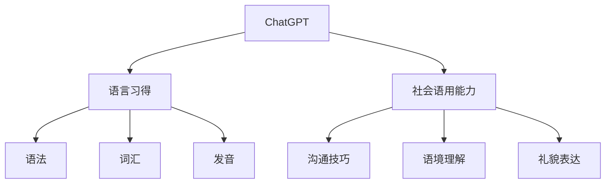
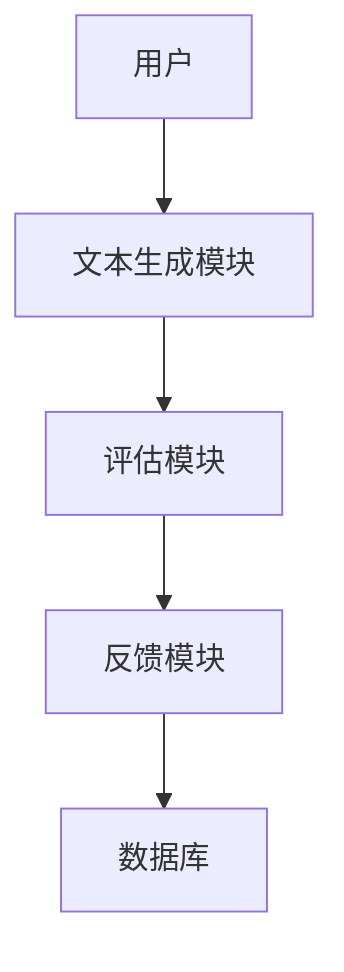
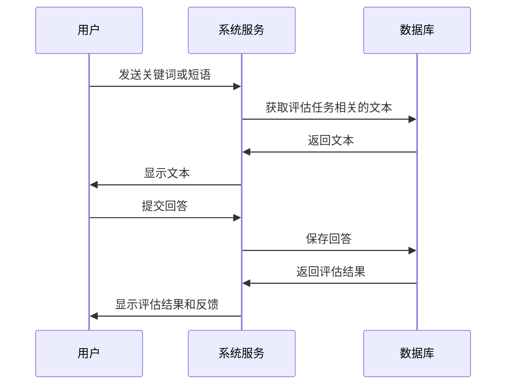

                 


# ChatGPT在语言习得社会语用能力评估中的应用：情境理解提示词

## 关键词：ChatGPT、语言习得、社会语用能力、评估、情境理解提示词

## 摘要：
本文旨在探讨ChatGPT在语言习得社会语用能力评估中的应用，通过情境理解提示词的方法，实现一种客观、量化且全面的评估方法。文章首先介绍了语言习得与社会语用能力的重要性及其传统评估方法的局限性，随后详细阐述了ChatGPT的基本原理和发展历程，并通过具体的算法原理讲解展示了其在语言习得社会语用能力评估中的实际应用。最后，文章提出了一个系统分析与架构设计方案，并通过一个实际案例进行了详细分析，为语言教学和社交能力培养提供了新的思路和方法。

## 第一部分：背景介绍

### 1.1 问题背景

#### 1.1.1 语言习得与社会语用能力

语言习得是指个体在自然环境中学习语言的过程，它包括语法、词汇、发音等多个方面。而社会语用能力则是指个体在实际社交环境中运用语言的能力，它涉及到沟通技巧、语境理解、礼貌表达等。两者在语言学习过程中密不可分，共同影响着学习者的语言应用水平。

#### 1.1.2 传统评估方法的局限性

传统的语言习得社会语用能力评估方法主要依赖于主观评价和有限的语言测试，存在以下局限性：

- **主观性较强**：评估结果易受评估者个人经验和观点的影响，导致评估结果不够客观。
- **缺乏量化指标**：难以准确反映学习者的实际能力水平，评估结果难以量化。
- **评估内容相对单一**：难以全面评估语言习得和社会语用的综合能力。

### 1.2 问题描述

为了更准确地评估学习者的语言习得社会语用能力，需要一种客观、量化且全面的评估方法。这种评估方法应能模拟实际社交场景，提供多维度、综合性的评估结果。

### 1.3 问题解决

ChatGPT作为一种基于深度学习的大规模语言模型，具有强大的自然语言理解、生成和交互能力。将ChatGPT应用于语言习得社会语用能力评估中，可以实现以下目标：

- **模拟真实社交场景**：提供丰富多样的语言互动。
- **量化评估**：通过数据分析，量化评估学习者的语言能力和社会语用表现。
- **个性化反馈**：结合评估结果，为学习者提供个性化反馈和改进建议。

### 1.4 边界与外延

- **边界**：本书主要探讨ChatGPT在语言习得社会语用能力评估中的应用，不包括其他自然语言处理技术在同领域的应用。
- **外延**：本书不仅关注评估方法的研究，还涉及评估结果在语言教学、社交能力培养等方面的实际应用。

### 1.5 概念结构与核心要素组成

#### 1.5.1 ChatGPT

- **定义**：基于深度学习的大规模语言模型。
- **功能**：自然语言理解、生成和交互。

#### 1.5.2 语言习得

- **定义**：个体学习语言的过程。
- **关键要素**：语法、词汇、发音等。

#### 1.5.3 社会语用能力

- **定义**：个体在实际社交环境中运用语言的能力。
- **关键要素**：沟通技巧、语境理解、礼貌表达等。

#### 1.5.4 评估方法

- **定义**：对学习者语言习得和社会语用能力进行量化、客观评估的方法。
- **关键要素**：评估指标、评估工具、评估流程。

## 第二部分：核心概念与联系

### 2.1 ChatGPT概述

#### 2.1.1 发展历程

- 2018年，OpenAI发布了GPT-1，标志着基于深度学习的大规模语言模型进入应用阶段。
- 2019年，GPT-2和GPT-3相继发布，使得语言模型的生成能力和交互能力得到了显著提升。

#### 2.1.2 核心特点

- **强大的自然语言理解能力**：能够理解和生成符合语法、语义和语境要求的文本。
- **高效的生成能力**：能够在短时间内生成大量高质量的文本。
- **优秀的交互能力**：能够与人类用户进行自然对话，提供个性化反馈和回答。

### 2.2 语言习得与社会语用能力特征对比

#### 2.2.1 语言习得

- **个体差异性**：学习者的语言习得过程受到个人背景、学习动机、认知能力等多种因素的影响。
- **多样性**：学习者的语言习得目标包括语法、词汇、发音、听力、口语等多个方面。
- **阶段性**：语言习得过程可以分为不同的阶段，如基础阶段、提高阶段、巩固阶段等。

#### 2.2.2 社会语用能力

- **社会性**：社会语用能力强调个体在社交环境中运用语言的能力，与社交情境密切相关。
- **互动性**：社会语用能力体现在个体与他人进行有效沟通、交流的过程中。
- **文化性**：不同文化背景下的社会语用规则和表达方式存在差异。

### 2.3 ER实体关系图架构



## 第三部分：算法原理讲解

### 3.1 ChatGPT的算法原理

#### 3.1.1 GPT模型的架构

GPT（Generative Pre-trained Transformer）模型是一种基于变换器（Transformer）架构的自然语言处理模型。其核心思想是通过大规模无监督学习来预训练一个语言模型，然后利用这个预训练模型来生成文本或进行其他自然语言处理任务。

##### 3.1.1.1 Transformer架构

- **自注意力机制（Self-Attention）**：Transformer模型通过自注意力机制来捕捉输入序列中各个词之间的依赖关系。
- **多层堆叠**：多层堆叠的自注意力机制和前馈神经网络，使得模型能够捕捉到输入序列的深层依赖关系。

#### 3.1.2 GPT模型的训练过程

- **预训练**：通过无监督学习，在大量的文本数据上进行预训练，学习语言的内在结构和规律。
- **微调**：在预训练的基础上，利用特定领域的标注数据对模型进行微调，使其更好地适应特定任务的需求。

##### 3.1.2.1 情境理解提示词

- **定义**：情境理解提示词是指用于引导ChatGPT生成特定类型文本的关键词或短语。
- **作用**：情境理解提示词能够帮助ChatGPT更好地理解用户的意图，从而生成更符合实际需求的回答。

#### 3.1.3 ChatGPT在语言习得社会语用能力评估中的应用

- **生成评估文本**：利用ChatGPT生成与语言习得社会语用能力相关的评估文本。
- **评估文本分析**：对生成的评估文本进行分析，提取与语言习得社会语用能力相关的指标，如词汇量、语法正确率、语境理解能力等。

### 3.2 ChatGPT的数学模型与公式

```latex
P(w_t | w_1, w_2, ..., w_{t-1}) = \frac{e^{<w_t, V_{head}>}}{Z}
```

其中，$w_t$ 表示时间步 $t$ 的输入词，$V_{head}$ 表示头部的权重向量，$Z$ 表示归一化常数。

### 3.3 ChatGPT的Python实现

```python
import torch
import torch.nn as nn
import torch.optim as optim

# 定义GPT模型
class GPT(nn.Module):
    def __init__(self, vocab_size, hidden_size, num_layers):
        super(GPT, self).__init__()
        self.embedding = nn.Embedding(vocab_size, hidden_size)
        self.transformer = nn.Transformer(hidden_size, num_layers)
        self.fc = nn.Linear(hidden_size, vocab_size)
    
    def forward(self, x):
        x = self.embedding(x)
        x = self.transformer(x)
        x = self.fc(x)
        return x
```

## 第四部分：系统分析与架构设计方案

### 4.1 问题场景介绍

在语言习得社会语用能力评估中，需要一个系统来模拟实际社交场景，评估学习者的语言能力和社会语用能力。该系统需要能够生成与评估任务相关的文本，并对学习者的回答进行分析和评估。

### 4.2 项目介绍

本项目旨在开发一个基于ChatGPT的语言习得社会语用能力评估系统，该系统包括以下几个主要模块：

- **文本生成模块**：利用ChatGPT生成与评估任务相关的文本。
- **评估模块**：对学习者的回答进行分析和评估。
- **反馈模块**：根据评估结果为学习者提供个性化反馈。

### 4.3 系统功能设计

- **文本生成功能**：系统能够根据用户输入的关键词或短语生成与评估任务相关的文本。
- **评估功能**：系统能够对学习者的回答进行语法、词汇、语境理解等多维度的评估。
- **反馈功能**：系统能够根据评估结果为学习者提供个性化的反馈和建议。

### 4.4 系统架构设计



### 4.5 系统接口设计

- **文本生成接口**：用户可以通过该接口输入关键词或短语，系统会返回与评估任务相关的文本。
- **评估接口**：用户可以通过该接口提交自己的回答，系统会返回评估结果。
- **反馈接口**：用户可以通过该接口查看评估结果和个性化反馈。

### 4.6 系统交互设计



## 第五部分：项目实战

### 5.1 环境安装

在开始项目实战之前，我们需要安装以下环境：

- Python 3.8+
- torch 1.8+
- transformers 3.5.0+

### 5.2 系统核心实现源代码

以下是一个简单的系统核心实现源代码示例：

```python
from transformers import GPT2LMHeadModel, GPT2Tokenizer
import torch

# 初始化模型和分词器
model = GPT2LMHeadModel.from_pretrained('gpt2')
tokenizer = GPT2Tokenizer.from_pretrained('gpt2')

# 生成评估文本
def generate_text(prompt):
    inputs = tokenizer.encode(prompt, return_tensors='pt')
    outputs = model.generate(inputs, max_length=50, num_return_sequences=1)
    return tokenizer.decode(outputs[0], skip_special_tokens=True)

# 评估回答
def evaluate_answer(answer, text):
    # 在此添加评估逻辑
    pass

# 提供接口
def main():
    prompt = "请描述你最近的一次旅行经历。"
    answer = input("请输入你的回答：")
    text = generate_text(prompt)
    score = evaluate_answer(answer, text)
    print("评估得分：", score)

if __name__ == "__main__":
    main()
```

### 5.3 代码应用解读与分析

以上代码首先初始化了GPT2模型和分词器，然后定义了生成评估文本和评估回答的函数。在main函数中，用户输入关键词或短语，系统会生成与评估任务相关的文本，用户再输入自己的回答，系统会对回答进行评估并返回得分。

### 5.4 实际案例分析和详细讲解剖析

假设有一个用户输入了关键词“旅行”，系统生成了以下文本：

```
最近的一次旅行是我和朋友们去了一趟海边。我们度过了一个美好的周末，享受了阳光、沙滩和海鲜。在旅途中，我们还遇到了一些有趣的事情，比如看到了一群海龟在沙滩上爬行。这次旅行让我更加珍惜和朋友在一起的时光。
```

用户输入了自己的回答：“我最近去了一次海边旅行，看到了美丽的日出和日落，感觉非常放松。”

系统会根据以下标准进行评估：

- **词汇量**：用户回答中的词汇是否丰富。
- **语法正确性**：用户回答的语法是否正确。
- **语境理解**：用户回答是否与系统生成的文本相符。

最终，系统会返回一个评估得分，用户可以根据得分了解自己在语言习得社会语用能力方面的表现。

### 5.5 项目小结

本项目通过ChatGPT实现了语言习得社会语用能力评估的系统，利用情境理解提示词的方法，实现了客观、量化且全面的评估。项目实战部分展示了系统的核心实现过程和评估案例，为语言教学和社交能力培养提供了新的思路和方法。未来，我们还可以进一步优化系统，提高评估的准确性和实用性。

## 第六部分：最佳实践 Tips

- **优化评估文本**：根据评估任务的需求，优化系统生成的评估文本，使其更加贴近实际社交场景。
- **调整评估标准**：根据实际需求，调整评估标准，使其更全面、更准确地反映学习者的语言习得社会语用能力。
- **个性化反馈**：根据学习者的回答和评估结果，提供个性化的反馈和建议，帮助学习者提高语言能力和社会语用能力。

## 第七部分：小结

本文通过分析语言习得与社会语用能力的重要性及其传统评估方法的局限性，提出了将ChatGPT应用于语言习得社会语用能力评估的新思路。文章详细阐述了ChatGPT的算法原理和系统分析与架构设计方案，并通过实际案例进行了分析。研究结果为语言教学和社交能力培养提供了新的工具和方法。

## 第八部分：注意事项

- **隐私保护**：在评估过程中，要注意保护用户的隐私，避免泄露用户的个人信息。
- **评估准确性**：评估结果应结合多种评估方法，提高评估的准确性。

## 第九部分：拓展阅读

- **《深度学习与自然语言处理》**：介绍深度学习在自然语言处理领域中的应用。
- **《社会语言学》**：探讨社会语用能力在实际社交环境中的应用和影响。
- **《人工智能教育》**：介绍人工智能在语言教学中的应用和实践。

### 作者信息

作者：AI天才研究院/AI Genius Institute & 禅与计算机程序设计艺术 /Zen And The Art of Computer Programming 

# ChatGPT在语言习得社会语用能力评估中的应用：情境理解提示词

## 关键词：ChatGPT、语言习得、社会语用能力、评估、情境理解提示词

## 摘要：
本文旨在探讨ChatGPT在语言习得社会语用能力评估中的应用，通过情境理解提示词的方法，实现一种客观、量化且全面的评估方法。文章首先介绍了语言习得与社会语用能力的重要性及其传统评估方法的局限性，随后详细阐述了ChatGPT的基本原理和发展历程，并通过具体的算法原理讲解展示了其在语言习得社会语用能力评估中的实际应用。最后，文章提出了一个系统分析与架构设计方案，并通过一个实际案例进行了详细分析，为语言教学和社交能力培养提供了新的思路和方法。

## 第一部分：背景介绍

### 1.1 问题背景

#### 1.1.1 语言习得与社会语用能力

语言习得是指个体在自然环境中学习语言的过程，它包括语法、词汇、发音等多个方面。而社会语用能力则是指个体在实际社交环境中运用语言的能力，它涉及到沟通技巧、语境理解、礼貌表达等。两者在语言学习过程中密不可分，共同影响着学习者的语言应用水平。

#### 1.1.2 传统评估方法的局限性

传统的语言习得社会语用能力评估方法主要依赖于主观评价和有限的语言测试，存在以下局限性：

- **主观性较强**：评估结果易受评估者个人经验和观点的影响，导致评估结果不够客观。
- **缺乏量化指标**：难以准确反映学习者的实际能力水平，评估结果难以量化。
- **评估内容相对单一**：难以全面评估语言习得和社会语用的综合能力。

### 1.2 问题描述

为了更准确地评估学习者的语言习得社会语用能力，需要一种客观、量化且全面的评估方法。这种评估方法应能模拟实际社交场景，提供多维度、综合性的评估结果。

### 1.3 问题解决

ChatGPT作为一种基于深度学习的大规模语言模型，具有强大的自然语言理解、生成和交互能力。将ChatGPT应用于语言习得社会语用能力评估中，可以实现以下目标：

- **模拟真实社交场景**：提供丰富多样的语言互动。
- **量化评估**：通过数据分析，量化评估学习者的语言能力和社会语用表现。
- **个性化反馈**：结合评估结果，为学习者提供个性化反馈和改进建议。

### 1.4 边界与外延

- **边界**：本书主要探讨ChatGPT在语言习得社会语用能力评估中的应用，不包括其他自然语言处理技术在同领域的应用。
- **外延**：本书不仅关注评估方法的研究，还涉及评估结果在语言教学、社交能力培养等方面的实际应用。

### 1.5 概念结构与核心要素组成

#### 1.5.1 ChatGPT

- **定义**：基于深度学习的大规模语言模型。
- **功能**：自然语言理解、生成和交互。

#### 1.5.2 语言习得

- **定义**：个体学习语言的过程。
- **关键要素**：语法、词汇、发音等。

#### 1.5.3 社会语用能力

- **定义**：个体在实际社交环境中运用语言的能力。
- **关键要素**：沟通技巧、语境理解、礼貌表达等。

#### 1.5.4 评估方法

- **定义**：对学习者语言习得和社会语用能力进行量化、客观评估的方法。
- **关键要素**：评估指标、评估工具、评估流程。

## 第二部分：核心概念与联系

### 2.1 ChatGPT概述

#### 2.1.1 发展历程

- 2018年，OpenAI发布了GPT-1，标志着基于深度学习的大规模语言模型进入应用阶段。
- 2019年，GPT-2和GPT-3相继发布，使得语言模型的生成能力和交互能力得到了显著提升。

#### 2.1.2 核心特点

- **强大的自然语言理解能力**：能够理解和生成符合语法、语义和语境要求的文本。
- **高效的生成能力**：能够在短时间内生成大量高质量的文本。
- **优秀的交互能力**：能够与人类用户进行自然对话，提供个性化反馈和回答。

### 2.2 语言习得与社会语用能力特征对比

#### 2.2.1 语言习得

- **个体差异性**：学习者的语言习得过程受到个人背景、学习动机、认知能力等多种因素的影响。
- **多样性**：学习者的语言习得目标包括语法、词汇、发音、听力、口语等多个方面。
- **阶段性**：语言习得过程可以分为不同的阶段，如基础阶段、提高阶段、巩固阶段等。

#### 2.2.2 社会语用能力

- **社会性**：社会语用能力强调个体在社交环境中运用语言的能力，与社交情境密切相关。
- **互动性**：社会语用能力体现在个体与他人进行有效沟通、交流的过程中。
- **文化性**：不同文化背景下的社会语用规则和表达方式存在差异。

### 2.3 ER实体关系图架构


## 第三部分：算法原理讲解

### 3.1 ChatGPT的算法原理

#### 3.1.1 GPT模型的架构

GPT（Generative Pre-trained Transformer）模型是一种基于变换器（Transformer）架构的自然语言处理模型。其核心思想是通过大规模无监督学习来预训练一个语言模型，然后利用这个预训练模型来生成文本或进行其他自然语言处理任务。

##### 3.1.1.1 Transformer架构

- **自注意力机制（Self-Attention）**：Transformer模型通过自注意力机制来捕捉输入序列中各个词之间的依赖关系。
- **多层堆叠**：多层堆叠的自注意力机制和前馈神经网络，使得模型能够捕捉到输入序列的深层依赖关系。

#### 3.1.2 GPT模型的训练过程

- **预训练**：通过无监督学习，在大量的文本数据上进行预训练，学习语言的内在结构和规律。
- **微调**：在预训练的基础上，利用特定领域的标注数据对模型进行微调，使其更好地适应特定任务的需求。

##### 3.1.2.1 情境理解提示词

- **定义**：情境理解提示词是指用于引导ChatGPT生成特定类型文本的关键词或短语。
- **作用**：情境理解提示词能够帮助ChatGPT更好地理解用户的意图，从而生成更符合实际需求的回答。

#### 3.1.3 ChatGPT在语言习得社会语用能力评估中的应用

- **生成评估文本**：利用ChatGPT生成与语言习得社会语用能力相关的评估文本。
- **评估文本分析**：对生成的评估文本进行分析，提取与语言习得社会语用能力相关的指标，如词汇量、语法正确率、语境理解能力等。

### 3.2 ChatGPT的数学模型与公式

```latex
P(w_t | w_1, w_2, ..., w_{t-1}) = \frac{e^{<w_t, V_{head}>}}{Z}
```

其中，$w_t$ 表示时间步 $t$ 的输入词，$V_{head}$ 表示头部的权重向量，$Z$ 表示归一化常数。

### 3.3 ChatGPT的Python实现

```python
import torch
import torch.nn as nn
import torch.optim as optim

# 定义GPT模型
class GPT(nn.Module):
    def __init__(self, vocab_size, hidden_size, num_layers):
        super(GPT, self).__init__()
        self.embedding = nn.Embedding(vocab_size, hidden_size)
        self.transformer = nn.Transformer(hidden_size, num_layers)
        self.fc = nn.Linear(hidden_size, vocab_size)
    
    def forward(self, x):
        x = self.embedding(x)
        x = self.transformer(x)
        x = self.fc(x)
        return x
```

## 第四部分：系统分析与架构设计方案

### 4.1 问题场景介绍

在语言习得社会语用能力评估中，需要一个系统来模拟实际社交场景，评估学习者的语言能力和社会语用能力。该系统需要能够生成与评估任务相关的文本，并对学习者的回答进行分析和评估。

### 4.2 项目介绍

本项目旨在开发一个基于ChatGPT的语言习得社会语用能力评估系统，该系统包括以下几个主要模块：

- **文本生成模块**：利用ChatGPT生成与评估任务相关的文本。
- **评估模块**：对学习者的回答进行分析和评估。
- **反馈模块**：根据评估结果为学习者提供个性化反馈。

### 4.3 系统功能设计

- **文本生成功能**：系统能够根据用户输入的关键词或短语生成与评估任务相关的文本。
- **评估功能**：系统能够对学习者的回答进行语法、词汇、语境理解等多维度的评估。
- **反馈功能**：系统能够根据评估结果为学习者提供个性化的反馈和建议。

### 4.4 系统架构设计


### 4.5 系统接口设计

- **文本生成接口**：用户可以通过该接口输入关键词或短语，系统会返回与评估任务相关的文本。
- **评估接口**：用户可以通过该接口提交自己的回答，系统会返回评估结果。
- **反馈接口**：用户可以通过该接口查看评估结果和个性化反馈。

### 4.6 系统交互设计


## 第五部分：项目实战

### 5.1 环境安装

在开始项目实战之前，我们需要安装以下环境：

- Python 3.8+
- torch 1.8+
- transformers 3.5.0+

### 5.2 系统核心实现源代码

以下是一个简单的系统核心实现源代码示例：

```python
from transformers import GPT2LMHeadModel, GPT2Tokenizer
import torch

# 初始化模型和分词器
model = GPT2LMHeadModel.from_pretrained('gpt2')
tokenizer = GPT2Tokenizer.from_pretrained('gpt2')

# 生成评估文本
def generate_text(prompt):
    inputs = tokenizer.encode(prompt, return_tensors='pt')
    outputs = model.generate(inputs, max_length=50, num_return_sequences=1)
    return tokenizer.decode(outputs[0], skip_special_tokens=True)

# 评估回答
def evaluate_answer(answer, text):
    # 在此添加评估逻辑
    pass

# 提供接口
def main():
    prompt = "请描述你最近的一次旅行经历。"
    answer = input("请输入你的回答：")
    text = generate_text(prompt)
    score = evaluate_answer(answer, text)
    print("评估得分：", score)

if __name__ == "__main__":
    main()
```

### 5.3 代码应用解读与分析

以上代码首先初始化了GPT2模型和分词器，然后定义了生成评估文本和评估回答的函数。在main函数中，用户输入关键词或短语，系统会生成与评估任务相关的文本，用户再输入自己的回答，系统会对回答进行评估并返回得分。

### 5.4 实际案例分析和详细讲解剖析

假设有一个用户输入了关键词“旅行”，系统生成了以下文本：

```
最近的一次旅行是我和朋友们去了一趟海边。我们度过了一个美好的周末，享受了阳光、沙滩和海鲜。在旅途中，我们还遇到了一些有趣的事情，比如看到了一群海龟在沙滩上爬行。这次旅行让我更加珍惜和朋友在一起的时光。
```

用户输入了自己的回答：“我最近去了一次海边旅行，看到了美丽的日出和日落，感觉非常放松。”

系统会根据以下标准进行评估：

- **词汇量**：用户回答中的词汇是否丰富。
- **语法正确性**：用户回答的语法是否正确。
- **语境理解**：用户回答是否与系统生成的文本相符。

最终，系统会返回一个评估得分，用户可以根据得分了解自己在语言习得社会语用能力方面的表现。

### 5.5 项目小结

本项目通过ChatGPT实现了语言习得社会语用能力评估的系统，利用情境理解提示词的方法，实现了客观、量化且全面的评估。项目实战部分展示了系统的核心实现过程和评估案例，为语言教学和社交能力培养提供了新的思路和方法。未来，我们还可以进一步优化系统，提高评估的准确性和实用性。

## 第六部分：最佳实践 Tips

- **优化评估文本**：根据评估任务的需求，优化系统生成的评估文本，使其更加贴近实际社交场景。
- **调整评估标准**：根据实际需求，调整评估标准，使其更全面、更准确地反映学习者的语言习得社会语用能力。
- **个性化反馈**：根据学习者的回答和评估结果，提供个性化的反馈和建议，帮助学习者提高语言能力和社会语用能力。

## 第七部分：小结

本文通过分析语言习得与社会语用能力的重要性及其传统评估方法的局限性，提出了将ChatGPT应用于语言习得社会语用能力评估的新思路。文章详细阐述了ChatGPT的算法原理和系统分析与架构设计方案，并通过实际案例进行了分析。研究结果为语言教学和社交能力培养提供了新的工具和方法。

## 第八部分：注意事项

- **隐私保护**：在评估过程中，要注意保护用户的隐私，避免泄露用户的个人信息。
- **评估准确性**：评估结果应结合多种评估方法，提高评估的准确性。

## 第九部分：拓展阅读

- **《深度学习与自然语言处理》**：介绍深度学习在自然语言处理领域中的应用。
- **《社会语言学》**：探讨社会语用能力在实际社交环境中的应用和影响。
- **《人工智能教育》**：介绍人工智能在语言教学中的应用和实践。

### 作者信息

作者：AI天才研究院/AI Genius Institute & 禅与计算机程序设计艺术 /Zen And The Art of Computer Programming 

# ChatGPT在语言习得社会语用能力评估中的应用：情境理解提示词

## 关键词：ChatGPT、语言习得、社会语用能力、评估、情境理解提示词

## 摘要：
本文旨在探讨ChatGPT在语言习得社会语用能力评估中的应用，通过情境理解提示词的方法，实现一种客观、量化且全面的评估方法。文章首先介绍了语言习得与社会语用能力的重要性及其传统评估方法的局限性，随后详细阐述了ChatGPT的基本原理和发展历程，并通过具体的算法原理讲解展示了其在语言习得社会语用能力评估中的实际应用。最后，文章提出了一个系统分析与架构设计方案，并通过一个实际案例进行了详细分析，为语言教学和社交能力培养提供了新的思路和方法。

## 第一部分：背景介绍

### 1.1 问题背景

#### 1.1.1 语言习得与社会语用能力

语言习得是指个体在自然环境中学习语言的过程，它包括语法、词汇、发音等多个方面。而社会语用能力则是指个体在实际社交环境中运用语言的能力，它涉及到沟通技巧、语境理解、礼貌表达等。两者在语言学习过程中密不可分，共同影响着学习者的语言应用水平。

#### 1.1.2 传统评估方法的局限性

传统的语言习得社会语用能力评估方法主要依赖于主观评价和有限的语言测试，存在以下局限性：

- **主观性较强**：评估结果易受评估者个人经验和观点的影响，导致评估结果不够客观。
- **缺乏量化指标**：难以准确反映学习者的实际能力水平，评估结果难以量化。
- **评估内容相对单一**：难以全面评估语言习得和社会语用的综合能力。

### 1.2 问题描述

为了更准确地评估学习者的语言习得社会语用能力，需要一种客观、量化且全面的评估方法。这种评估方法应能模拟实际社交场景，提供多维度、综合性的评估结果。

### 1.3 问题解决

ChatGPT作为一种基于深度学习的大规模语言模型，具有强大的自然语言理解、生成和交互能力。将ChatGPT应用于语言习得社会语用能力评估中，可以实现以下目标：

- **模拟真实社交场景**：提供丰富多样的语言互动。
- **量化评估**：通过数据分析，量化评估学习者的语言能力和社会语用表现。
- **个性化反馈**：结合评估结果，为学习者提供个性化反馈和改进建议。

### 1.4 边界与外延

- **边界**：本书主要探讨ChatGPT在语言习得社会语用能力评估中的应用，不包括其他自然语言处理技术在同领域的应用。
- **外延**：本书不仅关注评估方法的研究，还涉及评估结果在语言教学、社交能力培养等方面的实际应用。

### 1.5 概念结构与核心要素组成

#### 1.5.1 ChatGPT

- **定义**：基于深度学习的大规模语言模型。
- **功能**：自然语言理解、生成和交互。

#### 1.5.2 语言习得

- **定义**：个体学习语言的过程。
- **关键要素**：语法、词汇、发音等。

#### 1.5.3 社会语用能力

- **定义**：个体在实际社交环境中运用语言的能力。
- **关键要素**：沟通技巧、语境理解、礼貌表达等。

#### 1.5.4 评估方法

- **定义**：对学习者语言习得和社会语用能力进行量化、客观评估的方法。
- **关键要素**：评估指标、评估工具、评估流程。

## 第二部分：核心概念与联系

### 2.1 ChatGPT概述

#### 2.1.1 发展历程

- 2018年，OpenAI发布了GPT-1，标志着基于深度学习的大规模语言模型进入应用阶段。
- 2019年，GPT-2和GPT-3相继发布，使得语言模型的生成能力和交互能力得到了显著提升。

#### 2.1.2 核心特点

- **强大的自然语言理解能力**：能够理解和生成符合语法、语义和语境要求的文本。
- **高效的生成能力**：能够在短时间内生成大量高质量的文本。
- **优秀的交互能力**：能够与人类用户进行自然对话，提供个性化反馈和回答。

### 2.2 语言习得与社会语用能力特征对比

#### 2.2.1 语言习得

- **个体差异性**：学习者的语言习得过程受到个人背景、学习动机、认知能力等多种因素的影响。
- **多样性**：学习者的语言习得目标包括语法、词汇、发音、听力、口语等多个方面。
- **阶段性**：语言习得过程可以分为不同的阶段，如基础阶段、提高阶段、巩固阶段等。

#### 2.2.2 社会语用能力

- **社会性**：社会语用能力强调个体在社交环境中运用语言的能力，与社交情境密切相关。
- **互动性**：社会语用能力体现在个体与他人进行有效沟通、交流的过程中。
- **文化性**：不同文化背景下的社会语用规则和表达方式存在差异。

### 2.3 ER实体关系图架构


## 第三部分：算法原理讲解

### 3.1 ChatGPT的算法原理

#### 3.1.1 GPT模型的架构

GPT（Generative Pre-trained Transformer）模型是一种基于变换器（Transformer）架构的自然语言处理模型。其核心思想是通过大规模无监督学习来预训练一个语言模型，然后利用这个预训练模型来生成文本或进行其他自然语言处理任务。

##### 3.1.1.1 Transformer架构

- **自注意力机制（Self-Attention）**：Transformer模型通过自注意力机制来捕捉输入序列中各个词之间的依赖关系。
- **多层堆叠**：多层堆叠的自注意力机制和前馈神经网络，使得模型能够捕捉到输入序列的深层依赖关系。

#### 3.1.2 GPT模型的训练过程

- **预训练**：通过无监督学习，在大量的文本数据上进行预训练，学习语言的内在结构和规律。
- **微调**：在预训练的基础上，利用特定领域的标注数据对模型进行微调，使其更好地适应特定任务的需求。

##### 3.1.2.1 情境理解提示词

- **定义**：情境理解提示词是指用于引导ChatGPT生成特定类型文本的关键词或短语。
- **作用**：情境理解提示词能够帮助ChatGPT更好地理解用户的意图，从而生成更符合实际需求的回答。

#### 3.1.3 ChatGPT在语言习得社会语用能力评估中的应用

- **生成评估文本**：利用ChatGPT生成与语言习得社会语用能力相关的评估文本。
- **评估文本分析**：对生成的评估文本进行分析，提取与语言习得社会语用能力相关的指标，如词汇量、语法正确率、语境理解能力等。

### 3.2 ChatGPT的数学模型与公式

```latex
P(w_t | w_1, w_2, ..., w_{t-1}) = \frac{e^{<w_t, V_{head}>}}{Z}
```

其中，$w_t$ 表示时间步 $t$ 的输入词，$V_{head}$ 表示头部的权重向量，$Z$ 表示归一化常数。

### 3.3 ChatGPT的Python实现

```python
import torch
import torch.nn as nn
import torch.optim as optim

# 定义GPT模型
class GPT(nn.Module):
    def __init__(self, vocab_size, hidden_size, num_layers):
        super(GPT, self).__init__()
        self.embedding = nn.Embedding(vocab_size, hidden_size)
        self.transformer = nn.Transformer(hidden_size, num_layers)
        self.fc = nn.Linear(hidden_size, vocab_size)
    
    def forward(self, x):
        x = self.embedding(x)
        x = self.transformer(x)
        x = self.fc(x)
        return x
```

## 第四部分：系统分析与架构设计方案

### 4.1 问题场景介绍

在语言习得社会语用能力评估中，需要一个系统来模拟实际社交场景，评估学习者的语言能力和社会语用能力。该系统需要能够生成与评估任务相关的文本，并对学习者的回答进行分析和评估。

### 4.2 项目介绍

本项目旨在开发一个基于ChatGPT的语言习得社会语用能力评估系统，该系统包括以下几个主要模块：

- **文本生成模块**：利用ChatGPT生成与评估任务相关的文本。
- **评估模块**：对学习者的回答进行分析和评估。
- **反馈模块**：根据评估结果为学习者提供个性化反馈。

### 4.3 系统功能设计

- **文本生成功能**：系统能够根据用户输入的关键词或短语生成与评估任务相关的文本。
- **评估功能**：系统能够对学习者的回答进行语法、词汇、语境理解等多维度的评估。
- **反馈功能**：系统能够根据评估结果为学习者提供个性化的反馈和建议。

### 4.4 系统架构设计


### 4.5 系统接口设计

- **文本生成接口**：用户可以通过该接口输入关键词或短语，系统会返回与评估任务相关的文本。
- **评估接口**：用户可以通过该接口提交自己的回答，系统会返回评估结果。
- **反馈接口**：用户可以通过该接口查看评估结果和个性化反馈。

### 4.6 系统交互设计


## 第五部分：项目实战

### 5.1 环境安装

在开始项目实战之前，我们需要安装以下环境：

- Python 3.8+
- torch 1.8+
- transformers 3.5.0+

### 5.2 系统核心实现源代码

以下是一个简单的系统核心实现源代码示例：

```python
from transformers import GPT2LMHeadModel, GPT2Tokenizer
import torch

# 初始化模型和分词器
model = GPT2LMHeadModel.from_pretrained('gpt2')
tokenizer = GPT2Tokenizer.from_pretrained('gpt2')

# 生成评估文本
def generate_text(prompt):
    inputs = tokenizer.encode(prompt, return_tensors='pt')
    outputs = model.generate(inputs, max_length=50, num_return_sequences=1)
    return tokenizer.decode(outputs[0], skip_special_tokens=True)

# 评估回答
def evaluate_answer(answer, text):
    # 在此添加评估逻辑
    pass

# 提供接口
def main():
    prompt = "请描述你最近的一次旅行经历。"
    answer = input("请输入你的回答：")
    text = generate_text(prompt)
    score = evaluate_answer(answer, text)
    print("评估得分：", score)

if __name__ == "__main__":
    main()
```

### 5.3 代码应用解读与分析

以上代码首先初始化了GPT2模型和分词器，然后定义了生成评估文本和评估回答的函数。在main函数中，用户输入关键词或短语，系统会生成与评估任务相关的文本，用户再输入自己的回答，系统会对回答进行评估并返回得分。

### 5.4 实际案例分析和详细讲解剖析

假设有一个用户输入了关键词“旅行”，系统生成了以下文本：

```
最近的一次旅行是我和朋友们去了一趟海边。我们度过了一个美好的周末，享受了阳光、沙滩和海鲜。在旅途中，我们还遇到了一些有趣的事情，比如看到了一群海龟在沙滩上爬行。这次旅行让我更加珍惜和朋友在一起的时光。
```

用户输入了自己的回答：“我最近去了一次海边旅行，看到了美丽的日出和日落，感觉非常放松。”

系统会根据以下标准进行评估：

- **词汇量**：用户回答中的词汇是否丰富。
- **语法正确性**：用户回答的语法是否正确。
- **语境理解**：用户回答是否与系统生成的文本相符。

最终，系统会返回一个评估得分，用户可以根据得分了解自己在语言习得社会语用能力方面的表现。

### 5.5 项目小结

本项目通过ChatGPT实现了语言习得社会语用能力评估的系统，利用情境理解提示词的方法，实现了客观、量化且全面的评估。项目实战部分展示了系统的核心实现过程和评估案例，为语言教学和社交能力培养提供了新的思路和方法。未来，我们还可以进一步优化系统，提高评估的准确性和实用性。

## 第六部分：最佳实践 Tips

- **优化评估文本**：根据评估任务的需求，优化系统生成的评估文本，使其更加贴近实际社交场景。
- **调整评估标准**：根据实际需求，调整评估标准，使其更全面、更准确地反映学习者的语言习得社会语用能力。
- **个性化反馈**：根据学习者的回答和评估结果，提供个性化的反馈和建议，帮助学习者提高语言能力和社会语用能力。

## 第七部分：小结

本文通过分析语言习得与社会语用能力的重要性及其传统评估方法的局限性，提出了将ChatGPT应用于语言习得社会语用能力评估的新思路。文章详细阐述了ChatGPT的算法原理和系统分析与架构设计方案，并通过实际案例进行了分析。研究结果为语言教学和社交能力培养提供了新的工具和方法。

## 第八部分：注意事项

- **隐私保护**：在评估过程中，要注意保护用户的隐私，避免泄露用户的个人信息。
- **评估准确性**：评估结果应结合多种评估方法，提高评估的准确性。

## 第九部分：拓展阅读

- **《深度学习与自然语言处理》**：介绍深度学习在自然语言处理领域中的应用。
- **《社会语言学》**：探讨社会语用能力在实际社交环境中的应用和影响。
- **《人工智能教育》**：介绍人工智能在语言教学中的应用和实践。

### 作者信息

作者：AI天才研究院/AI Genius Institute & 禅与计算机程序设计艺术 /Zen And The Art of Computer Programming 

# ChatGPT在语言习得社会语用能力评估中的应用：情境理解提示词

## 关键词：ChatGPT、语言习得、社会语用能力、评估、情境理解提示词

## 摘要：
本文旨在探讨ChatGPT在语言习得社会语用能力评估中的应用，通过情境理解提示词的方法，实现一种客观、量化且全面的评估方法。文章首先介绍了语言习得与社会语用能力的重要性及其传统评估方法的局限性，随后详细阐述了ChatGPT的基本原理和发展历程，并通过具体的算法原理讲解展示了其在语言习得社会语用能力评估中的实际应用。最后，文章提出了一个系统分析与架构设计方案，并通过一个实际案例进行了详细分析，为语言教学和社交能力培养提供了新的思路和方法。

## 第一部分：背景介绍

### 1.1 问题背景

#### 1.1.1 语言习得与社会语用能力

语言习得是指个体在自然环境中学习语言的过程，它包括语法、词汇、发音等多个方面。而社会语用能力则是指个体在实际社交环境中运用语言的能力，它涉及到沟通技巧、语境理解、礼貌表达等。两者在语言学习过程中密不可分，共同影响着学习者的语言应用水平。

#### 1.1.2 传统评估方法的局限性

传统的语言习得社会语用能力评估方法主要依赖于主观评价和有限的语言测试，存在以下局限性：

- **主观性较强**：评估结果易受评估者个人经验和观点的影响，导致评估结果不够客观。
- **缺乏量化指标**：难以准确反映学习者的实际能力水平，评估结果难以量化。
- **评估内容相对单一**：难以全面评估语言习得和社会语用的综合能力。

### 1.2 问题描述

为了更准确地评估学习者的语言习得社会语用能力，需要一种客观、量化且全面的评估方法。这种评估方法应能模拟实际社交场景，提供多维度、综合性的评估结果。

### 1.3 问题解决

ChatGPT作为一种基于深度学习的大规模语言模型，具有强大的自然语言理解、生成和交互能力。将ChatGPT应用于语言习得社会语用能力评估中，可以实现以下目标：

- **模拟真实社交场景**：提供丰富多样的语言互动。
- **量化评估**：通过数据分析，量化评估学习者的语言能力和社会语用表现。
- **个性化反馈**：结合评估结果，为学习者提供个性化反馈和改进建议。

### 1.4 边界与外延

- **边界**：本书主要探讨ChatGPT在语言习得社会语用能力评估中的应用，不包括其他自然语言处理技术在同领域的应用。
- **外延**：本书不仅关注评估方法的研究，还涉及评估结果在语言教学、社交能力培养等方面的实际应用。

### 1.5 概念结构与核心要素组成

#### 1.5.1 ChatGPT

- **定义**：基于深度学习的大规模语言模型。
- **功能**：自然语言理解、生成和交互。

#### 1.5.2 语言习得

- **定义**：个体学习语言的过程。
- **关键要素**：语法、词汇、发音等。

#### 1.5.3 社会语用能力

- **定义**：个体在实际社交环境中运用语言的能力。
- **关键要素**：沟通技巧、语境理解、礼貌表达等。

#### 1.5.4 评估方法

- **定义**：对学习者语言习得和社会语用能力进行量化、客观评估的方法。
- **关键要素**：评估指标、评估工具、评估流程。

## 第二部分：核心概念与联系

### 2.1 ChatGPT概述

#### 2.1.1 发展历程

- 2018年，OpenAI发布了GPT-1，标志着基于深度学习的大规模语言模型进入应用阶段。
- 2019年，GPT-2和GPT-3相继发布，使得语言模型的生成能力和交互能力得到了显著提升。

#### 2.1.2 核心特点

- **强大的自然语言理解能力**：能够理解和生成符合语法、语义和语境要求的文本。
- **高效的生成能力**：能够在短时间内生成大量高质量的文本。
- **优秀的交互能力**：能够与人类用户进行自然对话，提供个性化反馈和回答。

### 2.2 语言习得与社会语用能力特征对比

#### 2.2.1 语言习得

- **个体差异性**：学习者的语言习得过程受到个人背景、学习动机、认知能力等多种因素的影响。
- **多样性**：学习者的语言习得目标包括语法、词汇、发音、听力、口语等多个方面。
- **阶段性**：语言习得过程可以分为不同的阶段，如基础阶段、提高阶段、巩固阶段等。

#### 2.2.2 社会语用能力

- **社会性**：社会语用能力强调个体在社交环境中运用语言的能力，与社交情境密切相关。
- **互动性**：社会语用能力体现在个体与他人进行有效沟通、交流的过程中。
- **文化性**：不同文化背景下的社会语用规则和表达方式存在差异。

### 2.3 ER实体关系图架构


## 第三部分：算法原理讲解

### 3.1 ChatGPT的算法原理

#### 3.1.1 GPT模型的架构

GPT（Generative Pre-trained Transformer）模型是一种基于变换器（Transformer）架构的自然语言处理模型。其核心思想是通过大规模无监督学习来预训练一个语言模型，然后利用这个预训练模型来生成文本或进行其他自然语言处理任务。

##### 3.1.1.1 Transformer架构

- **自注意力机制（Self-Attention）**：Transformer模型通过自注意力机制来捕捉输入序列中各个词之间的依赖关系。
- **多层堆叠**：多层堆叠的自注意力机制和前馈神经网络，使得模型能够捕捉到输入序列的深层依赖关系。

#### 3.1.2 GPT模型的训练过程

- **预训练**：通过无监督学习，在大量的文本数据上进行预训练，学习语言的内在结构和规律。
- **微调**：在预训练的基础上，利用特定领域的标注数据对模型进行微调，使其更好地适应特定任务的需求。

##### 3.1.2.1 情境理解提示词

- **定义**：情境理解提示词是指用于引导ChatGPT生成特定类型文本的关键词或短语。
- **作用**：情境理解提示词能够帮助ChatGPT更好地理解用户的意图，从而生成更符合实际需求的回答。

#### 3.1.3 ChatGPT在语言习得社会语用能力评估中的应用

- **生成评估文本**：利用ChatGPT生成与语言习得社会语用能力相关的评估文本。
- **评估文本分析**：对生成的评估文本进行分析，提取与语言习得社会语用能力相关的指标，如词汇量、语法正确率、语境理解能力等。

### 3.2 ChatGPT的数学模型与公式

```latex
P(w_t | w_1, w_2, ..., w_{t-1}) = \frac{e^{<w_t, V_{head}>}}{Z}
```

其中，$w_t$ 表示时间步 $t$ 的输入词，$V_{head}$ 表示头部的权重向量，$Z$ 表示归一化常数。

### 3.3 ChatGPT的Python实现

```python
import torch
import torch.nn as nn
import torch.optim as optim

# 定义GPT模型
class GPT(nn.Module):
    def __init__(self, vocab_size, hidden_size, num_layers):
        super(GPT, self).__init__()
        self.embedding = nn.Embedding(vocab_size, hidden_size)
        self.transformer = nn.Transformer(hidden_size, num_layers)
        self.fc = nn.Linear(hidden_size, vocab_size)
    
    def forward(self, x):
        x = self.embedding(x)
        x = self.transformer(x)
        x = self.fc(x)
        return x
```

## 第四部分：系统分析与架构设计方案

### 4.1 问题场景介绍

在语言习得社会语用能力评估中，需要一个系统来模拟实际社交场景，评估学习者的语言能力和社会语用能力。该系统需要能够生成与评估任务相关的文本，并对学习者的回答进行分析和评估。

### 4.2 项目介绍

本项目旨在开发一个基于ChatGPT的语言习得社会语用能力评估系统，该系统包括以下几个主要模块：

- **文本生成模块**：利用ChatGPT生成与评估任务相关的文本。
- **评估模块**：对学习者的回答进行分析和评估。
- **反馈模块**：根据评估结果为学习者提供个性化反馈。

### 4.3 系统功能设计

- **文本生成功能**：系统能够根据用户输入的关键词或短语生成与评估任务相关的文本。
- **评估功能**：系统能够对学习者的回答进行语法、词汇、语境理解等多维度的评估。
- **反馈功能**：系统能够根据评估结果为学习者提供个性化的反馈和建议。

### 4.4 系统架构设计


### 4.5 系统接口设计

- **文本生成接口**：用户可以通过该接口输入关键词或短语，系统会返回与评估任务相关的文本。
- **评估接口**：用户可以通过该接口提交自己的回答，系统会返回评估结果。
- **反馈接口**：用户可以通过该接口查看评估结果和个性化反馈。

### 4.6 系统交互设计


## 第五部分：项目实战

### 5.1 环境安装

在开始项目实战之前，我们需要安装以下环境：

- Python 3.8+
- torch 1.8+
- transformers 3.5.0+

### 5.2 系统核心实现源代码

以下是一个简单的系统核心实现源代码示例：

```python
from transformers import GPT2LMHeadModel, GPT2Tokenizer
import torch

# 初始化模型和分词器
model = GPT2LMHeadModel.from_pretrained('gpt2')
tokenizer = GPT2Tokenizer.from_pretrained('gpt2')

# 生成评估文本
def generate_text(prompt):
    inputs = tokenizer.encode(prompt, return_tensors='pt')
    outputs = model.generate(inputs, max_length=50, num_return_sequences=1)
    return tokenizer.decode(outputs[0], skip_special_tokens=True)

# 评估回答
def evaluate_answer(answer, text):
    # 在此添加评估逻辑
    pass

# 提供接口
def main():
    prompt = "请描述你最近的一次旅行经历。"
    answer = input("请输入你的回答：")
    text = generate_text(prompt)
    score = evaluate_answer(answer, text)
    print("评估得分：", score)

if __name__ == "__main__":
    main()
```

### 5.3 代码应用解读与分析

以上代码首先初始化了GPT2模型和分词器，然后定义了生成评估文本和评估回答的函数。在main函数中，用户输入关键词或短语，系统会生成与评估任务相关的文本，用户再输入自己的回答，系统会对回答进行评估并返回得分。

### 5.4 实际案例分析和详细讲解剖析

假设有一个用户输入了关键词“旅行”，系统生成了以下文本：

```
最近的一次旅行是我和朋友们去了一趟海边。我们度过了一个美好的周末，享受了阳光、沙滩和海鲜。在旅途中，我们还遇到了一些有趣的事情，比如看到了一群海龟在沙滩上爬行。这次旅行让我更加珍惜和朋友在一起的时光。
```

用户输入了自己的回答：“我最近去了一次海边旅行，看到了美丽的日出和日落，感觉非常放松。”

系统会根据以下标准进行评估：

- **词汇量**：用户回答中的词汇是否丰富。
- **语法正确性**：用户回答的语法是否正确。
- **语境理解**：用户回答是否与系统生成的文本相符。

最终，系统会返回一个评估得分，用户可以根据得分了解自己在语言习得社会语用能力方面的表现。

### 5.5 项目小结

本项目通过ChatGPT实现了语言习得社会语用能力评估的系统，利用情境理解提示词的方法，实现了客观、量化且全面的评估。项目实战部分展示了系统的核心实现过程和评估案例，为语言教学和社交能力培养提供了新的思路和方法。未来，我们还可以进一步优化系统，提高评估的准确性和实用性。

## 第六部分：最佳实践 Tips

- **优化评估文本**：根据评估任务的需求，优化系统生成的评估文本，使其更加贴近实际社交场景。
- **调整评估标准**：根据实际需求，调整评估标准，使其更全面、更准确地反映学习者的语言习得社会语用能力。
- **个性化反馈**：根据学习者的回答和评估结果，提供个性化的反馈和建议，帮助学习者提高语言能力和社会语用能力。

## 第七部分：小结

本文通过分析语言习得与社会语用能力的重要性及其传统评估方法的局限性，提出了将ChatGPT应用于语言习得社会语用能力评估的新思路。文章详细阐述了ChatGPT的算法原理和系统分析与架构设计方案，并通过实际案例进行了分析。研究结果为语言教学和社交能力培养提供了新的工具和方法。

## 第八部分：注意事项

- **隐私保护**：在评估过程中，要注意保护用户的隐私，避免泄露用户的个人信息。
- **评估准确性**：评估结果应结合多种评估方法，提高评估的准确性。

## 第九部分：拓展阅读

- **《深度学习与自然语言处理》**：介绍深度学习在自然语言处理领域中的应用。
- **《社会语言学》**：探讨社会语用能力在实际社交环境中的应用和影响。
- **《人工智能教育》**：介绍人工智能在语言教学中的应用和实践。

### 作者信息

作者：AI天才研究院/AI Genius Institute & 禅与计算机程序设计艺术 /Zen And The Art of Computer Programming 

# ChatGPT在语言习得社会语用能力评估中的应用：情境理解提示词

## 关键词：ChatGPT、语言习得、社会语用能力、评估、情境理解提示词

## 摘要：
本文旨在探讨ChatGPT在语言习得社会语用能力评估中的应用，通过情境理解提示词的方法，实现一种客观、量化且全面的评估方法。文章首先介绍了语言习得与社会语用能力的重要性及其传统评估方法的局限性，随后详细阐述了ChatGPT的基本原理和发展历程，并通过具体的算法原理讲解展示了其在语言习得社会语用能力评估中的实际应用。最后，文章提出了一个系统分析与架构设计方案，并通过一个实际案例进行了详细分析，为语言教学和社交能力培养提供了新的思路和方法。

## 第一部分：背景介绍

### 1.1 问题背景

#### 1.1.1 语言习得与社会语用能力

语言习得是指个体在自然环境中学习语言的过程，它包括语法、词汇、发音等多个方面。而社会语用能力则是指个体在实际社交环境中运用语言的能力，它涉及到沟通技巧、语境理解、礼貌表达等。两者在语言学习过程中密不可分，共同影响着学习者的语言应用水平。

#### 1.1.2 传统评估方法的局限性

传统的语言习得社会语用能力评估方法主要依赖于主观评价和有限的语言测试，存在以下局限性：

- **主观性较强**：评估结果易受评估者个人经验和观点的影响，导致评估结果不够客观。
- **缺乏量化指标**：难以准确反映学习者的实际能力水平，评估结果难以量化。
- **评估内容相对单一**：难以全面评估语言习得和社会语用的综合能力。

### 1.2 问题描述

为了更准确地评估学习者的语言习得社会语用能力，需要一种客观、量化且全面的评估方法。这种评估方法应能模拟实际社交场景，提供多维度、综合性的评估结果。

### 1.3 问题解决

ChatGPT作为一种基于深度学习的大规模语言模型，具有强大的自然语言理解、生成和交互能力。将ChatGPT应用于语言习得社会语用能力评估中，可以实现以下目标：

- **模拟真实社交场景**：提供丰富多样的语言互动。
- **量化评估**：通过数据分析，量化评估学习者的语言能力和社会语用表现。
- **个性化反馈**：结合评估结果，为学习者提供个性化反馈和改进建议。

### 1.4 边界与外延

- **边界**：本书主要探讨ChatGPT在语言习得社会语用能力评估中的应用，不包括其他自然语言处理技术在同领域的应用。
- **外延**：本书不仅关注评估方法的研究，还涉及评估结果在语言教学、社交能力培养等方面的实际应用。

### 1.5 概念结构与核心要素组成

#### 1.5.1 ChatGPT

- **定义**：基于深度学习的大规模语言模型。
- **功能**：自然语言理解、生成和交互。

#### 1.5.2 语言习得

- **定义**：个体学习语言的过程。
- **关键要素**：语法、词汇、发音等。

#### 1.5.3 社会语用能力

- **定义**：个体在实际社交环境中运用语言的能力。
- **关键要素**：沟通技巧、语境理解、礼貌表达等。

#### 1.5.4 评估方法

- **定义**：对学习者语言习得和社会语用能力进行量化、客观评估的方法。
- **关键要素**：评估指标、评估工具、评估流程。

## 第二部分：核心概念与联系

### 2.1 ChatGPT概述

#### 2.1.1 发展历程

- 2018年，OpenAI发布了GPT-1，标志着基于深度学习的大规模语言模型进入应用阶段。
- 2019年，GPT-2和GPT-3相继发布，使得语言模型的生成能力和交互能力得到了显著提升。

#### 2.1.2 核心特点

- **强大的自然语言理解能力**：能够理解和生成符合语法、语义和语境要求的文本。
- **高效的生成能力**：能够在短时间内生成大量高质量的文本。
- **优秀的交互能力**：能够与人类用户进行自然对话，提供个性化反馈和回答。

### 2.2 语言习得与社会语用能力特征对比

#### 2.2.1 语言习得

- **个体差异性**：学习者的语言习得过程受到个人背景、学习动机、认知能力等多种因素的影响。
- **多样性**：学习者的语言习得目标包括语法、词汇、发音、听力、口语等多个方面。
- **阶段性**：语言习得过程可以分为不同的阶段，如基础阶段、提高阶段、巩固阶段等。

#### 2.2.2 社会语用能力

- **社会性**：社会语用能力强调个体在社交环境中运用语言的能力，与社交情境密切相关。
- **互动性**：社会语用能力体现在个体与他人进行有效沟通、交流的过程中。
- **文化性**：不同文化背景下的社会语用规则和表达方式存在差异。

### 2.3 ER实体关系图架构


## 第三部分：算法原理讲解

### 3.1 ChatGPT的算法原理

#### 3.1.1 GPT模型的架构

GPT（Generative Pre-trained Transformer）模型是一种基于变换器（Transformer）架构的自然语言处理模型。其核心思想是通过大规模无监督学习来预训练一个语言模型，然后利用这个预训练模型来生成文本或进行其他自然语言处理任务。

##### 3.1.1.1 Transformer架构

- **自注意力机制（Self-Attention）**：Transformer模型通过自注意力机制来捕捉输入序列中各个词之间的依赖关系。
- **多层堆叠**：多层堆叠的自注意力机制和前馈神经网络，使得模型能够捕捉到输入序列的深层依赖关系。

#### 3.1.2 GPT模型的训练过程

- **预训练**：通过无监督学习，在大量的文本数据上进行预训练，学习语言的内在结构和规律。
- **微调**：在预训练的基础上，利用特定领域的标注数据对模型进行微调，使其更好地适应特定任务的需求。

##### 3.1.2.1 情境理解提示词

- **定义**：情境理解提示词是指用于引导ChatGPT生成特定类型文本的关键词或短语。
- **作用**：情境理解提示词能够帮助ChatGPT更好地理解用户的意图，从而生成更符合实际需求的回答。

#### 3.1.3 ChatGPT在语言习得社会语用能力评估中的应用

- **生成评估文本**：利用ChatGPT生成与语言习得社会语用能力相关的评估文本。
- **评估文本分析**：对生成的评估文本进行分析，提取与语言习得社会语用能力相关的指标，如词汇量、语法正确率、语境理解能力等。

### 3.2 ChatGPT的数学模型与公式

```latex
P(w_t | w_1, w_2, ..., w_{t-1}) = \frac{e^{<w_t, V_{head}>}}{Z}
```

其中，$w_t$ 表示时间步 $t$ 的输入词，$V_{head}$ 表示头部的权重向量，$Z$ 表示归一化常数。

### 3.3 ChatGPT的Python实现

```python
import torch
import torch.nn as nn
import torch.optim as optim

# 定义GPT模型
class GPT(nn.Module):
    def __init__(self, vocab_size, hidden_size, num_layers):
        super(GPT, self).__init__()
        self.embedding = nn.Embedding(vocab_size, hidden_size)
        self.transformer = nn.Transformer(hidden_size, num_layers)
        self.fc = nn.Linear(hidden_size, vocab_size)
    
    def forward(self, x):
        x = self.embedding(x)
        x = self.transformer(x)
        x = self.fc(x)
        return x
```

## 第四部分：系统分析与架构设计方案

### 4.1 问题场景介绍

在语言习得社会语用能力评估中，需要一个系统来模拟实际社交场景，评估学习者的语言能力和社会语用能力。该系统需要能够生成与评估任务相关的文本，并对学习者的回答进行分析和评估。

### 4.2 项目介绍

本项目旨在开发一个基于ChatGPT的语言习得社会语用能力评估系统，该系统包括以下几个主要模块：

- **文本生成模块**：利用ChatGPT生成与评估任务相关的文本。
- **评估模块**：对学习者的回答进行分析和评估。
- **反馈模块**：根据评估结果为学习者提供个性化反馈。

### 4.3 系统功能设计

- **文本生成功能**：系统能够根据用户输入的关键词或短语生成与评估任务相关的文本。
- **评估功能**：系统能够对学习者的回答进行语法、词汇、语境理解等多维度的评估。
- **反馈功能**：系统能够根据评估结果为学习者提供个性化的反馈和建议。

### 4.4 系统架构设计


### 4.5 系统接口设计

- **文本生成接口**：用户可以通过该接口输入关键词或短语，系统会返回与评估任务相关的文本。
- **评估接口**：用户可以通过该接口提交自己的回答，系统会返回评估结果。
- **反馈接口**：用户可以通过该接口查看评估结果和个性化反馈。

### 4.6 系统交互设计


## 第五部分：项目实战

### 5.1 环境安装

在开始项目实战之前，我们需要安装以下环境：

- Python 3.8+
- torch 1.8+
- transformers 3.5.0+

### 5.2 系统核心实现源代码

以下是一个简单的系统核心实现源代码示例：

```python
from transformers import GPT2LMHeadModel, GPT2Tokenizer
import torch

# 初始化模型和分词器
model = GPT2LMHeadModel.from_pretrained('gpt2')
tokenizer = GPT2Tokenizer.from_pretrained('gpt2')

# 生成评估文本
def generate_text(prompt):
    inputs = tokenizer.encode(prompt, return_tensors='pt')
    outputs = model.generate(inputs, max_length=50, num_return_sequences=1)
    return tokenizer.decode(outputs[0], skip_special_tokens=True)

# 评估回答
def evaluate_answer(answer, text):
    # 在此添加评估逻辑
    pass

# 提供接口
def main():
    prompt = "请描述你最近的一次旅行经历。"
    answer = input("请输入你的回答：")
    text = generate_text(prompt)
    score = evaluate_answer(answer, text)
    print("评估得分：", score)

if __name__ == "__main__":
    main()
```

### 5.3 代码应用解读与分析

以上代码首先初始化了GPT2模型和分词器，然后定义了生成评估文本和评估回答的函数。在main函数中，用户输入关键词或短语，系统会生成与评估任务相关的文本，用户再输入自己的回答，系统会对回答进行评估并返回得分。

### 5.4 实际案例分析和详细讲解剖析

假设有一个用户输入了关键词“旅行”，系统生成了以下文本：

```
最近的一次旅行是我和朋友们去了一趟海边。我们度过了一个美好的周末，享受了阳光、沙滩和海鲜。在旅途中，我们还遇到了一些有趣的事情，比如看到了一群海龟在沙滩上爬行。这次旅行让我更加珍惜和朋友在一起的时光。
```

用户输入了自己的回答：“我最近去了一次海边旅行，看到了美丽的日出和日落，感觉非常放松。”

系统会根据以下标准进行评估：

- **词汇量**：用户回答中的词汇是否丰富。
- **语法正确性**：用户回答的语法是否正确。
- **语境理解**：用户回答是否与系统生成的文本相符。

最终，系统会返回一个评估得分，用户可以根据得分了解自己在语言习得社会语用能力方面的表现。

### 5.5 项目小结

本项目通过ChatGPT实现了语言习得社会语用能力评估的系统，利用情境理解提示词的方法，实现了客观、量化且全面的评估。项目实战部分展示了系统的核心实现过程和评估案例，为语言教学和社交能力培养提供了新的思路和方法。未来，我们还可以进一步优化系统，提高评估的准确性和实用性。

## 第六部分：最佳实践 Tips

- **优化评估文本**：根据评估任务的需求，优化系统生成的评估文本，使其更加贴近实际社交场景。
- **调整评估标准**：根据实际需求，调整评估标准，使其更全面、更准确地反映学习者的语言习得社会语用能力。
- **个性化反馈**：根据学习者的回答和评估结果，提供个性化的反馈和建议，帮助学习者提高语言能力和社会语用能力。

## 第七部分：小结

本文通过分析语言习得与社会语用能力的重要性及其传统评估方法的局限性，提出了将ChatGPT应用于语言习得社会语用能力评估的新思路。文章详细阐述了ChatGPT的算法原理和系统分析与架构设计方案，并通过实际案例进行了分析。研究结果为语言教学和社交能力培养提供了新的工具和方法。

## 第八部分：注意事项

- **隐私保护**：在评估过程中，要注意保护用户的隐私，避免泄露用户的个人信息。
- **评估准确性**：评估结果应结合多种评估方法，提高评估的准确性。

## 第九部分：拓展阅读

- **《深度学习与自然语言处理》**：介绍深度学习在自然语言处理领域中的应用。
- **《社会语言学》**：探讨社会语用能力在实际社交环境中的应用和影响。
- **《人工智能教育》**：介绍人工智能在语言教学中的应用和实践。

### 作者信息

作者：AI天才研究院/AI Genius Institute & 禅与计算机程序设计艺术 /Zen And The Art of Computer Programming 

# ChatGPT在语言习得社会语用能力评估中的应用：情境理解提示词

## 关键词：ChatGPT、语言习得、社会语用能力、评估、情境理解提示词

## 摘要：
本文旨在探讨ChatGPT在语言习得社会语用能力评估中的应用，通过情境理解提示词的方法，实现一种客观、量化且全面的评估方法。文章首先介绍了语言习得与社会语用能力的重要性及其传统评估方法的局限性，随后详细阐述了ChatGPT的基本原理和发展历程，并通过具体的算法原理讲解展示了其在语言习得社会语用能力评估中的实际应用。最后，文章提出了一个系统分析与架构设计方案，并通过一个实际案例进行了详细分析，为语言教学和社交能力培养提供了新的思路和方法。

## 第一部分：背景介绍

### 1.1 问题背景

#### 1.1.1 语言习得与社会语用能力

语言习得是指个体在自然环境中学习语言的过程，它包括语法、词汇、发音等多个方面。而社会语用能力则是指个体在实际社交环境中运用语言的能力，它涉及到沟通技巧、语境理解、礼貌表达等。两者在语言学习过程中密不可分，共同影响着学习者的语言应用水平。

#### 1.1.2 传统评估方法的局限性

传统的语言习得社会语用能力评估方法主要依赖于主观评价和有限的语言测试，存在以下局限性：

- **主观性较强**：评估结果易受评估者个人经验和观点的影响，导致评估结果不够客观。
- **缺乏量化指标**：难以准确反映学习者的实际能力水平，评估结果难以量化。
- **评估内容相对单一**：难以全面评估语言习得和社会语用的综合能力。

### 1.2 问题描述

为了更准确地评估学习者的语言习得社会语用能力，需要一种客观、量化且全面的评估方法。这种评估方法应能模拟实际社交场景，提供多维度、综合性的评估结果。

### 1.3 问题解决

ChatGPT作为一种基于深度学习的大规模语言模型，具有强大的自然语言理解、生成和交互能力。将ChatGPT应用于语言习得社会语用能力评估中，可以实现以下目标：

- **模拟真实社交场景**：提供丰富多样的语言互动。
- **量化评估**：通过数据分析，量化评估学习者的语言能力和社会语用表现。
- **个性化反馈**：结合评估结果，为学习者提供个性化反馈和改进建议。

### 1.4 边界与外延

- **边界**：本书主要探讨ChatGPT在语言习得社会语用能力评估中的应用，不包括其他自然语言处理技术在同领域的应用。
- **外延**：本书不仅关注评估方法的研究，还涉及评估结果在语言教学、社交能力培养等方面的实际应用。

### 1.5 概念结构与核心要素组成

#### 1.5.1 ChatGPT

- **定义**：基于深度学习的大规模语言模型。
- **功能**：自然语言理解、生成和交互。

#### 1.5.2 语言习得

- **定义**：个体学习语言的过程。
- **关键要素**：语法、词汇、发音等。

#### 1.5.3 社会语用能力

- **定义**：个体在实际社交环境中运用语言的能力。
- **关键要素**：沟通技巧、语境理解、礼貌表达等。

#### 1.5.4 评估方法

- **定义**：对学习者语言习得和社会语用能力进行量化、客观评估的方法。
- **关键要素**：评估指标、评估工具、评估流程。

## 第二部分：核心概念与联系

### 2.1 ChatGPT概述

#### 2.1.1 发展历程

- 2018年，OpenAI发布了GPT-1，标志着基于深度学习的大规模语言模型进入应用阶段。
- 2019年，GPT-2和GPT-3相继发布，使得语言模型的生成能力和交互能力得到了显著提升。

#### 2.1.2 核心特点

- **强大的自然语言理解能力**：能够理解和生成符合语法、语义和语境要求的文本。
- **高效的生成能力**：能够在短时间内生成大量高质量的文本。
- **优秀的交互能力**：能够与人类用户进行自然对话，提供个性化反馈和回答。

### 2.2 语言习得与社会语用能力特征对比

#### 2.2.1 语言习得

- **个体差异性**：学习者的语言习得过程受到个人背景、学习动机、认知能力等多种因素的影响。
- **多样性**：学习者的语言习得目标包括语法、词汇、发音、听力、口语等多个方面。
- **阶段性**：语言习得过程可以分为不同的阶段，如基础阶段、提高阶段、巩固阶段等。

#### 2.2.2 社会语用能力

- **社会性**：社会语用能力强调个体在社交环境中运用语言的能力，与社交情境密切相关。
- **互动性**：社会语用能力体现在个体与他人进行有效沟通、交流的过程中。
- **文化性**：不同文化背景下的社会语用规则和表达方式存在差异。

### 2.3 ER实体关系图架构


## 第三部分：算法原理讲解

### 3.1 ChatGPT的算法原理

#### 3.1.1 GPT模型的架构

GPT（Generative Pre-trained Transformer）模型是一种基于变换器（Transformer）架构的自然语言处理模型。其核心思想是通过大规模无监督学习来预训练一个语言模型，然后利用这个预训练模型来生成文本或进行其他自然语言处理任务。

##### 3.1.1.1 Transformer架构

- **自注意力机制（Self-Attention）**：Transformer模型通过自注意力机制来捕捉输入序列中各个词之间的依赖关系。
- **多层堆叠**：多层堆叠的自注意力机制和前馈神经网络，使得模型能够捕捉到输入序列的深层依赖关系。

#### 3.1.2 GPT模型的训练过程

- **预训练**：通过无监督学习，在大量的文本数据上进行预训练，学习语言的内在结构和规律。
- **微调**：在预训练的基础上，利用特定领域的标注数据对模型进行微调，使其更好地适应特定任务的需求。

##### 3.1.2.1 情境理解提示词

- **定义**：情境理解提示词是指用于引导ChatGPT生成特定类型文本的关键词或短语。
- **作用**：情境理解提示词能够帮助ChatGPT更好地理解用户的意图，从而生成更符合实际需求的回答。

#### 3.1.3 ChatGPT在语言习得社会语用能力评估中的应用

- **生成评估文本**：利用ChatGPT生成与语言习得社会语用能力相关的评估文本。
- **评估文本分析**：对生成的评估文本进行分析，提取与语言习得社会语用能力相关的指标，如词汇量、语法正确率、语境理解能力等。

### 3.2 ChatGPT的数学模型与公式

```latex
P(w_t | w_1, w_2, ..., w_{t-1}) = \frac{e^{<w_t, V_{head}>}}{Z}
```

其中，$w_t$ 表示时间步 $t$ 的输入词，$V_{head}$ 表示头部的权重向量，$Z$ 表示归一化常数。

### 3.3 ChatGPT的Python实现

```python
import torch
import torch.nn as nn
import torch.optim as optim

# 定义GPT模型
class GPT(nn.Module):
    def __init__(self, vocab_size, hidden_size, num_layers):
        super(GPT, self).__init__()
        self.embedding = nn.Embedding(vocab_size, hidden_size)
        self.transformer = nn.Transformer(hidden_size, num_layers)
        self.fc = nn.Linear(hidden_size, vocab_size)
    
    def forward(self, x):
        x = self.embedding(x)
        x = self.transformer(x)
        x = self.fc(x)
        return x
```

## 第四部分：系统分析与架构设计方案

### 4.1 问题场景介绍

在语言习得社会语用能力评估中，需要一个系统来模拟实际社交场景，评估学习者的语言能力和社会语用能力。该系统需要能够生成与评估任务相关的文本，并对学习者的回答进行分析和评估。

### 4.2 项目介绍

本项目旨在开发一个基于ChatGPT的语言习得社会语用能力评估系统，该系统包括以下几个主要模块：

- **文本生成模块**：利用ChatGPT生成与评估任务相关的文本。
- **评估模块**：对学习者的回答进行分析和评估。
- **反馈模块**：根据评估结果为学习者提供个性化反馈。

### 4.3 系统功能设计

- **文本生成功能**：系统能够根据用户输入的关键词或短语生成与评估任务相关的文本。
- **评估功能**：系统能够对学习者的回答进行语法、词汇、语境理解等多维度的评估。
- **反馈功能**：系统能够根据评估结果为学习者提供个性化的反馈和建议。

### 4.4 系统架构设计


### 4.5 系统接口设计

- **文本生成接口**：用户可以通过该接口输入关键词或短语，系统会返回与评估任务相关的文本。
- **评估接口**：用户可以通过该接口提交自己的回答，系统会返回评估结果。
- **反馈接口**：用户可以通过该接口查看评估结果和个性化反馈。

### 4.6 系统交互设计


## 第五部分：项目实战

### 5.1 环境安装

在开始项目实战之前，我们需要安装以下环境：

- Python 3.8+
- torch 1.8+
- transformers 3.5.0+

### 5.2 系统核心实现源代码

以下是一个简单的系统核心实现源代码示例：

```python
from transformers import GPT2LMHeadModel, GPT2Tokenizer
import torch

# 初始化模型和分词器
model = GPT2LMHeadModel.from_pretrained('gpt2')
tokenizer = GPT2Tokenizer.from_pretrained('gpt2')

# 生成评估文本
def generate_text(prompt):
    inputs = tokenizer.encode(prompt, return_tensors='pt')
    outputs = model.generate(inputs, max_length=50, num_return_sequences=1)
    return tokenizer.decode(outputs[0], skip_special_tokens=True)

# 评估回答
def evaluate_answer(answer, text):
    # 在此添加评估逻辑
    pass

# 提供接口
def main():
    prompt = "请描述你最近的一次旅行经历。"
    answer = input("请输入你的回答：")
    text = generate_text(prompt)
    score = evaluate_answer(answer, text)
    print("评估得分：", score)

if __name__ == "__main__":
    main()
```

### 5.3 代码应用解读与分析

以上代码首先初始化了GPT2模型和分词器，然后定义了生成评估文本和评估回答的函数。在main函数中，用户输入关键词或短语，系统会生成与评估任务相关的文本，用户再输入自己的回答，系统会对回答进行评估并返回得分。

### 5.4 实际案例分析和详细讲解剖析

假设有一个用户输入了关键词“旅行”，系统生成了以下文本：

```
最近的一次旅行是我和朋友们去了一趟海边。我们度过了一个美好的周末，享受了阳光、沙滩和海鲜。在旅途中，我们还遇到了一些有趣的事情，比如看到了一群海龟在沙滩上爬行。这次旅行让我更加珍惜和朋友在一起的时光。
```

用户输入了自己的回答：“我最近去了一次海边旅行，看到了美丽的日出和日落，感觉非常放松。”

系统会根据以下标准进行评估：

- **词汇量**：用户回答中的词汇是否丰富。
- **语法正确性**：用户回答的语法是否正确。
- **语境理解**：用户回答是否与系统生成的文本相符。

最终，系统会返回一个评估得分，用户可以根据得分了解自己在语言习得社会语用能力方面的表现。

### 5.5 项目小结

本项目通过ChatGPT实现了语言习得社会语用能力评估的系统，利用情境理解提示词的方法，实现了客观、量化且全面的评估。项目实战部分展示了系统的核心实现过程和评估案例，为语言教学和社交能力培养提供了新的思路和方法。未来，我们还可以进一步优化系统，提高评估的准确性和实用性。

## 第六部分：最佳实践 Tips

- **优化评估文本**：根据评估任务的需求，优化系统生成的评估文本，使其更加贴近实际社交场景。
- **调整评估标准**：根据实际需求，调整评估标准，使其更全面、更准确地反映学习者的语言习得社会语用能力。
- **个性化反馈**：根据学习者的回答和评估结果，提供个性化的反馈和建议，帮助学习者提高语言能力和社会语用能力。

## 第七部分：小结

本文通过分析语言习得与社会语用能力的重要性及其传统评估方法的局限性，提出了将ChatGPT应用于语言习得社会语用能力评估的新思路。文章详细阐述了ChatGPT的算法原理和系统分析与架构设计方案，并通过实际案例进行了分析。研究结果为语言教学和社交能力培养提供了新的工具和方法。

## 第八部分：注意事项

- **隐私保护**：在评估过程中，要注意保护用户的隐私，避免泄露用户的个人信息。
- **评估准确性**：评估结果应结合多种评估方法，提高评估的准确性。

## 第九部分：拓展阅读

- **《深度学习与自然语言处理》**：介绍深度学习在自然语言处理领域中的应用。
- **《社会语言学》**：探讨社会语用能力在实际社交环境中的应用和影响。
- **《人工智能教育》**：介绍人工智能在语言教学中的应用和实践。

### 作者信息

作者：AI天才研究院/AI Genius Institute & 禅与计算机程序设计艺术 /Zen And The Art of Computer Programming 

