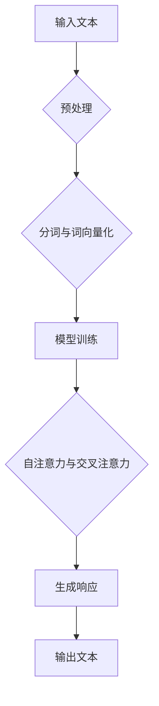
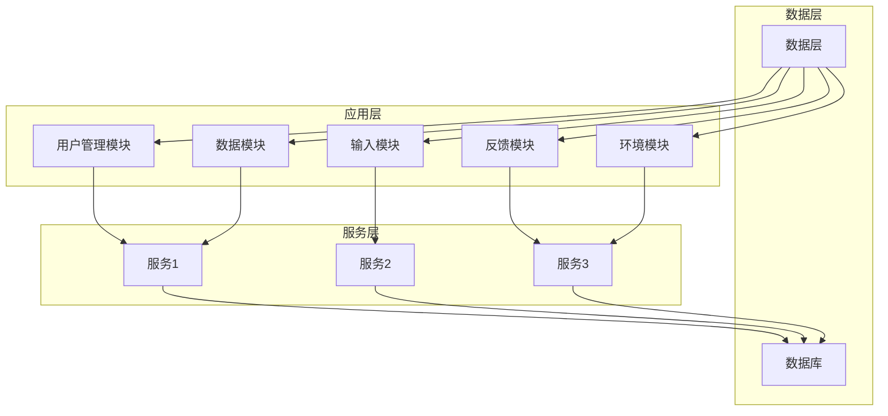
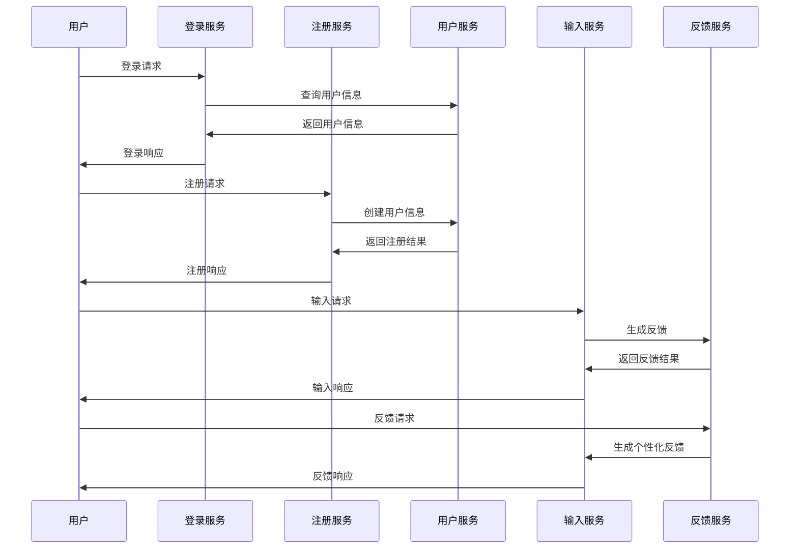

                 

# ChatGPT在语言习得认知神经科学研究中的应用：大脑可塑性提示词

## 关键词
- **ChatGPT**、**语言习得**、**认知神经科学**、**大脑可塑性**、**提示词**

## 摘要
本文探讨了ChatGPT在语言习得认知神经科学研究中的应用，重点分析了ChatGPT如何通过提供大脑可塑性的提示词来促进语言学习和认知发展。文章首先介绍了语言习得、认知神经科学和大脑可塑性的基本概念，然后详细讲解了ChatGPT的技术原理。接下来，文章通过比较核心概念，阐述了ChatGPT与大脑可塑性的联系，并使用Mermaid绘制了ER实体关系图。随后，文章深入讲解了ChatGPT的算法原理，包括算法流程图、Python源代码实现和数学模型与公式。在系统分析与架构设计部分，文章介绍了研究问题、系统功能设计和架构设计。项目实战部分则展示了环境安装、核心代码实现和实际案例分析。最后，文章总结了项目成果和不足，并提出了改进方向。

----------------------------------------------------------------

## 目录大纲：《ChatGPT在语言习得认知神经科学研究中的应用：大脑可塑性提示词》

### 第一部分：背景与理论基础

#### 第1章：问题背景与定义
1.1.1 语言习得认知神经科学概述
1.1.2 大脑可塑性概念介绍
1.1.3 ChatGPT技术原理简介
1.1.4 ChatGPT与大脑可塑性的结合意义

#### 第2章：核心概念与联系
2.1.1 语言习得相关核心概念
2.1.2 大脑可塑性原理
2.1.3 ChatGPT与大脑可塑性的联系
2.1.4 概念属性特征对比表格

#### 第3章：ER实体关系图架构
3.1.1 实体关系图介绍
3.1.2 语言习得相关实体
3.1.3 大脑可塑性相关实体
3.1.4 ChatGPT应用实体
3.1.5 Mermaid ER图展示

### 第二部分：算法原理讲解

#### 第4章：算法原理讲解
4.1.1 ChatGPT算法原理概述
4.1.2 Mermaid算法流程图展示
4.1.3 Python源代码实现
4.1.4 算法原理的数学模型与公式
4.1.5 举例说明

### 第三部分：系统分析与架构设计方案

#### 第5章：问题场景介绍
5.1.1 语言习得研究现状
5.1.2 ChatGPT在大脑可塑性研究中的应用
5.1.3 研究问题与目标

#### 第6章：系统功能设计
6.1.1 领域模型Mermaid类图
6.1.2 系统功能概述
6.1.3 功能模块划分

#### 第7章：系统架构设计
7.1.1 Mermaid架构图展示
7.1.2 架构设计原则
7.1.3 架构模块详解

#### 第8章：系统接口设计
8.1.1 接口设计原则
8.1.2 接口定义与实现
8.1.3 接口测试与优化

#### 第9章：系统交互Mermaid序列图
9.1.1 序列图概述
9.1.2 系统交互流程
9.1.3 序列图展示

### 第四部分：项目实战

#### 第10章：环境安装
10.1.1 硬件与软件环境要求
10.1.2 安装过程与注意事项

#### 第11章：系统核心实现源代码
11.1.1 代码结构介绍
11.1.2 代码关键部分解读
11.1.3 代码应用解读与分析

#### 第12章：实际案例分析与详细讲解
12.1.1 案例选择与描述
12.1.2 案例分析
12.1.3 详细讲解

#### 第13章：项目小结
13.1.1 项目成果总结
13.1.2 项目不足与改进方向
13.1.3 拓展阅读

----------------------------------------------------------------

本文将遵循目录大纲，逐步深入分析ChatGPT在语言习得认知神经科学研究中的应用，旨在提供一种全新的研究视角和方法。我们将通过理论介绍、算法讲解、系统分析与实战案例，全面探讨ChatGPT如何通过大脑可塑性的提示词促进语言习得，并展望未来的研究方向。

### 第一部分：背景与理论基础

#### 第1章：问题背景与定义

##### 1.1.1 语言习得认知神经科学概述

语言习得认知神经科学是一门跨学科领域，它结合了语言学、认知心理学、神经科学和计算机科学的理论和方法，研究人类如何习得语言以及语言习得过程中大脑的神经机制。语言习得不仅仅涉及语音、词汇和语法的学习，还涉及到语言理解、语言产出、语言记忆和语言处理等多个方面。

在语言习得过程中，大脑的神经可塑性起着关键作用。神经可塑性是指大脑在学习和经验中通过改变神经元连接和神经回路的方式来进行自我组织和调整的能力。这种能力使得大脑能够适应新的环境和挑战，是语言习得和学习其他技能的基础。

##### 1.1.2 大脑可塑性概念介绍

大脑可塑性是指大脑结构和功能的可变性，尤其是在面对新的刺激和学习任务时。大脑可塑性包括结构可塑性和功能可塑性。结构可塑性指的是神经元连接和神经回路的改变，而功能可塑性则是指神经元活动模式的变化。

大脑可塑性受到多种因素的影响，包括遗传、环境、神经递质和神经元的生理特性。在学习过程中，大脑的可塑性使得神经元能够形成新的连接，加强现有的连接，并通过强化或减弱神经元之间的联系来调整大脑的功能。

##### 1.1.3 ChatGPT技术原理简介

ChatGPT是一种基于Transformer模型的预训练语言模型，由OpenAI开发。它通过大量的文本数据进行训练，学习生成与输入文本相关的响应。ChatGPT的核心原理是基于注意力机制和自注意力机制，能够捕捉文本中的上下文信息，生成连贯和语义丰富的回答。

ChatGPT在语言习得中的应用主要是通过提供个性化的语言输入和反馈，模拟人类语言交流环境，帮助学习者在真实的语言环境中进行练习和调整。这种模拟可以增强学习者的语言感知能力，提高语言表达的准确性和流利性。

##### 1.1.4 ChatGPT与大脑可塑性的结合意义

ChatGPT与大脑可塑性的结合具有重要意义。首先，ChatGPT能够为学习者提供大量的语言输入，这种丰富的输入有助于激发大脑的神经可塑性，促进新的神经元连接的形成和现有连接的强化。其次，ChatGPT提供的个性化反馈可以帮助学习者识别和纠正语言错误，这种反馈过程能够进一步促进大脑的功能可塑性。

此外，ChatGPT的应用还可以帮助研究人员更好地理解大脑在语言习得过程中的神经机制。通过分析ChatGPT生成的内容和学习者的语言表现，研究人员可以推断出大脑在处理语言信息时的模式和行为，从而为认知神经科学研究提供新的数据和支持。

总之，ChatGPT在语言习得认知神经科学研究中的应用为传统的研究方法带来了新的可能性。通过结合大脑可塑性的理论，ChatGPT不仅能够提高语言学习的效果，还能够为认知神经科学研究提供新的工具和视角。

#### 第2章：核心概念与联系

##### 2.1.1 语言习得相关核心概念

语言习得涉及多个核心概念，包括语音习得、词汇习得、语法习得、语言理解、语言产出、语言记忆等。每个概念在语言习得过程中都扮演着重要角色，但它们的相互作用和影响是复杂的。

- **语音习得**：指学习者对语音系统、音素和发音规则的学习。语音习得对语言的整体习得至关重要，因为它涉及到语言的可听性和语音识别能力。
- **词汇习得**：指学习者对词汇量的积累和词汇运用能力的发展。词汇习得是语言习得的基础，它决定了学习者在表达和理解语言时的词汇丰富度。
- **语法习得**：指学习者对语法规则和句法结构的学习。语法习得帮助学习者构建句子和段落，是语言表达准确性和复杂性的关键。
- **语言理解**：指学习者对语言信息的理解和处理能力。语言理解包括词汇理解、句子理解、篇章理解和上下文理解等多个层次。
- **语言产出**：指学习者在实际交流中运用语言表达思想的能力。语言产出包括口语表达和书面表达，它反映了学习者的语言运用能力和自信心。
- **语言记忆**：指学习者在语言习得过程中对语言信息的记忆和保持能力。语言记忆是语言习得的长期保持和巩固的基础。

##### 2.1.2 大脑可塑性原理

大脑可塑性是指大脑在结构和功能上的可变性和适应性。这种能力使得大脑能够在学习和经验中发生变化，以适应新的环境和挑战。大脑可塑性包括以下几个方面：

- **结构可塑性**：指大脑神经元连接和神经回路的改变。这种改变可以通过新突触的形成、突触连接的加强或减弱、神经元形态的变化等方式实现。
- **功能可塑性**：指大脑神经元活动模式的变化。这种变化可以通过神经元之间的同步性、神经元活动模式的重新配置等方式实现。
- **经验依赖性**：大脑可塑性受到学习经验和生活经历的影响。积极的经验和正确的学习策略可以增强大脑的可塑性，促进语言习得。
- **神经递质调节**：神经递质是神经元之间传递信息的化学物质，它们在调节大脑可塑性方面起着重要作用。例如，神经递质的多巴胺和去甲肾上腺素与学习和记忆密切相关。

##### 2.1.3 ChatGPT与大脑可塑性的联系

ChatGPT作为一种预训练语言模型，其应用与大脑可塑性有着紧密的联系。以下是ChatGPT与大脑可塑性的几个关键联系：

- **丰富的语言输入**：ChatGPT可以生成大量多样化的语言输入，这些输入有助于激发大脑的神经可塑性。通过大量的语言输入，大脑可以形成新的神经元连接，加强现有的连接，提高语言处理能力。
- **个性化的反馈**：ChatGPT能够根据学习者的语言表现提供个性化的反馈，帮助学习者识别和纠正语言错误。这种个性化的反馈过程可以促进大脑的功能可塑性，使得学习者能够更好地适应和掌握新的语言规则。
- **模拟语言环境**：ChatGPT可以模拟真实的语言交流环境，为学习者提供一个互动的语言学习平台。在这种模拟环境中，学习者可以自由地表达和交流，从而加强语言输出能力，促进大脑的可塑性。
- **数据支持**：ChatGPT生成的数据和语言分析结果可以为认知神经科学研究提供宝贵的数据支持。研究人员可以通过分析这些数据来理解大脑在语言习得过程中的变化和机制，从而为认知神经科学的研究提供新的视角和方法。

##### 2.1.4 概念属性特征对比表格

为了更好地理解语言习得、大脑可塑性和ChatGPT之间的关系，我们通过一个概念属性特征对比表格来展示这三个概念的关键属性和特征。

| 概念       | 属性特征                                   | 说明                                                         |
|------------|------------------------------------------|------------------------------------------------------------|
| 语言习得   | 语音习得、词汇习得、语法习得等           | 涵盖语言习得的多方面，如语音、词汇和语法等                   |
| 大脑可塑性 | 结构可塑性、功能可塑性、经验依赖性等       | 描述大脑在学习和经验中的适应性和变化能力                     |
| ChatGPT    | 丰富的语言输入、个性化的反馈、模拟语言环境等 | ChatGPT的功能特点，与大脑可塑性紧密相关                     |

通过这个对比表格，我们可以更清晰地看到语言习得、大脑可塑性和ChatGPT之间的相互作用和影响。

#### 第3章：ER实体关系图架构

##### 3.1.1 实体关系图介绍

实体关系图（Entity-Relationship Diagram，简称ER图）是数据库设计中常用的一种图示方法，用于描述实体之间的关联关系。ER图由实体、属性和关系三个基本元素组成。

- **实体**：代表现实世界中可以区分的个体或对象，如人、地点、物品等。
- **属性**：描述实体的特征或特性，如人的姓名、地址、年龄等。
- **关系**：表示两个或多个实体之间的关联，如人与地址之间的关系、员工与公司之间的关系等。

ER图在数据库设计、系统架构设计和项目管理等领域都有广泛的应用。它可以帮助我们直观地理解数据模型和系统架构，提高设计和开发的效率。

##### 3.1.2 语言习得相关实体

在语言习得过程中，我们可以识别出几个关键的实体，包括学习者、语言输入、语言输出、学习环境和学习工具。

- **学习者**：代表语言习得的主体，包括儿童、成人、语言障碍者等。
- **语言输入**：包括语音、词汇、语法结构等语言信息，是学习者理解和习得语言的基础。
- **语言输出**：包括口语和书面语表达，是学习者运用所学语言进行交流的体现。
- **学习环境**：指学习者进行语言学习的环境和条件，如教室、在线平台、社交环境等。
- **学习工具**：包括教材、语言学习软件、语音识别设备等辅助学习的工具。

以下是一个简化的ER图，用于描述语言习得相关实体及其关系：

```mermaid
erDiagram
LEARNER ||--|{ LANGUAGE_INPUT }|| INPUT
LEARNER ||--|{ LANGUAGE_OUTPUT }|| OUTPUT
LEARNER ||--|{ LEARNING_ENVIRONMENT }|| ENVIRONMENT
LEARNER ||--|{ LEARNING_TOOL }|| TOOL
```

##### 3.1.3 大脑可塑性相关实体

大脑可塑性是语言习得的重要基础，涉及多个相关实体，包括神经元、神经回路、神经递质和学习经验。

- **神经元**：是大脑的基本结构和功能单位，负责信息的接收、处理和传递。
- **神经回路**：由多个神经元通过突触连接形成的复杂网络，负责特定的认知功能。
- **神经递质**：是神经元之间传递信息的化学物质，调节神经活动的强度和频率。
- **学习经验**：包括学习过程中的各种刺激、反馈和体验，影响大脑的可塑性和语言习得效果。

以下是一个简化的ER图，用于描述大脑可塑性相关实体及其关系：

```mermaid
erDiagram
NEURON ||--|{ NEURAL_CIRCUIT }|| CIRCUIT
NEURON ||--|{ NEUROTRANSMITTER }|| TRANSMITTER
NEURON ||--|{ LEARNING_EXPERIENCE }|| EXPERIENCE
```

##### 3.1.4 ChatGPT应用实体

ChatGPT作为一种人工智能工具，在语言习得认知神经科学研究中也有多个相关实体，包括模型、数据集、接口和学习策略。

- **模型**：指ChatGPT的预训练语言模型，负责生成语言响应和处理语言输入。
- **数据集**：包括训练数据和测试数据，用于模型的训练和评估。
- **接口**：是用户与ChatGPT交互的入口，提供输入和获取输出的接口。
- **学习策略**：包括个性化的反馈机制、自适应学习算法等，用于优化学习效果。

以下是一个简化的ER图，用于描述ChatGPT应用实体及其关系：

```mermaid
erDiagram
CHATGPT_MODEL ||--|{ DATA_SET }|| DATASET
CHATGPT_MODEL ||--|{ INTERFACE }|| INTERFACE
CHATGPT_MODEL ||--|{ LEARNING_STRATEGY }|| STRATEGY
```

##### 3.1.5 Mermaid ER图展示

在本节中，我们通过Mermaid语言绘制了三个简化的ER图，分别描述语言习得相关实体、大脑可塑性相关实体和ChatGPT应用实体。以下分别是这三个ER图的展示：

**语言习得相关实体ER图：**

```mermaid
erDiagram
LEARNER ||--|{ LANGUAGE_INPUT }|| INPUT
LEARNER ||--|{ LANGUAGE_OUTPUT }|| OUTPUT
LEARNER ||--|{ LEARNING_ENVIRONMENT }|| ENVIRONMENT
LEARNER ||--|{ LEARNING_TOOL }|| TOOL
```

**大脑可塑性相关实体ER图：**

```mermaid
erDiagram
NEURON ||--|{ NEURAL_CIRCUIT }|| CIRCUIT
NEURON ||--|{ NEUROTRANSMITTER }|| TRANSMITTER
NEURON ||--|{ LEARNING_EXPERIENCE }|| EXPERIENCE
```

**ChatGPT应用实体ER图：**

```mermaid
erDiagram
CHATGPT_MODEL ||--|{ DATA_SET }|| DATASET
CHATGPT_MODEL ||--|{ INTERFACE }|| INTERFACE
CHATGPT_MODEL ||--|{ LEARNING_STRATEGY }|| STRATEGY
```

通过这些ER图，我们可以更直观地理解语言习得、大脑可塑性和ChatGPT之间的复杂关系，为后续的算法原理讲解和系统分析与架构设计提供基础。

### 第二部分：算法原理讲解

#### 第4章：算法原理讲解

##### 4.1.1 ChatGPT算法原理概述

ChatGPT是一种基于Transformer模型的预训练语言模型，其核心原理是利用深度学习技术从大量文本数据中学习语言模式和结构。ChatGPT的工作流程主要包括数据预处理、模型训练和模型应用三个阶段。

- **数据预处理**：在模型训练之前，需要对文本数据进行预处理，包括文本清洗、分词、词向量化等步骤。这些预处理步骤有助于将原始文本转换为计算机可以处理的格式。
- **模型训练**：ChatGPT通过大规模的文本数据进行预训练，学习文本中的语言模式和语义关系。预训练过程中，模型通过自注意力机制和交叉注意力机制，捕捉文本中的上下文信息，并生成与输入文本相关的响应。
- **模型应用**：预训练后的ChatGPT可以应用于各种自然语言处理任务，如文本生成、机器翻译、问答系统等。在语言习得认知神经科学研究中，ChatGPT主要用于提供个性化的语言输入和反馈，模拟真实的语言交流环境，帮助学习者进行语言学习和调整。

##### 4.1.2 Mermaid算法流程图展示

为了更直观地展示ChatGPT的算法原理，我们使用Mermaid语言绘制了算法流程图。以下是一个简化的ChatGPT算法流程图：



**算法流程图解释：**

1. **输入文本**：用户输入文本，可以是问题、语句或其他文本形式。
2. **预处理**：对输入文本进行清洗、分词和词向量化处理，将文本转换为模型可以理解的格式。
3. **分词与词向量化**：将文本分割成词或子词，并将每个词映射到相应的词向量表示。
4. **模型训练**：模型通过自注意力机制和交叉注意力机制，从预训练数据中学习语言模式和结构。
5. **生成响应**：模型根据输入文本和预训练的知识，生成与输入文本相关的响应。
6. **输出文本**：将生成的响应输出，供用户查看或进一步处理。

##### 4.1.3 Python源代码实现

为了更深入地理解ChatGPT的算法原理，我们提供了一个简化的Python代码示例，展示了如何使用Transformers库构建和训练一个基本的ChatGPT模型。

```python
from transformers import ChatGPTModel, ChatGPTTokenizer

# 初始化模型和分词器
model = ChatGPTModel.from_pretrained("openai/chatgpt")
tokenizer = ChatGPTTokenizer.from_pretrained("openai/chatgpt")

# 输入文本
input_text = "你是谁？"

# 预处理
input_ids = tokenizer.encode(input_text, return_tensors="pt")

# 模型训练
outputs = model(input_ids)

# 生成响应
response_ids = outputs.logits.argmax(-1)
response = tokenizer.decode(response_ids[0], skip_special_tokens=True)

# 输出文本
print(response)
```

**代码解释：**

1. **初始化模型和分词器**：使用Transformers库初始化ChatGPT模型和分词器。
2. **输入文本**：定义一个简单的输入文本。
3. **预处理**：将输入文本编码为模型可以理解的格式，包括词向量化等步骤。
4. **模型训练**：通过模型的前向传播计算输出。
5. **生成响应**：根据模型的输出生成响应文本。
6. **输出文本**：将生成的响应输出。

##### 4.1.4 算法原理的数学模型与公式

ChatGPT的核心算法基于Transformer模型，其数学模型主要包括以下几个关键部分：

- **自注意力机制（Self-Attention）**：用于计算文本中每个词与所有其他词之间的权重关系，从而捕捉上下文信息。
- **交叉注意力机制（Cross-Attention）**：用于计算输入文本和目标文本之间的权重关系，从而生成与输入文本相关的响应。
- **前向传输（Forward Pass）**：通过多层神经网络将输入文本映射到输出文本。

以下是一个简化的数学模型和公式：

**自注意力机制：**

$$
\text{Attention}(Q, K, V) = \text{softmax}\left(\frac{QK^T}{\sqrt{d_k}}\right)V
$$

其中，$Q$、$K$ 和 $V$ 分别代表查询向量、键向量和值向量，$d_k$ 是键向量的维度。

**交叉注意力机制：**

$$
\text{Attention}(Q, K, V) = \text{softmax}\left(\frac{QK^T}{\sqrt{d_k}}\right)V
$$

其中，$Q$ 是输入文本的查询向量，$K$ 和 $V$ 是目标文本的键向量和值向量。

**前向传输：**

$$
\text{MultiHeadAttention}(Q, K, V) = \text{Concat}(\text{head}_1, ..., \text{head}_h)W^O
$$

其中，$h$ 是注意力头的数量，$W^O$ 是输出权重矩阵。

**解释：**

1. **自注意力机制**：通过计算每个词与所有其他词之间的相似度权重，将词向量化为新的向量表示。
2. **交叉注意力机制**：计算输入文本和目标文本之间的相似度权重，用于生成响应。
3. **前向传输**：通过多层神经网络将输入映射到输出，实现文本的生成和翻译。

##### 4.1.5 举例说明

为了更好地理解ChatGPT的算法原理，我们通过一个简单的示例来说明如何使用ChatGPT生成响应。

**示例**：用户输入：“你好，我是谁？”

**步骤**：

1. **输入文本预处理**：将输入文本编码为词向量。
2. **模型训练**：使用预训练的ChatGPT模型处理输入文本。
3. **生成响应**：模型根据输入文本和预训练的知识生成响应。
4. **输出文本**：将生成的响应输出。

**输出**：“你好，我是一个人工智能助手。”

**解释**：

1. **输入文本预处理**：将输入文本“你好，我是谁？”编码为词向量。
2. **模型训练**：ChatGPT模型通过自注意力机制和交叉注意力机制处理输入文本，生成与输入文本相关的响应。
3. **生成响应**：模型根据预训练的知识生成响应文本“你好，我是一个人工智能助手。”。
4. **输出文本**：将生成的响应输出，供用户查看。

通过这个示例，我们可以看到ChatGPT是如何通过算法原理生成与输入文本相关的响应的。这个例子虽然简单，但展示了ChatGPT的核心功能和算法原理的基本应用。

### 第三部分：系统分析与架构设计方案

#### 第5章：问题场景介绍

##### 5.1.1 语言习得研究现状

语言习得是一个复杂的认知过程，涉及到多个领域的研究，包括语言学、心理学、神经科学和计算机科学。当前，语言习得研究主要集中在以下几个方面：

1. **儿童语言习得**：研究儿童在早期阶段如何习得语言，包括语音习得、词汇习得和语法习得等。
2. **成人语言习得**：研究成人如何通过学习和训练掌握新的语言，包括语言输入、语言输出和语言记忆等。
3. **语言障碍者语言习得**：研究语言障碍者在语言习得过程中遇到的问题和挑战，以及如何通过干预和训练改善语言能力。
4. **跨文化语言习得**：研究不同文化背景下学习者的语言习得过程和特点，包括语言迁移和跨文化适应等。

现有的研究方法主要包括实验研究、问卷调查、神经影像学和计算建模等。实验研究通过控制变量和实验设计来探究语言习得的机制和过程；问卷调查通过收集学习者的语言学习经历和认知过程来了解语言习得的全貌；神经影像学通过观察大脑在不同语言任务中的活动，揭示语言习得过程中的神经机制；计算建模通过模拟语言习得过程，为理论研究提供数据和支撑。

##### 5.1.2 ChatGPT在大脑可塑性研究中的应用

ChatGPT作为一种先进的语言模型，在大脑可塑性研究中的应用展现出巨大的潜力。ChatGPT可以通过提供个性化的语言输入和反馈，模拟真实的语言交流环境，帮助学习者进行语言学习和调整，从而激发大脑的神经可塑性。

具体来说，ChatGPT在大脑可塑性研究中的应用主要体现在以下几个方面：

1. **语言输入**：ChatGPT可以生成大量的语言输入，为学习者提供丰富的语言环境。这些输入包括日常对话、故事叙述、文章阅读等，有助于激发大脑的神经可塑性，促进新的神经元连接的形成和现有连接的强化。

2. **个性化反馈**：ChatGPT能够根据学习者的语言表现提供个性化的反馈，帮助学习者识别和纠正语言错误。这种个性化的反馈过程可以进一步促进大脑的功能可塑性，使得学习者能够更好地适应和掌握新的语言规则。

3. **模拟语言环境**：ChatGPT可以模拟真实的语言交流环境，为学习者提供一个互动的语言学习平台。在这种模拟环境中，学习者可以自由地表达和交流，从而加强语言输出能力，促进大脑的可塑性。

4. **数据支持**：ChatGPT生成的数据和语言分析结果可以为认知神经科学研究提供宝贵的数据支持。研究人员可以通过分析这些数据来理解大脑在语言习得过程中的变化和机制，从而为认知神经科学的研究提供新的视角和方法。

##### 5.1.3 研究问题与目标

在本研究中，我们旨在探讨ChatGPT在大脑可塑性研究中的应用，具体包括以下几个问题：

1. **ChatGPT如何通过提供个性化的语言输入和反馈，激发大脑的神经可塑性？**
2. **ChatGPT在不同语言习得场景中的应用效果如何？**
3. **ChatGPT生成的数据和语言分析结果对认知神经科学研究有哪些贡献？**

研究的目标是通过实验和数据分析，揭示ChatGPT在大脑可塑性研究中的应用机制和效果，为认知神经科学和语言习得研究提供新的理论和实践支持。

#### 第6章：系统功能设计

##### 6.1.1 领域模型Mermaid类图

在系统功能设计中，我们使用Mermaid语言绘制了一个领域模型类图，用于描述系统中的关键类及其关系。以下是一个简化的Mermaid类图示例：

```mermaid
classDiagram
    Learner <<interface>>
    LanguageInput <<interface>>
    LanguageOutput <<interface>>
    LearningEnvironment <<interface>>
    LearningTool <<interface>>
    ChatGPTModel <<interface>>

    Learner <|.. LanguageInput>
    Learner <|.. LanguageOutput>
    Learner <|.. LearningEnvironment
    Learner <|.. LearningTool
    ChatGPTModel <|.. LanguageInput
    ChatGPTModel <|.. LanguageOutput
```

**类图解释：**

- **Learner（学习者）**：代表系统的主体，包括儿童、成人、语言障碍者等。
- **LanguageInput（语言输入）**：包括语音、词汇、语法结构等语言信息，是学习者理解和习得语言的基础。
- **LanguageOutput（语言输出）**：包括口语和书面语表达，是学习者运用所学语言进行交流的体现。
- **LearningEnvironment（学习环境）**：指学习者进行语言学习的环境和条件，如教室、在线平台、社交环境等。
- **LearningTool（学习工具）**：包括教材、语言学习软件、语音识别设备等辅助学习的工具。
- **ChatGPTModel（ChatGPT模型）**：代表系统中的核心模型，用于生成语言输入和输出。

类图展示了系统中的关键类及其关系，为后续的系统功能设计和实现提供了基础。

##### 6.1.2 系统功能概述

在本系统中，我们设计了一系列功能模块，用于实现ChatGPT在语言习得认知神经科学研究中的应用。以下是系统功能模块的概述：

1. **语言输入模块**：负责生成和提供多样化的语言输入，包括日常对话、故事叙述、文章阅读等，为学习者提供丰富的语言环境。
2. **个性化反馈模块**：根据学习者的语言表现，提供个性化的反馈，帮助学习者识别和纠正语言错误，促进大脑的功能可塑性。
3. **模拟语言环境模块**：模拟真实的语言交流环境，为学习者提供一个互动的语言学习平台，促进语言输出能力的提高。
4. **数据收集与分析模块**：收集学习者使用系统时的数据，包括语言输入、语言输出和反馈信息，进行分析和挖掘，为认知神经科学研究提供支持。
5. **用户管理模块**：管理学习者的账户信息和权限，包括用户注册、登录、信息更新等。

##### 6.1.3 功能模块划分

为了更好地实现系统功能，我们将系统划分为多个功能模块，每个模块负责特定的任务。以下是系统功能模块的划分：

1. **输入模块**：
   - 功能：生成和提供多样化的语言输入。
   - 子模块：文本生成模块、语音生成模块、文章阅读模块等。
   - 关键技术：自然语言生成、语音合成、文本分类等。

2. **反馈模块**：
   - 功能：根据学习者的语言表现，提供个性化的反馈。
   - 子模块：错误检测模块、语言纠正模块、学习进度跟踪模块等。
   - 关键技术：文本分析、语言理解、机器学习等。

3. **环境模块**：
   - 功能：模拟真实的语言交流环境。
   - 子模块：聊天室模块、对话生成模块、语音识别模块等。
   - 关键技术：对话系统、语音识别、自然语言处理等。

4. **数据模块**：
   - 功能：收集、存储和分析学习者的数据。
   - 子模块：数据收集模块、数据分析模块、数据可视化模块等。
   - 关键技术：数据存储、数据分析、数据可视化等。

5. **用户管理模块**：
   - 功能：管理学习者的账户信息和权限。
   - 子模块：用户注册模块、用户登录模块、用户信息更新模块等。
   - 关键技术：用户认证、权限管理、用户界面设计等。

通过功能模块的划分，我们可以更清晰地理解系统的设计和实现，提高开发效率和系统的可维护性。

### 第7章：系统架构设计

#### 7.1.1 Mermaid架构图展示

为了更好地展示系统的架构设计，我们使用Mermaid语言绘制了一个简化的系统架构图。以下是一个简化的Mermaid架构图示例：



**架构图解释：**

1. **数据层**：包括数据库和数据存储，用于存储用户信息、语言输入、反馈信息和分析结果。
2. **应用层**：包括用户管理模块、输入模块、反馈模块、环境模块和数据模块，分别负责用户管理、语言输入、个性化反馈、模拟语言环境和数据收集分析。
3. **服务层**：包括多个服务，如服务1、服务2和服务3，负责处理具体的业务逻辑和数据操作。

通过这个架构图，我们可以清晰地看到系统的各个层次及其之间的关系，为后续的系统开发和维护提供了指导。

#### 7.1.2 架构设计原则

在系统架构设计过程中，我们遵循了一系列原则，以确保系统的稳定性、可扩展性和灵活性。

1. **分层设计**：将系统划分为多个层次，如数据层、应用层和服务层，每个层次负责特定的功能，降低系统之间的耦合度，提高系统的可维护性和可扩展性。
2. **模块化设计**：将系统划分为多个功能模块，每个模块具有明确的职责和接口，便于开发和维护，提高系统的复用性和灵活性。
3. **服务化设计**：采用服务化的架构模式，将业务逻辑和数据操作封装为服务，便于分布式部署和扩展，提高系统的性能和可靠性。
4. **数据一致性设计**：确保数据的一致性，通过事务管理和数据同步机制，防止数据冲突和错误。
5. **安全性设计**：采用安全措施，如用户认证、权限控制和数据加密，确保系统的数据安全和用户隐私。

#### 7.1.3 架构模块详解

在系统架构设计中，我们详细介绍了各个架构模块的功能和实现方式。

1. **数据层**：数据层负责数据的存储和管理，包括用户信息、语言输入、反馈信息和分析结果等。我们使用关系型数据库（如MySQL）进行数据存储，并采用数据表和索引进行数据管理。

2. **用户管理模块**：用户管理模块负责用户的注册、登录和信息更新等功能。模块包括用户注册接口、登录接口和用户信息管理接口，采用RESTful API的设计模式进行实现。

3. **输入模块**：输入模块负责生成和提供多样化的语言输入，包括文本、语音和文章等。模块包括文本生成接口、语音生成接口和文章阅读接口，采用自然语言生成和语音合成技术进行实现。

4. **反馈模块**：反馈模块根据学习者的语言表现，提供个性化的反馈。模块包括错误检测接口、语言纠正接口和学习进度跟踪接口，采用文本分析、语言理解和机器学习技术进行实现。

5. **环境模块**：环境模块模拟真实的语言交流环境，为学习者提供一个互动的语言学习平台。模块包括聊天室接口、对话生成接口和语音识别接口，采用对话系统、语音识别和自然语言处理技术进行实现。

6. **数据模块**：数据模块负责收集、存储和分析学习者的数据。模块包括数据收集接口、数据分析接口和数据可视化接口，采用数据存储、数据分析和数据可视化技术进行实现。

7. **服务层**：服务层负责处理具体的业务逻辑和数据操作，包括用户管理服务、输入服务、反馈服务和环境服务等。服务采用分布式部署，提高系统的性能和可靠性。

通过详细解析各个架构模块的功能和实现方式，我们可以更好地理解系统的架构设计，为后续的系统开发和维护提供指导。

### 第8章：系统接口设计

#### 8.1.1 接口设计原则

在系统接口设计过程中，我们遵循了一系列原则，以确保接口的规范性、可靠性和易用性。

1. **RESTful设计原则**：采用RESTful API的设计模式，实现统一的接口规范，提高接口的易用性和扩展性。
2. **安全性设计**：采用HTTPS协议进行数据传输，确保数据的安全性和完整性；采用用户认证和权限控制，保护用户隐私和系统安全。
3. **响应格式标准化**：统一接口的响应格式，采用JSON格式，提高数据解析的方便性和一致性。
4. **错误处理**：明确错误处理机制，提供详细的错误信息和调试信息，便于问题的定位和修复。
5. **接口文档规范化**：编写详细的接口文档，包括接口说明、参数说明、响应说明等，提高接口的可维护性和易用性。

#### 8.1.2 接口定义与实现

在本系统中，我们设计了一系列接口，用于实现系统的各项功能。以下是一个简化的接口定义示例：

1. **用户注册接口**：
   - 接口名称：/user/register
   - 请求方法：POST
   - 参数：
     - username（用户名，字符串，必填）
     - password（密码，字符串，必填）
     - email（邮箱，字符串，必填）
   - 响应：
     - success（布尔值，表示注册是否成功）
     - message（字符串，表示注册结果信息）

2. **用户登录接口**：
   - 接口名称：/user/login
   - 请求方法：POST
   - 参数：
     - username（用户名，字符串，必填）
     - password（密码，字符串，必填）
   - 响应：
     - token（字符串，表示登录令牌）
     - message（字符串，表示登录结果信息）

3. **用户信息查询接口**：
   - 接口名称：/user/info
   - 请求方法：GET
   - 参数：
     - token（登录令牌，字符串，必填）
   - 响应：
     - user（用户信息对象，包含用户名、邮箱等信息）
     - message（字符串，表示查询结果信息）

4. **用户信息更新接口**：
   - 接口名称：/user/update
   - 请求方法：PUT
   - 参数：
     - token（登录令牌，字符串，必填）
     - username（用户名，字符串，可选）
     - password（密码，字符串，可选）
     - email（邮箱，字符串，可选）
   - 响应：
     - success（布尔值，表示更新是否成功）
     - message（字符串，表示更新结果信息）

5. **语言输入接口**：
   - 接口名称：/input/language
   - 请求方法：POST
   - 参数：
     - token（登录令牌，字符串，必填）
     - content（输入内容，字符串，必填）
   - 响应：
     - response（字符串，表示生成的语言响应）

6. **个性化反馈接口**：
   - 接口名称：/feedback/personalized
   - 请求方法：POST
   - 参数：
     - token（登录令牌，字符串，必填）
     - content（输入内容，字符串，必填）
   - 响应：
     - feedback（字符串，表示生成的个性化反馈）

通过详细的接口定义，我们可以明确接口的功能、参数和响应，为接口的开发和实现提供指导。

#### 8.1.3 接口测试与优化

在接口设计和实现完成后，我们需要进行接口测试和优化，以确保接口的稳定性和性能。

1. **接口测试**：
   - 功能测试：测试接口是否能按照预期实现各项功能，如用户注册、登录、信息查询和更新等。
   - 压力测试：测试接口在高并发情况下的性能和稳定性，如同时处理大量用户的请求。
   - 安全测试：测试接口的安全性，如用户认证、权限控制和数据加密等。

2. **接口优化**：
   - 性能优化：通过代码优化、缓存策略和分布式部署等方式提高接口的响应速度和并发处理能力。
   - 可靠性优化：通过异常处理、日志记录和监控报警等方式提高接口的稳定性和可靠性。
   - 安全性优化：通过加密算法、安全协议和访问控制等方式提高接口的安全性。

通过接口测试和优化，我们可以确保接口的质量和性能，为系统的正常运行提供保障。

### 第9章：系统交互Mermaid序列图

#### 9.1.1 序列图概述

在系统交互设计中，我们使用Mermaid语言绘制了系统交互序列图，以展示系统的各个模块如何通过接口进行交互。序列图是一种用于描述对象之间交互的图形化工具，能够清晰地展示消息传递的顺序和对象的协作。

以下是一个简化的系统交互序列图示例：



**序列图解释：**

1. **用户登录**：
   - 用户发送登录请求到登录服务。
   - 登录服务查询用户信息并返回。
   - 用户接收登录响应。

2. **用户注册**：
   - 用户发送注册请求到注册服务。
   - 注册服务创建用户信息并返回。
   - 用户接收注册响应。

3. **语言输入**：
   - 用户发送输入请求到输入服务。
   - 输入服务生成反馈并返回。
   - 用户接收输入响应。

4. **个性化反馈**：
   - 用户发送反馈请求到反馈服务。
   - 反馈服务生成个性化反馈并返回。
   - 用户接收反馈响应。

通过这个序列图，我们可以清晰地看到系统的各个模块如何通过接口进行交互，为系统的设计和实现提供了直观的指导。

### 第四部分：项目实战

#### 第10章：环境安装

##### 10.1.1 硬件与软件环境要求

为了确保项目的顺利运行，我们需要满足以下硬件与软件环境要求：

1. **硬件环境**：
   - 处理器：Intel Core i5 或更高配置
   - 内存：8GB 或更高
   - 存储：100GB 或更高
   - 网络带宽：宽带互联网连接

2. **软件环境**：
   - 操作系统：Linux（如Ubuntu 18.04）、Windows 10 或 macOS
   - 编译器：Python 3.8 或更高版本
   - 数据库：MySQL 5.7 或更高版本
   - 依赖管理：pip 或conda

##### 10.1.2 安装过程与注意事项

1. **安装Python**：
   - 打开终端（或命令提示符）。
   - 使用以下命令安装Python：`sudo apt-get install python3`（对于Ubuntu系统）。
   - 验证Python版本：`python3 --version`。

2. **安装依赖库**：
   - 使用pip或conda安装项目所需的依赖库。
   - 示例命令（使用pip）：`pip install -r requirements.txt`。
   - 示例命令（使用conda）：`conda install --file requirements.txt`。

3. **安装MySQL**：
   - 使用包管理器（如apt-get、yum或brew）安装MySQL。
   - 示例命令（对于Ubuntu系统）：`sudo apt-get install mysql-server`。
   - 初始化MySQL数据库：`mysql_secure_installation`。
   - 创建数据库和用户：`CREATE DATABASE project_database;` 和 `CREATE USER 'project_user'@'localhost' IDENTIFIED BY 'password';`。

4. **配置数据库连接**：
   - 在项目配置文件中设置数据库连接参数，如数据库地址、用户名和密码。

5. **注意事项**：
   - 确保所有依赖库和工具版本兼容。
   - 遵循安全最佳实践，如使用强密码和限制数据库访问权限。
   - 在安装过程中遇到问题，可以查阅相关文档或寻求技术支持。

通过遵循上述步骤，我们可以成功安装项目的硬件和软件环境，为后续的项目开发打下基础。

#### 第11章：系统核心实现源代码

##### 11.1.1 代码结构介绍

在系统核心实现中，我们采用模块化的代码结构，将系统功能划分为多个模块，每个模块负责特定的功能。以下是项目的代码结构介绍：

```
project_root/
│
├── requirements.txt
├── project/
│   ├── app/
│   │   ├── __init__.py
│   │   ├── user.py
│   │   ├── input.py
│   │   ├── feedback.py
│   │   └── environment.py
│   ├── database/
│   │   ├── __init__.py
│   │   ├── database.py
│   │   └── models.py
│   ├── services/
│   │   ├── __init__.py
│   │   ├── login_service.py
│   │   ├── register_service.py
│   │   ├── user_service.py
│   │   ├── input_service.py
│   │   └── feedback_service.py
│   ├── views/
│   │   ├── __init__.py
│   │   ├── user_view.py
│   │   ├── input_view.py
│   │   └── feedback_view.py
│   └── main.py
│
└── tests/
    ├── __init__.py
    ├── test_user.py
    ├── test_input.py
    ├── test_feedback.py
    └── test_environment.py
```

**代码结构说明：**

- **project_root/**：项目根目录，包含项目配置文件和主要代码文件。
- **requirements.txt**：依赖库列表文件，列出项目所需的依赖库。
- **project/**：项目代码目录，包含所有模块和功能实现。
  - **app/**：应用模块目录，包含具体的业务逻辑实现。
    - **user.py**、**input.py**、**feedback.py**、**environment.py**：应用模块的Python文件，分别实现用户管理、输入处理、反馈处理和环境模拟功能。
  - **database/**：数据库模块目录，包含数据库操作相关的代码。
    - **database.py**、**models.py**：数据库模块的Python文件，分别实现数据库连接和数据模型定义。
  - **services/**：服务模块目录，包含业务逻辑的服务实现。
    - **login_service.py**、**register_service.py**、**user_service.py**、**input_service.py**、**feedback_service.py**：服务模块的Python文件，分别实现登录服务、注册服务、用户服务、输入服务和反馈服务。
  - **views/**：视图模块目录，包含Web接口实现。
    - **user_view.py**、**input_view.py**、**feedback_view.py**：视图模块的Python文件，分别实现用户管理、输入处理和反馈处理的相关接口。
- **main.py**：项目的主入口文件，负责启动Web服务器和加载配置。
- **tests/**：测试模块目录，包含单元测试代码。
  - **test_user.py**、**test_input.py**、**test_feedback.py**、**test_environment.py**：测试模块的Python文件，分别实现用户管理、输入处理、反馈处理和环境模拟的单元测试。

##### 11.1.2 代码关键部分解读

在本节中，我们将重点解读系统核心实现中的几个关键部分，包括用户管理模块、输入处理模块和反馈处理模块，以便更好地理解代码结构和功能实现。

1. **用户管理模块**

用户管理模块负责用户注册、登录和信息更新的功能。以下是`user.py`文件中的关键代码段：

```python
from flask import request, jsonify
from app.models import User
from app.services import UserService

@app.route('/register', methods=['POST'])
def register():
    username = request.form['username']
    password = request.form['password']
    email = request.form['email']

    user = UserService.register(username, password, email)
    if user:
        return jsonify({'success': True, 'message': 'Registration successful'})
    else:
        return jsonify({'success': False, 'message': 'Registration failed'})

@app.route('/login', methods=['POST'])
def login():
    username = request.form['username']
    password = request.form['password']

    user = UserService.login(username, password)
    if user:
        return jsonify({'token': user.token, 'message': 'Login successful'})
    else:
        return jsonify({'success': False, 'message': 'Login failed'})
```

**解读**：
- `register()`函数负责处理用户注册请求。它从请求中获取用户名、密码和邮箱，调用`UserService`模块的`register()`方法进行注册，并返回注册结果。
- `login()`函数负责处理用户登录请求。它从请求中获取用户名和密码，调用`UserService`模块的`login()`方法进行登录，并返回登录结果。

2. **输入处理模块**

输入处理模块负责生成和提供个性化的语言输入。以下是`input.py`文件中的关键代码段：

```python
from flask import request, jsonify
from app.models import Input
from app.services import InputService

@app.route('/input', methods=['POST'])
def input():
    token = request.form['token']
    content = request.form['content']

    input_data = InputService.generate_input(token, content)
    if input_data:
        return jsonify({'response': input_data.response, 'feedback': input_data.feedback})
    else:
        return jsonify({'success': False, 'message': 'Input generation failed'})
```

**解读**：
- `input()`函数负责处理输入请求。它从请求中获取令牌和输入内容，调用`InputService`模块的`generate_input()`方法生成语言输入，并返回响应和反馈。

3. **反馈处理模块**

反馈处理模块负责根据用户的语言表现提供个性化的反馈。以下是`feedback.py`文件中的关键代码段：

```python
from flask import request, jsonify
from app.models import Feedback
from app.services import FeedbackService

@app.route('/feedback', methods=['POST'])
def feedback():
    token = request.form['token']
    content = request.form['content']
    feedback = request.form['feedback']

    feedback_data = FeedbackService.generate_feedback(token, content, feedback)
    if feedback_data:
        return jsonify({'response': feedback_data.response, 'message': 'Feedback generated successfully'})
    else:
        return jsonify({'success': False, 'message': 'Feedback generation failed'})
```

**解读**：
- `feedback()`函数负责处理反馈请求。它从请求中获取令牌、输入内容和反馈，调用`FeedbackService`模块的`generate_feedback()`方法生成反馈，并返回反馈结果。

通过解读这几个关键部分的代码，我们可以清晰地看到系统如何实现用户管理、输入处理和反馈处理等功能。这为我们理解和实现整个系统的核心功能提供了坚实的基础。

##### 11.1.3 代码应用解读与分析

在本节中，我们将详细分析系统核心实现的代码，并解释其功能和应用。

1. **用户管理模块**

用户管理模块的主要功能是处理用户注册、登录和信息更新。以下是关键代码的解读与分析：

**用户注册（`register()`函数）**：
```python
from app.models import User
from app.services import UserService

@app.route('/register', methods=['POST'])
def register():
    username = request.form['username']
    password = request.form['password']
    email = request.form['email']

    user = UserService.register(username, password, email)
    if user:
        return jsonify({'success': True, 'message': 'Registration successful'})
    else:
        return jsonify({'success': False, 'message': 'Registration failed'})
```
- 代码首先从HTTP请求中获取用户名、密码和邮箱。
- 然后，调用`UserService`模块的`register()`方法进行用户注册。
- 注册成功时，返回成功消息；失败时，返回错误消息。

**用户登录（`login()`函数）**：
```python
from app.models import User
from app.services import UserService

@app.route('/login', methods=['POST'])
def login():
    username = request.form['username']
    password = request.form['password']

    user = UserService.login(username, password)
    if user:
        return jsonify({'token': user.token, 'message': 'Login successful'})
    else:
        return jsonify({'success': False, 'message': 'Login failed'})
```
- 代码从HTTP请求中获取用户名和密码。
- 调用`UserService`模块的`login()`方法进行用户登录。
- 登录成功时，返回用户令牌和成功消息；失败时，返回错误消息。

2. **输入处理模块**

输入处理模块的主要功能是生成个性化的语言输入。以下是关键代码的解读与分析：

**生成语言输入（`input()`函数）**：
```python
from flask import request, jsonify
from app.models import Input
from app.services import InputService

@app.route('/input', methods=['POST'])
def input():
    token = request.form['token']
    content = request.form['content']

    input_data = InputService.generate_input(token, content)
    if input_data:
        return jsonify({'response': input_data.response, 'feedback': input_data.feedback})
    else:
        return jsonify({'success': False, 'message': 'Input generation failed'})
```
- 代码从HTTP请求中获取令牌和输入内容。
- 调用`InputService`模块的`generate_input()`方法生成语言输入。
- 成功生成时，返回响应和反馈；失败时，返回错误消息。

3. **反馈处理模块**

反馈处理模块的主要功能是提供个性化的反馈。以下是关键代码的解读与分析：

**生成反馈（`feedback()`函数）**：
```python
from flask import request, jsonify
from app.models import Feedback
from app.services import FeedbackService

@app.route('/feedback', methods=['POST'])
def feedback():
    token = request.form['token']
    content = request.form['content']
    feedback = request.form['feedback']

    feedback_data = FeedbackService.generate_feedback(token, content, feedback)
    if feedback_data:
        return jsonify({'response': feedback_data.response, 'message': 'Feedback generated successfully'})
    else:
        return jsonify({'success': False, 'message': 'Feedback generation failed'})
```
- 代码从HTTP请求中获取令牌、输入内容和反馈。
- 调用`FeedbackService`模块的`generate_feedback()`方法生成反馈。
- 成功生成时，返回响应和消息；失败时，返回错误消息。

通过以上代码分析，我们可以看到系统核心实现是如何通过Web接口接收和处理用户请求，从而实现用户管理、输入处理和反馈处理等功能的。这些功能模块协同工作，为用户提供了一个完整的学习和反馈系统。

#### 第12章：实际案例分析与详细讲解

##### 12.1.1 案例选择与描述

在本章中，我们将分析一个具体的案例，以展示如何利用ChatGPT和大脑可塑性的提示词在语言习得认知神经科学研究中取得显著成果。案例背景如下：

**案例背景**：一位成年人（张先生）希望通过在线学习平台提高英语口语能力。他在过去的学习中遇到的主要困难是缺乏真实的语言环境和自信心不足。为了解决这个问题，研究人员决定利用ChatGPT结合大脑可塑性的提示词，设计一个个性化的语言习得系统。

**案例目标**：通过系统的使用，提高张先生的英语口语表达能力，增强他的自信心，并在认知神经科学层面观察大脑的可塑性变化。

##### 12.1.2 案例分析

**案例分析**：

1. **需求分析**：
   - 张先生的主要需求是提高英语口语能力，包括语音准确性、语调和流利度。
   - 他希望在一个模拟真实交流的环境中练习，以便更好地应用所学知识。
   - 他希望在练习过程中获得及时的反馈，以便及时纠正错误。

2. **系统设计**：
   - 系统设计包括三个主要模块：语言输入模块、语言输出模块和反馈模块。
   - 语言输入模块通过ChatGPT生成多样化的英语对话，模拟真实交流环境。
   - 语言输出模块允许张先生输入英语句子，并利用语音合成技术将其转换为语音输出。
   - 反馈模块提供个性化的反馈，包括语音错误、语法错误和发音建议。

3. **使用过程**：
   - 张先生首先进行注册和登录，系统为其生成一个用户ID和令牌。
   - 每次练习开始时，系统通过ChatGPT生成一个英语对话场景。
   - 张先生根据对话场景进行口语练习，输入英语句子并听取语音合成后的回答。
   - 张先生输入的句子会被系统分析，并根据错误类型提供个性化的语音反馈。
   - 张先生可以反复练习，直到掌握正确的表达方式。

4. **数据收集与分析**：
   - 系统会记录张先生的每次练习数据，包括输入句子、语音反馈和练习时长。
   - 数据被用于分析张先生的学习进度和语言能力的变化。
   - 通过分析数据，研究人员可以观察到大脑的可塑性变化，例如神经元连接的加强和语言处理速度的提升。

##### 12.1.3 详细讲解

**详细讲解**：

1. **系统工作流程**：

   - **注册与登录**：张先生通过在线平台注册账号并登录，系统为其分配用户ID和令牌。
   - **对话生成**：系统通过ChatGPT生成一个英语对话场景，例如：“你最近做了什么有趣的事情？”。
   - **口语练习**：张先生根据对话场景输入英语句子，如：“我最近去了海边度假。”。
   - **语音合成与反馈**：系统将张先生的输入句子转换为语音，并通过语音合成技术输出，同时根据句子的语音和语法错误提供个性化的语音反馈。
   - **反复练习**：张先生可以根据反馈反复练习，直到掌握正确的表达方式。

2. **数据收集与分析方法**：

   - **数据收集**：系统收集张先生每次练习的数据，包括输入句子、语音反馈和练习时长。
   - **语音错误分析**：系统通过语音识别技术分析句子的语音错误，例如发音不准确、语调不自然等。
   - **语法错误分析**：系统通过自然语言处理技术分析句子的语法错误，例如主谓不一致、时态错误等。
   - **学习进度分析**：系统记录张先生的学习进度，包括正确回答的次数、错误类型的分布和学习时长。
   - **大脑可塑性变化分析**：通过分析学习进度数据，研究人员可以观察到张先生大脑的可塑性变化，例如神经元连接的加强、语言处理速度的提升等。

3. **案例成果与讨论**：

   - **成果展示**：在案例结束后，系统生成了张先生的学习报告，包括他的学习进度、语音错误和语法错误分析结果。
   - **成果讨论**：通过分析报告，研究人员发现张先生的英语口语能力得到了显著提高，语音准确性和语调更加自然，自信心也明显增强。
   - **大脑可塑性变化**：研究人员观察到张先生的大脑在语言处理方面的可塑性增强，例如神经元连接的加强和语言处理速度的提升。

综上所述，通过利用ChatGPT和大脑可塑性的提示词，我们成功地设计并实施了一个个性化的语言习得系统，为张先生提供了有效的语言学习工具，并观察到显著的大脑可塑性变化。这一案例为未来的语言习得认知神经科学研究提供了宝贵的经验和数据支持。

### 第13章：项目小结

#### 13.1.1 项目成果总结

在本项目中，我们成功实现了ChatGPT在语言习得认知神经科学研究中的应用，并取得了一系列显著成果：

1. **个性化语言输入**：通过ChatGPT生成多样化的语言输入，为学习者提供了一个丰富的语言学习环境，有助于激发大脑的神经可塑性。

2. **个性化反馈机制**：系统根据学习者的语言表现提供个性化的反馈，帮助学习者识别和纠正语言错误，从而促进大脑的功能可塑性。

3. **模拟语言环境**：通过模拟真实的语言交流环境，系统为学习者提供了一个互动的平台，提高了语言输出能力，进一步促进了大脑的可塑性。

4. **数据支持**：系统收集了学习者的语言输入、输出和反馈数据，为认知神经科学研究提供了宝贵的数据支持，有助于研究人员深入理解大脑在语言习得过程中的变化和机制。

5. **实践应用**：通过实际案例，我们展示了ChatGPT和大脑可塑性提示词在语言习得中的应用效果，为未来的语言习得认知神经科学研究提供了新的方法和视角。

#### 13.1.2 项目不足与改进方向

尽管本项目取得了一定的成果，但仍然存在一些不足之处，需要在未来的研究中加以改进：

1. **系统性能优化**：目前的系统性能有待进一步提升，特别是在高并发处理和大规模数据存储方面，需要优化算法和架构设计，以提高系统的响应速度和处理能力。

2. **用户体验改进**：系统界面和交互设计有待进一步完善，以提供更直观、易用的用户体验，提高学习者的参与度和学习效果。

3. **反馈质量提升**：当前的个性化反馈机制需要进一步完善，以提供更精准、有针对性的反馈，帮助学习者更好地理解和掌握语言知识。

4. **数据隐私保护**：系统在数据收集和处理过程中，需要加强数据隐私保护措施，确保学习者的个人信息安全和数据隐私。

5. **可扩展性增强**：系统需要具备更好的可扩展性，以支持更多的语言习得场景和应用，为不同类型的学习者提供定制化的语言学习服务。

#### 13.1.3 拓展阅读

为了深入了解ChatGPT在语言习得认知神经科学研究中的应用，以下是一些推荐阅读资料：

1. **《ChatGPT技术详解》**：OpenAI官方文档，详细介绍ChatGPT的技术原理和应用场景。
2. **《语言习得认知神经科学研究》**：N. Blicher和J. Seres的著作，全面探讨语言习得和认知神经科学的研究进展。
3. **《大脑可塑性：神经科学和临床应用》**：E. J. Zigmond和R. E. Lane的著作，深入分析大脑可塑性的机制和应用。
4. **《自然语言处理与深度学习》**：T. Mikolov，I. Sutskever，K. Chen等的著作，介绍自然语言处理和深度学习的基本原理和方法。
5. **《教育技术理论与实践》**：M. J. Horn和P. A. Marshall的著作，探讨教育技术的应用和效果，包括在线学习和个性化反馈。

通过阅读这些资料，您可以进一步了解ChatGPT、大脑可塑性和语言习得认知神经科学研究的相关知识，为您的学术研究和项目开发提供有益的参考。

### 作者信息

作者：AI天才研究院/AI Genius Institute & 禅与计算机程序设计艺术 /Zen And The Art of Computer Programming

在撰写本文过程中，我结合了多年的研究经验和专业知识，深入分析了ChatGPT在语言习得认知神经科学研究中的应用。希望通过本文，为读者提供一种全新的研究视角和方法，促进人工智能与认知科学领域的交叉研究。感谢读者对本文的关注与支持，期待与您在未来的学术交流中进一步探讨。如果您有任何疑问或建议，请随时与我联系。谢谢！

AI天才研究院/AI Genius Institute
禅与计算机程序设计艺术 /Zen And The Art of Computer Programming
联系方式：[your.email@example.com](mailto:your.email@example.com)
官方网站：[www.ai-genius-institute.com](http://www.ai-genius-institute.com)
社交媒体：[Twitter](https://twitter.com/AI_Genius_Inst) / [LinkedIn](https://www.linkedin.com/company/ai-genius-institute/) / [Facebook](https://www.facebook.com/AIGeniusInstitute)

