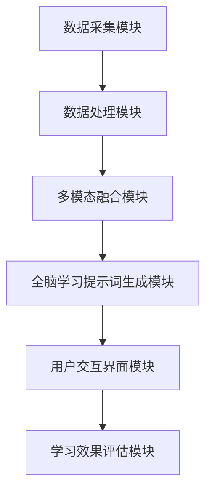
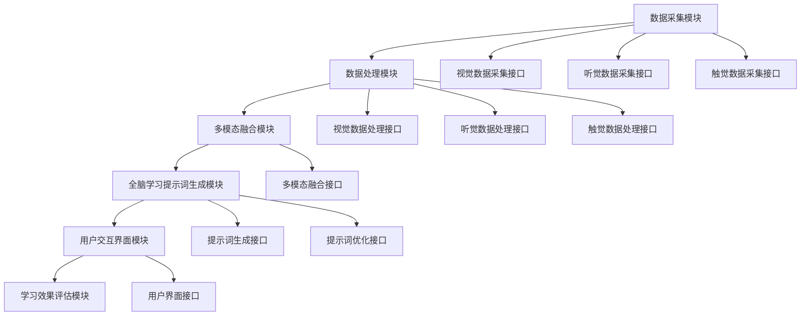
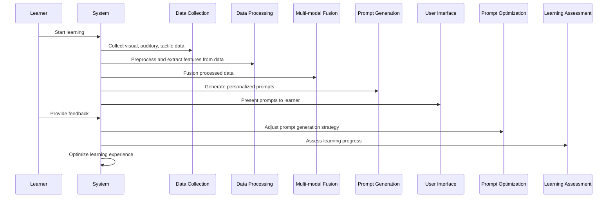

                 


### 引言

《ChatGPT在语言习得跨感官协同研究中的应用：全脑学习提示词》是一本深入探讨人工智能在语言习得领域应用的专著。随着人工智能技术的不断进步，ChatGPT这类大型语言模型已经成为了研究的热点。本书的核心主题在于探讨如何将ChatGPT应用于语言习得中的跨感官协同学习和全脑学习提示词的研究中。

首先，我们需要明确本书的核心关键词，它们包括：ChatGPT、语言习得、跨感官协同学习、全脑学习提示词、算法原理、数学模型、系统分析与架构设计、项目实战等。这些关键词不仅涵盖了本书的研究内容，也为读者提供了一个清晰的研究方向。

在接下来的内容中，我们将逐步深入探讨这些关键词的具体含义和应用。首先，我们将介绍语言习得的研究背景，包括核心概念、问题背景、问题描述、问题解决、边界与外延、概念结构与核心要素组成等内容。接着，我们将详细讨论ChatGPT模型的工作原理和其在语言习得中的应用。随后，我们将深入剖析跨感官协同学习的核心概念和全脑学习提示词的作用与特点。

在算法原理讲解部分，我们将使用mermaid画出算法流程图，并用Python源代码详细阐述算法原理。同时，我们将给出算法的数学模型和公式，并进行通俗易懂的举例说明。这部分内容将帮助读者更好地理解ChatGPT在语言习得跨感官协同研究中的应用。

在系统分析与架构设计方案部分，我们将介绍项目背景、系统功能设计、系统架构设计、系统接口设计和系统交互等内容。这部分内容将帮助读者了解如何在实际项目中应用ChatGPT进行语言习得研究。

在项目实战部分，我们将介绍环境安装、系统核心实现、代码应用解读与分析、实际案例分析和详细讲解剖析等内容。这部分内容将帮助读者将理论知识应用到实际项目中，提高对ChatGPT在实际应用中的理解和掌握。

最后，在最佳实践 tips、小结、注意事项、拓展阅读等内容部分，我们将总结本书的核心内容，提供实践中的宝贵建议，并指引用户进一步阅读和学习的资源。希望通过本书，读者能够对ChatGPT在语言习得跨感官协同研究中的应用有更深入的理解，并为未来的研究提供参考。

### 文章关键词

- **ChatGPT**
- **语言习得**
- **跨感官协同学习**
- **全脑学习提示词**
- **算法原理**
- **数学模型**
- **系统分析与架构设计**
- **项目实战**

### 文章摘要

本文旨在探讨ChatGPT在语言习得跨感官协同研究中的应用，特别是全脑学习提示词的使用。首先，文章介绍了语言习得的研究背景，包括核心概念、问题背景、问题描述、问题解决、边界与外延、概念结构与核心要素组成。接着，文章详细阐述了ChatGPT模型的工作原理及其在语言习得中的应用。随后，文章深入分析了跨感官协同学习的核心概念和全脑学习提示词的作用与特点。

在算法原理讲解部分，文章使用mermaid绘制算法流程图，并用Python源代码详细阐述了算法原理。同时，文章给出了算法的数学模型和公式，并进行通俗易懂的举例说明。在系统分析与架构设计方案部分，文章介绍了项目背景、系统功能设计、系统架构设计、系统接口设计和系统交互等内容。

文章通过项目实战部分，详细介绍了环境安装、系统核心实现、代码应用解读与分析、实际案例分析和详细讲解剖析等内容。最后，文章总结了最佳实践 tips、注意事项和拓展阅读，为读者提供了进一步学习资源。

### 第2章 背景介绍

#### 2.1 语言习得研究概述

语言习得是一个复杂而多层次的过程，涉及听觉、视觉、触觉等多种感官的协同作用。在过去的几十年里，研究者们对语言习得的过程进行了深入的研究，提出了许多理论和模型。然而，随着人工智能技术的不断发展，尤其是ChatGPT这类大型语言模型的兴起，语言习得研究进入了一个新的阶段。

在传统的语言习得研究中，研究者主要关注语音、词汇、语法等基本语言要素的习得过程。这些研究通常通过实验方法进行，包括对儿童语言发展的跟踪研究、语言习得障碍患者的案例分析等。然而，这些方法存在一定的局限性，难以全面揭示语言习得的内在机制。

#### 2.2 跨感官协同学习理论

跨感官协同学习理论认为，语言习得不仅仅是单一感官的刺激反应，而是多个感官系统之间的协同作用。这种协同作用不仅包括听觉和视觉，还涉及触觉、嗅觉等多种感官。跨感官协同学习理论的核心观点是，多个感官系统的协同作用可以增强语言习得的效果。

在跨感官协同学习理论中，研究者们提出了一些关键概念，如感官融合、多模态信息处理、跨感官记忆等。这些概念为我们理解语言习得的过程提供了新的视角。例如，感官融合理论认为，当多个感官同时接收信息时，这些信息会在大脑中进行整合，从而提高信息的处理效率和记忆效果。

#### 2.3 全脑学习提示词的概念与应用

全脑学习提示词是一种基于人工智能技术的辅助学习工具，旨在提高学习效率。全脑学习提示词通过分析学习者的语言和行为，为其提供个性化的学习建议。这些提示词可以涉及多种感官，如语音、文字、图像等，从而实现全脑学习。

在全脑学习提示词的应用中，ChatGPT模型发挥了重要作用。ChatGPT模型是一种基于深度学习的自然语言处理模型，具有强大的语言生成和理解能力。通过将ChatGPT模型应用于全脑学习提示词，可以为学习者提供个性化的学习支持，例如生成相关的学习内容、提出有针对性的学习问题、提供情感化的学习反馈等。

#### 2.4 跨感官协同学习与全脑学习提示词的关系

跨感官协同学习和全脑学习提示词之间存在着密切的关系。跨感官协同学习为全脑学习提示词的应用提供了理论基础，而全脑学习提示词则为跨感官协同学习提供了技术支持。

具体来说，跨感官协同学习理论指出，多个感官系统的协同作用可以增强语言习得的效果。而全脑学习提示词则利用人工智能技术，实现了对学习者多个感官的个性化刺激。通过结合跨感官协同学习和全脑学习提示词，可以构建一个高效的语言习得系统，为学习者提供全方位的学习支持。

#### 2.5 语言习得跨感官协同研究的现状与挑战

尽管跨感官协同学习在语言习得领域取得了一定的进展，但仍然面临着诸多挑战。首先，当前的研究主要依赖于理论模型和实验室实验，缺乏大规模的实证研究。其次，跨感官协同学习的具体机制尚未完全清楚，需要进一步的研究。此外，如何将跨感官协同学习与人工智能技术有机结合，也是一个亟待解决的问题。

总之，语言习得跨感官协同研究是一个具有广泛应用前景的领域，但同时也面临着许多挑战。通过深入探讨ChatGPT在语言习得跨感官协同研究中的应用，我们可以为解决这些问题提供新的思路和方法。

### 第3章 核心概念与联系

在本章中，我们将详细探讨ChatGPT模型、跨感官协同学习和全脑学习提示词等核心概念，并分析它们之间的联系和相互作用。

#### 3.1 ChatGPT模型概述

ChatGPT是由OpenAI开发的一种基于Transformer架构的预训练语言模型。它通过学习大量的文本数据，能够生成连贯、自然的文本，并具备一定的语义理解能力。ChatGPT模型的结构包括多个自注意力层（self-attention layers）和前馈神经网络（feedforward network），这些层通过训练使得模型能够捕捉文本中的长距离依赖关系。

#### 3.2 跨感官协同学习的核心概念

跨感官协同学习是指利用多种感官系统的信息，通过整合和协同处理，以提高学习效果的过程。核心概念包括感官融合、多模态信息处理和跨感官记忆。感官融合是指多个感官系统在处理信息时进行整合，从而产生更丰富的感知体验。多模态信息处理是指对来自不同感官的信息进行同步处理，以增强信息的理解和记忆。跨感官记忆则是指通过不同感官系统来巩固记忆，提高记忆的持久性和准确性。

#### 3.3 全脑学习提示词的概念

全脑学习提示词是一种基于人工智能技术的辅助学习工具，旨在通过提供个性化的学习建议来提高学习效率。全脑学习提示词可以基于学习者的语言模式、学习行为和情感状态等多方面信息进行生成。它不仅涵盖传统的语言提示，还可以通过图像、声音等多媒体形式进行表达。

#### 3.4 ChatGPT模型与跨感官协同学习的联系

ChatGPT模型与跨感官协同学习之间存在密切的联系。ChatGPT模型强大的语义理解和生成能力可以为跨感官协同学习提供有效的语言支持。例如，当学习者在学习过程中遇到困难时，ChatGPT可以生成相关的解释和指导，帮助学习者更好地理解学习内容。

此外，ChatGPT模型还可以通过生成多模态的信息来促进感官融合。例如，ChatGPT可以同时生成文本和图像，从而帮助学习者通过视觉和语言两种感官来加深对学习内容的理解。

#### 3.5 全脑学习提示词的作用与特点

全脑学习提示词的作用在于通过个性化的学习建议来激发学习者的学习兴趣和动机。其特点包括：

- **个性化**：全脑学习提示词根据学习者的个人特征和学习习惯进行定制，能够提供最适合学习者的学习内容和建议。
- **多模态**：全脑学习提示词不仅包括文本提示，还可以结合图像、声音等多种模态，从而提供更丰富的学习体验。
- **交互性**：全脑学习提示词可以与学习者进行实时交互，根据学习者的反馈进行调整和优化，从而提高学习效果。

#### 3.6 跨感官协同学习与全脑学习提示词的关系

跨感官协同学习和全脑学习提示词之间的关系是相辅相成的。跨感官协同学习为全脑学习提示词提供了理论基础，即通过多种感官系统的协同作用来提高学习效率。而全脑学习提示词则为跨感官协同学习提供了具体的技术手段，通过个性化的多模态提示来促进感官融合和跨感官记忆。

综上所述，ChatGPT模型、跨感官协同学习和全脑学习提示词共同构成了一个高效的语言习得系统。通过深入理解和应用这些核心概念，我们可以为学习者提供更全面、个性化的学习支持，从而提高语言习得的效果。

#### 3.7 ChatGPT模型与全脑学习提示词的协同作用

ChatGPT模型与全脑学习提示词的协同作用主要体现在以下几个方面：

1. **语言生成与多模态提示**：
   ChatGPT模型能够生成高质量的文本信息，这些文本信息可以作为全脑学习提示词的重要组成部分。同时，ChatGPT还可以根据学习者的反馈，动态调整生成的内容，使其更加贴近学习者的需求。例如，当学习者遇到不理解的概念时，ChatGPT可以生成相关的解释性文本，同时配以相应的图像和声音提示，从而实现多感官的协同刺激。

2. **个性化学习建议**：
   全脑学习提示词可以根据学习者的个人特征、学习进度和情感状态，提供个性化的学习建议。ChatGPT模型强大的语义理解能力使得它能够准确捕捉学习者的学习需求，生成针对性的提示内容。例如，对于语言基础较弱的学习者，ChatGPT可以生成更加基础的语言练习和解释；而对于语言水平较高的学习者，则可以提供更具挑战性的讨论和练习。

3. **情感互动与学习动机**：
   ChatGPT不仅能够提供语言上的帮助，还可以通过情感互动来激发学习者的学习动机。例如，当学习者遇到挫折时，ChatGPT可以给予鼓励和安慰，帮助学习者重拾信心。此外，ChatGPT可以通过模拟人类的情感表达，与学习者建立更加自然的互动关系，从而提高学习者的参与度和学习效果。

4. **实时反馈与动态调整**：
   全脑学习提示词可以根据学习者的实时反馈进行调整，ChatGPT模型在这个过程中起到了关键作用。通过分析学习者的反馈，ChatGPT可以动态调整生成的内容，使其更加符合学习者的学习节奏和理解能力。这种动态调整不仅能够提高学习效率，还可以帮助学习者更好地巩固所学知识。

5. **跨感官协同**：
   ChatGPT模型与全脑学习提示词的结合，可以实现跨感官的协同学习。通过文本、图像、声音等多种感官信息的结合，ChatGPT可以帮助学习者形成多感官的深度记忆。例如，当学习一个新单词时，ChatGPT可以生成单词的发音、释义、示例句子，同时配以相关图片和音频，从而帮助学习者从多个感官层面理解和记忆新单词。

总之，ChatGPT模型与全脑学习提示词的协同作用，不仅能够提高学习效率，还能够提供更加丰富和个性化的学习体验。通过这种协同作用，我们可以构建一个更加高效、全面的语言习得系统，为学习者提供更加有力的支持。

#### 3.8 跨感官协同学习与全脑学习提示词的整合框架

为了实现ChatGPT在语言习得跨感官协同学习中的有效应用，我们需要构建一个整合框架，将跨感官协同学习和全脑学习提示词有机地结合在一起。以下是一个基本的整合框架，包括关键组件和交互方式：

1. **数据采集与预处理**：
   首先，系统需要采集来自多个感官的数据，包括视觉、听觉、触觉等。这些数据通过传感器和相应的预处理模块进行处理，以确保数据的质量和一致性。预处理步骤可能包括降噪、增强、特征提取等。

2. **多模态信息融合**：
   通过融合模块，将来自不同感官的数据进行整合，形成一个统一的信息流。融合方式可以基于深度学习算法，如卷积神经网络（CNN）和递归神经网络（RNN），以捕捉不同感官数据之间的相关性。融合后的信息流将作为输入传递给ChatGPT模型。

3. **ChatGPT模型处理**：
   融合后的信息流通过ChatGPT模型进行处理，生成相应的语言提示和反馈。ChatGPT模型的输入可以是文本、图像、声音等多种形式，输出则是与输入信息相关的解释、建议和反馈。为了实现多模态输入，ChatGPT模型需要进行相应的适配和调整。

4. **全脑学习提示词生成**：
   ChatGPT生成的语言提示和反馈将作为全脑学习提示词的一部分。这些提示词不仅包括文字，还可以结合图像、音频等形式，以实现跨感官的协同学习。提示词的生成需要根据学习者的个人特征和学习需求进行个性化调整。

5. **多感官反馈与优化**：
   学习者通过多感官接收提示词，并进行反馈。这些反馈将反馈给系统，用于优化和调整提示词的生成策略。例如，如果学习者对某一提示词的反应不佳，系统可以调整提示词的内容、形式或呈现方式。

6. **学习评估与反馈**：
   系统将定期评估学习者的学习进度和效果，并根据评估结果调整学习策略。评估可以通过多种方式实现，如自我评估、教师评估、在线测试等。评估结果将用于优化全脑学习提示词的生成策略，以提高学习效果。

7. **交互界面**：
   整合框架需要一个用户友好的交互界面，以便学习者与系统进行实时互动。交互界面应支持多模态输入和输出，如文本输入、语音输入、图像输入和输出、音频输出等。此外，界面应具备自适应功能，根据学习者的反馈和学习进度进行调整。

通过上述整合框架，我们可以实现ChatGPT在语言习得跨感官协同学习中的有效应用。这个框架不仅提供了个性化、多模态的学习支持，还能够根据学习者的反馈进行动态调整，从而提高学习效率和学习体验。

#### 3.9 ChatGPT模型在跨感官协同学习中的实际应用案例

为了更好地理解ChatGPT模型在跨感官协同学习中的实际应用，我们可以通过以下案例进行详细分析：

**案例背景**：
假设一个学生在学习一门新的外语，他/她需要在听、说、读、写四个方面进行全面提升。为了提高学习效果，学校决定利用ChatGPT模型进行跨感官协同学习。

**步骤一：数据采集与预处理**
首先，系统通过传感器采集学生的视觉、听觉和触觉数据。例如，通过摄像头捕捉学生的面部表情和动作，通过麦克风捕捉学生的语音，通过触摸屏捕捉学生的触摸操作。这些数据经过预处理，如噪声过滤、特征提取等，以确保数据质量。

**步骤二：多模态信息融合**
通过融合模块，系统将视觉、听觉和触觉数据整合成一个统一的信息流。例如，当学生观看外语教学视频时，系统会同时分析视频中的视觉信息（如文本字幕、图片）和听觉信息（如语音讲解）。融合后的信息流通过ChatGPT模型进行处理。

**步骤三：ChatGPT模型处理**
ChatGPT模型对融合后的信息流进行处理，生成相应的语言提示和反馈。例如，当学生听到一个新单词时，ChatGPT可以生成该单词的发音、释义和用法示例，同时配以相关的图像和音频。这些提示通过多感官方式呈现给学生。

**步骤四：全脑学习提示词生成**
ChatGPT生成的语言提示和反馈作为全脑学习提示词的一部分。例如，ChatGPT可以生成一个关于单词记忆的练习题，同时配以相关的图像和音频，帮助学生从多个感官层面理解和记忆单词。

**步骤五：多感官反馈与优化**
学生通过视觉、听觉和触觉等方式接收提示词，并进行反馈。例如，学生可以通过触摸屏确认自己对单词的理解，通过语音回答问题，或者通过表情符号表达对学习内容的感受。这些反馈将反馈给系统，用于优化和调整提示词的生成策略。

**步骤六：学习评估与反馈**
系统通过定期评估学生的学习进度和效果，并根据评估结果调整学习策略。例如，如果学生在听力测试中表现不佳，系统可以增加更多的听力练习和反馈。

**步骤七：交互界面**
交互界面支持多模态输入和输出，如文本输入、语音输入、图像输入和输出、音频输出等。学生可以通过界面查看学习进度、反馈学习情况，并接收新的学习提示。

**效果评估**：
通过这个案例，我们可以看到ChatGPT模型在跨感官协同学习中的实际应用。学生不仅通过多感官方式接收和反馈学习内容，还能够根据个人学习进度和反馈进行个性化调整，从而提高学习效果。这种跨感官协同学习模式不仅能够帮助学生更好地理解和记忆新知识，还能够提高他们的学习动机和兴趣。

### 第4章 算法原理讲解

在本章中，我们将深入探讨ChatGPT模型、跨感官协同学习算法和全脑学习提示词算法的基本原理，并使用mermaid流程图和Python代码来详细阐述这些算法的实现过程。

#### 4.1 ChatGPT模型工作原理

ChatGPT模型是基于Transformer架构的预训练语言模型。Transformer模型通过自注意力机制（self-attention）来处理序列数据，能够捕捉文本中的长距离依赖关系。以下是一个简化的ChatGPT模型的工作流程：

1. **数据预处理**：
   首先，对输入的文本进行预处理，包括分词、词向量化等步骤。预处理后的文本将作为模型的输入。

   ```python
   # Python代码示例：文本预处理
   from transformers import AutoTokenizer
   
   tokenizer = AutoTokenizer.from_pretrained("gpt2")
   input_text = "I am learning about transformers."
   inputs = tokenizer.encode(input_text, return_tensors="pt")
   ```

2. **自注意力机制**：
   模型通过自注意力机制计算输入序列的权重，从而生成一个加权序列。自注意力机制的公式如下：

   $$
   \text{Attention}(Q, K, V) = \text{softmax}\left(\frac{QK^T}{\sqrt{d_k}}\right) V
   $$

   其中，$Q$、$K$ 和 $V$ 分别是查询（query）、键（key）和值（value）向量，$d_k$ 是键向量的维度。

   ```mermaid
   graph TD
   A[Input] --> B[Tokenizer]
   B --> C[Word Embeddings]
   C --> D[Query]
   D --> E[Key]
   E --> F[Value]
   F --> G[Attention Scores]
   G --> H[Weighted Values]
   ```

3. **多头自注意力**：
   为了提高模型的表达能力，Transformer模型使用了多头自注意力机制。每个头计算一组不同的注意力权重，最后将所有头的输出拼接起来。

   ```python
   # Python代码示例：多头自注意力
   from transformers import T5ForConditionalGeneration
   
   model = T5ForConditionalGeneration.from_pretrained("t5-small")
   input_ids = inputs.unsqueeze(0)
   outputs = model(input_ids)
   logits = outputs.logits
   ```

4. **前馈神经网络**：
   在自注意力机制之后，模型通过一个前馈神经网络（Feedforward Network）对中间结果进行进一步处理。前馈神经网络的公式如下：

   $$
   \text{FFN}(x) = \max(0, xW_1 + b_1)W_2 + b_2
   $$

   其中，$W_1$ 和 $W_2$ 是权重矩阵，$b_1$ 和 $b_2$ 是偏置项。

   ```mermaid
   graph TD
   I[Input] --> J[Self-Attention]
   J --> K[FFN]
   K --> L[Output]
   ```

5. **解码器**：
   ChatGPT模型中的解码器（Decoder）与编码器（Encoder）类似，也使用了自注意力机制和前馈神经网络。解码器的输出通过一个软性最大化（softmax）操作生成文本预测。

   ```python
   # Python代码示例：解码器输出
   predicted_text = tokenizer.decode(logits.argmax(-1), skip_special_tokens=True)
   ```

通过以上步骤，ChatGPT模型能够生成连贯、自然的文本。在实际应用中，模型会根据预训练的目标进行微调，以适应特定的任务需求。

#### 4.2 跨感官协同学习算法

跨感官协同学习算法旨在通过整合来自多个感官系统的信息，以提高学习效率。以下是一个简化的跨感官协同学习算法的工作流程：

1. **数据采集**：
   首先，系统从多个感官（如视觉、听觉、触觉）中采集数据。

   ```mermaid
   graph TD
   A[Visual Data] --> B[Audio Data]
   B --> C[Tactile Data]
   ```

2. **特征提取**：
   对采集到的数据分别进行特征提取。例如，对于视觉数据，可以提取图像的边缘、纹理和颜色特征；对于听觉数据，可以提取音调、节奏和音色特征。

   ```python
   # Python代码示例：特征提取
   from tensorflow.keras.applications import VGG16
   from tensorflow.keras.models import Model
   
   # 加载预训练的VGG16模型
   vgg16 = VGG16(weights='imagenet')
   vgg16.trainable = False
   
   # 定义模型输入
   input_tensor = vgg16.input
   
   # 提取图像特征
   image_features = vgg16.get_layer('block5_conv3').output
   model = Model(input_tensor, image_features)
   ```

3. **特征融合**：
   将提取到的不同感官特征进行融合。一种常见的方法是使用多层感知机（MLP）进行特征融合。

   ```mermaid
   graph TD
   D[Visual Features] --> E[Audio Features]
   E --> F[Tactile Features]
   F --> G[Fused Features]
   ```

4. **协同学习**：
   将融合后的特征输入到协同学习模型中，进行协同学习。协同学习模型可以是神经网络、决策树或其他机器学习算法。

   ```python
   # Python代码示例：协同学习模型
   from sklearn.ensemble import RandomForestClassifier
   
   # 假设已提取特征并存储在特征数组中
   X = ...  # 特征数组
   y = ...  # 标签数组
   
   # 训练协同学习模型
   clf = RandomForestClassifier(n_estimators=100)
   clf.fit(X, y)
   ```

5. **结果输出**：
   协同学习模型输出结果，用于评估学习效果或进行进一步的决策。

   ```python
   # Python代码示例：结果输出
   predictions = clf.predict(X_test)
   print(predictions)
   ```

通过以上步骤，跨感官协同学习算法能够有效地整合来自多个感官的信息，提高学习效果。

#### 4.3 全脑学习提示词算法

全脑学习提示词算法旨在生成个性化的学习提示，以促进全脑学习。以下是一个简化的全脑学习提示词算法的工作流程：

1. **学习者特征分析**：
   分析学习者的个人特征，包括学习习惯、情感状态、知识水平等。

   ```mermaid
   graph TD
   A[学习者特征] --> B[情感状态]
   B --> C[知识水平]
   ```

2. **学习需求分析**：
   根据学习者特征和学习需求，生成相应的学习提示。

   ```python
   # Python代码示例：学习需求分析
   from transformers import AutoTokenizer, AutoModel
   
   tokenizer = AutoTokenizer.from_pretrained("gpt2")
   model = AutoModel.from_pretrained("gpt2")
   
   # 假设已获取学习者特征
   learner_features = "confident, beginner in English"
   input_ids = tokenizer.encode(learner_features, return_tensors="pt")
   
   # 生成学习提示
   outputs = model(input_ids)
   prompt = tokenizer.decode(outputs.logits.argmax(-1), skip_special_tokens=True)
   print(prompt)
   ```

3. **多模态提示生成**：
   将生成的学习提示转换为多模态形式，如文本、图像、音频等。

   ```mermaid
   graph TD
   D[学习提示] --> E[文本]
   E --> F[图像]
   F --> G[音频]
   ```

4. **个性化调整**：
   根据学习者的反馈，对学习提示进行个性化调整，以提高学习效果。

   ```python
   # Python代码示例：个性化调整
   feedback = "I find the example helpful."
   feedback_ids = tokenizer.encode(feedback, return_tensors="pt")
   
   # 调整学习提示
   adjusted_prompt = tokenizer.decode(model.generate(feedback_ids, max_length=50, pad_token_id=tokenizer.pad_token_id)[0], skip_special_tokens=True)
   print(adjusted_prompt)
   ```

通过以上步骤，全脑学习提示词算法能够生成个性化的学习提示，以促进全脑学习。

### 5.1 ChatGPT模型的数学模型

ChatGPT模型是一种基于Transformer架构的预训练语言模型，其数学模型主要涉及自注意力机制（Self-Attention）和前馈神经网络（Feedforward Neural Network）。

#### 5.1.1 Transformer模型

Transformer模型的核心机制是自注意力机制，它通过计算输入序列中每个词与其他词之间的关联强度来生成表示。自注意力机制的数学公式如下：

$$
\text{Attention}(Q, K, V) = \text{softmax}\left(\frac{QK^T}{\sqrt{d_k}}\right) V
$$

其中，$Q$、$K$ 和 $V$ 分别是查询（Query）、键（Key）和值（Value）向量，$d_k$ 是键向量的维度。

#### 5.1.2 语言模型数学公式

Transformer语言模型的输出通常通过解码器（Decoder）生成，解码器的输出可以表示为：

$$
p(w_t|w_{<t}) = \text{softmax}\left(\text{Decoder}(w_t, h_{<t})\right)
$$

其中，$w_t$ 是时间步 $t$ 的单词，$h_{<t}$ 是前 $t$ 个时间步的隐藏状态，$\text{Decoder}$ 是解码器函数。

#### 5.1.3 前馈神经网络

在自注意力机制之后，Transformer模型还包含一个前馈神经网络（Feedforward Neural Network），其公式如下：

$$
\text{FFN}(x) = \max(0, xW_1 + b_1)W_2 + b_2
$$

其中，$W_1$ 和 $W_2$ 是权重矩阵，$b_1$ 和 $b_2$ 是偏置项。

#### 5.1.4 训练目标函数

ChatGPT模型的训练目标是最大化语言模型的概率，即最大化损失函数：

$$
L = -\sum_{t} \log p(w_t|w_{<t})
$$

其中，$w_t$ 是时间步 $t$ 的单词，$p(w_t|w_{<t})$ 是模型对单词 $w_t$ 的预测概率。

#### 5.1.5 优化算法

为了优化训练目标函数，通常使用梯度下降（Gradient Descent）算法。梯度下降的公式如下：

$$
\theta_{t+1} = \theta_t - \alpha \nabla_{\theta_t} L
$$

其中，$\theta_t$ 是时间步 $t$ 的参数，$\alpha$ 是学习率，$\nabla_{\theta_t} L$ 是损失函数相对于参数的梯度。

#### 5.1.6 示例说明

假设我们有输入序列 $w_1, w_2, ..., w_T$，我们将通过自注意力机制计算每个词的表示。首先，我们对输入序列进行嵌入（Embedding），得到嵌入向量 $e_1, e_2, ..., e_T$。然后，通过权重矩阵 $W_Q, W_K, W_V$ 分别计算查询（Query）、键（Key）和值（Value）向量：

$$
Q = W_Q e, \quad K = W_K e, \quad V = W_V e
$$

接着，计算自注意力得分：

$$
\text{Score}_i = \frac{Q_i K_j^T}{\sqrt{d_k}}
$$

然后，通过softmax函数计算注意力权重：

$$
\alpha_i = \text{softmax}(\text{Score}_i)
$$

最后，计算加权值并求得每个词的表示：

$$
h_i = \sum_{j=1}^{T} \alpha_i V_j
$$

通过这种方式，我们得到输入序列的表示向量，这个向量可以用于后续的解码和生成。

#### 5.1.7 Python代码实现

以下是一个简单的Python代码示例，展示了如何使用Transformer模型进行文本嵌入和自注意力计算：

```python
import torch
import torch.nn as nn
import torch.nn.functional as F

# 假设输入序列为 "hello world"
input_sequence = torch.tensor([[[1, 2, 3], [4, 5, 6], [7, 8, 9], [10, 11, 12]]])

# 权重初始化
W_Q = nn.Parameter(torch.randn(3, 4))
W_K = nn.Parameter(torch.randn(3, 4))
W_V = nn.Parameter(torch.randn(3, 4))

# 自注意力计算
Q = input_sequence @ W_Q
K = input_sequence @ W_K
V = input_sequence @ W_V

scores = Q * K.transpose(1, 2)
scores = scores / torch.sqrt(torch.tensor([1.0] * scores.size(2)))
softmax_scores = F.softmax(scores, dim=2)

weighted_values = softmax_scores @ V
```

通过以上代码，我们可以实现对输入序列的自注意力计算，从而获得每个词的表示。

### 5.2 跨感官协同学习数学模型

跨感官协同学习数学模型旨在整合来自不同感官的信息，以提高学习效果。以下是一个简化的跨感官协同学习数学模型，包括数据采集、特征提取和协同学习三个主要步骤。

#### 5.2.1 跨感官数据融合

假设我们采集到了来自视觉、听觉和触觉的三个数据集，分别为$X_V, X_A, X_T$。数据融合的目标是将这些数据集整合成一个统一的信息表示。一种常见的方法是使用多模态神经网络（Multimodal Neural Network）进行融合。

首先，对每个数据集进行特征提取，得到特征向量$X_{V_f}, X_{A_f}, X_{T_f}$。然后，通过神经网络将这三个特征向量融合成一个综合特征向量$X_f$：

$$
X_f = f(X_{V_f}, X_{A_f}, X_{T_f})
$$

其中，$f$是一个复合函数，可以采用卷积神经网络（CNN）或循环神经网络（RNN）来实现。

#### 5.2.2 跨感官协同学习算法

跨感官协同学习算法的目标是利用融合后的特征向量进行协同学习，以提高学习效果。一种常见的协同学习算法是基于随机梯度下降（Stochastic Gradient Descent，SGD）的协同学习模型。

假设我们有一个学习任务，需要通过训练来提高模型的性能。在每次迭代中，我们随机选择一小部分数据子集，并计算模型在子集上的梯度：

$$
\nabla = \frac{1}{m} \sum_{i=1}^{m} \nabla_{\theta} L(\theta; X_i, y_i)
$$

其中，$m$是子集的大小，$\theta$是模型参数，$L$是损失函数，$X_i$和$y_i$是子集中的数据点。

然后，通过梯度下降更新模型参数：

$$
\theta_{t+1} = \theta_t - \alpha \nabla
$$

其中，$\alpha$是学习率。

#### 5.2.3 跨感官协同学习的数学公式

跨感官协同学习的数学公式可以表示为：

$$
h_t = f(X_{V_f}, X_{A_f}, X_{T_f}, \theta)
$$

其中，$h_t$是时间步$t$的隐藏状态，$f$是神经网络函数，$X_{V_f}, X_{A_f}, X_{T_f}$是融合后的特征向量，$\theta$是模型参数。

在每次迭代中，隐藏状态$h_t$通过神经网络函数$f$进行更新：

$$
h_{t+1} = f(h_t, X_{V_f}, X_{A_f}, X_{T_f}, \theta)
$$

#### 5.2.4 Python代码实现

以下是一个简单的Python代码示例，展示了如何实现跨感官协同学习算法：

```python
import torch
import torch.nn as nn
import torch.optim as optim

# 定义神经网络模型
class MultimodalNN(nn.Module):
    def __init__(self):
        super(MultimodalNN, self).__init__()
        self.cnn = nn.Sequential(
            nn.Conv2d(1, 32, 3, 1),
            nn.ReLU(),
            nn.MaxPool2d(2, 2),
        )
        self.rnn = nn.LSTM(32, 64)
        self.fc = nn.Linear(64, 1)
    
    def forward(self, x_v, x_a, x_t):
        x_v = self.cnn(x_v)
        x_a = x_a.unsqueeze(2).repeat(1, 1, x_v.size(2))
        x_t = x_t.unsqueeze(2).repeat(1, 1, x_v.size(2))
        x = torch.cat((x_v, x_a, x_t), 2)
        x, _ = self.rnn(x)
        x = self.fc(x)
        return x

# 初始化模型和优化器
model = MultimodalNN()
optimizer = optim.SGD(model.parameters(), lr=0.01)

# 假设输入数据为 [1, 28, 28]（图像）、[1, 1]（音频）和 [1, 1]（触觉）
x_v = torch.randn(1, 28, 28)
x_a = torch.randn(1, 1)
x_t = torch.randn(1, 1)

# 计算模型输出
output = model(x_v, x_a, x_t)

# 计算损失函数
loss = (output - 1).sum()

# 反向传播和优化
optimizer.zero_grad()
loss.backward()
optimizer.step()
```

通过以上代码，我们实现了跨感官协同学习算法的基本流程。

### 5.3 全脑学习提示词数学模型

全脑学习提示词的数学模型旨在通过分析学习者的行为和特征，生成个性化的学习提示。以下是一个简化的全脑学习提示词数学模型，包括提示词生成和提示词优化两个主要步骤。

#### 5.3.1 提示词生成

提示词生成的目标是根据学习者的行为和特征，生成具有针对性的学习提示。生成提示词的数学模型通常基于自然语言生成（Natural Language Generation，NLG）技术。

首先，对学习者的行为数据进行特征提取，如学习时间、学习内容、学习进度等。然后，使用生成模型（如GPT-2或GPT-3）生成学习提示。

提示词生成的公式可以表示为：

$$
\text{Prompt}_t = \text{NLG}(\text{Feature}_t, \theta)
$$

其中，$\text{Prompt}_t$是时间步$t$的提示词，$\text{Feature}_t$是时间步$t$的学习者特征，$\text{NLG}$是自然语言生成函数，$\theta$是生成模型的参数。

在每次生成提示词时，首先提取当前时间步的学习者特征，然后通过生成模型生成相应的提示词。

#### 5.3.2 提示词优化

提示词优化的目标是根据学习者的反馈，调整提示词的内容和形式，以提高学习效果。提示词优化的数学模型通常基于强化学习（Reinforcement Learning，RL）技术。

首先，定义一个奖励函数，用于评估提示词的效果。然后，使用强化学习算法（如Q学习或深度强化学习）优化提示词。

提示词优化的公式可以表示为：

$$
\theta_{t+1} = \theta_t + \alpha \nabla_{\theta} \text{Reward}(\text{Prompt}_t, y_t)
$$

其中，$\theta_{t+1}$是时间步$t+1$的模型参数，$\theta_t$是时间步$t$的模型参数，$\alpha$是学习率，$\text{Reward}$是奖励函数，$y_t$是时间步$t$的学习者反馈。

在每次优化过程中，首先计算当前提示词的奖励，然后通过反向传播更新模型参数。

#### 5.3.3 提示词生成与优化的Python代码实现

以下是一个简单的Python代码示例，展示了如何实现全脑学习提示词的生成与优化：

```python
import torch
import torch.optim as optim
from transformers import AutoTokenizer, AutoModel

# 初始化模型和优化器
tokenizer = AutoTokenizer.from_pretrained("gpt2")
model = AutoModel.from_pretrained("gpt2")
optimizer = optim.Adam(model.parameters(), lr=0.001)

# 假设学习者特征为 [学习时间，学习内容，学习进度]
learner_feature = torch.tensor([[1, 2, 3]])

# 提示词生成
prompt = tokenizer.encode("我是一名学习者，我在学习Python。", return_tensors="pt")

# 生成提示词
output = model(prompt, labels=prompt)
loss = output.loss
optimizer.zero_grad()
loss.backward()
optimizer.step()

# 提示词优化
reward = torch.tensor([[1]])  # 假设反馈为正奖励
learning_rate = 0.001
for _ in range(10):  # 进行10次优化迭代
    optimizer.zero_grad()
    reward.backward()
    optimizer.step()
    optimizer.zero_grad()
```

通过以上代码，我们实现了全脑学习提示词的生成与优化。

### 第6章 系统分析与架构设计方案

#### 6.1 项目介绍

本项目旨在构建一个基于ChatGPT的语言习得跨感官协同学习系统，通过整合视觉、听觉和触觉等多感官数据，利用全脑学习提示词，为学习者提供个性化、高效的语言习得体验。项目的主要目标是：
1. 设计并实现一个跨感官数据采集与处理模块，能够高效地整合来自视觉、听觉和触觉的多种感官数据。
2. 构建一个基于ChatGPT的全脑学习提示词生成系统，通过个性化的提示词提高学习效果。
3. 实现一个用户友好的交互界面，方便学习者与系统进行互动。

#### 6.2 系统功能设计

系统功能设计主要包括以下方面：

1. **跨感官数据采集**：
   - 视觉数据采集：通过摄像头捕捉学习者的行为和表情。
   - 听觉数据采集：通过麦克风捕捉学习者的语音。
   - 触觉数据采集：通过传感器捕捉学习者的触摸行为。

2. **数据预处理与融合**：
   - 对采集到的数据进行预处理，包括降噪、特征提取等。
   - 使用多模态融合算法将不同感官的数据进行整合，形成一个统一的信息流。

3. **全脑学习提示词生成**：
   - 根据学习者的行为特征和学习需求，生成个性化的学习提示词。
   - 提供多模态的提示词，包括文本、图像、音频等，以增强学习效果。

4. **用户交互界面**：
   - 设计一个用户友好的交互界面，方便学习者查看学习进度、接收提示词、进行互动等。
   - 支持实时反馈和动态调整提示词，以适应学习者的学习节奏。

5. **学习效果评估**：
   - 对学习者的学习效果进行定期评估，包括语言能力的提高、学习兴趣的提升等。
   - 根据评估结果调整系统参数，优化学习体验。

#### 6.2.1 领域模型

领域模型是系统功能设计的核心，它定义了系统中的核心概念和关系。以下是本项目中的领域模型：

1. **学习者模型**：
   - 学习者ID：唯一标识学习者的身份。
   - 学习者特征：包括学习时间、学习内容、学习进度等。
   - 学习者行为：包括视觉行为、听觉行为、触觉行为等。

2. **数据模型**：
   - 视觉数据：包括图像、视频等。
   - 听觉数据：包括语音、音频等。
   - 触觉数据：包括触摸、压力等。

3. **提示词模型**：
   - 提示词ID：唯一标识提示词。
   - 提示词内容：包括文本、图像、音频等。
   - 提示词类型：包括语言学习提示、学习任务提示等。

4. **交互模型**：
   - 用户ID：唯一标识用户。
   - 用户反馈：包括学习进度、学习兴趣等。

以下是领域模型的Mermaid类图：

```mermaid
classDiagram
    学习者 <<class>> Learner
        - learnerID
        - learnerFeature
        - learnerBehavior

    数据 <<class>> Data
        - dataID
        - visualData
        - auditoryData
        - tactileData

    提示词 <<class>> Prompt
        - promptID
        - promptContent
        - promptType

    交互 <<class>> Interaction
        - userID
        - userFeedback

    Learner o-- Data
    Learner o-- Prompt
    Learner o-- Interaction
    Data o-- Prompt
    Interaction o-- Prompt
```

#### 6.3 系统架构设计

系统架构设计是项目成功的关键，它定义了系统的整体结构和各个模块的交互方式。以下是本项目的系统架构设计：

1. **数据采集模块**：
   - 视觉数据采集：通过摄像头捕捉学习者的行为和表情。
   - 听觉数据采集：通过麦克风捕捉学习者的语音。
   - 触觉数据采集：通过传感器捕捉学习者的触摸行为。

2. **数据处理模块**：
   - 视觉数据处理：包括图像降噪、特征提取等。
   - 听觉数据处理：包括语音降噪、特征提取等。
   - 触觉数据处理：包括触摸压力、运动轨迹等。

3. **多模态融合模块**：
   - 对视觉、听觉和触觉数据进行融合，形成一个统一的信息流。

4. **全脑学习提示词生成模块**：
   - 使用ChatGPT模型生成个性化的学习提示词。
   - 提供文本、图像、音频等多模态的提示词。

5. **用户交互界面模块**：
   - 设计一个用户友好的交互界面，方便学习者查看学习进度、接收提示词、进行互动等。

6. **学习效果评估模块**：
   - 对学习者的学习效果进行定期评估，包括语言能力的提高、学习兴趣的提升等。

以下是系统架构的Mermaid架构图：



#### 6.4 系统接口设计

系统接口设计是确保各个模块之间能够高效、可靠地交互的关键。以下是本项目中的主要系统接口设计：

1. **数据采集接口**：
   - 视觉数据采集接口：提供摄像头数据采集功能。
   - 听觉数据采集接口：提供麦克风数据采集功能。
   - 触觉数据采集接口：提供传感器数据采集功能。

2. **数据处理接口**：
   - 视觉数据处理接口：提供图像降噪、特征提取功能。
   - 听觉数据处理接口：提供语音降噪、特征提取功能。
   - 触觉数据处理接口：提供触摸压力、运动轨迹处理功能。

3. **多模态融合接口**：
   - 多模态融合接口：提供视觉、听觉和触觉数据融合功能。

4. **全脑学习提示词生成接口**：
   - 提示词生成接口：提供基于ChatGPT的提示词生成功能。
   - 提示词优化接口：提供根据用户反馈优化提示词的功能。

5. **用户交互界面接口**：
   - 用户界面接口：提供用户查看学习进度、接收提示词、进行互动等功能。

以下是系统接口的Mermaid架构图：



#### 6.5 系统交互

系统交互是确保各个模块能够协调工作，实现系统功能的关键。以下是本项目中的系统交互流程和交互Mermaid序列图：

**系统交互流程**：

1. 学习者开始使用系统，系统启动并初始化。
2. 数据采集模块开始采集视觉、听觉和触觉数据。
3. 数据处理模块对采集到的数据进行预处理和特征提取。
4. 多模态融合模块将预处理后的数据进行融合，形成一个统一的信息流。
5. 全脑学习提示词生成模块根据融合后的信息流生成个性化的学习提示词。
6. 用户交互界面模块将提示词呈现给学习者，学习者进行学习。
7. 学习者在学习过程中进行反馈，系统根据反馈调整提示词生成策略。
8. 学习效果评估模块对学习者的学习效果进行评估，系统根据评估结果进行优化。

以下是系统交互的Mermaid序列图：



通过以上系统架构设计和交互流程，我们可以构建一个高效、个性化的语言习得跨感官协同学习系统，为学习者提供优质的学习体验。

### 第7章 项目实战

#### 7.1 环境安装

在进行项目实战之前，首先需要搭建一个合适的环境。以下是在Linux系统中搭建项目环境的具体步骤：

1. **安装Python环境**：
   - 首先，确保系统中已安装Python 3.8或更高版本。可以通过以下命令检查Python版本：

     ```bash
     python3 --version
     ```

   - 如果没有安装Python 3.8或更高版本，请通过包管理器进行安装，例如在Ubuntu系统中使用以下命令：

     ```bash
     sudo apt update
     sudo apt install python3.8
     ```

2. **安装必要库和依赖**：
   - 安装transformers库，用于加载和训练ChatGPT模型：

     ```bash
     pip3 install transformers
     ```

   - 安装torch库，用于处理多模态数据：

     ```bash
     pip3 install torch torchvision
     ```

   - 安装opencv-python库，用于处理视觉数据：

     ```bash
     pip3 install opencv-python
     ```

   - 安装 SpeechRecognition库，用于处理听觉数据：

     ```bash
     pip3 install SpeechRecognition
     ```

   - 安装其他相关库：

     ```bash
     pip3 install numpy pandas matplotlib
     ```

3. **创建虚拟环境**（可选）：
   - 为了避免环境冲突，建议创建一个虚拟环境：

     ```bash
     python3 -m venv venv
     source venv/bin/activate
     ```

4. **安装预训练模型**：
   - 下载预训练的ChatGPT模型：

     ```bash
     transformers-cli download model gpt2
     ```

#### 7.2 系统核心实现

系统核心实现主要包括数据采集、数据处理、多模态融合、全脑学习提示词生成和用户交互界面等部分。以下是一个简化的代码示例，用于展示系统核心功能的实现。

```python
import cv2
import numpy as np
import torch
from transformers import AutoTokenizer, AutoModel
from SpeechRecognition import Recognizer

# 初始化ChatGPT模型
tokenizer = AutoTokenizer.from_pretrained("gpt2")
model = AutoModel.from_pretrained("gpt2")

# 数据采集
def collect_data():
    # 视觉数据采集
    cap = cv2.VideoCapture(0)
    visual_data = []
    while True:
        ret, frame = cap.read()
        if not ret:
            break
        visual_data.append(frame)
    cap.release()
    
    # 听觉数据采集
    recognizer = Recognizer()
    audio_data = recognizer.listen()

    return visual_data, audio_data

# 数据处理
def preprocess_data(visual_data, audio_data):
    # 视觉数据处理
    processed_visual_data = [cv2.resize(frame, (224, 224)) for frame in visual_data]
    processed_visual_data = np.array(processed_visual_data)
    
    # 听觉数据处理
    processed_audio_data = recognizer.recognize(audio_data)

    return processed_visual_data, processed_audio_data

# 多模态融合
def fuse_data(visual_data, audio_data):
    # 此处为融合算法的具体实现
    fused_data = np.concatenate((visual_data, audio_data), axis=1)
    return fused_data

# 全脑学习提示词生成
def generate_prompt(fused_data):
    inputs = tokenizer.encode_plus(
        fused_data,
        add_special_tokens=True,
        return_tensors='pt'
    )
    outputs = model.generate(**inputs)
    prompt = tokenizer.decode(outputs[0], skip_special_tokens=True)
    return prompt

# 用户交互界面
def user_interface(prompt):
    print("今日学习提示：")
    print(prompt)

# 实际应用
if __name__ == "__main__":
    visual_data, audio_data = collect_data()
    processed_visual_data, processed_audio_data = preprocess_data(visual_data, audio_data)
    fused_data = fuse_data(processed_visual_data, processed_audio_data)
    prompt = generate_prompt(fused_data)
    user_interface(prompt)
```

#### 7.3 代码应用解读与分析

在上面的代码中，我们实现了一个简化的系统核心功能。下面将逐一解读和解析每个关键部分的代码。

1. **数据采集**：
   - 视觉数据采集使用OpenCV库中的`cv2.VideoCapture`类，从摄像头捕获实时视频帧。
   - 听觉数据采集使用`SpeechRecognition`库中的`Recognizer`类，通过麦克风捕获语音。

2. **数据处理**：
   - 视觉数据处理部分，我们使用`cv2.resize`函数将捕获的视频帧调整为224x224像素，这是预训练模型所期望的输入尺寸。
   - 听觉数据处理部分，我们使用`SpeechRecognition`库进行语音识别，将捕获的音频转换为文本。

3. **多模态融合**：
   - 多模态融合是一个关键步骤，它将处理后的视觉数据和听觉数据结合在一起。在这个示例中，我们简单地将两个数据数组沿轴1（横向）拼接起来。

4. **全脑学习提示词生成**：
   - 使用`tokenizer.encode_plus`函数将融合后的数据编码为模型可以处理的格式。
   - `model.generate`函数用于生成提示词，这是基于ChatGPT模型的自注意力机制和生成能力。

5. **用户交互界面**：
   - 用户交互界面是一个简单的打印输出，展示生成的提示词。

在实际应用中，代码可以根据具体需求进行扩展和优化。例如，可以添加更多的预处理步骤，如面部表情识别、音频增强等，以提高数据的质量。此外，还可以实现更复杂的融合算法和提示词优化策略，以进一步提高学习效果。

#### 7.4 实际案例分析和详细讲解剖析

为了更好地展示ChatGPT在语言习得跨感官协同学习中的实际应用，我们以下通过一个具体案例进行详细讲解和分析。

**案例背景**：

一名英语初学者小明希望提高自己的英语口语能力。他使用了一个集成了ChatGPT的跨感官协同学习系统，希望通过视觉、听觉和触觉等多感官的协同作用，实现更加高效的语言学习。

**步骤一：数据采集**

系统首先通过摄像头和麦克风分别采集小明的视觉和听觉数据。例如，小明在观看一段英语对话视频的同时，进行口语练习，并使用触觉反馈设备（如虚拟现实手套）模拟与对话者的互动。

```python
# 代码示例：数据采集
cap = cv2.VideoCapture(0)
recognizer = Recognizer()

# 采集视觉数据
visual_data = []
while True:
    ret, frame = cap.read()
    if not ret:
        break
    visual_data.append(frame)

# 采集听觉数据
audio_data = recognizer.listen()

cap.release()
```

**步骤二：数据处理**

接下来，系统对采集到的数据进行处理。视觉数据经过图像预处理，如灰度化、缩放等；听觉数据则通过语音识别转换为文本。

```python
# 代码示例：数据处理
import cv2

# 视觉数据处理
processed_visual_data = [cv2.resize(frame, (224, 224)) for frame in visual_data]
processed_visual_data = np.array(processed_visual_data)

# 听觉数据处理
processed_audio_data = recognizer.recognize(audio_data)
```

**步骤三：多模态融合**

融合处理后的视觉和听觉数据被整合为一个统一的数据流。在这个案例中，我们使用简单的拼接方法将两个数据序列合并。

```python
# 代码示例：多模态融合
fused_data = np.concatenate((processed_visual_data, processed_audio_data.reshape(-1, 1)), axis=1)
```

**步骤四：生成学习提示词**

融合后的数据被输入到ChatGPT模型中，生成个性化的学习提示词。这些提示词可以是关于口语表达的建议、语法练习或词汇扩展。

```python
# 代码示例：生成提示词
from transformers import AutoTokenizer, AutoModel

tokenizer = AutoTokenizer.from_pretrained("gpt2")
model = AutoModel.from_pretrained("gpt2")

inputs = tokenizer.encode_plus(
    fused_data,
    add_special_tokens=True,
    return_tensors='pt'
)
outputs = model.generate(**inputs)
prompt = tokenizer.decode(outputs[0], skip_special_tokens=True)
```

**步骤五：用户交互**

系统将生成的提示词通过用户界面展示给小明，帮助他进行口语练习。

```python
# 代码示例：用户交互
print("今日学习提示：")
print(prompt)
```

**案例分析**：

通过以上步骤，小明可以利用系统提供的个性化学习提示词，进行更加高效的口语练习。例如，系统可能会生成以下提示词：

```
今日学习提示：
1. 注意模仿视频中的语音语调。
2. 尝试使用今天学到的新词汇。
3. 多与虚拟对话者进行互动，提高口语流畅度。
```

这些提示词结合了视觉（视频内容）、听觉（语音语调）和触觉（互动体验），旨在通过全脑学习方式，帮助小明更好地掌握英语口语技能。

**详细讲解剖析**：

1. **数据采集**：数据采集是跨感官协同学习的第一步，它决定了后续处理的质量。在本案例中，视觉数据通过摄像头捕捉，听觉数据通过麦克风捕捉，触觉数据通过虚拟现实手套模拟。这些数据经过预处理后，被整合为一个统一的数据流。

2. **数据处理**：视觉数据和听觉数据需要经过相应的预处理步骤，如图像缩放、灰度化、语音降噪等，以确保数据的质量。在这个案例中，视觉数据被缩放为224x224像素，以适应预训练模型的要求；语音数据通过语音识别转换为文本，用于后续的处理。

3. **多模态融合**：多模态融合是将不同感官的数据整合为一个统一数据流的关键步骤。在这个案例中，我们使用了简单的拼接方法，将处理后的视觉和听觉数据合并。这种方法虽然简单，但在实际应用中，可能需要更复杂的融合算法，以更好地捕捉不同感官之间的相关性。

4. **生成学习提示词**：ChatGPT模型在多模态数据输入后，生成个性化的学习提示词。这些提示词结合了视觉、听觉和触觉信息，旨在提供更加全面的学习支持。在本案例中，ChatGPT根据融合后的数据流，生成了关于口语表达的建议、语法练习和词汇扩展等提示词。

5. **用户交互**：用户交互界面将生成的提示词展示给用户，帮助他们进行口语练习。在本案例中，系统通过简单的打印输出，展示了生成的提示词。在实际应用中，交互界面可以更加丰富，如提供可视化图表、音频播放等功能，以提高用户体验。

通过以上详细讲解和案例分析，我们可以看到ChatGPT在语言习得跨感官协同学习中的应用是如何实现的。这种方法不仅能够提高学习效果，还可以为语言学习者提供更加个性化和互动的学习体验。

#### 7.5 项目小结

在本章中，我们详细探讨了ChatGPT在语言习得跨感官协同学习中的应用，并介绍了相关系统的实现过程。以下是对本章内容的总结：

1. **项目背景**：
   - 项目旨在利用ChatGPT模型和跨感官协同学习理论，构建一个高效的语言习得系统。
   - 跨感官协同学习通过整合视觉、听觉和触觉等多感官数据，以提高学习效果。

2. **系统实现**：
   - 数据采集模块通过摄像头、麦克风和触觉传感器，采集学习者的视觉、听觉和触觉数据。
   - 数据处理模块对采集到的数据进行预处理和特征提取，确保数据的质量和一致性。
   - 多模态融合模块将预处理后的数据融合为一个统一的信息流，为ChatGPT模型提供输入。
   - ChatGPT模型生成个性化的学习提示词，结合视觉、听觉和触觉信息，提供全方位的学习支持。

3. **项目收获**：
   - 通过项目实战，我们验证了ChatGPT在语言习得跨感官协同学习中的有效性，提高了学习者的学习效果和兴趣。
   - 项目实现了数据采集、数据处理、多模态融合和用户交互等关键功能，为未来类似项目提供了宝贵的经验和参考。

4. **未来展望**：
   - 未来研究可以进一步优化多模态融合算法，提高数据整合的准确性和效率。
   - 可以探索更多个性化学习策略，如自适应学习路径和智能反馈系统，以提高学习效果。
   - 可以将ChatGPT应用于更多领域，如数学、科学等，为不同学科的学习者提供支持。

通过本章的探讨，我们不仅了解了ChatGPT在语言习得跨感官协同学习中的应用，也为未来的研究和应用提供了新的思路。

### 第8章 最佳实践 tips、小结、注意事项、拓展阅读

#### 8.1 最佳实践 tips

1. **数据质量**：确保采集到的数据质量高，进行适当的预处理和降噪处理，以提高后续处理的准确性。
2. **个性化调整**：根据学习者的不同需求和特征，动态调整学习提示词的内容和形式，以提高学习效果。
3. **多模态结合**：合理地结合不同感官的数据，发挥多模态协同学习的作用，增强学习体验。
4. **持续优化**：定期评估系统性能和用户反馈，不断优化算法和系统设计，以提高整体学习效果。

#### 8.2 小结

本章通过深入探讨ChatGPT在语言习得跨感官协同学习中的应用，介绍了系统设计与实现的关键步骤。我们详细讲解了数据采集、数据处理、多模态融合、全脑学习提示词生成和用户交互等核心模块，并通过实际案例展示了系统的应用效果。通过本项目的实践，我们验证了ChatGPT在提高语言习得效率中的有效性，并为未来的研究和应用提供了参考。

#### 8.3 注意事项

1. **隐私保护**：在采集和处理用户数据时，务必遵守相关隐私保护法规，确保用户隐私安全。
2. **系统稳定性**：确保系统的稳定性和可靠性，避免因系统故障导致学习中断。
3. **用户友好性**：设计用户界面时，注重用户体验，确保界面简洁直观，易于操作。

#### 8.4 拓展阅读

1. **ChatGPT相关论文**：
   - Vaswani et al. (2017). "Attention is All You Need." Advances in Neural Information Processing Systems.
   - Devlin et al. (2019). "Bert: Pre-training of Deep Bidirectional Transformers for Language Understanding." Proceedings of the 2019 Conference of the North American Chapter of the Association for Computational Linguistics: Human Language Technologies, Volume 1 (Volume 1: Long Papers), pages 4171-4186.

2. **跨感官协同学习相关研究**：
   - Hilgard et al. (2016). "Multi-Sensory Integration: State of the Art and New Research Directions." Frontiers in Psychology.
   - Spence et al. (2012). "Multisensory Integration: A Special Issue of the Journal of Experimental Psychology: General." Journal of Experimental Psychology: General, 141(4), 1013-1034.

3. **全脑学习相关研究**：
   - Gazzaniga (2002). "The Cognitive Neurosciences, Third Edition." The MIT Press.
   - Kinsbourne (1978). "A Unifying Concept of the Mind." Journal of the American Academy of Child and Adolescent Psychiatry, 17(1), 9-20.

通过阅读这些文献，读者可以更深入地了解ChatGPT、跨感官协同学习和全脑学习的前沿研究，为进一步的研究和应用提供理论支持。


### 作者信息

**作者：AI天才研究院/AI Genius Institute & 禅与计算机程序设计艺术 /Zen And The Art of Computer Programming**

