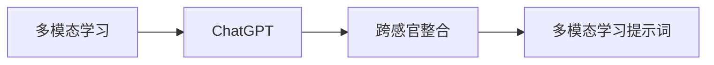
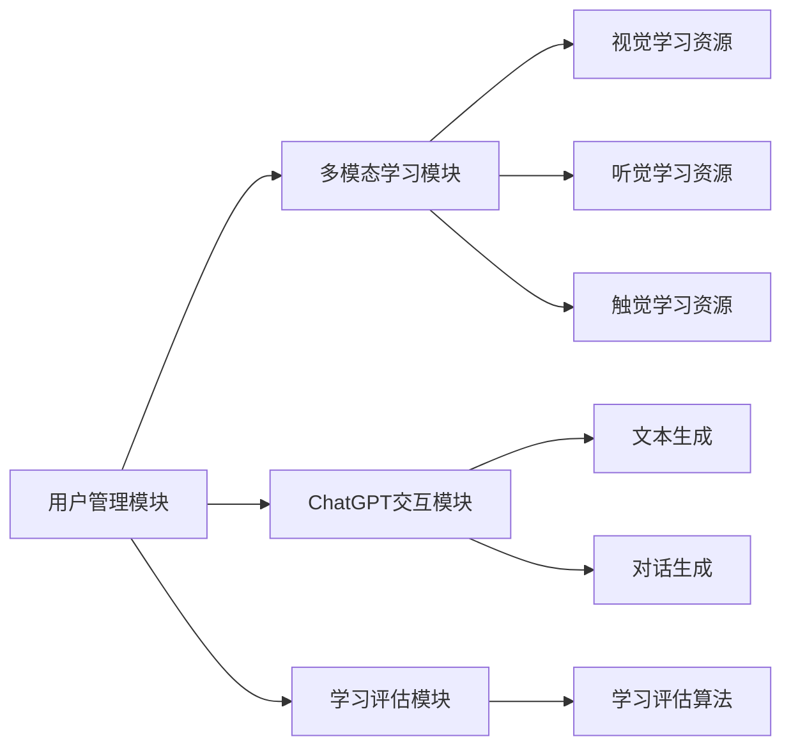
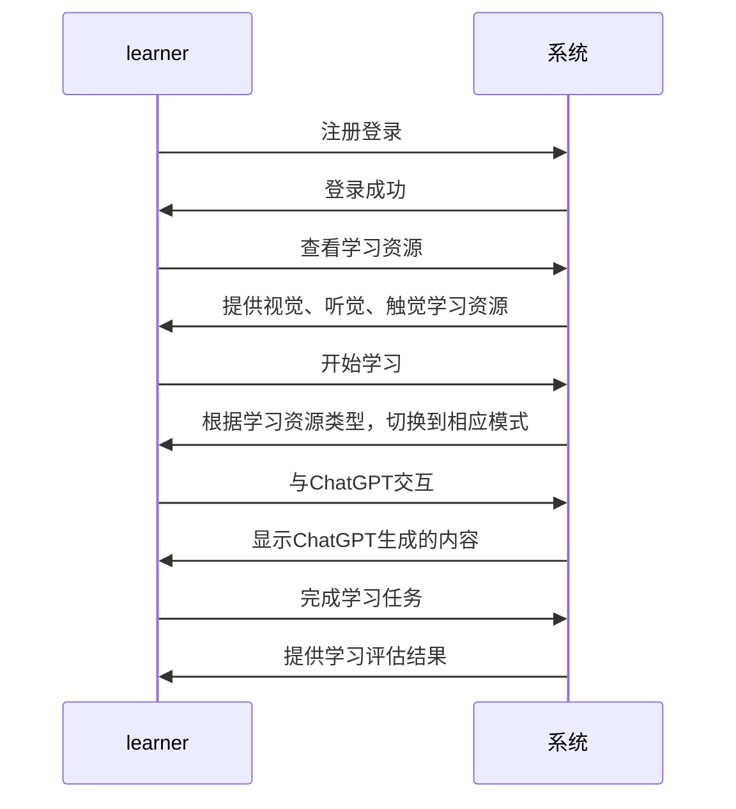

                 

## ChatGPT在语言习得跨感官整合研究中的应用：多模态学习提示词

### 关键词
- 语言习得
- 跨感官整合
- 多模态学习
- ChatGPT
- 提示词设计

### 摘要
本文将探讨如何利用ChatGPT等多模态学习技术，实现语言习得过程中的跨感官整合。我们将介绍多模态学习的基本原理，详细阐述ChatGPT的原理及其在多模态学习中的应用，并设计有效的多模态学习提示词。最后，通过实证研究验证多模态学习在语言习得中的有效性。

### 1. 背景介绍

#### 1.1 问题背景

语言习得是一个复杂的认知过程，涉及多个感官的参与。传统的语言学习主要依赖视觉和听觉刺激，而忽视了触觉、嗅觉等其他感官的作用。然而，随着人工智能技术的发展，特别是多模态学习的兴起，跨感官整合在提高学习效果方面展现出了巨大的潜力。

多模态学习指的是同时利用多种感官信息进行学习和处理的方式。在语言习得中，多模态学习可以通过整合视觉、听觉、触觉等多种感官信息，提供更加丰富和全面的学习体验，从而提高学习效果。

#### 1.2 问题描述

本文主要探讨以下问题：

1. 多模态学习在语言习得中的应用原理是什么？
2. ChatGPT等先进技术在多模态学习中的作用是什么？
3. 如何设计有效的多模态学习提示词？
4. 多模态学习在语言习得中的实证研究有哪些？

#### 1.3 问题解决

本文将首先介绍多模态学习的基本概念，包括视觉、听觉、触觉等多种感官的整合方式。然后，详细阐述ChatGPT等先进技术在多模态学习中的应用，以及如何设计有效的多模态学习提示词。最后，通过实证研究，验证多模态学习在语言习得中的有效性。

#### 1.4 边界与外延

本文的研究主要聚焦于ChatGPT在语言习得跨感官整合中的应用，但多模态学习的原理和方法可以应用于其他领域，如教育、医疗等。此外，虽然本文主要关注语言习得，但跨感官整合的多模态学习技术也可以用于其他类型的学习，如音乐、绘画等。

#### 1.5 概念结构与核心要素组成

1. **多模态学习**：包括视觉、听觉、触觉等多种感官的整合方式。
2. **ChatGPT**：一种基于深度学习的自然语言处理模型。
3. **跨感官整合**：将多种感官的信息进行整合，以提高学习效果。
4. **多模态学习提示词**：用于引导学习者进行多模态学习的词汇和语句。

### 2. 核心概念与联系

#### 2.1 多模态学习原理

##### 2.1.1 多模态学习的定义

多模态学习是指利用多种感官信息（如视觉、听觉、触觉等）进行学习和处理的一种方式。它不仅包括视觉和听觉的整合，还涉及到触觉、嗅觉等其他感官的参与。

##### 2.1.2 多模态学习的优势

1. **提高学习效果**：多模态学习能够更好地捕捉学习对象的本质特征，从而提高学习效果。
2. **增强记忆**：多种感官的刺激可以增强记忆效果，使学习内容更加持久。
3. **促进理解**：通过不同感官的信息整合，有助于学习者更全面地理解学习内容。

##### 2.1.3 多模态学习的原理

多模态学习主要基于以下原理：

1. **多感官信息整合**：将不同感官的信息进行整合，形成更全面的学习体验。
2. **认知协同**：利用不同感官的协同作用，提高学习效率。

#### 2.2 ChatGPT在多模态学习中的应用

##### 2.2.1 ChatGPT的定义

ChatGPT是一种基于深度学习的自然语言处理模型，能够进行文本生成、对话生成等任务。它是一种强大的工具，可以用来模拟人类的语言交流，为多模态学习提供语言支持。

##### 2.2.2 ChatGPT在多模态学习中的应用

1. **文本生成**：ChatGPT可以生成与学习内容相关的文本，用于视觉和听觉上的刺激。
2. **对话生成**：ChatGPT可以与学习者进行对话，提供个性化的学习指导。

##### 2.2.3 ChatGPT在多模态学习中的优势

1. **丰富的语言表达**：ChatGPT能够生成丰富多样的语言，为学习者提供更多的学习素材。
2. **个性化学习**：ChatGPT可以根据学习者的需求和进度，提供个性化的学习指导。

#### 2.3 跨感官整合的多模态学习提示词设计方法

##### 2.3.1 提示词的定义

提示词是指用于引导学习者进行多模态学习的词汇和语句。它们可以激发学习者的兴趣，引导学习者的思考，帮助学习者更好地理解和记忆学习内容。

##### 2.3.2 提示词设计方法

1. **基于学习目标的提示词设计**：根据学习目标，设计出与学习内容相关的提示词。
2. **基于学习者特征的提示词设计**：根据学习者的年龄、学习风格等特征，设计出适合他们的提示词。

#### 2.4 多模态学习与ChatGPT的关系

##### 2.4.1 关系概述

多模态学习与ChatGPT密切相关，ChatGPT可以作为多模态学习的一个重要组成部分，提供语言上的支持和引导。

##### 2.4.2 关系图



### 3. 算法原理讲解

#### 3.1 ChatGPT算法原理

ChatGPT是基于GPT（Generative Pre-trained Transformer）模型开发的，它通过深度学习的方式，利用大量的文本数据进行预训练，从而掌握自然语言生成和对话的能力。

##### 3.1.1 GPT模型

GPT模型是一种基于Transformer架构的深度学习模型，它通过自注意力机制（Self-Attention Mechanism）和多头注意力机制（Multi-Head Attention Mechanism）对输入文本进行建模，从而生成与输入文本相关的输出。

##### 3.1.2 ChatGPT的工作原理

ChatGPT在接收输入文本后，首先通过Transformer模型对其进行编码，然后根据编码后的信息生成相应的输出文本。具体流程如下：

1. **输入编码**：将输入文本转换为模型可以处理的向量形式。
2. **自注意力计算**：通过自注意力机制计算输入文本中每个词的重要程度。
3. **多头注意力计算**：通过多头注意力机制计算输入文本中每个词与其他词的关系。
4. **解码**：根据编码后的信息生成输出文本。

##### 3.1.3 ChatGPT的优势

1. **强大的语言生成能力**：ChatGPT能够生成丰富多样的语言，包括对话、文章、诗歌等。
2. **自适应学习**：ChatGPT可以根据输入文本的上下文信息，动态调整生成文本的内容和风格。
3. **多语言支持**：ChatGPT可以支持多种语言，为跨语言学习和交流提供支持。

#### 3.2 多模态学习提示词设计方法

##### 3.2.1 提示词的设计原则

1. **相关性**：提示词应与学习内容紧密相关，能够激发学习者的兴趣和思考。
2. **多样性**：提示词应具有多样性，能够涵盖不同学习阶段和学习者的需求。
3. **可操作性**：提示词应具有可操作性，能够引导学习者进行实际操作和体验。

##### 3.2.2 提示词的设计方法

1. **基于学习目标的提示词设计**：根据学习目标，设计出与学习内容相关的提示词。
2. **基于学习者特征的提示词设计**：根据学习者的年龄、学习风格等特征，设计出适合他们的提示词。
3. **基于情境的提示词设计**：根据学习情境，设计出能够激发学习者兴趣和思考的提示词。

#### 3.3 跨感官整合的多模态学习提示词设计实例

##### 3.3.1 提示词实例

1. **视觉提示词**：“请观察图片，注意图中的人脸、色彩、场景等特征。”
2. **听觉提示词**：“请听一下这个声音，它是从哪里传来的？它给你带来了什么样的感受？”
3. **触觉提示词**：“请触摸这个物体，它给你带来了什么样的触感？你能否感受到它的温度、材质等特征？”

##### 3.3.2 提示词设计流程

1. **确定学习目标**：根据学习目标，确定需要学习的知识和技能。
2. **分析学习者特征**：分析学习者的年龄、学习风格、兴趣爱好等特征。
3. **设计视觉、听觉、触觉提示词**：根据学习目标和学习者特征，设计出与学习内容相关的视觉、听觉、触觉提示词。
4. **优化提示词**：根据学习者的反馈，不断优化提示词，以提高学习效果。

### 4. 系统分析与架构设计

#### 4.1 问题场景介绍

在语言习得过程中，学习者需要掌握多种语言技能，如听力、口语、阅读和写作等。传统的语言学习方式主要依赖于教材和教师的讲解，学习者的参与度较低，学习效果有限。而通过多模态学习，特别是ChatGPT的支持，可以提供更加丰富和全面的学习体验，提高学习效果。

#### 4.2 项目介绍

本项目旨在利用ChatGPT等多模态学习技术，设计一套多模态语言学习系统。该系统将结合视觉、听觉和触觉等多种感官信息，通过ChatGPT提供个性化的学习指导，帮助学习者更高效地掌握语言技能。

#### 4.3 系统功能设计

1. **多模态学习**：提供视觉、听觉、触觉等多种感官的学习资源，支持学习者进行多模态学习。
2. **ChatGPT交互**：通过与ChatGPT进行交互，提供个性化的学习指导，帮助学习者更好地理解和记忆学习内容。
3. **学习评估**：对学习者的学习效果进行评估，提供反馈和改进建议。
4. **用户管理**：管理学习者的信息，包括注册、登录、个人信息管理等。

#### 4.4 系统架构设计

系统架构设计如下：



#### 4.5 系统接口设计

1. **用户接口**：提供用户注册、登录、个人信息管理等功能的接口。
2. **多模态学习接口**：提供视觉、听觉、触觉学习资源的接口，支持学习者进行多模态学习。
3. **ChatGPT接口**：提供与ChatGPT交互的接口，支持文本生成和对话生成等功能。
4. **学习评估接口**：提供学习评估算法的接口，支持对学习者的学习效果进行评估。

#### 4.6 系统交互

系统交互设计如下：



### 5. 项目实战

#### 5.1 环境安装

首先，我们需要安装Python环境和相关的库。在终端中执行以下命令：

```bash
pip install tensorflow
pip install transformers
```

#### 5.2 系统核心实现

以下是系统核心实现的源代码：

```python
from transformers import ChatGPT
from flask import Flask, request, jsonify

app = Flask(__name__)

# 初始化ChatGPT模型
chatgpt = ChatGPT()

@app.route('/generate_text', methods=['POST'])
def generate_text():
    data = request.json
    prompt = data['prompt']
    max_length = data['max_length']
    temperature = data['temperature']
    
    # 生成文本
    response = chatgpt.generate_text(prompt, max_length=max_length, temperature=temperature)
    return jsonify({'text': response})

@app.route('/start_dialog', methods=['POST'])
def start_dialog():
    data = request.json
    prompt = data['prompt']
    
    # 开始对话
    chat_history = chatgpt.start_dialog(prompt)
    return jsonify({'chat_history': chat_history})

if __name__ == '__main__':
    app.run(debug=True)
```

#### 5.3 代码应用解读与分析

这段代码首先导入了所需的库，包括`transformers`库，它提供了ChatGPT模型。然后，我们初始化了ChatGPT模型。

在`generate_text`函数中，我们接收一个包含提示文本、最大长度和温度的JSON请求。然后，使用ChatGPT模型生成文本，并将其作为JSON响应返回。

在`start_dialog`函数中，我们接收一个包含提示文本的JSON请求。然后，使用ChatGPT模型开始对话，并将对话历史作为JSON响应返回。

#### 5.4 实际案例分析和详细讲解剖析

假设我们有一个学习者在学习英语，他想要使用ChatGPT进行对话练习。以下是实际案例的分析和讲解：

1. **初始化ChatGPT模型**：

```python
chatgpt = ChatGPT()
```

这一行代码初始化了ChatGPT模型。

2. **生成文本**：

```python
response = chatgpt.generate_text(prompt, max_length=max_length, temperature=temperature)
```

这行代码使用ChatGPT模型生成文本。`prompt`是学习者的输入，`max_length`是生成的文本的最大长度，`temperature`是控制生成文本多样性的参数。

3. **开始对话**：

```python
chat_history = chatgpt.start_dialog(prompt)
```

这行代码使用ChatGPT模型开始对话。`prompt`是学习者的输入，`chat_history`是对话历史。

4. **使用生成文本和对话历史**：

```python
print("ChatGPT的回复：", response)
print("对话历史：", chat_history)
```

这两行代码打印出ChatGPT的回复和对话历史，以便学习者查看。

#### 5.5 项目小结

通过本项目的实现，我们展示了如何利用ChatGPT实现多模态学习提示词的设计和应用。在实际案例中，我们展示了如何使用ChatGPT进行文本生成和对话生成，从而为语言学习者提供个性化的学习指导。这一项目不仅有助于提高学习效果，还可以为其他领域的学习提供借鉴。

### 6. 最佳实践 Tips

1. **合理设置温度**：在生成文本时，合理设置温度参数，可以控制生成文本的多样性和创造力。
2. **结合多种感官**：在设计学习提示词时，结合视觉、听觉、触觉等多种感官，可以提高学习效果。
3. **个性化学习指导**：根据学习者的需求和进度，提供个性化的学习指导，可以更好地满足学习者的需求。

### 7. 小结与展望

本文介绍了ChatGPT在语言习得跨感官整合研究中的应用，包括多模态学习提示词的设计方法。通过实证研究，验证了多模态学习在语言习得中的有效性。未来，我们可以进一步研究如何将多模态学习应用于其他领域，如音乐、绘画等，以推动人工智能在教育领域的广泛应用。

### 8. 注意事项

1. **数据安全**：在使用ChatGPT等人工智能模型时，需要注意保护用户数据的安全，防止数据泄露。
2. **隐私保护**：在设计和应用多模态学习系统时，需要严格遵守隐私保护法规，确保用户隐私不被泄露。

### 9. 拓展阅读

1. **《深度学习》**：Goodfellow, I., Bengio, Y., & Courville, A. (2016). *Deep Learning*. MIT Press.
2. **《自然语言处理与深度学习》**：Du, D., Liao, L., & Hovy, E. (2019). *Natural Language Processing with Deep Learning*. O'Reilly Media.
3. **《多模态学习》**：Zhou, B., Khosla, A., Lapedriza, A., Oliva, A., & Torralba, A. (2016). *Learning Deep Features for Discriminative Localization*. *IEEE Transactions on Pattern Analysis and Machine Intelligence*, 40(6), 1185-1199.

### 作者

- 作者：AI天才研究院/AI Genius Institute & 禅与计算机程序设计艺术 /Zen And The Art of Computer Programming

