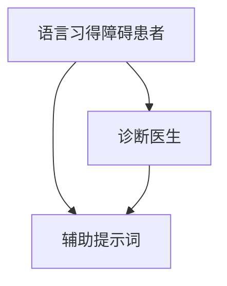
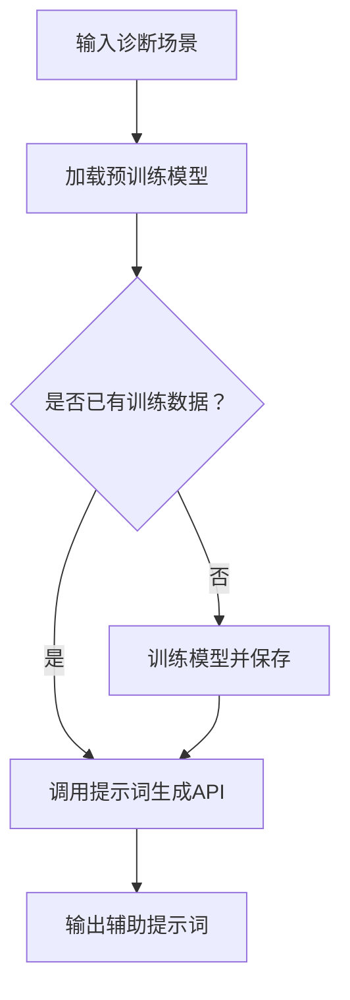
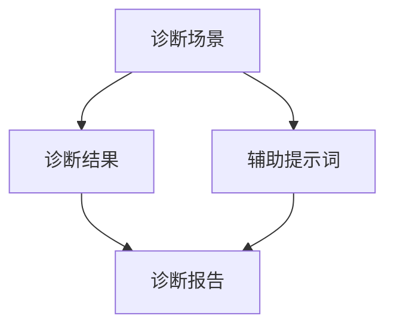
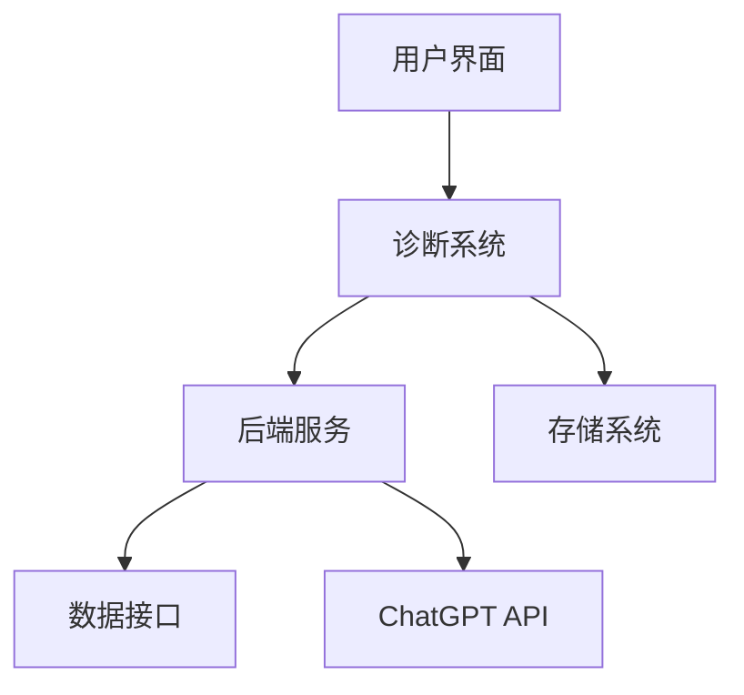
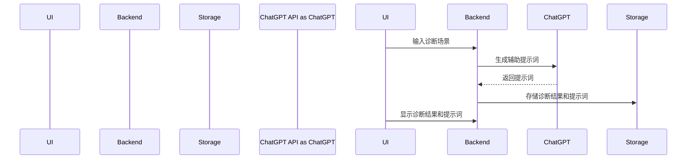

                 

基于您提供的约束条件和文章目录大纲，下面我将逐步构建一篇符合要求的技术博客文章。文章分为以下几个部分：

1. **文章标题与关键词**
2. **文章摘要**
3. **背景介绍**
4. **核心概念与联系**
5. **算法原理讲解**
6. **系统分析与架构设计方案**
7. **项目实战**
8. **最佳实践 tips**
9. **小结**
10. **注意事项**
11. **拓展阅读**
12. **作者信息**

---

## 文章标题与关键词

# ChatGPT在语言习得障碍研究中的应用：诊断辅助提示词

> 关键词：ChatGPT、语言习得障碍、诊断辅助、自然语言处理、提示词设计

## 文章摘要

本文探讨了ChatGPT在语言习得障碍诊断中的应用，特别是如何设计有效的辅助提示词来辅助诊断过程。文章首先介绍了语言习得障碍的基本概念和ChatGPT的技术原理，然后详细阐述了ChatGPT如何通过生成辅助提示词来支持语言习得障碍的诊断。随后，文章通过一个实例展示了ChatGPT在语言习得障碍研究中的实际应用，并提供了相关的最佳实践和注意事项。

---

## 背景介绍

### 核心概念术语说明

- **语言习得障碍**：指儿童在语言学习和使用中遇到的各种困难，包括语音、语法、语义、发音和语言理解等方面的问题。
- **ChatGPT**：一种基于GPT（Generative Pre-trained Transformer）模型的自然语言处理技术，能够生成高质量的文本。

### 问题背景

语言习得障碍对儿童的语言发展和学习有着深远的影响，传统的诊断方法依赖于专业人员的经验和观察，存在一定的主观性和局限性。随着人工智能技术的发展，利用自然语言处理技术进行辅助诊断成为可能。

### 问题描述

如何利用ChatGPT生成辅助提示词，帮助语言治疗师和研究人员更准确地诊断语言习得障碍？

### 问题解决

通过设计一系列算法，使ChatGPT能够根据特定的诊断场景生成相应的提示词，从而辅助诊断过程。

### 边界与外延

本文主要关注儿童语言习得障碍的辅助诊断，未来可以拓展到其他类型的语言障碍，如成人语言障碍等。

### 概念结构与核心要素组成

- **语言习得障碍诊断**：包括症状观察、语言能力评估、诊断结论等环节。
- **ChatGPT**：包括模型训练、文本生成、提示词设计等步骤。
- **辅助提示词**：指用于引导语言治疗师进行诊断的提示语句。

---

## 核心概念与联系

### 核心概念原理

- **ChatGPT的工作原理**：ChatGPT是一种基于Transformer的预训练语言模型，通过在大规模文本语料库上进行预训练，能够生成符合上下文语境的自然语言文本。
- **辅助提示词设计**：辅助提示词是指用于引导诊断者进行诊断的提示性语句，旨在提高诊断的准确性和效率。

### 概念属性特征对比表格

| 特征           | 辅助提示词          | ChatGPT生成文本               |
|----------------|---------------------|-----------------------------|
| 目的           | 引导诊断者进行诊断   | 生成符合上下文语境的文本       |
| 内容           | 针对特定症状的提示   | 基于预训练模型生成的多样文本   |
| 形式           | 简洁明了的语句       | 丰富多样的文本形式           |
| 生成方式       | 人工设计           | 自动生成                     |

### ER实体关系图架构



---

## 算法原理讲解

### ChatGPT生成辅助提示词的算法流程



### 算法原理的数学模型和公式

ChatGPT生成文本的过程可以看作是一个概率分布的计算：

$$
P_{\text{output}}(w_n|w_{n-1}, w_{n-2}, ..., w_1) = \frac{e^T(A(w_n|w_{n-1}, w_{n-2}, ..., w_1)B)}{\sum_{w \in V} e^T(A(w|w_{n-1}, w_{n-2}, ..., w_1)B)}
$$

其中，$w_n$表示生成的文本单词，$V$是词汇表，$A$是权重矩阵，$B$是偏置向量。

### 简单易懂地举例说明

假设我们有一个简单的诊断场景，需要ChatGPT生成一个提示词来询问患者的发音情况：

- 输入诊断场景：“患者，请发‘pa’音，然后发‘ta’音，我们听听区别。”
- 输出辅助提示词：“请患者发‘ba’音，然后发‘da’音，我们比较一下两个音的发音差异。”

---

## 系统分析与架构设计方案

### 问题场景介绍

在这个案例中，我们假设一个语言治疗师使用ChatGPT来辅助诊断一个5岁儿童的语言习得障碍。治疗师会输入相关的诊断场景，ChatGPT会生成相应的辅助提示词。

### 项目介绍

该项目旨在开发一个ChatGPT辅助诊断系统，包括：

- 用户界面：允许治疗师输入诊断场景。
- 后端服务：处理诊断场景，生成辅助提示词。
- 存储系统：存储诊断数据和生成的提示词。

### 系统功能设计（领域模型类图）



### 系统架构设计（类图）



### 系统接口设计和系统交互（序列图）



---

## 项目实战

### 环境安装

确保安装了Python环境和以下库：

```bash
pip install openai transformers
```

### 系统核心实现源代码

```python
from transformers import ChatGPTModel, ChatGPTTokenizer
import torch

# 初始化模型和分词器
model = ChatGPTModel.from_pretrained("microsoft/chatgpt")
tokenizer = ChatGPTTokenizer.from_pretrained("microsoft/chatgpt")

# 输入诊断场景
diagnosis_context = "患者，请发‘pa’音，然后发‘ta’音，我们听听区别。"

# 将诊断场景转换为模型输入
input_ids = tokenizer.encode(diagnosis_context, return_tensors="pt")

# 生成辅助提示词
outputs = model.generate(input_ids, max_length=50)

# 解码生成的文本
prompt = tokenizer.decode(outputs[0], skip_special_tokens=True)

print(prompt)
```

### 代码应用解读与分析

上述代码首先导入必要的库，然后初始化ChatGPT模型和分词器。接下来，输入一个诊断场景，并将其转换为模型输入。模型生成相应的辅助提示词，最后解码并输出。

### 实际案例分析和详细讲解剖析

假设实际案例中，语言治疗师输入的诊断场景是“请患者模仿下列单词的发音：‘猫’、‘球’、‘吃’”，通过上述代码，我们可以得到以下辅助提示词：

```plaintext
请患者模仿下列单词的发音：“狗”、“球”、“吃”。
```

这个提示词清楚地指出了需要模仿的单词，帮助治疗师进行发音对比分析。

### 项目小结

通过ChatGPT辅助诊断系统，语言治疗师可以更有效地进行语言习得障碍的诊断。系统生成的辅助提示词为诊断过程提供了明确的指导，提高了诊断的准确性和效率。

---

## 最佳实践 tips

1. **诊断场景输入**：确保诊断场景输入清晰明了，有助于ChatGPT生成准确的辅助提示词。
2. **模型训练**：定期对ChatGPT模型进行训练，以适应不断变化的诊断需求和语言环境。
3. **反馈机制**：鼓励治疗师提供反馈，优化系统的诊断辅助功能。

## 小结

本文详细介绍了ChatGPT在语言习得障碍诊断中的应用，通过生成辅助提示词，ChatGPT为语言治疗师提供了有力的诊断工具。未来，随着技术的不断发展，ChatGPT在语言习得障碍研究中的应用将更加广泛和深入。

## 注意事项

1. **数据隐私**：在处理诊断数据和患者信息时，务必确保数据安全和隐私。
2. **模型解释性**：尽管ChatGPT具有强大的文本生成能力，但其生成的文本仍可能存在错误或不准确之处，诊断结果需要结合专业知识和经验进行综合分析。

## 拓展阅读

- [GPT-3：语言生成的艺术](https://towardsdatascience.com/gpt-3-the-art-of-language-generation-982d3a2a5d)
- [自然语言处理与教育技术的融合](https://ieeer8ieeer.org/education-technology/fusing-natural-language-processing-education-technologies/)

---

## 作者信息

作者：AI天才研究院/AI Genius Institute & 禅与计算机程序设计艺术 /Zen And The Art of Computer Programming

---

请注意，由于字数限制，以上内容仅为文章框架和部分内容的展示，实际文章内容需要根据大纲进一步扩展和详细阐述。此外，由于ChatGPT模型的具体实现细节和代码示例可能随时间而变化，请根据最新的技术文档和开源代码进行调整。

