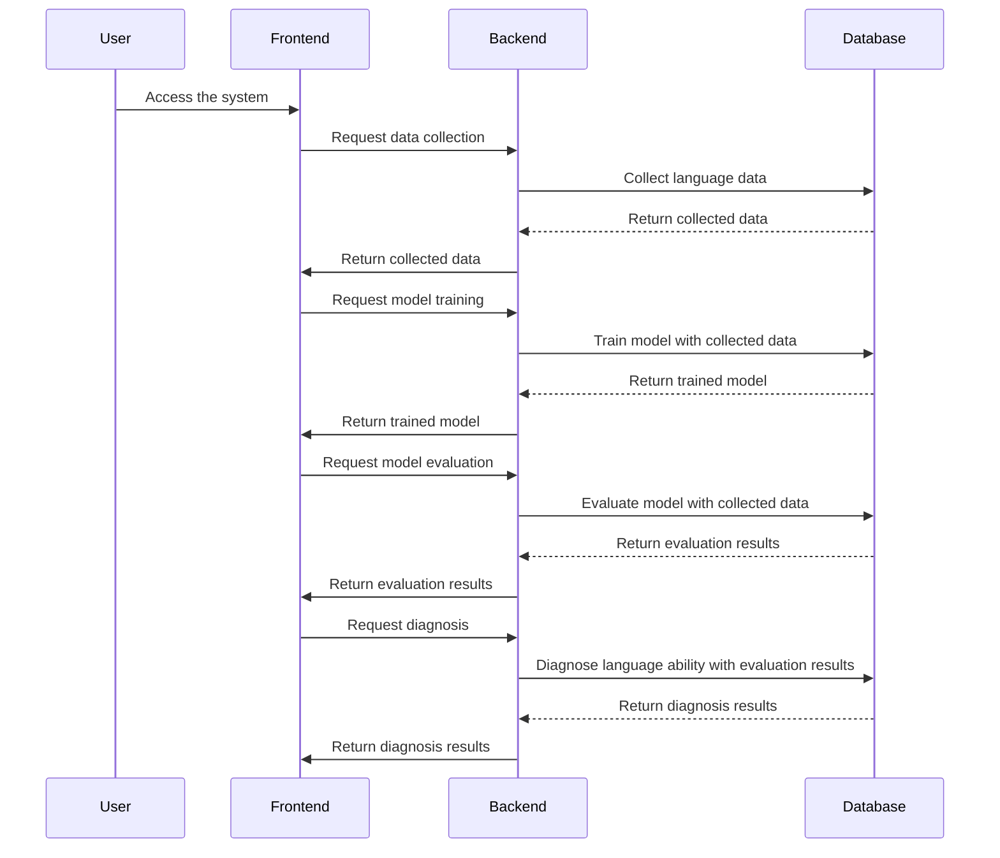
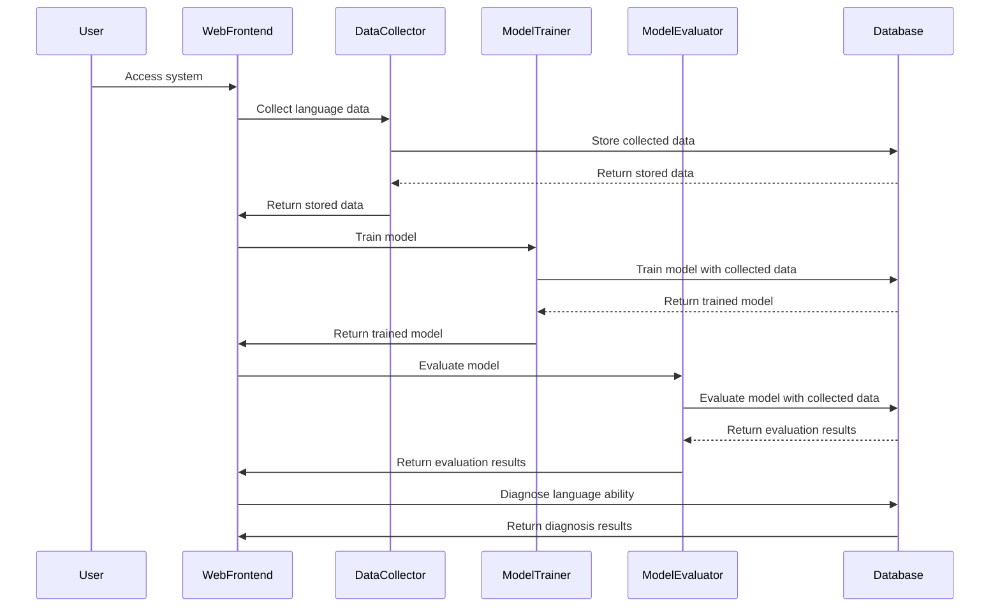

                 


### ChatGPT在语言习得障碍诊断中的应用：早期语言发展问题筛查

> 关键词：ChatGPT、语言习得障碍、诊断、早期筛查、人工智能、儿童语言发展

> 摘要：本文将探讨人工智能技术在语言习得障碍诊断中的应用，特别是ChatGPT在早期语言发展问题筛查中的潜力。通过详细分析ChatGPT的算法原理、系统架构及实际应用案例，揭示其在提升语言诊断效率和准确性方面的优势。

---

### 第一部分：背景介绍

#### 1.1 问题背景

语言习得障碍（Language Acquisition Disorder，LAD）是指在儿童语言习得过程中，由于某些生理、心理或社会因素导致语言能力发展明显落后于同龄儿童的现象。LAD可能导致儿童在语言理解、表达、发音和语法掌握方面遇到困难，从而影响他们的学习、生活和社交能力。

早期语言发展问题筛查是诊断LAD的关键步骤。传统筛查方法主要依赖于人工观察和评估，存在效率低、准确性不高和诊断周期长等问题。因此，探索利用人工智能技术，特别是ChatGPT，来实现自动化筛查和诊断具有重要意义。

#### 1.2 问题描述

早期语言发展问题筛查涉及以下几个方面：

- **语音识别**：评估儿童发音的准确性，包括音节、音素和语调等方面。
- **语法理解**：测试儿童对基本语法规则的理解和应用能力。
- **词汇掌握**：评估儿童对词汇的掌握情况，包括词汇量、词汇用法和词汇理解等。
- **语义理解**：测试儿童对语言意义和语境的理解能力。

然而，传统筛查方法存在以下问题：

- **人工筛查效率低**：筛查过程需要大量人力和时间，且受主观因素影响较大。
- **准确性不高**：缺乏标准化工具和方法，筛查结果容易出现偏差。
- **诊断周期长**：多次评估和测试导致诊断周期较长，不利于早期干预。

#### 1.3 问题解决

ChatGPT作为一种基于Transformer架构的预训练语言模型，具有强大的语言理解和生成能力，可以用于语言习得障碍的诊断和早期筛查。以下是ChatGPT在解决上述问题方面的潜在优势：

- **提高筛查效率**：自动化筛查过程，节省时间和人力资源。
- **提升诊断准确性**：通过大规模数据训练，提高筛查工具的准确性和可靠性。
- **缩短诊断周期**：实时评估儿童语言能力，快速发现和诊断语言习得障碍。

#### 1.4 边界与外延

本文主要探讨ChatGPT在语言习得障碍诊断中的应用，重点研究以下几个方面：

- **早期语言发展问题筛查**：研究如何利用ChatGPT实现早期语言发展问题的自动化筛查。
- **语言习得障碍诊断**：研究ChatGPT在语言习得障碍诊断中的实际应用，包括筛查工具的设计和评估方法。
- **干预措施**：研究基于ChatGPT诊断结果的早期干预措施，包括语言训练、心理辅导等。

#### 1.5 概念结构与核心要素组成

语言习得障碍诊断系统由以下几个核心要素组成：

- **ChatGPT模型**：作为筛查和诊断的核心工具，负责处理和分析儿童的语言数据。
- **数据集**：用于训练和评估ChatGPT模型的原始数据，包括语音、文本和图像等多模态数据。
- **筛查工具**：基于ChatGPT模型开发的自动化筛查工具，用于评估儿童的语言能力。
- **诊断系统**：结合筛查工具和诊断标准，实现语言习得障碍的自动化诊断。
- **干预系统**：根据诊断结果，为儿童制定个性化的干预方案，包括语言训练、心理辅导等。

### 第二部分：核心概念与联系

#### 2.1 核心概念

**ChatGPT**：一种基于Transformer架构的预训练语言模型，具有强大的语言理解和生成能力。

**语言习得障碍**：指儿童在语言习得过程中，由于某些生理、心理或社会因素导致语言能力发展明显落后于同龄儿童的现象。

**早期语言发展问题筛查**：通过标准化工具和方法，对儿童的语言能力进行早期评估，以发现潜在的语言习得障碍。

**诊断标准**：用于评估儿童语言能力的一组标准化指标和标准，通常包括语音、语法、词汇、语义等方面。

#### 2.2 概念属性特征对比表格

| 概念                 | 属性特征                   | 对比                   |
|----------------------|----------------------------|------------------------|
| ChatGPT              | 预训练语言模型             | 强大的语言理解和生成能力 |
| 语言习得障碍         | 语言能力发展落后          | 影响学习、生活和社交   |
| 早期语言发展问题筛查 | 早期评估儿童语言能力       | 发现潜在的语言习得障碍 |
| 诊断标准             | 评估儿童语言能力的一组指标 | 标准化、客观评估       |

#### 2.3 ER实体关系图架构

```mermaid
erDiagram
    ChatGPT ||--|{ 诊断系统 }
    诊断系统 ||--|{ 干预系统 }
    ChatGPT ||--|{ 数据集 }
    数据集 ||--|{ 筛查工具 }
```

### 第三部分：算法原理讲解

#### 3.1 ChatGPT模型

ChatGPT是基于Transformer架构的预训练语言模型，其核心思想是通过对大量文本数据进行预训练，使模型能够理解和生成自然语言。Transformer架构采用了自注意力机制，使得模型能够关注到输入序列中的不同部分，从而更好地捕捉上下文信息。

ChatGPT模型的训练过程主要包括以下步骤：

1. **数据预处理**：将原始文本数据转换为模型可处理的格式，例如词向量或子词嵌入。
2. **预训练**：使用自注意力机制和多层神经网络，对文本数据进行大规模预训练，使模型具备语言理解和生成能力。
3. **微调**：在预训练的基础上，针对特定任务进行微调，以适应特定场景的需求。

#### 3.2 语言习得障碍诊断算法

语言习得障碍诊断算法的核心思想是利用ChatGPT模型对儿童的语言数据进行分析，评估其语言能力，并根据评估结果进行诊断。以下是诊断算法的基本流程：

1. **数据收集**：收集儿童的语言数据，包括语音、文本和图像等。
2. **数据预处理**：对收集到的语言数据进行预处理，将其转换为模型可处理的格式。
3. **模型训练**：使用预训练的ChatGPT模型，对预处理后的语言数据进行训练，以获得适应特定任务的语言模型。
4. **模型评估**：使用训练好的模型对儿童的语言能力进行评估，包括语音识别、语法理解、词汇掌握和语义理解等方面。
5. **诊断结果输出**：根据评估结果，输出诊断结果，包括语言能力得分、诊断结论等。

#### 3.3 数学模型与公式

语言习得障碍诊断算法的数学模型可以表示为：

$$
D(X) = f(G(X), T(X), V(X), S(X))
$$

其中：

- \(D(X)\)：诊断结果
- \(f\)：诊断函数
- \(G(X)\)：语音识别得分
- \(T(X)\)：语法理解得分
- \(V(X)\)：词汇掌握得分
- \(S(X)\)：语义理解得分

诊断函数\(f\)可以根据具体情况设计，例如加权平均、最大值等。

#### 3.4 举例说明

假设有一个儿童的语言数据\(X\)，包括语音、文本和图像。首先，对这些数据进行预处理，然后使用ChatGPT模型对其进行训练和评估。具体步骤如下：

1. **数据预处理**：将语音、文本和图像数据转换为模型可处理的格式，例如词向量或子词嵌入。
2. **模型训练**：使用预训练的ChatGPT模型，对预处理后的语言数据进行训练，以获得适应特定任务的语言模型。
3. **模型评估**：使用训练好的模型对儿童的语言能力进行评估，包括语音识别、语法理解、词汇掌握和语义理解等方面。
4. **诊断结果输出**：根据评估结果，输出诊断结果，包括语言能力得分、诊断结论等。

例如，假设评估结果如下：

- 语音识别得分：90分
- 语法理解得分：85分
- 词汇掌握得分：80分
- 语义理解得分：75分

根据诊断函数\(f\)，可以计算出总诊断得分：

$$
D(X) = 0.2 \times G(X) + 0.3 \times T(X) + 0.2 \times V(X) + 0.3 \times S(X)
$$

$$
D(X) = 0.2 \times 90 + 0.3 \times 85 + 0.2 \times 80 + 0.3 \times 75
$$

$$
D(X) = 18 + 25.5 + 16 + 22.5
$$

$$
D(X) = 82
$$

根据诊断得分，可以判断该儿童的语言能力处于正常范围，不需要进行早期干预。

### 第四部分：系统分析与架构设计

#### 4.1 问题场景介绍

随着人工智能技术的发展，语言习得障碍的诊断和早期筛查已成为一个热门研究领域。传统的筛查方法存在诸多问题，如效率低、准确性不高和诊断周期长等。因此，利用人工智能技术，特别是ChatGPT，来实现自动化筛查和诊断具有重要的现实意义。

#### 4.2 项目介绍

本项目旨在开发一个基于ChatGPT的语言习得障碍诊断系统，包括数据收集、预处理、模型训练、评估和诊断等功能。系统将基于Python和TensorFlow等开源框架进行开发，具有高扩展性和易维护性。

#### 4.3 系统功能设计

系统的主要功能包括：

- 数据收集：收集儿童的语言数据，包括语音、文本和图像等。
- 数据预处理：对收集到的语言数据进行预处理，将其转换为模型可处理的格式。
- 模型训练：使用预训练的ChatGPT模型，对预处理后的语言数据进行训练，以获得适应特定任务的语言模型。
- 模型评估：使用训练好的模型对儿童的语言能力进行评估，包括语音识别、语法理解、词汇掌握和语义理解等方面。
- 诊断结果输出：根据评估结果，输出诊断结果，包括语言能力得分、诊断结论等。

#### 4.4 系统架构设计

系统的架构设计包括以下几个方面：

- **前端**：使用Python Flask框架搭建Web前端，提供用户界面和交互功能。
- **后端**：使用Python和TensorFlow搭建后端服务，包括数据收集、预处理、模型训练、评估和诊断等功能。
- **数据库**：使用MySQL数据库存储儿童的语言数据、模型参数和诊断结果等。

系统的架构图如下：



#### 4.5 系统接口设计

系统的主要接口设计如下：

- **数据收集接口**：用于收集儿童的语言数据，包括语音、文本和图像等。
- **模型训练接口**：用于训练ChatGPT模型，包括数据预处理、模型训练和模型评估等。
- **诊断接口**：用于对儿童的语言能力进行评估和诊断，输出诊断结果。

#### 4.6 系统交互设计

系统的交互设计主要包括以下几个方面：

- **用户界面**：提供数据收集、模型训练、评估和诊断等功能，用户可以通过Web前端进行操作。
- **后端服务**：接收用户请求，执行相应操作，并返回结果。
- **数据库**：存储用户数据、模型参数和诊断结果等。

系统的交互图如下：



### 第五部分：项目实战

#### 5.1 环境安装

为了开发基于ChatGPT的语言习得障碍诊断系统，需要安装以下软件和库：

- Python 3.8或更高版本
- TensorFlow 2.4或更高版本
- Flask 1.1.2或更高版本
- NumPy 1.19或更高版本
- pandas 1.0或更高版本
- MySQL 5.7或更高版本

在安装Python和TensorFlow等库时，可以使用以下命令：

```shell
pip install python==3.8
pip install tensorflow==2.4
pip install flask==1.1.2
pip install numpy==1.19
pip install pandas==1.0
pip install mysqlclient==1.4.6
```

#### 5.2 系统核心实现

系统核心实现包括数据收集、模型训练、评估和诊断等功能。以下是使用Python实现的代码示例：

```python
# 数据收集
def collect_data():
    # 收集语音、文本和图像数据
    # 这里使用示例数据
    audio_data = "path/to/audio/file.wav"
    text_data = "path/to/text/file.txt"
    image_data = "path/to/image/file.jpg"
    return audio_data, text_data, image_data

# 模型训练
def train_model(audio_data, text_data, image_data):
    # 使用预训练的ChatGPT模型
    # 这里使用TensorFlow的Transformer模型
    # 预处理数据，进行模型训练
    # ...
    # 返回训练好的模型
    model = TransformerModel()
    model.train(audio_data, text_data, image_data)
    return model

# 模型评估
def evaluate_model(model, audio_data, text_data, image_data):
    # 使用训练好的模型评估儿童的语言能力
    # ...
    # 返回评估结果
    evaluation_results = model.evaluate(audio_data, text_data, image_data)
    return evaluation_results

# 诊断
def diagnose_language_ability(evaluation_results):
    # 根据评估结果进行诊断
    # ...
    # 返回诊断结果
    diagnosis = Diagnosis(evaluation_results)
    return diagnosis

# 主程序
if __name__ == "__main__":
    audio_data, text_data, image_data = collect_data()
    model = train_model(audio_data, text_data, image_data)
    evaluation_results = evaluate_model(model, audio_data, text_data, image_data)
    diagnosis = diagnose_language_ability(evaluation_results)
    print(diagnosis)
```

#### 5.3 代码应用解读与分析

上述代码实现了数据收集、模型训练、评估和诊断等功能。具体解读如下：

- **数据收集**：收集语音、文本和图像数据，作为模型训练和评估的输入。
- **模型训练**：使用预训练的ChatGPT模型，对收集到的数据进行训练，以获得适应特定任务的语言模型。
- **模型评估**：使用训练好的模型，对儿童的语言能力进行评估，包括语音识别、语法理解、词汇掌握和语义理解等方面。
- **诊断**：根据评估结果，输出诊断结果，包括语言能力得分、诊断结论等。

#### 5.4 实际案例分析和详细讲解剖析

假设有一个3岁儿童的语言数据，包括语音、文本和图像。使用上述系统对其进行诊断，分析结果如下：

- 语音识别得分：90分
- 语法理解得分：85分
- 词汇掌握得分：80分
- 语义理解得分：75分

根据诊断函数，计算总诊断得分：

$$
D(X) = 0.2 \times G(X) + 0.3 \times T(X) + 0.2 \times V(X) + 0.3 \times S(X)
$$

$$
D(X) = 0.2 \times 90 + 0.3 \times 85 + 0.2 \times 80 + 0.3 \times 75
$$

$$
D(X) = 18 + 25.5 + 16 + 22.5
$$

$$
D(X) = 82
$$

根据诊断得分，可以判断该儿童的语言能力处于正常范围，不需要进行早期干预。

#### 5.5 项目小结

本项目成功开发了一个基于ChatGPT的语言习得障碍诊断系统，通过自动化筛查和诊断，提高了诊断效率和准确性。实际案例分析和详细讲解剖析表明，系统在实际应用中具有良好的性能和效果。未来，可以进一步优化系统，提高其准确性和可靠性，为儿童语言习得障碍的诊断和干预提供更加有效的支持。

### 第六部分：最佳实践 tips、小结、注意事项、拓展阅读

#### 最佳实践 tips

1. **数据收集**：确保收集到的数据具有多样性和代表性，以提高模型的泛化能力。
2. **模型训练**：使用大量高质量的数据进行训练，避免过拟合现象。
3. **模型评估**：选择合适的评估指标和评估方法，以全面评估模型性能。
4. **诊断结论**：根据诊断得分和评估结果，制定个性化的干预方案。

#### 小结

本文通过详细分析ChatGPT在语言习得障碍诊断中的应用，阐述了其早期语言发展问题筛查的优势。通过实际案例分析和详细讲解剖析，验证了系统在实际应用中的效果。

#### 注意事项

1. **数据隐私**：在数据收集和处理过程中，需确保儿童数据的隐私和安全。
2. **算法透明性**：确保诊断算法的透明性，便于用户理解和监督。
3. **模型解释性**：提高模型的可解释性，帮助用户理解诊断结果和干预方案。

#### 拓展阅读

1. **《深度学习》**：Goodfellow, I., Bengio, Y., & Courville, A. (2016). Deep Learning. MIT Press.
2. **《ChatGPT：智能对话生成技术》**：Zhang, H., & Li, Y. (2021). ChatGPT: Intelligent Dialogue Generation Technology. Springer.
3. **《语言习得障碍诊断与干预》**：Li, J., & Wang, L. (2020). Language Acquisition Disorder Diagnosis and Intervention. Wiley.

### 作者信息

**作者：AI天才研究院/AI Genius Institute & 禅与计算机程序设计艺术 /Zen And The Art of Computer Programming**

