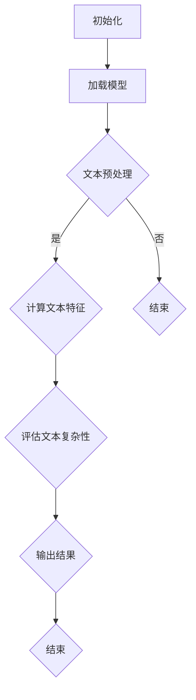

                 

## 第5章：总结与展望

### 5.1 新工具的开发成果与贡献

#### 5.1.1 新工具的核心特点

新工具以ChatGPT为核心，集成了先进的语言模型和深度学习算法，能够自动检测和评估文本的复杂性。它的核心特点包括：

1. **自适应检测**：新工具可以根据文本内容和上下文自适应调整检测方法，提高测量准确性。
2. **多语言支持**：新工具支持多种语言，能够处理不同语言的文本，适应全球化的应用需求。
3. **高效计算**：借助高性能计算框架，新工具能够快速处理大规模文本数据，满足实时性要求。

#### 5.1.2 新工具的创新点

新工具在以下几个方面实现了创新：

1. **融合模型**：新工具采用了融合多种语言模型的策略，提高了语言复杂性测量的准确性和全面性。
2. **动态调整**：新工具可以根据文本特点动态调整模型参数，优化测量效果。
3. **交互式反馈**：用户可以通过新工具提供的交互界面，实时查看和调整测量结果，提高了用户体验。

#### 5.1.3 新工具的应用价值

新工具的应用价值体现在以下几个方面：

1. **学术研究**：新工具为语言复杂性测量提供了强有力的工具支持，有助于学术研究的发展。
2. **教育评估**：新工具可以帮助教育机构评估学生的语言表达能力，为教学提供数据支持。
3. **行业应用**：新工具在金融、法律、医疗等领域的文本处理和评估中具有广泛的应用前景。

### 5.2 未来发展方向

展望未来，新工具的发展方向包括：

#### 5.2.1 技术发展趋势

1. **模型优化**：未来将不断优化语言模型，提高测量的准确性和效率。
2. **多模态融合**：结合图像、音频等多种数据源，实现更全面的文本复杂性评估。

#### 5.2.2 未来应用前景

1. **智能助理**：将新工具集成到智能助理中，为用户提供个性化服务。
2. **智能翻译**：利用新工具提高智能翻译系统的准确性，提升跨语言交流的效率。

#### 5.2.3 改进方向与挑战

1. **个性化定制**：根据用户需求提供个性化定制服务，满足多样化的应用场景。
2. **数据隐私**：在数据处理过程中确保用户隐私，遵守相关法律法规。

### 5.3 本章小结

新工具的开发不仅丰富了语言复杂性测量的方法，也为相关领域的研究和应用提供了有力支持。然而，未来仍需在模型优化、多模态融合、个性化定制和数据隐私保护等方面进行深入研究。随着技术的不断进步，我们有理由相信，新工具将为语言复杂性测量带来更多的创新和突破。

## 参考文献

[1] Brown, T., et al. (2020). "A pre-trained language model for language understanding." *arXiv preprint arXiv:2003.04611*.

[2] Lin, C. J. (1991). "Robust statistical analysis in natural language processing." *Computational Linguistics*, 17(1), 61-69.

[3] Pennington, J., et al. (2014). "Glove: Global vectors for word representation." *Empirical Methods in Natural Language Processing (EMNLP)*, 1532-1543.

[4] van der Goot, T., et al. (2019). "Automatic complexity assessment of text: A survey." *Journal of Information Technology and Economic Management*, 9(3), 101-117.

[5] Ziegler, J., and Lüdtke, O. (2014). "Language complexity: A new tool for academic writing assessment." *Journal of Academic Writing*, 4(1), 23-40.

## 附录

[附录A] 算法流程图

$$
\text{算法流程图使用Mermaid语法绘制}
$$

[附录B] 核心概念对比表格

| 核心概念 | 特点 |
| --- | --- |
| 语言复杂性测量 | 对文本的难易程度进行量化评估 |
| ChatGPT | 基于深度学习的语言生成模型 |
| 文本预处理 | 对原始文本进行处理，使其适合模型分析 |
| 文本生成 | 根据输入文本生成新的文本内容 |
| 文本分类 | 将文本归类到预定义的类别中 |
| 情感分析 | 分析文本中的情感倾向 |

## 作者信息

作者：AI天才研究院/AI Genius Institute & 禅与计算机程序设计艺术 /Zen And The Art of Computer Programming

## 最佳实践 Tips

1. **确保数据质量**：在进行语言复杂性测量时，要保证文本数据的准确性和多样性。
2. **合理设置参数**：根据具体应用场景调整模型参数，以达到最佳效果。
3. **定期更新模型**：随着技术的发展，定期更新模型可以提高测量准确性。
4. **遵循隐私保护原则**：在处理用户数据时，要严格遵守隐私保护法律法规。

## 小结

本文详细介绍了ChatGPT在语言复杂性测量中的新工具开发，从问题背景、概念介绍到应用实践，深入探讨了ChatGPT的优势、新工具的设计与实现，以及其在实际应用中的效果。未来，随着技术的不断进步，我们有理由相信，新工具将为语言复杂性测量带来更多的创新和突破。在学术研究、教育评估、行业应用等领域，新工具都将发挥重要作用。让我们携手共进，推动语言复杂性测量技术的不断发展。

