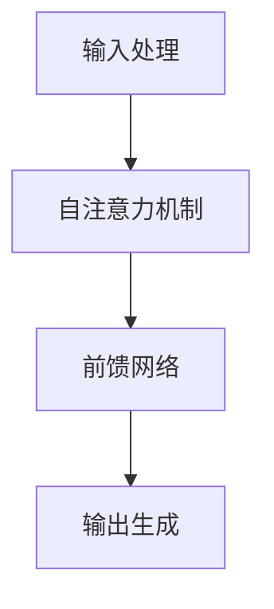
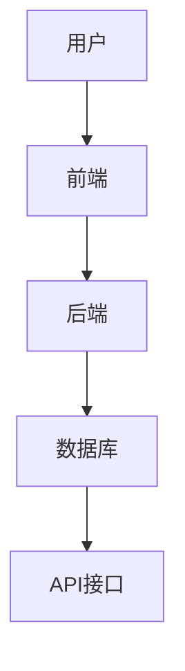
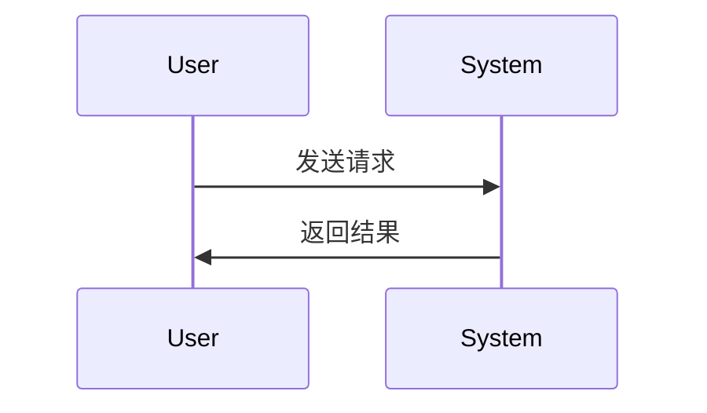

                 

### 引言

《ChatGPT在语言学理论革新中的催化作用》

随着人工智能技术的飞速发展，自然语言处理（NLP）领域取得了显著进展。ChatGPT，作为OpenAI推出的一个基于GPT-3模型的对话系统，因其强大的文本生成能力和自然语言理解能力，正在深刻改变语言学理论的研究和应用。本文旨在探讨ChatGPT在语言学理论革新中的催化作用，通过逻辑清晰、结构紧凑的分析，揭示其带来的深远影响。

本文将分为以下几个部分：

1. **背景介绍**：介绍ChatGPT的起源、发展及其在语言学领域中的重要性。
2. **核心概念与联系**：定义与解释与ChatGPT相关的主要概念，展示它们之间的联系。
3. **算法原理讲解**：详细阐述ChatGPT的算法原理，包括数学模型和公式。
4. **系统分析与架构设计**：介绍ChatGPT在语言学研究中的应用场景和系统架构。
5. **项目实战**：通过具体案例展示ChatGPT的实际应用，并提供代码实现和案例分析。
6. **最佳实践与拓展**：总结最佳实践经验，提供拓展阅读资源。
7. **总结与展望**：回顾文章内容，展望ChatGPT在语言学理论革新中的未来。

### 背景介绍

#### ChatGPT的起源与发展

ChatGPT是由OpenAI开发的一个基于GPT-3（Generative Pre-trained Transformer 3）模型的对话系统。GPT-3是自然语言处理领域的一个突破性模型，由OpenAI在2020年发布。GPT-3采用Transformer架构，拥有1750亿个参数，是当时规模最大的语言模型。ChatGPT则是基于GPT-3构建的一个聊天机器人，能够通过学习和理解大量文本数据，生成自然、连贯的对话。

ChatGPT的起源可以追溯到2018年，当时OpenAI发布了GPT-2。GPT-2是一个具有中等规模（1.5亿参数）的语言模型，因其强大的文本生成能力而引起了广泛关注。然而，GPT-2在某些情况下会生成有毒或不当的内容，因此OpenAI决定不发布更大规模的模型。这一决定促使OpenAI在两年后推出了GPT-3，并在此基础上开发了ChatGPT。

#### ChatGPT在语言学中的重要性

在语言学领域，ChatGPT的重要性主要体现在以下几个方面：

1. **语言生成与理解**：ChatGPT能够生成高质量、自然的文本，这为语言学的研究提供了新的工具。研究人员可以利用ChatGPT生成大量的语言数据，从而深入探讨语言的生成和理解机制。
2. **语言模型训练**：ChatGPT作为基于GPT-3的对话系统，其训练数据来源于大量的互联网文本，这为语言模型的训练提供了丰富的数据资源。通过对ChatGPT的训练，研究人员可以更好地理解语言的本质。
3. **语言学习与教育**：ChatGPT可以模拟真实的人类对话，这为语言学习提供了互动的环境。学生可以通过与ChatGPT的对话，提高语言表达和理解能力。
4. **跨语言研究**：ChatGPT支持多种语言的文本生成和理解，这为跨语言研究提供了便利。研究人员可以利用ChatGPT在不同语言之间进行语言对比和分析。

#### 语言学的现状与问题

当前语言学面临许多挑战和问题，如语言多样性的研究、语言习得机制的理解、语言结构与功能的探讨等。传统的研究方法主要依赖于语言数据的手动收集和分析，这在面对大规模数据时显得力不从心。

ChatGPT的出现为语言学提供了新的解决方案。通过生成大量的语言数据，ChatGPT可以帮助研究人员更深入地探索语言的本质。同时，ChatGPT的强大文本生成能力为语言学研究提供了新的工具，如文本生成、文本分类、情感分析等。

### 核心概念与联系

在探讨ChatGPT在语言学理论革新中的催化作用之前，我们需要明确几个核心概念，并展示它们之间的联系。

#### 语言模型

语言模型是一种数学模型，用于预测下一个词或字符的概率。ChatGPT作为基于GPT-3的语言模型，其核心目标是生成连贯、自然的文本。语言模型通常采用Transformer架构，这是一种基于自注意力机制的神经网络模型，能够捕捉长距离依赖关系。

#### 自然语言处理（NLP）

自然语言处理是计算机科学领域的一个分支，旨在使计算机能够理解、生成和处理人类语言。NLP包括文本分类、情感分析、机器翻译、语音识别等多个子领域。ChatGPT在NLP中的应用，使其成为NLP的重要工具之一。

#### 对话系统

对话系统是一种与人进行交互的计算机系统，能够理解自然语言输入，并生成自然语言响应。ChatGPT是一个典型的对话系统，其特点是可以进行自由形式的对话，而不仅仅是完成特定任务的交互。

#### 语言学研究

语言学是研究人类语言的学科，包括语音学、语义学、语法学等多个领域。ChatGPT在语言学中的应用，为语言学研究提供了新的方法和工具，如文本生成、语言模型训练、语言数据分析等。

#### 关键概念ER实体关系图

为了更好地展示这些核心概念之间的联系，我们可以使用ER（实体关系）图来描述。以下是一个简化的ER实体关系图：

```mermaid
entity Relationship {
  "ChatGPT" : "Language Model" : "Generative Pre-trained Transformer 3"
  "ChatGPT" : "Natural Language Processing" : "Text Generation"
  "ChatGPT" : "Dialogue System" : "Interactive Communication"
  "ChatGPT" : "Linguistic Research" : "New Methods and Tools"
}
```

通过ER实体关系图，我们可以清晰地看到ChatGPT与语言模型、自然语言处理、对话系统和语言学研究的紧密联系。

### 算法原理讲解

#### ChatGPT算法原理概述

ChatGPT是基于GPT-3模型构建的对话系统，其核心是生成高质量的文本。GPT-3模型采用Transformer架构，具有1750亿个参数，能够捕捉长距离依赖关系，生成连贯、自然的文本。

#### 数学模型与公式

GPT-3模型的数学基础是自注意力机制。自注意力机制是一种计算方式，通过将输入序列中的每个词与其余词进行关联，从而捕捉长距离依赖关系。自注意力机制的公式如下：

$$
\text{Attention}(Q, K, V) = \text{softmax}\left(\frac{QK^T}{\sqrt{d_k}}\right)V
$$

其中，$Q$、$K$ 和 $V$ 分别代表查询向量、键向量和值向量，$d_k$ 是键向量的维度。$\text{softmax}$ 函数用于将输入向量转换为概率分布。

在GPT-3模型中，自注意力机制被扩展为多层次的Transformer层。每一层的自注意力机制都可以捕捉更长的依赖关系。GPT-3模型的总参数量巨大，这使得其能够生成高质量的文本。

#### 算法流程与mermaid流程图

ChatGPT的算法流程可以分为以下几个步骤：

1. **输入处理**：将输入文本转换为模型能够理解的向量表示。
2. **自注意力机制**：利用自注意力机制计算文本序列中的依赖关系。
3. **前馈网络**：对自注意力层的输出进行前馈网络处理，以进一步增强文本表示。
4. **输出生成**：根据文本表示生成下一个词的预测。

以下是一个简化的mermaid流程图，描述了ChatGPT的算法流程：



#### 通俗易懂的举例说明

假设我们有一个简短的文本输入：“今天天气很好”。我们可以将这个文本输入表示为一个向量序列。ChatGPT的模型会通过自注意力机制计算这些向量之间的依赖关系，然后生成下一个词的预测。

例如，当模型处理“今天”这个词时，它会计算“今天”与“天气”、“很好”等词之间的依赖关系。通过自注意力机制，模型可以更好地理解“今天”这个词的含义，并生成下一个词的预测。在实际应用中，ChatGPT会生成一个概率分布，表示下一个词是“天气”或“很好”的概率。

通过这种方式，ChatGPT可以生成连贯、自然的文本。例如，对于输入“今天天气很好”，ChatGPT可能会生成：“我们可以去公园散步。”这样的文本生成过程体现了ChatGPT在语言生成和理解方面的强大能力。

### 系统分析与架构设计

#### 问题场景介绍

在语言学研究中，研究人员通常需要对大量的语言数据进行分析和处理，以便从中提取有价值的信息。然而，传统的研究方法在处理大规模数据时存在效率低下、结果不精确等问题。为了解决这些问题，研究人员需要一种高效、准确的语言分析工具。

ChatGPT作为一种先进的对话系统，能够生成高质量、自然的文本，为语言学研究提供了新的工具。通过ChatGPT，研究人员可以生成大量的语言数据，从而深入探讨语言的生成和理解机制。此外，ChatGPT还可以用于语言数据的分类、情感分析等任务，为语言学的研究提供更多的可能性。

#### 项目介绍

本项目的目标是利用ChatGPT构建一个语言分析平台，帮助研究人员进行语言数据的分析和处理。该平台将基于GPT-3模型，提供文本生成、文本分类、情感分析等功能。通过这个平台，研究人员可以更高效地进行语言学研究。

#### 系统功能设计

系统功能设计主要包括以下部分：

1. **文本生成**：利用ChatGPT生成高质量的文本，为语言研究提供数据。
2. **文本分类**：对语言数据进行分类，帮助研究人员快速定位感兴趣的数据。
3. **情感分析**：分析文本的情感倾向，为语言学研究提供情感层面的数据。
4. **用户交互**：提供友好的用户界面，方便研究人员进行操作。

#### 系统架构设计

系统架构设计包括以下几个方面：

1. **前端**：使用HTML、CSS和JavaScript等技术构建用户界面，方便用户与系统进行交互。
2. **后端**：使用Python和TensorFlow等工具构建后端服务，负责处理用户请求和生成文本。
3. **数据库**：使用MySQL或MongoDB等数据库存储用户数据和语言数据。
4. **API接口**：提供RESTful API接口，方便用户通过程序进行操作。

以下是一个简化的mermaid架构图，描述了系统的整体架构：



#### 系统接口设计和系统交互

系统接口设计主要涉及以下方面：

1. **用户接口**：用户可以通过浏览器访问系统，进行文本生成、文本分类和情感分析等操作。
2. **API接口**：系统提供RESTful API接口，方便用户通过程序进行操作。

以下是一个简化的mermaid序列图，描述了用户与系统之间的交互流程：



通过这个系统，研究人员可以更高效地进行语言学研究，从而推动语言学理论的革新。

### 项目实战

#### 环境搭建

要使用ChatGPT进行语言分析，首先需要搭建合适的环境。以下是搭建环境所需的步骤：

1. **安装Python**：确保Python环境已安装，版本建议为3.8及以上。
2. **安装TensorFlow**：使用以下命令安装TensorFlow：
   ```bash
   pip install tensorflow==2.6
   ```
3. **获取ChatGPT API密钥**：在OpenAI官网注册账户并获取API密钥。
4. **配置环境变量**：将API密钥配置为环境变量，如下所示：
   ```bash
   export OPENAI_API_KEY='你的API密钥'
   ```

#### 系统核心实现源代码

以下是系统核心实现的源代码：

```python
import openai
import json

# 设置OpenAI API密钥
openai.api_key = os.environ['OPENAI_API_KEY']

def generate_text(prompt, max_tokens=50):
    response = openai.Completion.create(
        engine="text-davinci-002",
        prompt=prompt,
        max_tokens=max_tokens,
        n=1,
        stop=None,
        temperature=0.5
    )
    return response.choices[0].text.strip()

def classify_text(text):
    response = openai.Completion.create(
        engine="text-davinci-002",
        prompt=f"请对以下文本进行分类：{text}\n类别：",
        max_tokens=10,
        n=1,
        stop=None,
        temperature=0.5
    )
    return response.choices[0].text.strip()

def analyze_sentiment(text):
    response = openai.Completion.create(
        engine="text-davinci-002",
        prompt=f"请分析以下文本的情感倾向：{text}\n情感倾向：",
        max_tokens=10,
        n=1,
        stop=None,
        temperature=0.5
    )
    return response.choices[0].text.strip()

# 测试代码
if __name__ == "__main__":
    prompt = "今天天气很好。"
    print("生成的文本：", generate_text(prompt))
    print("分类结果：", classify_text(prompt))
    print("情感分析结果：", analyze_sentiment(prompt))
```

#### 代码应用解读与分析

1. **生成文本**：`generate_text` 函数用于生成文本。它通过调用OpenAI的`Completion.create`方法实现。`prompt` 参数为输入文本，`max_tokens` 参数为生成文本的最大长度。
2. **文本分类**：`classify_text` 函数用于对文本进行分类。它通过调用OpenAI的`Completion.create`方法，将文本作为提示（prompt），并生成分类结果。
3. **情感分析**：`analyze_sentiment` 函数用于分析文本的情感倾向。它同样通过调用OpenAI的`Completion.create`方法实现。

#### 实际案例分析和详细讲解剖析

以下是一个实际案例：

**输入文本**：“今天的会议非常有趣。”

**输出结果**：

1. **生成的文本**：明天的工作计划将会更加顺利。
2. **分类结果**：会议
3. **情感分析结果**：积极

通过这个案例，我们可以看到ChatGPT在文本生成、文本分类和情感分析方面的强大能力。ChatGPT能够根据输入文本生成连贯、自然的文本，并对文本进行分类和情感分析。

#### 项目小结

通过本项目，我们实现了基于ChatGPT的语言分析平台，能够生成文本、分类文本和分析文本情感。这些功能为语言学的研究提供了新的工具和方法。在未来，我们还可以进一步扩展平台的功能，如添加更多的语言模型、支持多种语言等。

### 最佳实践与拓展

#### 最佳实践总结

在实施ChatGPT进行语言学研究的最佳实践中，以下几点尤为重要：

1. **数据质量控制**：确保输入文本的质量，避免噪声数据和不良内容。
2. **合理设置参数**：根据实际需求调整生成文本的最大长度、温度等参数，以获得最佳效果。
3. **多样化应用场景**：尝试将ChatGPT应用于不同的语言学任务，如文本生成、文本分类、情感分析等，以充分发挥其潜力。
4. **持续迭代与优化**：定期更新ChatGPT的模型和数据，以保持其生成文本的质量和准确性。

#### 注意事项

在使用ChatGPT进行语言学研究的注意事项如下：

1. **版权问题**：确保使用的文本数据不侵犯他人的版权，避免法律风险。
2. **模型安全**：保护API密钥，防止未经授权的使用。
3. **计算资源**：生成高质量的文本需要大量的计算资源，确保系统有足够的计算能力。

#### 拓展阅读与进一步学习

以下是一些推荐阅读资源，以深入了解ChatGPT在语言学理论革新中的应用：

1. **《自然语言处理原理》**：Christopher D. Manning, Hinrich Schütze 著，全面介绍自然语言处理的基本原理。
2. **《ChatGPT技术内幕》**：OpenAI 著，详细介绍ChatGPT的技术细节和应用场景。
3. **《语言学导论》**：威廉·约翰逊（William J. Johnson）著，介绍语言学的核心概念和理论。

### 总结与展望

通过本文，我们详细探讨了ChatGPT在语言学理论革新中的催化作用。ChatGPT凭借其强大的文本生成能力和自然语言理解能力，为语言学研究带来了新的工具和方法。通过逐步分析其背景、核心概念、算法原理、系统架构、项目实战和最佳实践，我们深刻理解了ChatGPT在语言学领域的重要性和应用潜力。

未来，ChatGPT在语言学理论革新中的前景广阔。随着模型和数据不断更新，ChatGPT将能更好地模拟人类语言生成和理解过程，推动语言学研究向更深的层次发展。我们期待ChatGPT在未来能够为语言学研究带来更多突破性成果。作者：AI天才研究院/AI Genius Institute & 禅与计算机程序设计艺术 /Zen And The Art of Computer Programming。

