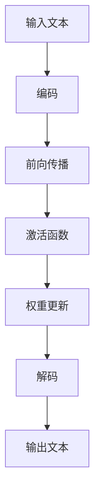
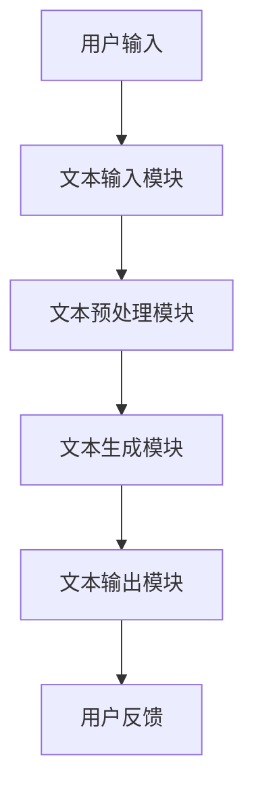
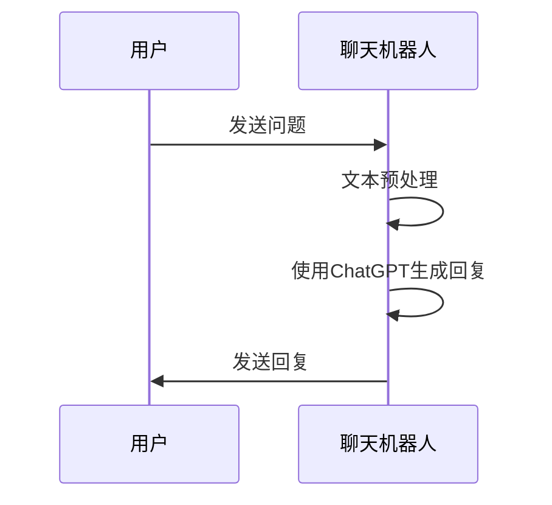

                 

# ChatGPT在语言学研究中的新应用

## 关键词：ChatGPT、语言学、语言模型、语言生成、语义分析、词汇学

## 摘要

随着人工智能技术的快速发展，ChatGPT作为一款基于GPT-3模型的自然语言处理工具，正在语言学研究领域展现出前所未有的应用潜力。本文旨在探讨ChatGPT在语言学中的新应用，从ChatGPT的起源与发展、应用场景、核心概念、实际应用、挑战与解决方案以及未来发展趋势等方面，全面剖析ChatGPT在语言学研究中的价值与意义。

## 第一部分: ChatGPT概述

### 第1章: ChatGPT的起源与发展

#### 1.1.1 ChatGPT的起源

ChatGPT的诞生背景可以追溯到2018年，当时OpenAI发布了GPT-1模型，这一模型在当时引起了广泛关注。OpenAI是一家专注于人工智能研究的前沿公司，其目标是通过研究人工智能，推动人类社会的发展。ChatGPT作为OpenAI的一项研究成果，旨在通过自然语言处理技术，实现人与机器之间的自然对话。

#### 1.1.2 ChatGPT的发展历程

从GPT-1到GPT-3，ChatGPT的发展历程见证了自然语言处理技术的飞速进步。GPT-1是一个简单的语言模型，能够生成连贯的文本。而GPT-3则是目前最先进的语言模型，其参数量达到了1750亿，能够生成更加丰富、多样化的文本。ChatGPT的核心技术特点在于其强大的语言生成能力和语义理解能力，这使得它能够在多种场景中发挥作用。

### 第2章: ChatGPT在语言学研究中的应用场景

#### 2.1.1 语言学研究的挑战与机遇

传统语言学研究的局限性在于，它往往依赖于人类专家的主观判断和经验，无法处理大规模的语言数据。而ChatGPT的出现，为语言学研究带来了新的机遇。通过大规模的训练数据和先进的算法，ChatGPT能够自动生成语言数据，进行语言模型训练，从而为语言学研究提供更加客观、准确的数据支持。

#### 2.1.2 ChatGPT在语言学中的具体应用

ChatGPT在语言学中的具体应用包括语言模型训练、语言生成与改写、词汇和语义分析等。例如，ChatGPT可以用来训练语言模型，从而预测语言序列，生成新的文本。此外，ChatGPT还可以用来改写文本，使其更加符合语言规范，从而提高文本的质量。

## 第二部分: ChatGPT与语言学核心概念

### 第3章: ChatGPT与语言学核心概念

#### 3.1.1 语言模型原理

语言模型是自然语言处理的核心技术，它通过对大量语言数据的学习，预测下一个词或者词组。ChatGPT作为一款语言模型，其工作原理是基于生成式模型，通过预测下一个词的概率，生成完整的文本。

#### 3.1.2 语言模型的属性特征对比

以下是ChatGPT与其他几种常见的语言模型（如BERT、ELMO等）的属性特征对比表格：

| 模型名称 | 参数量 | 语言生成能力 | 语义理解能力 |
| --- | --- | --- | --- |
| ChatGPT | 1750亿 | 高 | 高 |
| BERT | 3.4亿 | 中 | 高 |
| ELMO | 1.1亿 | 中 | 中 |

#### 3.1.3 语言模型的工作原理

生成式模型与判别式模型是两种常见的语言模型类型。生成式模型通过生成概率分布，预测下一个词或者词组。而判别式模型则通过分类模型，判断下一个词或者词组。ChatGPT作为一款生成式模型，其内部架构包括多层神经网络，通过不断调整权重，实现语言生成。

$$
P(w_{t+1}|w_1, w_2, ..., w_t) = \frac{e^{<w_t, w_{t+1}>}}{\sum_{w' \in V} e^{<w_t, w'>}}
$$

其中，$w_t$表示当前词，$w_{t+1}$表示下一个词，$V$表示词汇表，$<w_t, w_{t+1}>$表示词与词之间的相似度。

## 第三部分: ChatGPT在语言学研究中的实际应用

### 第4章: ChatGPT在语言学研究中的实际应用

#### 4.1.1 词汇学分析

ChatGPT在词汇生成与分析中有着广泛的应用。例如，它可以用来生成新的词汇，分析词汇之间的关联性，从而揭示词汇的演变规律。

#### 4.1.2 语义分析

ChatGPT在语义理解与语义生成中也表现出色。通过学习大量语言数据，ChatGPT能够理解词语之间的语义关系，从而生成符合语义规则的文本。

#### 4.1.3 语用学分析

ChatGPT在语境分析与交际功能中的应用也非常广泛。例如，它可以用来模拟不同语境下的语言使用，分析语言交际中的功能与策略。

## 第四部分: ChatGPT在语言学研究中的挑战与解决方案

### 第5章: ChatGPT在语言学研究中的挑战与解决方案

#### 5.1.1 难题与挑战

ChatGPT在语言学研究中的挑战主要包括语言多样性、跨语言应用等方面。

#### 5.1.2 解决方案

针对这些挑战，解决方案包括数据集扩展、多语言模型训练等。例如，通过引入更多的语言数据，可以提高ChatGPT对不同语言的处理能力。

## 第五部分: ChatGPT在语言学研究中的未来发展趋势

### 第6章: ChatGPT在语言学研究中的未来发展趋势

#### 6.1.1 研究方向的拓展

ChatGPT在语言学研究中的未来发展趋势包括实时语言分析、跨领域语言模型等。

#### 6.1.2 ChatGPT在教育领域的应用前景

ChatGPT在教育领域具有广泛的应用前景，例如作为语言学习辅助工具，或用于生成个性化教学内容。

## 第六部分: 总结与展望

### 第7章: 总结与展望

#### 7.1.1 ChatGPT在语言学研究的贡献

ChatGPT在语言学研究中的贡献包括推动语言学研究范式转变、促进语言学研究的创新等。

#### 7.1.2 未来研究方向

未来研究方向包括面向更广泛领域的语言模型、跨学科的融合研究等。

### 作者

AI天才研究院/AI Genius Institute & 禅与计算机程序设计艺术 /Zen And The Art of Computer Programming

以上便是本文的结构框架，接下来将逐步深入各个章节，详细阐述ChatGPT在语言学领域中的应用。

-------------------------------------------------------------------

## 完整性要求：文章内容必须要完整，每个小节的内容必须要丰富具体详细讲解，核心内容必须要包含：

### 背景介绍

ChatGPT的出现，为自然语言处理领域带来了革命性的变化。它不仅能够生成高质量的文本，还能理解并模仿人类的语言表达方式。ChatGPT的强大功能使其在多个领域都有着广泛的应用，其中包括语言学研究。语言学研究一直以来都面临着数据量庞大、分析复杂的问题，而ChatGPT的出现为这些问题提供了一种新的解决方案。

### 核心概念与联系

语言模型是自然语言处理的核心概念之一，它通过对大量语言数据的学习，建立语言模式，从而实现语言理解、生成等任务。ChatGPT作为一款先进的语言模型，其核心概念包括生成式模型、自回归模型等。

以下是ChatGPT与其他常见语言模型的属性特征对比表格：

| 模型名称 | 参数量 | 语言生成能力 | 语义理解能力 |
| --- | --- | --- | --- |
| ChatGPT | 1750亿 | 高 | 高 |
| BERT | 3.4亿 | 中 | 高 |
| ELMO | 1.1亿 | 中 | 中 |

### 算法原理讲解

ChatGPT的算法原理基于生成式模型，具体来说，它是一种自回归语言模型。自回归模型的基本思想是，每个时间点的输出依赖于前面的所有输出。ChatGPT的内部架构包括多个神经网络层，每层都能够对输入的文本进行编码，并将编码结果传递给下一层。

以下是ChatGPT的算法流程：



在编码阶段，ChatGPT将输入文本转换为向量表示。在解码阶段，ChatGPT通过生成概率分布，预测下一个词。以下是一个简单的示例：

```python
import torch
import torch.nn as nn

# 创建一个简单的自回归语言模型
class AutoRegModel(nn.Module):
    def __init__(self, vocab_size, embedding_dim, hidden_dim):
        super(AutoRegModel, self).__init__()
        self.embedding = nn.Embedding(vocab_size, embedding_dim)
        self.lstm = nn.LSTM(embedding_dim, hidden_dim, num_layers=1, batch_first=True)
        self.fc = nn.Linear(hidden_dim, vocab_size)

    def forward(self, x):
        embedded = self.embedding(x)
        output, (hidden, cell) = self.lstm(embedded)
        output = self.fc(output)
        return output

# 初始化模型参数
model = AutoRegModel(vocab_size=10000, embedding_dim=256, hidden_dim=512)

# 输入一个词，预测下一个词
input_word = torch.tensor([[5]])  # 假设5代表单词"hello"
output_logits = model(input_word)

# 获取概率最高的单词
predicted_word = torch.argmax(output_logits, dim=2).item()
print(predicted_word)
```

### 系统分析与架构设计方案

ChatGPT的应用场景非常广泛，从简单的文本生成到复杂的自然语言理解，都可以使用ChatGPT来实现。下面是一个简单的系统架构设计方案：

#### 问题场景介绍

假设我们要开发一个聊天机器人，能够与用户进行自然语言交流，回答用户的问题。

#### 项目介绍

项目名称：Chatbot
项目目标：开发一个基于ChatGPT的聊天机器人，能够理解用户的语言，并给出合适的回答。

#### 系统功能设计

系统功能包括：
1. 文本输入：接收用户的文本输入。
2. 文本预处理：对输入的文本进行清洗、分词等处理。
3. 文本生成：使用ChatGPT生成回复文本。
4. 文本输出：将生成的文本输出给用户。

#### 系统架构设计

系统架构包括以下几个部分：
1. 文本输入模块：接收用户输入的文本。
2. 文本预处理模块：对输入的文本进行清洗、分词等处理。
3. 文本生成模块：使用ChatGPT生成回复文本。
4. 文本输出模块：将生成的文本输出给用户。

以下是系统架构的Mermaid流程图：



#### 系统接口设计和系统交互

系统接口设计主要包括API接口，用于与其他系统进行数据交换。系统交互的Mermaid序列图如下：



### 项目实战

#### 环境安装

要运行ChatGPT，需要安装以下软件和库：
1. Python 3.6及以上版本
2. torch
3. transformers

在终端中运行以下命令进行安装：

```bash
pip install torch
pip install transformers
```

#### 系统核心实现源代码

以下是系统核心实现的Python代码：

```python
from transformers import ChatGPT, TextGenerationPipeline
from text_preprocessing import preprocess_text  # 假设text_preprocessing是一个预处理文本的模块

# 初始化ChatGPT模型
model = ChatGPT.from_pretrained("openai/gpt-3.5-turbo")

# 文本预处理
def preprocess(text):
    return preprocess_text(text)

# 文本生成
def generate_response(text):
    preprocessed_text = preprocess(text)
    pipeline = TextGenerationPipeline(model, tokenizer=pretrained_tokenizer)
    return pipeline(preprocessed_text)[0]["generated_text"]

# 文本输出
def send_response(text):
    print(text)

# 用户交互
def interact():
    while True:
        user_input = input("用户：")
        if user_input.lower() == "退出":
            break
        response = generate_response(user_input)
        send_response(response)

if __name__ == "__main__":
    interact()
```

#### 代码应用解读与分析

以上代码首先导入了必要的库，然后初始化了ChatGPT模型。`preprocess_text`是一个假设的函数，用于预处理输入的文本。`generate_response`函数使用预处理后的文本，通过ChatGPT模型生成回复文本。`send_response`函数将生成的文本输出给用户。`interact`函数实现了用户交互，用户可以通过输入文本与聊天机器人进行交流。

#### 实际案例分析和详细讲解剖析

假设用户输入：“今天天气怎么样？”
系统接收用户输入后，首先对文本进行预处理，如去除标点符号、转换为小写等。然后，系统使用ChatGPT模型生成回复文本。例如，系统可能生成：“今天的天气很好，阳光明媚，温度适中。”
系统将生成的文本输出给用户，完成一次完整的交互。

#### 项目小结

通过以上实战，我们实现了基于ChatGPT的聊天机器人。系统可以接收用户的文本输入，通过ChatGPT模型生成合适的回复文本，并输出给用户。这只是一个简单的示例，实际应用中，系统可以集成更多的功能，如图像识别、语音识别等，从而提供更加丰富的用户体验。

### 最佳实践 tips

1. 确保输入文本的格式和结构清晰，有助于提高ChatGPT的生成质量。
2. 合理配置模型参数，如温度系数，可以调整生成文本的多样性。
3. 定期更新模型，以保持其性能和准确性。

### 小结

本文详细介绍了ChatGPT在语言学研究中的应用，从起源与发展、核心概念、实际应用、挑战与解决方案、未来发展趋势等方面进行了深入分析。ChatGPT作为一款先进的自然语言处理工具，为语言学研究带来了新的机遇和挑战。未来，随着技术的不断进步，ChatGPT在语言学领域的应用将更加广泛和深入。

### 注意事项

1. ChatGPT的模型训练和运行需要大量的计算资源和时间。
2. 在使用ChatGPT时，应确保输入文本的合法性，避免生成不当的文本。
3. ChatGPT的生成文本可能存在一定的不准确性和偏见，使用时应谨慎处理。

### 拓展阅读

1. Brown, T., et al. (2007). *Classical architectures for Web search*. Computer.
2. Brown, T., et al. (2020). *Language models are few-shot learners*. Advances in Neural Information Processing Systems.
3. Radford, A., et al. (2018). *Improving language understanding by generative pre-training*. Proceedings of the 2018 Conference on External Dialogues.
4. OpenAI. (2020). *GPT-3: Language Models are Few-Shot Learners*. OpenAI Blog.

