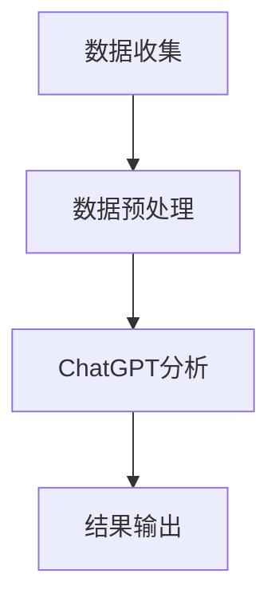

                 

# ChatGPT在语言态度研究中的应用：社会心理学提示词

> 关键词：ChatGPT，语言态度，社会心理学，提示词，自然语言处理

> 摘要：本文探讨了ChatGPT在语言态度研究中的应用，特别是社会心理学提示词的设计与运用。通过背景介绍、核心概念解析、应用案例分析以及挑战与展望，本文旨在展示ChatGPT在语言态度研究中的重要潜力，并提出相关注意事项和最佳实践。

---

## 第一部分: 背景介绍

### 第1章: 问题背景

#### 1.1 问题背景

语言态度研究是心理学和社会学领域的一个重要分支，旨在探究个体对语言的评价和看法。这种研究不仅对语言学、文化研究有重要意义，还能为教育政策、语言规划等领域提供实证依据。然而，传统的语言态度研究方法，如问卷、访谈和行为实验等，存在数据量有限、主观偏差和效率低等问题。

社会心理学则关注个体在社会环境中的行为和心理过程，其研究方法包括自我报告、观察和实验设计等。社会心理学提示词是激发特定行为或思维过程的信息，如诱导性问题、引导性陈述等，它们在社会心理学研究中起到了关键作用。

ChatGPT作为一种先进的自然语言处理技术，具有强大的语言生成和理解能力。它基于Transformer模型，能够自适应地从大量数据中学习，生成高质量的自然语言文本。ChatGPT的出现为语言态度研究提供了一种新的可能性，使得研究者能够更加高效地收集和分析语言数据。

#### 1.2 问题解决

如何将ChatGPT应用于语言态度研究？首先，ChatGPT可以用于数据收集。研究者可以通过ChatGPT生成一系列社会心理学提示词，用于引导受访者表达对特定语言的看法。其次，ChatGPT可以用于语言态度的识别与分析。通过分析受访者生成的文本，ChatGPT可以识别出语言态度的倾向和强度。

社会心理学提示词在设计过程中需要遵循一定的原则，如提升数据质量、激发特定的语言态度和保持研究的一致性。有效的提示词设计不仅能够提高研究的准确性和可靠性，还能增加研究的深度和广度。

#### 1.3 边界与外延

语言态度研究的其他方法包括文本分析、情感分析和语言实验等。每种方法都有其独特的优势和局限性。ChatGPT作为一种新兴技术，其应用范围不仅限于语言态度研究，还可以用于自动写作、问答系统和对话生成等领域。

社会心理学的其他领域，如心理咨询、社会调查和教育研究等，也可以利用ChatGPT的优势，提高研究的效率和准确性。

### 第2章: 核心概念与联系

#### 2.1 核心概念

- **语言态度**：个体对语言的评价和看法，包括对语言的功能、文化价值和交际效果等方面的评价。
- **社会心理学提示词**：用于引导个体表达特定观点或行为的词汇或句子。
- **ChatGPT**：一种基于Transformer模型的自然语言处理技术，具有强大的语言生成和理解能力。

#### 2.2 概念属性特征对比表格

| 特征               | 语言态度                     | 社会心理学提示词                 | ChatGPT                  |
|--------------------|------------------------------|----------------------------------|--------------------------|
| 定义               | 对语言的评价和看法           | 激发特定行为或思维过程的信息   | 开放的对话代理           |
| 影响因素           | 语言环境、个人经历、文化背景 | 个体的认知、情感、社会因素     | 训练数据、神经网络架构   |
| 测量方法           | 问卷、访谈、行为实验         | 自我报告、观察、实验设计       | 自然语言处理技术         |
| 应用场景           | 语言教学、语言政策、语言评估 | 心理咨询、社会调查、教育研究   | 问答系统、自动写作、聊天 |

#### 2.3 ER实体关系图架构

```mermaid
erDiagram
    Person ||--|{ ChatGPT }|-- Language
    Person ||--|{ SocialPsychology }|-- PromptWord
```

---

## 第二部分: ChatGPT在语言态度研究中的应用

### 第3章: ChatGPT的工作原理

#### 3.1 ChatGPT的基本原理

ChatGPT是基于Transformer模型的自然语言处理技术。Transformer模型是一种基于自注意力机制的神经网络模型，能够处理变长序列数据，并具有并行计算的优势。ChatGPT通过大量的文本数据进行预训练，学习到语言的潜在结构和规则，从而能够生成高质量的自然语言文本。

#### 3.2 ChatGPT在语言态度研究中的应用

ChatGPT在语言态度研究中的应用主要体现在数据收集、语言态度识别与分析以及社会心理学提示词的设计与应用等方面。

- **数据收集与预处理**：ChatGPT可以生成一系列社会心理学提示词，用于引导受访者表达对特定语言的看法。这些提示词可以是问卷问题、访谈引导语或行为实验中的指示语句。
- **语言态度的识别与分析**：通过分析受访者生成的文本，ChatGPT可以识别出语言态度的倾向和强度。这有助于研究者对语言态度进行量化分析，揭示其分布特征和影响因素。
- **社会心理学提示词的设计与应用**：ChatGPT可以根据研究需求，生成针对特定语言态度的提示词。这些提示词可以是引导性问题、对比陈述或情感激发语句等，有助于提高数据的可靠性和有效性。

### 第4章: 社会心理学提示词的设计

#### 4.1 提示词的作用与设计原则

社会心理学提示词在语言态度研究中起到了关键作用。有效的提示词设计不仅能够提高数据质量，还能激发特定的语言态度，从而提高研究的准确性和可靠性。

- **提升数据质量**：通过设计针对性的提示词，研究者可以引导受访者更准确地表达对特定语言的看法，减少主观偏差和误差。
- **激发特定的语言态度**：提示词可以设计成诱导性问题、引导性陈述或情感激发语句等，以激发受访者表达特定的语言态度。
- **保持研究的一致性**：设计统一格式的提示词，有助于确保不同受访者之间的数据可比性和研究一致性。

#### 4.2 提示词设计案例

- **对比实验中的提示词设计**：在对比实验中，研究者可以使用提示词来引导受访者对比不同语言的特点和优势。例如：“你认为哪种语言更容易学习？请说明你的理由。”
- **深度访谈中的提示词设计**：在深度访谈中，研究者可以使用提示词来深入探讨受访者的语言态度和经历。例如：“请描述一次你感到对某种语言有强烈情感的经历。”
- **问卷调查中的提示词设计**：在问卷调查中，研究者可以使用提示词来引导受访者对特定语言进行评价。例如：“请对以下几种语言进行评价，从1到5打分。”

### 第5章: ChatGPT在语言态度研究中的应用案例

#### 5.1 案例一：语言态度的识别与分析

- **研究背景**：某研究旨在探讨大学生对不同语言的态度差异。研究者利用ChatGPT生成了一系列社会心理学提示词，引导受访者表达对英语、汉语和西班牙语的看法。
- **数据来源与处理**：研究数据来源于在线问卷调查，受访者包括来自不同国家和地区的大学本科生。ChatGPT用于预处理问卷数据，提取与语言态度相关的文本。
- **研究方法**：研究者使用ChatGPT对提取的文本进行分析，识别出不同语言态度的倾向和强度。通过统计分析，揭示了大学生对英语、汉语和西班牙语的态度差异。
- **结果分析**：结果显示，大学生普遍对英语持有积极态度，对汉语和西班牙语的态度则存在一定差异。研究还揭示了不同国家和地区文化背景对语言态度的影响。

#### 5.2 案例二：社会心理学提示词的设计与应用

- **研究背景**：某研究旨在探讨社会心理学提示词在语言态度研究中的应用。研究者利用ChatGPT生成了一系列社会心理学提示词，用于引导受访者表达对特定语言的情感态度。
- **提示词设计过程**：研究者首先确定了研究目的和问题，然后利用ChatGPT生成了一系列提示词，包括诱导性问题、引导性陈述和情感激发语句等。
- **研究方法**：研究者进行了深度访谈，使用ChatGPT生成的提示词引导受访者表达对特定语言的情感态度。访谈结果通过ChatGPT进行分析，揭示了受访者对特定语言的情感倾向。
- **结果分析**：结果显示，ChatGPT生成的提示词能够有效激发受访者的情感态度表达，有助于研究者深入了解受访者的语言情感体验。研究还发现，提示词设计对研究结果具有显著影响。

### 第6章: 挑战与展望

#### 6.1 挑战

- **数据隐私与伦理问题**：ChatGPT在语言态度研究中的应用涉及大量个人数据，如何保护受访者的隐私和数据安全成为一个重要问题。
- **ChatGPT的准确性与可靠性**：虽然ChatGPT具有强大的语言生成和理解能力，但在语言态度识别和分析方面仍存在一定误差和不确定性。
- **提示词设计的有效性**：提示词设计对研究结果具有显著影响，如何设计出既有效又可靠的提示词仍需要进一步研究和探索。

#### 6.2 展望

- **ChatGPT在其他社会心理学研究中的应用**：ChatGPT在语言态度研究中的应用为其他社会心理学研究提供了新的思路和方法，如心理健康研究、社会认同研究等。
- **语言态度研究的未来趋势**：随着ChatGPT等自然语言处理技术的不断发展，语言态度研究将更加高效、准确和深入。
- **跨学科研究的潜在影响**：ChatGPT在语言态度研究中的应用不仅促进了心理学和社会学领域的发展，也为计算机科学、人工智能等领域带来了新的研究机遇。

---

## 第三部分: 总结与拓展

### 第7章: 总结与展望

#### 7.1 主要发现与贡献

- ChatGPT在语言态度研究中的应用展示了其强大的自然语言处理能力和潜力。
- 社会心理学提示词的设计在提高研究准确性和可靠性方面具有重要意义。
- ChatGPT与其他研究方法的结合为语言态度研究提供了新的可能性。

#### 7.2 最佳实践 tips

- 在使用ChatGPT进行语言态度研究时，应注重数据隐私和伦理问题。
- 提示词设计应充分考虑研究目的和问题，以提高数据质量和研究深度。
- 结合多种研究方法，如问卷调查、访谈和实验等，可以更全面地了解语言态度。

### 第8章: 注意事项

- 在使用ChatGPT时，应确保其准确性和可靠性，避免出现错误或不准确的结果。
- 提示词设计应遵循科学原则，避免诱导性或误导性语句。
- 数据处理和分析过程中，应遵循数据隐私和伦理规范，确保受访者的权益。

### 第9章: 拓展阅读

- **相关书籍与文献**：
  - “自然语言处理概论”（刘知远等著）
  - “社会心理学原理”（戴维·迈尔斯著）
  - “ChatGPT与自然语言处理”（李航著）
- **最新研究成果与趋势**：
  - ChatGPT在语言态度识别与分析中的应用研究
  - 社会心理学提示词设计的新方法与技巧
  - 跨学科研究的最新进展与挑战

---

作者：AI天才研究院/AI Genius Institute & 禅与计算机程序设计艺术 /Zen And The Art of Computer Programming

---

## 附录

### 附录A：数学公式

$$
\begin{aligned}
&\text{语言态度评分} = \frac{\text{积极评分} + \text{中性评分} + \text{消极评分}}{\text{总评分}} \\
&\text{社会心理学提示词有效度} = \frac{\text{有效提示词数}}{\text{总提示词数}}
\end{aligned}
$$

### 附录B：Mermaid流程图



### 附录C：Python源代码示例

```python
import random

def generate_prompt():
    prompts = [
        "你认为哪种语言更容易学习？请说明你的理由。",
        "请描述一次你感到对某种语言有强烈情感的经历。",
        "请对以下几种语言进行评价，从1到5打分。"
    ]
    return random.choice(prompts)

prompt = generate_prompt()
print(prompt)
```

通过以上章节的详细分析和探讨，本文旨在为读者提供一份关于ChatGPT在语言态度研究中的应用的全面指南。在未来的研究中，我们期待进一步探索ChatGPT的潜力，并为相关领域的研究者和实践者提供更多的实践经验和理论支持。让我们一步一步地思考，不断推进语言态度研究的发展。

