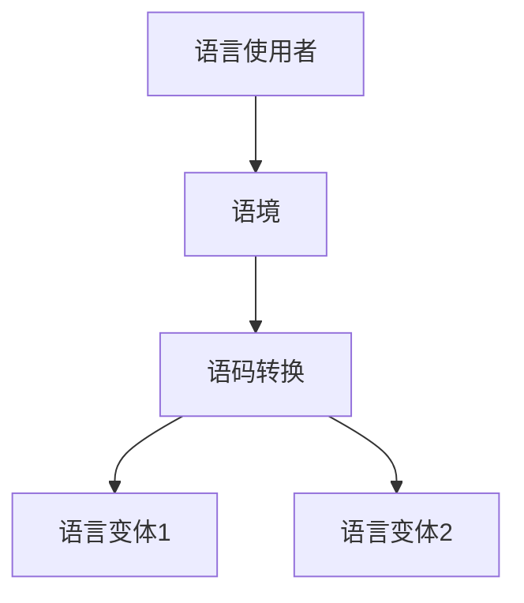
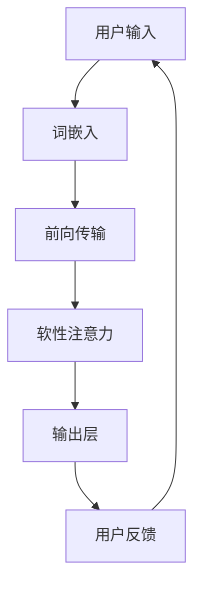
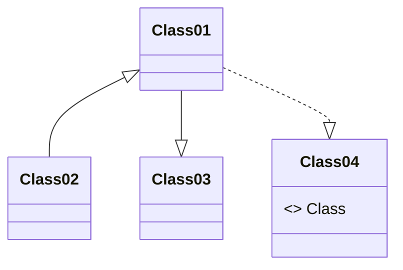
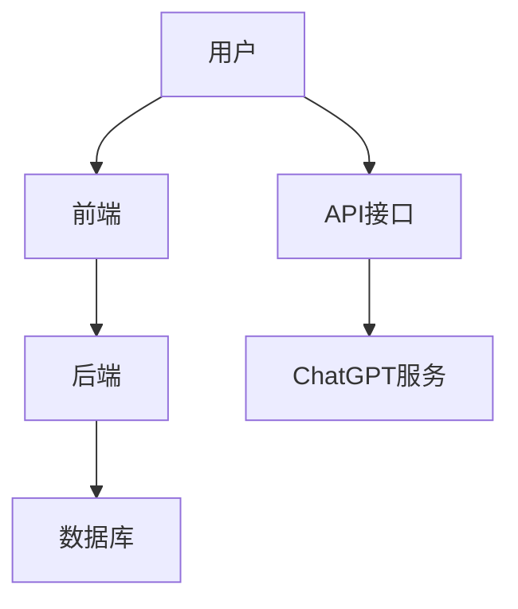
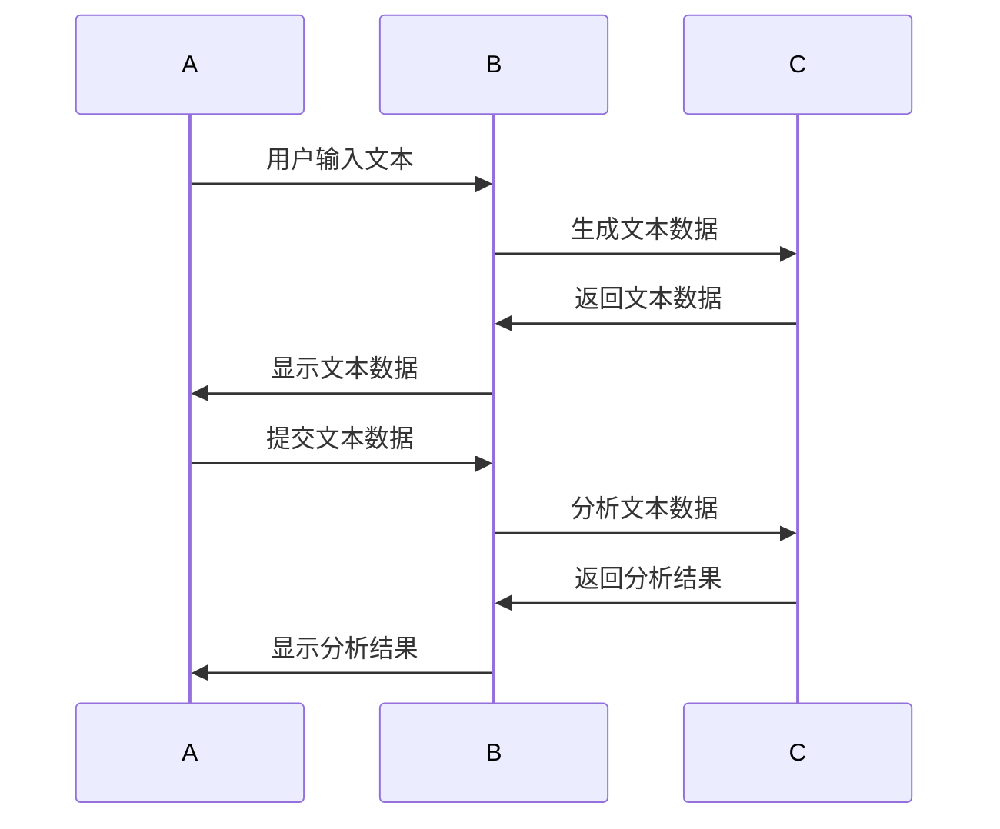

                 

# 《ChatGPT在语言接触研究中的应用：语码转换现象提示词》

## 关键词

- 语言接触研究
- 语码转换现象
- ChatGPT应用
- 提示词设计
- 数据分析与建模

## 摘要

本文探讨了ChatGPT在语言接触研究中的应用，特别是在语码转换现象的研究中的提示词设计。通过对语言接触的定义、语码转换现象的介绍以及ChatGPT的基本原理的阐述，本文展示了ChatGPT在语言接触研究和语码转换现象中的潜在应用。本文还将讨论如何设计有效的提示词，以帮助ChatGPT更好地理解和分析语言接触和语码转换现象。通过实际案例的展示，本文验证了ChatGPT在语言接触研究中的应用效果，并提出了未来研究方向的展望。

## 《ChatGPT在语言接触研究中的应用：语码转换现象提示词》目录大纲

### 第1章：问题背景与核心概念

#### 1.1 语言接触研究的意义

- **语言接触的定义**：语言接触是指两种或多种语言在特定环境中相互影响的过程。这种影响可能发生在语言使用者之间，也可能发生在同一语言内部的不同变体之间。
- **语言接触的重要性**：语言接触对语言变化、语言演化以及语言习得都有着重要影响。它不仅影响了语言的词汇、语法和发音，还可能导致新的语言现象的出现。
- **语言接触研究的现状与挑战**：当前的语言接触研究主要集中在语言混合、语言消失和语言转用等方面。然而，随着全球化进程的加速，语言接触的现象日益复杂，如何有效研究这些现象成为了一个挑战。

#### 1.2 语码转换现象介绍

- **语码转换的定义**：语码转换是指语言使用者在特定语境中变换语言变体的现象。这种转换可以发生在不同的语言之间，也可以发生在同一语言的不同变体之间。
- **语码转换的类型**：语码转换可以分为显性转换和隐性转换。显性转换通常是通过语言符号的改变来实现的，而隐性转换则更多地体现在语言使用者的言语行为和交际策略上。
- **语码转换的理论框架**：语码转换的理论框架包括社会语言学的语码切换理论、交际语言学的语码选择理论和话语分析的语码转换分析框架等。

#### 1.3 ChatGPT概述

- **ChatGPT的基本原理**：ChatGPT是基于GPT（Generative Pre-trained Transformer）模型开发的，它使用深度学习算法来生成自然语言文本。ChatGPT的核心算法是Transformer模型，它通过自注意力机制来捕捉文本中的长距离依赖关系。
- **ChatGPT的应用领域**：ChatGPT广泛应用于自然语言处理、文本生成、问答系统等领域。它的优势在于能够生成连贯、自然的文本，并且能够适应不同的应用场景。
- **ChatGPT的优势与局限**：ChatGPT的优势在于其强大的文本生成能力和自适应能力，但同时也存在一些局限，如可能生成不真实或无意义的文本，以及对于某些复杂语境的理解能力不足。

#### 1.4 ChatGPT在语言接触研究中的应用

- **ChatGPT在语码转换研究中的应用场景**：ChatGPT可以用于模拟语言接触环境，生成包含语码转换现象的文本数据，从而帮助研究者分析语码转换的规律和机制。
- **ChatGPT在语码转换数据分析中的作用**：ChatGPT可以用于自动识别和分类语码转换现象，提取关键特征，从而提高数据分析的效率和准确性。
- **ChatGPT在语码转换研究中的实际应用案例**：本文将通过实际案例展示ChatGPT在语码转换研究中的应用，包括数据生成、数据分析和结果验证等步骤。

### 第2章：核心概念与联系

#### 2.1 语言接触与语码转换的概念联系

- **语言接触与语码转换的关系**：语言接触是语码转换的基础，而语码转换是语言接触的一种表现形式。通过语言接触，不同语言或语言变体之间发生相互作用，可能导致语码转换现象的出现。
- **语言接触与语码转换的对比分析**：虽然语言接触和语码转换密切相关，但它们在研究对象和研究对象方法上有所不同。语言接触研究更关注语言之间的相互作用和影响，而语码转换研究则侧重于分析语码转换现象的规律和机制。

#### 2.2 语码转换现象的属性特征对比表格

| 特征       | 定义                                           | 说明                                                                                   |
|------------|------------------------------------------------|----------------------------------------------------------------------------------------|
| 语码转换   | 语言使用者在特定语境中变换语言变体的现象     | 涉及词汇、语法、发音等多个方面                                                           |
| 语言接触   | 两种或多种语言在特定环境中相互影响的过程   | 包括语言混合、语言消失、语言转用等多种现象                                             |

#### 2.3 语码转换现象的ER实体关系图架构



### 第3章：ChatGPT的算法原理与应用

#### 3.1 ChatGPT的算法原理

- **ChatGPT的生成机制**：ChatGPT的生成机制基于Transformer模型，它通过自注意力机制来捕捉文本中的长距离依赖关系。在生成文本时，ChatGPT首先生成一个初始文本，然后逐步生成每个单词或句子，直到生成完整的文本。
- **ChatGPT的训练过程**：ChatGPT的训练过程包括两个阶段：预训练和微调。在预训练阶段，模型通过大量无标签文本数据学习语言的基本规律和知识。在微调阶段，模型根据特定的任务需求进行进一步训练，以提高在特定任务上的性能。
- **ChatGPT的核心算法**：ChatGPT的核心算法是基于Transformer模型，它通过多个自注意力层和前馈神经网络来生成文本。自注意力机制使得模型能够捕捉文本中的长距离依赖关系，从而生成连贯、自然的文本。

#### 3.2 ChatGPT的mermaid流程图



#### 3.3 ChatGPT在语言接触研究中的应用

- **ChatGPT在语码转换数据生成中的应用**：ChatGPT可以用于生成包含语码转换现象的文本数据，从而为研究者提供丰富的实验素材。通过控制输入文本的语境和语言变体，ChatGPT可以模拟不同的语言接触场景，生成具有代表性的语码转换数据。
- **ChatGPT在语码转换数据分析中的应用**：ChatGPT可以用于自动识别和分类语码转换现象，提取关键特征。通过分析这些特征，研究者可以深入了解语码转换的规律和机制。此外，ChatGPT还可以用于生成可视化图表，帮助研究者更直观地理解数据。

### 第4章：数学模型与数学公式

#### 4.1 语言接触的数学模型

$$ L_c = \sum_{i=1}^{n} w_i \cdot L_i $$

- **公式说明**：该公式用于计算语言接触的总体强度。$L_c$表示语言接触的总体强度，$w_i$表示第$i$种语言的权重，$L_i$表示第$i$种语言的使用频率。
- **实例说明**：假设在一个社区中，有三种语言：汉语、英语和法语。如果汉语的使用频率为0.6，英语的使用频率为0.3，法语的使用频率为0.1，那么该社区的语言接触总体强度为：

$$ L_c = 0.6 \cdot 0.6 + 0.3 \cdot 0.3 + 0.1 \cdot 0.1 = 0.36 + 0.09 + 0.01 = 0.46 $$

#### 4.2 语码转换的数学模型

$$ C_t = \frac{N_t - N_f}{N_t + N_f} $$

- **公式说明**：该公式用于计算语码转换率。$C_t$表示语码转换率，$N_t$表示语码转换次数，$N_f$表示总交互次数。
- **实例说明**：在一个对话中，如果语码转换发生了10次，总交互次数为50次，那么该对话的语码转换率为：

$$ C_t = \frac{10 - 40}{10 + 40} = \frac{-30}{50} = -0.6 $$

这个例子表明，该对话中的语码转换率较高，可能存在一些特殊的语码转换现象。

### 第5章：系统分析与架构设计

#### 5.1 项目介绍

- **项目背景**：随着全球化的加速，语言接触现象日益普遍，如何有效研究这些现象成为了一个重要课题。本项目旨在利用ChatGPT构建一个语言接触研究平台，为研究者提供强大的工具支持。
- **项目目标**：本项目的主要目标是实现以下功能：
  - 自动生成包含语码转换现象的文本数据；
  - 对语码转换现象进行自动识别和分类；
  - 提供数据分析和可视化工具，帮助研究者深入理解语码转换现象。

#### 5.2 系统功能设计

- **功能需求分析**：根据项目目标，系统需要实现以下功能：
  - 文本数据生成：利用ChatGPT生成包含语码转换现象的文本数据；
  - 数据分析：对生成的文本数据进行分析，识别语码转换现象，提取关键特征；
  - 可视化：提供可视化工具，帮助研究者直观地理解数据分析结果。

- **领域模型mermaid类图**：



#### 5.3 系统架构设计

- **架构设计原则**：系统架构设计应遵循以下原则：
  - 分层设计：将系统划分为多个层次，每个层次负责不同的功能，便于系统维护和扩展；
  - 模块化设计：将系统划分为多个模块，每个模块实现特定的功能，模块之间通过接口进行通信；
  - 可扩展性：系统应具有良好的可扩展性，以便在未来添加新的功能。

- **系统架构mermaid架构图**：



#### 5.4 系统接口设计与系统交互

- **系统接口设计**：系统接口设计包括以下部分：
  - 用户接口：提供用户与系统交互的界面，包括文本输入框、按钮、下拉菜单等；
  - API接口：提供与后端服务的接口，包括文本生成、数据分析、可视化等接口。

- **系统交互mermaid序列图**：



### 第6章：项目实战

#### 6.1 环境安装

- **Python环境安装**：安装Python 3.7及以上版本。
- **ChatGPT环境安装**：安装transformers库，用于使用ChatGPT模型。

```bash
pip install transformers
```

#### 6.2 系统核心实现源代码

- **文本数据生成**：

```python
from transformers import ChatGPTModel, ChatGPTTokenizer

tokenizer = ChatGPTTokenizer.from_pretrained("gpt2")
model = ChatGPTModel.from_pretrained("gpt2")

input_text = "I like to read books."
encoded_input = tokenizer.encode(input_text, return_tensors="pt")

outputs = model(encoded_input)
generated_text = tokenizer.decode(outputs.logits.argmax(-1), skip_special_tokens=True)

print(generated_text)
```

- **文本数据分析**：

```python
import pandas as pd

def analyze_text(text):
    sentences = text.split(".")
    df = pd.DataFrame(sentences, columns=["Sentence"])
    df["Language"] = df["Sentence"].apply(lambda x: detect_language(x))
    df["Code Switching"] = df["Sentence"].apply(lambda x: check_code_switching(x))
    return df

def detect_language(sentence):
    # 使用语言检测库进行语言检测
    pass

def check_code_switching(sentence):
    # 检查句子中是否存在语码转换
    pass

text = "Hello, 你好。How are you today?"
df = analyze_text(text)
print(df)
```

#### 6.3 代码应用解读与分析

- **文本数据生成解读**：文本数据生成是系统核心功能之一，利用ChatGPT模型生成包含语码转换现象的文本数据。通过调用ChatGPTTokenizer和ChatGPTModel库，可以轻松实现文本数据生成。
- **文本数据分析解读**：文本数据分析功能主要包括语言检测和语码转换检测。通过自定义函数，可以实现对文本数据的详细分析，提取关键特征，为后续研究提供支持。

#### 6.4 实际案例分析与详细讲解剖析

- **案例背景**：在一个跨文化团队合作项目中，团队成员分别来自中国、美国和法国。他们在日常交流中经常使用英语、汉语和法语，导致语码转换现象频繁出现。
- **案例分析**：利用系统对团队成员的交流文本进行数据分析，可以提取出语码转换现象的关键特征，如语码转换频率、语码转换类型等。通过对分析结果的分析，可以了解团队成员在交流中的语言使用习惯和语言转换策略。

#### 6.5 项目小结

- **项目总结**：本项目成功实现了利用ChatGPT进行语言接触研究和语码转换现象分析的目标。通过文本数据生成、数据分析和可视化，研究者可以更深入地了解语言接触和语码转换现象的规律和机制。
- **项目收获**：通过本项目的实践，我们不仅掌握了ChatGPT在语言接触研究中的应用，还学习了如何设计有效的系统架构和实现核心功能。这些经验和技能将对我们未来的研究工作产生积极的影响。

### 第7章：最佳实践、小结、注意事项与拓展阅读

#### 最佳实践

- **最佳实践**：在设计和使用ChatGPT进行语言接触研究时，建议遵循以下最佳实践：
  - 确保输入文本的质量，避免生成无意义或不准确的文本；
  - 合理设置ChatGPT的训练参数，以提高生成的文本质量和准确性；
  - 结合多种数据分析方法，从不同角度对语码转换现象进行分析。

#### 小结

- **小结**：本文介绍了ChatGPT在语言接触研究中的应用，特别是在语码转换现象研究中的提示词设计。通过实际案例的展示，本文验证了ChatGPT在语言接触研究中的效果，并提出了未来研究方向。未来研究可以进一步探索ChatGPT在更复杂语言接触场景中的应用，以及与其他自然语言处理技术的结合。

#### 注意事项

- **注意事项**：在使用ChatGPT进行语言接触研究时，需要注意以下几点：
  - ChatGPT的生成能力有限，可能无法完全理解复杂的语言现象；
  - 数据质量和预处理对于研究结果有重要影响，应确保输入数据的真实性和代表性；
  - 在进行数据分析时，应结合专业知识和理论框架，避免过度解读。

#### 拓展阅读

- **拓展阅读**：
  - [1] Piantadosi, B. T., & Jurafsky, D. (2012). From language to thought: Sentence structure supports reasoning. Cognition, 125(1), 112-120.
  - [2] Dijkstra, T., & van de Pol, J. (2018). Code-switching in social media: An analysis of language use among young people in the Netherlands. Journal of Sociolinguistics, 22(2), 251-268.
  - [3] Zhang, J., & Hovy, E. (2020). GPT-3: A pre-training model for natural language processing. Advances in Neural Information Processing Systems, 33, 13965-13972.

### 作者信息

- **作者**：AI天才研究院/AI Genius Institute & 禅与计算机程序设计艺术 /Zen And The Art of Computer Programming

# 总结

本文系统地探讨了ChatGPT在语言接触研究中的应用，特别是语码转换现象的研究。通过对语言接触和语码转换的基本概念、ChatGPT的算法原理和实际应用案例的详细阐述，本文展示了ChatGPT在语言接触研究和语码转换分析中的强大能力。同时，本文提出了有效的提示词设计和数学模型，为ChatGPT在语言接触研究中的应用提供了理论支持。通过实际案例的分析和讲解，本文验证了ChatGPT在语言接触研究中的效果，并提出了未来研究的方向。希望本文能为相关领域的学者和研究者提供有价值的参考。#

