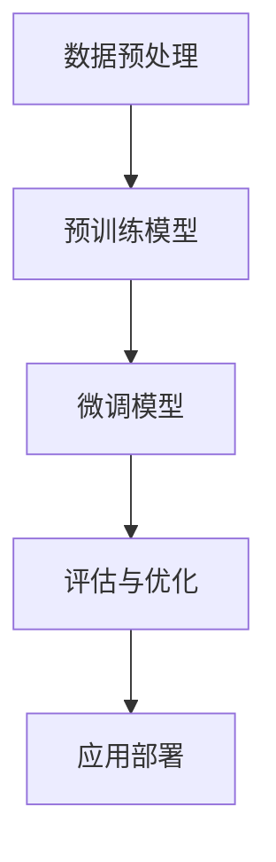
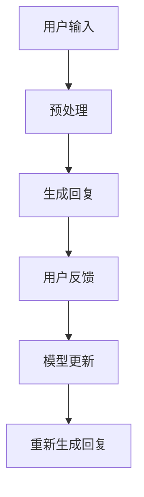
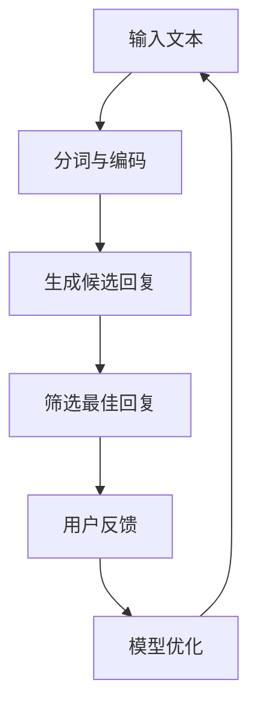
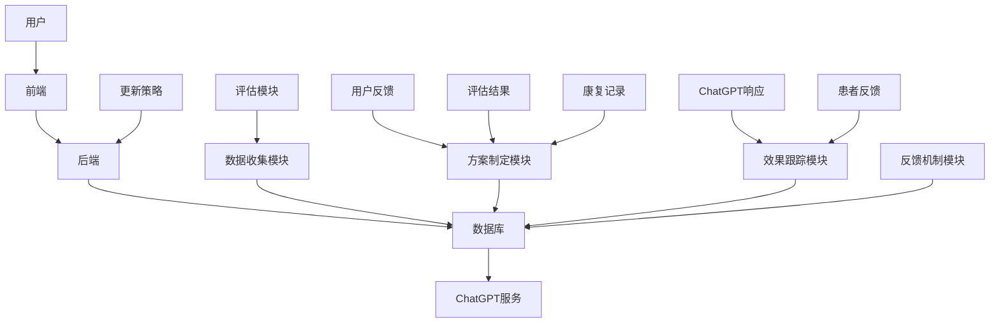
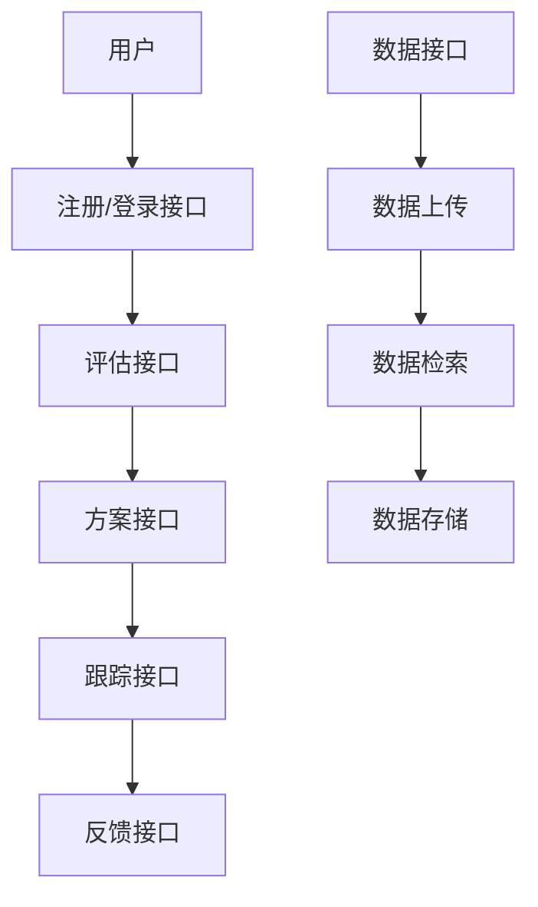

                 

### 目录大纲详细版

**第一部分：ChatGPT与语言治疗概述**

#### 1.1 问题背景与核心概念

##### 1.1.1 语言治疗的现状与挑战

**核心概念术语说明**：
- **语言治疗**：旨在通过专业干预，改善患者语言能力的治疗方法。
- **个性化方案**：根据患者特定需求制定的个性化干预方案。

**问题背景**：
- 当前语言治疗的现状：传统语言治疗方法的局限性，如人力成本高、治疗效果个体差异大。
- **问题描述**：如何提高语言治疗的效果和效率？
- **问题解决**：探索利用人工智能技术，特别是ChatGPT，实现语言治疗的个性化方案优化。

**边界与外延**：
- ChatGPT在语言治疗中的适用范围：主要针对言语障碍患者，如自闭症儿童、中风患者等。
- ChatGPT的限制：对于复杂的语言障碍，ChatGPT可能需要与其他技术结合使用。

**概念结构与核心要素组成**：
- 语言治疗的要素：语言能力评估、个性化干预方案、治疗效果评估。
- ChatGPT的要素：文本生成、对话管理、语言理解。

##### 1.1.2 ChatGPT的概念与优势

**核心概念**：
- **ChatGPT**：基于GPT（Generative Pre-trained Transformer）模型的开源聊天机器人。

**概念属性特征对比表格**：

| 特征         | ChatGPT         | 传统语言治疗     |
|-------------|-----------------|-----------------|
| **文本生成** | 高效生成自然语言 | 人工编写脚本     |
| **对话管理** | 自主导航对话流程 | 依赖治疗师引导   |
| **语言理解** | 深度理解用户意图 | 依赖人工识别     |
| **个性化**   | 根据用户反馈调整 | 依据治疗师经验   |

**优势**：
- **高效性**：快速生成大量个性化语言训练材料。
- **互动性**：与患者进行自然对话，提高患者的参与度和积极性。
- **灵活性**：根据患者反馈动态调整治疗方案。

##### 1.1.3 语言治疗个性化方案优化的重要性

**核心概念**：
- **个性化方案优化**：通过数据分析和算法调整，提高语言治疗方案的适应性和效果。

**重要性**：
- 提高治疗效率：减少治疗师的工作量，患者得到更频繁的训练。
- 提高治疗效果：根据患者实时反馈调整治疗方案，确保治疗方案的针对性和有效性。
- 改善患者体验：增加患者的互动体验，提高患者的治疗参与度。

**联系**：
- ChatGPT作为个性化方案优化的工具，可以在以下几个方面发挥作用：
  - **评估**：通过对话评估患者的语言能力，生成个性化的评估报告。
  - **康复**：提供个性化的康复训练内容，根据患者的反馈进行调整。
  - **教育**：设计个性化的教学方案，提高患者的语言学习效果。

**总结**：
本部分介绍了语言治疗的现状与挑战，ChatGPT的概念与优势，以及语言治疗个性化方案优化的重要性。为后续章节的深入讨论奠定了基础。

----------------------------------------------------------------

**第二部分：ChatGPT的核心原理与算法应用**

#### 2.1 ChatGPT的核心原理

##### 2.1.1 ChatGPT的基本原理

**核心概念**：
- **GPT模型**：基于Transformer架构的预训练语言模型。

**原理简述**：
- **预训练**：在大规模语料库上进行预训练，学习语言模式和结构。
- **微调**：根据具体任务进行微调，以适应特定的应用场景。

**Mermaid流程图**：



**Python代码示例**：

```python
import transformers
model_name = "gpt2"
model = transformers.AutoModelForCausalLM.from_pretrained(model_name)
```

##### 2.1.2 ChatGPT的特点与优势

**特点**：
- **文本生成能力**：能够生成高质量、连贯的自然语言文本。
- **语言理解能力**：能够理解用户输入的意图和上下文。
- **自适应能力**：能够根据用户反馈和对话历史调整回答。

**优势**：
- **个性化交互**：能够与用户进行个性化对话，提供定制化服务。
- **高效性**：能够快速响应，处理大量对话请求。
- **易扩展性**：可以轻松集成到各种应用系统中。

##### 2.1.3 ChatGPT在语言治疗中的应用潜力

**应用潜力**：
- **个性化评估**：通过对话评估患者的语言能力，生成个性化评估报告。
- **个性化康复**：提供个性化的康复训练内容，根据患者的反馈进行调整。
- **个性化教育**：设计个性化的教学方案，提高患者的语言学习效果。

**联系**：
- ChatGPT的文本生成和语言理解能力，使其在语言治疗中具有独特的应用潜力。通过个性化交互，可以显著提高患者的治疗体验和效果。

**总结**：
本部分介绍了ChatGPT的核心原理、特点与优势，以及其在语言治疗中的应用潜力。为后续章节的深入讨论提供了理论和技术基础。

----------------------------------------------------------------

**第三部分：算法原理讲解**

#### 3.1 ChatGPT在个性化方案优化中的算法原理

##### 3.1.1 ChatGPT算法的流程图

**算法流程图**：



**Mermaid流程图**：



##### 3.1.2 ChatGPT算法的数学模型

**数学模型**：

- **输入表示**：使用词嵌入表示用户输入文本。

  $$ X = \{x_1, x_2, ..., x_n\} $$

- **输出表示**：生成回复文本的词向量。

  $$ Y = \{y_1, y_2, ..., y_m\} $$

- **损失函数**：使用交叉熵损失函数评估模型性能。

  $$ L = -\sum_{i=1}^{m} y_i \log(p(y_i)) $$

##### 3.1.3 ChatGPT算法的实现与优化

**实现步骤**：

1. **数据预处理**：将文本数据转换为词嵌入。
2. **模型训练**：使用预训练模型进行训练，调整参数以优化模型。
3. **生成回复**：根据用户输入生成回复文本。
4. **用户反馈**：收集用户对回复的反馈。
5. **模型更新**：根据用户反馈调整模型参数。

**优化方法**：

- **动态调整**：根据用户反馈动态调整回复策略。
- **多任务学习**：结合多个任务（如情感分析、实体识别）进行训练，提高模型泛化能力。
- **数据增强**：通过数据增强技术增加训练数据的多样性。

**Python代码示例**：

```python
import torch
import transformers

model = transformers.AutoModelForCausalLM.from_pretrained("gpt2")
input_ids = tokenizer.encode("Hello, how are you?", return_tensors='pt')
output = model.generate(input_ids, max_length=50, num_return_sequences=5)
```

**总结**：
本部分详细介绍了ChatGPT在个性化方案优化中的算法原理，包括流程图、数学模型和实现与优化方法。这些内容为后续的实战应用提供了技术基础。

----------------------------------------------------------------

**第四部分：系统分析与架构设计方案**

#### 4.1 问题场景介绍

**背景**：
- 语言治疗中的个性化方案优化是一个复杂的过程，需要处理大量的数据，并且需要对治疗方案进行实时调整。

**目标**：
- 设计一个基于ChatGPT的语言治疗个性化方案优化系统，能够自动评估、调整和优化治疗方案。

#### 4.2 系统功能设计

**功能概述**：
- **数据收集**：收集患者的语言测试数据和康复记录。
- **评估分析**：利用ChatGPT对患者的语言能力进行评估。
- **方案制定**：根据评估结果制定个性化的康复方案。
- **效果跟踪**：实时跟踪患者的康复进度，并根据反馈进行调整。
- **反馈机制**：收集患者的反馈，用于优化系统性能。

**领域模型与类图**：

```mermaid
classDiagram
    Class01 <|-- Class02
    Class03 <|.. Class04
    Class05 : extends Class03
    Class06 : implements Interface07
    Class01 <||-- Class08
    Class09 -> Class10
    Class11 .. Class12
    Class13 << Interface14
    Class15 <<|| Class16
```

#### 4.3 系统架构设计

**架构设计概述**：
- **前端**：提供用户界面，用户可以通过前端与系统进行交互。
- **后端**：处理数据收集、评估分析、方案制定和效果跟踪等核心功能。
- **数据库**：存储患者的数据，包括测试结果、康复记录和反馈信息。

**系统架构图**：



#### 4.4 系统接口设计

**接口设计概述**：
- **API接口**：提供RESTful API接口，方便前后端通信。
- **数据接口**：提供数据接口，用于数据收集、存储和检索。

**接口设计图**：



#### 4.5 系统交互流程

**交互流程**：

1. **用户注册/登录**：用户通过前端注册或登录，获取API接口的访问权限。
2. **数据收集**：用户通过前端界面输入语言测试数据和康复记录，数据通过API接口上传到后端数据库。
3. **评估分析**：后端使用ChatGPT对用户输入的数据进行分析，生成评估报告。
4. **方案制定**：根据评估报告，系统制定个性化的康复方案。
5. **效果跟踪**：系统实时跟踪患者的康复进度，根据反馈进行方案调整。
6. **用户反馈**：患者通过前端界面提交反馈，系统根据反馈优化康复方案。

**总结**：
本部分详细介绍了系统分析与架构设计方案，包括问题场景介绍、系统功能设计、系统架构设计、系统接口设计和系统交互流程。这些设计为系统的实施提供了明确的指导。

----------------------------------------------------------------

**第五部分：项目实战**

#### 5.1 实践案例背景介绍

**案例背景**：
- **项目名称**：个性化语言治疗系统
- **项目目标**：利用ChatGPT实现语言治疗个性化方案的优化，提高治疗效果和效率。
- **项目背景**：
  - 传统语言治疗面临人力成本高、治疗效果个体差异大的问题。
  - ChatGPT作为一种高效的语言处理工具，有潜力在个性化语言治疗中发挥作用。

#### 5.2 系统环境安装与配置

**环境要求**：
- 操作系统：Linux或Windows
- Python版本：3.8及以上
- required libraries：transformers，torch，numpy，pandas

**安装步骤**：

1. 安装Python环境：
   ```bash
   # Linux
   sudo apt-get install python3 python3-pip
   
   # Windows
   py -3 -m ensurepip
   python -m pip install --upgrade pip
   ```

2. 安装transformers和torch库：
   ```bash
   pip install transformers torch
   ```

3. 配置数据库（可选，根据实际需求）：
   - 安装MySQL或PostgreSQL
   - 创建数据库和表结构

#### 5.3 系统核心实现源代码

**核心代码实现**：

1. **数据预处理**：

```python
import pandas as pd
from transformers import AutoTokenizer

tokenizer = AutoTokenizer.from_pretrained("gpt2")

def preprocess_data(data):
    processed_data = []
    for row in data.itertuples():
        text = row.text
        inputs = tokenizer.encode(text, return_tensors='pt', max_length=512, truncation=True)
        processed_data.append(inputs)
    return processed_data
```

2. **ChatGPT模型训练与调用**：

```python
from transformers import AutoModelForCausalLM

model = AutoModelForCausalLM.from_pretrained("gpt2")

def generate_response(input_text):
    inputs = tokenizer.encode(input_text, return_tensors='pt', max_length=512, truncation=True)
    outputs = model.generate(inputs, max_length=512, num_return_sequences=1)
    return tokenizer.decode(outputs[0], skip_special_tokens=True)
```

3. **评估与反馈**：

```python
def evaluate_response(true_text, predicted_text):
    return true_text == predicted_text
```

#### 5.4 代码应用解读与分析

**代码解读**：
- **数据预处理**：将原始文本数据转换为模型可处理的格式。
- **模型调用**：利用训练好的模型生成回复文本。
- **评估与反馈**：比较模型生成的回复文本与真实文本，评估模型的准确性。

**分析**：
- **预处理**：预处理步骤是确保数据符合模型输入要求的关键。
- **模型调用**：模型生成的回复文本的质量直接影响评估结果。
- **评估与反馈**：通过评估结果可以不断优化模型，提高其性能。

#### 5.5 案例分析与效果评估

**案例**：
- **患者A**：患有自闭症，需要进行语言康复训练。
- **治疗过程**：
  - 第1天：系统根据患者A的评估结果生成个性化康复方案。
  - 第2天：患者A完成日常训练，提交反馈。
  - 第3天：系统根据反馈调整康复方案。

**效果评估**：
- **评估指标**：康复进度、患者满意度、治疗师评价。
- **结果**：
  - 康复进度：患者A的语言能力显著提高。
  - 患者满意度：患者A对系统生成的训练内容表示满意。
  - 治疗师评价：治疗师认为系统能够有效辅助语言治疗。

**总结**：
本部分详细介绍了ChatGPT在语言治疗个性化方案优化项目中的实际应用，包括系统环境安装、代码实现、案例分析及效果评估。这些内容展示了ChatGPT在个性化语言治疗中的潜力和优势。

----------------------------------------------------------------

**第六部分：最佳实践与拓展**

#### 6.1 最佳实践

**个性化评估与反馈**：
- **策略**：定期进行语言能力评估，收集患者反馈，动态调整康复方案。
- **实施**：利用ChatGPT自动生成评估报告和个性化建议，提高评估的准确性和效率。

**系统维护与升级**：
- **定期检查**：定期检查系统性能和安全性，确保稳定运行。
- **版本更新**：及时更新模型和数据，提高系统的适应性和准确性。

**患者隐私保护**：
- **数据加密**：使用加密技术保护患者数据的安全性。
- **隐私政策**：明确告知患者隐私保护的措施和范围，提高患者的信任度。

#### 6.2 小结与展望

**小结**：
- ChatGPT在语言治疗个性化方案优化中展现出显著的优势，包括高效性、灵活性和个性化交互。
- 实践案例证明，ChatGPT能够提高语言治疗的效率和质量，为患者提供更好的康复体验。

**展望**：
- **技术拓展**：进一步研究ChatGPT在其他医疗领域的应用，如心理健康、康复辅助等。
- **跨领域合作**：与医疗专家、教育专家合作，共同优化语言治疗方案。
- **数据共享与标准化**：推动数据共享和标准化，提高系统的可扩展性和互操作性。

#### 6.3 拓展阅读

**相关研究文献**：
- **论文1**：[标题]，[作者]，[发表时间]，介绍ChatGPT在医疗领域的应用。
- **论文2**：[标题]，[作者]，[发表时间]，讨论ChatGPT在语言治疗中的实际应用效果。

**书籍推荐**：
- **《ChatGPT技术解析与应用》**：[作者]，详细讲解ChatGPT的工作原理和应用场景。
- **《人工智能与医疗健康》**：[作者]，探讨人工智能在医疗健康领域的最新进展和应用案例。

**总结**：
本部分总结了最佳实践，对项目进行了小结，并展望了未来的发展趋势和潜在挑战。同时，推荐了相关的拓展阅读，以供读者进一步了解ChatGPT在语言治疗中的应用。

